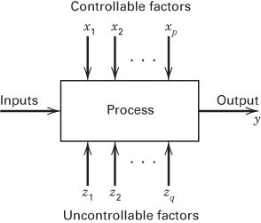
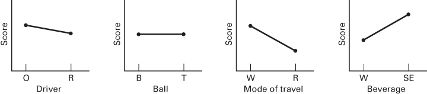
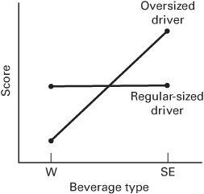
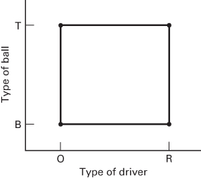
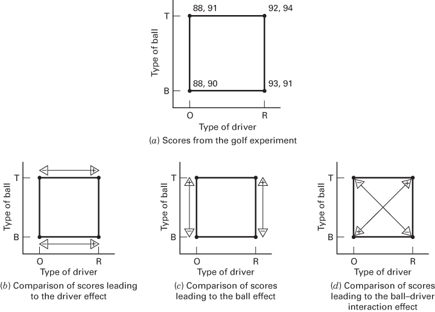
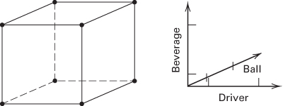
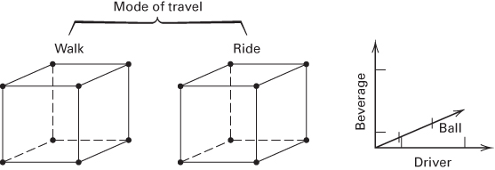
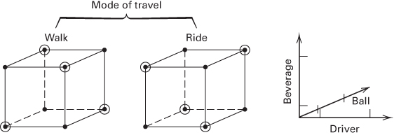
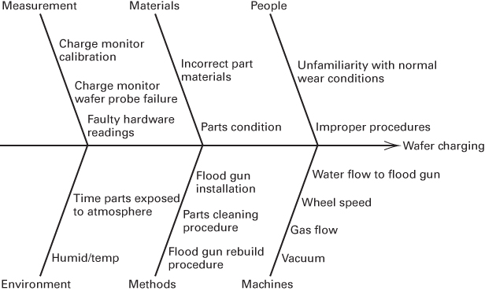
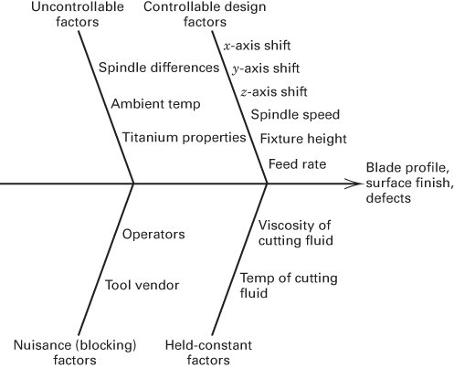

CHAPTER 1

# Introduction

## CHAPTER LEARNING OBJECTIVES

1. Learn about the objectives of experimental design and the role it plays in the knowledge discovery process.

2. Learn about different strategies of experimentation.

3. Understand the role that statistical methods play in designing and analyzing experiments.

4. Understand the concepts of main effects of factors and interaction between factors.

5. Know about factorial experiments.

6. Know the practical guidelines for designing and conducting experiments.

## 1.1 Strategy of Experimentation

Observing a system or process while it is in operation is an important part of the learning process and is an integral part of understanding and learning about how systems and processes work. The great New York Yankees catcher Yogi Berra said that “. . . you can observe a lot just by watching.” However, to understand what happens to a process when you change certain input factors, you have to do more than just watch—you actually have to change the factors. This means that to really understand cause-and-effect relationships in a system you must deliberately change the input variables to the system and observe the changes in the system output that these changes to the inputs produce. In other words, you need to conduct experiments on the system. Observations on a system or process can lead to theories or hypotheses about what makes the system work, but experiments of the type described above are required to demonstrate that these theories are correct.

Investigators perform experiments in virtually all fields of inquiry, usually to discover something about a particular process or system or to confirm previous experience or theory. Each experimental run is a test. More formally, we can define an experiment as a test or series of runs in which purposeful changes are made to the input variables of a process or system so that we may observe and identify the reasons for changes that may be observed in the output response. We may want to determine which input variables are responsible for the observed changes in the response, develop a model relating the response to the important input variables, and use this model for process or system improvement or other decision-making.

This book is about planning and conducting experiments and about analyzing the resulting data so that valid and objective conclusions are obtained. Our focus is on experiments in engineering and science. Experimentation plays an important role in technology commercialization and product realization activities, which consist of new product design and formulation, manufacturing process development, and process improvement. The objective in many cases may be to develop a robust process, that is, a process affected minimally by external sources of variability. There are also many applications of designed experiments in a nonmanufacturing or non-product-development setting, such as marketing, service operations, and general business operations. Designed experiments are a key technology for innovation. Both breakthrough innovation and incremental innovation activities can benefit from the effective use of designed experiments.

As an example of an experiment, suppose that a metallurgical engineer is interested in studying the effect of two different hardening processes, oil quenching and saltwater quenching, on an aluminum alloy. Here the objective of the experimenter (the engineer) is to determine which quenching solution produces the maximum hardness for this particular alloy. The engineer decides to subject a number of alloy specimens or test coupons to each quenching medium and measure the hardness of the specimens after quenching. The average hardness of the specimens treated in each quenching solution will be used to determine which solution is best.

As we consider this simple experiment, a number of important questions come to mind:

1. Are these two solutions the only quenching media of potential interest?

2. Are there any other factors that might affect hardness that should be investigated or controlled in this experiment (such as the temperature of the quenching media)?

3. How many coupons of alloy should be tested in each quenching solution?

4. How should the test coupons be assigned to the quenching solutions, and in what order should the data be collected?

5. What method of data analysis should be used?

6. What difference in average observed hardness between the two quenching media will be considered important?

All of these questions, and perhaps many others, will have to be answered satisfactorily before the experiment is performed.

Experimentation is a vital part of the scientific (or engineering) method. Now there are certainly situations where the scientific phenomena are so well understood that useful results including mathematical models can be developed directly by applying these well-understood principles. The models of such phenomena that follow directly from the physical mechanism are usually called mechanistic models. A simple example is the familiar equation for current flow in an electrical circuit, Ohm's law, E = IR. However, most problems in science and engineering require observation of the system at work and experimentation to elucidate information about why and how it works. Well-designed experiments can often lead to a model of system performance; such experimentally determined models are called empirical models. Throughout this book, we will present techniques for turning the results of a designed experiment into an empirical model of the system under study. These empirical models can be manipulated by a scientist or an engineer just as a mechanistic model can.

A well-designed experiment is important because the results and conclusions that can be drawn from the experiment depend to a large extent on the manner in which the data were collected. To illustrate this point, suppose that the metallurgical engineer in the above experiment used specimens from one heat in the oil quench and specimens from a second heat in the saltwater quench. Now, when the mean hardness is compared, the engineer is unable to say how much of the observed difference is the result of the quenching media and how much is the result of inherent differences between the heats. $^{1}$ Thus, the method of data collection has adversely affected the conclusions that can be drawn from the experiment.

■ FIGURE 1.1 General model of a process or system

In general, experiments are used to study the performance of processes and systems. The process or system can be represented by the model shown in Figure 1.1. We can usually visualize the process as a combination of operations, machines, methods, people, and other resources that transforms some input (often a material) into an output that has one or more observable response variables. Some of the process variables and material properties $x_{1}, x_{2}, \ldots, x_{p}$ are controllable, whereas other variables such as environmental factors or some material properties $z_{1}, z_{2}, \ldots, z_{q}$ are uncontrollable (although they may be controllable for purposes of a test). The objectives of the experiment may include the following:

1. Determining which variables are most influential on the response y

2. Determining where to set the influential $x$ 's so that $y$ is almost always near the desired nominal value

3. Determining where to set the influential $x$ 's so that variability in $y$ is small

4. Determining where to set the influential $x$ 's so that the effects of the uncontrollable variables $z_1, z_2, \ldots, z_q$ are minimized.

As you can see from the foregoing discussion, experiments often involve several factors. Usually, an objective of the experimenter is to determine the influence that these factors have on the output response of the system. The general approach to planning and conducting the experiment is called the strategy of experimentation. An experimenter can use several strategies. We will illustrate some of these with a very simple example.

I really like to play golf. Unfortunately, I do not enjoy practicing, so I am always looking for a simpler solution to lowering my score. Some of the factors that I think may be important, or that may influence my golf score, are as follows:

1. The type of driver used (oversized or regular sized)

2. The type of ball used (balata or three piece)

3. Walking and carrying the golf clubs or riding in a golf cart

4. Drinking water or drinking "something else" while playing

5. Playing in the morning or playing in the afternoon

6. Playing when it is cool or playing when it is hot

7. The type of golf shoe spike worn (metal or soft)

8. Playing on a windy day or playing on a calm day.

Obviously, many other factors could be considered, but let's assume that these are the ones of primary interest. Furthermore, based on long experience with the game, I decide that factors 5 through 8 can be ignored; that is, these factors are not important because their effects are so small that they have no practical value. Engineers, scientists, and business analysts often must make these types of decisions about some of the factors they are considering in real experiments.

Now, let's consider how factors 1 through 4 could be experimentally tested to determine their effect on my golf score. Suppose that a maximum of eight rounds of golf can be played over the course of the experiment. One approach would be to select an arbitrary combination of these factors, test them, and see what happens. For example, suppose the oversized driver, balata ball, golf cart, and water combination is selected, and the resulting score is 87. During the round, however, I noticed several wayward shots with the big driver (long is not always good in golf), and, as a result, I decide to play another round with the regular-sized driver, holding the other factors at the same levels used previously. This approach could be continued almost indefinitely, switching the levels of one or two (or perhaps several) factors for the next test, based on the outcome of the current test. This strategy of experimentation, which we call the best-guess approach, is frequently used in practice by engineers and scientists. It often works reasonably well, too, because the experimenters often have a great deal of technical or theoretical knowledge of the system they are studying, as well as considerable practical experience. The best-guess approach has at least two disadvantages. First, suppose the initial best-guess does not produce the desired results. Now the experimenter has to take another guess at the correct combination of factor levels. This could continue for a long time, without any guarantee of success. Second, suppose the initial best-guess produces an acceptable result. Now the experimenter is tempted to stop testing, although there is no guarantee that the best solution has been found.

Another strategy of experimentation that is used extensively in practice is the one-factor-at-a-time (OFAT) approach. The OFAT method consists of selecting a starting point, or baseline set of levels, for each factor, and then successively varying each factor over its range with the other factors held constant at the baseline level. After all tests are performed, a series of graphs are usually constructed showing how the response variable is affected by varying each factor with all other factors held constant. Figure 1.2 shows a set of these graphs for the golf experiment, using the oversized driver, balata ball, walking, and drinking water levels of the four factors as the baseline. The interpretation of these graphs is straightforward; for example, because the slope of the mode of travel curve is negative, we would conclude that riding improves the score. Using these OFAT graphs, we would select the optimal combination to be the regular-sized driver, riding, and drinking water. The type of golf ball seems unimportant.

The major disadvantage of the OFAT strategy is that it fails to consider any possible interaction between the factors. An interaction is the failure of one factor to produce the same effect on the response at different levels of another factor. Figure 1.3 shows an interaction between the type of driver and the beverage factors for the golf experiment. Notice that if I use the regular-sized driver, the type of beverage consumed has virtually no effect on the score, but if I use the oversized driver, much better results are obtained by drinking water instead of “something else.” Interactions between factors are very common, and if they occur, the OFAT strategy will usually produce poor results. Many people do not recognize this, and, consequently, OFAT experiments are run frequently in practice. (Some individuals actually think that this strategy is related to the scientific method or that it is a “sound” engineering principle.) OFAT experiments are always less efficient than other methods based on a statistical approach to design. We will discuss this in more detail in Chapter 5.

The correct approach to dealing with several factors is to conduct a factorial experiment. This is an experimental strategy in which factors are varied together, instead of one at a time. The factorial experimental design concept is extremely important, and several chapters in this book are devoted to presenting basic factorial experiments and a number of useful variations and special cases.

■ FIGURE 1.2 Results of the one-factor-at-a-time strategy for the golf experiment

■ FIGURE 1.3
Interaction between type of driver and type of beverage for the golf experiment

  
■ FIGURE 1.4 A two-factor factorial experiment involving type of driver and type of ball

To illustrate how a factorial experiment is conducted, consider the golf experiment and suppose that only two factors, type of driver and type of ball, are of interest. Figure 1.4 shows a two-factor factorial experiment for studying the joint effects of these two factors on my golf score. Notice that this factorial experiment has both factors at two levels and that all possible combinations of the two factors across their levels are used in the design. Geometrically, the four runs form the corners of a square. This particular type of factorial experiment is called a $2^{2}$ factorial design (two factors, each at two levels). Because I can reasonably expect to play eight rounds of golf to investigate these factors, a reasonable plan would be to play two rounds of golf at each combination of factor levels shown in Figure 1.4. An experimental designer would say that we have replicated the design twice. This experimental design would enable the experimenter to investigate the individual effects of each factor (or the main effects) and to determine whether the factors interact.

Figure 1.5a shows the results of performing the factorial experiment in Figure 1.4. The scores from each round of golf played at the four test combinations are shown at the corners of the square. Notice that there are four rounds of golf that provide information about using the regular-sized driver and four rounds that provide information about using the oversized driver. By finding the average difference in the scores on the right- and left-hand sides of the square (as in Figure 1.5b), we have a measure of the effect of switching from the oversized driver to the regular-sized driver, or

$$
\begin{array}{r l} \text { Driver   effect } & = \frac {9 2 + 9 4 + 9 3 + 9 1}{4} - \frac {8 8 + 9 1 + 8 8 + 9 0}{4} \\ & = 3. 2 5 \end{array}
$$

That is, on average, switching from the oversized to the regular-sized driver increases the score by 3.25 strokes per round. Similarly, the average difference in the four scores at the top of the square and the four scores at the bottom measures the effect of the type of ball used (see Figure 1.5c):

$$
\begin{array}{r l} \text { Ball   effect } & = \frac {8 8 + 9 1 + 9 2 + 9 4}{4} - \frac {8 8 + 9 0 + 9 3 + 9 1}{4} \\ & = 0. 7 5 \end{array}
$$

Finally, a measure of the interaction effect between the type of ball and the type of driver can be obtained by subtracting the average scores on the left-to-right diagonal in the square from the average scores on the right-to-left diagonal (see Figure 1.5d), resulting in

$$
\begin{array}{r l} \text { Ball - driver   interaction   effect } & = \frac {9 2 + 9 4 + 8 8 + 9 0}{4} - \frac {8 8 + 9 1 + 9 3 + 9 1}{4} \\ & = 0. 2 5 \end{array}
$$

  

■ FIGURE 1.5 Scores from the golf experiment in Figure 1.4 and calculation of the factor effects

The results of this factorial experiment indicate that driver effect is larger than either the ball effect or the interaction. Statistical testing could be used to determine whether any of these effects differ from zero. In fact, it turns out that there is reasonably strong statistical evidence that the driver effect differs from zero and the other two effects do not. Therefore, this experiment indicates that I should always play with the oversized driver.

One very important feature of the factorial experiment is evident from this simple example; namely, factorials make the most efficient use of the experimental data. Notice that this experiment included eight observations, and all eight observations are used to calculate the driver, ball, and interaction effects. No other strategy of experimentation makes such an efficient use of the data. This is an important and useful feature of factorials.

We can extend the factorial experiment concept to three factors. Suppose that I wish to study the effects of type of driver, type of ball, and the type of beverage consumed on my golf score. Assuming that all three factors have two levels, a factorial design can be set up as shown in Figure 1.6. Notice that there are eight test combinations of these three factors across the two levels of each and that these eight trials can be represented geometrically as the corners of a cube. This is an example of a $2^{3}$ factorial design. Because I only want to play eight rounds of golf, this experiment would require that one round be played at each combination of factors represented by the eight corners of the cube in Figure 1.6. However, if we compare this to the two-factor factorial in Figure 1.4, the $2^{3}$ factorial design would provide the same information about the factor effects. For example, there are four tests in both designs that provide information about the regular-sized driver and four tests that provide information about the oversized driver, assuming that each run in the two-factor design in Figure 1.4 is replicated twice.

■ FIGURE 1.6 A three-factor factorial experiment involving type of driver, type of ball, and type of beverage

  
■ FIGURE 1.7 A four-factor factorial experiment involving type of driver, type of ball, type of beverage, and mode of travel

  
■ FIGURE 1.8 A four-factor fractional factorial experiment involving type of driver, type of ball, type of beverage, and mode of travel

Figure 1.7 illustrates how all four factors—driver, ball, beverage, and mode of travel (walking or riding)—could be investigated in a $2^{4}$ factorial design. As in any factorial design, all possible combinations of the levels of the factors are used. Because all four factors are at two levels, this experimental design can still be represented geometrically as a cube (actually a hypercube).

Generally, if there are k factors, each at two levels, the factorial design would require $2^{k}$ runs. For example, the experiment in Figure 1.7 requires 16 runs. Clearly, as the number of factors of interest increases, the number of runs required increases rapidly; for instance, a 10-factor experiment with all factors at two levels would require 1024 runs. This quickly becomes infeasible from a time and resource viewpoint. In the golf experiment, I can only play eight rounds of golf, so even the experiment in Figure 1.7 is too large.

Fortunately, if there are four to five or more factors, it is usually unnecessary to run all possible combinations of factor levels. A fractional factorial experiment is a variation of the basic factorial design in which only a subset of the runs is used. Figure 1.8 shows a fractional factorial design for the four-factor version of the golf experiment. This design requires only 8 runs instead of the original 16 and would be called a one-half fraction. If I can play only eight rounds of golf, this is an excellent design in which to study all four factors. It will provide good information about the main effects of the four factors as well as some information about how these factors interact.

Fractional factorial designs are used extensively in industrial research and development, and for process improvement. These designs will be discussed in Chapters 8 and 9.

## 1.2 Some Typical Applications of Experimental Design

Experimental design methods have found broad application in many disciplines. As noted previously, we may view experimentation as part of the scientific process and as one of the ways by which we learn about how systems or processes work. Generally, we learn through a series of activities in which we make conjectures about a process, perform experiments to generate data from the process, and then use the information from the experiment to establish new conjectures, which lead to new experiments, and so on.

Experimental design is a critically important tool in the scientific and engineering world for driving innovation in the product realization process. Critical components of these activities are in new manufacturing process design and development and process management. The application of experimental design techniques early in process development can result in

1. Improved process yields

2. Reduced variability and closer conformance to nominal or target requirements

3. Reduced development time

4. Reduced overall costs.

Experimental design methods are also of fundamental importance in engineering design activities, where new products are developed and existing ones improved. Some applications of experimental design in engineering design include

1. Evaluation and comparison of basic design configurations

2. Evaluation of material alternatives

3. Selection of design parameters so that the product will work well under a wide variety of field conditions, that is, so that the product is robust

4. Determination of key product design parameters that impact product performance

5. Formulation of new products.

The use of experimental design in product realization can result in products that are easier to manufacture and that have enhanced field performance and reliability, lower product cost, and shorter product design and development time. Designed experiments also have extensive applications in marketing, market research, transactional and service operations, and general business operations. We now present several examples that illustrate some of these ideas.

## EXAMPLE 1.1 Characterizing a Process

A flow solder machine is used in the manufacturing process for printed circuit boards. The machine cleans the boards in a flux, preheats the boards, and then moves them along a conveyor through a wave of molten solder. This solder process makes the electrical and mechanical connections for the leaded components on the board.

The process currently operates around the 1 percent defective level. That is, about 1 percent of the solder joints on a board are defective and require manual retouching. However, because the average printed circuit board contains over 2000 solder joints, even a 1 percent defective level results in far too many solder joints requiring rework. The process engineer responsible for this area would like to use a designed experiment to determine which machine parameters are influential in the occurrence of solder defects and which adjustments should be made to those variables to reduce solder defects.

The flow solder machine has several variables that can be controlled. They include

1. Solder temperature

2. Preheat temperature

3. Conveyor speed

4. Flux type

5. Flux specific gravity

6. Solder wave depth

7. Conveyor angle.

In addition to these controllable factors, several other factors cannot be easily controlled during routine manufacturing, although they could be controlled for the purposes of a test. They are

1. Thickness of the printed circuit board

2. Types of components used on the board

3. Layout of the components on the board

4. Operator

5. Production rate.

In this situation, engineers are interested in characterizing the flow solder machine; that is, they want to determine which factors (both controllable and uncontrollable) affect the occurrence of defects on the printed circuit boards. To accomplish this, they can design an experiment that will enable them to estimate the magnitude and direction of the factor effects; that is, how much does the response variable (defects per unit) change when each factor is changed, and does changing the factors together produce different results than are obtained from individual factor adjustments—that is, do the factors interact? Sometimes we call an experiment such as this a screening experiment. Typically, screening or characterization experiments involve using fractional factorial designs, such as in the golf example in Figure 1.8.

The information from this screening or characterization experiment will be used to identify the critical process factors and to determine the direction of adjustment for these factors to reduce further the number of defects per unit. The experiment may also provide information about which factors should be more carefully controlled during routine manufacturing to prevent high defect levels and erratic process performance. Thus, one result of the experiment could be the application of techniques such as control charts to one or more process variables (such as solder temperature), in addition to control charts on process output. Over time, if the process is improved enough, it may be possible to base most of the process control plan on controlling process input variables instead of control charting the output.

# EXAMPLE 1.2 Optimizing a Process

In a characterization experiment, we are usually interested in determining which process variables affect the response. A logical next step is to optimize, that is, to determine the region in the important factors that leads to the best possible response. For example, if the response is yield, we would look for a region of maximum yield, whereas if the response is variability in a critical product dimension, we would seek a region of minimum variability.

Suppose that we are interested in improving the yield of a chemical process. We know from the results of a characterization experiment that the two most important process variables that influence the yield are operating temperature and reaction time. The process currently runs at $145^{\circ}$ F and 2.1 hours of reaction time, producing yields of around 80 percent. Figure 1.9 shows a view of the time–temperature region from above. In this graph, the lines of constant yield are connected to form response contours, and we have shown the contour lines for yields of 60, 70, 80, 90, and 95 percent. These contours are projections on the time–temperature region of cross sections of the yield surface corresponding to the aforementioned percent yields. This surface is sometimes called a response surface. The true response surface in Figure 1.9 is unknown to the process personnel, so experimental methods will be required to optimize the yield with respect to time and temperature.

To locate the optimum, it is necessary to perform an experiment that varies both time and temperature together, that is, a factorial experiment. The results of an initial factorial experiment with both time and temperature run at two levels are shown in Figure 1.9. The responses observed at the four corners of the square indicate that we should move in the general direction of increased temperature and decreased reaction time to increase yield. A few additional runs would be performed in this direction, and this additional experimentation would lead us to the region of maximum yield.

Once we have found the region of the optimum, a second experiment would typically be performed. The objective of this second experiment is to develop an empirical model of the process and to obtain a more precise estimate of the optimum operating conditions for time and temperature. This approach to process optimization is called response surface methodology, and it is explored in detail in Chapter 11. The second design illustrated in Figure 1.9 is a central composite design, one of the most important experimental designs used in process optimization studies.

  
■ FIGURE 1.9 Contour plot of yield as a function of reaction time and reaction temperature, illustrating experimentation to optimize a process

## EXAMPLE 1.3

## Designing a Product—I

A biomedical engineer is designing a new pump for the intravenous delivery of a drug. The pump should deliver a constant quantity or dose of the drug over a specified period of time. She must specify a number of variables or design parameters. Among these are the diameter and length of the cylinder, the fit between the cylinder and the plunger, the plunger length, the diameter and wall thickness of the tube connecting the pump and the needle inserted into the patient's vein, the material to use for fabricating both the cylinder and the tube, and the nominal pressure at which the system must operate. The impact of some of these parameters on the design can be evaluated by building prototypes in which these factors can be varied over appropriate ranges. Experiments can then be designed and the prototypes tested to investigate which design parameters are most influential on pump performance. Analysis of this information will assist the engineer in arriving at a design that provides reliable and consistent drug delivery.

## EXAMPLE 1.4

## Designing a Product—II

An engineer is designing an aircraft engine. The engine is a commercial turbofan, intended to operate in the cruise configuration at 40,000 ft and 0.8 Mach. The design parameters include inlet flow, fan pressure ratio, overall pressure, stator outlet temperature, and many other factors. The output response variables in this system are specific fuel consumption and engine thrust. In designing this system, it would be prohibitive to build prototypes or actual test articles early in the design process, so the engineers use a computer model of the system that allows them to focus on the key design parameters of the engine and to vary them in an effort to optimize the performance of the engine. Designed experiments can be employed with the computer model of the engine to determine the most important design parameters and their optimal settings.

Designers frequently use computer models to assist them in carrying out their activities. Examples include finite element models for many aspects of structural and mechanical design, electrical circuit simulators for integrated circuit design, factory or enterprise-level models for scheduling and capacity planning or supply chain management, and computer models of complex chemical processes. Statistically designed experiments can be applied to these models just as easily and successfully as they can to actual physical systems and will result in reduced development lead time and better designs.

## EXAMPLE 1.5

## Formulating a Product

A biochemist is formulating a diagnostic product to detect the presence of a certain disease. The product is a mixture of biological materials, chemical reagents, and other materials that when combined with human blood react to provide a diagnostic indication. The type of experiment used here is a mixture experiment, because various ingredients that are combined to form the diagnostic make up 100 percent of the mixture composition (on a volume, weight, or mole ratio basis), and the response is a function of the mixture proportions that are present in the product. Mixture experiments are a special type of response surface experiment that we will study in Chapter 11. They are very useful in designing biotechnology products, pharmaceuticals, foods and beverages, paints and coatings, consumer products such as detergents, soaps, and other personal care products, and a wide variety of other products.

## EXAMPLE 1.6 Designing a Web Page

A lot of business today is conducted via the World Wide Web. Consequently, the design of a business' web page has potentially important economic impact. Suppose that the website has the following components: (1) a photoflash image, (2) a main headline, (3) a subheadline, (4) a main text copy, (5) a main image on the right side, (6) a background design, and (7) a footer. We are interested in finding the factors that influence the click-through rate; that is, the number of visitors who click through into the site divided by the total number of visitors to the site. Proper selection of the important factors can lead to an optimal web page design. Suppose that there are four choices for the photoflash image, eight choices for the main headline, six choices for the subheadline, five choices for the main text copy, four choices for the main image, three choices for the background design, and seven choices for the footer. If we use a factorial design, web pages for all possible combinations of these factor levels must be constructed and tested. This is a total of $4 \times 8 \times 6 \times 5 \times 4 \times 3 \times 7 = 80,640$ web pages. Obviously, it is not feasible to design and test this many combinations of web pages, so a complete factorial experiment cannot be considered. However, a fractional factorial experiment that uses a small number of the possible web page designs would likely be successful. This experiment would require a fractional factorial where the factors have different numbers of levels. We will discuss how to construct these designs in Chapter 9.

## 1.3 Basic Principles

If an experiment such as the ones described in Examples 1.1 through 1.6 is to be performed most efficiently, a scientific approach to planning the experiment must be employed. Statistical design of experiments refers to the process of planning the experiment so that appropriate data will be collected and analyzed by statistical methods, resulting in valid and objective conclusions. The statistical approach to experimental design is necessary if we wish to draw meaningful conclusions from the data. When the problem involves data that are subject to experimental errors, statistical methods are the only objective approach to analysis. Thus, there are two aspects to any experimental problem: the design of the experiment and the statistical analysis of the data. These two subjects are closely related because the method of analysis depends directly on the design employed. Both topics will be addressed in this book.

The three basic principles of experimental design are randomization, replication, and blocking. Sometimes we add the factorial principle to these three. Randomization is the cornerstone underlying the use of statistical methods in experimental design. By randomization we mean that both the allocation of the experimental material and the order in which the individual runs of the experiment are to be performed are randomly determined. Statistical methods require that the observations (or errors) be independently distributed random variables. Randomization usually makes this assumption valid. By properly randomizing the experiment, we also assist in “averaging out” the effects of extraneous factors that may be present. For example, suppose that the specimens in the hardness experiment are of slightly different thicknesses and that the effectiveness of the quenching medium may be affected by specimen thickness. If all the specimens subjected to the oil quench are thicker than those subjected to the saltwater quench, we may be introducing systematic bias into the experimental results. This bias handicaps one of the quenching media and consequently invalidates our results. Randomly assigning the specimens to the quenching media alleviates this problem.

Computer software programs are widely used to assist experimenters in selecting and constructing experimental designs. These programs often present the runs in the experimental design in random order. This random order is created by using a random number generator. Even with such a computer program, it is still often necessary to assign units of experimental material (such as the specimens in the hardness example mentioned above), operators, gauges or measurement devices, and so forth for use in the experiment.

Sometimes experimenters encounter situations where randomization of some aspect of the experiment is difficult. For example, in a chemical process, temperature may be a very hard-to-change variable as we may want to change it less often than we change the levels of other factors. In an experiment of this type, complete randomization would be difficult because it would add time and cost. There are statistical design methods for dealing with restrictions on randomization. Some of these approaches will be discussed in subsequent chapters (see in particular Chapter 14).

By replication we mean an independent repeat run of each factor combination. In the metallurgical experiment discussed in Section 1.1, replication would consist of treating a specimen by oil quenching and treating a specimen by saltwater quenching. Thus, if five specimens are treated in each quenching medium, we say that five replicates have been obtained. Each of the 10 observations should be run in random order. Replication has two important properties. First, it allows the experimenter to obtain an estimate of the experimental error. This estimate of error becomes a basic unit of measurement for determining whether observed differences in the data are really statistically different. Second, if the sample mean ( $\overline{y}$ ) is used to estimate the true mean response for one of the factor levels in the experiment, replication permits the experimenter to obtain a more precise estimate of this parameter. For example, if $\sigma^{2}$ is the variance of an individual observation and there are n replicates, the variance of the sample mean is

$$
\sigma_ {\overline {{y}}} ^ {2} = \frac {\sigma^ {2}}{n}
$$

The practical implication of this is that if we had n = 1 replicates and observed $y_{1} = 145$ (oil quench) and $y_{2} = 147$ (saltwater quench), we would probably be unable to make satisfactory inferences about the effect of the quenching medium—that is, the observed difference could be the result of experimental error. The point is that without replication we have no way of knowing why the two observations are different. On the other hand, if n was reasonably large and the experimental error was sufficiently small and if we observed sample averages $\overline{y}_{1} < \overline{y}_{2}$ , we would be reasonably safe in concluding that saltwater quenching produces a higher hardness in this particular aluminum alloy than does oil quenching.

Often when the runs in an experiment are randomized, two (or more) consecutive runs will have exactly the same levels for some of the factors. For example, suppose that we have three factors in an experiment: pressure, temperature, and time. When the experimental runs are randomized, we find the following:

<table><tr><td>Run number</td><td>Pressure (psi)</td><td>Temperature (°C)</td><td>Time (min)</td></tr><tr><td>i</td><td>30</td><td>100</td><td>30</td></tr><tr><td>i+1</td><td>30</td><td>125</td><td>45</td></tr><tr><td>i+2</td><td>40</td><td>125</td><td>45</td></tr></table>

Notice that between runs i and $i + 1$ , the levels of pressure are identical and between runs $i + 1$ and $i + 2$ , the levels of both temperature and time are identical. To obtain a true replicate, the experimenter needs to “twist the pressure knob” to an intermediate setting between runs i and $i + 1$ , and reset pressure to 30 psi for run $i + 1$ . Similarly, temperature and time should be reset to intermediate levels between runs $i + 1$ and $i + 2$ before being set to their design levels for run $i + 2$ . Part of the experimental error is the variability associated with hitting and holding factor levels.

There is an important distinction between replication and repeated measurements. For example, suppose that a silicon wafer is etched in a single-wafer plasma etching process, and a critical dimension (CD) on this wafer is measured three times. These measurements are not replicates; they are a form of repeated measurements, and in this case the observed variability in the three repeated measurements is a direct reflection of the inherent variability in the measurement system or gauge and possibly the variability in this CD at different locations on the wafer where the measurements were taken. As another illustration, suppose that as part of an experiment in semiconductor manufacturing four wafers are processed simultaneously in an oxidation furnace at a particular gas flow rate and time and then a measurement is taken on the oxide thickness of each wafer. Once again, the measurements on the four wafers are not replicates but repeated measurements. In this case, they reflect differences among the wafers and other sources of variability within that particular furnace run. Replication reflects sources of variability both between runs and (potentially) within runs.

Blocking is a design technique used to improve the precision with which comparisons among the factors of interest are made. Often blocking is used to reduce or eliminate the variability transmitted from nuisance factors—that is, factors that may influence the experimental response but in which we are not directly interested. For example, an experiment in a chemical process may require two batches of raw material to make all the required runs.

However, there could be differences between the batches due to supplier-to-supplier variability, and if we are not specifically interested in this effect, we would think of the batches of raw material as a nuisance factor. Generally, a block is a set of relatively homogeneous experimental conditions. In the chemical process example, each batch of raw material would form a block, because the variability within a batch would be expected to be smaller than the variability between batches. Typically, as in this example, each level of the nuisance factor becomes a block. Then the experimenter divides the observations from the statistical design into groups that are run in each block. We study blocking in detail in several places in the text, including Chapters 4, 5, 7–9, 11, and 13. A simple example illustrating the blocking principal is given in Section 2.5.1.

The three basic principles of experimental design, randomization, replication, and blocking are part of every experiment. We will illustrate and emphasize them repeatedly throughout this book.

## 1.4 Guidelines for Designing Experiments

To use the statistical approach in designing and analyzing an experiment, it is necessary for everyone involved in the experiment to have a clear idea in advance of exactly what is to be studied, how the data are to be collected, and at least a qualitative understanding of how these data are to be analyzed. An outline of the recommended procedure is shown in Table 1.1. We now give a brief discussion of this outline and elaborate on some of the key points. For more details, see Coleman and Montgomery (1993), and the references therein. The supplemental text material for this chapter is also useful.

1. Recognition of and statement of the problem. This may seem to be a rather obvious point, but in practice often neither is it simple to realize that a problem requiring experimentation exists nor is it simple to develop a clear and generally accepted statement of this problem. It is necessary to develop all ideas about the objectives of the experiment. Usually, it is important to solicit input from all concerned parties: engineering, quality assurance, manufacturing, marketing, management, customer, and operating personnel (who usually have much insight and who are too often ignored). For this reason, a team approach to designing experiments is recommended.

It is usually helpful to prepare a list of specific problems or questions that are to be addressed by the experiment. A clear statement of the problem often contributes substantially to better understanding of the phenomenon being studied and the final solution of the problem.

It is also important to keep the overall objectives of the experiment in mind. There are several broad reasons for running experiments and each type of experiment will generate its own list of specific questions that need to be addressed. Some (but by no means all) of the reasons for running experiments include

a. Factor screening or characterization. When a system or process is new, it is usually important to learn which factors have the most influence on the response(s) of interest. Often there are a lot of factors. This usually indicates that the experimenters do not know much about the system

## TABLE 1.1

Guidelines for Designing an Experiment

<table><tr><td>1. Recognition of and statement of the problem</td><td rowspan="2">]</td><td>Pre-experimental</td></tr><tr><td>2. Selection of the response variable $^{a}$ </td><td>Planning</td></tr><tr><td>3. Choice of factors, levels, and ranges $^{a}$ </td><td></td><td></td></tr><tr><td>4. Choice of experimental design</td><td></td><td></td></tr><tr><td>5. Performing the experiment</td><td></td><td></td></tr><tr><td>6. Statistical analysis of the data</td><td></td><td></td></tr><tr><td>7. Conclusions and recommendations</td><td></td><td></td></tr></table>

$^{a}$ In practice, steps 2 and 3 are often done simultaneously or in reverse order.

so screening is essential if we are to efficiently get the desired performance from the system. Screening experiments are extremely important when working with new systems or technologies so that valuable resources will not be wasted using best guess and OFAT approaches.

b. Optimization. After the system has been characterized and we are reasonably certain that the important factors have been identified, the next objective is usually optimization, that is, find the settings or levels of the important factors that result in desirable values of the response. For example, if a screening experiment on a chemical process results in the identification of time and temperature as the two most important factors, the optimization experiment may have as its objective finding the levels of time and temperature that maximize yield, or perhaps maximize yield while keeping some product property that is critical to the customer within specifications. An optimization experiment is usually a follow-up to a screening experiment. It would be very unusual for a screening experiment to produce the optimal settings of the important factors.

c. Confirmation. In a confirmation experiment, the experimenter is usually trying to verify that the system operates or behaves in a manner that is consistent with some theory or past experience. For example, if theory or experience indicates that a particular new material is equivalent to the one currently in use and the new material is desirable (perhaps less expensive, or easier to work with in some way), then a confirmation experiment would be conducted to verify that substituting the new material results in no change in product characteristics that impact its use. Moving a new manufacturing process to full-scale production based on results found during experimentation at a pilot plant or development site is another situation that often results in confirmation experiments—that is, are the same factors and settings that were determined during development work appropriate for the full-scale process?

d. Discovery. In discovery experiments, the experimenters are usually trying to determine what happens when we explore new materials, or new factors, or new ranges for factors. Discovery experiments often involve screening of several (perhaps many) factors. In the pharmaceutical industry, scientists are constantly conducting discovery experiments to find new materials or combinations of materials that will be effective in treating disease.

e. Robustness. These experiments often address questions such as under what conditions do the response variables of interest seriously degrade? Or what conditions would lead to unacceptable variability in the response variables? A variation of this is determining how we can set the factors in the system that we can control to minimize the variability transmitted into the response from factors that we cannot control very well. We will discuss some experiments of this type in Chapter 12.

Obviously, the specific questions to be addressed in the experiment relate directly to the overall objectives. An important aspect of problem formulation is the recognition that one large comprehensive experiment is unlikely to answer the key questions satisfactorily. A single comprehensive experiment requires the experimenters to know the answers to a lot of questions, and if they are wrong, the results will be disappointing. This leads to wasting time, materials, and other resources and may result in never answering the original research questions satisfactorily. A sequential approach employing a series of smaller experiments, each with a specific objective, such as factor screening, is often a better strategy.

2. Selection of the response variable. In selecting the response variable, the experimenter should be certain that this variable really provides useful information about the process under study. Most often, the average or standard deviation (or both) of the measured characteristic will be the response variable. Multiple responses are not unusual. The experimenters must decide how each response will be measured, and address issues such as how will any measurement system be calibrated and how this calibration will be maintained during the experiment. The gauge or measurement system capability (or measurement error) is also an important factor. If gauge capability is inadequate, only relatively large factor effects will be detected by the experiment or perhaps additional replication will be required. In some situations where gauge capability is poor, the experimenter may decide to measure each experimental unit several times and use the average of the repeated measurements as the observed response. It is usually critically important to identify issues related to defining the responses of interest and how they are to be measured before conducting the experiment. Sometimes designed experiments are employed to study and improve the performance of measurement systems. For an example, see Chapter 13.

3. Choice of factors, levels, and range. (As noted in Table 1.1, steps 2 and 3 are often done simultaneously or in the reverse order.) When considering the factors that may influence the performance of a process or system, the experimenter usually discovers that these factors can be classified as either potential design factors or nuisance factors. The potential design factors are those factors that the experimenter may wish to vary in the experiment. Often we find that there are a lot of potential design factors, and some further classification of them is helpful. Some useful classifications are design factors, held-constant factors, and allowed-to-vary factors. The design factors are the factors actually selected for study in the experiment. Held-constant factors are variables that may exert some effect on the response, but for purposes of the present experiment these factors are not of interest, so they will be held at a specific level. For example, in an etching experiment in the semiconductor industry, there may be an effect that is unique to the specific plasma etch tool used in the experiment. However, this factor would be very difficult to vary in an experiment, so the experimenter may decide to perform all experimental runs on one particular (ideally “typical”) etcher. Thus, this factor has been held constant. As an example of allowed-to-vary factors, the experimental units or the “materials” to which the design factors are applied are usually nonhomogeneous, yet we often ignore this unit-to-unit variability and rely on randomization to balance out any material or experimental unit effect. We often assume that the effects of held-constant factors and allowed-to-vary factors are relatively small.

Nuisance factors, on the other hand, may have large effects that must be accounted for, yet we may not be interested in them in the context of the present experiment. Nuisance factors are often classified as controllable, uncontrollable, or noise factors. A controllable nuisance factor is one whose levels may be set by the experimenter. For example, the experimenter can select different batches of raw material or different days of the week when conducting the experiment. The blocking principle, discussed in the previous section, is often useful in dealing with controllable nuisance factors. If a nuisance factor is uncontrollable in the experiment, but it can be measured, an analysis procedure called the analysis of covariance can often be used to compensate for its effect. For example, the relative humidity in the process environment may affect process performance, and if the humidity cannot be controlled, it probably can be measured and treated as a covariate. When a factor that varies naturally and uncontrollably in the process can be controlled for purposes of an experiment, we often call it a noise factor. In such situations, our objective is usually to find the settings of the controllable design factors that minimize the variability transmitted from the noise factors. This is sometimes called a process robustness study or a robust design problem. Blocking, analysis of covariance, and process robustness studies are discussed later in the text.

Once the experimenter has selected the design factors, he or she must choose the ranges over which these factors will be varied and the specific levels at which runs will be made. Thought must also be given to how these factors are to be controlled at the desired values and how they are to be measured. For instance, in the flow solder experiment, the engineer has defined 12 variables that may affect the occurrence of solder defects. The experimenter will also have to decide on a region of interest for each variable (that is, the range over which each factor will be varied) and on how many levels of each variable to use. Process knowledge is required to do this. This process knowledge is usually a combination of practical experience and theoretical understanding. It is important to investigate all factors that may be of importance and to be not overly influenced by past experience, particularly when we are in the early stages of experimentation or when the process is not very mature.

When the objective of the experiment is factor screening or process characterization, it is usually best to keep the number of factor levels low. Generally, two levels work very well in factor screening studies. Choosing the region of interest is also important. In factor screening, the region of interest should be relatively large—that is, the range over which the factors are varied should be broad. As we learn more about which variables are important and which levels produce the best results, the region of interest in subsequent experiments will usually become narrower.

■ FIGURE 1.10 A cause-and-effect diagram for the etching process experiment

The cause-and-effect diagram can be a useful technique for organizing some of the information generated in pre-experimental planning. Figure 1.10 is the cause-and-effect diagram constructed while planning an experiment to resolve problems with wafer charging (a charge accumulation on the wafers) encountered in an etching tool used in semiconductor manufacturing. The cause-and-effect diagram is also known as a fishbone diagram because the “effect” of interest or the response variable is drawn along the spine of the diagram and the potential causes or design factors are organized in a series of ribs. The cause-and-effect diagram uses the traditional causes of measurement, materials, people, environment, methods, and machines to organize the information and potential design factors. Notice that some of the individual causes will probably lead directly to a design factor that will be included in the experiment (such as wheel speed, gas flow, and vacuum), while others represent potential areas that will need further study to turn them into design factors (such as operators following improper procedures), and still others will probably lead to either factors that will be held constant during the experiment or blocked (such as temperature and relative humidity). Figure 1.11 is a cause-and-effect diagram for an experiment to study the effect of several factors on the turbine blades produced on a computer-numerical-controlled (CNC) machine. This experiment has three response variables: blade profile, blade surface finish, and surface finish defects in the finished blade. The causes are organized into groups of controllable factors from which the design factors for the experiment may be selected, uncontrollable factors whose effects will probably be balanced out by randomization, nuisance factors that may be blocked, and factors that may be held constant when the experiment is conducted. It is not unusual for experimenters to construct several different cause-and-effect diagrams to assist and guide them during pre-experimental planning. For more information on the CNC machine experiment and further discussion of graphical methods that are useful in pre-experimental planning, see the supplemental text material for this chapter.

■ FIGURE 1.11 A cause-and-effect diagram for the CNC machine experiment  

We reiterate how crucial it is to bring out all points of view and process information in steps 1 through 3. We refer to this as pre-experimental planning. Coleman and Montgomery (1993) provide worksheets that can be useful in pre-experimental planning. Also see the supplemental text material for more details and an example of using these worksheets. It is unlikely that one person has all the knowledge required to do this adequately in many situations. Therefore, we strongly argue for a team effort in planning the experiment. Most of your success will hinge on how well the pre-experimental planning is done.

4. Choice of experimental design. If the above pre-experimental planning activities are done correctly, this step is relatively easy. Choice of design involves consideration of sample size (number of replicates), selection of a suitable run order for the experimental trials, and determination of whether or not blocking or other randomization restrictions are involved. This book discusses some of the more important types of experimental designs, and it can ultimately be used as a guide for selecting an appropriate experimental design for a wide variety of problems.

There are also several interactive statistical software packages that support this phase of experimental design. The experimenter can enter information about the number of factors, levels, and ranges, and these programs will either present a selection of designs for consideration or recommend a particular design. (We usually prefer to see several alternatives instead of relying entirely on a computer recommendation in most cases.) Most software packages also provide some diagnostic information about how each design will perform. This is useful in evaluation of different design alternatives for the experiment. These programs will usually also provide a worksheet (with the order of the runs randomized) for use in conducting the experiment.

Design selection also involves thinking about and selecting a tentative empirical model to describe the results. The model is just a quantitative relationship (equation) between the response and the important design factors. In many cases, a low-order polynomial model will be appropriate. A first-order model in two variables is

$$
y = \beta_ {0} + \beta_ {1} x _ {1} + \beta_ {2} x _ {2} + \varepsilon
$$

where $y$ is the response, the $x$ 's are the design factors, the $\beta$ 's are unknown parameters that will be estimated from the data in the experiment, and $\varepsilon$ is a random error term that accounts for the experimental error in the system that is being studied. The first-order model is also sometimes called a main effects model. First-order models are used extensively in screening or characterization experiments. A common extension of the first-order model is to add an interaction term, say

$$
y = \beta_ {0} + \beta_ {1} x _ {1} + \beta_ {2} x _ {2} + \beta_ {1 2} x _ {1} x _ {2} + \varepsilon
$$

where the cross-product term $x_{1}x_{2}$ represents the two-factor interaction between the design factors. Because interactions between factors is relatively common, the first-order model with interaction is widely used. Higher-order interactions can also be included in experiments with more than two factors if necessary. Another widely used model is the second-order model

$$
y = \beta_ {0} + \beta_ {1} x _ {1} + \beta_ {2} x _ {2} + \beta_ {1 2} x _ {1} x _ {2} + \beta_ {1 1} x _ {1 1} ^ {2} + \beta_ {2 2} x _ {2} ^ {2} + \varepsilon
$$

Second-order models are often used in optimization experiments.

In selecting the design, it is important to keep the experimental objectives in mind. In many engineering experiments, we already know at the outset that some of the factor levels will result in different values for the response. Consequently, we are interested in identifying which factors cause this difference and in estimating the magnitude of the response change. In other situations, we may be more interested in verifying uniformity. For example, two production conditions A and B may be compared, A being the standard and B being a more cost-effective alternative. The experimenter will then be interested in demonstrating that, say, there is no difference in yield between the two conditions.

5. Performing the experiment. When running the experiment, it is vital to monitor the process carefully to ensure that everything is being done according to plan. Errors in experimental procedure at this stage will usually destroy experimental validity. One of the most common mistakes that I have encountered is that the people conducting the experiment failed to set the variables to the proper levels on some runs. Someone should be assigned to check factor settings before each run. Up-front planning to prevent mistakes like this is crucial to success. It is easy to underestimate the logistical and planning aspects of running a designed experiment in a complex manufacturing or research and development environment.

Coleman and Montgomery (1993) suggest that prior to conducting the experiment a few trial runs or pilot runs are often helpful. These runs provide information about consistency of experimental material, a check on the measurement system, a rough idea of experimental error, and a chance to practice the overall experimental technique. This also provides an opportunity to revisit the decisions made in steps 1–4, if necessary.

6. Statistical analysis of the data. Statistical methods should be used to analyze the data so that results and conclusions are objective rather than judgmental in nature. If the experiment has been designed correctly and performed according to the design, the statistical methods required are not elaborate. There are many excellent software packages designed to assist in data analysis, and many of the programs used in step 4 to select the design provide a seamless, direct interface to the statistical analysis. Often we find that simple graphical methods play an important role in data analysis and interpretation. Because many of the questions that the experimenter wants to answer can be cast into an hypothesis-testing framework, hypothesis testing and confidence interval estimation procedures are very useful in analyzing data from a designed experiment. It is also usually very helpful to present the results of many experiments in terms of an empirical model, that is, an equation derived from the data that express the relationship between the response and the important design factors. Residual analysis and model adequacy checking are also important analysis techniques. We will discuss these issues in detail later.

Remember that statistical methods cannot prove that a factor (or factors) has a particular effect. They only provide guidelines as to the reliability and validity of results. When properly applied, statistical methods do not allow anything to be proved experimentally, but they do allow us to measure the likely error in a conclusion or to attach a level of confidence to a statement. The primary advantage of statistical methods is that they add objectivity to the decision-making process. Statistical techniques coupled with good engineering or process knowledge and common sense will usually lead to sound conclusions.

7. Conclusions and recommendations. Once the data have been analyzed, the experimenter must draw practical conclusions about the results and recommend a course of action. Graphical methods are often useful in this stage, particularly in presenting the results to others. Follow-up runs and confirmation testing should also be performed to validate the conclusions from the experiment.

Throughout this entire process, it is important to keep in mind that experimentation is an important part of the learning process, where we tentatively formulate hypotheses about a system, perform experiments to investigate these hypotheses, and on the basis of the results formulate new hypotheses, and so on. This suggests that experimentation is iterative. It is usually a major mistake to design a single, large, comprehensive experiment at the start of a study. A successful experiment requires knowledge of the important factors, the ranges over which these factors should be varied, the appropriate number of levels to use, and the proper units of measurement for these variables. Generally, we do not perfectly know the answers to these questions, but we learn about them as we go along. As an experimental program progresses, we often drop some input variables, add others, change the region of exploration for some factors, or add new response variables.

Consequently, we usually experiment sequentially, and as a general rule, no more than about 25 percent of the available resources should be invested in the first experiment. This will ensure that sufficient resources are available to perform confirmation runs and ultimately accomplish the final objective of the experiment.

Finally, it is important to recognize that all experiments are designed experiments. The important issue is whether they are well designed or not. Good pre-experimental planning will usually lead to a good, successful experiment. Failure to do such planning usually leads to wasted time, money, and other resources and often poor or disappointing results.

## 1.5 A Brief History of Statistical Design

Experimentation is an important part of the knowledge discovery process. An early record of a designed experiment in the medical field is the study of scurvy by James Lind on board the Royal Navy ship Salisbury in 1747. Lind conducted a study to determine the effect of diet on scurvy and discovered the importance of fruit as a preventative measure. Today we would call the type of experiment he conducted as a completely randomized single-factor design. Experiments of this type are discussed in Chapters 2 and 3. Between 1843 and 1846, several agricultural field trials were begun at the Rothamsted Agricultural Research Station outside of London. These experiments were not carried out using modern techniques, but they laid the foundation for the pioneering work of Sir Ronald A. Fisher starting about 1920. This led to the first of the four eras in the modern development of experimental design, the agricultural era.

Fisher was responsible for statistics and data analysis at Rothamsted. Fisher recognized that flaws in the way the experiment that generated the data had been performed often hampered the analysis of data from systems (in this case, agricultural systems). By interacting with scientists and researchers in many fields, he developed the insights that led to the three basic principles of experimental design that we discussed in Section 1.3: randomization, replication, and blocking. Fisher systematically introduced statistical thinking and principles into designing experimental investigations, including the factorial design concept and the analysis of variance. His two books [the most recent editions are Fisher (1958, 1966)] had profound influence on the use of statistics, particularly in agricultural and related life sciences. For an excellent biography of Fisher, see Box (1978).

Although applications of statistical design in industrial settings certainly began in the 1930s, the second, or industrial, era was catalyzed by the development of response surface methodology (RSM) by Box and Wilson (1951). They recognized and exploited the fact that many industrial experiments are fundamentally different from their agricultural counterparts in two ways: (1) the response variable can usually be observed (nearly) immediately and (2) the experimenter can quickly learn crucial information from a small group of runs that can be used to plan the next experiment. Box (1999) calls these two features of industrial experiments immediacy and sequentiality. Over the next 30 years, RSM and other design techniques spread throughout the chemical and the process industries, mostly in research and development work. George Box was the intellectual leader of this movement. However, the application of statistical design at the plant or manufacturing process level was still not extremely widespread. Some of the reasons for this include an inadequate training in basic statistical concepts and methods for engineers and other process specialists and the lack of computing resources and user-friendly statistical software to support the application of statistically designed experiments.

It was during this second or industrial era that work on optimal design of experiments began. Kiefer (1959, 1961) and Kiefer and Wolfowitz (1959) proposed a formal approach to selecting a design based on specific objective optimality criteria. Their initial approach was to select a design that would result in the model parameters being estimated with the best possible precision. This approach did not find much application because of the lack of computer tools for its implementation. However, there have been great advances in both algorithms for generating optimal designs and computing capability over the last 25 years. Optimal designs have great application and are discussed at several places in the book.

The increasing interest of Western industry in quality improvement that began in the late 1970s ushered in the third era of statistical design. The work of Genichi Taguchi [Taguchi and Wu (1980), Kackar (1985), and Taguchi (1987, 1991)] had a significant impact on expanding the interest in and use of designed experiments. Taguchi advocated using designed experiments for what he termed robust parameter design, or

1. Making processes insensitive to environmental factors or other factors that are difficult to control

2. Making products insensitive to variation transmitted from components

3. Finding levels of the process variables that force the mean to a desired value while simultaneously reducing variability around this value.

Taguchi suggested highly fractionated factorial designs and other orthogonal arrays along with some novel statistical methods to solve these problems. The resulting methodology generated much discussion and controversy. Part of the controversy arose because Taguchi's methodology was advocated in the West initially (and primarily) by entrepreneurs, and the underlying statistical science had not been adequately peer reviewed. By the late 1980s, the results of peer review indicated that although Taguchi's engineering concepts and objectives were well founded, there were substantial problems with his experimental strategy and methods of data analysis. For specific details of these issues, see Box (1988), Box, Bisgaard, and Fung (1988), Hunter (1985, 1989), Myers, Montgomery, and Anderson-Cook (2016), and Pignatiello and Ramberg (1992). Many of these concerns were also summarized in the extensive panel discussion in the May 1992 issue of Technometrics [see Nair et al. (1992)].

There were several positive outcomes of the Taguchi controversy. First, designed experiments became more widely used in the discrete parts industries, including automotive and aerospace manufacturing, electronics and semiconductors, and many other industries that had previously made little use of the technique. Second, the fourth era of statistical design began. This era has included a renewed general interest in statistical design by both researchers and practitioners and the development of many new and useful approaches to experimental problems in the industrial world, including alternatives to Taguchi's technical methods that allow his engineering concepts to be carried into practice efficiently and effectively. Some of these alternatives will be discussed and illustrated in subsequent chapters, particularly in Chapter 12. Third, computer software for construction and evaluation of designs has improved greatly with many new features and capability. Forth, formal education in statistical experimental design is becoming part of many engineering programs in universities, at both undergraduate and graduate levels. The successful integration of good experimental design practice into engineering and science is a key factor in future industrial competitiveness.

Applications of designed experiments have grown far beyond the agricultural origins. There is not a single area of science and engineering that has not successfully employed statistically designed experiments. In recent years, there has been a considerable utilization of designed experiments in many other areas, including the service sector of business, financial services, government operations, and many nonprofit business sectors. An article appeared in Forbes magazine on March 11, 1996, entitled “The New Mantra: MVT,” where MVT stands for “multivariable testing,” a term some authors use to describe factorial designs. The article notes the many successes that a diverse group of companies have had through their use of statistically designed experiments. Today e-commerce companies routinely conduct on-line experiments when users access their websites and email marketing services conduct on-line experiments for their clients.

## 1.6 Summary: Using Statistical Techniques in Experimentation

Much of the research in engineering, science, and industry is empirical and makes extensive use of experimentation. Statistical methods can greatly increase the efficiency of these experiments and often strengthen the conclusions so obtained. The proper use of statistical techniques in experimentation requires that the experimenter keep the following points in mind:

1. Use your nonstatistical knowledge of the problem. Experimenters are usually highly knowledgeable in their fields. For example, a civil engineer working on a problem in hydrology typically has considerable practical experience and formal academic training in this area. In some fields, there is a large body of physical theory on which to draw in explaining relationships between factors and responses. This type of nonstatistical knowledge is invaluable in choosing factors, determining factor levels, deciding how many replicates to run, interpreting the results of the analysis, and so forth. Using a designed experiment is no substitute for thinking about the problem.

2. Keep the design and analysis as simple as possible. Don't be overzealous in the use of complex, sophisticated statistical techniques. Relatively simple design and analysis methods are almost always best. This is a good place to reemphasize steps 1–3 of the procedure recommended in Section 1.4. If you do the pre-experimental planning carefully and select a reasonable design, the analysis will almost always be relatively straightforward. In fact, a well-designed experiment will sometimes almost analyze itself! However, if you botch the pre-experimental planning and execute the experimental design badly, it is unlikely that even the most complex and elegant statistics can save the situation.

3. Recognize the difference between practical and statistical significance. Just because two experimental conditions produce mean responses that are statistically different, there is no assurance that this difference is large enough to have any practical value. For example, an engineer may determine that a modification to an automobile fuel injection system may produce a true mean improvement in gasoline mileage of 0.1 mi/gal and be able to determine that this is a statistically significant result. However, if the cost of the modification is \$1000, the 0.1 mi/gal difference is probably too small to be of any practical value.

4. Experiments are usually iterative. Remember that in most situations it is unwise to design too comprehensive an experiment at the start of a study. Successful design requires the knowledge of important factors, the ranges over which these factors are varied, the appropriate number of levels for each factor, and the proper methods and units of measurement for each factor and response. Generally, we may not be well equipped to answer these questions at the beginning of the experiment, but we learn the answers as we go along. This argues in favor of the iterative, or sequential, approach discussed previously. Of course, there are situations where comprehensive experiments are entirely appropriate, but as a general rule most experiments should be iterative. Consequently, we usually should not invest more than about 25 percent of the resources of experimentation (runs, budget, time, and so forth) in the initial experiment. Often these first efforts are just learning experiences, and some resources must be available to accomplish the final objectives of the experiment.