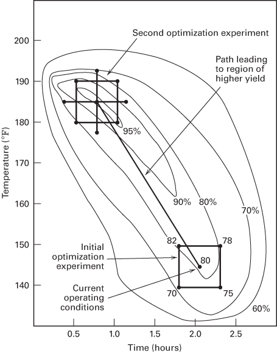

# 1.2 试验设计的一些典型应用

试验设计方法已在许多学科中得到广泛应用。如前所述，我们可以把试验视为科学过程的一部分，视为我们认识系统或过程如何工作的途径之一。一般来说，我们是通过一系列活动来学习的：先对某个过程做出猜想，再通过试验从该过程获取数据，然后利用试验得到的信息建立新的猜想，进而引出新的试验，如此往复。

在科学界与工程界，试验设计是在产品实现过程中推动创新的极为重要的工具。这些活动的关键组成部分在于新制造工艺的设计与开发以及过程管理。在工艺开发早期就应用试验设计技术，可以带来

1. 提高过程收率；

2. 减小变异，并使产品更符合名义要求或目标要求；

3. 缩短开发时间；

4. 降低总体成本。

试验设计方法在工程设计活动中同样具有根本的重要性，工程设计活动即开发新产品、改进现有产品。试验设计在工程设计中的一些应用包括

1. 评估和比较基本设计构型；

2. 评估可替代的材料方案；

3. 选择设计参数，使产品能在多种多样的现场条件下良好工作，即让产品具有稳健性；

4. 确定影响产品性能的关键产品设计参数；

5. 制定新产品的配方。

在产品实现中运用试验设计，可以得到更易于制造、现场性能和可靠性更好、成本更低、设计与开发时间更短的产品。试验设计在营销、市场研究、交易与服务运营以及一般业务运营中也有广泛的应用。下面我们给出若干例子来说明其中的一些思想。

## 例 1.1 表征一个过程

在印制电路板的制造过程中要使用波峰焊机。该机器先在助焊剂中清洗电路板，对电路板预热，然后让电路板沿传送带通过一道熔融焊料的波峰。这道焊接工序为板上有引脚的元件形成电气连接和机械连接。

该工序目前的不合格率约为 1%，也就是说，一块电路板上约有 1% 的焊点不合格，需要人工补焊。然而，由于一块普通印制电路板上有 2000 多个焊点，即使 1% 的不合格率也会导致需要返修的焊点过多。负责该工序的工艺工程师希望用一次设计好的试验来确定哪些机器参数对焊接缺陷的出现有影响，以及应当对这些变量作何调整以减少焊接缺陷。

波峰焊机有若干可以控制的变量，包括

1. 焊料温度；

2. 预热温度；

3. 传送带速度；

4. 助焊剂类型；

5. 助焊剂比重；

6. 焊料波峰高度；

7. 传送带倾角。

除这些可控因子之外，还有若干因子在日常生产中不易控制，尽管在试验时可以加以控制。它们是

1. 印制电路板的厚度；

2. 板上所用元件的类型；

3. 板上元件的布局；

4. 操作人员；

5. 生产率。

在这种情况下，工程师感兴趣的是对波峰焊机进行**表征**；也就是说，他们想确定哪些因子（可控的和不可控的）会影响印制电路板上缺陷的出现。为此，他们可以设计一次试验，以估计因子效应的大小和方向：即当每个因子改变时，响应变量（单位产品缺陷数）变化多少；以及各因子一起改变所产生的结果是否不同于单个因子调整所得到的结果——也就是因子之间是否存在交互作用。我们有时把这样的试验称为**筛选试验**（screening experiment）。通常，筛选试验或表征试验会采用部分因子设计，如前面图 1.8 中的高尔夫例子那样。

来自这次筛选或表征试验的信息将用于找出关键的工艺因子，并确定这些因子的调整方向，以进一步减少单位产品的缺陷数。该试验还可能提供信息，说明在日常生产中应更仔细地控制哪些因子，以防止出现高缺陷率和过程表现不稳定。因此，试验的一个结果可能是：除了对过程输出使用控制图之外，还对一两个过程变量（例如焊料温度）应用控制图等技术。随着时间推移，如果过程改进得足够充分，就有可能把过程控制计划的大部分建立在对过程输入变量的控制上，而不再对输出画控制图。

## 例 1.2 最优化一个过程

在表征试验中，我们通常关心的是确定哪些过程变量会影响响应。合乎逻辑的下一步是**最优化**，即确定重要因子的哪个区域能给出最好的响应。例如，如果响应是收率，我们就寻找收率最大的区域；而如果响应是某个关键产品尺寸的变异，我们就寻找变异最小的区域。

假设我们想提高某个化工过程的收率。根据一次表征试验的结果，我们知道影响收率的两个最重要的过程变量是操作温度和反应时间。该过程目前运行在 145 °F、反应时间 2.1 小时，收率约为 80%。图 1.9 是从上方俯视时间—温度区域的视图。图中把收率相同的点连成响应等值线，我们画出了收率为 60%、70%、80%、90% 和 95% 的等值线。这些等值线是与上述各收率相对应的收率曲面的截面在时间—温度区域上的投影。这一曲面有时称为**响应曲面**（response surface）。图 1.9 中的真实响应曲面是工艺人员所不知道的，因此需要借助试验方法来对收率就时间和温度进行最优化。

为了找到最优点，必须做一次让时间和温度一起变化的试验，也就是因子试验。图 1.9 中给出了初步因子试验的结果，其中时间和温度都取两个水平。在正方形四个角上观测到的响应表明，要提高收率，应朝着温度升高、反应时间缩短的大致方向移动。在这一方向上再补做若干次运行，这些补充试验将把我们引向收率最大的区域。

一旦找到最优区域，通常还要做第二次试验。第二次试验的目标是建立该过程的经验模型，并对时间和温度的最优操作条件给出更精确的估计。这种过程最优化方法称为**响应曲面法**（response surface methodology），第 11 章将详细讨论。图 1.9 中示出的第二个设计是**中心复合设计**（central composite design），它是过程最优化研究中最重要的一类试验设计。

**图 1.9 收率作为反应时间与反应温度函数的等值线图，用以说明为最优化一个过程而进行的试验**

## 例 1.3 设计产品（一）

一位生物医学工程师正在设计一种用于静脉给药的新型泵。该泵应在规定的时间段内输送恒定数量的药物（剂量）。她必须确定若干变量或设计参数，其中包括：圆柱的直径和长度、圆柱与柱塞之间的配合、柱塞长度、连接泵与插入患者静脉的针头的导管的直径和壁厚、用于制作圆柱和导管的材料，以及系统必须运行的名义压力。其中一些参数对设计的影响可以通过制作原型来评估，在原型上可以让这些因子在适当的范围内变化。然后可以设计试验并对原型进行测试，以考察哪些设计参数对泵的性能影响最大。对这些信息的分析将帮助工程师得到一种能够可靠、一致地输送药物的设计。

## 例 1.4 设计产品（二）

一位工程师正在设计一台航空发动机。该发动机是一台商用涡扇发动机，设计巡航状态为 40 000 英尺、0.8 马赫。设计参数包括进口流量、风扇压比、总压比、静子出口温度以及许多其他因子。该系统的输出响应变量是单位燃油消耗率和发动机推力。在设计这一系统时，在设计过程早期制作原型或实际试验件是代价过高的，因此工程师使用该系统的计算机模型，以便聚焦于发动机的关键设计参数，并通过改变这些参数来优化发动机性能。可以把设计好的试验用于发动机的计算机模型，以确定最重要的设计参数及其最优设置。

设计人员常常使用计算机模型来辅助开展工作。例如结构设计与机械设计诸多方面的有限元模型、用于集成电路设计的电路仿真器、用于排产与产能规划或供应链管理的工厂级或企业级模型，以及复杂化工过程的计算机模型。统计试验设计同样可以方便而成功地应用于这些模型，就像应用于实际的物理系统一样，并能缩短开发周期、改善设计质量。

## 例 1.5 制定产品配方

一位生物化学家正在为检测某种疾病的存在而配制一种诊断产品。该产品是生物材料、化学试剂及其他材料的混合物，与人体血液混合后会发生反应，给出诊断指征。这里所用的试验类型是**混料试验**（mixture experiment），因为用于配制该诊断产品的各种成分按 100% 的比例（以体积比、重量比或摩尔比计）构成混合物的组成，而响应是产品中所含各混合物比例的函数。混料试验是响应曲面试验的一种特殊类型，我们将在第 11 章学习。它们在生物技术产品、药品、食品与饮料、油漆与涂料、洗涤剂、肥皂等消费品及其他个人护理产品以及各种各样其他产品的设计中非常有用。

## 例 1.6 设计网页

如今许多业务都通过万维网开展。因此，企业网页的设计具有潜在的重要经济影响。假设网站包含以下组成部分：(1) 闪光图片，(2) 主标题，(3) 副标题，(4) 正文文案，(5) 右侧的主图，(6) 背景设计，(7) 页脚。我们想找出影响**点击率**（click-through rate）的因子，点击率即点击进入该网站的访客数除以访问该网站的总访客数。正确选择重要因子可以带来最优的网页设计。假设闪光图片有 4 种选择、主标题有 8 种选择、副标题有 6 种选择、正文文案有 5 种选择、主图有 4 种选择、背景设计有 3 种选择、页脚有 7 种选择。如果采用因子设计，就必须构造并测试这些因子水平全部可能组合所对应的网页，总数为 $4 \times 8 \times 6 \times 5 \times 4 \times 3 \times 7 = 80{,}640$ 个网页。显然，设计和测试这么多网页组合是不可行的，因此不能考虑完全因子试验。然而，只使用少量可能网页设计的部分因子试验很可能会成功。这种试验需要一个各因子水平数不相同的部分因子设计。我们将在第 9 章讨论如何构造这类设计。
