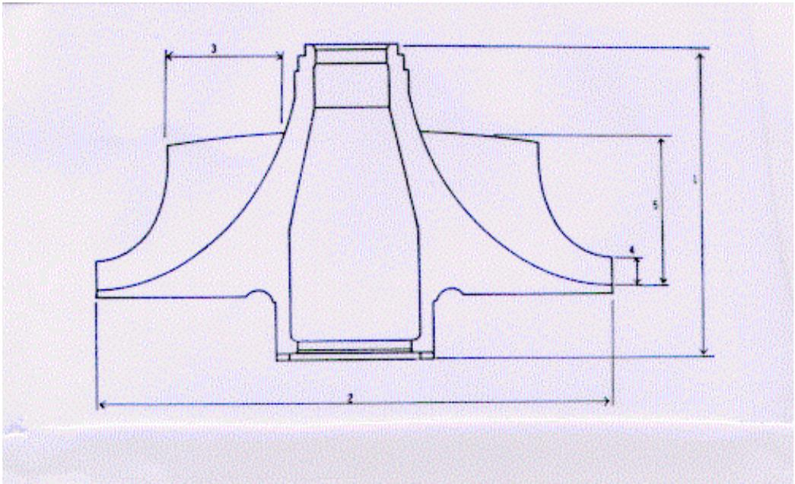
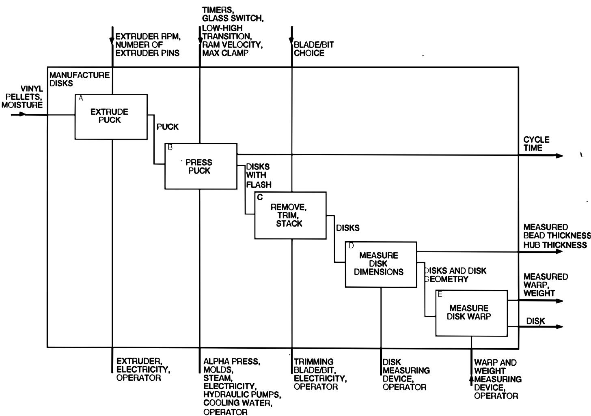
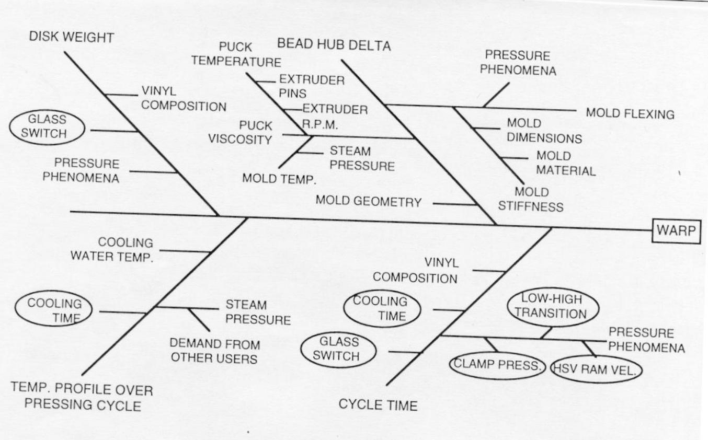

# 第 1 章补充材料

## S1.1 关于试验计划的更多内容

Coleman 与 Montgomery（1993）讨论了试验方法学，并给出一些在设计和实施工业试验的**试验前计划**（pre-experimental planning）阶段很有用的指导表。对于复杂的、高回报或高后果的试验而言，这些指导表尤为适用——这类试验可能涉及许多因子或其他需要仔细斟酌的问题，也可能涉及许多响应变量。它们最可能在针对某个过程或系统开展试验的最早阶段发挥作用。Coleman 与 Montgomery 建议，这些指导表由试验团队共同填写时效果最好，团队成员应包括具备专门过程知识的工程师和科学家、操作人员和技师、管理人员，以及（如果可能）在试验设计方面受过专门训练并有相关经验的人员。这些表格旨在促使人们在试验实际开展之前，就技术与后勤问题进行讨论并加以解决。

Coleman 与 Montgomery 给出了一个例子，涉及在 CNC 机床上制造用于喷气涡轮发动机的**叶轮**（impeller）。为达到期望的性能目标，必须使所生产的零件其叶片型面与工程规范高度吻合。该试验的目标是研究不同刀具供应商和机床装夹参数对 CNC 机床所加工零件尺寸变异性的影响。

主指导表见下面的表 1。它包含的信息有助于为某个具体试验填写各张分表。写出试验目标通常比看起来要难。目标应当是无偏的、具体的、可度量的，并且具有实际意义。要做到无偏，试验者必须鼓励具有不同视角、既有知识又有兴趣的人参与进来。人们很容易把试验设计得非常狭隘，以便“证明”某个偏爱的理论。要做到具体且可度量，目标就应足够详细，并且其表述方式应使人在目标达成时能够明确判断出来。要具有实际意义，就应当有某些事情会因这次试验而有所不同，例如过程采用一套新的操作条件、采用新的材料来源，或者也许会开展一项新的试验。所有相关各方都应一致同意所设定的目标是恰当的。

相关背景应包含以下信息：以往试验（如有）的信息、过程操作人员可能例行收集的观测数据、现场质量或可靠性数据、基于物理定律或理论的知识，以及专家意见。这些信息有助于量化本次试验可能获得哪些新知识，并能推动全体团队成员展开讨论。表 2 给出了 CNC 加工试验指导表的开头部分。

**表 1 主指导表**

本表可用于帮助计划和设计试验。它充当一份核对清单，以改进试验工作，并确保结果不会因缺少审慎的计划而受到损害。注意，也许无法完全回答所有问题。若方便，可对第 4～8 项使用补充表。

| 表项 |
| --- |
| 1. 试验者姓名与所属机构：试验的简要名称： |
| 2. 试验的目标（应当无偏、具体、可度量，并且具有实际意义）： |
| 3. 关于响应变量与控制变量的相关背景：(a) 理论关系；(b) 专家知识/经验；(c) 以往的试验。本次试验在该过程或系统的研究中处于什么位置？ |
| 4. 列出：(a) 每个响应变量；(b) 过程运行时所处的常规响应变量水平、正常运行的分布或范围；(c) 能够测量到的精度或范围（以及如何测量）： |
| 5. 列出：(a) 每个控制变量；(b) 过程运行时所处的常规控制变量水平，以及正常运行的分布或范围；(c) 能够设定到的精度 (s) 或范围（针对试验，而非日常工厂运行）以及能够测量到的精度；(d) 建议的控制变量设置；(e) 这些设置预计会对每个响应变量产生的影响（至少是定性影响）： |
| 6. 列出：(a) 试验中将被“保持恒定”的每个因子；(b) 其期望水平以及允许的 (s) 或变化范围；(c) 能够测量到的精度或范围（以及如何测量）；(d) 如何对其加以控制；(e) 它对各个响应的预期影响（如有）： |
| 7. 列出：(a) 每个干扰因子（可能随时间变化）；(b) 测量精度；(c) 策略（例如区组化、随机化或选择）；(d) 预期效应： |
| 8. 列出并标注已知或疑似的交互作用： |
| 9. 列出对试验的限制，例如：改变控制变量的难易程度、数据采集方法、材料、持续时间、运行次数、试验单元的类型（是否需要裂区设计）、“非法”或无关的试验区域、随机化的限制、运行顺序、改变控制变量设置的成本，等等： |
| 10. 给出当前的设计偏好（如有）及其理由，包括区组化和随机化： |
| 11. 如果可能，提出分析与展示技术，例如图形、方差分析、回归、图形、t 检验等： |
| 12. 谁将负责协调本次试验？ |
| 13. 是否应进行试运行？为什么应（或不应）？ |

**表 2 CNC 加工研究指导表的开头部分**

| 表项 |
| --- |
| 1. 试验者姓名与所属机构：John Smith，工艺工程组。试验的简要名称：CNC 加工研究 |
| 2. 试验的目标（应当无偏、具体、可度量，并且具有实际意义）： |
| 对于机加工的钛合金锻件，量化刀具供应商；a 轴、x 轴、y 轴和 z 轴的偏移；主轴转速；夹具高度；进给速率；以及主轴位置对（如图 1 所示的）X 级叶轮叶片型面平均值和变异性的影响。 |
| 3. 关于响应变量与控制变量的相关背景：(a) 理论关系；(b) 专家知识/经验；(c) 以往的试验。本次试验在该过程或系统的研究中处于什么位置？(a) 由于刀具几何形状的原因，预期 x 轴偏移会使叶片变薄，这是翼型的一个不良特征。(b) 这类零件已生产了 10 年以上；历史经验表明，外部重磨刀具的性能不如来自“内部”供应商（我们自己的重磨工序）的刀具。(c) Smith（1987）在一项内部工艺工程研究中观察到，当前的主轴转速和进给速率能很好地加工出符合工程图纸名义型面要求的零件——但没有研究过对装夹参数变化的敏感性。 |
| 本次试验的结果将用于确定叶轮加工的机床装夹参数。我们期望得到稳健的过程，也就是无论使用哪家供应商的刀具，过程都能做到目标值准确且变异性小。 |

在试验中选择响应变量时，**测量精度**（measurement precision）是一个重要方面。确保测量过程处于统计受控状态是非常可取的。也就是说，理想情况下应当有一套完善的体系，用以确保所采用的测量方法既有准确度又有精密度。所用**量具**（gauge）引入的测量误差大小也应当清楚。如果量具误差相对于我们关心的、需要检测出的响应变量变化而言很大，那么试验者会希望在开展试验之前就了解这一点。有时可以对每个试验单元或试验试样进行多次重复测量，以减小测量误差的影响。例如，用凝胶渗透色谱仪（gel permeation chromatograph，GPC）测量聚合物的数均分子量时，每个样品可以测试若干次，并把这些分子量读数的平均值作为该样品的观测值上报。当测量精度不可接受时，可以进行测量系统能力研究，以设法改进该系统。这类研究往往是相当复杂的设计试验。第 13 章给出了一个用因子试验研究测量系统能力的例子。

本次试验所涉及的叶轮如图 1 所示。表 3 列出了关于响应变量的信息。注意这里我们关心三个响应变量。

**图 1 喷气发动机叶轮（侧视图）。z 轴竖直，x 轴水平，y 轴指向纸内。1 = 轮盘高度，2 = 轮盘直径，3 = 导流叶片高度，4 = 出口叶片高度，5 = 叶片的 z 向高度**

**表 3 响应变量**

| 响应变量（单位） | 常规运行水平与范围 | 测量精度、准确度——如何获知？ | 响应变量与目标的关系 |
| --- | --- | --- | --- |
| 叶片型面（英寸） | 在所有点上，名义值（目标值）$\pm 1 \times 10^{-3}$ 英寸至 $\pm 2 \times 10^{-3}$ 英寸 | 由坐标测量机能力研究得到 $\sigma_{E} \approx 1 \times 10^{-5}$ 英寸 | 估计与目标值之差的平均绝对值和标准差 |
| 表面光洁度 | 从光滑到粗糙（需要手工抛光） | 目视准则（与标准样板比较） | 应尽可能光滑 |
| 表面缺陷数 | 通常为 0 到 10 | 目视准则（与标准样板比较） | 在数量或大小上都不应过大 |

与响应变量类似，大多数试验者都能很容易地列出试验中要研究的候选设计因子。Coleman 与 Montgomery 把这些因子称为控制变量。在本书正文中，我们常称之为**可控变量**（controllable variable）、设计因子或过程变量。控制变量可以是连续型的，也可以是分类（离散）型的。试验者测量和设定这些因子的能力很重要。一般而言，设定、保持或测量控制变量水平的能力若存在小误差，后果相对较小。有时当测量或设定误差较大时，像温度这样的数值型控制变量就不得不当作分类控制变量（低温或高温）来处理。另一种做法是采用变量含误差的统计模型，不过其用法超出了本书的范围。CNC 加工例子中控制变量的信息见表 4。

**表 4 控制变量**

| 控制变量（单位） | 常规水平与范围 | 测量精度与设定误差——如何获知？ | 建议设置（基于预期效应） | 预期效应（针对各响应变量） |
| --- | --- | --- | --- | --- |
| x 轴偏移*（英寸） | 0～.020 英寸 | .001 英寸（经验） | 0、.015 英寸 | 有差异 |
| y 轴偏移*（英寸） | 0～.020 英寸 | .001 英寸（经验） | 0、.015 英寸 | 有差异 |
| z 轴偏移*（英寸） | 0～.020 英寸 | .001 英寸（经验） | ? | 有差异 |
| 刀具供应商 | 内部、外部 | - | 内部、外部 | 外部供应商的变异性更大 |
| a 轴偏移*（度） | 0～.030 度 | .001 度（猜测） | 0、.030 度 | 未知 |
| 主轴转速（占名义值的百分比） | 85～115% | ~1%（控制面板上的指示表） | 90%、110% | 无？ |
| 夹具高度 | 0～.025 英寸 | .002 英寸（猜测） | 0、.015 英寸 | 未知 |
| 进给速率（占名义值的百分比） | 90～110% | ~1%（控制面板上的指示表） | 90%、110% | 无？ |

x、y、z 轴用于指代零件和 CNC 机床。a 轴仅指机床。

**保持恒定因子**（held-constant factor）是其效应在本试验中并不令人关心的控制变量。这些工作表可以促使人们就以下问题进行有意义的讨论：哪些因子得到了充分控制；以及是否存在某些（就本次试验目的而言）可能重要的因子，本应作为控制变量纳入试验，却被无意中保持恒定。有时领域专家会选择让过多的因子保持恒定，结果未能识别出有用的新信息。这类信息常常以过程变量之间交互作用的形式出现。

在 CNC 试验中，这张工作表帮助试验者认识到，在切削任何叶片锻件之前必须让机床充分预热。实际采用的做法是把锻件毛坯装在机床上，在不接合刀具的情况下运行 30 分钟。这样可使所有机床部件和润滑剂达到正常的稳态工作温度。使用一名典型的（即中等水平的）操作人员，以及只使用一个批次的锻件，都是为提高试验“保险系数”而作出的决定。表 5 给出了 CNC 加工试验的保持恒定因子。

**表 5 保持恒定因子**

| 因子（单位） | 期望的试验水平与允许范围 | 测量精度——如何获知？ | 如何（在试验中）控制 | 预期效应 |
| --- | --- | --- | --- | --- |
| 切削液类型 | 标准类型 | 不确定，但认为足够 | 只使用一种类型 | 无 |
| 切削液温度（°F） | 机床预热后为 100 °F | 1～2 °F（估计） | 在机床达到 100 °F 之后再进行运行 | 无 |
| 操作人员 | 过程中通常有多名操作人员工作 | - | 使用一名“中等水平”的操作人员 | 无 |
| 钛合金锻件 | 材料性能可能逐件变化 | 实验室测试的精度未知 | 只使用一个批次（或仅在必要时按锻件批次进行区组化） | 轻微 |

**干扰因子**（nuisance factor）是那些可能对响应有一定影响、但试验者对其很少关心或毫不关心的变量。它们与保持恒定因子的区别在于：它们要么无法完全保持恒定，要么根本无法控制。例如，如果开展该试验需要用到两个批次的锻件，那么材料在批次之间的潜在差异就是一个无法完全保持恒定的干扰变量。在化工过程中，我们往往无法控制进料物流的黏度（比方说）——它可能随时间几乎连续地变化。在这些情形下，必须在试验的设计或分析中考虑干扰变量。如果某个干扰变量可以控制，我们就可以使用一种称为**区组化**（blocking）的设计技术来消除其效应。区组化在第 4 章首次讨论。如果该干扰变量无法控制但可以测量，我们就可以用一种称为**协方差分析**（analysis of covariance）的分析技术来减小其效应，这将在第 14 章讨论。

表 6 列出了 CNC 加工试验中识别出的干扰变量。在该试验中，唯一被认为可能具有严重影响的干扰因子是机床**主轴**（spindle）。该机床有四个主轴，最终决定把试验安排在四个区组中运行。其他因子则保持恒定，其水平低于可能出现问题的水平。

**表 6 干扰因子**

| 干扰因子（单位） | 测量精度——如何获知？ | 策略（例如随机化、区组化等） | 预期效应 |
| --- | --- | --- | --- |
| 切削液黏度 | 标准黏度 | 在开始和结束时测量黏度 | 无到轻微 |
| 环境温度（°F） | 用室温温度计测得为 1～2 °F（估计） | 在 80 °F 以下进行运行 | 轻微，除非天气非常炎热 |
| 主轴 |  | 按机床主轴进行区组化或随机化 | 主轴之间的变异性可能很大 |
| 机床运行时的振动 | ? | 不要在 CNC 机床车间内搬动重物 | 剧烈振动会在同一叶轮内引入变异 |

Coleman 与 Montgomery 还发现，引入一张交互作用工作表很有用。过程变量之间**交互作用**的概念并不直观，即使对训练有素的工程师和科学家来说也是如此。现在，以为试验者在计划过程一开始就能识别出所有重要的交互作用，显然是不现实的。在多数情形下，试验者其实并不知道哪些主效应可能重要，因此要求他们就交互作用作出判断是不切实际的。不过，有时团队中受过统计训练的人员可以借此机会向其他人讲解交互作用现象。当对过程了解得更多时，也许可以利用这张工作表引出诸如“是否存在某些必须估计的交互作用？”这样的问题。表 7 给出了 CNC 加工例子中这项练习的结果。

**表 7 交互作用**

| 控制变量 | y 偏移 | z 偏移 | 供应商 | a 偏移 | 转速 | 高度 | 进给 |
| --- | --- | --- | --- | --- | --- | --- | --- |
| x 偏移 |  |  | P |  |  |  |  |
| y 偏移 | - |  | P |  |  |  |  |
| z 偏移 | - | - | P |  |  |  |  |
| 供应商 | - | - | - | P |  |  |  |
| a 偏移 | - | - | - | - |  |  |  |
| 转速 | - | - | - | - | - |  | F、D |
| 高度 | - | - | - | - | - | - |  |

注：响应变量为 P = 型面差异，F = 表面光洁度，D = 表面缺陷。

最后两点：第一，试验者如果没有一名协调人，多半会失败。此外，如果某件事有可能出错，那它多半真的会出错，因此协调人实际上要承担一项重要责任，即检查并确保试验按计划进行。第二，关于**试运行**（trial run），这往往是个非常好的主意——特别是当它是一系列试验中的第一次，或者该试验意义重大、影响深远时。一次试运行可以由因子试验中的一个中心点构成，也可以是试验的一小部分——也许是其中一个区组。由于许多试验往往涉及人员和机器去做他们以前没有做过的事情，练一练是个好主意。进行试运行的另一个原因是，我们可以借此估计试验误差的大小。如果试验误差远大于预期，那么这可能表明需要对试验中相当大的一部分重新设计。试运行也是确保测量系统以及数据获取或采集系统按预期运行的好机会。大多数试验者从不会后悔做了试运行。

### Coleman 与 Montgomery（1993）的空白指导表

**响应变量**

| 响应变量（单位） | 常规运行水平与范围 | 测量精度、准确度——如何获知？ | 响应变量与目标的关系 |
| --- | --- | --- | --- |
|  |  |  |  |
|  |  |  |  |
|  |  |  |  |
|  |  |  |  |
|  |  |  |  |

**控制变量**

| 控制变量（单位） | 常规水平与范围 | 测量精度与设定误差——如何获知？ | 建议设置（基于预期效应） | 预期效应（针对各响应变量） |
| --- | --- | --- | --- | --- |
|  |  |  |  |  |
|  |  |  |  |  |
|  |  |  |  |  |
|  |  |  |  |  |
|  |  |  |  |  |
|  |  |  |  |  |
|  |  |  |  |  |
|  |  |  |  |  |

**“保持恒定”因子**

| 因子（单位） | 期望的试验水平与允许范围 | 测量精度——如何获知？ | 如何（在试验中）控制 | 预期效应 |
| --- | --- | --- | --- | --- |
|  |  |  |  |  |
|  |  |  |  |  |
|  |  |  |  |  |
|  |  |  |  |  |
|  |  |  |  |  |

**干扰因子**

| 干扰因子（单位） | 测量精度——如何获知？ | 策略（例如随机化、区组化等） | 预期效应 |
| --- | --- | --- | --- |
|  |  |  |  |
|  |  |  |  |
|  |  |  |  |
|  |  |  |  |
|  |  |  |  |
|  |  |  |  |
|  |  |  |  |
|  |  |  |  |

### 交互作用

| 控制变量 | 2 | 3 | 4 | 5 | 6 | 7 | 8 |
| --- | --- | --- | --- | --- | --- | --- | --- |
| 1 |  |  |  |  |  |  |  |
| 2 | - |  |  |  |  |  |  |
| 3 | - | - |  |  |  |  |  |
| 4 | - | - | - |  |  |  |  |
| 5 | - | - | - | - |  |  |  |
| 6 | - | - | - | - | - |  |  |
| 7 | - | - | - | - | - | - |  |

## S1.2 试验计划的其他图示辅助工具

除了 Coleman 与 Montgomery 在 *Technometrics* 上那篇论文中的表格之外，还有许多有用的图示辅助工具可用于试验前计划。也许最早提出用图示方法计划试验的人是 Andrews（1964），他提出了一种与教材中图 1.1 十分相似的系统示意图，其中输入、试验变量和响应都清楚标注出来。这类图对于把注意力集中在问题的总体方面非常有帮助。

Barton（1997，1998，1999）讨论了许多在计划试验时有用的图示辅助工具。他建议使用 **IDEF0 图**来识别和分类变量。IDEF0 是“集成计算机辅助制造标识语言第 0 层”（Integrated Computer Aided Manufacturing Identification Language, Level 0）的缩写。美国空军开发它是为了表示复杂计算机软件系统的子程序和功能。IDEF0 图是一种框图，与教材中的图 1.1 相似。IDEF0 图是分层的；也就是说，过程或系统可以分解为一系列过程步骤或系统，并以绘制在主框图内部的一系列较低层次方框来表示。

图 2 给出了视频光盘制造过程中某一部分的 IDEF0 图［取自 Barton（1999）］。该图展示了光盘压制活动的细节。主过程已被分解为五个步骤，而我们关心的主要输出响应是光盘的翘曲。

教材中讨论的**因果图**（cause-and-effect diagram，即鱼骨图）在识别和分类试验设计问题中的变量时也很有用。图 3［取自 Barton（1999）］给出了视频光盘过程的因果图。这类图在组织并开展“头脑风暴”或其他解决问题的会议时非常有用，在这类会议中会讨论并决定过程变量及其在试验中的潜在作用。

这两种技术都非常有助于揭示中间变量。这类变量常常与可直接调整的过程变量相混淆。例如，火箭推进剂的燃速可能受推进剂材料中气孔存在的影响。然而，气孔是混合工艺、固化温度和其他过程变量的结果，因此气孔本身无法由试验者直接控制。

关于计划试验的其他一些有用文献包括 Bishop, Petersen and Trayser (1982)、Hahn (1977) (1984) 和 Hunter (1977)。

**图 2 视频光盘制造过程试验的 IDEF0 图**

**图 3 视频光盘制造过程试验的因果图**

## S1.3 Montgomery 关于试验设计的“定理”

统计学课程——即便是像试验设计这样非常实用的课程——往往有些枯燥乏味。对工程师来说也是如此，尽管他们习惯于修读流体力学、机械振动和器件物理这类精彩得多的课程。因此，我尽量在课程中随时注入一点幽默。例如，在第一次上课时我会告诉他们不要显得那么不高兴。如果他们只剩一天可活，就应该选择在统计学的课堂上度过——那样这一天会显得长一倍。

在整个课程的不同时间，我还会使用下面这些“定理”。它们大多与试验设计（DOX）的非统计学方面有关，但都指出了重要的议题和关注点。

**定理 1** 如果在实施试验时某件事有可能出错，那么它一定会出错。

**定理 2** 成功完成一项试验的概率与运行次数成反比。

**定理 3** 绝不要让一个人独自设计和实施一项试验，特别是当此人是该研究领域的领域专家时。

**定理 4** 所有试验都是设计试验；其中有一些设计得很好，有一些设计得非常糟糕。设计糟糕的试验往往什么也告诉不了你。

**定理 5** 你在实施一项设计试验时取得的成功，约 80% 直接来自你把试验前计划（教材中 7 步程序里的第 1～3 步）做得有多好。

**定理 6** 在诸如工厂或车间这样的“复杂”环境中实施试验，其后勤复杂性无论怎么估计都不过分。

最后，我的朋友 Stu Hunter 多年来一直说，如果没有良好的试验设计，我们最后往往做的就是 PARC 分析。这是下面这个短语的首字母缩写：

Planning After the Research is Complete

把 PARC 倒过来拼，得到的是什么？

## 补充参考文献

Andrews, H. P. (1964). “The Role of Statistics in Setting Food Specifications”, Proceedings of the Sixteenth Annual Conference of the Research Council of the American Meat Institute, pp. 43-56. Reprinted in Experiments in Industry: Design, Analysis, and Interpretation of Results, eds. R. D. Snee, L. B. Hare and J. R. Trout, American Society for Quality Control, Milwaukee, WI 1985.

Barton, R. R. (1997). “Pre-experiment Planning for Designed Experiments: Graphical Methods”, Journal of Quality Technology, Vol. 29, pp. 307-316.

Barton, R. R. (1998). “Design-plots for Factorial and Fractional Factorial Designs”, Journal of Quality Technology, Vol. 30, pp. 40-54.

Barton, R. R. (1999). Graphical Methods for the Design of Experiments, Springer Lecture Notes in Statistics 143, Springer-Verlag, New York.

Bishop, T., Petersen, B. and Trayser, D. (1982). “Another Look at the Statistician’s Role in Experimental Planning and Design”, The American Statistician, Vol. 36, pp. 387-389.

Hahn, G. J. (1977). “Some Things Engineers Should Know About Experimental Design”, Journal of Quality Technology, Vol. 9, pp. 13-20.

Hahn, G. J. (1984). “Experimental Design in a Complex World”, Technometrics, Vol. 26, pp. 19-31.

Hunter, W. G. (1977). “Some Ideas About Teaching Design of Experiments With $2^{5}$ Examples of Experiments Conducted by Students”, The American Statistician, Vol. 31, pp. 12-17.
