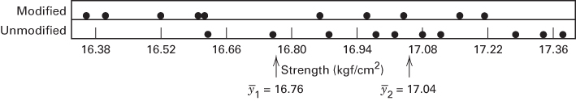
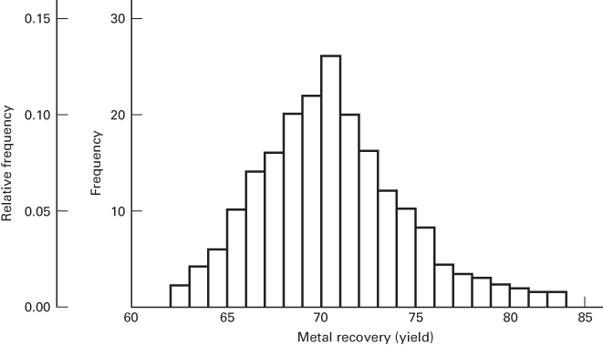
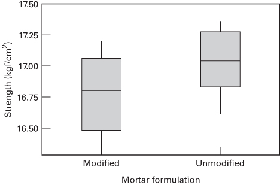
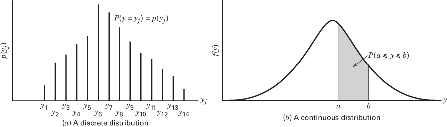

CHAPTER 2

# Simple Comparative Experiments

## CHAPTER LEARNING OBJECTIVES

1. Know the importance of obtaining a random sample.

2. Be familiar with the standard sampling distributions: normal, t, chi-square, and F.

3. Know how to interpret the P-value for a statistical test.

4. Know how to use the Z-test and t-test to compare means.

5. Know how to construct and interpret confidence intervals involving means.

6. Know how the paired t-test incorporates the blocking principle.

In this chapter, we consider experiments to compare two conditions (sometimes called treatments). These are often called simple comparative experiments. We begin with an example of an experiment performed to determine whether two different formulations of a product give equivalent results. The discussion leads to a review of several basic statistical concepts, such as random variables, probability distributions, random samples, sampling distributions, and tests of hypotheses.

## 2.1 Introduction

An engineer is studying the formulation of a Portland cement mortar. He has added a polymer latex emulsion during mixing to determine if this impacts the curing time and tension bond strength of the mortar. The experimenter prepared 10 samples of the original formulation and 10 samples of the modified formulation. We will refer to the two different formulations as two treatments or as two levels of the factor formulations. When the cure process was completed, the experimenter did find a very large reduction in the cure time for the modified mortar formulation. Then he began to address the tension bond strength of the mortar. If the new mortar formulation has an adverse effect on bond strength, this could impact its usefulness.

The tension bond strength data from this experiment are shown in Table 2.1 and plotted in Figure 2.1. The graph is called a dot diagram. Visual examination of these data gives the impression that the strength of the unmodified mortar may be greater than the strength of the modified mortar. This impression is supported by comparing the average tension bond strengths $\overline{y}_{1}=16.76\ kgf/cm^{2}$ for the modified mortar and $\overline{y}_{2}=17.04\ kgf/cm^{2}$ for the unmodified mortar. The average tension bond strengths in these two samples differ by what seems to be a modest amount. However, it is not obvious that this difference is large enough to imply that the two formulations really are different. Perhaps this observed difference in average strengths is the result of sampling fluctuation and the two formulations are really identical. Possibly another two samples would give opposite results, with the strength of the modified mortar exceeding that of the unmodified formulation.

TABLE 2.1  
Tension Bond Strength Data for the Portland Cement Formulation Experiment

<table><tr><td>j</td><td>Modified Mortar $y_{1j}$ </td><td>Unmodified Mortar $y_{2j}$ </td></tr><tr><td>1</td><td>16.85</td><td>16.62</td></tr><tr><td>2</td><td>16.40</td><td>16.75</td></tr><tr><td>3</td><td>17.21</td><td>17.37</td></tr><tr><td>4</td><td>16.35</td><td>17.12</td></tr><tr><td>5</td><td>16.52</td><td>16.98</td></tr><tr><td>6</td><td>17.04</td><td>16.87</td></tr><tr><td>7</td><td>16.96</td><td>17.34</td></tr><tr><td>8</td><td>17.15</td><td>17.02</td></tr><tr><td>9</td><td>16.59</td><td>17.08</td></tr><tr><td>10</td><td>16.57</td><td>17.27</td></tr></table>

  
■ FIGURE 2.1 Dot diagram for the tension bond strength data in Table 2.1

A technique of statistical inference called hypothesis testing can be used to assist the experimenter in comparing these two formulations. Hypothesis testing allows the comparison of the two formulations to be made on objective terms, with knowledge of the risks associated with reaching the wrong conclusion. Before presenting procedures for hypothesis testing in simple comparative experiments, we will briefly summarize some elementary statistical concepts.

## 2.2 Basic Statistical Concepts

Each of the observations in the Portland cement experiment described above would be called a run. Notice that the individual runs differ, so there is fluctuation, or noise, in the observed bond strengths. This noise is usually called experimental error or simply error. It is a statistical error, meaning that it arises from variation that is uncontrolled and generally unavoidable. The presence of error or noise implies that the response variable, tension bond strength, is a random variable. A random variable may be either discrete or continuous. If the set of all possible values of the random variable is either finite or countably infinite, then the random variable is discrete, whereas if the set of all possible values of the random variable is an interval, then the random variable is continuous.

Graphical Description of Variability. We often use simple graphical methods to assist in analyzing the data from an experiment. The dot diagram, illustrated in Figure 2.1, is a very useful device for displaying a small body of data (say up to about 20 observations). The dot diagram enables the experimenter to see quickly the general location or central tendency of the observations and their spread or variability. For example, in the Portland cement tension bond experiment, the dot diagram reveals that the two formulations may differ in mean strength but that both formulations produce about the same variability in strength.

■ FIGURE 2.2 Histogram for 200 observations on metal recovery (yield) from a smelting process  


If the data are fairly numerous, the dots in a dot diagram become difficult to distinguish and a histogram may be preferable. Figure 2.2 presents a histogram for 200 observations on the metal recovery, or yield, from a smelting process. The histogram shows the central tendency, spread, and general shape of the distribution of the data. Recall that a histogram is constructed by dividing the horizontal axis into bins (usually of equal length) and drawing a rectangle over the jth bin with the area of the rectangle proportional to $n_{j}$ , the number of observations that fall in that bin. The histogram is a large-sample tool. When the sample size is small, the shape of the histogram can be very sensitive to the number of bins, the width of the bins, and the starting value for the first bin. Histograms should not be used with fewer than 75–100 observations.

The box plot (or box-and-whisker plot) is a very useful way to display data. A box plot displays the minimum, the maximum, the lower and upper quartiles (the 25th percentile and the 75th percentile, respectively), and the median (the 50th percentile) on a rectangular box aligned either horizontally or vertically. The box extends from the lower quartile to the upper quartile, and a line is drawn through the box at the median. Lines (or whiskers) extend from the ends of the box to (typically) the minimum and maximum values. [There are several variations of box plots that have different rules for denoting the extreme sample points. See Montgomery and Runger (2018) for more details.]

Figure 2.3 presents the box plots for the two samples of tension bond strength in the Portland cement mortar experiment. This display indicates some difference in mean strength between the two formulations. It also indicates that both formulations produce reasonably symmetric distributions of strength with similar variability or spread.

■ FIGURE 2.3 Box plots for the Portland cement tension bond strength experiment  


Dot diagrams, histograms, and box plots are useful for summarizing the information in a sample of data. To describe the observations that might occur in a sample more completely, we use the concept of the probability distribution.

Probability Distributions. The probability structure of a random variable, say y, is described by its probability distribution. If y is discrete, we often call the probability distribution of y, say $p(y)$ , the probability mass function of y. If y is continuous, the probability distribution of y, say $f(y)$ , is often called the probability density function for y.

Figure 2.4 illustrates hypothetical discrete and continuous probability distributions. Notice that in the discrete probability distribution Figure 2.4a, it is the height of the function $p(y_{j})$ that represents probability, whereas in the continuous case Figure 2.4b, it is the area under the curve $f(y)$ associated with a given interval that represents probability. The properties of probability distributions may be summarized quantitatively as follows:

$$
\begin{array}{l l} \text {y discrete:} & 0 \leq p (y _ {j}) \leq 1 \\ & P (y = y _ {j}) = p (y _ {j}) \\ & \sum_ {\substack {\text {all values} \\ \text {of} y _ {j}}} p (y _ {j}) = 1 \end{array} \quad \begin{array}{l l} \text {all values of} y _ {j} \\ \text {all values of} y _ {j} \end{array}
$$

y continuous:

$$
\begin{array}{l} P (a \leq y \leq b) = \int_ {a} ^ {b} f (y) d y \\ \int_ {- \infty} ^ {\infty} f (y) d y = 1 \end{array}
$$

Mean, Variance, and Expected Values. The mean, $\mu$ , of a probability distribution is a measure of its central tendency or location. Mathematically, we define the mean as

$$
\mu = \left\{ \begin{array}{l l} \int_ {- \infty} ^ {\infty} y f (y) d y & y \text { continuous } \\ \sum_ {\text { all   } y} y p (y _ {j}) & y \text { discrete } \end{array} \right.\tag{2.1}
$$

We may also express the mean in terms of the expected value or the long-run average value of the random variable y as

$$
\mu = E (y) = \left\{ \begin{array}{l l} \int_ {- \infty} ^ {\infty} y f (y) d y & y \text { continuous } \\ \sum_ {\text { all   } y} y p (y _ {j}) & y \text { discrete } \end{array} \right.\tag{2.2}
$$

where E denotes the expected value operator.



■ FIGURE 2.4 Discrete and continuous probability distributions

The variability or dispersion of a probability distribution can be measured by the variance, defined as

$$
\sigma^ {2} = \left\{ \begin{array}{l l} \int_ {- \infty} ^ {\infty} (y - \mu) ^ {2} f (y) d y & y \text { continuous } \\ \sum_ {\text { all   } y} (y - \mu) ^ {2} p (y _ {j}) & y \text { discrete } \end{array} \right.\tag{2.3}
$$

Note that the variance can be expressed entirely in terms of expectation because

$$
\sigma^ {2} = E [ (y - \mu) ^ {2} ]\tag{2.4}
$$

Finally, the variance is used so extensively that it is convenient to define a variance operator V such that

$$
V (y) = E [ (y - \mu) ^ {2} ] = \sigma^ {2}\tag{2.5}
$$

The concepts of expected value and variance are used extensively throughout this book, and it may be helpful to review several elementary results concerning these operators. If y is a random variable with mean $\mu$ and variance $\sigma^{2}$ and c is a constant, then

$$
\begin{array}{l} \textbf {1 .} E (c) = c \\ \textbf {2 .} E (y) = \mu \\ \textbf {3 .} E (c y) = c E (y) = c \mu \\ \textbf {4 .} V (c) = 0 \\ \textbf {5 .} V (y) = \sigma^ {2} \\ \textbf {6 .} V (c y) = c ^ {2} V (y) = c ^ {2} \sigma^ {2} \end{array}
$$

If there are two random variables, say, $y_{1}$ with $E(y_{1}) = \mu_{1}$ and $V(y_{1}) = \sigma_{1}^{2}$ and $y_{2}$ with $E(y_{2}) = \mu_{2}$ and $V(y_{2}) = \sigma_{2}^{2}$ , we have

$$
7. E (y _ {1} + y _ {2}) = E (y _ {1}) + E (y _ {2}) = \mu_ {1} + \mu_ {2}
$$

It is possible to show that

$$
8. V (y _ {1} + y _ {2}) = V (y _ {1}) + V (y _ {2}) + 2 \operatorname{Cov} (y _ {1}, y _ {2})
$$

where

$$
\operatorname{Cov} (y _ {1}, y _ {2}) = E [ (y _ {1} - \mu_ {1}) (y _ {2} - \mu_ {2}) ]\tag{2.6}
$$

is the covariance of the random variables $y_{1}$ and $y_{2}$ . The covariance is a measure of the linear association between $y_{1}$ and $y_{2}$ . More specifically, we may show that if $y_{1}$ and $y_{2}$ are independent, $^{1}$ then $\operatorname{Cov}(y_{1}, y_{2}) = 0$ . We may also show that

$$
9. V (y _ {1} - y _ {2}) = V (y _ {1}) + V (y _ {2}) - 2 \operatorname{Cov} (y _ {1}, y _ {2})
$$

If $y_{1}$ and $y_{2}$ are independent, we have

$$
\mathbf {1 0}. V (y _ {1} \pm y _ {2}) = V (y _ {1}) + V (y _ {2}) = \sigma_ {1} ^ {2} + \sigma_ {2} ^ {2}
$$

and

$$
1 1. E (y _ {1} \cdot y _ {2}) = E (y _ {1}) \cdot E (y _ {2}) = \mu_ {1} \cdot \mu_ {2}
$$

However, note that, in general

$$
1 2. E \left(\frac {y _ {1}}{y _ {2}}\right) \neq \frac {E (y _ {1})}{E (y _ {2})}
$$

regardless of whether or not $y_{1}$ and $y_{2}$ are independent.

## 2.3 Sampling and Sampling Distributions

Random Samples, Sample Mean, and Sample Variance. The objective of statistical inference is to draw conclusions about a population using a sample from that population. Most of the methods that we will study assume that random samples are used. A random sample is a sample that has been selected from the population in such a way that every possible sample has an equal probability of being selected. In practice, it is sometimes difficult to obtain random samples, and random numbers generated by a computer program may be helpful.

Statistical inference makes considerable use of quantities computed from the observations in the sample. We define a statistic as any function of the observations in a sample that does not contain unknown parameters. For example, suppose that $y_{1}, y_{2}, \ldots, y_{n}$ represents a sample. Then the sample mean

$$
\overline {{y}} = \frac {\sum_ {i = 1} ^ {n} y _ {i}}{n}\tag{2.7}
$$

and the sample variance

$$
S ^ {2} = \frac {\sum_ {i = 1} ^ {n} (y _ {i} - \overline {{y}}) ^ {2}}{n - 1}\tag{2.8}
$$

are both statistics. These quantities are measures of the central tendency and dispersion of the sample, respectively. Sometimes $S = \sqrt{S^{2}}$ , called the sample standard deviation, is used as a measure of dispersion. Experimenters often prefer to use the standard deviation to measure dispersion because its units are the same as those for the variable of interest y.

Properties of the Sample Mean and Variance. The sample mean $\bar{y}$ is a point estimator of the population mean $\mu$ , and the sample variance $S^{2}$ is a point estimator of the population variance $\sigma^{2}$ . In general, an estimator of an unknown parameter is a statistic that corresponds to that parameter. Note that a point estimator is a random variable. A particular numerical value of an estimator, computed from sample data, is called an estimate. For example, suppose that we wish to estimate the mean and variance of the suspended solid material in the water of a lake. A random sample of n = 25 observations is tested, and the mg/l of suspended solid material is measured and recorded for each. The sample mean and variance are computed according to Equations 2.7 and 2.8, respectively, and are $\bar{y} = 18.6$ and $S^{2} = 1.20$ . Therefore, the estimate of $\mu$ is $\bar{y} = 18.6$ mg/l, and the estimate of $\sigma^{2}$ is $S^{2} = 1.20 (\text{mg/l})^{2}$ .

Several properties are required of good point estimators. Two of the most important are the following:

1. The point estimator should be unbiased. That is, the long-run average or expected value of the point estimator should be equal to the parameter that is being estimated. Although unbiasedness is desirable, this property alone does not always make an estimator a good one.

2. An unbiased estimator should have minimum variance. This property states that the minimum variance point estimator has a variance that is smaller than the variance of any other estimator of that parameter.

We may easily show that $\overline{y}$ and $S^{2}$ are unbiased estimators of $\mu$ and $\sigma^{2}$ , respectively. First consider $\overline{y}$ . Using the properties of expectation, we have

$$
\begin{array}{r l} & E (\overline {{y}}) = E \left(\frac {\sum_ {i = 1} ^ {n} y _ {i}}{n}\right) \\ & \qquad = \frac {1}{n} \sum_ {i = 1} ^ {n} E (y _ {i}) \\ & \qquad = \frac {1}{n} \sum_ {i = 1} ^ {n} \mu \\ & \qquad = \mu \end{array}
$$

because the expected value of each observation $y_{i}$ is $\mu$ . Thus, $\bar{y}$ , is an unbiased estimator of $\mu$ . Now consider the sample variance $S^{2}$ . We have

$$
\begin{array}{r l} E (S ^ {2}) & = E \left[ \frac {\sum_ {i = 1} ^ {n} (y _ {i} - \overline {{{y}}}) ^ {2}}{n - 1} \right] \\ & = \frac {1}{n - 1} E \left[ \sum_ {i = 1} ^ {n} (y _ {i} - \overline {{{y}}}) ^ {2} \right] \\ & = \frac {1}{n - 1} E (S S) \end{array}
$$

where $SS = \sum_{i=1}^{n} (y_i - \overline{y})^2$ is the corrected sum of squares of the observations $y_i$ . Now

$$
\begin{array}{r l} & E (S S) = E \left[ \sum_ {i = 1} ^ {n} (y _ {i} - \overline {{{y}}}) ^ {2} \right] \\ & \qquad = E \left[ \sum_ {i = 1} ^ {n} y _ {i} ^ {2} - n \overline {{{y}}} ^ {2} \right] \\ & \qquad = \sum_ {i = 1} ^ {n} (\mu^ {2} + \sigma^ {2}) - n (\mu^ {2} + \sigma^ {2} / n) \\ & \qquad = (n - 1) \sigma^ {2} \end{array}\tag{2.9}
$$

(2.10)

Therefore,

$$
E (S ^ {2}) = \frac {1}{n - 1} E (S S) = \sigma^ {2}
$$

Therefore, $S^2$ is an unbiased estimator of $\sigma^2$ .

Degrees of Freedom. The quantity $n - 1$ in Equation 2.10 is called the number of degrees of freedom of the sum of squares $SS$ . This is a very general result; that is, if $y$ is a random variable with variance $\sigma^2$ and $SS = \sum (y_i - \overline{y})^2$ has $v$ degrees of freedom, then

$$
E \left(\frac {S S}{v}\right) = \sigma^ {2}\tag{2.11}
$$

The number of degrees of freedom of a sum of squares is equal to the number of independent elements in that sum of squares. For example, $SS = \sum_{i=1}^{n} (y_i - \overline{y})^2$ in Equation 2.9 consists of the sum of squares of the $n$ elements $y_1 - \overline{y}, y_2 - \overline{y}, \ldots, y_n - \overline{y}$ . These elements are not all independent because $\sum_{i=1}^{n} (y_i - \overline{y}) = 0$ ; in fact, only $n-1$ of them are independent, implying that $SS$ has $n-1$ degrees of freedom.


## ■ FIGURE 2.5 The normal distribution

The Normal and Other Sampling Distributions. Often we are able to determine the probability distribution of a particular statistic if we know the probability distribution of the population from which the sample was drawn. The probability distribution of a statistic is called a sampling distribution. We will now briefly discuss several useful sampling distributions.

One of the most important sampling distributions is the normal distribution. If y is a normal random variable, the probability distribution of y is

$$
f (y) = \frac {1}{\sigma \sqrt {2 \pi}} e ^ {- (1 / 2) [ (y - \mu) / \sigma ] ^ {2}} \quad - \infty <   y <   \infty\tag{2.12}
$$

where $-\infty < \mu < \infty$ is the mean of the distribution and $\sigma^{2} > 0$ is the variance. The normal distribution is shown in Figure 2.5.

Because sample observations that differ as a result of experimental error often are well described by the normal distribution, the normal plays a central role in the analysis of data from designed experiments. Many important sampling distributions may also be defined in terms of normal random variables. We often use the notation $y \sim N(\mu, \sigma^{2})$ to denote that y is distributed normally with mean $\mu$ and variance $\sigma^{2}$ .

An important special case of the normal distribution is the standard normal distribution; that is, $\mu = 0$ and $\sigma^2 = 1$ . We see that if $y \sim N(\mu, \sigma^2)$ , the random variable

$$
z = \frac {y - \mu}{\sigma}\tag{2.13}
$$

follows the standard normal distribution, denoted $z \sim N(0,1)$ . The operation demonstrated in Equation 2.13 is often called standardizing the normal random variable y. The cumulative standard normal distribution is given in Table I of the Appendix.

Many statistical techniques assume that the random variable is normally distributed. The central limit theorem is often a justification of approximate normality.

## THEOREM 2-1 The Central Limit Theorem

If $y_{1}, y_{2}, \ldots, y_{n}$ is a sequence of n independent and identically distributed random variables with $E(y_{i}) = \mu$ and $V(y_{i}) = \sigma^{2}$ (both finite) and $x = y_{1} + y_{2} + \cdots + y_{n}$ , then the limiting form of the distribution of

$$
z _ {n} = \frac {x - n \mu}{\sqrt {n \sigma^ {2}}}
$$

as $n \to \infty$ , is the standard normal distribution.

This result states essentially that the sum of n independent and identically distributed random variables is approximately normally distributed. In many cases, this approximation is good for very small n, say n < 10, whereas in other cases large n is required, say n > 100. Frequently, we think of the error in an experiment as arising in an additive manner from several independent sources; consequently, the normal distribution becomes a plausible model for the combined experimental error.

An important sampling distribution that can be defined in terms of normal random variables is the chi-square or $\chi^{2}$ distribution. If $z_{1}, z_{2}, \ldots, z_{k}$ are normally and independently distributed random variables with mean 0 and variance 1, abbreviated NID(0, 1), then the random variable

$$
x = z _ {1} ^ {2} + z _ {2} ^ {2} + \dots + z _ {k} ^ {2}
$$

follows the chi-square distribution with k degrees of freedom. The density function of chi-square is

$$
f (x) = \frac {1}{2 ^ {k / 2} \Gamma \left(\frac {k}{2}\right)} x ^ {(k / 2) - 1} e ^ {- x / 2} \quad x > 0\tag{2.14}
$$

Several chi-square distributions are shown in Figure 2.6. The distribution is asymmetric, or skewed, with mean and variance

$$
\begin{array}{c} \mu = k \\ \sigma^ {2} = 2 k \end{array}
$$

respectively. Percentage points of the chi-square distribution are given in Table III of the Appendix.

As an example of a random variable that follows the chi-square distribution, suppose that $y_{1}, y_{2}, \ldots, y_{n}$ is a random sample from an $N(\mu, \sigma^{2})$ distribution. Then

$$
\frac {S S}{\sigma^ {2}} = \frac {\sum_ {i = 1} ^ {n} (y _ {i} - \overline {{y}}) ^ {2}}{\sigma^ {2}} \sim \chi_ {n - 1} ^ {2}\tag{2.15}
$$

That is, $SS / \sigma^2$ is distributed as chi-square with $n - 1$ degrees of freedom.

Many of the techniques used in this book involve the computation and manipulation of sums of squares. The result given in Equation 2.15 is extremely important and occurs repeatedly; a sum of squares in normal random variables when divided by $\sigma^{2}$ follows the chi-square distribution.

Examining Equation 2.8, note the sample variance can be written as

$$
S ^ {2} = \frac {S S}{n - 1}\tag{2.16}
$$

If the observations in the sample are $\mathrm{NID}(\mu,\sigma^{2})$ , then the distribution of $S^{2}$ is $[\sigma^{2}/(n-1)]\chi_{n-1}^{2}$ . Thus, the sampling distribution of the sample variance is a constant times the chi-square distribution if the population is normally distributed.

## ■ FIGURE 2.6 Several chi-square distributions


If z and $\chi_{k}^{2}$ are independent standard normal and chi-square random variables, respectively, the random variable

$$
t _ {k} = \frac {z}{\sqrt {\chi_ {k} ^ {2} / k}}\tag{2.17}
$$

follows the t distribution with k degrees of freedom, denoted $t_{k}$ . The density function of t is

$$
f (t) = \frac {\Gamma [ (k + 1) / 2 ]}{\sqrt {k \pi} \Gamma (k / 2)} \frac {1}{[ (t ^ {2} / k) + 1 ] ^ {(k + 1) / 2}} \quad - \infty <   t <   \infty\tag{2.18}
$$

and the mean and variance of t are $\mu = 0$ and $\sigma^{2} = k/(k - 2)$ for k > 2, respectively. Several t distributions are shown in Figure 2.7. Note that if $k = \infty$ , the t distribution becomes the standard normal distribution. The percentage points of the t distribution are given in Table II of the Appendix. If $y_{1}, y_{2}, \ldots, y_{n}$ is a random sample from the $N(\mu, \sigma^{2})$ distribution, then the quantity

$$
t = \frac {\overline {{y}} - \mu}{S / \sqrt {n}}\tag{2.19}
$$

is distributed as $t$ with $n - 1$ degrees of freedom.

The final sampling distribution that we will consider is the F distribution. If $\chi_{u}^{2}$ and $\chi_{v}^{2}$ are two independent chi-square random variables with u and v degrees of freedom, respectively, then the ratio

$$
F _ {u, v} = \frac {\chi_ {u} ^ {2} / u}{\chi_ {v} ^ {2} / v}\tag{2.20}
$$

follows the F distribution with u numerator degrees of freedom and v denominator degrees of freedom. If x is an F random variable with u numerator and v denominator degrees of freedom, then the probability distribution of x is

$$
h (x) = \frac {\Gamma \left(\frac {u + v}{2}\right) \left(\frac {u}{v}\right) ^ {u / 2} x ^ {(u / 2) - 1}}{\Gamma \left(\frac {u}{x}\right) \Gamma \left(\frac {v}{2}\right) \left[ \left(\frac {u}{v}\right) x + 1 \right] ^ {(u + v) / 2}} \qquad 0 <   x <   \infty\tag{2.21}
$$

Several F distributions are shown in Figure 2.8. This distribution is very important in the statistical analysis of designed experiments. Percentage points of the F distribution are given in Table IV of the Appendix.

As an example of a statistic that is distributed as $F$ , suppose that we have two independent normal populations with common variance $\sigma^2$ . If $y_{11}, y_{12}, \ldots, y_{1n_1}$ is a random sample of $n_1$ observations from the first population, and if $y_{21}, y_{22}, \ldots, y_{2n_2}$ is a random sample of $n_2$ observations from the second, then

$$
\frac {S _ {1} ^ {2}}{S _ {2} ^ {2}} \sim F _ {n _ {1} - 1, n _ {2} - 1}\tag{2.22}
$$

where $S_1^2$ and $S_2^2$ are the two sample variances. This result follows directly from Equations 2.15 to 2.20.

## ■ FIGURE 2.7 Several t distributions


■ FIGURE 2.8 Several F distributions


## 2.4 Inferences About the Differences in Means, Randomized Designs

We are now ready to return to the Portland cement mortar problem posed in Section 2.1. Recall that two different formulations of mortar were being investigated to determine if they differ in tension bond strength. In this section, we discuss how the data from this simple comparative experiment can be analyzed using hypothesis testing and confidence interval procedures for comparing two treatment means.

Throughout this section, we assume that a completely randomized experimental design is used. In such a design, the data are viewed as a random sample from a normal distribution. The random sample assumption is very important.

## 2.4.1 Hypothesis Testing

We now reconsider the Portland cement experiment introduced in Section 2.1. Recall that we are interested in comparing the strength of two different formulations: an unmodified mortar and a modified mortar. In general, we can think of these two formulations as two levels of the factor “formulations.” Let $y_{11}, y_{12}, \ldots, y_{1n_{1}}$ represent the $n_{1}$ observations from the first factor level and $y_{21}, y_{22}, \ldots, y_{2n_{2}}$ represent the $n_{2}$ observations from the second factor level. We assume that the samples are drawn at random from two independent normal populations. Figure 2.9 illustrates the situation.

A Model for the Data. We often describe the results of an experiment with a model. A simple statistical model that describes the data from an experiment such as we have just described is

$$
y _ {i j} = \mu_ {i} + \varepsilon_ {i j} \left\{ \begin{array}{l l} i = 1, 2 \\ j = 1, 2, \ldots , n _ {i} \end{array} \right.\tag{2.23}
$$

  
■ FIGURE 2.9 The sampling situation for the two-sample t-test

where $y_{ij}$ is the jth observation from factor level i, $\mu_{i}$ is the mean of the response at the ith factor level, and $\varepsilon_{ij}$ is a normal random variable associated with the ijth observation. We assume that $\varepsilon_{ij}$ are $\mathrm{NID}(0,\sigma_{i}^{2}), i=1,2$ . It is customary to refer to $\varepsilon_{ij}$ as the random error component of the model. Because the means $\mu_{1}$ and $\mu_{2}$ are constants, we see directly from the model that $y_{ij}$ are $\mathrm{NID}(\mu_{i},\sigma_{i}^{2}), i=1,2$ , just as we previously assumed. For more information about models for the data, refer to the supplemental text material.

Statistical Hypotheses. A statistical hypothesis is a statement either about the parameters of a probability distribution or the parameters of a model. The hypothesis reflects some conjecture about the problem situation. For example, in the Portland cement experiment, we may think that the mean tension bond strengths of the two mortar formulations are equal. This may be stated formally as

$$
\begin{array}{l} {H _ {0}: \mu_ {1} = \mu_ {2}} \\ {H _ {1}: \mu_ {1} \neq \mu_ {2}} \end{array}
$$

where $\mu_{1}$ is the mean tension bond strength of the modified mortar and $\mu_{2}$ is the mean tension bond strength of the unmodified mortar. The statement $H_{0}:\mu_{1}=\mu_{2}$ is called the null hypothesis, and $H_{1}:\mu_{1}\neq\mu_{2}$ is called the alternative hypothesis. The alternative hypothesis specified here is called a two-sided alternative hypothesis because it would be true if $\mu_{1}<\mu_{2}$ or if $\mu_{1}>\mu_{2}$ .

To test a hypothesis, we devise a procedure for taking a random sample, computing an appropriate test statistic, and then rejecting or failing to reject the null hypothesis $H_{0}$ based on the computed value of the test statistic. Part of this procedure is specifying the set of values for the test statistic that leads to rejection of $H_{0}$ . This set of values is called the critical region or rejection region for the test.

Two kinds of errors may be committed when testing hypotheses. If the null hypothesis is rejected when it is true, a type I error has occurred. If the null hypothesis is not rejected when it is false, a type II error has been made. The probabilities of these two errors are given special symbols

$$
\begin{array}{l} \alpha = P (\text { type   I   error }) = P (\text { reject } H _ {0} | H _ {0} \text { is   true }) \\ \beta = P (\text { type   II   error }) = P (\text { fail   to   reject } H _ {0} | H _ {0} \text { is   false }) \end{array}
$$

Sometimes it is more convenient to work with the power of the test, where

$$
\text { Power } = 1 - \beta = P (\text { reject   } H _ {0} | H _ {0} \text {   is   false })
$$

The general procedure in hypothesis testing is to specify a value of the probability of type I error $\alpha$ , often called the significance level of the test, and then design the test procedure so that the probability of type II error $\beta$ has a suitably small value.

The Two-Sample t-Test. Suppose that we could assume that the variances of tension bond strengths were identical for both mortar formulations. Then the appropriate test statistic to use for comparing two treatment means in the completely randomized design is

$$
t _ {0} = \frac {\overline {{y}} _ {1} - \overline {{y}} _ {2}}{S _ {p} \sqrt {\frac {1}{n _ {1}} + \frac {1}{n _ {2}}}}\tag{2.24}
$$

where $\overline{y}_1$ and $\overline{y}_2$ are the sample means, $n_1$ and $n_2$ are the sample sizes, $S_p^2$ is an estimate of the common variance $\sigma_1^2 = \sigma_2^2 = \sigma^2$ computed from

$$
S _ {p} ^ {2} = \frac {(n _ {1} - 1) S _ {1} ^ {2} + (n _ {2} - 1) S _ {2} ^ {2}}{n _ {1} + n _ {2} - 2}\tag{2.25}
$$

and $S_{1}^{2}$ and $S_{2}^{2}$ are the two individual sample variances. The quantity $S_{p}\sqrt{\frac{1}{n_{1}}+\frac{1}{n_{2}}}$ in the denominator of Equation 2.24 is often called the standard error of the difference in means in the numerator, abbreviated $se(\overline{y}_{1}-\overline{y}_{2})$ . To determine whether to reject $H_{0}:\mu_{1}=\mu_{2}$ , we would compare $t_{0}$ to the t distribution with $n_{1}+n_{2}-2$ degrees of freedom. If $|t_{0}|>t_{\alpha/2,n_{1}+n_{2}-2}$ , where $t_{\alpha/2,n_{1}+n_{2}-2}$ is the upper $\alpha/2$ percentage point of the t distribution with $n_{1}+n_{2}-2$ degrees of freedom, we would reject $H_{0}$ and conclude that the mean strengths of the two formulations of Portland cement mortar differ. This test procedure is usually called the two-sample t-test.

This procedure may be justified as follows. If we are sampling from independent normal distributions, then the distribution of $\overline{y}_{1}-\overline{y}_{2}$ is $N[\mu_{1}-\mu_{2},\sigma^{2}(1/n_{1}+1/n_{2})]$ . Thus, if $\sigma^{2}$ were known, and if $H_{0}:\mu_{1}=\mu_{2}$ were true, the distribution of

$$
Z _ {0} = \frac {\overline {{y}} _ {1} - \overline {{y}} _ {2}}{\sigma \sqrt {\frac {1}{n _ {1}} + \frac {1}{n _ {2}}}}\tag{2.26}
$$

would be $N(0,1)$ . However, in replacing $\sigma$ in Equation 2.26 by $S_{p}$ , the distribution of $Z_{0}$ changes from standard normal to t with $n_{1} + n_{2} - 2$ degrees of freedom. Now if $H_{0}$ is true, $t_{0}$ in Equation 2.24 is distributed as $t_{n_{1} + n_{2} - 2}$ and, consequently, we would expect $100(1 - \alpha)$ percent of the values of $t_{0}$ to fall between $-t_{\alpha/2,n_{1} + n_{2} - 2}$ and $t_{\alpha/2,n_{1} + n_{2} - 2}$ . A sample producing a value of $t_{0}$ outside these limits would be unusual if the null hypothesis were true and is evidence that $H_{0}$ should be rejected. Thus, the t distribution with $n_{1} + n_{2} - 2$ degrees of freedom is the appropriate reference distribution for the test statistic $t_{0}$ . That is, it describes the behavior of $t_{0}$ when the null hypothesis is true. Note that $\alpha$ is the probability of type I error for the test. Sometimes $\alpha$ is called the significance level of the test.

In some problems, one may wish to reject $H_{0}$ only if one mean is larger than the other. Thus, one would specify a one-sided alternative hypothesis $H_{1}: \mu_{1} > \mu_{2}$ and would reject $H_{0}$ only if $t_{0} > t_{\alpha,n_{1}+n_{2}-2}$ . If one wants to reject $H_{0}$ only if $\mu_{1}$ is less than $\mu_{2}$ , then the alternative hypothesis is $H_{1}: \mu_{1} < \mu_{2}$ , and one would reject $H_{0}$ if $t_{0} < -t_{\alpha,n_{1}+n_{2}-2}$ . To illustrate the procedure, consider the Portland cement data in Table 2.1. For these data, we find that

<table><tr><td>Modified Mortar</td><td>Unmodified Mortar</td></tr><tr><td> $\overline{y}_{1} = 16.76 \text{kgf/cm}^{2}$ </td><td> $\overline{y}_{2} = 17.04 \text{kgf/cm}^{2}$ </td></tr><tr><td> $S_{1}^{2} = 0.100$ </td><td> $S_{2}^{2} = 0.061$ </td></tr><tr><td> $S_{1} = 0.316$ </td><td> $S_{2} = 0.248$ </td></tr><tr><td> $n_{1} = 10$ </td><td> $n_{2} = 10$ </td></tr></table>

Because the sample standard deviations are reasonably similar, it is not unreasonable to conclude that the population standard deviations (or variances) are equal. Therefore, we can use Equation 2.24 to test the hypotheses

$$
\begin{array}{l} H _ {0}: \mu_ {1} = \mu_ {2} \\ H _ {1}: \mu_ {1} \neq \mu_ {2} \end{array}
$$

Furthermore, $n_{1} + n_{2} - 2 = 10 + 10 - 2 = 18$ , and if we choose $\alpha = 0.05$ , then we would reject $H_{0}: \mu_{1} = \mu_{2}$ if the numerical value of the test statistic $t_{0} > t_{0.025,18} = 2.101$ , or if $t_{0} < -t_{0.025,18} = -2.101$ . These boundaries of the critical region are shown on the reference distribution (t with 18 degrees of freedom) in Figure 2.10.

Using Equation 2.25 we find that

$$
\begin{array}{r l} S _ {p} ^ {2} & = \frac {(n _ {1} - 1) S _ {1} ^ {2} + (n _ {2} - 1) S _ {2} ^ {2}}{n _ {1} + n _ {2} - 2} \\ & = \frac {9 (0 . 1 0 0) + 9 (0 . 0 6 1)}{1 0 + 1 0 - 2} = 0. 0 8 1 \\ S _ {p} & = 0. 2 8 4 \end{array}
$$

  
■ FIGURE 2.10 The t distribution with 18 degrees of freedom with the critical region $\pm t_{0.025,18} = \pm 2.101$  
and the test statistic is

$$
\begin{array}{r l} t _ {0} & = \frac {\overline {{y}} _ {1} - \overline {{y}} _ {2}}{S _ {p} \sqrt {\frac {1}{n _ {1}} + \frac {1}{n _ {2}}}} = \frac {1 6 . 7 6 - 1 7 . 0 4}{0 . 2 8 4 \sqrt {\frac {1}{1 0} + \frac {1}{1 0}}} \\ & = \frac {- 0 . 2 8}{0 . 1 2 7} = - 2. 2 0 \end{array}
$$

Because $t_{0} = -2.20 < -t_{0.025,18} = -2.101$ , we would reject $H_{0}$ and conclude that the mean tension bond strengths of the two formulations of Portland cement mortar are different. This is a potentially important engineering finding. The change in mortar formulation had the desired effect of reducing the cure time, but there is evidence that the change also affected the tension bond strength. One can conclude that the modified formulation reduces the bond strength (just because we conducted a two-sided test, this does not preclude drawing a one-sided conclusion when the null hypothesis is rejected). If the reduction in mean bond strength is of practical importance (or has engineering significance in addition to statistical significance), then more development work and further experimentation will likely be required.

The Use of P-Values in Hypothesis Testing. One way to report the results of a hypothesis test is to state that the null hypothesis was or was not rejected at a specified $\alpha$ -value or level of significance. This is often called fixed significance level testing. For example, in the Portland cement mortar formulation above, we can say that $H_{0}:\mu_{1}=\mu_{2}$ was rejected at the 0.05 level of significance. This statement of conclusions is often inadequate because it gives the decision maker no idea about whether the computed value of the test statistic was just barely in the rejection region or whether it was very far into this region. Furthermore, stating the results this way imposes the predefined level of significance on other users of the information. This approach may be unsatisfactory because some decision makers might be uncomfortable with the risks implied by $\alpha=0.05$ .

To avoid these difficulties, the P-value approach has been adopted widely in practice. The P-value is the probability that the test statistic will take on a value that is at least as extreme as the observed value of the statistic when the null hypothesis $H_{0}$ is true. Thus, a P-value conveys much information about the weight of evidence against $H_{0}$ , and so a decision maker can draw a conclusion at any specified level of significance. More formally, we define the P-value as the smallest level of significance that would lead to rejection of the null hypothesis $H_{0}$ .

It is customary to call the test statistic (and the data) significant when the null hypothesis $H_{0}$ is rejected; therefore, we may think of the P-value as the smallest level $\alpha$ at which the data are significant. Once the P-value is known, the decision maker can determine how significant the data are without the data analyst formally imposing a preselected level of significance.

It is not always easy to compute the exact P-value for a test. However, most modern computer programs for statistical analysis report P-values, and they can be obtained on some handheld calculators. We will show how to approximate the P-value for the Portland cement mortar experiment. Because $|t_{0}| = 2.20 > t_{0.025,18} = 2.101$ , we know that the P-value is less than 0.05. From Appendix Table II, for a t distribution with 18 degrees of freedom, and tail area probability 0.01 we find $t_{0.01,18} = 2.552$ . Now $|t_{0}| = 2.20 < 2.552$ , so because the alternative hypothesis is two sided, we know that the P-value must be between 0.05 and $2(0.01) = 0.02$ . Some handheld calculators have the capability to calculate P-values. From a calculator, we obtain the P-value for the value $t_{0} = -2.20$ in the Portland cement mortar formulation experiment as P = 0.0411. Thus, the null hypothesis $H_{0}: \mu_{1} = \mu_{2}$ would be rejected at any level of significance $\alpha > 0.0411$ .

Computer Solution. Many statistical software packages have capability for statistical hypothesis testing. The output from both the Minitab and the JMP two-sample t-test procedure applied to the Portland cement mortar formulation experiment is shown in Table 2.2. Notice that the output includes some summary statistics about the two samples (the abbreviation “SE mean” in the Minitab section of the table refers to the standard error of the mean, $s/\sqrt{n}$ ) as well as some information about confidence intervals on the difference in the two means (which we will discuss in the next section). The programs also test the hypothesis of interest, allowing the analyst to specify the nature of the alternative hypothesis (“not = ” in the Minitab output implies $H_{1}:\mu_{1}\neq\mu_{2}$ ).

The output includes the computed value of $t_{0}$ , the value of the test statistic $t_{0}$ (JMP reports a positive value of $t_{0}$ because of how the sample means are subtracted in the numerator of the test statistic), and the P-value. Notice that the computed value of the t statistic differs slightly from our manually calculated value and that the P-value is reported to be P = 0.042. JMP also reports the P-values for the one-sided alternative hypothesis. Many software packages will not report an actual P-value less than some predetermined value such as 0.0001 and instead will return a “default” value such as “< 0.001” or, in some cases, zero.

## TABLE 2.2

Computer Output for the Two-Sample t-Test

```txt
Minitab
Two-sample T for Modified vs Unmodified
N Mean Std. Dev. SE Mean
Modified 10 16.764 0.316 0.10
Unmodified 10 17.042 0.248 0.078
Difference = mu (Modified) - mu (Unmodified)
Estimate for difference: -0.278000
95% CI for difference: (-0.545073, -0.010927)
T-Test of difference = 0 (vs not =): T-Value = -2.19
P-Value = 0.042 DF = 18
Both use Pooled Std. Dev. = 0.2843
JMP t-test
Unmodified-Modified
Assuming equal variances
Difference 0.278000 t Ratio 2.186876
Std Err Dif 0.127122 DF 18
Upper CL Dif 0.545073 Prob>|t| 0.0422
Lower CL Dif 0.010927 Prob>t 0.0211
Confidence 0.95 Prob<t 0.9789
```


Checking Assumptions in the t-Test. In using the t-test procedure we make the assumptions that both samples are random samples that are drawn from independent populations that can be described by a normal distribution and that the standard deviation or variances of both populations are equal. The assumption of independence is critical, and if the run order is randomized (and, if appropriate, other experimental units and materials are selected at random), this assumption will usually be satisfied. The equal variance and normality assumptions are easy to check using a normal probability plot.

Generally, probability plotting is a graphical technique for determining whether sample data conform to a hypothesized distribution based on a subjective visual examination of the data. The general procedure is very simple and can be performed quickly with most statistics software packages. The supplemental text material discusses manual construction of normal probability plots.

To construct a probability plot, the observations in the sample are first ranked from smallest to largest. That is, the sample $y_{1}, y_{2}, \ldots, y_{n}$ is arranged as $y_{(1)}, y_{(2)}, \ldots, y_{(n)}$ , where $y_{(1)}$ is the smallest observation, $y_{(2)}$ is the second smallest observation, and so forth, with $y_{(n)}$ being the largest. The ordered observations $y_{(j)}$ are then plotted against their observed cumulative frequency $(j - 0.5)/n$ . The cumulative frequency scale has been arranged so that if the hypothesized distribution adequately describes the data, the plotted points will fall approximately along a straight line; if the plotted points deviate significantly from a straight line, the hypothesized model is not appropriate. Usually, the determination of whether or not the data plot as a straight line is subjective.

To illustrate the procedure, suppose that we wish to check the assumption that tension bond strength in the Portland cement mortar formulation experiment is normally distributed. We initially consider only the observations from the unmodified mortar formulation. A computer-generated normal probability plot is shown in Figure 2.11. Most normal probability plots present $100(j - 0.5)/n$ on the left vertical scale (and occasionally $100[1 - (j - 0.5)/n]$ is plotted on the right vertical scale), with the variable value plotted on the horizontal scale. Some computer-generated normal probability plots convert the cumulative frequency to a standard normal z score. A straight line, chosen subjectively, has been drawn through the plotted points. In drawing the straight line, you should be influenced more by the points near the middle of the plot than by the extreme points. A good rule of thumb is to draw the line approximately between the 25th and 75th percentile points. This is how the lines in Figure 2.11 for each sample were determined. In assessing the “closeness” of the points to the straight line, imagine a fat pencil lying along the line. If all the points are covered by this imaginary pencil, a normal distribution adequately describes the data. Because the points for each sample in Figure 2.11 would pass the fat pencil test, we conclude that the normal distribution is an appropriate model for tension bond strength for both the modified and the unmodified mortar.

We can obtain an estimate of the mean and standard deviation directly from the normal probability plot. The mean is estimated as the 50th percentile on the probability plot, and the standard deviation is estimated as the difference between the 84th and 50th percentiles. This means that we can verify the assumption of equal population variances in the Portland cement experiment by simply comparing the slopes of the two straight lines in Figure 2.11. Both lines have very similar slopes, and so the assumption of equal variances is a reasonable one. If this assumption is violated, you should use the version of the t-test described in Section 2.4.4. The supplemental text material has more information about checking assumptions on the t-test.

  
■ FIGURE 2.11 Normal probability plots of tension bond strength in the Portland cement experiment

When assumptions are badly violated, the performance of the t-test will be affected. Generally, small to moderate violations of assumptions are not a major concern, but any failure of the independence assumption and strong indications of nonnormality should not be ignored. Both the significance level of the test and the ability to detect differences between the means will be adversely affected by departures from assumptions. Transformations are one approach to dealing with this problem. We will discuss this in more detail in Chapter 3. Nonparametric hypothesis testing procedures can also be used if the observations come from nonnormal populations. Refer to Montgomery and Runger (2018) for more details.

An Alternate Justification to the t-Test. The two-sample t-test we have just presented depends in theory on the underlying assumption that the two populations from which the samples were randomly selected are normal. Although the normality assumption is required to develop the test procedure formally, as we discussed above, moderate departures from normality will not seriously affect the results. It can be argued that the use of a randomized design enables one to test hypotheses without any assumptions regarding the form of the distribution. Briefly, the reasoning is as follows. If the treatments have no effect, all $[20!/(10!10!)] = 184,756$ possible ways that the 20 observations could occur are equally likely. Corresponding to each of these 184,756 possible arrangements is a value of $t_{0}$ . If the value of $t_{0}$ actually obtained from the data is unusually large or unusually small with reference to the set of 184,756 possible values, it is an indication that $\mu_{1} \neq \mu_{2}$ .

This type of procedure is called a randomization test. It can be shown that the t-test is a good approximation of the randomization test. Thus, we will use t-tests (and other procedures that can be regarded as approximations of randomization tests) without extensive concern about the assumption of normality. This is one reason a simple procedure such as normal probability plotting is adequate to check the assumption of normality.

## 2.4.2 Confidence Intervals

Although hypothesis testing is a useful procedure, it sometimes does not tell the entire story. It is often preferable to provide an interval within which the value of the parameter or parameters in question would be expected to lie. These interval statements are called confidence intervals. In many engineering and industrial experiments, the experimenter already knows that the means $\mu_{1}$ and $\mu_{2}$ differ; consequently, hypothesis testing on $\mu_{1} = \mu_{2}$ is of little interest. The experimenter would usually be more interested in knowing how much the means differ. A confidence interval on the difference in means $\mu_{1} - \mu_{2}$ is used in answering this question. It is good practice to accompany every test of a hypothesis with a confidence interval whenever possible.

To define a confidence interval, suppose that $\theta$ is an unknown parameter. To obtain an interval estimate of $\theta$ , we need to find two statistics L and U such that the probability statement

$$
P (L \leqslant \theta \leqslant U) = 1 - \alpha\tag{2.27}
$$

is true. The interval

$$
L \leqslant \theta \leqslant U\tag{2.28}
$$

is called a $100(1-\alpha)$ percent confidence interval for the parameter $\theta$ . The interpretation of this interval is that if, in repeated random samplings, a large number of such intervals are constructed, $100(1-\alpha)$ percent of them will contain the true value of $\theta$ . The statistics L and U are called the lower and upper confidence limits, respectively, and $1-\alpha$ is called the confidence coefficient. If $\alpha=0.05$ , Equation 2.28 is called a 95 percent confidence interval for $\theta$ . Note that confidence intervals have a frequency interpretation; that is, we do not know if the statement is true for this specific sample, but we do know that the method used to produce the confidence interval yields correct statements $100(1-\alpha)$ percent of the time.

Suppose that we wish to find a $100(1 - \alpha)$ percent confidence interval on the true difference in means $\mu_{1} - \mu_{2}$ for the Portland cement problem. The interval can be derived in the following way. The statistic

$$
\frac {\overline {{y}} _ {1} - \overline {{y}} _ {2} - (\mu_ {1} - \mu_ {2})}{S _ {p} \sqrt {\frac {1}{n _ {1}} + \frac {1}{n _ {2}}}}
$$

is distributed as $t_{n_1 + n_2 - 2}$ . Thus,

$$
P \left(- t _ {\alpha / 2, n _ {1} + n _ {2} - 2} \leq \frac {\overline {{{y}}} _ {1} - \overline {{{y}}} _ {2} - (\mu_ {1} - \mu_ {2})}{S _ {p} \sqrt {\frac {1}{n _ {1}} + \frac {1}{n _ {2}}}} \leq t _ {\alpha / 2, n _ {1} + n _ {2} - 2}\right) = 1 - \alpha
$$

or

$$
\begin{array}{r l} P \left(\overline {{{y}}} _ {1} - \overline {{{y}}} _ {2} - t _ {\alpha / 2, n _ {1} + n _ {2} - 2} S _ {p} \sqrt {\frac {1}{n _ {1}} + \frac {1}{n _ {2}}} \leq \mu_ {1} - \mu_ {2} \right. & \\ \left. \leq \overline {{{y}}} _ {1} - \overline {{{y}}} _ {2} + t _ {\alpha / 2, n _ {1} + n _ {2} - 2} S _ {p} \sqrt {\frac {1}{n _ {1}} + \frac {1}{n _ {2}}}\right) = 1 - \alpha \end{array}\tag{2.29}
$$

Comparing Equations 2.29 and 2.27, we see that

$$
\begin{array}{r l} \overline {{y}} _ {1} - \overline {{y}} _ {2} - t _ {\alpha / 2, n _ {1} + n _ {2} - 2} S _ {p} \sqrt {\frac {1}{n _ {1}} + \frac {1}{n _ {2}}} & \leq \mu_ {1} - \mu_ {2} \\ & \leq \overline {{y}} _ {1} - \overline {{y}} _ {2} + t _ {\alpha / 2, n _ {1} + n _ {2} - 2} S _ {p} \sqrt {\frac {1}{n _ {1}} + \frac {1}{n _ {2}}} \end{array}\tag{2.30}
$$

is a $100(1 - \alpha)$ percent confidence interval for $\mu_1 - \mu_2$ .

The actual 95 percent confidence interval estimate for the difference in mean tension bond strength for the formulations of Portland cement mortar is found by substituting in Equation 2.30 as follows:

$$
\begin{array}{r l} 1 6. 7 6 - 1 7. 0 4 - (2. 1 0 1) 0. 2 8 4 \sqrt {\frac {1}{1 0} + \frac {1}{1 0}} & \leq \mu_ {1} - \mu_ {2} \\ & \leq 1 6. 7 6 - 1 7. 0 4 + (2. 1 0 1) 0. 2 8 4 \sqrt {\frac {1}{1 0} + \frac {1}{1 0}} \\ & - 0. 2 8 - 0. 2 7 \leq \mu_ {1} - \mu_ {2} \leq - 0. 2 8 + 0. 2 7 \\ & - 0. 5 5 \leq \mu_ {1} - \mu_ {2} \leq - 0. 0 1 \end{array}
$$

Thus, the 95 percent confidence interval estimate on the difference in means extends from -0.55 to -0.01 kgf/cm $^{2}$ . Put another way, the confidence interval is $\mu_{1}-\mu_{2}=-0.28\pm0.27$ kgf/cm $^{2}$ , or the difference in mean strengths is -0.28 kgf/cm $^{2}$ , and the accuracy of this estimate is $\pm0.27$ kgf/cm $^{2}$ . Note that because $\mu_{1}-\mu_{2}=0$ is not included in this interval, the data do not support the hypothesis that $\mu_{1}=\mu_{2}$ at the 5 percent level of significance (recall that the P-value for the two-sample t-test was 0.042, just slightly less than 0.05). It is likely that the mean strength of the unmodified formulation exceeds the mean strength of the modified formulation. Notice from Table 2.2 that both Minitab and JMP reported this confidence interval when the hypothesis testing procedure was conducted.

## 2.4.3 Choice of Sample Size

Selection of an appropriate sample size is one of the most important parts of any experimental design problem. One way to do this is to consider the impact of sample size on the estimate of the difference in two means. From Equation 2.30 we know that the $100(1-\alpha)\%$ confidence interval on the difference in two means is a measure of the precision of estimation of the difference in the two means. The length of this interval is determined by

$$
t _ {\alpha / 2, n _ {1} + n _ {2} - 2} S _ {p} \sqrt {\frac {1}{n _ {1}} + \frac {1}{n _ {2}}}
$$

We consider the case where the sample sizes from the two populations are equal, so that $n_1 = n_2 = n$ . Then the length of the CI is determined by

$$
t _ {\alpha / 2, 2 n - 2} S _ {p} \sqrt {\frac {2}{n}}
$$

Consequently, the precision with which the difference in the two means is estimated depends on two quantities— $S_{p}$ , over which we have no control, and $t_{\alpha/2,2n-2} \sqrt{2/n}$ , which we can control by choosing the sample size $n$ . Figure 2.12 is a plot of $t_{\alpha/2,2n-2} \sqrt{2/n}$ versus $n$ for $\alpha = 0.05$ . Notice that the curve descends rapidly as $n$ increases up to about $n = 10$ and less rapidly beyond that. Since $S_{p}$ is relatively constant and $t_{\alpha/2,2n-2} \sqrt{2/n}$ isn't going to change much for sample sizes beyond $n = 10$ or 12, we can conclude that choosing a sample size of $n = 10$ or 12 from each population in a two-sample 95 percent CI will result in a CI that results in about the best precision of estimation for the difference in the two means that is possible given the amount of inherent variability that is present in the two populations.

We can also use a hypothesis testing framework to determine sample size. The choice of sample size and the probability of type II error $\beta$ are closely connected. Suppose that we are testing the hypotheses

$$
\begin{array}{l} H _ {0}: \mu_ {1} = \mu_ {2} \\ H _ {1}: \mu_ {1} \neq \mu_ {2} \end{array}
$$

and that the means are not equal so that $\delta = \mu_{1} - \mu_{2}$ . Because $H_{0}: \mu_{1} = \mu_{2}$ is not true, we are concerned about wrongly failing to reject $H_{0}$ . The probability of type II error depends on the true difference in means $\delta$ . A graph of $\beta$ versus $\delta$ for a particular sample size is called the operating characteristic curve, or OC curve for the test. The $\beta$ error is also a function of sample size. Generally, for a given value of $\delta$ , the $\beta$ error decreases as the sample size increases. That is, a specified difference in means is easier to detect for larger sample sizes than for smaller ones.

An alternative to the OC curve is a power curve, which typically plots power or $1 - \beta$ , versus sample size for a specified difference in the means. Some software packages perform power analysis and will plot power curves. A set of power curves constructed using JMP for the hypotheses

$$
\begin{array}{l} {H _ {0}: \mu_ {1} = \mu_ {2}} \\ {H _ {1}: \mu_ {1} \neq \mu_ {2}} \end{array}
$$

■ FIGURE 2.12 Plot of $t_{\alpha/2,2n-2}\sqrt{2/n}$ versus sample size in each population n for $\alpha = 0.05$


■ FIGURE 2.13 Power curves (from JMP) for the two-sample t-test assuming equal variances and $\alpha = 0.05$ . The sample size on the horizontal axis is the total sample size, so the sample size in each population is n = sample size from graph/2

is shown in Figure 2.13 for the case where the two population variances $\sigma_1^2$ and $\sigma_2^2$ are unknown but equal ( $\sigma_1^2 = \sigma_2^2 = \sigma^2$ ) and for a level of significance of $\alpha = 0.05$ . These power curves also assume that the sample sizes from the two populations are equal and that the sample size shown on the horizontal scale (say $n$ ) is the total sample size, so that the sample size in each population is $n/2$ . Also notice that the difference in means is expressed as a ratio to the common standard deviation; that is

$$
\delta = \frac {| \mu_ {1} - \mu_ {2} |}{\sigma}
$$

From examining these curves, we observe the following:

1. The greater the difference in means $\mu_{1}-\mu_{2}$ , the higher the power (smaller type II error probability). That is, for a specified sample size and significance level $\alpha$ , the test will detect large differences in means more easily than small ones.

2. As the sample size gets larger, the power of the test gets larger (the type II error probability gets smaller) for a given difference in means and significance level $\alpha$ . That is, to detect a specified difference in means we may make the test more powerful by increasing the sample size.

Operating curves and power curves are often helpful in selecting a sample size to use in an experiment. For example, consider the Portland cement mortar problem discussed previously. Suppose that a difference in mean strength of $0.5 \, kgf/cm^{2}$ has practical impact on the use of the mortar, so if the difference in means is at least this large, we would like to detect it with a high probability. Thus, because $\mu_{1}-\mu_{2}=0.5 \, kgf/cm^{2}$ is the “critical” difference in means that we wish to detect, we find that the power curve parameter would be $\delta=0.5/\sigma$ . Unfortunately, $\delta$ involves the unknown standard deviation $\sigma$ . However, suppose on the basis of past experience we think that it is very unlikely that the standard deviation will exceed $0.25 \, kgf/cm^{2}$ . Then substituting $\sigma=0.25 \, kgf/cm^{2}$ into the expression for $\delta$ results in $\delta=2$ . If we wish to reject the null hypothesis when the difference in means $\mu_{1}-\mu_{2}=0.5$ with probability at least 0.95 (power = 0.95) with $\alpha=0.05$ , then referring to Figure 2.13 we find that the required sample size on the horizontal axis is 16 approximately. This is the total sample size, so the sample size in each population should be

$$
n = 1 6 / 2 = 8.
$$

In our example, the experimenter actually used a sample size of 10. The experimenter could have elected to increase the sample size slightly to guard against the possibility that the prior estimate of the common standard deviation $\sigma$ was too conservative and was likely to be somewhat larger than 0.25.

Operating characteristic curves often play an important role in the choice of sample size in experimental design problems. Their use in this respect is discussed in subsequent chapters. For a discussion of the uses of operating characteristic curves for other simple comparative experiments similar to the two-sample t-test, see Montgomery and Runger (2018).

Many statistics software packages can also assist the experimenter in performing power and sample size calculations. The following boxed display illustrates several computations for the Portland cement mortar problem from the power and sample size routine for the two-sample t-test in Minitab. The first section of output repeats the analysis performed with the OC curves; find the sample size necessary for detecting the critical difference in means of $0.5 \, kgf/cm^{2}$ , assuming that the standard deviation of strength is $0.25 \, kgf/cm^{2}$ . Notice that the answer obtained from Minitab, $n_{1} = n_{2} = 8$ , is identical to the value obtained from the OC curve analysis. The second section of the output computes the power for the case where the critical difference in means is much smaller, only $0.25 \, kgf/cm^{2}$ . The power has dropped considerably, from over 0.95 to 0.562. The final section determines the sample sizes that would be necessary to detect an actual difference in means of $0.25 \, kgf/cm^{2}$ with a power of at least 0.9. The required sample size turns out to be considerably larger, $n_{1} = n_{2} = 23$ .

```txt
Power and Sample Size
2-Sample t-Test
Testing mean 1 = mean 2 (versus not =)
Calculating power for mean 1 = mean 2 + difference
Alpha = 0.05 Sigma = 0.25
Sample Target Actual
Difference Size Power Power
0.5 8 0.9500 0.9602
Power and Sample Size
2-Sample t-Test
Testing mean 1 = mean 2 (versus not =)
Calculating power for mean 1 = mean 2 + difference
Alpha = 0.05 Sigma = 0.25
Sample
Difference Size Power
0.25 10 0.5620
Power and Sample Size
2-Sample t-Test
Testing mean 1 = mean 2 (versus not =)
Calculating power for mean 1 = mean 2 + difference
Alpha = 0.05 Sigma = 0.25
Sample Target Actual
Difference Size Power Power
0.25 23 0.9000 0.9125
```

## 2.4.4 The Case Where $\sigma_1^2\neq \sigma_2^2$

If we are testing

$$
\begin{array}{l} H _ {0}: \mu_ {1} = \mu_ {2} \\ H _ {1}: \mu_ {1} \neq \mu_ {2} \end{array}
$$

and cannot reasonably assume that the variances $\sigma_{1}^{2}$ and $\sigma_{2}^{2}$ are equal, then the two-sample t-test must be modified slightly. The test statistic becomes

$$
t _ {0} = \frac {\overline {{y}} _ {1} - \overline {{y}} _ {2}}{\sqrt {\frac {S _ {1} ^ {2}}{n _ {1}} + \frac {S _ {2} ^ {2}}{n _ {2}}}}\tag{2.31}
$$

This statistic is not distributed exactly as t. However, the distribution of $t_{0}$ is well approximated by t if we use

$$
v = \frac {\left(\frac {S _ {1} ^ {2}}{n _ {1}} + \frac {S _ {2} ^ {2}}{n _ {2}}\right) ^ {2}}{\frac {(S _ {1} ^ {2} / n _ {1}) ^ {2}}{n _ {1} - 1} + \frac {(S _ {2} ^ {2} / n _ {2}) ^ {2}}{n _ {2} - 1}}\tag{2.32}
$$

as the number of degrees of freedom. A strong indication of unequal variances on a normal probability plot would be a situation calling for this version of the t-test. You should be able to develop an equation for finding the confidence interval on the difference in mean for the unequal variances case easily.

## EXAMPLE 2.1

Nerve preservation is important in surgery because accidental injury to the nerve can lead to post-surgical problems such as numbness, pain, or paralysis. Nerves are usually identified by their appearance and relationship to nearby structures or detected by local electrical stimulation (electromyography), but it is relatively easy to overlook them. An article in Nature Biotechnology (“Fluorescent

Peptides Highlight Peripheral Nerves During Surgery in Mice," Vol. 29, 2011) describes the use of a fluorescently labeled peptide that binds to nerves to assist in identification. Table 2.3 shows the normalized fluorescence after two hours for nerve and muscle tissue for 12 mice (the data were read from a graph in the paper).

We would like to test the hypothesis that the mean normalized fluorescence after two hours is greater for nerve tissue than for muscle tissue. That is, if $\mu_{1}$ is the mean normalized fluorescence for nerve tissue and $\mu_{2}$ is the mean normalized fluorescence for muscle tissue, we want to test

$$
\begin{array}{l} {H _ {0}: \mu_ {1} = \mu_ {2}} \\ {H _ {1}: \mu_ {1} > \mu_ {2}} \end{array}
$$

The descriptive statistics output from Minitab is shown below:

<table><tr><td>Variable</td><td>N</td><td>Mean</td><td>StDev</td><td>Minimum</td><td>Median</td><td>Maximum</td></tr><tr><td>Nerve</td><td>12</td><td>4228</td><td>1918</td><td>450</td><td>4825</td><td>6625</td></tr><tr><td>Non-nerve</td><td>12</td><td>2534</td><td>961</td><td>1130</td><td>2650</td><td>3900</td></tr></table>

## TABLE 2.3

Normalized Fluorescence After Two Hours

<table><tr><td>Observation</td><td>Nerve</td><td>Muscle</td></tr><tr><td>1</td><td>6625</td><td>3900</td></tr><tr><td>2</td><td>6000</td><td>3500</td></tr><tr><td>3</td><td>5450</td><td>3450</td></tr><tr><td>4</td><td>5200</td><td>3200</td></tr><tr><td>5</td><td>5175</td><td>2980</td></tr><tr><td>6</td><td>4900</td><td>2800</td></tr><tr><td>7</td><td>4750</td><td>2500</td></tr><tr><td>8</td><td>4500</td><td>2400</td></tr><tr><td>9</td><td>3985</td><td>2200</td></tr><tr><td>10</td><td>900</td><td>1200</td></tr><tr><td>11</td><td>450</td><td>1150</td></tr><tr><td>12</td><td>2800</td><td>1130</td></tr></table>

■ FIGURE 2.14 Normalized fluorescence data from Table 2.3


Notice that the two sample standard deviations are quite different, so the assumption of equal variances in the pooled t-test may not be appropriate. Figure 2.14 is the normal probability plot from Minitab for the two samples. This plot also indicates that the two population variances are probably not the same.

Because the equal variance assumption is not appropriate here, we will use the two-sample t-test described in this section to test the hypothesis of equal means. The test statistic, Equation 2.31, is

$$
t _ {0} = \frac {\overline {{{y}}} _ {1} - \overline {{{y}}} _ {2}}{\sqrt {\frac {S _ {1} ^ {2}}{n _ {1}} + \frac {S _ {2} ^ {2}}{n _ {2}}}} = \frac {4 2 2 8 - 2 5 3 4}{\sqrt {\frac {(1 9 1 8) ^ {2}}{1 2} + \frac {(9 6 1) ^ {2}}{1 2}}} = 2. 7 3 5 4
$$

The number of degrees of freedom are calculated from Equation 2.32:

$$
v = \frac {\left(\frac {S _ {1} ^ {2}}{n _ {1}} + \frac {S _ {2} ^ {2}}{n _ {2}}\right) ^ {2}}{\frac {(S _ {1} ^ {2} / n _ {1}) ^ {2}}{n _ {1} - 1} + \frac {(S _ {2} ^ {2} / n _ {2}) ^ {2}}{n _ {2} - 1}} = \frac {\left(\frac {(1 9 1 8) ^ {2}}{1 2} + \frac {(9 6 1) ^ {2}}{1 2}\right) ^ {2}}{\frac {[ (1 9 1 8) ^ {2} / 1 2 ] ^ {2}}{1 1} + \frac {[ (9 6 1) ^ {2} / 1 2 ] ^ {2}}{1 1}} = 1 6. 1 9 5 5
$$

If we are going to find a P-value from a table of the t-distribution, we should round the degrees of freedom down to 16. Most computer programs interpolate to determine the P-value. The Minitab output for the two-sample t-test is shown below. Since the P-value reported is small (0.007), we would reject the null hypothesis and conclude that the mean normalized fluorescence for nerve tissue is greater than the mean normalized fluorescence for muscle tissue.

```txt
Difference = mu (Nerve) - mu (Non-nerve)
Estimate for difference: 1694
95% lower bound for difference: 613
T-Test of difference = 0 (vs >): T-Value = 2.74 P-Value = 0.007 DF = 16
```

## 2.4.5 The Case Where $\sigma_1^2$ and $\sigma_2^2$ Are Known

If the variances of both populations are known, then the hypotheses

$$
\begin{array}{l} {H _ {0}: \mu_ {1} = \mu_ {2}} \\ {H _ {1}: \mu_ {1} \neq \mu_ {2}} \end{array}
$$

may be tested using the statistic

$$
Z _ {0} = \frac {\overline {{y}} _ {1} - \overline {{y}} _ {2}}{\sqrt {\frac {\sigma_ {1} ^ {2}}{n _ {1}} + \frac {\sigma_ {2} ^ {2}}{n _ {2}}}}\tag{2.33}
$$

If both populations are normal, or if the sample sizes are large enough so that the central limit theorem applies, the distribution of $Z_{0}$ is $N(0,1)$ if the null hypothesis is true. Thus, the critical region would be found using the normal distribution rather than the t. Specifically, we would reject $H_{0}$ if $|Z_{0}| > Z_{\alpha/2}$ , where $Z_{\alpha/2}$ is the upper $\alpha/2$ percentage point of the standard normal distribution. This procedure is sometimes called the two-sample Z-test. A P-value approach can also be used with this test. The P-value would be found as $P = 2[1 - \Phi(|Z_{0}|)]$ , where $\Phi(x)$ is the cumulative standard normal distribution evaluated at the point x.

Unlike the t-test of the previous sections, the test on means with known variances does not require the assumption of sampling from normal populations. One can use the central limit theorem to justify an approximate normal distribution for the difference in sample means $\overline{y}_{1}-\overline{y}_{2}$ .

The $100(1-\alpha)$ percent confidence interval on $\mu_{1}-\mu_{2}$ where the variances are known is

$$
\overline {{y}} _ {1} - \overline {{y}} _ {2} - Z _ {\alpha / 2} \sqrt {\frac {\sigma_ {1} ^ {2}}{n _ {1}} + \frac {\sigma_ {2} ^ {2}}{n _ {2}}} \leq \mu_ {1} - \mu_ {2} \leq \overline {{y}} _ {1} - \overline {{y}} _ {2} + Z _ {\alpha / 2} \sqrt {\frac {\sigma_ {1} ^ {2}}{n _ {1}} + \frac {\sigma_ {2} ^ {2}}{n _ {2}}}\tag{2.34}
$$

As noted previously, the confidence interval is often a useful supplement to the hypothesis testing procedure.

## 2.4.6 Comparing a Single Mean to a Specified Value

Some experiments involve comparing only one population mean $\mu$ to a specified value, say, $\mu_{0}$ . The hypotheses are

$$
\begin{array}{l} H _ {0}: \mu = \mu_ {0} \\ H _ {1}: \mu \neq \mu_ {0} \end{array}
$$

If the population is normal with known variance, or if the population is nonnormal but the sample size is large enough so that the central limit theorem applies, then the hypothesis may be tested using a direct application of the normal distribution. The one-sample Z-test statistic is

$$
Z _ {0} = \frac {\overline {{y}} - \mu_ {0}}{\sigma / \sqrt {n}}\tag{2.35}
$$

If $H_0: \mu = \mu_0$ is true, then the distribution of $Z_0$ is $N(0,1)$ . Therefore, the decision rule for $H_0: \mu = \mu_0$ is to reject the null hypothesis if $|Z_0| > Z_{\alpha/2}$ . A $P$ -value approach could also be used.

The value of the mean $\mu_{0}$ specified in the null hypothesis is usually determined in one of three ways. It may result from past evidence, knowledge, or experimentation. It may be the result of some theory or model describing the situation under study. Finally, it may be the result of contractual specifications.

The $100(1-\alpha)$ percent confidence interval on the true population mean is

$$
\overline {{y}} - Z _ {\alpha / 2} \sigma / \sqrt {n} \leq \mu \leq \overline {{y}} + Z _ {\alpha / 2} \sigma / \sqrt {n}\tag{2.36}
$$

## EXAMPLE 2.2

A supplier submits lots of fabric to a textile manufacturer. The customer wants to know if the lot average breaking strength exceeds 200 psi. If so, she wants to accept the lot. Past experience indicates that a reasonable value for the variance of breaking strength is $100(\text{psi})^{2}$ . The hypotheses to be tested are

$$
\begin{array}{l} H _ {0}: \mu = 2 0 0 \\ H _ {1}: \mu > 2 0 0 \end{array}
$$

Note that this is a one-sided alternative hypothesis. Thus, we would accept the lot only if the null hypothesis $H_{0}:\mu=200$ could be rejected (i.e., if $Z_{0}>Z_{\alpha}$ ).

Four specimens are randomly selected, and the average breaking strength observed is $\bar{y} = 214$ psi. The value of the test statistic is

$$
Z _ {0} = \frac {\overline {{{y}}} - \mu_ {0}}{\sigma / \sqrt {n}} = \frac {2 1 4 - 2 0 0}{1 0 / \sqrt {4}} = 2. 8 0
$$

If a type I error of $\alpha=0.05$ is specified, we find $Z_{\alpha}=Z_{0.05}=1.645$ from Appendix Table I. The P-value would be computed using only the area in the upper tail of the standard normal distribution, because the alternative hypothesis is one-sided. The P-value is $P=1-\Phi(2.80)=1-0.99744=0.00256$ . Thus, $H_{0}$ is rejected, and we conclude that the lot average breaking strength exceeds 200 psi.

If the variance of the population is unknown, we must make the additional assumption that the population is normally distributed, although moderate departures from normality will not seriously affect the results.

$$
t _ {0} = \frac {\overline {{y}} - \mu_ {0}}{S / \sqrt {n}}
$$

To test $H_{0}:\mu=\mu_{0}$ in the variance unknown case, the sample variance $S^{2}$ is used to estimate $\sigma^{2}$ . Replacing $\sigma$ with S in Equation 2.35, we have the one-sample t-test statistic

(2.37)

■ TABLE 2.4
Tests on Means with Variance Known

<table><tr><td>Hypothesis</td><td>Test Statistic</td><td>Fixed Significance Level Criteria for Rejection</td><td>P-Value</td></tr><tr><td> $H_0: \mu = \mu_0$ </td><td></td><td></td><td></td></tr><tr><td> $H_1: \mu \neq \mu_0$ </td><td></td><td> $|Z_0| > Z_{\alpha/2}$ </td><td> $P = 2[1 - \Phi(|Z_0|)]$ </td></tr><tr><td> $H_0: \mu = \mu_0$ </td><td></td><td></td><td></td></tr><tr><td> $H_1: \mu < \mu_0$ </td><td> $Z_0 = \frac{\overline{y} - \mu_0}{\sigma/\sqrt{n}}$ </td><td> $Z_0 < -Z_\alpha$ </td><td> $P = \Phi(Z_0)$ </td></tr><tr><td> $H_0: \mu = \mu_0$ </td><td></td><td></td><td></td></tr><tr><td> $H_1: \mu > \mu_0$ </td><td></td><td> $Z_0 > Z_\alpha$ </td><td> $P = 1 - \Phi(Z_0)$ </td></tr><tr><td> $H_0: \mu_1 = \mu_2$ </td><td></td><td></td><td></td></tr><tr><td> $H_1: \mu_1 \neq \mu_2$ </td><td></td><td> $|Z_0| > Z_{\alpha/2}$ </td><td> $P = 2[1 - \Phi(|Z_0|)]$ </td></tr><tr><td> $H_0: \mu_1 = \mu_2$ </td><td></td><td></td><td></td></tr><tr><td> $H_1: \mu_1 < \mu_2$ </td><td> $Z_0 = \frac{\overline{y}_1 - \overline{y}_2}{\sqrt{\frac{\sigma_1^2}{n_1} + \frac{\sigma_2^2}{n_2}}}$ </td><td> $Z_0 < -Z_\alpha$ </td><td> $P = \Phi(Z_0)$ </td></tr><tr><td> $H_0: \mu_1 = \mu_2$ </td><td></td><td></td><td></td></tr><tr><td> $H_1: \mu_1 > \mu_2$ </td><td></td><td> $Z_0 > Z_\alpha$ </td><td> $P = 1 - \Phi(Z_0)$ </td></tr></table>

The null hypothesis $H_{0}: \mu = \mu_{0}$ would be rejected if $|t_{0}| > t_{\alpha/2,n-1}$ , where $t_{\alpha/2,n-1}$ denotes the upper $\alpha/2$ percentage point of the t distribution with n - 1 degrees of freedom. A P-value approach could also be used. The $100(1 - \alpha)$ percent confidence interval in this case is

$$
\overline {{{y}}} - t _ {\alpha / 2, n - 1} S / \sqrt {n} \leq \mu \leq \overline {{{y}}} + t _ {\alpha / 2, n - 1} S / \sqrt {n}\tag{2.38}
$$

## 2.4.7 Summary

Tables 2.4 and 2.5 summarize the t-test and z-test procedures discussed above for sample means. Critical regions are shown for both two-sided and one-sided alternative hypotheses.

## 2.5 Inferences About the Differences in Means, Paired Comparison Designs

## 2.5.1 The Paired Comparison Problem

In some simple comparative experiments, we can greatly improve the precision by making comparisons within matched pairs of experimental material. For example, consider a hardness testing machine that presses a rod with a pointed tip into a metal specimen with a known force. By measuring the depth of the depression caused by the tip, the hardness of the specimen is determined. Two different tips are available for this machine, and although the precision (variability) of the measurements made by the two tips seems to be the same, it is suspected that one tip produces different mean hardness readings than the other.

An experiment could be performed as follows. A number of metal specimens (e.g., 20) could be randomly selected. Half of these specimens could be tested by tip 1 and the other half by tip 2. The exact assignment of specimens to tips would be randomly determined. Because this is a completely randomized design, the average hardness of the two samples could be compared using the t-test described in Section 2.4.

TABLE 2.5  
Tests on Means of Normal Distributions, Variance Unknown

<table><tr><td>Hypothesis</td><td>Test Statistic</td><td>Fixed Significance Level Criteria for Rejection</td><td>P-Value</td></tr><tr><td> $H_0: \mu = \mu_0$ </td><td></td><td></td><td rowspan="2">Sum of the probability above  $t_0$  and below  $-t_0$ </td></tr><tr><td> $H_1: \mu \neq \mu_0$ </td><td></td><td> $|t_0| > t_{\alpha/2,n-1}$ </td></tr><tr><td> $H_0: \mu = \mu_0$ </td><td></td><td></td><td></td></tr><tr><td> $H_1: \mu < \mu_0$ </td><td> $t_0 = \frac{\bar{y} - \mu_0}{S/\sqrt{n}}$ </td><td> $t_0 < -t_{\alpha,n-1}$ </td><td>Probability below  $t_0$ </td></tr><tr><td> $H_0: \mu = \mu_0$ </td><td></td><td></td><td></td></tr><tr><td> $H_1: \mu > \mu_0$ </td><td></td><td> $t_0 > t_{\alpha,n-1}$ </td><td>Probability above  $t_0$ </td></tr><tr><td></td><td> $\overline{\text{if } \sigma_1^2 = \sigma_2^2}$ </td><td></td><td></td></tr><tr><td> $H_0: \mu_1 = \mu_2$ </td><td></td><td></td><td></td></tr><tr><td> $H_1: \mu_1 \neq \mu_2$ </td><td> $t_0 = \frac{\bar{y}_1 - \bar{y}_2}{S_p \sqrt{\frac{1}{n_1} + \frac{1}{n_2}}}$ </td><td> $|t_0| > t_{\alpha/2,v}$ </td><td>Sum of the probability above  $t_0$  and below  $-t_0$ </td></tr><tr><td></td><td> $\frac{v = n_1 + n_2 - 2}{\text{if } \sigma_1^2 \neq \sigma_2^2}$ </td><td></td><td></td></tr><tr><td> $H_0: \mu_1 = \mu_2$ </td><td></td><td></td><td></td></tr><tr><td> $H_1: \mu_1 < \mu_2$ </td><td> $t_0 = \frac{\bar{y}_1 - \bar{y}_2}{\sqrt{\frac{S_1^2}{n_1} + \frac{S_2^2}{n_2}}}$ </td><td> $t_0 < -t_{\alpha,v}$ </td><td>Probability below  $t_0$ </td></tr><tr><td> $H_0: \mu_1 = \mu_2$ </td><td></td><td></td><td></td></tr><tr><td> $H_1: \mu_1 > \mu_2$ </td><td> $v = \frac{\left( \frac{S_1^2}{n_1} + \frac{S_2^2}{n_2} \right)^2}{\frac{(S_1^2/n_1)^2}{n_1 - 1} + \frac{(S_2^2/n_2)^2}{n_2 - 1}}$ </td><td> $t_0 > t_{\alpha,v}$ </td><td>Probability above  $t_0$ </td></tr></table>

A little reflection will reveal a serious disadvantage in the completely randomized design for this problem. Suppose that the metal specimens were cut from different bar stock that were produced in different heats or that were not exactly homogeneous in some other way that might affect the hardness. This lack of homogeneity between specimens will contribute to the variability of the hardness measurements and will tend to inflate the experimental error, thus making a true difference between tips harder to detect.

To protect against this possibility, consider an alternative experimental design. Assume that each specimen is large enough so that two hardness determinations may be made on it. This alternative design would consist of dividing each specimen into two parts, then randomly assigning one tip to one-half of each specimen and the other tip to the remaining half. The order in which the tips are tested for a particular specimen would also be randomly selected. The experiment, when performed according to this design with 10 specimens, produced the (coded) data shown in Table 2.6.

We may write a statistical model that describes the data from this experiment as

$$
y _ {i j} = \mu_ {i} + \beta_ {j} + \varepsilon_ {i j} \left\{ \begin{array}{l} i = 1, 2 \\ j = 1, 2, \ldots , 1 0 \end{array} \right.\tag{2.39}
$$

where $y_{ij}$ is the observation on hardness for tip i on specimen j, $\mu_{i}$ is the true mean hardness of the ith tip, $\beta_{j}$ is an effect on hardness due to the jth specimen, and $\varepsilon_{ij}$ is a random experimental error with mean zero and variance $\sigma_{i}^{2}$ . That is, $\sigma_{1}^{2}$ is the variance of the hardness measurements from tip 1, and $\sigma_{2}^{2}$ is the variance of the hardness measurements from tip 2.

Note that if we compute the jth paired difference

$$
d _ {j} = y _ {1 j} - y _ {2 j} \quad j = 1, 2, \dots , 1 0\tag{2.40}
$$

TABLE 2.6  
Data for the Hardness Testing Experiment

<table><tr><td>Specimen</td><td>Tip 1</td><td>Tip 2</td></tr><tr><td>1</td><td>7</td><td>6</td></tr><tr><td>2</td><td>3</td><td>3</td></tr><tr><td>3</td><td>3</td><td>5</td></tr><tr><td>4</td><td>4</td><td>3</td></tr><tr><td>5</td><td>8</td><td>8</td></tr><tr><td>6</td><td>3</td><td>2</td></tr><tr><td>7</td><td>2</td><td>4</td></tr><tr><td>8</td><td>9</td><td>9</td></tr><tr><td>9</td><td>5</td><td>4</td></tr><tr><td>10</td><td>4</td><td>5</td></tr></table>

the expected value of this difference is

$$
\begin{array}{r l} & {\mu_ {d} = E (d _ {j})} \\ & {\quad = E (y _ {1 j} - y _ {2 j})} \\ & {\quad = E (y _ {1 j}) - E (y _ {2 j})} \\ & {\quad = \mu_ {1} + \beta_ {j} - (\mu_ {2} + \beta_ {j})} \\ & {\quad = \mu_ {1} - \mu_ {2}} \end{array}
$$

That is, we may make inferences about the difference in the mean hardness readings of the two tips $\mu_{1}-\mu_{2}$ by making inferences about the mean of the differences $\mu_{d}$ . Notice that the additive effect of the specimens $\beta_{j}$ cancels out when the observations are paired in this manner.

Testing $H_0: \mu_1 = \mu_2$ is equivalent to testing

$$
\begin{array}{l} H _ {0}: \mu_ {d} = 0 \\ H _ {1}: \mu_ {d} \neq 0 \end{array}
$$

This is a single-sample t-test. The test statistic for this hypothesis is

$$
t _ {0} = \frac {\overline {{d}}}{S _ {d} / \sqrt {n}}\tag{2.41}
$$

where

$$
\overline {{d}} = \frac {1}{n} \sum_ {j = 1} ^ {n} d _ {j}\tag{2.42}
$$

is the sample mean of the differences and

$$
S _ {d} = \left[ \frac {\sum_ {j = 1} ^ {n} (d _ {j} - \overline {{d}}) ^ {2}}{n - 1} \right] ^ {1 / 2} = \left[ \frac {\sum_ {j = 1} ^ {n} d _ {j} ^ {2} - \frac {1}{n} \left(\sum_ {j = 1} ^ {n} d _ {j}\right) ^ {2}}{n - 1} \right] ^ {1 / 2}\tag{2.43}
$$

is the sample standard deviation of the differences. $H_{0}:\mu_{d}=0$ would be rejected if $|t_{0}|>t_{\alpha/2,n-1}$ . A P-value approach could also be used. Because the observations from the factor levels are “paired” on each experimental unit, this procedure is usually called the paired t-test.

For the data in Table 2.6, we find

$$
d _ {1} = 7 - 6 = 1 \quad d _ {6} = 3 - 2 = 1
$$

$$
d _ {2} = 3 - 3 = 0 \quad d _ {7} = 2 - 4 = - 2
$$

$$
d _ {3} = 3 - 5 = - 2 \quad d _ {8} = 9 - 9 = 0
$$

$$
d _ {4} = 4 - 3 = 1 \qquad d _ {9} = 5 - 4 = 1
$$

$$
d _ {5} = 8 - 8 = 0 \quad d _ {1 0} = 4 - 5 = - 1
$$

Thus,

$$
\overline {{{{d}}}} = \frac {1}{n} \sum_ {j = 1} ^ {n} d _ {j} = \frac {1}{1 0} (- 1) = - 0. 1 0
$$

$$
S _ {d} = \left[ \frac {\sum_ {j = 1} ^ {n} d _ {j} ^ {2} - \frac {1}{n} \left(\sum_ {j = 1} ^ {n} d _ {j}\right) ^ {2}}{n - 1} \right] ^ {1 / 2} = \left[ \frac {1 3 - \frac {1}{1 0} (- 1) ^ {2}}{1 0 - 1} \right] ^ {1 / 2} = 1. 2 0
$$

Suppose that we choose $\alpha = 0.05$ . Now to make a decision, we would compute $t_0$ and reject $H_0$ if $|t_0| > t_{0.025,9} = 2.262$ . The computed value of the paired $t$ -test statistic is

$$
t _ {0} = \frac {\overline {{{d}}}}{S _ {d} / \sqrt {n}} = \frac {- 0 . 1 0}{1 . 2 0 / \sqrt {1 0}} = - 0. 2 6
$$

and because $|t_{0}| = 0.26 \not\geq t_{0.025,9} = 2.262$ , we cannot reject the hypothesis $H_{0}: \mu_{d} = 0$ . That is, there is no evidence to indicate that the two tips produce different hardness readings. Figure 2.15 shows the $t_{0}$ distribution with 9 degrees of freedom, the reference distribution for this test, with the value of $t_{0}$ shown relative to the critical region.

Table 2.7 shows the computer output from the Minitab paired t-test procedure for this problem. Notice that the P-value for this test is $P \simeq 0.80$ , implying that we cannot reject the null hypothesis at any reasonable level of significance.

## 2.5.2 Advantages of the Paired Comparison Design

The design actually used for this experiment is called the paired comparison design, and it illustrates the blocking principle discussed in Section 1.3. Actually, it is a special case of a more general type of design called the randomized block design. The term block refers to a relatively homogeneous experimental unit (in our case, the metal specimens are the blocks), and the block represents a restriction on complete randomization because the treatment combinations are only randomized within the block. We look at designs of this type in Chapter 4. In that chapter, the mathematical model for the design, Equation 2.39, is written in a slightly different form.

■ FIGURE 2.15 The reference distribution (t with 9 degrees of freedom) for the hardness testing problem  


TABLE 2.7  
Minitab Paired t-Test Results for the Hardness Testing Example

<table><tr><td colspan="5">Paired T for Tip 1-Tip 2</td></tr><tr><td></td><td>N</td><td>Mean</td><td>Std. Dev.</td><td>SE Mean</td></tr><tr><td>Tip 1</td><td>10</td><td>4.800</td><td>2.394</td><td>0.757</td></tr><tr><td>Tip 2</td><td>10</td><td>4.900</td><td>2.234</td><td>0.706</td></tr><tr><td>Difference</td><td>10</td><td>-0.100</td><td>1.197</td><td>0.379</td></tr><tr><td colspan="5">95% CI for mean difference: (-0.956, 0.756)t-Test of mean difference = 0 (vs not = 0):T-Value = -0.26 P-Value = 0.798</td></tr></table>

Before leaving this experiment, several points should be made. Note that, although $2n = 2(10) = 20$ observations have been taken, only n - 1 = 9 degrees of freedom are available for the t statistic. (We know that as the degrees of freedom for t increase, the test becomes more sensitive.) By blocking or pairing we have effectively “lost” n - 1 degrees of freedom, but we hope we have gained a better knowledge of the situation by eliminating an additional source of variability (the difference between specimens).

We may obtain an indication of the quality of information produced from the paired design by comparing the standard deviation of the differences $S_{d}$ with the pooled standard deviation $S_{p}$ that would have resulted had the experiment been conducted in a completely randomized manner and the data of Table 2.5 been obtained. Using the data in Table 2.5 as two independent samples, we compute the pooled standard deviation from Equation 2.25 to be $S_{p} = 2.32$ . Comparing this value to $S_{d} = 1.20$ , we see that blocking or pairing has reduced the estimate of variability by nearly 50 percent.

Generally, when we don't block (or pair the observations) when we really should have, $S_{p}$ will always be larger than $S_{d}$ . It is easy to show this formally. If we pair the observations, it is easy to show that $S_{d}^{2}$ is an unbiased estimator of the variance of the differences $d_{j}$ under the model in Equation 2.39 because the block effects (the $\beta_{j}$ ) cancel out when the differences are computed. However, if we don't block (or pair) and treat the observations as two independent samples, then $S_{p}^{2}$ is not an unbiased estimator of $\sigma^2$ under the model in Equation 2.39. In fact, assuming that both population variances are equal,

$$
E (S _ {p} ^ {2}) = \sigma^ {2} + \sum_ {j = 1} ^ {n} \beta_ {j} ^ {2}
$$

That is, the block effects $\beta_{j}$ inflate the variance estimate. This is why blocking serves as a noise reduction design technique.

We may also express the results of this experiment in terms of a confidence interval on $\mu_{1}-\mu_{2}$ . Using the paired data, a 95 percent confidence interval on $\mu_{1}-\mu_{2}$ is

$$
\begin{array}{c} \overline {{d}} \pm t _ {0. 0 2 5, 9} S _ {d} / \sqrt {n} \\ - 0. 1 0 \pm (2. 2 6 2) (1. 2 0) / \sqrt {1 0} \\ - 0. 1 0 \pm 0. 8 6 \end{array}
$$

Conversely, using the pooled or independent analysis, a 95 percent confidence interval on $\mu_{1}-\mu_{2}$ is

$$
\begin{array}{c} \overline {{y}} _ {1} - \overline {{y}} _ {2} \pm t _ {0. 0 2 5, 1 8} S _ {p} \sqrt {\frac {1}{n _ {1}} + \frac {1}{n _ {2}}} \\ 4. 8 0 - 4. 9 0 \pm (2. 1 0 1) (2. 3 2) \sqrt {\frac {1}{1 0} + \frac {1}{1 0}} \\ - 0. 1 0 \pm 2. 1 8 \end{array}
$$

The confidence interval based on the paired analysis is much narrower than the confidence interval from the independent analysis. This again illustrates the noise reduction property of blocking.

Blocking is not always the best design strategy. If the within-block variability is the same as the between-block variability, the variance of $\overline{y}_{1}-\overline{y}_{2}$ will be the same regardless of which design is used. Actually, blocking in this situation would be a poor choice of design because blocking results in the loss of n-1 degrees of freedom and will actually lead to a wider confidence interval on $\mu_{1}-\mu_{2}$ . A further discussion of blocking is given in Chapter 4.

## 2.6 Inferences About the Variances of Normal Distributions

In many experiments, we are interested in possible differences in the mean response for two treatments. However, in some experiments it is the comparison of variability in the data that is important. In the food and beverage industry, for example, it is important that the variability of filling equipment be small so that all packages have close to the nominal net weight or volume of content. In chemical laboratories, we may wish to compare the variability of two analytical methods. We now briefly examine tests of hypotheses and confidence intervals for variances of normal distributions. Unlike the tests on means, the procedures for tests on variances are rather sensitive to the normality assumption. A good discussion of the normality assumption is in Appendix 2A of Davies (1956).

Suppose we wish to test the hypothesis that the variance of a normal population equals a constant, for example, $\sigma_0^2$ . Stated formally, we wish to test

$$
\begin{array}{l} H _ {0}: \sigma^ {2} = \sigma_ {0} ^ {2} \\ H _ {1}: \sigma^ {2} \neq \sigma_ {0} ^ {2} \end{array}\tag{2.44}
$$

The test statistic for Equation 2.44 is

$$
\chi_ {0} ^ {2} = \frac {S S}{\sigma_ {0} ^ {2}} = \frac {(n - 1) S ^ {2}}{\sigma_ {0} ^ {2}}\tag{2.45}
$$

where $SS = \sum_{i=1}^{n} (y_i - \overline{y})^2$ is the corrected sum of squares of the sample observations. The appropriate reference distribution for $\chi_0^2$ is the chi-square distribution with n - 1 degrees of freedom. The null hypothesis is rejected if $\chi_0^2 > \chi_{\alpha/2,n-1}^2$ or if $\chi_0^2 < \chi_{1-(\alpha/2),n-1}^2$ , where $\chi_{\alpha/2,n-1}^2$ and $\chi_{1-(\alpha/2),n-1}^2$ are the upper $\alpha/2$ and lower $1 - (\alpha/2)$ percentage points of the chi-square distribution with n - 1 degrees of freedom, respectively. Table 2.8 gives the critical regions for the one-sided alternative hypotheses. The $100(1 - \alpha)$ percent confidence interval on $\sigma^2$ is

$$
\frac {(n - 1) S ^ {2}}{\chi_ {\alpha / 2 , n - 1} ^ {2}} \leq \sigma^ {2} \leq \frac {(n - 1) S ^ {2}}{\chi_ {1 - (\alpha / 2) , n - 1} ^ {2}}\tag{2.46}
$$

Now consider testing the equality of the variances of two normal populations. If independent random samples of size $n_{1}$ and $n_{2}$ are taken from populations 1 and 2, respectively, the test statistic for

$$
\begin{array}{l} H _ {0}: \sigma_ {1} ^ {2} = \sigma_ {2} ^ {2} \\ H _ {1}: \sigma_ {1} ^ {2} \neq \sigma_ {2} ^ {2} \end{array}\tag{2.47}
$$

is the ratio of the sample variances

$$
F _ {0} = \frac {S _ {1} ^ {2}}{S _ {2} ^ {2}}\tag{2.48}
$$

The appropriate reference distribution for $F_{0}$ is the F distribution with $n_{1}-1$ numerator degrees of freedom and $n_{2}-1$ denominator degrees of freedom. The null hypothesis would be rejected if $F_{0}>F_{\alpha/2,n_{1}-1,n_{2}-1}$ or if $F_{0}<F_{1-(\alpha/2),n_{1}-1,n_{2}-1}$ , where $F_{\alpha/2,n_{1}-1,n_{2}-1}$ and $F_{1-(\alpha/2),n_{1}-1,n_{2}-1}$ denote the upper $\alpha/2$ and lower $1-(\alpha/2)$ percentage points of the F distribution with $n_{1}-1$ and $n_{2}-1$ degrees of freedom. Table IV of the Appendix gives only upper-tail percentage points of F; however, the upper- and lower-tail points are related by

TABLE 2.8  
Tests on Variances of Normal Distributions

<table><tr><td>Hypothesis</td><td>Test Statistic</td><td>Fixed Significance Level Criteria for Rejection</td></tr><tr><td> $H_0: \sigma^2 = \sigma_0^2$ </td><td></td><td> $\chi_0^2 > \chi_{\alpha/2,n-1}^2 \text{ or }$ </td></tr><tr><td> $H_1: \sigma^2 \neq \sigma_0^2$ </td><td></td><td> $\chi_0^2 < \chi_{1-\alpha/2,n-1}^2$ </td></tr><tr><td> $H_0: \sigma^2 = \sigma_0^2$ </td><td> $\chi_0^2 = \frac{(n-1)S^2}{\sigma_0^2}$ </td><td> $\chi_0^2 < \chi_{1-\alpha,n-1}^2$ </td></tr><tr><td> $H_1: \sigma^2 < \sigma_0^2$ </td><td></td><td></td></tr><tr><td> $H_0: \sigma^2 = \sigma_0^2$ </td><td></td><td></td></tr><tr><td> $H_1: \sigma^2 > \sigma_0^2$ </td><td></td><td> $\chi_0^2 > \chi_{\alpha,n-1}^2$ </td></tr><tr><td> $H_0: \sigma_1^2 = \sigma_2^2$ </td><td> $F_0 = \frac{S_1^2}{S_2^2}$ </td><td> $F_0 > F_{\alpha/2,n_1-1,n_2-1} \text{ or }$ </td></tr><tr><td> $H_1: \sigma_1^2 \neq \sigma_2^2$ </td><td></td><td> $F_0 < F_{1-\alpha/2,n_1-1,n_2-1}$ </td></tr><tr><td> $H_0: \sigma_1^2 = \sigma_2^2$ </td><td> $F_0 = \frac{S_2^2}{S_1^2}$ </td><td> $F_0 > F_{\alpha,n_2-1,n_1-1}$ </td></tr><tr><td> $H_1: \sigma_1^2 < \sigma_2^2$ </td><td></td><td></td></tr><tr><td> $H_0: \sigma_1^2 = \sigma_2^2$ </td><td> $F_0 = \frac{S_1^2}{S_2^2}$ </td><td> $F_0 > F_{\alpha,n_1-1,n_2-1}$ </td></tr><tr><td> $H_1: \sigma_1^2 > \sigma_2^2$ </td><td></td><td></td></tr></table>

$$
F _ {1 - \alpha , v _ {1}, v _ {2}} = \frac {1}{F _ {\alpha , v _ {2} , v _ {1}}}\tag{2.49}
$$

Critical values for the one-sided alternative hypothesis are given in Table 2.8. Test procedures for more than two variances are discussed in Section 3.4.3. We will also discuss the use of the variance or standard deviation as a response variable in more general experimental settings.

## EXAMPLE 2.3

A chemical engineer is investigating the inherent variability of two types of test equipment that can be used to monitor the output of a production process. He suspects that the old equipment, type 1, has a larger variance than the new one. Thus, he wishes to test the hypothesis

$$
\begin{array}{c} H _ {0}: \sigma_ {1} ^ {2} = \sigma_ {2} ^ {2} \\ H _ {1}: \sigma_ {1} ^ {2} > \sigma_ {2} ^ {2} \end{array}
$$

Two random samples of $n_1 = 12$ and $n_2 = 10$ observations are taken, and the sample variances are $S_1^2 = 14.5$ and

$S_{2}^{2} = 10.8$ . The test statistic is

$$
F _ {0} = \frac {S _ {1} ^ {2}}{S _ {2} ^ {2}} = \frac {1 4 . 5}{1 0 . 8} = 1. 3 4
$$

From Appendix Table IV, we find that $F_{0.05,11,9} = 3.10$ , so the null hypothesis cannot be rejected. That is, we have found insufficient statistical evidence to conclude that the variance of the old equipment is greater than the variance of the new equipment.

The $100(1 - \alpha)$ confidence interval for the ratio of the population variances $\sigma_1^2 / \sigma_2^2$ is

$$
\frac {S _ {1} ^ {2}}{S _ {2} ^ {2}} F _ {1 - \alpha / 2, n _ {2} - 1, n _ {1} - 1} \leq \frac {\sigma_ {1} ^ {2}}{\sigma_ {2} ^ {2}} \leq \frac {S _ {1} ^ {2}}{S _ {2} ^ {2}} F _ {\alpha / 2, n _ {2} - 1, n _ {1} - 1}\tag{2.50}
$$

To illustrate the use of Equation 2.50, the 95 percent confidence interval for the ratio of variances $\sigma_{1}^{2}/\sigma_{2}^{2}$ in Example 2.2 is, using $F_{0.025,9,11}=3.59$ and $F_{0.975,9,11}=1/F_{0.025,11,9}=1/3.92=0.255$ ,

$$
\frac {1 4 . 5}{1 0 . 8} (0. 2 2 5) \leq \frac {\sigma_ {1} ^ {2}}{\sigma_ {2} ^ {2}} \leq \frac {1 4 . 5}{1 0 . 8} (3. 5 9)
$$

$$
0. 3 4 \leq \frac {\sigma_ {1} ^ {2}}{\sigma_ {2} ^ {2}} \leq 4. 8 2
$$