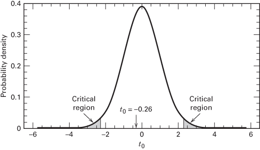

## 2.5 Inferences About the Differences in Means, Paired Comparison Designs

## 2.5.1 The Paired Comparison Problem

In some simple comparative experiments, we can greatly improve the precision by making comparisons within matched pairs of experimental material. For example, consider a hardness testing machine that presses a rod with a pointed tip into a metal specimen with a known force. By measuring the depth of the depression caused by the tip, the hardness of the specimen is determined. Two different tips are available for this machine, and although the precision (variability) of the measurements made by the two tips seems to be the same, it is suspected that one tip produces different mean hardness readings than the other.

An experiment could be performed as follows. A number of metal specimens (e.g., 20) could be randomly selected. Half of these specimens could be tested by tip 1 and the other half by tip 2. The exact assignment of specimens to tips would be randomly determined. Because this is a completely randomized design, the average hardness of the two samples could be compared using the t-test described in Section 2.4.

TABLE 2.5  
Tests on Means of Normal Distributions, Variance Unknown

<table><tr><td>Hypothesis</td><td>Test Statistic</td><td>Fixed Significance Level Criteria for Rejection</td><td>P-Value</td></tr><tr><td> $H_0: \mu = \mu_0$ </td><td></td><td></td><td rowspan="2">Sum of the probability above  $t_0$  and below  $-t_0$ </td></tr><tr><td> $H_1: \mu \neq \mu_0$ </td><td></td><td> $|t_0| > t_{\alpha/2,n-1}$ </td></tr><tr><td> $H_0: \mu = \mu_0$ </td><td></td><td></td><td></td></tr><tr><td> $H_1: \mu < \mu_0$ </td><td> $t_0 = \frac{\bar{y} - \mu_0}{S/\sqrt{n}}$ </td><td> $t_0 < -t_{\alpha,n-1}$ </td><td>Probability below  $t_0$ </td></tr><tr><td> $H_0: \mu = \mu_0$ </td><td></td><td></td><td></td></tr><tr><td> $H_1: \mu > \mu_0$ </td><td></td><td> $t_0 > t_{\alpha,n-1}$ </td><td>Probability above  $t_0$ </td></tr><tr><td></td><td> $\overline{\text{if } \sigma_1^2 = \sigma_2^2}$ </td><td></td><td></td></tr><tr><td> $H_0: \mu_1 = \mu_2$ </td><td></td><td></td><td></td></tr><tr><td> $H_1: \mu_1 \neq \mu_2$ </td><td> $t_0 = \frac{\bar{y}_1 - \bar{y}_2}{S_p \sqrt{\frac{1}{n_1} + \frac{1}{n_2}}}$ </td><td> $|t_0| > t_{\alpha/2,v}$ </td><td>Sum of the probability above  $t_0$  and below  $-t_0$ </td></tr><tr><td></td><td> $\frac{v = n_1 + n_2 - 2}{\text{if } \sigma_1^2 \neq \sigma_2^2}$ </td><td></td><td></td></tr><tr><td> $H_0: \mu_1 = \mu_2$ </td><td></td><td></td><td></td></tr><tr><td> $H_1: \mu_1 < \mu_2$ </td><td> $t_0 = \frac{\bar{y}_1 - \bar{y}_2}{\sqrt{\frac{S_1^2}{n_1} + \frac{S_2^2}{n_2}}}$ </td><td> $t_0 < -t_{\alpha,v}$ </td><td>Probability below  $t_0$ </td></tr><tr><td> $H_0: \mu_1 = \mu_2$ </td><td></td><td></td><td></td></tr><tr><td> $H_1: \mu_1 > \mu_2$ </td><td> $v = \frac{\left( \frac{S_1^2}{n_1} + \frac{S_2^2}{n_2} \right)^2}{\frac{(S_1^2/n_1)^2}{n_1 - 1} + \frac{(S_2^2/n_2)^2}{n_2 - 1}}$ </td><td> $t_0 > t_{\alpha,v}$ </td><td>Probability above  $t_0$ </td></tr></table>

A little reflection will reveal a serious disadvantage in the completely randomized design for this problem. Suppose that the metal specimens were cut from different bar stock that were produced in different heats or that were not exactly homogeneous in some other way that might affect the hardness. This lack of homogeneity between specimens will contribute to the variability of the hardness measurements and will tend to inflate the experimental error, thus making a true difference between tips harder to detect.

To protect against this possibility, consider an alternative experimental design. Assume that each specimen is large enough so that two hardness determinations may be made on it. This alternative design would consist of dividing each specimen into two parts, then randomly assigning one tip to one-half of each specimen and the other tip to the remaining half. The order in which the tips are tested for a particular specimen would also be randomly selected. The experiment, when performed according to this design with 10 specimens, produced the (coded) data shown in Table 2.6.

We may write a statistical model that describes the data from this experiment as

$$
y _ {i j} = \mu_ {i} + \beta_ {j} + \varepsilon_ {i j} \left\{ \begin{array}{l} i = 1, 2 \\ j = 1, 2, \ldots , 1 0 \end{array} \right.\tag{2.39}
$$

where $y_{ij}$ is the observation on hardness for tip i on specimen j, $\mu_{i}$ is the true mean hardness of the ith tip, $\beta_{j}$ is an effect on hardness due to the jth specimen, and $\varepsilon_{ij}$ is a random experimental error with mean zero and variance $\sigma_{i}^{2}$ . That is, $\sigma_{1}^{2}$ is the variance of the hardness measurements from tip 1, and $\sigma_{2}^{2}$ is the variance of the hardness measurements from tip 2.

Note that if we compute the jth paired difference

$$
d _ {j} = y _ {1 j} - y _ {2 j} \quad j = 1, 2, \dots , 1 0\tag{2.40}
$$

TABLE 2.6  
Data for the Hardness Testing Experiment

<table><tr><td>Specimen</td><td>Tip 1</td><td>Tip 2</td></tr><tr><td>1</td><td>7</td><td>6</td></tr><tr><td>2</td><td>3</td><td>3</td></tr><tr><td>3</td><td>3</td><td>5</td></tr><tr><td>4</td><td>4</td><td>3</td></tr><tr><td>5</td><td>8</td><td>8</td></tr><tr><td>6</td><td>3</td><td>2</td></tr><tr><td>7</td><td>2</td><td>4</td></tr><tr><td>8</td><td>9</td><td>9</td></tr><tr><td>9</td><td>5</td><td>4</td></tr><tr><td>10</td><td>4</td><td>5</td></tr></table>

the expected value of this difference is

$$
\begin{array}{r l} & {\mu_ {d} = E (d _ {j})} \\ & {\quad = E (y _ {1 j} - y _ {2 j})} \\ & {\quad = E (y _ {1 j}) - E (y _ {2 j})} \\ & {\quad = \mu_ {1} + \beta_ {j} - (\mu_ {2} + \beta_ {j})} \\ & {\quad = \mu_ {1} - \mu_ {2}} \end{array}
$$

That is, we may make inferences about the difference in the mean hardness readings of the two tips $\mu_{1}-\mu_{2}$ by making inferences about the mean of the differences $\mu_{d}$ . Notice that the additive effect of the specimens $\beta_{j}$ cancels out when the observations are paired in this manner.

Testing $H_0: \mu_1 = \mu_2$ is equivalent to testing

$$
\begin{array}{l} H _ {0}: \mu_ {d} = 0 \\ H _ {1}: \mu_ {d} \neq 0 \end{array}
$$

This is a single-sample t-test. The test statistic for this hypothesis is

$$
t _ {0} = \frac {\overline {{d}}}{S _ {d} / \sqrt {n}}\tag{2.41}
$$

where

$$
\overline {{d}} = \frac {1}{n} \sum_ {j = 1} ^ {n} d _ {j}\tag{2.42}
$$

is the sample mean of the differences and

$$
S _ {d} = \left[ \frac {\sum_ {j = 1} ^ {n} (d _ {j} - \overline {{d}}) ^ {2}}{n - 1} \right] ^ {1 / 2} = \left[ \frac {\sum_ {j = 1} ^ {n} d _ {j} ^ {2} - \frac {1}{n} \left(\sum_ {j = 1} ^ {n} d _ {j}\right) ^ {2}}{n - 1} \right] ^ {1 / 2}\tag{2.43}
$$

is the sample standard deviation of the differences. $H_{0}:\mu_{d}=0$ would be rejected if $|t_{0}|>t_{\alpha/2,n-1}$ . A P-value approach could also be used. Because the observations from the factor levels are “paired” on each experimental unit, this procedure is usually called the paired t-test.

For the data in Table 2.6, we find

$$
d _ {1} = 7 - 6 = 1 \quad d _ {6} = 3 - 2 = 1
$$

$$
d _ {2} = 3 - 3 = 0 \quad d _ {7} = 2 - 4 = - 2
$$

$$
d _ {3} = 3 - 5 = - 2 \quad d _ {8} = 9 - 9 = 0
$$

$$
d _ {4} = 4 - 3 = 1 \qquad d _ {9} = 5 - 4 = 1
$$

$$
d _ {5} = 8 - 8 = 0 \quad d _ {1 0} = 4 - 5 = - 1
$$

Thus,

$$
\overline {{{{d}}}} = \frac {1}{n} \sum_ {j = 1} ^ {n} d _ {j} = \frac {1}{1 0} (- 1) = - 0. 1 0
$$

$$
S _ {d} = \left[ \frac {\sum_ {j = 1} ^ {n} d _ {j} ^ {2} - \frac {1}{n} \left(\sum_ {j = 1} ^ {n} d _ {j}\right) ^ {2}}{n - 1} \right] ^ {1 / 2} = \left[ \frac {1 3 - \frac {1}{1 0} (- 1) ^ {2}}{1 0 - 1} \right] ^ {1 / 2} = 1. 2 0
$$

Suppose that we choose $\alpha = 0.05$ . Now to make a decision, we would compute $t_0$ and reject $H_0$ if $|t_0| > t_{0.025,9} = 2.262$ . The computed value of the paired $t$ -test statistic is

$$
t _ {0} = \frac {\overline {{{d}}}}{S _ {d} / \sqrt {n}} = \frac {- 0 . 1 0}{1 . 2 0 / \sqrt {1 0}} = - 0. 2 6
$$

and because $|t_{0}| = 0.26 \not\geq t_{0.025,9} = 2.262$ , we cannot reject the hypothesis $H_{0}: \mu_{d} = 0$ . That is, there is no evidence to indicate that the two tips produce different hardness readings. Figure 2.15 shows the $t_{0}$ distribution with 9 degrees of freedom, the reference distribution for this test, with the value of $t_{0}$ shown relative to the critical region.

Table 2.7 shows the computer output from the Minitab paired t-test procedure for this problem. Notice that the P-value for this test is $P \simeq 0.80$ , implying that we cannot reject the null hypothesis at any reasonable level of significance.

## 2.5.2 Advantages of the Paired Comparison Design

The design actually used for this experiment is called the paired comparison design, and it illustrates the blocking principle discussed in Section 1.3. Actually, it is a special case of a more general type of design called the randomized block design. The term block refers to a relatively homogeneous experimental unit (in our case, the metal specimens are the blocks), and the block represents a restriction on complete randomization because the treatment combinations are only randomized within the block. We look at designs of this type in Chapter 4. In that chapter, the mathematical model for the design, Equation 2.39, is written in a slightly different form.

■ FIGURE 2.15 The reference distribution (t with 9 degrees of freedom) for the hardness testing problem  

TABLE 2.7  
Minitab Paired t-Test Results for the Hardness Testing Example

<table><tr><td colspan="5">Paired T for Tip 1-Tip 2</td></tr><tr><td></td><td>N</td><td>Mean</td><td>Std. Dev.</td><td>SE Mean</td></tr><tr><td>Tip 1</td><td>10</td><td>4.800</td><td>2.394</td><td>0.757</td></tr><tr><td>Tip 2</td><td>10</td><td>4.900</td><td>2.234</td><td>0.706</td></tr><tr><td>Difference</td><td>10</td><td>-0.100</td><td>1.197</td><td>0.379</td></tr><tr><td colspan="5">95% CI for mean difference: (-0.956, 0.756)t-Test of mean difference = 0 (vs not = 0):T-Value = -0.26 P-Value = 0.798</td></tr></table>

Before leaving this experiment, several points should be made. Note that, although $2n = 2(10) = 20$ observations have been taken, only n - 1 = 9 degrees of freedom are available for the t statistic. (We know that as the degrees of freedom for t increase, the test becomes more sensitive.) By blocking or pairing we have effectively “lost” n - 1 degrees of freedom, but we hope we have gained a better knowledge of the situation by eliminating an additional source of variability (the difference between specimens).

We may obtain an indication of the quality of information produced from the paired design by comparing the standard deviation of the differences $S_{d}$ with the pooled standard deviation $S_{p}$ that would have resulted had the experiment been conducted in a completely randomized manner and the data of Table 2.5 been obtained. Using the data in Table 2.5 as two independent samples, we compute the pooled standard deviation from Equation 2.25 to be $S_{p} = 2.32$ . Comparing this value to $S_{d} = 1.20$ , we see that blocking or pairing has reduced the estimate of variability by nearly 50 percent.

Generally, when we don't block (or pair the observations) when we really should have, $S_{p}$ will always be larger than $S_{d}$ . It is easy to show this formally. If we pair the observations, it is easy to show that $S_{d}^{2}$ is an unbiased estimator of the variance of the differences $d_{j}$ under the model in Equation 2.39 because the block effects (the $\beta_{j}$ ) cancel out when the differences are computed. However, if we don't block (or pair) and treat the observations as two independent samples, then $S_{p}^{2}$ is not an unbiased estimator of $\sigma^2$ under the model in Equation 2.39. In fact, assuming that both population variances are equal,

$$
E (S _ {p} ^ {2}) = \sigma^ {2} + \sum_ {j = 1} ^ {n} \beta_ {j} ^ {2}
$$

That is, the block effects $\beta_{j}$ inflate the variance estimate. This is why blocking serves as a noise reduction design technique.

We may also express the results of this experiment in terms of a confidence interval on $\mu_{1}-\mu_{2}$ . Using the paired data, a 95 percent confidence interval on $\mu_{1}-\mu_{2}$ is

$$
\begin{array}{c} \overline {{d}} \pm t _ {0. 0 2 5, 9} S _ {d} / \sqrt {n} \\ - 0. 1 0 \pm (2. 2 6 2) (1. 2 0) / \sqrt {1 0} \\ - 0. 1 0 \pm 0. 8 6 \end{array}
$$

Conversely, using the pooled or independent analysis, a 95 percent confidence interval on $\mu_{1}-\mu_{2}$ is

$$
\begin{array}{c} \overline {{y}} _ {1} - \overline {{y}} _ {2} \pm t _ {0. 0 2 5, 1 8} S _ {p} \sqrt {\frac {1}{n _ {1}} + \frac {1}{n _ {2}}} \\ 4. 8 0 - 4. 9 0 \pm (2. 1 0 1) (2. 3 2) \sqrt {\frac {1}{1 0} + \frac {1}{1 0}} \\ - 0. 1 0 \pm 2. 1 8 \end{array}
$$

The confidence interval based on the paired analysis is much narrower than the confidence interval from the independent analysis. This again illustrates the noise reduction property of blocking.

Blocking is not always the best design strategy. If the within-block variability is the same as the between-block variability, the variance of $\overline{y}_{1}-\overline{y}_{2}$ will be the same regardless of which design is used. Actually, blocking in this situation would be a poor choice of design because blocking results in the loss of n-1 degrees of freedom and will actually lead to a wider confidence interval on $\mu_{1}-\mu_{2}$ . A further discussion of blocking is given in Chapter 4.
