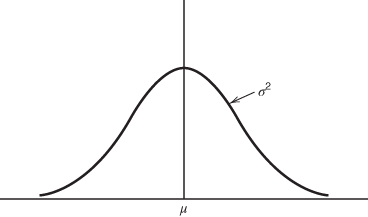
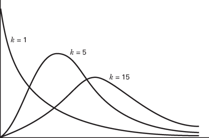
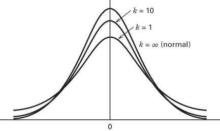
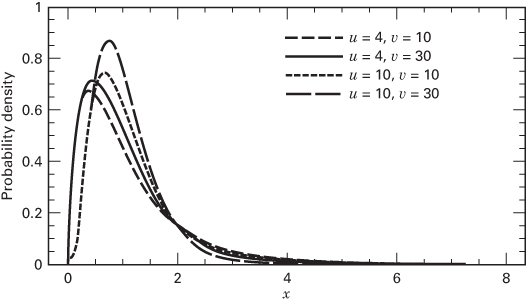

# 2.3 抽样与抽样分布

**随机样本、样本均值与样本方差。** 统计推断的目标是利用来自某个总体的样本来对该总体做出结论。我们将要研究的大多数方法都假定使用的是**随机样本**。随机样本是这样从总体中抽取的样本：每一个可能的样本被抽到的概率都相等。在实践中，有时很难获得随机样本，计算机程序产生的随机数可能有所帮助。

统计推断大量使用由样本观测值计算出来的量。我们把**统计量**（statistic）定义为样本观测值的任何不含未知参数的函数。例如，假设 $y_{1}, y_{2}, \ldots, y_{n}$ 表示一个样本，那么样本均值

$$
\overline{y} = \frac{\sum_{i=1}^{n} y_{i}}{n} \tag{2.7}
$$

和样本方差

$$
S^{2} = \frac{\sum_{i=1}^{n} (y_{i}-\overline{y})^{2}}{n-1} \tag{2.8}
$$

都是统计量。这两个量分别是样本集中趋势和离散程度的度量。有时也用 $S=\sqrt{S^{2}}$（称为**样本标准差**）作为离散程度的度量。试验者往往更愿意用标准差来度量离散程度，因为它的单位与所关注的变量 $y$ 相同。

**样本均值与样本方差的性质。** 样本均值 $\bar{y}$ 是总体均值 $\mu$ 的**点估计量**（point estimator），样本方差 $S^{2}$ 是总体方差 $\sigma^{2}$ 的点估计量。一般来说，未知参数的估计量就是与该参数相对应的统计量。注意，点估计量是一个随机变量。由样本数据算出的估计量的某个具体数值称为**估计值**（estimate）。例如，假设我们希望估计某湖水中悬浮固体物质的均值和方差。随机抽取 $n=25$ 个观测值进行检测，测量并记录每个观测值的悬浮固体含量（mg/l）。按式 2.7 和式 2.8 分别计算样本均值和方差，得 $\bar{y}=18.6$、$S^{2}=1.20$。因此 $\mu$ 的估计值为 $\bar{y}=18.6$ mg/l，$\sigma^{2}$ 的估计值为 $S^{2}=1.20\ (\text{mg/l})^{2}$。

好的点估计量需要满足若干性质，其中最重要的两条是：

1. 点估计量应当是**无偏的**（unbiased）。也就是说，点估计量的长期平均值或期望值应当等于被估计的参数。尽管无偏性是可取的，但仅有这一性质并不总能保证估计量是好的。

2. 无偏估计量应当具有**最小方差**。这一性质说的是，最小方差点估计量的方差小于该参数任何其他估计量的方差。

我们很容易证明 $\overline{y}$ 和 $S^{2}$ 分别是 $\mu$ 和 $\sigma^{2}$ 的无偏估计量。先考虑 $\overline{y}$。利用期望的性质，有

$$
\begin{aligned}
E(\overline{y}) &= E\left(\frac{\sum_{i=1}^{n} y_{i}}{n}\right) \\
&= \frac{1}{n}\sum_{i=1}^{n} E(y_{i}) \\
&= \frac{1}{n}\sum_{i=1}^{n} \mu \\
&= \mu
\end{aligned}
$$

因为每个观测值 $y_{i}$ 的期望值都是 $\mu$。因此 $\bar{y}$ 是 $\mu$ 的无偏估计量。现在考虑样本方差 $S^{2}$。我们有

$$
\begin{aligned}
E(S^{2}) &= E\left[\frac{\sum_{i=1}^{n} (y_{i}-\overline{y})^{2}}{n-1}\right] \\
&= \frac{1}{n-1} E\left[\sum_{i=1}^{n} (y_{i}-\overline{y})^{2}\right] \\
&= \frac{1}{n-1} E(SS)
\end{aligned}
$$

其中 $SS=\sum_{i=1}^{n} (y_{i}-\overline{y})^{2}$ 是观测值 $y_{i}$ 的**校正平方和**（corrected sum of squares）。于是

$$
\begin{aligned}
E(SS) &= E\left[\sum_{i=1}^{n} (y_{i}-\overline{y})^{2}\right] \\
&= E\left[\sum_{i=1}^{n} y_{i}^{2} - n\overline{y}^{2}\right] \\
&= \sum_{i=1}^{n} (\mu^{2}+\sigma^{2}) - n(\mu^{2}+\sigma^{2}/n) \\
&= (n-1)\sigma^{2}
\end{aligned} \tag{2.9}
$$

因此

$$
E(S^{2}) = \frac{1}{n-1} E(SS) = \sigma^{2} \tag{2.10}
$$

所以 $S^{2}$ 是 $\sigma^{2}$ 的无偏估计量。

**自由度。** 式 2.10 中的量 $n-1$ 称为平方和 $SS$ 的**自由度**个数。这是一个非常一般的结果；也就是说，若 $y$ 是一个方差为 $\sigma^{2}$ 的随机变量，且 $SS=\sum (y_{i}-\overline{y})^{2}$ 具有 $v$ 个自由度，则

$$
E\left(\frac{SS}{v}\right) = \sigma^{2} \tag{2.11}
$$

一个平方和的自由度个数等于该平方和中独立元素的个数。例如，式 2.9 中的 $SS=\sum_{i=1}^{n} (y_{i}-\overline{y})^{2}$ 由 $n$ 个元素 $y_{1}-\overline{y}, y_{2}-\overline{y}, \ldots, y_{n}-\overline{y}$ 的平方和构成。由于 $\sum_{i=1}^{n} (y_{i}-\overline{y})=0$，这些元素并非全都独立；事实上其中只有 $n-1$ 个是独立的，这意味着 $SS$ 有 $n-1$ 个自由度。

**图 2.5 正态分布**

**正态分布与其他抽样分布。** 如果我们知道抽取样本的总体的概率分布，常常就能确定某个特定统计量的概率分布。统计量的概率分布称为**抽样分布**（sampling distribution）。下面我们简要讨论几个有用的抽样分布。

最重要的抽样分布之一是**正态分布**（normal distribution）。若 $y$ 是正态随机变量，则 $y$ 的概率分布为

$$
f(y) = \frac{1}{\sigma\sqrt{2\pi}} e^{-(1/2)[(y-\mu)/\sigma]^{2}} \quad -\infty < y < \infty \tag{2.12}
$$

其中 $-\infty < \mu < \infty$ 是分布的均值，$\sigma^{2} > 0$ 是方差。正态分布如图 2.5 所示。

由于因试验误差而互不相同的样本观测值往往可以用正态分布很好地描述，正态分布在分析设计好的试验数据时起着核心作用。许多重要的抽样分布也可以用正态随机变量来定义。我们常用记号 $y \sim N(\mu,\sigma^{2})$ 表示 $y$ 服从均值为 $\mu$、方差为 $\sigma^{2}$ 的正态分布。

正态分布的一个重要的特例是**标准正态分布**，即 $\mu=0$、$\sigma^{2}=1$。我们看到，若 $y \sim N(\mu,\sigma^{2})$，则随机变量

$$
z = \frac{y-\mu}{\sigma} \tag{2.13}
$$

服从标准正态分布，记为 $z \sim N(0,1)$。式 2.13 所示的操作通常称为把正态随机变量 $y$ **标准化**。标准正态分布的累积分布表见附录表 I。

许多统计技术都假定随机变量服从正态分布。**中心极限定理**常常是近似正态性的依据。

## 定理 2-1 中心极限定理

若 $y_{1}, y_{2}, \ldots, y_{n}$ 是 $n$ 个独立同分布随机变量序列，$E(y_{i})=\mu$、$V(y_{i})=\sigma^{2}$（两者均有限），且 $x=y_{1}+y_{2}+\cdots+y_{n}$，则当 $n \to \infty$ 时，

$$
z_{n} = \frac{x-n\mu}{\sqrt{n\sigma^{2}}}
$$

的分布的极限形式是标准正态分布。

这一结果基本上说明：$n$ 个独立同分布随机变量之和近似服从正态分布。在许多情况下，这一近似在 $n$ 很小时（比如 $n<10$）就相当好；而在另一些情况下则需要较大的 $n$（比如 $n>100$）。我们常常把试验中的误差设想为来自若干独立来源的可加性贡献；因此正态分布就成为合成试验误差的一个合理模型。

可以用正态随机变量定义的一个重要抽样分布是**卡方**分布或 $\chi^{2}$ 分布。若 $z_{1}, z_{2}, \ldots, z_{k}$ 是均值为 0、方差为 1 的正态独立随机变量（简记为 NID(0, 1)），则随机变量

$$
x = z_{1}^{2}+z_{2}^{2}+\cdots+z_{k}^{2}
$$

服从自由度为 $k$ 的卡方分布。卡方分布的密度函数为

$$
f(x) = \frac{1}{2^{k/2}\Gamma\left(\frac{k}{2}\right)} x^{(k/2)-1} e^{-x/2} \quad x > 0 \tag{2.14}
$$

图 2.6 给出了若干个卡方分布。该分布是非对称的（即偏斜的），其均值和方差分别为

$$
\begin{array}{c}
\mu = k \\
\sigma^{2} = 2k
\end{array}
$$

卡方分布的上侧分位点见附录表 III。

作为服从卡方分布的随机变量的一个例子，假设 $y_{1}, y_{2}, \ldots, y_{n}$ 是来自 $N(\mu,\sigma^{2})$ 分布的随机样本，则

$$
\frac{SS}{\sigma^{2}} = \frac{\sum_{i=1}^{n} (y_{i}-\overline{y})^{2}}{\sigma^{2}} \sim \chi_{n-1}^{2} \tag{2.15}
$$

也就是说，$SS/\sigma^{2}$ 服从自由度为 $n-1$ 的卡方分布。

本书使用的许多技术都涉及平方和的计算与变换。式 2.15 给出的结果极为重要且反复出现：正态随机变量的平方和除以 $\sigma^{2}$ 后服从卡方分布。

考察式 2.8，注意样本方差可以写成

$$
S^{2} = \frac{SS}{n-1} \tag{2.16}
$$

如果样本中的观测值是 $\mathrm{NID}(\mu,\sigma^{2})$，那么 $S^{2}$ 的分布是 $[\sigma^{2}/(n-1)]\chi_{n-1}^{2}$。因此，若总体服从正态分布，则样本方差的抽样分布是卡方分布的常数倍。

**图 2.6 若干卡方分布**

若 $z$ 和 $\chi_{k}^{2}$ 分别是独立的标准正态随机变量和卡方随机变量，则随机变量

$$
t_{k} = \frac{z}{\sqrt{\chi_{k}^{2}/k}} \tag{2.17}
$$

服从自由度为 $k$ 的 $t$ 分布，记为 $t_{k}$。$t$ 分布的密度函数为

$$
f(t) = \frac{\Gamma[(k+1)/2]}{\sqrt{k\pi}\,\Gamma(k/2)} \frac{1}{[(t^{2}/k)+1]^{(k+1)/2}} \quad -\infty < t < \infty \tag{2.18}
$$

当 $k>2$ 时，$t$ 分布的均值和方差分别为 $\mu=0$、$\sigma^{2}=k/(k-2)$。图 2.7 给出了若干 $t$ 分布。注意，若 $k=\infty$，$t$ 分布就成为标准正态分布。$t$ 分布的分位点见附录表 II。若 $y_{1}, y_{2}, \ldots, y_{n}$ 是来自 $N(\mu,\sigma^{2})$ 分布的随机样本，则量

$$
t = \frac{\overline{y}-\mu}{S/\sqrt{n}} \tag{2.19}
$$

服从自由度为 $n-1$ 的 $t$ 分布。

我们要考虑的最后一个抽样分布是 $F$ 分布。若 $\chi_{u}^{2}$ 和 $\chi_{v}^{2}$ 是两个独立的卡方随机变量，自由度分别为 $u$ 和 $v$，则比值

$$
F_{u,v} = \frac{\chi_{u}^{2}/u}{\chi_{v}^{2}/v} \tag{2.20}
$$

服从分子自由度为 $u$、分母自由度为 $v$ 的 $F$ 分布。若 $x$ 是分子自由度为 $u$、分母自由度为 $v$ 的 $F$ 随机变量，则 $x$ 的概率分布为

$$
h(x) = \frac{\Gamma\left(\frac{u+v}{2}\right)\left(\frac{u}{v}\right)^{u/2} x^{(u/2)-1}}{\Gamma\left(\frac{u}{2}\right)\Gamma\left(\frac{v}{2}\right)\left[\left(\frac{u}{v}\right)x+1\right]^{(u+v)/2}} \qquad 0 < x < \infty \tag{2.21}
$$

图 2.8 给出了若干 $F$ 分布。这一分布在设计好的试验的统计分析中非常重要。$F$ 分布的分位点见附录表 IV。

作为服从 $F$ 分布的统计量的一个例子，假设我们有两个方差同为 $\sigma^{2}$ 的独立正态总体。若 $y_{11}, y_{12}, \ldots, y_{1n_{1}}$ 是来自第一个总体的 $n_{1}$ 个观测值的随机样本，$y_{21}, y_{22}, \ldots, y_{2n_{2}}$ 是来自第二个总体的 $n_{2}$ 个观测值的随机样本，则

$$
\frac{S_{1}^{2}}{S_{2}^{2}} \sim F_{n_{1}-1, n_{2}-1} \tag{2.22}
$$

其中 $S_{1}^{2}$ 和 $S_{2}^{2}$ 是两个样本方差。这一结果直接由式 2.15 至式 2.20 得出。

**图 2.7 若干 $t$ 分布**

**图 2.8 若干 $F$ 分布**

