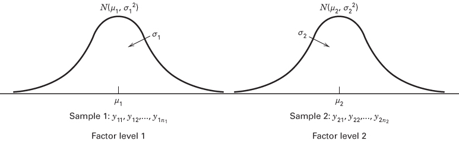
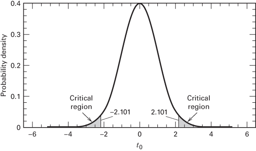
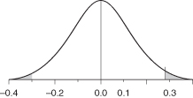
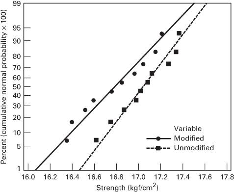
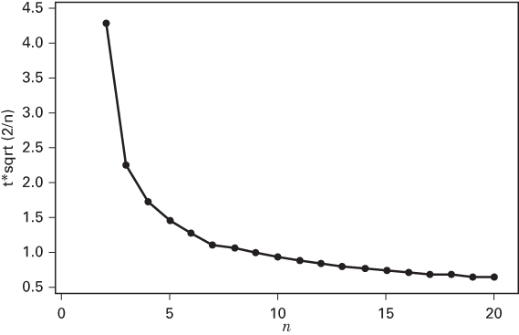
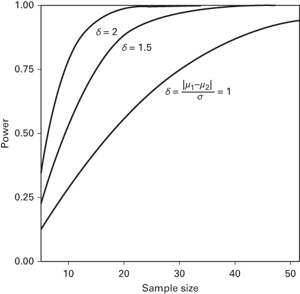
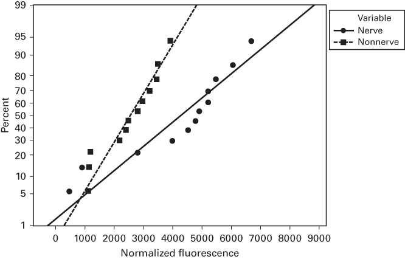

# 2.4 关于均值差的推断：随机化设计

现在我们回到 2.1 节提出的波特兰水泥砂浆问题。回忆一下，我们在研究两种不同的砂浆配方，以判断它们在拉伸粘结强度上是否有差异。本节讨论如何用假设检验和置信区间方法来分析这一简单比较试验的数据，以比较两个处理的均值。

在本节中，我们始终假定使用的是**完全随机化试验设计**。在这种设计中，数据被看作来自正态分布的随机样本。随机样本这一假定非常重要。

## 2.4.1 假设检验

现在我们重新考虑 2.1 节引入的波特兰水泥试验。回忆一下，我们感兴趣的是比较两种不同配方的强度：未改进砂浆和改进砂浆。一般地，我们可以把这两种配方看作“配方”因子的两个水平。令 $y_{11}, y_{12}, \ldots, y_{1n_{1}}$ 表示来自第一个因子水平的 $n_{1}$ 个观测值，$y_{21}, y_{22}, \ldots, y_{2n_{2}}$ 表示来自第二个因子水平的 $n_{2}$ 个观测值。我们假定样本是从两个独立正态总体中随机抽取的。图 2.9 说明了这一情形。

**数据的模型。** 我们常用模型来描述试验的结果。描述上述这类试验数据的一个简单统计模型是

$$
y_{ij} = \mu_{i} + \varepsilon_{ij} \quad \left\{ \begin{array}{ll} i = 1, 2 \\ j = 1, 2, \ldots, n_{i} \end{array} \right. \tag{2.23}
$$



**图 2.9 两样本 $t$ 检验的抽样情形**

其中 $y_{ij}$ 是来自因子水平 $i$ 的第 $j$ 个观测值，$\mu_{i}$ 是第 $i$ 个因子水平上响应的均值，$\varepsilon_{ij}$ 是与第 $ij$ 个观测值相关联的正态随机变量。我们假定 $\varepsilon_{ij}$ 服从 $\mathrm{NID}(0,\sigma_{i}^{2})$，$i=1,2$。习惯上把 $\varepsilon_{ij}$ 称为模型的**随机误差分量**。由于均值 $\mu_{1}$ 和 $\mu_{2}$ 是常数，由模型可直接看出 $y_{ij}$ 服从 $\mathrm{NID}(\mu_{i},\sigma_{i}^{2})$，$i=1,2$，正如我们先前所假定的那样。关于数据模型的更多信息，参见补充材料。

**统计假设。** **统计假设**（statistical hypothesis）是关于概率分布的参数或模型的参数的陈述。假设反映了对问题情境的某种猜想。例如，在波特兰水泥试验中，我们可能认为两种砂浆配方的平均拉伸粘结强度相等。这可以正式表述为

$$
\begin{array}{l}
H_{0}: \mu_{1} = \mu_{2} \\
H_{1}: \mu_{1} \neq \mu_{2}
\end{array}
$$

其中 $\mu_{1}$ 是改进砂浆的平均拉伸粘结强度，$\mu_{2}$ 是未改进砂浆的平均拉伸粘结强度。陈述 $H_{0}:\mu_{1}=\mu_{2}$ 称为**原假设**（null hypothesis），$H_{1}:\mu_{1}\neq\mu_{2}$ 称为**备择假设**（alternative hypothesis）。这里给出的备择假设称为**双侧备择假设**，因为无论 $\mu_{1}<\mu_{2}$ 还是 $\mu_{1}>\mu_{2}$，它都成立。

为了检验假设，我们要设计一个程序：抽取随机样本，计算适当的**检验统计量**，然后根据检验统计量的计算值拒绝或不拒绝原假设 $H_{0}$。这一程序的一部分是指定导致拒绝 $H_{0}$ 的检验统计量取值集合，这一取值集合称为检验的**临界域**或**拒绝域**（critical region 或 rejection region）。

检验假设时可能犯两类错误。若原假设为真却被拒绝，就犯了**第 I 类错误**（type I error）。若原假设为假却未被拒绝，就犯了**第 II 类错误**（type II error）。这两类错误的概率用专门的符号表示：

$$
\begin{array}{l}
\alpha = P(\text{第 I 类错误}) = P(\text{拒绝 } H_{0} \mid H_{0} \text{ 为真}) \\
\beta = P(\text{第 II 类错误}) = P(\text{不拒绝 } H_{0} \mid H_{0} \text{ 为假})
\end{array}
$$

有时更方便的做法是使用检验的**功效**（power），即

$$
\text{功效} = 1-\beta = P(\text{拒绝 } H_{0} \mid H_{0} \text{ 为假})
$$

假设检验的一般程序是：先指定第 I 类错误概率 $\alpha$ 的值（常称为检验的**显著性水平**），然后设计检验程序使第 II 类错误概率 $\beta$ 具有适当小的值。

**两样本 $t$ 检验。** 假设我们可以假定两种砂浆配方的拉伸粘结强度方差相同，那么完全随机化设计中用来比较两个处理均值的适当检验统计量是

$$
t_{0} = \frac{\overline{y}_{1}-\overline{y}_{2}}{S_{p}\sqrt{\frac{1}{n_{1}}+\frac{1}{n_{2}}}} \tag{2.24}
$$

其中 $\overline{y}_{1}$ 和 $\overline{y}_{2}$ 是样本均值，$n_{1}$ 和 $n_{2}$ 是样本量，$S_{p}^{2}$ 是公共方差 $\sigma_{1}^{2}=\sigma_{2}^{2}=\sigma^{2}$ 的估计量，由下式计算：

$$
S_{p}^{2} = \frac{(n_{1}-1)S_{1}^{2}+(n_{2}-1)S_{2}^{2}}{n_{1}+n_{2}-2} \tag{2.25}
$$

$S_{1}^{2}$ 和 $S_{2}^{2}$ 是两个单独的样本方差。式 2.24 分母中的量 $S_{p}\sqrt{\frac{1}{n_{1}}+\frac{1}{n_{2}}}$ 常称为分子中均值之差的**标准误**，简记为 $se(\overline{y}_{1}-\overline{y}_{2})$。为判断是否拒绝 $H_{0}:\mu_{1}=\mu_{2}$，我们把 $t_{0}$ 与自由度为 $n_{1}+n_{2}-2$ 的 $t$ 分布相比较。若 $|t_{0}|>t_{\alpha/2,n_{1}+n_{2}-2}$，其中 $t_{\alpha/2,n_{1}+n_{2}-2}$ 是自由度为 $n_{1}+n_{2}-2$ 的 $t$ 分布的上侧 $\alpha/2$ 分位点，则拒绝 $H_{0}$，并得出结论：两种波特兰水泥砂浆配方的平均强度不同。这一检验程序通常称为**两样本 $t$ 检验**。

这一程序可以这样说明其合理性。如果样本来自独立正态分布，那么 $\overline{y}_{1}-\overline{y}_{2}$ 的分布是 $N[\mu_{1}-\mu_{2},\sigma^{2}(1/n_{1}+1/n_{2})]$。因此，若 $\sigma^{2}$ 已知且 $H_{0}:\mu_{1}=\mu_{2}$ 为真，则

$$
Z_{0} = \frac{\overline{y}_{1}-\overline{y}_{2}}{\sigma\sqrt{\frac{1}{n_{1}}+\frac{1}{n_{2}}}} \tag{2.26}
$$

的分布为 $N(0,1)$。然而，当把式 2.26 中的 $\sigma$ 换成 $S_{p}$ 后，$Z_{0}$ 的分布就从标准正态变为自由度为 $n_{1}+n_{2}-2$ 的 $t$ 分布。此时若 $H_{0}$ 为真，式 2.24 中的 $t_{0}$ 服从 $t_{n_{1}+n_{2}-2}$，因而我们预期 $t_{0}$ 的取值有 $100(1-\alpha)$ 个百分点落在 $-t_{\alpha/2,n_{1}+n_{2}-2}$ 与 $t_{\alpha/2,n_{1}+n_{2}-2}$ 之间。若某样本产生的 $t_{0}$ 值落在这些界限之外，则当原假设为真时这是不寻常的，说明应当拒绝 $H_{0}$。因此，自由度为 $n_{1}+n_{2}-2$ 的 $t$ 分布是检验统计量 $t_{0}$ 的适当**参考分布**（reference distribution），也就是说，它描述了原假设为真时 $t_{0}$ 的行为。注意 $\alpha$ 是该检验的第 I 类错误概率，有时也称为检验的**显著性水平**。

在某些问题中，人们可能只想在某个均值大于另一个均值时才拒绝 $H_{0}$。此时应指定单侧备择假设 $H_{1}: \mu_{1} > \mu_{2}$，并且只在 $t_{0} > t_{\alpha,n_{1}+n_{2}-2}$ 时拒绝 $H_{0}$。若只想在 $\mu_{1}$ 小于 $\mu_{2}$ 时拒绝 $H_{0}$，则备择假设为 $H_{1}: \mu_{1} < \mu_{2}$，并在 $t_{0} < -t_{\alpha,n_{1}+n_{2}-2}$ 时拒绝 $H_{0}$。

为说明这一程序，考虑表 2.1 中的波特兰水泥数据。对这些数据，我们得到

| 改进砂浆 | 未改进砂浆 |
| --- | --- |
| $\overline{y}_{1} = 16.76\ \text{kgf/cm}^{2}$ | $\overline{y}_{2} = 17.04\ \text{kgf/cm}^{2}$ |
| $S_{1}^{2} = 0.100$ | $S_{2}^{2} = 0.061$ |
| $S_{1} = 0.316$ | $S_{2} = 0.248$ |
| $n_{1} = 10$ | $n_{2} = 10$ |

由于两个样本标准差相当接近，认为总体标准差（或方差）相等的结论并不算勉强。因此我们可用式 2.24 检验假设

$$
\begin{array}{l}
H_{0}: \mu_{1} = \mu_{2} \\
H_{1}: \mu_{1} \neq \mu_{2}
\end{array}
$$

此外，$n_{1}+n_{2}-2=10+10-2=18$，若取 $\alpha=0.05$，则当检验统计量的数值 $t_{0}>t_{0.025,18}=2.101$ 或 $t_{0}<-t_{0.025,18}=-2.101$ 时拒绝 $H_{0}:\mu_{1}=\mu_{2}$。临界域的这些边界已在图 2.10 的参考分布（自由度为 18 的 $t$ 分布）上标出。

利用式 2.25，我们得到

$$
\begin{aligned}
S_{p}^{2} &= \frac{(n_{1}-1)S_{1}^{2}+(n_{2}-1)S_{2}^{2}}{n_{1}+n_{2}-2} \\
&= \frac{9(0.100)+9(0.061)}{10+10-2} = 0.081 \\
S_{p} &= 0.284
\end{aligned}
$$



**图 2.10 自由度为 18 的 $t$ 分布，临界域为 $\pm t_{0.025,18}=\pm 2.101$**

检验统计量为

$$
\begin{aligned}
t_{0} &= \frac{\overline{y}_{1}-\overline{y}_{2}}{S_{p}\sqrt{\frac{1}{n_{1}}+\frac{1}{n_{2}}}} = \frac{16.76-17.04}{0.284\sqrt{\frac{1}{10}+\frac{1}{10}}} \\
&= \frac{-0.28}{0.127} = -2.20
\end{aligned}
$$

因为 $t_{0}=-2.20 < -t_{0.025,18}=-2.101$，我们拒绝 $H_{0}$，并得出结论：两种波特兰水泥砂浆配方的平均拉伸粘结强度不同。这是一个可能重要的工程发现。砂浆配方的改变达到了缩短固化时间的预期效果，但有证据表明这一改变也影响了拉伸粘结强度。可以得出结论：改进配方降低了粘结强度（仅仅因为我们做了双侧检验，并不妨碍在原假设被拒绝时得出单侧结论）。如果平均粘结强度的下降具有实际重要性（或者在统计显著性之外还有工程意义），那么很可能需要做更多的开发工作和进一步的试验。

**$P$ 值在假设检验中的应用。** 报告假设检验结果的一种方式是说明在某个给定的 $\alpha$ 值（即显著性水平）下原假设是否被拒绝。这通常称为**固定显著性水平检验**（fixed significance level testing）。例如，在上面的波特兰水泥砂浆配方中，我们可以说 $H_{0}:\mu_{1}=\mu_{2}$ 在 0.05 的显著性水平下被拒绝。这种结论陈述往往不够充分，因为它没有让决策者了解检验统计量的计算值是刚刚落入拒绝域，还是深入拒绝域内部。此外，这样陈述结果会把预先设定的显著性水平强加给信息的其他使用者。这种做法可能不合适，因为有些决策者可能对 $\alpha=0.05$ 所隐含的风险感到不安。

为避免这些困难，**$P$ 值**方法在实践中被广泛采用。**$P$ 值**是当原假设 $H_{0}$ 为真时，检验统计量取到至少与观测值一样极端（extreme）的值的概率。因此，$P$ 值传达了关于反对 $H_{0}$ 的证据强度的大量信息，决策者因而可以在任何指定的显著性水平上得出结论。更正式地说，我们把 $P$ 值定义为会导致拒绝原假设 $H_{0}$ 的最小显著性水平。

当原假设 $H_{0}$ 被拒绝时，习惯上说检验统计量（以及数据）是**显著的**；因此，我们可以把 $P$ 值看作使数据显著的最小水平 $\alpha$。一旦知道了 $P$ 值，决策者就能判断数据有多显著，而不必由数据分析者正式地强加一个预先选定的显著性水平。

计算检验的精确 $P$ 值并不总是容易的。然而，大多数现代统计分析计算机程序都会报告 $P$ 值，有些手持计算器也能得到 $P$ 值。我们来说明如何近似求出波特兰水泥砂浆试验的 $P$ 值。因为 $|t_{0}|=2.20 > t_{0.025,18}=2.101$，我们知道 $P$ 值小于 0.05。由附录表 II，对自由度为 18 的 $t$ 分布、尾面积为 0.01，查得 $t_{0.01,18}=2.552$。现在 $|t_{0}|=2.20 < 2.552$，又因为备择假设是双侧的，我们知道 $P$ 值必定在 0.05 与 $2(0.01)=0.02$ 之间。有些手持计算器能够计算 $P$ 值。由计算器可得，波特兰水泥砂浆配方试验中 $t_{0}=-2.20$ 对应的 $P$ 值为 $P=0.0411$。因此，原假设 $H_{0}:\mu_{1}=\mu_{2}$ 会在任何 $\alpha>0.0411$ 的显著性水平下被拒绝。

**计算机解答。** 许多统计软件包都有进行统计假设检验的功能。表 2.2 给出了把 Minitab 和 JMP 的两样本 $t$ 检验程序应用于波特兰水泥砂浆配方试验的输出。注意输出中包含一些关于两个样本的概括统计量（表中 Minitab 部分的缩写 “SE mean” 指均值的标准误 $s/\sqrt{n}$），以及一些关于两个均值之差的置信区间的信息（我们将在下一节讨论）。程序还检验了所关注的假设，并允许分析者指定备择假设的形式（Minitab 输出中的 “not =” 表示 $H_{1}:\mu_{1}\neq\mu_{2}$）。

输出中包括 $t_{0}$ 的计算值、检验统计量 $t_{0}$ 的值（由于检验统计量分子中两个样本均值的相减方式，JMP 报告的是正的 $t_{0}$ 值）以及 $P$ 值。注意 $t$ 统计量的计算值与我们的手算值略有不同，且报告的 $P$ 值为 $P=0.042$。JMP 还报告了单侧备择假设的 $P$ 值。许多软件包不会报告小于某个预定值（如 0.0001）的真实 $P$ 值，而是返回一个“默认”值，例如 “< 0.001”，有时甚至是 0。

**表 2.2 两样本 $t$ 检验的计算机输出**

```txt
Minitab
Two-sample T for Modified vs Unmodified
N Mean Std. Dev. SE Mean
Modified 10 16.764 0.316 0.10
Unmodified 10 17.042 0.248 0.078
Difference = mu (Modified) - mu (Unmodified)
Estimate for difference: -0.278000
95% CI for difference: (-0.545073, -0.010927)
T-Test of difference = 0 (vs not =): T-Value = -2.19
P-Value = 0.042 DF = 18
Both use Pooled Std. Dev. = 0.2843
JMP t-test
Unmodified-Modified
Assuming equal variances
Difference 0.278000 t Ratio 2.186876
Std Err Dif 0.127122 DF 18
Upper CL Dif 0.545073 Prob>|t| 0.0422
Lower CL Dif 0.010927 Prob>t 0.0211
Confidence 0.95 Prob<t 0.9789
```




**$t$ 检验中的假定检验。** 使用 $t$ 检验程序时，我们假定两个样本都是从独立总体中抽取的随机样本，这些总体可以用正态分布描述，并且两个总体的标准差或方差相等。**独立性**假定是关键的；如果运行顺序是随机化的（并且在适当情况下其他试验单元和材料也是随机选取的），这一假定通常能够满足。等方差和正态性假定则很容易用**正态概率图**（normal probability plot）来检验。

一般来说，**概率图**是一种图形技术，它通过对数据的主观目视检查来判断样本数据是否与某个假设的分布相符。其一般程序非常简单，用大多数统计软件包都能迅速完成。补充材料讨论了正态概率图的手工构造方法。

要构造概率图，首先把样本中的观测值从小到大排序。也就是说，把样本 $y_{1}, y_{2}, \ldots, y_{n}$ 排成 $y_{(1)}, y_{(2)}, \ldots, y_{(n)}$，其中 $y_{(1)}$ 是最小观测值，$y_{(2)}$ 是第二小的观测值，依此类推，$y_{(n)}$ 是最大观测值。然后把有序观测值 $y_{(j)}$ 对它们的观测累积频率 $(j-0.5)/n$ 作图。累积频率坐标的取法使得：若假设的分布能充分描述数据，则描点将大致落在一条直线上；若描点明显偏离直线，则假设的模型不合适。通常，判断数据是否描成直线是主观的。

为说明这一程序，假设我们想检验波特兰水泥砂浆配方试验中拉伸粘结强度服从正态分布这一假定。我们首先只考虑未改进砂浆配方的观测值。图 2.11 给出了计算机生成的正态概率图。大多数正态概率图在左侧纵轴上标出 $100(j-0.5)/n$（有时在右侧纵轴上标出 $100[1-(j-0.5)/n]$），横轴上标出变量值。有些计算机生成的正态概率图把累积频率转换成标准正态 $z$ 分数。图中已主观地画出一条穿过描点的直线。画这条直线时，你受图中部附近点的影响应当大于受极端点的影响。一条好的经验法则是把直线大致画在第 25 与第 75 百分位点之间。图 2.11 中每个样本的直线就是这样确定的。在评价描点与直线的“接近程度”时，可以想象有一支粗铅笔压在这条直线上：若所有点都被这支假想的铅笔盖住，则正态分布能充分描述数据。由于图 2.11 中每个样本的点都能通过这一“粗铅笔检验”，我们得出结论：正态分布是改进砂浆和未改进砂浆拉伸粘结强度的合适模型。

我们可以直接从正态概率图得到均值和标准差的估计。均值估计为概率图上的第 50 百分位数，标准差估计为第 84 百分位数与第 50 百分位数之差。这意味着，只要比较图 2.11 中两条直线的斜率，就可以验证波特兰水泥试验中总体方差相等这一假定。两条直线的斜率非常接近，因此等方差假定是合理的。若这一假定不成立，就应当使用 2.4.4 节中所述的 $t$ 检验版本。补充材料中关于检验 $t$ 检验假定的内容更多。



**图 2.11 波特兰水泥试验中拉伸粘结强度的正态概率图**

当假定被严重违背时，$t$ 检验的表现会受到影响。一般来说，假定受到轻度至中度的违背并不值得过分担忧，但独立性假定的任何失效以及非正态性的强烈迹象都不应忽视。检验的显著性水平以及检出均值之间差异的能力都会受到假定偏离的不利影响。**变换**（transformation）是处理这一问题的一种途径，我们将在第 3 章更详细地讨论。如果观测值来自非正态总体，也可以使用**非参数**假设检验方法。更多细节参见 Montgomery 和 Runger（2018）。

**$t$ 检验的另一种论证。** 我们刚刚给出的两样本 $t$ 检验在理论上依赖于这样一个假定：随机抽取样本所来自的两个总体都服从正态分布。尽管形式化地推导这一检验程序需要正态性假定，但如上所述，中度偏离正态性不会严重影响结果。可以论证，使用随机化设计使人能够在不对分布形式作任何假定的情况下检验假设。简要的推理如下：如果处理没有效应，那么这 20 个观测值可能出现的方式共有 $[20!/(10!10!)]=184{,}756$ 种，而它们是等可能的。与这 184 756 种可能排列相对应，每一种都有一个 $t_{0}$ 值。如果实际从数据得到的 $t_{0}$ 值相对于这 184 756 个可能取值来说异常大或异常小，就说明 $\mu_{1}\neq\mu_{2}$。

这类程序称为**随机化检验**（randomization test）。可以证明，$t$ 检验是随机化检验的一个很好的近似。因此，我们将使用 $t$ 检验（以及其他可以视为随机化检验近似的程序），而不必过分担心正态性假定。这也是正态概率图这类简单程序足以检验正态性假定的原因之一。

## 2.4.2 置信区间

尽管假设检验是一种有用的程序，但有时它并不能说明全部情况。通常更好的做法是给出一个区间，使人预期所关注的参数值落在其中。这类区间陈述称为**置信区间**（confidence interval）。在许多工程和工业试验中，试验者已经知道均值 $\mu_{1}$ 与 $\mu_{2}$ 不同；因此，对 $\mu_{1}=\mu_{2}$ 作假设检验意义不大。试验者通常更想知道两个均值相差多少。均值之差 $\mu_{1}-\mu_{2}$ 的置信区间就是用来回答这个问题的。只要可能，最好在每次假设检验的同时给出置信区间。

为定义置信区间，假设 $\theta$ 是未知参数。要得到 $\theta$ 的区间估计，需要找到两个统计量 $L$ 和 $U$，使得概率陈述

$$
P(L \leqslant \theta \leqslant U) = 1-\alpha \tag{2.27}
$$

成立。区间

$$
L \leqslant \theta \leqslant U \tag{2.28}
$$

称为参数 $\theta$ 的 $100(1-\alpha)$ 百分**置信区间**。该区间的解释是：若在重复随机抽样中构造大量这样的区间，其中 $100(1-\alpha)$ 个百分点会包含 $\theta$ 的真值。统计量 $L$ 和 $U$ 分别称为**置信下限**和**置信上限**，$1-\alpha$ 称为**置信系数**。若 $\alpha=0.05$，式 2.28 称为 $\theta$ 的 95% 置信区间。注意置信区间具有频率解释：也就是说，我们并不知道这个陈述对当前这个具体样本是否成立，但我们知道用来产生置信区间的方法在 $100(1-\alpha)$ 个百分点的场合下给出正确的陈述。

假设我们希望求出波特兰水泥问题中均值真差 $\mu_{1}-\mu_{2}$ 的 $100(1-\alpha)$ 百分置信区间。该区间可以这样导出。统计量

$$
\frac{\overline{y}_{1}-\overline{y}_{2}-(\mu_{1}-\mu_{2})}{S_{p}\sqrt{\frac{1}{n_{1}}+\frac{1}{n_{2}}}}
$$

服从 $t_{n_{1}+n_{2}-2}$ 分布。因此

$$
P \left(- t_{\alpha/2,n_{1}+n_{2}-2} \leq \frac{\overline{y}_{1}-\overline{y}_{2}-(\mu_{1}-\mu_{2})}{S_{p}\sqrt{\frac{1}{n_{1}}+\frac{1}{n_{2}}}} \leq t_{\alpha/2,n_{1}+n_{2}-2}\right) = 1-\alpha
$$

或

$$
\begin{aligned}
P \Bigg(\overline{y}_{1}-\overline{y}_{2} &- t_{\alpha/2,n_{1}+n_{2}-2} S_{p}\sqrt{\frac{1}{n_{1}}+\frac{1}{n_{2}}} \leq \mu_{1}-\mu_{2} \\
&\leq \overline{y}_{1}-\overline{y}_{2}+t_{\alpha/2,n_{1}+n_{2}-2} S_{p}\sqrt{\frac{1}{n_{1}}+\frac{1}{n_{2}}}\Bigg) = 1-\alpha
\end{aligned} \tag{2.29}
$$

比较式 2.29 与式 2.27，我们看到

$$
\overline{y}_{1}-\overline{y}_{2}-t_{\alpha/2,n_{1}+n_{2}-2} S_{p}\sqrt{\frac{1}{n_{1}}+\frac{1}{n_{2}}} \leq \mu_{1}-\mu_{2} \leq \overline{y}_{1}-\overline{y}_{2}+t_{\alpha/2,n_{1}+n_{2}-2} S_{p}\sqrt{\frac{1}{n_{1}}+\frac{1}{n_{2}}} \tag{2.30}
$$

是 $\mu_{1}-\mu_{2}$ 的 $100(1-\alpha)$ 百分置信区间。

把数值代入式 2.30，即得波特兰水泥砂浆两种配方平均拉伸粘结强度之差的实际 95% 置信区间估计：

$$
\begin{aligned}
16.76 - 17.04 &- (2.101)(0.284)\sqrt{\frac{1}{10}+\frac{1}{10}} \leq \mu_{1}-\mu_{2} \\
&\leq 16.76 - 17.04 + (2.101)(0.284)\sqrt{\frac{1}{10}+\frac{1}{10}} \\
-0.28 &- 0.27 \leq \mu_{1}-\mu_{2} \leq -0.28 + 0.27 \\
-0.55 &\leq \mu_{1}-\mu_{2} \leq -0.01
\end{aligned}
$$

因此，均值之差的 95% 置信区间估计从 $-0.55$ 延伸到 $-0.01$ kgf/cm$^{2}$。换句话说，置信区间为 $\mu_{1}-\mu_{2}=-0.28 \pm 0.27$ kgf/cm$^{2}$，即平均强度之差为 $-0.28$ kgf/cm$^{2}$，该估计的精度为 $\pm 0.27$ kgf/cm$^{2}$。注意，由于 $\mu_{1}-\mu_{2}=0$ 不在这一区间内，数据不支持在 5% 显著性水平下 $\mu_{1}=\mu_{2}$ 这一假设（回忆一下，两样本 $t$ 检验的 $P$ 值为 0.042，只比 0.05 略小）。很可能未改进配方的平均强度超过改进配方的平均强度。由表 2.2 可见，Minitab 和 JMP 在进行假设检验程序时都报告了这一置信区间。

## 2.4.3 样本量的选择

选择合适的样本量是任何试验设计问题中最重要的部分之一。做到这一点的一种方式是考虑样本量对两个均值之差估计的影响。由式 2.30 我们知道，两个均值之差的 $100(1-\alpha)\%$ 置信区间是两均值之差估计精度的一种度量。该区间的长度由下式决定：

$$
t_{\alpha/2,n_{1}+n_{2}-2} S_{p}\sqrt{\frac{1}{n_{1}}+\frac{1}{n_{2}}}
$$

我们考虑两个总体的样本量相等的情形，即 $n_{1}=n_{2}=n$。此时置信区间的长度由

$$
t_{\alpha/2,2n-2} S_{p}\sqrt{\frac{2}{n}}
$$

决定。因此，两个均值之差的估计精度取决于两个量：$S_{p}$（我们无法控制）以及 $t_{\alpha/2,2n-2}\sqrt{2/n}$（可以通过选择样本量 $n$ 来控制）。图 2.12 对 $\alpha=0.05$ 画出了 $t_{\alpha/2,2n-2}\sqrt{2/n}$ 关于 $n$ 的曲线。注意该曲线随着 $n$ 增大而迅速下降，直到约 $n=10$，此后下降较慢。由于 $S_{p}$ 相对恒定，而 $t_{\alpha/2,2n-2}\sqrt{2/n}$ 在样本量超过 $n=10$ 或 12 之后变化不大，我们可以得出结论：在两样本 95% 置信区间中从每个总体各取 $n=10$ 或 12 个样本，所得到的置信区间对两均值之差的估计精度，在给定两个总体固有变异水平的情况下，已接近可能达到的最好精度。

我们也可以用假设检验框架来确定样本量。样本量的选择与第 II 类错误概率 $\beta$ 密切相关。假设我们检验假设

$$
\begin{array}{l}
H_{0}: \mu_{1} = \mu_{2} \\
H_{1}: \mu_{1} \neq \mu_{2}
\end{array}
$$

并且均值不相等，即 $\delta=\mu_{1}-\mu_{2}$。由于 $H_{0}:\mu_{1}=\mu_{2}$ 不成立，我们关心的是错误地未能拒绝 $H_{0}$。第 II 类错误概率依赖于均值的真实差异 $\delta$。对于特定样本量，$\beta$ 关于 $\delta$ 的图形称为检验的**操作特性曲线**或 **OC 曲线**（operating characteristic curve）。$\beta$ 误差也是样本量的函数。一般来说，对给定的 $\delta$ 值，$\beta$ 误差随着样本量增大而减小；也就是说，指定的均值差用较大的样本量比用较小的样本量更容易检出。

OC 曲线的一种替代是**功效曲线**（power curve），它通常对指定的均值差画出功效或 $1-\beta$ 关于样本量的曲线。一些软件包可以进行功效分析并绘制功效曲线。图 2.13 给出一组用 JMP 为假设

$$
\begin{array}{l}
H_{0}: \mu_{1} = \mu_{2} \\
H_{1}: \mu_{1} \neq \mu_{2}
\end{array}
$$

构造的功效曲线，情形是两个总体方差 $\sigma_{1}^{2}$ 与 $\sigma_{2}^{2}$ 未知但相等（$\sigma_{1}^{2}=\sigma_{2}^{2}=\sigma^{2}$），显著性水平 $\alpha=0.05$。这些功效曲线还假定两个总体的样本量相等，并且横轴上所示的样本量（记为 $n$）是总样本量，因此每个总体的样本量为 $n/2$。还要注意，均值差表示为与公共标准差之比，即

$$
\delta = \frac{|\mu_{1}-\mu_{2}|}{\sigma}
$$

考察这些曲线，我们可以观察到以下几点：

1. 均值差 $\mu_{1}-\mu_{2}$ 越大，功效越高（第 II 类错误概率越小）。也就是说，对指定的样本量和显著性水平 $\alpha$，检验检出大的均值差比检出小的均值差更容易。

2. 对给定的均值差和显著性水平 $\alpha$，样本量越大，检验的功效越大（第 II 类错误概率越小）。也就是说，要检出指定的均值差，可以通过增大样本量来提高检验的功效。

操作特性曲线和功效曲线在试验中选择样本量时常常很有帮助。例如，考虑前面讨论过的波特兰水泥砂浆问题。假设平均强度相差 $0.5\ kgf/cm^{2}$ 就会对砂浆的使用产生实际影响，因此若均值差至少达到这个大小，我们希望以高概率检出它。于是，由于 $\mu_{1}-\mu_{2}=0.5\ kgf/cm^{2}$ 是我们希望检出的“临界”均值差，功效曲线参数应为 $\delta=0.5/\sigma$。遗憾的是，$\delta$ 中包含未知的标准差 $\sigma$。不过，假设根据以往经验，我们认为标准差超过 $0.25\ kgf/cm^{2}$ 的可能性很小。那么把 $\sigma=0.25\ kgf/cm^{2}$ 代入 $\delta$ 的表达式，得 $\delta=2$。如果我们希望在 $\alpha=0.05$ 下，当均值差 $\mu_{1}-\mu_{2}=0.5$ 时以至少 0.95 的概率（功效 = 0.95）拒绝原假设，则由图 2.13 查得横轴上所需的样本量约为 16。这是总样本量，因此每个总体的样本量应为

$$
n = 16/2 = 8.
$$

在我们的例子中，试验者实际使用了 10 的样本量。试验者本可以选择略微增大样本量，以防对公共标准差 $\sigma$ 的先验估计过于乐观、而实际值可能略大于 0.25。

**图 2.12 对 $\alpha=0.05$，$t_{\alpha/2,2n-2}\sqrt{2/n}$ 关于每个总体样本量 $n$ 的曲线**



**图 2.13 假定方差相等且 $\alpha=0.05$ 时两样本 $t$ 检验的功效曲线（来自 JMP）。横轴上的样本量是总样本量，因此每个总体的样本量为 $n=$ 图中样本量 $/2$**



在试验设计问题中，操作特性曲线常常在样本量选择上扮演重要角色，其在这方面的用途将在后续章节讨论。关于操作特性曲线在类似两样本 $t$ 检验的其他简单比较试验中的用途，参见 Montgomery 和 Runger（2018）。

许多统计软件包也能帮助试验者进行功效和样本量计算。下面的方框显示了用 Minitab 中两样本 $t$ 检验的功效与样本量程序为波特兰水泥砂浆问题所作的若干计算。输出的第一部分重复了用 OC 曲线所作的分析：在假定强度标准差为 $0.25\ kgf/cm^{2}$ 的条件下，求出检出临界均值差 $0.5\ kgf/cm^{2}$ 所需的样本量。注意 Minitab 得到的答案 $n_{1}=n_{2}=8$ 与 OC 曲线分析所得的值完全相同。输出的第二部分计算临界均值差小得多（只有 $0.25\ kgf/cm^{2}$）时的功效。功效已大幅下降，从 0.95 以上降到 0.562。最后一部分确定以至少 0.9 的功效检出实际均值差 $0.25\ kgf/cm^{2}$ 所需的样本量，结果要大得多，为 $n_{1}=n_{2}=23$。

```txt
Power and Sample Size
2-Sample t-Test
Testing mean 1 = mean 2 (versus not =)
Calculating power for mean 1 = mean 2 + difference
Alpha = 0.05 Sigma = 0.25
Sample Target Actual
Difference Size Power Power
0.5 8 0.9500 0.9602
Power and Sample Size
2-Sample t-Test
Testing mean 1 = mean 2 (versus not =)
Calculating power for mean 1 = mean 2 + difference
Alpha = 0.05 Sigma = 0.25
Sample
Difference Size Power
0.25 10 0.5620
Power and Sample Size
2-Sample t-Test
Testing mean 1 = mean 2 (versus not =)
Calculating power for mean 1 = mean 2 + difference
Alpha = 0.05 Sigma = 0.25
Sample Target Actual
Difference Size Power Power
0.25 23 0.9000 0.9125
```

## 2.4.4 $\sigma_1^2\neq \sigma_2^2$ 的情形

如果我们检验

$$
\begin{array}{l}
H_{0}: \mu_{1} = \mu_{2} \\
H_{1}: \mu_{1} \neq \mu_{2}
\end{array}
$$

而不能合理地假定方差 $\sigma_{1}^{2}$ 与 $\sigma_{2}^{2}$ 相等，那么必须对两样本 $t$ 检验稍作修改。检验统计量变为

$$
t_{0} = \frac{\overline{y}_{1}-\overline{y}_{2}}{\sqrt{\frac{S_{1}^{2}}{n_{1}}+\frac{S_{2}^{2}}{n_{2}}}} \tag{2.31}
$$

这一统计量并不严格服从 $t$ 分布。然而，如果我们用

$$
v = \frac{\left(\frac{S_{1}^{2}}{n_{1}}+\frac{S_{2}^{2}}{n_{2}}\right)^{2}}{\frac{(S_{1}^{2}/n_{1})^{2}}{n_{1}-1}+\frac{(S_{2}^{2}/n_{2})^{2}}{n_{2}-1}} \tag{2.32}
$$

作为自由度个数，则 $t_{0}$ 的分布能被 $t$ 分布很好地近似。正态概率图上显示出方差不相等的强烈迹象，就是需要使用这一版本 $t$ 检验的情形。你应当能够容易地写出方差不等情形下均值之差的置信区间公式。

## 例 2.1

保留神经在外科手术中很重要，因为意外损伤神经会导致术后问题，例如麻木、疼痛或瘫痪。神经通常通过其外观以及与周围结构的关系来识别，或者通过局部电刺激（肌电图）来检测，但它相对容易被忽略。《Nature Biotechnology》上的一篇文章（“Fluorescent Peptides Highlight Peripheral Nerves During Surgery in Mice”，第 29 卷，2011 年）描述了使用一种与神经结合的荧光标记肽来辅助识别神经。表 2.3 给出了 12 只小鼠在两个小时后的神经组织和肌肉组织的归一化荧光值（数据是从论文中的一幅图上读取的）。

我们想检验的假设是：两小时后神经组织的平均归一化荧光值大于肌肉组织。也就是说，若 $\mu_{1}$ 是神经组织的平均归一化荧光值，$\mu_{2}$ 是肌肉组织的平均归一化荧光值，我们要检验

$$
\begin{array}{l}
H_{0}: \mu_{1} = \mu_{2} \\
H_{1}: \mu_{1} > \mu_{2}
\end{array}
$$

Minitab 输出的描述性统计量如下：

| Variable | N | Mean | StDev | Minimum | Median | Maximum |
| --- | --- | --- | --- | --- | --- | --- |
| Nerve | 12 | 4228 | 1918 | 450 | 4825 | 6625 |
| Non-nerve | 12 | 2534 | 961 | 1130 | 2650 | 3900 |

**表 2.3 两小时后的归一化荧光值**

| 观测 | 神经 | 肌肉 |
| --- | --- | --- |
| 1 | 6625 | 3900 |
| 2 | 6000 | 3500 |
| 3 | 5450 | 3450 |
| 4 | 5200 | 3200 |
| 5 | 5175 | 2980 |
| 6 | 4900 | 2800 |
| 7 | 4750 | 2500 |
| 8 | 4500 | 2400 |
| 9 | 3985 | 2200 |
| 10 | 900 | 1200 |
| 11 | 450 | 1150 |
| 12 | 2800 | 1130 |

**图 2.14 表 2.3 的归一化荧光数据**



注意两个样本标准差相差很大，因此合并 $t$ 检验中的等方差假定可能不合适。图 2.14 是 Minitab 为这两个样本绘制的正态概率图。该图也表明两个总体方差很可能不相等。

由于等方差假定在这里不合适，我们将使用本节所述的两样本 $t$ 检验来检验均值相等的假设。检验统计量（式 2.31）为

$$
t_{0} = \frac{\overline{y}_{1}-\overline{y}_{2}}{\sqrt{\frac{S_{1}^{2}}{n_{1}}+\frac{S_{2}^{2}}{n_{2}}}} = \frac{4228-2534}{\sqrt{\frac{(1918)^{2}}{12}+\frac{(961)^{2}}{12}}} = 2.7354
$$

自由度个数由式 2.32 计算：

$$
v = \frac{\left(\frac{S_{1}^{2}}{n_{1}}+\frac{S_{2}^{2}}{n_{2}}\right)^{2}}{\frac{(S_{1}^{2}/n_{1})^{2}}{n_{1}-1}+\frac{(S_{2}^{2}/n_{2})^{2}}{n_{2}-1}} = \frac{\left(\frac{(1918)^{2}}{12}+\frac{(961)^{2}}{12}\right)^{2}}{\frac{[(1918)^{2}/12]^{2}}{11}+\frac{[(961)^{2}/12]^{2}}{11}} = 16.1955
$$

如果我们要从 $t$ 分布表查 $P$ 值，应把自由度向下取整为 16。大多数计算机程序通过插值来确定 $P$ 值。两样本 $t$ 检验的 Minitab 输出如下所示。由于报告的 $P$ 值很小（0.007），我们拒绝原假设，并得出结论：神经组织的平均归一化荧光值大于肌肉组织的平均归一化荧光值。

```txt
Difference = mu (Nerve) - mu (Non-nerve)
Estimate for difference: 1694
95% lower bound for difference: 613
T-Test of difference = 0 (vs >): T-Value = 2.74 P-Value = 0.007 DF = 16
```

## 2.4.5 $\sigma_1^2$ 与 $\sigma_2^2$ 已知的情形

如果两个总体的方差都已知，那么假设

$$
\begin{array}{l}
H_{0}: \mu_{1} = \mu_{2} \\
H_{1}: \mu_{1} \neq \mu_{2}
\end{array}
$$

可以用统计量

$$
Z_{0} = \frac{\overline{y}_{1}-\overline{y}_{2}}{\sqrt{\frac{\sigma_{1}^{2}}{n_{1}}+\frac{\sigma_{2}^{2}}{n_{2}}}} \tag{2.33}
$$

来检验。如果两个总体都服从正态分布，或者样本量足够大以致中心极限定理适用，那么当原假设为真时 $Z_{0}$ 的分布为 $N(0,1)$。因此，临界域应使用正态分布而不是 $t$ 分布来确定。具体地说，若 $|Z_{0}|>Z_{\alpha/2}$ 就拒绝 $H_{0}$，其中 $Z_{\alpha/2}$ 是标准正态分布的上侧 $\alpha/2$ 分位点。这一程序有时称为**两样本 $Z$ 检验**。该检验也可以使用 $P$ 值方法，$P$ 值按 $P=2[1-\Phi(|Z_{0}|)]$ 求得，其中 $\Phi(x)$ 是在点 $x$ 处取值的标准正态累积分布函数。

与前几节的 $t$ 检验不同，方差已知时对均值的检验不需要来自正态总体的抽样假定。可以利用中心极限定理来论证样本均值之差 $\overline{y}_{1}-\overline{y}_{2}$ 近似服从正态分布。

方差已知时 $\mu_{1}-\mu_{2}$ 的 $100(1-\alpha)$ 百分置信区间为

$$
\overline{y}_{1}-\overline{y}_{2}-Z_{\alpha/2}\sqrt{\frac{\sigma_{1}^{2}}{n_{1}}+\frac{\sigma_{2}^{2}}{n_{2}}} \leq \mu_{1}-\mu_{2} \leq \overline{y}_{1}-\overline{y}_{2}+Z_{\alpha/2}\sqrt{\frac{\sigma_{1}^{2}}{n_{1}}+\frac{\sigma_{2}^{2}}{n_{2}}} \tag{2.34}
$$

如前所述，置信区间常常是假设检验程序的有用补充。

## 2.4.6 单个均值与指定值的比较

有些试验只涉及把单个总体均值 $\mu$ 与某个指定值（例如 $\mu_{0}$）相比较。假设为

$$
\begin{array}{l}
H_{0}: \mu = \mu_{0} \\
H_{1}: \mu \neq \mu_{0}
\end{array}
$$

如果总体服从方差已知的正态分布，或者总体非正态但样本量足够大以致中心极限定理适用，那么可以直接应用正态分布来检验该假设。单样本 $Z$ 检验统计量为

$$
Z_{0} = \frac{\overline{y}-\mu_{0}}{\sigma/\sqrt{n}} \tag{2.35}
$$

若 $H_{0}: \mu=\mu_{0}$ 为真，则 $Z_{0}$ 的分布为 $N(0,1)$。因此，对 $H_{0}: \mu=\mu_{0}$ 的决策规则是：若 $|Z_{0}|>Z_{\alpha/2}$ 则拒绝原假设。也可以使用 $P$ 值方法。

原假设中指定的均值 $\mu_{0}$ 通常按以下三种方式之一确定：它可能来自过去的证据、知识或试验；可能是描述所研究情形的某种理论或模型的结果；也可能是合同规格的结果。

总体真实均值的 $100(1-\alpha)$ 百分置信区间为

$$
\overline{y}-Z_{\alpha/2}\sigma/\sqrt{n} \leq \mu \leq \overline{y}+Z_{\alpha/2}\sigma/\sqrt{n} \tag{2.36}
$$

## 例 2.2

一位供应商向纺织厂提交若干批织物。客户想知道这批织物的平均断裂强度是否超过 200 psi；若是，她就愿意接受这批货。以往经验表明，断裂强度方差的一个合理取值为 $100(\text{psi})^{2}$。要检验的假设是

$$
\begin{array}{l}
H_{0}: \mu = 200 \\
H_{1}: \mu > 200
\end{array}
$$

注意这是单侧备择假设。因此，只有在原假设 $H_{0}:\mu=200$ 能被拒绝（即 $Z_{0}>Z_{\alpha}$）时，我们才接受这批货。

随机选取 4 个试样，观测到的平均断裂强度为 $\bar{y}=214$ psi。检验统计量的值为

$$
Z_{0} = \frac{\overline{y}-\mu_{0}}{\sigma/\sqrt{n}} = \frac{214-200}{10/\sqrt{4}} = 2.80
$$

若指定第 I 类错误 $\alpha=0.05$，由附录表 I 查得 $Z_{\alpha}=Z_{0.05}=1.645$。由于备择假设是单侧的，$P$ 值只使用标准正态分布的上尾面积来计算，即 $P=1-\Phi(2.80)=1-0.99744=0.00256$。因此拒绝 $H_{0}$，我们得出结论：这批织物的平均断裂强度超过 200 psi。

如果总体的方差未知，我们必须补充假定总体服从正态分布，尽管中度偏离正态性不会严重影响结果。在方差未知的情形下检验 $H_{0}:\mu=\mu_{0}$ 时，用样本方差 $S^{2}$ 来估计 $\sigma^{2}$。把式 2.35 中的 $\sigma$ 换成 $S$，就得到单样本 $t$ 检验统计量

$$
t_{0} = \frac{\overline{y}-\mu_{0}}{S/\sqrt{n}} \tag{2.37}
$$

**表 2.4 方差已知时对均值的检验**

| 假设 | 检验统计量 | 固定显著性水平的拒绝准则 | $P$ 值 |
| --- | --- | --- | --- |
| $H_{0}: \mu = \mu_{0}$ | | | |
| $H_{1}: \mu \neq \mu_{0}$ | | $\vert Z_{0}\vert > Z_{\alpha/2}$ | $P = 2[1-\Phi(\vert Z_{0}\vert)]$ |
| $H_{0}: \mu = \mu_{0}$ | | | |
| $H_{1}: \mu < \mu_{0}$ | $Z_{0} = \dfrac{\overline{y}-\mu_{0}}{\sigma/\sqrt{n}}$ | $Z_{0} < -Z_{\alpha}$ | $P = \Phi(Z_{0})$ |
| $H_{0}: \mu = \mu_{0}$ | | | |
| $H_{1}: \mu > \mu_{0}$ | | $Z_{0} > Z_{\alpha}$ | $P = 1-\Phi(Z_{0})$ |
| $H_{0}: \mu_{1} = \mu_{2}$ | | | |
| $H_{1}: \mu_{1} \neq \mu_{2}$ | | $\vert Z_{0}\vert > Z_{\alpha/2}$ | $P = 2[1-\Phi(\vert Z_{0}\vert)]$ |
| $H_{0}: \mu_{1} = \mu_{2}$ | | | |
| $H_{1}: \mu_{1} < \mu_{2}$ | $Z_{0} = \dfrac{\overline{y}_{1}-\overline{y}_{2}}{\sqrt{\frac{\sigma_{1}^{2}}{n_{1}}+\frac{\sigma_{2}^{2}}{n_{2}}}}$ | $Z_{0} < -Z_{\alpha}$ | $P = \Phi(Z_{0})$ |
| $H_{0}: \mu_{1} = \mu_{2}$ | | | |
| $H_{1}: \mu_{1} > \mu_{2}$ | | $Z_{0} > Z_{\alpha}$ | $P = 1-\Phi(Z_{0})$ |

若 $|t_{0}|>t_{\alpha/2,n-1}$ 则拒绝原假设 $H_{0}: \mu=\mu_{0}$，其中 $t_{\alpha/2,n-1}$ 表示自由度为 $n-1$ 的 $t$ 分布的上侧 $\alpha/2$ 分位点。也可以使用 $P$ 值方法。此情形下的 $100(1-\alpha)$ 百分置信区间为

$$
\overline{y}-t_{\alpha/2,n-1} S/\sqrt{n} \leq \mu \leq \overline{y}+t_{\alpha/2,n-1} S/\sqrt{n} \tag{2.38}
$$

## 2.4.7 小结

表 2.4 和表 2.5 总结了上面讨论的关于样本均值的 $t$ 检验和 $z$ 检验程序，并给出了双侧和单侧备择假设下的临界域。
