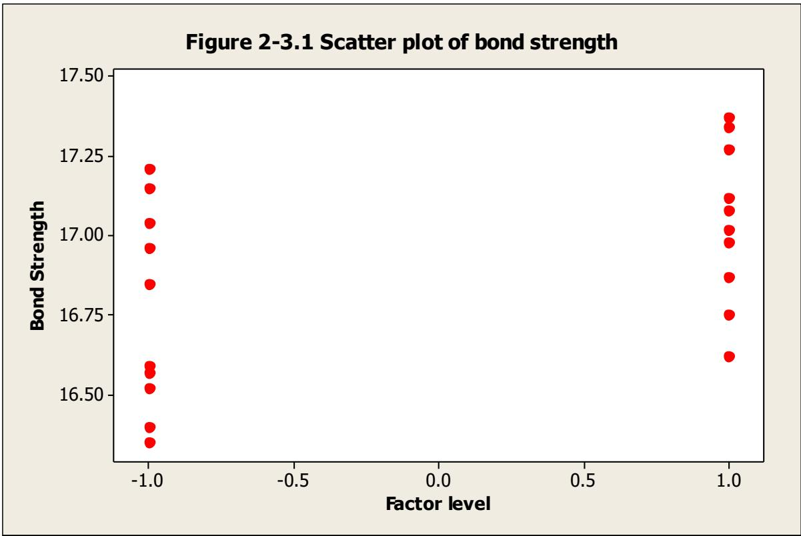
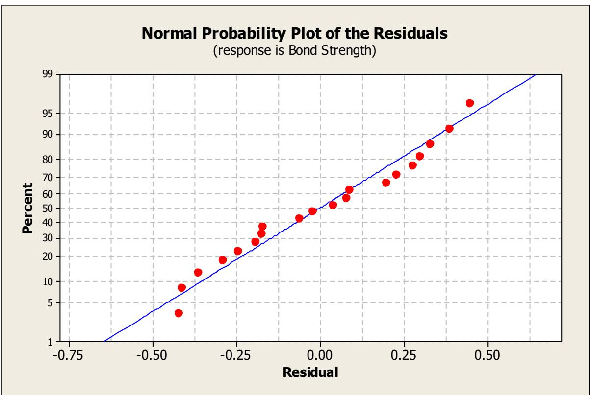

# 第 2 章补充材料

## S2.1 数据模型与 t 检验

教材中给出的模型，即式 (2.23)，更恰当的称呼是**均值模型**（means model）。由于均值是一个位置参数，这类模型有时也称为**位置模型**（location model）。t 检验的模型还有别的写法。一种可能是

$$
y_{ij} = \mu + \tau_{i} + \varepsilon_{ij} \left\{ \begin{array}{c} i = 1, 2 \\ j = 1, 2, \dots, n_{i} \end{array} \right.
$$

其中 $\mu$ 是对所有观测响应都相同的参数（即总均值），而 $\tau_{i}$ 是第 $i$ 个因子水平所特有的参数。有时我们把 $\tau_{i}$ 称为第 $i$ 个处理效应。这种模型通常称为**效应模型**（effects model）。

由于均值模型为

$$
y_{ij} = \mu_{i} + \varepsilon_{ij} \left\{ \begin{array}{c} i = 1, 2 \\ j = 1, 2, \dots, n_{i} \end{array} \right.
$$

可以看出，第 $i$ 个处理（即因子水平）的均值为 $\mu_{i} = \mu + \tau_{i}$；也就是说，因子水平 $i$ 处的平均响应等于总均值加上第 $i$ 个因子的效应。我们将用这两类模型来表示来自设计试验的数据。大多数时候我们使用效应模型，因为它是呈现这方面大部分内容的“传统”方式。然而，在某些情形下均值模型很有用，甚至更为自然。

## S2.2 模型参数的估计

由于在考察设计试验的数据时模型会自然地出现，我们经常需要估计模型参数。我们常用**最小二乘**（least squares）法来进行参数估计。这一方法为模型参数选取使误差 $\varepsilon_{ij}$ 的平方和达到最小的值。我们以均值模型来说明这一方法。为简单起见，假定两个因子水平的样本容量相等，即 $n_{1} = n_{2} = n$。必须最小化的最小二乘函数为

$$
\begin{array}{c} L = \sum_{i=1}^{2} \sum_{j=1}^{n} \varepsilon_{ij}^{2} \\
= \sum_{i=1}^{2} \sum_{j=1}^{n} (y_{ij} - \mu_{i})^{2} \end{array}
$$

现在 $\frac{\partial L}{\partial \mu_{1}} = 2 \sum_{j=1}^{n} (y_{1j} - \mu_{1})$，$\frac{\partial L}{\partial \mu_{2}} = 2 \sum_{j=1}^{n} (y_{2j} - \mu_{2})$，令这些偏导数为零，即得到最小二乘正规方程

$$
n \hat{\mu}_{1} = \sum_{j=1}^{n} y_{1j}
$$

$$
n \hat{\mu}_{2} = \sum_{j=1}^{n} y_{2j}
$$

这些方程的解给出因子水平均值的最小二乘估计量。解为 $\hat{\mu}_{1} = \overline{y}_{1}$ 和 $\hat{\mu}_{2} = \overline{y}_{2}$；也就是说，各因子水平处的样本平均值就是因子水平均值的估计量。

这一结果应当是直观的，因为我们在基础统计学课程中很早就知道，样本平均值通常能对总体均值给出合理的估计。然而，正如我们刚刚看到的，这一结果可以很容易地由一个简单的位置模型经最小二乘方法导出。事实证明，如果我们假定模型误差服从正态分布且相互独立，那么样本平均值也是因子水平均值的**最大似然估计量**（maximum likelihood estimator）。也就是说，如果观测值服从正态分布，最小二乘与最大似然给出的因子水平均值估计量完全相同。最大似然是一种更一般的参数估计方法，它通常能给出具有优良统计性质的参数估计。

我们也可以把最小二乘法应用于效应模型。假定样本容量相等，最小二乘函数为

$$
\begin{array}{l} L = \sum_{i=1}^{2} \sum_{j=1}^{n} \varepsilon_{ij}^{2} \\
= \sum_{i=1}^{2} \sum_{j=1}^{n} (y_{ij} - \mu - \tau_{i})^{2} \end{array}
$$

$L$ 对各个参数的偏导数为

$$
\frac{\partial L}{\partial \mu} = 2 \sum_{i=1}^{2} \sum_{j=1}^{n} \left(y_{ij} - \mu - \tau_{i}\right), \frac{\partial L}{\partial \tau_{1}} = 2 \sum_{j=1}^{n} \left(y_{1j} - \mu - \tau_{1}\right), \text{和} \frac{\partial L}{\partial \tau_{2}} = 2 \sum_{j=1}^{n} \left(y_{2j} - \mu - \tau_{2}\right)
$$

令这些偏导数为零，得到如下最小二乘正规方程：

$$
2 n \hat{\mu} + n \hat{\tau}_{1} + n \hat{\tau}_{2} = \sum_{i=1}^{2} \sum_{j=1}^{n} y_{ij}
$$

$$
n \hat{\mu} + n \hat{\tau}_{1} = \sum_{j=1}^{n} y_{1j}
$$

$$
n \hat{\mu} + n \hat{\tau}_{2} = \sum_{j=1}^{n} y_{2j}
$$

注意，若把上述正规方程中的后两个相加，就得到第一个。也就是说，这些正规方程不是线性独立的，因而没有唯一解。出现这种情况是因为效应模型是**过度参数化的**（overparameterized）。这种情形经常发生；也就是说，一个试验的效应模型总是一个过度参数化的模型。

处理这一问题的一种办法是向正规方程中再加入一个线性独立的方程。最常见的做法是使用方程 $\hat{\tau}_{1} + \hat{\tau}_{2} = 0$。从某种意义上说，这是一个直观的选择，因为它本质上把因子效应定义为对总均值 $\mu$ 的偏离。如果施加这一约束，正规方程的解为

$$
\begin{array}{l} \hat{\mu} = \overline{y} \\
\hat{\tau}_{i} = \overline{y}_{i} - \overline{y}, i = 1, 2 \end{array}
$$

也就是说，总均值由全部 $2n$ 个样本观测值的平均值来估计，而每个单独的因子效应则由该因子水平的样本平均值与全部观测值平均值之差来估计。

这并不是为求解正规方程而选取线性独立“约束”的唯一可能选择。另一种可能是直接把总均值设为一个常数，例如取 $\hat{\mu} = 0$。这给出解

$$
\begin{array}{l} \hat{\mu} = 0 \\
\hat{\tau}_{i} = \overline{y}_{i}, i = 1, 2 \end{array}
$$

还有一种可能是取 $\hat{\tau}_{2} = 0$，得到的解为

$$
\begin{array}{c} \hat{\mu} = \overline{y}_{2} \\
\hat{\tau}_{1} = \overline{y}_{1} - \overline{y}_{2} \\
\hat{\tau}_{2} = 0 \end{array}
$$

可用于求解正规方程的约束有无限多种。一个显而易见的问题是：“我们该用哪个解？”事实证明，这其实无关紧要。对上面三个解中的每一个（实际上对正规方程的任何解都一样），都有

$$
\hat{\mu}_{i} = \hat{\mu} + \hat{\tau}_{i} = \overline{y}_{i}, i = 1, 2
$$

也就是说，第 $i$ 个因子水平均值的最小二乘估计量总是该因子水平处观测值的样本平均值。所以，即使我们无法得到效应模型中参数的唯一估计，也能得到我们所关心的这些参数的某个函数的唯一估计量。我们说第 $i$ 个因子水平的均值是**可估的**（estimable）。模型参数的任何函数，只要无论选取哪个约束来求解正规方程都能被唯一地估计，就称为**可估函数**（estimable function）。第 3 章将对这一点作更详细的讨论。

## S2.3 用回归模型方法处理 t 检验

两样本 $t$ 检验可以从简单线性回归模型的角度来呈现。这是思考 $t$ 检验的一种很有启发性的方式，因为它与“因子处于两个水平的因子试验”这一一般概念很好地对应起来，例如第 1 章中所述的高尔夫试验。这类试验在实践中非常重要，后续各章将对其作详尽讨论。

在 $t$ 检验的情景中，我们有一个含两个水平的因子 $x$，可以随意地把它称为“低”和“高”。我们将用 $x = -1$ 表示该因子的低水平，用 $x = +1$ 表示该因子的高水平。下图是第 2 章表 2.1 中波特兰水泥砂浆拉伸粘结强度数据的散点图（来自 Minitab）。



我们对该数据拟合一个简单线性回归模型，例如

$$
y_{ij} = \beta_{0} + \beta_{1} x_{ij} + \varepsilon_{ij}
$$

其中 $\beta_{0}$ 和 $\beta_{1}$ 分别是回归直线的截距和斜率，回归变量（或预测变量）为 $x_{1j} = -1$ 和 $x_{2j} = +1$。可以用最小二乘法估计该模型中的斜率和截距。假定每个因子水平的样本容量相等，均为 $n$，则最小二乘正规方程为：

$$
2 n \hat{\beta}_{0} = \sum_{i=1}^{2} \sum_{j=1}^{n} y_{ij}
$$

$$
2 n \hat{\beta}_{1} = \sum_{j=1}^{n} y_{2j} - \sum_{j=1}^{n} y_{1j}
$$

这些方程的解为

```txt
Regression Analysis: Bond Strength versus Factor level
The regression equation is
Bond Strength = 16.9 + 0.139 Factor level
Predictor Coef SE Coef T P
Constant 16.9030 0.0636 265.93 0.000
Factor level 0.13900 0.06356 2.19 0.042
S = 0.284253 R-Sq = 21.0% R-Sq(adj) = 16.6%
Analysis of Variance
Source DF SS MS F P
Regression 1 0.38642 0.38642 4.78 0.042
Residual Error 18 1.45440 0.08080
Total 19 1.84082
```

$$
\begin{array}{l} \hat{\beta}_{0} = \overline{y} \\
\hat{\beta}_{1} = \frac{1}{2} (\overline{y}_{2} - \overline{y}_{1}) \end{array}
$$

注意，截距的最小二乘估计量是两个样本中全部观测值的平均值，而斜率的估计量是因子 $x$ 的“高”水平与“低”水平处样本平均值之差的一半。下面是对拉伸粘结强度数据使用 Minitab 中线性回归程序得到的输出。

注意，斜率的估计值（位于上文标有“Coef”的列、标有“Factor level”的行）为 $0.139 = \frac{1}{2}(\overline{y}_{2} - \overline{y}_{1}) = \frac{1}{2}(17.0420 - 16.7640)$，而截距的估计值为 16.9030。此外还请注意，与斜率相联系的 $t$ 统计量等于 2.19，其数值（不计符号）与我们在教材表 2.2 的 Minitab 两样本 $t$ 检验输出中给出的完全相同。现在，在简单线性回归中，关于斜率的 $t$ 检验实际上是在检验假设

$$
\begin{array}{l} H_{0}: \beta_{1} = 0 \\
H_{1}: \beta_{1} \neq 0 \end{array}
$$

而这等价于检验 $H_{0}: \mu_{1} = \mu_{2}$。

容易证明，简单线性回归中用于检验斜率等于零的 $t$ 检验统计量与通常的两样本 $t$ 检验统计量完全相同。回忆一下，在简单线性回归中检验上述假设所用的 $t$ 统计量为

$$
t_{0} = \frac{\hat{\beta}_{1}}{\sqrt{\frac{\hat{\sigma}^{2}}{S_{xx}}}}
$$

其中 $S_{xx} = \sum_{i=1}^{2} \sum_{j=1}^{n} (x_{ij} - \overline{x})^{2}$ 是 $x$ 的“校正”（corrected）平方和。现在，在我们的具体问题中，$\overline{x} = 0$、$x_{1j} = -1$ 且 $x_{2j} = +1$，所以 $S_{xx} = 2n$。因此，既然我们已经注意到 $\sigma$ 的估计量就是 $S_{p}$，就有

$$
t_{0} = \frac{\hat{\beta}_{1}}{\sqrt{\frac{\hat{\sigma}^{2}}{S_{xx}}}} = \frac{\frac{1}{2}\left(\bar{y}_{2} - \bar{y}_{1}\right)}{S_{p} \sqrt{\frac{1}{2n}}} = \frac{\bar{y}_{2} - \bar{y}_{1}}{S_{p} \sqrt{\frac{2}{n}}}
$$

这就是样本容量相等情形下通常的两样本 $t$ 检验统计量。

## S2.4 正态概率图的构造

虽然我们通常用计算机软件程序来生成正态概率图，但偶尔也需要手工构造它们。幸运的是，这相对容易做到，因为专用的正态概率坐标纸（normal probability plotting paper）很容易获得。它其实就是一种方格纸，其纵向（或概率）坐标的刻度经过安排，使得如果我们把累积正态概率 $(j - 0.5)/n$ 描在这种刻度上、把排序后的观测值 $y_{(j)}$ 描在另一坐标上，就会得到与计算机生成的正态概率图等价的图形。下表给出了未改进波特兰水泥砂浆粘结强度数据的计算过程。

| $j$ | $y_{(j)}$ | $(j-0.5)/10$ | $z(j)$ |
| --- | --- | --- | --- |
| 1 | 16.62 | 0.05 | -1.64 |
| 2 | 16.75 | 0.15 | -1.04 |
| 3 | 16.87 | 0.25 | -0.67 |
| 4 | 16.98 | 0.35 | -0.39 |
| 5 | 17.02 | 0.45 | -0.13 |
| 6 | 17.08 | 0.55 | 0.13 |
| 7 | 17.12 | 0.65 | 0.39 |
| 8 | 17.27 | 0.75 | 0.67 |
| 9 | 17.34 | 0.85 | 1.04 |
| 10 | 17.37 | 0.95 | 1.64 |

现在，如果我们在正态概率纸上把上表倒数第二列中的累积概率对第二列中排序后的观测值作图，就会得到与教材图 2.11 中未改进砂浆配方结果完全相同的图形。

正态概率图也可以在普通方格纸上构造，做法是把标准正态 $z$ 分数 $z(j)$ 对排序后的观测值作图，其中标准正态 $z$ 分数由下式得到

$$
P(Z \leq z_{j}) = \Phi(z_{j}) = \frac{j - 0.5}{n}
$$

其中 $\Phi(\bullet)$ 表示标准正态累积分布。例如，若 $(j - 0.5)/n = 0.05$，则由 $\Phi(z_{j}) = 0.05$ 可知 $z_{j} = -1.64$。上表最后一列给出了正态 $z$ 分数的值。在普通方格纸上把这些值对排序后的观测值作图，将得到与图 2.11 中未改进砂浆结果等价的正态概率图。正如教材中所述，许多统计计算机软件包就是以这种方式呈现正态概率图的。

## S2.5 关于检验 t 检验假定的更多内容

我们在教材中指出，观测值的正态概率图是检验 $t$ 检验中正态性假定的一种极好方法。除了对观测值作图之外，另一种做法是对统计模型的残差作图。

回忆一下，均值模型为

$$
y_{ij} = \mu_{i} + \varepsilon_{ij} \left\{ \begin{array}{c} i = 1, 2 \\ j = 1, 2, \dots, n_{i} \end{array} \right.
$$

而该模型中参数（因子水平均值）的估计量就是样本平均值。因此，我们可以说拟合模型为

$$
\hat{y}_{ij} = \overline{y}_{i}, i = 1, 2 \text{ 且 } j = 1, 2, \dots, n_{i}
$$

也就是说，第 $ij$ 个观测值的估计值就是第 $i$ 个因子水平内观测值的平均值。响应的观测值与预测（或拟合）值之差称为**残差**（residual），即

$$
e_{ij} = y_{ij} - \hat{y}_{i}, i = 1, 2.
$$

下表计算了波特兰水泥砂浆拉伸粘结强度数据的残差值。

| 观测值 $j$ | $y_{1j}$ | $e_{1j}=y_{1j}-\overline{y}_{1}=y_{1j}-16.76$ | $y_{2j}$ | $e_{2j}=y_{2j}-\overline{y}_{2}=y_{2j}-17.04$ |
| --- | --- | --- | --- | --- |
| 1 | 16.85 | 0.09 | 16.62 | -0.42 |
| 2 | 16.40 | -0.36 | 16.75 | -0.29 |
| 3 | 17.21 | 0.45 | 17.37 | 0.33 |
| 4 | 16.35 | -0.41 | 17.12 | 0.08 |
| 5 | 16.52 | -0.24 | 16.98 | -0.06 |
| 6 | 17.04 | 0.28 | 16.87 | -0.17 |
| 7 | 16.96 | 0.20 | 17.34 | 0.30 |
| 8 | 17.15 | 0.39 | 17.02 | -0.02 |
| 9 | 16.59 | -0.17 | 17.08 | 0.04 |
| 10 | 16.57 | -0.19 | 17.27 | 0.23 |

下图是这些残差由 Minitab 绘制的正态概率图。



正如上文 S2.3 节所述，我们可以用简单线性回归模型的方法来计算 $t$ 检验统计量。大多数回归软件包也会给出模型残差的表格或列表。前面得到的 Minitab 回归模型拟合的残差如下：

| 观测序号 | 因子水平 | 粘结强度 | 拟合值 | 拟合值标准误 | 残差 | 标准化残差 |
| --- | --- | --- | --- | --- | --- | --- |
| 1 | -1.00 | 16.8500 | 16.7640 | 0.0899 | 0.0860 | 0.32 |
| 2 | -1.00 | 16.4000 | 16.7640 | 0.0899 | -0.3640 | -1.35 |
| 3 | -1.00 | 17.2100 | 16.7640 | 0.0899 | 0.4460 | 1.65 |
| 4 | -1.00 | 16.3500 | 16.7640 | 0.0899 | -0.4140 | -1.54 |
| 5 | -1.00 | 16.5200 | 16.7640 | 0.0899 | -0.2440 | -0.90 |
| 6 | -1.00 | 17.0400 | 16.7640 | 0.0899 | 0.2760 | 1.02 |
| 7 | -1.00 | 16.9600 | 16.7640 | 0.0899 | 0.1960 | 0.73 |
| 8 | -1.00 | 17.1500 | 16.7640 | 0.0899 | 0.3860 | 1.43 |
| 9 | -1.00 | 16.5900 | 16.7640 | 0.0899 | -0.1740 | -0.65 |
| 10 | -1.00 | 16.5700 | 16.7640 | 0.0899 | -0.1940 | -0.72 |
| 11 | 1.00 | 16.6200 | 17.0420 | 0.0899 | -0.4220 | -1.56 |
| 12 | 1.00 | 16.7500 | 17.0420 | 0.0899 | -0.2920 | -1.08 |
| 13 | 1.00 | 17.3700 | 17.0420 | 0.0899 | 0.3280 | 1.22 |
| 14 | 1.00 | 17.1200 | 17.0420 | 0.0899 | 0.0780 | 0.29 |
| 15 | 1.00 | 16.9800 | 17.0420 | 0.0899 | -0.0620 | -0.23 |
| 16 | 1.00 | 16.8700 | 17.0420 | 0.0899 | -0.1720 | -0.64 |
| 17 | 1.00 | 17.3400 | 17.0420 | 0.0899 | 0.2980 | 1.11 |
| 18 | 1.00 | 17.0200 | 17.0420 | 0.0899 | -0.0220 | -0.08 |
| 19 | 1.00 | 17.0800 | 17.0420 | 0.0899 | 0.0380 | 0.14 |
| 20 | 1.00 | 17.2700 | 17.0420 | 0.0899 | 0.2280 | 0.85 |

表中标有“拟合值”（Fit）的那一列包含了两个样本的均值，并计算到四位小数。表中第六列的残差与我们手工计算的结果相同（仅因舍入而略有差异）。

## S2.6 关于配对 t 检验的更多信息

配对 $t$ 检验考察两个变量之差，并检验这些差值的均值是否不为零。教材中我们说明了差值的均值 $\mu_{d}$ 与两个独立样本的均值之差 $\mu_{1} - \mu_{2}$ 是相同的。然而，差值的方差与存在两个独立样本时所观测到的方差并不相同。设 $\bar{d}$ 为差值的样本平均值。则

$$
\begin{array}{r l} V(\overline{d}) & = V(\overline{y}_{1} - \overline{y}_{2}) \\ & = V(\overline{y}_{1}) + V(\overline{y}_{2}) - 2 Cov(\overline{y}_{1}, \overline{y}_{2}) \\ & = \frac{2 \sigma^{2} (1 - \rho)}{n} \end{array}
$$

这里假定两个总体具有相同的方差 $\sigma^{2}$，且 $\rho$ 是两个随机变量 $y_{1}$ 与 $y_{2}$ 之间的相关系数。量 $S_{d}^{2}/n$ 估计平均差值 $\bar{d}$ 的方差。在许多配对试验中，人们预期 $y_{1}$ 与 $y_{2}$ 之间存在很强的正相关，因为两个因子水平都施加到了同一个试验单元上。当配对内部存在正相关时，配对 $t$ 检验的分母会比两样本（或独立）$t$ 检验的分母小。如果错误地把两样本检验用于配对样本，该程序一般会低估数据的显著性。

还要注意，虽然为方便起见我们假定了两个总体方差相等，但这一假定实际上并不必要。当两个总体的方差不同时，配对 $t$ 检验仍然有效。
