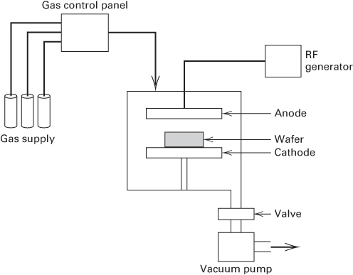
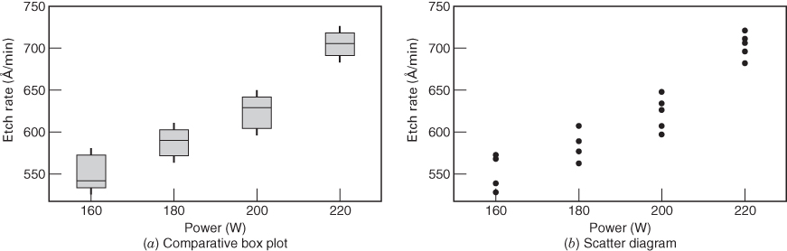

## 3.1 An Example

In many integrated circuit manufacturing steps, wafers are completely coated with a layer of material such as silicon dioxide or a metal. The unwanted material is then selectively removed by etching through a mask, thereby creating circuit patterns, electrical interconnects, and areas in which diffusions or metal depositions are to be made. A plasma etching process is widely used for this operation, particularly in small geometry applications. Figure 3.1 shows the important features of a typical single-wafer etching tool. Energy is supplied by a radio-frequency (RF) generator causing plasma to be generated in the gap between the electrodes. The chemical species in the plasma are determined by the particular gases used. Fluorocarbons, such as $CF_{4}$ (tetrafluoromethane) or $C_{2}F_{6}$ (hexafluoroethane), are often used in plasma etching, but other gases and mixtures of gases are relatively common, depending on the application.

■ FIGURE 3.1 A single-wafer plasma etching tool

An engineer is interested in investigating the relationship between the RF power setting and the etch rate for this tool. The objective of an experiment like this is to model the relationship between etch rate and RF power and to specify the power setting that will give a desired target etch rate. She is interested in a particular gas $\left(\mathrm{C}_{2}\mathrm{F}_{6}\right)$ and gap (0.80 cm) and wants to test four levels of RF power: 160, 180, 200, and 220 W. She decided to test five wafers at each level of RF power.

This is an example of a single-factor experiment with $a = 4$ levels of the factor and $n = 5$ replicates. The 20 runs should be made in random order. A very efficient way to generate the run order is to enter the 20 runs in a spreadsheet (Excel), generate a column of random numbers using the RAND() function, and then sort by that column.

Suppose that the test sequence obtained from this process is given as below:

<table><tr><td>Test Sequence</td><td>Excel Random Number (Sorted)</td><td>Power</td></tr><tr><td>1</td><td>12417</td><td>200</td></tr><tr><td>2</td><td>18369</td><td>220</td></tr><tr><td>3</td><td>21238</td><td>220</td></tr><tr><td>4</td><td>24621</td><td>160</td></tr><tr><td>5</td><td>29337</td><td>160</td></tr><tr><td>6</td><td>32318</td><td>180</td></tr><tr><td>7</td><td>36481</td><td>200</td></tr><tr><td>8</td><td>40062</td><td>160</td></tr><tr><td>9</td><td>43289</td><td>180</td></tr><tr><td>10</td><td>49271</td><td>200</td></tr><tr><td>11</td><td>49813</td><td>220</td></tr><tr><td>12</td><td>52286</td><td>220</td></tr><tr><td>13</td><td>57102</td><td>160</td></tr><tr><td>14</td><td>63548</td><td>160</td></tr><tr><td>15</td><td>67710</td><td>220</td></tr><tr><td>16</td><td>71834</td><td>180</td></tr><tr><td>17</td><td>77216</td><td>180</td></tr><tr><td>18</td><td>84675</td><td>180</td></tr><tr><td>19</td><td>89323</td><td>200</td></tr><tr><td>20</td><td>94037</td><td>200</td></tr></table>

This randomized test sequence is necessary to prevent the effects of unknown nuisance variables, perhaps varying out of control during the experiment, from contaminating the results. To illustrate this, suppose that we were to run the 20 test wafers in the original nonrandomized order (that is, all five 160 W power runs are made first, all five 180 W power runs are made next, and so on). If the etching tool exhibits a warm-up effect such that the longer it is on, the lower the observed etch rate readings will be, the warm-up effect will potentially contaminate the data and destroy the validity of the experiment.

Suppose that the engineer runs the experiment that we have designed in the indicated random order. The observations that she obtains on etch rate are shown in Table 3.1.

It is always a good idea to examine experimental data graphically. Figure 3.2a presents box plots for etch rate at each level of RF power and Figure 3.2b presents a scatter diagram of etch rate versus RF power. Both graphs indicate that etch rate increases as the power setting increases. There is no strong evidence to suggest that the variability in etch rate around the average depends on the power setting. On the basis of this simple graphical analysis, we strongly suspect that (1) RF power setting affects the etch rate and (2) higher power settings result in increased etch rate.

Suppose that we wish to be more objective in our analysis of the data. Specifically, suppose that we wish to test for differences between the mean etch rates at all a = 4 levels of RF power. Thus, we are interested in testing the equality of all four means. It might seem that this problem could be solved by performing a t-test for all six possible pairs of means. However, this is not the best solution to this problem. First of all, performing all six pairwise t-tests is inefficient. It takes a lot of effort. Second, conducting all these pairwise comparisons inflates the type I error. Suppose that all four means are equal, so if we select $\alpha = 0.05$ , the probability of reaching the correct decision on any single comparison is 0.95. However, the probability of reaching the correct conclusion on all six comparisons is considerably less than 0.95, so the type I error is inflated.

The appropriate procedure for testing the equality of several means is the analysis of variance. However, the analysis of variance has a much wider application than the problem above. It is probably the most useful technique in the field of statistical inference.

## TABLE 3.1

Etch Rate Data (in Å/min) from the Plasma Etching Experiment

<table><tr><td rowspan="2">Power (W)</td><td colspan="5">Observations</td><td rowspan="2">Totals</td><td rowspan="2">Averages</td></tr><tr><td>1</td><td>2</td><td>3</td><td>4</td><td>5</td></tr><tr><td>160</td><td>575</td><td>542</td><td>530</td><td>539</td><td>570</td><td>2756</td><td>551.2</td></tr><tr><td>180</td><td>565</td><td>593</td><td>590</td><td>579</td><td>610</td><td>2937</td><td>587.4</td></tr><tr><td>200</td><td>600</td><td>651</td><td>610</td><td>637</td><td>629</td><td>3127</td><td>625.4</td></tr><tr><td>220</td><td>725</td><td>700</td><td>715</td><td>685</td><td>710</td><td>3535</td><td>707.0</td></tr></table>

  
■ FIGURE 3.2 Box plots and scatter diagram of the etch rate data

