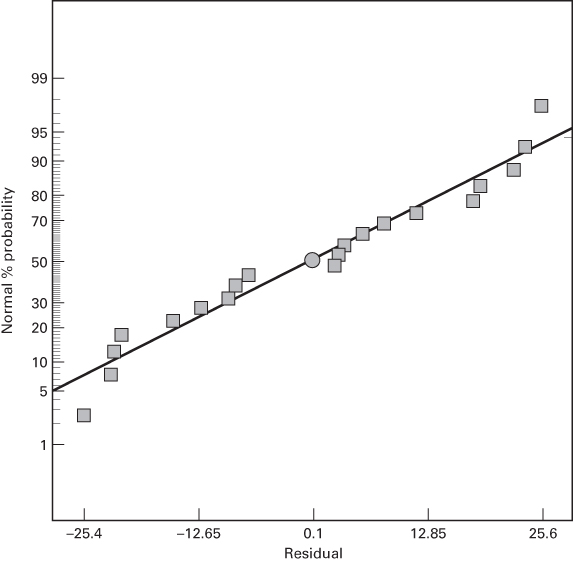
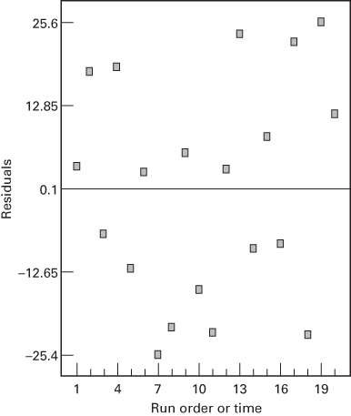
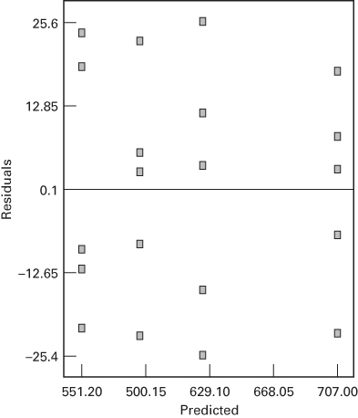
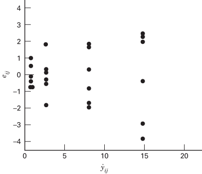
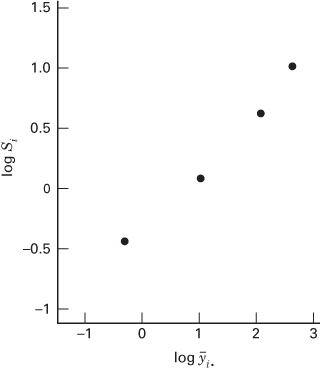
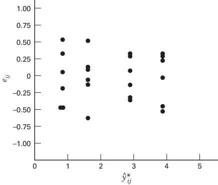

## 3.4 Model Adequacy Checking

The decomposition of the variability in the observations through an analysis of variance identity (Equation 3.6) is a purely algebraic relationship. However, the use of the partitioning to test formally for no differences in treatment means requires that certain assumptions be satisfied. Specifically, these assumptions are that the observations are adequately described by the model

$$
y _ {i j} = \mu + \tau_ {i} + \epsilon_ {i j}
$$

and that the errors are normally and independently distributed with mean zero and constant but unknown variance $\sigma^{2}$ . If these assumptions are valid, the analysis of variance procedure is an exact test of the hypothesis of no difference in treatment means.

In practice, however, these assumptions will usually not hold exactly. Consequently, it is usually unwise to rely on the analysis of variance until the validity of these assumptions has been checked. Violations of the basic assumptions and model adequacy can be easily investigated by the examination of residuals. We define the residual for observation j in treatment i as

$$
e _ {i j} = y _ {i j} - \hat {y} _ {i j}\tag{3.16}
$$

where $\hat{y}_{ij}$ is an estimate of the corresponding observation $y_{ij}$ obtained as follows:

$$
\begin{array}{r l} & {\hat {y} _ {i j} = \hat {\mu} + \hat {\tau} _ {i}} \\ & {\quad = \overline {{y}} _ {..} + (\overline {{y}} _ {i.} - \overline {{y}} _ {..})} \\ & {\quad = \overline {{y}} _ {i.}} \end{array}\tag{3.17}
$$

Equation 3.17 gives the intuitively appealing result that the estimate of any observation in the ith treatment is just the corresponding treatment average.

Examination of the residuals should be an automatic part of any analysis of variance. If the model is adequate, the residuals should be structureless; that is, they should contain no obvious patterns. Through analysis of residuals, many types of model inadequacies and violations of the underlying assumptions can be discovered. In this section, we show how model diagnostic checking can be done easily by graphical analysis of residuals and how to deal with several commonly occurring abnormalities.

## 3.4.1 The Normality Assumption

A check of the normality assumption could be made by plotting a histogram of the residuals. If the $\mathrm{NID}(0,\sigma^{2})$ assumption on the errors is satisfied, this plot should look like a sample from a normal distribution centered at zero. Unfortunately, with small samples, considerable fluctuation in the shape of a histogram often occurs, so the appearance of a moderate departure from normality does not necessarily imply a serious violation of the assumptions. Gross deviations from normality are potentially serious and require further analysis.

An extremely useful procedure is to construct a normal probability plot of the residuals. Recall from Chapter 2 that we used a normal probability plot of the raw data to check the assumption of normality when using the t-test. In the analysis of variance, it is usually more effective (and straightforward) to do this with the residuals. If the underlying error distribution is normal, this plot will resemble a straight line. In visualizing the straight line, place more emphasis on the central values of the plot than on the extremes.

Table 3.6 shows the original data and the residuals for the etch rate data in Example 3.1. The normal probability plot is shown in Figure 3.4. The general impression from examining this display is that the error distribution is approximately normal. The tendency of the normal probability plot to bend down slightly on the left side and upward slightly on the right side implies that the tails of the error distribution are somewhat thinner than would be anticipated in a normal distribution; that is, the largest residuals are not quite as large (in absolute value) as expected. This plot is not grossly nonnormal, however.

In general, moderate departures from normality are of little concern in the fixed effects analysis of variance (recall our discussion of randomization tests in Section 3.3.2). An error distribution that has considerably thicker or thinner tails than the normal is of more concern than a skewed distribution. Because the F-test is only slightly affected, we say that the analysis of variance (and related procedures such as multiple comparisons) is robust to the normality assumption. Departures from normality usually cause both the true significance level and the power to differ slightly from the advertised values, with the power generally being lower. The random effects model that we will discuss in Section 3.9 and Chapter 13 is more severely affected by nonnormality.

## TABLE 3.6

Etch Rate Data and Residuals from Example 3.1 $^{a}$

<table><tr><td rowspan="2">Power (w)</td><td colspan="8">Observations (j)</td><td rowspan="2"> $\hat{y}_{ij}=\bar{y}_{i}$ .</td></tr><tr><td>1</td><td>2</td><td>3</td><td>4</td><td>5</td><td></td><td></td><td></td></tr><tr><td rowspan="2">160</td><td>23.8</td><td>-9.2</td><td>-21.2</td><td>-12.2</td><td>18.8</td><td></td><td></td><td></td><td></td></tr><tr><td>575 (13)</td><td>542 (14)</td><td>530 (8)</td><td>539 (5)</td><td>570 (4)</td><td>551.2</td><td></td><td></td><td></td></tr><tr><td rowspan="2">180</td><td>-22.4</td><td>5.6</td><td>2.6</td><td>-8.4</td><td>22.6</td><td></td><td></td><td></td><td></td></tr><tr><td>565 (18)</td><td>593 (9)</td><td>590 (6)</td><td>579 (16)</td><td>610 (17)</td><td>587.4</td><td></td><td></td><td></td></tr><tr><td rowspan="2">200</td><td>-25.4</td><td>25.6</td><td>-15.4</td><td>11.6</td><td>3.6</td><td></td><td></td><td></td><td></td></tr><tr><td>600 (7)</td><td>651 (19)</td><td>610 (10)</td><td>637 (20)</td><td>629 (1)</td><td>625.4</td><td></td><td></td><td></td></tr><tr><td rowspan="2">220</td><td>18.0</td><td>-7.0</td><td>8.0</td><td>-22.0</td><td>3.0</td><td></td><td></td><td></td><td></td></tr><tr><td>725 (2)</td><td>700 (3)</td><td>715 (15)</td><td>685 (11)</td><td>710 (12)</td><td>707.0</td><td></td><td></td><td></td></tr></table>

$^{a}$ The residuals are shown in the box in each cell. The numbers in parentheses indicate the order in which each experimental run was made.

■ FIGURE 3.4 Normal probability plot of residuals for Example 3.1

A very common defect that often shows up on normal probability plots is one residual that is very much larger than any of the others. Such a residual is often called an outlier. The presence of one or more outliers can seriously distort the analysis of variance, so when a potential outlier is located, careful investigation is called for. Frequently, the cause of the outlier is a mistake in calculations or a data coding or copying error. If this is not the cause, the experimental circumstances surrounding this run must be carefully studied. If the outlying response is a particularly desirable value (high strength, low cost, etc.), the outlier may be more informative than the rest of the data. We should be careful not to reject or discard an outlying observation unless we have reasonably nonstatistical grounds for doing so. At worst, you may end up with two analyses: one with the outlier and one without.

Several formal statistical procedures may be used for detecting outliers [e.g., see Stefansky (1972), John and Prescott (1975), and Barnett and Lewis (1994)]. Some statistical software packages report the results of a statistical test for normality (such as the Anderson–Darling test) on the normal probability plot of residuals. This should be viewed with caution as those tests usually assume that the data to which they are applied are independent and residuals are not independent.

A rough check for outliers may be made by examining the standardized residuals

$$
d _ {i j} = \frac {e _ {i j}}{\sqrt {M S _ {E}}}\tag{3.18}
$$

If the errors $\epsilon_{ij}$ are $N(0,\sigma^{2})$ , the standardized residuals should be approximately normal with mean zero and unit variance. Thus, about 68 percent of the standardized residuals should fall within the limits $\pm1$ , about 95 percent of them should fall within $\pm2$ , and virtually all of them should fall within $\pm3$ . A residual bigger than 3 or 4 standard deviations from zero is a potential outlier.

For the tensile strength data of Example 3.1, the normal probability plot gives no indication of outliers. Furthermore, the largest standardized residual is

$$
d _ {1} = \frac {e _ {1}}{\sqrt {M S _ {E}}} = \frac {2 5 . 6}{\sqrt {3 3 3 . 7 0}} = \frac {2 5 . 6}{1 8 . 2 7} = 1. 4 0
$$

which should cause no concern.

## 3.4.2 Plot of Residuals in Time Sequence

Plotting the residuals in time order of data collection is helpful in detecting strong correlation between the residuals. A tendency to have runs of positive and negative residuals indicates positive correlation. This would imply that the independence assumption on the errors has been violated. This is a potentially serious problem and one that is difficult to correct, so it is important to prevent the problem if possible when the data are collected. Proper randomization of the experiment is an important step in obtaining independence.

Sometimes the skill of the experimenter (or the subjects) may change as the experiment progresses, or the process being studied may “drift” or become more erratic. This will often result in a change in the error variance over time. This condition often leads to a plot of residuals versus time that exhibits more spread at one end than at the other. Nonconstant variance is a potentially serious problem. We will have more to say on the subject in Sections 3.4.3 and 3.4.4.

Table 3.6 displays the residuals and the time sequence of data collection for the tensile strength data. A plot of these residuals versus run order or time is shown in Figure 3.5. There is no reason to suspect any violation of the independence or constant variance assumptions.

## 3.4.3 Plot of Residuals Versus Fitted Values

If the model is correct and the assumptions are satisfied, the residuals should be structureless; in particular, they should be unrelated to any other variable including the predicted response. A simple check is to plot the residuals versus the fitted values $\hat{y}_{ij}$ . (For the single-factor experiment model, remember that $\hat{y}_{ij} = \overline{y}_{i}$ , the ith treatment average.) This plot should not reveal any obvious pattern. Figure 3.6 plots the residuals versus the fitted values for the tensile strength data of Example 3.1. No unusual structure is apparent.

A defect that occasionally shows up on this plot is nonconstant variance. Sometimes the variance of the observations increases as the magnitude of the observation increases. This would be the case if the error or background noise in the experiment was a constant percentage of the size of the observation. (This commonly happens with many measuring instruments—error is a percentage of the scale reading.) If this were the case, the residuals would get larger as $y_{ij}$ gets larger, and the plot of residuals versus $\hat{y}_{ij}$ would look like an outward-opening funnel or megaphone. Nonconstant variance also arises in cases where the data follow a nonnormal, skewed distribution because in skewed distributions the variance tends to be a function of the mean.

  
■ FIGURE 3.5 Plot of residuals versus run order or time

  
■ FIGURE 3.6 Plot of residuals versus fitted values

If the assumption of homogeneity of variances is violated, the F-test is only slightly affected in the balanced (equal sample sizes in all treatments) fixed effects model. However, in unbalanced designs or in cases where one variance is very much larger than the others, the problem is more serious. Specifically, if the factor levels having the larger variances also have the smaller sample sizes, the actual type I error rate is larger than anticipated (or confidence intervals have lower actual confidence levels than were specified). Conversely, if the factor levels with larger variances also have the larger sample sizes, the significance levels are smaller than anticipated (confidence levels are higher). This is a good reason for choosing equal sample sizes whenever possible. For random effects models, unequal error variances can significantly disturb inferences on variance components even if balanced designs are used.

Inequality of variance also shows up occasionally on the plot of residuals versus run order. An outward-opening funnel pattern indicates that variability is increasing over time. This could result from operator/subject fatigue, accumulated stress on equipment, changes in material properties such as catalyst degradation, or tool wear, or any of a number of causes.

The usual approach to dealing with nonconstant variance when it occurs for the aforementioned reasons is to apply a variance-stabilizing transformation and then to run the analysis of variance on the transformed data. In this approach, one should note that the conclusions of the analysis of variance apply to the transformed populations.

Considerable research has been devoted to the selection of an appropriate transformation. If experimenters know the theoretical distribution of the observations, they may utilize this information in choosing a transformation. For example, if the observations follow the Poisson distribution, the square root transformation $y_{ij}^{*} = \sqrt{y_{ij}}$ or $y_{ij}^{*} = \sqrt{1 + y_{ij}}$ would be used. If the data follow the lognormal distribution, the logarithmic transformation $y_{ij}^{*} = \log y_{ij}$ is appropriate. For binomial data expressed as fractions, the arcsin transformation $y_{ij}^{*} = \arcsin \sqrt{y_{ij}}$ is useful. When there is no obvious transformation, the experimenter usually empirically seeks a transformation that equalizes the variance regardless of the value of the mean. We offer some guidance on this at the conclusion of this section. In factorial experiments, which we introduce in Chapter 5, another approach is to select a transformation that minimizes the interaction mean square, resulting in an experiment that is easier to interpret. In Chapter 15, we discuss methods for analytically selecting the form of the transformation in more detail. Transformations made for inequality of variance also affect the form of the error distribution. In most cases, the transformation brings the error distribution closer to normal. For more discussion of transformations, refer to Bartlett (1947), Dolby (1963), Box and Cox (1964), and Draper and Hunter (1969).

Statistical Tests for Equality of Variance. Although residual plots are frequently used to diagnose inequality of variance, several statistical tests have also been proposed. These tests may be viewed as formal tests of the hypotheses

$$
\begin{array}{l} H _ {0}: \sigma_ {1} ^ {2} = \sigma_ {2} ^ {2} = \dots = \sigma_ {a} ^ {2} \\ H _ {1}: \text { above   not   true   for   at   least   one } \sigma_ {i} ^ {2} \end{array}
$$

A widely used procedure is Bartlett's test. The procedure involves computing a statistic whose sampling distribution is closely approximated by the chi-square distribution with $a - 1$ degrees of freedom when the $a$ random samples are from independent normal populations. The test statistic is

$$
\chi_ {0} ^ {2} = 2. 3 0 2 6 \frac {q}{c}\tag{3.19}
$$

where

$$
q = (N - a) \mathrm{log} _ {1 0} S _ {p} ^ {2} - \sum_ {i = 1} ^ {a} (n _ {i} - 1) \mathrm{log} _ {1 0} S _ {i} ^ {2}
$$

$$
c = 1 + \frac {1}{3 (a - 1)} \left(\sum_ {i = 1} ^ {a} (n _ {i} - 1) ^ {- 1} - (N - a) ^ {- 1}\right)
$$

$$
S _ {p} ^ {2} = \frac {\sum_ {i = 1} ^ {a} (n _ {i} - 1) S _ {i} ^ {2}}{N - a}
$$

and $S_{i}^{2}$ is the sample variance of the ith population.

The quantity $q$ is large when the sample variances $S_{i}^{2}$ differ greatly and is equal to zero when all $S_{i}^{2}$ are equal. Therefore, we should reject $H_{0}$ on values of $\chi_0^2$ that are too large; that is, we reject $H_{0}$ only when

$$
\chi_ {0} ^ {2} > \chi_ {\alpha , a - 1} ^ {2}
$$

where $\chi_{\alpha,a-1}^{2}$ is the upper $\alpha$ percentage point of the chi-square distribution with a-1 degrees of freedom. The P-value approach to decision making could also be used.

Bartlett's test is very sensitive to the normality assumption. Consequently, when the validity of this assumption is doubtful, Bartlett's test should not be used.

## EXAMPLE 3.4

In the plasma etch experiment, the normality assumption is not in question, so we can apply Bartlett's test to the etch rate data. We first compute the sample variances in each treatment and find that $S_{1}^{2}=400.7$ , $S_{2}^{2}=280.3$ , $S_{3}^{2}=421.3$ , and $S_{4}^{2}=232.5$ . Then

$$
S _ {p} ^ {2} = \frac {4 (4 0 0 . 7) + 4 (2 8 0 . 3) + 4 (4 2 1 . 3) + 4 (2 3 2 . 5)}{1 6} = 3 3 3. 7
$$

$$
\begin{array}{r} q = 1 6 \log_ {1 0} (3 3 3. 7) - 4 [ \log_ {1 0} 4 0 0. 7 + \log_ {1 0} 2 8 0. 3 \\ + \log_ {1 0} 4 2 1. 3 + \log_ {1 0} 2 3 2. 5 ] = 0. 2 1 \end{array}
$$

$$
c = 1 + \frac {1}{3 (3)} \left(\frac {4}{4} - \frac {1}{1 6}\right) = 1. 1 0
$$

and the test statistic is

$$
\chi_ {0} ^ {2} = 2. 3 0 2 6 \frac {(0 . 2 1)}{(1 . 1 0)} = 0. 4 3
$$

From Appendix Table III, we find that $\chi^{2}_{0.05,3}=7.81$ (the P-value is P=0.934), so we cannot reject the null hypothesis. There is no evidence to counter the claim that all five variances are the same. This is the same conclusion reached by analyzing the plot of residuals versus fitted values.

Because Bartlett's test is sensitive to the normality assumption, there may be situations where an alternative procedure would be useful. Anderson and McLean (1974) present a useful discussion of statistical tests for equality of variance. The modified Levene test [see Levene (1960) and Conover, Johnson, and Johnson (1981)] is a very nice procedure that is robust to departures from normality. To test the hypothesis of equal variances in all treatments, the modified Levene test uses the absolute deviation of the observations $y_{ij}$ in each treatment from the treatment median, say, $\tilde{y}_i$ . Denote these deviations by

$$
d _ {i j} = | y _ {i j} - \tilde {y} _ {i}. | \left\{ \begin{array}{l l} i = 1, 2, \ldots , a \\ j = 1, 2, \ldots n _ {i} \end{array} \right.
$$

The modified Levene test then evaluates whether or not the means of these deviations are equal for all treatments. It turns out that if the mean deviations are equal, the variances of the observations in all treatments will be the same. The test statistic for Levene's test is simply the usual ANOVA $F$ -statistic for testing equality of means applied to the absolute deviations.

## EXAMPLE 3.5

A civil engineer is interested in determining whether four different methods of estimating flood flow frequency produce equivalent estimates of peak discharge when applied to the same watershed. Each procedure is used six times on the watershed, and the resulting discharge data (in cubic feet per second) are shown in the upper panel of Table 3.7. The analysis of variance for the data, summarized in Table 3.8, implies that there is a difference in mean peak discharge estimates given by the four procedures. The plot of residuals versus fitted values, shown in Figure 3.7, is disturbing because the outward-opening funnel shape indicates that the constant variance assumption is not satisfied.

We will apply the modified Levene test to the peak discharge data. The upper panel of Table 3.7 contains the treatment medians $\tilde{y}_i$ and the lower panel contains the deviations $d_{ij}$ around the medians. Levene's test consists of conducting a standard analysis of variance on the $d_{ij}$ .

The F-test statistic that results from this is $F_{0} = 4.55$ , for which the P-value is P = 0.0137. Therefore, Levene's test rejects the null hypothesis of equal variances, essentially confirming the diagnosis we made from visual examination of Figure 3.7. The peak discharge data are a good candidate for data transformation.

## TABLE 3.7

Peak Discharge Data

<table><tr><td colspan="2">Estimation Method</td><td colspan="5">Observations</td><td> $\bar{y}_{i.}$ </td><td> $\tilde{y}_{i}$ </td><td> $S_{i}$ </td></tr><tr><td>1</td><td>0.34</td><td>0.12</td><td>1.23</td><td>0.70</td><td>1.75</td><td>0.12</td><td>0.71</td><td>0.520</td><td>0.66</td></tr><tr><td>2</td><td>0.91</td><td>2.94</td><td>2.14</td><td>2.36</td><td>2.86</td><td>4.55</td><td>2.63</td><td>2.610</td><td>1.09</td></tr><tr><td>3</td><td>6.31</td><td>8.37</td><td>9.75</td><td>6.09</td><td>9.82</td><td>7.24</td><td>7.93</td><td>7.805</td><td>1.66</td></tr><tr><td>4</td><td>17.15</td><td>11.82</td><td>10.95</td><td>17.20</td><td>14.35</td><td>16.82</td><td>14.72</td><td>15.59</td><td>2.77</td></tr><tr><td>Estimation Method</td><td colspan="9">Deviations  $d_{ij}$  for the Modified Levene Test</td></tr><tr><td>1</td><td>0.18</td><td>0.40</td><td>0.71</td><td>0.18</td><td>1.23</td><td>0.40</td><td></td><td></td><td></td></tr><tr><td>2</td><td>1.70</td><td>0.33</td><td>0.47</td><td>0.25</td><td>0.25</td><td>1.94</td><td></td><td></td><td></td></tr><tr><td>3</td><td>1.495</td><td>0.565</td><td>1.945</td><td>1.715</td><td>2.015</td><td>0.565</td><td></td><td></td><td></td></tr><tr><td>4</td><td>1.56</td><td>3.77</td><td>4.64</td><td>1.61</td><td>1.24</td><td>1.23</td><td></td><td></td><td></td></tr></table>

TABLE 3.8  
Analysis of Variance for Peak Discharge Data

<table><tr><td>Source of Variation</td><td>Sum of Squares</td><td>Degrees of Freedom</td><td>Mean Square</td><td> $F_0$ </td><td>P-Value</td></tr><tr><td>Methods</td><td>708.3471</td><td>3</td><td>236.1157</td><td>76.07</td><td>&lt; 0.001</td></tr><tr><td>Error</td><td>62.0811</td><td>20</td><td>3.1041</td><td></td><td></td></tr><tr><td>Total</td><td>770.4282</td><td>23</td><td></td><td></td><td></td></tr></table>

  
■ FIGURE 3.7 Plot of residuals versus $\hat{y}_{ij}$ for Example 3.5

Empirical Selection of a Transformation. We observed above that if experimenters knew the relationship between the variance of the observations and the mean, they could use this information to guide them in selecting the form of the transformation. We now elaborate on this point and show one method for empirically selecting the form of the required transformation from the data.

Let $E(y) = \mu$ be the mean of $y$ , and suppose that the standard deviation of $y$ is proportional to a power of the mean of $y$ such that

$$
\sigma_ {y} \propto \mu^ {\alpha}
$$

We want to find a transformation on $y$ that yields a constant variance. Suppose that the transformation is a power of the original data, say

$$
y ^ {*} = y ^ {\lambda}\tag{3.20}
$$

Then it can be shown that

$$
\sigma_ {y *} \propto \mu^ {\lambda + \alpha - 1}\tag{3.21}
$$

Clearly, if we set $\lambda = 1 - \alpha$ , the variance of the transformed data $y^{*}$ is constant.

Several of the common transformations discussed previously are summarized in Table 3.9. Note that $\lambda = 0$ implies the log transformation. These transformations are arranged in order of increasing strength. By the strength of a transformation, we mean the amount of curvature it induces. A mild transformation applied to data spanning a narrow range has little effect on the analysis, whereas a strong transformation applied over a large range may have dramatic results. Transformations often have little effect unless the ratio $y_{max}/y_{min}$ is larger than 2 or 3.

In many experimental design situations where there is replication, we can empirically estimate $\alpha$ from the data. Because in the ith treatment combination $\sigma_{y_{i}} \propto \mu_{i}^{\alpha} = \theta \mu_{i}^{\alpha}$ , where $\theta$ is a constant of proportionality, we may take logs to obtain

$$
\log \sigma_ {y _ {i}} = \log \theta + \alpha \log \mu_ {i}\tag{3.22}
$$

Therefore, a plot of $\log \sigma_{y_i}$ versus $\log \mu_i$ would be a straight line with slope $\alpha$ . Because we don't know $\sigma_{y_i}$ and $\mu_i$ , we may substitute reasonable estimates of them in Equation 3.22 and use the slope of the resulting straight line fit as an estimate of $\alpha$ . Typically, we would use the standard deviation $S_i$ and the average $\overline{y}_i$ . of the $i$ th treatment (or, more generally, the $i$ th treatment combination or set of experimental conditions) to estimate $\sigma_{y_i}$ and $\mu_i$ .

To investigate the possibility of using a variance-stabilizing transformation on the peak discharge data from Example 3.5, we plot $\log S_{i}$ versus $\log \overline{y}_{i}$ . in Figure 3.8. The slope of a straight line passing through these four points is close to 1/2 and from Table 3.9 this implies that the square root transformation may be appropriate. The analysis of variance for the transformed data $y^{*} = \sqrt{y}$ is presented in Table 3.10, and a plot of residuals versus the predicted response is shown in Figure 3.9. This residual plot is much improved in comparison to Figure 3.7, so we conclude that the square root transformation has been helpful. Note that in Table 3.10 we have reduced the degrees of freedom for error and total by one to account for the use of the data to estimate the transformation parameter $\alpha$ .

## TABLE 3.9

Variance-Stabilizing Transformations

<table><tr><td>Relationship Between σy and μ</td><td>α</td><td>λ = 1 - α</td><td>Transformation</td><td>Comment</td></tr><tr><td>σy ∝ constant</td><td>0</td><td>1</td><td>No transformation</td><td></td></tr><tr><td>σy ∝ μ1/2</td><td>1/2</td><td>1/2</td><td>Square root</td><td>Poisson (count) data</td></tr><tr><td>σy ∝ μ</td><td>1</td><td>0</td><td>Log</td><td></td></tr><tr><td>σy ∝ μ3/2</td><td>3/2</td><td>-1/2</td><td>Reciprocal square root</td><td></td></tr><tr><td>σy ∝ μ2</td><td>2</td><td>-1</td><td>Reciprocal</td><td></td></tr></table>

  
■ FIGURE 3.8 Plot of $\log S_{i}$ versus $\log \bar{y}_{i}$ for the peak discharge data from Example 3.5

  
■ FIGURE 3.9 Plot of residuals from transformed data versus $\hat{y}_{ij}^{*}$ for the peak discharge data in Example 3.5

## TABLE 3.10

Analysis of Variance for Transformed Peak Discharge Data, $y^{*} = \sqrt{y}$

<table><tr><td>Source of Variation</td><td>Sum of Squares</td><td>Degrees of Freedom</td><td>Mean Square</td><td> $F_0$ </td><td>P-Value</td></tr><tr><td>Methods</td><td>32.6842</td><td>3</td><td>10.8947</td><td>76.99</td><td>&lt; 0.001</td></tr><tr><td>Error</td><td>2.6884</td><td>19</td><td>0.1415</td><td></td><td></td></tr><tr><td>Total</td><td>35.3726</td><td>22</td><td></td><td></td><td></td></tr></table>

In practice, many experimenters select the form of the transformation by simply trying several alternatives and observing the effect of each transformation on the plot of residuals versus the predicted response. The transformation that produced the most satisfactory residual plot is then selected. Alternatively, there is a formal method called the Box-Cox Method for selecting a variance-stability transformation. In Chapter 15, we discuss and illustrate this procedure. It is widely used and implemented in many software packages.

## 3.4.4 Plots of Residuals Versus Other Variables

If data have been collected on any other variables that might possibly affect the response, the residuals should be plotted against these variables. For example, in the tensile strength experiment of Example 3.1, strength may be significantly affected by the thickness of the fiber, so the residuals should be plotted versus fiber thickness. If different testing machines were used to collect the data, the residuals should be plotted against machines. Patterns in such residual plots imply that the variable affects the response. This suggests that the variable should be either controlled more carefully in future experiments or included in the analysis.
