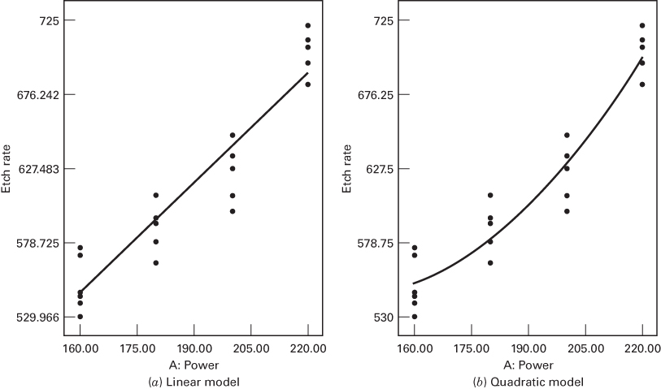
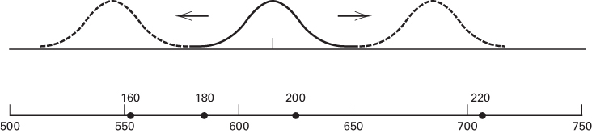

## 3.5 Practical Interpretation of Results

After conducting the experiment, performing the statistical analysis, and investigating the underlying assumptions, the experimenter is ready to draw practical conclusions about the problem he or she is studying. Often this is relatively easy, and certainly in the simple experiments we have considered so far, this might be done somewhat informally, perhaps by inspection of graphical displays such as the box plots and scatter diagram in Figures 3.1 and 3.2. However, in some cases, more formal techniques need to be applied. We present some of these techniques in this section.

## 3.5.1 A Regression Model

The factors involved in an experiment can be either quantitative or qualitative. A quantitative factor is one whose levels can be associated with points on a numerical scale, such as temperature, pressure, or time. Qualitative factors, on the other hand, are factors for which the levels cannot be arranged in order of magnitude. Operators, batches of raw material, and shifts are typical qualitative factors because there is no reason to rank them in any particular numerical order.

Insofar as the initial design and analysis of the experiment are concerned, both types of factors are treated identically. The experimenter is interested in determining the differences, if any, between the levels of the factors. In fact, the analysis of variance treats the design factor as if it were qualitative or categorical. If the factor is really qualitative, such as operators, it is meaningless to consider the response for a subsequent run at an intermediate level of the factor. However, with a quantitative factor such as time, the experimenter is usually interested in the entire range of values used, particularly the response from a subsequent run at an intermediate factor level. That is, if the levels 1.0, 2.0, and 3.0 hours are used in the experiment, we may wish to predict the response at 2.5 hours. Thus, the experimenter is frequently interested in developing an interpolation equation for the response variable in the experiment. This equation is an empirical model of the process that has been studied.

The general approach to fitting empirical models is called regression analysis, which is discussed extensively in Chapter 10. See also the supplemental text material for this chapter. This section briefly illustrates the technique using the etch rate data of Example 3.1.

Figure 3.10 presents scatter diagrams of etch rate y versus the power x for the experiment in Example 3.1. From examining the scatter diagram, it is clear that there is a strong relationship between the etch rate and power. As a first approximation, we could try fitting a linear model to the data, say

$$
y = \beta_ {0} + \beta_ {1} x + \epsilon
$$

where $\beta_{0}$ and $\beta_{1}$ are unknown parameters to be estimated and $\epsilon$ is a random error term. The method often used to estimate the parameters in a model such as this is the method of least squares. This consists of choosing estimates of the $\beta$ 's such that the sum of the squares of the errors (the $\epsilon$ 's) is minimized. The least squares fit in our example is

$$
\hat {y} = 1 3 7. 6 2 + 2. 5 2 7 x
$$

(If you are unfamiliar with regression methods, see Chapter 10 and the supplemental text material for this chapter.)

This linear model is shown in Figure 3.10a. It does not appear to be very satisfactory at the higher power settings. Perhaps an improvement can be obtained by adding a quadratic term in x. The resulting quadratic model fit is

$$
\hat {y} = 1 1 4 7. 7 7 - 8. 2 5 5 5 x + 0. 0 2 8 3 7 5 x ^ {2}
$$

This quadratic fit is shown in Figure 3.10b. The quadratic model appears to be superior to the linear model because it provides a better fit at the higher power settings.

In general, we would like to fit the lowest order polynomial that adequately describes the system or process. In this example, the quadratic polynomial seems to fit better than the linear model, so the extra complexity of the quadratic model is justified. Selecting the order of the approximating polynomial is not always easy, however, and it is relatively easy to overfit, that is, to add high-order polynomial terms that do not really improve the fit but increase the complexity of the model and often damage its usefulness as a predictor or interpolation equation.

In this example, the empirical model could be used to predict etch rate at power settings within the region of experimentation. In other cases, the empirical model could be used for process optimization, that is, finding the levels of the design variables that result in the best values of the response. We will discuss and illustrate these problems extensively later in the book.

  

■ FIGURE 3.10 Scatter diagrams and regression models for the etch rate data of Example 3.1

## 3.5.2 Comparisons Among Treatment Means

Suppose that in conducting an analysis of variance for the fixed effects model the null hypothesis is rejected. Thus, there are differences between the treatment means but exactly which means differ is not specified. Sometimes in this situation, further comparisons and analysis among groups of treatment means may be useful. The ith treatment mean is defined as $\mu_{i} = \mu + \tau_{i}$ , and $\mu_{i}$ is estimated by $\overline{y}_{i}$ . Comparisons between treatment means are made in terms of either the treatment totals $\{y_{i}\}$ or the treatment averages $\{\overline{y}_{i}\}$ . The procedures for making these comparisons are usually called multiple comparison methods. In the next several sections, we discuss methods for making comparisons among individual treatment means or groups of these means.

## 3.5.3 Graphical Comparisons of Means

It is very easy to develop a graphical procedure for the comparison of means following an analysis of variance. Suppose that the factor of interest has $a$ levels and that $\overline{y}_{1},\overline{y}_{2},\ldots ,\overline{y}_{a}$ , are the treatment averages. If we know $\sigma$ , any treatment average would have a standard deviation $\sigma /\sqrt{n}$ . Consequently, if all factor level means are identical, the observed sample means $\overline{y}_i$ . would behave as if they were a set of observations drawn at random from a normal distribution with mean $\overline{y}_i$ and standard deviation $\sigma /\sqrt{n}$ . Visualize a normal distribution capable of being slid along an axis below which the $\overline{y}_{1},\overline{y}_{2},\ldots ,\overline{y}_{a}$ , are plotted. If the treatment means are all equal, there should be some position for this distribution that makes it obvious that the $\overline{y}_i$ . values were drawn from the same distribution. If this is not the case, the $\overline{y}_i$ . values that appear not to have been drawn from this distribution are associated with factor levels that produce different mean responses.

The only flaw in this logic is that $\sigma$ is unknown. Box, Hunter, and Hunter (2005) point out that we can replace $\sigma$ with $\sqrt{MS_E}$ from the analysis of variance and use a $t$ distribution with a scale factor $\sqrt{MS_E / n}$ instead of the normal. Such an arrangement for the etch rate data of Example 3.1 is shown in Figure 3.11. Focus on the $t$ distribution shown as a solid line curve in the middle of the display.

To sketch the t distribution in Figure 3.11, simply multiply the abscissa t value by the scale factor

$$
\sqrt {M S _ {E} / n} = \sqrt {3 3 0 . 7 0 / 5} = 8. 1 3
$$

  
■ FIGURE 3.11 Etch rate averages from Example 3.1 in relation to a t distribution with scale factor $\sqrt{MS_{E}/n} = \sqrt{330.70/5} = 8.13$

and plot this against the ordinate of t at that point. Because the t distribution looks much like the normal, except that it is a little flatter near the center and has longer tails, this sketch is usually easily constructed by eye. If you wish to be more precise, there is a table of abscissa t values and the corresponding ordinates in Box, Hunter, and Hunter (2005). The distribution can have an arbitrary origin, although it is usually best to choose one in the region of the $\overline{y}_{i}$ values to be compared. In Figure 3.11, the origin is 615 Å/min.

Now visualize sliding the t distribution in Figure 3.11 along the horizontal axis as indicated by the dashed lines and examine the four means plotted in the figure. Notice that there is no location for the distribution such that all four averages could be thought of as typical, randomly selected observations from the distribution. This implies that all four means are not equal; thus, the figure is a graphical display of the ANOVA results. Furthermore, the figure indicates that all four levels of power (160, 180, 200, 220 W) produce mean etch rates that differ from each other. In other words, $\mu_{1} \neq \mu_{2} \neq \mu_{3} \neq \mu_{4}$ .

This simple procedure is a rough but effective technique for many multiple comparison problems. However, there are more formal methods. We now give a brief discussion of some of these procedures.

## 3.5.4 Contrasts

Many multiple comparison methods use the idea of a contrast. Consider the plasma etching experiment of Example 3.1. Because the null hypothesis was rejected, we know that some power settings produce different etch rates than others, but which ones actually cause this difference? We might suspect at the outset of the experiment that 200 W and 220 W produce the same etch rate, implying that we would like to test the hypothesis

$$
\begin{array}{l} {H _ {0}: \mu_ {3} = \mu_ {4}} \\ {H _ {1}: \mu_ {3} \neq \mu_ {4}} \end{array}
$$

or equivalently

$$
\begin{array}{l} H _ {0}: \mu_ {3} - \mu_ {4} = 0 \\ H _ {1}: \mu_ {3} - \mu_ {4} \neq 0 \end{array}\tag{3.23}
$$

If we had suspected at the start of the experiment that the average of the lowest levels of power did not differ from the average of the highest levels of power, then the hypothesis would have been

$$
\begin{array}{l} {H _ {0}: \mu_ {1} + \mu_ {2} = \mu_ {3} + \mu_ {4}} \\ {H _ {1}: \mu_ {1} + \mu_ {2} \neq \mu_ {3} + \mu_ {4}} \end{array}
$$

or

$$
\begin{array}{l} H _ {0}: \mu_ {1} + \mu_ {2} - \mu_ {3} - \mu_ {4} = 0 \\ H _ {1}: \mu_ {1} + \mu_ {2} - \mu_ {3} - \mu_ {4} \neq 0 \end{array}\tag{3.24}
$$

In general, a contrast is a linear combination of parameters of the form

$$
\Gamma = \sum_ {i = 1} ^ {a} c _ {i} \mu_ {i}
$$

where the contrast constants $c_{1}, c_{2}, \ldots, c_{a}$ sum to zero; that is, $\sum_{i=1}^{a} c_{i} = 0$ . Both of the above hypotheses can be expressed in terms of contrasts:

$$
H _ {0}: \sum_ {i = 1} ^ {a} c _ {i} \mu_ {i} = 0
$$

$$
H _ {1}: \sum_ {i = 1} ^ {a} c _ {i} \mu_ {i} \neq 0\tag{3.25}
$$

The contrast constants for the hypotheses in Equation 3.23 are $c_{1}=c_{2}=0$ , $c_{3}=+1$ , and $c_{4}=-1$ , whereas for the hypotheses in Equation 3.24, they are $c_{1}=c_{2}=+1$ and $c_{3}=c_{4}=-1$ .

Testing hypotheses involving contrasts can be done in two basic ways. The first method uses a t-test. Write the contrast of interest in terms of the treatment averages, giving

$$
C = \sum_ {i = 1} ^ {a} c _ {i} \overline {{y}} _ {i.}
$$

The variance of $C$ is

$$
V (C) = \frac {\sigma^ {2}}{n} \sum_ {i = 1} ^ {a} c _ {i} ^ {2}\tag{3.26}
$$

when the sample sizes in each treatment are equal. If the null hypothesis in Equation 3.25 is true, the ratio

$$
\frac {\sum_ {i = 1} ^ {a} c _ {i} \overline {{y}} _ {i .}}{\sqrt {\frac {\sigma^ {2}}{n} \sum_ {i = 1} ^ {a} c _ {i} ^ {2}}}
$$

has the $N(0,1)$ distribution. Now we would replace the unknown variance $\sigma^{2}$ by its estimate, the mean square error $MS_{E}$ and use the statistic

$$
t _ {0} = \frac {\sum_ {i = 1} ^ {a} c _ {i} \overline {{y}} _ {i .}}{\sqrt {\frac {M S _ {E}}{n} \sum_ {i = 1} ^ {a} c _ {i} ^ {2}}}\tag{3.27}
$$

to test the hypotheses in Equation 3.25. The null hypothesis would be rejected if $|t_0|$ in Equation 3.27 exceeds $t_{\alpha / 2,N - a}$ .

The second approach uses an F-test. Now the square of a t random variable with v degrees of freedom is an F random variable with 1 numerator and v denominator degrees of freedom. Therefore, we can obtain

$$
F _ {0} = t _ {0} ^ {2} = \frac {\left(\sum_ {i = 1} ^ {a} c _ {i} \overline {{y}} _ {i .}\right) ^ {2}}{\frac {M S _ {E}}{n} \sum_ {i = 1} ^ {a} c _ {i} ^ {2}}\tag{3.28}
$$

$$
F _ {0} = \frac {M S _ {C}}{M S _ {E}} = \frac {S S _ {C} / 1}{M S _ {E}}
$$

as an $F$ -statistic for testing Equation 3.25. The null hypothesis would be rejected if $F_0 > F_{\alpha,1,N - a}$ . We can write the test statistic of Equation 3.28 as

where the single-degree-of-freedom contrast sum of squares is

$$
S S _ {C} = \frac {\left(\sum_ {i = 1} ^ {a} c _ {i} \overline {{y}} _ {i .}\right) ^ {2}}{\frac {1}{n} \sum_ {i = 1} ^ {a} c _ {i} ^ {2}}\tag{3.29}
$$

Confidence Interval for a Contrast. Instead of testing hypotheses about a contrast, it may be more useful to construct a confidence interval. Suppose that the contrast of interest is

$$
\Gamma = \sum_ {i = 1} ^ {a} c _ {i} \mu_ {i}
$$

Replacing the treatment means with the treatment averages yields

$$
C = \sum_ {i = 1} ^ {a} c _ {i} \overline {{y}} _ {i.}
$$

Because

$$
E \left(\sum_ {i = 1} ^ {a} c _ {i} \bar {y} _ {i.}\right) = \sum_ {i = 1} ^ {a} c _ {i} \mu_ {i} \quad \text { and } \quad V (C) = \sigma^ {2} / n \sum_ {i = 1} ^ {a} c _ {i} ^ {2}
$$

the $100(1 - \alpha)$ percent confidence interval on the contrast $\Sigma_{i=1}^{a} c_i \mu_i$ is

$$
\sum_ {i = 1} ^ {a} c _ {i} \overline {{y}} _ {i.} - t _ {\alpha / 2, N - a} \sqrt {\frac {M S _ {E}}{n} \sum_ {i = 1} ^ {a} c _ {i} ^ {2}} \leq \sum_ {i = 1} ^ {a} c _ {i} \mu_ {i} \leq \sum_ {i = 1} ^ {a} c _ {i} \overline {{y}} _ {i.} + t _ {\alpha / 2, N - a} \sqrt {\frac {M S _ {E}}{n} \sum_ {i = 1} ^ {a} c _ {i} ^ {2}}\tag{3.30}
$$

Note that we have used $MS_{E}$ to estimate $\sigma^{2}$ . Clearly, if the confidence interval in Equation 3.30 includes zero, we would be unable to reject the null hypothesis in Equation 3.25.

Standardized Contrast. When more than one contrast is of interest, it is often useful to evaluate them on the same scale. One way to do this is to standardize the contrast so that it has variance $\sigma^{2}$ . If the contrast $\Sigma_{i=1}^{a}c_{i}\mu_{i}$ is written in terms of treatment averages as $\Sigma_{i=1}^{a}c_{i}\overline{y}_{i}$ , dividing it by $\sqrt{(1/n)\Sigma_{i=1}^{a}c_{i}^{2}}$ will produce a standardized contrast with variance $\sigma^{2}$ . Effectively, then, the standardized contrast is

$$
\sum_ {i = 1} ^ {a} c _ {i} ^ {*} \overline {{y}} _ {i}.
$$

where

$$
c _ {i} ^ {*} = \frac {c _ {i}}{\sqrt {\frac {1}{n} \sum_ {i = 1} ^ {a} c _ {i} ^ {2}}}
$$

Unequal Sample Sizes. When the sample sizes in each treatment are different, minor modifications are made in the above results. First, note that the definition of a contrast now requires that

$$
\sum_ {i = 1} ^ {a} n _ {i} c _ {i} = 0
$$

Other required changes are straightforward. For example, the t statistic in Equation 3.27 becomes

$$
t _ {0} = \frac {\sum_ {i = 1} ^ {a} c _ {i} \overline {{y}} _ {i .}}{\sqrt {M S _ {E} \sum_ {i = 1} ^ {a} \frac {c _ {i} ^ {2}}{n _ {i}}}}
$$

and the contrast sum of squares from Equation 3.29 becomes

$$
S S _ {C} = \frac {\left(\sum_ {i = 1} ^ {a} c _ {i} \overline {{y}} _ {i .}\right) ^ {2}}{\sum_ {i = 1} ^ {a} \frac {c _ {i} ^ {2}}{n _ {i}}}
$$

## 3.5.5 Orthogonal Contrasts

A useful special case of the procedure in Section 3.5.4 is that of orthogonal contrasts. Two contrasts with coefficients $\{c_i\}$ and $\{d_i\}$ are orthogonal if

$$
\sum_ {i = 1} ^ {a} c _ {i} d _ {i} = 0
$$

or, for an unbalanced design, if

$$
\sum_ {i = 1} ^ {a} c _ {i} d _ {i} / n _ {i} = 0
$$

For a treatments, the set of a - 1 orthogonal contrasts partition the sum of squares due to treatments into a - 1 independent single-degree-of-freedom components. Thus, tests performed on orthogonal contrasts are independent.

There are many ways to choose the orthogonal contrast coefficients for a set of treatments. Usually, something in the nature of the experiment should suggest which comparisons will be of interest. For example, if there are a = 3 treatments, with treatment 1 a control and treatments 2 and 3 actual levels of the factor of interest to the experimenter, appropriate orthogonal contrasts might be as follows:

<table><tr><td>Treatment</td><td colspan="2">Coefficients for Orthogonal Contrasts</td></tr><tr><td>1 (control)</td><td>-2</td><td>0</td></tr><tr><td>2 (level 1)</td><td>1</td><td>-1</td></tr><tr><td>3 (level 2)</td><td>1</td><td>1</td></tr></table>

Note that contrast 1 with $c_{i} = -2, 1, 1$ compares the average effect of the factor with the control, whereas contrast 2 with $d_{i} = 0, -1, 1$ compares the two levels of the factor of interest.

Generally, the method of contrasts (or orthogonal contrasts) is useful for what are called preplanned comparisons. That is, the contrasts are specified prior to running the experiment and examining the data. The reason for this is that if comparisons are selected after examining the data, most experimenters would construct tests that correspond to large observed differences in means. These large differences could be the result of the presence of real effects, or they could be the result of random error. If experimenters consistently pick the largest differences to compare, they will inflate the type I error of the test because it is likely that, in an unusually high percentage of the comparisons selected, the observed differences will be the result of error. Examining the data to select comparisons of potential interest is often called data snooping. The Scheffé method for all comparisons, discussed in the next section, permits data snooping.

## EXAMPLE 3.6

Consider the plasma etching experiment in Example 3.1. There are four treatment means and three degrees of freedom between these treatments. Suppose that prior to running the experiment the following set of comparisons among the treatment means (and their associated contrasts) were specified:

<table><tr><td>Hypothesis</td><td>Contrast</td></tr><tr><td> $H_0: \mu_1 = \mu_2$ </td><td> $C_1 = \overline{y}_{1.} - \overline{y}_{2.}$ </td></tr><tr><td> $H_0: \mu_1 + \mu_2 = \mu_3 + \mu_4$ </td><td> $C_2 = \overline{y}_{1.} + \overline{y}_{2.} - \overline{y}_{3.} - \overline{y}_{4.}$ </td></tr><tr><td> $H_0: \mu_3 = \mu_4$ </td><td> $C_3 = \overline{y}_{3.} - \overline{y}_{4.}$ </td></tr></table>

Notice that the contrast coefficients are orthogonal. Using the data in Table 3.4, we find the numerical values of the contrasts and the sums of squares to be as follows:

$$
C _ {1} = + 1 (5 5 1. 2) - 1 (5 8 7. 4) = - 3 6. 2
$$

$$
S S _ {C _ {1}} = \frac {(- 3 6 . 2) ^ {2}}{\frac {1}{5} (2)} = 3 2 7 6. 1 0
$$

$$
C _ {2} = \begin{array}{l} + 1 (5 5 1. 2) + 1 (5 8 7. 4) \\ - 1 (6 2 5. 4) - 1 (7 0 7. 0) \end{array} = - 1 9 3. 8
$$

$$
S S _ {C _ {2}} = \frac {(- 1 9 3 . 8) ^ {2}}{\frac {1}{5} (4)} = 4 6, 9 4 8. 0 5
$$

$$
C _ {3} = + 1 (6 2 5. 4) - 1 (7 0 7. 6) = - 8 1. 6
$$

$$
S S _ {C _ {3}} = \frac {(- 8 1 . 6) ^ {2}}{\frac {1}{5} (2)} = 1 6, 6 4 6. 4 0
$$

These contrast sums of squares completely partition the treatment sum of squares. The tests on such orthogonal contrasts are usually incorporated in the ANOVA, as shown in Table 3.11. We conclude from the P-values that there are significant differences in mean etch rates between levels 1 and 2 and between levels 3 and 4 of the power settings, and that the average of levels 1 and 2 does differ significantly from the average of levels 3 and 4 at the $\alpha = 0.05$ level.

## TABLE 3.11

Analysis of Variance for the Plasma Etching Experiment

<table><tr><td>Source of Variation</td><td>Sum of Squares</td><td>Degrees of Freedom</td><td>Mean Square</td><td> $F_0$ </td><td>P-Value</td></tr><tr><td>Power setting</td><td>66,870.55</td><td>3</td><td>22,290.18</td><td>66.80</td><td>&lt; 0.001</td></tr><tr><td colspan="6">Orthogonal contrasts</td></tr><tr><td> $C_1: \mu_1 = \mu_2$ </td><td>(3276.10)</td><td>1</td><td>3276.10</td><td>9.82</td><td>&lt; 0.01</td></tr><tr><td> $C_2: \mu_1 + \mu_3 = \mu_3 + \mu_4$ </td><td>(46,948.05)</td><td>1</td><td>46,948.05</td><td>140.69</td><td>&lt; 0.001</td></tr><tr><td> $C_3: \mu_3 = \mu_4$ </td><td>(16,646.40)</td><td>1</td><td>16,646.40</td><td>49.88</td><td>&lt; 0.001</td></tr><tr><td>Error</td><td>5,339.20</td><td>16</td><td>333.70</td><td></td><td></td></tr><tr><td>Total</td><td>72,209.75</td><td>19</td><td></td><td></td><td></td></tr></table>

## 3.5.6 Scheffé's Method for Comparing All Contrasts

In many situations, experimenters may not know in advance which contrasts they wish to compare, or they may be interested in more than a - 1 possible comparisons. In many exploratory experiments, the comparisons of interest are discovered only after preliminary examination of the data. Scheffé (1953) has proposed a method for comparing any and all possible contrasts between treatment means. In the Scheffé method, the type I error is at most $\alpha$ for any of the possible comparisons.

Suppose that a set of m contrasts in the treatment means

$$
\Gamma_ {u} = c _ {1 u} \mu_ {1} + c _ {2 u} \mu_ {2} + \dots + c _ {a u} \mu_ {a} \quad u = 1, 2, \ldots , m\tag{3.31}
$$

of interest have been determined. The corresponding contrast in the treatment averages $\overline{y}_{i}$ is

$$
C _ {u} = c _ {1 u} \overline {{y}} _ {1.} + c _ {2 u} \overline {{y}} _ {2.} + \dots + c _ {a u} \overline {{y}} _ {a.} \quad u = 1, 2, \ldots , m\tag{3.32}
$$

and the standard error of this contrast is

$$
S _ {C _ {u}} = \sqrt {M S _ {E} \sum_ {i = 1} ^ {a} (c _ {i u} ^ {2} / n _ {i})}\tag{3.33}
$$

where $n_{i}$ is the number of observations in the ith treatment. It can be shown that the critical value against which $C_{u}$ should be compared is

$$
S _ {\alpha , u} = S _ {C _ {u}} \sqrt {(a - 1) F _ {\alpha , a - 1 , N - a}}\tag{3.34}
$$

To test the hypothesis that the contrast $\Gamma_{u}$ differs significantly from zero, refer $C_{u}$ to the critical value. If $|C_{u}| > S_{\alpha,u}$ , the hypothesis that the contrast $\Gamma_{u}$ equals zero is rejected.

The Scheffé procedure can also be used to form confidence intervals for all possible contrasts among treatment means. The resulting intervals, say $C_{u} - S_{\alpha,u} \leq \Gamma_{u} \leq C_{u} + S_{\alpha,u}$ , are simultaneous confidence intervals in that the probability that all of them are simultaneously true is at least $1 - \alpha$ .

To illustrate the procedure, consider the data in Example 3.1 and suppose that the contrasts of interests are

$$
\Gamma_ {1} = \mu_ {1} + \mu_ {2} - \mu_ {3} - \mu_ {4}
$$

and

$$
\Gamma_ {2} = \mu_ {1} - \mu_ {4}
$$

The numerical values of these contrasts are

$$
\begin{array}{r l} C _ {1} & = \overline {{y}} _ {1.} + \overline {{y}} _ {2.} - \overline {{y}} _ {3.} - \overline {{y}} _ {4.} \\ & = 5 5 1. 2 + 5 8 7. 4 - 6 2 5. 4 - 7 0 7. 0 = - 1 9 3. 8 0 \end{array}
$$

and

$$
\begin{array}{r l} C _ {2} & = \overline {{y}} _ {1.} - \overline {{y}} _ {4.} \\ & = 5 5 1. 2 - 7 0 7. 0 = - 1 5 5. 8 \end{array}
$$

The standard errors are found from Equation 3.33 as

$$
S _ {C _ {1}} = \sqrt {M S _ {E} \sum_ {i = 1} ^ {5} (c _ {i 1} ^ {2} / n _ {i})} = \sqrt {3 3 3 . 7 0 (1 + 1 + 1 + 1) / 5} = 1 6. 3 4
$$

and

$$
S _ {C _ {2}} = \sqrt {M S _ {E} \sum_ {i = 1} ^ {5} (c _ {i 2} ^ {2} / n _ {i})} = \sqrt {3 3 3 . 7 0 (1 + 1) / 5} = 1 1. 5 5
$$

From Equation 3.34, the 1 percent critical values are

$$
S _ {0. 0 1, 1} = S _ {C _ {1}} \sqrt {(a - 1) F _ {0 . 0 1 , a - 1 , N - a}} = 1 6. 3 4 \sqrt {3 (5 . 2 9)} = 6 5. 0 9
$$

and

$$
S _ {0. 0 1, 2} = S _ {C _ {2}} \sqrt {(a - 1) F _ {0 . 0 1 , a - 1 , N - a}} = 1 1. 5 5 \sqrt {3 (5 . 2 9)} = 4 5. 9 7
$$

Because $|C_{1}| > S_{0.01,1}$ , we conclude that the contrast $\Gamma_{1} = \mu_{1} + \mu_{2} - \mu_{3} - \mu_{4}$ does not equal zero; that is, we conclude that the mean etch rates of power settings 1 and 2 as a group differ from the means of power settings 3 and 4 as a group. Furthermore, because $|C_{2}| > S_{0.01,2}$ , we conclude that the contrast $\Gamma_{2} = \mu_{1} - \mu_{4}$ does not equal zero; that is, the mean etch rates of treatments 1 and 4 differ significantly.

## 3.5.7 Comparing Pairs of Treatment Means

In many practical situations, we will wish to compare only pairs of means. Frequently, we can determine which means differ by testing the differences between all pairs of treatment means. Thus, we are interested in contrasts of the form $\Gamma = \mu_{j} - \mu_{j}$ for all $i \neq j$ . Although the Scheffé method described in the previous section could be easily applied to this problem, it is not the most sensitive procedure for such comparisons. We now turn to a consideration of methods specifically designed for pairwise comparisons between all a population means.

Suppose that we are interested in comparing all pairs of a treatment means and that the null hypotheses that we wish to test are $H_{0}: \mu_{i} = \mu_{j}$ for all $i \neq j$ . There are numerous procedures available for this problem. We now present two popular methods for making such comparisons.

Tukey's Test. Suppose that, following an ANOVA in which we have rejected the null hypothesis of equal treatment means, we wish to test all pairwise mean comparisons:

$$
\begin{array}{l} H _ {0}: \mu_ {i} = \mu_ {j} \\ H _ {1}: \mu_ {i} \neq \mu_ {j} \end{array}
$$

for all $i \neq j$ . Tukey (1953) proposed a procedure for testing hypotheses for which the overall significance level is exactly $\alpha$ when the sample sizes are equal and at most $\alpha$ when the sample sizes are unequal. His procedure can also be used to construct confidence intervals on the differences in all pairs of means. For these intervals, the simultaneous confidence level is $100(1 - \alpha)$ percent when the sample sizes are equal and at least $100(1 - \alpha)$ percent when sample sizes are unequal. In other words, the Tukey procedure controls the experimentwise or “family” error rate at the selected level $\alpha$ . This is an excellent data snooping procedure when interest focuses on pairs of means.

Tukey's procedure makes use of the distribution of the studentized range statistic

$$
q = \frac {\overline {{{y}}} _ {\max} - \overline {{{y}}} _ {\min}}{\sqrt {M S _ {E} / n}}
$$

where $\overline{y}_{\mathrm{max}}$ and $\overline{y}_{\mathrm{min}}$ are the largest and smallest sample means, respectively, out of a group of $p$ sample means. Appendix Table V contains values of $q_{\alpha}(p,f)$ , the upper $\alpha$ percentage points of $q$ , where $f$ is the number of degrees of freedom associated with the $MS_E$ . For equal sample sizes, Tukey's test declares two means significantly different if the absolute value of their sample differences exceeds

$$
T _ {\alpha} = q _ {\alpha} (a, f) \sqrt {\frac {M S _ {E}}{n}}\tag{3.35}
$$

Equivalently, we could construct a set of $100(1 - \alpha)$ percent confidence intervals for all pairs of means as follows:

$$
\begin{array}{r l} & {\overline {{y}} _ {i.} - \overline {{y}} _ {j.} - q _ {\alpha} (a, f) \sqrt {\frac {M S _ {E}}{n}} \leq \mu_ {i} - \mu_ {j}} \\ & {\qquad \leq \overline {{y}} _ {i.} - \overline {{y}} _ {j.} + q _ {\alpha} (a, f) \sqrt {\frac {M S _ {E}}{n}}, i \neq j.} \end{array}\tag{3.36}
$$

When sample sizes are not equal, Equations 3.35 and 3.36 become

$$
T _ {\alpha} = \frac {q _ {\alpha} (a , f)}{\sqrt {2}} \sqrt {M S _ {E} \left(\frac {1}{n _ {i}} + \frac {1}{n _ {j}}\right)}\tag{3.37}
$$

and

$$
\begin{array}{r l} & {\overline {{y}} _ {i.} - \overline {{y}} _ {j.} - \frac {q _ {\alpha} (a , f)}{\sqrt {2}} \sqrt {M S _ {E} \left(\frac {1}{n _ {i}} + \frac {1}{n _ {j}}\right)} \leq \mu_ {i} - \mu_ {j}} \\ & {\qquad \leq \overline {{y}} _ {i.} - \overline {{y}} _ {j.} + \frac {q _ {\alpha} (a , f)}{\sqrt {2}} \sqrt {M S _ {E} \left(\frac {1}{n _ {i}} + \frac {1}{n _ {j}}\right)}, i \neq j} \end{array}\tag{3.38}
$$

respectively. The unequal sample size version is sometimes called the Tukey–Kramer procedure.

## EXAMPLE 3.7

To illustrate Tukey's test, we use the data from the plasma etching experiment in Example 3.1. With $\alpha = 0.05$ and $f = 16$ degrees of freedom for error, Appendix Table V gives $q_{0.05}(4,16) = 4.05$ . Therefore, from Equation 3.35,

$$
T _ {0. 0 5} = q _ {0. 0 5} (4, 1 6) \sqrt {\frac {M S _ {E}}{n}} = 4. 0 5 \sqrt {\frac {3 3 3 . 7 0}{5}} = 3 3. 0 9
$$

Thus, any pairs of treatment averages that differ in absolute value by more than 33.09 would imply that the corresponding pair of population means are significantly different. The four treatment averages are

$$
\begin{array}{r l} \overline {{y}} _ {1.} = 5 5 1. 2 & \overline {{y}} _ {2.} = 5 8 7. 4 \\ \overline {{y}} _ {3.} = 6 2 5. 4 & \overline {{y}} _ {4.} = 7 0 7. 0 \end{array}
$$

and the differences in averages are

$$
\overline {{{y}}} _ {1.} - \overline {{{y}}} _ {2.} = 5 5 1. 2 - 5 8 7. 4 = - 3 6. 2 0 ^ {*}
$$

$$
\overline {{{y}}} _ {1.} - \overline {{{y}}} _ {3.} = 5 5 1. 2 - 6 2 5. 4 = - 7 4. 2 0 ^ {*}
$$

$$
\overline {{{y}}} _ {1.} - \overline {{{y}}} _ {4.} = 5 5 1. 2 - 7 0 7. 0 = - 1 5 5. 8 ^ {*}
$$

$$
\overline {{{y}}} _ {2.} - \overline {{{y}}} _ {3.} = 5 8 7. 4 - 6 2 5. 4 = - 3 8. 0 ^ {*}
$$

$$
\overline {{{y}}} _ {2.} - \overline {{{y}}} _ {4.} = 5 8 7. 4 - 7 0 7. 0 = - 1 1 9. 6 ^ {*}
$$

$$
\overline {{y}} _ {3.} - \overline {{y}} _ {4.} = 6 2 5. 4 - 7 0 7. 0 = - 8 1. 6 0 ^ {*}
$$

The starred values indicate the pairs of means that are significantly different. Note that the Tukey procedure indicates that all pairs of means differ. Therefore, each power setting results in a mean etch rate that differs from the mean etch rate at any other power setting.

When using any procedure for pairwise testing of means, we occasionally find that the overall F-test from the ANOVA is significant, but the pairwise comparison of means fails to reveal any significant differences. This situation occurs because the F-test is simultaneously considering all possible contrasts involving the treatment means, not just pairwise comparisons. That is, in the data at hand, the significant contrasts may not be of the form $\mu_{i}-\mu_{j}$ .

The derivation of the Tukey confidence interval of Equation 3.36 for equal sample sizes is straightforward. For the studentized range statistic q, we have

$$
P \left(\frac {\max (\overline {{y}} _ {i .} - \mu_ {i}) - \min (\overline {{y}} _ {i .} - \mu_ {i})}{\sqrt {M S _ {E} / n}} \leq q _ {\alpha} (a, f)\right) = 1 - \alpha
$$

If $\max (\overline{y}_{i.} - \mu_i) - \min (\overline{y}_{i.} - \mu_i)$ is less than or equal to $q_{\alpha}(a,f)\sqrt{MS_E / n}$ , it must be true that $|\overline{y}_{i.} - \mu_i) - \overline{y}_{j.} - \mu_j)|\leq q_{\alpha}(a,f)\sqrt{MS_E / n}$ for every pair of means. Therefore

$$
P \left(- q _ {\alpha} (a, f) \sqrt {\frac {M S _ {E}}{n}} \leq \overline {{{y}}} _ {i.} - \overline {{{y}}} _ {j.} - (\mu_ {i} - \mu_ {j}) \leq q _ {\alpha} (a, f) \sqrt {\frac {M S _ {E}}{n}}\right) = 1 - \alpha
$$

Rearranging this expression to isolate $\mu_{i}-\mu_{j}$ between the inequalities will lead to the set of $100(1-\alpha)$ percent simultaneous confidence intervals given in Equation 3.38.

The Fisher Least Significant Difference (LSD) Method. The Fisher method for comparing all pairs of means controls the error rate $\alpha$ for each individual pairwise comparison but does not control the experimentwise or family error rate. This procedure uses the t statistic for testing $H_{0} : \mu_{i} = \mu_{j}$

$$
t _ {0} = \frac {\overline {{y}} _ {i .} - \overline {{y}} _ {j .}}{\sqrt {M S _ {E} \left(\frac {1}{n _ {i}} + \frac {1}{n _ {j}}\right)}}\tag{3.39}
$$

Assuming a two-sided alternative, the pair of means $\mu_{i}$ and $\mu_{j}$ would be declared significantly different if $|\overline{y}_{i.} - \overline{y}_{j.}| > t_{\alpha /2,N - a}\sqrt{MS_E(1 / n_i + 1 / n_j)}$ . The quantity

$$
\mathrm{LSD} = t _ {\alpha / 2, N - \alpha} \sqrt {M S _ {E} \left(\frac {1}{n _ {i}} + \frac {1}{n _ {j}}\right)}\tag{3.40}
$$

is called the least significant difference. If the design is balanced, $n_{1}=n_{2}=\cdots=n_{a}=n$ , and

$$
\mathrm{LSD} = t _ {\alpha / 2, N - a} \sqrt {\frac {2 M S _ {E}}{n}}\tag{3.41}
$$

To use the Fisher LSD procedure, we simply compare the observed difference between each pair of averages to the corresponding LSD. If $|\overline{y}_{i.}-\overline{y}_{j.}|>$ LSD, we conclude that the population means $\mu_{i}$ and $\mu_{j}$ differ. The t statistic in Equation 3.39 could also be used.

## EXAMPLE 3.8

To illustrate the procedure, if we use the data from the experiment in Example 3.1, the LSD at $\alpha = 0.05$ is

$$
\overline {{{y}}} _ {1.} - \overline {{{y}}} _ {3.} = 5 5 1. 2 - 6 2 5. 4 = - 7 4. 2 ^ {*}
$$

$$
\overline {{{y}}} _ {1.} - \overline {{{y}}} _ {4.} = 5 5 1. 2 - 7 0 7. 0 = - 1 5 5. 8 ^ {*}
$$

$$
\mathrm{LSD} = t _ {. 0 2 5, 1 6} \sqrt {\frac {2 M S _ {E}}{n}} = 2. 1 2 0 \sqrt {\frac {2 (3 3 3 . 7 0)}{5}} = 2 4. 4 9
$$

$$
\overline {{{y}}} _ {2.} - \overline {{{y}}} _ {3.} = 5 8 7. 4 - 6 2 5. 4 = - 3 8. 0 ^ {*}
$$

Thus, any pair of treatment averages that differ in absolute value by more than 24.49 would imply that the corresponding pair of population means are significantly different. The differences in averages are

$$
\overline {{{y}}} _ {2.} - \overline {{{y}}} _ {4.} = 5 8 7. 4 - 7 0 7. 0 = - 1 1 9. 6 ^ {*}
$$

$$
\overline {{{y}}} _ {3.} - \overline {{{y}}} _ {4.} = 6 2 5. 4 - 7 0 7. 0 = - 8 1. 6 ^ {*}
$$

$$
\overline {{{y}}} _ {1.} - \overline {{{y}}} _ {2.} = 5 5 1. 2 - 5 8 7. 4 = - 3 6. 2 ^ {*}
$$

The starred values indicate pairs of means that are significantly different. Clearly, all pairs of means differ significantly.

Note that the overall $\alpha$ risk may be considerably inflated using this method. Specifically, as the number of treatments a gets larger, the experimentwise or family type I error rate (the ratio of the number of experiments in which at least one type I error is made to the total number of experiments) becomes large.

Which Pairwise Comparison Method Do I Use? Certainly, a logical question at this point is as follows: Which one of these procedures should I use? Unfortunately, there is no clear-cut answer to this question, and professional statisticians often disagree over the utility of the various procedures. Carmer and Swanson (1973) have conducted Monte Carlo simulation studies of a number of multiple comparison procedures, including others not discussed here. They report that the least significant difference method is a very effective test for detecting true differences in means if it is applied only after the F-test in the ANOVA is significant at 5 percent. However, this method does not contain the experimentwise error rate. Because the Tukey method does control the overall error rate, many statisticians prefer to use it.

As indicated above, there are several other multiple comparison procedures. For articles describing these methods, see O'Neill and Wetherill (1971), Miller (1977), and Nelson (1989). The books by Miller (1991) and Hsu (1996) are also recommended.

## 3.5.8 Comparing Treatment Means with a Control

In many experiments, one of the treatments is a control, and the analyst is interested in comparing each of the other $a - 1$ treatment means with the control. Thus, only $a - 1$ comparisons are to be made. A procedure for making these comparisons has been developed by Dunnett (1964). Suppose that treatment $a$ is the control and we wish to test the hypotheses

$$
\begin{array}{l} {H _ {0}: \mu_ {i} = \mu_ {a}} \\ {H _ {1}: \mu_ {i} \neq \mu_ {a}} \end{array}
$$

for $i = 1,2,\dots ,a - 1$ . Dunnett's procedure is a modification of the usual $t$ -test. For each hypothesis, we compute the observed differences in the sample means

$$
| \overline {{{y}}} _ {i.} - \overline {{{y}}} _ {a.} | \quad i = 1, 2, \ldots , a - 1
$$

The null hypothesis $H_0: \mu_i = \mu_a$ is rejected using a type I error rate $\alpha$ if

$$
\left| \bar {y} _ {i.} - \bar {y} _ {a.} \right| > d _ {\alpha} (a - 1, f) \sqrt {M S _ {E} \left(\frac {1}{n _ {i}} + \frac {1}{n _ {a}}\right)}\tag{3.42}
$$

where the constant $d_{\alpha}(a-1,f)$ is given in Appendix Table VI. (Both two- and one-sided tests are possible.) Note that $\alpha$ is the joint significance level associated with all a-1 tests.

## EXAMPLE 3.9

To illustrate Dunnett's test, consider the experiment from Example 3.1 with treatment 4 considered as the control. In this example, a = 4, a - 1 = 3, f = 16, and $n_{i} = n = 5$ . At the five percent level, we find from Appendix Table VI that $d_{0.05}(3, 16) = 2.59$ . Thus, the critical difference becomes

$$
d _ {0. 0 5} (3, 1 6) \sqrt {\frac {2 M S _ {E}}{n}} = 2. 5 9 \sqrt {\frac {2 (3 3 3 . 7 0)}{5}} = 2 9. 9 2
$$

(Note that this is a simplification of Equation 3.42 resulting from a balanced design.) Thus, any treatment mean that differs in absolute value from the control by more than 29.92 would be declared significantly different. The observed differences are

$$
1 \text { vs. } 4: \overline {{y}} _ {1.} - \overline {{y}} _ {4.} = 5 5 1. 2 - 7 0 7. 0 = - 1 5 5. 8
$$

$$
2 \text { vs. } 4: \overline {{y}} _ {2.} - \overline {{y}} _ {4.} = 5 8 7. 4 - 7 0 7. 0 = - 1 1 9. 6
$$

$$
3 \mathrm{vs.} 4: \overline {{{y}}} _ {3.} - \overline {{{y}}} _ {4.} = 6 2 5. 4 - 7 0 7. 0 = - 8 1. 6
$$

Note that all differences are significant. Thus, we would conclude that all power settings are different from the control.

When comparing treatments with a control, it is a good idea to use more observations for the control treatment (say $n_{a}$ ) than for the other treatments (say n), assuming equal numbers of observations for the remaining a - 1 treatments. The ratio $n_{a}/n$ should be chosen to be approximately equal to the square root of the total number of treatments. That is, choose $n_{a}/n = \sqrt{a}$ .
