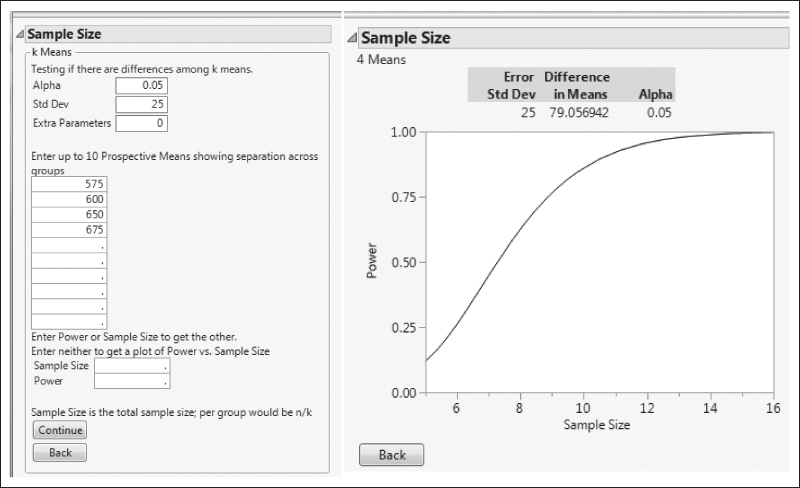

## 3.7 Determining Sample Size

In any experimental design problem, a critical decision is the choice of sample size—that is, determining the number of replicates to run. Generally, if the experimenter is interested in detecting small effects, more replicates are required than if the experimenter is interested in detecting large effects. In this section, we discuss several approaches to determining sample size. Although our discussion focuses on a single-factor design, most of the methods can be used in more complex experimental situations.

## 3.7.1 Operating Characteristic and Power Curves

Recall that an operating characteristic (OC) curve is a plot of the type II error probability $\beta$ of a statistical test for a particular sample size versus a parameter that reflects the extent to which the null hypothesis is false. Alternatively, a Power Curve plots power or $1 - \beta$ versus this parameter. Power and/or OC curves can be constructed from software and are useful in guiding the experimenter in selecting the number of replicates so that the design will be sensitive to important potential differences in the treatments.

We consider the probability of type II error of the fixed effects model for the case of equal sample sizes per treatment, say

$$
\begin{array}{r l} \beta & = 1 - P \{\text { Reject } H _ {0} | H _ {0} \text { is   false } \} \\ & = 1 - P \{F _ {0} > F _ {\alpha , a - 1, N - a} | H _ {0} \text { is   false } \} \end{array}\tag{3.43}
$$

To evaluate the probability statement in Equation 3.43, we need to know the distribution of the test statistic $F_0$ if the null hypothesis is false. It can be shown that, if $H_0$ is false, the statistic $F_0 = MS_{\text{Treatments}} / MS_E$ is distributed as a noncentral $F$ random variable with $a - 1$ and $N - a$ degrees of freedom and the noncentrality parameter $\delta$ . If $\delta = 0$ , the noncentral $F$ distribution becomes the usual (central) $F$ distribution.

We will illustrate the sample size determination method implemented in JMP. Consider the plasma etching experiment described in Example 3.1. Suppose that the experimenter is interested in rejecting the null hypothesis with a probability of at least 0.9 (power = 0.9) if the true treatment means are

$$
\mu_ {1} = 5 7 5, \mu_ {2} = 6 0 0, \mu_ {3} = 6 5 0, \mathrm{and} \mu_ {1} = 6 7 5
$$

The experimenter feels that the standard deviation of etch rate will be no larger than $\sigma = 25$ Å/min. The input and output from the JMP power and sample size platform for comparing several means are shown in the following display:



The graph on the right is a plot of power versus the total sample size. This plot indicates that at least four replicates are required to obtain a power that exceeds 0.90.

A potential problem with this approach to determining sample size is that it can be difficult to select a set of treatment means on which the sample size decision should be based. An alternate approach is to select a sample size such that if the difference between any two treatment means exceeds a specified value, the null hypothesis should be rejected.

Minitab uses this approach to perform power calculations and find sample sizes for single-factor ANOVAs. Consider the following display:

```txt
Power and Sample Size
One-way ANOVA
Alpha = 0.01 Assumed standard deviation = 25
Number of Levels = 4
Sample Maximum
SS Means Size Power Difference
2812.5 5 0.804838 75
The sample size is for each level.
Power and Sample Size
One-way ANOVA
Alpha = 0.01 Assumed standard deviation = 25
Number of Levels 5 4
Sample Target Maximum
SS Means Size Power Actual Power Difference
2812.5 6 0.9 0.915384 75
The sample size is for each level.
```

In the upper portion of the display, we asked Minitab to calculate the power for n = 5 replicates when the maximum difference in treatment means is 75. The bottom portion of the display is the output when the experimenter requests the sample size to obtain a target power of at least 0.90.

## 3.7.2 Confidence Interval Estimation Method

This approach assumes that the experimenter wishes to express the final results in terms of confidence intervals and is willing to specify in advance how wide he or she wants these confidence intervals to be. For example, suppose that in the plasma etching experiment from Example 3.1, we wanted a 95 percent confidence interval on the difference in mean etch rate for any two power settings to be $\pm30\ \AA/min$ and a prior estimate of $\sigma$ is 25. Then, using Equation 3.13, we find that the accuracy of the confidence interval is

$$
\pm t _ {\alpha / 2, N - a} \sqrt {\frac {2 M S _ {E}}{n}}
$$

Suppose that we try n = 5 replicates. Then, using $\sigma^{2} = (25)^{2} = 625$ as an estimate of $MS_{E}$ , the accuracy of the confidence interval becomes

$$
\pm 2. 1 2 0 \sqrt {\frac {2 (6 2 5)}{5}} = \pm 3 3. 5 2
$$

which does not meet the requirement. Trying n = 6 gives

$$
\pm 2. 0 8 6 \sqrt {\frac {2 (6 2 5)}{6}} = \pm 3 0. 1 1
$$

Trying $n = 7$ gives

$$
\pm 2. 0 6 4 \sqrt {\frac {2 (6 2 5)}{7}} = \pm 2 7. 5 8
$$

Clearly, $n = 7$ is the smallest sample size that will lead to the desired accuracy.

The quoted level of significance in the above illustration applies only to one confidence interval. However, the same general approach can be used if the experimenter wishes to prespecify a set of confidence intervals about which a joint or simultaneous confidence statement is made (see the comments about simultaneous confidence intervals in Section 3.3.3). Furthermore, the confidence intervals could be constructed about more general contrasts in the treatment means than the pairwise comparison illustrated above.
