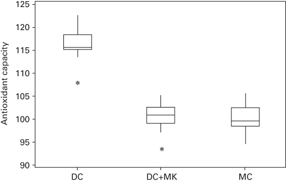
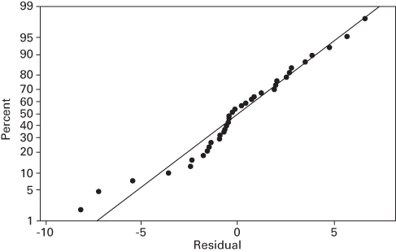
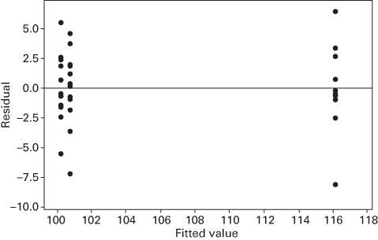
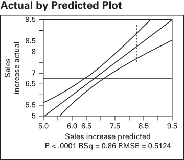
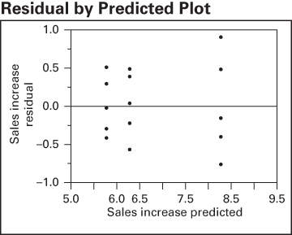
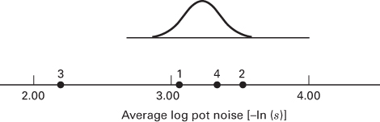

## 3.8 Other Examples of Single-Factor Experiments

## 3.8.1 Chocolate and Cardiovascular Health

An article in Nature describes an experiment to investigate the effect of consuming chocolate on cardiovascular health (“Plasma Antioxidants from Chocolate,” Nature, Vol. 424, 2003, pp. 1013). The experiment consisted of using three different types of chocolates: 100 g of dark chocolate, 100 g of dark chocolate with 200 mL of full-fat milk, and 200 g of milk chocolate. A total of 12 subjects were used, seven women and five men, with an average age range of $32.2 \pm 1$ years, an average weight of $65.8 \pm 3.1$ kg, and body-mass index of $21.9 \pm 0.4$ kg m $^{-2}$ . On different days a subject consumed one of the chocolate-factor levels and 1 hour later the total antioxidant capacity of their blood plasma was measured in an assay. Data similar to that summarized in the article are shown in Table 3.12.

Figure 3.15 presents box plots for the data from this experiment. The result is an indication that the blood antioxidant capacity one hour after eating the dark chocolate is higher than for the other two treatments. The variability in the sample data from all three treatments seems very similar. Table 3.13 is the Minitab ANOVA output. The test statistic is highly significant (Minitab reports a P-value of 0.000, which is clearly wrong because P-values cannot be zero; this means that the P-value is less than 0.001), indicating that some of the treatment means are different. The output also contains the Fisher LSD analysis for this experiment. This indicates that the mean antioxidant capacity after consuming dark chocolate is higher than after consuming dark chocolate plus milk or milk chocolate alone. Furthermore, the mean antioxidant capacity after consuming dark chocolate plus milk or milk chocolate alone is equal. Figure 3.16 is the normal probability plot of the residual and Figure 3.17 is the plot of residuals versus predicted values. These plots do not suggest any problems with model assumptions. We conclude that consuming dark chocolate results in higher mean blood antioxidant capacity after one hour than consuming either dark chocolate plus milk or milk chocolate alone.

## TABLE 3.12

Blood Plasma Levels One Hour Following Chocolate Consumption

<table><tr><td rowspan="2">Factor</td><td colspan="12">Subjects (Observations)</td></tr><tr><td>1</td><td>2</td><td>3</td><td>4</td><td>5</td><td>6</td><td>7</td><td>8</td><td>9</td><td>10</td><td>11</td><td>12</td></tr><tr><td>DC</td><td>118.8</td><td>122.6</td><td>115.6</td><td>113.6</td><td>119.5</td><td>115.9</td><td>115.8</td><td>115.1</td><td>116.9</td><td>115.4</td><td>115.6</td><td>107.9</td></tr><tr><td>DC + MK</td><td>105.4</td><td>101.1</td><td>102.7</td><td>97.1</td><td>101.9</td><td>98.9</td><td>100.0</td><td>99.8</td><td>102.6</td><td>100.9</td><td>104.5</td><td>93.5</td></tr><tr><td>MC</td><td>102.1</td><td>105.8</td><td>99.6</td><td>102.7</td><td>98.8</td><td>100.9</td><td>102.8</td><td>98.7</td><td>94.7</td><td>97.8</td><td>99.7</td><td>98.6</td></tr></table>

■ FIGURE 3.15 Box plots of the blood antioxidant capacity data from the chocolate consumption experiment



```txt
One-way ANOVA: DC, DC+MK, MC
Source DF SS MS F P
Factor 2 1952.6 976.3 93.58 0.000
Error 33 344.3 10.4
Total 35 2296.9
S = 3.230 R-Sq = 85.01% R-Sq(adj) = 84.10%
Individual 95% CIs For Mean Based on
Pooled StDev
Level N Mean StDev ----+----+----+----+----
DC 12 116.06 3.53 (----*----)
DC+MK 12 100.70 3.24 (--*----)
MC 12 100.18 2.89 (--*----)
100.0 105.0 110.0 115.0
Pooled StDev = 3.23
Fisher 95% Individual Confidence Intervals
All Pairwise Comparisons
Simultaneous confidence level = 88.02
DC subtracted from:
Lower Center Upper -+----+----+----+----
DC+MK -18.041 -15.358 -12.675 (--*----)
MC -18.558 -15.875 -13.192 (--*----)
-+----+----+----+----
-18.0 -12.0 -6.0 0.0
DC+MK subtracted from:
Lower Center Upper -+----+----+----+----
MC -3.200 -0.517 2.166 (----*----)
-+----+----+----+----+----
-18.0 -12.0 -6.0 0.0
```

  
■ FIGURE 3.16 Normal probability plot of the residuals from the chocolate consumption experiment

  
■ FIGURE 3.17 Plot of residuals versus the predicted values from the chocolate consumption experiment

## 3.8.2 A Real Economy Application of a Designed Experiment

Designed experiments have had tremendous impact on manufacturing industries, including the design of new products and the improvement of existing ones, development of new manufacturing processes, and process improvement. In the last 15 years, designed experiments have begun to be widely used outside of this traditional environment. These applications are in financial services, telecommunications, health care, e-commerce, legal services, marketing, logistics and transportation, and many of the nonmanufacturing components of manufacturing businesses. These types of businesses are sometimes referred to as the real economy. It has been estimated that manufacturing accounts for only about 20 percent of the total US economy, so applications of experimental design in the real economy are of growing importance. In this section, we present an example of a designed experiment in marketing.

A soft drink distributor knows that end-aisle displays are an effective way to increase sales of the product. However, there are several ways to design these displays: by varying the text displayed, the colors used, and the visual images. The marketing group has designed three new end-aisle displays and wants to test their effectiveness. They have identified 15 stores of similar size and type to participate in the study. Each store will test one of the displays for a period of one month. The displays are assigned at random to the stores, and each display is tested in five stores. The response variable is the percentage increase in sales activity over the typical sales for that store when the end-aisle display is not in use. The data from this experiment are shown in Table 3.14.

Table 3.15 shows the analysis of the end-aisle display experiment. This analysis was conducted using JMP. The P-value for the model F-statistic in the ANOVA indicates that there is a difference in the mean percentage increase in sales between the three display types. In this application, we had JMP use the Fisher LSD procedure to compare the

TABLE 3.14  
The End-Aisle Display Experimental Design

<table><tr><td>Display Design</td><td></td><td colspan="4">Sample Observations, Percent Increase in Sales</td></tr><tr><td>1</td><td>5.43</td><td>5.71</td><td>6.22</td><td>6.01</td><td>5.29</td></tr><tr><td>2</td><td>6.24</td><td>6.71</td><td>5.98</td><td>5.66</td><td>6.60</td></tr><tr><td>3</td><td>8.79</td><td>9.20</td><td>7.90</td><td>8.15</td><td>7.55</td></tr></table>

Response Sales Increase

Whole Model

Actual by Predicted Plot  


Summary of Fit

<table><tr><td>RSquare</td><td>0.856364</td></tr><tr><td>RSquare Adj</td><td>0.832425</td></tr><tr><td>Root Mean Square Error</td><td>0.512383</td></tr><tr><td>Mean of Response</td><td>6.762667</td></tr><tr><td>Observations (or Sum Wgts)</td><td>15</td></tr></table>

Analysis of Variance

<table><tr><td>Source</td><td>DF</td><td>Sum of Squares</td><td>Mean Square</td><td>F Ratio</td></tr><tr><td>Model</td><td>2</td><td>18.783053</td><td>9.39153</td><td>35.7722</td></tr><tr><td>Error</td><td>12</td><td>3.150440</td><td>0.26254</td><td>Prob &gt; F</td></tr><tr><td>C.Total</td><td>14</td><td>21.933493</td><td></td><td>&lt; .0001</td></tr></table>

Effect Tests

<table><tr><td>Source</td><td>Nparm</td><td>DF</td><td>Sum of Squares</td><td>F Ratio</td><td>Prob &gt; F</td></tr><tr><td>Display</td><td>2</td><td>2</td><td>18.783053</td><td>35.7722</td><td>&lt; .001</td></tr></table>

Residual by Predicted Plot  


■ TABLE 3.15 (Continued)

<table><tr><td colspan="4">Least Squares Means Table</td></tr><tr><td>Level</td><td>Least Sq Mean</td><td>Std Error</td><td>Mean</td></tr><tr><td>1</td><td>5.7320000</td><td>0.22914479</td><td>5.73200</td></tr><tr><td>2</td><td>6.2380000</td><td>0.22914479</td><td>6.23800</td></tr><tr><td>3</td><td>8.3180000</td><td>0.22914479</td><td>8.31800</td></tr></table>

LSMeans Differences Student's t  
$a = 0.050t = 2.17881$  
LSMean[i] By LSMean [i]

<table><tr><td>Mean[i]-Mean [i]Std Err DifLower CL DifUpper CL Dif</td><td>1</td><td>2</td><td>3</td></tr><tr><td rowspan="4">1</td><td>0</td><td>-0.506</td><td>-2.586</td></tr><tr><td>0</td><td>0.32406</td><td>-2.586</td></tr><tr><td>0</td><td>-1.2121</td><td>-3.2921</td></tr><tr><td>0</td><td>0.20007</td><td>-1.8799</td></tr><tr><td rowspan="4">2</td><td>0.506</td><td>0</td><td>-2.08</td></tr><tr><td>0.32406</td><td>0</td><td>0.32406</td></tr><tr><td>-0.2001</td><td>0</td><td>-2.7861</td></tr><tr><td>1.21207</td><td>0</td><td>-1.3739</td></tr><tr><td rowspan="4">3</td><td>2.586</td><td>2.08</td><td>0</td></tr><tr><td>0.32406</td><td>0.32406</td><td>0</td></tr><tr><td>1.87993</td><td>1.37393</td><td>0</td></tr><tr><td>3.29207</td><td>2.78607</td><td>0</td></tr></table>

<table><tr><td>Level</td><td></td><td>Least Sq Mean</td></tr><tr><td>3</td><td>A</td><td>8.3180000</td></tr><tr><td>2</td><td>B</td><td>6.2380000</td></tr><tr><td>1</td><td>B</td><td>5.7320000</td></tr></table>

Levels not connected by same letter are significantly different.

pairs of treatment means (JMP labels these as the least squares means). The results of this comparison are presented as confidence intervals on the difference in pairs of means. For pairs of means where the confidence interval includes zero, we would not declare that the pairs of means are different. The JMP output indicates that display designs 1 and 2 are similar in that they result in the same mean increase in sales, but that display design 3 is different from both designs 1 and 2 and that the mean increase in sales for display 3 exceeds that of both designs 1 and 2. Notice that JMP automatically includes some useful graphics in the output, a plot of the actual observations versus the predicted values from the model, and a plot of the residuals versus the predicted values. There is some mild indication that display design 3 may exhibit more variability in sales increase than the other two designs.

## 3.8.3 Discovering Dispersion Effects

We have focused on using the analysis of variance and related methods to determine which factor levels result in differences among treatment or factor level means. It is customary to refer to these effects as location effects. If there was inequality of variance at the different factor levels, we used transformations to stabilize the variance to improve our inference on the location effects. In some problems, however, we are interested in discovering whether the different factor levels affect variability; that is, we are interested in discovering potential dispersion effects. This will occur whenever the standard deviation, variance, or some other measure of variability is used as a response variable.

TABLE 3.16  
Data for the Smelting Experiment

<table><tr><td rowspan="2">Ratio Control Algorithm</td><td colspan="6">Observations</td></tr><tr><td>1</td><td>2</td><td>3</td><td>4</td><td>5</td><td>6</td></tr><tr><td>1</td><td>4.93(0.05)</td><td>4.86(0.04)</td><td>4.75(0.05)</td><td>4.95(0.06)</td><td>4.79(0.03)</td><td>4.88(0.05)</td></tr><tr><td>2</td><td>4.85(0.04)</td><td>4.91(0.02)</td><td>4.79(0.03)</td><td>4.85(0.05)</td><td>4.75(0.03)</td><td>4.85(0.02)</td></tr><tr><td>3</td><td>4.83(0.09)</td><td>4.88(0.13)</td><td>4.90(0.11)</td><td>4.75(0.15)</td><td>4.82(0.08)</td><td>4.90(0.12)</td></tr><tr><td>4</td><td>4.89(0.03)</td><td>4.77(0.04)</td><td>4.94(0.05)</td><td>4.86(0.05)</td><td>4.79(0.03)</td><td>4.76(0.02)</td></tr></table>

To illustrate these ideas, consider the data in Table 3.16, which resulted from a designed experiment in an aluminum smelter. Aluminum is produced by combining alumina with other ingredients in a reaction cell and applying heat by passing electric current through the cell. Alumina is added continuously to the cell to maintain the proper ratio of alumina to other ingredients. Four different ratio control algorithms were investigated in this experiment. The response variables studied were related to cell voltage. Specifically, a sensor scans cell voltage several times each second, producing thousands of voltage measurements during each run of the experiment. The process engineers decided to use the average voltage and the standard deviation of cell voltage (shown in parentheses) over the run as the response variables. The average voltage is important because it affects cell temperature, and the standard deviation of voltage (called “pot noise” by the process engineers) is important because it affects the overall cell efficiency.

An analysis of variance was performed to determine whether the different ratio control algorithms affect average cell voltage. This revealed that the ratio control algorithm had no location effect; that is, changing the ratio control algorithms does not change the average cell voltage. (Refer to Problem 3.33.)

To investigate dispersion effects, it is usually best to use

$$
\log (s) \quad \text { or } \quad \log (s ^ {2})
$$

as a response variable since the log transformation is effective in stabilizing variability in the distribution of the sample standard deviation. Because all sample standard deviations of pot voltage are less than unity, we will use

$$
y = - \ln (s)
$$

as the response variable. Table 3.17 presents the analysis of variance for this response, the natural logarithm of “pot noise.” Notice that the choice of a ratio control algorithm affects pot noise; that is, the ratio control algorithm has a dispersion effect. Standard tests of model adequacy, including normal probability plots of the residuals, indicate that there are no problems with experimental validity. (Refer to Problem 3.34.)

## TABLE 3.17

Analysis of Variance for the Natural Logarithm of Pot Noise

<table><tr><td>Source of Variation</td><td>Sum of Squares</td><td>Degrees of Freedom</td><td>Mean Square</td><td> $F_0$ </td><td>P-Value</td></tr><tr><td>Ratio control algorithm</td><td>6.166</td><td>3</td><td>2.055</td><td>21.96</td><td>&lt; 0.001</td></tr><tr><td>Error</td><td>1.872</td><td>20</td><td>0.094</td><td></td><td></td></tr><tr><td>Total</td><td>8.038</td><td>23</td><td></td><td></td><td></td></tr></table>



$$
\sqrt {M S _ {E} / n} =
$$

Figure 3.18 plots the average log pot noise for each ratio control algorithm and also presents a scaled t distribution for use as a reference distribution in discriminating between ratio control algorithms. This plot clearly reveals that ratio control algorithm 3 produces greater pot noise or greater cell voltage standard deviation than the other algorithms. There does not seem to be much difference between algorithms 1, 2, and 4.
