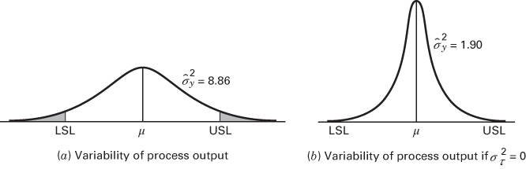

## 3.9 The Random Effects Model

## 3.9.1 A Single Random Factor

An experimenter is frequently interested in a factor that has a large number of possible levels. If the experimenter randomly selects $a$ of these levels from the population of factor levels, then we say that the factor is random. Because the levels of the factor actually used in the experiment were chosen randomly, inferences are made about the entire population of factor levels. We assume that the population of factor levels is either of infinite size or is large enough to be considered infinite. Situations in which the population of factor levels is small enough to employ a finite population approach are not encountered frequently. Refer to Bennett and Franklin (1954) and Searle and Fawcett (1970) for a discussion of the finite population case.

The linear statistical model is

$$
y _ {i j} = \mu + \tau_ {i} + \epsilon_ {i j} \left\{ \begin{array}{l} i = 1, 2, \ldots , a \\ j = 1, 2, \ldots , n \end{array} \right.\tag{3.44}
$$

where both the treatment effects $\tau_{i}$ and $\epsilon_{ij}$ are random variables. We will assume that the treatment effects $\tau_{i}$ are NID $(0,\sigma_{\tau}^{2})$ , random variables $^{3}$ and that the errors are NID $(0,\sigma^{2})$ , random variables, and that the $\tau_{i}$ and $\epsilon_{ij}$ are independent. Because $\tau_{i}$ is independent of $\epsilon_{ij}$ , the variance of any observation is

$$
V (y _ {i j}) = \sigma_ {\tau} ^ {2} + \sigma^ {2}
$$

The variances $\sigma_{\tau}^{2}$ and $\sigma^{2}$ are called variance components, and the model (Equation 3.44) is called the components of variance or random effects model. The observations in the random effects model are normally distributed because they are linear combinations of the two normally and independently distributed random variables $\tau_{i}$ and $\epsilon_{ij}$ . However, unlike the fixed effects case in which all of the observations $y_{ij}$ are independent, in the random model the observations $y_{ij}$ are only independent if they come from different factor levels. Specifically, we can show that the covariance of any two observations is

$$
\begin{array}{l l} {C o v (y _ {i j}, y _ {i j ^ {\prime}}) = \sigma_ {\tau} ^ {2}} & {j \neq j ^ {\prime}} \\ {C o v (y _ {i j}, y _ {i ^ {\prime} j ^ {\prime}}) = 0} & {i \neq i ^ {\prime}} \end{array}
$$

Note that the observations within a specific factor level all have the same covariance, because before the experiment is conducted, we expect the observations at that factor level to be similar because they all have the same random component. Once the experiment has been conducted, we can assume that all observations can be assumed to be independent, because the parameter $\tau_{i}$ has been determined and the observations in that treatment differ only because of random error.

We can express the covariance structure of the observations in the single-factor random effects model through the covariance matrix of the observations. To illustrate, suppose that we have a = 3 treatments and n = 2 replicates. There are N = 6 observations, which we can write as a vector

$$
\mathbf {y} = \left[ \begin{array}{c} y _ {1 1} \\ y _ {1 2} \\ y _ {2 1} \\ y _ {2 2} \\ y _ {3 1} \\ y _ {3 2} \end{array} \right]
$$

and the $6 \times 6$ covariance matrix of these observations is

$$
C o v (\mathbf {y}) = \left[ \begin{array}{c c c c c c} \sigma_ {\tau} ^ {2} + \sigma^ {2} & \sigma_ {\tau} ^ {2} & 0 & 0 & 0 & 0 \\ \sigma_ {\tau} ^ {2} & \sigma_ {\tau} ^ {2} + \sigma^ {2} & 0 & 0 & 0 & 0 \\ 0 & 0 & \sigma_ {\tau} ^ {2} + \sigma^ {2} & \sigma_ {\tau} ^ {2} & 0 & 0 \\ 0 & 0 & \sigma_ {\tau} ^ {2} & \sigma_ {\tau} ^ {2} + \sigma^ {2} & 0 & 0 \\ 0 & 0 & 0 & 0 & \sigma_ {\tau} ^ {2} + \sigma^ {2} & \sigma^ {2} \\ 0 & 0 & 0 & 0 & \sigma_ {\tau} ^ {2} & \sigma_ {\tau} ^ {2} + \sigma^ {2} \end{array} \right]
$$

The main diagonals of this matrix are the variances of each individual observation and every off-diagonal element is the covariance of a pair of observations.

## 3.9.2 Analysis of Variance for the Random Model

The basic ANOVA sum of squares identity

$$
S S _ {T} = S S _ {\text { Treatments }} + S S _ {E}\tag{3.45}
$$

is still valid. That is, we partition the total variability in the observations into a component that measures the variation between treatments ( $SS_{Treatments}$ ) and a component that measures the variation within treatments ( $SS_{E}$ ). Testing hypotheses about individual treatment effects is not very meaningful because they were selected randomly, we are more interested in the population of treatments, so we test hypotheses about the variance component $\sigma_{\tau}^{2}$ .

$$
\begin{array}{l} H _ {0}: \sigma_ {\tau} ^ {2} = 0 \\ H _ {1}: \sigma_ {\tau} ^ {2} > 0 \end{array}\tag{3.46}
$$

If $\sigma_{\tau}^{2} = 0$ , all treatments are identical; but if $\sigma_{\tau}^{2} = 0$ , variability exists between treatments. As before, $SS_{E} / \sigma^{2}$ is distributed as chi-square with $N - a$ degrees of freedom and, under the null hypothesis, $SS_{\text{Treatments}} / \sigma^{2}$ is distributed as chi-square with $a - 1$ degrees of freedom. Both random variables are independent. Thus, under the null hypothesis $\sigma_{\tau}^{2} = 0$ , the ratio

$$
F _ {0} = \frac {\frac {S S _ {\text { Treatments }}}{a - 1}}{\frac {S S _ {E}}{N - a}} = \frac {M S _ {\text { Treatments }}}{M S _ {E}}\tag{3.47}
$$

is distributed as $F$ with $a - 1$ and $N - a$ degrees of freedom. However, we need to examine the expected mean squares to fully describe the test procedure.

Consider

$$
\begin{array}{l} E (M S _ {\text {Treatments}}) = \frac {1}{a - 1} E (S S _ {\text {Treatments}}) = \frac {1}{a - 1} E \left[ \sum_ {i = 1} ^ {a} \frac {y _ {i .} ^ {2}}{n} - \frac {y _ {. .} ^ {2}}{N} \right] \\ = \frac {1}{a - 1} E \left[ \frac {1}{n} \sum_ {i = 1} ^ {a} \left(\sum_ {j = 1} ^ {n} \mu + \tau_ {i} + \epsilon_ {i j}\right) ^ {2} - \frac {1}{N} \left(\sum_ {i = 1} ^ {a} \sum_ {j = 1} ^ {n} \mu + \tau_ {i} + \epsilon_ {i j}\right) ^ {2} \right] \end{array}
$$

When squaring and taking expectation of the quantities in brackets, we see that terms involving $\tau_{i}^{2}$ are replaced by $\sigma_{\tau}^{2}$ as $E(\tau_{i}) = 0$ . Also, terms involving $\epsilon_{i.}^{2}, \epsilon_{..}^{2}$ , and $\sum_{i=1}^{a} \sum_{j=1}^{n} \tau_{i}^{2}$ are replaced by $n\sigma^{2}, an\sigma^{2}$ , and $an^{2}$ , respectively. Furthermore, all cross-product terms involving $\tau_{i}$ and $\epsilon_{ij}$ have zero expectation. This leads to

$$
E (M S _ {\text { Treatments }}) = \frac {1}{a - 1} [ N \mu^ {2} + N \sigma_ {\tau} ^ {2} + a \sigma^ {2} - N \mu^ {2} - n \sigma_ {\tau} ^ {2} - \sigma^ {2} ]
$$

or

$$
E (M S _ {\text { Treatments }}) = \sigma^ {2} + n \sigma_ {\tau} ^ {2}\tag{3.48}
$$

Similarly, we may show that

$$
E (M S _ {E}) = \sigma^ {2}\tag{3.49}
$$

From the expected mean squares, we see that under $H_{0}$ both the numerator and denominator of the test statistic (Equation 3.47) are unbiased estimators of $\sigma^{2}$ , whereas under $H_{1}$ the expected value of the numerator is greater than the expected value of the denominator. Therefore, we should reject $H_{0}$ for values of $F_{0}$ that are too large. This implies an upper-tail, one-tail critical region, so we reject $H_{0}$ if $F_{0} > F_{\alpha,a-1,N-a}$ .

The computational procedure and ANOVA for the random effects model are identical to those for the fixed effects case. The conclusions, however, are quite different because they apply to the entire population of treatments.

## 3.9.3 Estimating the Model Parameters

We are usually interested in estimating the variance components $(\sigma^{2}$ and $\sigma_{\tau}^{2})$ in the model. One very simple procedure that we can use to estimate $\sigma^{2}$ and $\sigma_{\tau}^{2}$ is called the analysis of variance method because it makes use of the lines in the analysis of variance table. The procedure consists of equating the expected mean squares to their observed values in the ANOVA table and solving for the variance components. In equating observed and expected mean squares in the single-factor random effects model, we obtain

$$
M S _ {\text { Treatments }} = \sigma^ {2} + n \sigma_ {\tau} ^ {2}
$$

and

$$
M S _ {E} = \sigma^ {2}
$$

Therefore, the estimators of the variance components are

$$
\hat {\sigma} ^ {2} = M S _ {E}\tag{3.50}
$$

and

$$
\hat {\sigma} _ {\tau} ^ {2} = \frac {M S _ {\text { Treatments }} - M S _ {E}}{n}\tag{3.51}
$$

For unequal sample sizes, replace $n$ in Equation 3.51 by

$$
n _ {0} = \frac {1}{a - 1} \left[ \sum_ {i = 1} ^ {a} n _ {i} - \frac {\sum_ {i = 1} ^ {a} n _ {i} ^ {2}}{\sum_ {i = 1} ^ {a} n _ {i}} \right]\tag{3.52}
$$

The analysis of variance method of variance component estimation is a method of moments procedure. It does not require the normality assumption. It does yield estimators of $\sigma^{2}$ and $\sigma_{\tau}^{2}$ that are best quadratic unbiased (i.e., of all unbiased quadratic functions of the observations, these estimators have minimum variance). There is a different method based on maximum likelihood that can be used to estimate the variance components that will be introduced later.

Occasionally, the analysis of variance method produces a negative estimate of a variance component. Clearly, variance components are by definition nonnegative, so a negative estimate of a variance component is viewed with some concern. One course of action is to accept the estimate and use it as evidence that the true value of the variance component is zero, assuming that sampling variation led to the negative estimate. This has intuitive appeal, but it suffers from some theoretical difficulties. For instance, using zero in place of the negative estimate can disturb the statistical properties of other estimates. Another alternative is to reestimate the negative variance component using a method that always yields nonnegative estimates. Still another alternative is to consider the negative estimate as evidence that the assumed linear model is incorrect and reexamine the problem. Comprehensive treatment of variance component estimation is given by Searle (1971a, 1971b), Searle, Casella, and McCullogh (1992), and Burdick and Graybill (1992).

## EXAMPLE 3.10

A textile company weaves a fabric on a large number of looms. It would like the looms to be homogeneous so that it obtains a fabric of uniform strength. The process engineer suspects that, in addition to the usual variation in strength within samples of fabric from the same loom, there may also be significant variations in strength between looms. To investigate this, she selects four looms at random and makes four strength determinations on the fabric manufactured on each loom. This experiment is run in random order, and the data obtained are shown in Table 3.18. The ANOVA is conducted and is shown in Table 3.19. From the ANOVA, we conclude that the looms in the plant differ significantly.

The variance components are estimated by $\hat{\sigma}^2 = 1.90$ and

$$
\hat {\sigma} _ {\tau} ^ {2} = \frac {2 9 . 7 3 - 1 . 9 0}{4} = 6. 9 6
$$

Therefore, the variance of any observation on strength is estimated by

$$
\hat {\sigma} _ {y} = \hat {\sigma} ^ {2} + \hat {\sigma} _ {\tau} ^ {2} = 1. 9 0 + 6. 9 6 = 8. 8 6.
$$

Most of this variability is attributable to differences between looms.

TABLE 3.18  
Strength Data for Example 3.10

<table><tr><td rowspan="2">Looms</td><td colspan="4">Observations</td><td rowspan="2"> $y_{i.}$ </td></tr><tr><td>1</td><td>2</td><td>3</td><td>4</td></tr><tr><td>1</td><td>98</td><td>97</td><td>99</td><td>96</td><td>390</td></tr><tr><td>2</td><td>91</td><td>90</td><td>93</td><td>92</td><td>366</td></tr><tr><td>3</td><td>96</td><td>95</td><td>97</td><td>95</td><td>383</td></tr><tr><td>4</td><td>95</td><td>96</td><td>99</td><td>98</td><td>388</td></tr></table>

$$
1 5 2 7 = y _ {\cdot \cdot}
$$

TABLE 3.19  
Analysis of Variance for the Strength Data

<table><tr><td>Source of Variation</td><td>Sum of Squares</td><td>Degrees of Freedom</td><td>Mean Square</td><td> $F_0$ </td><td>P-Value</td></tr><tr><td>Looms</td><td>89.19</td><td>3</td><td>29.73</td><td>15.68</td><td>&lt;0.001</td></tr><tr><td>Error</td><td>22.75</td><td>12</td><td>1.90</td><td></td><td></td></tr><tr><td>Total</td><td>111.94</td><td>15</td><td></td><td></td><td></td></tr></table>

  

■ FIGURE 3.19 Process output in the fiber strength problem  
(b) Variability of process output if $\sigma_{\tau}^{2} = 0$

This example illustrates an important use of variance components—isolating different sources of variability that affect a product or system. The problem of product variability frequently arises in quality assurance, and it is often difficult to isolate the sources of variability. For example, this study may have been motivated by an observation that there is too much variability in the strength of the fabric, as illustrated in Figure 3.19a. This graph displays the process output (fiber strength) modeled as a normal distribution with variance $\hat{\sigma}_{y}^{2}=8.86$ . (This is the estimate of the variance of any observation on strength from Example 3.10.) Upper and lower specifications on strength are also shown in Figure 3.19a, and it is relatively easy to see that a fairly large proportion of the process output is outside the specifications (the shaded tail areas in Figure 3.19a). The process engineer has asked why so much fabric is defective and must be scrapped, reworked, or downgraded to a lower quality product. The answer is that most of the product strength variability is the result of differences between looms. Different loom performance could be the result of faulty setup, poor maintenance, ineffective supervision, poorly trained operators, defective input fiber, and so forth.

The process engineer must now try to isolate the specific causes of the differences in loom performance. If she could identify and eliminate these sources of between-loom variability, the variance of the process output could be reduced considerably, perhaps to as low as $\hat{\sigma}_{y}^{2}=1.90$ , the estimate of the within-loom (error) variance component in Example 3.10. Figure 3.19b shows a normal distribution of fiber strength with $\hat{\sigma}_{y}^{2}=1.90$ . Note that the proportion of defective product in the output has been dramatically reduced. Although it is unlikely that all of the between-loom variability can be eliminated, it is clear that a significant reduction in this variance component would greatly increase the quality of the fiber produced.

We may easily find a confidence interval for the variance component $\sigma^{2}$ . If the observations are normally and independently distributed, then $(N-a)MS_{E}/\sigma^{2}$ is distributed as $\chi_{N-a}^{2}$ . Thus,

$$
P \left[ \chi_ {1 - (\alpha / 2), N - a} ^ {2} \leq \frac {(N - a) M S _ {E}}{\sigma^ {2}} \leq \chi_ {\alpha / 2, N - a} ^ {2} \right] = 1 - \alpha
$$

and a $100(1 - \alpha)$ percent confidence interval for $\sigma^2$ is

$$
\frac {(N - a) M S _ {E}}{\chi_ {\alpha / 2 , N - a} ^ {2}} \leq \sigma^ {2} \leq \frac {(N - a) M S _ {E}}{\chi_ {1 - (\alpha / 2) , N - a} ^ {2}}\tag{3.53}
$$

Since $MS_{E} = 190$ , $N = 16$ , $a = 4$ , $\chi^{2}_{0.025,12} = 23,3367$ and $\chi^{2}_{0.975,12} = 4.4038$ , the $95\%$ CI on $\sigma^2$ is $0.9770 \leq \sigma^2 \leq 5.1775$ .

Now consider the variance component $\sigma_{\tau}^{2}$ . The point estimator of $\sigma_{\tau}^{2}$ is

$$
\hat {\sigma} _ {\tau} ^ {2} = \frac {M S _ {\text { Treatments }} - M S _ {E}}{n}
$$

The random variable $(a-1)MS_{\text{Treatments}}/(\sigma^{2}+n\sigma_{\tau}^{2})$ is distributed as $\chi_{a-1}^{2}$ , and $(N-a)MS_{E}/\sigma^{2}$ is distributed as $\chi_{N-a}^{2}$ . Thus, the probability distribution of $\hat{\sigma}_{\tau}^{2}$ is a linear combination of two chi-square random variables, say

$$
u _ {1} \chi_ {a - 1} ^ {2} - u _ {2} \chi_ {N - a} ^ {2}
$$

where

$$
u _ {1} = \frac {\sigma^ {2} + n \sigma_ {\tau} ^ {2}}{n (a - 1)} \quad \mathrm{and} \quad u _ {2} = \frac {\sigma^ {2}}{n (N - a)}
$$

Unfortunately, a closed-form expression for the distribution of this linear combination of chi-square random variables cannot be obtained. Thus, an exact confidence interval for $\sigma_{\tau}^{2}$ cannot be constructed. Approximate procedures are given in Graybill (1961) and Searle (1971a). Also see Section 13.6 of Chapter 13.

It is easy to find an exact expression for a confidence interval on the ratio $\sigma_{\tau}^{2}/(\sigma_{\tau}^{2}+\sigma^{2})$ . This ratio is called the intraclass correlation coefficient, and it reflects the proportion of the variance of an observation [recall that $V(y_{ij})=\sigma_{\tau}^{2}+\sigma^{2}]$ that is the result of differences between treatments. To develop this confidence interval for the case of a balanced design, note that $MS_{Treatments}$ and $MS_{E}$ are independent random variables and, furthermore, it can be shown that

$$
\frac {M S _ {\mathrm{Treatments}} / (n \sigma_ {\tau} ^ {2} + \sigma^ {2})}{M S _ {E} / \sigma^ {2}} \sim F _ {a - 1, N - a}
$$

Thus,

$$
\mathrm{P} \left(F _ {1 - \alpha / 2, a - 1, N - a} \leq \frac {M S _ {\text {Treatments}}}{M S _ {E}} \frac {\sigma^ {2}}{n \sigma_ {\tau} ^ {2} + \sigma^ {2}} \leq F _ {\alpha / 2, a - 1, N - a}\right) = 1 - \alpha\tag{3.54}
$$

By rearranging Equation 3.54, we may obtain the following:

$$
P \left(L \leq \frac {\sigma_ {\tau} ^ {2}}{\sigma^ {2}} \leq U\right) = 1 - \alpha\tag{3.55}
$$

where

$$
L = \frac {1}{n} \left(\frac {M S _ {\text { Treatments }}}{M S _ {E}} \frac {1}{F _ {\alpha / 2 , a - 1 , N - a}} - 1\right)\tag{3.56a}
$$

and

$$
U = \frac {1}{n} \left(\frac {M S _ {\mathrm{Treatments}}}{M S _ {E}} \frac {1}{F _ {1 - \alpha / 2 , a - 1 , N - a}} - 1\right)\tag{3.56b}
$$

Note that L and U are $100(1 - \alpha)$ percent lower and upper confidence limits, respectively, for the ratio $\sigma_{\tau}^{2}/\sigma^{2}$ . Therefore, a $100(1 - \alpha)$ percent confidence interval for $\sigma_{\tau}^{2}/(\sigma_{\tau}^{2} + \sigma^{2})$ is

$$
\frac {L}{1 + L} \leq \frac {\sigma_ {\tau} ^ {2}}{\sigma_ {\tau} ^ {2} + \sigma^ {2}} \leq \frac {U}{1 + U}\tag{3.57}
$$

To illustrate this procedure, we find a 95 percent confidence interval on $\sigma_{\tau}^{2}/(\sigma_{\tau}^{2}+\sigma^{2})$ for the strength data in Example 3.10. Recall that $MS_{\text{Treatments}} = 29.73, MS_{E} = 1.90, a = 4, n = 4, F_{0.025,3,12} = 4.47$ , and $F_{0.975,3,12} = 1/F_{0.025,12,3} = 1/14.34 = 0.070$ . Therefore, from Equation 3.56a and b,

$$
L = \frac {1}{4} \left[ \left(\frac {2 9 . 7 3}{1 . 9 0}\right) \left(\frac {1}{4 . 4 7}\right) - 1 \right] = 0. 6 2 5
$$

$$
U = \frac {1}{4} \left[ \left(\frac {2 9 . 7 3}{1 . 9 0}\right) \left(\frac {1}{0 . 0 7 0}\right) - 1 \right] = 5 5. 6 3 3
$$

and from Equation 3.57, the 95 percent confidence interval on $\sigma_{\tau}^{2}/(\sigma_{\tau}^{2}+\sigma^{2})$ is

$$
\frac {0 . 6 2 5}{1 . 6 2 5} \leq \frac {\sigma^ {2}}{\sigma_ {\tau} ^ {2} + \sigma^ {2}} \leq \frac {5 5 . 6 3 3}{5 6 . 6 3 3}
$$

or

$$
0. 3 8 \leq \frac {\sigma^ {2}}{\sigma_ {\tau} ^ {2} + \sigma^ {2}} \leq 0. 9 8
$$

We conclude that variability between looms accounts for between 38 and 98 percent of the variability in the observed strength of the fabric produced. This confidence interval is relatively wide because of the small number of looms used in the experiment. Clearly, however, the variability between looms ( $\sigma_{\tau}^{2}$ ) is not negligible.

Estimation of the Overall Mean $\mu$ . In many random effects experiments, the experimenter is interested in estimating the overall mean $\mu$ . From the basic model assumptions, it is easy to see that the expected value of any observation is just the overall mean. Consequently, an unbiased estimator of the overall mean is

$$
\hat {\mu} = \overline {{y}} _ {..}
$$

So for Example 3.10 the estimate of the overall mean strength is

$$
\hat {\mu} = \overline {{{y}}} _ {\cdot \cdot} = \frac {y _ {\cdot \cdot}}{N} = \frac {1 5 2 7}{1 6} = 9 5. 4 4
$$

It is also possible to find a $100(1-\alpha)\%$ confidence interval on the overall mean. The variance of $\bar{y}$ is

$$
V (\overline {{{y}}} _ {\cdot \cdot}) = V \left(\frac {\sum_ {i = 1} ^ {a} \sum_ {j = 1} ^ {n} y _ {i j}}{a n}\right) = \frac {n \sigma_ {\tau} ^ {2} + \sigma^ {2}}{a n}
$$

The numerator of this ratio is estimated by the treatment mean square, so an unbiased estimator of $V(\overline{y})$ is

$$
\hat {V} (\overline {{y}} _ {\cdot \cdot}) = \frac {M S _ {\text { Treatments }}}{a n}
$$

Therefore, the $100(1 - \alpha)\%$ CI on the overall mean is

$$
\overline {{{\mathrm{y}}}} _ {\cdot \cdot} - t _ {\alpha / 2, a (n - 1)} \sqrt {\frac {M S _ {\text { Treatments }}}{a n}} \leq \mu \leq \overline {{{\mathrm{y}}}} _ {\cdot \cdot} + t _ {\alpha / 2, a (n - 1)} \sqrt {\frac {M S _ {\text { Treatments }}}{a n}}\tag{3.58}
$$

To find a 95% CI on the overall mean in the fabric strength experiment from Example 3.10, we need $MS_{Treatments} = 29.73$ and $t_{0.025,12} = 2.18$ . The CI is computed from Equation 3.58 as follows:

$$
\overline {{{{\mathrm{y}}}}} _ {\cdot \cdot} - t _ {\alpha / 2, a (n - 1)} \sqrt {\frac {M S _ {\text { Treatments }}}{a n}} \leq \mu \leq \overline {{{{\mathrm{y}}}}} _ {\cdot \cdot} + t _ {\alpha / 2, a (n - 1)} \sqrt {\frac {M S _ {\text { Treatments }}}{a n}}
$$

$$
9 5. 4 4 - 2. 1 8 \sqrt {\frac {2 9 . 7 3}{1 6}} \leq \mu \leq 9 5. 4 4 + 2. 1 8 \sqrt {\frac {2 9 . 7 3}{1 6}}
$$

$$
9 2. 4 7 \leq \mu \leq 9 8. 4 1
$$

So, at 95 percent confidence the mean strength of the fabric produced by the looms in this facility is between 92.47 and 98.41. This is a relatively wide confidence interval because a small number of looms were sampled and there is a large difference between looms as reflected by the large portion of total variability that is accounted for by the differences between looms.

Maximum Likelihood Estimation of the Variance Components. Earlier in this section we presented the analysis of variance method of variance component estimation. This method is relatively straightforward to apply and makes use of familiar quantities—the mean squares in the analysis of variance table. However, the method has some disadvantages. As we pointed out previously, it is a method of moments estimator, a technique that mathematical statisticians generally do not prefer to use for parameter estimation because it often results in parameter estimates that do not have good statistical properties. One obvious problem is that it does not always lead to an easy way to construct confidence intervals on the variance components of interest. For example, in the single-factor random model, there is not a simple way to construct confidence intervals on $\sigma_{\tau}^{2}$ , which is certainly a parameter of primary interest to the experimenter. The preferred parameter estimation technique is called the method of maximum likelihood. The implementation of this method can be somewhat involved, particularly for an experimental design model, but it has been incorporated in some modern computer software packages that support designed experiments, including JMP.

A complete presentation of the method of maximum likelihood is beyond the scope of this book, but the general idea can be illustrated very easily. Suppose that x is a random variable with probability distribution $f(x,\theta)$ , where $\theta$ is an unknown parameter. Let $x_{1}, x_{2}, \ldots, x_{n}$ be a random sample of n observations. The joint probability distribution of the sample is $\prod_{i=1}^{n} f(x_{i}, \theta)$ . The likelihood function is just this joint probability distribution with the sample observations consider fixed and the parameter $\theta$ unknown. Note that the likelihood function, say

$$
L (x _ {1}, x _ {2}, \dots , x _ {n}; \theta) = \prod_ {i = 1} ^ {n} f (x _ {i}, \theta)
$$

is now a function of only the unknown parameter $\theta$ . The maximum likelihood estimator of $\theta$ is the value of $\theta$ that maximizes the likelihood function $L(x_{1}, x_{2}, \ldots, x_{n}; \theta)$ . To illustrate how this applies to an experimental design model with random effects, let y be the $an \times 1$ vector of observations for a single-factor random effects model with a treatments and n replicates and let $\sum$ be the $an \times an$ covariance matrix of the observations. Refer to Section 3.9.1 where we developed this covariance matrix for the special case where a = 3 and n = 2. The likelihood function is

$$
L \left(x _ {1 1}, x _ {1 2}, \dots , x _ {a, n}; \mu , \sigma_ {\tau} ^ {2}, \sigma^ {2}\right) = \frac {1}{(2 \pi) ^ {N / 2} [ \sum ] ^ {1 / 2}} \exp \left[ - \frac {1}{2} (\mathbf {y} - \mathbf {j} _ {N} \mu) ^ {\prime} \sum^ {- 1} (\mathbf {y} - \mathbf {j} _ {N} \mu) \right]
$$

where N = an is the total number of observations, $j_{N}$ is an $N \times 1$ vector of 1s, and $\mu$ is the overall mean in the model. The maximum likelihood estimates of the parameters $\mu$ , $\sigma_{\tau}^{2}$ , and $\sigma^{2}$ are the values of these quantities that maximize the likelihood function.

Maximum likelihood estimators (MLEs) have some very useful properties. For large samples, they are unbiased, and they have a normal distribution. Furthermore, the inverse of the matrix of second derivatives of the likelihood function (multiplied by -1) is the covariance matrix of the MLEs. This makes it relatively easy to obtain approximate confidence intervals on the MLEs.

The standard variant of maximum likelihood estimation that is used for estimating variance components is known as the residual maximum likelihood (REML) method. It is popular because it produces unbiased estimators and like all MLEs, it is easy to find CIs. The basic characteristic of REML is that it takes the location parameters in the model into account when estimating the random effects. As a simple example, suppose that we want to estimate the mean and variance of a normal distribution using the method of maximum likelihood. It is easy to show that the MLEs are

$$
\hat {\mu} = \frac {\sum_ {i = 1} ^ {n} y _ {i}}{n} = \overline {{y}}
$$

$$
\hat {\sigma} ^ {2} = \frac {\sum_ {i = 1} ^ {n} (y _ {i} - \overline {{{y}}}) ^ {2}}{n}
$$

Notice that the MLE $\hat{\sigma}^{2}$ is not the familiar sample standard deviation. It does not take the estimation of the location parameter $\mu$ into account. The REML estimator would be

$$
S ^ {2} = \frac {\sum_ {i = 1} ^ {n} (y _ {i} - \overline {{{{y}}}}) ^ {2}}{n - 1}
$$

The REML estimator is unbiased.

■ TABLE 3.20
JMP Output for the Loom Experiment in Example 3.10

<table><tr><td colspan="7">Response Y</td></tr><tr><td colspan="7">Summary of Fit</td></tr><tr><td>RSquare</td><td></td><td>0.793521</td><td></td><td></td><td></td><td></td></tr><tr><td>RSquare Adj</td><td></td><td>0.793521</td><td></td><td></td><td></td><td></td></tr><tr><td>Root Mean Square Error</td><td></td><td>1.376893</td><td></td><td></td><td></td><td></td></tr><tr><td>Mean of Response</td><td></td><td>95.4375</td><td></td><td></td><td></td><td></td></tr><tr><td>Observations (or Sum Wgts)</td><td></td><td>16</td><td></td><td></td><td></td><td></td></tr><tr><td colspan="7">Parameter Estimates</td></tr><tr><td>Term</td><td>Estimate</td><td>Std Error</td><td>DFDen</td><td>t Ratio</td><td colspan="2">Prob &gt; |t|</td></tr><tr><td>Intercept</td><td>95.4375</td><td>1.363111</td><td>3</td><td>70.01</td><td colspan="2">&lt; .0001*</td></tr><tr><td colspan="7">REML Variance Component Estimates</td></tr><tr><td>Random Effect</td><td>Var Ratio</td><td>Var Component</td><td>Std Error</td><td>95% Lower</td><td>95% Upper</td><td>Pct of Total</td></tr><tr><td>X1</td><td>3.6703297</td><td>6.9583333</td><td>6.0715247</td><td>-4.941636</td><td>18.858303</td><td>78.588</td></tr><tr><td>Residual</td><td></td><td>1.8958333</td><td>0.7739707</td><td>0.9748608</td><td>5.1660065</td><td>21.412</td></tr><tr><td>Total</td><td></td><td>8.8541667</td><td></td><td></td><td></td><td>100.000</td></tr><tr><td colspan="7">Covariance Matrix of Variance Component Estimates</td></tr><tr><td>Random Effect</td><td></td><td>X1</td><td>Residual</td><td></td><td></td><td></td></tr><tr><td>X1</td><td></td><td>36.863412</td><td>-0.149758</td><td></td><td></td><td></td></tr><tr><td>Residual</td><td></td><td>-0.149758</td><td>0.5990307</td><td></td><td></td><td></td></tr></table>

To illustrate the REML method, Table 3.20 presents the JMP output for the loom experiment in Example 3.10. The REML estimates of the model parameters $\mu$ , $\sigma_{\tau}^{2}$ , and $\sigma^{2}$ are shown in the output. Note that the REML estimates of the variance components are identical to those found earlier by the ANOVA method. These two methods will agree for balanced designs. However, the REML output also contains the covariance matrix of the variance components. The square roots of the main diagonal elements of this matrix are the standard errors of the variance components. If $\hat{\theta}$ is the MLE of $\theta$ and $\hat{\sigma}(\hat{\theta})$ is its estimated standard error, then the approximate $100(1 - \alpha)$ percent confidence interval on $\theta$ is

$$
\hat {\theta} - Z _ {\alpha / 2} \hat {\sigma} (\hat {\theta}) \leq \theta \leq \hat {\theta} + Z _ {\alpha / 2} \hat {\sigma} (\hat {\theta})
$$

JMP uses this approach to find the approximate CIs of $\sigma_{\tau}^{2}$ and $\sigma^{2}$ shown in the output. The 95 percent CI from REML for $\sigma^{2}$ is very similar to the chi-square-based interval computed earlier in Section 3.9.
