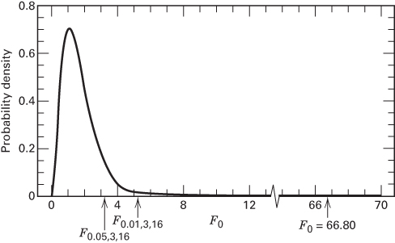

# 3.3 固定效应模型的分析

本节我们建立固定效应模型的单因子方差分析。回忆一下，$y_{i.}$ 表示第 $i$ 个处理下观测值的合计，$\overline{y}_{i.}$ 表示第 $i$ 个处理下观测值的平均。类似地，令 $y_{..}$ 表示全部观测值的总和，$\overline{y}_{..}$ 表示全部观测值的总平均。用符号表示为

$$
y_{i.} = \sum_{j=1}^{n} y_{ij} \qquad \overline{y}_{i.} = y_{i.}/n \qquad i = 1, 2, \ldots, a \tag{3.3}
$$

$$
y_{..} = \sum_{i=1}^{a}\sum_{j=1}^{n} y_{ij} \qquad \overline{y}_{..} = y_{..}/N
$$

其中 $N = an$ 是观测值总数。我们看到，“点”下标记法表示对它替换掉的那个下标求和。

我们感兴趣的是检验 $a$ 个处理均值是否相等，即 $E(y_{ij}) = \mu+\tau_{i} = \mu_{i}$，$i = 1, 2, \ldots, a$。适当的假设是

$$
\begin{array}{l}
H_{0}: \mu_{1} = \mu_{2} = \cdots = \mu_{a} \\
H_{1}: \mu_{i} \neq \mu_{j} \quad \text{至少有一对 } (i, j)
\end{array} \tag{3.4}
$$

在效应模型中，我们把第 $i$ 个处理的均值 $\mu_{i}$ 分解为两个分量，使 $\mu_{i} = \mu+\tau_{i}$。我们通常把 $\mu$ 看作总均值，于是

$$
\frac{\sum_{i=1}^{a} \mu_{i}}{a} = \mu
$$

这一含义表明

$$
\sum_{i=1}^{a} \tau_{i} = 0
$$

也就是说，处理效应或因子效应可以看作对总均值的偏离。[^1] 因此，上述假设还有一种等价的写法，即用处理效应 $\tau_{i}$ 来表达：

$$
\begin{array}{l}
H_{0}: \tau_{1} = \tau_{2} = \cdots = \tau_{a} = 0 \\
H_{1}: \tau_{i} \neq 0 \quad \text{至少有一个 } i
\end{array}
$$

于是我们说，这是检验处理均值是否相等，或者检验处理效应（$\tau_{i}$）是否为零。检验 $a$ 个处理均值是否相等的适当程序就是方差分析。

## 3.3.1 总平方和的分解

**方差分析**这个名称来源于把总变异分解成其各个组成部分。**总校正平方和**

$$
SS_{T} = \sum_{i=1}^{a}\sum_{j=1}^{n} (y_{ij}-\overline{y}_{..})^{2}
$$

用来作为数据总变异的度量。直观上这是合理的，因为如果把 $SS_{T}$ 除以适当的自由度个数（这里为 $an-1 = N-1$），就得到 $y$ 的样本方差。而样本方差当然是变异的标准度量。

注意，总校正平方和 $SS_{T}$ 可以写成

$$
\sum_{i=1}^{a}\sum_{j=1}^{n} (y_{ij}-\overline{y}_{..})^{2} = \sum_{i=1}^{a}\sum_{j=1}^{n} [(\overline{y}_{i.}-\overline{y}_{..})+(y_{ij}-\overline{y}_{i.})]^{2} \tag{3.5}
$$

或

$$
\begin{aligned}
\sum_{i=1}^{a}\sum_{j=1}^{n} (y_{ij}-\overline{y}_{..})^{2} ={}& n\sum_{i=1}^{a} (\overline{y}_{i.}-\overline{y}_{..})^{2}+\sum_{i=1}^{a}\sum_{j=1}^{n} (y_{ij}-\overline{y}_{i.})^{2} \\
&+2\sum_{i=1}^{a}\sum_{j=1}^{n} (\overline{y}_{i.}-\overline{y}_{..})(y_{ij}-\overline{y}_{i.})
\end{aligned}
$$

然而，上式中的交叉乘积项为零，因为

$$
\sum_{j=1}^{n} (y_{ij}-\overline{y}_{i.}) = y_{i.}-n\overline{y}_{i.} = y_{i.}-n(y_{i.}/n) = 0
$$

因此有

$$
\sum_{i=1}^{a}\sum_{j=1}^{n} (y_{ij}-\bar{y}_{..})^{2} = n\sum_{i=1}^{a} (\bar{y}_{i.}-\bar{y}_{..})^{2}+\sum_{i=1}^{a}\sum_{j=1}^{n} (y_{ij}-\bar{y}_{i.})^{2} \tag{3.6}
$$

式 3.6 就是**方差分析的基本恒等式**。它说明：用总校正平方和度量的数据总变异，可以分解为各处理平均与总平均之差的平方和，加上各处理内观测值与该处理平均之差的平方和。现在，观测到的处理平均与总平均之差是处理均值之间差异的度量；而处理内观测值与该处理平均之差则只能由随机误差引起。因此，我们可以把式 3.6 符号化地写成

$$
SS_{T} = SS_{\text{处理}} + SS_{E}
$$

其中 $SS_{\text{处理}}$ 称为**处理平方和**（即处理之间的平方和），$SS_{E}$ 称为**误差平方和**（即处理内部的平方和）。总共有 $an = N$ 个观测值，因此 $SS_{T}$ 有 $N-1$ 个自由度。因子有 $a$ 个水平（以及 $a$ 个处理均值），因此 $SS_{\text{处理}}$ 有 $a-1$ 个自由度。最后，任一处理内有 $n$ 次重复，提供 $n-1$ 个自由度用以估计试验误差；由于有 $a$ 个处理，我们有 $a(n-1) = an-a = N-a$ 个误差自由度。

显式地考察基本恒等式右端的这两项是有启发性的。考虑误差平方和

$$
SS_{E} = \sum_{i=1}^{a}\sum_{j=1}^{n} (y_{ij}-\overline{y}_{i.})^{2} = \sum_{i=1}^{a}\left[\sum_{j=1}^{n} (y_{ij}-\overline{y}_{i.})^{2}\right]
$$

在这种形式下容易看出，方括号内的项若除以 $n-1$，就是第 $i$ 个处理内的样本方差，即

$$
S_{i}^{2} = \frac{\sum_{j=1}^{n} (y_{ij}-\overline{y}_{i.})^{2}}{n-1} \qquad i = 1, 2, \ldots, a
$$

现在可以把 $a$ 个样本方差合并起来，给出公共总体方差的一个单一估计：

$$
\begin{aligned}
\frac{(n-1)S_{1}^{2}+(n-1)S_{2}^{2}+\cdots+(n-1)S_{a}^{2}}{(n-1)+(n-1)+\cdots+(n-1)}
&= \frac{\sum_{i=1}^{a}\left[\sum_{j=1}^{n} (y_{ij}-\overline{y}_{i.})^{2}\right]}{\sum_{i=1}^{a}(n-1)} \\
&= \frac{SS_{E}}{(N-a)}
\end{aligned}
$$

因此，$SS_{E}/(N-a)$ 是 $a$ 个处理各自内部公共方差的**合并估计**。

类似地，如果 $a$ 个处理均值之间没有差异，我们就可以用处理平均对总平均的变异来估计 $\sigma^{2}$。具体地说，

$$
\frac{SS_{\text{处理}}}{a-1} = \frac{n\sum_{i=1}^{a} (\overline{y}_{i.}-\overline{y}_{..})^{2}}{a-1}
$$

当处理均值相等时是 $\sigma^{2}$ 的一个估计。其理由可以这样直观地理解：量 $\sum_{i=1}^{a} (\overline{y}_{i.}-\overline{y}_{..})^{2}/(a-1)$ 估计的是 $\sigma^{2}/n$，即处理平均的方差，因此若处理均值没有差异，$n\sum_{i=1}^{a} (\overline{y}_{i.}-\overline{y}_{..})^{2}/(a-1)$ 必定估计 $\sigma^{2}$。

我们看到，方差分析恒等式（式 3.6）为我们提供了 $\sigma^{2}$ 的两个估计：一个基于处理内部的固有变异，另一个基于处理之间的变异。如果处理均值没有差异，这两个估计应当非常接近；如果它们不接近，我们就怀疑所观察到的差异必定是由处理均值之间的差异造成的。尽管我们是用直观论证得出这一结果的，但也可以采用稍为形式化的做法。

量

$$
MS_{\text{处理}} = \frac{SS_{\text{处理}}}{a-1}
$$

和

$$
MS_{E} = \frac{SS_{E}}{N-a}
$$

称为**均方**（mean square）。现在考察这些均方的期望值。考虑

$$
\begin{aligned}
E(MS_{E}) &= E\left(\frac{SS_{E}}{N-a}\right) = \frac{1}{N-a} E\left[\sum_{i=1}^{a}\sum_{j=1}^{n} (y_{ij}-\overline{y}_{i.})^{2}\right] \\
&= \frac{1}{N-a} E\left[\sum_{i=1}^{a}\sum_{j=1}^{n} (y_{ij}^{2}-2y_{ij}\overline{y}_{i.}+\overline{y}_{i.}^{2})\right] \\
&= \frac{1}{N-a} E\left[\sum_{i=1}^{a}\sum_{j=1}^{n} y_{ij}^{2}-2n\sum_{i=1}^{a}\overline{y}_{i.}^{2}+n\sum_{i=1}^{a}\overline{y}_{i.}^{2}\right] \\
&= \frac{1}{N-a} E\left[\sum_{i=1}^{a}\sum_{j=1}^{n} y_{ij}^{2}-\frac{1}{n}\sum_{i=1}^{a}\overline{y}_{i.}^{2}\right]
\end{aligned}
$$

把模型（式 3.1）代入这一方程，得到

$$
E(MS_{E}) = \frac{1}{N-a} E\left[\sum_{i=1}^{a}\sum_{j=1}^{n} (\mu+\tau_{i}+\epsilon_{ij})^{2}-\frac{1}{n}\sum_{i=1}^{a}\left(\sum_{j=1}^{n} \mu+\tau_{i}+\epsilon_{ij}\right)^{2}\right]
$$

现在对括号内的量作平方并取期望时，我们看到涉及 $\epsilon_{ij}^{2}$ 和 $\epsilon_{i.}^{2}$ 的项分别被 $\sigma^{2}$ 和 $n\sigma^{2}$ 取代，因为 $E(\epsilon_{ij})=0$；此外，所有涉及 $\epsilon_{ij}$ 的交叉乘积的期望都为零。因此，作平方并取期望之后，上式变为

$$
E(MS_{E}) = \frac{1}{N-a}\left[N\mu^{2}+n\sum_{i=1}^{a}\tau_{i}^{2}+N\sigma^{2}-N\mu^{2}-n\sum_{i=1}^{a}\tau_{i}^{2}-a\sigma^{2}\right]
$$

即

$$
E(MS_{E}) = \sigma^{2}
$$

用类似的方法还可以证明[^2]

$$
E(MS_{\text{处理}}) = \sigma^{2}+\frac{n\sum_{i=1}^{a}\tau_{i}^{2}}{a-1}
$$

因此，正如我们作启发式论证时所说，$MS_{E} = SS_{E}/(N-a)$ 估计 $\sigma^{2}$；并且如果处理均值没有差异（这意味着 $\tau_{i}=0$），$MS_{\text{处理}} = SS_{\text{处理}}/(a-1)$ 也估计 $\sigma^{2}$。然而要注意，如果处理均值确有差异，处理均方的期望值就大于 $\sigma^{2}$。

由此看来很清楚：通过比较 $MS_{\text{处理}}$ 与 $MS_{E}$，就可以对处理均值无差异这一假设进行检验。下面我们考虑如何进行这一比较。

## 3.3.2 统计分析

现在我们研究如何对处理均值无差异这一假设（$H_{0}:\mu_{1}=\mu_{2}=\cdots=\mu_{a}$，或等价地 $H_{0}:\tau_{1}=\tau_{2}=\cdots=\tau_{a}=0$）进行形式化检验。由于我们假定误差 $\epsilon_{ij}$ 是均值为零、方差为 $\sigma^{2}$ 的正态独立随机变量，所以观测值 $y_{ij}$ 是均值为 $\mu+\tau_{i}$、方差为 $\sigma^{2}$ 的正态独立随机变量。因此 $SS_{T}$ 是正态随机变量的平方和；从而可以证明 $SS_{T}/\sigma^{2}$ 服从自由度为 $N-1$ 的卡方分布。此外我们还可以证明，$SS_{E}/\sigma^{2}$ 服从自由度为 $N-a$ 的卡方分布；并且若原假设 $H_{0}:\tau_{i}=0$ 为真，$SS_{\text{处理}}/\sigma^{2}$ 服从自由度为 $a-1$ 的卡方分布。然而，这三个平方和不一定是相互独立的，因为 $SS_{\text{处理}}$ 与 $SS_{E}$ 之和为 $SS_{T}$。下面这个定理（它是归功于 William G. Cochran 的一个定理的特殊形式）有助于确立 $SS_{E}$ 与 $SS_{\text{处理}}$ 的独立性。

## 定理 3-1 Cochran 定理

设 $Z_{i}$ 服从 NID(0, 1)，$i = 1, 2, \ldots, v$，且

$$
\sum_{i=1}^{v} Z_{i}^{2} = Q_{1}+Q_{2}+\cdots+Q_{s}
$$

其中 $s \leq v$，$Q_{i}$ 有 $v_{i}$ 个自由度（$i = 1, 2, \ldots, s$）。那么 $Q_{1}, Q_{2}, \ldots, Q_{s}$ 是相互独立的卡方随机变量，自由度分别为 $v_{1}, v_{2}, \ldots, v_{s}$，当且仅当

$$
v = v_{1}+v_{2}+\cdots+v_{s}
$$

由于 $SS_{\text{处理}}$ 与 $SS_{E}$ 的自由度之和为 $N-1$，即总自由度，Cochran 定理意味着 $SS_{\text{处理}}/\sigma^{2}$ 与 $SS_{E}/\sigma^{2}$ 是相互独立的卡方随机变量。因此，若处理均值无差异这一原假设为真，则比值

$$
F_{0} = \frac{SS_{\text{处理}}/(a-1)}{SS_{E}/(N-a)} = \frac{MS_{\text{处理}}}{MS_{E}} \tag{3.7}
$$

服从分子自由度为 $a-1$、分母自由度为 $N-a$ 的 $F$ 分布。式 3.7 就是处理均值无差异这一假设的检验统计量。

由期望均方可见，一般地 $MS_{E}$ 是 $\sigma^{2}$ 的无偏估计量；而在原假设下，$MS_{\text{处理}}$ 也是 $\sigma^{2}$ 的无偏估计量。然而若原假设不成立，$MS_{\text{处理}}$ 的期望值就大于 $\sigma^{2}$。因此，在备择假设下，检验统计量（式 3.7）分子的期望值大于分母的期望值，我们应当在检验统计量取值过大时拒绝 $H_{0}$。这意味着使用上尾的单侧临界域。因此，若

$$
F_{0} > F_{\alpha, a-1, N-a}
$$

我们就应当拒绝 $H_{0}$，并得出结论：处理均值之间存在差异，其中 $F_{0}$ 按式 3.7 计算。作为替代，我们也可以采用 $P$ 值方法作决策。附录中 $F$ 分布的百分位表（表 IV）可用来求 $P$ 值的界限。

平方和可以用几种方法计算。一种直接的做法是利用定义

$$
y_{ij}-\bar{y}_{..} = (\bar{y}_{i.}-\bar{y}_{..})+(y_{ij}-\bar{y}_{i.})
$$

用电子表格为每个观测值计算这三项，然后把平方求和，得到 $SS_{T}$、$SS_{\text{处理}}$ 和 $SS_{E}$。另一种做法是把式 3.6 中 $SS_{\text{处理}}$ 和 $SS_{T}$ 的定义改写并化简，得到

$$
SS_{T} = \sum_{i=1}^{a}\sum_{j=1}^{n} y_{ij}^{2}-\frac{y_{..}^{2}}{N} \tag{3.8}
$$

$$
SS_{\text{处理}} = \frac{1}{n}\sum_{i=1}^{a} y_{i.}^{2}-\frac{y_{..}^{2}}{N} \tag{3.9}
$$

以及

$$
SS_{E} = SS_{T}-SS_{\text{处理}} \tag{3.10}
$$

这种做法很好，因为有些计算器可以把输入数字之和累加在一个寄存器中、把其平方和累加在另一个寄存器中，这样每个数字只需输入一次。在实践中，我们使用计算机软件来完成这些工作。

检验程序概括在表 3.3 中，这称为**方差分析表**（analysis of variance table，ANOVA 表）。

**表 3.3 单因子固定效应模型的方差分析表**

| 变异来源 | 平方和 | 自由度 | 均方 | $F_{0}$ |
| --- | --- | --- | --- | --- |
| 处理之间 | $SS_{\text{处理}} = n\sum_{i=1}^{a}(\overline{y}_{i.}-\overline{y}_{..})^{2}$ | $a-1$ | $MS_{\text{处理}}$ | $F_{0} = \dfrac{MS_{\text{处理}}}{MS_{E}}$ |
| 误差（处理内部） | $SS_{E} = SS_{T}-SS_{\text{处理}}$ | $N-a$ | $MS_{E}$ | |
| 总计 | $SS_{T} = \sum_{i=1}^{a}\sum_{j=1}^{n}(y_{ij}-\overline{y}_{..})^{2}$ | $N-1$ | | |

## 例 3.1 等离子体刻蚀试验

为说明方差分析，我们回到 3.1 节讨论的第一个例子。回忆一下，这位工程师有兴趣确定 RF 功率设置是否影响刻蚀速率，她已用四个 RF 功率水平和五次重复进行了一次完全随机化试验。为方便起见，这里重复表 3.1 中的数据：

通常这些计算会在计算机上用能够分析设计试验数据的软件包来完成。

| RF 功率 (W) | 观测刻蚀速率 (Å/min) 1 | 2 | 3 | 4 | 5 | 合计 $y_{i.}$ | 平均 $\overline{y}_{i.}$ |
| --- | --- | --- | --- | --- | --- | --- | --- |
| 160 | 575 | 542 | 530 | 539 | 570 | 2756 | 551.2 |
| 180 | 565 | 593 | 590 | 579 | 610 | 2937 | 587.4 |
| 200 | 600 | 651 | 610 | 637 | 629 | 3127 | 625.4 |
| 220 | 725 | 700 | 715 | 685 | 710 | 3535 | 707.0 |
| | | | | | | $y_{..} = 12{,}355$ | $\overline{y}_{..} = 617.75$ |

我们将用方差分析检验 $H_{0}:\mu_{1}=\mu_{2}=\mu_{3}=\mu_{4}$，备择假设 $H_{1}$ 是某些均值不同。按式 3.8、式 3.9 和式 3.10 计算所需的平方和如下：

$$
\begin{aligned}
SS_{T} &= \sum_{i=1}^{4}\sum_{j=1}^{5} y_{ij}^{2}-\frac{y_{..}^{2}}{N} \\
&= (575)^{2}+(542)^{2}+\cdots+(710)^{2}-\frac{(12{,}355)^{2}}{20} \\
&= 72{,}209.75
\end{aligned}
$$

$$
\begin{aligned}
SS_{\text{处理}} &= \frac{1}{n}\sum_{i=1}^{4} y_{i.}^{2}-\frac{y_{..}^{2}}{N} \\
&= \frac{1}{5}[(2756)^{2}+\cdots+(3535)^{2}]-\frac{(12{,}355)^{2}}{20} \\
&= 66{,}870.55
\end{aligned}
$$

$$
\begin{aligned}
SS_{E} &= SS_{T}-SS_{\text{处理}} \\
&= 72{,}209.75-66{,}870.55 = 5339.20
\end{aligned}
$$

方差分析概括在表 3.4 中。注意 RF 功率（即处理之间）的均方（22 290.18）比处理内部（即误差）的均方（333.70）大许多倍。这表明处理均值相等的可能性不大。更形式化地说，我们可以计算 $F$ 比值 $F_{0}=22{,}290.18/333.70=66.80$，并把它与 $F_{3,16}$ 分布的适当上尾分位点相比较。若采用固定显著性水平方法，假设试验者选定了 $\alpha=0.05$。由附录表 IV 查得 $F_{0.05,3,16}=3.24$。因为 $F_{0}=66.80>3.24$，我们拒绝 $H_{0}$，并得出结论：处理均值不同，也就是说，RF 功率设置显著影响平均刻蚀速率。我们也可以为该检验统计量计算 $P$ 值。图 3.3 给出了检验统计量 $F_{0}$ 的参考分布（$F_{3,16}$）。显然此情形下 $P$ 值非常小。由附录表 IV 查得 $F_{0.01,3,16}=5.29$，而 $F_{0}>5.29$，因此可以断定 $P$ 值的上界为 0.01，即 $P<0.01$（精确的 $P$ 值为 $P=2.88\times10^{-9}$）。

**表 3.4 等离子体刻蚀试验的方差分析**

| 变异来源 | 平方和 | 自由度 | 均方 | $F_{0}$ | $P$ 值 |
| --- | --- | --- | --- | --- | --- |
| RF 功率 | 66,870.55 | 3 | 22,290.18 | $F_{0} = 66.80$ | < 0.01 |
| 误差 | 5339.20 | 16 | 333.70 | | |
| 总计 | 72,209.75 | 19 | | | |

**图 3.3 例 3.1 中检验统计量 $F_{0}$ 的参考分布（$F_{3,16}$）**

**数据的编码。** 一般地，我们不必太担心计算问题，因为有许多容易获得的计算机程序可以完成这些计算。这些计算机程序还有助于进行与试验设计相关的许多其他分析（例如残差分析和模型适合性检验）。在许多情况下，这些程序还会帮助试验者建立设计。

然而，当必须手算时，对观测值作**编码**（coding）有时会有帮助。例 3.2 说明了这一点。

## 例 3.2 对观测值编码

对观测值编码往往能使方差分析的计算更容易或更精确。例如，考虑例 3.1 中的等离子体刻蚀数据。假设我们从每个观测值中减去 600。编码后的数据见表 3.5。容易验证

$$
\begin{aligned}
SS_{T} &= (-25)^{2}+(-58)^{2}+\cdots+(110)^{2}-\frac{(355)^{2}}{20} \\
&= 72{,}209.75
\end{aligned}
$$

$$
\begin{aligned}
SS_{\text{处理}} &= \frac{(-244)^{2}+(-63)^{2}+(127)^{2}+(535)^{2}}{5}-\frac{(355)^{2}}{20} \\
&= 66{,}870.55
\end{aligned}
$$

以及

$$
SS_{E} = 5339.20
$$

把这些平方和与例 3.1 中得到的结果相比较，可见从原始数据中减去一个常数并不改变平方和。

现在假设我们把例 3.1 中每个观测值都乘以 2。容易验证，变换后数据的平方和为 $SS_{T}=288{,}839.00$、$SS_{\text{处理}}=267{,}482.20$、$SS_{E}=21{,}356.80$。这些平方和与例 3.1 得到的结果似乎相差很大。然而，若把它们除以 4（即 $2^{2}$），结果就完全相同。例如处理平方和 $267{,}482.20/4=66{,}870.55$。对编码数据，$F$ 比值为 $F=(267{,}482.20/3)/(21{,}356.80/16)=66.80$，与原始数据的 $F$ 比值完全相同。因此这两个方差分析是等价的。

**表 3.5 例 3.2 编码后的刻蚀速率数据**

| RF 功率 (W) | 观测值 1 | 2 | 3 | 4 | 5 | 合计 $y_{i.}$ |
| --- | --- | --- | --- | --- | --- | --- |
| 160 | -25 | -58 | -70 | -61 | -30 | -244 |
| 180 | -35 | -7 | -10 | -21 | 10 | -63 |
| 200 | 0 | 51 | 10 | 37 | 29 | 127 |
| 220 | 125 | 100 | 115 | 85 | 110 | 535 |

**随机化检验与方差分析。** 在建立方差分析 $F$ 检验的过程中，我们使用了随机误差 $\epsilon_{ij}$ 是正态独立随机变量这一假定。$F$ 检验也可以作为随机化检验的一种近似来论证。为说明这一点，假设我们在两个处理的每一个下都有五个观测值，希望检验处理均值是否相等。数据如下：

| 处理 1 | 处理 2 |
| --- | --- |
| $y_{11}$ | $y_{21}$ |
| $y_{12}$ | $y_{22}$ |
| $y_{13}$ | $y_{23}$ |
| $y_{14}$ | $y_{24}$ |
| $y_{15}$ | $y_{25}$ |

我们可以用方差分析 $F$ 检验来检验 $H_{0}:\mu_{1}=\mu_{2}$。作为替代，也可以采用另一种稍为不同的做法。假设我们考虑把上述样本中 10 个数字分配给两个处理的全部可能方式。这 10 个观测值共有 $10!/5!5!=252$ 种可能排列。如果处理均值没有差异，这 252 种排列是等可能的。对这 252 种排列中的每一种，我们用式 3.7 计算 $F$ 统计量的值。这些 $F$ 值的分布称为**随机化分布**（randomization distribution），$F$ 值较大说明数据与假设 $H_{0}:\mu_{1}=\mu_{2}$ 不一致。例如，如果实际观测到的 $F$ 值只被随机化分布中 5 个 $F$ 值超过，这就相当于在显著性水平 $\alpha=5/252=0.0198$（即 1.98%）下拒绝 $H_{0}:\mu_{1}=\mu_{2}$。注意这种做法不需要正态性假定。

这种做法的困难在于，即使对相对较小的问题，精确枚举随机化分布在计算上也是不可行的。然而，大量研究表明，精确的随机化分布可以用通常的正态理论 $F$ 分布很好地近似。因此，即使不作正态性假定，方差分析 $F$ 检验也可以看作随机化检验的一种近似。关于方差分析中随机化检验的进一步阅读，见 Box、Hunter 和 Hunter（2005）。

## 3.3.3 模型参数的估计

下面我们给出单因子模型

$$
y_{ij} = \mu+\tau_{i}+\epsilon_{ij}
$$

中各参数的估计量，以及处理均值的置信区间。稍后我们将证明，总均值和处理效应的合理估计由下式给出：

$$
\begin{array}{l}
\hat{\mu} = \overline{y}_{..} \\
\hat{\tau}_{i} = \overline{y}_{i.}-\overline{y}_{..}, \quad i = 1, 2, \ldots, a
\end{array} \tag{3.11}
$$

这些估计量有很强的直观吸引力；注意总均值由观测值的总平均来估计，而任一处理效应就是该处理平均与总平均之差。

第 $i$ 个处理均值的置信区间估计容易确定。第 $i$ 个处理的均值是

$$
\mu_{i} = \mu+\tau_{i}
$$

$\mu_{i}$ 的点估计量是 $\hat{\mu}_{i} = \hat{\mu}+\hat{\tau}_{i} = \overline{y}_{i.}$。现在，如果我们假定误差服从正态分布，则每个处理平均 $\overline{y}_{i.}$ 服从 $\mathrm{NID}(\mu_{i},\sigma^{2}/n)$。因此，若 $\sigma^{2}$ 已知，我们可以用正态分布来定义置信区间。用 $MS_{E}$ 作为 $\sigma^{2}$ 的估计量，我们应基于 $t$ 分布来构造置信区间。因此，第 $i$ 个处理均值 $\mu_{i}$ 的 $100(1-\alpha)$ 百分置信区间为

$$
\overline{y}_{i.}-t_{\alpha/2, N-a}\sqrt{\frac{MS_{E}}{n}} \leq \mu_{i} \leq \overline{y}_{i.}+t_{\alpha/2, N-a}\sqrt{\frac{MS_{E}}{n}} \tag{3.12}
$$

处理之间的差异往往具有很大的实际意义。任意两个处理均值之差（例如 $\mu_{i}-\mu_{j}$）的 $100(1-\alpha)$ 百分置信区间为

$$
\overline{y}_{i.}-\overline{y}_{j.}-t_{\alpha/2, N-a}\sqrt{\frac{2MS_{E}}{n}} \leq \mu_{i}-\mu_{j} \leq \overline{y}_{i.}-\overline{y}_{j.}+t_{\alpha/2, N-a}\sqrt{\frac{2MS_{E}}{n}} \tag{3.13}
$$

## 例 3.3

利用例 3.1 中的数据，我们可以求得总均值和处理效应的估计为 $\hat{\mu}=12{,}355/20=617.75$，以及

$$
\begin{aligned}
\hat{\tau}_{1} &= \overline{y}_{1.}-\overline{y}_{..} = 551.20-617.75 = -66.55 \\
\hat{\tau}_{2} &= \bar{y}_{2.}-\bar{y}_{..} = 587.40-617.75 = -30.35 \\
\hat{\tau}_{3} &= \overline{y}_{3.}-\overline{y}_{..} = 625.40-617.75 = 7.65 \\
\hat{\tau}_{4} &= \overline{y}_{4.}-\overline{y}_{..} = 707.00-617.75 = 89.25
\end{aligned}
$$

处理 4（RF 功率 220 W）均值的 95% 置信区间按式 3.12 计算：

$$
707.00-2.120\sqrt{\frac{333.70}{5}} \leq \mu_{4} \leq 707.00+2.120\sqrt{\frac{333.70}{5}}
$$

或

$$
707.00-17.32 \leq \mu_{4} \leq 707.00+17.32
$$

因此所求的 95% 置信区间为 $689.68 \leq \mu_{4} \leq 724.32$。

**同时置信区间。** 式 3.12 和式 3.13 给出的置信区间表达式是**一次一个**的置信区间。也就是说，置信水平 $1-\alpha$ 只适用于某一个特定的估计。然而在许多问题中，试验者可能希望计算若干个置信区间，每个对应一个均值或一对均值之差。如果有 $r$ 个这样的 $100(1-\alpha)$ 百分置信区间是我们关注的，那么这 $r$ 个区间**同时**正确的概率至少为 $1-r\alpha$。概率 $r\alpha$ 通常称为**试验误差率**或**总置信系数**。$r$ 不必很大，这一组置信区间就会变得相对没有信息量。例如，若有 $r=5$ 个区间且 $\alpha=0.05$（一个典型选择），这五个置信区间的同时置信水平至少为 0.75；若 $r=10$ 且 $\alpha=0.05$，同时置信水平至少为 0.50。

确保同时置信水平不过小的一种做法，是把一次一个置信区间公式（式 3.12 和式 3.13）中的 $\alpha/2$ 换成 $\alpha/(2r)$。这称为 **Bonferroni 方法**，它使试验者能够构造一组 $r$ 个关于处理均值或处理均值之差的同时置信区间，其总置信水平至少为 $100(1-\alpha)$ 个百分点。当 $r$ 不太大时，这是一个很好的方法，得到的置信区间相当短。更多信息参见第 3 章的补充材料。

## 3.3.4 非平衡数据

在一些单因子试验中，每个处理下取的观测值个数可能不同，此时我们说设计是**非平衡的**（unbalanced）。上述方差分析仍然可以使用，但平方和公式必须稍作修改。设在处理 $i$ 下取 $n_{i}$ 个观测值（$i = 1, 2, \ldots, a$），$N = \sum_{i=1}^{a} n_{i}$。$SS_{T}$ 和 $SS_{\text{处理}}$ 的手算公式变为

$$
SS_{T} = \sum_{i=1}^{a}\sum_{j=1}^{n_{i}} y_{ij}^{2}-\frac{y_{..}^{2}}{N} \tag{3.14}
$$

以及

$$
SS_{\text{处理}} = \sum_{i=1}^{a}\frac{y_{i.}^{2}}{n_{i}}-\frac{y_{..}^{2}}{N} \tag{3.15}
$$

方差分析中不需要其他改动。

选择平衡设计有两点好处。第一，若样本量相等，检验统计量对各处理等方差假定的轻微偏离相对不敏感；样本量不等时则不然。第二，若各样本大小相等，检验的功效最大。

[^1]: 关于这一主题的更多信息，参见第 3 章的补充材料。

[^2]: 参见第 3 章的补充材料。
