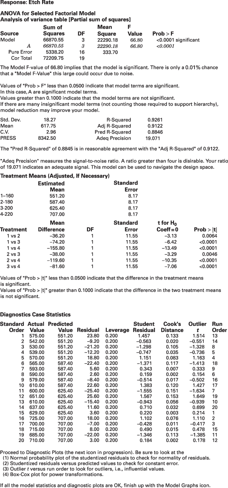
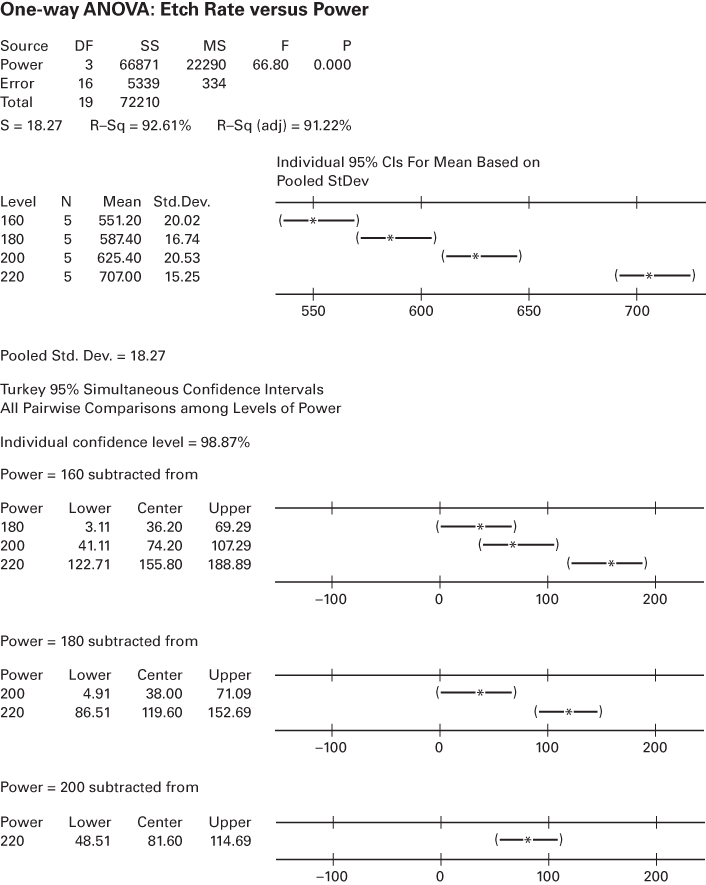
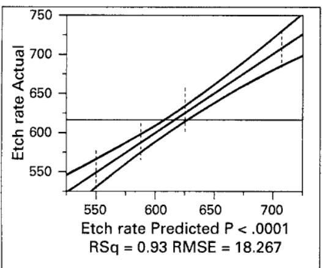
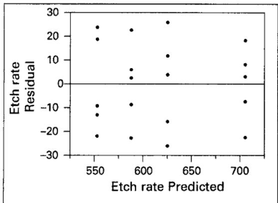
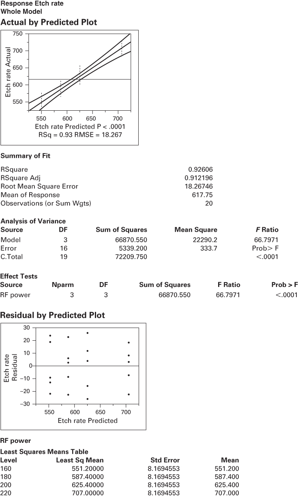

# 3.6 计算机输出示例

支持试验设计并执行方差分析的计算机程序已广泛可用。图 3.12 给出了其中一个程序 Design-Expert 的输出，用的是例 3.1 中等离子体刻蚀试验的数据。对应于“Model”（模型）的平方和就是单因子设计中通常的 $SS_{\text{处理}}$，该来源进一步标识为“A”。当试验中的因子多于一个时，模型平方和会被分解为若干来源（A、B 等）。注意计算机输出顶部的方差分析摘要包含通常的平方和、自由度、均方和检验统计量 $F_{0}$。“Prob > F”列就是 $P$ 值（实际上它是 $P$ 值的上界，因为小于 0.0001 的概率都被默认为 0.0001）。

除基本的方差分析外，该程序还显示一些其他有用信息。量“R-squared”（$R^{2}$）定义为

$$
R^{2} = \frac{SS_{\text{模型}}}{SS_{\text{总计}}} = \frac{66{,}870.55}{72{,}209.75} = 0.9261
$$

粗略地解释为数据中被方差分析模型“解释”的变异比例。因此在等离子体刻蚀试验中，因子“功率”解释了刻蚀速率变异的约 92.61%。显然必须有 $0 \leq R^{2} \leq 1$，取值越大越好。输出中还显示了其他一些类似 $R^{2}$ 的统计量。“调整的”$R^{2}$ 是普通 $R^{2}$ 统计量的一个变体，它反映了模型中因子的个数。对含有若干设计因子的更复杂试验，当我们希望评价增加或减少模型项数的影响时，它会是一个有用的统计量。“Std. Dev.”是误差均方的平方根 $\sqrt{333.70}=18.27$；而“C.V.”是**变异系数**（coefficient of variation），定义为 $(\sqrt{MS_{E}}/\overline{y})100$。变异系数度量数据中未解释的（即残差的）变异占响应变量均值的百分比。“PRESS”代表“预测误差平方和”（prediction error sum of squares），它度量试验的模型在**新**试验中预测响应的能力有多好。PRESS 值越小越好。作为替代，也可以基于 PRESS 计算用于预测的 $R^{2}$（后面我们会说明如何计算）。本例中的这个 $R^{2}_{\mathrm{Pred}}$ 为 0.8845；考虑到该模型解释了当前试验中约 93% 的变异，这个值并不算不合理。“adequate precision”（足够精度）统计量是用最大预测响应与最小预测响应之差除以所有预测响应的平均标准差算得的。该量取值越大越好，通常超过 4 就说明模型在预测方面会有合理表现。

处理均值被作了估计，并显示了标准误（即每个处理均值的样本标准差 $\sqrt{MS_{E}/n}$）。处理均值两两之间的差异用 3.5.7 节所述 Fisher LSD 方法的假设检验版本来考察。

该计算机程序还计算并显示按式 3.16 定义的残差，并会生成 3.4 节讨论过的所有残差图。输出中还显示若干其他残差诊断量，其中一些将在后面讨论。Design-Expert 还显示**学生化残差**（输出中称为“Student Residual”），按下式计算：

$$
r_{ij} = \frac{e_{ij}}{\sqrt{MS_{E}(1-\mathrm{Leverage}_{ij})}}
$$

其中 $\mathrm{Leverage}_{ij}$（杠杆值）是第 $ij$ 个观测值对模型影响力的度量。我们将在第 10 章更详细地讨论杠杆值并说明它如何计算。在识别潜在离群值方面，学生化残差被认为比普通残差或标准化残差更有效。

最后注意，该程序在输出中还嵌入了一些解释性指导。这类“提示”信息在许多基于 PC 的统计软件包中都相当常见。阅读这类指导时要记住，它是用非常笼统的措辞写的，未必完全适合任何特定试验者撰写报告的要求。用户可以根据需要隐藏这些提示输出。

## Response: Etch Rate

ANOVA for Selected Factorial Model Analysis of variance table [Partial sum of squares]

| Source | Sum of Squares | DF | Mean Square | F Value | Prob > F |
| --- | --- | --- | --- | --- | --- |
| Model | 66870.55 | 3 | 22290.18 | 66.80 | <0.0001 significant |
| A | 66870.55 | 3 | 22290.18 | 66.80 | <0.0001 |
| Pure Error | 5338.20 | 16 | 333.70 | | |
| Cor Total | 72209.75 | 19 | | | |

The Model F-value of 66.80 implies that the model is significant. There is only a 0.01% chance that a "Model F-Value" this large could occur due to noise.

Values of "Prob > F" less than 0.0500 indicate that model terms are significant. In this case, A are significant model terms.

Values greater than 0.1000 indicate that the model terms are not significant.
If there are many insignificant model terms (not counting those required to support hierarchy), model reduction may improve your model.

| Std. Dev. | 18.27 | R-Squared | 0.9261 |
| --- | --- | --- | --- |
| Mean | 617.75 | Adj R-Squared | 0.9122 |
| C.V. | 2.96 | Pred R-Squared | 0.8846 |
| PRESS | 8342.50 | Adeq Precision | 19.071 |

The "Pred R-Squared" of 0.8845 is in reasonable agreement with the "Adj R-Squared" of 0.9122.

"Adeq Precision" measures the signal-to-noise ratio. A ratio greater than four is desirable. Your ratio of 19.071 indicates an adequate signal. This model can be used to navigate the design space.

Treatment Means (Adjusted, If Necessary)

| | Estimated Mean | | Standard Error | | |
| --- | --- | --- | --- | --- | --- |
| 1-160 | 551.20 | | 8.17 | | |
| 2-180 | 587.40 | | 8.17 | | |
| 3-200 | 625.40 | | 8.17 | | |
| 4-220 | 707.00 | | 8.17 | | |
| Treatment | Mean Difference | DF | Standard Error | t for $H_{0}$ Coeff=0 | Prob > \|t\| |
| 1 vs 2 | -36.20 | 1 | 11.55 | -3.13 | 0.0064 |
| 1 vs 3 | -74.20 | 1 | 11.55 | -6.42 | <0.0001 |
| 1 vs 4 | -155.80 | 1 | 11.55 | -13.49 | <0.0001 |
| 2 vs 3 | -38.00 | 1 | 11.55 | -3.29 | 0.0046 |
| 2 vs 4 | -119.60 | 1 | 11.55 | -10.35 | <0.0001 |
| 3 vs 4 | -81.60 | 1 | 11.55 | -7.06 | <0.0001 |

Values of "Prob > |t|" less than 0.0500 indicate that the difference in the treatment means is significant.
Values of "Prob > |t|" greater than 0.1000 indicate that the difference in the two treatment means is not significant.

## Diagnostics Case Statistics

| Standard Order | Actual Value | Predicted Value | Residual | Leverage | Student Residual | Cook's Distance | Outlier t | Run Order |
| --- | --- | --- | --- | --- | --- | --- | --- | --- |
| 1 | 575.00 | 551.20 | 23.80 | 0.200 | 1.457 | 0.133 | 1.514 | 13 |
| 2 | 542.00 | 551.20 | -9.20 | 0.200 | -0.563 | 0.020 | -0.551 | 14 |
| 3 | 530.00 | 551.20 | -21.20 | 0.200 | -1.298 | 0.105 | -1.328 | 8 |
| 4 | 539.00 | 551.20 | -12.20 | 0.200 | -0.747 | 0.035 | -0.736 | 5 |
| 5 | 570.00 | 551.20 | 18.80 | 0.200 | 1.151 | 0.083 | 1.163 | 4 |
| 6 | 565.00 | 587.40 | -22.40 | 0.200 | -1.371 | 0.117 | -1.413 | 18 |
| 7 | 593.00 | 587.40 | 5.60 | 0.200 | 0.343 | 0.007 | 0.333 | 9 |
| 8 | 590.00 | 587.40 | 2.60 | 0.200 | 0.159 | 0.002 | 0.154 | 6 |
| 9 | 579.00 | 587.40 | -8.40 | 0.200 | -0.514 | 0.017 | -0.502 | 16 |
| 10 | 610.00 | 587.40 | 22.60 | 0.200 | 1.383 | 0.120 | 1.427 | 17 |
| 11 | 600.00 | 625.40 | -25.40 | 0.200 | -1.555 | 0.151 | -1.634 | 7 |
| 12 | 651.00 | 625.40 | 25.60 | 0.200 | 1.567 | 0.153 | 1.649 | 19 |
| 13 | 610.00 | 625.40 | -15.40 | 0.200 | -0.943 | 0.056 | -0.939 | 10 |
| 14 | 637.00 | 625.40 | 11.60 | 0.200 | 0.710 | 0.032 | 0.699 | 20 |
| 15 | 629.00 | 625.40 | 3.60 | 0.200 | 0.220 | 0.003 | 0.214 | 1 |
| 16 | 725.00 | 707.00 | 18.00 | 0.200 | 1.102 | 0.076 | 1.110 | 2 |
| 17 | 700.00 | 707.00 | -7.00 | 0.200 | -0.428 | 0.011 | -0.417 | 3 |
| 18 | 715.00 | 707.00 | 8.00 | 0.200 | 0.490 | 0.015 | 0.478 | 15 |
| 19 | 685.00 | 707.00 | -22.00 | 0.200 | -1.346 | 0.113 | -1.385 | 11 |
| 20 | 710.00 | 707.00 | 3.00 | 0.200 | 0.184 | 0.002 | 0.178 | 12 |

```txt
Proceed to Diagnostic Plots (the next icon in progression). Be sure to look at the
(1) Normal probability plot of the studentized residuals to check for normality of residuals.
(2) Studentized residuals versus predicted values to check for constant error.
(3) Outlier t versus run order to look for outliers, i.e., influential values.
(4) Box-Cox plot for power transformations.

If all the model statistics and diagnostic plots are OK, finish up with the Model Graphs icon.

Power = 200 subtracted from
```

| Power | Lower | Center | Upper |
| --- | --- | --- | --- |
| 180 | 3.11 | 36.20 | 69.29 |
| 200 | 41.11 | 74.20 | 107.29 |
| 220 | 122.71 | 155.80 | 188.89 |



**图 3.12 例 3.1 的 Design-Expert 计算机输出** [^1]

图 3.13 给出了 Minitab 对等离子体刻蚀试验的输出。该输出与图 3.12 中 Design-Expert 的输出非常相似。注意它给出了各个处理均值的置信区间，并用 Tukey 方法比较均值对。然而 Tukey 方法是以置信区间形式给出的，而不是我们在 3.5.7 节所用的假设检验形式。没有一个 Tukey 置信区间包含零，因此我们会得出结论：所有均值都不同。

图 3.14 是 JMP 对例 3.1 等离子体刻蚀试验的输出。输出信息与 Design-Expert 和 Minitab 非常相似。观测值对预测值的图形以及残差对预测值的图形是默认输出。JMP 中有一个选项可以提供 Fisher LSD 程序或 Tukey 方法来比较所有均值对。

## One-way ANOVA: Etch Rate versus Power

| Source | DF | SS | MS | F | P |
| --- | --- | --- | --- | --- | --- |
| Power | 3 | 66871 | 22290 | 66.80 | 0.000 |
| Error | 16 | 5339 | 334 | | |
| Total | 19 | 72210 | | | |
| S = 18.27 R-Sq = 92.61% R-Sq (adj) = 91.22% | | | | | |

```txt
Pooled Std. Dev. = 18.27
Tukey 95% Simultaneous Confidence Intervals All Pairwise Comparisons among Levels of Power

Individual confidence level = 98.87%

Power = 160 subtracted from
Power = 180 subtracted from
```



**图 3.13 例 3.1 的 Minitab 计算机输出**

```txt
Response   Etch rate
Whole Model

Actual by Predicted Plot
```



Summary of Fit

| RSquare | 0.92606 |
| --- | --- |
| RSquare Adj | 0.912196 |
| Root Mean Square Error | 18.26746 |
| Mean of Response | 617.75 |
| Observations (or Sum Wgts) | 20 |

Analysis of Variance

| Source | DF | Sum of Squares | Mean Square | F Ratio |
| --- | --- | --- | --- | --- |
| Model | 3 | 66870.550 | 22290.2 | 66.7971 |
| Error | 16 | 5339.200 | 333.7 | Prob > F |
| C.Total | 19 | 72209.750 | | <.0001 |

Effect Tests

| Source | Nparm | DF | Sum of Squares | F Ratio | Prob > F |
| --- | --- | --- | --- | --- | --- |
| RF power | 3 | 3 | 66870.550 | 66.7971 | <.0001 |

```txt
Residual by Predicted Plot
```



```txt
RF power
```

Least Squares Means Table

| Level | Least Sq Mean | Std Error | Mean |
| --- | --- | --- | --- |
| 160 | 551.20000 | 8.1694553 | 551.200 |
| 180 | 587.40000 | 8.1694553 | 587.400 |
| 200 | 625.40000 | 8.1694553 | 625.400 |
| 220 | 707.00000 | 8.1694553 | 707.000 |



**图 3.14 例 3.1 的 JMP 输出**

[^1]: 原书 Design-Expert 输出表中“Pure Error”的平方和印作 5338.20（译文按原文保留），但按方差分析表的内部一致性（66 870.55 + 5 339.20 = 72 209.75）、同表误差均方 333.70 × 16 = 5 339.20，以及本节 Minitab 与 JMP 输出中的同一数值，此处应为 5 339.20。——译者注
