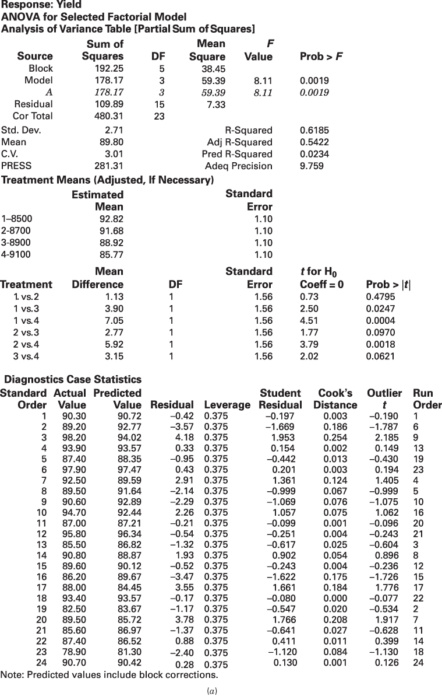
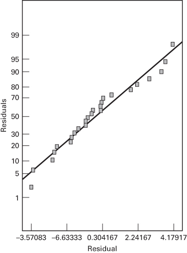
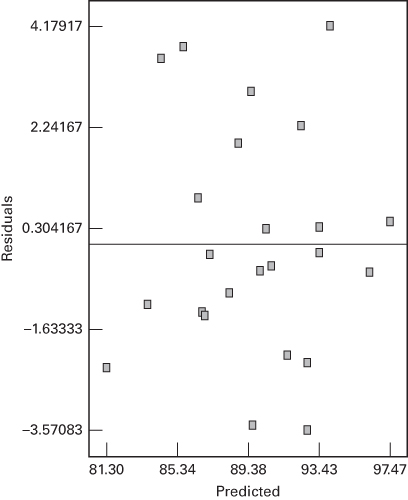
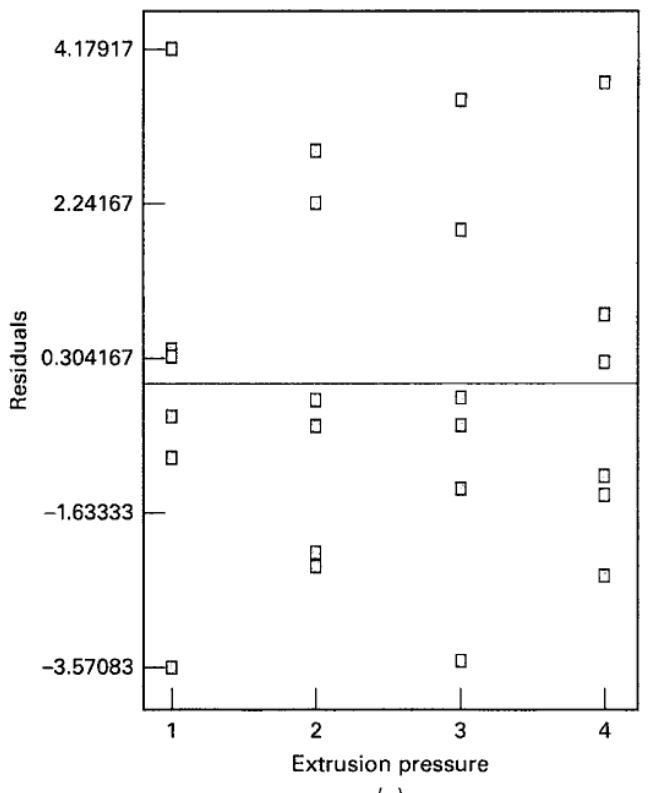
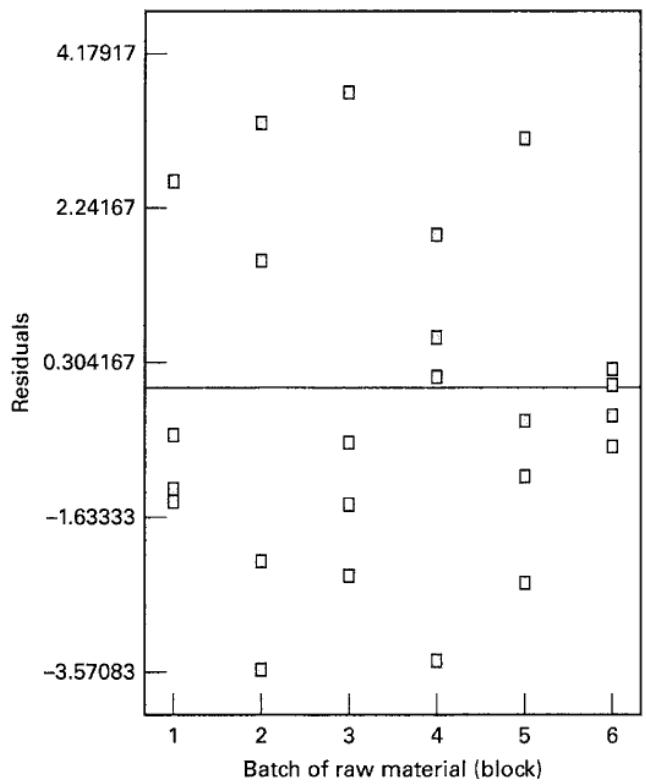

## 4.1 The Randomized Complete Block Design

In any experiment, variability arising from a nuisance factor can affect the results. Generally, we define a nuisance factor as a design factor that probably has an effect on the response, but we are not interested in that effect. Sometimes a nuisance factor is unknown and uncontrolled; that is, we don't know that the factor exists, and it may even be changing levels while we are conducting the experiment. Randomization is the design technique used to guard against such a "lurking" nuisance factor. In other cases, the nuisance factor is known but uncontrollable. If we can at least observe the value that the nuisance factor takes on at each run of the experiment, we can compensate for it in the statistical analysis by using the analysis of covariance, a technique we will discuss in Chapter 15. When the nuisance source of variability is known and controllable, a design technique called blocking can be used to systematically eliminate its effect on the statistical comparisons among treatments. Blocking is an extremely important design technique used extensively in industrial experimentation and is the subject of this chapter.

To illustrate the general idea, reconsider the hardness testing experiment first described in Section 2.5.1. Suppose now that we wish to determine whether or not four different tips produce different readings on a hardness testing machine. An experiment such as this might be part of a gauge capability study. The machine operates by pressing the tip into a metal test coupon, and from the depth of the resulting depression, the hardness of the coupon can be determined. The experimenter has decided to obtain four observations on Rockwell C-scale hardness for each tip. There is only one factor—tip type—and a completely randomized single-factor design would consist of randomly assigning each one of the $4 \times 4 = 16$ runs to an experimental unit, that is, a metal coupon, and observing the hardness reading that results. Thus, 16 different metal test coupons would be required in this experiment, one for each run in the design.

There is a potentially serious problem with a completely randomized experiment in this design situation. If the metal coupons differ slightly in their hardness, as might happen if they are taken from ingots that are produced in different heats, the experimental units (the coupons) will contribute to the variability observed in the hardness data. As a result, the experimental error will reflect both random error and variability between coupons.

We would like to make the experimental error as small as possible; that is, we would like to remove the variability between coupons from the experimental error. A design that would accomplish this requires the experimenter to test each tip once on each of four coupons. This design, shown in Table 4.1, is called a randomized complete block design (RCBD). The word “complete” indicates that each block (coupon) contains all the treatments (tips). By using this design, the blocks, or coupons, form a more homogeneous experimental unit on which to compare the tips. Effectively, this design strategy improves the accuracy of the comparisons among tips by eliminating the variability among the coupons. Within a block, the order in which the four tips are tested is randomly determined. Notice the similarity of this design problem to the paired t-test of Section 2.5.1. The randomized complete block design is a generalization of that concept.

The RCBD is one of the most widely used experimental designs. Situations for which the RCBD is appropriate are numerous. Units of test equipment or machinery are often different in their operating characteristics and would be a typical blocking factor. Batches of raw material, people, and time are also common nuisance sources of variability in an experiment that can be systematically controlled through blocking. $^{1}$

Blocking may also be useful in situations that do not necessarily involve nuisance factors. For example, suppose that a chemical engineer is interested in the effect of catalyst feed rate on the viscosity of a polymer. She knows that there are several factors, such as raw material source, temperature, operator, and raw material purity that are very difficult to control in the full-scale process. Therefore, she decides to test the catalyst feed rate factor in blocks, where each block consists of some combination of these uncontrollable factors. In effect, she is using the blocks to test the robustness of her process variable (feed rate) to conditions she cannot easily control. For more discussion of this, see Coleman and Montgomery (1993).

## TABLE 4.1

Randomized Complete Block Design for the Hardness Testing Experiment

<table><tr><td colspan="4">Test Coupon (Block)</td></tr><tr><td>1</td><td>2</td><td>3</td><td>4</td></tr><tr><td>Tip 3</td><td>Tip 3</td><td>Tip 2</td><td>Tip 1</td></tr><tr><td>Tip 1</td><td>Tip 4</td><td>Tip 1</td><td>Tip 4</td></tr><tr><td>Tip 4</td><td>Tip 2</td><td>Tip 3</td><td>Tip 2</td></tr><tr><td>Tip 2</td><td>Tip 1</td><td>Tip 4</td><td>Tip 3</td></tr></table>

## 4.1.1 Statistical Analysis of the RCBD

Suppose we have, in general, a treatments that are to be compared and b blocks. The randomized complete block design is shown in Figure 4.1. There is one observation per treatment in each block, and the order in which the treatments are run within each block is determined randomly. Because the only randomization of treatments is within the blocks, we often say that the blocks represent a restriction on randomization.

The statistical model for the RCBD can be written in several ways. The traditional model is an effects model:

$$
y _ {i j} = \mu + \tau_ {i} + \beta_ {j} + \varepsilon_ {i j} \qquad \left\{ \begin{array}{l} i = 1, 2, \ldots , a \\ j = 1, 2, \ldots , b \end{array} \right.\tag{4.1}
$$

where $\mu$ is an overall mean, $\tau_{i}$ is the effect of the ith treatment, $\beta_{j}$ is the effect of the jth block, and $\varepsilon_{ij}$ is the usual NID $(0,\sigma^{2})$ random error term. We will initially consider treatments and blocks to be fixed factors. The case of random blocks, which is very important, is considered in Section 4.1.3. Just as in the single-factor experimental design model in Chapter 3, the effects model for the RCBD is an overspecified model. Consequently, we usually think of the treatment and block effects as deviations from the overall mean so that

$$
\sum_ {i = 1} ^ {a} \tau_ {i} = 0 \quad \text { and } \quad \sum_ {j = 1} ^ {b} \beta_ {j} = 0
$$

It is also possible to use a means model for the RCBD, say

$$
y _ {i j} = \mu_ {i j} + \varepsilon_ {i j} \quad \left\{ \begin{array}{l} i = 1, 2, \dots , a \\ j = 1, 2, \dots , b \end{array} \right.
$$

where $\mu_{ij} = \mu +\tau_i + \beta_j$ . However, we will use the effects model in Equation 4.1 throughout this chapter.

In an experiment involving the RCBD, we are interested in testing the equality of the treatment means. Thus, the hypotheses of interest are

$$
\begin{array}{l} H _ {0}: \mu_ {1} = \mu_ {2} = \dots = \mu_ {a} \\ H _ {1}: \text { at   least   one } \mu_ {i} \neq \mu_ {j} \end{array}
$$

Because the $i$ th treatment mean $\mu_{i} = (1 / b)\sum_{j=1}^{b}(\mu +\tau_{i} + \beta_{j}) = \mu +\tau_{i}$ , an equivalent way to write the above hypotheses is in terms of the treatment effects, say

$$
\begin{array}{l} H _ {0}: \tau_ {1} = \tau_ {2} = \dots = \tau_ {a} = 0 \\ H _ {1}: \tau_ {i} \neq 0 \text {   at   least   one   } i \end{array}
$$

$$
\begin{array}{c c c c} \hline \text {Block 1} & \text {Block 2} & \text {Block b} \\ \hline y _ {1 1} & y _ {1 2} & y _ {1 b} \\ y _ {2 1} & y _ {2 2} & y _ {2 b} \\ y _ {3 1} & y _ {3 2} & y _ {3 b} \\ \cdot & \cdot & \cdot \\ \cdot & \cdot & \cdot \\ \cdot & \cdot & \cdot \\ y _ {a 1} & y _ {a 2} & y _ {a b} \\ \hline \end{array} \quad \dots \quad \boxed {\text {FIGURE 4.1 The randomized complete block design}}
$$

The analysis of variance can be easily extended to the RCBD. Let $y_{i}$ be the total of all observations taken under treatment $i, y_{j}$ be the total of all observations in block $j, y_{\cdot}$ be the grand total of all observations, and $N = ab$ be the total number of observations. Expressed mathematically,

$$
y _ {i.} = \sum_ {j = 1} ^ {b} y _ {i j} \quad i = 1, 2, \dots , a\tag{4.2}
$$

$$
y _ {j} = \sum_ {i = 1} ^ {a} y _ {i j} \quad j = 1, 2, \dots , b\tag{4.3}
$$

and

$$
y _ {..} = \sum_ {i = 1} ^ {a} \sum_ {j = 1} ^ {b} y _ {i j} = \sum_ {i = 1} ^ {a} y _ {i.} = \sum_ {j = 1} ^ {b} y _ {. j}\tag{4.4}
$$

Similarly, $\overline{y}_i$ . is the average of the observations taken under treatment $i$ , $\overline{y}_{.j}$ is the average of the observations in block $j$ , and $\overline{y}_{..}$ is the grand average of all observations. That is,

$$
\overline {{{y}}} _ {i.} = y _ {i.} / b \quad \overline {{{y}}} _ {. j} = y _ {. j} / a \quad \overline {{{y}}} _ {..} = y _ {..} / N\tag{4.5}
$$

We may express the total corrected sum of squares as

$$
\sum_ {i = 1} ^ {a} \sum_ {j = 1} ^ {b} (y _ {i j} - \overline {{y}} _ {\cdot}) ^ {2} = \sum_ {i = 1} ^ {a} \sum_ {j = 1} ^ {b} [ (\overline {{y}} _ {i.} - \overline {{y}} _ {\cdot}) + (\overline {{y}} _ {. j} - \overline {{y}} _ {\cdot}) + (y _ {i j} - \overline {{y}} _ {i.} - \overline {{y}} _ {. j} + \overline {{y}} _ {\cdot}) ] ^ {2}\tag{4.6}
$$

By expanding the right-hand side of Equation 4.6, we obtain

$$
\begin{array}{l} \sum_ {i = 1} ^ {a} \sum_ {j = 1} ^ {b} (y _ {i j} - \overline {{y}} _ {\cdot \cdot}) ^ {2} = b \sum_ {i = 1} ^ {a} (\overline {{y}} _ {i.} - \overline {{y}} _ {\cdot \cdot}) ^ {2} + a \sum_ {j = 1} ^ {b} (\overline {{y}} _ {. j} - \overline {{y}} _ {\cdot \cdot}) ^ {2} \\ \qquad + \sum_ {i = 1} ^ {a} \sum_ {j = 1} ^ {b} (y _ {i j} - \overline {{y}} _ {i.} - \overline {{y}} _ {. j} + \overline {{y}} _ {\cdot \cdot}) ^ {2} + 2 \sum_ {i = 1} ^ {a} \sum_ {j = 1} ^ {b} (\overline {{y}} _ {i.} - \overline {{y}} _ {\cdot \cdot}) (\overline {{y}} _ {. j} - \overline {{y}} _ {\cdot \cdot}) \\ \qquad + 2 \sum_ {i = 1} ^ {a} \sum_ {j = 1} ^ {b} (\overline {{y}} _ {. j} - \overline {{y}} _ {\cdot \cdot}) (y _ {i j} - \overline {{y}} _ {i.} - \overline {{y}} _ {. j} + \overline {{y}} _ {\cdot \cdot}) \\ \qquad + 2 \sum_ {i = 1} ^ {a} \sum_ {j = 1} ^ {b} (\overline {{y}} _ {i.} - \overline {{y}} _ {\cdot \cdot}) (y _ {i j} - \overline {{y}} _ {i.} - \overline {{y}} _ {. j} + \overline {{y}} _ {\cdot \cdot}) \end{array}
$$

Simple but tedious algebra proves that the three cross products are zero. Therefore,

$$
\begin{array}{r l} \sum_ {i = 1} ^ {a} \sum_ {j = 1} ^ {b} (y _ {i j} - \overline {{y}} _ {\cdot}) ^ {2} & = b \sum_ {i = 1} ^ {a} (\overline {{y}} _ {i.} - \overline {{y}} _ {\cdot}) ^ {2} + a \sum_ {j = 1} ^ {b} (\overline {{y}} _ {. j} - \overline {{y}} _ {\cdot}) ^ {2} \\ & \quad + \sum_ {i = 1} ^ {a} \sum_ {j = 1} ^ {b} (y _ {i j} - \overline {{y}} _ {. j} - \overline {{y}} _ {i.} + \overline {{y}} _ {\cdot}) ^ {2} \end{array}\tag{4.7}
$$

represents a partition of the total sum of squares. This is the fundamental ANOVA equation for the RCBD. Expressing the sums of squares in Equation 4.7 symbolically, we have

$$
S S _ {T} = S S _ {\text { Treatments }} + S S _ {\text { Blocks }} + S S _ {E}\tag{4.8}
$$

Because there are N observations, $SS_{T}$ has N-1 degrees of freedom. There are a treatments and b blocks, so $SS_{Treatments}$ and $SS_{Blocks}$ have a-1 and b-1 degrees of freedom, respectively. The error sum of squares is just a sum of squares between cells minus the sum of squares for treatments and blocks. There are ab cells with ab-1 degrees of freedom between them, so $SS_{E}$ has $ab-1-(a-1)-(b-1)=(a-1)(b-1)$ degrees of freedom. Furthermore, the degrees of freedom on the right-hand side of Equation 4.8 add to the total on the left; therefore, making the usual normality assumptions on the errors, one may use Theorem 3-1 to show that $SS_{Treatments}/\sigma^{2}$ , $SS_{Blocks}/\sigma^{2}$ , and $SS_{E}/\sigma^{2}$ are independently distributed chi-square random variables. Each sum of squares divided by its degrees of freedom is a mean square. The expected value of the mean squares, if treatments and blocks are fixed, can be shown to be

$$
\begin{array}{c} E (M S _ {\text {Treatments}}) = \sigma^ {2} + \frac {b \sum_ {i = 1} ^ {a} \tau_ {i} ^ {2}}{a - 1} \\ E (M S _ {\text {Blocks}}) = \sigma^ {2} + \frac {a \sum_ {j = 1} ^ {b} \beta_ {j} ^ {2}}{b - 1} \\ E (M S _ {E}) = \sigma^ {2} \end{array}
$$

Therefore, to test the equality of treatment means, we would use the test statistic

$$
F _ {0} = \frac {M S _ {\text { Treatments }}}{M S _ {E}}
$$

which is distributed as $F_{\alpha - 1, (a - 1)(b - 1)}$ if the null hypothesis is true. The critical region is the upper tail of the $F$ distribution, and we would reject $H_0$ if $F_0 > F_{\alpha, a - 1, (a - 1)(b - 1)}$ . A $P$ -value approach can also be used.

We may also be interested in comparing block means because, if these means do not differ greatly, blocking may not be necessary in future experiments. From the expected mean squares, it seems that the hypothesis $H_{0}:\beta_{j}=0$ may be tested by comparing the statistic $F_{0}=MS_{Blocks}/MS_{E}$ to $F_{\alpha,b-1,(a-1)(b-1)}$ . However, recall that randomization has been applied only to treatments within blocks; that is, the blocks represent a restriction on randomization. What effect does this have on the statistic $F_{0}=MS_{Blocks}/MS_{E}$ ? Some differences in treatment of this question exist. For example, Box, Hunter, and Hunter (2005) point out that the usual analysis of variance F-test can be justified on the basis of randomization only, $^{2}$ without direct use of the normality assumption. They further observe that the test to compare block means cannot appeal to such a justification because of the randomization restriction; but if the errors are NID(0, $\sigma^{2}$ ), the statistic $F_{0}=MS_{Blocks}/MS_{E}$ can be used to compare block means. On the other hand, Anderson and McLean (1974) argue that the randomization restriction prevents this statistic from being a meaningful test for comparing block means and that this F ratio really is a test for the equality of the block means plus the randomization restriction [which they call a restriction error; see Anderson and McLean (1974) for further details].

In practice, then, what do we do? Because the normality assumption is often questionable, to view $F_{0} = MS_{Blocks}/MS_{E}$ as an exact F-test on the equality of block means is not a good general practice. For that reason, we exclude this F-test from the analysis of variance table. However, as an approximate procedure to investigate the effect of the blocking variable, examining the ratio of $MS_{Blocks}$ to $MS_{E}$ is certainly reasonable. If this ratio is large, it implies that the blocking factor has a large effect and that the noise reduction obtained by blocking was probably helpful in improving the precision of the comparison of treatment means.

The procedure is usually summarized in an ANOVA table, such as the one shown in Table 4.2. The computing would usually be done with a statistical software package. However, computing formulas for the sums of squares may be obtained for the elements in Equation 4.7 by working directly with the identity

$$
y _ {i j} - \overline {{{{y}}}} _ {\cdot \cdot} = (\overline {{{{y}}}} _ {i.} - \overline {{{{y}}}} _ {\cdot \cdot}) + (\overline {{{{y}}}} _ {. j} - \overline {{{{y}}}} _ {\cdot \cdot}) + (y _ {i j} - \overline {{{{y}}}} _ {i.} - \overline {{{{y}}}} _ {. j} + \overline {{{{y}}}} _ {\cdot \cdot})
$$

TABLE 4.2  
Analysis of Variance for a Randomized Complete Block Design

<table><tr><td>Source of Variation</td><td>Sum of Squares</td><td>Degrees of Freedom</td><td>Mean Square</td><td> $F_0$ </td></tr><tr><td>Treatments</td><td> $SS_{Treatments}$ </td><td>a-1</td><td> $\frac{SS_{Treatments}}{a-1}$ </td><td> $\frac{MS_{Treatments}}{MS_E}$ </td></tr><tr><td>Blocks</td><td> $SS_{Blocks}$ </td><td>b-1</td><td> $\frac{SS_{Blocks}}{b-1}$ </td><td></td></tr><tr><td>Error</td><td> $SS_E$ </td><td>(a-1)(b-1)</td><td> $\frac{SS_E}{(a-1)(b-1)}$ </td><td></td></tr><tr><td>Total</td><td> $SS_T$ </td><td>N-1</td><td></td><td></td></tr></table>

These quantities can be computed in the columns of a spreadsheet (Excel). Then each column can be squared and summed to produce the sum of squares. Alternatively, computing formulas can be expressed in terms of treatment and block totals. These formulas are

$$
S S _ {T} = \sum_ {i = 1} ^ {a} \sum_ {j = 1} ^ {b} y _ {i j} ^ {2} - \frac {y _ {. .} ^ {2}}{N}\tag{4.9}
$$

$$
S S _ {\text { Treatments }} = \frac {1}{b} \sum_ {i = 1} ^ {a} y _ {i.} ^ {2} - \frac {y _ {. .} ^ {2}}{N}\tag{4.10}
$$

$$
S S _ {\text { Blocks }} = \frac {1}{a} \sum_ {j = 1} ^ {b} y _ {. j} ^ {2} - \frac {y _ {. .} ^ {2}}{N}\tag{4.11}
$$

and the error sum of squares is obtained by subtraction as

$$
S S _ {E} = S S _ {T} - S S _ {\mathrm{Treatments}} - S S _ {\mathrm{Blocks}}\tag{4.12}
$$

## EXAMPLE 4.1

A medical device manufacturer produces vascular grafts (artificial veins). These grafts are produced by extruding billets of polytetrafluoroethylene (PTFE) resin combined with a lubricant into tubes. Frequently, some of the tubes in a production run contain small, hard protrusions on the external surface. These defects are known as “flicks.” The defect is cause for rejection of the unit.

The product developer responsible for the vascular grafts suspects that the extrusion pressure affects the occurrence of flicks and therefore intends to conduct an experiment to investigate this hypothesis. However, the resin is manufactured by an external supplier and is delivered to the medical device manufacturer in batches. The engineer also suspects that there may be significant batch-to-batch variation, because while the material should be consistent with respect to parameters such as molecular weight, mean particle size, retention, and peak height ratio, it probably isn't due to manufacturing variation at the resin supplier and natural variation in the material. Therefore, the product developer decides to investigate the effect of four different levels of extrusion pressure on flicks using a randomized complete block design considering batches of resin as blocks. The RCBD is shown in Table 4.3. Note that there are four levels of extrusion pressure (treatments) and six batches of resin (blocks). Remember that the order in which the extrusion pressures are tested within each block is random. The response variable is yield, or the percentage of tubes in the production run that did not contain any flicks.

TABLE 4.3  
Randomized Complete Block Design for the Vascular Graft Experiment

<table><tr><td rowspan="2">Extrusion Pressure (PSI)</td><td colspan="6">Batch of Resin (Block)</td><td rowspan="2">Treatment Total</td></tr><tr><td>1</td><td>2</td><td>3</td><td>4</td><td>5</td><td>6</td></tr><tr><td>8500</td><td>90.3</td><td>89.2</td><td>98.2</td><td>93.9</td><td>87.4</td><td>97.9</td><td>556.9</td></tr><tr><td>8700</td><td>92.5</td><td>89.5</td><td>90.6</td><td>94.7</td><td>87.0</td><td>95.8</td><td>550.1</td></tr><tr><td>8900</td><td>85.5</td><td>90.8</td><td>89.6</td><td>86.2</td><td>88.0</td><td>93.4</td><td>533.5</td></tr><tr><td>9100</td><td>82.5</td><td>89.5</td><td>85.6</td><td>87.4</td><td>78.9</td><td>90.7</td><td>514.6</td></tr><tr><td>Block totals</td><td>350.8</td><td>359.0</td><td>364.0</td><td>362.2</td><td>341.3</td><td>377.8</td><td> $y_{..} = 2155.1$ </td></tr></table>

To perform the analysis of variance, we need the following sums of squares:

$$
\begin{array}{r l} S S _ {T} & = \sum_ {i = 1} ^ {4} \sum_ {j = 1} ^ {6} y _ {i j} ^ {2} - \frac {y _ {. .} ^ {2}}{N} \\ & = 1 9 3, 9 9 9. 3 1 - \frac {(2 1 5 5 . 1) ^ {2}}{2 4} = 4 8 0. 3 1 \\ S S _ {\text {Treatments}} & = \frac {1}{b} \sum_ {i = 1} ^ {4} y _ {i.} ^ {2} - \frac {y _ {. .} ^ {2}}{N} \\ & = \frac {1}{6} [ (5 5 6. 9) ^ {2} + (5 5 0. 1) ^ {2} + (5 3 3. 5) ^ {2} \\ & + (5 1 4. 6) ^ {2} ] - \frac {(2 1 5 5 . 1) ^ {2}}{2 4} = 1 7 8. 1 7 \end{array}
$$

$$
\begin{array}{r l} S S _ {\text {Blocks}} & = \frac {1}{a} \sum_ {j = 1} ^ {6} y _ {. j} ^ {2} - \frac {y _ {. .} ^ {2}}{N} \\ & = \frac {1}{4} [ (3 5 0. 8) ^ {2} + (3 5 9. 0) ^ {2} + \dots + (3 7 7. 8) ^ {2} ] \\ & - \frac {(2 1 5 5 . 1) ^ {2}}{2 4} = 1 9 2. 2 5 \\ S S _ {E} & = S S _ {T} - S S _ {\text {Treatments}} - S S _ {\text {Blocks}} \\ & = 4 8 0. 3 1 - 1 7 8. 1 7 - 1 9 2. 2 5 = 1 0 9. 8 9 \end{array}
$$

The ANOVA is shown in Table 4.4. Using $\alpha = 0.05$ , the critical value of F is $F_{0.05,3,15} = 3.29$ . Because 8.11 > 3.29, we conclude that extrusion pressure affects the mean yield. The P-value for the test is also quite small. Also, the resin batches (blocks) seem to differ significantly, because the mean square for blocks is large relative to error.

TABLE 4.4  
Analysis of Variance for the Vascular Graft Experiment

<table><tr><td>Source of Variation</td><td>Sum of Squares</td><td>Degrees of Freedom</td><td>Mean Square</td><td> $F_0$ </td><td>P-Value</td></tr><tr><td>Treatments (extrusion pressure)</td><td>178.17</td><td>3</td><td>59.39</td><td>8.11</td><td>0.0019</td></tr><tr><td>Blocks (batches)</td><td>192.25</td><td>5</td><td>38.45</td><td></td><td></td></tr><tr><td>Error</td><td>109.89</td><td>15</td><td>7.33</td><td></td><td></td></tr><tr><td>Total</td><td>480.31</td><td>23</td><td></td><td></td><td></td></tr></table>

TABLE 4.5  
Incorrect Analysis of the Vascular Graft Experiment as a Completely Randomized Design

<table><tr><td>Source of Variation</td><td>Sum of Squares</td><td>Degrees of Freedom</td><td>Mean Square</td><td> $F_0$ </td><td>P-Value</td></tr><tr><td>Extrusion pressure</td><td>178.17</td><td>3</td><td>59.39</td><td>3.95</td><td>0.0235</td></tr><tr><td>Error</td><td>302.14</td><td>20</td><td>15.11</td><td></td><td></td></tr><tr><td>Total</td><td>480.31</td><td>23</td><td></td><td></td><td></td></tr></table>

in the data, or it improves the precision with which treatment means are compared. This example also illustrates an important point. If an experimenter fails to block when he or she should have, the effect may be to inflate the experimental error, and it would be possible to inflate the error so much that important differences among the treatment means could not be identified.

Sample Computer Output. Condensed computer output for the vascular graft experiment in Example 4.1, obtained from Design-Expert and JMP, is shown in Figure 4.2. The Design-Expert output is in Figure 4.2a and the JMP output is in Figure 4.2b. Both outputs are very similar and match the manual computation given earlier. Note that JMP computes an F-statistic for blocks (the batches). The sample means for each treatment are shown in the output. At 8500 psi, the mean yield is $\overline{y}_{1.}=92.82$ , at 8700 psi the mean yield is $\overline{y}_{2.}=91.68$ , at 8900 psi the mean yield is $\overline{y}_{3.}=88.92$ , and at 9100 psi the mean yield is $\overline{y}_{4.}=85.77$ . Remember that these sample mean yields estimate the treatment means $\mu_{1},\mu_{2},\mu_{3}$ , and $\mu_{4}$ . The model residuals are shown at the bottom of the Design-Expert output. The residuals are calculated from

$$
e _ {i j} = y _ {i j} - \hat {y} _ {i j}
$$

and, as we will later show, the fitted values are $\hat{y}_{ij} = \overline{y}_{i.} + \overline{y}_{.j} - \overline{y}_{..}$ , so

$$
e _ {i j} = y _ {i j} - \overline {{y}} _ {i.} - \overline {{y}} _ {. j} + \overline {{y}} _ {..}\tag{4.13}
$$

In the next section, we will show how the residuals are used in model adequacy checking.

Multiple Comparisons. If the treatments in an RCBD are fixed, and the analysis indicates a significant difference in treatment means, the experimenter is usually interested in multiple comparisons to discover which treatment means differ. Any of the multiple comparison procedures discussed in Section 3.5 may be used for this purpose. In the formulas of Section 3.5, simply replace the number of replicates in the single-factor completely randomized design (n) by the number of blocks (b). Also, remember to use the number of error degrees of freedom for the randomized block $[(a-1)(b-1)]$ instead of those for the completely randomized design $[a(n-1)]$ .

The Design-Expert output in Figure 4.2 illustrates the Fisher LSD procedure. Notice that we would conclude that $\mu_{1} = \mu_{2}$ , because the P-value is very large. Furthermore, $\mu_{1}$ differs from all other means. Now the P-value for $H_{0}: \mu_{2} = \mu_{3}$ is 0.097, so there is some evidence to conclude that $\mu_{2} \neq \mu_{3}$ , and $\mu_{2} \neq \mu_{4}$ because the P-value is 0.0018. Overall, we would conclude that lower extrusion pressures (8500 psi and 8700 psi) lead to fewer defects.

We can also use the graphical procedure of Section 3.5.1 to compare mean yield at the four extrusion pressures. Figure 4.3 plots the four means from Example 4.1 relative to a scaled t distribution with a scale factor $\sqrt{MS_{E}/b} = \sqrt{7.33/6} = 1.10$ . This plot indicates that the two lowest pressures result in the same mean yield, but that the mean yields for 8700 psi and 8900 psi ( $\mu_{2}$ and $\mu_{3}$ ) are also similar. The highest pressure (9100 psi) results in a mean yield that is much lower than all other means. This figure is a useful aid in interpreting the results of the experiment and the Fisher LSD calculations in the Design-Expert output in Figure 4.2.

Response: Yield
ANOVA for Selected Factorial Model
Analysis of Variance Table [Partial Sum of Squares]

<table><tr><td>Source</td><td>Sum of Squares</td><td>DF</td><td>Mean Square</td><td>F Value</td><td>Prob &gt; F</td></tr><tr><td>Block</td><td>192.25</td><td>5</td><td>38.45</td><td></td><td></td></tr><tr><td>Model</td><td>178.17</td><td>3</td><td>59.39</td><td>8.11</td><td>0.0019</td></tr><tr><td>A</td><td>178.17</td><td>3</td><td>59.39</td><td>8.11</td><td>0.0019</td></tr><tr><td>Residual</td><td>109.89</td><td>15</td><td>7.33</td><td></td><td></td></tr><tr><td>Cor Total</td><td>480.31</td><td>23</td><td></td><td></td><td></td></tr><tr><td>Std. Dev.</td><td>2.71</td><td></td><td colspan="2">R-Squared</td><td>0.6185</td></tr><tr><td>Mean</td><td>89.80</td><td></td><td colspan="2">Adj R-Squared</td><td>0.5422</td></tr><tr><td>C.V.</td><td>3.01</td><td></td><td colspan="2">Pred R-Squared</td><td>0.0234</td></tr><tr><td>PRESS</td><td>281.31</td><td></td><td colspan="2">Adeq Precision</td><td>9.759</td></tr></table>

Treatment Means (Adjusted, If Necessary)

<table><tr><td></td><td>Estimated Mean</td><td>Standard Error</td></tr><tr><td>1-8500</td><td>92.82</td><td>1.10</td></tr><tr><td>2-8700</td><td>91.68</td><td>1.10</td></tr><tr><td>3-8900</td><td>88.92</td><td>1.10</td></tr><tr><td>4-9100</td><td>85.77</td><td>1.10</td></tr></table>

<table><tr><td>Treatment</td><td>Mean Difference</td><td>DF</td><td>Standard Error</td><td>t for H0Coeff = 0</td><td>Prob &gt; |t|</td></tr><tr><td>1 vs.2</td><td>1.13</td><td>1</td><td>1.56</td><td>0.73</td><td>0.4795</td></tr><tr><td>1 vs.3</td><td>3.90</td><td>1</td><td>1.56</td><td>2.50</td><td>0.0247</td></tr><tr><td>1 vs.4</td><td>7.05</td><td>1</td><td>1.56</td><td>4.51</td><td>0.0004</td></tr><tr><td>2 vs.3</td><td>2.77</td><td>1</td><td>1.56</td><td>1.77</td><td>0.0970</td></tr><tr><td>2 vs.4</td><td>5.92</td><td>1</td><td>1.56</td><td>3.79</td><td>0.0018</td></tr><tr><td>3 vs.4</td><td>3.15</td><td>1</td><td>1.56</td><td>2.02</td><td>0.0621</td></tr></table>

Diagnostics Case Statistics

<table><tr><td>Standard Order</td><td>Actual Value</td><td>Predicted Value</td><td>Residual</td><td>Leverage</td><td>Student Residual</td><td>Cook&#x27;s Distance</td><td>Outlier t</td><td>Run Order</td></tr><tr><td>1</td><td>90.30</td><td>90.72</td><td>-0.42</td><td>0.375</td><td>-0.197</td><td>0.003</td><td>-0.190</td><td>1</td></tr><tr><td>2</td><td>89.20</td><td>92.77</td><td>-3.57</td><td>0.375</td><td>-1.669</td><td>0.186</td><td>-1.787</td><td>6</td></tr><tr><td>3</td><td>98.20</td><td>94.02</td><td>4.18</td><td>0.375</td><td>1.953</td><td>0.254</td><td>2.185</td><td>9</td></tr><tr><td>4</td><td>93.90</td><td>93.57</td><td>0.33</td><td>0.375</td><td>0.154</td><td>0.002</td><td>0.149</td><td>13</td></tr><tr><td>5</td><td>87.40</td><td>88.35</td><td>-0.95</td><td>0.375</td><td>-0.442</td><td>0.013</td><td>-0.430</td><td>19</td></tr><tr><td>6</td><td>97.90</td><td>97.47</td><td>0.43</td><td>0.375</td><td>0.201</td><td>0.003</td><td>0.194</td><td>23</td></tr><tr><td>7</td><td>92.50</td><td>89.59</td><td>2.91</td><td>0.375</td><td>1.361</td><td>0.124</td><td>1.405</td><td>4</td></tr><tr><td>8</td><td>89.50</td><td>91.64</td><td>-2.14</td><td>0.375</td><td>-0.999</td><td>0.067</td><td>-0.999</td><td>5</td></tr><tr><td>9</td><td>90.60</td><td>92.89</td><td>-2.29</td><td>0.375</td><td>-1.069</td><td>0.076</td><td>-1.075</td><td>10</td></tr><tr><td>10</td><td>94.70</td><td>92.44</td><td>2.26</td><td>0.375</td><td>1.057</td><td>0.075</td><td>1.062</td><td>16</td></tr><tr><td>11</td><td>87.00</td><td>87.21</td><td>-0.21</td><td>0.375</td><td>-0.099</td><td>0.001</td><td>-0.096</td><td>20</td></tr><tr><td>12</td><td>95.80</td><td>96.34</td><td>-0.54</td><td>0.375</td><td>-0.251</td><td>0.004</td><td>-0.243</td><td>21</td></tr><tr><td>13</td><td>85.50</td><td>86.82</td><td>-1.32</td><td>0.375</td><td>-0.617</td><td>0.025</td><td>-0.604</td><td>3</td></tr><tr><td>14</td><td>90.80</td><td>88.87</td><td>1.93</td><td>0.375</td><td>0.902</td><td>0.054</td><td>0.896</td><td>8</td></tr><tr><td>15</td><td>89.60</td><td>90.12</td><td>-0.52</td><td>0.375</td><td>-0.243</td><td>0.004</td><td>-0.236</td><td>12</td></tr><tr><td>16</td><td>86.20</td><td>89.67</td><td>-3.47</td><td>0.375</td><td>-1.622</td><td>0.175</td><td>-1.726</td><td>15</td></tr><tr><td>17</td><td>88.00</td><td>84.45</td><td>3.55</td><td>0.375</td><td>1.661</td><td>0.184</td><td>1.776</td><td>17</td></tr><tr><td>18</td><td>93.40</td><td>93.57</td><td>-0.17</td><td>0.375</td><td>-0.080</td><td>0.000</td><td>-0.077</td><td>22</td></tr><tr><td>19</td><td>82.50</td><td>83.67</td><td>-1.17</td><td>0.375</td><td>-0.547</td><td>0.020</td><td>-0.534</td><td>2</td></tr><tr><td>20</td><td>89.50</td><td>85.72</td><td>3.78</td><td>0.375</td><td>1.766</td><td>0.208</td><td>1.917</td><td>7</td></tr><tr><td>21</td><td>85.60</td><td>86.97</td><td>-1.37</td><td>0.375</td><td>-0.641</td><td>0.027</td><td>-0.628</td><td>11</td></tr><tr><td>22</td><td>87.40</td><td>86.52</td><td>0.88</td><td>0.375</td><td>0.411</td><td>0.011</td><td>0.399</td><td>14</td></tr><tr><td>23</td><td>78.90</td><td>81.30</td><td>-2.40</td><td>0.375</td><td>-1.120</td><td>0.084</td><td>-1.130</td><td>18</td></tr><tr><td>24</td><td>90.70</td><td>90.42</td><td>0.28</td><td>0.375</td><td>0.130</td><td>0.001</td><td>0.126</td><td>24</td></tr></table>

Note: Predicted values include block corrections.

(a)

■ FIGURE 4.2 Computer output for Example 4.1. (a) Design-Expert; (b) JMP

## Oneway Analysis of Yield by Pressure

Block

## Oneway Anova

<table><tr><td>Rsquare</td><td>0.771218</td></tr><tr><td>Adj Rsquare</td><td>0.649201</td></tr><tr><td>Root Mean Square Error</td><td>2.706612</td></tr><tr><td>Mean of Response</td><td>89.79583</td></tr><tr><td>Observations (or Sum Wgts)</td><td>24</td></tr></table>

Analysis of Variance

<table><tr><td>Source</td><td>DF</td><td>Sum of Squares</td><td>Mean Square</td><td>F Ratio</td><td>Prob &gt; F</td></tr><tr><td>Pressure</td><td>3</td><td>178.17125</td><td>59.3904</td><td>8.1071</td><td>0.0019</td></tr><tr><td>Batch</td><td>5</td><td>192.25208</td><td>38.4504</td><td>5.2487</td><td>0.0055</td></tr><tr><td>Error</td><td>15</td><td>109.88625</td><td>7.3257</td><td></td><td></td></tr><tr><td>C.Total</td><td>23</td><td>480.30958</td><td></td><td></td><td></td></tr></table>

Means for Oneway Anova

<table><tr><td>Level</td><td>Number</td><td>Mean</td><td>Std. Error</td><td>Lower 95%</td><td>Upper 95%</td></tr><tr><td>8500</td><td>6</td><td>92.8167</td><td>1.1050</td><td>90.461</td><td>95.172</td></tr><tr><td>8700</td><td>6</td><td>91.6833</td><td>1.1050</td><td>89.328</td><td>94.039</td></tr><tr><td>8900</td><td>6</td><td>88.9167</td><td>1.1050</td><td>86.561</td><td>91.272</td></tr><tr><td>9100</td><td>6</td><td>85.7667</td><td>1.1050</td><td>83.411</td><td>88.122</td></tr></table>

Std. Error uses a pooled estimate of error variance

Block Means

<table><tr><td>Batch</td><td>Mean</td><td>Number</td></tr><tr><td>1</td><td>87.7000</td><td>4</td></tr><tr><td>2</td><td>89.7500</td><td>4</td></tr><tr><td>3</td><td>91.0000</td><td>4</td></tr><tr><td>4</td><td>90.5500</td><td>4</td></tr><tr><td>5</td><td>85.3250</td><td>4</td></tr><tr><td>6</td><td>94.4500</td><td>4</td></tr></table>

■ FIGURE 4.2 (Continued)

■ FIGURE 4.3 Mean yields for the four extrusion pressures relative to a scaled t distribution with a scale factor $\sqrt{MS_{E}/b} = \sqrt{7.33/6} = 1.10$  

## 4.1.2 Model Adequacy Checking

We have previously discussed the importance of checking the adequacy of the assumed model. Generally, we should be alert for potential problems with the normality assumption, unequal error variance by treatment or block, and block-treatment interaction. As in the completely randomized design, residual analysis is the major tool used in this diagnostic checking. The residuals for the randomized block design in Example 4.1 are listed at the bottom of the Design-Expert output in Figure 4.2.

A normal probability plot of these residuals is shown in Figure 4.4. There is no severe indication of nonnormality, nor is there any evidence pointing to possible outliers. Figure 4.5 plots the residuals versus the fitted values $\hat{y}_{ij}$ . There should be no relationship between the size of the residuals and the fitted values $\hat{y}_{ij}$ . This plot reveals nothing of unusual interest. Figure 4.6 shows plots of the residuals by treatment (extrusion pressure) and by batch of resin or block. These plots are potentially very informative. If there is more scatter in the residuals for a particular treatment, it could indicate that this treatment produces more erratic response readings than the others. More scatter in the residuals for a particular block could indicate that the block is not homogeneous. However, in our example, Figure 4.6 gives no indication of inequality of variance by treatment, but there is an indication that there is less variability in the yield for batch 6. However, since all of the other residual plots are satisfactory, we will ignore this.

Sometimes the plot of residuals versus $\hat{y}_{ij}$ has a curvilinear shape; for example, there may be a tendency for negative residuals to occur with low $\hat{y}_{ij}$ values, positive residuals with intermediate $\hat{y}_{ij}$ values, and negative residuals with high $\hat{y}_{ij}$ values. This type of pattern is suggestive of interaction between blocks and treatments. If this pattern occurs, a transformation should be used in an effort to eliminate or minimize the interaction. In Section 5.3.7, we describe a statistical test that can be used to detect the presence of interaction in a randomized block design.

## 4.1.3 Some Other Aspects of the Randomized Complete Block Design

Additivity of the Randomized Block Model. The linear statistical model that we have used for the randomized block design

$$
y _ {i j} = \mu + \tau_ {i} + \beta_ {j} + \varepsilon_ {i j}
$$

  
■ FIGURE 4.4 Normal probability plot of residuals for Example 4.1

  
■ FIGURE 4.5 Plot of residuals versus $\hat{y}_{ij}$ for Example 4.1

  
(a)

  
(b)  
■ FIGURE 4.6 Plot of residuals by extrusion pressure (treatment) and by batches of resin (block) for Example 4.1

is completely additive. This says that, for example, if the first treatment causes the expected response to increase by five units $(\tau_{1}=5)$ and if the first block increases the expected response by 2 units $(\beta_{1}=2)$ , the expected increase in response of both treatment 1 and block 1 together is $E(y_{11})=\mu+\tau_{1}+\beta_{1}=\mu+5+2=\mu+7$ . In general, treatment 1 always increases the expected response by 5 units over the sum of the overall mean and the block effect.

Although this simple additive model is often useful, in some situations it is inadequate. Suppose, for example, that we are comparing four formulations of a chemical product using six batches of raw material; the raw material batches are considered blocks. If an impurity in batch 2 affects formulation 2 adversely, resulting in an unusually low yield, but does not affect the other formulations, an interaction between formulations (or treatments) and batches (or blocks) has occurred. Similarly, interactions between treatments and blocks can occur when the response is measured on the wrong scale. Thus, a relationship that is multiplicative in the original units, say

$$
E (y _ {i j}) = \mu \tau_ {i} \beta_ {j}
$$

is linear or additive in a log scale since, for example,

$$
\ln E (y _ {i j}) = \ln \mu + \ln \tau_ {i} + \ln \beta_ {j}
$$

or

$$
E (y _ {i j} ^ {*}) = \mu^ {*} + \tau_ {i} ^ {*} + \beta_ {j} ^ {*}
$$

Although this type of interaction can be eliminated by a transformation, not all interactions are so easily treated. For example, transformations do not eliminate the formulation–batch interaction discussed previously. Residual analysis and other diagnostic checking procedures can be helpful in detecting nonadditivity.

If interaction is present, it can seriously affect and possibly invalidate the analysis of variance. In general, the presence of interaction inflates the error mean square and may adversely affect the comparison of treatment means. In situations where both factors, as well as their possible interaction, are of interest, factorial designs must be used. These designs are discussed extensively in Chapters 5 through 9.

Random Treatments and Blocks. Our presentation of the randomized complete block design thus far has focused on the case when both the treatments and blocks were considered as fixed factors. There are many situations where either treatments or blocks (or both) are random factors. It is very common to find that the blocks are random. This is usually what the experimenter would like to do, because we would like for the conclusions from the experiment to be valid across the population of blocks that the ones selected for the experiments were sampled from. First, we consider the case where the treatments are fixed and the blocks are random. Equation 4.1 is still the appropriate statistical model, but now the block effects are random, that is, we assume that the $\beta_{j}, j = 1, 2, \ldots, b$ are $NID(0, \sigma_{\beta}^{2})$ random variables. This is a special case of a mixed model (because it contains both fixed and random factors). In Chapters 13 and 14 we will discuss mixed models in more detail and provide several examples of situations where they occur. Our discussion here is limited to the RCBD.

Assuming that the RCBD model Equation 4.1 is appropriate, if the blocks are random and the treatments are fixed we can show that

$$
\begin{array}{r c l} {E (y _ {i j})} & = & {\mu + \tau_ {i}, \quad i = 1, 2, \ldots , a} \\ {V (y _ {i j})} & = & {\sigma_ {\beta} ^ {2} + \sigma^ {2}} \\ {C o v (y _ {i j}, y _ {i ^ {\prime} j ^ {\prime}})} & = & {0, j \neq j ^ {\prime}} \\ {C o v (y _ {i j}, y _ {i ^ {\prime} j})} & = & {\sigma_ {\beta} ^ {2} i \neq i ^ {\prime}} \end{array}\tag{4.14}
$$

Thus, the variance of the observations is constant, the covariance between any two observations in different blocks is zero, but the covariance between two observations from the same block is $\sigma_{\beta}^{2}$ . The expected mean squares from the usual ANOVA partitioning of the total sum of squares are

$$
\begin{array}{r} E (M S _ {\mathrm{Treatments}}) = \sigma^ {2} + \frac {b \sum_ {i = 1} ^ {a} \tau_ {i} ^ {2}}{a - 1} \\ E (M S _ {\mathrm{Blocks}}) = \sigma^ {2} + a \sigma_ {\beta} ^ {2} \\ E (M S _ {E}) = \sigma^ {2} \end{array}\tag{4.15}
$$

The appropriate statistic for testing the null hypothesis of no treatment effects (all $\tau_{i}=0$ ) is

$$
F _ {0} = \frac {M S _ {\mathrm{Treatment}}}{M S _ {E}}
$$

which is exactly the same test statistic we used in the case where the blocks were fixed. Based on the expected mean squares, we can obtain an ANOVA-type estimator of the variance component for blocks as

$$
\hat {\sigma} _ {\beta} ^ {2} = \frac {M S _ {\mathrm{Blocks}} - M S _ {E}}{a}\tag{4.16}
$$

For example, for the vascular graft experiment in Example 4.1 the estimate of $\sigma_{\beta}^{2}$ is

$$
\hat {\sigma} _ {\beta} ^ {2} = \frac {M S _ {\mathrm{Blocks}} - M S _ {E}}{a} = \frac {3 8 . 4 5 - 7 . 3 3}{4} = 7. 7 8
$$

This is a method-of-moments estimate and there is no simple way to find a confidence interval on the block variance component $\sigma_{\beta}^{2}$ . The REML method would be preferred here. Table 4.6 is the JMP output for Example 4.1 assuming that blocks are random. The REML estimate of $\sigma_{\beta}^{2}$ is exactly the same as the ANOVA estimate, but REML automatically produces the standard error of the estimate (6.116215) and the approximate 95 percent confidence interval. JMP gives the test for the fixed effect (pressure), and the results are in agreement with those originally reported in Example 4.1. REML also produces the point estimate and confidence interval for the error variance $\sigma^{2}$ . The ease with which confidence intervals can be constructed is a major reason why REML has been so widely adopted.

TABLE 4.6  
JMP Output for Example 4.1 with Blocks Assumed Random

<table><tr><td colspan="7">Response Y</td></tr><tr><td colspan="7">Summary of Fit</td></tr><tr><td>RSquare</td><td></td><td></td><td>0.756688</td><td></td><td></td><td></td></tr><tr><td>RSquare Adj</td><td></td><td></td><td>0.720192</td><td></td><td></td><td></td></tr><tr><td>Root Mean Square Error</td><td></td><td></td><td>2.706612</td><td></td><td></td><td></td></tr><tr><td>Mean of Response</td><td></td><td></td><td>89.79583</td><td></td><td></td><td></td></tr><tr><td>Observations (or Sum Wgts)</td><td></td><td></td><td>24</td><td></td><td></td><td></td></tr><tr><td colspan="7">REML Variance Component Estimates</td></tr><tr><td>Random Effect</td><td>Var Ratio</td><td>Var Component</td><td>Std Error</td><td>95% Lower</td><td>95% Upper</td><td>Pct of Total</td></tr><tr><td>Block</td><td>1.0621666</td><td>7.7811667</td><td>6.116215</td><td>-4.206394</td><td>19.768728</td><td>51.507</td></tr><tr><td>Residual</td><td></td><td>7.32575</td><td>2.6749857</td><td>3.9975509</td><td>17.547721</td><td>48.493</td></tr><tr><td>Total</td><td></td><td>15.106917</td><td></td><td></td><td></td><td>100.000</td></tr><tr><td colspan="7">Covariance Matrix of Variance Component Estimates</td></tr><tr><td>Random Effect</td><td></td><td>Block</td><td>Residual</td><td></td><td></td><td></td></tr><tr><td>Block</td><td></td><td>37.408085</td><td>-1.788887</td><td></td><td></td><td></td></tr><tr><td>Residual</td><td></td><td>-1.788887</td><td>7.1555484</td><td></td><td></td><td></td></tr><tr><td colspan="7">Fixed Effect Tests</td></tr><tr><td>Source</td><td></td><td>Nparm</td><td>DF</td><td>DFDen</td><td>F Ratio</td><td>Prob &gt; F</td></tr><tr><td>Pressure</td><td></td><td>3</td><td>3</td><td>15</td><td>8.1071</td><td>0.0019*</td></tr></table>

\* Significant at the 0.01 level.

Now consider a situation where there is an interaction between treatments and blocks. This could be accounted for by adding an interaction term to the original statistical model Equation 4.1. Let $(\tau\beta)_{ij}$ be the interaction effect of treatment I in block j. Then the model is

$$
y _ {i j} = \mu + \tau_ {i} + \beta_ {j} + (\tau \beta) _ {i j} + \varepsilon_ {i j} \left\{ \begin{array}{l} i = 1, 2, \ldots , a \\ j = 1, 2, \ldots , b \end{array} \right.\tag{4.17}
$$

The interaction effect is assumed to be random because it involves the random block effects. If $\sigma_{\tau\beta}^{2}$ is the variance component for the block treatment interaction, then we can show that the expected mean squares are

$$
\begin{array}{r} E (M S _ {\mathrm{Treatments}}) = \sigma^ {2} + \sigma_ {\tau \beta} ^ {2} + \frac {b \sum_ {i = 1} ^ {a} \tau_ {i} ^ {2}}{a - 1} \\ E (M S _ {\mathrm{Blocks}}) = \sigma^ {2} + a \sigma_ {\beta} ^ {2} \\ E (M S _ {E}) = \sigma^ {2} + \sigma_ {\tau \beta} ^ {2} \end{array}\tag{4.18}
$$

From the expected mean squares, we see that the usual F-statistic $F = MS_{Treatments}/MS_{E}$ would be used to test for no treatment effects. So another advantage of the random block model is that the assumption of no interaction in the RCBD is not important. However, if blocks are fixed and there is an interaction, then the interaction effect is not in the expected mean square for treatments but it is in the error expected mean square, so there would not be a statistical test for the treatment effects.

Estimating Missing Values. When using the RCBD, sometimes an observation in one of the blocks is missing. This may happen because of carelessness or error or for reasons beyond our control, such as unavoidable damage to an experimental unit. A missing observation introduces a new problem into the analysis because treatments are no longer orthogonal to blocks; that is, every treatment does not occur in every block. There are two general approaches to the missing value problem. The first is an approximate analysis in which the missing observation is estimated and the usual analysis of variance is performed just as if the estimated observations were real data, with the error degrees of freedom reduced by 1. This approximate analysis is the subject of this section. The second is an exact analysis, which is discussed in Section 4.1.4.

Suppose the observation $y_{ij}$ for treatment i in block j is missing. Denote the missing observation by x. As an illustration, suppose that in the vascular graft experiment of Example 4.1 there was a problem with the extrusion machine when the 8700 psi run was conducted in the fourth batch of material, and the observation $y_{24}$ could not be obtained. The data might appear as in Table 4.7.

In general, we will let $y_{ij}^{\prime}$ represent the grand total with one missing observation, $y_{i.}^{\prime}$ represent the total for the treatment with one missing observation, and $y_{j}^{\prime}$ be the total for the block with one missing observation. Suppose we wish to estimate the missing observation x so that x will have a minimum contribution to the error sum of squares. Because $SS_{E} = \sum_{i=1}^{a} \sum_{j=1}^{b} (y_{ij} - \overline{y}_{i.} - \overline{y}_{j} + \overline{y}_{..})^{2}$ , this is equivalent to choosing x to minimize

$$
S S _ {E} = \sum_ {i = 1} ^ {a} \sum_ {j = 1} ^ {b} y _ {i j} ^ {2} - \frac {1}{b} \sum_ {i = 1} ^ {a} \left(\sum_ {j = 1} ^ {b} y _ {i j}\right) ^ {2} - \frac {1}{a} \sum_ {j = 1} ^ {b} \left(\sum_ {i = 1} ^ {a} y _ {i j}\right) ^ {2} + \frac {1}{a b} \left(\sum_ {i = 1} ^ {a} \sum_ {j = 1} ^ {b} y _ {i j}\right) ^ {2}
$$

or

$$
S S _ {E} = x ^ {2} - \frac {1}{b} (y _ {i.} ^ {\prime} + x) ^ {2} - \frac {1}{a} (y _ {. j} ^ {\prime} + x) ^ {2} + \frac {1}{a b} (y _ {. .} ^ {\prime} + x) ^ {2} + R\tag{4.19}
$$

where $R$ includes all terms not involving $x$ . From $dSS_E / dx = 0$ , we obtain

$$
x = \frac {a y _ {i .} ^ {\prime} + b y _ {. j} ^ {\prime} - y _ {. .} ^ {\prime}}{(a - 1) (b - 1)}\tag{4.20}
$$

as the estimate of the missing observation.

For the data in Table 4.7, we find that $y_{2..}^{\prime} = 455.4$ , $y_{.4}^{\prime} = 267.5$ , and $y_{..}^{\prime} = 2060.4$ . Therefore, from Equation 4.16,

$$
x \equiv y _ {2 4} = \frac {4 (4 5 5 . 4) + 6 (2 6 7 . 5) - 2 0 6 0 . 4}{(3) (5)} = 9 1. 0 8
$$

TABLE 4.7  
Randomized Complete Block Design for the Vascular Graft Experiment with One Missing Value

<table><tr><td rowspan="2">Extrusion Pressures (PSI)</td><td colspan="6">Batch of Resin (Block)</td><td rowspan="2"></td></tr><tr><td>1</td><td>2</td><td>3</td><td>4</td><td>5</td><td>6</td></tr><tr><td>8500</td><td>90.3</td><td>89.2</td><td>98.2</td><td>93.9</td><td>87.4</td><td>97.9</td><td>556.9</td></tr><tr><td>8700</td><td>92.5</td><td>89.5</td><td>90.6</td><td>x</td><td>87.0</td><td>95.8</td><td>455.4</td></tr><tr><td>8900</td><td>85.5</td><td>90.8</td><td>89.6</td><td>86.2</td><td>88.0</td><td>93.4</td><td>533.5</td></tr><tr><td>9100</td><td>82.5</td><td>89.5</td><td>85.6</td><td>87.4</td><td>78.9</td><td>90.7</td><td>514.6</td></tr><tr><td>Block totals</td><td>350.8</td><td>359.0</td><td>364.0</td><td>267.5</td><td>341.3</td><td>377.8</td><td> $y'_{..} = 2060.4$ </td></tr></table>

TABLE 4.8  
Approximate Analysis of Variance for Example 4.1 with One Missing Value

<table><tr><td>Source of Variation</td><td>Sum of Squares</td><td>Degrees of Freedom</td><td>Mean Square</td><td> $F_0$ </td><td>P-Value</td></tr><tr><td>Extrusion pressure</td><td>166.14</td><td>3</td><td>55.38</td><td>7.63</td><td>0.0029</td></tr><tr><td>Batches of raw material</td><td>189.52</td><td>5</td><td>37.90</td><td></td><td></td></tr><tr><td>Error</td><td>101.70</td><td>14</td><td>7.26</td><td></td><td></td></tr><tr><td>Total</td><td>457.36</td><td>23</td><td></td><td></td><td></td></tr></table>

The usual analysis of variance may now be performed using $y_{24} = 91.08$ and reducing the error degrees of freedom by 1. The analysis of variance is shown in Table 4.8. Compare the results of this approximate analysis with the results obtained for the full data set (Table 4.4).

If several observations are missing, they may be estimated by writing the error sum of squares as a function of the missing values, differentiating with respect to each missing value, equating the results to zero, and solving the resulting equations. Alternatively, we may use Equation 4.20 iteratively to estimate the missing values. To illustrate the iterative approach, suppose that two values are missing. Arbitrarily estimate the first missing value, and then use this value along with the real data and Equation 4.20 to estimate the second. Now Equation 4.20 can be used to reestimate the first missing value, and following this, the second can be reestimated. This process is continued until convergence is obtained. In any missing value problem, the error degrees of freedom are reduced by one for each missing observation.

## 4.1.4 Estimating Model Parameters and the General Regression Significance Test

If both treatments and blocks are fixed, we may estimate the parameters in the RCBD model by least squares. Recall that the linear statistical model is

$$
y _ {i j} = \mu + \tau_ {i} + \beta_ {j} + \varepsilon_ {i j} \left\{ \begin{array}{l} i = 1, 2, \ldots , a \\ j = 1, 2, \ldots , b \end{array} \right.\tag{4.21}
$$

Applying the rules in Section 3.9.2 for finding the normal equations for an experimental design model, we obtain

$$
\begin{array}{ccccccccc:cccc} \mu \colon & a b \hat {\mu} & + & b \hat {\tau} _ {1} & + & b \hat {\tau} _ {2} & + & \dots & + & b \hat {\tau} _ {a} & + & a \hat {\beta} _ {1} & + & a \hat {\beta} _ {2} & + & \dots & + & a \hat {\beta} _ {b} & = & y _ {..} \\ \tau_ {1} \colon & b \hat {\mu} & + & b \hat {\tau} _ {1} & & & & & & & + & \hat {\beta} _ {1} & + & \hat {\beta} _ {2} & + & \dots & + & \hat {\beta} _ {b} & = & y _ {1.} \\ \tau_ {2} \colon & b \hat {\mu} & & & & + & b \hat {\tau} _ {2} & & & & + & \hat {\beta} _ {1} & + & \hat {\beta} _ {2} & + & \dots & + & \hat {\beta} _ {b} & = & y _ {2.} \\ \vdots & & & & & & & & & & & \vdots & & & & & & & \vdots \\ \tau_ {a} \colon & b \hat {\mu} & & & & & & & & b \hat {\tau} _ {a} & + & \hat {\beta} _ {1} & + & \hat {\beta} _ {2} & + & \dots & + & \hat {\beta} _ {b} & = & y _ {a.} \\ \beta_ {1} \colon & a \hat {\mu} & + & \hat {\tau} _ {1} & + & \hat {\tau} _ {2} & + & \dots & + & \hat {\tau} _ {a} & + & a \hat {\beta} _ {1} \\ \beta_ {2} \colon & a \hat {\mu} & + & \hat {\tau} _ {1} & + & \hat {\tau} _ {2} & + & \dots & + & \hat {\tau} _ {a} \\ \vdots & & & & & & & & & & & \vdots \\ \beta_ {b} \colon & a \hat {\mu} & + & \hat {\tau} _ {1} & + & \hat {\tau} _ {2} & + & \dots & + & \hat {\tau} _ {a} \\ \end{array}\tag{4.22}
$$

Notice that the second through the $(a+1)$ st equations in Equation 4.22 sum to the first normal equation, as do the last b equations. Thus, there are two linear dependencies in the normal equations, implying that two constraints must be imposed to solve Equation 4.22. The usual constraints are

$$
\sum_ {i = 1} ^ {a} \hat {\tau} _ {i} = 0 \qquad \sum_ {j = 1} ^ {b} \hat {\beta} _ {j} = 0\tag{4.23}
$$

Using these constraints helps simplify the normal equations considerably. In fact, they become

$$
\begin{array}{c} a b \hat {\mu} = y _ {..} \\ b \hat {\mu} + b \hat {\tau} _ {i} = y _ {i.} i = 1, 2, \ldots , a \\ a \hat {\mu} + a \hat {\beta} _ {j} = y _ {. j} j = 1, 2, \ldots , b \end{array}\tag{4.24}
$$

whose solution is

$$
\begin{array}{l} \hat {\mu} = \overline {{y}} _ {..} \\ \hat {\tau} _ {i} = \overline {{y}} _ {i.} - \overline {{y}} _ {..} \quad i = 1, 2, \ldots , a \\ \hat {\beta} _ {j} = \overline {{y}} _ {j} - \overline {{y}} _ {..} \quad j = 1, 2, \ldots , b \end{array}\tag{4.25}
$$

Using the solution to the normal equation in Equation 4.25, we may find the estimated or fitted values of $y_{ij}$ as

$$
\begin{array}{r l} & {\hat {y} _ {i j} = \hat {\mu} + \hat {\tau} _ {i} + \hat {\beta} _ {j}} \\ & {\quad = \overline {{y}} _ {..} + (\overline {{y}} _ {i.} - \overline {{y}} _ {..}) + (\overline {{y}} _ {. j} - \overline {{y}} _ {..})} \\ & {\quad = \overline {{y}} _ {i.} + \overline {{y}} _ {. j} - \overline {{y}} _ {..}} \end{array}
$$

This result was used previously in Equation 4.13 for computing the residuals from a randomized block design.

The general regression significance test can be used to develop the analysis of variance for the randomized complete block design. Using the solution to the normal equations given by Equation 4.25, the reduction in the sum of squares for fitting the full model is

$$
\begin{array}{l} R (\mu , \tau , \beta) = \hat {\mu} y _ {..} + \sum_ {i = 1} ^ {a} \hat {\tau} _ {i} y _ {i.} + \sum_ {j = 1} ^ {b} \hat {\beta} _ {j} y _ {. j} \\ \qquad = \overline {{y}} _ {..} y _ {..} + \sum_ {i = 1} ^ {a} (\overline {{y}} _ {i.} - \overline {{y}} _ {..}) y _ {i.} + \sum_ {j = 1} ^ {b} (\overline {{y}} _ {. j} - \overline {{y}} _ {..}) y _ {. j} \\ \qquad = \frac {y _ {. .} ^ {2}}{a b} + \sum_ {i = 1} ^ {a} \overline {{y}} _ {i.} y _ {i.} - \frac {y _ {. .} ^ {2}}{a b} + \sum_ {j = 1} ^ {b} \overline {{y}} _ {. j} y _ {. j} - \frac {y _ {. .} ^ {2}}{a b} \\ \qquad = \sum_ {i = 1} ^ {a} \frac {y _ {i .} ^ {2}}{b} + \sum_ {j = 1} ^ {b} \frac {y _ {. j} ^ {2}}{a} - \frac {y _ {. .} ^ {2}}{a b} \end{array}
$$

with $a + b - 1$ degrees of freedom, and the error sum of squares is

$$
\begin{array}{r l} & S S _ {E} = \sum_ {i = 1} ^ {a} \sum_ {j = 1} ^ {b} y _ {i j} ^ {2} - R (\mu , \tau , \beta) \\ & \qquad = \sum_ {i = 1} ^ {a} \sum_ {j = 1} ^ {b} y _ {i j} ^ {2} - \sum_ {i = 1} ^ {a} \frac {y _ {i .} ^ {2}}{b} - \sum_ {j = 1} ^ {b} \frac {y _ {. j} ^ {2}}{a} + \frac {y _ {. .} ^ {2}}{a b} \\ & \qquad = \sum_ {i = 1} ^ {a} \sum_ {j = 1} ^ {b} (y _ {i j} - \overline {{y}} _ {i.} - \overline {{y}} _ {. j} + \overline {{y}} _ {..}) ^ {2} \end{array}
$$

with $(a - 1)(b - 1)$ degrees of freedom. Compare this last equation with $SS_{E}$ in Equation 4.7.

To test the hypothesis $H_0: \tau_i = 0$ , the reduced model is

$$
y _ {i j} = \mu + \beta_ {j} + \varepsilon_ {i j}
$$

which is just a single-factor analysis of variance. By analogy with Equation 3.5, the reduction in the sum of squares for fitting the reduced model is

$$
R (\mu , \beta) = \sum_ {j = 1} ^ {b} \frac {y _ {. j} ^ {2}}{a}
$$

which has $b$ degrees of freedom. Therefore, the sum of squares due to $\{\tau_i\}$ after fitting $\mu$ and $\{\beta_j\}$ is

$$
\begin{array}{r l} R (\tau | \mu , \beta) & = R (\mu , \tau , \beta) - R (\mu , \beta) \\ & = R (\text { full   model }) - R (\text { reduced   model }) \\ & = \sum_ {i = 1} ^ {a} \frac {y _ {i .} ^ {2}}{b} + \sum_ {j = 1} ^ {b} \frac {y _ {. j} ^ {2}}{a} - \frac {y _ {. .} ^ {2}}{a b} - \sum_ {j = 1} ^ {b} \frac {y _ {. j} ^ {2}}{a} \\ & = \sum_ {i = 1} ^ {a} \frac {y _ {i .} ^ {2}}{b} - \frac {y _ {. .} ^ {2}}{a b} \end{array}
$$

which we recognize as the treatment sum of squares with $a - 1$ degrees of freedom (Equation 4.10).

The block sum of squares is obtained by fitting the reduced model

$$
y _ {i j} = \mu + \tau_ {i} + \varepsilon_ {i j}
$$

which is also a single-factor analysis. Again, by analogy with Equation 3.5, the reduction in the sum of squares for fitting this model is

$$
R (\mu , \tau) = \sum_ {i = 1} ^ {a} \frac {y _ {i .} ^ {2}}{b}
$$

with $a$ degrees of freedom. The sum of squares for blocks $\{\beta_j\}$ after fitting $\mu$ and $\{\tau_i\}$ is

$$
\begin{array}{l} R (\beta | \mu , \tau) = R (\mu , \tau , \beta) - R (\mu , \tau) \\ \qquad = \sum_ {i = 1} ^ {a} \frac {y _ {i .} ^ {2}}{b} + \sum_ {j = 1} ^ {b} \frac {y _ {. j} ^ {2}}{a} - \frac {y _ {. .} ^ {2}}{a b} - \sum_ {i = 1} ^ {a} \frac {y _ {i .} ^ {2}}{b} \\ \qquad = \sum_ {j = 1} ^ {b} \frac {y _ {. j} ^ {2}}{a} - \frac {y _ {. .} ^ {2}}{a b} \end{array}
$$

with $b - 1$ degrees of freedom, which we have given previously as Equation 4.11.

We have developed the sums of squares for treatments, blocks, and error in the randomized complete block design using the general regression significance test. Although we would not ordinarily use the general regression significance test to actually analyze data in a randomized complete block, the procedure occasionally proves useful in more general randomized block designs, such as those discussed in Section 4.4.

Exact Analysis of the Missing Value Problem. In Section 4.1.3, an approximate procedure for dealing with missing observations in the RCBD was presented. This approximate analysis consists of estimating the missing value so that the error mean square is minimized. It can be shown that the approximate analysis produces a biased mean square for treatments in the sense that $E(MS_{Treatments})$ is larger than $E(MS_{E})$ if the null hypothesis is true. Consequently, too many significant results are reported.

The missing value problem may be analyzed exactly by using the general regression significance test. The missing value causes the design to be unbalanced, and because all the treatments do not occur in all blocks, we say that the

■ TABLE 4.9
Latin Square Design for the Rocket Propellant Problem

<table><tr><td rowspan="2">Batches of Raw Material</td><td colspan="5">Operators</td></tr><tr><td>1</td><td>2</td><td>3</td><td>4</td><td>5</td></tr><tr><td>1</td><td>A = 24</td><td>B = 20</td><td>C = 19</td><td>D = 24</td><td>E = 24</td></tr><tr><td>2</td><td>B = 17</td><td>C = 24</td><td>D = 30</td><td>E = 27</td><td>A = 36</td></tr><tr><td>3</td><td>C = 18</td><td>D = 38</td><td>E = 26</td><td>A = 27</td><td>B = 21</td></tr><tr><td>4</td><td>D = 26</td><td>E = 31</td><td>A = 26</td><td>B = 23</td><td>C = 22</td></tr><tr><td>5</td><td>E = 22</td><td>A = 30</td><td>B = 20</td><td>C = 29</td><td>D = 31</td></tr></table>

treatments and blocks are not orthogonal. This method of analysis is also used in more general types of randomized block designs; it is discussed further in Section 4.4. Many computer packages will perform this analysis.
