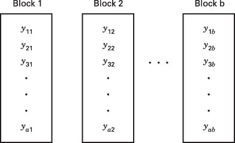
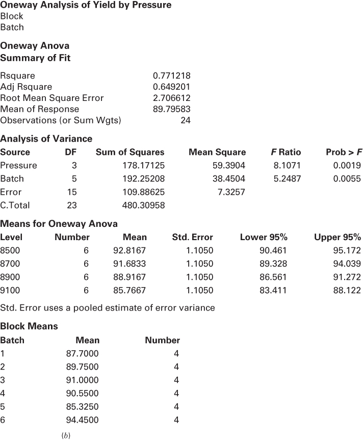
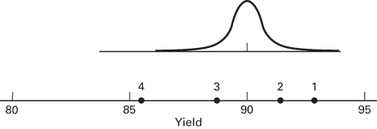
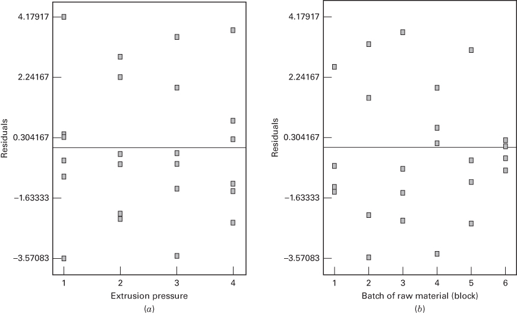

# 4.1 随机完全区组设计

在任何试验中，来自干扰因子的变异都可能影响结果。一般我们把**干扰因子**（nuisance factor）定义为可能对响应有影响、但我们对其效应并不感兴趣的设计因子。有时干扰因子是未知且不可控的；也就是说，我们并不知道该因子的存在，它甚至可能在我们实施试验的过程中不断改变水平。**随机化**（randomization）就是用来防范这类"潜伏"干扰因子的设计技术。在另一些情形中，干扰因子已知但不可控。如果我们至少能观测到干扰因子在每次试验运行中所取的值，就可以在统计分析中通过**协方差分析**（analysis of covariance）对它加以补偿，这一技术我们将在第 15 章讨论。当干扰变异源已知且可控时，可以采用一种称为**区组化**（blocking）的设计技术，系统地消除它对处理之间统计比较的影响。区组化是一种极其重要的设计技术，在工业试验中被广泛使用，也是本章的主题。

为说明一般思想，重新考虑 2.5.1 节首次描述的硬度测试试验。现在假设我们希望确定四种不同的压头在硬度测试机上是否会给出不同的读数。这类试验可能是量具能力研究的一部分。该机器的工作方式是把压头压入金属试块，然后由所得压痕的深度确定试块的硬度。试验者决定对每种压头各取四个洛氏 C 标尺硬度观测值。这里只有一个因子——压头类型，而完全随机化单因子设计将把这 $4 \times 4 = 16$ 次运行随机分配到试验单元（即金属试块）上，并观测所得的硬度读数。因此，该试验需要 16 块不同的金属试块，设计中每次运行对应一块。

在这种设计情形下，完全随机化试验存在一个潜在的严重问题。如果各金属试块在硬度上略有差异（例如它们取自不同炉次生产的铸锭时就会如此），则试验单元（试块）会对硬度数据中观测到的变异有贡献。结果，试验误差将同时反映随机误差和试块间的变异。

我们希望使试验误差尽可能小；也就是说，我们希望从试验误差中剔除试块间的变异。能做到这一点的设计要求试验者在四块试块上各测试每种压头一次。这一设计（见表 4.1）称为**随机完全区组设计**（randomized complete block design，RCBD）。"完全"一词是指每个区组（试块）都包含全部处理（压头）。采用这一设计，区组（试块）构成了比较各压头时更为齐性的试验单元。实际上，这种设计策略通过消除试块间的变异，提高了各压头之间比较的精度。在一个区组内，四种压头的测试顺序是随机确定的。注意这一设计问题与 2.5.1 节配对 $t$ 检验的相似性。随机完全区组设计是那一概念的推广。

RCBD 是应用最广的试验设计之一，适合 RCBD 的场合非常多。试验设备或机器的各台单元在运行特性上常常不同，因而常被当作典型的区组因子。原材料批次、人员以及时间也是试验中常见的干扰变异源，它们都可以通过区组化得到系统的控制。[^1]

区组化在不涉及干扰因子的场合也可能有用。例如，假设一位化学工程师关心催化剂进料速率对聚合物黏度的影响。她知道在全尺寸过程中，原料来源、温度、操作人员以及原料纯度等若干因子很难控制。因此她决定在区组中检验催化剂进料速率这一因子，其中每个区组由这些不可控因子的某种组合构成。实际上，她是在用区组来检验其过程变量（进料速率）对她难以控制的条件的稳健性。关于这一点的更多讨论可参见 Coleman and Montgomery (1993)。

**表 4.1 硬度测试试验的随机完全区组设计**

| 试块 1 | 试块 2 | 试块 3 | 试块 4 |
| --- | --- | --- | --- |
| 压头 3 | 压头 3 | 压头 2 | 压头 1 |
| 压头 1 | 压头 4 | 压头 1 | 压头 4 |
| 压头 4 | 压头 2 | 压头 3 | 压头 2 |
| 压头 2 | 压头 1 | 压头 4 | 压头 3 |

## 4.1.1 RCBD 的统计分析

一般地，假设我们要比较 $a$ 个处理，并设有 $b$ 个区组。图 4.1 给出了随机完全区组设计。每个区组中的每个处理都有一个观测值，而每个区组内处理实施的顺序是随机确定的。由于处理的随机化只发生在区组**内部**，我们常常说区组构成了对随机化的一种限制。

RCBD 的统计模型可以写成几种形式。传统的模型是效应模型：

$$
y_{ij} = \mu + \tau_{i} + \beta_{j} + \varepsilon_{ij} \qquad \left\{ \begin{array}{l} i = 1, 2, \ldots, a \\ j = 1, 2, \ldots, b \end{array} \right. \tag{4.1}
$$

其中 $\mu$ 是总均值，$\tau_{i}$ 是第 $i$ 个处理的效应，$\beta_{j}$ 是第 $j$ 个区组的效应，$\varepsilon_{ij}$ 是通常的 $\mathrm{NID}(0,\sigma^{2})$ 随机误差项。我们先假定处理与区组都是固定因子。随机区组这一非常重要情形将在 4.1.3 节讨论。正如第 3 章的单因子试验设计模型一样，RCBD 的效应模型是**过度参数化**的模型。因此，我们通常把处理效应与区组效应视为对总均值的偏离，于是有

$$
\sum_{i=1}^{a} \tau_{i} = 0 \quad \text{和} \quad \sum_{j=1}^{b} \beta_{j} = 0
$$

RCBD 也可以使用均值模型，例如

$$
y_{ij} = \mu_{ij} + \varepsilon_{ij} \quad \left\{ \begin{array}{l} i = 1, 2, \dots, a \\ j = 1, 2, \dots, b \end{array} \right.
$$

其中 $\mu_{ij} = \mu + \tau_{i} + \beta_{j}$。不过，本章将一直使用式 4.1 的效应模型。

在涉及 RCBD 的试验中，我们关心的是检验各处理均值是否相等。因此，感兴趣的假设是

$$
\begin{array}{l} H_{0}: \mu_{1} = \mu_{2} = \dots = \mu_{a} \\ H_{1}: \text{至少有一个} \mu_{i} \neq \mu_{j} \end{array}
$$

由于第 $i$ 个处理均值 $\mu_{i} = (1/b)\sum_{j=1}^{b}(\mu + \tau_{i} + \beta_{j}) = \mu + \tau_{i}$，上述假设也可以用处理效应等价地写出，即

$$
\begin{array}{l} H_{0}: \tau_{1} = \tau_{2} = \dots = \tau_{a} = 0 \\ H_{1}: \text{至少有一个} i \text{使} \tau_{i} \neq 0 \end{array}
$$

**图 4.1 随机完全区组设计**

| 区组 1 | 区组 2 | $\cdots$ | 区组 $b$ |
| --- | --- | --- | --- |
| $y_{11}$ | $y_{12}$ | $\cdots$ | $y_{1b}$ |
| $y_{21}$ | $y_{22}$ | $\cdots$ | $y_{2b}$ |
| $y_{31}$ | $y_{32}$ | $\cdots$ | $y_{3b}$ |
| $\vdots$ | $\vdots$ | | $\vdots$ |
| $y_{a1}$ | $y_{a2}$ | $\cdots$ | $y_{ab}$ |

方差分析可以很容易地推广到 RCBD。设 $y_{i.}$ 为处理 $i$ 下所有观测值之和，$y_{.j}$ 为区组 $j$ 中所有观测值之和，$y_{..}$ 为所有观测值的总和，$N = ab$ 为观测值总数。用数学式子表示即

$$
y_{i.} = \sum_{j=1}^{b} y_{ij} \quad i = 1, 2, \dots, a \tag{4.2}
$$

$$
y_{.j} = \sum_{i=1}^{a} y_{ij} \quad j = 1, 2, \dots, b \tag{4.3}
$$

以及

$$
y_{..} = \sum_{i=1}^{a} \sum_{j=1}^{b} y_{ij} = \sum_{i=1}^{a} y_{i.} = \sum_{j=1}^{b} y_{.j} \tag{4.4}
$$

类似地，$\overline{y}_{i.}$ 是处理 $i$ 下观测值的平均，$\overline{y}_{.j}$ 是区组 $j$ 中观测值的平均，$\overline{y}_{..}$ 是所有观测值的总平均。即

$$
\overline{y}_{i.} = y_{i.}/b \quad \overline{y}_{.j} = y_{.j}/a \quad \overline{y}_{..} = y_{..}/N \tag{4.5}
$$

总校正平方和可以表示为

$$
\sum_{i=1}^{a} \sum_{j=1}^{b} (y_{ij} - \overline{y}_{..})^{2} = \sum_{i=1}^{a} \sum_{j=1}^{b} \left[ (\overline{y}_{i.} - \overline{y}_{..}) + (\overline{y}_{.j} - \overline{y}_{..}) + (y_{ij} - \overline{y}_{i.} - \overline{y}_{.j} + \overline{y}_{..}) \right]^{2} \tag{4.6}
$$

把式 4.6 的右端展开，得到

$$
\begin{array}{l} \sum_{i=1}^{a} \sum_{j=1}^{b} (y_{ij} - \overline{y}_{..})^{2} = b \sum_{i=1}^{a} (\overline{y}_{i.} - \overline{y}_{..})^{2} + a \sum_{j=1}^{b} (\overline{y}_{.j} - \overline{y}_{..})^{2} \\ \qquad + \sum_{i=1}^{a} \sum_{j=1}^{b} (y_{ij} - \overline{y}_{i.} - \overline{y}_{.j} + \overline{y}_{..})^{2} + 2 \sum_{i=1}^{a} \sum_{j=1}^{b} (\overline{y}_{i.} - \overline{y}_{..})(\overline{y}_{.j} - \overline{y}_{..}) \\ \qquad + 2 \sum_{i=1}^{a} \sum_{j=1}^{b} (\overline{y}_{.j} - \overline{y}_{..})(y_{ij} - \overline{y}_{i.} - \overline{y}_{.j} + \overline{y}_{..}) \\ \qquad + 2 \sum_{i=1}^{a} \sum_{j=1}^{b} (\overline{y}_{i.} - \overline{y}_{..})(y_{ij} - \overline{y}_{i.} - \overline{y}_{.j} + \overline{y}_{..}) \end{array}
$$

经过简单但繁琐的代数运算可以证明三个交叉乘积项都为零。因此，

$$
\begin{array}{r l} \sum_{i=1}^{a} \sum_{j=1}^{b} (y_{ij} - \overline{y}_{..})^{2} & = b \sum_{i=1}^{a} (\overline{y}_{i.} - \overline{y}_{..})^{2} + a \sum_{j=1}^{b} (\overline{y}_{.j} - \overline{y}_{..})^{2} \\ & \quad + \sum_{i=1}^{a} \sum_{j=1}^{b} (y_{ij} - \overline{y}_{.j} - \overline{y}_{i.} + \overline{y}_{..})^{2} \end{array} \tag{4.7}
$$

这给出了总平方和的一个分解。这是 RCBD 的基本方差分析等式。把式 4.7 中的各平方和用符号表示，有

$$
SS_{T} = SS_{\text{处理}} + SS_{\text{区组}} + SS_{E} \tag{4.8}
$$

因为有 $N$ 个观测值，$SS_{T}$ 有 $N-1$ 个自由度。有 $a$ 个处理和 $b$ 个区组，因此 $SS_{\text{处理}}$ 与 $SS_{\text{区组}}$ 分别有 $a-1$ 和 $b-1$ 个自由度。误差平方和就是单元间平方和减去处理平方和与区组平方和。共有 $ab$ 个单元，它们之间有 $ab-1$ 个自由度，所以 $SS_{E}$ 有 $ab-1-(a-1)-(b-1)=(a-1)(b-1)$ 个自由度。此外，式 4.8 右端的自由度之和等于左端的总自由度；因此，在误差服从通常的正态性假定下，可以用定理 3-1 证明 $SS_{\text{处理}}/\sigma^{2}$、$SS_{\text{区组}}/\sigma^{2}$ 与 $SS_{E}/\sigma^{2}$ 是相互独立的卡方随机变量。每个平方和除以它的自由度称为均方。若处理与区组都是固定的，可以证明各均方的期望为

$$
\begin{array}{c} E(MS_{\text{处理}}) = \sigma^{2} + \frac{b \sum_{i=1}^{a} \tau_{i}^{2}}{a-1} \\ E(MS_{\text{区组}}) = \sigma^{2} + \frac{a \sum_{j=1}^{b} \beta_{j}^{2}}{b-1} \\ E(MS_{E}) = \sigma^{2} \end{array}
$$

因此，为检验处理均值是否相等，我们使用检验统计量

$$
F_{0} = \frac{MS_{\text{处理}}}{MS_{E}}
$$

若原假设为真，它服从 $F_{a-1,(a-1)(b-1)}$ 分布。临界区为 $F$ 分布的上尾，当 $F_{0} > F_{\alpha,a-1,(a-1)(b-1)}$ 时拒绝 $H_{0}$。也可以使用 $P$ 值方法。

我们可能还想比较区组均值，因为如果这些均值差别不大，那么将来的试验中也许无需区组化。由期望均方来看，假设 $H_{0}:\beta_{j}=0$ 似乎可以通过把统计量 $F_{0}=MS_{\text{区组}}/MS_{E}$ 与 $F_{\alpha,b-1,(a-1)(b-1)}$ 比较来检验。但要记住，随机化只施加于区组内部的处理；也就是说，区组构成了对随机化的一种限制。这对统计量 $F_{0}=MS_{\text{区组}}/MS_{E}$ 有什么影响呢？对这个问题存在一些不同的处理意见。例如，Box, Hunter 和 Hunter (2005) 指出，通常的方差分析 $F$ 检验仅基于随机化即可得到论证，$^{2}$ 无需直接使用正态性假定。他们还指出，由于随机化的限制，用于比较区组均值的检验无法诉诸这样的论证；但如果误差是 $\mathrm{NID}(0,\sigma^{2})$，则统计量 $F_{0}=MS_{\text{区组}}/MS_{E}$ 可以用来比较区组均值。另一方面，Anderson 和 McLean (1974) 则认为，随机化的限制使该统计量不能成为比较区组均值的有意义的检验，这一 $F$ 比实际上检验的是区组均值相等再加上随机化限制（他们称之为**限制误差**，restriction error；详见 Anderson and McLean (1974)）。

那么在实践中我们该怎么做呢？由于正态性假定常常值得怀疑，把 $F_{0}=MS_{\text{区组}}/MS_{E}$ 看成关于区组均值相等的精确 $F$ 检验并不是一种好的通行做法。因此，我们把这一 $F$ 检验从方差分析表中排除。不过，作为考察区组变量效应的近似手段，查看 $MS_{\text{区组}}$ 与 $MS_{E}$ 之比当然还是合理的。如果这个比值很大，就说明区组因子的效应很大，且通过区组化得到的噪声削减很可能有助于提高处理均值比较的精度。

这一过程通常汇总在一张方差分析表中，如表 4.2 所示。计算一般由统计软件包完成。不过，把式 4.7 中各元素的平方和计算公式直接由恒等式

$$
y_{ij} - \overline{y}_{..} = (\overline{y}_{i.} - \overline{y}_{..}) + (\overline{y}_{.j} - \overline{y}_{..}) + (y_{ij} - \overline{y}_{i.} - \overline{y}_{.j} + \overline{y}_{..})
$$

出发也可以得到。

**表 4.2 随机完全区组设计的方差分析**

| 变异来源 | 平方和 | 自由度 | 均方 | $F_{0}$ |
| --- | --- | --- | --- | --- |
| 处理 | $SS_{\text{处理}}$ | $a-1$ | $\frac{SS_{\text{处理}}}{a-1}$ | $\frac{MS_{\text{处理}}}{MS_{E}}$ |
| 区组 | $SS_{\text{区组}}$ | $b-1$ | $\frac{SS_{\text{区组}}}{b-1}$ | |
| 误差 | $SS_{E}$ | $(a-1)(b-1)$ | $\frac{SS_{E}}{(a-1)(b-1)}$ | |
| 总计 | $SS_{T}$ | $N-1$ | | |

这些量可以在电子表格（Excel）的列中计算：把每一列平方后求和即可得到平方和。另外，计算式也可以用处理总和与区组总和表示。这些公式是

$$
SS_{T} = \sum_{i=1}^{a} \sum_{j=1}^{b} y_{ij}^{2} - \frac{y_{..}^{2}}{N} \tag{4.9}
$$

$$
SS_{\text{处理}} = \frac{1}{b} \sum_{i=1}^{a} y_{i.}^{2} - \frac{y_{..}^{2}}{N} \tag{4.10}
$$

$$
SS_{\text{区组}} = \frac{1}{a} \sum_{j=1}^{b} y_{.j}^{2} - \frac{y_{..}^{2}}{N} \tag{4.11}
$$

而误差平方和由相减得到

$$
SS_{E} = SS_{T} - SS_{\text{处理}} - SS_{\text{区组}} \tag{4.12}
$$

## 例 4.1

一家医疗器械制造商生产血管移植物（人造血管）。这些移植物是把聚四氟乙烯（polytetrafluoroethylene，PTFE）树脂坯料与一种润滑剂混合后挤压成管状而制成的。在一批产品的管子中，常常有些管子的外表面含有小的硬突起。这些缺陷称为 "flicks"（小疵点）。存在这种缺陷的单元要报废。

负责血管移植物产品的开发人员怀疑挤压压力影响小疵点的产生，因此打算进行一次试验来考察这一假设。然而，树脂由外部供应商制造，并以批次形式交付给该医疗器械制造商。这位工程师还怀疑批次间可能存在显著变异，因为尽管材料在分子量、平均粒径、保留率以及峰高比等参数上应当一致，但由于树脂供应商的制造变异和材料本身的自然变异，实际可能并不一致。因此，这位开发人员决定采用以树脂批次为区组的随机完全区组设计，研究四个不同挤压压力水平对小疵点的影响。该 RCBD 如表 4.3 所示。注意挤压压力（处理）有四个水平，树脂有六个批次（区组）。记住每个区组内挤压压力的测试顺序是随机的。响应变量是合格率，即该批产品中不含任何小疵点的管子所占的百分比。

**表 4.3 血管移植物试验的随机完全区组设计**

| 挤压压力 (PSI) | 批次 1 | 批次 2 | 批次 3 | 批次 4 | 批次 5 | 批次 6 | 处理总和 |
| --- | --- | --- | --- | --- | --- | --- | --- |
| 8500 | 90.3 | 89.2 | 98.2 | 93.9 | 87.4 | 97.9 | 556.9 |
| 8700 | 92.5 | 89.5 | 90.6 | 94.7 | 87.0 | 95.8 | 550.1 |
| 8900 | 85.5 | 90.8 | 89.6 | 86.2 | 88.0 | 93.4 | 533.5 |
| 9100 | 82.5 | 89.5 | 85.6 | 87.4 | 78.9 | 90.7 | 514.6 |
| 区组总和 | 350.8 | 359.0 | 364.0 | 362.2 | 341.3 | 377.8 | $y_{..} = 2155.1$ |

为进行方差分析，需要下面的平方和：

$$
\begin{array}{r l} SS_{T} & = \sum_{i=1}^{4} \sum_{j=1}^{6} y_{ij}^{2} - \frac{y_{..}^{2}}{N} \\ & = 193{,}999.31 - \frac{(2155.1)^{2}}{24} = 480.31 \\ SS_{\text{处理}} & = \frac{1}{b} \sum_{i=1}^{4} y_{i.}^{2} - \frac{y_{..}^{2}}{N} \\ & = \frac{1}{6} \left[ (556.9)^{2} + (550.1)^{2} + (533.5)^{2} + (514.6)^{2} \right] - \frac{(2155.1)^{2}}{24} = 178.17 \end{array}
$$

$$
\begin{array}{r l} SS_{\text{区组}} & = \frac{1}{a} \sum_{j=1}^{6} y_{.j}^{2} - \frac{y_{..}^{2}}{N} \\ & = \frac{1}{4} \left[ (350.8)^{2} + (359.0)^{2} + \dots + (377.8)^{2} \right] - \frac{(2155.1)^{2}}{24} = 192.25 \\ SS_{E} & = SS_{T} - SS_{\text{处理}} - SS_{\text{区组}} \\ & = 480.31 - 178.17 - 192.25 = 109.89 \end{array}
$$

方差分析见表 4.4。取 $\alpha = 0.05$，$F$ 的临界值为 $F_{0.05,3,15} = 3.29$。因为 $8.11 > 3.29$，我们得出结论：挤压压力影响平均合格率。该检验的 $P$ 值也相当小。此外，树脂批次（区组）之间似乎存在显著差异，因为区组的均方相对误差较大。

**表 4.4 血管移植物试验的方差分析**

| 变异来源 | 平方和 | 自由度 | 均方 | $F_{0}$ | $P$ 值 |
| --- | --- | --- | --- | --- | --- |
| 处理（挤压压力） | 178.17 | 3 | 59.39 | 8.11 | 0.0019 |
| 区组（批次） | 192.25 | 5 | 38.45 | | |
| 误差 | 109.89 | 15 | 7.33 | | |
| 总计 | 480.31 | 23 | | | |

**表 4.5 把血管移植物试验误按完全随机化设计分析的结果**

| 变异来源 | 平方和 | 自由度 | 均方 | $F_{0}$ | $P$ 值 |
| --- | --- | --- | --- | --- | --- |
| 挤压压力 | 178.17 | 3 | 59.39 | 3.95 | 0.0235 |
| 误差 | 302.14 | 20 | 15.11 | | |
| 总计 | 480.31 | 23 | | | |

值得注意的是，如果我们当时并不知道随机区组设计，从这一试验中会得到什么结果。假设该试验是按完全随机化设计实施的，并且（纯属偶然）得到与表 4.3 相同的设计。把这些数据误按完全随机化单因子设计分析的结果如表 4.5 所示。

因为 $P$ 值小于 0.05，我们仍会拒绝原假设，并得出结论：挤压压力显著影响平均合格率。然而要注意，误差的均方增大了一倍多，从 RCBD 中的 7.33 增至 15.11。所有来自区组的变异现在都包含在误差项中了。这就很容易看出为什么我们有时把 RCBD 称为一种**降低噪声**（noise-reducing）的设计技术；它有效地提高了数据中的信噪比，或者提高了处理均值之间比较的精度。这个例子还说明了一个要点：如果试验者在本该使用区组时没有使用区组，其后果可能是放大试验误差，而且误差可能被放大到无法识别处理均值之间重要差异的程度。

**计算机输出示例。**由 Design-Expert 和 JMP 得到的例 4.1 血管移植物试验的计算机输出（经过压缩）见图 4.2。Design-Expert 输出见图 4.2a，JMP 输出见图 4.2b。两种输出非常相似，且与前面手算的结果一致。注意 JMP 计算了区组（批次）的 $F$ 统计量。输出中还给出了各处理的样本均值。8500 psi 时平均合格率为 $\overline{y}_{1.}=92.82$，8700 psi 时为 $\overline{y}_{2.}=91.68$，8900 psi 时为 $\overline{y}_{3.}=88.92$，9100 psi 时为 $\overline{y}_{4.}=85.77$。记住这些样本平均合格率是处理均值 $\mu_{1},\mu_{2},\mu_{3}$ 和 $\mu_{4}$ 的估计。模型残差列在 Design-Expert 输出的底部。残差按下式计算：

$$
e_{ij} = y_{ij} - \hat{y}_{ij}
$$

而正如我们后面要说明的，拟合值为 $\hat{y}_{ij} = \overline{y}_{i.} + \overline{y}_{.j} - \overline{y}_{..}$，所以

$$
e_{ij} = y_{ij} - \overline{y}_{i.} - \overline{y}_{.j} + \overline{y}_{..} \tag{4.13}
$$

下一节我们将说明残差如何用于模型适合性检验。

**多重比较。**如果 RCBD 中的处理是固定的，且分析表明处理均值之间存在显著差异，试验者通常希望进行多重比较以找出哪些处理均值不同。3.5 节讨论的任何多重比较方法都可以用于此目的。在 3.5 节的公式中，只需把单因子完全随机化设计中的重复次数（$n$）换成区组数（$b$）。另外要记住，使用随机区组设计的误差自由度 $[(a-1)(b-1)]$，而不是完全随机化设计的误差自由度 $[a(n-1)]$。

图 4.2 中的 Design-Expert 输出演示了 Fisher LSD 方法。注意我们会得出 $\mu_{1} = \mu_{2}$ 的结论，因为 $P$ 值很大。此外，$\mu_{1}$ 与所有其他均值都不同。$H_{0}: \mu_{2} = \mu_{3}$ 的 $P$ 值为 0.097，因此有一定证据表明 $\mu_{2} \neq \mu_{3}$；又因为 $P$ 值为 0.0018，有 $\mu_{2} \neq \mu_{4}$。总起来说，我们会得出结论：较低的挤压压力（8500 psi 与 8700 psi）导致的缺陷较少。

我们也可以用 3.5.1 节的图形方法比较四个挤压压力下的平均合格率。图 4.3 把例 4.1 的四个均值画在按比例伸缩的 $t$ 分布上，伸缩因子为 $\sqrt{MS_{E}/b} = \sqrt{7.33/6} = 1.10$。该图表明两个最低压力给出相同的平均合格率，但 8700 psi 与 8900 psi 的平均合格率（$\mu_{2}$ 与 $\mu_{3}$）也相近。最高压力（9100 psi）下的平均合格率远低于其他所有均值。该图有助于解释试验结果以及图 4.2 中 Design-Expert 输出里的 Fisher LSD 计算结果。

Response: Yield

ANOVA for Selected Factorial Model

Analysis of Variance Table [Partial Sum of Squares]

| Source | Sum of Squares | DF | Mean Square | F Value | Prob > F |
| --- | --- | --- | --- | --- | --- |
| Block | 192.25 | 5 | 38.45 | | |
| Model | 178.17 | 3 | 59.39 | 8.11 | 0.0019 |
| A | 178.17 | 3 | 59.39 | 8.11 | 0.0019 |
| Residual | 109.89 | 15 | 7.33 | | |
| Cor Total | 480.31 | 23 | | | |

| Std. Dev. | 2.71 | R-Squared | 0.6185 |
| --- | --- | --- | --- |
| Mean | 89.80 | Adj R-Squared | 0.5422 |
| C.V. | 3.01 | Pred R-Squared | 0.0234 |
| PRESS | 281.31 | Adeq Precision | 9.759 |

Treatment Means (Adjusted, If Necessary)

| | Estimated Mean | Standard Error |
| --- | --- | --- |
| 1-8500 | 92.82 | 1.10 |
| 2-8700 | 91.68 | 1.10 |
| 3-8900 | 88.92 | 1.10 |
| 4-9100 | 85.77 | 1.10 |

| Treatment | Mean Difference | DF | Standard Error | t for $H_{0}$ Coeff$=0$ | Prob > \|t\| |
| --- | --- | --- | --- | --- | --- |
| 1 vs. 2 | 1.13 | 1 | 1.56 | 0.73 | 0.4795 |
| 1 vs. 3 | 3.90 | 1 | 1.56 | 2.50 | 0.0247 |
| 1 vs. 4 | 7.05 | 1 | 1.56 | 4.51 | 0.0004 |
| 2 vs. 3 | 2.77 | 1 | 1.56 | 1.77 | 0.0970 |
| 2 vs. 4 | 5.92 | 1 | 1.56 | 3.79 | 0.0018 |
| 3 vs. 4 | 3.15 | 1 | 1.56 | 2.02 | 0.0621 |

Diagnostics Case Statistics

| Standard Order | Actual Value | Predicted Value | Residual | Leverage | Student Residual | Cook's Distance | Outlier t | Run Order |
| --- | --- | --- | --- | --- | --- | --- | --- | --- |
| 1 | 90.30 | 90.72 | -0.42 | 0.375 | -0.197 | 0.003 | -0.190 | 1 |
| 2 | 89.20 | 92.77 | -3.57 | 0.375 | -1.669 | 0.186 | -1.787 | 6 |
| 3 | 98.20 | 94.02 | 4.18 | 0.375 | 1.953 | 0.254 | 2.185 | 9 |
| 4 | 93.90 | 93.57 | 0.33 | 0.375 | 0.154 | 0.002 | 0.149 | 13 |
| 5 | 87.40 | 88.35 | -0.95 | 0.375 | -0.442 | 0.013 | -0.430 | 19 |
| 6 | 97.90 | 97.47 | 0.43 | 0.375 | 0.201 | 0.003 | 0.194 | 23 |
| 7 | 92.50 | 89.59 | 2.91 | 0.375 | 1.361 | 0.124 | 1.405 | 4 |
| 8 | 89.50 | 91.64 | -2.14 | 0.375 | -0.999 | 0.067 | -0.999 | 5 |
| 9 | 90.60 | 92.89 | -2.29 | 0.375 | -1.069 | 0.076 | -1.075 | 10 |
| 10 | 94.70 | 92.44 | 2.26 | 0.375 | 1.057 | 0.075 | 1.062 | 16 |
| 11 | 87.00 | 87.21 | -0.21 | 0.375 | -0.099 | 0.001 | -0.096 | 20 |
| 12 | 95.80 | 96.34 | -0.54 | 0.375 | -0.251 | 0.004 | -0.243 | 21 |
| 13 | 85.50 | 86.82 | -1.32 | 0.375 | -0.617 | 0.025 | -0.604 | 3 |
| 14 | 90.80 | 88.87 | 1.93 | 0.375 | 0.902 | 0.054 | 0.896 | 8 |
| 15 | 89.60 | 90.12 | -0.52 | 0.375 | -0.243 | 0.004 | -0.236 | 12 |
| 16 | 86.20 | 89.67 | -3.47 | 0.375 | -1.622 | 0.175 | -1.726 | 15 |
| 17 | 88.00 | 84.45 | 3.55 | 0.375 | 1.661 | 0.184 | 1.776 | 17 |
| 18 | 93.40 | 93.57 | -0.17 | 0.375 | -0.080 | 0.000 | -0.077 | 22 |
| 19 | 82.50 | 83.67 | -1.17 | 0.375 | -0.547 | 0.020 | -0.534 | 2 |
| 20 | 89.50 | 85.72 | 3.78 | 0.375 | 1.766 | 0.208 | 1.917 | 7 |
| 21 | 85.60 | 86.97 | -1.37 | 0.375 | -0.641 | 0.027 | -0.628 | 11 |
| 22 | 87.40 | 86.52 | 0.88 | 0.375 | 0.411 | 0.011 | 0.399 | 14 |
| 23 | 78.90 | 81.30 | -2.40 | 0.375 | -1.120 | 0.084 | -1.130 | 18 |
| 24 | 90.70 | 90.42 | 0.28 | 0.375 | 0.130 | 0.001 | 0.126 | 24 |

Note: Predicted values include block corrections.

(a)

**图 4.2 例 4.1 的计算机输出。(a) Design-Expert；(b) JMP**

Oneway Analysis of Yield by Pressure

Block

Oneway Anova

| Rsquare | 0.771218 |
| --- | --- |
| Adj Rsquare | 0.649201 |
| Root Mean Square Error | 2.706612 |
| Mean of Response | 89.79583 |
| Observations (or Sum Wgts) | 24 |

Analysis of Variance

| Source | DF | Sum of Squares | Mean Square | F Ratio | Prob > F |
| --- | --- | --- | --- | --- | --- |
| Pressure | 3 | 178.17125 | 59.3904 | 8.1071 | 0.0019 |
| Batch | 5 | 192.25208 | 38.4504 | 5.2487 | 0.0055 |
| Error | 15 | 109.88625 | 7.3257 | | |
| C.Total | 23 | 480.30958 | | | |

Means for Oneway Anova

| Level | Number | Mean | Std. Error | Lower 95% | Upper 95% |
| --- | --- | --- | --- | --- | --- |
| 8500 | 6 | 92.8167 | 1.1050 | 90.461 | 95.172 |
| 8700 | 6 | 91.6833 | 1.1050 | 89.328 | 94.039 |
| 8900 | 6 | 88.9167 | 1.1050 | 86.561 | 91.272 |
| 9100 | 6 | 85.7667 | 1.1050 | 83.411 | 88.122 |

Std. Error uses a pooled estimate of error variance

Block Means

| Batch | Mean | Number |
| --- | --- | --- |
| 1 | 87.7000 | 4 |
| 2 | 89.7500 | 4 |
| 3 | 91.0000 | 4 |
| 4 | 90.5500 | 4 |
| 5 | 85.3250 | 4 |
| 6 | 94.4500 | 4 |

**图 4.2（续）**

**图 4.3 四个挤压压力下的平均合格率相对于伸缩因子为 $\sqrt{MS_{E}/b} = \sqrt{7.33/6} = 1.10$ 的按比例伸缩 $t$ 分布**

## 4.1.2 模型适合性检验

前面我们讨论过检验所假定模型是否适合的重要性。一般地，我们应当警惕正态性假定、按处理或区组划分的误差方差不等以及区组-处理交互作用这几方面可能存在的问题。与完全随机化设计一样，残差分析是这种诊断检验的主要工具。例 4.1 中随机区组设计的残差列在图 4.2 的 Design-Expert 输出底部。

这些残差的正态概率图见图 4.4。图中没有明显迹象表明数据非正态，也没有证据指向可能的离群值。图 4.5 是残差对拟合值 $\hat{y}_{ij}$ 的图。残差的大小与拟合值 $\hat{y}_{ij}$ 之间不应有任何关系。这幅图没有显示出什么特别值得注意的东西。图 4.6 分别给出了按处理（挤压压力）和按树脂批次（区组）的残差图。这些图可能提供很有价值的信息。如果某个处理的残差散布更大，可能说明该处理产生的响应读数比其他处理更不稳定。某个区组的残差散布更大则可能说明该区组不齐性。不过在本例中，图 4.6 没有显示方差按处理不等的迹象，但有迹象表明批 6 的合格率变异更小。然而由于其他所有残差图都令人满意，我们忽略这一点。

有时残差对 $\hat{y}_{ij}$ 的图呈曲线形状；例如可能倾向于在 $\hat{y}_{ij}$ 取值较低时出现负残差、在 $\hat{y}_{ij}$ 取中间值时出现正残差、在 $\hat{y}_{ij}$ 取值较高时又出现负残差。这种类型的图形提示区组与处理之间存在交互作用。如果出现这种图形，应当使用变换以设法消除或减弱交互作用。在 5.3.7 节，我们将描述一种可用于检测随机区组设计中是否存在交互作用的统计检验。

## 4.1.3 随机完全区组设计的其他一些方面

**随机区组模型的可加性。**我们用于随机区组设计的线性统计模型

$$
y_{ij} = \mu + \tau_{i} + \beta_{j} + \varepsilon_{ij}
$$

**图 4.4 例 4.1 残差的正态概率图**

**图 4.5 例 4.1 中残差对 $\hat{y}_{ij}$ 的图**

**图 4.6 例 4.1 中残差按挤压压力（处理）与按树脂批次（区组）的图**

是完全可加的。这就是说，例如，如果第一个处理使期望响应增加 5 个单位（$\tau_{1}=5$），且第一个区组使期望响应增加 2 个单位（$\beta_{1}=2$），那么处理 1 与区组 1 共同作用时期望响应的增加量为 $E(y_{11})=\mu+\tau_{1}+\beta_{1}=\mu+5+2=\mu+7$。一般地，处理 1 总是使期望响应比总均值与区组效应之和增加 5 个单位。

虽然这种简单的可加模型常常很有用，但在某些情形下并不充分。例如，假设我们用六批原材料比较某种化学产品的四种配方，其中原材料批次视为区组。如果批 2 中的杂质对配方 2 有不利影响，导致其产率异常低，而对其他配方没有影响，那么就出现了配方（处理）与批次（区组）之间的交互作用。同样，当响应是在错误的尺度上测量时，也会出现处理与区组之间的交互作用。因此，在原始单位下为乘性的关系，例如

$$
E(y_{ij}) = \mu \tau_{i} \beta_{j}
$$

在对数尺度下是线性的或可加的，因为例如

$$
\ln E(y_{ij}) = \ln \mu + \ln \tau_{i} + \ln \beta_{j}
$$

或

$$
E(y_{ij}^{*}) = \mu^{*} + \tau_{i}^{*} + \beta_{j}^{*}
$$

虽然这类交互作用可以通过变换消除，但并非所有交互作用都这样容易处理。例如，变换并不能消除前面讨论过的配方-批次交互作用。残差分析和其他诊断检验方法有助于检测非可加性。

如果存在交互作用，它会严重影响方差分析，甚至可能使其失效。一般地，交互作用的存在会放大误差均方，并可能对处理均值的比较产生不利影响。在两个因子及其可能的交互作用都令人感兴趣的情形下，必须使用因子设计。这些设计将在第 5 章至第 9 章充分讨论。

**随机处理与随机区组。**到目前为止，我们对随机完全区组设计的论述集中于处理与区组都被视为固定因子的情形。在许多情形中，处理或区组（或两者）是随机因子。区组为随机因子的情形非常常见。这通常正是试验者所希望的，因为我们希望由试验得到的结论对抽取试验所用区组的那个区组总体都成立。首先考虑处理固定、区组随机的情形。式 4.1 仍是合适的统计模型，但现在区组效应是随机的，即假定 $\beta_{j},\ j = 1, 2, \ldots, b$ 是 $\mathrm{NID}(0, \sigma_{\beta}^{2})$ 随机变量。这是**混合模型**的一个特例（因为它同时包含固定因子和随机因子）。第 13、14 章将更详细地讨论混合模型，并给出若干出现混合模型的例子。这里的讨论仅限于 RCBD。

假定式 4.1 的 RCBD 模型是恰当的，若区组随机而处理固定，可以证明

$$
\begin{array}{r c l} E(y_{ij}) & = & \mu + \tau_{i}, \quad i = 1, 2, \ldots, a \\ V(y_{ij}) & = & \sigma_{\beta}^{2} + \sigma^{2} \\ Cov(y_{ij}, y_{i'j'}) & = & 0, \quad j \neq j' \\ Cov(y_{ij}, y_{i'j}) & = & \sigma_{\beta}^{2}, \quad i \neq i' \end{array} \tag{4.14}
$$

因此观测值的方差是常数，不同区组中任意两个观测值之间的协方差为零，但同一区组中两个观测值之间的协方差为 $\sigma_{\beta}^{2}$。按通常方式把总平方和分解所得的期望均方为

$$
\begin{array}{r} E(MS_{\text{处理}}) = \sigma^{2} + \frac{b \sum_{i=1}^{a} \tau_{i}^{2}}{a-1} \\ E(MS_{\text{区组}}) = \sigma^{2} + a \sigma_{\beta}^{2} \\ E(MS_{E}) = \sigma^{2} \end{array} \tag{4.15}
$$

检验无处理效应这一原假设（所有 $\tau_{i}=0$）的适当统计量为

$$
F_{0} = \frac{MS_{\text{处理}}}{MS_{E}}
$$

它与区组固定时所用的检验统计量完全相同。由期望均方可以得到区组方差分量的方差分析型估计：

$$
\hat{\sigma}_{\beta}^{2} = \frac{MS_{\text{区组}} - MS_{E}}{a} \tag{4.16}
$$

例如，对例 4.1 的血管移植物试验，$\sigma_{\beta}^{2}$ 的估计为

$$
\hat{\sigma}_{\beta}^{2} = \frac{MS_{\text{区组}} - MS_{E}}{a} = \frac{38.45 - 7.33}{4} = 7.78
$$

这是矩估计，没有简单的方法求区组方差分量 $\sigma_{\beta}^{2}$ 的置信区间。这里更可取的是 REML 方法。表 4.6 是假定区组随机时例 4.1 的 JMP 输出。$\sigma_{\beta}^{2}$ 的 REML 估计与方差分析估计完全相同，但 REML 会自动给出估计的标准误（6.116215）和近似的 95% 置信区间。JMP 给出了固定效应（压力）的检验，结果与例 4.1 中最初报告的结果一致。REML 还给出误差方差 $\sigma^{2}$ 的点估计和置信区间。构造置信区间如此方便，是 REML 被广泛采用的一个主要原因。

**表 4.6 假定区组随机时例 4.1 的 JMP 输出**

Response Y

Summary of Fit

| RSquare | | | 0.756688 | | | |
| --- | --- | --- | --- | --- | --- | --- |
| RSquare Adj | | | 0.720192 | | | |
| Root Mean Square Error | | | 2.706612 | | | |
| Mean of Response | | | 89.79583 | | | |
| Observations (or Sum Wgts) | | | 24 | | | |

REML Variance Component Estimates

| Random Effect | Var Ratio | Var Component | Std Error | 95% Lower | 95% Upper | Pct of Total |
| --- | --- | --- | --- | --- | --- | --- |
| Block | 1.0621666 | 7.7811667 | 6.116215 | -4.206394 | 19.768728 | 51.507 |
| Residual | | 7.32575 | 2.6749857 | 3.9975509 | 17.547721 | 48.493 |
| Total | | 15.106917 | | | | 100.000 |

Covariance Matrix of Variance Component Estimates

| Random Effect | | Block | Residual | | | |
| --- | --- | --- | --- | --- | --- | --- |
| Block | | 37.408085 | -1.788887 | | | |
| Residual | | -1.788887 | 7.1555484 | | | |

Fixed Effect Tests

| Source | | Nparm | DF | DFDen | F Ratio | Prob > F |
| --- | --- | --- | --- | --- | --- | --- |
| Pressure | | 3 | 3 | 15 | 8.1071 | 0.0019* |

\* 在 0.01 水平上显著。

现在考虑处理与区组之间存在交互作用的情形。这可以通过在原统计模型式 4.1 中加入一个交互项来刻画。设 $(\tau\beta)_{ij}$ 是处理 $i$ 在区组 $j$ 中的交互效应，则模型为

$$
y_{ij} = \mu + \tau_{i} + \beta_{j} + (\tau\beta)_{ij} + \varepsilon_{ij} \quad \left\{ \begin{array}{l} i = 1, 2, \ldots, a \\ j = 1, 2, \ldots, b \end{array} \right. \tag{4.17}
$$

由于交互效应涉及随机的区组效应，故假定它是随机的。若 $\sigma_{\tau\beta}^{2}$ 是区组-处理交互作用的方差分量，则可以证明期望均方为

$$
\begin{array}{r} E(MS_{\text{处理}}) = \sigma^{2} + \sigma_{\tau\beta}^{2} + \frac{b \sum_{i=1}^{a} \tau_{i}^{2}}{a-1} \\ E(MS_{\text{区组}}) = \sigma^{2} + a \sigma_{\beta}^{2} \\ E(MS_{E}) = \sigma^{2} + \sigma_{\tau\beta}^{2} \end{array} \tag{4.18}
$$

由期望均方可以看到，通常的 $F$ 统计量 $F = MS_{\text{处理}}/MS_{E}$ 仍可用于检验无处理效应。因此随机区组模型的另一个优点是：RCBD 中无交互作用的假定并不重要。然而，如果区组固定且存在交互作用，那么交互效应不出现在处理的期望均方中，却出现在误差的期望均方中，于是就不再存在检验处理效应的统计检验了。

**缺失值的估计。**使用 RCBD 时，有时某个区组中会有一个观测值缺失。这可能是由于粗心或差错，也可能是由于我们无法控制的原因，例如试验单元不可避免的损坏。缺失观测值会给分析带来新问题，因为处理与区组不再正交；也就是说，并非每个处理都出现在每个区组中。缺失值问题有两类一般处理办法。第一类是近似分析：先估计缺失的观测值，然后像这些估计值就是真实数据一样进行通常的方差分析，并把误差自由度减 1。本节讨论的就是这种近似分析。第二类是精确分析，将在 4.1.4 节讨论。

假设处理 $i$ 在区组 $j$ 中的观测值 $y_{ij}$ 缺失，记缺失观测值为 $x$。作为例示，假设例 4.1 的血管移植物试验中，在第四批材料上进行 8700 psi 运行时挤压机出了问题，无法得到观测值 $y_{24}$。数据可能如表 4.7 所示。

一般地，我们用 $y_{i.}^{\prime}$ 表示有一个缺失观测值时该处理的总和，用 $y_{.j}^{\prime}$ 表示有一个缺失观测值时该区组的总和，$y_{..}^{\prime}$ 表示有一个缺失观测值时的总和。假设我们希望估计缺失观测值 $x$，使 $x$ 对误差平方和的贡献最小。因为 $SS_{E} = \sum_{i=1}^{a} \sum_{j=1}^{b} (y_{ij} - \overline{y}_{i.} - \overline{y}_{.j} + \overline{y}_{..})^{2}$，这等价于选择 $x$ 使

$$
SS_{E} = \sum_{i=1}^{a} \sum_{j=1}^{b} y_{ij}^{2} - \frac{1}{b} \sum_{i=1}^{a} \left(\sum_{j=1}^{b} y_{ij}\right)^{2} - \frac{1}{a} \sum_{j=1}^{b} \left(\sum_{i=1}^{a} y_{ij}\right)^{2} + \frac{1}{ab} \left(\sum_{i=1}^{a} \sum_{j=1}^{b} y_{ij}\right)^{2}
$$

最小，或写为

$$
SS_{E} = x^{2} - \frac{1}{b}(y_{i.}^{\prime} + x)^{2} - \frac{1}{a}(y_{.j}^{\prime} + x)^{2} + \frac{1}{ab}(y_{..}^{\prime} + x)^{2} + R \tag{4.19}
$$

其中 $R$ 包含所有不涉及 $x$ 的项。由 $dSS_{E}/dx = 0$ 得到缺失观测值的估计

$$
x = \frac{a y_{i.}^{\prime} + b y_{.j}^{\prime} - y_{..}^{\prime}}{(a-1)(b-1)} \tag{4.20}
$$

对表 4.7 中的数据，我们有 $y_{2.}^{\prime} = 455.4$，$y_{.4}^{\prime} = 267.5$，以及 $y_{..}^{\prime} = 2060.4$。因此，根据式 4.20，[^3]

$$
x \equiv y_{24} = \frac{4(455.4) + 6(267.5) - 2060.4}{(3)(5)} = 91.08
$$

**表 4.7 血管移植物试验（含一个缺失值）的随机完全区组设计**

| 挤压压力 (PSI) | 批次 1 | 批次 2 | 批次 3 | 批次 4 | 批次 5 | 批次 6 | |
| --- | --- | --- | --- | --- | --- | --- | --- |
| 8500 | 90.3 | 89.2 | 98.2 | 93.9 | 87.4 | 97.9 | 556.9 |
| 8700 | 92.5 | 89.5 | 90.6 | $x$ | 87.0 | 95.8 | 455.4 |
| 8900 | 85.5 | 90.8 | 89.6 | 86.2 | 88.0 | 93.4 | 533.5 |
| 9100 | 82.5 | 89.5 | 85.6 | 87.4 | 78.9 | 90.7 | 514.6 |
| 区组总和 | 350.8 | 359.0 | 364.0 | 267.5 | 341.3 | 377.8 | $y_{..}^{\prime} = 2060.4$ |

**表 4.8 例 4.1（含一个缺失值）的近似方差分析**

| 变异来源 | 平方和 | 自由度 | 均方 | $F_{0}$ | $P$ 值 |
| --- | --- | --- | --- | --- | --- |
| 挤压压力 | 166.14 | 3 | 55.38 | 7.63 | 0.0029 |
| 原材料批次 | 189.52 | 5 | 37.90 | | |
| 误差 | 101.70 | 14 | 7.26 | | |
| 总计 | 457.36 | 23 | | | |

现在可以用 $y_{24} = 91.08$ 并令误差自由度减 1 来做通常的方差分析。方差分析见表 4.8。把这一近似分析的结果与完整数据集的结果（表 4.4）比较一下。

如果有若干个观测值缺失，可以把误差平方和写成缺失值的函数，对每个缺失值求导并令结果为零，再解所得的方程组来估计它们。或者，也可以用式 4.20 迭代地估计缺失值。为说明迭代方法，假设有两个值缺失。先任意估计第一个缺失值，然后用这个值连同真实数据和式 4.20 估计第二个缺失值。接着再用式 4.20 重新估计第一个缺失值，随后再重新估计第二个。如此继续直到收敛。在任何缺失值问题中，每有一个缺失观测值，误差自由度就减 1。

## 4.1.4 模型参数的估计与一般回归显著性检验

如果处理与区组都是固定的，我们可以用最小二乘估计 RCBD 模型中的参数。回忆线性统计模型为

$$
y_{ij} = \mu + \tau_{i} + \beta_{j} + \varepsilon_{ij} \quad \left\{ \begin{array}{l} i = 1, 2, \ldots, a \\ j = 1, 2, \ldots, b \end{array} \right. \tag{4.21}
$$

应用 3.10.2 节中直接写出试验设计模型正规方程的规则，[^2] 我们得到

$$
\begin{array}{cccccccccccccccccccc} \mu \colon & ab\hat{\mu} & + & b\hat{\tau}_{1} & + & b\hat{\tau}_{2} & + & \dots & + & b\hat{\tau}_{a} & + & a\hat{\beta}_{1} & + & a\hat{\beta}_{2} & + & \dots & + & a\hat{\beta}_{b} & = & y_{..} \\ \tau_{1} \colon & b\hat{\mu} & + & b\hat{\tau}_{1} & & & & & & & + & \hat{\beta}_{1} & + & \hat{\beta}_{2} & + & \dots & + & \hat{\beta}_{b} & = & y_{1.} \\ \tau_{2} \colon & b\hat{\mu} & & & & + & b\hat{\tau}_{2} & & & & + & \hat{\beta}_{1} & + & \hat{\beta}_{2} & + & \dots & + & \hat{\beta}_{b} & = & y_{2.} \\ \vdots & & & & & & & & & & & \vdots & & & & & & & \vdots \\ \tau_{a} \colon & b\hat{\mu} & & & & & & & & b\hat{\tau}_{a} & + & \hat{\beta}_{1} & + & \hat{\beta}_{2} & + & \dots & + & \hat{\beta}_{b} & = & y_{a.} \\ \beta_{1} \colon & a\hat{\mu} & + & \hat{\tau}_{1} & + & \hat{\tau}_{2} & + & \dots & + & \hat{\tau}_{a} & + & a\hat{\beta}_{1} \\ \beta_{2} \colon & a\hat{\mu} & + & \hat{\tau}_{1} & + & \hat{\tau}_{2} & + & \dots & + & \hat{\tau}_{a} \\ \vdots & & & & & & & & & & & \vdots \\ \beta_{b} \colon & a\hat{\mu} & + & \hat{\tau}_{1} & + & \hat{\tau}_{2} & + & \dots & + & \hat{\tau}_{a} \\ \end{array} \tag{4.22}
$$

注意式 4.22 中第 2 个到第 $(a+1)$ 个方程之和等于第一个正规方程，最后 $b$ 个方程之和也如此。因此正规方程中有两个线性相关关系，这意味着必须施加两个约束才能解出式 4.22。通常的约束是

$$
\sum_{i=1}^{a} \hat{\tau}_{i} = 0 \qquad \sum_{j=1}^{b} \hat{\beta}_{j} = 0 \tag{4.23}
$$

使用这些约束可以大大简化正规方程。事实上它们变为

$$
\begin{array}{c} ab\hat{\mu} = y_{..} \\ b\hat{\mu} + b\hat{\tau}_{i} = y_{i.} \quad i = 1, 2, \ldots, a \\ a\hat{\mu} + a\hat{\beta}_{j} = y_{.j} \quad j = 1, 2, \ldots, b \end{array} \tag{4.24}
$$

其解为

$$
\begin{array}{l} \hat{\mu} = \overline{y}_{..} \\ \hat{\tau}_{i} = \overline{y}_{i.} - \overline{y}_{..} \quad i = 1, 2, \ldots, a \\ \hat{\beta}_{j} = \overline{y}_{.j} - \overline{y}_{..} \quad j = 1, 2, \ldots, b \end{array} \tag{4.25}
$$

利用式 4.25 的正规方程解，可以求得 $y_{ij}$ 的估计值或拟合值：

$$
\begin{array}{r l} \hat{y}_{ij} & = \hat{\mu} + \hat{\tau}_{i} + \hat{\beta}_{j} \\ & = \overline{y}_{..} + (\overline{y}_{i.} - \overline{y}_{..}) + (\overline{y}_{.j} - \overline{y}_{..}) \\ & = \overline{y}_{i.} + \overline{y}_{.j} - \overline{y}_{..} \end{array}
$$

这一结果前面已在式 4.13 中用于计算随机区组设计的残差。

一般回归显著性检验可以用来导出随机完全区组设计的方差分析。利用式 4.25 给出的正规方程解，拟合满模型时平方和的缩减量为

$$
\begin{array}{l} R(\mu, \tau, \beta) = \hat{\mu} y_{..} + \sum_{i=1}^{a} \hat{\tau}_{i} y_{i.} + \sum_{j=1}^{b} \hat{\beta}_{j} y_{.j} \\ \qquad = \overline{y}_{..} y_{..} + \sum_{i=1}^{a} (\overline{y}_{i.} - \overline{y}_{..}) y_{i.} + \sum_{j=1}^{b} (\overline{y}_{.j} - \overline{y}_{..}) y_{.j} \\ \qquad = \frac{y_{..}^{2}}{ab} + \sum_{i=1}^{a} \overline{y}_{i.} y_{i.} - \frac{y_{..}^{2}}{ab} + \sum_{j=1}^{b} \overline{y}_{.j} y_{.j} - \frac{y_{..}^{2}}{ab} \\ \qquad = \sum_{i=1}^{a} \frac{y_{i.}^{2}}{b} + \sum_{j=1}^{b} \frac{y_{.j}^{2}}{a} - \frac{y_{..}^{2}}{ab} \end{array}
$$

其自由度为 $a + b - 1$，而误差平方和为

$$
\begin{array}{r l} SS_{E} & = \sum_{i=1}^{a} \sum_{j=1}^{b} y_{ij}^{2} - R(\mu, \tau, \beta) \\ & = \sum_{i=1}^{a} \sum_{j=1}^{b} y_{ij}^{2} - \sum_{i=1}^{a} \frac{y_{i.}^{2}}{b} - \sum_{j=1}^{b} \frac{y_{.j}^{2}}{a} + \frac{y_{..}^{2}}{ab} \\ & = \sum_{i=1}^{a} \sum_{j=1}^{b} (y_{ij} - \overline{y}_{i.} - \overline{y}_{.j} + \overline{y}_{..})^{2} \end{array}
$$

其自由度为 $(a-1)(b-1)$。把最后一个等式与式 4.7 中的 $SS_{E}$ 比较一下。

为检验假设 $H_{0}: \tau_{i} = 0$，缩减模型为

$$
y_{ij} = \mu + \beta_{j} + \varepsilon_{ij}
$$

它只是一个单因子方差分析。仿照式 3.5，拟合缩减模型时平方和的缩减量为

$$
R(\mu, \beta) = \sum_{j=1}^{b} \frac{y_{.j}^{2}}{a}
$$

其自由度为 $b$。因此在拟合 $\mu$ 和 $\{\beta_{j}\}$ 之后，$\{\tau_{i}\}$ 引起的平方和为

$$
\begin{array}{r l} R(\tau \mid \mu, \beta) & = R(\mu, \tau, \beta) - R(\mu, \beta) \\ & = R(\text{满模型}) - R(\text{缩减模型}) \\ & = \sum_{i=1}^{a} \frac{y_{i.}^{2}}{b} + \sum_{j=1}^{b} \frac{y_{.j}^{2}}{a} - \frac{y_{..}^{2}}{ab} - \sum_{j=1}^{b} \frac{y_{.j}^{2}}{a} \\ & = \sum_{i=1}^{a} \frac{y_{i.}^{2}}{b} - \frac{y_{..}^{2}}{ab} \end{array}
$$

我们看到它就是处理平方和，自由度为 $a-1$（式 4.10）。

区组平方和则由拟合缩减模型

$$
y_{ij} = \mu + \tau_{i} + \varepsilon_{ij}
$$

得到，它同样是一个单因子分析。仍仿照式 3.5，拟合该模型时平方和的缩减量为

$$
R(\mu, \tau) = \sum_{i=1}^{a} \frac{y_{i.}^{2}}{b}
$$

其自由度为 $a$。在拟合 $\mu$ 和 $\{\tau_{i}\}$ 之后，区组 $\{\beta_{j}\}$ 的平方和为

$$
\begin{array}{l} R(\beta \mid \mu, \tau) = R(\mu, \tau, \beta) - R(\mu, \tau) \\ \qquad = \sum_{i=1}^{a} \frac{y_{i.}^{2}}{b} + \sum_{j=1}^{b} \frac{y_{.j}^{2}}{a} - \frac{y_{..}^{2}}{ab} - \sum_{i=1}^{a} \frac{y_{i.}^{2}}{b} \\ \qquad = \sum_{j=1}^{b} \frac{y_{.j}^{2}}{a} - \frac{y_{..}^{2}}{ab} \end{array}
$$

其自由度为 $b-1$，这正是前面给出的式 4.11。

我们用一般回归显著性检验导出了随机完全区组设计中处理、区组和误差的平方和。虽然我们通常不会用一般回归显著性检验去实际分析随机完全区组的数据，但这一方法偶尔在更一般的随机区组设计（例如 4.4 节所讨论的那些）中是有用的。

**缺失值问题的精确分析。**4.1.3 节给出了处理 RCBD 中缺失观测值的一种近似方法。这种近似分析先估计缺失值使误差均方最小。可以证明，近似分析给出的处理均方是有偏的，即若原假设为真，$E(MS_{\text{处理}})$ 大于 $E(MS_{E})$。因此会报告过多的显著结果。

缺失值问题可以用一般回归显著性检验精确地分析。缺失值使设计变得不平衡，并且由于并非所有处理都出现在所有区组中，我们说处理与区组不正交。这种分析方法也用于更一般的随机区组设计类型，4.4 节将进一步讨论。许多计算机软件包都能进行这种分析。

[^1]: 区组化的一种特殊情形是：区组本身是诸如人这样的试验单元，而每个区组随时间推移依次接受各处理，或者处理效应是在不同时间测量的。这类设计称为**重复测量**（repeated measures）设计。它们将在第 15 章讨论。

[^2]: 原文此处写作"3.9.2 节"，但写出试验设计模型正规方程的规则在本版中是 3.10.2 节（3.9.2 节是随机模型的方差分析），故按 3.10.2 节译出。——译者注

[^3]: 原文此处写作"式 4.16"，但缺失值的估计公式是式 4.20（式 4.16 是区组方差分量的估计），故按式 4.20 译出。——译者注
