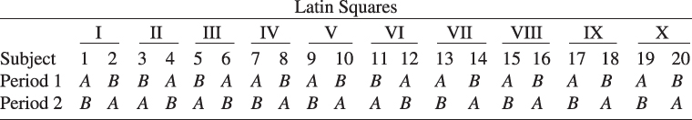

# 4.2 拉丁方设计

在 4.1 节中，我们把随机完全区组设计作为一种通过消除已知且可控干扰变量所引起的变异来减小试验残差误差的设计引入了进来。还有其他几类利用区组化原理的设计。例如，假设一位试验者正在研究用于空勤人员逃生系统的火箭推进剂的五种不同配方对观测到的燃烧速率的影响。每种配方由一批原材料混合而成，而每批原材料只够测试五种配方。此外，这些配方由几位操作人员配制，而操作人员的技能与经验可能存在很大差异。因此，设计中似乎需要"平均掉"两个干扰因子：原材料批次和操作人员。这一问题合适的设计要求每种配方在每批原材料中恰好测试一次，并且每种配方恰好由五位操作人员各配制一次。所得设计（见表 4.9）称为**拉丁方设计**（Latin square design）。注意该设计呈方形排列，五种配方（处理）用拉丁字母 A、B、C、D、E 表示，拉丁方因此得名。我们看到原材料批次（行）和操作人员（列）都与处理正交。[^1]

**表 4.9 火箭推进剂问题的拉丁方设计**

| 原材料批次 | 操作人员 1 | 操作人员 2 | 操作人员 3 | 操作人员 4 | 操作人员 5 |
| --- | --- | --- | --- | --- | --- |
| 1 | A = 24 | B = 20 | C = 19 | D = 24 | E = 24 |
| 2 | B = 17 | C = 24 | D = 30 | E = 27 | A = 36 |
| 3 | C = 18 | D = 38 | E = 26 | A = 27 | B = 21 |
| 4 | D = 26 | E = 31 | A = 26 | B = 23 | C = 22 |
| 5 | E = 22 | A = 30 | B = 20 | C = 29 | D = 31 |

拉丁方设计用于消除两个干扰变异源；也就是说，它系统地允许在两个方向上区组化。因此，行与列实际上代表对随机化的两种限制。一般地，$p$ 个因子的拉丁方（或 $p \times p$ 拉丁方）是含 $p$ 行 $p$ 列的方阵。所得 $p^{2}$ 个单元中各含有 $p$ 个字母之一，而每个字母在每行每列中都出现且只出现一次。拉丁方的几个例子如下：

| $4 \times 4$ | $5 \times 5$ | $6 \times 6$ |
| --- | --- | --- |
| ABDC | ADBEC | ADCEBF |
| BCAD | DACBE | BAECFD |
| CDBA | CBEDA | CEDFAB |
| DACB | BEACD | DCFBEA |
| | ECDAB | FBADCE |
| | | EFBADC |

拉丁方与一种起源于日本、称为数独（sudoku，日语意为"单独的数字"）的流行智力游戏密切相关。这种游戏通常由一个 $9 \times 9$ 的方格组成，其中还包含九个附加的 $3 \times 3$ 块。少数方格中已填有数字，其余为空。目标是把整数 1 到 9 填入空格，使每一行、每一列以及构成方格的九个 $3 \times 3$ 块中都恰好含有这九个整数各一次。标准 $9 \times 9$ 数独还要求每个 $3 \times 3$ 块也含有这九个整数，这一附加约束把可能的大量 $9 \times 9$ 拉丁方减少到较小的数目，但仍然相当大，约为 $6 \times 10^{21}$ 个。

视线索数目与方格大小不同，数独可能极难求解。求解 $n \times n$ 数独属于一类称为 NP 完全（NP-complete，NP 指非多项式计算时间）的计算问题。NP 完全问题是指：检验某个特定答案是否正确相对容易，但随着 $n$ 增大，任何简单算法都可能需要长得不可能的时间才能解出。

求解数独还等价于对一幅图进行"着色"——即按特定方式给点（顶点）和线（边）组成的阵列着色。此时图有 81 个顶点，方格的每个单元对应一个顶点。视题目而定，只有某些顶点对之间有线相连。在有些顶点已经被指定"颜色"（从九种数字可能中选取）的前提下，问题是要为其余顶点"着色"，使得由边相连的任意两个顶点颜色不同。

拉丁方的统计模型为

$$
y_{ijk} = \mu + \alpha_{i} + \tau_{j} + \beta_{k} + \varepsilon_{ijk} \quad \left\{ \begin{array}{l} i = 1, 2, \ldots, p \\ j = 1, 2, \ldots, p \\ k = 1, 2, \ldots, p \end{array} \right. \tag{4.26}
$$

其中 $y_{ijk}$ 是第 $i$ 行第 $k$ 列中第 $j$ 个处理的观测值，$\mu$ 是总均值，$\alpha_{i}$ 是第 $i$ 个行效应，$\tau_{j}$ 是第 $j$ 个处理效应，$\beta_{k}$ 是第 $k$ 个列效应，$\varepsilon_{ijk}$ 是随机误差。注意这是一个效应模型。该模型是完全可加的；也就是说，行、列与处理之间没有交互作用。由于每个单元中只有一个观测值，标识一个特定观测值只需三个下标 $i,j,k$ 中的两个。例如，参照表 4.9 中的火箭推进剂问题，若 $i=2$ 且 $k=3$，我们自动得到 $j=4$（配方 D）；而若 $i=1$ 且 $j=3$（配方 C），我们得到 $k=3$。这是每种处理在每行每列中都恰好出现一次的必然结果。[^2]

方差分析就是把 $N = p^{2}$ 个观测值的总平方和分解为行、列、处理与误差各成分，即

$$
SS_{T} = SS_{\text{行}} + SS_{\text{列}} + SS_{\text{处理}} + SS_{E} \tag{4.27}
$$

相应的自由度为

$$
p^{2} - 1 = p - 1 + p - 1 + p - 1 + (p-2)(p-1)
$$

在 $\varepsilon_{ijk}$ 为 $\mathrm{NID}(0,\sigma^{2})$ 的通常假定下，式 4.27 右端每个平方和除以 $\sigma^{2}$ 后都是独立分布的卡方随机变量。检验各处理均值无差异的适当统计量为

$$
F_{0} = \frac{MS_{\text{处理}}}{MS_{E}}
$$

在原假设下它服从 $F_{p-1,(p-2)(p-1)}$ 分布。我们也可以用 $MS_{\text{行}}$ 或 $MS_{\text{列}}$ 与 $MS_{E}$ 之比检验无行效应和无列效应。不过，由于行与列代表对随机化的限制，这些检验可能并不合适。

用处理总和、行总和与列总和表示的方差分析计算过程见表 4.10。由各平方和的计算公式可以看出，这一分析是 RCBD 的简单推广，其中行所对应的平方和由行总和得到。

**表 4.10 拉丁方设计的方差分析**

| 变异来源 | 平方和 | 自由度 | 均方 | $F_{0}$ |
| --- | --- | --- | --- | --- |
| 处理 | $SS_{\text{处理}} = \frac{1}{p} \sum_{j=1}^{p} y_{.j.}^{2} - \frac{y_{...}^{2}}{N}$ | $p-1$ | $\frac{SS_{\text{处理}}}{p-1}$ | $F_{0} = \frac{MS_{\text{处理}}}{MS_{E}}$ |
| 行 | $SS_{\text{行}} = \frac{1}{p} \sum_{i=1}^{p} y_{i..}^{2} - \frac{y_{...}^{2}}{N}$ | $p-1$ | $\frac{SS_{\text{行}}}{p-1}$ | |
| 列 | $SS_{\text{列}} = \frac{1}{p} \sum_{k=1}^{p} y_{..k}^{2} - \frac{y_{...}^{2}}{N}$ | $p-1$ | $\frac{SS_{\text{列}}}{p-1}$ | |
| 误差 | $SS_{E}$（相减得到） | $(p-2)(p-1)$ | $\frac{SS_{E}}{(p-2)(p-1)}$ | |
| 总计 | $SS_{T} = \sum_{i} \sum_{j} \sum_{k} y_{ijk}^{2} - \frac{y_{...}^{2}}{N}$ | $p^{2}-1$ | | |

## 例 4.2

考虑前面描述的火箭推进剂问题，其中原材料批次和操作人员都代表对随机化的限制。该试验的设计（见表 4.9）是一个 $5 \times 5$ 拉丁方。把每个观测值减去 25 编码后，得到表 4.11 中的数据。总和、批次（行）和操作人员（列）的平方和计算如下：

$$
\begin{array}{r l} SS_{T} & = \sum_{i} \sum_{j} \sum_{k} y_{ijk}^{2} - \frac{y_{...}^{2}}{N} \\ & = 680 - \frac{(10)^{2}}{25} = 676.00 \end{array}
$$

$$
\begin{array}{r l} SS_{\text{批次}} & = \frac{1}{p} \sum_{i=1}^{p} y_{i..}^{2} - \frac{y_{...}^{2}}{N} \\ & = \frac{1}{5} \left[ (-14)^{2} + 9^{2} + 5^{2} + 3^{2} + 7^{2} \right] - \frac{(10)^{2}}{25} = 68.00 \end{array}
$$

$$
\begin{array}{r l} SS_{\text{操作人员}} & = \frac{1}{p} \sum_{k=1}^{p} y_{..k}^{2} - \frac{y_{...}^{2}}{N} \\ & = \frac{1}{5} \left[ (-18)^{2} + 18^{2} + (-4)^{2} + 5^{2} + 9^{2} \right] - \frac{(10)^{2}}{25} = 150.00 \end{array}
$$

各处理（拉丁字母）的总和为

| 拉丁字母 | 处理总和 |
| --- | --- |
| A | $y_{.1.} = 18$ |
| B | $y_{.2.} = -24$ |
| C | $y_{.3.} = -13$ |
| D | $y_{.4.} = 24$ |
| E | $y_{.5.} = 5$ |

由这些总和算出各配方对应的平方和：

$$
\begin{array}{r l} SS_{\text{配方}} & = \frac{1}{p} \sum_{j=1}^{p} y_{.j.}^{2} - \frac{y_{...}^{2}}{N} \\ & = \frac{18^{2} + (-24)^{2} + (-13)^{2} + 24^{2} + 5^{2}}{5} - \frac{(10)^{2}}{25} = 330.00 \end{array}
$$

误差平方和由相减得到

$$
\begin{array}{r l} SS_{E} & = SS_{T} - SS_{\text{批次}} - SS_{\text{操作人员}} - SS_{\text{配方}} \\ & = 676.00 - 68.00 - 150.00 - 330.00 = 128.00 \end{array}
$$

方差分析汇总于表 4.12。我们得出结论：不同火箭推进剂配方产生的平均燃烧速率存在显著差异。此外有迹象表明操作人员之间存在差异，因此以该因子作区组是一个好的预防措施。原材料批次之间没有强有力的差异证据，所以在这个特定试验中，我们对该变异源的担心似乎是多余的。不过，以原材料批次作区组通常仍是好做法。

**表 4.11 火箭推进剂问题的编码数据**

| 原材料批次 | 操作人员 1 | 操作人员 2 | 操作人员 3 | 操作人员 4 | 操作人员 5 | $y_{i..}$ |
| --- | --- | --- | --- | --- | --- | --- |
| 1 | A=-1 | B=-5 | C=-6 | D=-1 | E=-1 | -14 |
| 2 | B=-8 | C=-1 | D=5 | E=2 | A=11 | 9 |
| 3 | C=-7 | D=13 | E=1 | A=2 | B=-4 | 5 |
| 4 | D=1 | E=6 | A=1 | B=-2 | C=-3 | 3 |
| 5 | E=-3 | A=5 | B=-5 | C=4 | D=6 | 7 |
| $y_{..k}$ | -18 | 18 | -4 | 5 | 9 | $10 = y_{...}$ |

**表 4.12 火箭推进剂试验的方差分析**

| 变异来源 | 平方和 | 自由度 | 均方 | $F_{0}$ | $P$ 值 |
| --- | --- | --- | --- | --- | --- |
| 配方 | 330.00 | 4 | 82.50 | 7.73 | 0.0025 |
| 原材料批次 | 68.00 | 4 | 17.00 | | |
| 操作人员 | 150.00 | 4 | 37.50 | | |
| 误差 | 128.00 | 12 | 10.67 | | |
| 总计 | 676.00 | 24 | | | |

与任何设计问题一样，试验者应当通过检查并绘制残差图来考察模型的适合性。对拉丁方而言，残差由下式给出：

$$
\begin{array}{r l} e_{ijk} & = y_{ijk} - \hat{y}_{ijk} \\ & = y_{ijk} - \overline{y}_{i..} - \overline{y}_{.j.} - \overline{y}_{..k} + 2\overline{y}_{...} \end{array}
$$

读者应当求出例 4.2 的残差，并绘制适当的图形。

**标准拉丁方**（standard Latin square）是指第一行与第一列都由按字母顺序排列的字母构成的拉丁方，即例 4.3 所示的设计。标准拉丁方总可以这样得到：把第一行按字母顺序写出，然后每一后继行都取它正上方那一行向左移一位。表 4.13 汇总了关于拉丁方与标准拉丁方的重要事实。

**表 4.13 各种大小的标准拉丁方以及拉丁方的个数** $^{a}$

标准方示例

$3 \times 3$：

| A | B | C |
| --- | --- | --- |
| B | C | A |
| C | A | B |

$4 \times 4$：

| A | B | C | D |
| --- | --- | --- | --- |
| B | C | D | A |
| C | D | A | B |
| D | A | B | C |

$5 \times 5$：

| A | B | C | D | E |
| --- | --- | --- | --- | --- |
| B | A | E | C | D |
| C | D | A | E | B |
| D | E | B | A | C |
| E | C | D | B | A |

$6 \times 6$：

| A | B | C | D | E | F |
| --- | --- | --- | --- | --- | --- |
| B | C | F | A | D | E |
| C | F | B | E | A | D |
| D | E | A | B | F | C |
| E | A | D | F | C | B |
| F | D | E | C | B | A |

$7 \times 7$：

| A | B | C | D | E | F | G |
| --- | --- | --- | --- | --- | --- | --- |
| B | C | D | E | F | G | A |
| C | D | E | F | G | A | B |
| D | E | F | G | A | B | C |
| E | F | G | A | B | C | D |
| F | G | A | B | C | D | E |
| G | A | B | C | D | E | F |

$p \times p$：

| ABC$\cdots$P |
| --- |
| BCD$\cdots$A |
| CDE$\cdots$B |
| $\vdots$ |
| PAB$\cdots$(P-1) |

| | $3 \times 3$ | $4 \times 4$ | $5 \times 5$ | $6 \times 6$ | $7 \times 7$ | $p \times p$ |
| --- | --- | --- | --- | --- | --- | --- |
| 标准方个数 | 1 | 4 | 56 | 9408 | 16,942,080 | — |
| 拉丁方总数 | 12 | 576 | 161,280 | 818,851,200 | 61,479,419,904,000 | $p!(p-1)! \times$(标准方个数) |

$^{a}$ 本表中的部分信息取自 Fisher and Yates (1953)。对于大于 $7 \times 7$ 的拉丁方的性质，人们所知甚少。

与任何试验设计一样，拉丁方中的观测值应当按随机顺序获取。恰当的随机化做法是随机选取所用的那个特定的方。由表 4.13 可见，某一特定大小的拉丁方数量极大，因此不可能把所有方都列举出来再随机选一个。通常的做法是从这类设计表（如 Fisher and Yates (1953)）中任选一个拉丁方，或者从一个标准方出发，然后把各行、各列以及各字母的顺序随机排列。Fisher and Yates (1953) 对此有更完整的讨论。

拉丁方中偶尔有一个观测值缺失。对 $p \times p$ 拉丁方，缺失值可由下式估计：

$$
y_{ijk} = \frac{p(y_{i..}^{\prime} + y_{.j.}^{\prime} + y_{..k}^{\prime}) - 2y_{...}^{\prime}}{(p-2)(p-1)} \tag{4.28}
$$

其中带撇号的量表示含该缺失值的行、列与处理总和，$y_{...}^{\prime}$ 是含该缺失值的总和。

拉丁方在行与列代表试验者实际希望研究的因子、且不存在随机化限制的场合也可能有用。这样，三个因子（行、列和字母）各取 $p$ 个水平，只需 $p^{2}$ 次运行即可考察。该设计假定因子之间没有交互作用。关于交互作用，后面还会讨论。

**拉丁方的重复。**小拉丁方的一个缺点是它们提供的误差自由度相对较少。例如，$3 \times 3$ 拉丁方只有两个误差自由度，$4 \times 4$ 拉丁方只有六个误差自由度，依此类推。使用小拉丁方时，常常希望重复若干次以增加误差自由度。

拉丁方可以用几种方式重复。为说明起见，假设例 4.3 中用到的 $5 \times 5$ 拉丁方重复 $n$ 次。[^3] 这可以通过以下方式实现：

1. 在每次重复中使用相同的批次和操作人员。

2. 在每次重复中使用相同的批次但不同的操作人员（或者等价地，使用相同的操作人员但不同的批次）。

3. 在每次重复中使用不同的批次和不同的操作人员。

方差分析取决于重复方式。

考虑情形 1，即每次重复中使用相同的行、列区组因子水平。设 $y_{ijkl}$ 是第 $i$ 行、第 $j$ 个处理、第 $k$ 列、第 $l$ 次重复中的观测值。共有 $N = np^{2}$ 个观测值。方差分析汇总于表 4.14。

现在考虑情形 2，并假定每次重复中使用新的原材料批次但相同的操作人员。于是每次重复中有 5 个新行（一般地，$p$ 个新行）。方差分析汇总于表 4.15。注意行的变异来源实际度量的是 $n$ 次重复之内行间的变异。

**表 4.14 重复拉丁方的方差分析：情形 1**

| 变异来源 | 平方和 | 自由度 | 均方 | $F_{0}$ |
| --- | --- | --- | --- | --- |
| 处理 | $\frac{1}{np}\sum_{j=1}^{p} y_{j..}^{2} - \frac{y_{...}^{2}}{N}$ | $p-1$ | $\frac{SS_{\text{处理}}}{p-1}$ | $\frac{MS_{\text{处理}}}{MS_{E}}$ |
| 行 | $\frac{1}{np}\sum_{i=1}^{p} y_{i..}^{2} - \frac{y_{...}^{2}}{N}$ | $p-1$ | $\frac{SS_{\text{行}}}{p-1}$ | |
| 列 | $\frac{1}{np}\sum_{k=1}^{p} y_{..k.}^{2} - \frac{y_{...}^{2}}{N}$ | $p-1$ | $\frac{SS_{\text{列}}}{p-1}$ | |
| 重复 | $\frac{1}{p^{2}}\sum_{l=1}^{n} y_{...l}^{2} - \frac{y_{...}^{2}}{N}$ | $n-1$ | $\frac{SS_{\text{重复}}}{n-1}$ | |
| 误差 | 相减 | $(p-1)[n(p+1)-3]$ | $\frac{SS_{E}}{(p-1)[n(p+1)-3]}$ | |
| 总计 | $\sum \sum \sum \sum y_{ijkl}^{2} - \frac{y_{...}^{2}}{N}$ | $np^{2}-1$ | | |

**表 4.15 重复拉丁方的方差分析：情形 2**

| 变异来源 | 平方和 | 自由度 | 均方 | $F_{0}$ |
| --- | --- | --- | --- | --- |
| 处理 | $\frac{1}{np}\sum_{j=1}^{p} y_{j..}^{2} - \frac{y_{...}^{2}}{N}$ | $p-1$ | $\frac{SS_{\text{处理}}}{p-1}$ | $\frac{MS_{\text{处理}}}{MS_{E}}$ |
| 行 | $\frac{1}{p}\sum_{l=1}^{n}\sum_{i=1}^{p} y_{i..l}^{2} - \sum_{l=1}^{n}\frac{y_{...l}^{2}}{p^{2}}$ | $n(p-1)$ | $\frac{SS_{\text{行}}}{n(p-1)}$ | |
| 列 | $\frac{1}{np}\sum_{k=1}^{p} y_{..k}^{2} - \frac{y_{...}^{2}}{N}$ | $p-1$ | $\frac{SS_{\text{列}}}{p-1}$ | |
| 重复 | $\frac{1}{p^{2}}\sum_{l=1}^{n} y_{...l}^{2} - \frac{y_{...}^{2}}{N}$ | $n-1$ | $\frac{SS_{\text{重复}}}{n-1}$ | |
| 误差 | 相减 | $(p-1)(np-1)$ | $\frac{SS_{E}}{(p-1)(np-1)}$ | |
| 总计 | $\sum_{i}\sum_{j}\sum_{k}\sum_{l} y_{ijkl}^{2} - \frac{y_{...}^{2}}{N}$ | $np^{2}-1$ | | |

**表 4.16 重复拉丁方的方差分析：情形 3**

| 变异来源 | 平方和 | 自由度 | 均方 | $F_{0}$ |
| --- | --- | --- | --- | --- |
| 处理 | $\frac{1}{np}\sum_{j=1}^{p} y_{j..}^{2} - \frac{y_{...}^{2}}{N}$ | $p-1$ | $\frac{SS_{\text{处理}}}{p-1}$ | $\frac{MS_{\text{处理}}}{MS_{E}}$ |
| 行 | $\frac{1}{p}\sum_{l=1}^{n}\sum_{i=1}^{p} y_{i..l}^{2} - \sum_{l=1}^{n}\frac{y_{...l}^{2}}{p^{2}}$ | $n(p-1)$ | $\frac{SS_{\text{行}}}{n(p-1)}$ | |
| 列 | $\frac{1}{p}\sum_{l=1}^{n}\sum_{k=1}^{p} y_{..kl}^{2} - \sum_{l=1}^{n}\frac{y_{...l}^{2}}{p^{2}}$ | $n(p-1)$ | $\frac{SS_{\text{列}}}{n(p-1)}$ | |
| 重复 | $\frac{1}{p^{2}}\sum_{l=1}^{n} y_{...l}^{2} - \frac{y_{...}^{2}}{N}$ | $n-1$ | $\frac{SS_{\text{重复}}}{n-1}$ | |
| 误差 | 相减 | $(p-1)[n(p-1)-1]$ | $\frac{SS_{E}}{(p-1)[n(p-1)-1]}$ | |
| 总计 | $\sum_{i}\sum_{j}\sum_{k}\sum_{l} y_{ijkl}^{2} - \frac{y_{...}^{2}}{N}$ | $np^{2}-1$ | | |

最后考虑情形 3，即每次重复中使用新的原材料批次和新的操作人员。此时行与列产生的变异都度量这些因子在重复之内引起的变异。方差分析汇总于表 4.16。

分析重复拉丁方还有其他一些方法，它们允许处理与方之间存在某些交互作用（参见习题 4.35）。

**交叉设计与平衡残差效应的设计。**有时会遇到把时间段作为试验因子的一个问题。一般地，有 $p$ 个处理要在 $p$ 个时间段上用 $np$ 个试验单元进行检验。例如，一位人体性能分析人员正在研究两种替代液体对 20 名受试者脱水状况的影响。在第一个时间段，随机选取的一半受试者接受液体 A，另一半接受液体 B。该时间段结束时测量响应，然后留出一段时间使液体的任何生理效应都消失。接着，试验者让先前接受液体 A 的受试者改接受液体 B，让先前接受液体 B 的受试者改接受液体 A。这一设计称为**交叉设计**（crossover design）。它可以作为 10 个含两行（时间段）和两个处理（液体类型）的拉丁方来分析，这 10 个方中的两列对应受试者。

该设计的布局见图 4.7。注意拉丁方中的行代表时间段，列代表受试者。先接受液体 A 的 10 名受试者（1、4、6、7、9、12、13、15、17 和 19）是随机确定的。

简化的方差分析汇总于表 4.17。受试者平方和按 20 个受试者总和的校正平方和计算，时间段平方和按各行的校正平方和计算，液体平方和按各字母总和的校正平方和计算。关于这类设计统计分析的更多细节，参见 Cochran and Cox (1957)、John (1971) 以及 Anderson and McLean (1974)。

拉丁方

| 受试者 | 1 | 2 | 3 | 4 | 5 | 6 | 7 | 8 | 9 | 10 | 11 | 12 | 13 | 14 | 15 | 16 | 17 | 18 | 19 | 20 |
| --- | --- | --- | --- | --- | --- | --- | --- | --- | --- | --- | --- | --- | --- | --- | --- | --- | --- | --- | --- | --- |
| 时期 1 | A | B | B | A | B | A | A | B | A | B | B | A | A | B | A | B | A | B | A | B |
| 时期 2 | B | A | A | B | A | B | B | A | B | A | A | B | B | A | B | A | B | A | B | A |

**图 4.7 一个交叉设计**（原图上方还标出十个拉丁方的编号 I～X，分别对应受试者 1–2、3–4、$\cdots$、19–20）

**表 4.17 图 4.7 中交叉设计的方差分析**

| 变异来源 | 自由度 |
| --- | --- |
| 受试者（列） | 19 |
| 时间段（行） | 1 |
| 液体（字母） | 1 |
| 误差 | 18 |
| 总计 | 39 |

[^1]: 扫描件中本节开头的表 4.9（火箭推进剂问题的拉丁方设计）被误置于 4.1 节末尾，译文已按书中首次引用它的位置移回本节开头。——译者注

[^2]: 原文此处写作"表 4.8"，但表 4.8 是含一个缺失值的近似方差分析，火箭推进剂问题的拉丁方是表 4.9，故按表 4.9 译出。下文例 4.2 中同类的"表 4.8"也按表 4.9 译出。——译者注

[^3]: 原书此处写作"例 4.3"，译文按原文保留。该 $5 \times 5$ 拉丁方在例 4.2（表 4.9）中用于火箭推进剂试验，并在例 4.3 的格拉科-拉丁方（表 4.20）中作为拉丁字母部分再次出现，原书的这一交叉引用即指后者（标准拉丁方）。——译者注
