CHAPTER 5

# Introduction to Factorial Designs

## CHAPTER LEARNING OBJECTIVES

1. Learn the definitions of main effects and interactions.

2. Learn about two-factor factorial experiments.

3. Learn how the analysis of variance can be extended to factorial experiments.

4. Know how to check model assumptions in a factorial experiment.

5. Understand how sample size decisions can be evaluated for factorial experiments.

6. Know how factorial experiments can be used for more than two factors.

7. Know how the blocking principle can be extended to factorial experiments.

8. Know how to analyze factorial experiments by fitting response curves and surfaces.

## 5.1 Basic Definitions and Principles

Many experiments involve the study of the effects of two or more factors. In general, factorial designs are most efficient for this type of experiment. By a factorial design, we mean that in each complete trial or replicate of the experiment, all possible combinations of the levels of the factors are investigated. For example, if there are a levels of factor A and b levels of factor B, each replicate contains all ab treatment combinations. When factors are arranged in a factorial design, they are often said to be crossed.

The effect of a factor is defined to be the change in response produced by a change in the level of the factor. This is frequently called a main effect because it refers to the primary factors of interest in the experiment. For example, consider the simple experiment in Figure 5.1. This is a two-factor factorial experiment with both design factors at two levels. We have called these levels “low” and “high” and denoted them “−” and “+,” respectively. The main effect of factor A in this two-level design can be thought of as the difference between the average response at the low level of A and the average response at the high level of A. Numerically, this is

$$
A = \frac {4 0 + 5 2}{2} - \frac {2 0 + 3 0}{2} = 2 1
$$

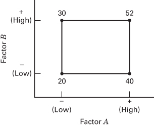  
■ FIGURE 5.1 A two-factor factorial experiment, with the response (y) shown at the corners

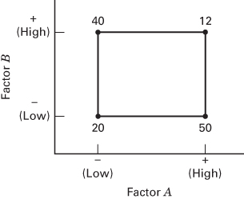  
■ FIGURE 5.2 A two-factor factorial experiment with interaction

That is, increasing factor A from the low level to the high level causes an average response increase of 21 units. Similarly, the main effect of B is

$$
B = \frac {3 0 + 5 2}{2} - \frac {2 0 + 4 0}{2} = 1 1
$$

If the factors appear at more than two levels, the above procedure must be modified because there are other ways to define the effect of a factor. This point is discussed more completely later.

In some experiments, we may find that the difference in response between the levels of one factor is not the same at all levels of the other factors. When this occurs, there is an interaction between the factors. For example, consider the two-factor factorial experiment shown in Figure 5.2. At the low level of factor B (or $B^{-}$ ), the A effect is

$$
A = 5 0 - 2 0 = 3 0
$$

and at the high level of factor $B$ (or $B^{+}$ ), the $A$ effect is

$$
A = 1 2 - 4 0 = - 2 8
$$

Because the effect of $A$ depends on the level chosen for factor $B$ , we see that there is interaction between $A$ and $B$ . The magnitude of the interaction effect is the average difference in these two $A$ effects, or $AB = (-28 - 30) / 2 = -29$ . Clearly, the interaction is large in this experiment.

These ideas may be illustrated graphically. Figure 5.3 plots the response data in Figure 5.1 against factor A for both levels of factor B. Note that the $B^{-}$ and $B^{+}$ lines are approximately parallel, indicating a lack of interaction between factors A and B. Similarly, Figure 5.4 plots the response data in Figure 5.2. Here we see that the $B^{-}$ and $B^{+}$ lines are not parallel. This indicates an interaction between factors A and B. Two-factor interaction graphs such as these are frequently very useful in interpreting significant interactions and in reporting results to nonstatistically trained personnel. However, they should not be utilized as the sole technique of data analysis because their interpretation is subjective and their appearance is often misleading.

There is another way to illustrate the concept of interaction. Suppose that both of our design factors are quantitative (such as temperature, pressure, time). Then a regression model representation of the two-factor factorial experiment could be written as

$$
y = \beta_ {0} + \beta_ {1} x _ {1} + \beta_ {2} x _ {2} + \beta_ {1 2} x _ {1} x _ {2} + \epsilon
$$

where $y$ is the response, the $\beta$ 's are parameters whose values are to be determined, $x_{1}$ is a variable that represents factor $A$ , $x_{2}$ is a variable that represents factor $B$ , and $\epsilon$ is a random error term. The variables $x_{1}$ and $x_{2}$ are defined on a coded scale from -1 to +1 (the low and high levels of $A$ and $B$ ), and $x_{1}x_{2}$ represents the interaction between $x_{1}$ and $x_{2}$ .

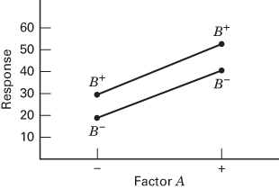  
■ FIGURE 5.3 A factorial experiment without interaction

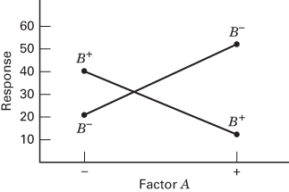  
■ FIGURE 5.4 A factorial experiment with interaction

The parameter estimates in this regression model turn out to be related to the effect estimates. For the experiment shown in Figure 5.1 we found the main effects of A and B to be A = 21 and B = 11. The estimates of $\beta_{1}$ and $\beta_{2}$ are one-half the value of the corresponding main effect; therefore, $\hat{\beta}_{1} = 21/2 = 10.5$ and $\hat{\beta}_{2} = 11/2 = 5.5$ . The interaction effect in Figure 5.1 is AB = 1, so the value of interaction coefficient in the regression model is $\hat{\beta}_{12} = 1/2 = 0.5$ . The parameter $\beta_{0}$ is estimated by the average of all four responses, or $\hat{\beta}_{0} = (20 + 40 + 30 + 52)/4 = 35.5$ . Therefore, the fitted regression model is

$$
\hat {y} = 3 5. 5 + 1 0. 5 x _ {1} + 5. 5 x _ {2} + 0. 5 x _ {1} x _ {2}
$$

The parameter estimates obtained in the manner for the factorial design with all factors at two levels $(- \text{ and } +)$ turn out to be least squares estimates (more on this later).

The interaction coefficient $(\hat{\beta}_{12}=0.5)$ is small relative to the main effect coefficients $\hat{\beta}_{1}$ and $\hat{\beta}_{2}$ . We will take this to mean that interaction is small and can be ignored. Therefore, dropping the term $0.5x_{1}x_{2}$ gives us the model

$$
\hat {y} = 3 5. 5 + 1 0. 5 x _ {1} + 5. 5 x _ {2}
$$

Figure 5.5 presents graphical representations of this model. In Figure 5.5a we have a plot of the plane of y-values generated by the various combinations of $x_{1}$ and $x_{2}$ . This three-dimensional graph is called a response surface plot. Figure 5.5b shows the contour lines of constant response y in the $x_{1}, x_{2}$ plane. Notice that because the response surface is a plane, the contour plot contains parallel straight lines.

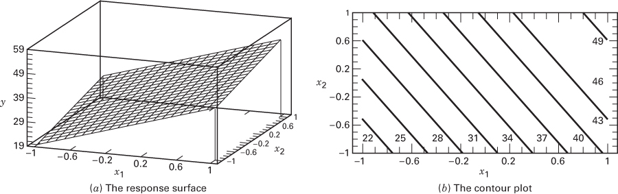  

■ FIGURE 5.5 Response surface and contour plot for the model $\hat{y} = 35.5 + 10.5x_{1} + 5.5x_{2}$

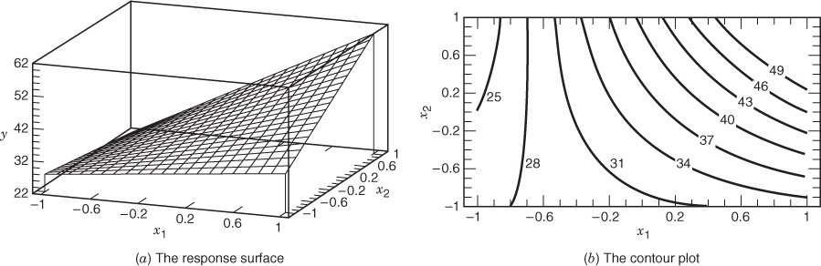  

■ FIGURE 5.6 Response surface and contour plot for the model $\hat{y}=35.5+10.5x_{1}+5.5x_{2}+8x_{1}x_{2}$

Now suppose that the interaction contribution to this experiment was not negligible; that is, the coefficient $\beta_{12}$ was not small. Figure 5.6 presents the response surface and contour plot for the model

$$
\hat {y} = 3 5. 5 + 1 0. 5 x _ {1} + 5. 5 x _ {2} + 8 x _ {1} x _ {2}
$$

(We have let the interaction effect be the average of the two main effects.) Notice that the significant interaction effect “twists” the plane in Figure 5.6a. This twisting of the response surface results in curved contour lines of constant response in the $x_{1}$ , $x_{2}$ plane, as shown in Figure 5.6b. Thus, interaction is a form of curvature in the underlying response surface model for the experiment.

The response surface model for an experiment is extremely important and useful. We will say more about it in Section 5.5 and in subsequent chapters.

Generally, when an interaction is large, the corresponding main effects have little practical meaning. For the experiment in Figure 5.2, we would estimate the main effect of A to be

$$
A = \frac {5 0 + 1 2}{2} - \frac {2 0 + 4 0}{2} = 1
$$

which is very small, and we are tempted to conclude that there is no effect due to A. However, when we examine the effects of A at different levels of factor B, we see that this is not the case. Factor A has an effect, but it depends on the level of factor B. That is, knowledge of the AB interaction is more useful than knowledge of the main effect. A significant interaction will often mask the significance of main effects. These points are clearly indicated by the interaction plot in Figure 5.4. In the presence of significant interaction, the experimenter must usually examine the levels of one factor, say A, with levels of the other factors fixed to draw conclusions about the main effect of A.

## 5.2 The Advantage of Factorials

The advantage of factorial designs can be easily illustrated. Suppose that we have two factors A and B, each at two levels. We denote the levels of the factors by $A^{-}$ , $A^{+}$ , $B^{-}$ , and $B^{+}$ . Information on both factors could be obtained by varying the factors one at a time, as shown in Figure 5.7. The effect of changing factor A is given by $A^{+}B^{-}-A^{-}B^{-}$ , and the effect of changing factor B is given by $A^{-}B^{+}-A^{-}B^{-}$ . Because experimental error is present, it is desirable to take two observations, say, at each treatment combination and estimate the effects of the factors using average responses. Thus, a total of six observations are required.

  
■ FIGURE 5.7 A one-factor-at-a-time experiment

  
■ FIGURE 5.8 Relative efficiency of a  
factorial design to a one-factor-at-a-time experiment (two-level factors)

If a factorial experiment had been performed, an additional treatment combination, $A^{+}B^{+}$ , would have been taken. Now, using just four observations, two estimates of the A effect can be made: $A^{+}B^{-}-A^{-}B^{-}$ and $A^{+}B^{+}-A^{-}B^{+}$ . Similarly, two estimates of the B effect can be made. These two estimates of each main effect could be averaged to produce average main effects that are just as precise as those from the single-factor experiment, but only four total observations are required and we would say that the relative efficiency of the factorial design to the one-factor-at-a-time experiment is $(6/4)=1.5$ . Generally, this relative efficiency will increase as the number of factors increases, as shown in Figure 5.8.

Now suppose interaction is present. If the one-factor-at-a-time design indicated that $A^{-}B^{+}$ and $A^{+}B^{-}$ gave better responses than $A^{-}B^{-}$ , a logical conclusion would be that $A^{+}B^{+}$ would be even better. However, if interaction is present, this conclusion may be seriously in error. For an example, refer to the experiment in Figure 5.2.

In summary, note that factorial designs have several advantages. They are more efficient than one-factor-at-a-time experiments. Furthermore, a factorial design is necessary when interactions may be present to avoid misleading conclusions. Finally, factorial designs allow the effects of a factor to be estimated at several levels of the other factors, yielding conclusions that are valid over a range of experimental conditions.

## 5.3 The Two-Factor Factorial Design

## 5.3.1 An Example

The simplest types of factorial designs involve only two factors or sets of treatments. There are a levels of factor A and b levels of factor B, and these are arranged in a factorial design; that is, each replicate of the experiment contains all ab treatment combinations. In general, there are n replicates.

As an example of a factorial design involving two factors, an engineer is designing a battery for use in a device that will be subjected to some extreme variations in temperature. The only design parameter that he can select at this point is the plate material for the battery, and he has three possible choices. When the device is manufactured and is shipped to the field, the engineer has no control over the temperature extremes that the device will encounter, and he knows from experience that temperature will probably affect the effective battery life. However, temperature can be controlled in the product development laboratory for the purposes of a test.

TABLE 5.1  
Life (in hours) Data for the Battery Design Example

<table><tr><td rowspan="2">Material Type</td><td colspan="6">Temperature (°F)</td></tr><tr><td colspan="2">15</td><td colspan="2">70</td><td colspan="2">125</td></tr><tr><td rowspan="2">1</td><td>130</td><td>155</td><td>34</td><td>40</td><td>20</td><td>70</td></tr><tr><td>74</td><td>180</td><td>80</td><td>75</td><td>82</td><td>58</td></tr><tr><td rowspan="2">2</td><td>150</td><td>188</td><td>136</td><td>122</td><td>25</td><td>70</td></tr><tr><td>159</td><td>126</td><td>106</td><td>115</td><td>58</td><td>45</td></tr><tr><td rowspan="2">3</td><td>138</td><td>110</td><td>174</td><td>120</td><td>96</td><td>104</td></tr><tr><td>168</td><td>160</td><td>150</td><td>139</td><td>82</td><td>60</td></tr></table>

The engineer decides to test all three plate materials at three temperature levels—15, 70, and $125^{\circ}$ F—because these temperature levels are consistent with the product end-use environment. Because there are two factors at three levels, this design is sometimes called a $3^{2}$ factorial design. Four batteries are tested at each combination of plate material and temperature, and all 36 tests are run in random order. The experiment and the resulting observed battery life data are given in Table 5.1.

In this problem, the engineer wants to answer the following questions:

1. What effects do material type and temperature have on the life of the battery?

2. Is there a choice of material that would give uniformly long life regardless of temperature?

This last question is particularly important. It may be possible to find a material alternative that is not greatly affected by temperature. If this is so, the engineer can make the battery robust to temperature variation in the field. This is an example of using statistical experimental design for robust product design, a very important engineering problem.

This design is a specific example of the general case of a two-factor factorial. To pass to the general case, let $y_{ijk}$ be the observed response when factor A is at the ith level $(i = 1, 2, \ldots, a)$ and factor B is at the jth level $(j = 1, 2, \ldots, b)$ for the kth replicate $(k = 1, 2, \ldots, n)$ . In general, a two-factor factorial experiment will appear as in Table 5.2. The order in which the abn observations are taken is selected at random so that this design is a completely randomized design.

The observations in a factorial experiment can be described by a model. There are several ways to write the model for a factorial experiment. The effects model is

$$
y _ {i j k} = \mu + \tau_ {i} + \beta_ {j} + (\tau \beta) _ {i j} + \epsilon_ {i j k} \left\{ \begin{array}{l} i = 1, 2, \ldots , a \\ j = 1, 2, \ldots , b \\ k = 1, 2, \ldots , n \end{array} \right.\tag{5.1}
$$

where $\mu$ is the overall mean effect, $\tau_{i}$ is the effect of the ith level of the row factor A, $\beta_{j}$ is the effect of the jth level of column factor B, $(\tau\beta)_{ij}$ is the effect of the interaction between $\tau_{i}$ and $\beta_{j}$ , and $\epsilon_{ijk}$ is a random error component. Both factors are assumed to be fixed, and the treatment effects are defined as deviations from the overall mean, so $\sum_{i=1}^{a}\tau_{i}=0$ and $\sum_{j=1}^{b}\beta_{j}=0$ . Similarly, the interaction effects are fixed and are defined such that $\sum_{i=1}^{a}(\tau\beta)_{ij}=\sum_{j=1}^{b}(\tau\beta)_{ij}=0$ . Because there are n replicates of the experiment, there are abn total observations.

<table><tr><td rowspan="2">Factor A</td><td colspan="4">Factor B</td></tr><tr><td>1</td><td>2</td><td>...</td><td>b</td></tr><tr><td>1</td><td> $y_{111},y_{112},$  $\cdots,y_{11n}$ </td><td> $y_{121},y_{122},$  $\cdots,y_{12n}$ </td><td></td><td> $y_{1b1},y_{1b2},$  $\cdots,y_{1bn}$ </td></tr><tr><td>2</td><td> $y_{211},y_{212},$  $\cdots,y_{21n}$ </td><td> $y_{221},y_{222},$  $\cdots,y_{22n}$ </td><td></td><td> $y_{2b1},y_{2b2},$  $\cdots,y_{2bn}$ </td></tr><tr><td> $\vdots$ </td><td></td><td></td><td></td><td></td></tr><tr><td>a</td><td> $y_{a11},y_{a12},$  $\cdots,y_{a1n}$ </td><td> $y_{a21},y_{a22},$  $\cdots,y_{a2n}$ </td><td></td><td> $y_{ab1},y_{ab2},$  $\cdots,y_{abn}$ </td></tr></table>

Another possible model for a factorial experiment is the means model

$$
y _ {i j k} = \mu_ {i j} + \epsilon_ {i j k} \left\{ \begin{array}{l} i = 1, 2, \ldots , a \\ j = 1, 2, \ldots , b \\ k = 1, 2, \ldots , n \end{array} \right.
$$

where the mean of the ijth cell is

$$
\mu_ {i j} = \mu + \tau_ {i} + \beta_ {j} + (\tau \beta) _ {i j}
$$

We could also use a regression model as in Section 5.1. Regression models are particularly useful when one or more of the factors in the experiment are quantitative. Throughout most of this chapter, we will use the effects model (Equation 5.1) with an illustration of the regression model in Section 5.5.

In the two-factor factorial, both row and column factors (or treatments), A and B, are of equal interest. Specifically, we are interested in testing hypotheses about the equality of row treatment effects, say

$$
\begin{array}{l} H _ {0} \colon \tau_ {1} = \tau_ {2} = \dots = \tau_ {a} = 0 \\ H _ {1} \colon \text {   at   least   one   } \tau_ {i} \neq 0 \end{array}\tag{5.2a}
$$

and the equality of column treatment effects, say

$$
\begin{array}{l} H _ {0} \colon \beta_ {1} = \beta_ {2} = \dots = \beta_ {b} = 0 \\ H _ {1} \colon \text {   at   least   one   } \beta_ {i} \neq 0 \end{array}\tag{5.2b}
$$

We are also interested in determining whether row and column treatments interact. Thus, we also wish to test

$$
\begin{array}{l} H _ {0} \colon (\tau \beta) _ {i j} = 0 \quad \text { for   all } i, j \\ H _ {1} \colon \text { at   least   one } (\tau \beta) _ {i j} \neq 0 \end{array}\tag{5.2c}
$$

We now discuss how these hypotheses are tested using a two-factor analysis of variance.

## 5.3.2 Statistical Analysis of the Fixed Effects Model

Let $y_{i..}$ denote the total of all observations under the $i$ th level of factor $A$ , $y_{.j.}$ denote the total of all observations under the $j$ th level of factor $B$ , $y_{ij.}$ denote the total of all observations in the $ij$ th cell, and $y_{...}$ denote the grand total of all the observations. Define $\overline{y}_{i..}, \overline{y}_{.j.}, \overline{y}_{ij.}$ , and $\overline{y}_{...}$ as the corresponding row, column, cell, and grand averages. Expressed mathematically,

$$
y _ {i..} = \sum_ {j = 1} ^ {b} \sum_ {k = 1} ^ {n} y _ {i j k} \quad \overline {{{{y}}}} _ {i..} = \frac {y _ {i . .}}{b n} \quad i = 1, 2, \dots , a
$$

$$
y _ {j.} = \sum_ {i = 1} ^ {a} \sum_ {k = 1} ^ {n} y _ {i j k} \quad \overline {{y}} _ {. j.} = \frac {y _ {. j .}}{a n} \quad j = 1, 2, \ldots , b
$$

$$
y _ {i j.} = \sum_ {k = 1} ^ {n} y _ {i j k} \quad \overline {{y}} _ {i j.} = \frac {y _ {i j .}}{n} \quad \begin{array}{l l} & i = 1, 2, \ldots , a \\ & j = 1, 2, \ldots , b \end{array}
$$

$$
y _ {\dots} = \sum_ {i = 1} ^ {a} \sum_ {j = 1} ^ {b} \sum_ {k = 1} ^ {n} y _ {i j k} \quad \overline {{{{y}}}} _ {\dots} = \frac {y _ {\dots}}{a b n}\tag{5.3}
$$

The total corrected sum of squares may be written as

$$
\begin{array}{r l} \sum_ {i = 1} ^ {a} \sum_ {j = 1} ^ {b} \sum_ {k = 1} ^ {n} (y _ {i j k} - \overline {{y}} _ {\dots}) ^ {2} & = \sum_ {i = 1} ^ {a} \sum_ {j = 1} ^ {b} \sum_ {k = 1} ^ {n} [ (\overline {{y}} _ {i..} - \overline {{y}} _ {\dots}) + (\overline {{y}} _ {. j.} - \overline {{y}} _ {\dots}) \\ & \quad + (\overline {{y}} _ {i j.} - \overline {{y}} _ {i..} - \overline {{y}} _ {. j.} + \overline {{y}} _ {\dots}) + (y _ {i j k} - \overline {{y}} _ {i j.}) ] ^ {2} \\ & = b n \sum_ {i = 1} ^ {a} (\overline {{y}} _ {i..} - \overline {{y}} _ {\dots}) ^ {2} + a n \sum_ {j = 1} ^ {b} (\overline {{y}} _ {. j.} - \overline {{y}} _ {\dots}) ^ {2} \\ & \quad + n \sum_ {i = 1} ^ {a} \sum_ {j = 1} ^ {b} (\overline {{y}} _ {i j.} - \overline {{y}} _ {\dots} - \overline {{y}} _ {. j.} - \overline {{y}} _ {\dots}) ^ {2} \\ & \quad + \sum_ {i = 1} ^ {a} \sum_ {j = 1} ^ {b} \sum_ {k = 1} ^ {n} (y _ {i j k} - \overline {{y}} _ {i j.}) ^ {2} \end{array}\tag{5.4}
$$

because the six cross products on the right-hand side are zero. Notice that the total sum of squares into a sum of squares due to “rows,” or factor A, $(SS_{A})$ ; a sum of squares due to “columns,” or factor B, $(SS_{B})$ ; a sum of squares due to the interaction between A and B, $(SS_{AB})$ ; and a sum of squares due to error, $(SS_{E})$ . This is the fundamental ANOVA equation for the two-factor factorial. From the last component on the right-hand side of Equation 5.4, we see that there must be at least two replicates $(n \geq 2)$ to obtain an error sum of squares.

We may write Equation 5.4 symbolically as

$$
S S _ {T} = S S _ {A} + S S _ {B} + S S _ {A B} + S S _ {E}\tag{5.5}
$$

The number of degrees of freedom associated with each sum of squares is

<table><tr><td>Effect</td><td>Degrees of Freedom</td></tr><tr><td>A</td><td>a-1</td></tr><tr><td>B</td><td>b-1</td></tr><tr><td>AB interaction</td><td>(a-1)(b-1)</td></tr><tr><td>Error</td><td>ab(n-1)</td></tr><tr><td>Total</td><td>abn-1</td></tr></table>

We may justify this allocation of the abn - 1 total degrees of freedom to the sums of squares as follows: The main effects A and B have a and b levels, respectively; therefore, they have a - 1 and b - 1 degrees of freedom as shown. The interaction degrees of freedom are simply the number of degrees of freedom for cells (which is ab - 1) minus the number of degrees of freedom for the two main effects A and B; that is, $ab - 1 - (a - 1) - (b - 1) = (a - 1)(b - 1)$ . Within each of the ab cells, there are n - 1 degrees of freedom between the n replicates; thus, there are $ab(n - 1)$ degrees of freedom for error. Note that the number of degrees of freedom on the right-hand side of Equation 5.5 adds to the total number of degrees of freedom.

Each sum of squares divided by its degrees of freedom is a mean square. The expected values of the mean squares are

$$
E (M S _ {A}) = E \left(\frac {S S _ {A}}{a - 1}\right) = \sigma^ {2} + \frac {b n \sum_ {i = 1} ^ {a} \tau_ {i} ^ {2}}{a - 1}
$$

$$
E (M S _ {B}) = E \left(\frac {S S _ {B}}{b - 1}\right) = \sigma^ {2} + \frac {a n \sum_ {j = 1} ^ {b} \beta_ {j} ^ {2}}{b - 1}
$$

$$
E (M S _ {A B}) = E \left(\frac {S S _ {A B}}{(a - 1) (b - 1)}\right) = \sigma^ {2} + \frac {n \sum_ {i = 1} ^ {a} \sum_ {j = 1} ^ {b} (\tau \beta) _ {i j} ^ {2}}{(a - 1) (b - 1)}
$$

and

$$
E (M S _ {E}) = E \left(\frac {S S _ {E}}{a b (n - 1)}\right) = \sigma^ {2}
$$

Notice that if the null hypotheses of no row treatment effects, no column treatment effects, and no interaction are true, then $MS_{A}$ , $MS_{B}$ , $MS_{AB}$ , and $MS_{E}$ all estimate $\sigma^{2}$ . However, if there are differences between row treatment effects, say, then $MS_{A}$ will be larger than $MS_{E}$ . Similarly, if there are column treatment effects or interaction present, then the corresponding mean squares will be larger than $MS_{E}$ . Therefore, to test the significance of both main effects and their interaction, simply divide the corresponding mean square by the error mean square. Large values of this ratio imply that the data do not support the null hypothesis.

If we assume that the model (Equation 5.1) is adequate and that the error terms $\epsilon_{ijk}$ are normally and independently distributed with constant variance $\sigma^2$ , then each of the ratios of mean squares $MS_A / MS_E$ , $MS_B / MS_E$ , and $MS_{AB} / MS_E$ is distributed as $F$ with $a - 1$ , $b - 1$ , and $(a - 1)(b - 1)$ numerator degrees of freedom, respectively, and $ab(n - 1)$ denominator degrees of freedom, $^1$ and the critical region would be the upper tail of the $F$ distribution. The test procedure is usually summarized in an analysis of variance table, as shown in Table 5.3.

Computationally, we almost always employ a statistical software package to conduct an ANOVA. However, manual computing of the sums of squares in Equation 5.5 is straightforward. One could write out the individual elements of the ANOVA identity

$$
y _ {i j k} - \overline {{y}} _ {\dots} = (\overline {{y}} _ {i..} - \overline {{y}} _ {\dots}) + (\overline {{y}} _ {j.} - \overline {{y}} _ {\dots}) + (\overline {{y}} _ {i j.} - \overline {{y}} _ {i..} - \overline {{y}} _ {. j.} + \overline {{y}} _ {\dots}) + (y _ {i j k} - \overline {{y}} _ {i j.})
$$

and calculate them in the columns of a spreadsheet. Then each column could be squared and summed to produce the ANOVA sums of squares. Computing formulas in terms of row, column, and cell totals can also be used. The total sum of squares is computed as usual by

$$
S S _ {T} = \sum_ {i = 1} ^ {a} \sum_ {j = 1} ^ {b} \sum_ {k = 1} ^ {n} y _ {i j k} ^ {2} - \frac {y _ {\dots} ^ {2}}{a b n}\tag{5.6}
$$

TABLE 5.3  
The Analysis of Variance Table for the Two-Factor Factorial, Fixed Effects Model

<table><tr><td>Source of Variation</td><td>Sum of Squares</td><td>Degrees of Freedom</td><td>Mean Square</td><td> $F_0$ </td></tr><tr><td>A treatments</td><td> $SS_A$ </td><td>a-1</td><td> $MS_A=\frac{SS_A}{a-1}$ </td><td> $F_0=\frac{MS_A}{MS_E}$ </td></tr><tr><td>B treatments</td><td> $SS_B$ </td><td>b-1</td><td> $MS_B=\frac{SS_B}{b-1}$ </td><td> $F_0=\frac{MS_B}{MS_E}$ </td></tr><tr><td>Interaction</td><td> $SS_{AB}$ </td><td>(a-1)(b-1)</td><td> $MS_{AB}=\frac{SS_{AB}}{(a-1)(b-1)}$ </td><td> $F_0=\frac{MS_{AB}}{MS_E}$ </td></tr><tr><td>Error</td><td> $SS_E$ </td><td>ab(n-1)</td><td> $MS_E=\frac{SS_E}{ab(n-1)}$ </td><td></td></tr><tr><td>Total</td><td> $SS_T$ </td><td>abn-1</td><td></td><td></td></tr></table>

The sums of squares for the main effects are

$$
S S _ {A} = \frac {1}{b n} \sum_ {i = 1} ^ {a} y _ {i..} ^ {2} - \frac {y _ {. . .} ^ {2}}{a b n}\tag{5.7}
$$

and

$$
S S _ {B} = \frac {1}{a n} \sum_ {j = 1} ^ {b} y _ {. j.} ^ {2} - \frac {y _ {. . .} ^ {2}}{a b n}\tag{5.8}
$$

It is convenient to obtain the $SS_{AB}$ in two stages. First, we compute the sum of squares between the ab cell totals, which is called the sum of squares due to “subtotals”:

$$
S S _ {\text { Subtotals }} = \frac {1}{n} \sum_ {i = 1} ^ {a} \sum_ {j = 1} ^ {b} y _ {i j.} ^ {2} - \frac {y _ {\dots} ^ {2}}{a b n}
$$

This sum of squares also contains $SS_A$ and $SS_B$ . Therefore, the second step is to compute $SS_{AB}$ as

$$
S S _ {A B} = S S _ {\mathrm{Subtotals}} - S S _ {A} - S S _ {B}\tag{5.9}
$$

We may compute $SS_E$ by subtraction as

$$
S S _ {E} = S S _ {T} - S S _ {A B} - S S _ {A} - S S _ {B}\tag{5.10}
$$

or

$$
S S _ {E} = S S _ {T} - S S _ {\mathrm{Subtotals}}
$$

## EXAMPLE 5.1 The Battery Design Experiment

Table 5.4 presents the effective life (in hours) observed in the battery design example described in Section 5.3.1. The row and column totals are shown in the margins of the table, and the circled numbers are the cell totals.

Using Equations 5.6 through 5.10, the sums of squares are computed as follows:

$$
\begin{array}{r l} S S _ {T} & = \sum_ {i = 1} ^ {a} \sum_ {j = 1} ^ {b} \sum_ {k = 1} ^ {n} y _ {i j k} ^ {2} - \frac {y _ {\dots} ^ {2}}{a b n} \\ & = (1 3 0) ^ {2} + (1 5 5) ^ {2} + (7 4) ^ {2} + \dots \\ & + (6 0) ^ {2} - \frac {(3 7 9 9) ^ {2}}{3 6} = 7 7, 6 4 6. 9 7 \end{array}
$$

$$
\begin{array}{r l} S S _ {\text {Material}} & = \frac {1}{b n} \sum_ {i = 1} ^ {a} y _ {i..} ^ {2} - \frac {y _ {. . .} ^ {2}}{a b n} \\ & = \frac {1}{(3) (4)} [ (9 9 8) ^ {2} + (1 3 0 0) ^ {2} + (1 5 0 1) ^ {2} ] \\ & - \frac {(3 7 9 9) ^ {2}}{3 6} = 1 0, 6 8 3. 7 2 \end{array}
$$

$$
\begin{array}{r l} S S _ {\text { Temperature }} & = \frac {1}{a n} \sum_ {j = 1} ^ {b} y _ {j.} ^ {2} - \frac {y _ {. . .} ^ {2}}{a b n} \\ & = \frac {1}{(3) (4)} [ (1 7 3 8) ^ {2} + (1 2 9 1) ^ {2} + (7 7 0) ^ {2} ] \\ & - \frac {(3 7 9 9) ^ {2}}{3 6} = 3 9, 1 1 8. 7 2 \end{array}
$$

$$
\begin{array}{r l} S S _ {\text { Interaction }} & = \frac {1}{n} \sum_ {i = 1} ^ {a} \sum_ {j = 1} ^ {b} y _ {i j.} ^ {2} - \frac {y _ {. . .} ^ {2}}{a b n} - S S _ {\text { Material }} \\ & \quad - S S _ {\text { Temperature }} \\ & = \frac {1}{4} [ (5 3 9) ^ {2} + (2 2 9) ^ {2} + \dots + (3 4 2) ^ {2} ] \\ & \quad - \frac {(3 7 9 9) ^ {2}}{3 6} - 1 0, 6 8 3. 7 2 \\ & \quad - 3 9, 1 1 8. 7 2 = 9 6 1 3. 7 8 \end{array}
$$

and

$$
\begin{array}{r l} S S _ {E} & = S S _ {T} - S S _ {\text { Material }} - S S _ {\text { Temperature }} - S S _ {\text { Interaction }} \\ & = 7 7, 6 4 6. 9 7 - 1 0, 6 8 3. 7 2 - 3 9, 1 1 8. 7 2 \\ & - 9 6 1 3. 7 8 = 1 8, 2 3 0. 7 5 \end{array}
$$

The ANOVA is shown in Table 5.5. Because $F_{0.05,4.27} = 2.73$ , we conclude that there is a significant interaction between material types and temperature. Furthermore, $F_{0.05,2.27} = 3.35$ , so the main effects of material type and temperature are also significant. Table 5.5 also shows the P-values for the test statistics.

To assist in interpreting the results of this experiment, it is helpful to construct a graph of the average responses at each treatment combination. This graph is shown in Figure 5.9. The significant interaction is indicated by the lack of parallelism of the lines. In general, longer life is attained at low temperature, regardless of material type. Changing from low to intermediate temperature, battery life with material type 3 may actually increase, whereas it decreases for types 1 and 2. From intermediate to high

TABLE 5.4  
Life Data (in hours) for the Battery Design Experiment

<table><tr><td rowspan="2">Material Type</td><td colspan="9">Temperature (°F)</td></tr><tr><td colspan="3">15</td><td colspan="3">70</td><td colspan="2">125</td><td> $y_{i..}$ </td></tr><tr><td></td><td>130</td><td>155</td><td rowspan="2">539</td><td>34</td><td>40</td><td rowspan="2">229</td><td>20</td><td>70</td><td rowspan="2">230</td></tr><tr><td>1</td><td>74</td><td>180</td><td>80</td><td>75</td><td>82</td><td>58</td></tr><tr><td></td><td>150</td><td>188</td><td rowspan="2">623</td><td>136</td><td>122</td><td rowspan="2">479</td><td>25</td><td>70</td><td rowspan="2">198</td></tr><tr><td>2</td><td>159</td><td>126</td><td>106</td><td>115</td><td>58</td><td>45</td></tr><tr><td></td><td>138</td><td>110</td><td rowspan="2">576</td><td>174</td><td>120</td><td rowspan="2">583</td><td>96</td><td>104</td><td rowspan="2">342</td></tr><tr><td>3</td><td>168</td><td>160</td><td>150</td><td>139</td><td>82</td><td>60</td></tr><tr><td> $y_{j.}$ </td><td></td><td>1738</td><td></td><td></td><td>1291</td><td></td><td></td><td>770</td><td>3799 =  $y...$ </td></tr></table>

## TABLE 5.5

Analysis of Variance for Battery Life Data

<table><tr><td>Source of Variation</td><td>Sum of Squares</td><td>Degrees of Freedom</td><td>Mean Square</td><td> $F_0$ </td><td>P-Value</td></tr><tr><td>Material types</td><td>10,683.72</td><td>2</td><td>5,341.86</td><td>7.91</td><td>0.0020</td></tr><tr><td>Temperature</td><td>39,118.72</td><td>2</td><td>19,559.36</td><td>28.97</td><td>&lt;0.0001</td></tr><tr><td>Interaction</td><td>9,613.78</td><td>4</td><td>2,403.44</td><td>3.56</td><td>0.0186</td></tr><tr><td>Error</td><td>18,230.75</td><td>27</td><td>675.21</td><td></td><td></td></tr><tr><td>Total</td><td>77,646.97</td><td>35</td><td></td><td></td><td></td></tr></table>

temperature, battery life decreases for material types 2 and 3 and is essentially unchanged for type 1. Material type 3 seems to give the best results if we want less loss of effective life as the temperature changes.

■ FIGURE 5.9 Material type–temperature plot for Example 5.1

Multiple Comparisons. When the ANOVA indicates that row or column means differ, it is usually of interest to make comparisons between the individual row or column means to discover the specific differences. The multiple comparison methods discussed in Chapter 3 are useful in this regard.

We now illustrate the use of Tukey's test on the battery life data in Example 5.1. Note that in this experiment, interaction is significant. When interaction is significant, comparisons between the means of one factor (e.g., $A$ ) may be obscured by the $AB$ interaction. One approach to this situation is to fix factor $B$ at a specific level and apply Tukey's test to the means of factor $A$ at that level. To illustrate, suppose that in Example 5.1, we are interested in detecting differences among the means of the three material types. Because interaction is significant, we make this comparison at just one level of temperature, say level 2 ( $70^{\circ}\mathrm{F}$ ). We assume that the best estimate of the error variance is the $MS_E$ from the ANOVA table, utilizing the assumption that the experimental error variance is the same over all treatment combinations.

The three material type averages at $70^{\circ}$ F arranged in ascending order are

$$
\begin{array}{l} \overline {{y}} _ {1 2.} = 5 7. 2 5 \\ \overline {{y}} _ {2 2.} = 1 1 9. 7 5 \\ \overline {{y}} _ {3 2.} = 1 4 5. 7 5 \end{array}
$$

(material type 1)

(material type 2)

(material type 3)

and

$$
\begin{array}{r} T _ {0. 0 5} = q _ {0. 0 5} (3, 2 7) \sqrt {\frac {M S _ {E}}{n}} \\ = 3. 5 0 \sqrt {\frac {6 7 5 . 2 1}{4}} \\ = 4 5. 4 7 \end{array}
$$

where we obtained $q_{0.05}(3,27) \simeq 3.50$ by interpolation in Appendix Table V. The pairwise comparisons yield

$$
3 \mathrm{vs.} 1: \quad 1 4 5. 7 5 - 5 7. 2 5 = 8 8. 5 0 > T _ {0. 0 5} = 4 5. 4 7
$$

$$
3 \text {   vs.   } 2: \quad 1 4 5. 7 5 - 1 1 9. 7 5 = 2 6. 0 0 <   T _ {0. 0 5} = 4 5. 4 7
$$

$$
2 \text { vs. } 1: \quad 1 1 9. 7 5 - 5 7. 2 5 = 6 2. 5 0 > T _ {0. 0 5} = 4 5. 4 7
$$

This analysis indicates that at the temperature level $70^{\circ}$ F, the mean battery life is the same for material types 2 and 3 and that the mean battery life for material type 1 is significantly lower in comparison to both types 2 and 3.

If interaction is significant, the experimenter could compare all ab cell means to determine which ones differ significantly. In this analysis, differences between cell means include interaction effects as well as both main effects. In Example 5.1, this would give 36 comparisons between all possible pairs of the nine cell means.

Computer Output. Figure 5.10 presents condensed computer output for the battery life data in Example 5.1. Figure 5.10a contains Design-Expert output and Figure 5.10b contains JMP output. Note that

$$
\begin{array}{r l} S S _ {\text { Model }} & = S S _ {\text { Material }} + S S _ {\text { Temperature }} + S S _ {\text { Interaction }} \\ & = 1 0, 6 8 3. 7 2 + 3 9, 1 1 8. 7 2 + 9 6 1 3. 7 8 \\ & = 5 9, 4 1 6. 2 2 \end{array}
$$

with eight degrees of freedom. An F-test is displayed for the model source of variation. The P-value is small (<0.0001), so the interpretation of this test is that at least one of the three terms in the model is significant. The tests on the individual model terms $(A, B, AB)$ follow. Also,

$$
R ^ {2} = \frac {S S _ {\mathrm{Model}}}{S S _ {\mathrm{Total}}} = \frac {5 9 , 4 1 6 . 2 2}{7 7 , 6 4 6 . 9 7} = 0. 7 6 5 2
$$

That is, about 77 percent of the variability in the battery life is explained by the plate material in the battery, the temperature, and the material type–temperature interaction. The residuals from the fitted model are displayed on the Design-Expert computer output and the JMP output contains a plot of the residuals versus the predicted response. We now discuss the use of these residuals and residual plots in model adequacy checking.

## 5.3.3 Model Adequacy Checking

Before the conclusions from the ANOVA are adopted, the adequacy of the underlying model should be checked. As before, the primary diagnostic tool is residual analysis. The residuals for the two-factor factorial model with interaction are

$$
e _ {i j k} = y _ {i j k} - \hat {y} _ {i j k}\tag{5.11}
$$

and because the fitted value $\hat{y}_{ijk} = \overline{y}_{ij}$ . (the average of the observations in the $ij$ th cell), Equation 5.11 becomes

$$
e _ {i j k} = y _ {i j k} - \hat {y} _ {i j.}\tag{5.12}
$$

The residuals from the battery life data in Example 5.1 are shown in the Design-Expert computer output (Figure 5.10a) and in Table 5.6. The normal probability plot of these residuals (Figure 5.11) does not reveal anything particularly troublesome, although the largest negative residual (-60.75 at $15^{\circ}\mathrm{F}$ for material type 1) does stand out somewhat from the others. The standardized value of this residual is $-60.75 / \sqrt{675.21} = -2.34$ , and this is the only residual whose absolute value is larger than 2.

Figure 5.12 plots the residuals versus the fitted values $\hat{y}_{ijk}$ . This plot was also shown in the JMP computer output in Figure 5.10b. There is some mild tendency for the variance of the residuals to increase as the battery life increases. Figures 5.13 and 5.14 plot the residuals versus material types and temperature, respectively. Both plots indicate mild inequality of variance, with the treatment combination of $15^{\circ}\mathrm{F}$ and material type 1 possibly having larger variance than the others.

From Table 5.6, we see that the $15^{\circ}$ F-material type 1 cell contains both extreme residuals (-60.75 and 45.25). These two residuals are primarily responsible for the inequality of variance detected in Figures 5.12, 5.13, and 5.14. Reexamination of the data does not reveal any obvious problem, such as an error in recording, so we accept these responses as legitimate. It is possible that this particular treatment combination produces slightly more erratic battery life than the others. The problem, however, is not severe enough to have a dramatic impact on the analysis and conclusions.

<table><tr><td>Source</td><td>Sum of Squares</td><td>DF</td><td>Mean Square</td><td>F Value</td><td>Prob &gt; F</td><td></td></tr><tr><td>Model</td><td>59416.22</td><td>8</td><td>7427.03</td><td>11.00</td><td>&lt;0.0001</td><td>significant</td></tr><tr><td>A</td><td>10683.72</td><td>2</td><td>5341.86</td><td>7.91</td><td>0.0020</td><td></td></tr><tr><td>B</td><td>39118.72</td><td>2</td><td>19559.36</td><td>28.97</td><td>&lt;0.0001</td><td></td></tr><tr><td>AB</td><td>9613.78</td><td>4</td><td>2403.44</td><td>3.56</td><td>0.0186</td><td></td></tr><tr><td>Residual</td><td>18230.75</td><td>27</td><td>675.21</td><td></td><td></td><td></td></tr><tr><td>Lack of Fit</td><td>0.000</td><td>0</td><td></td><td></td><td></td><td></td></tr><tr><td>Pure Error</td><td>18230.75</td><td>27</td><td>675.21</td><td></td><td></td><td></td></tr><tr><td>Cor Total</td><td>77646.97</td><td>35</td><td></td><td></td><td></td><td></td></tr><tr><td>Std. Dev.</td><td>25.98</td><td></td><td>R-Squared</td><td></td><td>0.7652</td><td></td></tr><tr><td>Mean</td><td>105.53</td><td></td><td>Adj R-Squared</td><td></td><td>0.6956</td><td></td></tr><tr><td>C.V.</td><td>24.62</td><td></td><td>Pred R-Squared</td><td></td><td>0.5826</td><td></td></tr><tr><td>PRESS</td><td>32410.22</td><td></td><td>Adeq Precision</td><td></td><td>8.178</td><td></td></tr></table>

Diagnostics Case Statistics

<table><tr><td>Standard Order</td><td>Actual Value</td><td>Predicted Value</td><td>Residual</td><td>Leverage</td><td>Student Residual</td><td>Cook&#x27;s Distance</td><td>Outlier t</td></tr><tr><td>1</td><td>130.00</td><td>134.75</td><td>-4.75</td><td>0.250</td><td>-0.211</td><td>0.002</td><td>-0.207</td></tr><tr><td>2</td><td>74.00</td><td>134.75</td><td>-60.75</td><td>0.250</td><td>-2.700</td><td>0.270</td><td>-3.100</td></tr><tr><td>3</td><td>155.00</td><td>134.75</td><td>20.25</td><td>0.250</td><td>0.900</td><td>0.030</td><td>0.897</td></tr><tr><td>4</td><td>180.00</td><td>134.75</td><td>45.25</td><td>0.250</td><td>2.011</td><td>0.150</td><td>2.140</td></tr><tr><td>5</td><td>150.00</td><td>155.75</td><td>-5.75</td><td>0.250</td><td>-0.256</td><td>0.002</td><td>-0.251</td></tr><tr><td>6</td><td>159.00</td><td>155.75</td><td>3.25</td><td>0.250</td><td>0.144</td><td>0.001</td><td>0.142</td></tr><tr><td>7</td><td>188.00</td><td>155.75</td><td>32.25</td><td>0.250</td><td>1.433</td><td>0.076</td><td>1.463</td></tr><tr><td>8</td><td>126.00</td><td>155.75</td><td>-29.75</td><td>0.250</td><td>-1.322</td><td>0.065</td><td>-1.341</td></tr><tr><td>9</td><td>138.00</td><td>144.00</td><td>26.00</td><td>0.250</td><td>-0.267</td><td>0.003</td><td>-0.262</td></tr><tr><td>10</td><td>168.00</td><td>144.00</td><td>24.00</td><td>0.250</td><td>1.066</td><td>0.042</td><td>1.069</td></tr><tr><td>11</td><td>110.00</td><td>144.00</td><td>-34.00</td><td>0.250</td><td>-1.511</td><td>0.085</td><td>-1.550</td></tr><tr><td>12</td><td>160.00</td><td>144.00</td><td>16.00</td><td>0.250</td><td>0.711</td><td>0.019</td><td>0.704</td></tr><tr><td>13</td><td>34.00</td><td>57.25</td><td>-23.25</td><td>0.250</td><td>-1.033</td><td>0.040</td><td>-1.035</td></tr><tr><td>14</td><td>80.00</td><td>57.25</td><td>22.75</td><td>0.250</td><td>1.011</td><td>0.038</td><td>1.011</td></tr><tr><td>15</td><td>40.00</td><td>57.25</td><td>-17.25</td><td>0.250</td><td>-0.767</td><td>0.022</td><td>-0.761</td></tr><tr><td>16</td><td>75.00</td><td>57.25</td><td>17.75</td><td>0.250</td><td>0.789</td><td>0.023</td><td>0.783</td></tr><tr><td>17</td><td>136.00</td><td>119.75</td><td>16.25</td><td>0.250</td><td>0.722</td><td>0.019</td><td>0.716</td></tr><tr><td>18</td><td>106.00</td><td>119.75</td><td>-13.75</td><td>0.250</td><td>-0.611</td><td>0.014</td><td>-0.604</td></tr><tr><td>19</td><td>122.00</td><td>119.75</td><td>2.25</td><td>0.250</td><td>0.100</td><td>0.000</td><td>0.098</td></tr><tr><td>20</td><td>115.00</td><td>119.75</td><td>-4.75</td><td>0.250</td><td>-0.211</td><td>0.002</td><td>-0.207</td></tr><tr><td>21</td><td>174.00</td><td>145.75</td><td>28.25</td><td>0.250</td><td>1.255</td><td>0.058</td><td>1.269</td></tr><tr><td>22</td><td>150.00</td><td>145.75</td><td>4.25</td><td>0.250</td><td>0.189</td><td>0.001</td><td>0.185</td></tr><tr><td>23</td><td>120.00</td><td>145.75</td><td>-25.75</td><td>0.250</td><td>-1.144</td><td>0.048</td><td>-1.151</td></tr><tr><td>24</td><td>139.00</td><td>145.75</td><td>-6.75</td><td>0.250</td><td>-0.300</td><td>0.003</td><td>-0.295</td></tr><tr><td>25</td><td>20.00</td><td>57.50</td><td>-37.50</td><td>0.250</td><td>-1.666</td><td>0.103</td><td>-1.726</td></tr><tr><td>26</td><td>82.00</td><td>57.50</td><td>24.50</td><td>0.250</td><td>1.089</td><td>0.044</td><td>1.093</td></tr><tr><td>27</td><td>70.00</td><td>57.50</td><td>12.50</td><td>0.250</td><td>0.555</td><td>0.011</td><td>0.548</td></tr><tr><td>28</td><td>58.00</td><td>57.50</td><td>0.50</td><td>0.250</td><td>0.022</td><td>0.000</td><td>0.022</td></tr><tr><td>29</td><td>25.00</td><td>49.50</td><td>-24.50</td><td>0.250</td><td>-1.089</td><td>0.044</td><td>-1.093</td></tr><tr><td>30</td><td>58.00</td><td>49.50</td><td>8.50</td><td>0.250</td><td>0.378</td><td>0.005</td><td>0.372</td></tr><tr><td>31</td><td>70.00</td><td>49.50</td><td>20.50</td><td>0.250</td><td>0.911</td><td>0.031</td><td>0.908</td></tr><tr><td>32</td><td>45.00</td><td>49.50</td><td>-4.50</td><td>0.250</td><td>-0.200</td><td>0.001</td><td>-0.196</td></tr><tr><td>33</td><td>96.00</td><td>85.50</td><td>10.50</td><td>0.250</td><td>0.467</td><td>0.008</td><td>0.460</td></tr><tr><td>34</td><td>82.00</td><td>85.50</td><td>-3.50</td><td>0.250</td><td>-0.156</td><td>0.001</td><td>-0.153</td></tr><tr><td>35</td><td>104.00</td><td>85.50</td><td>18.50</td><td>0.250</td><td>0.822</td><td>0.025</td><td>0.817</td></tr><tr><td>36</td><td>60.00</td><td>85.50</td><td>-25.50</td><td>0.250</td><td>-1.133</td><td>0.048</td><td>-1.139</td></tr></table>

(a)  
■ FIGURE 5.10 Computer output for Example 5.1. (a) Design-Expert output; (b) JMP output

Response Life Whole Model Actual by Predicted Plot  
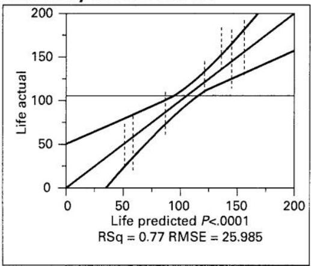

Summary of Fit

<table><tr><td>RSquare</td><td>0.76521</td></tr><tr><td>RSquare Adj</td><td>0.695642</td></tr><tr><td>Root Mean Square Error</td><td>25.98486</td></tr><tr><td>Mean of Response</td><td>105.5278</td></tr><tr><td>Observations (or Sum Wgts)</td><td>36</td></tr></table>

Analysis of Variance

<table><tr><td>Source</td><td>DF</td><td>Sum of Squares</td><td>Mean Square</td><td>F Ratio</td></tr><tr><td>Model</td><td>8</td><td>59416.222</td><td>7427.03</td><td>10.9995</td></tr><tr><td>Error</td><td>27</td><td>18230.750</td><td>675.21</td><td>Prob &gt; F</td></tr><tr><td>C.Total</td><td>35</td><td>77646.972</td><td></td><td>&lt;.001</td></tr></table>

Effect Tests

<table><tr><td>Source</td><td>Nparm</td><td>DF</td><td>Sum of Squares</td><td>F Ratio</td><td>Prob &gt; F</td></tr><tr><td>Material Type</td><td>2</td><td>2</td><td>10683.722</td><td>7.9114</td><td>0.0020</td></tr><tr><td>Temperature</td><td>2</td><td>2</td><td>39118.722</td><td>28.9677</td><td>&lt;.0001</td></tr><tr><td>Material Type Temperature</td><td>4</td><td>4</td><td>9613.778</td><td>3.5595</td><td>0.0186</td></tr></table>

Residual by Predicted Plot  
  
■ FIGURE 5.10 (Continued)  
(b)

■ TABLE 5.6
Residuals for Example 5.1

<table><tr><td rowspan="2">Material Type</td><td colspan="6">Temperature (°F)</td></tr><tr><td colspan="2">15</td><td colspan="2">70</td><td colspan="2">125</td></tr><tr><td rowspan="2">1</td><td>-4.75</td><td>20.25</td><td>-23.25</td><td>-17.25</td><td>-37.50</td><td>12.50</td></tr><tr><td>-60.75</td><td>45.25</td><td>22.75</td><td>17.75</td><td>24.50</td><td>0.50</td></tr><tr><td rowspan="2">2</td><td>-5.75</td><td>32.25</td><td>16.25</td><td>2.25</td><td>-24.50</td><td>20.50</td></tr><tr><td>3.25</td><td>-29.75</td><td>-13.75</td><td>-4.75</td><td>8.50</td><td>-4.50</td></tr><tr><td rowspan="2">3</td><td>-6.00</td><td>-34.00</td><td>28.25</td><td>-25.75</td><td>10.50</td><td>18.50</td></tr><tr><td>24.00</td><td>16.00</td><td>4.25</td><td>-6.75</td><td>-3.50</td><td>-25.50</td></tr></table>

  
■ FIGURE 5.11 Normal probability plot of residuals for Example 5.1

  
■ FIGURE 5.12 Plot of residuals versus $\hat{y}_{ijk}$ for Example 5.1

## 5.3.4 Estimating the Model Parameters

The parameters in the effects model for two-factor factorial

$$
y _ {i j k} = \mu + \tau_ {i} + \beta_ {j} + (\tau \beta) _ {i j} + \epsilon_ {i j k}\tag{5.13}
$$

may be estimated by least squares. Because the model has $1 + a + b + ab$ parameters to be estimated, there are $1 + a + b + ab$ normal equations. Using the method of Section 3.9, we find that it is not difficult to show that the normal equations are

$$
\mu : a b n \widehat {\mu} + b n \sum_ {i = 1} ^ {a} \widehat {\tau} _ {i} + a n \sum_ {j = 1} ^ {b} \widehat {\beta} _ {j} + n \sum_ {i = 1} ^ {a} \sum_ {j = 1} ^ {b} (\widehat {\tau \beta}) _ {i j} = y...\tag{5.14a}
$$

$$
\tau_ {i} \colon b n \widehat {\mu} + b n \widehat {\tau} _ {i} + n \sum_ {j = 1} ^ {b} \widehat {\beta} _ {j} + n \sum_ {j = 1} ^ {b} (\widehat {\tau \beta}) _ {i j} = y _ {i}... \quad i = 1, 2, \dots , a\tag{5.14b}
$$

  
■ FIGURE 5.13 Plot of residuals versus material type for Example 5.1

  
■ FIGURE 5.14 Plot of residuals versus temperature for Example 5.1

$$
\beta_ {j} \colon a n \hat {\mu} + n \sum_ {i = 1} ^ {a} \hat {\tau} _ {i} + a n \hat {\beta} _ {j} + n \sum_ {i = 1} ^ {a} (\widehat {\tau \beta}) _ {i j} = y _ {. j}. \quad j = 1, 2, \dots , b\tag{5.14c}
$$

$$
(\tau \beta) _ {i j} \colon n \widehat {\mu} + n \widehat {\tau} _ {i} + n \widehat {\beta} _ {j} + n (\widehat {\tau \beta}) _ {i j} = y _ {i j}. \quad \left\{ \begin{array}{l} i = 1, 2, \dots , a \\ j = 1, 2, \dots , b \end{array} \right.\tag{5.14d}
$$

For convenience, we have shown the parameter corresponding to each normal equation on the left-hand side in Equations 5.14.

The effects model (Equation 5.13) is an overparameterized model. Notice that the $a$ equations in Equation 5.14b sum to Equation 5.14a and that the $b$ equations of Equation 5.14c sum to Equation 5.14a. Also summing Equation 5.14d over $j$ for a particular $i$ will give Equation 5.14b, and summing Equation 5.14d over $i$ for a particular $j$ will give Equation 5.14c. Therefore, there are $a + b + 1$ linear dependencies in this system of equations, and no unique solution will exist. In order to obtain a solution, we impose the constraints

$$
\sum_ {i = 1} ^ {a} \hat {\tau} _ {i} = 0\tag{5.15a}
$$

$$
\sum_ {j = 1} ^ {b} \hat {\beta} _ {j} = 0\tag{5.15b}
$$

$$
\sum_ {i = 1} ^ {a} (\widehat {\tau \beta}) _ {i j} = 0 \quad j = 1, 2, \dots , b\tag{5.15c}
$$

and

$$
\sum_ {j = 1} ^ {b} (\widehat {\tau \beta}) _ {i j} = 0 \quad i = 1, 2, \dots , a\tag{5.15d}
$$

Equations 5.15a and 5.15b constitute two constraints, whereas Equations 5.15c and 5.15d form $a + b - 1$ independent constraints. Therefore, we have $a + b + 1$ total constraints, the number needed.

Applying these constraints, the normal equations (Equations 5.14) simplify considerably, and we obtain the solution

$$
\begin{array}{r l} & {\hat {\mu} = \overline {{y}} _ {\dots}} \\ & {\hat {\tau} _ {i} = \overline {{y}} _ {i..} - \overline {{y}} _ {\dots} \qquad i = 1, 2, \dots , a} \\ & {\hat {\beta} _ {j} = \overline {{y}} _ {. j.} - \overline {{y}} _ {\dots} \qquad j = 1, 2, \dots , b} \\ & {(\widehat {\tau \beta}) _ {i j} = \overline {{y}} _ {i j.} - \overline {{y}} _ {i..} - \overline {{y}} _ {. j.} + \overline {{y}} _ {\dots} \qquad \left\{ \begin{array}{l l} i = 1, 2, \dots , a \\ j = 1, 2, \dots , b \end{array} \right.} \end{array}\tag{5.16}
$$

Notice the considerable intuitive appeal of this solution to the normal equations. Row treatment effects are estimated by the row average minus the grand average; column treatments are estimated by the column average minus the grand average; and the ijth interaction is estimated by the ijth cell average minus the grand average, the ith row effect, and the jth column effect.

Using Equation 5.16, we may find the fitted value $y_{ijk}$ as

$$
\begin{array}{r l} & {\hat {y} _ {i j k} = \hat {\mu} + \hat {\tau} _ {i} + \hat {\beta_ {j}} + (\widehat {\tau \beta}) _ {i j}} \\ & {\quad = \overline {{y}} _ {\dots} + (\overline {{y}} _ {i..} - \overline {{y}} _ {\dots}) + (\overline {{y}} _ {. j.} - \overline {{y}} _ {\dots})} \\ & {\quad \quad + (\overline {{y}} _ {i j.} - \overline {{y}} _ {i..} - \overline {{y}} _ {. j.} + \overline {{y}} _ {\dots})} \\ & {\quad = \overline {{y}} _ {i j.}} \end{array}
$$

That is, the kth observation in the ijth cell is estimated by the average of the n observations in that cell. This result was used in Equation 5.12 to obtain the residuals for the two-factor factorial model.

Because constraints (Equations 5.15) have been used to solve the normal equations, the model parameters are not uniquely estimated. However, certain important functions of the model parameters are estimable, that is, uniquely estimated regardless of the constraint chosen. An example is $\tau_{i} - \tau_{u} + (\overline{\tau\beta})_{i.} - (\overline{\tau\beta})_{u.}$ , which might be thought of as the "true" difference between the $i$ th and the $u$ th levels of factor $A$ . Notice that the true difference between the levels of any main effect includes an "average" interaction effect. It is this result that disturbs the tests on main effects in the presence of interaction, as noted earlier. In general, any function of the model parameters that is a linear combination of the left-hand side of the normal equations is estimable. This property was also noted in Chapter 3 when we were discussing the single-factor model. For more information, see the supplemental text material for this chapter.

## 5.3.5 Choice of Sample Size

Computer software can be used to assist in determining an appropriate same size in a factorial experiment. For example, consider the battery life experiment in Example 5.1. There are two factors, one quantitative and one qualitative, each at three levels. Suppose that the experimenter is unsure about the required number of replicates, but wants to be sure that if the effect sizes are one standard deviation in magnitude, they have a high probability of being detected (power).

JMP can be used to assist in answering this sample size question. Table 5.7 contains output from the JMP Design Evaluation tool for this experiment, assuming three replicates (upper portion of the table) and four replicates (lower portion). In this analysis, we have assumed that the model regression coefficients are one standard deviation in magnitude. Because temperature is quantitative, we have included both linear and quadratic components of that factor. The qualitative factor material type has two degrees of freedom, which are represented by the two material type model terms. Both designs have reasonable power. With three replicates, the interaction effects and the quadratic temperature effects have power below 0.9, while with four replicates the power for the interaction term is also above 0.9 and the power for the quadratic effect of temperature has increased from 0.645 to 0.78. This is probably adequate, so a design with four replicates is a reasonable choice.

TABLE 5.7

## Power Analysis from JMP for Example 5.1

<table><tr><td colspan="4">△ Power Analysis</td></tr><tr><td>Significance Level</td><td>0.05</td><td></td><td></td></tr><tr><td>Anticipated RMSE</td><td>1</td><td></td><td></td></tr><tr><td></td><td></td><td rowspan="2">Anticipated Coefficient</td><td rowspan="2">Power</td></tr><tr><td>Term</td><td></td></tr><tr><td>Intercept</td><td></td><td>1</td><td>0.814</td></tr><tr><td>Material type 1</td><td></td><td>1</td><td>0.937</td></tr><tr><td>Material type 2</td><td></td><td>-1</td><td>0.937</td></tr><tr><td>Temperature</td><td></td><td>1</td><td>0.981</td></tr><tr><td>Material type*Temperature 1</td><td></td><td>1</td><td>0.814</td></tr><tr><td>Material type*Temperature 2</td><td></td><td>-1</td><td>0.814</td></tr><tr><td>Temperature*Temperature</td><td></td><td>1</td><td>0.645</td></tr><tr><td colspan="4">△ Power Analysis</td></tr><tr><td>Significance Level</td><td>0.05</td><td></td><td></td></tr><tr><td>Anticipated RMSE</td><td>1</td><td></td><td></td></tr><tr><td></td><td></td><td rowspan="2">Anticipated Coefficient</td><td rowspan="2">Power</td></tr><tr><td>Term</td><td></td></tr><tr><td>Intercept</td><td></td><td>1</td><td>0.917</td></tr><tr><td>Material type 1</td><td></td><td>1</td><td>0.984</td></tr><tr><td>Material type 2</td><td></td><td>-1</td><td>0.984</td></tr><tr><td>Temperature</td><td></td><td>1</td><td>0.997</td></tr><tr><td>Material type*Temperature 1</td><td></td><td>1</td><td>0.917</td></tr><tr><td>Material type*Temperature 2</td><td></td><td>-1</td><td>0.917</td></tr><tr><td>Temperature*Temperature</td><td></td><td>1</td><td>0.78</td></tr></table>

## 5.3.6 The Assumption of No Interaction in a Two-Factor Model

Occasionally, an experimenter feels that a two-factor model without interaction is appropriate, say

$$
y _ {i j k} = \mu + \tau_ {i} + \beta_ {j} + \epsilon_ {i j k} \left\{ \begin{array}{l} i = 1, 2, \ldots , a \\ j = 1, 2, \ldots , b \\ k = 1, 2, \ldots , n \end{array} \right.\tag{5.17}
$$

We should be very careful in dispensing with the interaction terms, however, because the presence of significant interaction can have a dramatic impact on the interpretation of the data.

The statistical analysis of a two-factor factorial model without interaction is straightforward. Table 5.8 presents the analysis of the battery life data from Example 5.1, assuming that the no-interaction model (Equation 5.17) applies. As noted previously, both main effects are significant. However, as soon as a residual analysis is performed for these data, it becomes clear that the no-interaction model is inadequate. For the two-factor model without interaction, the fitted values are $\hat{y}_{ijk} = \overline{y}_{i..} + \overline{y}_{j..} - \overline{y}_{...}$ . A plot of $\hat{y}_{ij..} - \hat{y}_{ijk}$ (the cell averages minus the fitted value for that cell) versus the fitted value $\hat{y}_{ijk}$ is shown in Figure 5.15. Now the quantities $\overline{y}_{ij..} - \hat{y}_{ijk}$ may be viewed as the differences between the observed cell means and the estimated cell means assuming no interaction. Any pattern in these quantities is suggestive

TABLE 5.8  
Analysis of Variance for Battery Life Data Assuming No Interaction

<table><tr><td>Source of Variation</td><td>Sum of Squares</td><td>Degrees of Freedom</td><td>Mean Square</td><td> $F_0$ </td></tr><tr><td>Material types</td><td>10,683.72</td><td>2</td><td>5,341.86</td><td>5.95</td></tr><tr><td>Temperature</td><td>39,118.72</td><td>2</td><td>19,559.36</td><td>21.78</td></tr><tr><td>Error</td><td>27,844.52</td><td>31</td><td>898.21</td><td></td></tr><tr><td>Total</td><td>77,646.96</td><td>35</td><td></td><td></td></tr></table>

  
of the presence of interaction. Figure 5.15 shows a distinct pattern as the quantities $\overline{y}_{ij} - \overline{y}_{ijk}$ move from positive to negative to positive to negative again. This structure is the result of interaction between material types and temperature.

■ FIGURE 5.15 Plot of $\bar{y}_{ij.} - \hat{y}_{ijk}$ versus $\hat{y}_{ijk}$ , battery life data

## 5.3.7 One Observation per Cell

Occasionally, one encounters a two-factor experiment with only a single replicate, that is, only one observation per cell. If there are two factors and only one observation per cell, the effects model is

$$
y _ {i j} = \mu + \tau_ {i} + \beta_ {j} + (\tau \beta) _ {i j} + \epsilon_ {i j} \left\{ \begin{array}{l l} i = 1, 2, \ldots , a \\ j = 1, 2, \ldots , b \end{array} \right.\tag{5.18}
$$

The analysis of variance for this situation is shown in Table 5.9, assuming that both factors are fixed.

From examining the expected mean squares, we see that the error variance $\sigma^{2}$ is not estimable; that is, the two-factor interaction effect $(\tau\beta)_{ij}$ and the experimental error cannot be separated in any obvious manner. Consequently, there are no tests on main effects unless the interaction effect is zero. If there is no interaction present, then $(\tau\beta)_{ij}=0$ for all i and j, and a plausible model is

$$
y _ {i j} = \mu + \tau_ {i} + \beta_ {j} + \epsilon_ {i j} \quad \left\{ \begin{array}{l l} i = 1, 2, \ldots , a \\ j = 1, 2, \ldots , b \end{array} \right.\tag{5.19}
$$

If the model (Equation 5.19) is appropriate, then the residual mean square in Table 5.9 is an unbiased estimator of $\sigma^2$ , and the main effects may be tested by comparing $MS_A$ and $MS_B$ to $MS_{\mathrm{Residual}}$ .

A test developed by Tukey (1949a) is helpful in determining whether interaction is present. The procedure assumes that the interaction term is of a particularly simple form, namely,

$$
(\tau \beta) _ {i j} = \gamma \tau_ {i} \beta_ {j}
$$

## TABLE 5.9

Analysis of Variance for a Two-Factor Model, One Observation per Cell

<table><tr><td>Source of Variation</td><td>Sum of Squares</td><td>Degrees of Freedom</td><td>Mean Square</td><td>Expected Mean Square</td></tr><tr><td>Rows (A)</td><td> $\sum_{i=1}^{a} \frac{y_i^2}{b} - \frac{y_{\cdot}^2}{ab}$ </td><td>a-1</td><td> $MS_A$ </td><td> $\sigma^2 + \frac{b \sum \tau_i^2}{a-1}$ </td></tr><tr><td>Columns (B)</td><td> $\sum_{j=1}^{b} \frac{y_j^2}{a} - \frac{y_{\cdot}^2}{ab}$ </td><td>b-1</td><td> $MS_B$ </td><td> $\sigma^2 + \frac{a \sum \beta_j^2}{b-1}$ </td></tr><tr><td>Residual or AB</td><td>Subtraction</td><td>(a-1)(b-1)</td><td> $MS_{Residual}$ </td><td> $\sigma^2 + \frac{\sum \sum (\tau \beta)_{ij}^2}{(a-1)(b-1)}$ </td></tr><tr><td>Total</td><td> $\sum_{i=1}^{a} \sum_{j=1}^{b} y_{ij}^2 - \frac{y_{\cdot}^2}{ab}$ </td><td>ab-1</td><td></td><td></td></tr></table>

where $\gamma$ is an unknown constant. By defining the interaction term this way, we may use a regression approach to test the significance of the interaction term. The test partitions the residual sum of squares into a single-degree-of-freedom component due to nonadditivity (interaction) and a component for error with $(a-1)(b-1)-1$ degrees of freedom. Computationally, we have

$$
S S _ {N} = \frac {\left[ \sum_ {i = 1} ^ {a} \sum_ {j = 1} ^ {b} y _ {i j} y _ {i .} y _ {. j} - y _ {. .} \left(S S _ {A} + S S _ {B} + \frac {y _ {. .} ^ {2}}{a b}\right) ^ {2} \right] ^ {2}}{a b S S _ {A} S S _ {B}}\tag{5.20}
$$

with one degree of freedom, and

$$
S S _ {\text { Error }} = S S _ {\text { Residual }} - S S _ {N}\tag{5.21}
$$

with $(a-1)(b-1)-1$ degrees of freedom. To test for the presence of interaction, we compute

$$
F _ {0} = \frac {S S _ {N}}{S S _ {\mathrm{Error}} / [ (a - 1) (b - 1) - 1 ]}\tag{5.22}
$$

If $F_0 > F_{\alpha,1,(a - 1)(b - 1) - 1}$ , the hypothesis of no interaction must be rejected.

## EXAMPLE 5.2

The impurity present in a chemical product is affected by two factors—pressure and temperature. The data from a single replicate of a factorial experiment are shown in Table 5.10. The sums of squares are

$$
= \frac {1}{3} [ 9 ^ {2} + 6 ^ {2} + 1 3 ^ {2} + 6 ^ {2} + 1 0 ^ {2} ] - \frac {4 4 ^ {2}}{(3) (5)} = 1 1. 6 0
$$

$$
\begin{array}{r l} S S _ {A} & = \frac {1}{b} \sum_ {i = 1} ^ {a} y _ {i.} ^ {2} - \frac {y _ {. .} ^ {2}}{a b} \\ & = \frac {1}{5} [ 2 3 ^ {2} + 1 3 ^ {2} + 8 ^ {2} ] - \frac {4 4 ^ {2}}{(3) (5)} = 2 3. 3 3 \\ S S _ {B} & = \frac {1}{a} \sum_ {j = 1} ^ {b} y _ {. j} ^ {2} - \frac {y _ {. .} ^ {2}}{a b} \end{array}
$$

$$
\begin{array}{c} S S _ {T} = \sum_ {i = 1} ^ {a} \sum_ {j = 1} ^ {b} y _ {i j} ^ {2} - \frac {y _ {. .} ^ {2}}{a b} \\ = 1 6 6 - 1 2 9. 0 7 = 3 6. 9 3 \end{array}
$$

and

$$
\begin{array}{r l} S S _ {\text {Residual}} & = S S _ {T} - S S _ {A} - S S _ {B} \\ & = 3 6. 9 3 - 2 3. 3 3 - 1 1. 6 0 = 2. 0 0 \end{array}
$$

The sum of squares for nonadditivity is computed from Equation 5.20 as follows:

$$
\begin{array}{l} \sum_ {i = 1} ^ {a} \sum_ {j = 1} ^ {b} y _ {i j} y _ {i}. y _ {. j} = (5) (2 3) (9) + (4) (2 3) (6) + \dots \\ \qquad + (2) (8) (1 0) = 7 2 3 6 \\ S S _ {N} = \frac {\left[ \sum_ {i = 1} ^ {a} \sum_ {j = 1} ^ {b} y _ {i j} y _ {i .} y _ {. j} - y _ {. .} \left(S S _ {A} + S S _ {B} + \frac {y _ {. .} ^ {2}}{a b}\right) \right] ^ {2}}{a b S S _ {A} S S _ {B}} \\ \qquad = \frac {[ 7 2 3 6 - (4 4) (2 3 . 3 3 + 1 1 . 6 0 + 1 2 9 . 0 7) ] ^ {2}}{(3) (5) (2 3 . 3 3) (1 1 . 6 0)} \\ \qquad = \frac {[ 2 0 . 0 0 ] ^ {2}}{4 0 5 9 . 4 2} = 0. 0 9 8 5 \end{array}
$$

and the error sum of squares is, from Equation 5.21,

$$
S S _ {\text { Error }} = S S _ {\text { Residual }} - S S _ {N} = 2. 0 0 - 0. 0 9 8 5 = 1. 9 0 1 5
$$

The complete ANOVA is summarized in Table 5.11. The test statistic for nonadditivity is $F_{0} = 0.0985 / 0.2716 = 0.36$ , so we conclude that there is no evidence of interaction in these data. The main effects of temperature and pressure are significant.

## TABLE 5.10

Impurity Data for Example 5.2

<table><tr><td rowspan="2">Temperature (°F)</td><td colspan="6">Pressure</td></tr><tr><td>25</td><td>30</td><td>35</td><td>40</td><td>45</td><td> $y_{i.}$ </td></tr><tr><td>100</td><td>5</td><td>4</td><td>6</td><td>3</td><td>5</td><td>23</td></tr><tr><td>125</td><td>3</td><td>1</td><td>4</td><td>2</td><td>3</td><td>13</td></tr><tr><td>150</td><td>1</td><td>1</td><td>3</td><td>1</td><td>2</td><td>8</td></tr><tr><td> $y_{j}$ </td><td>9</td><td>6</td><td>13</td><td>6</td><td>10</td><td> $44 = y_{..}$ </td></tr></table>

## TABLE 5.11

Analysis of Variance for Example 5.2

<table><tr><td>Source of Variation</td><td>Sum of Squares</td><td>Degrees of Freedom</td><td>Mean Square</td><td> $F_0$ </td><td>P-Value</td></tr><tr><td>Temperature</td><td>23.33</td><td>2</td><td>11.67</td><td>42.97</td><td>0.0001</td></tr><tr><td>Pressure</td><td>11.60</td><td>4</td><td>2.90</td><td>10.68</td><td>0.0042</td></tr><tr><td>Nonadditivity</td><td>0.0985</td><td>1</td><td>0.0985</td><td>0.36</td><td>0.5674</td></tr><tr><td>Error</td><td>1.9015</td><td>7</td><td>0.2716</td><td></td><td></td></tr><tr><td>Total</td><td>36.93</td><td>14</td><td></td><td></td><td></td></tr></table>

## 5.4 The General Factorial Design

The results for the two-factor factorial design may be extended to the general case where there are a levels of factor A, b levels of factor B, c levels of factor C, and so on, arranged in a factorial experiment. In general, there will be abc . . . n total observations if there are n replicates of the complete experiment. Once again, note that we must have at least two replicates $(n \geq 2)$ to determine a sum of squares due to error if all possible interactions are included in the model.

If all factors in the experiment are fixed, we may easily formulate and test hypotheses about the main effects and interactions using the ANOVA. For a fixed effects model, test statistics for each main effect and interaction may be constructed by dividing the corresponding mean square for the effect or interaction by the mean square error. All of these F-tests will be upper-tail, one-tail tests. The number of degrees of freedom for any main effect is the number of levels of the factor minus one, and the number of degrees of freedom for an interaction is the product of the number of degrees of freedom associated with the individual components of the interaction.

For example, consider the three-factor analysis of variance model:

$$
\begin{array}{l} y _ {i j k l} = \mu + \tau_ {i} + \beta_ {j} + \gamma_ {k} + (\tau \beta) _ {i j} + (\tau \gamma) _ {i k} + (\beta \gamma) _ {j k} \\ \qquad + (\tau \beta \gamma) _ {i j k} + \epsilon_ {i j k l} \left\{ \begin{array}{l} i = 1, 2, \ldots , a \\ j = 1, 2, \ldots , b \\ k = 1, 2, \ldots , c \\ l = 1, 2, \ldots , n \end{array} \right. \end{array}\tag{5.23}
$$

Assuming that A, B, and C are fixed, the analysis of variance table is shown in Table 5.12. The F-tests on main effects and interactions follow directly from the expected mean squares.

## TABLE 5.12

The Analysis of Variance Table for the Three-Factor Fixed Effects Model

<table><tr><td>Source of Variation</td><td>Sum of Square</td><td>Degrees of Freedom</td><td>Mean Squares</td><td>Expected Mean Square</td><td> $F_0$ </td></tr><tr><td>A</td><td> $SS_A$ </td><td>a-1</td><td> $MS_A$ </td><td> $\sigma^2 + \frac{bcn \sum \tau_i^2}{a-1}$ </td><td> $F_0 = \frac{MS_A}{MS_E}$ </td></tr><tr><td>B</td><td> $SS_B$ </td><td>b-1</td><td> $MS_B$ </td><td> $\sigma^2 + \frac{acn \sum \beta_j^2}{b-1}$ </td><td> $F_0 = \frac{MS_B}{MS_E}$ </td></tr><tr><td>C</td><td> $SS_C$ </td><td>c-1</td><td> $MS_C$ </td><td> $\sigma^2 + \frac{abn \sum \gamma_k^2}{c-1}$ </td><td> $F_0 = \frac{MS_C}{MS_E}$ </td></tr><tr><td>AB</td><td> $SS_{AB}$ </td><td>(a-1)(b-1)</td><td> $MS_{AB}$ </td><td> $\sigma^2 + \frac{cn \sum \sum (\tau \beta)_{ij}^2}{(a-1)(b-1)}$ </td><td> $F_0 = \frac{MS_{AB}}{MS_E}$ </td></tr><tr><td>AC</td><td> $SS_{AC}$ </td><td>(a-1)(c-1)</td><td> $MS_{AC}$ </td><td> $\sigma^2 + \frac{bn \sum \sum (\tau \gamma)_{ik}^2}{(a-1)(c-1)}$ </td><td> $F_0 = \frac{MS_{AC}}{MS_E}$ </td></tr><tr><td>BC</td><td> $SS_{BC}$ </td><td>(b-1)(c-1)</td><td> $MS_{BC}$ </td><td> $\sigma^2 + \frac{an \sum \sum (\beta \gamma)_{jk}^2}{(b-1)(c-1)}$ </td><td> $F_0 = \frac{MS_{BC}}{MS_E}$ </td></tr><tr><td>ABC</td><td> $SS_{ABC}$ </td><td>(a-1)(b-1)(c-1)</td><td> $MS_{ABC}$ </td><td> $\sigma^2 + \frac{n \sum \sum \sum (\tau \beta \gamma)_{ijk}^2}{(a-1)(b-1)(c-1)}$ </td><td> $F_0 = \frac{MS_{ABC}}{MS_E}$ </td></tr><tr><td>Error</td><td> $SS_E$ </td><td>abc(n-1)</td><td> $MS_E$ </td><td> $\sigma^2$ </td><td></td></tr><tr><td>Total</td><td> $SS_T$ </td><td>abcn-1</td><td></td><td></td><td></td></tr></table>

Usually, the analysis of variance computations would be done using a statistics software package. However, manual computing formulas for the sums of squares in Table 5.12 are occasionally useful. The total sum of squares is found in the usual way as

$$
S S _ {T} = \sum_ {i = 1} ^ {a} \sum_ {j = 1} ^ {b} \sum_ {k = 1} ^ {c} \sum_ {l = 1} ^ {n} y _ {i j k l} ^ {2} - \frac {y _ {\cdots . . .} ^ {2}}{a b c n}\tag{5.24}
$$

The sums of squares for the main effects are found from the totals for factors $A(y_{i...})$ , $B(y_{j...})$ , and $C(y_{..k.})$ as follows:

$$
S S _ {A} = \frac {1}{b c n} \sum_ {i = 1} ^ {a} y _ {i \dots} ^ {2} - \frac {y _ {\dots} ^ {2}}{a b c n}\tag{5.25}
$$

$$
S S _ {B} = \frac {1}{a c n} \sum_ {j = 1} ^ {b} y _ {. j..} ^ {2} - \frac {y _ {. . . .} ^ {2}}{a b c n}\tag{5.26}
$$

$$
S S _ {C} = \frac {1}{a b n} \sum_ {k = 1} ^ {c} y _ {\cdot k.} ^ {2} - \frac {y _ {\cdot \cdot \cdot} ^ {2}}{a b c n}\tag{5.27}
$$

To compute the two-factor interaction sums of squares, the totals for the $A \times B$ , $A \times C$ , and $B \times C$ cells are needed. It is frequently helpful to collapse the original data table into three two-way tables to compute these quantities. The sums of squares are found from

$$
\begin{array}{c} S S _ {A B} = \frac {1}{c n} \sum_ {i = 1} ^ {a} \sum_ {j = 1} ^ {b} y _ {i j..} ^ {2} - \frac {y _ {. . . .} ^ {2}}{a b c n} - S S _ {A} - S S _ {B} \\ = S S _ {\text {Subtotals(AB)}} - S S _ {A} - S S _ {B} \end{array}\tag{5.28}
$$

$$
\begin{array}{r l} S S _ {A C} & = \frac {1}{b n} \sum_ {i = 1} ^ {a} \sum_ {k = 1} ^ {c} y _ {i. k.} ^ {2} - \frac {y _ {. . . .} ^ {2}}{a b c n} - S S _ {A} - S S _ {C} \\ & = S S _ {\text { Subtotals } (A C)} - S S _ {A} - S S _ {C} \end{array}\tag{5.29}
$$

and

$$
\begin{array}{c} S S _ {B C} = \frac {1}{a n} \sum_ {j = 1} ^ {b} \sum_ {k = 1} ^ {c} y _ {. j k.} ^ {2} - \frac {y _ {. . . .} ^ {2}}{a b c n} - S S _ {B} - S S _ {C} \\ = S S _ {\text { Subtotals } (B C)} - S S _ {B} - S S _ {C} \end{array}\tag{5.30}
$$

Note that the sums of squares for the two-factor subtotals are found from the totals in each two-way table. The three-factor interaction sum of squares is computed from the three-way cell totals $\{y_{ijk}\}$ as

$$
S S _ {A B C} = \frac {1}{n} \sum_ {i = 1} ^ {a} \sum_ {j = 1} ^ {b} \sum_ {k = 1} ^ {c} y _ {i j k.} ^ {2} - \frac {y _ {. . . .} ^ {2}}{a b c n} - S S _ {A} - S S _ {B} - S S _ {C} - S S _ {A B} - S S _ {A C} - S S _ {B C}\tag{5.31a}
$$

$$
= S S _ {\mathrm{Subtotals} (A B C)} - S S _ {A} - S S _ {B} - S S _ {C} - S S _ {A B} - S S _ {A C} - S S _ {B C}\tag{5.31b}
$$

The error sum of squares may be found by subtracting the sum of squares for each main effect and interaction from the total sum of squares or by

$$
S S _ {E} = S S _ {T} - S S _ {\text { Subtotals } (A B C)}\tag{5.32}
$$

## The Soft Drink Bottling Problem

## EXAMPLE 5.3

A soft drink bottler is interested in obtaining more uniform fill heights in the bottles produced by his manufacturing process. The filling machine theoretically fills each bottle to the correct target height, but in practice, there is variation around this target, and the bottler would like to understand the sources of this variability better and eventually reduce it.

The process engineer can control three variables during the filling process: the percent carbonation (A), the operating pressure in the filler (B), and the bottles produced per minute or the line speed (C). The pressure and speed are easy to control, but the percent carbonation is more difficult to control during actual manufacturing because it varies with product temperature. However, for purposes of an experiment, the engineer can control carbonation at three levels: 10, 12, and 14 percent. She chooses two levels for pressure (25 and 30 psi) and two levels for line speed (200 and 250 bpm). She decides to run two replicates of a factorial design in these three factors, with all 24 runs taken in random order. The response variable observed is the average deviation from the target fill height observed in a production run of bottles at each set of conditions. The data that resulted from this experiment are shown in Table 5.13. Positive deviations are fill heights above the target, whereas negative deviations are fill heights below the target. The circled numbers in Table 5.13 are the three-way cell totals $y_{ijk}$ .

The total corrected sum of squares is found from Equation 5.24 as

$$
\begin{array}{r l} S S _ {T} & = \sum_ {i = 1} ^ {a} \sum_ {j = 1} ^ {b} \sum_ {k = 1} ^ {c} \sum_ {l = 1} ^ {n} y _ {i j k l} ^ {2} - \frac {y _ {. . . .} ^ {2}}{a b c n} \\ & = 5 7 1 - \frac {(7 5) ^ {2}}{2 4} = 3 3 6. 6 2 5 \end{array}
$$

## TABLE 5.13

Fill Height Deviation Data for Example 5.3

<table><tr><td rowspan="4">PercentCarbonation (A)</td><td colspan="8">Operating Pressure (B)</td></tr><tr><td colspan="4">25 psi</td><td colspan="4">30 psi</td></tr><tr><td colspan="4">Line Speed (C)</td><td colspan="4">Line Speed (C)</td></tr><tr><td colspan="2">200</td><td colspan="2">250</td><td colspan="2">200</td><td colspan="2">250</td></tr><tr><td></td><td>-3</td><td rowspan="2">-4</td><td>-1</td><td>-1</td><td>-1</td><td rowspan="2">-1</td><td>1</td><td rowspan="2">2</td></tr><tr><td>10</td><td>-1</td><td>0</td><td>-1</td><td>0</td><td>1</td></tr><tr><td></td><td>0</td><td rowspan="2">1</td><td>2</td><td rowspan="2">3</td><td>2</td><td rowspan="2">5</td><td>6</td><td rowspan="2">11</td></tr><tr><td>12</td><td>1</td><td>1</td><td>3</td><td>5</td></tr><tr><td></td><td>5</td><td rowspan="2">9</td><td>7</td><td rowspan="2">13</td><td>7</td><td rowspan="2">16</td><td>10</td><td rowspan="2">21</td></tr><tr><td>14</td><td>4</td><td>6</td><td>9</td><td>11</td></tr><tr><td> $B \times C$  Totals  $y_{jk.}$ </td><td colspan="2">6</td><td colspan="2">15</td><td colspan="2">20</td><td colspan="2">34</td></tr><tr><td> $y_{j..}$ </td><td colspan="4">21</td><td colspan="4">54</td></tr><tr><td></td><td colspan="4"> $A \times B$  Totals</td><td colspan="4"> $A \times C$  Totals</td></tr><tr><td></td><td colspan="4"> $y_{ij..}$ </td><td colspan="4"> $y_{i.k.}$ </td></tr><tr><td></td><td colspan="4">B</td><td colspan="4">C</td></tr><tr><td></td><td>A</td><td>25</td><td>30</td><td></td><td>A</td><td>200</td><td>250</td><td></td></tr><tr><td></td><td>10</td><td>-5</td><td>1</td><td></td><td>10</td><td>-5</td><td>1</td><td></td></tr><tr><td></td><td>12</td><td>4</td><td>16</td><td></td><td>12</td><td>6</td><td>14</td><td></td></tr><tr><td></td><td>14</td><td>22</td><td>37</td><td></td><td>14</td><td>25</td><td>34</td><td></td></tr></table>

and the sums of squares for the main effects are calculated from Equations 5.25, 5.26, and 5.27 as

$$
\begin{array}{r l} S S _ {\text {Carbonation}} & = \frac {1}{b c n} \sum_ {i = 1} ^ {a} y _ {i..} ^ {2} - \frac {y _ {. . .} ^ {2}}{a b c n} \\ & = \frac {1}{8} [ (- 4) ^ {2} + (2 0) ^ {2} + (5 9) ^ {2} ] - \frac {(7 5) ^ {2}}{2 4} = 2 5 2. 7 5 0 \\ S S _ {\text {Pressure}} & = \frac {1}{a c n} \sum_ {j = 1} ^ {b} y _ {. j..} ^ {2} - \frac {y _ {. . .} ^ {2}}{a b c n} \\ & = \frac {1}{1 2} [ (2 1) ^ {2} + (5 4) ^ {2} ] - \frac {(7 5) ^ {2}}{2 4} = 4 5. 3 7 5 \end{array}
$$

and

$$
\begin{array}{r l} S S _ {\text { Speed }} & = \frac {1}{a b n} \sum_ {k = 1} ^ {c} y _ {\dots k.} ^ {2} - \frac {y _ {\dots .} ^ {2}}{a b c n} \\ & = \frac {1}{1 2} [ (2 6) ^ {2} + (4 9) ^ {2} ] - \frac {(7 5) ^ {2}}{2 4} = 2 2. 0 4 2 \end{array}
$$

To calculate the sums of squares for the two-factor interactions, we must find the two-way cell totals. For example, to find the carbonation-pressure or $AB$ interaction, we need the totals for the $A \times B$ cells $\{y_{ij..}\}$ shown in Table 5.13. Using Equation 5.28, we find the sums of squares as

$$
\begin{array}{r l} S S _ {A B} & = \frac {1}{c n} \sum_ {i = 1} ^ {a} \sum_ {j = 1} ^ {b} y _ {i j..} ^ {2} - \frac {y _ {. . . .} ^ {2}}{a b c n} - S S _ {A} - S S _ {B} \\ & = \frac {1}{4} [ (- 5) ^ {2} + (1) ^ {2} + (4) ^ {2} + (1 6) ^ {2} + (2 2) ^ {2} + (3 7) ^ {2} ] \\ & - \frac {(7 5) ^ {2}}{2 4} - 2 5 2. 7 5 0 - 4 5. 3 7 5 \\ & = 5. 2 5 0 \end{array}
$$

The carbonation-speed or $AC$ interaction uses the $A \times C$ cell totals $\{y_{i,k}\}$ shown in Table 5.13 and Equation 5.29:

$$
\begin{array}{r l} S S _ {A C} & = \frac {1}{b n} \sum_ {i = 1} ^ {a} \sum_ {k = 1} ^ {c} y _ {i. k.} ^ {2} - \frac {y _ {. . . .} ^ {2}}{a b c n} - S S _ {A} - S S _ {C} \\ & = \frac {1}{4} [ (- 5) ^ {2} + (1) ^ {2} + (6) ^ {2} + (1 4) ^ {2} + (2 5) ^ {2} + (3 4) ^ {2} ] \\ & - \frac {(7 5) ^ {2}}{2 4} - 2 5 2. 7 5 0 - 2 2. 0 4 2 \\ & = 0. 5 8 3 \end{array}
$$

The pressure–speed or BC interaction is found from the $B \times C$ cell totals $\{y_{jk.}\}$ shown in Table 5.13 and Equation 5.30:

$$
\begin{array}{r l} S S _ {B C} & = \frac {1}{a n} \sum_ {j = 1} ^ {b} \sum_ {k = 1} ^ {c} y _ {. j k.} ^ {2} - \frac {y _ {. . . .} ^ {2}}{a b c n} - S S _ {B} - S S _ {C} \\ & = \frac {1}{6} [ (6) ^ {2} + (1 5) ^ {2} + (2 0) ^ {2} + (3 4) ^ {2} ] - \frac {(7 5) ^ {2}}{2 4} \\ & - 4 5. 3 7 5 - 2 2. 0 4 2 \\ & = 1. 0 4 2 \end{array}
$$

The three-factor interaction sum of squares is found from the $A \times B \times C$ cell totals $\{y_{ijk}\}$ , which are circled in Table 5.13. From Equation 5.31a, we find

$$
\begin{array}{r l} S S _ {A B C} & = \frac {1}{n} \sum_ {i = 1} ^ {a} \sum_ {j = 1} ^ {b} \sum_ {k = 1} ^ {c} y _ {i j k.} ^ {2} - \frac {y _ {. . . .} ^ {2}}{a b c n} - S S _ {A} - S S _ {B} - S S _ {C} \\ & \quad - S S _ {A B} - S S _ {A C} - S S _ {B C} \\ & = \frac {1}{2} [ (- 4) ^ {2} + (- 1) ^ {2} + (- 1) ^ {2} + \dots + (1 6) ^ {2} + (2 1) ^ {2} ] \\ & \quad - \frac {(7 5) ^ {2}}{2 4} - 2 5 2. 7 5 0 - 4 5. 3 7 5 - 2 2. 0 4 2 \\ & \quad - 5. 2 5 0 - 0. 5 8 3 - 1. 0 4 2 \\ & = 1. 0 8 3 \end{array}
$$

Finally, noting that

$$
S S _ {\text { Subtotals } (A B C)} = \frac {1}{n} \sum_ {i = 1} ^ {a} \sum_ {j = 1} ^ {b} \sum_ {k = 1} ^ {c} y _ {i j k.} ^ {2} - \frac {y _ {. . . .} ^ {2}}{a b c n} = 3 2 8. 1 2 5
$$

we have

$$
\begin{array}{r l} S S _ {E} & = S S _ {T} - S S _ {\text { Subtotals } (A B C)} \\ & = 3 3 6. 6 2 5 - 3 2 8. 1 2 5 \\ & = 8. 5 0 0 \end{array}
$$

The ANOVA is summarized in Table 5.14. We see that the percentage of carbonation, operating pressure, and line speed significantly affect the fill volume. The carbonation–pressure interaction F ratio has a P-value of 0.0558, indicating some interaction between these factors.

The next step should be an analysis of the residuals from this experiment. We leave this as an exercise for the reader but point out that a normal probability plot of the residuals and the other usual diagnostics do not indicate any major concerns.

To assist in the practical interpretation of this experiment, Figure 5.16 presents plots of the three main effects and the AB (carbonation–pressure) interaction. The main effect plots are just graphs of the marginal response averages at the levels of the three factors. Notice that all three variables have positive main effects; that is, increasing the variable moves the average deviation from the fill target upward. The interaction between carbonation and pressure is fairly small, as shown by the similar shape of the two curves in Figure 5.16d.

Because the company wants the average deviation from the fill target to be close to zero, the engineer decides to recommend the low level of operating pressure (25 psi) and the high level of line speed (250 bpm, which will maximize the production rate). Figure 5.17 plots the average observed deviation from the target fill height at the three different carbonation levels for this set of operating conditions.

TABLE 5.14  
Analysis of Variance for Example 5.3

<table><tr><td>Source of Variation</td><td>Sum of Squares</td><td>Degrees of Freedom</td><td>Mean Square</td><td> $F_0$ </td><td>P-Value</td></tr><tr><td>Percent carbonation (A)</td><td>252.750</td><td>2</td><td>126.375</td><td>178.412</td><td>&lt;0.0001</td></tr><tr><td>Operating pressure (B)</td><td>45.375</td><td>1</td><td>45.375</td><td>64.059</td><td>&lt;0.0001</td></tr><tr><td>Line speed (C)</td><td>22.042</td><td>1</td><td>22.042</td><td>31.118</td><td>0.0001</td></tr><tr><td>AB</td><td>5.250</td><td>2</td><td>2.625</td><td>3.706</td><td>0.0558</td></tr><tr><td>AC</td><td>0.583</td><td>2</td><td>0.292</td><td>0.412</td><td>0.6713</td></tr><tr><td>BC</td><td>1.042</td><td>1</td><td>1.042</td><td>1.471</td><td>0.2485</td></tr><tr><td>ABC</td><td>1.083</td><td>2</td><td>0.542</td><td>0.765</td><td>0.4867</td></tr><tr><td>Error</td><td>8.500</td><td>12</td><td>0.708</td><td></td><td></td></tr><tr><td>Total</td><td>336.625</td><td>23</td><td></td><td></td><td></td></tr></table>

Now the carbonation level cannot presently be perfectly controlled in the manufacturing process, and the normal distribution shown with the solid curve in Figure 5.17 approximates the variability in the carbonation levels presently experienced. As the process is impacted by the values of the carbonation level drawn from this distribution, the fill heights will fluctuate considerably. This variability in the fill

■ FIGURE 5.16 Main effects and interaction plots for Example 5.3. (a) Percentage of carbonation (A). (b) Pressure (B). (c) Line speed (C). (d) Carbonation-pressure interaction

heights could be reduced if the distribution of the carbonation level values followed the normal distribution shown with the dashed line in Figure 5.17. Reducing the standard deviation of the carbonation level distribution was ultimately achieved by improving temperature control during manufacturing.

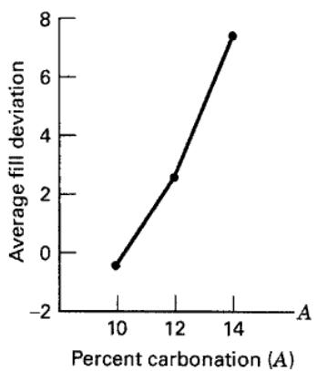  
(a)

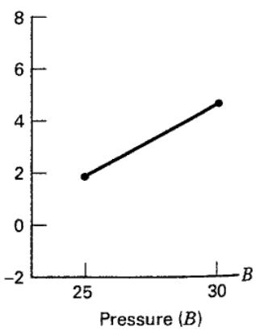  
(b)

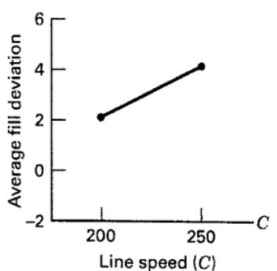  
(c)

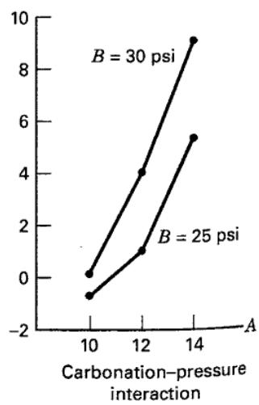  
(d)

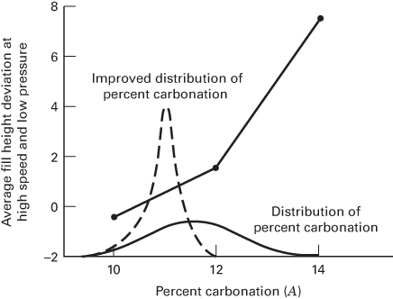  
■ FIGURE 5.17 Average fill height deviation at high speed and low pressure for different carbonation levels

We have indicated that if all the factors in a factorial experiment are fixed, test statistic construction is straightforward. The statistic for testing any main effect or interaction is always formed by dividing the mean square for the main effect or interaction by the mean square error. However, if the factorial experiment involves one or more random factors, the test statistic construction is not always done this way. We must examine the expected mean squares to determine the correct tests. We defer a complete discussion of experiments with random factors until Chapter 13.

## 5.5 Fitting Response Curves and Surfaces

The ANOVA always treats all of the factors in the experiment as if they were qualitative or categorical. However, many experiments involve at least one quantitative factor. It can be useful to fit a response curve to the levels of a quantitative factor so that the experimenter has an equation that relates the response to the factor. This equation might be used for interpolation, that is, for predicting the response at factor levels between those actually used in the experiment. When at least two factors are quantitative, we can fit a response surface for predicting y at various combinations of the design factors. In general, linear regression methods are used to fit these models to the experimental data. We illustrated this procedure in Section 3.5.1 for an experiment with a single factor. We now present two examples involving factorial experiments. In both examples, we will use a computer software package to generate the regression models. For more information about regression analysis, refer to Chapter 10 and the supplemental text material for this chapter.

## EXAMPLE 5.4

Consider the battery life experiment described in Example 5.1. The factor temperature is quantitative, and the material type is qualitative. Furthermore, there are three levels of temperature. Consequently, we can compute a linear and a quadratic temperature effect to study how temperature affects the battery life. Table 5.15 presents condensed output from Design-Expert for this experiment and assumes that temperature is quantitative and material type is qualitative.

The ANOVA in Table 5.15 shows that the “model” source of variability has been subdivided into several components. The components “A” and “ $A^{2}$ ” represent the linear and quadratic effects of temperature, and “B” represents the main effect of the material type factor. Recall that material type is a qualitative factor with three levels. The terms “AB” and “ $A^{2}B$ ” are the interactions of the linear and quadratic temperature factor with material type.

TABLE 5.15  
Design-Expert Output for Example 5.4

<table><tr><td>Response: Life</td><td colspan="6">In Hours</td></tr><tr><td colspan="7">ANOVA for Response Surface Reduced Cubic Model</td></tr><tr><td colspan="7">Analysis of Variance Table [Partial Sum of Squares]</td></tr><tr><td></td><td rowspan="2">Sum of Squares</td><td rowspan="2">DF</td><td rowspan="2">Mean Square</td><td rowspan="2">F Value</td><td rowspan="2">Prob &gt; F</td><td rowspan="2"></td></tr><tr><td>Source</td></tr><tr><td>Model</td><td>59416.22</td><td>8</td><td>7427.03</td><td>11.00</td><td>&lt;0.0001</td><td>significant</td></tr><tr><td>A</td><td>39042.67</td><td>1</td><td>39042.67</td><td>57.82</td><td>&lt;0.0001</td><td></td></tr><tr><td>B</td><td>10683.72</td><td>2</td><td>5341.86</td><td>7.91</td><td>0.0020</td><td></td></tr><tr><td> $A^2$ </td><td>76.06</td><td>1</td><td>76.06</td><td>0.11</td><td>0.7398</td><td></td></tr><tr><td>AB</td><td>2315.08</td><td>2</td><td>1157.54</td><td>1.71</td><td>0.1991</td><td></td></tr><tr><td> $A^2B$ </td><td>7298.69</td><td>2</td><td>3649.35</td><td>5.40</td><td>0.0106</td><td></td></tr><tr><td>Residual</td><td>18230.75</td><td>27</td><td>675.21</td><td></td><td></td><td></td></tr><tr><td>Lack of Fit</td><td>0.000</td><td>0</td><td></td><td></td><td></td><td></td></tr><tr><td>Pure Error</td><td>18230.75</td><td>27</td><td>675.21</td><td></td><td></td><td></td></tr><tr><td>Cor Total</td><td>77646.97</td><td>35</td><td></td><td></td><td></td><td></td></tr><tr><td>Std. Dev.</td><td>25.98</td><td></td><td>R-Squared</td><td>0.7652</td><td></td><td></td></tr><tr><td>Mean</td><td>105.53</td><td></td><td>Adj R-Squared</td><td>0.6956</td><td></td><td></td></tr><tr><td>C.V.</td><td>24.62</td><td></td><td>Pred R-Squared</td><td>0.5826</td><td></td><td></td></tr><tr><td>PRESS</td><td>32410.22</td><td></td><td>Adeq Precision</td><td>8.178</td><td></td><td></td></tr><tr><td></td><td>Coefficient Estimate</td><td>DF</td><td>Standard Error</td><td>95% CI Low</td><td>95% CI High</td><td>VIF</td></tr><tr><td>Intercept</td><td>107.58</td><td>1</td><td>7.50</td><td>92.19</td><td>122.97</td><td></td></tr><tr><td>A-Temp</td><td>-40.33</td><td>1</td><td>5.30</td><td>-51.22</td><td>-29.45</td><td>1.00</td></tr><tr><td>B[1]</td><td>-50.33</td><td>1</td><td>10.61</td><td>-72.10</td><td>-28.57</td><td></td></tr><tr><td>B[2]</td><td>12.17</td><td>1</td><td>10.61</td><td>-9.60</td><td>33.93</td><td></td></tr><tr><td> $A^2$ </td><td>-3.08</td><td>1</td><td>9.19</td><td>-21.93</td><td>15.77</td><td>1.00</td></tr><tr><td>AB[1]</td><td>1.71</td><td>1</td><td>7.50</td><td>-13.68</td><td>17.10</td><td></td></tr><tr><td>AB[2]</td><td>-12.79</td><td>1</td><td>7.50</td><td>-28.18</td><td>2.60</td><td></td></tr><tr><td> $A^2B[1]$ </td><td>41.96</td><td>1</td><td>12.99</td><td>15.30</td><td>68.62</td><td></td></tr><tr><td> $A^2B[2]$ </td><td>-14.04</td><td>1</td><td>12.99</td><td>-40.70</td><td>12.62</td><td></td></tr><tr><td colspan="7">Final Equation in Terms of Coded Factors:</td></tr><tr><td></td><td colspan="6">Life = +107.58</td></tr><tr><td></td><td>-40.33</td><td colspan="5">*A</td></tr><tr><td></td><td>-50.33</td><td colspan="5">*B[1]</td></tr><tr><td></td><td>+12.17</td><td colspan="5">*B[2]</td></tr><tr><td></td><td>-3.08</td><td colspan="5"> $*A^2$ </td></tr><tr><td></td><td>+1.71</td><td colspan="5">*AB[1]</td></tr><tr><td></td><td>-12.79</td><td colspan="5">*AB[2]</td></tr><tr><td></td><td>+41.96</td><td colspan="5"> $*A^2B[1]$ </td></tr><tr><td></td><td>-14.04</td><td colspan="5"> $*A^2[2]$ </td></tr></table>

■ TABLE 5.15 (Continued)

<table><tr><td colspan="2">Final Equation in Terms of Actual Factors:</td></tr><tr><td>Material Type</td><td>1</td></tr><tr><td>Life =</td><td></td></tr><tr><td>+169.38017</td><td></td></tr><tr><td>-2.50145</td><td>*Temp</td></tr><tr><td>+0.012851</td><td>*Temp $^{2}$ </td></tr><tr><td>Material Type</td><td>2</td></tr><tr><td>Life =</td><td></td></tr><tr><td>+159.62397</td><td></td></tr><tr><td>-0.17335</td><td>*Temp</td></tr><tr><td>+0.41627</td><td>*Temp $^{2}$ </td></tr><tr><td>Material Type</td><td>3</td></tr><tr><td>Life =</td><td></td></tr><tr><td>+132.76240</td><td></td></tr><tr><td>+0.90289</td><td>*Temp</td></tr><tr><td>-0.01248</td><td>*Temp $^{2}$ </td></tr></table>

  
■ FIGURE 5.18 Predicted life as a function of temperature for the three material types, Example 5.4

The P-values indicate that $A^{2}$ and AB are not significant, whereas the $A^{2}B$ term is significant. Often we think about removing nonsignificant terms or factors from a model, but in this case, removing $A^{2}$ and AB and retaining $A^{2}B$ will result in a model that is not hierarchical. The hierarchy principle indicates that if a model contains a high-order term (such as $A^{2}B$ ), it should also contain all of the lower order terms that compose it (in this case $A^{2}$ and AB). Hierarchy promotes a type of internal consistency in a model, and many statistical model builders rigorously follow the principle. However, hierarchy is not always a good idea, and many models actually work better as prediction equations without including the nonsignificant terms that promote hierarchy. For more information, see the supplemental text material for this chapter.

The computer output also gives model coefficient estimates and a final prediction equation for battery life in coded factors. In this equation, the levels of temperature are $A = -1, 0, +1$ , respectively, when temperature is at the low, middle, and high levels (15, 70, and 125°C). The variables B[1] and B[2] are coded indicator variables that are defined as follows:

<table><tr><td rowspan="2"></td><td colspan="3">Material Type</td></tr><tr><td>1</td><td>2</td><td>3</td></tr><tr><td>B[1]</td><td>1</td><td>0</td><td>-1</td></tr><tr><td>B[2]</td><td>0</td><td>1</td><td>-1</td></tr></table>

There are also prediction equations for battery life in terms of the actual factor levels. Notice that because material type is a qualitative factor there is an equation for predicted life as a function of temperature for each material type. Figure 5.18 shows the response curves generated by these three prediction equations. Compare them to the two-factor interaction graph for this experiment in Figure 5.9.

If several factors in a factorial experiment are quantitative a response surface may be used to model the relationship between y and the design factors. Furthermore, the quantitative factor effects may be represented by single-degree-of-freedom polynomial effects. Similarly, the interactions of quantitative factors can be partitioned into single-degree-of-freedom components of interaction. This is illustrated in the following Example 5.5.

## EXAMPLE 5.5

The effective life of a cutting tool installed in a numerically controlled machine is thought to be affected by the cutting speed and the tool angle. Three speeds and three angles are selected, and a $3^{2}$ factorial experiment with two replicates is performed. The coded data are shown in

Table 5.16. The circled numbers in the cells are the cell totals $\{y_{ij}\}$ .

Table 5.17 shows the JMP output for this experiment. This is a classical ANOVA, treating both factors as categorical. Notice that design factors tool angle and speed as well

## TABLE 5.16

Data for Tool Life Experiment

<table><tr><td rowspan="2">Total Angle(degrees)</td><td colspan="6">Cutting Speed (in/min)</td></tr><tr><td colspan="2">125</td><td colspan="2">150</td><td>175</td><td> $y_{i..}$ </td></tr><tr><td></td><td>-2</td><td>-3</td><td>-3</td><td>-3</td><td>2</td><td rowspan="3">-1</td></tr><tr><td>15</td><td>-1</td><td>0</td><td>0</td><td>3</td><td>5</td></tr><tr><td></td><td>0</td><td>1</td><td>1</td><td>4</td><td>10</td></tr><tr><td>20</td><td>2</td><td>3</td><td>4</td><td>6</td><td>10</td><td>16</td></tr><tr><td></td><td>-1</td><td>5</td><td>5</td><td>0</td><td>-1</td><td>9</td></tr><tr><td>25</td><td>0</td><td>6</td><td>11</td><td>-1</td><td>-1</td><td rowspan="2">24 =  $y_{...}$ </td></tr><tr><td> $y_{j.}$ </td><td>-2</td><td>12</td><td></td><td>14</td><td></td></tr></table>

## Response Tool Life Whole Model Actual by Predicted Plot

Effect Tests  
  
Tool life predicted  
$P = 0.0013\mathrm{RSq} = 0.90$  
RMSE = 1.2019

Summary of Fit

<table><tr><td>RSquare</td><td>0.895161</td></tr><tr><td>RSquare Adj</td><td>0.801971</td></tr><tr><td>Root Mean Square Error</td><td>1.20185</td></tr><tr><td>Mean of Response</td><td>1.333333</td></tr><tr><td>Observations (or Sum Wgts)</td><td>18</td></tr></table>

Analysis of Variance

<table><tr><td>Source</td><td>DF</td><td>Sum of Squares</td><td>Mean Square</td><td>F Ratio</td></tr><tr><td>Model</td><td>8</td><td>111.00000</td><td>13.8750</td><td>9.6058</td></tr><tr><td>Error</td><td>9</td><td>13.00000</td><td>1.4444</td><td>Prob &gt; F</td></tr><tr><td>C. Total</td><td>17</td><td>124.00000</td><td></td><td>0.0013</td></tr></table>

<table><tr><td>Source</td><td>Nparm</td><td>DF</td><td>Sum of Squares</td><td>F Ratio</td><td>Prob &gt; F</td></tr><tr><td>Angle</td><td>2</td><td>2</td><td>24.333333</td><td>8.4231</td><td>0.0087</td></tr><tr><td>Speed</td><td>2</td><td>2</td><td>25.333333</td><td>8.7692</td><td>0.0077</td></tr><tr><td>Angle*Speed</td><td>4</td><td>4</td><td>61.333333</td><td>10.6154</td><td>0.0018</td></tr></table>

Residual by Predicted Plot  

as the angle–speed interaction are significant. Since the factors are quantitative, and both factors have three levels, a second-order model such as

$$
y = \beta_ {0} + \beta_ {1} x _ {1} + \beta_ {2} x _ {2} + \beta_ {1 2} x _ {1} x _ {2} + \beta_ {1 1} x _ {1} ^ {2} + \beta_ {2 2} x _ {2} ^ {2} + \epsilon
$$

where $x_{1}=$ angle and $x_{2}=$ speed could also be fit to the data. The JMP output for this model is shown in Table 5.18. Notice that JMP “centers” the predictors when forming the interaction and quadratic model terms. The second-order model doesn’t look like a very good fit to the data; the value of $R^{2}$ is only 0.465 (compared to $R^{2}=0.895$ in the categorical variable ANOVA) and the only significant factor is the linear term in speed for which the P-value is 0.0731. Notice that the mean square for error in the second-order model fit is 5.5278, considerably larger than it was in the classical categorical variable ANOVA of Table 5.17. The JMP output in Table 5.18 shows the prediction profiler, a graphical display showing the response variable life as a function of each design factor, angle and speed. The prediction profiler is very useful for optimization. Here it has been set to the levels of angle and speed that result in maximum predicted life.

## TABLE 5.18

<table><tr><td colspan="2">Summary of PR</td></tr><tr><td>RSquare</td><td>0.465054</td></tr><tr><td>RSquare Adj</td><td>0.242159</td></tr><tr><td>Root Mean Square Error</td><td>2.351123</td></tr><tr><td>Mean of Response</td><td>1.333333</td></tr><tr><td>Observations (or Sum Wgts)</td><td>18</td></tr></table>

Analysis of Variance

<table><tr><td>Source</td><td>DF</td><td>Sum of Squares</td><td>Mean Square</td><td>F Ratio</td></tr><tr><td>Model</td><td>5</td><td>57.66667</td><td>11.5333</td><td>2.0864</td></tr><tr><td>Error</td><td>12</td><td>66.33333</td><td>5.5278</td><td>Prob &gt; F</td></tr><tr><td>C. Total</td><td>17</td><td>124.00000</td><td></td><td>0.1377</td></tr></table>

Parameter Estimates

<table><tr><td>Term</td><td>Estimate</td><td>Std. Error</td><td>t Ratio</td><td>Prob &gt; |t|</td></tr><tr><td>Intercept</td><td>-8</td><td>5.048683</td><td>-1.58</td><td>0.1390</td></tr><tr><td>Angle</td><td>0.1666667</td><td>0.135742</td><td>1.23</td><td>0.2431</td></tr><tr><td>Speed</td><td>0.0533333</td><td>0.027148</td><td>1.96</td><td>0.0731</td></tr><tr><td>(Angle-20)*(Speed-150)</td><td>-0.008</td><td>0.00665</td><td>-1.20</td><td>0.2522</td></tr><tr><td>(Angle-20)*(Angle-20)</td><td>-0.08</td><td>0.047022</td><td>-1.70</td><td>0.1146</td></tr><tr><td>(Speed-150)*(Speed-150)</td><td>-0.0016</td><td>0.001881</td><td>-0.85</td><td>0.4116</td></tr></table>

Prediction Profiler  

Part of the reason for the relatively poor fit of the second-order model is that only one of the four degrees of freedom for interaction are accounted for in this model. In addition to the term $\beta_{12}x_{1}x_{2}$ , there are three other terms that could be fit to completely account for the four degrees of freedom for interaction, namely $\beta_{112}x_{1}^{2}x_{2}, \beta_{122}x_{1}x_{2}^{2}$ , and $\beta_{1122}x_{1}^{2}x_{2}^{2}$ .

  
■ FIGURE 5.19 Two-dimensional contour plot of the tool life response surface for Example 5.5

JMP output for the second-order model with the additional higher-order terms is shown in Table 5.19. While these higher-order terms are components of the two-factor interaction, the final model is a reduced quartic. Although there are some large P-values, all model terms have been retained to ensure hierarchy. The prediction profiler

  
■ FIGURE 5.20 Three-dimensional tool life response surface for Example 5.5

Y Predicted P = 0.0013
RSq = 0.90 RMSE = 1.2019

indicates that maximum tool life is achieved around an angle of 25 degrees and speed of 150 in/min.

Figure 5.19 is the contour plot of tool life for this model and Figure 5.20 is a three-dimensional response surface plot. These plots confirm the estimate of the optimum operating conditions found from the JMP prediction profiler. Exploration of response surfaces is an important use of designed experiments, which we will discuss in more detail in Chapter 11.

## TABLE 5.19

JMP Output for the Expanded Model in Example 5.5

Response Y
Actual by Predicted Plot  

Summary of Fit

<table><tr><td>RSquare</td><td>0.895161</td></tr><tr><td>RSquare Adj</td><td>0.801971</td></tr><tr><td>Root Mean Square Error</td><td>1.20185</td></tr><tr><td>Mean of Response</td><td>1.333333</td></tr><tr><td>Observations (or Sum Wgts)</td><td>18</td></tr></table>

Analysis of Variance

<table><tr><td>Source</td><td>DF</td><td>Sum of Squares</td><td>Mean Square</td><td>F Ratio</td></tr><tr><td>Model</td><td>8</td><td>111.00000</td><td>13.8750</td><td>9.6058</td></tr><tr><td>Error</td><td>9</td><td>13.00000</td><td>1.4444</td><td>Prob &gt; F</td></tr><tr><td>C. Total</td><td>17</td><td>124.00000</td><td></td><td>0.0013*</td></tr></table>

Parameter Estimates

<table><tr><td>Term</td><td>Estimate</td><td>Std Error</td><td>t Ratio</td><td>Prob &gt; |t|</td></tr><tr><td>Intercept</td><td>-24</td><td>4.41588</td><td>-5.43</td><td>0.0004*</td></tr><tr><td>Angle</td><td>0.7</td><td>0.120185</td><td>5.82</td><td>0.0003*</td></tr><tr><td>Speed</td><td>0.08</td><td>0.024037</td><td>3.33</td><td>0.0088*</td></tr><tr><td>(Angle-20)*(Speed-150)</td><td>-0.008</td><td>0.003399</td><td>-2.35</td><td>0.0431*</td></tr><tr><td>(Angle-20)*(Angle-20)</td><td>2.776e-17</td><td>0.041633</td><td>0.00</td><td>1.0000</td></tr><tr><td>(Speed-150)*(Speed-150)</td><td>0.0016</td><td>0.001665</td><td>0.96</td><td>0.3618</td></tr><tr><td>(Angle-20)*(Speed-150)*(Angle-20)</td><td>-0.0016</td><td>0.001178</td><td>-1.36</td><td>0.2073</td></tr><tr><td>(Speed-150)*(Speed-150)*(Angle-20)</td><td>-0.00128</td><td>0.000236</td><td>-5.43</td><td>0.0004*</td></tr><tr><td>(Angle-20)*(Speed-150)*(Angle-20)*(Speed-150)</td><td>-0.000192</td><td>8.158a-5</td><td>-2.35</td><td>0.0431*</td></tr></table>

■ TABLE 5.19 (Continued)

<table><tr><td colspan="6">Effect Tests</td></tr><tr><td>Source</td><td>Nparm</td><td>DF</td><td>Sum of Squares</td><td>F Ratio</td><td>Prob &gt; F</td></tr><tr><td>Angle</td><td>1</td><td>1</td><td>49.000000</td><td>33.9231</td><td>0.0003*</td></tr><tr><td>Speed</td><td>1</td><td>1</td><td>16.000000</td><td>11.0769</td><td>0.0088*</td></tr><tr><td>Angle*Speed</td><td>1</td><td>1</td><td>8.000000</td><td>5.5385</td><td>0.0431*</td></tr><tr><td>Angle*Angle</td><td>1</td><td>1</td><td>6.4198e-31</td><td>0.0000</td><td>1.0000</td></tr><tr><td>Speed*Speed</td><td>1</td><td>1</td><td>1.333333</td><td>0.9231</td><td>0.3618</td></tr><tr><td>Angle*Speed*Angle</td><td>1</td><td>1</td><td>2.666667</td><td>1.8462</td><td>0.2073</td></tr><tr><td>Speed*Speed*Angle</td><td>1</td><td>1</td><td>42.666667</td><td>29.5385</td><td>0.0004*</td></tr><tr><td>Angle*Speed*Angle*Speed</td><td>1</td><td>1</td><td>8.000000</td><td>5.5385</td><td>0.0431*</td></tr></table>

<table><tr><td>Term</td><td>Estimate</td><td>Std Error</td><td>t Ratio</td><td></td><td>Prob &gt; |t|</td></tr><tr><td>Angle</td><td>0.7</td><td>0.120185</td><td>5.82</td><td></td><td>0.0003*</td></tr><tr><td>(Speed-150)*(Speed-150)*(Angle-20)</td><td>-0.00128</td><td>0.000236</td><td>-5.43</td><td></td><td>0.0004*</td></tr><tr><td>Speed</td><td>0.08</td><td>0.024037</td><td>3.33</td><td></td><td>0.0088*</td></tr><tr><td>(Angle-20)*(Speed-150)*(Angle-20)*(Speed-150)</td><td>-0.000192</td><td>8.158a-5</td><td>-2.35</td><td></td><td>0.0431*</td></tr><tr><td>(Angle-20)*(Speed-150)</td><td>-0.008</td><td>0.003399</td><td>-2.35</td><td></td><td>0.0431*</td></tr><tr><td>(Angle-20)*(Speed-150)*(Angle-20)</td><td>-0.0016</td><td>0.001178</td><td>-1.36</td><td></td><td>0.2073</td></tr><tr><td>(Speed-150)*(Speed-150)</td><td>0.0016</td><td>0.001665</td><td>0.96</td><td></td><td>0.3618</td></tr><tr><td>(Angle-20)*(Angle-20)</td><td>2.776e-17</td><td>0.041633</td><td>0.00</td><td></td><td>1.0000</td></tr></table>

Prediction Profiler  

## 5.6 Blocking in a Factorial Design

We have discussed factorial designs in the context of a completely randomized experiment. Sometimes, it is not feasible or practical to completely randomize all of the runs in a factorial. For example, the presence of a nuisance factor may require that the experiment be run in blocks. We discussed the basic concepts of blocking in the context of a single-factor experiment in Chapter 4. We now show how blocking can be incorporated in a factorial. Some other aspects of blocking in factorial designs are presented in Chapters 7–9, and 13.

Consider a factorial experiment with two factors (A and B) and n replicates. The linear statistical model for this design is

$$
y _ {i j k} = \mu + \tau_ {i} + \beta_ {j} + (\tau \beta) _ {i j} + \epsilon_ {i j k} \qquad \left\{ \begin{array}{l} i = 1, 2, \ldots , a \\ j = 1, 2, \ldots , b \\ k = 1, 2, \ldots , n \end{array} \right.\tag{5.33}
$$

where $\tau_{i}, \beta_{j}$ , and $(\tau\beta)_{ij}$ represent the effects of factors A, B, and the AB interaction, respectively. Now suppose that to run this experiment a particular raw material is required. This raw material is available in batches that are not large enough to allow all abn treatment combinations to be run from the same batch. However, if a batch contains enough material for ab observations, then an alternative design is to run each of the n replicates using a separate batch of raw material. Consequently, the batches of raw material represent a randomization restriction or a block, and a single replicate of a complete factorial experiment is run within each block. The effects model for this new design is

$$
y _ {i j k} = \mu + \tau_ {i} + \beta_ {j} + (\tau \beta) _ {i j} + \delta_ {k} + \epsilon_ {i j k} \quad \left\{ \begin{array}{l} i = 1, 2, \dots , a \\ j = 1, 2, \dots , b \\ k = 1, 2, \dots , n \end{array} \right.\tag{5.34}
$$

where $\delta_{k}$ is the effect of the kth block. Of course, within a block the order in which the treatment combinations are run is completely randomized.

The model (Equation 5.34) assumes that interaction between blocks and treatments is negligible. This was assumed previously in the analysis of randomized block designs. If these interactions do exist, they cannot be separated from the error component. In fact, the error term in this model really consists of the $(\tau\delta)_{ik}, (\beta\delta)_{jk}$ , and $(\tau\beta\delta)_{ijk}$ interactions. The ANOVA is outlined in Table 5.20. The layout closely resembles that of a factorial design, with the

## TABLE 5.20

Analysis of Variance for a Two-Factor Factorial in a Randomized Complete Block

<table><tr><td>Source of Variation</td><td>Sum of Squares</td><td>Degrees of Freedom</td><td>Expected Mean Square</td><td> $F_0$ </td></tr><tr><td>Blocks</td><td> $\frac{1}{ab}\sum_{k}y_{..k}^{2}-\frac{y_{...}^{2}}{abn}$ </td><td> $n-1$ </td><td> $\sigma^{2}+ab\sigma_{\delta}^{2}$ </td><td></td></tr><tr><td>A</td><td> $\frac{1}{bn}\sum_{i}y_{i..}^{2}-\frac{y_{...}^{2}}{abn}$ </td><td> $a-1$ </td><td> $\sigma^{2}+\frac{bn\sum\tau_{i}^{2}}{a-1}$ </td><td> $\frac{MS_A}{MS_E}$ </td></tr><tr><td>B</td><td> $\frac{1}{an}\sum_{j}y_{.j.}^{2}-\frac{y_{...}^{2}}{abn}$ </td><td> $b-1$ </td><td> $\sigma^{2}+\frac{an\sum\beta_{j}^{2}}{b-1}$ </td><td> $\frac{MS_B}{MS_E}$ </td></tr><tr><td>AB</td><td> $\frac{1}{n}\sum_{i}\sum_{j}y_{ij.}^{2}-\frac{y_{...}^{2}}{abn}-SS_A-SS_B$ </td><td> $(a-1)(b-1)$ </td><td> $\sigma^{2}+\frac{n\sum\sum(\tau\beta)_{ij}^{2}}{(a-1)(b-1)}$ </td><td> $\frac{MS_{AB}}{MS_E}$ </td></tr><tr><td>Error</td><td>Subtraction</td><td> $(ab-1)(n-1)$ </td><td> $\sigma^{2}$ </td><td></td></tr><tr><td>Total</td><td> $\sum_{i}\sum_{j}\sum_{k}y_{ijk}^{2}-\frac{y_{...}^{2}}{abn}$ </td><td> $abn-1$ </td><td></td><td></td></tr></table>

error sum of squares reduced by the sum of squares for blocks. Computationally, we find the sum of squares for blocks as the sum of squares between the n block totals $\{y_{..k}\}$ . The ANOVA in Table 5.20 assumes that both factors are fixed and that blocks are random. The ANOVA estimator of the variance component for blocks $\sigma_{\delta}^{2}$ , is

$$
\sigma_ {\delta} ^ {2} = \frac {M S _ {\mathrm{Blocks}} - M S _ {E}}{a b}
$$

In the previous example, the randomization was restricted to within a batch of raw material. In practice, a variety of phenomena may cause randomization restrictions, such as time and operators. For example, if we could not run the entire factorial experiment on one day, then the experimenter could run a complete replicate on day 1, a second replicate on day 2, and so on. Consequently, each day would be a block.

## EXAMPLE 5.6

An engineer is studying methods for improving the ability to detect targets on a radar scope. Two factors she considers to be important are the amount of background noise, or "ground clutter," on the scope and the type of filter placed over the screen. An experiment is designed using three levels of ground clutter and two filter types. We will consider these as fixed-type factors. The experiment is performed by randomly selecting a treatment combination (ground clutter level and filter type) and then introducing a signal representing the target into the scope. The intensity of this target is increased until the operator observes it. The intensity level at detection is then measured as the response variable. Because of operator availability, it is convenient to select an operator and keep him or her at the scope until all the necessary runs have been made. Furthermore, operators differ in their skill and ability to use the scope. Consequently, it seems logical to use the operators as blocks. Four operators are randomly selected. Once an operator is chosen, the order in which the six treatment combinations are run is randomly determined. Thus, we have a $3 \times 2$ factorial experiment run in a randomized complete block. The data are shown in Table 5.21.

The linear model for this experiment is

$$
y _ {i j k} = \mu + \tau_ {i} + \beta_ {j} + (\tau \beta) _ {i j} + \delta_ {k} + \epsilon_ {i j k} \qquad \left\{ \begin{array}{l} i = 1, 2, 3 \\ j = 1, 2 \\ k = 1, 2, 3, 4 \end{array} \right.
$$

where $\tau_{i}$ represents the ground clutter effect, $\beta_{j}$ represents the filter type effect, $(\tau \beta)_{ij}$ is the interaction, $\delta_{k}$ is the block effect, and $\epsilon_{ijk}$ is the NID(0, $\sigma^2$ ) error component. The sums of squares for ground clutter, filter type, and their interaction are computed in the usual manner. The sum of squares due to blocks is found from the operator totals $\{y_{..k}\}$ as follows:

$$
\begin{array}{r l} S S _ {\text {Blocks}} & = \frac {1}{a b} \sum_ {k = 1} ^ {n} y _ {\cdot , k} ^ {2} - \frac {y _ {\cdot \cdot} ^ {2}}{a b n} \\ & = \frac {1}{(3) (2)} [ (5 7 2) ^ {2} + (5 7 9) ^ {2} + (5 9 7) ^ {2} + (5 3 0) ^ {2} ] \\ & - \frac {(2 2 7 8) ^ {2}}{(3) (2) (4)} \\ & = 4 0 2. 1 7 \end{array}
$$

## TABLE 5.21

Intensity Level at Target Detection

<table><tr><td rowspan="2">Operators (blocks)Filter Type</td><td colspan="2">1</td><td colspan="2">2</td><td colspan="2">3</td><td colspan="2">4</td></tr><tr><td>1</td><td>2</td><td>1</td><td>2</td><td>1</td><td>2</td><td>1</td><td>2</td></tr><tr><td colspan="9">Ground clutter</td></tr><tr><td>Low</td><td>90</td><td>86</td><td>96</td><td>84</td><td>100</td><td>92</td><td>92</td><td>81</td></tr><tr><td>Medium</td><td>102</td><td>87</td><td>106</td><td>90</td><td>105</td><td>97</td><td>96</td><td>80</td></tr><tr><td>High</td><td>114</td><td>93</td><td>112</td><td>91</td><td>108</td><td>95</td><td>98</td><td>83</td></tr></table>

TABLE 5.22  
Analysis of Variance for Example 5.6

<table><tr><td>Source of Variation</td><td>Sum of Square</td><td>Degrees of Freedom</td><td>Mean Squares</td><td> $F_0$ </td><td>P-Value</td></tr><tr><td>Ground clutter (G)</td><td>335.58</td><td>2</td><td>167.79</td><td>15.13</td><td>0.0003</td></tr><tr><td>Filter type (F)</td><td>1066.67</td><td>1</td><td>1066.67</td><td>96.19</td><td>&lt;0.0001</td></tr><tr><td>GF</td><td>77.08</td><td>2</td><td>38.54</td><td>3.48</td><td>0.0573</td></tr><tr><td>Blocks</td><td>402.17</td><td>3</td><td>134.06</td><td></td><td></td></tr><tr><td>Error</td><td>166.33</td><td>15</td><td>11.09</td><td></td><td></td></tr><tr><td>Total</td><td>2047.83</td><td>23</td><td></td><td></td><td></td></tr></table>

The complete ANOVA for this experiment is summarized in Table 5.22. The presentation in Table 5.22 indicates that all effects are tested by dividing their mean squares by the mean square error. Both ground clutter level and filter type are significant at the 1 percent level, whereas their interaction is significant only at the 10 percent level. Thus, we conclude that both ground clutter level and the type of scope filter used affect the operator's ability to detect the target, and there is some evidence of mild interaction between these factors. The ANOVA estimate of the variance component for

$$
\hat {\sigma} _ {\delta} ^ {2} = \frac {M S _ {\mathrm{Blocks}} - M S _ {E}}{a b} = \frac {1 3 4 . 0 6 - 1 1 . 0 9}{(3 1 6 2)} = 2 0. 5 0
$$

blocks is

## TABLE 5.23

The JMP output for this experiment is shown in Table 5.23. The residual maximum likelihood (REML) estimate of the variance component for blocks is shown in this output, and because this is a balanced design, the REML and ANOVA estimates agree. JMP also provides the confidence intervals on both variance components $\sigma^{2}$ and $\sigma_{\delta}^{2}$ .

## JMP Output for Example 5.6

Whole Model
Actual by Predicted Plot  

Mean of Response 94.91667

## Summary of Fit

Root Mean Square Error 3.329998

Observations (or Sum Wgts) 24

RSquare 0.917432

RSquare Adj 0.894497

TABLE 5.23 (Continued)  
REML Variance Component Estimates

<table><tr><td>Random Effect</td><td>Var Ratio</td><td>Var Component</td><td>Std Error</td><td>95% Lower</td><td>95% Upper</td><td>Pct of Total</td></tr><tr><td>Operators (Blocks)</td><td>1.8481964</td><td>20.494444</td><td>18.255128</td><td>-15.28495</td><td>56.273839</td><td>64.890</td></tr><tr><td>Residual</td><td></td><td>11.088889</td><td>4.0490897</td><td>6.0510389</td><td>26.561749</td><td>35.110</td></tr><tr><td>Total</td><td></td><td>31.583333</td><td></td><td></td><td></td><td>100.000</td></tr></table>

-2 LogLikelihood = 118.73680261

Covariance Matrix of

<table><tr><td>Random Effect</td><td>Operators (Blocks)</td><td>Residual</td></tr><tr><td>Operators (Blocks)</td><td>333.24972</td><td>-2.732521</td></tr><tr><td>Residual</td><td>-2.732521</td><td>16.395128</td></tr></table>

Fixed Effect Tests

<table><tr><td>Source</td><td>Nparm</td><td>DF</td><td>DFDen</td><td>F Ratio</td><td>Prob &gt; F</td></tr><tr><td>Clutter</td><td>2</td><td>2</td><td>15</td><td>15.1315</td><td>0.0003*</td></tr><tr><td>Filter Type</td><td>1</td><td>1</td><td>15</td><td>96.1924</td><td>&lt;.0001*</td></tr><tr><td>Clutter*Filter Type</td><td>2</td><td>2</td><td>15</td><td>3.4757</td><td>0.0575</td></tr></table>

Residual by Predicted Plot  

TABLE 5.24  
Radar Detection Experiment Run in a 6 × 6 Latin Square

<table><tr><td rowspan="2">Day</td><td colspan="6">Operator</td></tr><tr><td>1</td><td>2</td><td>3</td><td>4</td><td>5</td><td>6</td></tr><tr><td>1</td><td> $A(f_1g_1=90)$ </td><td> $B(f_1g_2=106)$ </td><td> $C(f_1g_3=108)$ </td><td> $D(f_2g_1=81)$ </td><td> $F(f_2g_3=90)$ </td><td> $E(f_2g_2=88)$ </td></tr><tr><td>2</td><td> $C(f_1g_3=114)$ </td><td> $A(f_1g_1=96)$ </td><td> $B(f_1g_2=105)$ </td><td> $F(f_2g_3=83)$ </td><td> $E(f_2g_2=86)$ </td><td> $D(f_2g_1=84)$ </td></tr><tr><td>3</td><td> $B(f_1g_2=102)$ </td><td> $E(f_2g_2=90)$ </td><td> $G(f_2g_3=95)$ </td><td> $A(f_1g_1=92)$ </td><td> $D(f_2g_1=85)$ </td><td> $C(f_1g_3=104)$ </td></tr><tr><td>4</td><td> $E(f_2g_2=87)$ </td><td> $D(f_2g_1=84)$ </td><td> $A(f_1g_1=100)$ </td><td> $B(f_1g_2=96)$ </td><td> $C(f_1g_3=110)$ </td><td> $F(f_2g_3=91)$ </td></tr><tr><td>5</td><td> $F(f_2g_3=93)$ </td><td> $C(f_1g_3=112)$ </td><td> $D(f_2g_1=92)$ </td><td> $E(f_2g_2=80)$ </td><td> $A(f_1g_1=90)$ </td><td> $B(f_1g_2=98)$ </td></tr><tr><td>6</td><td> $D(f_2g_1=86)$ </td><td> $F(f_2g_3=91)$ </td><td> $E(f_2g_2=97)$ </td><td> $C(f_1g_3=98)$ </td><td> $B(f_1g_2=100)$ </td><td> $A(f_1g_1=92)$ </td></tr></table>

are considered as blocks. Suppose now that because of the setup time required, only six runs can be made per day. Thus, days become a second randomization restriction, resulting in the $6 \times 6$ Latin square design, as shown in Table 5.24. In this table, we have used the lowercase letters $f_{i}$ and $g_{j}$ to represent the ith and jth levels of filter type and ground clutter, respectively. That is, $f_{1}g_{2}$ represents filter type 1 and medium ground clutter. Note that now six operators are required, rather than four as in the original experiment, so the number of treatment combinations in the $3 \times 2$ factorial design exactly equals the number of restriction levels. Furthermore, in this design, each operator would be used only once on each day. The Latin letters A, B, C, D, E, and F represent the $3 \times 2 = 6$ factorial treatment combinations as follows: $A = f_{1}g_{1}$ , $B = f_{1}g_{2}$ , $C = f_{1}g_{3}$ , $D = f_{2}g_{1}$ , $E = f_{2}g_{2}$ , and $F = f_{2}g_{3}$ .

The five degrees of freedom between the six Latin letters correspond to the main effects of filter type (one degree of freedom), ground clutter (two degrees of freedom), and their interaction (two degrees of freedom). The linear statistical model for this design is

$$
y _ {i j k l} = \mu + \alpha_ {i} + \tau_ {j} + \beta_ {k} + (\tau \beta) _ {j k} + \theta_ {l} + \epsilon_ {i j k l} \qquad \left\{ \begin{array}{l} i = 1, 2, \ldots , 6 \\ j = 1, 2, 3 \\ k = 1, 2 \\ l = 1, 2, \ldots , 6 \end{array} \right.\tag{5.35}
$$

where $\tau_{j}$ and $\beta_{k}$ are effects of ground clutter and filter type, respectively, and $\alpha_{i}$ and $\theta_{l}$ represent the randomization restrictions of days and operators, respectively. To compute the sums of squares, the following two-way table of treatment totals is helpful:

<table><tr><td>Ground Clutter</td><td>Filter Type 1</td><td>Filter Type 2</td><td> $y_{j..}$ </td></tr><tr><td>Low</td><td>560</td><td>512</td><td>1072</td></tr><tr><td>Medium</td><td>607</td><td>528</td><td>1135</td></tr><tr><td>High</td><td>646</td><td>543</td><td>1189</td></tr><tr><td> $y_{..k.}$ </td><td>1813</td><td>1583</td><td>3396 =  $y_{....}$ </td></tr></table>

## TABLE 5.25

Analysis of Variance for the Radar Detection Experiment Run as a $3 \times 2$ Factorial in a Latin Square

<table><tr><td>Source of Variation</td><td>Sum of Squares</td><td>Degrees of Freedom</td><td>General Formula for Degrees of Freedom</td><td>Mean Square</td><td> $F_0$ </td><td>P-Value</td></tr><tr><td>Ground clutter (G)</td><td>571.50</td><td>2</td><td>a - 1</td><td>285.75</td><td>28.86</td><td>&lt;0.0001</td></tr><tr><td>Filter type (F)</td><td>1469.44</td><td>1</td><td>b - 1</td><td>1469.44</td><td>148.43</td><td>&lt;0.0001</td></tr><tr><td>GF</td><td>126.73</td><td>2</td><td>(a - 1)(b - 1)</td><td>63.37</td><td>6.40</td><td>0.0071</td></tr><tr><td>Days (rows)</td><td>4.33</td><td>5</td><td>ab - 1</td><td>0.87</td><td></td><td></td></tr><tr><td>Operators (columns)</td><td>428.00</td><td>5</td><td>ab - 1</td><td>85.60</td><td></td><td></td></tr><tr><td>Error</td><td>198.00</td><td>20</td><td>(ab - 1)(ab - 2)</td><td>9.90</td><td></td><td></td></tr><tr><td>Total</td><td>2798.00</td><td>35</td><td>(ab) $^2$  - 1</td><td></td><td></td><td></td></tr></table>

Furthermore, the row and column totals are

<table><tr><td>Rows ( $y_{jkl}$ ):</td><td>563</td><td>568</td><td>568</td><td>568</td><td>565</td><td>564</td></tr><tr><td>Columns ( $y_{ijk}$ ):</td><td>572</td><td>579</td><td>597</td><td>530</td><td>561</td><td>557</td></tr></table>

The ANOVA is summarized in Table 5.25. We have added a column to this table indicating how the number of degrees of freedom for each sum of squares is determined.