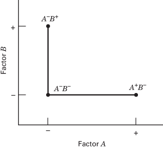
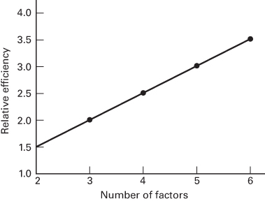

## 5.2 The Advantage of Factorials

The advantage of factorial designs can be easily illustrated. Suppose that we have two factors A and B, each at two levels. We denote the levels of the factors by $A^{-}$ , $A^{+}$ , $B^{-}$ , and $B^{+}$ . Information on both factors could be obtained by varying the factors one at a time, as shown in Figure 5.7. The effect of changing factor A is given by $A^{+}B^{-}-A^{-}B^{-}$ , and the effect of changing factor B is given by $A^{-}B^{+}-A^{-}B^{-}$ . Because experimental error is present, it is desirable to take two observations, say, at each treatment combination and estimate the effects of the factors using average responses. Thus, a total of six observations are required.

  
■ FIGURE 5.7 A one-factor-at-a-time experiment

  
■ FIGURE 5.8 Relative efficiency of a  
factorial design to a one-factor-at-a-time experiment (two-level factors)

If a factorial experiment had been performed, an additional treatment combination, $A^{+}B^{+}$ , would have been taken. Now, using just four observations, two estimates of the A effect can be made: $A^{+}B^{-}-A^{-}B^{-}$ and $A^{+}B^{+}-A^{-}B^{+}$ . Similarly, two estimates of the B effect can be made. These two estimates of each main effect could be averaged to produce average main effects that are just as precise as those from the single-factor experiment, but only four total observations are required and we would say that the relative efficiency of the factorial design to the one-factor-at-a-time experiment is $(6/4)=1.5$ . Generally, this relative efficiency will increase as the number of factors increases, as shown in Figure 5.8.

Now suppose interaction is present. If the one-factor-at-a-time design indicated that $A^{-}B^{+}$ and $A^{+}B^{-}$ gave better responses than $A^{-}B^{-}$ , a logical conclusion would be that $A^{+}B^{+}$ would be even better. However, if interaction is present, this conclusion may be seriously in error. For an example, refer to the experiment in Figure 5.2.

In summary, note that factorial designs have several advantages. They are more efficient than one-factor-at-a-time experiments. Furthermore, a factorial design is necessary when interactions may be present to avoid misleading conclusions. Finally, factorial designs allow the effects of a factor to be estimated at several levels of the other factors, yielding conclusions that are valid over a range of experimental conditions.
