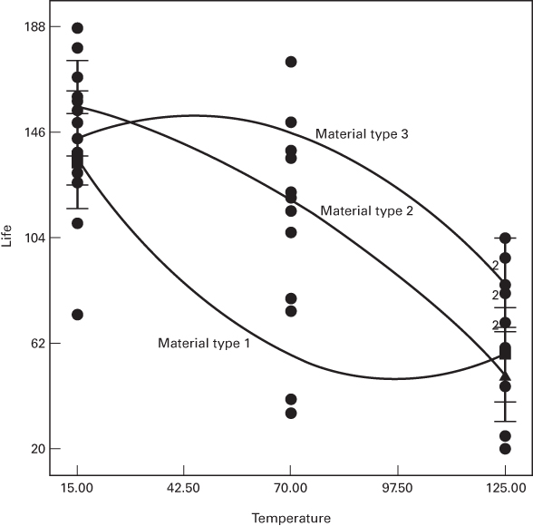
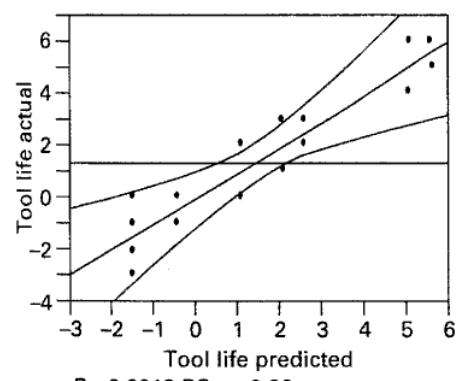
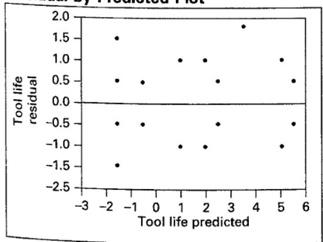
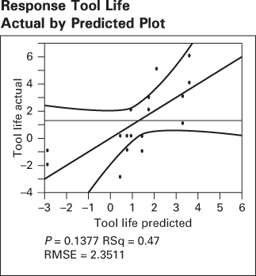
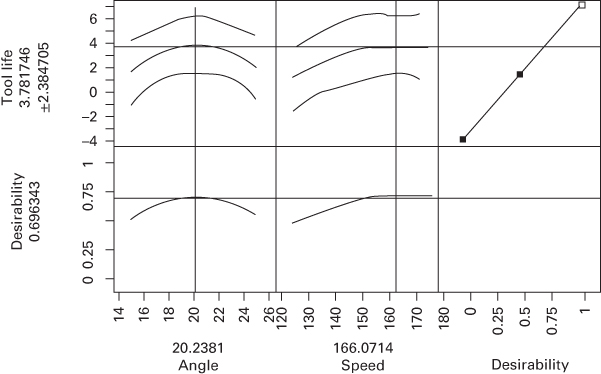
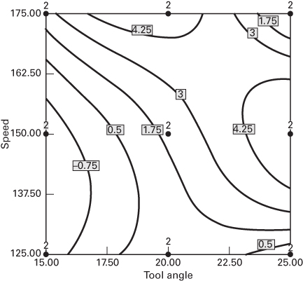
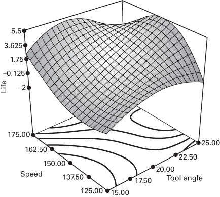
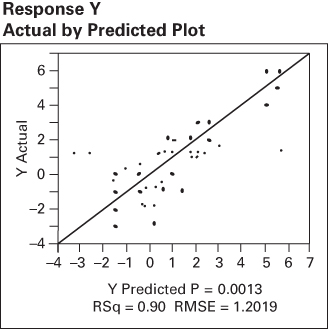
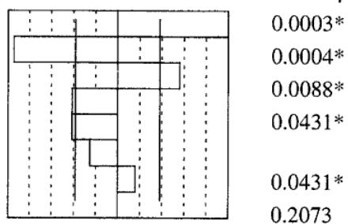
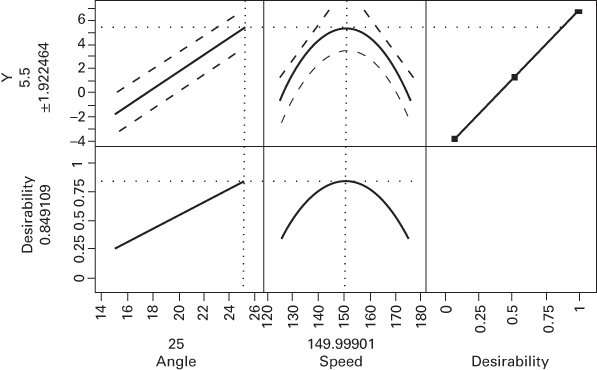

## 5.5 Fitting Response Curves and Surfaces

The ANOVA always treats all of the factors in the experiment as if they were qualitative or categorical. However, many experiments involve at least one quantitative factor. It can be useful to fit a response curve to the levels of a quantitative factor so that the experimenter has an equation that relates the response to the factor. This equation might be used for interpolation, that is, for predicting the response at factor levels between those actually used in the experiment. When at least two factors are quantitative, we can fit a response surface for predicting y at various combinations of the design factors. In general, linear regression methods are used to fit these models to the experimental data. We illustrated this procedure in Section 3.5.1 for an experiment with a single factor. We now present two examples involving factorial experiments. In both examples, we will use a computer software package to generate the regression models. For more information about regression analysis, refer to Chapter 10 and the supplemental text material for this chapter.

## EXAMPLE 5.4

Consider the battery life experiment described in Example 5.1. The factor temperature is quantitative, and the material type is qualitative. Furthermore, there are three levels of temperature. Consequently, we can compute a linear and a quadratic temperature effect to study how temperature affects the battery life. Table 5.15 presents condensed output from Design-Expert for this experiment and assumes that temperature is quantitative and material type is qualitative.

The ANOVA in Table 5.15 shows that the “model” source of variability has been subdivided into several components. The components “A” and “ $A^{2}$ ” represent the linear and quadratic effects of temperature, and “B” represents the main effect of the material type factor. Recall that material type is a qualitative factor with three levels. The terms “AB” and “ $A^{2}B$ ” are the interactions of the linear and quadratic temperature factor with material type.

TABLE 5.15  
Design-Expert Output for Example 5.4

<table><tr><td>Response: Life</td><td colspan="6">In Hours</td></tr><tr><td colspan="7">ANOVA for Response Surface Reduced Cubic Model</td></tr><tr><td colspan="7">Analysis of Variance Table [Partial Sum of Squares]</td></tr><tr><td></td><td rowspan="2">Sum of Squares</td><td rowspan="2">DF</td><td rowspan="2">Mean Square</td><td rowspan="2">F Value</td><td rowspan="2">Prob &gt; F</td><td rowspan="2"></td></tr><tr><td>Source</td></tr><tr><td>Model</td><td>59416.22</td><td>8</td><td>7427.03</td><td>11.00</td><td>&lt;0.0001</td><td>significant</td></tr><tr><td>A</td><td>39042.67</td><td>1</td><td>39042.67</td><td>57.82</td><td>&lt;0.0001</td><td></td></tr><tr><td>B</td><td>10683.72</td><td>2</td><td>5341.86</td><td>7.91</td><td>0.0020</td><td></td></tr><tr><td> $A^2$ </td><td>76.06</td><td>1</td><td>76.06</td><td>0.11</td><td>0.7398</td><td></td></tr><tr><td>AB</td><td>2315.08</td><td>2</td><td>1157.54</td><td>1.71</td><td>0.1991</td><td></td></tr><tr><td> $A^2B$ </td><td>7298.69</td><td>2</td><td>3649.35</td><td>5.40</td><td>0.0106</td><td></td></tr><tr><td>Residual</td><td>18230.75</td><td>27</td><td>675.21</td><td></td><td></td><td></td></tr><tr><td>Lack of Fit</td><td>0.000</td><td>0</td><td></td><td></td><td></td><td></td></tr><tr><td>Pure Error</td><td>18230.75</td><td>27</td><td>675.21</td><td></td><td></td><td></td></tr><tr><td>Cor Total</td><td>77646.97</td><td>35</td><td></td><td></td><td></td><td></td></tr><tr><td>Std. Dev.</td><td>25.98</td><td></td><td>R-Squared</td><td>0.7652</td><td></td><td></td></tr><tr><td>Mean</td><td>105.53</td><td></td><td>Adj R-Squared</td><td>0.6956</td><td></td><td></td></tr><tr><td>C.V.</td><td>24.62</td><td></td><td>Pred R-Squared</td><td>0.5826</td><td></td><td></td></tr><tr><td>PRESS</td><td>32410.22</td><td></td><td>Adeq Precision</td><td>8.178</td><td></td><td></td></tr><tr><td></td><td>Coefficient Estimate</td><td>DF</td><td>Standard Error</td><td>95% CI Low</td><td>95% CI High</td><td>VIF</td></tr><tr><td>Intercept</td><td>107.58</td><td>1</td><td>7.50</td><td>92.19</td><td>122.97</td><td></td></tr><tr><td>A-Temp</td><td>-40.33</td><td>1</td><td>5.30</td><td>-51.22</td><td>-29.45</td><td>1.00</td></tr><tr><td>B[1]</td><td>-50.33</td><td>1</td><td>10.61</td><td>-72.10</td><td>-28.57</td><td></td></tr><tr><td>B[2]</td><td>12.17</td><td>1</td><td>10.61</td><td>-9.60</td><td>33.93</td><td></td></tr><tr><td> $A^2$ </td><td>-3.08</td><td>1</td><td>9.19</td><td>-21.93</td><td>15.77</td><td>1.00</td></tr><tr><td>AB[1]</td><td>1.71</td><td>1</td><td>7.50</td><td>-13.68</td><td>17.10</td><td></td></tr><tr><td>AB[2]</td><td>-12.79</td><td>1</td><td>7.50</td><td>-28.18</td><td>2.60</td><td></td></tr><tr><td> $A^2B[1]$ </td><td>41.96</td><td>1</td><td>12.99</td><td>15.30</td><td>68.62</td><td></td></tr><tr><td> $A^2B[2]$ </td><td>-14.04</td><td>1</td><td>12.99</td><td>-40.70</td><td>12.62</td><td></td></tr><tr><td colspan="7">Final Equation in Terms of Coded Factors:</td></tr><tr><td></td><td colspan="6">Life = +107.58</td></tr><tr><td></td><td>-40.33</td><td colspan="5">*A</td></tr><tr><td></td><td>-50.33</td><td colspan="5">*B[1]</td></tr><tr><td></td><td>+12.17</td><td colspan="5">*B[2]</td></tr><tr><td></td><td>-3.08</td><td colspan="5"> $*A^2$ </td></tr><tr><td></td><td>+1.71</td><td colspan="5">*AB[1]</td></tr><tr><td></td><td>-12.79</td><td colspan="5">*AB[2]</td></tr><tr><td></td><td>+41.96</td><td colspan="5"> $*A^2B[1]$ </td></tr><tr><td></td><td>-14.04</td><td colspan="5"> $*A^2[2]$ </td></tr></table>

■ TABLE 5.15 (Continued)

<table><tr><td colspan="2">Final Equation in Terms of Actual Factors:</td></tr><tr><td>Material Type</td><td>1</td></tr><tr><td>Life =</td><td></td></tr><tr><td>+169.38017</td><td></td></tr><tr><td>-2.50145</td><td>*Temp</td></tr><tr><td>+0.012851</td><td>*Temp $^{2}$ </td></tr><tr><td>Material Type</td><td>2</td></tr><tr><td>Life =</td><td></td></tr><tr><td>+159.62397</td><td></td></tr><tr><td>-0.17335</td><td>*Temp</td></tr><tr><td>+0.41627</td><td>*Temp $^{2}$ </td></tr><tr><td>Material Type</td><td>3</td></tr><tr><td>Life =</td><td></td></tr><tr><td>+132.76240</td><td></td></tr><tr><td>+0.90289</td><td>*Temp</td></tr><tr><td>-0.01248</td><td>*Temp $^{2}$ </td></tr></table>

  
■ FIGURE 5.18 Predicted life as a function of temperature for the three material types, Example 5.4

The P-values indicate that $A^{2}$ and AB are not significant, whereas the $A^{2}B$ term is significant. Often we think about removing nonsignificant terms or factors from a model, but in this case, removing $A^{2}$ and AB and retaining $A^{2}B$ will result in a model that is not hierarchical. The hierarchy principle indicates that if a model contains a high-order term (such as $A^{2}B$ ), it should also contain all of the lower order terms that compose it (in this case $A^{2}$ and AB). Hierarchy promotes a type of internal consistency in a model, and many statistical model builders rigorously follow the principle. However, hierarchy is not always a good idea, and many models actually work better as prediction equations without including the nonsignificant terms that promote hierarchy. For more information, see the supplemental text material for this chapter.

The computer output also gives model coefficient estimates and a final prediction equation for battery life in coded factors. In this equation, the levels of temperature are $A = -1, 0, +1$ , respectively, when temperature is at the low, middle, and high levels (15, 70, and 125°C). The variables B[1] and B[2] are coded indicator variables that are defined as follows:

<table><tr><td rowspan="2"></td><td colspan="3">Material Type</td></tr><tr><td>1</td><td>2</td><td>3</td></tr><tr><td>B[1]</td><td>1</td><td>0</td><td>-1</td></tr><tr><td>B[2]</td><td>0</td><td>1</td><td>-1</td></tr></table>

There are also prediction equations for battery life in terms of the actual factor levels. Notice that because material type is a qualitative factor there is an equation for predicted life as a function of temperature for each material type. Figure 5.18 shows the response curves generated by these three prediction equations. Compare them to the two-factor interaction graph for this experiment in Figure 5.9.

If several factors in a factorial experiment are quantitative a response surface may be used to model the relationship between y and the design factors. Furthermore, the quantitative factor effects may be represented by single-degree-of-freedom polynomial effects. Similarly, the interactions of quantitative factors can be partitioned into single-degree-of-freedom components of interaction. This is illustrated in the following Example 5.5.

## EXAMPLE 5.5

The effective life of a cutting tool installed in a numerically controlled machine is thought to be affected by the cutting speed and the tool angle. Three speeds and three angles are selected, and a $3^{2}$ factorial experiment with two replicates is performed. The coded data are shown in

Table 5.16. The circled numbers in the cells are the cell totals $\{y_{ij}\}$ .

Table 5.17 shows the JMP output for this experiment. This is a classical ANOVA, treating both factors as categorical. Notice that design factors tool angle and speed as well

## TABLE 5.16

Data for Tool Life Experiment

<table><tr><td rowspan="2">Total Angle(degrees)</td><td colspan="6">Cutting Speed (in/min)</td></tr><tr><td colspan="2">125</td><td colspan="2">150</td><td>175</td><td> $y_{i..}$ </td></tr><tr><td></td><td>-2</td><td>-3</td><td>-3</td><td>-3</td><td>2</td><td rowspan="3">-1</td></tr><tr><td>15</td><td>-1</td><td>0</td><td>0</td><td>3</td><td>5</td></tr><tr><td></td><td>0</td><td>1</td><td>1</td><td>4</td><td>10</td></tr><tr><td>20</td><td>2</td><td>3</td><td>4</td><td>6</td><td>10</td><td>16</td></tr><tr><td></td><td>-1</td><td>5</td><td>5</td><td>0</td><td>-1</td><td>9</td></tr><tr><td>25</td><td>0</td><td>6</td><td>11</td><td>-1</td><td>-1</td><td rowspan="2">24 =  $y_{...}$ </td></tr><tr><td> $y_{j.}$ </td><td>-2</td><td>12</td><td></td><td>14</td><td></td></tr></table>

## Response Tool Life Whole Model Actual by Predicted Plot

Effect Tests  
  
Tool life predicted  
$P = 0.0013\mathrm{RSq} = 0.90$  
RMSE = 1.2019

Summary of Fit

<table><tr><td>RSquare</td><td>0.895161</td></tr><tr><td>RSquare Adj</td><td>0.801971</td></tr><tr><td>Root Mean Square Error</td><td>1.20185</td></tr><tr><td>Mean of Response</td><td>1.333333</td></tr><tr><td>Observations (or Sum Wgts)</td><td>18</td></tr></table>

Analysis of Variance

<table><tr><td>Source</td><td>DF</td><td>Sum of Squares</td><td>Mean Square</td><td>F Ratio</td></tr><tr><td>Model</td><td>8</td><td>111.00000</td><td>13.8750</td><td>9.6058</td></tr><tr><td>Error</td><td>9</td><td>13.00000</td><td>1.4444</td><td>Prob &gt; F</td></tr><tr><td>C. Total</td><td>17</td><td>124.00000</td><td></td><td>0.0013</td></tr></table>

<table><tr><td>Source</td><td>Nparm</td><td>DF</td><td>Sum of Squares</td><td>F Ratio</td><td>Prob &gt; F</td></tr><tr><td>Angle</td><td>2</td><td>2</td><td>24.333333</td><td>8.4231</td><td>0.0087</td></tr><tr><td>Speed</td><td>2</td><td>2</td><td>25.333333</td><td>8.7692</td><td>0.0077</td></tr><tr><td>Angle*Speed</td><td>4</td><td>4</td><td>61.333333</td><td>10.6154</td><td>0.0018</td></tr></table>

Residual by Predicted Plot  

as the angle–speed interaction are significant. Since the factors are quantitative, and both factors have three levels, a second-order model such as

$$
y = \beta_ {0} + \beta_ {1} x _ {1} + \beta_ {2} x _ {2} + \beta_ {1 2} x _ {1} x _ {2} + \beta_ {1 1} x _ {1} ^ {2} + \beta_ {2 2} x _ {2} ^ {2} + \epsilon
$$

where $x_{1}=$ angle and $x_{2}=$ speed could also be fit to the data. The JMP output for this model is shown in Table 5.18. Notice that JMP “centers” the predictors when forming the interaction and quadratic model terms. The second-order model doesn’t look like a very good fit to the data; the value of $R^{2}$ is only 0.465 (compared to $R^{2}=0.895$ in the categorical variable ANOVA) and the only significant factor is the linear term in speed for which the P-value is 0.0731. Notice that the mean square for error in the second-order model fit is 5.5278, considerably larger than it was in the classical categorical variable ANOVA of Table 5.17. The JMP output in Table 5.18 shows the prediction profiler, a graphical display showing the response variable life as a function of each design factor, angle and speed. The prediction profiler is very useful for optimization. Here it has been set to the levels of angle and speed that result in maximum predicted life.

## TABLE 5.18

<table><tr><td colspan="2">Summary of PR</td></tr><tr><td>RSquare</td><td>0.465054</td></tr><tr><td>RSquare Adj</td><td>0.242159</td></tr><tr><td>Root Mean Square Error</td><td>2.351123</td></tr><tr><td>Mean of Response</td><td>1.333333</td></tr><tr><td>Observations (or Sum Wgts)</td><td>18</td></tr></table>

Analysis of Variance

<table><tr><td>Source</td><td>DF</td><td>Sum of Squares</td><td>Mean Square</td><td>F Ratio</td></tr><tr><td>Model</td><td>5</td><td>57.66667</td><td>11.5333</td><td>2.0864</td></tr><tr><td>Error</td><td>12</td><td>66.33333</td><td>5.5278</td><td>Prob &gt; F</td></tr><tr><td>C. Total</td><td>17</td><td>124.00000</td><td></td><td>0.1377</td></tr></table>

Parameter Estimates

<table><tr><td>Term</td><td>Estimate</td><td>Std. Error</td><td>t Ratio</td><td>Prob &gt; |t|</td></tr><tr><td>Intercept</td><td>-8</td><td>5.048683</td><td>-1.58</td><td>0.1390</td></tr><tr><td>Angle</td><td>0.1666667</td><td>0.135742</td><td>1.23</td><td>0.2431</td></tr><tr><td>Speed</td><td>0.0533333</td><td>0.027148</td><td>1.96</td><td>0.0731</td></tr><tr><td>(Angle-20)*(Speed-150)</td><td>-0.008</td><td>0.00665</td><td>-1.20</td><td>0.2522</td></tr><tr><td>(Angle-20)*(Angle-20)</td><td>-0.08</td><td>0.047022</td><td>-1.70</td><td>0.1146</td></tr><tr><td>(Speed-150)*(Speed-150)</td><td>-0.0016</td><td>0.001881</td><td>-0.85</td><td>0.4116</td></tr></table>

Prediction Profiler  

Part of the reason for the relatively poor fit of the second-order model is that only one of the four degrees of freedom for interaction are accounted for in this model. In addition to the term $\beta_{12}x_{1}x_{2}$ , there are three other terms that could be fit to completely account for the four degrees of freedom for interaction, namely $\beta_{112}x_{1}^{2}x_{2}, \beta_{122}x_{1}x_{2}^{2}$ , and $\beta_{1122}x_{1}^{2}x_{2}^{2}$ .

  
■ FIGURE 5.19 Two-dimensional contour plot of the tool life response surface for Example 5.5

JMP output for the second-order model with the additional higher-order terms is shown in Table 5.19. While these higher-order terms are components of the two-factor interaction, the final model is a reduced quartic. Although there are some large P-values, all model terms have been retained to ensure hierarchy. The prediction profiler

  
■ FIGURE 5.20 Three-dimensional tool life response surface for Example 5.5

Y Predicted P = 0.0013
RSq = 0.90 RMSE = 1.2019

indicates that maximum tool life is achieved around an angle of 25 degrees and speed of 150 in/min.

Figure 5.19 is the contour plot of tool life for this model and Figure 5.20 is a three-dimensional response surface plot. These plots confirm the estimate of the optimum operating conditions found from the JMP prediction profiler. Exploration of response surfaces is an important use of designed experiments, which we will discuss in more detail in Chapter 11.

## TABLE 5.19

JMP Output for the Expanded Model in Example 5.5

Response Y
Actual by Predicted Plot  

Summary of Fit

<table><tr><td>RSquare</td><td>0.895161</td></tr><tr><td>RSquare Adj</td><td>0.801971</td></tr><tr><td>Root Mean Square Error</td><td>1.20185</td></tr><tr><td>Mean of Response</td><td>1.333333</td></tr><tr><td>Observations (or Sum Wgts)</td><td>18</td></tr></table>

Analysis of Variance

<table><tr><td>Source</td><td>DF</td><td>Sum of Squares</td><td>Mean Square</td><td>F Ratio</td></tr><tr><td>Model</td><td>8</td><td>111.00000</td><td>13.8750</td><td>9.6058</td></tr><tr><td>Error</td><td>9</td><td>13.00000</td><td>1.4444</td><td>Prob &gt; F</td></tr><tr><td>C. Total</td><td>17</td><td>124.00000</td><td></td><td>0.0013*</td></tr></table>

Parameter Estimates

<table><tr><td>Term</td><td>Estimate</td><td>Std Error</td><td>t Ratio</td><td>Prob &gt; |t|</td></tr><tr><td>Intercept</td><td>-24</td><td>4.41588</td><td>-5.43</td><td>0.0004*</td></tr><tr><td>Angle</td><td>0.7</td><td>0.120185</td><td>5.82</td><td>0.0003*</td></tr><tr><td>Speed</td><td>0.08</td><td>0.024037</td><td>3.33</td><td>0.0088*</td></tr><tr><td>(Angle-20)*(Speed-150)</td><td>-0.008</td><td>0.003399</td><td>-2.35</td><td>0.0431*</td></tr><tr><td>(Angle-20)*(Angle-20)</td><td>2.776e-17</td><td>0.041633</td><td>0.00</td><td>1.0000</td></tr><tr><td>(Speed-150)*(Speed-150)</td><td>0.0016</td><td>0.001665</td><td>0.96</td><td>0.3618</td></tr><tr><td>(Angle-20)*(Speed-150)*(Angle-20)</td><td>-0.0016</td><td>0.001178</td><td>-1.36</td><td>0.2073</td></tr><tr><td>(Speed-150)*(Speed-150)*(Angle-20)</td><td>-0.00128</td><td>0.000236</td><td>-5.43</td><td>0.0004*</td></tr><tr><td>(Angle-20)*(Speed-150)*(Angle-20)*(Speed-150)</td><td>-0.000192</td><td>8.158a-5</td><td>-2.35</td><td>0.0431*</td></tr></table>

■ TABLE 5.19 (Continued)

<table><tr><td colspan="6">Effect Tests</td></tr><tr><td>Source</td><td>Nparm</td><td>DF</td><td>Sum of Squares</td><td>F Ratio</td><td>Prob &gt; F</td></tr><tr><td>Angle</td><td>1</td><td>1</td><td>49.000000</td><td>33.9231</td><td>0.0003*</td></tr><tr><td>Speed</td><td>1</td><td>1</td><td>16.000000</td><td>11.0769</td><td>0.0088*</td></tr><tr><td>Angle*Speed</td><td>1</td><td>1</td><td>8.000000</td><td>5.5385</td><td>0.0431*</td></tr><tr><td>Angle*Angle</td><td>1</td><td>1</td><td>6.4198e-31</td><td>0.0000</td><td>1.0000</td></tr><tr><td>Speed*Speed</td><td>1</td><td>1</td><td>1.333333</td><td>0.9231</td><td>0.3618</td></tr><tr><td>Angle*Speed*Angle</td><td>1</td><td>1</td><td>2.666667</td><td>1.8462</td><td>0.2073</td></tr><tr><td>Speed*Speed*Angle</td><td>1</td><td>1</td><td>42.666667</td><td>29.5385</td><td>0.0004*</td></tr><tr><td>Angle*Speed*Angle*Speed</td><td>1</td><td>1</td><td>8.000000</td><td>5.5385</td><td>0.0431*</td></tr></table>

<table><tr><td>Term</td><td>Estimate</td><td>Std Error</td><td>t Ratio</td><td></td><td>Prob &gt; |t|</td></tr><tr><td>Angle</td><td>0.7</td><td>0.120185</td><td>5.82</td><td></td><td>0.0003*</td></tr><tr><td>(Speed-150)*(Speed-150)*(Angle-20)</td><td>-0.00128</td><td>0.000236</td><td>-5.43</td><td></td><td>0.0004*</td></tr><tr><td>Speed</td><td>0.08</td><td>0.024037</td><td>3.33</td><td></td><td>0.0088*</td></tr><tr><td>(Angle-20)*(Speed-150)*(Angle-20)*(Speed-150)</td><td>-0.000192</td><td>8.158a-5</td><td>-2.35</td><td></td><td>0.0431*</td></tr><tr><td>(Angle-20)*(Speed-150)</td><td>-0.008</td><td>0.003399</td><td>-2.35</td><td></td><td>0.0431*</td></tr><tr><td>(Angle-20)*(Speed-150)*(Angle-20)</td><td>-0.0016</td><td>0.001178</td><td>-1.36</td><td></td><td>0.2073</td></tr><tr><td>(Speed-150)*(Speed-150)</td><td>0.0016</td><td>0.001665</td><td>0.96</td><td></td><td>0.3618</td></tr><tr><td>(Angle-20)*(Angle-20)</td><td>2.776e-17</td><td>0.041633</td><td>0.00</td><td></td><td>1.0000</td></tr></table>

Prediction Profiler  

