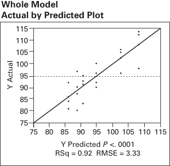
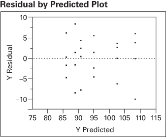

## 5.6 Blocking in a Factorial Design

We have discussed factorial designs in the context of a completely randomized experiment. Sometimes, it is not feasible or practical to completely randomize all of the runs in a factorial. For example, the presence of a nuisance factor may require that the experiment be run in blocks. We discussed the basic concepts of blocking in the context of a single-factor experiment in Chapter 4. We now show how blocking can be incorporated in a factorial. Some other aspects of blocking in factorial designs are presented in Chapters 7–9, and 13.

Consider a factorial experiment with two factors (A and B) and n replicates. The linear statistical model for this design is

$$
y _ {i j k} = \mu + \tau_ {i} + \beta_ {j} + (\tau \beta) _ {i j} + \epsilon_ {i j k} \qquad \left\{ \begin{array}{l} i = 1, 2, \ldots , a \\ j = 1, 2, \ldots , b \\ k = 1, 2, \ldots , n \end{array} \right.\tag{5.33}
$$

where $\tau_{i}, \beta_{j}$ , and $(\tau\beta)_{ij}$ represent the effects of factors A, B, and the AB interaction, respectively. Now suppose that to run this experiment a particular raw material is required. This raw material is available in batches that are not large enough to allow all abn treatment combinations to be run from the same batch. However, if a batch contains enough material for ab observations, then an alternative design is to run each of the n replicates using a separate batch of raw material. Consequently, the batches of raw material represent a randomization restriction or a block, and a single replicate of a complete factorial experiment is run within each block. The effects model for this new design is

$$
y _ {i j k} = \mu + \tau_ {i} + \beta_ {j} + (\tau \beta) _ {i j} + \delta_ {k} + \epsilon_ {i j k} \quad \left\{ \begin{array}{l} i = 1, 2, \dots , a \\ j = 1, 2, \dots , b \\ k = 1, 2, \dots , n \end{array} \right.\tag{5.34}
$$

where $\delta_{k}$ is the effect of the kth block. Of course, within a block the order in which the treatment combinations are run is completely randomized.

The model (Equation 5.34) assumes that interaction between blocks and treatments is negligible. This was assumed previously in the analysis of randomized block designs. If these interactions do exist, they cannot be separated from the error component. In fact, the error term in this model really consists of the $(\tau\delta)_{ik}, (\beta\delta)_{jk}$ , and $(\tau\beta\delta)_{ijk}$ interactions. The ANOVA is outlined in Table 5.20. The layout closely resembles that of a factorial design, with the

## TABLE 5.20

Analysis of Variance for a Two-Factor Factorial in a Randomized Complete Block

<table><tr><td>Source of Variation</td><td>Sum of Squares</td><td>Degrees of Freedom</td><td>Expected Mean Square</td><td> $F_0$ </td></tr><tr><td>Blocks</td><td> $\frac{1}{ab}\sum_{k}y_{..k}^{2}-\frac{y_{...}^{2}}{abn}$ </td><td> $n-1$ </td><td> $\sigma^{2}+ab\sigma_{\delta}^{2}$ </td><td></td></tr><tr><td>A</td><td> $\frac{1}{bn}\sum_{i}y_{i..}^{2}-\frac{y_{...}^{2}}{abn}$ </td><td> $a-1$ </td><td> $\sigma^{2}+\frac{bn\sum\tau_{i}^{2}}{a-1}$ </td><td> $\frac{MS_A}{MS_E}$ </td></tr><tr><td>B</td><td> $\frac{1}{an}\sum_{j}y_{.j.}^{2}-\frac{y_{...}^{2}}{abn}$ </td><td> $b-1$ </td><td> $\sigma^{2}+\frac{an\sum\beta_{j}^{2}}{b-1}$ </td><td> $\frac{MS_B}{MS_E}$ </td></tr><tr><td>AB</td><td> $\frac{1}{n}\sum_{i}\sum_{j}y_{ij.}^{2}-\frac{y_{...}^{2}}{abn}-SS_A-SS_B$ </td><td> $(a-1)(b-1)$ </td><td> $\sigma^{2}+\frac{n\sum\sum(\tau\beta)_{ij}^{2}}{(a-1)(b-1)}$ </td><td> $\frac{MS_{AB}}{MS_E}$ </td></tr><tr><td>Error</td><td>Subtraction</td><td> $(ab-1)(n-1)$ </td><td> $\sigma^{2}$ </td><td></td></tr><tr><td>Total</td><td> $\sum_{i}\sum_{j}\sum_{k}y_{ijk}^{2}-\frac{y_{...}^{2}}{abn}$ </td><td> $abn-1$ </td><td></td><td></td></tr></table>

error sum of squares reduced by the sum of squares for blocks. Computationally, we find the sum of squares for blocks as the sum of squares between the n block totals $\{y_{..k}\}$ . The ANOVA in Table 5.20 assumes that both factors are fixed and that blocks are random. The ANOVA estimator of the variance component for blocks $\sigma_{\delta}^{2}$ , is

$$
\sigma_ {\delta} ^ {2} = \frac {M S _ {\mathrm{Blocks}} - M S _ {E}}{a b}
$$

In the previous example, the randomization was restricted to within a batch of raw material. In practice, a variety of phenomena may cause randomization restrictions, such as time and operators. For example, if we could not run the entire factorial experiment on one day, then the experimenter could run a complete replicate on day 1, a second replicate on day 2, and so on. Consequently, each day would be a block.

## EXAMPLE 5.6

An engineer is studying methods for improving the ability to detect targets on a radar scope. Two factors she considers to be important are the amount of background noise, or "ground clutter," on the scope and the type of filter placed over the screen. An experiment is designed using three levels of ground clutter and two filter types. We will consider these as fixed-type factors. The experiment is performed by randomly selecting a treatment combination (ground clutter level and filter type) and then introducing a signal representing the target into the scope. The intensity of this target is increased until the operator observes it. The intensity level at detection is then measured as the response variable. Because of operator availability, it is convenient to select an operator and keep him or her at the scope until all the necessary runs have been made. Furthermore, operators differ in their skill and ability to use the scope. Consequently, it seems logical to use the operators as blocks. Four operators are randomly selected. Once an operator is chosen, the order in which the six treatment combinations are run is randomly determined. Thus, we have a $3 \times 2$ factorial experiment run in a randomized complete block. The data are shown in Table 5.21.

The linear model for this experiment is

$$
y _ {i j k} = \mu + \tau_ {i} + \beta_ {j} + (\tau \beta) _ {i j} + \delta_ {k} + \epsilon_ {i j k} \qquad \left\{ \begin{array}{l} i = 1, 2, 3 \\ j = 1, 2 \\ k = 1, 2, 3, 4 \end{array} \right.
$$

where $\tau_{i}$ represents the ground clutter effect, $\beta_{j}$ represents the filter type effect, $(\tau \beta)_{ij}$ is the interaction, $\delta_{k}$ is the block effect, and $\epsilon_{ijk}$ is the NID(0, $\sigma^2$ ) error component. The sums of squares for ground clutter, filter type, and their interaction are computed in the usual manner. The sum of squares due to blocks is found from the operator totals $\{y_{..k}\}$ as follows:

$$
\begin{array}{r l} S S _ {\text {Blocks}} & = \frac {1}{a b} \sum_ {k = 1} ^ {n} y _ {\cdot , k} ^ {2} - \frac {y _ {\cdot \cdot} ^ {2}}{a b n} \\ & = \frac {1}{(3) (2)} [ (5 7 2) ^ {2} + (5 7 9) ^ {2} + (5 9 7) ^ {2} + (5 3 0) ^ {2} ] \\ & - \frac {(2 2 7 8) ^ {2}}{(3) (2) (4)} \\ & = 4 0 2. 1 7 \end{array}
$$

## TABLE 5.21

Intensity Level at Target Detection

<table><tr><td rowspan="2">Operators (blocks)Filter Type</td><td colspan="2">1</td><td colspan="2">2</td><td colspan="2">3</td><td colspan="2">4</td></tr><tr><td>1</td><td>2</td><td>1</td><td>2</td><td>1</td><td>2</td><td>1</td><td>2</td></tr><tr><td colspan="9">Ground clutter</td></tr><tr><td>Low</td><td>90</td><td>86</td><td>96</td><td>84</td><td>100</td><td>92</td><td>92</td><td>81</td></tr><tr><td>Medium</td><td>102</td><td>87</td><td>106</td><td>90</td><td>105</td><td>97</td><td>96</td><td>80</td></tr><tr><td>High</td><td>114</td><td>93</td><td>112</td><td>91</td><td>108</td><td>95</td><td>98</td><td>83</td></tr></table>

TABLE 5.22  
Analysis of Variance for Example 5.6

<table><tr><td>Source of Variation</td><td>Sum of Square</td><td>Degrees of Freedom</td><td>Mean Squares</td><td> $F_0$ </td><td>P-Value</td></tr><tr><td>Ground clutter (G)</td><td>335.58</td><td>2</td><td>167.79</td><td>15.13</td><td>0.0003</td></tr><tr><td>Filter type (F)</td><td>1066.67</td><td>1</td><td>1066.67</td><td>96.19</td><td>&lt;0.0001</td></tr><tr><td>GF</td><td>77.08</td><td>2</td><td>38.54</td><td>3.48</td><td>0.0573</td></tr><tr><td>Blocks</td><td>402.17</td><td>3</td><td>134.06</td><td></td><td></td></tr><tr><td>Error</td><td>166.33</td><td>15</td><td>11.09</td><td></td><td></td></tr><tr><td>Total</td><td>2047.83</td><td>23</td><td></td><td></td><td></td></tr></table>

The complete ANOVA for this experiment is summarized in Table 5.22. The presentation in Table 5.22 indicates that all effects are tested by dividing their mean squares by the mean square error. Both ground clutter level and filter type are significant at the 1 percent level, whereas their interaction is significant only at the 10 percent level. Thus, we conclude that both ground clutter level and the type of scope filter used affect the operator's ability to detect the target, and there is some evidence of mild interaction between these factors. The ANOVA estimate of the variance component for

$$
\hat {\sigma} _ {\delta} ^ {2} = \frac {M S _ {\mathrm{Blocks}} - M S _ {E}}{a b} = \frac {1 3 4 . 0 6 - 1 1 . 0 9}{(3 1 6 2)} = 2 0. 5 0
$$

blocks is

## TABLE 5.23

The JMP output for this experiment is shown in Table 5.23. The residual maximum likelihood (REML) estimate of the variance component for blocks is shown in this output, and because this is a balanced design, the REML and ANOVA estimates agree. JMP also provides the confidence intervals on both variance components $\sigma^{2}$ and $\sigma_{\delta}^{2}$ .

## JMP Output for Example 5.6

Whole Model
Actual by Predicted Plot  

Mean of Response 94.91667

## Summary of Fit

Root Mean Square Error 3.329998

Observations (or Sum Wgts) 24

RSquare 0.917432

RSquare Adj 0.894497

TABLE 5.23 (Continued)  
REML Variance Component Estimates

<table><tr><td>Random Effect</td><td>Var Ratio</td><td>Var Component</td><td>Std Error</td><td>95% Lower</td><td>95% Upper</td><td>Pct of Total</td></tr><tr><td>Operators (Blocks)</td><td>1.8481964</td><td>20.494444</td><td>18.255128</td><td>-15.28495</td><td>56.273839</td><td>64.890</td></tr><tr><td>Residual</td><td></td><td>11.088889</td><td>4.0490897</td><td>6.0510389</td><td>26.561749</td><td>35.110</td></tr><tr><td>Total</td><td></td><td>31.583333</td><td></td><td></td><td></td><td>100.000</td></tr></table>

-2 LogLikelihood = 118.73680261

Covariance Matrix of

<table><tr><td>Random Effect</td><td>Operators (Blocks)</td><td>Residual</td></tr><tr><td>Operators (Blocks)</td><td>333.24972</td><td>-2.732521</td></tr><tr><td>Residual</td><td>-2.732521</td><td>16.395128</td></tr></table>

Fixed Effect Tests

<table><tr><td>Source</td><td>Nparm</td><td>DF</td><td>DFDen</td><td>F Ratio</td><td>Prob &gt; F</td></tr><tr><td>Clutter</td><td>2</td><td>2</td><td>15</td><td>15.1315</td><td>0.0003*</td></tr><tr><td>Filter Type</td><td>1</td><td>1</td><td>15</td><td>96.1924</td><td>&lt;.0001*</td></tr><tr><td>Clutter*Filter Type</td><td>2</td><td>2</td><td>15</td><td>3.4757</td><td>0.0575</td></tr></table>

Residual by Predicted Plot  

TABLE 5.24  
Radar Detection Experiment Run in a 6 × 6 Latin Square

<table><tr><td rowspan="2">Day</td><td colspan="6">Operator</td></tr><tr><td>1</td><td>2</td><td>3</td><td>4</td><td>5</td><td>6</td></tr><tr><td>1</td><td> $A(f_1g_1=90)$ </td><td> $B(f_1g_2=106)$ </td><td> $C(f_1g_3=108)$ </td><td> $D(f_2g_1=81)$ </td><td> $F(f_2g_3=90)$ </td><td> $E(f_2g_2=88)$ </td></tr><tr><td>2</td><td> $C(f_1g_3=114)$ </td><td> $A(f_1g_1=96)$ </td><td> $B(f_1g_2=105)$ </td><td> $F(f_2g_3=83)$ </td><td> $E(f_2g_2=86)$ </td><td> $D(f_2g_1=84)$ </td></tr><tr><td>3</td><td> $B(f_1g_2=102)$ </td><td> $E(f_2g_2=90)$ </td><td> $G(f_2g_3=95)$ </td><td> $A(f_1g_1=92)$ </td><td> $D(f_2g_1=85)$ </td><td> $C(f_1g_3=104)$ </td></tr><tr><td>4</td><td> $E(f_2g_2=87)$ </td><td> $D(f_2g_1=84)$ </td><td> $A(f_1g_1=100)$ </td><td> $B(f_1g_2=96)$ </td><td> $C(f_1g_3=110)$ </td><td> $F(f_2g_3=91)$ </td></tr><tr><td>5</td><td> $F(f_2g_3=93)$ </td><td> $C(f_1g_3=112)$ </td><td> $D(f_2g_1=92)$ </td><td> $E(f_2g_2=80)$ </td><td> $A(f_1g_1=90)$ </td><td> $B(f_1g_2=98)$ </td></tr><tr><td>6</td><td> $D(f_2g_1=86)$ </td><td> $F(f_2g_3=91)$ </td><td> $E(f_2g_2=97)$ </td><td> $C(f_1g_3=98)$ </td><td> $B(f_1g_2=100)$ </td><td> $A(f_1g_1=92)$ </td></tr></table>

are considered as blocks. Suppose now that because of the setup time required, only six runs can be made per day. Thus, days become a second randomization restriction, resulting in the $6 \times 6$ Latin square design, as shown in Table 5.24. In this table, we have used the lowercase letters $f_{i}$ and $g_{j}$ to represent the ith and jth levels of filter type and ground clutter, respectively. That is, $f_{1}g_{2}$ represents filter type 1 and medium ground clutter. Note that now six operators are required, rather than four as in the original experiment, so the number of treatment combinations in the $3 \times 2$ factorial design exactly equals the number of restriction levels. Furthermore, in this design, each operator would be used only once on each day. The Latin letters A, B, C, D, E, and F represent the $3 \times 2 = 6$ factorial treatment combinations as follows: $A = f_{1}g_{1}$ , $B = f_{1}g_{2}$ , $C = f_{1}g_{3}$ , $D = f_{2}g_{1}$ , $E = f_{2}g_{2}$ , and $F = f_{2}g_{3}$ .

The five degrees of freedom between the six Latin letters correspond to the main effects of filter type (one degree of freedom), ground clutter (two degrees of freedom), and their interaction (two degrees of freedom). The linear statistical model for this design is

$$
y _ {i j k l} = \mu + \alpha_ {i} + \tau_ {j} + \beta_ {k} + (\tau \beta) _ {j k} + \theta_ {l} + \epsilon_ {i j k l} \qquad \left\{ \begin{array}{l} i = 1, 2, \ldots , 6 \\ j = 1, 2, 3 \\ k = 1, 2 \\ l = 1, 2, \ldots , 6 \end{array} \right.\tag{5.35}
$$

where $\tau_{j}$ and $\beta_{k}$ are effects of ground clutter and filter type, respectively, and $\alpha_{i}$ and $\theta_{l}$ represent the randomization restrictions of days and operators, respectively. To compute the sums of squares, the following two-way table of treatment totals is helpful:

<table><tr><td>Ground Clutter</td><td>Filter Type 1</td><td>Filter Type 2</td><td> $y_{j..}$ </td></tr><tr><td>Low</td><td>560</td><td>512</td><td>1072</td></tr><tr><td>Medium</td><td>607</td><td>528</td><td>1135</td></tr><tr><td>High</td><td>646</td><td>543</td><td>1189</td></tr><tr><td> $y_{..k.}$ </td><td>1813</td><td>1583</td><td>3396 =  $y_{....}$ </td></tr></table>

## TABLE 5.25

Analysis of Variance for the Radar Detection Experiment Run as a $3 \times 2$ Factorial in a Latin Square

<table><tr><td>Source of Variation</td><td>Sum of Squares</td><td>Degrees of Freedom</td><td>General Formula for Degrees of Freedom</td><td>Mean Square</td><td> $F_0$ </td><td>P-Value</td></tr><tr><td>Ground clutter (G)</td><td>571.50</td><td>2</td><td>a - 1</td><td>285.75</td><td>28.86</td><td>&lt;0.0001</td></tr><tr><td>Filter type (F)</td><td>1469.44</td><td>1</td><td>b - 1</td><td>1469.44</td><td>148.43</td><td>&lt;0.0001</td></tr><tr><td>GF</td><td>126.73</td><td>2</td><td>(a - 1)(b - 1)</td><td>63.37</td><td>6.40</td><td>0.0071</td></tr><tr><td>Days (rows)</td><td>4.33</td><td>5</td><td>ab - 1</td><td>0.87</td><td></td><td></td></tr><tr><td>Operators (columns)</td><td>428.00</td><td>5</td><td>ab - 1</td><td>85.60</td><td></td><td></td></tr><tr><td>Error</td><td>198.00</td><td>20</td><td>(ab - 1)(ab - 2)</td><td>9.90</td><td></td><td></td></tr><tr><td>Total</td><td>2798.00</td><td>35</td><td>(ab) $^2$  - 1</td><td></td><td></td><td></td></tr></table>

Furthermore, the row and column totals are

<table><tr><td>Rows ( $y_{jkl}$ ):</td><td>563</td><td>568</td><td>568</td><td>568</td><td>565</td><td>564</td></tr><tr><td>Columns ( $y_{ijk}$ ):</td><td>572</td><td>579</td><td>597</td><td>530</td><td>561</td><td>557</td></tr></table>

The ANOVA is summarized in Table 5.25. We have added a column to this table indicating how the number of degrees of freedom for each sum of squares is determined.
