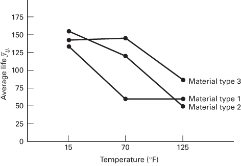
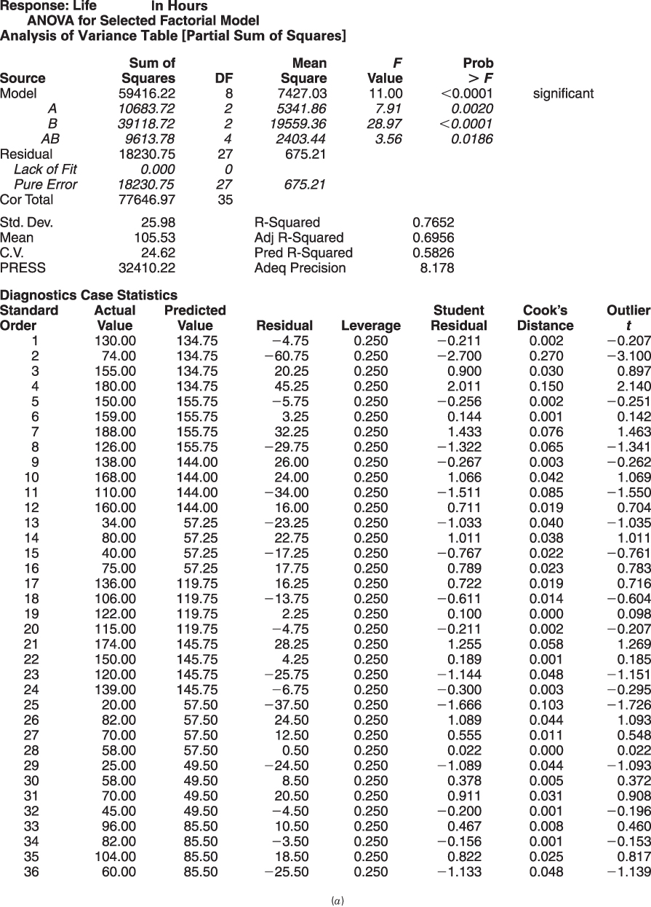
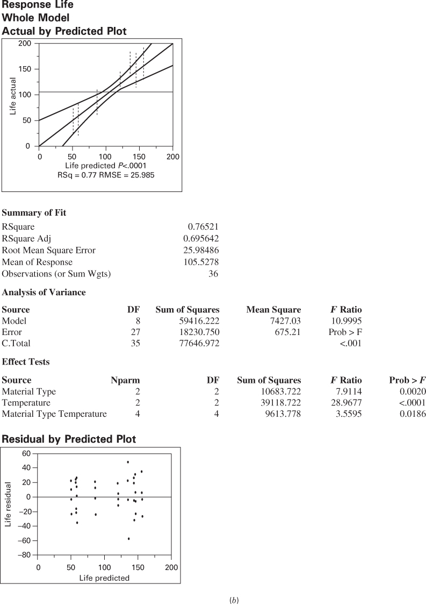
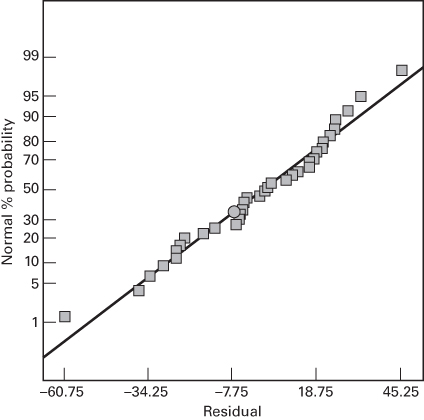
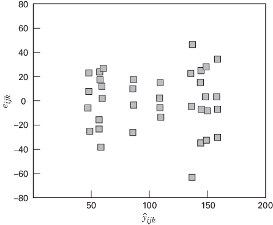
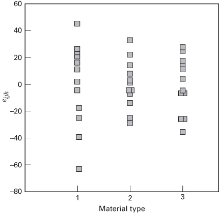
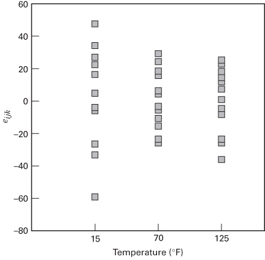
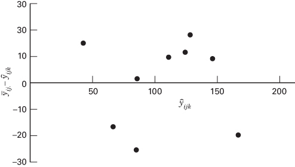

# 5.3 两因子因子设计

## 5.3.1 一个例子

最简单的因子设计只涉及两个因子（或两组处理）。设因子 A 有 $a$ 个水平、因子 B 有 $b$ 个水平，并把它们安排在一个因子设计中；也就是说，试验的每次重复都包含全部 $ab$ 个处理组合。一般地设有 $n$ 次重复。

作为一个涉及两个因子的因子设计的例子，假设一位工程师正在为一种会遇到极端温度变化的器件设计电池。他此刻唯一能选择的设计参数是电池极板材料，而有三种可能的选择。当器件被制造出来并发往现场后，工程师无法控制器件所遇到的温度极值；而根据经验他知道温度很可能会影响电池的有效寿命。不过在产品开发实验室中，出于试验目的，温度是可以控制的。

**表 5.1 电池设计例子的寿命（小时）数据**

| 材料类型 | 15 °F | 15 °F | 70 °F | 70 °F | 125 °F | 125 °F |
| --- | --- | --- | --- | --- | --- | --- |
| 1 | 130 | 155 | 34 | 40 | 20 | 70 |
| 1 | 74 | 180 | 80 | 75 | 82 | 58 |
| 2 | 150 | 188 | 136 | 122 | 25 | 70 |
| 2 | 159 | 126 | 106 | 115 | 58 | 45 |
| 3 | 138 | 110 | 174 | 120 | 96 | 104 |
| 3 | 168 | 160 | 150 | 139 | 82 | 60 |

该工程师决定在三个温度水平——15、70 和 $125^{\circ}$ F——上测试全部三种极板材料，因为这些温度水平与产品的最终使用环境相符。由于是两个因子、每个因子三个水平，这一设计有时称为 $3^{2}$ 因子设计。在极板材料和温度的每一组合上测试四块电池，全部 36 次试验按随机顺序进行。该试验及所得的电池寿命观测数据见表 5.1。

在这个问题中，工程师想回答以下问题：

1. 材料类型和温度对电池寿命有什么影响？

2. 是否存在某种材料选择，无论温度如何都能给出均匀较长的寿命？

最后一个问题特别重要。也许可以找到一种受温度影响不大的材料替代方案。如果是这样，工程师就能使电池在现场对温度变化具有稳健性。这就是把统计试验设计用于**稳健产品设计**的一个例子，是一个非常重要的工程问题。

这一设计是两因子因子设计一般情形的一个具体例子。为过渡到一般情形，设 $y_{ijk}$ 表示因子 A 取第 $i$ 个水平（$i = 1, 2, \ldots, a$）、因子 B 取第 $j$ 个水平（$j = 1, 2, \ldots, b$）、第 $k$ 次重复（$k = 1, 2, \ldots, n$）时观测到的响应。一般地，两因子因子试验如表 5.2 所示。$abn$ 个观测值的获取顺序是随机选定的，因此该设计是完全随机化设计。

因子试验中的观测值可以用模型来描述。因子试验的模型有几种写法。**效应模型**为

$$
y_{ijk} = \mu + \tau_{i} + \beta_{j} + (\tau\beta)_{ij} + \epsilon_{ijk} \quad \left\{ \begin{array}{l} i = 1, 2, \ldots, a \\ j = 1, 2, \ldots, b \\ k = 1, 2, \ldots, n \end{array} \right. \tag{5.1}
$$

其中 $\mu$ 是总均值效应，$\tau_{i}$ 是行因子 A 第 $i$ 个水平的效应，$\beta_{j}$ 是列因子 B 第 $j$ 个水平的效应，$(\tau\beta)_{ij}$ 是 $\tau_{i}$ 与 $\beta_{j}$ 之间交互作用的效应，$\epsilon_{ijk}$ 是随机误差成分。假定两个因子都是固定的，且处理效应定义为对总均值的偏离，因此 $\sum_{i=1}^{a}\tau_{i}=0$、$\sum_{j=1}^{b}\beta_{j}=0$。类似地，交互效应是固定的，并定义为使 $\sum_{i=1}^{a}(\tau\beta)_{ij}=\sum_{j=1}^{b}(\tau\beta)_{ij}=0$。因为有 $n$ 次重复，总共有 $abn$ 个观测值。

**表 5.2 两因子因子试验的一般安排**

| 因子 A | 因子 B 1 | 因子 B 2 | | 因子 B $b$ |
| --- | --- | --- | --- | --- |
| 1 | $y_{111}, y_{112}, \cdots, y_{11n}$ | $y_{121}, y_{122}, \cdots, y_{12n}$ | | $y_{1b1}, y_{1b2}, \cdots, y_{1bn}$ |
| 2 | $y_{211}, y_{212}, \cdots, y_{21n}$ | $y_{221}, y_{222}, \cdots, y_{22n}$ | | $y_{2b1}, y_{2b2}, \cdots, y_{2bn}$ |
| $\vdots$ | | | | |
| $a$ | $y_{a11}, y_{a12}, \cdots, y_{a1n}$ | $y_{a21}, y_{a22}, \cdots, y_{a2n}$ | | $y_{ab1}, y_{ab2}, \cdots, y_{abn}$ |

因子试验还可以用**均值模型**

$$
y_{ijk} = \mu_{ij} + \epsilon_{ijk} \quad \left\{ \begin{array}{l} i = 1, 2, \ldots, a \\ j = 1, 2, \ldots, b \\ k = 1, 2, \ldots, n \end{array} \right.
$$

其中第 $ij$ 个单元的均值为

$$
\mu_{ij} = \mu + \tau_{i} + \beta_{j} + (\tau\beta)_{ij}
$$

我们也可以像 5.1 节那样使用回归模型。当试验中有一个或多个因子是定量因子时，回归模型特别有用。本章大部分内容使用效应模型（式 5.1），并在 5.5 节给出回归模型的一个例示。

在两因子因子设计中，行因子（或处理）A 与列因子 B 同等重要。具体地说，我们关心检验行处理效应是否相等，即

$$
\begin{array}{l} H_{0} \colon \tau_{1} = \tau_{2} = \dots = \tau_{a} = 0 \\ H_{1} \colon \text{至少有一个} \tau_{i} \neq 0 \end{array} \tag{5.2a}
$$

以及列处理效应是否相等，即

$$
\begin{array}{l} H_{0} \colon \beta_{1} = \beta_{2} = \dots = \beta_{b} = 0 \\ H_{1} \colon \text{至少有一个} \beta_{j} \neq 0 \end{array} \tag{5.2b}
$$

我们还关心行处理与列处理是否存在交互作用。因此还希望检验

$$
\begin{array}{l} H_{0} \colon (\tau\beta)_{ij} = 0 \quad \text{对所有} i, j \\ H_{1} \colon \text{至少有一个} (\tau\beta)_{ij} \neq 0 \end{array} \tag{5.2c}
$$

下面讨论如何用两因子方差分析来检验这些假设。

## 5.3.2 固定效应模型的统计分析

设 $y_{i..}$ 表示因子 $A$ 第 $i$ 个水平下所有观测值的总和，$y_{.j.}$ 表示因子 $B$ 第 $j$ 个水平下所有观测值的总和，$y_{ij.}$ 表示第 $ij$ 个单元中所有观测值的总和，$y_{...}$ 表示所有观测值的总和。相应地定义 $\overline{y}_{i..}$、$\overline{y}_{.j.}$、$\overline{y}_{ij.}$ 和 $\overline{y}_{...}$ 为行、列、单元和总平均。用数学式子表示即

$$
y_{i..} = \sum_{j=1}^{b} \sum_{k=1}^{n} y_{ijk} \quad \overline{y}_{i..} = \frac{y_{i..}}{bn} \quad i = 1, 2, \dots, a
$$

$$
y_{.j.} = \sum_{i=1}^{a} \sum_{k=1}^{n} y_{ijk} \quad \overline{y}_{.j.} = \frac{y_{.j.}}{an} \quad j = 1, 2, \ldots, b
$$

$$
y_{ij.} = \sum_{k=1}^{n} y_{ijk} \quad \overline{y}_{ij.} = \frac{y_{ij.}}{n} \quad \begin{array}{l l} i = 1, 2, \ldots, a \\ j = 1, 2, \ldots, b \end{array}
$$

$$
y_{...} = \sum_{i=1}^{a} \sum_{j=1}^{b} \sum_{k=1}^{n} y_{ijk} \quad \overline{y}_{...} = \frac{y_{...}}{abn} \tag{5.3}
$$

总校正平方和可以写为

$$
\begin{array}{r l} \sum_{i=1}^{a} \sum_{j=1}^{b} \sum_{k=1}^{n} (y_{ijk} - \overline{y}_{...})^{2} & = \sum_{i=1}^{a} \sum_{j=1}^{b} \sum_{k=1}^{n} \left[ (\overline{y}_{i..} - \overline{y}_{...}) + (\overline{y}_{.j.} - \overline{y}_{...}) \right. \\ & \quad + (\overline{y}_{ij.} - \overline{y}_{i..} - \overline{y}_{.j.} + \overline{y}_{...}) + (y_{ijk} - \overline{y}_{ij.}) \Big]^{2} \\ & = bn \sum_{i=1}^{a} (\overline{y}_{i..} - \overline{y}_{...})^{2} + an \sum_{j=1}^{b} (\overline{y}_{.j.} - \overline{y}_{...})^{2} \\ & \quad + n \sum_{i=1}^{a} \sum_{j=1}^{b} (\overline{y}_{ij.} - \overline{y}_{i..} - \overline{y}_{.j.} + \overline{y}_{...})^{2} \\ & \quad + \sum_{i=1}^{a} \sum_{j=1}^{b} \sum_{k=1}^{n} (y_{ijk} - \overline{y}_{ij.})^{2} \end{array} \tag{5.4}
$$

因为右端的六个交叉乘积项都为零。[^1] 注意总平方和被分解为"行"（即因子 A）的平方和 $SS_{A}$、"列"（即因子 B）的平方和 $SS_{B}$、A 与 B 之间交互作用的平方和 $SS_{AB}$，以及误差平方和 $SS_{E}$。这是两因子因子设计的基本方差分析等式。由式 5.4 右端最后一个成分可以看出，必须至少有两次重复（$n \geq 2$）才能得到误差平方和。

我们可以把式 5.4 用符号写成

$$
SS_{T} = SS_{A} + SS_{B} + SS_{AB} + SS_{E} \tag{5.5}
$$

各平方和对应的自由度为

| 效应 | 自由度 |
| --- | --- |
| A | $a-1$ |
| B | $b-1$ |
| AB 交互作用 | $(a-1)(b-1)$ |
| 误差 | $ab(n-1)$ |
| 总计 | $abn-1$ |

把 $abn-1$ 个总自由度这样分配给各平方和，可以这样论证：主效应 A 和 B 分别有 $a$ 个和 $b$ 个水平，因此如前所示分别有 $a-1$ 和 $b-1$ 个自由度。交互作用的自由度就是单元的自由度数（即 $ab-1$）减去两个主效应 A 和 B 的自由度数；即 $ab-1-(a-1)-(b-1) = (a-1)(b-1)$。在 $ab$ 个单元的每一个内，$n$ 次重复之间有 $n-1$ 个自由度；因此误差有 $ab(n-1)$ 个自由度。注意式 5.5 右端的自由度之和等于总自由度。

每个平方和除以它的自由度就是均方。各均方的期望为

$$
E(MS_{A}) = E\left(\frac{SS_{A}}{a-1}\right) = \sigma^{2} + \frac{bn \sum_{i=1}^{a} \tau_{i}^{2}}{a-1}
$$

$$
E(MS_{B}) = E\left(\frac{SS_{B}}{b-1}\right) = \sigma^{2} + \frac{an \sum_{j=1}^{b} \beta_{j}^{2}}{b-1}
$$

$$
E(MS_{AB}) = E\left(\frac{SS_{AB}}{(a-1)(b-1)}\right) = \sigma^{2} + \frac{n \sum_{i=1}^{a} \sum_{j=1}^{b} (\tau\beta)_{ij}^{2}}{(a-1)(b-1)}
$$

以及

$$
E(MS_{E}) = E\left(\frac{SS_{E}}{ab(n-1)}\right) = \sigma^{2}
$$

注意，若无行处理效应、无列处理效应和无交互作用这几个原假设都成立，则 $MS_{A}$、$MS_{B}$、$MS_{AB}$ 和 $MS_{E}$ 都估计 $\sigma^{2}$。然而，若行处理效应之间存在差异，则 $MS_{A}$ 会比 $MS_{E}$ 大。类似地，若存在列处理效应或交互作用，相应的均方也会比 $MS_{E}$ 大。因此，为检验两个主效应及其交互作用的显著性，只需把相应的均方除以误差均方。这一比值很大就说明数据不支持原假设。

如果假定模型（式 5.1）是恰当的，且误差项 $\epsilon_{ijk}$ 是方差恒为 $\sigma^{2}$ 的正态独立随机变量，则均方比 $MS_{A}/MS_{E}$、$MS_{B}/MS_{E}$ 和 $MS_{AB}/MS_{E}$ 分别服从分子自由度为 $a-1$、$b-1$ 和 $(a-1)(b-1)$、分母自由度为 $ab(n-1)$ 的 $F$ 分布，[^2] 临界区为 $F$ 分布的上尾。检验过程通常汇总在一张方差分析表中，如表 5.3 所示。

计算上我们几乎总是使用统计软件包来做方差分析。不过手工计算式 5.5 中的平方和也很直接。可以把方差分析恒等式

$$
y_{ijk} - \overline{y}_{...} = (\overline{y}_{i..} - \overline{y}_{...}) + (\overline{y}_{.j.} - \overline{y}_{...}) + (\overline{y}_{ij.} - \overline{y}_{i..} - \overline{y}_{.j.} + \overline{y}_{...}) + (y_{ijk} - \overline{y}_{ij.})
$$

的各个元素列出来，在电子表格的各列中计算。然后把每一列平方求和就得到方差分析的各个平方和。也可以使用以行、列和单元总和表示的计算公式。总平方和按通常方式计算：

$$
SS_{T} = \sum_{i=1}^{a} \sum_{j=1}^{b} \sum_{k=1}^{n} y_{ijk}^{2} - \frac{y_{...}^{2}}{abn} \tag{5.6}
$$

**表 5.3 两因子因子设计（固定效应模型）的方差分析表**

| 变异来源 | 平方和 | 自由度 | 均方 | $F_{0}$ |
| --- | --- | --- | --- | --- |
| A 处理 | $SS_{A}$ | $a-1$ | $MS_{A}=\frac{SS_{A}}{a-1}$ | $F_{0}=\frac{MS_{A}}{MS_{E}}$ |
| B 处理 | $SS_{B}$ | $b-1$ | $MS_{B}=\frac{SS_{B}}{b-1}$ | $F_{0}=\frac{MS_{B}}{MS_{E}}$ |
| 交互作用 | $SS_{AB}$ | $(a-1)(b-1)$ | $MS_{AB}=\frac{SS_{AB}}{(a-1)(b-1)}$ | $F_{0}=\frac{MS_{AB}}{MS_{E}}$ |
| 误差 | $SS_{E}$ | $ab(n-1)$ | $MS_{E}=\frac{SS_{E}}{ab(n-1)}$ | |
| 总计 | $SS_{T}$ | $abn-1$ | | |

两个主效应的平方和为

$$
SS_{A} = \frac{1}{bn} \sum_{i=1}^{a} y_{i..}^{2} - \frac{y_{...}^{2}}{abn} \tag{5.7}
$$

以及

$$
SS_{B} = \frac{1}{an} \sum_{j=1}^{b} y_{.j.}^{2} - \frac{y_{...}^{2}}{abn} \tag{5.8}
$$

$SS_{AB}$ 分两步得到比较方便。首先计算 $ab$ 个单元总和之间的平方和，称为"小计"平方和：

$$
SS_{\text{小计}} = \frac{1}{n} \sum_{i=1}^{a} \sum_{j=1}^{b} y_{ij.}^{2} - \frac{y_{...}^{2}}{abn}
$$

这个平方和也包含 $SS_{A}$ 和 $SS_{B}$。因此第二步是把 $SS_{AB}$ 算为

$$
SS_{AB} = SS_{\text{小计}} - SS_{A} - SS_{B} \tag{5.9}
$$

$SS_{E}$ 可以由相减得到：

$$
SS_{E} = SS_{T} - SS_{AB} - SS_{A} - SS_{B} \tag{5.10}
$$

或

$$
SS_{E} = SS_{T} - SS_{\text{小计}}
$$

## 例 5.1 电池设计试验

表 5.4 给出 5.3.1 节所述电池设计例子中观测到的有效寿命（小时）。行、列总和列于表的边缘，圆圈中的数是单元总和。

利用式 5.6 至式 5.10，各平方和计算如下：

$$
\begin{array}{r l} SS_{T} & = \sum_{i=1}^{a} \sum_{j=1}^{b} \sum_{k=1}^{n} y_{ijk}^{2} - \frac{y_{...}^{2}}{abn} \\ & = (130)^{2} + (155)^{2} + (74)^{2} + \dots + (60)^{2} - \frac{(3799)^{2}}{36} = 77{,}646.97 \end{array}
$$

$$
\begin{array}{r l} SS_{\text{材料}} & = \frac{1}{bn} \sum_{i=1}^{a} y_{i..}^{2} - \frac{y_{...}^{2}}{abn} \\ & = \frac{1}{(3)(4)} \left[ (998)^{2} + (1300)^{2} + (1501)^{2} \right] - \frac{(3799)^{2}}{36} = 10{,}683.72 \end{array}
$$

$$
\begin{array}{r l} SS_{\text{温度}} & = \frac{1}{an} \sum_{j=1}^{b} y_{.j.}^{2} - \frac{y_{...}^{2}}{abn} \\ & = \frac{1}{(3)(4)} \left[ (1738)^{2} + (1291)^{2} + (770)^{2} \right] - \frac{(3799)^{2}}{36} = 39{,}118.72 \end{array}
$$

$$
\begin{array}{r l} SS_{\text{交互作用}} & = \frac{1}{n} \sum_{i=1}^{a} \sum_{j=1}^{b} y_{ij.}^{2} - \frac{y_{...}^{2}}{abn} - SS_{\text{材料}} - SS_{\text{温度}} \\ & = \frac{1}{4} \left[ (539)^{2} + (229)^{2} + \dots + (342)^{2} \right] \\ & \quad - \frac{(3799)^{2}}{36} - 10{,}683.72 - 39{,}118.72 = 9613.78 \end{array}
$$

以及

$$
\begin{array}{r l} SS_{E} & = SS_{T} - SS_{\text{材料}} - SS_{\text{温度}} - SS_{\text{交互作用}} \\ & = 77{,}646.97 - 10{,}683.72 - 39{,}118.72 - 9613.78 = 18{,}230.75 \end{array}
$$

方差分析见表 5.5。因为 $F_{0.05,4,27} = 2.73$，我们得出结论：材料类型与温度之间存在显著交互作用。此外 $F_{0.05,2,27} = 3.35$，所以材料类型和温度的主效应也显著。表 5.5 还给出了各检验统计量的 $P$ 值。

为帮助解释该试验的结果，画出各处理组合下平均响应的图形是有益的。该图见图 5.9。显著的交互作用表现为两条线不平行。一般地，无论材料类型如何，低温下都能获得较长的寿命。由低温变到中等温度，材料类型 3 的电池寿命实际上可能增加，而类型 1 和类型 2 则下降。由中等温度变到高温，材料类型 2 和 3 的电池寿命下降，而类型 1 基本不变。如果我们希望有效寿命随温度变化损失较少，材料类型 3 似乎能给出最好的结果。

**表 5.4 电池设计试验的寿命数据（小时）**

| 材料类型 | 15 °F 观测值 | 15 °F 合计 | 70 °F 观测值 | 70 °F 合计 | 125 °F 观测值 | 125 °F 合计 | $y_{i..}$ |
| --- | --- | --- | --- | --- | --- | --- | --- |
| 1 | 130, 74, 155, 180 | 539 | 34, 80, 40, 75 | 229 | 20, 82, 70, 58 | 230 | 998 |
| 2 | 150, 159, 188, 126 | 623 | 136, 106, 122, 115 | 479 | 25, 58, 70, 45 | 198 | 1300 |
| 3 | 138, 168, 110, 160 | 576 | 174, 150, 120, 139 | 583 | 96, 82, 104, 60 | 342 | 1501 |
| $y_{.j.}$ | | 1738 | | 1291 | | 770 | $3799 = y_{...}$ |

**图 5.9 例 5.1 的材料类型–温度图**

**表 5.5 电池寿命数据的方差分析**

| 变异来源 | 平方和 | 自由度 | 均方 | $F_{0}$ | $P$ 值 |
| --- | --- | --- | --- | --- | --- |
| 材料类型 | 10,683.72 | 2 | 5,341.86 | 7.91 | 0.0020 |
| 温度 | 39,118.72 | 2 | 19,559.36 | 28.97 | <0.0001 |
| 交互作用 | 9,613.78 | 4 | 2,403.44 | 3.56 | 0.0186 |
| 误差 | 18,230.75 | 27 | 675.21 | | |
| 总计 | 77,646.97 | 35 | | | |

**多重比较。**当方差分析表明行均值或列均值之间存在差异时，通常希望在各行均值或列均值之间作比较，以找出具体的差异。第 3 章讨论的多重比较方法在此很有用。

下面用例 5.1 的电池寿命数据说明 Tukey 检验的用法。注意该试验中交互作用显著。当交互作用显著时，一个因子（例如 $A$）各均值之间的比较可能被 $AB$ 交互作用所掩盖。处理这种情况的一种做法是固定因子 $B$ 在某一特定水平，并对该水平下因子 $A$ 的各均值应用 Tukey 检验。为例示，假设在例 5.1 中我们关心三个材料类型均值之间是否存在差异。因为交互作用显著，我们只在温度的一个水平上作这一比较，比如说水平 2（$70^{\circ}\mathrm{F}$）。我们假定误差方差的最佳估计就是方差分析表中的 $MS_{E}$，这利用了试验误差方差在所有处理组合上都相同的假定。

$70^{\circ}$ F 下三个材料类型的平均值按升序排列为

$$
\begin{array}{l} \overline{y}_{12.} = 57.25 \qquad \text{（材料类型 1）} \\ \overline{y}_{22.} = 119.75 \qquad \text{（材料类型 2）} \\ \overline{y}_{32.} = 145.75 \qquad \text{（材料类型 3）} \end{array}
$$

以及

$$
\begin{array}{r} T_{0.05} = q_{0.05}(3, 27) \sqrt{\frac{MS_{E}}{n}} \\ = 3.50 \sqrt{\frac{675.21}{4}} \\ = 45.47 \end{array}
$$

其中 $q_{0.05}(3,27) \simeq 3.50$ 是由附录表 V 插值得到的。两两比较给出

$$
3 \text{ 与 } 1: \quad 145.75 - 57.25 = 88.50 > T_{0.05} = 45.47
$$

$$
3 \text{ 与 } 2: \quad 145.75 - 119.75 = 26.00 < T_{0.05} = 45.47
$$

$$
2 \text{ 与 } 1: \quad 119.75 - 57.25 = 62.50 > T_{0.05} = 45.47
$$

这一分析表明，在 $70^{\circ}$ F 温度水平上，材料类型 2 与 3 的平均电池寿命相同，而材料类型 1 的平均电池寿命显著低于类型 2 与类型 3。

如果交互作用显著，试验者可以比较全部 $ab$ 个单元均值，以确定哪些均值之间存在显著差异。在这种分析中，单元均值之间的差异既包含主效应也包含交互效应。在例 5.1 中，这将对九个单元均值的所有可能配对给出 36 次比较。

**计算机输出。**图 5.10 给出例 5.1 电池寿命数据的压缩计算机输出。图 5.10a 是 Design-Expert 输出，图 5.10b 是 JMP 输出。注意

$$
\begin{array}{r l} SS_{\text{模型}} & = SS_{\text{材料}} + SS_{\text{温度}} + SS_{\text{交互作用}} \\ & = 10{,}683.72 + 39{,}118.72 + 9613.78 \\ & = 59{,}416.22 \end{array}
$$

其自由度为 8。输出中给出了模型变异来源的 $F$ 检验。$P$ 值很小（$<0.0001$），因此该检验的解释是：模型中至少有一项是显著的。随后是对各模型项（$A$、$B$、$AB$）的检验。另外，

$$
R^{2} = \frac{SS_{\text{模型}}}{SS_{\text{总计}}} = \frac{59{,}416.22}{77{,}646.97} = 0.7652
$$

也就是说，电池寿命的变异中约有 77% 可由电池极板材料、温度以及材料类型–温度交互作用解释。拟合模型的残差显示在 Design-Expert 输出中，而 JMP 输出包含残差对预测响应的图形。下面我们讨论这些残差和残差图在模型适合性检验中的用法。

| Source | Sum of Squares | DF | Mean Square | F Value | Prob > F | |
| --- | --- | --- | --- | --- | --- | --- |
| Model | 59416.22 | 8 | 7427.03 | 11.00 | <0.0001 | significant |
| A | 10683.72 | 2 | 5341.86 | 7.91 | 0.0020 | |
| B | 39118.72 | 2 | 19559.36 | 28.97 | <0.0001 | |
| AB | 9613.78 | 4 | 2403.44 | 3.56 | 0.0186 | |
| Residual | 18230.75 | 27 | 675.21 | | | |
| Lack of Fit | 0.000 | 0 | | | | |
| Pure Error | 18230.75 | 27 | 675.21 | | | |
| Cor Total | 77646.97 | 35 | | | | |

| Std. Dev. | 25.98 | R-Squared | 0.7652 |
| --- | --- | --- | --- |
| Mean | 105.53 | Adj R-Squared | 0.6956 |
| C.V. | 24.62 | Pred R-Squared | 0.5826 |
| PRESS | 32410.22 | Adeq Precision | 8.178 |

Diagnostics Case Statistics

| Standard Order | Actual Value | Predicted Value | Residual | Leverage | Student Residual | Cook's Distance | Outlier t |
| --- | --- | --- | --- | --- | --- | --- | --- |
| 1 | 130.00 | 134.75 | -4.75 | 0.250 | -0.211 | 0.002 | -0.207 |
| 2 | 74.00 | 134.75 | -60.75 | 0.250 | -2.700 | 0.270 | -3.100 |
| 3 | 155.00 | 134.75 | 20.25 | 0.250 | 0.900 | 0.030 | 0.897 |
| 4 | 180.00 | 134.75 | 45.25 | 0.250 | 2.011 | 0.150 | 2.140 |
| 5 | 150.00 | 155.75 | -5.75 | 0.250 | -0.256 | 0.002 | -0.251 |
| 6 | 159.00 | 155.75 | 3.25 | 0.250 | 0.144 | 0.001 | 0.142 |
| 7 | 188.00 | 155.75 | 32.25 | 0.250 | 1.433 | 0.076 | 1.463 |
| 8 | 126.00 | 155.75 | -29.75 | 0.250 | -1.322 | 0.065 | -1.341 |
| 9 | 138.00 | 144.00 | -6.00 | 0.250 | -0.267 | 0.003 | -0.262 |
| 10 | 168.00 | 144.00 | 24.00 | 0.250 | 1.066 | 0.042 | 1.069 |
| 11 | 110.00 | 144.00 | -34.00 | 0.250 | -1.511 | 0.085 | -1.550 |
| 12 | 160.00 | 144.00 | 16.00 | 0.250 | 0.711 | 0.019 | 0.704 |
| 13 | 34.00 | 57.25 | -23.25 | 0.250 | -1.033 | 0.040 | -1.035 |
| 14 | 80.00 | 57.25 | 22.75 | 0.250 | 1.011 | 0.038 | 1.011 |
| 15 | 40.00 | 57.25 | -17.25 | 0.250 | -0.767 | 0.022 | -0.761 |
| 16 | 75.00 | 57.25 | 17.75 | 0.250 | 0.789 | 0.023 | 0.783 |
| 17 | 136.00 | 119.75 | 16.25 | 0.250 | 0.722 | 0.019 | 0.716 |
| 18 | 106.00 | 119.75 | -13.75 | 0.250 | -0.611 | 0.014 | -0.604 |
| 19 | 122.00 | 119.75 | 2.25 | 0.250 | 0.100 | 0.000 | 0.098 |
| 20 | 115.00 | 119.75 | -4.75 | 0.250 | -0.211 | 0.002 | -0.207 |
| 21 | 174.00 | 145.75 | 28.25 | 0.250 | 1.255 | 0.058 | 1.269 |
| 22 | 150.00 | 145.75 | 4.25 | 0.250 | 0.189 | 0.001 | 0.185 |
| 23 | 120.00 | 145.75 | -25.75 | 0.250 | -1.144 | 0.048 | -1.151 |
| 24 | 139.00 | 145.75 | -6.75 | 0.250 | -0.300 | 0.003 | -0.295 |
| 25 | 20.00 | 57.50 | -37.50 | 0.250 | -1.666 | 0.103 | -1.726 |
| 26 | 82.00 | 57.50 | 24.50 | 0.250 | 1.089 | 0.044 | 1.093 |
| 27 | 70.00 | 57.50 | 12.50 | 0.250 | 0.555 | 0.011 | 0.548 |
| 28 | 58.00 | 57.50 | 0.50 | 0.250 | 0.022 | 0.000 | 0.022 |
| 29 | 25.00 | 49.50 | -24.50 | 0.250 | -1.089 | 0.044 | -1.093 |
| 30 | 58.00 | 49.50 | 8.50 | 0.250 | 0.378 | 0.005 | 0.372 |
| 31 | 70.00 | 49.50 | 20.50 | 0.250 | 0.911 | 0.031 | 0.908 |
| 32 | 45.00 | 49.50 | -4.50 | 0.250 | -0.200 | 0.001 | -0.196 |
| 33 | 96.00 | 85.50 | 10.50 | 0.250 | 0.467 | 0.008 | 0.460 |
| 34 | 82.00 | 85.50 | -3.50 | 0.250 | -0.156 | 0.001 | -0.153 |
| 35 | 104.00 | 85.50 | 18.50 | 0.250 | 0.822 | 0.025 | 0.817 |
| 36 | 60.00 | 85.50 | -25.50 | 0.250 | -1.133 | 0.048 | -1.139 |

(a)

**图 5.10 例 5.1 的计算机输出。(a) Design-Expert 输出；(b) JMP 输出**

Response Life

Whole Model

Actual by Predicted Plot

Summary of Fit

| RSquare | 0.76521 |
| --- | --- |
| RSquare Adj | 0.695642 |
| Root Mean Square Error | 25.98486 |
| Mean of Response | 105.5278 |
| Observations (or Sum Wgts) | 36 |

Analysis of Variance

| Source | DF | Sum of Squares | Mean Square | F Ratio |
| --- | --- | --- | --- | --- |
| Model | 8 | 59416.222 | 7427.03 | 10.9995 |
| Error | 27 | 18230.750 | 675.21 | Prob > F |
| C.Total | 35 | 77646.972 | | <.001 |

Effect Tests

| Source | Nparm | DF | Sum of Squares | F Ratio | Prob > F |
| --- | --- | --- | --- | --- | --- |
| Material Type | 2 | 2 | 10683.722 | 7.9114 | 0.0020 |
| Temperature | 2 | 2 | 39118.722 | 28.9677 | <.0001 |
| Material Type*Temperature | 4 | 4 | 9613.778 | 3.5595 | 0.0186 |

Residual by Predicted Plot

**图 5.10（续）**

(b)

## 5.3.3 模型适合性检验

在采纳方差分析的结论之前，应当检验所依据模型是否适合。和以前一样，主要的诊断工具是残差分析。带交互作用的两因子因子模型的残差为

$$
e_{ijk} = y_{ijk} - \hat{y}_{ijk} \tag{5.11}
$$

而由于拟合值 $\hat{y}_{ijk} = \overline{y}_{ij.}$（第 $ij$ 个单元中观测值的平均），式 5.11 变为

$$
e_{ijk} = y_{ijk} - \overline{y}_{ij.} \tag{5.12}
$$

例 5.1 电池寿命数据的残差见 Design-Expert 计算机输出（图 5.10a）和表 5.6。这些残差的正态概率图（图 5.11）没有显示出特别麻烦的问题，尽管最大的负残差（材料类型 1 在 $15^{\circ}\mathrm{F}$ 处的 $-60.75$）比其他残差略为突出。该残差标准化后的值为 $-60.75/\sqrt{675.21} = -2.34$，这是唯一绝对值大于 2 的残差。[^3]

图 5.12 是残差对拟合值 $\hat{y}_{ijk}$ 的图。该图也出现在图 5.10b 的 JMP 计算机输出中。残差的方差随电池寿命增大而略有增大的趋势。图 5.13 和图 5.14 分别是残差对材料类型和温度的图。两图都表明方差轻微不等，其中 $15^{\circ}\mathrm{F}$ 与材料类型 1 的处理组合的方差可能比其他组合更大。

由表 5.6 可见，$15^{\circ}$ F–材料类型 1 这一单元包含了两个极端残差（$-60.75$ 和 $45.25$）。正是这两个残差主要造成了图 5.12、5.13 和 5.14 中检测到的方差不等。重新检查数据没有发现任何明显问题（例如记录错误），因此我们承认这些响应是合理的。可能是这一特定的处理组合产生的电池寿命比其他组合略微更不稳定。不过这个问题并不严重，不足以对分析和结论产生显著影响。

**表 5.6 例 5.1 的残差**

| 材料类型 | 15 °F | 15 °F | 70 °F | 70 °F | 125 °F | 125 °F |
| --- | --- | --- | --- | --- | --- | --- |
| 1 | -4.75 | 20.25 | -23.25 | -17.25 | -37.50 | 12.50 |
| 1 | -60.75 | 45.25 | 22.75 | 17.75 | 24.50 | 0.50 |
| 2 | -5.75 | 32.25 | 16.25 | 2.25 | -24.50 | 20.50 |
| 2 | 3.25 | -29.75 | -13.75 | -4.75 | 8.50 | -4.50 |
| 3 | -6.00 | -34.00 | 28.25 | -25.75 | 10.50 | 18.50 |
| 3 | 24.00 | 16.00 | 4.25 | -6.75 | -3.50 | -25.50 |

**图 5.11 例 5.1 残差的正态概率图**

**图 5.12 例 5.1 中残差对 $\hat{y}_{ijk}$ 的图**

**图 5.13 例 5.1 中残差对材料类型的图**

**图 5.14 例 5.1 中残差对温度的图**

## 5.3.4 模型参数的估计

两因子因子设计效应模型

$$
y_{ijk} = \mu + \tau_{i} + \beta_{j} + (\tau\beta)_{ij} + \epsilon_{ijk} \tag{5.13}
$$

中的参数可以用最小二乘估计。由于模型有 $1 + a + b + ab$ 个待估参数，所以有 $1 + a + b + ab$ 个正规方程。使用 3.10 节的方法，不难证明正规方程为

$$
\mu \colon abn\hat{\mu} + bn \sum_{i=1}^{a} \hat{\tau}_{i} + an \sum_{j=1}^{b} \hat{\beta}_{j} + n \sum_{i=1}^{a} \sum_{j=1}^{b} (\widehat{\tau\beta})_{ij} = y_{...} \tag{5.14a}
$$

$$
\tau_{i} \colon bn\hat{\mu} + bn\hat{\tau}_{i} + n \sum_{j=1}^{b} \hat{\beta}_{j} + n \sum_{j=1}^{b} (\widehat{\tau\beta})_{ij} = y_{i..} \quad i = 1, 2, \dots, a \tag{5.14b}
$$

$$
\beta_{j} \colon an\hat{\mu} + n \sum_{i=1}^{a} \hat{\tau}_{i} + an\hat{\beta}_{j} + n \sum_{i=1}^{a} (\widehat{\tau\beta})_{ij} = y_{.j.} \quad j = 1, 2, \dots, b \tag{5.14c}
$$

$$
(\tau\beta)_{ij} \colon n\hat{\mu} + n\hat{\tau}_{i} + n\hat{\beta}_{j} + n(\widehat{\tau\beta})_{ij} = y_{ij.} \quad \left\{ \begin{array}{l} i = 1, 2, \dots, a \\ j = 1, 2, \dots, b \end{array} \right. \tag{5.14d}
$$

为方便起见，我们在式 5.14 的左端标出了每个正规方程所对应的参数。

效应模型（式 5.13）是过度参数化的模型。注意式 5.14b 中的 $a$ 个方程之和等于式 5.14a，式 5.14c 中的 $b$ 个方程之和也等于式 5.14a。此外，对某个固定的 $i$ 把式 5.14d 对 $j$ 求和得到式 5.14b，对某个固定的 $j$ 把式 5.14d 对 $i$ 求和得到式 5.14c。因此这个方程组中有 $a + b + 1$ 个线性相关关系，不存在唯一解。为得到解，我们施加约束

$$
\sum_{i=1}^{a} \hat{\tau}_{i} = 0 \tag{5.15a}
$$

$$
\sum_{j=1}^{b} \hat{\beta}_{j} = 0 \tag{5.15b}
$$

$$
\sum_{i=1}^{a} (\widehat{\tau\beta})_{ij} = 0 \quad j = 1, 2, \dots, b \tag{5.15c}
$$

以及

$$
\sum_{j=1}^{b} (\widehat{\tau\beta})_{ij} = 0 \quad i = 1, 2, \dots, a \tag{5.15d}
$$

式 5.15a 和 5.15b 构成两个约束，而式 5.15c 和 5.15d 构成 $a + b - 1$ 个独立约束。因此总共有 $a + b + 1$ 个约束，正是所需的数目。

施加这些约束后，正规方程（式 5.14）大大简化，我们得到解

$$
\begin{array}{r l} \hat{\mu} & = \overline{y}_{...} \\ \hat{\tau}_{i} & = \overline{y}_{i..} - \overline{y}_{...} \qquad i = 1, 2, \dots, a \\ \hat{\beta}_{j} & = \overline{y}_{.j.} - \overline{y}_{...} \qquad j = 1, 2, \dots, b \\ (\widehat{\tau\beta})_{ij} & = \overline{y}_{ij.} - \overline{y}_{i..} - \overline{y}_{.j.} + \overline{y}_{...} \qquad \left\{ \begin{array}{l l} i = 1, 2, \dots, a \\ j = 1, 2, \dots, b \end{array} \right. \end{array} \tag{5.16}
$$

注意这一正规方程解有很强的直观吸引力。行处理效应由行平均减去总平均估计；列处理效应由列平均减去总平均估计；第 $ij$ 个交互作用由第 $ij$ 个单元平均减去总平均、第 $i$ 个行效应和第 $j$ 个列效应估计。

利用式 5.16，可以求得拟合值 $\hat{y}_{ijk}$ 为

$$
\begin{array}{r l} \hat{y}_{ijk} & = \hat{\mu} + \hat{\tau}_{i} + \hat{\beta}_{j} + (\widehat{\tau\beta})_{ij} \\ & = \overline{y}_{...} + (\overline{y}_{i..} - \overline{y}_{...}) + (\overline{y}_{.j.} - \overline{y}_{...}) + (\overline{y}_{ij.} - \overline{y}_{i..} - \overline{y}_{.j.} + \overline{y}_{...}) \\ & = \overline{y}_{ij.} \end{array}
$$

也就是说，第 $ij$ 个单元中的第 $k$ 个观测值由该单元 $n$ 个观测值的平均来估计。这一结果已在式 5.12 中用于求两因子因子模型的残差。

由于求解正规方程时使用了约束（式 5.15），模型参数不能唯一估计。不过，模型参数的某些重要函数是**可估的**（estimable），也就是说，无论选择什么约束，它们都能被唯一估计。一个例子是 $\tau_{i} - \tau_{u} + \overline{(\tau\beta)}_{i.} - \overline{(\tau\beta)}_{u.}$，它可以看作因子 $A$ 第 $i$ 个与第 $u$ 个水平之间"真实"的差异。注意任意主效应水平之间的真实差异都包含一个"平均"交互效应。正如前面所指出的，正是这一结果在存在交互作用时干扰了对主效应的检验。一般地，模型参数的任何作为正规方程左端线性组合的函数都是可估的。我们在第 3 章讨论单因子模型时也提到过这一性质。更多信息可参见本章的补充材料。

## 5.3.5 样本量的选择

可以用计算机软件帮助确定因子试验中合适的样本量。例如，考虑例 5.1 的电池寿命试验。有两个因子，一个是定量因子、一个是定性因子，都取三个水平。假设试验者对所需的重复次数没有把握，但希望确保：如果效应的大小为一个标准差，则有较高的概率（功效）能够检测出来。

可以用 JMP 帮助回答这个样本量问题。表 5.7 给出该试验的 JMP Design Evaluation 工具的输出，分别假定三次重复（表的上半部分）和四次重复（表的下半部分）。在这一分析中，我们假定模型回归系数的大小为一个标准差。由于温度是定量因子，我们把该因子的线性成分和二次成分都包括在内。定性因子材料类型有两个自由度，由两个材料类型模型项表示。两种设计的功效都合理。三次重复时，交互效应和温度的二次效应的功效低于 0.9；而四次重复时，交互项的功效也在 0.9 以上，温度二次效应的功效从 0.645 提高到 0.78。这大概已经足够，因此四次重复的设计是合理的选择。

**表 5.7 例 5.1 的 JMP 功效分析**

△ Power Analysis

| Significance Level | 0.05 | | |
| --- | --- | --- | --- |
| Anticipated RMSE | 1 | | |
| Term | | Anticipated Coefficient | Power |
| Intercept | | 1 | 0.814 |
| Material type 1 | | 1 | 0.937 |
| Material type 2 | | -1 | 0.937 |
| Temperature | | 1 | 0.981 |
| Material type*Temperature 1 | | 1 | 0.814 |
| Material type*Temperature 2 | | -1 | 0.814 |
| Temperature*Temperature | | 1 | 0.645 |

△ Power Analysis

| Significance Level | 0.05 | | |
| --- | --- | --- | --- |
| Anticipated RMSE | 1 | | |
| Term | | Anticipated Coefficient | Power |
| Intercept | | 1 | 0.917 |
| Material type 1 | | 1 | 0.984 |
| Material type 2 | | -1 | 0.984 |
| Temperature | | 1 | 0.997 |
| Material type*Temperature 1 | | 1 | 0.917 |
| Material type*Temperature 2 | | -1 | 0.917 |
| Temperature*Temperature | | 1 | 0.78 |

## 5.3.6 两因子模型中无交互作用的假定

试验者偶尔会认为不含交互作用的两因子模型是合适的，例如

$$
y_{ijk} = \mu + \tau_{i} + \beta_{j} + \epsilon_{ijk} \quad \left\{ \begin{array}{l} i = 1, 2, \ldots, a \\ j = 1, 2, \ldots, b \\ k = 1, 2, \ldots, n \end{array} \right. \tag{5.17}
$$

不过，在舍弃交互项时应当非常小心，因为显著交互作用的存在会对数据的解释产生巨大影响。

不含交互作用的两因子因子模型的统计分析很直接。表 5.8 给出假定无交互作用模型（式 5.17）成立时例 5.1 电池寿命数据的方差分析。如前所述，两个主效应都显著。然而一旦对这些数据作残差分析，就会清楚地看到无交互作用模型并不合适。对无交互作用的两因子模型，拟合值为 $\hat{y}_{ijk} = \overline{y}_{i..} + \overline{y}_{.j.} - \overline{y}_{...}$。[^4] 图 5.15 是 $\overline{y}_{ij.} - \hat{y}_{ijk}$（单元均值减去该单元的拟合值）对拟合值 $\hat{y}_{ijk}$ 的图。此时量 $\overline{y}_{ij.} - \hat{y}_{ijk}$ 可以看作观测单元均值与假定无交互作用时的估计单元均值之差。这些量中若呈现任何图形模式，都提示存在交互作用。图 5.15 显示出明显的模式：量 $\overline{y}_{ij.} - \hat{y}_{ijk}$ 由正变负、再由正变负。这种结构正是材料类型与温度之间交互作用的结果。

**表 5.8 假定无交互作用时电池寿命数据的方差分析**

| 变异来源 | 平方和 | 自由度 | 均方 | $F_{0}$ |
| --- | --- | --- | --- | --- |
| 材料类型 | 10,683.72 | 2 | 5,341.86 | 5.95 |
| 温度 | 39,118.72 | 2 | 19,559.36 | 21.78 |
| 误差 | 27,844.52 | 31 | 898.21 | |
| 总计 | 77,646.96 | 35 | | |

**图 5.15 $\overline{y}_{ij.} - \hat{y}_{ijk}$ 对 $\hat{y}_{ijk}$ 的图，电池寿命数据**

## 5.3.7 每格一个观测值

偶尔会遇到只有一次重复的两因子试验，即每个单元只有一个观测值。若有两个因子且每格只有一个观测值，效应模型为

$$
y_{ij} = \mu + \tau_{i} + \beta_{j} + (\tau\beta)_{ij} + \epsilon_{ij} \quad \left\{ \begin{array}{l l} i = 1, 2, \ldots, a \\ j = 1, 2, \ldots, b \end{array} \right. \tag{5.18}
$$

假定两个因子都是固定的，这种情况的方差分析如表 5.9 所示。

由期望均方可以看出，误差方差 $\sigma^{2}$ 不可估；也就是说，两因子交互效应 $(\tau\beta)_{ij}$ 与试验误差无法以任何明显的方式分离。因此，除非交互效应为零，否则无法检验主效应。如果没有交互作用，则对所有 $i$ 和 $j$ 都有 $(\tau\beta)_{ij}=0$，此时一个合理的模型是

$$
y_{ij} = \mu + \tau_{i} + \beta_{j} + \epsilon_{ij} \quad \left\{ \begin{array}{l l} i = 1, 2, \ldots, a \\ j = 1, 2, \ldots, b \end{array} \right. \tag{5.19}
$$

如果模型（式 5.19）是恰当的，则表 5.9 中的残差均方是 $\sigma^{2}$ 的无偏估计，主效应可以通过把 $MS_{A}$ 和 $MS_{B}$ 与 $MS_{\text{残差}}$ 比较来检验。

Tukey (1949a) 提出的一种检验有助于判断是否存在交互作用。该方法假定交互项具有特别简单的形式，即

$$
(\tau\beta)_{ij} = \gamma \tau_{i} \beta_{j}
$$

其中 $\gamma$ 是未知常数。这样定义交互项后，可以用回归方法来检验交互项的显著性。该检验把残差平方和分解为一个自由度的非可加性（交互作用）成分和自由度为 $(a-1)(b-1)-1$ 的误差成分。计算上，

$$
SS_{N} = \frac{\left[\sum_{i=1}^{a} \sum_{j=1}^{b} y_{ij} y_{i.} y_{.j} - y_{..}\left(SS_{A} + SS_{B} + \frac{y_{..}^{2}}{ab}\right)\right]^{2}}{ab\, SS_{A}\, SS_{B}} \tag{5.20}
$$

自由度为 1，而[^5]

$$
SS_{\text{误差}} = SS_{\text{残差}} - SS_{N} \tag{5.21}
$$

自由度为 $(a-1)(b-1)-1$。为检验是否存在交互作用，我们计算

$$
F_{0} = \frac{SS_{N}}{SS_{\text{误差}}/[(a-1)(b-1)-1]} \tag{5.22}
$$

若 $F_{0} > F_{\alpha,1,(a-1)(b-1)-1}$，则必须拒绝无交互作用的假设。

## 例 5.2

化学产品中的杂质受两个因子——压力和温度——的影响。单次重复因子试验的数据见表 5.10。各平方和为

$$
\begin{array}{c} SS_{T} = \sum_{i=1}^{a} \sum_{j=1}^{b} y_{ij}^{2} - \frac{y_{..}^{2}}{ab} \\ = 166 - 129.07 = 36.93 \end{array}
$$

$$
\begin{array}{r l} SS_{A} & = \frac{1}{b} \sum_{i=1}^{a} y_{i.}^{2} - \frac{y_{..}^{2}}{ab} \\ & = \frac{1}{5} \left[ 23^{2} + 13^{2} + 8^{2} \right] - \frac{44^{2}}{(3)(5)} = 23.33 \\ SS_{B} & = \frac{1}{a} \sum_{j=1}^{b} y_{.j}^{2} - \frac{y_{..}^{2}}{ab} \\ & = \frac{1}{3} \left[ 9^{2} + 6^{2} + 13^{2} + 6^{2} + 10^{2} \right] - \frac{44^{2}}{(3)(5)} = 11.60 \end{array}
$$

以及

$$
\begin{array}{r l} SS_{\text{残差}} & = SS_{T} - SS_{A} - SS_{B} \\ & = 36.93 - 23.33 - 11.60 = 2.00 \end{array}
$$

非可加性平方和由式 5.20 计算如下：

$$
\begin{array}{l} \sum_{i=1}^{a} \sum_{j=1}^{b} y_{ij} y_{i.} y_{.j} = (5)(23)(9) + (4)(23)(6) + \dots + (2)(8)(10) = 7236 \\ SS_{N} = \frac{\left[\sum_{i=1}^{a} \sum_{j=1}^{b} y_{ij} y_{i.} y_{.j} - y_{..}\left(SS_{A} + SS_{B} + \frac{y_{..}^{2}}{ab}\right)\right]^{2}}{ab\, SS_{A}\, SS_{B}} \\ \qquad = \frac{[7236 - (44)(23.33 + 11.60 + 129.07)]^{2}}{(3)(5)(23.33)(11.60)} \\ \qquad = \frac{[20.00]^{2}}{4059.42} = 0.0985 \end{array}
$$

而误差平方和由式 5.21 得到：

$$
SS_{\text{误差}} = SS_{\text{残差}} - SS_{N} = 2.00 - 0.0985 = 1.9015
$$

完整的方差分析汇总于表 5.11。非可加性的检验统计量为 $F_{0} = 0.0985/0.2716 = 0.36$，因此我们得出结论：这些数据中没有交互作用的证据。温度和压力的主效应都显著。

**表 5.10 例 5.2 的杂质数据**

| 温度 (°F) | 压力 25 | 压力 30 | 压力 35 | 压力 40 | 压力 45 | $y_{i.}$ |
| --- | --- | --- | --- | --- | --- | --- |
| 100 | 5 | 4 | 6 | 3 | 5 | 23 |
| 125 | 3 | 1 | 4 | 2 | 3 | 13 |
| 150 | 1 | 1 | 3 | 1 | 2 | 8 |
| $y_{.j}$ | 9 | 6 | 13 | 6 | 10 | $44 = y_{..}$ |

**表 5.11 例 5.2 的方差分析**

| 变异来源 | 平方和 | 自由度 | 均方 | $F_{0}$ | $P$ 值 |
| --- | --- | --- | --- | --- | --- |
| 温度 | 23.33 | 2 | 11.67 | 42.97 | 0.0001 |
| 压力 | 11.60 | 4 | 2.90 | 10.68 | 0.0042 |
| 非可加性 | 0.0985 | 1 | 0.0985 | 0.36 | 0.5674 |
| 误差 | 1.9015 | 7 | 0.2716 | | |
| 总计 | 36.93 | 14 | | | |

[^1]: 式 5.4 第二行括号内的项在扫描件中印作 $\overline{y}_{...} - \overline{y}_{.j.} - \overline{y}_{...}$，按平方和分解恒等式应为 $\overline{y}_{ij.} - \overline{y}_{i..} - \overline{y}_{.j.} + \overline{y}_{...}$，译文已按后者写出。同处式 5.12 之后的拟合值原文误印为 $\hat{y}_{ij.}$，应为单元平均 $\overline{y}_{ij.}$，译文亦已改正。——译者注

[^2]: 如前所述，$F$ 检验可以看作随机化检验的一种近似。

[^3]: 图 5.10a 中第 9 个观测的残差在扫描件中印作 26.00，但按实际值 138.00 与预测值 144.00（并与表 5.6 中该单元的残差 $-6.00$ 一致）应为 $-6.00$，译文按 $-6.00$ 写出。——译者注

[^4]: 原文此处印作 $\hat{y}_{ijk} = \overline{y}_{i..} + \overline{y}_{j..} - \overline{y}_{...}$，按 5.3.4 节的推导应为 $\hat{y}_{ijk} = \overline{y}_{i..} + \overline{y}_{.j.} - \overline{y}_{...}$，译文已按后者写出。——译者注

[^5]: 原文式 5.20 的方括号位置印错（右方括号落在了 $y_{..}^{2}/ab$ 之后并多了一层平方括号），按例 5.2 的数值计算可知正确的式子为上文所写。——译者注
