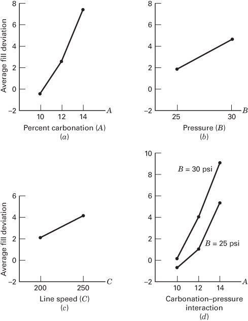

# 5.4 一般因子设计

两因子因子设计的结果可以推广到一般情形：因子 A 有 $a$ 个水平、因子 B 有 $b$ 个水平、因子 C 有 $c$ 个水平，依此类推，把它们安排在因子试验中。一般地，如果完整试验重复 $n$ 次，总共有 $abc\cdots n$ 个观测值。再次注意，如果模型中包含所有可能的交互作用，则必须至少有两次重复（$n \geq 2$）才能确定误差平方和。

如果试验中所有因子都是固定的，我们可以很容易地用方差分析来构造并检验关于主效应和交互作用的假设。对固定效应模型，每个主效应和交互作用的检验统计量都可以由相应的效应或交互作用均方除以误差均方得到。所有这些 $F$ 检验都是上尾的单尾检验。任何主效应的自由度都是该因子水平数减 1，而交互作用的自由度则是交互作用各组成部分自由度之积。

例如，考虑三因子方差分析模型：

$$
\begin{array}{l} y_{ijkl} = \mu + \tau_{i} + \beta_{j} + \gamma_{k} + (\tau\beta)_{ij} + (\tau\gamma)_{ik} + (\beta\gamma)_{jk} \\ \qquad + (\tau\beta\gamma)_{ijk} + \epsilon_{ijkl} \quad \left\{ \begin{array}{l} i = 1, 2, \ldots, a \\ j = 1, 2, \ldots, b \\ k = 1, 2, \ldots, c \\ l = 1, 2, \ldots, n \end{array} \right. \end{array} \tag{5.23}
$$

假定 A、B、C 都是固定的，方差分析表如表 5.12 所示。主效应和交互作用的 $F$ 检验可直接由期望均方得到。

**表 5.12 三因子固定效应模型的方差分析表**

| 变异来源 | 平方和 | 自由度 | 均方 | 期望均方 | $F_{0}$ |
| --- | --- | --- | --- | --- | --- |
| A | $SS_{A}$ | $a-1$ | $MS_{A}$ | $\sigma^{2} + \frac{bcn \sum \tau_{i}^{2}}{a-1}$ | $F_{0} = \frac{MS_{A}}{MS_{E}}$ |
| B | $SS_{B}$ | $b-1$ | $MS_{B}$ | $\sigma^{2} + \frac{acn \sum \beta_{j}^{2}}{b-1}$ | $F_{0} = \frac{MS_{B}}{MS_{E}}$ |
| C | $SS_{C}$ | $c-1$ | $MS_{C}$ | $\sigma^{2} + \frac{abn \sum \gamma_{k}^{2}}{c-1}$ | $F_{0} = \frac{MS_{C}}{MS_{E}}$ |
| AB | $SS_{AB}$ | $(a-1)(b-1)$ | $MS_{AB}$ | $\sigma^{2} + \frac{cn \sum \sum (\tau\beta)_{ij}^{2}}{(a-1)(b-1)}$ | $F_{0} = \frac{MS_{AB}}{MS_{E}}$ |
| AC | $SS_{AC}$ | $(a-1)(c-1)$ | $MS_{AC}$ | $\sigma^{2} + \frac{bn \sum \sum (\tau\gamma)_{ik}^{2}}{(a-1)(c-1)}$ | $F_{0} = \frac{MS_{AC}}{MS_{E}}$ |
| BC | $SS_{BC}$ | $(b-1)(c-1)$ | $MS_{BC}$ | $\sigma^{2} + \frac{an \sum \sum (\beta\gamma)_{jk}^{2}}{(b-1)(c-1)}$ | $F_{0} = \frac{MS_{BC}}{MS_{E}}$ |
| ABC | $SS_{ABC}$ | $(a-1)(b-1)(c-1)$ | $MS_{ABC}$ | $\sigma^{2} + \frac{n \sum \sum \sum (\tau\beta\gamma)_{ijk}^{2}}{(a-1)(b-1)(c-1)}$ | $F_{0} = \frac{MS_{ABC}}{MS_{E}}$ |
| 误差 | $SS_{E}$ | $abc(n-1)$ | $MS_{E}$ | $\sigma^{2}$ | |
| 总计 | $SS_{T}$ | $abcn-1$ | | | |

通常方差分析的计算用统计软件包完成。不过，表 5.12 中各平方和的手算公式偶尔也有用。总平方和按通常方式求得：

$$
SS_{T} = \sum_{i=1}^{a} \sum_{j=1}^{b} \sum_{k=1}^{c} \sum_{l=1}^{n} y_{ijkl}^{2} - \frac{y_{....}^{2}}{abcn} \tag{5.24}
$$

各主效应的平方和由因子 $A$（$y_{i...}$）、$B$（$y_{.j..}$）和 $C$（$y_{..k.}$）的总和得到：

$$
SS_{A} = \frac{1}{bcn} \sum_{i=1}^{a} y_{i...}^{2} - \frac{y_{....}^{2}}{abcn} \tag{5.25}
$$

$$
SS_{B} = \frac{1}{acn} \sum_{j=1}^{b} y_{.j..}^{2} - \frac{y_{....}^{2}}{abcn} \tag{5.26}
$$

$$
SS_{C} = \frac{1}{abn} \sum_{k=1}^{c} y_{..k.}^{2} - \frac{y_{....}^{2}}{abcn} \tag{5.27}
$$

为计算两因子交互作用的平方和，需要 $A \times B$、$A \times C$ 和 $B \times C$ 各单元的总和。把这些量算出来时，常常把原始数据表折叠成三张两向表。各平方和为

$$
\begin{array}{c} SS_{AB} = \frac{1}{cn} \sum_{i=1}^{a} \sum_{j=1}^{b} y_{ij..}^{2} - \frac{y_{....}^{2}}{abcn} - SS_{A} - SS_{B} \\ = SS_{\text{小计}(AB)} - SS_{A} - SS_{B} \end{array} \tag{5.28}
$$

$$
\begin{array}{r l} SS_{AC} & = \frac{1}{bn} \sum_{i=1}^{a} \sum_{k=1}^{c} y_{i.k.}^{2} - \frac{y_{....}^{2}}{abcn} - SS_{A} - SS_{C} \\ & = SS_{\text{小计}(AC)} - SS_{A} - SS_{C} \end{array} \tag{5.29}
$$

以及

$$
\begin{array}{c} SS_{BC} = \frac{1}{an} \sum_{j=1}^{b} \sum_{k=1}^{c} y_{.jk.}^{2} - \frac{y_{....}^{2}}{abcn} - SS_{B} - SS_{C} \\ = SS_{\text{小计}(BC)} - SS_{B} - SS_{C} \end{array} \tag{5.30}
$$

注意两因子小计的平方和由每张两向表中的总和得到。三因子交互作用的平方和由三向单元总和 $\{y_{ijk.}\}$ 计算：

$$
SS_{ABC} = \frac{1}{n} \sum_{i=1}^{a} \sum_{j=1}^{b} \sum_{k=1}^{c} y_{ijk.}^{2} - \frac{y_{....}^{2}}{abcn} - SS_{A} - SS_{B} - SS_{C} - SS_{AB} - SS_{AC} - SS_{BC} \tag{5.31a}
$$

$$
= SS_{\text{小计}(ABC)} - SS_{A} - SS_{B} - SS_{C} - SS_{AB} - SS_{AC} - SS_{BC} \tag{5.31b}
$$

误差平方和可以由总平方和减去每个主效应与交互作用的平方和得到，或者

$$
SS_{E} = SS_{T} - SS_{\text{小计}(ABC)} \tag{5.32}
$$

## 例 5.3 软饮料装瓶问题

一位软饮料装瓶商希望在他所制造的产品中获得更均匀的灌装高度。理论上灌装机把每瓶灌到正确的目标高度，但实际上围绕目标存在变异，装瓶商希望更好地了解这种变异的来源并最终减小它。

过程工程师可以在灌装过程中控制三个变量：碳酸化率（A）、灌装机中的操作压力（B）以及每分钟生产的瓶数（即生产线速度，C）。压力和速度容易控制，但碳酸化率在实际生产中较难控制，因为它随产品温度变化。不过，为试验目的，工程师可以把碳酸化率控制在三个水平：10%、12% 和 14%。她为压力选择两个水平（25 和 30 psi），为生产线速度选择两个水平（200 和 250 bpm）。她决定对这三个因子做两次重复的因子试验，全部 24 次运行按随机顺序进行。观测的响应变量是在每组条件下生产一批瓶子时，观测到的灌装高度对目标值的平均偏差。该试验得到的数据见表 5.13。正偏差表示灌装高度高于目标值，负偏差表示低于目标值。表 5.13 中圆圈中的数是三向单元总和 $y_{ijk.}$。

总校正平方和由式 5.24 得到：

$$
\begin{array}{r l} SS_{T} & = \sum_{i=1}^{a} \sum_{j=1}^{b} \sum_{k=1}^{c} \sum_{l=1}^{n} y_{ijkl}^{2} - \frac{y_{....}^{2}}{abcn} \\ & = 571 - \frac{(75)^{2}}{24} = 336.625 \end{array}
$$

**表 5.13 例 5.3 的灌装高度偏差数据**

| 碳酸化率 (A) | 25 psi, 200 bpm | 25 psi, 250 bpm | 30 psi, 200 bpm | 30 psi, 250 bpm | $y_{i...}$ |
| --- | --- | --- | --- | --- | --- |
| 10 | -3, -1（合计 -4） | -1, 0（合计 -1） | -1, 0（合计 -1） | 1, 1（合计 2） | -4 |
| 12 | 0, 1（合计 1） | 2, 1（合计 3） | 2, 3（合计 5） | 6, 5（合计 11） | 20 |
| 14 | 5, 4（合计 9） | 7, 6（合计 13） | 7, 9（合计 16） | 10, 11（合计 21） | 59 |
| $y_{.j..}$ | 21 | | | 54 | $75 = y_{....}$ |

$B \times C$ 合计 $y_{jk.}$：

| | 200 bpm | 250 bpm |
| --- | --- | --- |
| 25 psi | 6 | 15 |
| 30 psi | 20 | 34 |

$A \times B$ 合计 $y_{ij..}$：

| A | 25 psi | 30 psi |
| --- | --- | --- |
| 10 | -5 | 1 |
| 12 | 4 | 16 |
| 14 | 22 | 37 |

$A \times C$ 合计 $y_{i.k.}$：

| A | 200 bpm | 250 bpm |
| --- | --- | --- |
| 10 | -5 | 1 |
| 12 | 6 | 14 |
| 14 | 25 | 34 |

而各主效应的平方和由式 5.25、5.26 和 5.27 计算：

$$
\begin{array}{r l} SS_{\text{碳酸化率}} & = \frac{1}{bcn} \sum_{i=1}^{a} y_{i...}^{2} - \frac{y_{....}^{2}}{abcn} \\ & = \frac{1}{8} \left[ (-4)^{2} + (20)^{2} + (59)^{2} \right] - \frac{(75)^{2}}{24} = 252.750 \\ SS_{\text{压力}} & = \frac{1}{acn} \sum_{j=1}^{b} y_{.j..}^{2} - \frac{y_{....}^{2}}{abcn} \\ & = \frac{1}{12} \left[ (21)^{2} + (54)^{2} \right] - \frac{(75)^{2}}{24} = 45.375 \end{array}
$$

以及

$$
\begin{array}{r l} SS_{\text{速度}} & = \frac{1}{abn} \sum_{k=1}^{c} y_{..k.}^{2} - \frac{y_{....}^{2}}{abcn} \\ & = \frac{1}{12} \left[ (26)^{2} + (49)^{2} \right] - \frac{(75)^{2}}{24} = 22.042 \end{array}
$$

为计算两因子交互作用的平方和，必须求出两向单元总和。例如，为求碳酸化率–压力（即 $AB$）交互作用，我们需要表 5.13 中给出的 $A \times B$ 单元总和 $\{y_{ij..}\}$。用式 5.28 求得平方和：

$$
\begin{array}{r l} SS_{AB} & = \frac{1}{cn} \sum_{i=1}^{a} \sum_{j=1}^{b} y_{ij..}^{2} - \frac{y_{....}^{2}}{abcn} - SS_{A} - SS_{B} \\ & = \frac{1}{4} \left[ (-5)^{2} + (1)^{2} + (4)^{2} + (16)^{2} + (22)^{2} + (37)^{2} \right] \\ & \quad - \frac{(75)^{2}}{24} - 252.750 - 45.375 \\ & = 5.250 \end{array}
$$

碳酸化率–速度（即 $AC$）交互作用使用表 5.13 给出的 $A \times C$ 单元总和 $\{y_{i.k.}\}$ 和式 5.29：

$$
\begin{array}{r l} SS_{AC} & = \frac{1}{bn} \sum_{i=1}^{a} \sum_{k=1}^{c} y_{i.k.}^{2} - \frac{y_{....}^{2}}{abcn} - SS_{A} - SS_{C} \\ & = \frac{1}{4} \left[ (-5)^{2} + (1)^{2} + (6)^{2} + (14)^{2} + (25)^{2} + (34)^{2} \right] \\ & \quad - \frac{(75)^{2}}{24} - 252.750 - 22.042 \\ & = 0.583 \end{array}
$$

压力–速度（即 $BC$）交互作用由表 5.13 给出的 $B \times C$ 单元总和 $\{y_{jk.}\}$ 和式 5.30 得到：

$$
\begin{array}{r l} SS_{BC} & = \frac{1}{an} \sum_{j=1}^{b} \sum_{k=1}^{c} y_{.jk.}^{2} - \frac{y_{....}^{2}}{abcn} - SS_{B} - SS_{C} \\ & = \frac{1}{6} \left[ (6)^{2} + (15)^{2} + (20)^{2} + (34)^{2} \right] - \frac{(75)^{2}}{24} - 45.375 - 22.042 \\ & = 1.042 \end{array}
$$

三因子交互作用的平方和由表 5.13 中画圈的 $A \times B \times C$ 单元总和 $\{y_{ijk.}\}$ 得到。由式 5.31a，

$$
\begin{array}{r l} SS_{ABC} & = \frac{1}{n} \sum_{i=1}^{a} \sum_{j=1}^{b} \sum_{k=1}^{c} y_{ijk.}^{2} - \frac{y_{....}^{2}}{abcn} - SS_{A} - SS_{B} - SS_{C} - SS_{AB} - SS_{AC} - SS_{BC} \\ & = \frac{1}{2} \left[ (-4)^{2} + (-1)^{2} + (-1)^{2} + \dots + (16)^{2} + (21)^{2} \right] \\ & \quad - \frac{(75)^{2}}{24} - 252.750 - 45.375 - 22.042 - 5.250 - 0.583 - 1.042 \\ & = 1.083 \end{array}
$$

最后，注意到

$$
SS_{\text{小计}(ABC)} = \frac{1}{n} \sum_{i=1}^{a} \sum_{j=1}^{b} \sum_{k=1}^{c} y_{ijk.}^{2} - \frac{y_{....}^{2}}{abcn} = 328.125
$$

我们有

$$
\begin{array}{r l} SS_{E} & = SS_{T} - SS_{\text{小计}(ABC)} \\ & = 336.625 - 328.125 \\ & = 8.500 \end{array}
$$

方差分析汇总于表 5.14。我们看到碳酸化率、操作压力和生产线速度都显著影响灌装量。碳酸化率–压力交互作用的 $F$ 比的 $P$ 值为 0.0558，说明这两个因子之间存在一定的交互作用。

下一步应当对该试验的残差进行分析。我们把它留作读者的练习，但指出残差的正态概率图和其他通常的诊断图都没有显示出任何需要特别关注的问题。

为帮助实际解释该试验，图 5.16 给出了三个主效应和 $AB$（碳酸化率–压力）交互作用的图。主效应图就是各因子水平上边际响应平均值的图形。注意三个变量都有正的主效应；也就是说，增大该变量会使对灌装目标的平均偏差向上移动。碳酸化率与压力之间的交互作用相当小，由图 5.16d 中两条曲线形状相似可以看出。

由于公司希望灌装目标的平均偏差接近于零，工程师决定推荐低水平的操作压力（25 psi）和高水平的生产线速度（250 bpm，这将使生产率最大）。图 5.17 在这一组操作条件下，画出了三个不同碳酸化率水平下观测到的对目标灌装高度的平均偏差。

**表 5.14 例 5.3 的方差分析**

| 变异来源 | 平方和 | 自由度 | 均方 | $F_{0}$ | $P$ 值 |
| --- | --- | --- | --- | --- | --- |
| 碳酸化率百分比 (A) | 252.750 | 2 | 126.375 | 178.412 | <0.0001 |
| 操作压力 (B) | 45.375 | 1 | 45.375 | 64.059 | <0.0001 |
| 生产线速度 (C) | 22.042 | 1 | 22.042 | 31.118 | 0.0001 |
| AB | 5.250 | 2 | 2.625 | 3.706 | 0.0558 |
| AC | 0.583 | 2 | 0.292 | 0.412 | 0.6713 |
| BC | 1.042 | 1 | 1.042 | 1.471 | 0.2485 |
| ABC | 1.083 | 2 | 0.542 | 0.765 | 0.4867 |
| 误差 | 8.500 | 12 | 0.708 | | |
| 总计 | 336.625 | 23 | | | |

**图 5.16 例 5.3 的主效应与交互作用图。(a) 碳酸化率百分比 (A)。(b) 压力 (B)。(c) 生产线速度 (C)。(d) 碳酸化率–压力交互作用**

现在碳酸化率水平还不能在实际生产过程中被完全控制，图 5.17 中实线所示的正态分布近似于目前所经历的碳酸化率水平的变异。当过程受到由该分布抽取的碳酸化率取值影响时，灌装高度将大幅波动。如果碳酸化率取值的分布服从图 5.17 中虚线所示的正态分布，这种灌装高度的变异就可以减小。最终是通过改进制造过程中的温度控制来减小碳酸化率分布的标准差的。

**图 5.17 高速、低压条件下不同碳酸化率水平的平均灌装高度偏差**

我们已经指出，如果因子试验中所有因子都是固定的，构造检验统计量就很直接。检验任何主效应或交互作用的统计量总是由该主效应或交互作用的均方除以误差均方构成。然而，如果因子试验涉及一个或多个随机因子，检验统计量的构造就不总是这样做了。我们必须考察期望均方才能确定正确的检验。关于含随机因子试验的完整讨论我们推迟到第 13 章。
