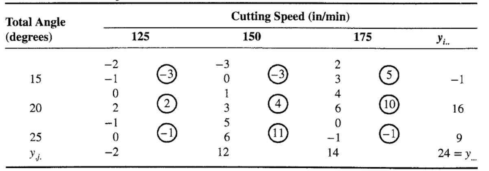
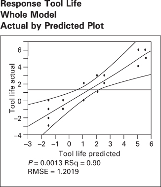
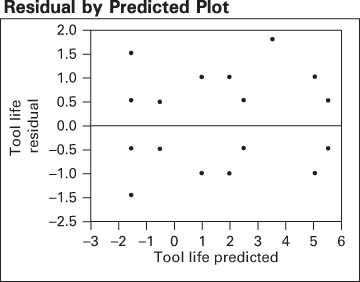

# 5.5 响应曲线与响应曲面的拟合

方差分析总是把试验中的所有因子都当作定性（或分类）因子来处理。然而，许多试验中至少有一个定量因子。对定量因子的各个水平拟合一条响应曲线可能很有用，这样试验者就有一个把响应与因子联系起来的方程。这个方程可以用于插值，即预测因子在实际所用水平之间的取值处的响应。当至少有两个定量因子时，我们可以拟合响应曲面，以预测设计因子各种组合下的 $y$。一般地，用线性回归方法把这些模型拟合到试验数据上。我们在 3.5.1 节对单因子试验说明了这一做法。现在给出两个涉及因子试验的例子。在这两个例子中，我们都将使用计算机软件包来生成回归模型。关于回归分析的更多信息，参见第 10 章以及本章的补充材料。

## 例 5.4

考虑例 5.1 中描述的电池寿命试验。因子温度是定量的，材料类型是定性的。此外，温度有三个水平。因此，我们可以计算温度的线性效应和二次效应，以研究温度如何影响电池寿命。表 5.15 给出该试验的压缩 Design-Expert 输出，其中假定温度是定量因子、材料类型是定性因子。

表 5.15 中的方差分析表明，"模型"变异来源被细分为若干成分。成分 "A" 和 "$A^{2}$" 分别表示温度的线性效应和二次效应，而 "B" 表示材料类型因子的主效应。回忆材料类型是一个有三个水平的定性因子。项 "AB" 和 "$A^{2}B$" 则是温度的线性、二次成分与材料类型的交互作用。

**表 5.15 例 5.4 的 Design-Expert 输出**

Response: Life —— In Hours

ANOVA for Response Surface Reduced Cubic Model

Analysis of Variance Table [Partial Sum of Squares]

| Source | Sum of Squares | DF | Mean Square | F Value | Prob > F | |
| --- | --- | --- | --- | --- | --- | --- |
| Model | 59416.22 | 8 | 7427.03 | 11.00 | <0.0001 | significant |
| A | 39042.67 | 1 | 39042.67 | 57.82 | <0.0001 | |
| B | 10683.72 | 2 | 5341.86 | 7.91 | 0.0020 | |
| $A^{2}$ | 76.06 | 1 | 76.06 | 0.11 | 0.7398 | |
| AB | 2315.08 | 2 | 1157.54 | 1.71 | 0.1991 | |
| $A^{2}B$ | 7298.69 | 2 | 3649.35 | 5.40 | 0.0106 | |
| Residual | 18230.75 | 27 | 675.21 | | | |
| Lack of Fit | 0.000 | 0 | | | | |
| Pure Error | 18230.75 | 27 | 675.21 | | | |
| Cor Total | 77646.97 | 35 | | | | |

| Std. Dev. | 25.98 | R-Squared | 0.7652 |
| --- | --- | --- | --- |
| Mean | 105.53 | Adj R-Squared | 0.6956 |
| C.V. | 24.62 | Pred R-Squared | 0.5826 |
| PRESS | 32410.22 | Adeq Precision | 8.178 |

| | Coefficient Estimate | DF | Standard Error | 95% CI Low | 95% CI High | VIF |
| --- | --- | --- | --- | --- | --- | --- |
| Intercept | 107.58 | 1 | 7.50 | 92.19 | 122.97 | |
| A-Temp | -40.33 | 1 | 5.30 | -51.22 | -29.45 | 1.00 |
| B[1] | -50.33 | 1 | 10.61 | -72.10 | -28.57 | |
| B[2] | 12.17 | 1 | 10.61 | -9.60 | 33.93 | |
| $A^{2}$ | -3.08 | 1 | 9.19 | -21.93 | 15.77 | 1.00 |
| AB[1] | 1.71 | 1 | 7.50 | -13.68 | 17.10 | |
| AB[2] | -12.79 | 1 | 7.50 | -28.18 | 2.60 | |
| $A^{2}B[1]$ | 41.96 | 1 | 12.99 | 15.30 | 68.62 | |
| $A^{2}B[2]$ | -14.04 | 1 | 12.99 | -40.70 | 12.62 | |

Final Equation in Terms of Coded Factors：

| | Life = +107.58 |
| --- | --- |
| -40.33 | *A |
| -50.33 | *B[1] |
| +12.17 | *B[2] |
| -3.08 | *$A^{2}$ |
| +1.71 | *AB[1] |
| -12.79 | *AB[2] |
| +41.96 | *$A^{2}B[1]$ |
| -14.04 | *$A^{2}B[2]$ |

**表 5.15（续）**

Final Equation in Terms of Actual Factors：

| | Material Type 1 |
| --- | --- |
| Life = | |
| +169.38017 | |
| -2.50145 | *Temp |
| +0.012851 | *Temp$^{2}$ |

| | Material Type 2 |
| --- | --- |
| Life = | |
| +159.62397 | |
| -0.17335 | *Temp |
| +0.41627 | *Temp$^{2}$ |

| | Material Type 3 |
| --- | --- |
| Life = | |
| +132.76240 | |
| +0.90289 | *Temp |
| -0.01248 | *Temp$^{2}$ |

**图 5.18 例 5.4 中三种材料类型的预测寿命作为温度的函数**

$P$ 值表明 $A^{2}$ 和 $AB$ 不显著，而 $A^{2}B$ 项显著。我们常常会考虑从模型中删去不显著的项或因子，但在本例中，删去 $A^{2}$ 和 $AB$ 而保留 $A^{2}B$ 会得到一个非**分层**（hierarchy）的模型。分层原则指出，如果模型含有一个高阶项（例如 $A^{2}B$），那么它也应当含有构成该项的所有低阶项（此处为 $A^{2}$ 和 $AB$）。分层性有助于模型内部的某种一致性，许多统计建模者严格遵循这一原则。不过，分层并不总是好主意，许多模型实际上在不包含那些用于维持分层的非显著项时，作为预测方程反而效果更好。更多信息可参见本章的补充材料。

计算机输出还给出了模型系数估计以及用编码因子表示的电池寿命最终预测方程。在这个方程中，当温度分别处于低、中、高水平（15、70 和 125°F）时，温度的水平分别为 $A = -1, 0, +1$。[^1] 变量 B[1] 和 B[2] 是编码指示变量，定义如下：

| | 材料类型 1 | 材料类型 2 | 材料类型 3 |
| --- | --- | --- | --- |
| B[1] | 1 | 0 | -1 |
| B[2] | 0 | 1 | -1 |

输出中还给出了以实际因子水平表示的电池寿命预测方程。注意由于材料类型是定性因子，所以每种材料类型都有一个预测寿命关于温度的方程。图 5.18 给出这三个预测方程生成的响应曲线。把它们与图 5.9 中该试验的两因子交互作用图作一比较。

如果因子试验中有若干定量因子，可以用响应曲面来建模 $y$ 与设计因子之间的关系。此外，定量因子的效应可以用单自由度的多项式效应来表示。类似地，定量因子之间的交互作用可以分解为单自由度的交互作用成分。下面的例 5.5 说明了这一点。

## 例 5.5

安装在数控机床上的刀具的有效寿命被认为受切削速度和刀具角度的影响。选取三个速度和三个角度，做一次两次重复的 $3^{2}$ 因子试验。编码后的数据见表 5.16。表中圆圈中的数是单元总和 $\{y_{ij.}\}$。

**表 5.16 刀具寿命试验的数据**

表 5.17 给出该试验的 JMP 输出。这是把两个因子都当作分类变量处理的经典方差分析。注意设计因子刀具角度和切削速度，以及角度–速度交互作用都显著。由于这些因子是定量的，且两个因子都有三个水平，也可以把二阶模型

$$
y = \beta_{0} + \beta_{1} x_{1} + \beta_{2} x_{2} + \beta_{12} x_{1} x_{2} + \beta_{11} x_{1}^{2} + \beta_{22} x_{2}^{2} + \epsilon
$$

（其中 $x_{1}$ 表示角度、$x_{2}$ 表示速度）拟合到数据上。该模型的 JMP 输出见表 5.18。注意 JMP 在构造交互项和二次模型项时对预测变量作了"中心化"。二阶模型看上去拟合得不太好：$R^{2}$ 只有 0.465（相比之下，分类变量方差分析中 $R^{2}=0.895$），唯一显著的因子是速度的线性项，其 $P$ 值为 0.0731。注意二阶模型拟合中的误差均方为 5.5278，比表 5.17 经典分类变量方差分析中的误差均方大得多。表 5.18 的 JMP 输出还显示了预测刻画器（prediction profiler），这是一个以图形方式把响应变量寿命表示为各设计因子（角度和速度）函数的展示。预测刻画器对最优化非常有用。此处它已被设置到使预测寿命最大的角度和速度水平。

**表 5.17 例 5.5 的 JMP 输出（把两个因子都视为分类变量）**

**Summary of Fit**

| RSquare | 0.895161 |
| --- | --- |
| RSquare Adj | 0.801971 |
| Root Mean Square Error | 1.20185 |
| Mean of Response | 1.333333 |
| Observations (or Sum Wgts) | 18 |

**Analysis of Variance**

| Source | DF | Sum of Squares | Mean Square | F Ratio |
| --- | --- | --- | --- | --- |
| Model | 8 | 111.00000 | 13.8750 | 9.6058 |
| Error | 9 | 13.00000 | 1.4444 | Prob > F |
| C. Total | 17 | 124.00000 | | 0.0013 |

**Effect Tests**

| Source | Nparm | DF | Sum of Squares | F Ratio | Prob > F |
| --- | --- | --- | --- | --- | --- |
| Angle | 2 | 2 | 24.333333 | 8.4231 | 0.0087 |
| Speed | 2 | 2 | 25.333333 | 8.7692 | 0.0077 |
| Angle*Speed | 4 | 4 | 61.333333 | 10.6154 | 0.0018 |

**Residual by Predicted Plot**

**表 5.18 例 5.5 的二阶模型 JMP 输出**

Summary of Fit

| RSquare | 0.465054 |
| --- | --- |
| RSquare Adj | 0.242159 |
| Root Mean Square Error | 2.351123 |
| Mean of Response | 1.333333 |
| Observations (or Sum Wgts) | 18 |

Analysis of Variance

| Source | DF | Sum of Squares | Mean Square | F Ratio |
| --- | --- | --- | --- | --- |
| Model | 5 | 57.66667 | 11.5333 | 2.0864 |
| Error | 12 | 66.33333 | 5.5278 | Prob > F |
| C. Total | 17 | 124.00000 | | 0.1377 |

Parameter Estimates

| Term | Estimate | Std. Error | t Ratio | Prob > \|t\| |
| --- | --- | --- | --- | --- |
| Intercept | -8 | 5.048683 | -1.58 | 0.1390 |
| Angle | 0.1666667 | 0.135742 | 1.23 | 0.2431 |
| Speed | 0.0533333 | 0.027148 | 1.96 | 0.0731 |
| (Angle-20)*(Speed-150) | -0.008 | 0.00665 | -1.20 | 0.2522 |
| (Angle-20)*(Angle-20) | -0.08 | 0.047022 | -1.70 | 0.1146 |
| (Speed-150)*(Speed-150) | -0.0016 | 0.001881 | -0.85 | 0.4116 |

Prediction Profiler

二阶模型拟合相对较差的部分原因是这个模型只解释了四个交互作用自由度中的一个。除了 $\beta_{12}x_{1}x_{2}$ 项之外，还有另外三项可以拟合，以完全解释四个交互作用自由度，即 $\beta_{112}x_{1}^{2}x_{2}$、$\beta_{122}x_{1}x_{2}^{2}$ 和 $\beta_{1122}x_{1}^{2}x_{2}^{2}$。

包含这些附加高阶项的模型 JMP 输出见表 5.19。虽然这些高阶项是两因子交互作用的成分，但最终模型是一个**缩简的四次模型**（reduced quartic）。尽管有些 $P$ 值较大，但为维持分层性，所有模型项都被保留。预测刻画器表明，刀具寿命在角度约为 25 度、速度约为 150 in/min 时达到最大。

图 5.19 是该模型的刀具寿命等高线图，图 5.20 是三维响应曲面图。这些图确认了由 JMP 预测刻画器得到的最优操作条件估计。响应曲面的探索是试验设计的一个重要用途，我们将在第 11 章更详细地讨论。

**表 5.19 例 5.5 中扩展模型的 JMP 输出**

Response Y

Actual by Predicted Plot

Summary of Fit

| RSquare | 0.895161 |
| --- | --- |
| RSquare Adj | 0.801971 |
| Root Mean Square Error | 1.20185 |
| Mean of Response | 1.333333 |
| Observations (or Sum Wgts) | 18 |

Analysis of Variance

| Source | DF | Sum of Squares | Mean Square | F Ratio |
| --- | --- | --- | --- | --- |
| Model | 8 | 111.00000 | 13.8750 | 9.6058 |
| Error | 9 | 13.00000 | 1.4444 | Prob > F |
| C. Total | 17 | 124.00000 | | 0.0013* |

Parameter Estimates

| Term | Estimate | Std Error | t Ratio | Prob > \|t\| |
| --- | --- | --- | --- | --- |
| Intercept | -24 | 4.41588 | -5.43 | 0.0004* |
| Angle | 0.7 | 0.120185 | 5.82 | 0.0003* |
| Speed | 0.08 | 0.024037 | 3.33 | 0.0088* |
| (Angle-20)*(Speed-150) | -0.008 | 0.003399 | -2.35 | 0.0431* |
| (Angle-20)*(Angle-20) | 2.776e-17 | 0.041633 | 0.00 | 1.0000 |
| (Speed-150)*(Speed-150) | 0.0016 | 0.001665 | 0.96 | 0.3618 |
| (Angle-20)*(Speed-150)*(Angle-20) | -0.0016 | 0.001178 | -1.36 | 0.2073 |
| (Speed-150)*(Speed-150)*(Angle-20) | -0.00128 | 0.000236 | -5.43 | 0.0004* |
| (Angle-20)*(Speed-150)*(Angle-20)*(Speed-150) | -0.000192 | 8.158e-5 | -2.35 | 0.0431* |

Effect Tests

| Source | Nparm | DF | Sum of Squares | F Ratio | Prob > F |
| --- | --- | --- | --- | --- | --- |
| Angle | 1 | 1 | 49.000000 | 33.9231 | 0.0003* |
| Speed | 1 | 1 | 16.000000 | 11.0769 | 0.0088* |
| Angle*Speed | 1 | 1 | 8.000000 | 5.5385 | 0.0431* |
| Angle*Angle | 1 | 1 | 6.4198e-31 | 0.0000 | 1.0000 |
| Speed*Speed | 1 | 1 | 1.333333 | 0.9231 | 0.3618 |
| Angle*Speed*Angle | 1 | 1 | 2.666667 | 1.8462 | 0.2073 |
| Speed*Speed*Angle | 1 | 1 | 42.666667 | 29.5385 | 0.0004* |
| Angle*Speed*Angle*Speed | 1 | 1 | 8.000000 | 5.5385 | 0.0431* |

| Term | Estimate | Std Error | t Ratio | Prob > \|t\| |
| --- | --- | --- | --- | --- |
| Angle | 0.7 | 0.120185 | 5.82 | 0.0003* |
| (Speed-150)*(Speed-150)*(Angle-20) | -0.00128 | 0.000236 | -5.43 | 0.0004* |
| Speed | 0.08 | 0.024037 | 3.33 | 0.0088* |
| (Angle-20)*(Speed-150)*(Angle-20)*(Speed-150) | -0.000192 | 8.158e-5 | -2.35 | 0.0431* |
| (Angle-20)*(Speed-150) | -0.008 | 0.003399 | -2.35 | 0.0431* |
| (Angle-20)*(Speed-150)*(Angle-20) | -0.0016 | 0.001178 | -1.36 | 0.2073 |
| (Speed-150)*(Speed-150) | 0.0016 | 0.001665 | 0.96 | 0.3618 |
| (Angle-20)*(Angle-20) | 2.776e-17 | 0.041633 | 0.00 | 1.0000 |

Prediction Profiler

**表 5.19（续）**

**图 5.19 例 5.5 刀具寿命响应曲面的二维等高线图**

**图 5.20 例 5.5 刀具寿命的三维响应曲面**

Y Predicted $P = 0.0013$ RSq $= 0.90$ RMSE $= 1.2019$

[^1]: 原文此处写作 "15、70 和 $125^{\circ}$C"，但例 5.1 中的温度水平是华氏温度 $15^{\circ}$F、$70^{\circ}$F 和 $125^{\circ}$F，故按 °F 译出。——译者注
