CHAPTER 6

# The $2^{k}$ Factorial Design

## CHAPTER LEARNING OBJECTIVES

1. Learn about the $2^{k}$ series of factorial designs.

2. Know how to compute main effects and interactions for $2^{k}$ factorial designs.

3. Learn how the analysis of variance can be used for $2^{k}$ factorial designs.

4. Know how to represent the results from a $2^{k}$ factorial design as a regression model.

5. Know how to use graphical and analytical methods to analyze unreplicated $2^{k}$ factorial designs.

6. Understand the basics of design optimality: D-optimality, I-optimality, and G-optimality, and why factorial designs are generally optimal designs.

7. Know how to use design optimality criteria in constructing designs.

8. Know the value of adding center runs to $2^{k}$ factorial designs.

9. Know why we work with coded variables in analyzing $2^{k}$ factorial designs.

## 6.1 Introduction

Factorial designs are widely used in experiments involving several factors where it is necessary to study the joint effect of the factors on a response. Chapter 5 presented general methods for the analysis of factorial designs. However, several special cases of the general factorial design are important because they are widely used in research work and also because they form the basis of other designs of considerable practical value.

The most important of these special cases is that of k factors, each at only two levels. These levels may be quantitative, such as two values of temperature, pressure, or time; or they may be qualitative, such as two machines, two operators, the “high” and “low” levels of a factor, or perhaps the presence and absence of a factor. A complete replicate of such a design requires $2 \times 2 \times \cdots \times 2 = 2^{k}$ observations and is called a $2^{k}$ factorial design.

This chapter focuses on this extremely important class of designs. Throughout this chapter, we assume that (1) the factors are fixed, (2) the designs are completely randomized, and (3) the usual normality assumptions are satisfied.

The $2^{k}$ design is particularly useful in the early stages of experimental work when many factors are likely to be investigated. It provides the smallest number of runs with which k factors can be studied in a complete factorial design. Consequently, these designs are widely used in factor screening experiments (where the experiments is intended in discovering the set of active factors from a large group of factors). It is also easy to develop effective blocking schemes for these designs (Chapter 7) and to fix them in fractional versions (Chapter 8).

Because there are only two levels for each factor, we assume that the response is approximately linear over the range of the factor levels chosen. In many factor screening experiments, when we are just starting to study the process or the system, this is often a reasonable assumption. In Section 6.8, we will present a simple method for checking this assumption and discuss what action to take if it is violated. The book by Mee (2009) is a useful supplement to this chapter and Chapters 7 and 8.

## 6.2 The $2^{2}$ Design

The first design in the $2^{k}$ series is one with only two factors, say A and B, each run at two levels. This design is called a $2^{2}$ factorial design. The levels of the factors may be arbitrarily called “low” and “high.” As an example, consider an investigation into the effect of the concentration of the reactant and the amount of the catalyst on the conversion (yield) in a chemical process. The objective of the experiment was to determine if adjustments to either of these two factors would increase the yield. Let the reactant concentration be factor A and let the two levels of interest be 15 and 25 percent. The catalyst is factor B, with the high level denoting the use of 2 pounds of the catalyst and the low level denoting the use of only 1 pound. The experiment is replicated three times, so there are 12 runs. The order in which the runs are made is random, so this is a completely randomized experiment. The data obtained are as follows:

<table><tr><td colspan="2">Factor</td><td rowspan="2">Treatment Combination</td><td colspan="3">Replicate</td><td rowspan="2">Total</td></tr><tr><td>A</td><td>B</td><td>I</td><td>II</td><td>III</td></tr><tr><td>-</td><td>-</td><td>A low, B low</td><td>28</td><td>25</td><td>27</td><td>80</td></tr><tr><td>+</td><td>-</td><td>A high, B low</td><td>36</td><td>32</td><td>32</td><td>100</td></tr><tr><td>-</td><td>+</td><td>A low, B high</td><td>18</td><td>19</td><td>23</td><td>60</td></tr><tr><td>+</td><td>+</td><td>A high, B high</td><td>31</td><td>30</td><td>29</td><td>90</td></tr></table>

The four treatment combinations in this design are shown graphically in Figure 6.1. By convention, we denote the effect of a factor by a capital Latin letter. Thus, “A” refers to the effect of factor A, “B” refers to the effect of

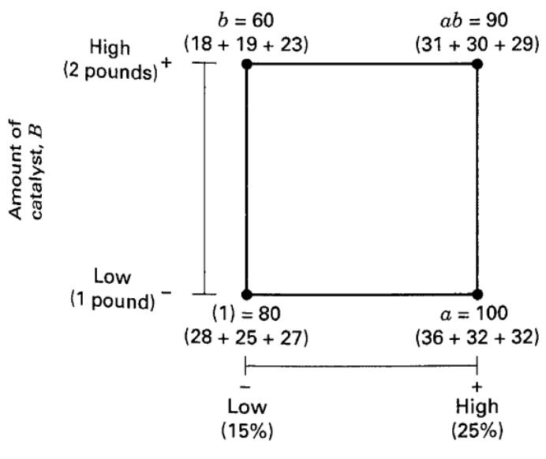  
A

■ FIGURE 6.1 Treatment combinations in the $2^{2}$ design

factor B, and “AB” refers to the AB interaction. In the $2^{2}$ design, the low and high levels of A and B are denoted by “−” and “+,” respectively, on the A and B axes. Thus, − on the A axis represents the low level of concentration (15%), whereas + represents the high level (25%), and − on the B axis represents the low level of catalyst, and + denotes the high level.

The four treatment combinations in the design are also represented by lowercase letters, as shown in Figure 6.1. We see from the figure that the high level of any factor in the treatment combination is denoted by the corresponding lowercase letter and that the low level of a factor in the treatment combination is denoted by the absence of the corresponding letter. Thus, $a$ represents the treatment combination of $A$ at the high level and $B$ at the low level, $b$ represents $A$ at the low level and $B$ at the high level, and $ab$ represents both factors at the high level. By convention, (1) is used to denote both factors at the low level. This notation is used throughout the $2^{k}$ series.

In a two-level factorial design, we may define the average effect of a factor as the change in response produced by a change in the level of that factor averaged over the levels of the other factor. Also, the symbols (1), $a$ , $b$ , and $ab$ now represent the total of the response observation at all $n$ replicates taken at the treatment combination, as illustrated in Figure 6.1. Now the effect of $A$ at the low level of $B$ is $[a - (1)]/n$ , and the effect of $A$ at the high level of $B$ is $[ab - b]/n$ . Averaging these two quantities yields the main effect of $A$ :

$$
\begin{array}{r l} A & = \frac {1}{2 n} \{[ a b - b ] + [ a - (1) ] \} \\ & = \frac {1}{2 n} [ a b + a - b - (1) ] \end{array}\tag{6.1}
$$

The average main effect of B is found from the effect of B at the low level of A (i.e., $[b-(1)]/n$ ) and at the high level of A (i.e., $[ab-a]/n$ ) as

$$
\begin{array}{r l} & B = \frac {1}{2 n} \{[ a b - a ] + [ b - (1) ] \} \\ & \quad = \frac {1}{2 n} [ a b + b - a - (1) ] \end{array}\tag{6.2}
$$

We define the interaction effect $AB$ as the average difference between the effect of $A$ at the high level of $B$ and the effect of $A$ at the low level of $B$ . Thus,

$$
\begin{array}{r} A B = \frac {1}{2 n} \{[ a b - b ] - [ a - (1) ] \} \\ = \frac {1}{2 n} [ a b + (1) - a - b ] \end{array}\tag{6.3}
$$

Alternatively, we may define $AB$ as the average difference between the effect of $B$ at the high level of $A$ and the effect of $B$ at the low level of $A$ . This will also lead to Equation 6.3.

The formulas for the effects of A, B, and AB may be derived by another method. The effect of A can be found as the difference in the average response of the two treatment combinations on the right-hand side of the square in Figure 6.1 (call this average $\overline{y}_{A^{+}}$ because it is the average response at the treatment combinations where A is at the high level) and the two treatment combinations on the left-hand side (or $\overline{y}_{A^{-}}$ ). That is,

$$
\begin{array}{r l} A & = \overline {{y}} _ {A ^ {+}} - \overline {{y}} _ {A ^ {-}} \\ & = \frac {a b + a}{2 n} - \frac {b + (1)}{2 n} \\ & = \frac {1}{2 n} [ a b + a - b - (1) ] \end{array}
$$

This is exactly the same result as in Equation 6.1. The effect of B, Equation 6.2, is found as the difference between the average of the two treatment combinations on the top of the square $(\overline{y}_{B^{+}})$ and the average of the two treatment combinations on the bottom $(\overline{y}_{B^{-}})$ , or

$$
\begin{array}{r l} & B = \overline {{y}} _ {B ^ {+}} - \overline {{y}} _ {B ^ {-}} \\ & \quad = \frac {a b + b}{2 n} - \frac {a + (1)}{2 n} \\ & \quad = \frac {1}{2 n} [ a b + b - a - (1) ] \end{array}
$$

Finally, the interaction effect AB is the average of the right-to-left diagonal treatment combinations in the square $[ab$ and (1)] minus the average of the left-to-right diagonal treatment combinations $(a$ and b), or

$$
\begin{array}{r l} A B & = \frac {a b + (1)}{2 n} - \frac {a + b}{2 n} \\ & = \frac {1}{2 n} [ a b + (1) - a - b ] \end{array}
$$

which is identical to Equation 6.3.

Using the experiment in Figure 6.1, we may estimate the average effects as

$$
A = \frac {1}{2 (3)} (9 0 + 1 0 0 - 6 0 - 8 0) = 8. 3 3
$$

$$
B = \frac {1}{2 (3)} (9 0 + 6 0 - 1 0 0 - 8 0) = - 5. 0 0
$$

$$
A B = \frac {1}{2 (3)} (9 0 + 8 0 - 1 0 0 - 6 0) = 1. 6 7
$$

The effect of A (reactant concentration) is positive; this suggests that increasing A from the low level (15%) to the high level (25%) will increase the yield. The effect of B (catalyst) is negative; this suggests that increasing the amount of catalyst added to the process will decrease the yield. The interaction effect appears to be small relative to the two main effects.

In experiments involving $2^{k}$ designs, it is always important to examine the magnitude and direction of the factor effects to determine which variables are likely to be important. The analysis of variance can generally be used to confirm this interpretation (t-tests could be used too). Effect magnitude and direction should always be considered along with the ANOVA, because the ANOVA alone does not convey this information. There are several excellent statistics software packages that are useful for setting up and analyzing $2^{k}$ designs. There are also special time-saving methods for performing the calculations manually.

Consider determining the sums of squares for $A, B$ , and $AB$ . Note from Equation 6.1 that a contrast is used in estimating $A$ , namely

$$
\text { Contrast } _ {A} = a b + a - b - (1)\tag{6.4}
$$

We usually call this contrast the total effect of $A$ . From Equations 6.2 and 6.3, we see that contrasts are also used to estimate $B$ and $AB$ . Furthermore, these three contrasts are orthogonal. The sum of squares for any contrast can be computed from Equation 3.29, which states that the sum of squares for any contrast is equal to the contrast squared divided by the number of observations in each total in the contrast times the sum of the squares of the contrast coefficients. Consequently, we have

$$
S S _ {A} = \frac {[ a b + a - b - (1) ] ^ {2}}{4 n}\tag{6.5}
$$

$$
S S _ {B} = \frac {[ a b + b - a - (1) ] ^ {2}}{4 n}\tag{6.6}
$$

and

$$
S S _ {A B} = \frac {[ a b + (1) - a - b ] ^ {2}}{4 n}\tag{6.7}
$$

as the sums of squares for $A$ , $B$ , and $AB$ . Notice how simple these equations are. We can compute sums of squares by only squaring one number.

Using the experiment in Figure 6.1, we may find the sums of squares from Equations 6.5 to 6.7 as

$$
S S _ {A} = \frac {(5 0) ^ {2}}{4 (3)} = 2 0 8. 3 3
$$

$$
S S _ {B} = \frac {(- 3 0) ^ {2}}{4 (3)} = 7 5. 0 0\tag{6.8}
$$

and

$$
S S _ {A B} = \frac {(1 0) ^ {2}}{4 (3)} = 8. 3 3
$$

The total sum of squares is found in the usual way, that is,

$$
S S _ {T} = \sum_ {i = 1} ^ {2} \sum_ {j = 1} ^ {2} \sum_ {k = 1} ^ {n} y _ {i j k} ^ {2} - \frac {y _ {\cdots} ^ {2}}{4 n}\tag{6.9}
$$

In general, $SS_{T}$ has $4n - 1$ degrees of freedom. The error sum of squares, with $4(n - 1)$ degrees of freedom, is usually computed by subtraction as

$$
S S _ {E} = S S _ {T} - S S _ {A} - S S _ {B} - S S _ {A B}\tag{6.10}
$$

For the experiment in Figure 6.1, we obtain

$$
\begin{array}{r l} S S _ {T} & = \sum_ {i = 1} ^ {2} \sum_ {j = 1} ^ {2} \sum_ {k = 1} ^ {3} y _ {i j k} ^ {2} - \frac {y _ {\dots} ^ {2}}{4 (3)} \\ & = 9 3 9 8. 0 0 - 9 0 7 5. 0 0 = 3 2 3. 0 0 \end{array}
$$

and

$$
\begin{array}{r l} S S _ {E} & = S S _ {T} - S S _ {A} - S S _ {B} - S S _ {A B} \\ & = 3 2 3. 0 0 - 2 0 8. 3 3 - 7 5. 0 0 - 8. 3 3 \\ & = 3 1. 3 4 \end{array}
$$

using $SS_{A}$ , $SS_{B}$ , and $SS_{AB}$ from Equations 6.8. The complete ANOVA is summarized in Table 6.1. On the basis of the P-values, we conclude that the main effects are statistically significant and that there is no interaction between these factors. This confirms our initial interpretation of the data based on the magnitudes of the factor effects.

It is often convenient to write down the treatment combinations in the order (1), $a$ , $b$ , $ab$ . This is referred to as standard order (or Yates's order, for Frank Yates who was one of Fisher coworkers and who made many important

## TABLE 6.1

Analysis of Variance for the Experiment in Figure 6.1

<table><tr><td>Source of Variation</td><td>Sum of Squares</td><td>Degrees of Freedom</td><td>Mean Square</td><td> $F_q$ </td><td>P-Value</td></tr><tr><td>A</td><td>208.33</td><td>1</td><td>208.33</td><td>53.15</td><td>0.0001</td></tr><tr><td>B</td><td>75.00</td><td>1</td><td>75.00</td><td>19.13</td><td>0.0024</td></tr><tr><td>AB</td><td>8.33</td><td>1</td><td>8.33</td><td>2.13</td><td>0.1826</td></tr><tr><td>Error</td><td>31.34</td><td>8</td><td>3.92</td><td></td><td></td></tr><tr><td>Total</td><td>323.00</td><td>11</td><td></td><td></td><td></td></tr></table>

contributions to designing and analyzing experiments). Using this standard order, we see that the contrast coefficients used in estimating the effects are

<table><tr><td>Effects</td><td>(1)</td><td>a</td><td>b</td><td>ab</td></tr><tr><td>A</td><td>-1</td><td>+1</td><td>-1</td><td>+1</td></tr><tr><td>B</td><td>-1</td><td>-1</td><td>+1</td><td>+1</td></tr><tr><td>AB</td><td>+1</td><td>-1</td><td>-1</td><td>+1</td></tr></table>

Note that the contrast coefficients for estimating the interaction effect are just the product of the corresponding coefficients for the two main effects. The contrast coefficient is always either +1 or -1, and a table of plus and minus signs such as in Table 6.2 can be used to determine the proper sign for each treatment combination. The column headings in Table 6.2 are the main effects (A and B), the AB interaction, and I, which represents the total or average of the entire experiment. Notice that the column corresponding to I has only plus signs. The row designators are the treatment combinations. To find the contrast for estimating any effect, simply multiply the signs in the appropriate column of the table by the corresponding treatment combination and add. For example, to estimate A, the contrast is $-(1) + a - b + ab$ , which agrees with Equation 6.1. Note that the contrasts for the effects A, B, and AB are orthogonal. Thus, the $2^{2}$ (and all $2^{k}$ designs) is an orthogonal design. The ±1 coding for the low and high levels of the factors is often called the orthogonal coding or the effects coding.

The Regression Model. In a $2^{k}$ factorial design, it is easy to express the results of the experiment in terms of a regression model. Because the $2^{k}$ is just a factorial design, we could also use either an effects or a means model, but the regression model approach is much more natural and intuitive. For the chemical process experiment in Figure 6.1, the regression model is

$$
y = \beta_ {0} + \beta_ {1} x _ {1} + \beta_ {2} x _ {2} + \epsilon
$$

where $x_{1}$ is a coded variable that represents the reactant concentration, $x_{2}$ is a coded variable that represents the amount of catalyst, and the $\beta$ 's are regression coefficients. The relationship between the natural variables, the reactant concentration and the amount of catalyst, and the coded variables is

$$
x _ {1} = \frac {\operatorname{Conc} - \left(\operatorname{Conc} _ {\text { low }} + \operatorname{Conc} _ {\text { high }}\right) / 2}{\left(\operatorname{Conc} _ {\text { high }} - \operatorname{Conc} _ {\text { low }}\right) / 2}
$$

and

$$
x _ {2} = \frac {\text { Catalyst } - (\text { Catalyst } _ {\text { low }} + \text { Catalyst } _ {\text { high }}) / 2}{(\text { Catalyst } _ {\text { high }} - \text { Catalyst } _ {\text { low }}) / 2}
$$

TABLE 6.2  
Algebraic Signs for Calculating Effects in the $2^{2}$ Design

<table><tr><td rowspan="2">Treatment Combination</td><td colspan="4">Factorial Effect</td></tr><tr><td>I</td><td>A</td><td>B</td><td>AB</td></tr><tr><td>(1)</td><td>+</td><td>-</td><td>-</td><td>+</td></tr><tr><td>a</td><td>+</td><td>+</td><td>-</td><td>-</td></tr><tr><td>b</td><td>+</td><td>-</td><td>+</td><td>-</td></tr><tr><td>ab</td><td>+</td><td>+</td><td>+</td><td>+</td></tr></table>

When the natural variables have only two levels, this coding will produce the familiar $\pm1$ notation for the levels of the coded variables. To illustrate this for our example, note that

$$
\begin{array}{r l} x _ {1} & = \frac {\text {Conc} - (1 5 + 2 5) / 2}{(2 5 - 1 5) / 2} \\ & = \frac {\text {Conc} - 2 0}{5} \end{array}
$$

Thus, if the concentration is at the high level (Conc = 25%), then $x_{1} = +1$ ; if the concentration is at the low level (Conc = 15%), then $x_{1} = -1$ . Furthermore,

$$
\begin{array}{r l} x _ {2} & = \frac {\text { Catalyst } - (1 + 2) / 2}{(2 - 1) / 2} \\ & = \frac {\text { Catalyst } - 1 . 5}{0 . 5} \end{array}
$$

Thus, if the catalyst is at the high level (Catalyst = 2 pounds), then $x_{2} = +1$ ; if the catalyst is at the low level (Catalyst = 1 pound), then $x_{2} = -1$ .

The fitted regression model is

$$
\hat {y} = 2 7. 5 + \left(\frac {8 . 3 3}{2}\right) x _ {1} + \left(\frac {- 5 . 0 0}{2}\right) x _ {2}
$$

where the intercept is the grand average of all 12 observations, and the regression coefficients $\hat{\beta}_{1}$ and $\hat{\beta}_{2}$ are one-half the corresponding factor effect estimates. The regression coefficient is one-half the effect estimate because a regression coefficient measures the effect of a one-unit change in x on the mean of y, and the effect estimate is based on a two-unit change (from -1 to +1). This simple method of estimating the regression coefficients results in least squares parameter estimates. We will return to this topic again in Section 6.7. Also see the supplemental material for this chapter.

How Much Replication is Necessary? A standard question that arises in almost every experiment is how much replication is necessary? We have discussed this in previous chapters, but there are some aspects of this topic that are particularly useful in $2^{k}$ designs, which are used extensively for factor screening. That is, studying a group of k factors to determine which ones are active. Recall from our previous discussions that the choice of an appropriate sample size in a designed experiment depends on how large the effect of interest is, the power of the statistical test, and the choice of type I error. While the size of an important effect is obviously problem-dependent, in many practical situations experimenters are interested in detecting effects that are at least as large as twice the error standard deviation ( $2\sigma$ ). Smaller effects are usually of less interest because changing the factor associated with such a small effect often results in a change in response that is very small relative to the background noise in the system. Adequate power is also problem-dependent, but in many practical situations achieving power of at least 0.80 or 80% should be the goal.

We will illustrate how an appropriate choice of sample size can be determined using the $2^{2}$ chemical process experiment. Suppose that we are interested in detecting effects of size $2\sigma$ . If the basic $2^{2}$ design is replicated twice for a total of 8 runs, there will be 4 degrees of freedom for estimating a model-independent estimate of error (pure error). If the experimenter uses a significance level or Type I error rate of $\alpha = 0.05$ , this design results in a power of 0.572 or 57.2%. This is too low, and the experimenter should consider more replication. There is another alternative that could be useful in screening experiments, use a higher type I error rate. In screening experiments Type I errors (thinking a factor is active when it really isn’t) usually does not have the same impact as a Type II error (failing to identify an active factor). If a factor is mistakenly thought to be active, that error will be discovered in further work and so the consequences of this type I error is usually small. However, failing to identify an active factor is usually very problematic because that factor is set aside and typically never considered again. So in screening experiments experimenters are often willing to consider higher Type I error rates, say 0.10 or 0.20.

Suppose that we use $\alpha = 0.10$ in our chemical process experiment. This would result in power of 75%. Using $\alpha = 0.20$ increases the power to 89%, a very reasonable value. The other alternative is to increase the sample size by using additional replicates. If we use three replicates there will be 8 degrees of freedom for pure error and if we want to detect effects of size $2\sigma$ with $\alpha = 0.05$ , this design will result in power of 85.7%. This is a very good value for power, so the experimenters decided to use three replicates of the $2^{2}$ design.

Software packages can be used to produce the power calculations given above. The boxed display below shows the power calculations from JMP. The model has both main effects and the two-factor interaction and the effects of size $2\sigma$ is chosen by setting the square root of mean square error (Anticipated RMSE) to 1 and setting the size of each anticipated model coefficient to 1.

<table><tr><td colspan="3">Evaluate Design</td></tr><tr><td colspan="3">Model</td></tr><tr><td colspan="3">Intercept</td></tr><tr><td colspan="3">X1</td></tr><tr><td colspan="3">X2</td></tr><tr><td colspan="3">X1*X2</td></tr><tr><td colspan="3">Power Analysis</td></tr><tr><td>Significance Level</td><td></td><td>0.05</td></tr><tr><td>Anticipated RMSE</td><td></td><td>1</td></tr><tr><td></td><td>Anticipated</td><td></td></tr><tr><td>Term</td><td>Coefficient</td><td>Power</td></tr><tr><td>Intercept</td><td>1</td><td>0.857</td></tr><tr><td>X1</td><td>1</td><td>0.857</td></tr><tr><td>X2</td><td>1</td><td>0.857</td></tr><tr><td>X1*X2</td><td>1</td><td>0.857</td></tr></table>

Residuals and Model Adequacy. The regression model can be used to obtain the predicted or fitted value of y at the four points in the design. The residuals are the differences between the observed and fitted values of y. For example, when the reactant concentration is at the low level $(x_{1} = -1)$ and the catalyst is at the low level $(x_{2} = -1)$ , the predicted yield is

$$
\hat {y} = 2 7. 5 + \left(\frac {8 . 3 3}{2}\right) (- 1) + \left(\frac {- 5 . 0 0}{2}\right) (- 1) = 2 5. 8 3 5
$$

There are three observations at this treatment combination, and the residuals are

$$
\begin{array}{l} e _ {1} = 2 8 - 2 5. 8 3 5 = 2. 1 6 5 \\ e _ {2} = 2 5 - 2 5. 8 3 5 = - 0. 8 3 5 \\ e _ {3} = 2 7 - 2 5. 8 3 5 = 1. 1 6 5 \end{array}
$$

The remaining predicted values and residuals are calculated similarly. For the high level of the reactant concentration and the low level of the catalyst,

$$
\hat {y} = 2 7. 5 + \left(\frac {8 . 3 3}{2}\right) (+ 1) + \left(\frac {- 5 . 0 0}{2}\right) (- 1) = 3 4. 1 6 5
$$

and

$$
e _ {4} = 3 6 - 3 4. 1 6 5 = 1. 8 3 5
$$

$$
e _ {5} = 3 2 - 3 4. 1 6 5 = - 2. 1 6 5
$$

$$
e _ {6} = 3 2 - 3 4. 1 6 5 = - 2. 1 6 5
$$

For the low level of the reactant concentration and the high level of the catalyst,

$$
\hat {y} = 2 7. 5 + \left(\frac {8 . 3 3}{2}\right) (- 1) + \left(\frac {- 5 . 0 0}{2}\right) (+ 1) = 2 0. 8 3 5
$$

and

$$
\begin{array}{l} e _ {7} = 1 8 - 2 0. 8 3 5 = - 2. 8 3 5 \\ e _ {8} = 1 9 - 2 0. 8 3 5 = - 1. 8 3 5 \\ e _ {9} = 2 3 - 2 0. 8 3 5 = 2. 1 6 5 \end{array}
$$

Finally, for the high level of both factors,

$$
\hat {y} = 2 7. 5 + \left(\frac {8 . 3 3}{2}\right) (+ 1) + \left(\frac {- 5 . 0 0}{2}\right) (+ 1) = 2 9. 1 6 5
$$

and

$$
\begin{array}{l} e _ {1 0} = 3 1 - 2 9. 1 6 5 = 1. 8 3 5 \\ e _ {1 1} = 3 0 - 2 9. 1 6 5 = 0. 8 3 5 \\ e _ {1 2} = 2 9 - 2 9. 1 6 5 = - 0. 1 6 5 \end{array}
$$

Figure 6.2 presents a normal probability plot of these residuals and a plot of the residuals versus the predicted yield. These plots appear satisfactory, so we have no reason to suspect that there are any problems with the validity of our conclusions.

The Response Surface. The regression model

$$
\hat {y} = 2 7. 5 + \left(\frac {8 . 3 3}{2}\right) x _ {1} + \left(\frac {- 5 . 0 0}{2}\right) x _ {2}
$$

can be used to generate response surface plots. If it is desirable to construct these plots in terms of the natural factor levels, then we simply substitute the relationships between the natural and coded variables that we gave earlier into the regression model, yielding

$$
\begin{array}{l} \hat {y} = 2 7. 5 + \left(\frac {8 . 3 3}{2}\right) \left(\frac {\text {Conc} - 2 0}{5}\right) + \left(\frac {- 5 . 0 0}{2}\right) \left(\frac {\text {Catalyst} - 1 . 5}{0 . 5}\right) \\ = 1 8. 3 3 + 0. 8 3 3 3 \text {Conc} - 5. 0 0 \text {Catalyst} \end{array}
$$

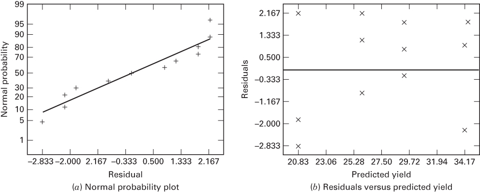  

■ FIGURE 6.2 Residual plots for the chemical process experiment

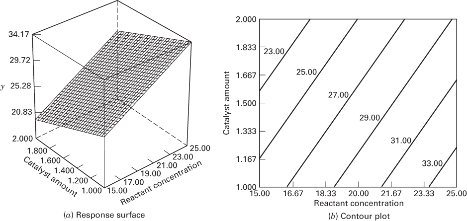

■ FIGURE 6.3 Response surface plot and contour plot of yield from the chemical process experiment

Figure 6.3a presents the three-dimensional response surface plot of yield from this model, and Figure 6.3b is the contour plot. Because the model is first-order (that is, it contains only the main effects), the fitted response surface is a plane. From examining the contour plot, we see that yield increases as reactant concentration increases and catalyst amount decreases. Often, we use a fitted surface such as this to find a direction of potential improvement for a process. A formal way to do so, called the method of steepest ascent, will be presented in Chapter 11 when we discuss methods for systematically exploring response surfaces.

## 6.3 The $2^{3}$ Design

Suppose that three factors, A, B, and C, each at two levels, are of interest. The design is called a $2^{3}$ factorial design, and the eight treatment combinations can now be displayed geometrically as a cube, as shown in Figure 6.4a. Using the “+ and −” orthogonal coding to represent the low and high levels of the factors, we may list the eight runs in the $2^{3}$ design as in Figure 6.4b. This is sometimes called the design matrix. Extending the label notation discussed in

  
(a) Geometric view

■ FIGURE 6.4 The $2^{3}$ factorial design

<table><tr><td rowspan="2">Run</td><td colspan="3">Factor</td></tr><tr><td>A</td><td>B</td><td>C</td></tr><tr><td>1</td><td>-</td><td>-</td><td>-</td></tr><tr><td>2</td><td>+</td><td>-</td><td>-</td></tr><tr><td>3</td><td>-</td><td>+</td><td>-</td></tr><tr><td>4</td><td>+</td><td>+</td><td>-</td></tr><tr><td>5</td><td>-</td><td>-</td><td>+</td></tr><tr><td>6</td><td>+</td><td>-</td><td>+</td></tr><tr><td>7</td><td>-</td><td>+</td><td>+</td></tr><tr><td>8</td><td>+</td><td>+</td><td>+</td></tr></table>

(b) Design matrix

Section 6.2, we write the treatment combinations in standard order as (1), a, b, ab, c, ac, bc, and abc. Remember that these symbols also represent the total of all n observations taken at that particular treatment combination.

Three different notations are widely used for the runs in the $2^{k}$ design. The first is the + and − notation, often called the geometric coding (or the orthogonal coding or the effects coding). The second is the use of lowercase letter labels to identify the treatment combinations. The final notation uses 1 and 0 to denote high and low factor levels, respectively, instead of + and −. These different notations are illustrated below for the $2^{3}$ design:

<table><tr><td>Run</td><td>A</td><td>B</td><td>C</td><td>Labels</td><td>A</td><td>B</td><td>C</td></tr><tr><td>1</td><td>-</td><td>-</td><td>-</td><td>(1)</td><td>0</td><td>0</td><td>0</td></tr><tr><td>2</td><td>+</td><td>-</td><td>-</td><td>a</td><td>1</td><td>0</td><td>0</td></tr><tr><td>3</td><td>-</td><td>+</td><td>-</td><td>b</td><td>0</td><td>1</td><td>0</td></tr><tr><td>4</td><td>+</td><td>+</td><td>-</td><td>ab</td><td>1</td><td>1</td><td>0</td></tr><tr><td>5</td><td>-</td><td>-</td><td>+</td><td>c</td><td>0</td><td>0</td><td>1</td></tr><tr><td>6</td><td>+</td><td>-</td><td>+</td><td>ac</td><td>1</td><td>0</td><td>1</td></tr><tr><td>7</td><td>-</td><td>+</td><td>+</td><td>bc</td><td>0</td><td>1</td><td>1</td></tr><tr><td>8</td><td>+</td><td>+</td><td>+</td><td>abc</td><td>1</td><td>1</td><td>1</td></tr></table>

There are seven degrees of freedom between the eight treatment combinations in the $2^{3}$ design. Three degrees of freedom are associated with the main effects of A, B, and C. Four degrees of freedom are associated with interactions: one each with AB, AC, and BC and one with ABC.

Consider estimating the main effects. First, consider estimating the main effect A. The effect of A when B and C are at the low level is $[a-(1)]/n$ . Similarly, the effect of A when B is at the high level and C is at the low level is $[ab-b]/n$ . The effect of A when C is at the high level and B is at the low level is $[ac-c]/n$ . Finally, the effect of A when both B and C are at the high level is $[abc-bc]/n$ . Thus, the average effect of A is just the average of these four, or

$$
A = \frac {1}{4 n} [ a - (1) + a b - b + a c - c + a b c - b c ]\tag{6.11}
$$

This equation can also be developed as a contrast between the four treatment combinations in the right face of the cube in Figure 6.5a (where A is at the high level) and the four in the left face (where A is at the low level). That is, the A effect is just the average of the four runs where A is at the high level $(\overline{y}_{A^{+}})$ minus the average of the four runs where A is at the low level $(\overline{y}_{A^{-}})$ , or

$$
\begin{array}{r l} A & = \overline {{y}} _ {A ^ {+}} - \overline {{y}} _ {A ^ {-}} \\ & = \frac {a + a b + a c + a b c}{4 n} - \frac {(1) + b + c + b c}{4 n} \end{array}
$$

This equation can be rearranged as

$$
A = \frac {1}{4 n} [ a + a b + a c + a b c - (1) - b - c - b c ]
$$

which is identical to Equation 6.11.

In a similar manner, the effect of B is the difference in averages between the four treatment combinations in the front face of the cube and the four in the back. This yields

$$
\begin{array}{r l} & B = \overline {{{y}}} _ {B ^ {+}} - \overline {{{y}}} _ {B ^ {-}} \\ & \quad = \frac {1}{4 n} [ b + a b + b c + a b c - (1) - a - c - a c ] \end{array}\tag{6.12}
$$

A

C  


■ FIGURE 6.5 Geometric presentation of contrasts corresponding to the main effects and interactions in the $2^{3}$ design

(a) Main effects  


(b) Two-factor interaction


  
(c) Three-factor interaction

$$
O = - \text { runs }
$$

The effect of C is the difference in averages between the four treatment combinations in the top face of the cube and the four in the bottom, that is,

$$
\begin{array}{r l} & C = \overline {{{y}}} _ {C ^ {+}} = \overline {{{y}}} _ {C ^ {-}} \\ & \quad = \frac {1}{4 n} [ c + a c + b c + a b c - (1) - a - b - a b ] \end{array}\tag{6.13}
$$

The two-factor interaction effects may be computed easily. A measure of the AB interaction is the difference between the average A effects at the two levels of B. By convention, one-half of this difference is called the AB interaction. Symbolically,

<table><tr><td>B</td><td>Average A Effect</td></tr><tr><td>High (+)</td><td> $\frac{[(abc - bc) + (ab - b)]}{2n}$ </td></tr><tr><td>Low (-)</td><td> $\frac{\{(ac - c) + [a - (1)]\}}{2n}$ </td></tr><tr><td>Difference</td><td> $\frac{[abc - bc + ab - b - ac + c - a + (1)]}{2n}$ </td></tr></table>

Because the AB interaction is one-half of this difference,

$$
A B = \frac {[ a b c - b c + a b - b - a c + c - a + (1) ]}{4 n}\tag{6.14}
$$

We could write Equation 6.14 as follows:

$$
A B = \frac {a b c + a b + c + (1)}{4 n} - \frac {b c + b + a c + a}{4 n}
$$

In this form, the AB interaction is easily seen to be the difference in averages between runs on two diagonal planes in the cube in Figure 6.5b. Using similar logic and referring to Figure 6.5b, we find that the AC and BC interactions are

$$
A C = \frac {1}{4 n} [ (1) - a + b - a b - c + a c - b c + a b c ]\tag{6.15}
$$

and

$$
B C = \frac {1}{4 n} [ (1) + a - b - a b - c - a c + b c + a b c ]\tag{6.16}
$$

The ABC interaction is defined as the average difference between the AB interaction at the two different levels of C. Thus,

$$
\begin{array}{r l} A B C & = \frac {1}{4 n} \{[ a b c - b c ] - [ a c - c ] - [ a b - b ] + [ a - (1) ] \} \\ & = \frac {1}{4 n} [ a b c - b c - a c + c - a b + b + a - (1) ] \end{array}\tag{6.17}
$$

As before, we can think of the ABC interaction as the difference in two averages. If the runs in the two averages are isolated, they define the vertices of the two tetrahedra that comprise the cube in Figure 6.5c.

In Equations 6.11 through 6.17, the quantities in brackets are contrasts in the treatment combinations. A table of plus and minus signs can be developed from the contrasts, which is shown in Table 6.3. Signs for the main effects are determined by associating a plus with the high level and a minus with the low level. Once the signs for the main effects have been established, the signs for the remaining columns can be obtained by multiplying the appropriate preceding columns row by row. For example, the signs in the AB column are the product of the A and B column signs in each row. The contrast for any effect can be obtained easily from this table.

Table 6.3 has several interesting properties: (1) Except for column I, every column has an equal number of plus and minus signs. (2) The sum of the products of the signs in any two columns is zero. (3) Column I multiplied times any column leaves that column unchanged. That is, I is an identity element. (4) The product of any two columns yields a column in the table. For example, $A \times B = AB$ , and

$$
A B \times B = A B ^ {2} = A
$$

We see that the exponents in the products are formed by using modulus 2 arithmetic. (That is, the exponent can only be 0 or 1; if it is greater than 1, it is reduced by multiples of 2 until it is either 0 or 1.) All of these properties are implied by the orthogonality of the $2^{3}$ design and the contrasts used to estimate the effects.

## TABLE 6.3

Algebraic Signs for Calculating Effects in the $2^{3}$ Design

<table><tr><td rowspan="2">Treatment Combination</td><td colspan="8">Factorial Effect</td></tr><tr><td>I</td><td>A</td><td>B</td><td>AB</td><td>C</td><td>AC</td><td>BC</td><td>ABC</td></tr><tr><td>(1)</td><td>+</td><td>-</td><td>-</td><td>+</td><td>-</td><td>+</td><td>+</td><td>-</td></tr><tr><td>a</td><td>+</td><td>+</td><td>-</td><td>-</td><td>-</td><td>-</td><td>+</td><td>+</td></tr><tr><td>b</td><td>+</td><td>-</td><td>+</td><td>-</td><td>-</td><td>+</td><td>-</td><td>+</td></tr><tr><td>ab</td><td>+</td><td>+</td><td>+</td><td>+</td><td>-</td><td>-</td><td>-</td><td>-</td></tr><tr><td>c</td><td>+</td><td>-</td><td>-</td><td>+</td><td>+</td><td>-</td><td>-</td><td>+</td></tr><tr><td>ac</td><td>+</td><td>+</td><td>-</td><td>-</td><td>+</td><td>+</td><td>-</td><td>-</td></tr><tr><td>bc</td><td>+</td><td>-</td><td>+</td><td>-</td><td>+</td><td>-</td><td>+</td><td>-</td></tr><tr><td>abc</td><td>+</td><td>+</td><td>+</td><td>+</td><td>+</td><td>+</td><td>+</td><td>+</td></tr></table>

Sums of squares for the effects are easily computed because each effect has a corresponding single-degree-of-freedom contrast. In the $2^{3}$ design with n replicates, the sum of squares for any effect is

$$
S S = \frac {(\mathrm{Contrast}) ^ {2}}{8 n}\tag{6.18}
$$

## EXAMPLE 6.1

## Plasma Etching

A $2^{3}$ factorial design was used to develop a nitride etch process on a single-wafer plasma etching tool. The design factors are the gap between the electrodes, the gas flow ( $C_{2}F_{6}$ is used as the reactant gas), and the RF power applied to the cathode (see Figure 3.1 for a schematic of the plasma etch tool). Each factor is run at two levels, and the design is replicated twice. The response variable is the etch rate for silicon nitride ( $\mathring{A}/m$ ). The etch rate data are shown in Table 6.4, and the design is shown geometrically in Figure 6.6.

Using the totals under the treatment combinations shown in Table 6.4, we may estimate the factor effects as follows:

$$
\begin{array}{r l} & {A = \frac {1}{4 n} [ a - (1) + a b - b + a c - c + a b c - b c ]} \\ & {\quad = \frac {1}{8} [ 1 3 1 9 - 1 1 5 4 + 1 2 7 7 - 1 2 3 4} \\ & {\quad \quad + 1 6 1 7 - 2 0 8 9 + 1 5 8 9 - 2 1 3 8 ]} \\ & {\quad = \frac {1}{8} [ - 8 1 3 ] = - 1 0 1. 6 2 5} \\ & {B = \frac {1}{4 n} [ b + a b + b c + a b c - (1) - a - c - a c ]} \\ & {\quad = \frac {1}{8} [ 1 2 3 4 + 1 2 7 7 + 2 1 3 8 + 1 5 8 9 - 1 1 5 4} \\ & {\quad \quad - 1 3 1 9 - 2 0 8 9 - 1 6 1 7 ]} \\ & {\quad = \frac {1}{8} [ 5 9 ] = 7. 3 7 5} \end{array}
$$

  
■ FIGURE 6.6 The $2^{3}$ design for the plasma etch experiment for Example 6.1

$$
\begin{array}{r l} C & = \frac {1}{4 n} [ c + a c + b c + a b c - (1) - a - b - a b ] \\ & = \frac {1}{8} [ 2 0 8 9 + 1 6 1 7 + 2 1 3 8 + 1 5 8 9 - 1 1 5 4 \\ & \quad - 1 3 1 9 - 1 2 3 4 - 1 2 7 7 ] \\ & = \frac {1}{8} [ 2 4 4 9 ] = 3 0 6. 1 2 5 \end{array}
$$

TABLE 6.4  
The Plasma Etch Experiment, Example 6.1

<table><tr><td rowspan="2">Run</td><td colspan="3">Coded Factors</td><td colspan="2">Etch Rate</td><td rowspan="2">Total</td><td colspan="3">Factor Levels</td></tr><tr><td>A</td><td>B</td><td>C</td><td>Replicate 1</td><td>Replicate 2</td><td>Low (-1)</td><td></td><td>High (+1)</td></tr><tr><td>1</td><td>-1</td><td>-1</td><td>-1</td><td>550</td><td>604</td><td>(1) = 1154</td><td>A (Gap, cm)</td><td>0.80</td><td>1.20</td></tr><tr><td>2</td><td>1</td><td>-1</td><td>-1</td><td>669</td><td>650</td><td>a = 1319</td><td>B ( $C_2F_6$  flow, SCCM)</td><td>125</td><td>200</td></tr><tr><td>3</td><td>-1</td><td>1</td><td>-1</td><td>633</td><td>601</td><td>b = 1234</td><td>C (Power, W)</td><td>275</td><td>325</td></tr><tr><td>4</td><td>1</td><td>1</td><td>-1</td><td>642</td><td>635</td><td>ab = 1277</td><td></td><td></td><td></td></tr><tr><td>5</td><td>-1</td><td>-1</td><td>1</td><td>1037</td><td>1052</td><td>c = 2089</td><td></td><td></td><td></td></tr><tr><td>6</td><td>1</td><td>-1</td><td>1</td><td>749</td><td>868</td><td>ac = 1617</td><td></td><td></td><td></td></tr><tr><td>7</td><td>-1</td><td>1</td><td>1</td><td>1075</td><td>1063</td><td>bc = 2138</td><td></td><td></td><td></td></tr><tr><td>8</td><td>1</td><td>1</td><td>1</td><td>729</td><td>860</td><td>abc = 1589</td><td></td><td></td><td></td></tr></table>

$$
\begin{array}{r l} A B & = \frac {1}{4 n} [ a b - a - b + (1) + a b c - b c - a c + c ] \\ & = \frac {1}{8} [ 1 2 7 7 - 1 3 1 9 - 1 2 3 4 + 1 1 5 4 \\ & \quad + 1 5 8 9 - 2 1 3 8 - 1 6 1 7 + 2 0 8 9 ] \\ & = \frac {1}{8} [ - 1 9 9 ] = - 2 4. 8 7 5 \end{array}
$$

$$
\begin{array}{r l} A C & = \frac {1}{4 n} [ (1) - a + b - a b - c + a c - b c + a b c ] \\ & = \frac {1}{8} [ 1 1 5 4 - 1 3 1 9 + 1 2 3 4 - 1 2 7 7 - 2 0 8 9 \\ & \quad + 1 6 1 7 - 2 1 3 8 + 1 5 8 9 ] \\ & = \frac {1}{8} [ - 1 2 2 9 ] = - 1 5 3. 6 2 5 \end{array}
$$

$$
\begin{array}{r l} B C & = \frac {1}{4 n} [ (1) + a - b - a b - c - a c + b c + a b c ] \\ & = \frac {1}{8} [ 1 1 5 4 + 1 3 1 9 - 1 2 3 4 - 1 2 7 7 - 2 0 8 9 \\ & \quad - 1 6 1 7 + 2 1 3 8 + 1 5 8 9 ] \\ & = \frac {1}{8} [ - 1 7 ] = - 2. 1 2 5 \end{array}
$$

and

$$
\begin{array}{r l} A B C & = \frac {1}{4 n} [ a b c - b c - a c + c - a b + b + a - (1) ] \\ & = \frac {1}{8} [ 1 5 8 9 - 2 1 3 8 - 1 6 1 7 + 2 0 8 9 - 1 2 7 7 \\ & \quad + 1 2 3 4 + 1 3 1 9 - 1 1 5 4 ] \\ & = \frac {1}{8} [ 4 5 ] = 5. 6 2 5 \end{array}
$$

The largest effects are for power $(C=306.125)$ , gap $(A=-101.625)$ , and the power-gap interaction $(AC=-153.625)$ .

The sums of squares are calculated from Equation 6.18 as follows:

$$
S S _ {A} = \frac {(- 8 1 3) ^ {2}}{1 6} = 4 1, 3 1 0. 5 6 2 5
$$

$$
S S _ {B} = \frac {(5 9) ^ {2}}{1 6} = 2 1 7. 5 6 2 5
$$

$$
S S _ {c} = \frac {(2 4 4 9) ^ {2}}{1 6} = 3 7 4, 8 5 0. 0 6 2 5
$$

$$
S S _ {A B} = \frac {(- 1 9 9) ^ {2}}{1 6} = 2 4 7 5. 0 6 2 5
$$

$$
S S _ {A C} = \frac {(- 1 2 2 9) ^ {2}}{1 6} = 9 4, 4 0 2. 5 6 2 5
$$

$$
S S _ {B C} = \frac {(- 1 7) ^ {2}}{1 6} = 1 8. 0 6 2 5
$$

and

$$
S S _ {A B C} = \frac {(4 5) ^ {2}}{1 6} = 1 2 6. 5 6 2 5
$$

The total sum of squares is $SS_{T} = 531,420.9375$ and by subtraction $SS_{E} = 18,020.50$ . Table 6.5 summarizes the effect estimates and sums of squares. The column labeled “percent contribution” measures the percentage contribution of each model term relative to the total sum of squares. The percentage contribution is often a rough but effective guide to the relative importance of each model term. Note that the main effect of C (Power) really dominates this process, accounting for over 70 percent of the total variability, whereas the main effect of A (Gap) and the AC interaction account for about 8 and 18 percent, respectively.

The ANOVA in Table 6.6 may be used to confirm the magnitude of these effects. We note from Table 6.6 that the main effects of Gap and Power are highly significant (both have very small P-values). The AC interaction is also highly significant; thus, there is a strong interaction between Gap and Power.

## TABLE 6.5

Effect Estimate Summary for Example 6.1

<table><tr><td>Factor</td><td>Effect Estimate</td><td>Sum of Squares</td><td>Percent Contribution</td></tr><tr><td>A</td><td>-101.625</td><td>41,310.5625</td><td>7.7736</td></tr><tr><td>B</td><td>7.375</td><td>217.5625</td><td>0.0409</td></tr><tr><td>C</td><td>306.125</td><td>374,850.0625</td><td>70.5373</td></tr><tr><td>AB</td><td>-24.875</td><td>2475.0625</td><td>0.4657</td></tr><tr><td>AC</td><td>-153.625</td><td>94,402.5625</td><td>17.7642</td></tr><tr><td>BC</td><td>-2.125</td><td>18.0625</td><td>0.0034</td></tr><tr><td>ABC</td><td>5.625</td><td>126.5625</td><td>0.0238</td></tr></table>

TABLE 6.6  
Analysis of Variance for the Plasma Etching Experiment

<table><tr><td>Source of Variation</td><td>Sum of Squares</td><td>Degrees of Freedom</td><td>Mean Square</td><td> $F_0$ </td><td>P-Value</td></tr><tr><td>Gap (A)</td><td>41,310.5625</td><td>1</td><td>41,310.5625</td><td>18.34</td><td>0.0027</td></tr><tr><td>Gas flow (B)</td><td>217.5625</td><td>1</td><td>217.5625</td><td>0.10</td><td>0.7639</td></tr><tr><td>Power (C)</td><td>374,850.0625</td><td>1</td><td>374,850.0625</td><td>166.41</td><td>0.0001</td></tr><tr><td>AB</td><td>2475.0625</td><td>1</td><td>2475.0625</td><td>1.10</td><td>0.3252</td></tr><tr><td>AC</td><td>94,402.5625</td><td>1</td><td>94,402.5625</td><td>41.91</td><td>0.0002</td></tr><tr><td>BC</td><td>18.0625</td><td>1</td><td>18.0625</td><td>0.01</td><td>0.9308</td></tr><tr><td>ABC</td><td>126.5625</td><td>1</td><td>126.5625</td><td>0.06</td><td>0.8186</td></tr><tr><td>Error</td><td>18,020.5000</td><td>8</td><td>2252.5625</td><td></td><td></td></tr><tr><td>Total</td><td>531,420.9375</td><td>15</td><td></td><td></td><td></td></tr></table>

Replication of the $2^{3}$ Design. The experimenter in the plasma etching experiment of Example 6.1 used two replicates of the $2^{3}$ design. This will provide 8 degrees of freedom for pure error. Suppose that effects of size $2\sigma$ are of interest, the experimenter wants to consider all main effects and interactions (the full factorial model) and use $\alpha = 0.05$ . The JMP power calculations are shown below:

<table><tr><td colspan="3">Evaluate Design</td></tr><tr><td colspan="3">Model</td></tr><tr><td colspan="3">Intercept</td></tr><tr><td colspan="3">X1</td></tr><tr><td colspan="3">X2</td></tr><tr><td colspan="3">X3</td></tr><tr><td colspan="3">X1*X2</td></tr><tr><td colspan="3">X1*X3</td></tr><tr><td colspan="3">X2*X3</td></tr><tr><td colspan="3">X1*X2*X3</td></tr><tr><td colspan="3">Power Analysis</td></tr><tr><td>Significance Level</td><td colspan="2">0.05</td></tr><tr><td>Anticipated RMSE</td><td colspan="2">1</td></tr><tr><td>Term</td><td>Anticipated Coefficient</td><td>Power</td></tr><tr><td>Intercept</td><td>1</td><td>0.937</td></tr><tr><td>X1</td><td>1</td><td>0.937</td></tr><tr><td>X2</td><td>1</td><td>0.937</td></tr><tr><td>X3</td><td>1</td><td>0.937</td></tr><tr><td>X1*X2</td><td>1</td><td>0.937</td></tr><tr><td>X1*X3</td><td>1</td><td>0.937</td></tr><tr><td>X2*X3</td><td>1</td><td>0.937</td></tr><tr><td>X1*X2*X3</td><td>1</td><td>0.937</td></tr></table>

The power of this design is 93.7%. Even if the experimenter decides to use $\alpha = 0.01$ the power is still 72%. Two replicates of the $2^{3}$ design is a good choice for this experiment.

The Regression Model and Response Surface. The regression model for predicting etch rate is

$$
\begin{array}{r l} & {\hat {y} = \hat {\beta} _ {0} + \hat {\beta} _ {1} x _ {1} + \hat {\beta} _ {3} x _ {3} + \hat {\beta} _ {1 3} x _ {1} x _ {3}} \\ & {\quad = 7 7 6. 0 6 2 5 + \left(\frac {- 1 0 1 . 6 2 5}{2}\right) x _ {1} + \left(\frac {3 0 6 . 1 2 5}{2}\right) x _ {3} + \left(\frac {- 1 5 3 . 6 2 5}{2}\right) x _ {1} x _ {3}} \end{array}
$$

where the coded variables $x_{1}$ and $x_{3}$ represent A and C, respectively. The $x_{1}x_{3}$ term is the AC interaction. Residuals can be obtained as the difference between observed and predicted etch rate values. We leave the analysis of these residuals as an exercise for the reader.

Figure 6.7 presents the response surface and contour plot for etch rate obtained from the regression model. Notice that because the model contains interaction, the contour lines of constant etch rate are curved (or the response surface is a “twisted” plane). It is desirable to operate this process so that the etch rate is close to 900 Å/m. The contour plot shows that several combinations of gap and power will satisfy this objective. However, it will be necessary to control both of these variables very precisely.

Computer Solution. Many statistics software packages are available that will set up and analyze two-level factorial designs. The output from one of these computer programs, Design-Expert, is shown in Table 6.7. In the upper part of the table, an ANOVA for the full model is presented. The format of this presentation is somewhat different from the ANOVA results given in Table 6.6. Notice that the first line of the ANOVA is an overall summary for the full model (all main effects and interactions), and the model sum of squares is

$$
S S _ {\mathrm{Model}} = S S _ {A} + S S _ {B} + S S _ {C} + S S _ {A B} + S S _ {A C} + S S _ {B C} + S S _ {A B C} = 5. 1 3 4 \times 1 0 ^ {5}
$$

Thus, the statistic

$$
F _ {0} = \frac {M S _ {\mathrm{Model}}}{M S _ {E}} = \frac {7 3 , 3 4 2 . 9 2}{2 2 5 2 . 5 6} = 3 2. 5 6
$$

  

■ FIGURE 6.7 Response surface and contour plot of etch rate for Example 6.1

TABLE 6.7  
Design-Expert Output for Example 6.1

<table><tr><td colspan="7">Response: Etch rate</td></tr><tr><td colspan="7">ANOVA for Selected Factorial Model</td></tr><tr><td colspan="7">Analysis of variance table [Partial sum of squares]</td></tr><tr><td></td><td colspan="2">Sum of</td><td>Mean</td><td colspan="3">F</td></tr><tr><td>Source</td><td>Squares</td><td>DF</td><td>Square</td><td colspan="2">Value</td><td>Prob &gt; F</td></tr><tr><td>Model</td><td>5.134E + 005</td><td>7</td><td>73342.92</td><td colspan="2">32.56</td><td>&lt; 0.0001</td></tr><tr><td>A</td><td>41310.56</td><td>1</td><td>41310.56</td><td colspan="2">18.34</td><td>0.0027</td></tr><tr><td>B</td><td>217.56</td><td>1</td><td>217.56</td><td colspan="2">0.097</td><td>0.7639</td></tr><tr><td>C</td><td>3.749E + 005</td><td>1</td><td>3.749E + 005</td><td colspan="2">166.41</td><td>&lt; 0.0001</td></tr><tr><td>AB</td><td>2475.06</td><td>1</td><td>2475.06</td><td colspan="2">1.10</td><td>0.3252</td></tr><tr><td>AC</td><td>94402.56</td><td>1</td><td>94402.56</td><td colspan="2">41.91</td><td>0.0002</td></tr><tr><td>BC</td><td>18.06</td><td>1</td><td>18.06</td><td colspan="2">8.019E-003</td><td>0.9308</td></tr><tr><td>ABC</td><td>126.56</td><td>1</td><td>126.56</td><td colspan="2">0.056</td><td>0.8186</td></tr><tr><td>Pure Error</td><td>18020.50</td><td>8</td><td>2252.56</td><td colspan="2"></td><td></td></tr><tr><td>Cor Total</td><td>5.314E + 005</td><td>15</td><td></td><td colspan="2"></td><td></td></tr><tr><td>Std. Dev.</td><td>47.46</td><td></td><td></td><td colspan="2">R-Squared</td><td>0.9661</td></tr><tr><td>Mean</td><td>776.06</td><td></td><td></td><td colspan="2">Adj R-Squared</td><td>0.9364</td></tr><tr><td>C.V.</td><td>6.12</td><td></td><td></td><td colspan="2">Pred R-Squared</td><td>0.8644</td></tr><tr><td>PRESS</td><td>72082.00</td><td></td><td></td><td colspan="2">Adeq Precision</td><td>14.660</td></tr><tr><td></td><td colspan="2">Coefficient</td><td>Standard</td><td>95% CI</td><td>95% CI</td><td></td></tr><tr><td>Factor</td><td>Estimated</td><td>DF</td><td>Error</td><td>Low</td><td>High</td><td>VIF</td></tr><tr><td>Intercept</td><td>776.06</td><td>1</td><td>11.87</td><td>748.70</td><td>803.42</td><td></td></tr><tr><td>A-Gap</td><td>-50.81</td><td>1</td><td>11.87</td><td>-78.17</td><td>-23.45</td><td>1.00</td></tr><tr><td>B-Gas flow</td><td>3.69</td><td>1</td><td>11.87</td><td>-23.67</td><td>31.05</td><td>1.00</td></tr><tr><td>C-Power</td><td>153.06</td><td>1</td><td>11.87</td><td>125.70</td><td>180.42</td><td>1.00</td></tr><tr><td>AB</td><td>-12.44</td><td>1</td><td>11.87</td><td>-39.80</td><td>14.92</td><td>1.00</td></tr><tr><td>AC</td><td>-76.81</td><td>1</td><td>11.87</td><td>-104.17</td><td>-49.45</td><td>1.00</td></tr><tr><td>BC</td><td>-1.06</td><td>1</td><td>11.87</td><td>-28.42</td><td>26.30</td><td>1.00</td></tr><tr><td>ABC</td><td>2.81</td><td>1</td><td>11.87</td><td>-24.55</td><td>30.17</td><td>1.00</td></tr><tr><td colspan="7">Final Equation in Terms of Coded Factors:</td></tr><tr><td>Etch rate</td><td>=</td><td></td><td></td><td></td><td></td><td></td></tr><tr><td>+776.06</td><td></td><td></td><td></td><td></td><td></td><td></td></tr><tr><td>-50.81</td><td>* A</td><td></td><td></td><td></td><td></td><td></td></tr><tr><td>+3.69</td><td>* B</td><td></td><td></td><td></td><td></td><td></td></tr><tr><td>+153.06</td><td>* C</td><td></td><td></td><td></td><td></td><td></td></tr><tr><td>-12.44</td><td>* A * B</td><td></td><td></td><td></td><td></td><td></td></tr><tr><td>-76.81</td><td>* A * C</td><td></td><td></td><td></td><td></td><td></td></tr><tr><td>+1.06</td><td>* B * C</td><td></td><td></td><td></td><td></td><td></td></tr><tr><td>+2.81</td><td>* A * B * C</td><td></td><td></td><td></td><td></td><td></td></tr><tr><td colspan="7">Final Equation in Terms of Actual Factors:</td></tr><tr><td>Etch rate</td><td>=</td><td></td><td></td><td></td><td></td><td></td></tr><tr><td>-6487.33333</td><td></td><td></td><td></td><td></td><td></td><td></td></tr><tr><td>+5355.41667</td><td>* Gap</td><td></td><td></td><td></td><td></td><td></td></tr><tr><td>+6.59667</td><td>* Gas flow</td><td></td><td></td><td></td><td></td><td></td></tr><tr><td>+24.10667</td><td>* Power</td><td></td><td></td><td></td><td></td><td></td></tr><tr><td>-6.15833</td><td>* Gap * Gas flow</td><td></td><td></td><td></td><td></td><td></td></tr><tr><td>-17.80000</td><td>* Gap * Power</td><td></td><td></td><td></td><td></td><td></td></tr><tr><td>-0.016133</td><td>* Gas flow * Power</td><td></td><td></td><td></td><td></td><td></td></tr><tr><td>+0.015000</td><td>* Gap * Gas flow * Power</td><td></td><td></td><td></td><td></td><td></td></tr><tr><td colspan="7">Response: Etch rateANOVA for Selected Factorial ModelAnalysis of variance table [Partial sum of squares]</td></tr><tr><td></td><td colspan="2">Sum of</td><td>Mean</td><td colspan="3">F</td></tr><tr><td>Source</td><td>Squares</td><td>DF</td><td>Square</td><td colspan="2">Value</td><td>Prob &gt; F</td></tr><tr><td>Model</td><td>5.106E + 005</td><td>3</td><td>1.702E + 005</td><td colspan="2">97.91</td><td>&lt; 0.0001</td></tr><tr><td>A</td><td>41310.56</td><td>1</td><td>41310.56</td><td colspan="2">23.77</td><td>0.0004</td></tr><tr><td>C</td><td>3.749E + 005</td><td>1</td><td>3.749E + 005</td><td colspan="2">215.66</td><td>&lt; 0.0001</td></tr><tr><td>AC</td><td>94402.56</td><td>1</td><td>94402.56</td><td colspan="2">54.31</td><td>&lt; 0.0001</td></tr><tr><td>Residual</td><td>20857.75</td><td>12</td><td>1738.15</td><td colspan="2"></td><td></td></tr><tr><td>Lack of Fit</td><td>2837.25</td><td>4</td><td>709.31</td><td colspan="2">0.31</td><td>0.8604</td></tr><tr><td>Pure Error</td><td>18020.50</td><td>8</td><td>2252.56</td><td colspan="2"></td><td></td></tr><tr><td>Cor Total</td><td>5.314E + 005</td><td>15</td><td></td><td colspan="2"></td><td></td></tr><tr><td>Std. Dev.</td><td>41.69</td><td></td><td></td><td colspan="2">R-Squared</td><td>0.9608</td></tr><tr><td>Mean</td><td>776.06</td><td></td><td></td><td colspan="2">Adj R-Squared</td><td>0.9509</td></tr><tr><td>C.V.</td><td>5.37</td><td></td><td></td><td colspan="2">Pred R-Squared</td><td>0.9302</td></tr><tr><td>PRESS</td><td>37080.44</td><td></td><td></td><td colspan="2">Adeq Precision</td><td>22.055</td></tr><tr><td></td><td colspan="2">Coefficient</td><td>Standard</td><td>95% CI</td><td>95% CI</td><td></td></tr><tr><td>Factor</td><td>Estimated</td><td>DF</td><td>Error</td><td>Low</td><td>High</td><td>VIF</td></tr><tr><td>Intercept</td><td>776.06</td><td>1</td><td>10.42</td><td>753.35</td><td>798.77</td><td></td></tr><tr><td>A-Gap</td><td>-50.81</td><td>1</td><td>10.42</td><td>-73.52</td><td>28.10</td><td>1.00</td></tr><tr><td>C-Power</td><td>153.06</td><td>1</td><td>10.42</td><td>130.35</td><td>175.77</td><td>1.00</td></tr><tr><td>AC</td><td>-76.81</td><td>1</td><td>10.42</td><td>-99.52</td><td>-54.10</td><td>1.00</td></tr><tr><td colspan="7">Final Equation in Terms of Coded Factors:</td></tr><tr><td colspan="2">Etch rate</td><td>=</td><td></td><td></td><td></td><td></td></tr><tr><td colspan="2">+776.06</td><td></td><td></td><td></td><td></td><td></td></tr><tr><td colspan="2">-50.81</td><td>* A</td><td></td><td></td><td></td><td></td></tr><tr><td colspan="2">+153.06</td><td>* C</td><td></td><td></td><td></td><td></td></tr><tr><td colspan="2">-76.81</td><td>* A * C</td><td></td><td></td><td></td><td></td></tr><tr><td colspan="7">Final Equation in Terms of Actual Factors:</td></tr><tr><td colspan="2">Etch rate</td><td>=</td><td></td><td></td><td></td><td></td></tr><tr><td colspan="2">-5415.37500</td><td></td><td></td><td></td><td></td><td></td></tr><tr><td colspan="2">+4354.68750</td><td>* Gap</td><td></td><td></td><td></td><td></td></tr><tr><td colspan="2">+21.48500</td><td>* Power</td><td></td><td></td><td></td><td></td></tr><tr><td colspan="2">-15.36250</td><td>* Gap * Power</td><td></td><td></td><td></td><td></td></tr></table>

<table><tr><td>Standard Order</td><td>Actual Value</td><td>Predicted Value</td><td>Residual</td><td>Leverage</td><td>Student Residual</td><td>Cook&#x27;s Distance</td><td>Outlier t</td><td>Run Order</td></tr><tr><td>1</td><td>550.00</td><td>597.00</td><td>-47.00</td><td>0.250</td><td>-1.302</td><td>0.141</td><td>-1.345</td><td>9</td></tr><tr><td>2</td><td>604.00</td><td>597.00</td><td>7.00</td><td>0.250</td><td>0.194</td><td>0.003</td><td>0.186</td><td>6</td></tr><tr><td>3</td><td>669.00</td><td>649.00</td><td>20.00</td><td>0.250</td><td>0.554</td><td>0.026</td><td>0.537</td><td>14</td></tr><tr><td>4</td><td>650.00</td><td>649.00</td><td>1.00</td><td>0.250</td><td>0.028</td><td>0.000</td><td>0.027</td><td>1</td></tr><tr><td>5</td><td>633.00</td><td>597.00</td><td>36.00</td><td>0.250</td><td>0.997</td><td>0.083</td><td>0.997</td><td>3</td></tr><tr><td>6</td><td>601.00</td><td>597.00</td><td>4.00</td><td>0.250</td><td>0.111</td><td>0.001</td><td>0.106</td><td>12</td></tr><tr><td>7</td><td>642.00</td><td>649.00</td><td>-7.00</td><td>0.250</td><td>-0.194</td><td>0.003</td><td>-0.186</td><td>13</td></tr><tr><td>8</td><td>635.00</td><td>649.00</td><td>-14.00</td><td>0.250</td><td>-0.388</td><td>0.013</td><td>-0.374</td><td>8</td></tr><tr><td>9</td><td>1037.00</td><td>1056.75</td><td>-19.75</td><td>0.250</td><td>-0.547</td><td>0.025</td><td>-0.530</td><td>5</td></tr><tr><td>10</td><td>1052.00</td><td>1056.75</td><td>-4.75</td><td>0.250</td><td>-0.132</td><td>0.001</td><td>-0.126</td><td>16</td></tr><tr><td>11</td><td>749.00</td><td>801.50</td><td>-52.50</td><td>0.250</td><td>-1.454</td><td>0.176</td><td>-1.534</td><td>2</td></tr><tr><td>12</td><td>868.00</td><td>801.50</td><td>66.50</td><td>0.250</td><td>1.842</td><td>0.283</td><td>2.082</td><td>15</td></tr><tr><td>13</td><td>1075.00</td><td>1056.75</td><td>18.25</td><td>0.250</td><td>0.505</td><td>0.021</td><td>0.489</td><td>4</td></tr><tr><td>14</td><td>1063.00</td><td>1056.75</td><td>6.25</td><td>0.250</td><td>0.173</td><td>0.002</td><td>0.166</td><td>7</td></tr><tr><td>15</td><td>729.00</td><td>801.50</td><td>-72.50</td><td>0.250</td><td>-2.008</td><td>0.336</td><td>-2.359</td><td>10</td></tr><tr><td>16</td><td>860.00</td><td>801.50</td><td>58.50</td><td>0.250</td><td>1.620</td><td>0.219</td><td>1.755</td><td>11</td></tr></table>

is testing the hypotheses

$$
\begin{array}{l} H _ {0}: \beta_ {1} = \beta_ {2} = \beta_ {3} = \beta_ {1 2} = \beta_ {1 3} = \beta_ {2 3} = \beta_ {1 2 3} = 0 \\ H _ {1}: \text {   at   least   one   } \beta \neq 0 \end{array}
$$

Because $F_{0}$ is large, we would conclude that at least one variable has a nonzero effect. Then each individual factorial effect is tested for significance using the F-statistic. These results agree with Table 6.6.

Below the full model ANOVA in Table 6.7, several $R^{2}$ statistics are presented. The ordinary $R^{2}$ is

$$
R ^ {2} = \frac {S S _ {\text { Model }}}{S S _ {\text { Total }}} = \frac {5 . 1 3 4 \times 1 0 ^ {5}}{5 . 3 1 4 \times 1 0 ^ {5}} = 0. 9 6 6 1
$$

and it measures the proportion of total variability explained by the model. A potential problem with this statistic is that it always increases as factors are added to the model, even if these factors are not significant. The adjusted $R^2$ statistic, defined as

$$
R _ {\mathrm{Adj}} ^ {2} = 1 - \frac {S S _ {E} / d f _ {E}}{S S _ {\mathrm{Total}} / d f _ {\mathrm{Total}}} = 1 - \frac {1 8 , 0 2 0 . 5 0 / 8}{5 . 3 1 4 \times 1 0 ^ {5} / 1 5} = 0. 9 3 6 4
$$

is a statistic that is adjusted for the “size” of the model, that is, the number of factors. The adjusted $R^{2}$ can actually decrease if nonsignificant terms are added to a model. The PRESS statistic is a measure of how well the model will predict new data. (PRESS is actually an acronym for prediction error sum of squares, and it is computed as the sum of the squared prediction errors obtained by predicting the ith data point with a model that includes all observations except the ith one.) A model with a small value of PRESS indicates that the model is likely to be a good predictor. The “Prediction $R^{2}$ ” statistic is computed as

$$
R _ {\mathrm{Pred}} ^ {2} = 1 - \frac {\mathrm{PRESS}}{S S _ {\mathrm{Total}}} = 1 - \frac {7 2 , 0 8 2 . 0 0}{5 . 3 1 4 \times 1 0 ^ {5}} = 0. 8 6 4 4
$$

This indicates that the full model would be expected to explain about 86 percent of the variability in new data.

The next portion of the output presents the regression coefficient for each model term and the standard error of each coefficient, defined as

$$
s e (\hat {\beta}) = \sqrt {V (\hat {\beta})} = \sqrt {\frac {M S _ {E}}{n 2 ^ {k}}} = \sqrt {\frac {M S _ {E}}{N}} = \sqrt {\frac {2 2 5 2 . 5 6}{2 (8)}} = 1 1. 8 7
$$

The standard errors of all model coefficients are equal because the design is orthogonal. The 95 percent confidence intervals on each regression coefficient are computed from

$$
\hat {\beta} - t _ {0. 0 2 5, N - p} s e (\hat {\beta}) \leq \beta \leq \hat {\beta} + t _ {0. 0 2 5, N - p} s e (\hat {\beta})
$$

where the degrees of freedom on t are the number of degrees of freedom for error; that is, N is the total number of runs in the experiment (16), and p is the number of model parameters (8). The full model in terms of both the coded variables and the natural variables is also presented.

The last part of the display in Table 6.7 illustrates the output following the removal of the nonsignificant interaction terms. This reduced model now contains only the main effects A, C, and the AC interaction. The error or residual sum of squares is now composed of a pure error component arising from the replication of the eight corners of the cube and a lack-of-fit component consisting of the sums of squares for the factors that were dropped from the model (B, AB, BC, and ABC). Once again, the regression model representation of the experimental results is given in terms of both coded and natural variables. The proportion of total variability in etch rate that is explained by this model is

$$
R ^ {2} = \frac {S S _ {\mathrm{Model}}}{S S _ {\mathrm{Total}}} = \frac {5 . 1 0 6 \times 1 0 ^ {5}}{5 . 3 1 4 \times 1 0 ^ {5}} = 0. 9 6 0 8
$$

which is smaller than the $R^{2}$ for the full model. Notice, however, that the adjusted $R^{2}$ for the reduced model is actually slightly larger than the adjusted $R^{2}$ for the full model, and PRESS for the reduced model is considerably smaller, leading to a larger value of $R_{Pred}^{2}$ for the reduced model. Clearly, removing the nonsignificant terms from the full model has produced a final model that is likely to function more effectively as a predictor of new data. Notice that the confidence intervals on the regression coefficients for the reduced model are shorter than the corresponding confidence interval for the full model.

The last part of the output presents the residuals from the reduced model. Design-Expert will also construct a of the residual plots that we have previously discussed.

Other Methods for Judging the Significance of Effects. The analysis of variance is a formal way to determine which factor effects are nonzero. Several other methods are useful. Below, we show how to calculate the standard error of the effects, and we use these standard errors to construct confidence intervals on the effect. Another method, which we will illustrate in Section 6.5, uses normal probability plots to assess the importance of the effects.

The standard error of an effect is easy to find. If we assume that there are $n$ replicates at each of the $2^k$ runs in the design, and if $y_{i1}, y_{i2}, \ldots, y_{in}$ are the observations at the $i$ th run, then

$$
S _ {i} ^ {2} = \frac {1}{n - 1} \sum_ {j = 1} ^ {n} (y _ {i j} - \bar {y} _ {i}) ^ {2} \quad i = 1, 2, \dots , 2 ^ {k}
$$

is an estimate of the variance at the $i$ th run. The $2^{k}$ variance estimates can be combined to give an overall variance estimate:

$$
S ^ {2} = \frac {1}{2 ^ {k} (n - 1)} \sum_ {i = 1} ^ {2 ^ {k}} \sum_ {j = 1} ^ {n} (y _ {i j} - \overline {{y}} _ {i}) ^ {2}\tag{6.1}
$$

This is also the variance estimate given by the error mean square in the analysis of variance. The variance of each effect estimate is

$$
\begin{array}{c} V (\text {Effect}) = V \left(\frac {\text {Contrast}}{n 2 ^ {k - 1}}\right) \\ = \frac {1}{(n 2 ^ {k - 1}) ^ {2}} V (\text {Contrast}) \end{array}
$$

Each contrast is a linear combination of $2^{k}$ treatment totals, and each total consists of n observations. Therefore,

$$
V (\text { Contrast }) = n 2 ^ {k} \sigma^ {2}
$$

and the variance of an effect is

$$
V (\text { Effect }) = \frac {1}{(n 2 ^ {k - 1}) ^ {2}} n 2 ^ {k} \sigma^ {2} = \frac {1}{n 2 ^ {k - 2}} \sigma^ {2}
$$

The estimated standard error would be found by replacing $\sigma^2$ by its estimate $S^2$ and taking the square root of this la expression:

$$
s e (\text { Effect }) = \frac {2 S}{\sqrt {n 2 ^ {k}}}\tag{6.21}
$$

Notice that the standard error of an effect is twice the standard error of an estimated regression coefficient in the regression model for the $2^{k}$ design (see the Design-Expert computer output for Example 6.1). It would be possible to test the significance of any effect by comparing the effect estimates to its standard error:

$$
t _ {0} = \frac {\text { Effect }}{s e (\text { Effect })}
$$

This is a t statistic with N - p degrees of freedom.

The $100(1-\alpha)$ percent confidence intervals on the effects are computed from Effect $\pm t_{\alpha/2,N-p}se$ (Effect where the degrees of freedom on t are just the error or residual degrees of freedom (N-p = total number of runs, number of model parameters).


To illustrate this method, consider the plasma etching experiment in Example 6.1. The mean square error for the full model is $MS_{E} = 2252.56$ . Therefore, the standard error of each effect is (using $S^2 = MS_E$ )

$$
s e (\mathrm{Effect}) = \frac {2 S}{\sqrt {n 2 ^ {k}}} = \frac {2 \sqrt {2 2 5 2 . 5 6}}{\sqrt {2 (2 ^ {3})}} = 2 3. 7 3
$$

Now $t_{0.025,8} = 2.31$ and $t_{0.025,8}se(\text{Effect}) = 2.31(23.73) = 54.82$ , so approximate 95 percent confidence intervals on the factor effects are

$$
\begin{array}{r l} A: - 1 0 1. 6 2 5 \pm 5 4. 8 2 \\ B: \quad & 7. 3 7 5 \pm 5 4. 8 2 \\ C: \quad & 3 0 6. 1 2 5 \pm 5 4. 8 2 \\ A B: \quad & - 2 4. 8 7 5 \pm 5 4. 8 2 \\ A C: \quad & - 1 5 3. 6 2 5 \pm 5 4. 8 2 \\ B C: \quad & - 2. 1 2 5 \pm 5 4. 8 2 \\ A B C: \quad & 5. 6 2 5 \pm 5 4. 8 2 \end{array}
$$

This analysis indicates that A, C, and AC are important factors because they are the only factor effect estimates for which the approximate 95 percent confidence intervals do not include zero.

Dispersion Effects. The process engineer working on the plasma etching tool was also interested in dispersion effects; that is, do any of the factors affect variability in etch rate from run to run? One way to answer the question is to look at the range of etch rates for each of the eight runs in the $2^{3}$ design. These ranges are plotted on the cube in Figure 6.8. Notice that the ranges in etch rates are much larger when both Gap and Power are at their high levels, indicating that this combination of factor levels may lead to more variability in etch rate than other recipes. Fortunately, etch rates in the desired range of 900 Å/m can be achieved with settings of Gap and Power that avoid this situation.

## 6.4 The General $2^{k}$ Design

The methods of analysis that we have presented thus far may be generalized to the case of a $2^{k}$ factorial design, that is, a design with $k$ factors each at two levels. The statistical model for a $2^{k}$ design would include $k$ main effects, $\binom{k}{2}$ .

two-factor interactions, $\binom{k}{3}$ three-factor interactions, $\ldots$ , and one $k$ -factor interaction. That is, the complete model would contain $2^{k}-1$ effects for a $2^{k}$ design. The notation introduced earlier for treatment combinations is also used here. For example, in a $2^{5}$ design abd denotes the treatment combination with factors A, B, and D at the high level and factors C and E at the low level. The treatment combinations may be written in standard order by introducing the factors one at a time, with each new factor being successively combined with those that precede it. For example, the standard order for a $2^{4}$ design is (1), a, b, ab, c, ac, bc, abc, d, ad, bd, abd, cd, acd, bcd, and abcd.

The general approach to the statistical analysis of the $2^{k}$ design is summarized in Table 6.8. As we have indicated previously, a computer software package is usually employed in this analysis process.

The sequence of steps in Table 6.8 should, by now, be familiar. The first step is to estimate factor effects and examine their signs and magnitudes. This gives the experimenter preliminary information regarding which factors and interactions may be important and in which directions these factors should be adjusted to improve the response. In forming the initial model for the experiment, we usually choose the full model, that is, all main effects and interactions, provided that at least one of the design points has been replicated (in the next section, we discuss a modification to this step). Then in step 3, we use the analysis of variance to formally test for the significance of main effects and interaction. Table 6.9 shows the general form of an analysis of variance for a $2^{k}$ factorial design with n replicates. Step 4, refine the model, usually consists of removing any nonsignificant variables from the full model. Step 5 is the usual residual analysis to check for model adequacy and assumptions. Sometimes model refinement will occur after residual analysis if we find that the model is inadequate or assumptions are badly violated. The final step usually consists of graphical analysis—either main effect or interaction plots, or response surface and contour plots.

Although the calculations described above are almost always done with a computer, occasionally it is necessary to manually calculate an effect estimate or sum of squares for an effect. To estimate an effect or to compute the sum of squares for an effect, we must first determine the contrast associated with that effect. This can always be done by using a table of plus and minus signs, such as Table 6.2 or Table 6.3. However, this is awkward for large values of k and we can use an alternate method. In general, we determine the contrast for effect $AB \cdots K$ by expanding the right-hand side of

$$
\text { Contrast } _ {A B \dots K} = (a \pm 1) (b \pm 1) \dots (k \pm 1)\tag{6.21}
$$

In expanding Equation 6.21, ordinary algebra is used with “1” being replaced by (1) in the final expression. The sign in each set of parentheses is negative if the factor is included in the effect and positive if the factor is not included.

To illustrate the use of Equation 6.21, consider a $2^{3}$ factorial design. The contrast for $AB$ would be

$$
\begin{array}{r l} \text { Contrast } _ {A B} & = (a - 1) (b - 1) (c + 1) \\ & = a b c + a b + c + (1) - a c - b c - a - b \end{array}
$$

## TABLE 6.8

## Analysis Procedure for a $2^{k}$ Design

1. Estimate factor effects

2. Form initial model

a. If the design is replicated, fit the full model

b. If there is no replication, form the model using a normal probability plot of the effects

3. Perform statistical testing

4. Refine model

5. Analyze residuals

6. Interpret results

TABLE 6.9  
Analysis of Variance for a $2^{k}$ Design

<table><tr><td>Source of Variation</td><td>Sum of Squares</td><td>Degrees of Freedom</td></tr><tr><td colspan="3">k main effects</td></tr><tr><td>A</td><td> $SS_A$ </td><td>1</td></tr><tr><td>B</td><td> $SS_B$ </td><td>1</td></tr><tr><td>⋮</td><td>⋮</td><td>⋮</td></tr><tr><td>K</td><td> $SS_K$ </td><td>1</td></tr><tr><td colspan="3"> $\binom{k}{2}$  two-factor interactions</td></tr><tr><td>AB</td><td> $SS_{AB}$ </td><td>1</td></tr><tr><td>AC</td><td> $SS_{AC}$ </td><td>1</td></tr><tr><td>⋮</td><td>⋮</td><td>⋮</td></tr><tr><td>JK</td><td> $SS_{JK}$ </td><td>1</td></tr><tr><td colspan="3"> $\binom{k}{3}$  three-factor interactions</td></tr><tr><td>ABC</td><td> $SS_{ABC}$ </td><td>1</td></tr><tr><td>ABD</td><td> $SS_{ABD}$ </td><td>1</td></tr><tr><td>⋮</td><td>⋮</td><td>⋮</td></tr><tr><td>IJK</td><td> $SS_{IJK}$ </td><td>1</td></tr><tr><td>⋮</td><td>⋮</td><td>⋮</td></tr><tr><td colspan="3"> $\binom{k}{k}$  k-factor interaction</td></tr><tr><td>ABC⋯K</td><td> $SS_{ABC\cdots K}$ </td><td>1</td></tr><tr><td>Error</td><td> $SS_E$ </td><td> $2^k(n-1)$ </td></tr><tr><td>Total</td><td> $SS_T$ </td><td> $n2^k-1$ </td></tr></table>

As a further example, in a $2^{5}$ design, the contrast for $ABCD$ would be

$$
\begin{array}{r l} \mathrm{Contrast} _ {A B C D} & = (a - 1) (b - 1) (c - 1) (d - 1) (e + 1) \\ & = a b c d e + c d e + b d e + a d e + b c e \\ & \quad + a c e + a b e + e + a b c d + c d + b d \\ & \quad + a d + b c + a c + a b + (1) - a - b - c \\ & \quad - a b c - d - a b d - a c d - b c d - a e \\ & \quad - b e - c e - a b c e - d e - a b d e - a c d e - b c d e \end{array}
$$

Once the contrasts for the effects have been computed, we may estimate the effects and compute the sums of squares according to

$$
A B \cdot \cdot \cdot K = \frac {2}{n 2 ^ {k}} (\mathrm{Contrast} _ {A B \dots K})\tag{6.22}
$$

and

$$
S S _ {A B \dots K} = \frac {1}{n 2 ^ {k}} (\text { Contrast } _ {A B \dots K}) ^ {2}\tag{6.23}
$$

respectively, where n denotes the number of replicates. There is also a tabular algorithm due to Frank Yates that can occasionally be useful for manual calculation of the effect estimates and the sums of squares. Refer to the supplemental text material for this chapter.

## 6.5 A Single Replicate of the $2^{k}$ Design

For even a moderate number of factors, the total number of treatment combinations in a $2^{k}$ factorial design is large. For example, a $2^{5}$ design has 32 treatment combinations, a $2^{6}$ design has 64 treatment combinations, and so on. Because resources are usually limited, the number of replicates that the experimenter can employ may be restricted. Frequently, available resources only allow a single replicate of the design to be run, unless the experimenter is willing to omit some of the original factors.

An obvious risk when conducting an experiment that has only one run at each test combination is that we may be fitting a model to noise. That is, if the response y is highly variable, misleading conclusions may result from the experiment. The situation is illustrated in Figure 6.9a. In this figure, the straight line represents the true factor effect. However, because of the random variability present in the response variable (represented by the shaded band), the experimenter actually obtains the two measured responses represented by the dark dots. Consequently, the estimated factor effect is close to zero, and the experimenter has reached an erroneous conclusion concerning this factor. Now if there is less variability in the response, the likelihood of an erroneous conclusion will be smaller. Another way to ensure that reliable effect estimates are obtained is to increase the distance between the low $(-)$ and high $(+)$ levels of the factor, as illustrated in Figure 6.9b. Notice that in this figure, the increased distance between the low and high factor levels results in a reasonable estimate of the true factor effect.

The single-replicate strategy is often used in screening experiments when there are relatively many factors under consideration. Because we can never be entirely certain in such cases that the experimental error is small, a good practice in these types of experiments is to spread out the factor levels aggressively. You might find it helpful to reread the guidance on choosing factor levels in Chapter 1.

A single replicate of a $2^{k}$ design is sometimes called an unreplicated factorial. With only one replicate, there is no internal estimate of error (or “pure error”). One approach to the analysis of an unreplicated factorial is to assume that certain high-order interactions are negligible and combine their mean squares to estimate the error. This is an appeal to the sparsity of effects principle; that is, most systems are dominated by some of the main effects and low-order interactions, and most high-order interactions are negligible.

While the effect sparsity principle has been observed by experimenters for many decades, only recently has it been studied more objectively. A paper by Li, Sudarsanam, and Frey (2006) studied 113 response variables obtained from 43 published experiments from a wide range of science and engineering disciplines. All of the experiments were full factorials with between three and seven factors, so no assumptions had to be made about interactions. Most of the experiments had either three or four factors. The authors found that about 40 percent of the main effects in the experiments they studied were significant, while only about 11 percent of the two-factor interactions were significant. Three-factor interactions were very rare, occurring only about 5 percent of the time. The authors also investigated the absolute values of factor effects for main effects, two-factor interactions, and three-factor interactions. The median of main effect strength was about four times larger than the median strength of two-factor interactions. The median strength of two-factor interactions was more than two times larger than the median strength of three-factor interactions. However, there were many two- and three-factor interactions that were larger than the median main effect. Another paper by Bergquist, Vanhatalo, and Nordenvaad (2011) also studied the effect of the sparsity question using 22 different experiments with 35 responses. They considered both full factorial and fractional factorial designs with factors at two levels. Their results largely agree with those of Li et al. (2006), with the exception that three-factor interactions were less frequent, occurring only about 2 percent of the time. This difference may be partially explained by the inclusion of experiments with indications of curvature and the need for transformations in the Li et al. (2006) study. Bergquist et al. (2011) excluded such experiments. Overall, both of these studies confirm the validity of the sparsity of effects principle.

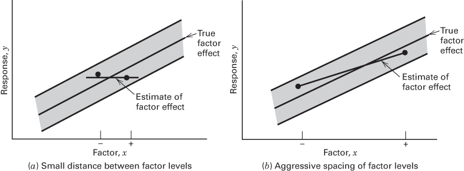  

■ FIGURE 6.9 The impact of the choice of factor levels in an unreplicated design

When analyzing data from unreplicated factorial designs, occasionally real high-order interactions occur. The use of an error mean square obtained by pooling high-order interactions is inappropriate in these cases. A method of analysis attributed to Daniel (1959) provides a simple way to overcome this problem. Daniel suggests examining a normal probability plot of the estimates of the effects. The effects that are negligible are normally distributed, with mean zero and variance $\sigma^{2}$ and will tend to fall along a straight line on this plot, whereas significant effects will have nonzero means and will not lie along the straight line. Thus, the preliminary model will be specified to contain those effects that are apparently nonzero, based on the normal probability plot. The apparently negligible effects are combined as an estimate of error.

## EXAMPLE 6.2 A Single Replicate of the $2^{4}$ Design

A chemical product is produced in a pressure vessel. A factorial experiment is carried out in the pilot plant to study the factors thought to influence the filtration rate of this product. The four factors are temperature (A), pressure (B), concentration of formaldehyde (C), and stirring rate (D). Each factor is present at two levels. The design matrix and the response data obtained from a single replicate of the $2^{4}$ experiment are shown in Table 6.10 and Figure 6.10.

## TABLE 6.10

Pilot Plant Filtration Rate Experiment

<table><tr><td rowspan="2">Run Number</td><td colspan="4">Factor</td><td rowspan="2">Run Label</td><td rowspan="2">Filtration Rate (gal/h)</td></tr><tr><td>A</td><td>B</td><td>C</td><td>D</td></tr><tr><td>1</td><td>-</td><td>-</td><td>-</td><td>-</td><td>(1)</td><td>45</td></tr><tr><td>2</td><td>+</td><td>-</td><td>-</td><td>-</td><td>a</td><td>71</td></tr><tr><td>3</td><td>-</td><td>+</td><td>-</td><td>-</td><td>b</td><td>48</td></tr><tr><td>4</td><td>+</td><td>+</td><td>-</td><td>-</td><td>ab</td><td>65</td></tr><tr><td>5</td><td>-</td><td>-</td><td>+</td><td>-</td><td>c</td><td>68</td></tr><tr><td>6</td><td>+</td><td>-</td><td>+</td><td>-</td><td>ac</td><td>60</td></tr><tr><td>7</td><td>-</td><td>+</td><td>+</td><td>-</td><td>bc</td><td>80</td></tr><tr><td>8</td><td>+</td><td>+</td><td>+</td><td>-</td><td>abc</td><td>65</td></tr><tr><td>9</td><td>-</td><td>-</td><td>-</td><td>+</td><td>d</td><td>43</td></tr><tr><td>10</td><td>+</td><td>-</td><td>-</td><td>+</td><td>ad</td><td>100</td></tr><tr><td>11</td><td>-</td><td>+</td><td>-</td><td>+</td><td>bd</td><td>45</td></tr><tr><td>12</td><td>+</td><td>+</td><td>-</td><td>+</td><td>abd</td><td>104</td></tr><tr><td>13</td><td>-</td><td>-</td><td>+</td><td>+</td><td>cd</td><td>75</td></tr><tr><td>14</td><td>+</td><td>-</td><td>+</td><td>+</td><td>acd</td><td>86</td></tr><tr><td>15</td><td>-</td><td>+</td><td>+</td><td>+</td><td>bcd</td><td>70</td></tr><tr><td>16</td><td>+</td><td>+</td><td>+</td><td>+</td><td>abcd</td><td>96</td></tr></table>

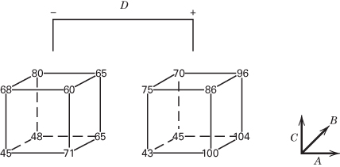

■ FIGURE 6.10 Data from the pilot plant filtration rate experiment for Example 6.2

The 16 runs are made in random order. The process engineer is interested in maximizing the filtration rate. Current process conditions give filtration rates of around 75 gal/h. The process also currently uses the concentration of formaldehyde, factor C, at the high level. The engineer would like to reduce the formaldehyde concentration as much as possible but has been unable to do so because it always results in lower filtration rates.

We will begin the analysis of these data by constructing a normal probability plot of the effect estimates. The table of plus and minus signs for the contrast constants for the $2^{4}$ design are shown in Table 6.11. From these contrasts,

## TABLE 6.11

Contrast Constants for the $2^{4}$ Design

<table><tr><td></td><td>A</td><td>B</td><td>AB</td><td>C</td><td>AC</td><td>BC</td><td>ABC</td><td>D</td><td>AD</td><td>BD</td><td>ABD</td><td>CD</td><td>ACD</td><td>BCD</td><td>ABCD</td></tr><tr><td>(1)</td><td>-</td><td>-</td><td>+</td><td>-</td><td>+</td><td>+</td><td>-</td><td>-</td><td>+</td><td>+</td><td>-</td><td>+</td><td>-</td><td>-</td><td>+</td></tr><tr><td>a</td><td>+</td><td>-</td><td>-</td><td>-</td><td>-</td><td>+</td><td>+</td><td>-</td><td>-</td><td>+</td><td>+</td><td>+</td><td>+</td><td>-</td><td>-</td></tr><tr><td>b</td><td>-</td><td>+</td><td>-</td><td>-</td><td>+</td><td>-</td><td>+</td><td>-</td><td>+</td><td>-</td><td>+</td><td>+</td><td>-</td><td>+</td><td>-</td></tr><tr><td>ab</td><td>+</td><td>+</td><td>+</td><td>-</td><td>-</td><td>-</td><td>-</td><td>-</td><td>-</td><td>-</td><td>-</td><td>+</td><td>+</td><td>+</td><td>+</td></tr><tr><td>c</td><td>-</td><td>-</td><td>+</td><td>+</td><td>-</td><td>-</td><td>+</td><td>-</td><td>+</td><td>+</td><td>-</td><td>-</td><td>+</td><td>+</td><td>-</td></tr><tr><td>ac</td><td>+</td><td>-</td><td>-</td><td>+</td><td>+</td><td>-</td><td>-</td><td>-</td><td>-</td><td>+</td><td>+</td><td>-</td><td>-</td><td>+</td><td>+</td></tr><tr><td>bc</td><td>-</td><td>+</td><td>-</td><td>+</td><td>-</td><td>+</td><td>-</td><td>-</td><td>+</td><td>-</td><td>+</td><td>-</td><td>+</td><td>-</td><td>+</td></tr><tr><td>abc</td><td>+</td><td>+</td><td>+</td><td>+</td><td>+</td><td>+</td><td>+</td><td>-</td><td>-</td><td>-</td><td>-</td><td>-</td><td>-</td><td>-</td><td>-</td></tr><tr><td>d</td><td>-</td><td>-</td><td>+</td><td>-</td><td>+</td><td>+</td><td>-</td><td>+</td><td>-</td><td>-</td><td>+</td><td>-</td><td>+</td><td>+</td><td>-</td></tr><tr><td>ad</td><td>+</td><td>-</td><td>-</td><td>-</td><td>-</td><td>+</td><td>+</td><td>+</td><td>+</td><td>-</td><td>-</td><td>-</td><td>-</td><td>+</td><td>+</td></tr><tr><td>bd</td><td>-</td><td>+</td><td>-</td><td>-</td><td>+</td><td>-</td><td>+</td><td>+</td><td>-</td><td>+</td><td>-</td><td>-</td><td>+</td><td>-</td><td>+</td></tr><tr><td>abd</td><td>+</td><td>+</td><td>+</td><td>-</td><td>-</td><td>-</td><td>-</td><td>+</td><td>+</td><td>+</td><td>+</td><td>-</td><td>-</td><td>-</td><td>-</td></tr><tr><td>cd</td><td>-</td><td>-</td><td>+</td><td>+</td><td>-</td><td>-</td><td>+</td><td>+</td><td>-</td><td>-</td><td>+</td><td>+</td><td>-</td><td>-</td><td>+</td></tr><tr><td>acd</td><td>+</td><td>-</td><td>-</td><td>+</td><td>+</td><td>-</td><td>-</td><td>+</td><td>+</td><td>-</td><td>-</td><td>+</td><td>+</td><td>-</td><td>-</td></tr><tr><td>bcd</td><td>-</td><td>+</td><td>-</td><td>+</td><td>-</td><td>+</td><td>-</td><td>+</td><td>-</td><td>+</td><td>-</td><td>+</td><td>-</td><td>+</td><td>-</td></tr><tr><td>abcd</td><td>+</td><td>+</td><td>+</td><td>+</td><td>+</td><td>+</td><td>+</td><td>+</td><td>+</td><td>+</td><td>+</td><td>+</td><td>+</td><td>+</td><td>+</td></tr></table>

TABLE 6.12  
Factor Effect Estimates and Sums of Squares for the $2^{4}$ Factorial in Example 6.2

<table><tr><td>Model Term</td><td>Effect Estimate</td><td>Sum of Squares</td><td>Percent Contribution</td></tr><tr><td>A</td><td>21.625</td><td>1870.56</td><td>32.6397</td></tr><tr><td>B</td><td>3.125</td><td>39.0625</td><td>0.681608</td></tr><tr><td>C</td><td>9.875</td><td>390.062</td><td>6.80626</td></tr><tr><td>D</td><td>14.625</td><td>855.563</td><td>14.9288</td></tr><tr><td>AB</td><td>0.125</td><td>0.0625</td><td>0.00109057</td></tr><tr><td>AC</td><td>-18.125</td><td>1314.06</td><td>22.9293</td></tr><tr><td>AD</td><td>16.625</td><td>1105.56</td><td>19.2911</td></tr><tr><td>BC</td><td>2.375</td><td>22.5625</td><td>0.393696</td></tr><tr><td>BD</td><td>-0.375</td><td>0.5625</td><td>0.00981515</td></tr><tr><td>CD</td><td>-1.125</td><td>5.0625</td><td>0.0883363</td></tr><tr><td>ABC</td><td>1.875</td><td>14.0625</td><td>0.245379</td></tr><tr><td>ABD</td><td>4.125</td><td>68.0625</td><td>1.18763</td></tr><tr><td>ACD</td><td>-1.625</td><td>10.5625</td><td>0.184307</td></tr><tr><td>BCD</td><td>-2.625</td><td>27.5625</td><td>0.480942</td></tr><tr><td>ABCD</td><td>1.375</td><td>7.5625</td><td>0.131959</td></tr></table>

we may estimate the 15 factorial effects and the sums of squares shown in Table 6.12.

The normal probability plot of these effects is shown in Figure 6.11. All of the effects that lie along the line are negligible, whereas the large effects are far from the line. The important effects that emerge from this analysis are the main effects of A, C, and D and the AC and AD interactions.

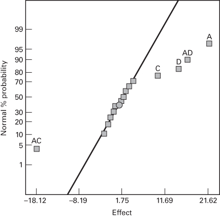  
■ FIGURE 6.11 Normal probability plot of the effects for the $2^{4}$ factorial in Example 6.2

The main effects of A, C, and D are plotted in Figure 6.12a. All three effects are positive, and if we considered only these main effects, we would run all three factors at the high level to maximize the filtration rate. However, it is always necessary to examine any interactions that are important. Remember that main effects do not have much meaning when they are involved in significant interactions.

The AC and AD interactions are plotted in Figure 6.12b. These interactions are the key to solving the problem. Note from the AC interaction that the temperature effect is very small when the concentration is at the high level and very large when the concentration is at the low level, with the best results obtained with low concentration and high temperature. The AD interaction indicates that stirring rate D has little effect at low temperature but a large positive effect at high temperature. Therefore, the best filtration rates would appear to be obtained when A and D are at the high level and C is at the low level. This would allow the reduction of the formaldehyde concentration to a lower level, another objective of the experimenter.

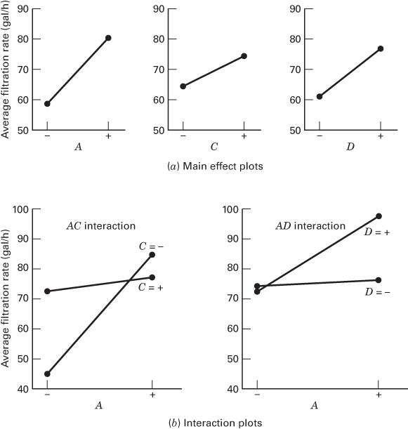

■ FIGURE 6.12 Main effect and interaction plots for Example 6.2

The use of normal probability plot is not without criticism. If none of the effects are very large (say larger than $2\sigma$ ), then the plot may be ambiguous and hard to interpret. If there are few effects, in say an eight-run design, the plot may be of little help.

Design Projection. Another interpretation of the effects in Figure 6.11 is possible. Because B (pressure) is not significant and all interactions involving B are negligible, we may discard B from the experiment so that the design becomes a $2^{3}$ factorial in A, C, and D with two replicates. This is easily seen from examining only columns A, C, and D in the design matrix shown in Table 6.10 and noting that those columns form two replicates of a $2^{3}$ design. The analysis of variance for the data using this simplifying assumption is summarized in Table 6.13. The conclusions that we would draw from this analysis are essentially unchanged from those of Example 6.2. Note that by projecting the single replicate of the $2^{4}$ into a replicated $2^{3}$ , we now have both an estimate of the ACD interaction and an estimate of error based on what is sometimes called hidden replication.

The concept of projecting an unreplicated factorial into a replicated factorial in fewer factors is very useful. In general, if we have a single replicate of a $2^{k}$ design, and if $h(h < k)$ factors are negligible and can be dropped, then the original data correspond to a full two-level factorial in the remaining k - h factors with $2^{h}$ replicates.

Diagnostic Checking. The usual diagnostic checks should be applied to the residuals of a $2^{k}$ design. Our analysis indicates that the only significant effects are A = 21.625, C = 9.875, D = 14.625, AC = -18.125, and

TABLE 6.13  
Analysis of Variance for the Pilot Plant Filtration Rate Experiment in A, C, and D

<table><tr><td>Source of Variation</td><td>Sum of Squares</td><td>Degrees of Freedom</td><td>Mean Square</td><td> $F_0$ </td><td>P-Value</td></tr><tr><td>A</td><td>1870.56</td><td>1</td><td>1870.56</td><td>83.36</td><td>&lt; 0.0001</td></tr><tr><td>C</td><td>390.06</td><td>1</td><td>390.06</td><td>17.38</td><td>&lt; 0.0001</td></tr><tr><td>D</td><td>855.56</td><td>1</td><td>855.56</td><td>38.13</td><td>&lt; 0.0001</td></tr><tr><td>AC</td><td>1314.06</td><td>1</td><td>1314.06</td><td>58.56</td><td>&lt; 0.0001</td></tr><tr><td>AD</td><td>1105.56</td><td>1</td><td>1105.56</td><td>49.27</td><td>&lt; 0.0001</td></tr><tr><td>CD</td><td>5.06</td><td>1</td><td>5.06</td><td>&lt; 1</td><td></td></tr><tr><td>ACD</td><td>10.56</td><td>1</td><td>10.56</td><td>&lt; 1</td><td></td></tr><tr><td>Error</td><td>179.52</td><td>8</td><td>22.44</td><td></td><td></td></tr><tr><td>Total</td><td>5730.94</td><td>15</td><td></td><td></td><td></td></tr></table>

AD = 16.625. If this is true, the estimated filtration rates are given by

$$
\begin{array}{l} \hat {y} = 7 0. 0 6 + \left(\frac {2 1 . 6 2 5}{2}\right) x _ {1} + \left(\frac {9 . 8 7 5}{2}\right) x _ {3} + \left(\frac {1 4 . 6 2 5}{2}\right) x _ {4} - \left(\frac {1 8 . 1 2 5}{2}\right) x _ {1} x _ {3} \\ \qquad + \left(\frac {1 6 . 6 2 5}{2}\right) x _ {1} x _ {4} \end{array}
$$

where 70.06 is the average response, and the coded variables $x_{1}, x_{3}, x_{4}$ take on values between -1 and +1. The predicted filtration rate at run (1) is

$$
\begin{array}{r l} \hat {y} & = 7 0. 0 6 + \left(\frac {2 1 . 6 2 5}{2}\right) (- 1) + \left(\frac {9 . 8 7 5}{2}\right) (- 1) + \left(\frac {1 4 . 6 2 5}{2}\right) (- 1) \\ & - \left(\frac {1 8 . 1 2 5}{2}\right) (- 1) (- 1) + \left(\frac {1 6 . 6 2 5}{2}\right) (- 1) (- 1) \\ & = 4 6. 2 2 \end{array}
$$

Because the observed value is 45, the residual is $e = y - \hat{y} = 45 - 46.25 = -1.25$ . The values of y, $\hat{y}$ , and $e = y - \hat{y}$ for all 16 observations are as follows:

<table><tr><td></td><td>y</td><td>ŷ</td><td>e=y-ŷ</td></tr><tr><td>(1)</td><td>45</td><td>46.25</td><td>-1.25</td></tr><tr><td>a</td><td>71</td><td>69.38</td><td>1.63</td></tr><tr><td>b</td><td>48</td><td>46.25</td><td>1.75</td></tr><tr><td>ab</td><td>65</td><td>69.38</td><td>-4.38</td></tr><tr><td>c</td><td>68</td><td>74.25</td><td>-6.25</td></tr><tr><td>ac</td><td>60</td><td>61.13</td><td>-1.13</td></tr><tr><td>bc</td><td>80</td><td>74.25</td><td>5.75</td></tr><tr><td>abc</td><td>65</td><td>61.13</td><td>3.88</td></tr><tr><td>d</td><td>43</td><td>44.25</td><td>-1.25</td></tr><tr><td>ad</td><td>100</td><td>100.63</td><td>-0.63</td></tr><tr><td>bd</td><td>45</td><td>44.25</td><td>0.75</td></tr><tr><td>abd</td><td>104</td><td>100.63</td><td>3.38</td></tr><tr><td>cd</td><td>75</td><td>72.25</td><td>2.75</td></tr><tr><td>acd</td><td>86</td><td>92.38</td><td>-6.38</td></tr><tr><td>bcd</td><td>70</td><td>72.25</td><td>-2.25</td></tr><tr><td>abcd</td><td>96</td><td>92.38</td><td>3.63</td></tr></table>

■ FIGURE 6.13 Normal probability plot of residuals for Example 6.2

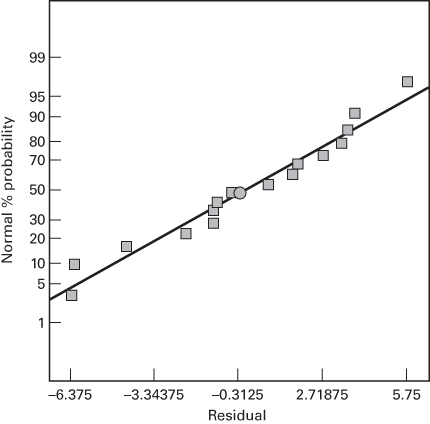

A normal probability plot of the residuals is shown in Figure 6.13. The points on this plot lie reasonably close to a straight line, lending support to our conclusion that A, C, D, AC, and AD are the only significant effects and that the underlying assumptions of the analysis are satisfied.

The Response Surface. We used the interaction plots in Figure 6.12 to provide a practical interpretation of the results of this experiment. Sometimes we find it helpful to use the response surface for this purpose. The response surface is generated by the regression model

$$
\begin{array}{r l} \hat {y} & = 7 0. 0 6 + \left(\frac {2 1 . 6 2 5}{2}\right) x _ {1} + \left(\frac {9 . 8 7 5}{2}\right) x _ {3} + \left(\frac {1 4 . 6 2 5}{2}\right) x _ {4} \\ & - \left(\frac {1 8 . 1 2 5}{2}\right) x _ {1} x _ {3} + \left(\frac {1 6 . 6 2 5}{2}\right) x _ {1} x _ {4} \end{array}
$$

Figure 6.14a shows the response surface contour plot when stirring rate is at the high level (i.e., $x_{4} = 1$ ). The contours are generated from the above model with $x_{4} = 1$ , or

$$
\hat {y} = 7 7. 3 7 2 5 + \left(\frac {3 8 . 2 5}{2}\right) x _ {1} + \left(\frac {9 . 8 7 5}{2}\right) x _ {3} - \left(\frac {1 8 . 1 2 5}{2}\right) x _ {1} x _ {3}
$$

Notice that the contours are curved lines because the model contains an interaction term.

Figure 6.14b is the response surface contour plot when temperature is at the high level (i.e., $x_{1}=1$ ). When we put $x_{1}=1$ in the regression model, we obtain

$$
\hat {y} = 8 0. 8 7 2 5 - \left(\frac {8 . 2 5}{2}\right) x _ {3} + \left(\frac {3 1 . 2 5}{2}\right) x _ {4}
$$

These contours are parallel straight lines because the model contains only the main effects of factors $C(x_{3})$ and $D(x_{4})$ . Both contour plots indicate that if we want to maximize the filtration rate, variables $A(x_{1})$ and $D(x_{4})$ should be at the high level and that the process is relatively robust to concentration C. We obtained similar conclusions from the interaction graphs.

The Half-Normal Plot of Effects. An alternative to the normal probability plot of the factor effects is the half-normal plot. This is a plot of the absolute value of the effect estimates against their cumulative normal probabilities. Figure 6.15 presents the half-normal plot of the effects for Example 6.2. The straight line on the half-normal plot always passes through the origin and should also pass close to the fiftieth percentile data value. Many analysts feel that the half-normal plot is easier to interpret, particularly when there are only a few effect estimates such as when the experimenter has used an eight-run design. Some software packages will construct both plots.

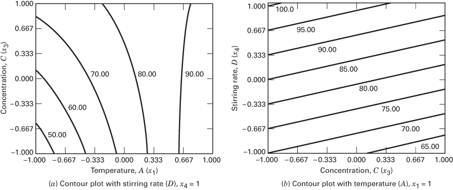  

■ FIGURE 6.14 Contour plots of filtration rate, Example 6.2  
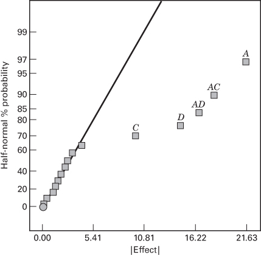  
■ FIGURE 6.15 Half-normal plot of the factor effects from Example 6.2

Other Methods for Analyzing Unreplicated Factorials. A widely used analysis procedure for an unreplicated two-level factorial design is the normal (or half-normal) plot of the estimated factor effects. However, unreplicated designs are so widely used in practice that many formal analysis procedures have been proposed to overcome the subjectivity of the normal probability plot. Hamada and Balakrishnan (1998) compared some of these methods. They found that the method proposed by Lenth (1989) has good power to detect significant effects. It is also easy to implement, and as a result it appears in several software packages for analyzing data from unreplicated factorials. We give a brief description of Lenth's method.

Suppose that we have $m$ contrasts of interest, say $c_{1}, c_{2}, \ldots, c_{m}$ . If the design is an unreplicated $2^{k}$ factorial design, these contrasts correspond to the $m = 2^{k} - 1$ factor effect estimates. The basis of Lenth's method is to estimate the variance of a contrast from the smallest (in absolute value) contrast estimates. Let

$$
s _ {0} = 1. 5 \times \text { median } (| c _ {j} |)
$$

and

$$
P S E = 1. 5 \times \text { median } (| c _ {j} |: | c _ {j} | <   2. 5 s _ {0})
$$

PSE is called the “pseudostandard error,” and Lenth shows that it is a reasonable estimator of the contrast variance when there are only a few active (significant) effects. The PSE is used to judge the significance of contrasts. An individual contrast can be compared to the margin of error

$$
M E = t _ {0. 0 2 5, d} \times P S E
$$

where the degrees of freedom are defined as d = m/3. For inference on a group of contrasts, Lenth suggests using the simultaneous margin of error

$$
S M E = t _ {\gamma , d} \times P S E
$$

where the percentage point of the $t$ distribution used is $\gamma = 1 - (1 + 0.95^{1 / m}) / 2$ .

To illustrate Lenth's method, consider the $2^4$ experiment in Example 6.2. The calculations result in $s_0 = 1.5 \times |-2.625| = 3.9375$ and $2.5 \times 3.9375 = 9.84375$ , so

$$
\begin{array}{r l} & P S E = 1. 5 \times | 1. 7 5 | = 2. 6 2 5 \\ & M E = 2. 5 7 1 \times 2. 6 2 5 = 6. 7 5 \\ & S M E = 5. 2 1 9 \times 2. 6 2 5 = 1 3. 7 0 \end{array}
$$

Now consider the effect estimates in Table 6.12. The SME criterion would indicate that the four largest effects (in magnitude) are significant because their effect estimates exceed SME. The main effect of C is significant according to the ME criterion, but not with respect to SME. However, because the AC interaction is clearly important, we would probably include C in the list of significant effects. Notice that in this example, Lenth's method has produced the same answer that we obtained previously from examination of the normal probability plot of effects.

Several authors [see Loughin and Nobel (1997), Hamada and Balakrishnan (1998), Larntz and Whitcomb (1998), Loughin (1998), and Edwards and Mee (2008)] have observed that Lenth's method results in values of ME and SME that are too conservative and have little power to detect significant effects. Simulation methods can be used to calibrate his procedure. Larntz and Whitcomb (1998) suggest replacing the original ME and SME multipliers with adjusted multipliers as follows:

<table><tr><td>Number of Contrasts</td><td>7</td><td>15</td><td>31</td></tr><tr><td>Original ME</td><td>3.764</td><td>2.571</td><td>2.218</td></tr><tr><td>Adjusted ME</td><td>2.295</td><td>2.140</td><td>2.082</td></tr><tr><td>Original SME</td><td>9.008</td><td>5.219</td><td>4.218</td></tr><tr><td>Adjusted SME</td><td>4.891</td><td>4.163</td><td>4.030</td></tr></table>

These are in close agreement with the results in Ye and Hamada (2000).

The JMP software package implements Lenth's method as part of the screening platform analysis procedure for two-level designs. In their implementation, $P$ -values for each factor and interaction are computed from a "real-time" simulation. This simulation assumes that none of the factors in the experiment are significant and calculates the observed value of the Lenth statistic 10,000 times for this null model. Then $P$ -values are obtained by determining where the observed Lenth statistics fall relative to the tails of these simulation-based reference distributions. These P-values can be used as guidance in selecting factors for the model. Table 6.14 shows the JMP output from the screening analysis platform for the resin filtration rate experiment in Example 6.2. Notice that in addition to the Lenth statistics, the JMP output includes a half-normal plot of the effects and a “Pareto” chart of the effect (contrast) magnitudes. When the factors are entered into the model, the Lenth procedure would recommend including the same factors in the model that we identified previously.

The final JMP output for the fitted model is shown in Table 6.15. The Prediction Profiler at the bottom of the table has been set to the levels of the factors that maximize filtration rate. These are the same settings that we determined earlier by looking at the contour plots.

In general, the Lenth method is a clever and very useful procedure. However, we recommend using it as a supplement to the usual normal probability plot of effects, not as a replacement for it.

Bisgaard (1998–1999) has provided a nice graphical technique, called a conditional inference chart, to assist in interpreting the normal probability plot. The purpose of the graph is to help the experimenter in judging significant effects. This would be relatively easy if the standard deviation $\sigma$ were known, or if it could be estimated from the data. In unreplicated designs, there is no internal estimate of $\sigma$ , so the conditional inference chart is designed to help the experimenter evaluate effect magnitude for a range of standard deviation values. Bisgaard bases the graph on the result that the standard error of an effect in a two-level design with N runs (for an unreplicated factorial, $N = 2^{k}$ ) is

$$
\frac {2 \sigma}{\sqrt {N}}
$$

where $\sigma$ is the standard deviation of an individual observation. Then $\pm2$ times the standard error of an effect is

$$
\pm \frac {4 \sigma}{\sqrt {N}}
$$

Once the effects are estimated, plot a graph as shown in Figure 6.16, with the effect estimates plotted along the vertical or y-axis. In this figure, we have used the effect estimates from Example 6.2. The horizontal, or x-axis, of Figure 6.16 is a standard deviation ( $\sigma$ ) scale. The two lines are at

$$
y = + \frac {4 \sigma}{\sqrt {N}} \quad \text { and } \quad y = - \frac {4 \sigma}{\sqrt {N}}
$$

In our example, $N = 16$ , so the lines are at $y = +\sigma$ and $y = -\sigma$ . Thus, for any given value of the standard deviation $\sigma$ , we can read off the distance between these two lines as an approximate 95 percent confidence interval on the negligible effects.

In Figure 6.16, we observe that if the experimenter thinks that the standard deviation is between 4 and 8, then factors A, C, D, and the AC and AD interactions are significant. If he or she thinks that the standard deviation is as large as 10, factor C may not be significant. That is, for any given assumption about the magnitude of $\sigma$ , the experimenter can construct a “yardstick” for judging the approximate significance of effects. The chart can also be used in reverse. For example, suppose that we were uncertain about whether factor C is significant. The experimenter could then ask whether it is reasonable to expect that $\sigma$ could be as large as 10 or more. If it is unlikely that $\sigma$ is as large as 10, then we can conclude that C is significant.

Effect of Outliers in Unreplicated Designs. Experimenters often worry about the impact of outliers in unreplicated designs, concerned that the outlier will invalidate the analysis and render the results of the experiment useless. This usually isn't a major concern. The reason for this is that the effect estimates are reasonably robust to outliers. To see this, consider an unreplicated $2^{4}$ design with an outlier for (say) the cd treatment combination. The effect of any factor, say for example A, is

$$
A = \overline {{{y}}} _ {A ^ {+}} - \overline {{{y}}} _ {A ^ {-}}
$$

and the cd response appears in only one of the averages, in this case $\overline{y}_{A^{-}}$ . The average $\overline{y}_{A^{-}}$ is an average of eight observations (half of the 16 runs in the $2^{4}$ ), so the impact of the outlier cd is damped out by averaging it with the other

TABLE 6.14  
JMP Screening Platform Output for Example 6.2

<table><tr><td colspan="2">Response Y</td></tr><tr><td colspan="2">Summary of Fit</td></tr><tr><td>RSquare</td><td>1</td></tr><tr><td>RSquare Adj</td><td>-</td></tr><tr><td>Root Mean Square Error</td><td>-</td></tr><tr><td>Mean of Response</td><td>70.0625</td></tr><tr><td>Observations (or Sum Wgts)</td><td>16</td></tr></table>

Sorted Parameter Estimates

<table><tr><td>Term</td><td>Estimate</td><td>Relative Std Error</td><td>Pseudo t-Ratio</td><td>Pseudo t-Ratio</td><td>Pseudo p-Value</td></tr><tr><td>Temp</td><td>10.8125</td><td>0.25</td><td>8.24</td><td></td><td>0.0004*</td></tr><tr><td>Temp*Conc</td><td>-9.0625</td><td>0.25</td><td>-6.90</td><td></td><td>0.0010*</td></tr><tr><td>Temp*StirR</td><td>8.3125</td><td>0.25</td><td>6.33</td><td></td><td>0.0014*</td></tr><tr><td>StirR</td><td>7.3125</td><td>0.25</td><td>5.57</td><td></td><td>0.0026*</td></tr><tr><td>Conc</td><td>4.9375</td><td>0.25</td><td>3.76</td><td></td><td>0.0131*</td></tr><tr><td>Temp*Pressure*StirR</td><td>2.0625</td><td>0.25</td><td>1.57</td><td></td><td>0.1769</td></tr><tr><td>Pressure</td><td>1.5625</td><td>0.25</td><td>1.19</td><td></td><td>0.2873</td></tr><tr><td>Pressure*Conc*StirR</td><td>-1.3125</td><td>0.25</td><td>-1.00</td><td></td><td>0.3632</td></tr><tr><td>Pressure*Conc</td><td>1.1875</td><td>0.25</td><td>0.90</td><td></td><td>0.4071</td></tr><tr><td>Temp*Pressure*Conc</td><td>0.9375</td><td>0.25</td><td>0.71</td><td></td><td>0.5070</td></tr><tr><td>Temp*Conc*StirR</td><td>-0.8125</td><td>0.25</td><td>-0.62</td><td></td><td>0.5630</td></tr><tr><td>Temp*Pressure*Conc*StirR</td><td>0.6875</td><td>0.25</td><td>0.52</td><td></td><td>0.6228</td></tr><tr><td>Conc*StirR</td><td>-0.5625</td><td>0.25</td><td>-0.43</td><td></td><td>0.6861</td></tr><tr><td>Pressure*StirR</td><td>-0.1875</td><td>0.25</td><td>-0.14</td><td></td><td>0.8920</td></tr><tr><td>Temp*Pressure</td><td>0.0625</td><td>0.25</td><td>0.05</td><td></td><td>0.9639</td></tr></table>

No error degrees of freedom, so ordinary tests uncomputable. Relative Std Error corresponds to residual standard error of 1. Pseudo t-Ratio and p-Value calculated using Lenth PSE = 1.3125 and DFE = 5

## Effect Screening

The parameter estimates have equal variances.

The parameter estimates are not correlated.

## Lenth PSE

1.3125

Orthog t Test used Pseudo Standard Error ■ FIGURE 6.16 A conditional inference chart for Example 6.2

Normal Plot  
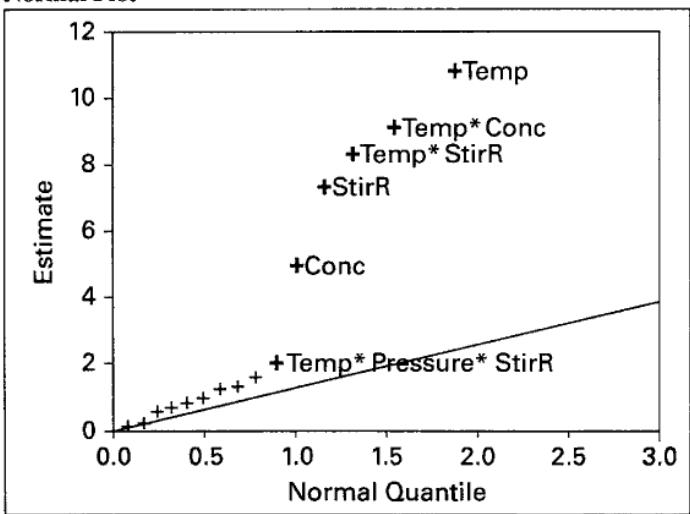  
Blue line is Lenth's PSE, from the estimates population

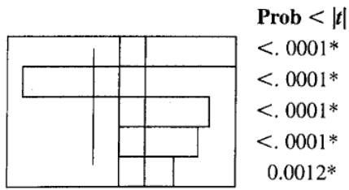

Response Filtration Rate Actual by Predicted Plot  
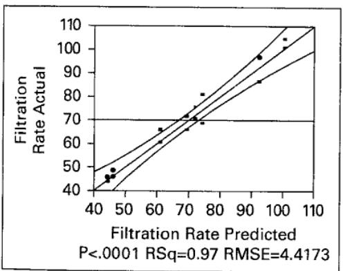

<table><tr><td colspan="2">Summary of Fit</td></tr><tr><td>RSquare</td><td>0.965952</td></tr><tr><td>RSquare Adj</td><td>0.948929</td></tr><tr><td>Root Mean Square Error</td><td>4.417296</td></tr><tr><td>Mean of Response</td><td>70.0625</td></tr><tr><td>Observations (or Sum Wgts)</td><td>16</td></tr></table>

Analysis of Variance

<table><tr><td>Source</td><td>DF</td><td>Sum of Squares</td><td>Mean Square</td><td>F Ratio</td></tr><tr><td>Model</td><td>5</td><td>5535.8125</td><td>1107.16</td><td>56.7412</td></tr><tr><td>Error</td><td>10</td><td>195.1250</td><td>19.51</td><td>Prob &gt; F</td></tr><tr><td>C. Total</td><td>15</td><td>5730.9375</td><td></td><td>&lt;.0001*</td></tr></table>

Lack of Fit

<table><tr><td></td><td></td><td>Sum of</td><td>Mean</td><td>F Ratio</td></tr><tr><td>Source</td><td>DF</td><td>Squares</td><td>Square</td><td>0.3482</td></tr><tr><td>Lack of Fit</td><td>2</td><td>15.62500</td><td>7.8125</td><td>Prob &gt; F</td></tr><tr><td>Pure Error</td><td>8</td><td>179.50000</td><td>22.4375</td><td>0.7162</td></tr><tr><td>Total Error</td><td>10</td><td>195.12500</td><td></td><td>Max RSq</td></tr><tr><td></td><td></td><td></td><td></td><td>0.9687</td></tr></table>

Parameter Estimates

<table><tr><td>Term</td><td>Estimate</td><td>Std Error</td><td>t Ratio</td><td>Prob&gt;|t|</td></tr><tr><td>Intercept</td><td>70.0625</td><td>1.104324</td><td>63.44</td><td>&lt;.0001*</td></tr><tr><td>Temperature</td><td>10.8125</td><td>1.104324</td><td>9.79</td><td>&lt;.0001*</td></tr><tr><td>Stirring Rate</td><td>7.3125</td><td>1.104324</td><td>6.62</td><td>&lt;.0001*</td></tr><tr><td>Concentration</td><td>4.9375</td><td>1.104324</td><td>4.47</td><td>0.0012*</td></tr><tr><td>Temperature</td><td>8.3125</td><td>1.104324</td><td>7.53</td><td>&lt;.0001*</td></tr><tr><td>*Stirring Rate</td><td></td><td></td><td></td><td></td></tr><tr><td>Temperature</td><td>-9.0625</td><td>1.104324</td><td>-8.21</td><td>&lt;.0001*</td></tr><tr><td>*Concentration</td><td></td><td></td><td></td><td></td></tr></table>

Sorted Parameter Estimates

<table><tr><td>Term</td><td>Estimate</td><td>Std Error</td><td>t Ratio</td><td colspan="5"></td><td>Prob &lt; |t|</td></tr><tr><td>Temperature</td><td>10.8125</td><td>1.104324</td><td>9.79</td><td></td><td></td><td></td><td></td><td></td><td>&lt;. 0001*</td></tr><tr><td>Temperature *Concentration</td><td>-9.0625</td><td>1.104324</td><td>-8.21</td><td></td><td></td><td></td><td></td><td></td><td>&lt;. 0001*</td></tr><tr><td>Temperature *Stirring Rate</td><td>8.3125</td><td>1.104324</td><td>7.53</td><td></td><td></td><td></td><td></td><td></td><td>&lt;. 0001*</td></tr><tr><td>Stirring Rate</td><td>7.3125</td><td>1.104324</td><td>6.62</td><td></td><td></td><td></td><td></td><td></td><td>&lt;. 0001*</td></tr><tr><td>Concentration</td><td>4.9375</td><td>1.104324</td><td>4.47</td><td></td><td></td><td></td><td></td><td></td><td>0.0012*</td></tr></table>

Prediction Profiler  
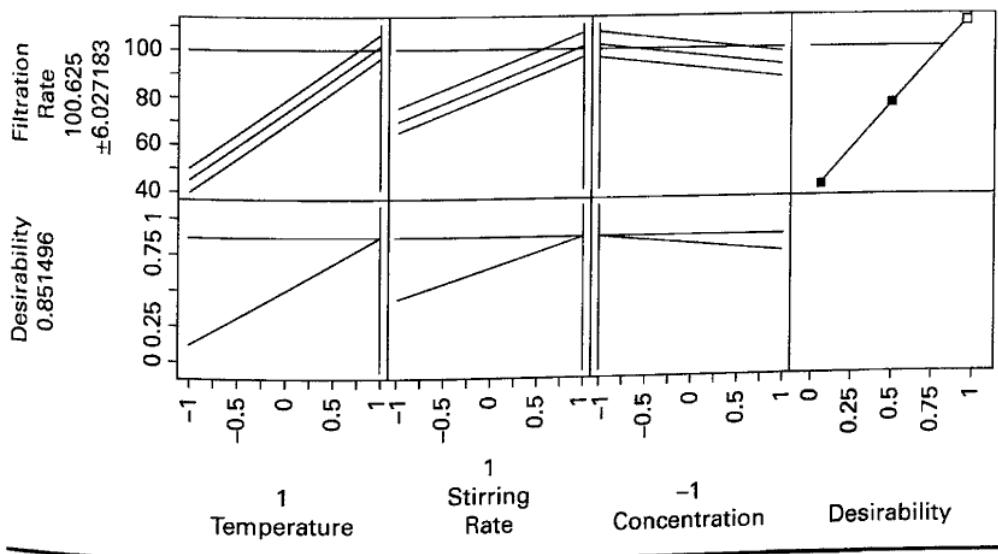

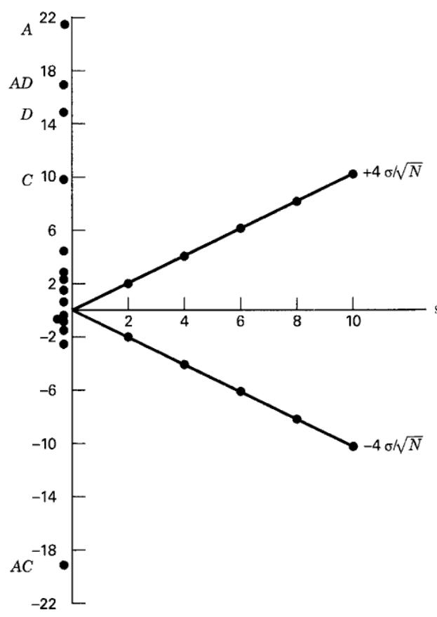

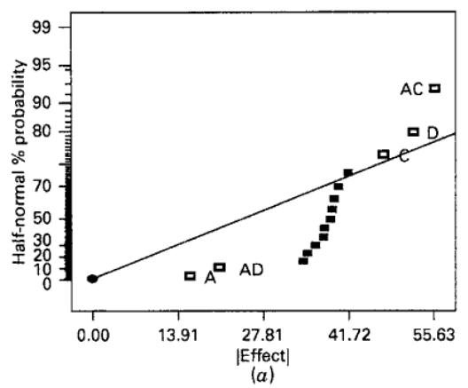

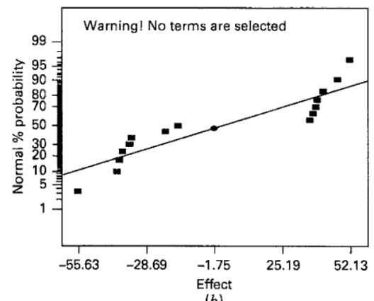  
(b)  
■ FIGURE 6.17 The effect of outliers. (a) Half-normal probability plot (b) normal probability plot

seven runs. This will happen with all of the other effect estimates. As an illustration, consider the $2^{4}$ design in the resin filtration rate experiment of Example 6.2. Suppose that the run cd = 375 (the correct response was 75). Figure 6.17a shows the half-normal plot of the effects. It is obvious that the correct set of important effects is identified on the graph. However, the half-normal plot gives an indication that an outlier may be present. Notice that the straight line identifying the nonsignificant effects does not point toward the origin. In fact, the reference line from the origin is not even close to the collection of nonsignificant effects. A full normal probability plot would also have provided evidence of an outlier. The normal probability plot for this example is shown in Figure 6.17b. Notice that there are two distinct lines on the normal probability plot, not a single line passing through the nonsignificant effects. This is usually a strong indication that an outlier is present.

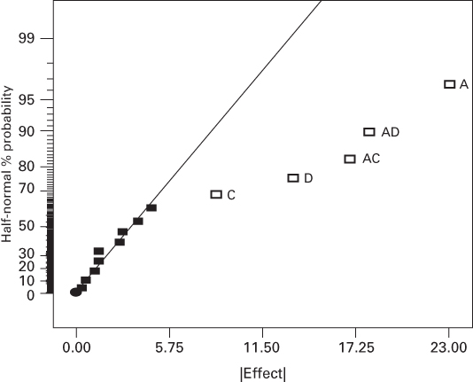  
■ FIGURE 6.18 Analysis of Example 6.2 with an outlier removed

The illustration here involves a very severe outlier (375 instead of 75). This outlier is so dramatic that it would likely be spotted easily just by looking at the sample data or certainly by examining the residuals.

What should we do when an outlier is present? If it is a simple data recording or transposition error, an experimenter may be able to correct the outlier, replacing it with the right value. One suggestion is to replace it by an estimate (following the tactic introduced in Chapter 4 for blocked designs). This will preserve the orthogonality of the design and make interpretation easy. Replacing the outlier with an estimate that makes the highest order interaction estimate zero (in this case, replacing cd with a value that makes ABCD = 0) is one option. Discarding the outlier and analyzing the remaining observations is another option. This same approach would be used if one of the observations from the experiment is missing. Exercise 6.32 asks the reader to follow through with this suggestion for Example 6.2.

Modern computer software can analyze the data from $2^{k}$ designs with missing values because they use the method of least squares to estimate the effects, and least squares does not require an orthogonal design. The impact of this is that the effect estimates are no longer uncorrelated as they would be from an orthogonal design. The normal probability plotting technique requires that the effect estimates be uncorrelated with equal variance, but the degree of correlation introduced by a missing observation is relatively small in $2^{k}$ designs where the number of factors k is at least four. The correlation between the effect estimates and the model regression coefficients will not usually cause significant problems in interpreting the normal probability plot.

Figure 6.18 presents the half-normal probability plot obtained for the effect estimates if the outlier observation cd = 375 in Example 6.2 is omitted. This plot is easy to interpret, and exactly the same significant effects are identified as when the full set of experimental data was used. The correlation between design factors in this situation is $\pm0.0714$ . It can be shown that the correlation between the model regression coefficients is larger, that is $\pm0.5$ , but this still does not lead to any difficulty in interpreting the half-normal probability plot.

## 6.6 Additional Examples of Unreplicated $2^{k}$ Designs

Unreplicated $2^{k}$ designs are widely used in practice. They may be the most common variation of the $2^{k}$ design. This section presents four interesting applications of these designs, illustrating some additional analysis that can be helpful.

## Data Transformation in a Factorial Design

## EXAMPLE 6.3

Daniel (1976) describes a $2^{4}$ factorial design used to study the advance rate of a drill as a function of four factors: drill load (A), flow rate (B), rotational speed (C), and the type of drilling mud used (D). The data from the experiment are shown in Figure 6.19.

  
■ FIGURE 6.19 Data from the drilling experiment of Example 6.3

The normal probability plot of the effect estimates from this experiment is shown in Figure 6.20. Based on this plot, factors B, C, and D along with the BC and BD interactions require interpretation. Figure 6.21 is the normal probability plot of the residuals and Figure 6.22 is the plot of the residuals versus the predicted advance rate from the model containing the identified factors. There are clearly problems with normality and equality of variance. A data transformation is often used to deal with such problems. Because the response variable is a rate, the log transformation seems a reasonable candidate.

  
■ FIGURE 6.20 Normal probability plot of effects for Example 6.3

  
■ FIGURE 6.21 Normal probability plot of residuals for Example 6.3

  
■ FIGURE 6.22 Plot of residuals versus predicted advance rate for Example 6.3

Figure 6.23 presents a normal probability plot of the effect estimates following the transformation $y^{*} = \ln y$ . Notice that a much simpler interpretation now seems possible because only factors B, C, and D are active. That is, expressing the data in the correct metric has simplified its structure to the point that the two interactions are no longer required in the explanatory model.

Figures 6.24 and 6.25 present, respectively, a normal probability plot of the residuals and a plot of the residuals versus the predicted advance rate for the model in the log scale containing B, C, and D. These plots are now satisfactory. We conclude that the model for $y \neq \ln y$ requires only factors B, C, and D for adequate interpretation. The ANOVA for this model is summarized in Table 6.16. The model sum of squares is

  
■ FIGURE 6.23 Normal probability plot of effects for Example 6.3 following log transformation

  
■ FIGURE 6.24 Normal probability plot of residuals for Example 6.3 following log transformation

  
■ FIGURE 6.25 Plot of residuals versus predicted advance rate for Example 6.3 following log transformation

$$
\begin{array}{r l} S S _ {\text {Model}} & = S S _ {B} + S S _ {C} + S S _ {D} \\ & = 5. 3 4 5 + 1. 3 3 9 + 0. 4 3 1 \\ & = 7. 1 1 5 \end{array}
$$

and $R^{2}=SS_{Model}/SS_{T}=7.115/7.288=0.98$ , so the model explains about 98 percent of the variability in the drill advance rate.

## TABLE 6.16

Analysis of Variance for Example 6.3 Following the Log Transformation

<table><tr><td>Source of Variation</td><td>Sum of Squares</td><td>Degrees of Freedom</td><td>Mean Square</td><td> $F_0$ </td><td>P-Value</td></tr><tr><td>B (Flow)</td><td>5.345</td><td>1</td><td>5.345</td><td>381.79</td><td>&lt;0.0001</td></tr><tr><td>C (Speed)</td><td>1.339</td><td>1</td><td>1.339</td><td>95.64</td><td>&lt;0.0001</td></tr><tr><td>D (Mud)</td><td>0.431</td><td>1</td><td>0.431</td><td>30.79</td><td>&lt;0.0001</td></tr><tr><td>Error</td><td>0.173</td><td>12</td><td>0.014</td><td></td><td></td></tr><tr><td>Total</td><td>7.288</td><td>15</td><td></td><td></td><td></td></tr></table>

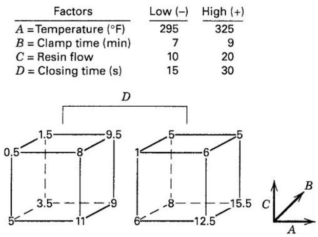

## EXAMPLE 6.4 Location and Dispersion Effects in an Unreplicated Factorial

A $2^{4}$ design was run in a manufacturing process producing interior sidewall and window panels for commercial aircraft. The panels are formed in a press, and under present conditions the average number of defects per panel in a press load is much too high. (The current process average is 5.5 defects per panel.) Four factors are investigated using a single replicate of a $2^{4}$ design, with each replicate corresponding to a single press load. The factors are temperature (A), clamp time (B), resin flow (C), and press closing time (D). The data for this experiment are shown in Figure 6.26.

<table><tr><td>Factors</td><td>Low (-)</td><td>High (+)</td></tr><tr><td>A = Temperature (°F)</td><td>295</td><td>325</td></tr><tr><td>B = Clamp time (min)</td><td>7</td><td>9</td></tr><tr><td>C = Resin flow</td><td>10</td><td>20</td></tr><tr><td>D = Closing time (s)</td><td>15</td><td>30</td></tr></table>

■ FIGURE 6.26 Data for the panel process experiment of Example 6.4

A normal probability plot of the factor effects is shown in Figure 6.27. Clearly, the two largest effects are A = 5.75 and C = -4.25. No other factor effects appear to be large, and A and C explain about 77 percent of the total variability. We therefore conclude that lower temperature (A) and higher resin flow (C) would reduce the incidence of panel defects.

  
■ FIGURE 6.27 Normal probability plot of the factor effects for the panel process experiment of Example 6.4

Careful residual analysis is an important aspect of any experiment. A normal probability plot of the residuals showed no anomalies, but when the experimenter plotted the residuals versus each of the factors A through D, the plot of residuals versus B (clamp time) presented the pattern shown in Figure 6.28. This factor, which is unimportant insofar as the average number of defects per panel is concerned, is very important in its effect on process variability, with the lower clamp time resulting in less variability in the average number of defects per panel in a press load.

  
■ FIGURE 6.28 Plot of residuals versus clamp time for Example 6.4

The dispersion effect of clamp time is also very evident from the cube plot in Figure 6.29, which plots the average number of defects per panel and the range of the number of defects at each point in the cube defined by factors A, B, and C. The average range when B is at the high level (the back face of the cube in Figure 6.29) is $\overline{R}_{B^{+}} = 4.75$ and when B is at the low level, it is $\overline{R}_{B^{-}} = 1.25$ .

  
■ FIGURE 6.29 Cube plot of temperature, clamp time, and resin flow for Example 6.4

As a result of this experiment, the engineer decided to run the process at low temperature and high resin flow to reduce the average number of defects, at low clamp time to reduce the variability in the number of defects per panel, and at low press closing time (which had no effect on either location or dispersion). The new set of operating conditions resulted in a new process average of less than one defect per panel.

The residuals from a $2^{k}$ design provide much information about the problem under study. Because residuals can be thought of as observed values of the noise or error, they often give insight into process variability. We can systematically examine the residuals from an unreplicated $2^{k}$ design to provide information about process variability.

Consider the residual plot in Figure 6.28. The standard deviation of the eight residuals where $B$ is at the low level is $S(B^{-}) = 0.83$ , and the standard deviation of the eight residuals where $B$ is at the high level is $S(B^{+}) = 2.72$ . The statistic

$$
F _ {B} ^ {*} = \ln \frac {S ^ {2} (B ^ {+})}{S ^ {2} (B ^ {-})}\tag{6.24}
$$

has an approximate normal distribution if the two variances $\sigma^2 (B^{+})$ and $\sigma^2 (B^{-})$ are equal. To illustrate the calculations, the value of $F_{B}^{*}$ is

$$
\begin{array}{r l} F _ {B} ^ {*} & = \ln \frac {S ^ {2} (B ^ {+})}{S ^ {2} (B ^ {-})} \\ & = \ln \frac {(2 . 7 2) ^ {2}}{(0 . 8 3) ^ {2}} \\ & = 2. 3 7 \end{array}
$$

Table 6.17 presents the complete set of contrasts for the $2^{4}$ design along with the residuals for each run from the panel process experiment in Example 6.4. Each column in this table contains an equal number of plus and minus

## TABLE 6.17

Calculation of Dispersion Effects for Example 6.4

<table><tr><td>Run</td><td>A</td><td>B</td><td>AB</td><td>C</td><td>AC</td><td>BC</td><td>ABC</td><td>D</td><td>AD</td><td>BD</td><td>ABD</td><td>CD</td><td>ACD</td><td>BCD</td><td>ABCD</td><td>Residual</td></tr><tr><td>1</td><td>-</td><td>-</td><td>+</td><td>-</td><td>+</td><td>+</td><td>-</td><td>-</td><td>+</td><td>+</td><td>-</td><td>+</td><td>-</td><td>-</td><td>+</td><td>-0.94</td></tr><tr><td>2</td><td>+</td><td>-</td><td>-</td><td>-</td><td>-</td><td>+</td><td>+</td><td>-</td><td>-</td><td>+</td><td>+</td><td>+</td><td>+</td><td>-</td><td>-</td><td>-0.69</td></tr><tr><td>3</td><td>-</td><td>+</td><td>-</td><td>-</td><td>+</td><td>-</td><td>+</td><td>-</td><td>+</td><td>-</td><td>+</td><td>+</td><td>-</td><td>+</td><td>-</td><td>-2.44</td></tr><tr><td>4</td><td>+</td><td>+</td><td>+</td><td>-</td><td>-</td><td>-</td><td>-</td><td>-</td><td>-</td><td>-</td><td>-</td><td>+</td><td>+</td><td>+</td><td>+</td><td>-2.69</td></tr><tr><td>5</td><td>-</td><td>-</td><td>+</td><td>+</td><td>-</td><td>-</td><td>+</td><td>-</td><td>+</td><td>+</td><td>-</td><td>-</td><td>+</td><td>+</td><td>-</td><td>-1.19</td></tr><tr><td>6</td><td>+</td><td>-</td><td>-</td><td>+</td><td>+</td><td>-</td><td>-</td><td>-</td><td>-</td><td>+</td><td>+</td><td>-</td><td>-</td><td>+</td><td>+</td><td>0.56</td></tr><tr><td>7</td><td>-</td><td>+</td><td>-</td><td>+</td><td>-</td><td>+</td><td>-</td><td>-</td><td>+</td><td>-</td><td>+</td><td>-</td><td>+</td><td>-</td><td>+</td><td>-0.19</td></tr><tr><td>8</td><td>+</td><td>+</td><td>+</td><td>+</td><td>+</td><td>+</td><td>+</td><td>-</td><td>-</td><td>-</td><td>-</td><td>-</td><td>-</td><td>-</td><td>-</td><td>2.06</td></tr><tr><td>9</td><td>-</td><td>-</td><td>+</td><td>-</td><td>+</td><td>+</td><td>-</td><td>+</td><td>-</td><td>-</td><td>+</td><td>-</td><td>+</td><td>+</td><td>-</td><td>0.06</td></tr><tr><td>10</td><td>+</td><td>-</td><td>-</td><td>-</td><td>-</td><td>+</td><td>+</td><td>+</td><td>+</td><td>-</td><td>-</td><td>-</td><td>-</td><td>+</td><td>+</td><td>0.81</td></tr><tr><td>11</td><td>-</td><td>+</td><td>-</td><td>-</td><td>+</td><td>-</td><td>+</td><td>+</td><td>-</td><td>+</td><td>-</td><td>-</td><td>+</td><td>-</td><td>+</td><td>2.06</td></tr><tr><td>12</td><td>+</td><td>+</td><td>+</td><td>-</td><td>-</td><td>-</td><td>-</td><td>+</td><td>+</td><td>+</td><td>+</td><td>-</td><td>-</td><td>-</td><td>-</td><td>3.81</td></tr><tr><td>13</td><td>-</td><td>-</td><td>+</td><td>+</td><td>-</td><td>-</td><td>+</td><td>+</td><td>-</td><td>-</td><td>+</td><td>+</td><td>-</td><td>-</td><td>+</td><td>-0.69</td></tr><tr><td>14</td><td>+</td><td>-</td><td>-</td><td>+</td><td>+</td><td>-</td><td>-</td><td>+</td><td>+</td><td>-</td><td>-</td><td>+</td><td>+</td><td>-</td><td>-</td><td>-1.44</td></tr><tr><td>15</td><td>-</td><td>+</td><td>-</td><td>+</td><td>-</td><td>+</td><td>-</td><td>+</td><td>-</td><td>+</td><td>-</td><td>+</td><td>-</td><td>+</td><td>-</td><td>3.31</td></tr><tr><td>16</td><td>+</td><td>+</td><td>+</td><td>+</td><td>+</td><td>+</td><td>+</td><td>+</td><td>+</td><td>+</td><td>+</td><td>+</td><td>+</td><td>+</td><td>+</td><td>-2.44</td></tr><tr><td> $S(i^{+})$ </td><td>2.25</td><td>2.72</td><td>2.21</td><td>1.91</td><td>1.81</td><td>1.80</td><td>1.80</td><td>2.24</td><td>2.05</td><td>2.28</td><td>1.97</td><td>1.93</td><td>1.52</td><td>2.09</td><td>1.61</td><td></td></tr><tr><td> $S(i^{-})$ </td><td>1.85</td><td>0.83</td><td>1.86</td><td>2.20</td><td>2.24</td><td>2.26</td><td>2.24</td><td>1.55</td><td>1.93</td><td>1.61</td><td>2.11</td><td>1.58</td><td>2.16</td><td>1.89</td><td>2.33</td><td></td></tr><tr><td> $F_{i}^{*}$ </td><td>0.39</td><td>2.37</td><td>0.34</td><td>-0.28</td><td>-0.43</td><td>-0.46</td><td>-0.44</td><td>0.74</td><td>0.12</td><td>0.70</td><td>-0.14</td><td>0.40</td><td>-0.70</td><td>0.20</td><td>-0.74</td><td></td></tr></table>

■ FIGURE 6.30 Normal probability plot of the dispersion effects $F_{i}^{*}$ for Example 6.4


signs, and we can calculate the standard deviation of the residuals for each group of signs in each column, say $S(i^{+})$ and $S(i^{-}), i = 1,2,\ldots,15$ . Then

$$
F _ {i} ^ {*} = \ln \frac {S ^ {2} (i ^ {+})}{S ^ {2} (i ^ {-})} i = 1, 2, \dots , 1 5\tag{6.25}
$$

is a statistic that can be used to assess the magnitude of the dispersion effects in the experiment. If the variance of the residuals for the runs where factor i is positive equals the variance of the residuals for the runs where factor i is negative, then $F_{i}^{*}$ has an approximate normal distribution. The values of $F_{i}^{*}$ are shown below each column in Table 6.15.

Figure 6.30 is a normal probability plot of the dispersion effects $F_{i}^{*}$ . Clearly, $B$ is an important factor with respect to process dispersion. For more discussion of this procedure, see Box and Meyer (1986) and Myers, Montgomery, and Anderson-Cook (2016). Also, in order for the model residuals to properly convey information about dispersion effects, the location model must be correctly specified. Refer to the supplemental text material for this chapter for more details and an example.

## EXAMPLE 6.5

## Duplicate Measurements on the Response

A team of engineers at a semiconductor manufacturer ran a $2^{4}$ factorial design in a vertical oxidation furnace. Four wafers are “stacked” in the furnace, and the response variable of interest is the oxide thickness on the wafers. The four design factors are temperature (A), time (B), pressure (C), and gas flow (D). The experiment is conducted by loading four wafers into the furnace, setting the process variables to the test conditions required by the experimental design, processing the wafers, and then measuring the oxide thickness on all four wafers. Table 6.18 presents the design and the resulting thickness measurements. In this table, the four columns labeled “Thickness” contain the oxide thickness measurements on each individual wafer, and the last two columns contain the sample average and sample variance of the thickness measurements on the four wafers in each run.

The proper analysis of this experiment is to consider the individual wafer thickness measurements as duplicate measurements and not as replicates. If they were really replicates, each wafer would have been processed individually on a single run of the furnace. However, because all four wafers were processed together, they received the treatment factors (that is, the levels of the design variables) simultaneously, so there is much less variability in the individual wafer thickness measurements than would have been observed if each wafer was a replicate. Therefore, the average of the thickness measurements is the correct response variable to initially consider.

Table 6.19 presents the effect estimates for this experiment, using the average oxide thickness $\bar{y}$ as the response variable. Note that factors A and B and the AB interaction have large effects that together account for nearly 90 percent of the variability in average oxide thickness. Figure 6.31 is a normal probability plot of the effects. From examination of this display, we would conclude that factors A, B, and C and the AB and AC interactions are important. The analysis of variance display for this model is shown in Table 6.20.

The model for predicting average oxide thickness is

$$
\begin{array}{l} \hat {y} = 3 9 9. 1 9 + 2 1. 5 6 x _ {1} + \\ \quad 9. 0 6 x _ {2} - 5. 1 9 x _ {3} + 8. 4 4 x _ {1} x _ {2} - 5. 3 1 x _ {1} x _ {3} \end{array}
$$

The residual analysis of this model is satisfactory.

TABLE 6.18  
The Oxide Thickness Experiment

<table><tr><td>Standard Order</td><td>Run Order</td><td>A</td><td>B</td><td>C</td><td>D</td><td></td><td colspan="3">Thickness</td><td> $\overline{y}$ </td><td> $s^2$ </td></tr><tr><td>1</td><td>10</td><td>-1</td><td>-1</td><td>-1</td><td>-1</td><td>378</td><td>376</td><td>379</td><td>379</td><td>378</td><td>2</td></tr><tr><td>2</td><td>7</td><td>1</td><td>-1</td><td>-1</td><td>-1</td><td>415</td><td>416</td><td>416</td><td>417</td><td>416</td><td>0.67</td></tr><tr><td>3</td><td>3</td><td>-1</td><td>1</td><td>-1</td><td>-1</td><td>380</td><td>379</td><td>382</td><td>383</td><td>381</td><td>3.33</td></tr><tr><td>4</td><td>9</td><td>1</td><td>1</td><td>-1</td><td>-1</td><td>450</td><td>446</td><td>449</td><td>447</td><td>448</td><td>3.33</td></tr><tr><td>5</td><td>6</td><td>-1</td><td>-1</td><td>1</td><td>-1</td><td>375</td><td>371</td><td>373</td><td>369</td><td>372</td><td>6.67</td></tr><tr><td>6</td><td>2</td><td>1</td><td>-1</td><td>1</td><td>-1</td><td>391</td><td>390</td><td>388</td><td>391</td><td>390</td><td>2</td></tr><tr><td>7</td><td>5</td><td>-1</td><td>1</td><td>1</td><td>-1</td><td>384</td><td>385</td><td>386</td><td>385</td><td>385</td><td>0.67</td></tr><tr><td>8</td><td>4</td><td>1</td><td>1</td><td>1</td><td>-1</td><td>426</td><td>433</td><td>430</td><td>431</td><td>430</td><td>8.67</td></tr><tr><td>9</td><td>12</td><td>-1</td><td>-1</td><td>-1</td><td>1</td><td>381</td><td>381</td><td>375</td><td>383</td><td>380</td><td>12.00</td></tr><tr><td>10</td><td>16</td><td>1</td><td>-1</td><td>-1</td><td>1</td><td>416</td><td>420</td><td>412</td><td>412</td><td>415</td><td>14.67</td></tr><tr><td>11</td><td>8</td><td>-1</td><td>1</td><td>-1</td><td>1</td><td>371</td><td>372</td><td>371</td><td>370</td><td>371</td><td>0.67</td></tr><tr><td>12</td><td>1</td><td>1</td><td>1</td><td>-1</td><td>1</td><td>445</td><td>448</td><td>443</td><td>448</td><td>446</td><td>6</td></tr><tr><td>13</td><td>14</td><td>-1</td><td>-1</td><td>1</td><td>1</td><td>377</td><td>377</td><td>379</td><td>379</td><td>378</td><td>1.33</td></tr><tr><td>14</td><td>15</td><td>1</td><td>-1</td><td>1</td><td>1</td><td>391</td><td>391</td><td>386</td><td>400</td><td>392</td><td>34</td></tr><tr><td>15</td><td>11</td><td>-1</td><td>1</td><td>1</td><td>1</td><td>375</td><td>376</td><td>376</td><td>377</td><td>376</td><td>0.67</td></tr><tr><td>16</td><td>13</td><td>1</td><td>1</td><td>1</td><td>1</td><td>430</td><td>430</td><td>428</td><td>428</td><td>429</td><td>1.33</td></tr></table>

TABLE 6.19  
Effect Estimates for Example 6.5, Response Variable Is Average Oxide Thickness

<table><tr><td>Model Term</td><td>Effect Estimate</td><td>Sum of Squares</td><td>Percent Contribution</td></tr><tr><td>A</td><td>43.125</td><td>7439.06</td><td>67.9339</td></tr><tr><td>B</td><td>18.125</td><td>1314.06</td><td>12.0001</td></tr><tr><td>C</td><td>-10.375</td><td>430.562</td><td>3.93192</td></tr><tr><td>D</td><td>-1.625</td><td>10.5625</td><td>0.0964573</td></tr><tr><td>AB</td><td>16.875</td><td>1139.06</td><td>10.402</td></tr><tr><td>AC</td><td>-10.625</td><td>451.563</td><td>4.12369</td></tr><tr><td>AD</td><td>1.125</td><td>5.0625</td><td>0.046231</td></tr><tr><td>BC</td><td>3.875</td><td>60.0625</td><td>0.548494</td></tr><tr><td>BD</td><td>-3.875</td><td>60.0625</td><td>0.548494</td></tr><tr><td>CD</td><td>1.125</td><td>5.0625</td><td>0.046231</td></tr><tr><td>ABC</td><td>-0.375</td><td>0.5625</td><td>0.00513678</td></tr><tr><td>ABD</td><td>2.875</td><td>33.0625</td><td>0.301929</td></tr><tr><td>ACD</td><td>-0.125</td><td>0.0625</td><td>0.000570753</td></tr><tr><td>BCD</td><td>-0.625</td><td>1.5625</td><td>0.0142688</td></tr><tr><td>ABCD</td><td>0.125</td><td>0.0625</td><td>0.000570753</td></tr></table>

  
■ FIGURE 6.31 Normal probability plot of the effects for the average oxide thickness response, Example 6.5

<table><tr><td>Source</td><td>Sum of Squares</td><td>DF</td><td>Mean Square</td><td>F Value</td><td>Prob &gt; F</td></tr><tr><td>Model</td><td>10774.31</td><td>5</td><td>2154.86</td><td>122.35</td><td>&lt;0.000</td></tr><tr><td>A</td><td>7439.06</td><td>1</td><td>7439.06</td><td>422.37</td><td>&lt;0.000</td></tr><tr><td>B</td><td>1314.06</td><td>1</td><td>1314.06</td><td>74.61</td><td>&lt;0.000</td></tr><tr><td>C</td><td>430.56</td><td>1</td><td>430.56</td><td>24.45</td><td>0.0006</td></tr><tr><td>AB</td><td>1139.06</td><td>1</td><td>1139.06</td><td>64.67</td><td>&lt;0.000</td></tr><tr><td>AC</td><td>451.46</td><td>1</td><td>451.56</td><td>25.64</td><td>0.0005</td></tr><tr><td>Residual</td><td>176.12</td><td>10</td><td>17.61</td><td></td><td></td></tr><tr><td>Cor Total</td><td>10950.44</td><td>15</td><td></td><td></td><td></td></tr><tr><td>Std. Dev.</td><td>4.20</td><td>R-Squared</td><td>0.9839</td><td></td><td></td></tr><tr><td>Mean</td><td>399.19</td><td>Adj R-Squared</td><td>0.9759</td><td></td><td></td></tr><tr><td>C.V.</td><td>1.05</td><td>Pred R-Squared</td><td>0.9588</td><td></td><td></td></tr><tr><td>PRESS</td><td>450.88</td><td>Adeq Precision</td><td>27.967</td><td></td><td></td></tr><tr><td>Factor</td><td>Coefficient Estimate</td><td>DF</td><td>Standard Error</td><td>95% CI Low</td><td>95% CI High</td></tr><tr><td>Intercept</td><td>399.19</td><td>1</td><td>1.05</td><td>396.85</td><td>401.53</td></tr><tr><td>A-Time</td><td>21.56</td><td>1</td><td>1.05</td><td>19.22</td><td>23.90</td></tr><tr><td>B-Temp</td><td>9.06</td><td>1</td><td>1.05</td><td>6.72</td><td>11.40</td></tr><tr><td>C-Pressure</td><td>-5.19</td><td>1</td><td>1.05</td><td>-7.53</td><td>-2.85</td></tr><tr><td>AB</td><td>8.44</td><td>1</td><td>1.05</td><td>6.10</td><td>10.78</td></tr><tr><td>AC</td><td>-5.31</td><td>1</td><td>1.05</td><td>-7.65</td><td>-2.97</td></tr></table>

TABLE 6.20

Analysis of Variance (from Design-Expert) for the Average Oxide Thickness Response, Example 6.5

The experimenters are interested in obtaining an average oxide thickness of 400 Å, and product specifications require that the thickness must lie between 390 and 410 Å.

Figure 6.32 presents two contour plots of average thickness, one with factor C (or $x_{3}$ ), pressure, at the low level (that is, $x_{3} = -1$ ) and the other with C (or $x_{3}$ ) at the high level (that is, $x_{3} = +1$ ). From examining these contour plots, it is obvious that there are many combinations of time and temperature (factors A and B) that will produce acceptable results. However, if pressure is held constant at the low level, the operating “window” is shifted toward the left, or lower, end of the time axis, indicating that lower cycle times will be required to achieve the desired oxide thickness.


■ FIGURE 6.32 Contour plots of average oxide thickness with pressure ( $x_{3}$ ) held constant

TABLE 6.21  
Analysis of Variance (from Design-Expert) of the Individual Wafer Oxide Thickness Response

<table><tr><td>Source</td><td>Sum of Squares</td><td>DF</td><td>Mean Square</td><td>F Value</td><td>Prob &gt; F</td></tr><tr><td>Model</td><td>43801.75</td><td>15</td><td>2920.12</td><td>476.75</td><td>&lt;0.0001</td></tr><tr><td>A</td><td>29756.25</td><td>1</td><td>29756.25</td><td>4858.16</td><td>&lt;0.0001</td></tr><tr><td>B</td><td>5256.25</td><td>1</td><td>5256.25</td><td>858.16</td><td>&lt;0.0001</td></tr><tr><td>C</td><td>1722.25</td><td>1</td><td>1722.25</td><td>281.18</td><td>&lt;0.0001</td></tr><tr><td>D</td><td>42.25</td><td>1</td><td>42.25</td><td>6.90</td><td>0.0115</td></tr><tr><td>AB</td><td>4556.25</td><td>1</td><td>4556.25</td><td>743.88</td><td>&lt;0.0001</td></tr><tr><td>AC</td><td>1806.25</td><td>1</td><td>1806.25</td><td>294.90</td><td>&lt;0.0001</td></tr><tr><td>AD</td><td>20.25</td><td>1</td><td>20.25</td><td>3.31</td><td>0.0753</td></tr><tr><td>BC</td><td>240.25</td><td>1</td><td>240.25</td><td>39.22</td><td>&lt;0.0001</td></tr><tr><td>BD</td><td>240.25</td><td>1</td><td>240.25</td><td>39.22</td><td>&lt;0.0001</td></tr><tr><td>CD</td><td>20.25</td><td>1</td><td>20.25</td><td>3.31</td><td>0.0753</td></tr><tr><td>ABD</td><td>132.25</td><td>1</td><td>132.25</td><td>21.59</td><td>&lt;0.0001</td></tr><tr><td>ABC</td><td>2.25</td><td>1</td><td>2.25</td><td>0.37</td><td>0.5473</td></tr><tr><td>ACD</td><td>0.25</td><td>1</td><td>0.25</td><td>0.041</td><td>0.8407</td></tr><tr><td>BCD</td><td>6.25</td><td>1</td><td>6.25</td><td>1.02</td><td>0.3175</td></tr><tr><td>ABCD</td><td>0.25</td><td>1</td><td>0.25</td><td>0.041</td><td>0.8407</td></tr><tr><td>Residual</td><td>294.00</td><td>48</td><td>6.12</td><td></td><td></td></tr><tr><td>Lack of Fit</td><td>0.000</td><td>0</td><td></td><td></td><td></td></tr><tr><td>Pure Error</td><td>294.00</td><td>48</td><td>6.13</td><td></td><td></td></tr><tr><td>Cor Total</td><td>44095.75</td><td>63</td><td></td><td></td><td></td></tr></table>

It is interesting to observe the results that would be obtained if we incorrectly consider the individual wafer oxide thickness measurements as replicates. Table 6.21 presents a full-model ANOVA based on treating the experiment as a replicated $2^{4}$ factorial. Notice that there are many significant factors in this analysis, suggesting a much more complex model than the one that we found when using the average oxide thickness as the response. The reason for this is that the estimate of the error variance in Table 6.21 is too small ( $\hat{\sigma}^{2}=6.12$ ). The residual mean square in Table 6.21 reflects a combination of the variability between wafers within a run and variability between runs. The estimate of error obtained from Table 6.20 is much larger, $\hat{\sigma}^{2}=17.61$ , and it is primarily a measure of the between-run variability. This is the best estimate of error to use in judging the significance of process variables that are changed from run to run.

A logical question to ask is: What harm results from identifying too many factors as important, as the incorrect analysis in Table 6.21 would certainly do. The answer is that trying to manipulate or optimize the unimportant factors would be a waste of resources, and it could result in adding unnecessary variability to other responses of interest.

When there are duplicate measurements on the response, these observations almost always contain useful information about some aspect of process variability. For example, if the duplicate measurements are multiple tests by a gauge on the same experimental unit, then the duplicate measurements give some insight about gauge capability. If the duplicate measurements are made at different locations on an experimental unit, they may give some information about the uniformity of the response variable across that unit. In our example, because we have one observation on each of the four experimental units that have undergone processing together, we have some information about the within-run variability in the process. This information is contained in the variance of the oxide thickness measurements from the four wafers in each run. It would be of interest to determine whether any of the process variables influence the within-run variability.

  
■ FIGURE 6.33 Normal probability plot of the effects using $\ln(s^{2})$ as the response, Example 6.5

Figure 6.33 is a normal probability plot of the effect estimates obtained using $\ln(s^{2})$ as the response. Recall from Chapter 3 that we indicated that the log transformation is generally appropriate for modeling variability. There are not any strong individual effects, but factor A and BD interaction are the largest. If we also include the main effects of B and D to obtain a hierarchical model, then the model for $\ln(s^{2})$ is

$$
\widehat {\ln (s ^ {2})} = 1. 0 8 + 0. 4 1 x _ {1} - 0. 4 0 x _ {2} + 0. 2 0 x _ {4} - 0. 5 6 x _ {2} x _ {4}
$$

The model accounts for just slightly less than half of the variability in the $\ln(s^{2})$ response, which is certainly not spectacular as empirical models go, but it is often difficult to obtain exceptionally good models of variances.

Figure 6.34 is a contour plot of the predicted variance (not the log of the predicted variance) with pressure $x_{3}$ at the low level (recall that this minimizes cycle time) and gas flow $x_{4}$ at the high level. This choice of gas flow gives the lowest values of predicted variance in the region of the contour plot.

The experimenters here were interested in selecting values of the design variables that gave a mean oxide thickness within the process specifications and as close to 400 Å as possible, while simultaneously making the within-run variability small, say $s^{2} \leq 2$ . One possible way to find a suitable set of conditions is to overlay the contour plots in Figures 6.32 and 6.34. The overlay plot is shown in Figure 6.35, with the specifications on mean oxide thickness and the constraint $s^{2} \leq 2$ shown as contours. In this plot, pressure is held constant at the low level and gas flow is held constant at the high level. The open region near the upper left center of the graph identifies a feasible region for the variables time and temperature.

  
■ FIGURE 6.34 Contour plot of $s^{2}$ (within-run variability) with pressure at the low level and gas flow at the high level

This is a simple example of using contour plots to study two responses simultaneously. We will discuss this problem in more detail in Chapter 11.

  
■ FIGURE 6.35 Overlay of the average oxide thickness and $s^{2}$ responses with pressure at the low level and gas flow at the high level

## EXAMPLE 6.6 Credit Card Marketing

An article in the International Journal of Research in Marketing (“Experimental Design on the Front Lines of Marketing: Testing New Ideas to Increase Direct Mail Sales,” 2006, Vol. 23, pp. 309–319) describes an experiment to test new ideas to increase direct mail sales by the credit card division of a financial services company. They want to improve the response rate to its credit card offers. They know from experience that the interest rates are an important factor in attracting potential customers, so they have decided to focus on factors involving both interest rates and fees. They want to test changes in both introductory and long-term rates, as well as the effects of adding an account-opening fee and lowering the annual fee. The factors tested in the experiment are as follows:

<table><tr><td>Factor</td><td>(−) Control</td><td>(+) New Idea</td></tr><tr><td>A: Annual fee</td><td>Current</td><td>Lower</td></tr><tr><td>B: Account-opening fee</td><td>No</td><td>Yes</td></tr><tr><td>C: Initial interest rate</td><td>Current</td><td>Lower</td></tr><tr><td>D: Long-term interest rate</td><td>Low</td><td>High</td></tr></table>

The marketing team used columns A through D of the $2^{4}$ factorial test matrix shown in Table 6.22 to create 16 mail packages. The +/− sign combinations in the 11 interaction (product) columns are used solely to facilitate the statistical analysis of the results. Each of the 16 test combinations was mailed to 7500 customers, and 2837 customers responded positively to the offers.

Table 6.23 is the JMP output for the screening analysis. Lenth's method with simulated P-values is used to identify significant factors. All four main effects are significant, and one interaction (AB, or Annual Fee × Account Opening Fee). The prediction profiler indicates the settings of the four factors that will result in the maximum response rate. The lower annual fee, no account opening fee, the lower long-term interest rate and either value of the initial interest rate produce the best response, 3.39 percent. The optimum conditions occur at one of the actual test combinations because all four design factors were treated as qualitative. With continuous factors, the optimal conditions are usually not at one of the experimental runs.

## TABLE 6.22

The 2 $^{4}$ Factorial Design Used in the Credit Card Marketing Experiment, Example 6.6

<table><tr><td rowspan="2">Test Cell</td><td rowspan="2">Annual-Fee</td><td rowspan="2">Account-Opening Fee</td><td rowspan="2">Initial Interest Rate</td><td rowspan="2">Long-Term Interest Rate</td><td colspan="12">(Interactions)</td><td rowspan="2">Response Rate</td></tr><tr><td>AB</td><td>AC</td><td>AD</td><td>BC</td><td>BD</td><td>CD</td><td>ABC</td><td>ABD</td><td>ACD</td><td>BCD</td><td>ABCD</td><td>Orders</td></tr><tr><td>1</td><td>-</td><td>-</td><td>-</td><td>-</td><td>+</td><td>+</td><td>+</td><td>+</td><td>+</td><td>+</td><td>-</td><td>-</td><td>-</td><td>-</td><td>+</td><td>184</td><td>2.45%</td></tr><tr><td>2</td><td>+</td><td>-</td><td>-</td><td>-</td><td>-</td><td>-</td><td>-</td><td>+</td><td>+</td><td>+</td><td>+</td><td>+</td><td>+</td><td>-</td><td>-</td><td>252</td><td>3.36%</td></tr><tr><td>3</td><td>-</td><td>+</td><td>-</td><td>-</td><td>-</td><td>+</td><td>+</td><td>-</td><td>-</td><td>+</td><td>+</td><td>+</td><td>-</td><td>+</td><td>-</td><td>162</td><td>2.16%</td></tr><tr><td>4</td><td>+</td><td>+</td><td>-</td><td>-</td><td>+</td><td>-</td><td>-</td><td>-</td><td>-</td><td>+</td><td>-</td><td>-</td><td>+</td><td>+</td><td>+</td><td>172</td><td>2.29%</td></tr><tr><td>5</td><td>-</td><td>-</td><td>+</td><td>-</td><td>+</td><td>-</td><td>+</td><td>-</td><td>+</td><td>-</td><td>+</td><td>-</td><td>+</td><td>+</td><td>-</td><td>187</td><td>2.49%</td></tr><tr><td>6</td><td>+</td><td>-</td><td>+</td><td>-</td><td>-</td><td>+</td><td>-</td><td>-</td><td>+</td><td>-</td><td>-</td><td>+</td><td>-</td><td>+</td><td>+</td><td>254</td><td>3.39%</td></tr><tr><td>7</td><td>-</td><td>+</td><td>+</td><td>-</td><td>-</td><td>-</td><td>+</td><td>+</td><td>-</td><td>-</td><td>-</td><td>+</td><td>+</td><td>-</td><td>+</td><td>174</td><td>2.32%</td></tr><tr><td>8</td><td>+</td><td>+</td><td>+</td><td>-</td><td>+</td><td>+</td><td>-</td><td>+</td><td>-</td><td>-</td><td>+</td><td>-</td><td>-</td><td>-</td><td>-</td><td>183</td><td>2.44%</td></tr><tr><td>9</td><td>-</td><td>-</td><td>-</td><td>+</td><td>+</td><td>+</td><td>-</td><td>+</td><td>-</td><td>-</td><td>-</td><td>+</td><td>+</td><td>+</td><td>-</td><td>138</td><td>1.84%</td></tr><tr><td>10</td><td>+</td><td>-</td><td>-</td><td>+</td><td>-</td><td>-</td><td>+</td><td>+</td><td>-</td><td>-</td><td>+</td><td>-</td><td>-</td><td>+</td><td>+</td><td>168</td><td>2.24%</td></tr><tr><td>11</td><td>-</td><td>+</td><td>-</td><td>+</td><td>-</td><td>+</td><td>-</td><td>-</td><td>+</td><td>-</td><td>+</td><td>-</td><td>+</td><td>-</td><td>+</td><td>127</td><td>1.69%</td></tr><tr><td>12</td><td>+</td><td>+</td><td>-</td><td>+</td><td>+</td><td>-</td><td>+</td><td>-</td><td>+</td><td>-</td><td>-</td><td>+</td><td>-</td><td>-</td><td>-</td><td>140</td><td>1.87%</td></tr><tr><td>13</td><td>-</td><td>-</td><td>+</td><td>+</td><td>+</td><td>-</td><td>-</td><td>-</td><td>-</td><td>+</td><td>+</td><td>+</td><td>-</td><td>-</td><td>+</td><td>172</td><td>2.29%</td></tr><tr><td>14</td><td>+</td><td>-</td><td>+</td><td>+</td><td>-</td><td>+</td><td>+</td><td>-</td><td>-</td><td>+</td><td>-</td><td>-</td><td>+</td><td>-</td><td>-</td><td>219</td><td>2.92%</td></tr><tr><td>15</td><td>-</td><td>+</td><td>+</td><td>+</td><td>-</td><td>-</td><td>-</td><td>+</td><td>+</td><td>+</td><td>-</td><td>-</td><td>-</td><td>+</td><td>-</td><td>153</td><td>2.04%</td></tr><tr><td>16</td><td>+</td><td>+</td><td>+</td><td>+</td><td>+</td><td>+</td><td>+</td><td>+</td><td>+</td><td>+</td><td>+</td><td>+</td><td>+</td><td>+</td><td>+</td><td>152</td><td>2.03%</td></tr></table>

<table><tr><td>RSquare</td><td>1</td></tr><tr><td>RSquare Adj</td><td>.</td></tr><tr><td>Root Mean Square Error</td><td>.</td></tr><tr><td>Mean of Response</td><td>2.36375</td></tr><tr><td>Observations (or Sum Wgts)</td><td>16</td></tr></table>

<table><tr><td>Term</td><td>Estimate</td><td>Relative Std Error</td><td>Pseudo t-Ratio</td></tr><tr><td>Account Opening Fee[No]</td><td>0.25875</td><td>0.25</td><td>3.63</td></tr><tr><td>Long-term Interest Rate[Low]</td><td>0.24875</td><td>0.25</td><td>3.49</td></tr><tr><td>Annual Fee[Current]</td><td>-0.20375</td><td>0.25</td><td>-2.86</td></tr><tr><td>Annual Fee[Current]*Account Opening Fee[No]</td><td>-0.15125</td><td>0.25</td><td>-2.12</td></tr><tr><td>initial Interest Rate[Current]</td><td>-0.12625</td><td>0.25</td><td>-1.77</td></tr><tr><td>initial Interest Rate[Current]*Long-term Interest Rate[Low]</td><td>0.07875</td><td>0.25</td><td>1.11</td></tr><tr><td>Annual Fee[Current]*Long-term Interest Rate[Low]</td><td>-0.05375</td><td>0.25</td><td>-0.75</td></tr><tr><td>Account Opening Fee[No]*initial Interest Rate[Current]*Long-term Interest Rate[Low]</td><td>0.05375</td><td>0.25</td><td>0.75</td></tr><tr><td>Account Opening Fee[No]*Long-term Interest Rate[Low]</td><td>0.05125</td><td>0.25</td><td>0.72</td></tr><tr><td>Annual Fee[Current]*Account Opening Fee[No]*Long-term Interest Rate[Low]</td><td>-0.04375</td><td>0.25</td><td>-0.61</td></tr><tr><td>Annual Fee[Current]*Account Opening Fee[No]*initial Interest Rate[Current]</td><td>0.02625</td><td>0.25</td><td>0.37</td></tr><tr><td>Annual Fee[Current]*Account Opening Fee[No]*initial Interest Rate[Current]*Long-term Interest Rate[Low]</td><td>-0.02625</td><td>0.25</td><td>-0.37</td></tr><tr><td>Account Opening Fee[No]*initial Interest Rate[Current]</td><td>-0.02375</td><td>0.25</td><td>-0.33</td></tr><tr><td>Annual Fee[Current]*initial Interest Rate[Current]*Long-term Interest Rate[Low]</td><td>-0.00375</td><td>0.25</td><td>-0.05</td></tr><tr><td>Annual Fee[Current]*initial Interest Rate[Current]</td><td>0.00125</td><td>0.25</td><td>0.02</td></tr></table>

■ TABLE 6.23
JMP Output for Example 6.6  
Sorted Parameter Estimates  
Prediction Profiler  


## 6.7 $2^{k}$ Designs are Optimal Designs

Two-level factorial designs have many interesting and useful properties. In this section, a brief description of some of these properties is given. We have remarked in previous sections that the model regression coefficients and effect estimates from a $2^{k}$ design are least squares estimates. This is discussed in the supplemental text material for this chapter and presented in more detail in Chapter 10, but it is useful to give a proof of this here.

Consider a very simple case of the $2^{2}$ design with one replicate. This is a four-run design, with treatment combinations (1), a, b, and ab. The design is shown geometrically in Figure 6.1. The model we fit to the data from this design is

$$
y = \beta_ {0} + \beta_ {1} x _ {1} + \beta_ {2} x _ {2} + \beta_ {1 2} x _ {1} x _ {2} + \epsilon
$$

where $x_{1}$ and $x_{2}$ are the main effects of the two factors on the $\pm1$ scale and $x_{1}x_{2}$ is the two-factor interaction. We can write out each one of the four runs in this design in terms of this model as follows:

$$
\begin{array}{r l} & {(1) = \beta_ {0} + \beta_ {1} (- 1) + \beta_ {2} (- 1) + \beta_ {1 2} (- 1) (- 1) + \epsilon_ {1}} \\ & {\quad a = \beta_ {0} + \beta_ {1} (1) + \beta_ {2} (- 1) + \beta_ {1 2} (1) (- 1) + \epsilon_ {2}} \\ & {\quad b = \beta_ {0} + \beta_ {1} (- 1) + \beta_ {2} (1) + \beta_ {2} (- 1) (1) + \epsilon_ {3}} \\ & {a b = \beta_ {0} + \beta_ {1} (1) + \beta_ {2} (1) + \beta_ {1 2} (1) (1) + \epsilon_ {4}} \end{array}
$$

It is much easier if we write these four equations in matrix form:

$$
\mathbf {y} = \mathbf {X} \boldsymbol {\beta} + \epsilon , \text { where } \mathbf {y} = \left[ \begin{array}{c} (1) \\ a \\ b \\ a b \end{array} \right], \mathbf {X} = \left[ \begin{array}{c c c c} 1 & - 1 & - 1 & 1 \\ 1 & 1 & - 1 & - 1 \\ 1 & - 1 & 1 & - 1 \\ 1 & 1 & 1 & 1 \end{array} \right], \boldsymbol {\beta} = \left[ \begin{array}{c} \beta_ {0} \\ \beta_ {1} \\ \beta_ {2} \\ \beta_ {1 2} \end{array} \right], \text { and } \epsilon = \left[ \begin{array}{c} \epsilon_ {1} \\ \epsilon_ {2} \\ \epsilon_ {3} \\ \epsilon_ {4} \end{array} \right]
$$

The least squares estimates of the model parameters are the values of the $\beta$ 's that minimize the sum of the squares of the model errors, $\epsilon_{i}, i = 1,2,3,4$ . The least squares estimates are

$$
\hat {\boldsymbol {\beta}} = (\mathbf {X} ^ {\prime} \mathbf {X}) ^ {- 1} \mathbf {X} ^ {\prime} \mathbf {y}\tag{6.26}
$$

where the prime (') denotes a transpose and $(\mathbf{X}'\mathbf{X})^{-1}$ is the inverse of $\mathbf{X}'\mathbf{X}$ . We will prove this result later in Chapter 10. For the $2^2$ design, the quantities $\mathbf{X}'\mathbf{X}$ and $\mathbf{X}'\mathbf{y}$ are

$$
\mathbf {X} ^ {\prime} \mathbf {X} = \left[ \begin{array}{r r r r} 1 & 1 & 1 & 1 \\ - 1 & 1 & - 1 & 1 \\ - 1 & - 1 & 1 & 1 \\ 1 & - 1 & - 1 & 1 \end{array} \right] \left[ \begin{array}{r r r r} 1 & - 1 & - 1 & 1 \\ 1 & 1 & - 1 & - 1 \\ 1 & - 1 & 1 & - 1 \\ 1 & 1 & 1 & 1 \end{array} \right] = \left[ \begin{array}{r r r r} 4 & 0 & 0 & 0 \\ 0 & 4 & 0 & 0 \\ 0 & 0 & 4 & 0 \\ 0 & 0 & 0 & 4 \end{array} \right]
$$

and

$$
\mathbf {X} ^ {\prime} \mathbf {y} = \left[ \begin{array}{r r r r} 1 & 1 & 1 & 1 \\ - 1 & 1 & - 1 & 1 \\ - 1 & - 1 & 1 & 1 \\ 1 & - 1 & - 1 & 1 \end{array} \right] \left[ \begin{array}{c} (1) \\ a \\ b \\ a b \end{array} \right] = \left[ \begin{array}{c} (1) + a + b + a b \\ - (1) + a - b + a b \\ - (1) - a + b + a b \\ (1) - a - b + a b \end{array} \right]
$$

The $\mathbf{X}'\mathbf{X}$ matrix is diagonal because the $2^{2}$ design is orthogonal. The least squares estimates are as follows:

$$
\begin{array}{r} \hat {\boldsymbol {\beta}} = (\mathbf {X} ^ {\prime} \mathbf {X}) ^ {- 1} \mathbf {X} ^ {\prime} \mathbf {y} \\ = \left[ \begin{array}{l l l l} 4 & 0 & 0 & 0 \\ 0 & 4 & 0 & 0 \\ 0 & 0 & 4 & 0 \\ 0 & 0 & 0 & 4 \end{array} \right] ^ {- 1} \left[ \begin{array}{c} (1) + a + b + a b \\ - (1) + a - b + a b \\ - (1) - a + b + a b \\ (1) - a - b + a b \end{array} \right] \end{array}
$$

$$
= \left[ \begin{array}{l} \frac {(1) + a + b + a b}{4} \\ \frac {- (1) + a - b + a b}{4} \\ \frac {- (1) - a + b + a b}{4} \\ \frac {(1) - a - b + a b}{4} \end{array} \right]
$$

The least squares estimates of the model regression coefficients are exactly equal to one-half of the usual effect estimates.

It turns out that the variance of any model regression coefficient is easy to find:

$$
\begin{array}{r l} V (\hat {\beta}) & = \sigma^ {2} (\text { diagonal   element   of } (\mathbf {X} ^ {\prime} \mathbf {X}) ^ {- 1}) \\ & = \frac {\sigma^ {2}}{4} \end{array}\tag{6.27}
$$

All model regression coefficients have the same variance. Furthermore, there is no other four-run design on the design space bounded by $\pm1$ that makes the variance of the model regression coefficients smaller. In general, the variance of any model regression coefficient in a $2^{k}$ design where each design point is replicated n times is $V(\hat{\beta}) = \sigma^{2}/(n2^{k}) = \sigma^{2}/N$ , where N is the total number of runs in the design. This is the minimum possible variance for the regression coefficient.

For the $2^{2}$ design, the determinant of the $\mathbf{X}'\mathbf{X}$ matrix is

$$
| (\mathbf {X} ^ {\prime} \mathbf {X}) | = 2 5 6
$$

This is the maximum possible value of the determinant for a four-run design on the design space bounded by $\pm1$ . It turns out that the volume of the joint confidence region that contains all the model regression coefficients is inversely proportional to the square root of the determinant of $X'X$ . Therefore, to make this joint confidence region as small as possible, we would want to choose a design that makes the determinant of $X'X$ as large as possible. This is accomplished by choosing the $2^{2}$ design.

In general, a design that minimizes the variance of the model regression coefficients is called a D-optimal design. The D terminology is used because these designs are found by selecting runs in the design to maximize the determinant of $X^{\prime}X$ . The $2^{k}$ design is a D-optimal design for fitting the first-order model or the first-order model with interaction. Many computer software packages, such as JMP, Design-Expert, and Minitab, have algorithms for finding D-optimal designs. These algorithms can be very useful in constructing experimental designs for many practical situations. We will make use of them in subsequent chapters.

Now consider the variance of the predicted response in the $2^{2}$ design

$$
V [ \hat {y} (x _ {1} x _ {2}) ] = V (\hat {\beta} _ {0} + \hat {\beta} _ {1} x _ {1} + \hat {\beta} _ {2} x _ {2} + \hat {\beta} _ {1 2} x _ {1} x _ {2})
$$

The variance of the predicted response is a function of the point in the design space where the prediction is made ( $x_{1}$ and $x_{2}$ ) and the variance of the model regression coefficients. The estimates of the regression coefficients are independent because the $2^{2}$ design is orthogonal and they all have variance $\sigma^{2}/4$ , so

$$
\begin{array}{r} V [ \hat {y} (x _ {1}, x _ {2}) ] = V (\hat {\beta_ {0}} + \hat {\beta_ {1}} x _ {1} + \hat {\beta_ {2}} x _ {2} + \hat {\beta_ {1 2}} x _ {1} x _ {2}) \\ = \frac {\sigma^ {2}}{4} (1 + x _ {1} ^ {2} + x _ {2} ^ {2} + x _ {1} ^ {2} x _ {2} ^ {2}) \end{array}
$$

The maximum prediction variance occurs when $x_{1}=x_{2}=\pm1$ and is equal to $\sigma^{2}$ . To determine how good this is, we need to know the best possible value of prediction variance that we can attain. It turns out that the smallest possible value of the maximum prediction variance over the design space is $p\sigma^{2}/N$ , where p is the number of model parameters and N is the number of runs in the design. The $2^{2}$ design has N = 4 runs and the model has p = 4 parameters, so the model that we fit to the data from this experiment minimizes the maximum prediction variance over the design region. A design that has this property is called a G-optimal design. In general, $2^{k}$ designs are G-optimal designs for fitting the first-order model or the first-order model with interaction.

We can evaluate the prediction variance at any point of interest in the design space. For example, when we are at the center of the design where $x_{1} = x_{2} = 0$ , the prediction variance is

$$
V [ \hat {y} (x _ {1} = 0, x _ {2} = 0) ] = \frac {\sigma^ {2}}{4}
$$

When $x_{1} = 1$ and $x_{2} = 0$ , the prediction variance is

$$
V [ \hat {y} (x _ {1} = 1, x _ {2} = 0) ] = \frac {\sigma^ {2}}{2}
$$

An alternative to evaluating the prediction variance at a lot of points in the design space is to consider the average prediction variance over the design space. One way to calculate this average prediction variance is

$$
I = \frac {1}{A} \int_ {- 1} ^ {1} \int_ {- 1} ^ {1} V [ \hat {y} (x _ {1}, x _ {2}) ] d x _ {1} d x _ {2}
$$

where $A$ is the area (in general the volume) of the design space. To compute the average, we are integrating the variance function over the design space and dividing by the area of the region.

Sometimes $I$ is called the integrated variance criterion. Now for a $2^2$ design, the area of the design region is $A = 4$ , and

$$
\begin{array}{l} I = \frac {1}{A} \int_ {- 1} ^ {1} \int_ {- 1} ^ {1} V [ \hat {y} (x _ {1}, x _ {2}) ] d x _ {1} d x _ {2} \\ = \frac {1}{4} \int_ {- 1} ^ {1} \int_ {- 1} ^ {1} \sigma^ {2} \frac {1}{4} (1 + x _ {1} ^ {2} + x _ {2} ^ {2} + x _ {1} ^ {2} x _ {2} ^ {2}) d x _ {1} d x _ {2} \\ = \frac {4 \sigma^ {2}}{9} \end{array}
$$

It turns out that this is the smallest possible value of the average prediction variance that can be obtained from a four-run design used to fit a first-order model with interaction on this design space. A design with this property is called an I-optimal design. In general, $2^{k}$ designs are I-optimal designs for fitting the first-order model or the first-order model with interaction. The JMP software will construct I-optimal designs. This can be very useful in constructing designs when response prediction is the goal of the experiment.

It is also possible to display the prediction variance over the design space graphically. Figure 6.36 is output from JMP illustrating three possible displays of the prediction variance from a $2^{2}$ design. The first graph is the prediction variance profiler, which plots the unscaled prediction variance

$$
U P V = \frac {V [ \hat {y} (x _ {1} , x _ {2}) ]}{\sigma^ {2}}
$$

against the levels of each design factor. The “crosshairs” on the graphs are adjustable, so that the unscaled prediction variance can be displayed at any desired combination of the variables $x_{1}$ and $x_{2}$ . Here, the values chosen are $x_{1} = -1$

## Custom Design Design

<table><tr><td>Run</td><td>X1</td><td>X2</td></tr><tr><td>1</td><td>1</td><td>1</td></tr><tr><td>2</td><td>1</td><td>-1</td></tr><tr><td>3</td><td>-1</td><td>-1</td></tr><tr><td>4</td><td>-1</td><td>1</td></tr></table>

Prediction Variance Profile  
  
Prediction Variance Surface

Fraction of Design Space Plot  


■ FIGURE 6.36 JMP prediction variance output for the $2^{2}$ design

and $x_{2}=+1$ , for which the unscaled prediction variance is

$$
\begin{array}{r l} U P V & = \frac {V [ \hat {y} (x _ {1} , x _ {2}) ]}{\sigma^ {2}} \\ & = \frac {\frac {\sigma^ {2}}{4} (1 + x _ {1} ^ {2} + x _ {2} ^ {2} + x _ {1} ^ {2} x _ {2} ^ {2})}{\sigma^ {2}} \\ & = \frac {\frac {\sigma^ {2}}{4} (4)}{\sigma^ {2}} \\ & = 1 \end{array}
$$

The second graph is a fraction of design space (FDS) plot, which shows the unscaled prediction variance on the vertical scale and the fraction of design space on the horizontal scale. This graph also has an adjustable crosshair that is shown at the 50 percent point on the fraction of design space scale. The crosshairs indicate that the unscaled prediction variance will be at most $0.425\sigma^2$ (remember that the unscaled prediction variance divides by $\sigma^2$ , that's why the point on the vertical scale is 0.425) over a region that covers 50 percent of the design region. Therefore, an FDS plot gives a simple display of how the prediction variance is distributed throughout the design region. An ideal FDS plot would be flat with a small value of the unscaled prediction variance. FDS plots are an ideal way to compare designs in terms of their potential prediction performance.

The final display in the JMP output is a surface plot of the unscaled prediction variance. The contours of constant prediction variance for the $2^{2}$ are circular; that is, all points in the design space that are at the same distance from the center of the design have the same prediction variance.

Optimal design tools in software can be used to aid the experimenter in constructing designs when the requirements of the experiment are such that a standard design isn't available. For example, consider a situation where an experimenter is interested in three continuous factors, each at two levels, and wants to be sure that all main effects and two-factor interactions can be estimated. It is also desirable to have replication so that formal statistical testing can be conducted. A logical design choice would seem to be the $2^{3}$ factorial with two replicates, requiring 16 runs. However, the experimental budget can only accommodate 12 runs. There isn't a standard design available with this sample size, so an optimal design is a reasonable alternative in this situation.

The left side of the display below shows a 12-run D-optimal design created using the optimal design tool in JMP. The right-hand side contains some estimation efficiency information. The first thing we notice is that the relative standard error of the model regression coefficients are all equal, but they are not $1/\sqrt{12}=0.289$ , as they would be for a 12-run orthogonal design (the relative standard error is the standard error of the model parameter apart from the unknown constant $\sigma$ ). This is because the D-optimal design is not orthogonal. The main effects are orthogonal to each other but not to all of the two-factor interactions. Every main effect is correlated with the two-factor interaction not including that factor and the correlation is 0.33. However, all model coefficients have the same relative standard error, so this D-optimal design is an equi-variance design, meaning all parameters are estimated with the same precision. This design is not exactly D-optimal; it's D-efficiency is 94.28%. The reason that this design isn't D-optimal is that it isn't orthogonal. There isn't an orthogonal design with 12 runs available for this problem situation. The length of the confidence intervals on each model parameter (apart from the intercept) is increased by 6.1% relative to what the length would be if a 12-run orthogonal design could be used. The power of this design using $\alpha=0.10$ is 84.6%.

<table><tr><td>Run</td><td>X1</td><td>X2</td><td>X3</td><td colspan="3">Estimation Efficiency</td></tr><tr><td>1</td><td>1</td><td>1</td><td>-1</td><td></td><td rowspan="3">Fractional Increase in CI Length</td><td rowspan="3">Relative Std Error of Estimate</td></tr><tr><td>2</td><td>1</td><td>1</td><td>1</td><td rowspan="2">Term</td></tr><tr><td>3</td><td>1</td><td>1</td><td>-1</td></tr><tr><td>4</td><td>-1</td><td>1</td><td>1</td><td>Intercept</td><td>0.061</td><td>0.306</td></tr><tr><td>5</td><td>1</td><td>-1</td><td>1</td><td>X1</td><td>0.061</td><td>0.306</td></tr><tr><td>6</td><td>1</td><td>-1</td><td>-1</td><td>X2</td><td>0.061</td><td>0.306</td></tr><tr><td>7</td><td>-1</td><td>1</td><td>-1</td><td>X3</td><td>0.061</td><td>0.306</td></tr><tr><td>8</td><td>-1</td><td>-1</td><td>1</td><td>X1*X2</td><td>0.061</td><td>0.306</td></tr><tr><td>9</td><td>-1</td><td>-1</td><td>-1</td><td>X1*X3</td><td>0.061</td><td>0.306</td></tr><tr><td>10</td><td>-1</td><td>1</td><td>1</td><td>X2*X3</td><td>0.061</td><td>0.306</td></tr><tr><td>11</td><td>1</td><td>-1</td><td>1</td><td>X1*X2*X3</td><td>0.061</td><td>0.306</td></tr><tr><td>12</td><td>-1</td><td>-1</td><td>-1</td><td></td><td></td><td></td></tr></table>

## 6.8 The Addition of Center Points to the $2^{k}$ Design

A potential concern in the use of two-level factorial designs is the assumption of linearity in the factor effects. Of course, perfect linearity is unnecessary, and the $2^{k}$ system will work quite well even when the linearity assumption holds only very approximately. In fact, we have noted that if interaction terms are added to a main effect or first-order model, resulting in

$$
y = \beta_ {0} + \sum_ {j = 1} ^ {k} \beta_ {j} x _ {j} + \sum \sum_ {i <   j} \beta_ {i j} x _ {i} x _ {j} + \epsilon\tag{6.28}
$$

then we have a model capable of representing some curvature in the response function. This curvature, of course, results from the twisting of the plane induced by the interaction terms $\beta_{ij}x_{i}x_{j}$ .

In some situations, the curvature in the response function will not be adequately modeled by Equation 6.28. In such cases, a logical model to consider is

$$
y = \beta_ {0} + \sum_ {j = 1} ^ {k} \beta_ {j} x _ {j} + \sum \sum_ {i <   j} \beta_ {i j} x _ {i} x _ {j} + \sum_ {j = 1} ^ {k} \beta_ {i j} x _ {j} ^ {2} + \epsilon\tag{6.29}
$$

where the $\beta_{jj}$ represent pure second-order or quadratic effects. Equation 6.29 is called a second-order response surface model.

In running a two-level factorial experiment, we usually anticipate fitting the first-order model in Equation 6.28, but we should be alert to the possibility that the second-order model in Equation 6.29 is more appropriate. There is a method of replicating certain points in a $2^{k}$ factorial that will provide protection against curvature from second-order effects as well as allow an independent estimate of error to be obtained. The method consists of adding center points to the $2^{k}$ design. These consist of $n_{C}$ replicates run at the points $x_{i}=0(i=1,2,\ldots,k)$ . One important reason for adding the replicate runs at the design center is that center points do not affect the usual effect estimates in a $2^{k}$ design. When we add center points, we assume that the k factors are quantitative.

To illustrate the approach, consider a $2^{2}$ design with one observation at each of the factorial points $(-,-)$ , $(+,-)$ , $(-,+)$ , and $(+,+ )$ and $n_{C}$ observations at the center point $(0,0)$ . Figures 6.37 and 6.38 illustrate the situation.

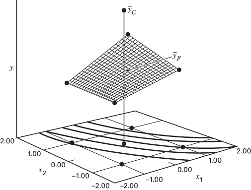  
■ FIGURE 6.37 A $2^{2}$ design with center points

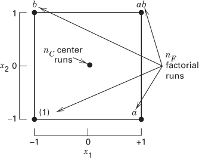  
■ FIGURE 6.38 A $2^{2}$ design with center points

Let $\overline{y}_{F}$ be the average of the four runs at the four factorial points, and $\overline{y}_{C}$ be the average of the $n_{C}$ runs at the center point. If the difference $\overline{y}_{F}-\overline{y}_{C}$ is small, then the center points lie on or near the plane passing through the factorial points, and there is no quadratic curvature. On the other hand, if $\overline{y}_{F}-\overline{y}_{C}$ is large, then quadratic curvature is present. A single-degree-of-freedom sum of squares for pure quadratic curvature is given by

$$
S S _ {\text { Pure   quadratic }} = \frac {n _ {F} n _ {C} (\overline {{y}} _ {F} - \overline {{y}} _ {C}) ^ {2}}{n _ {F} + n _ {C}}\tag{6.30}
$$

where, in general, $n_{F}$ is the number of factorial design points. This sum of squares may be incorporated into the ANOVA and may be compared to the error mean square to test for pure quadratic curvature. More specifically, when points are added to the center of the $2^{k}$ design, the test for curvature (using Equation 6.30) actually tests the hypotheses

$$
H _ {0}: \sum_ {j = 1} ^ {k} \beta_ {j j} = 0
$$

$$
H _ {1}: \sum_ {j = 1} ^ {k} \beta_ {j j} \neq 0
$$

Furthermore, if the factorial points in the design are unreplicated, one may use the $n_{C}$ center points to construct an estimate of error with $n_{C}-1$ degrees of freedom. A t-test can also be used to test for curvature. Refer to the supplemental text material for this chapter.

## EXAMPLE 6.7

We will illustrate the addition of center points to a $2^{k}$ design by reconsidering the pilot plant experiment in Example 6.2. Recall that this is an unreplicated $2^{4}$ design. Refer to the original experiment shown in Table 6.10. Suppose that four center points are added to this experiment, and at the points $x_{1}=x_{2}=x_{3}=x_{4}=0$ the four observed filtration rates were 73, 75, 66, and 69. The average of these four center points is $\overline{y}_{C}=70.75$ , and the average of the 16 factorial runs is $\overline{y}_{F}=70.06$ . Since $\overline{y}_{C}$ and $\overline{y}_{F}$ are very similar, we suspect that there is no strong curvature present.

Table 6.24 summarizes the analysis of variance for this experiment. In the upper portion of the table, we have fit the full model. The mean square for pure error is calculated from the center points as follows:

$$
M S _ {E} = \frac {S S _ {E}}{n _ {C} - 1} = \frac {\sum_ {\text { Center   points }} (y _ {i} - \bar {y} _ {c}) ^ {2}}{n _ {C} - 1}\tag{6.31}
$$

Thus, in Table 6.22,

$$
M S _ {E} = \frac {\sum_ {i = 1} ^ {4} (y _ {i} - 7 0 . 7 5) ^ {2}}{4 - 1} = \frac {4 8 . 7 5}{3} = 1 6. 2 5
$$

The difference $\overline{y}_{F}-\overline{y}_{C}=70.06-70.75=-0.69$ is used to compute the pure quadratic (curvature) sum of squares in the ANOVA table from Equation 6.30 as follows:

$$
\begin{array}{r l} S S _ {\text {Pure quadratic}} & = \frac {n _ {F} n _ {C} (\overline {{y}} _ {F} - \overline {{y}} _ {C}) ^ {2}}{n _ {F} + n _ {C}} \\ & = \frac {(1 6) (4) (- 0 . 6 9) ^ {2}}{1 6 + 4} = 1. 5 1 \end{array}
$$

The ANOVA indicates that there is no evidence of second-order curvature in the response over the region of exploration. That is, the null hypothesis $H_{0}:\beta_{11}+\beta_{22}+\beta_{33}+\beta_{44}=0$ cannot be rejected. The significant effects are A, C, D, AC, and AD. The ANOVA for the reduced model is shown in the lower portion of Table 6.24. The results of this analysis agree with those from Example 6.2, where the important effects were isolated using the normal probability plotting method.

■ TABLE 6.24
Analysis of Variance for Example 6.6

<table><tr><td colspan="6">ANOVA for the Full Model</td></tr><tr><td>Source of Variation</td><td>Sum of Squares</td><td>DF</td><td>Mean Square</td><td>F</td><td>Prob &gt; F</td></tr><tr><td>Model</td><td>5730.94</td><td>15</td><td>382.06</td><td>23.51</td><td>0.0121</td></tr><tr><td>A</td><td>1870.56</td><td>1</td><td>1870.56</td><td>115.11</td><td>0.0017</td></tr><tr><td>B</td><td>39.06</td><td>1</td><td>39.06</td><td>2.40</td><td>0.2188</td></tr><tr><td>C</td><td>390.06</td><td>1</td><td>390.06</td><td>24.00</td><td>0.0163</td></tr><tr><td>D</td><td>855.56</td><td>1</td><td>855.56</td><td>52.65</td><td>0.0054</td></tr><tr><td>AB</td><td>0.063</td><td>1</td><td>0.063</td><td>3.846E-003</td><td>0.9544</td></tr><tr><td>AC</td><td>1314.06</td><td>1</td><td>1314.06</td><td>80.87</td><td>0.0029</td></tr><tr><td>AD</td><td>1105.56</td><td>1</td><td>1105.56</td><td>68.03</td><td>0.0037</td></tr><tr><td>BC</td><td>22.56</td><td>1</td><td>22.56</td><td>1.39</td><td>0.3236</td></tr><tr><td>BD</td><td>0.56</td><td>1</td><td>0.56</td><td>0.035</td><td>0.8643</td></tr><tr><td>CD</td><td>5.06</td><td>1</td><td>5.06</td><td>0.31</td><td>0.6157</td></tr><tr><td>ABC</td><td>14.06</td><td>1</td><td>14.06</td><td>0.87</td><td>0.4209</td></tr><tr><td>ABD</td><td>68.06</td><td>1</td><td>68.06</td><td>4.19</td><td>0.1332</td></tr><tr><td>ACD</td><td>10.56</td><td>1</td><td>10.56</td><td>0.65</td><td>0.4791</td></tr><tr><td>BCD</td><td>27.56</td><td>1</td><td>27.56</td><td>1.70</td><td>0.2838</td></tr><tr><td>ABCD</td><td>7.56</td><td>1</td><td>7.56</td><td>0.47</td><td>0.5441</td></tr><tr><td>Pure quadratic</td><td></td><td></td><td></td><td></td><td></td></tr><tr><td>Curvature</td><td>1.51</td><td>1</td><td>1.51</td><td>0.093</td><td>0.7802</td></tr><tr><td>Pure error</td><td>48.75</td><td>3</td><td>16.25</td><td></td><td></td></tr><tr><td>Cor total</td><td>5781.20</td><td>19</td><td></td><td></td><td></td></tr><tr><td>Model</td><td>5535.81</td><td>5</td><td>1107.16</td><td>59.02</td><td>&lt;0.000</td></tr><tr><td>A</td><td>1870.56</td><td>1</td><td>1870.56</td><td>99.71</td><td>&lt;0.000</td></tr><tr><td>C</td><td>390.06</td><td>1</td><td>390.06</td><td>20.79</td><td>0.0005</td></tr><tr><td>D</td><td>855.56</td><td>1</td><td>855.56</td><td>45.61</td><td>&lt;0.000</td></tr><tr><td>AC</td><td>1314.06</td><td>1</td><td>1314.06</td><td>70.05</td><td>&lt;0.000</td></tr><tr><td>AD</td><td>1105.56</td><td>1</td><td>1105.56</td><td>58.93</td><td>&lt;0.000</td></tr><tr><td>Pure quadratic</td><td></td><td></td><td></td><td></td><td></td></tr><tr><td>curvature</td><td>1.51</td><td>1</td><td>1.51</td><td>0.081</td><td>0.7809</td></tr><tr><td>Residual</td><td>243.87</td><td>13</td><td>18.76</td><td></td><td></td></tr><tr><td>Lack of fit</td><td>195.12</td><td>10</td><td>19.51</td><td>1.20</td><td>0.4942</td></tr><tr><td>Pure error</td><td>48.75</td><td>3</td><td>16.25</td><td></td><td></td></tr><tr><td>Cor total</td><td>5781.20</td><td>19</td><td></td><td></td><td></td></tr></table>

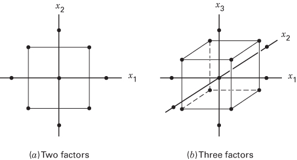  

■ FIGURE 6.39 Central composite designs

In Example 6.6, we concluded that there was no indication of quadratic effects; that is, a first-order model in A, C, D, along with the AC and AD interaction, is appropriate. However, there will be situations where the quadratic terms $(x_{i}^{2})$ will be required. To illustrate for the case of k = 2 design factors, suppose that the curvature test is significant so that we will now have to assume a second-order model such as

$$
y = \beta_ {0} + \beta_ {1} x _ {1} + \beta_ {2} x _ {2} + \beta_ {1 2} x _ {1} x _ {2} + \beta_ {1 1} x _ {1} ^ {2} + \beta_ {2 2} x _ {2} ^ {2} + \epsilon
$$

Unfortunately, we cannot estimate the unknown parameters (the $\beta$ 's) in this model because there are six parameters to estimate and the $2^{2}$ design and center points in Figure 6.38 have only five independent runs.

A simple and highly effective solution to this problem is to augment the $2^{k}$ design with four axial runs, as shown in Figure 6.39a for the case of k = 2. The resulting design, called a central composite design, can now be used to fit the second-order model. Figure 6.39b shows a central composite design for k = 3 factors. This design has $14 + n_{C}$ runs (usually $3 \leq n_{C} \leq 5$ ) and is a very efficient design for fitting the 10-parameter second-order model in k = 3 factors.

Central composite designs are used extensively in building second-order response surface models. These designs will be discussed in more detail in Chapter 11.

We conclude this section with a few additional useful suggestions and observations concerning the use of center points.

1. When a factorial experiment is conducted in an ongoing process, consider using the current operating conditions (or recipe) as the center point in the design. This often assures the operating personnel that at least some of the runs in the experiment are going to be performed under familiar conditions, and so the results obtained (at least for these runs) are unlikely to be any worse than are typically obtained.

2. When the center point in a factorial experiment corresponds to the usual operating recipe, the experimenter can use the observed responses at the center point to provide a rough check of whether anything “unusual” occurred during the experiment. That is, the center point responses should be very similar to the responses observed historically in routine process operation. Often operating personnel will maintain a control chart for monitoring process performance. Sometimes the center point responses can be plotted directly on the control chart as a check of the manner in which the process was operating during the experiment.

3. Consider running the replicates at the center point in nonrandom order. Specifically, run one or two center points at or near the beginning of the experiment, one or two near the middle, and one or two near the end. By spreading the center points out in time, the experimenter has a rough check on the stability of the process during the experiment. For example, if a trend has occurred in the response while the experiment was performed, plotting the center point responses versus time order may reveal this.

4. Sometimes experiments must be conducted in situations where there is little or no prior information about process variability. In these cases, running two or three center points as the first few runs in the experiment can be very helpful. These runs can provide a preliminary estimate of variability. If the magnitude of the variability seems reasonable, continue; on the contrary, if larger than anticipated (or reasonable!) variability is observed, stop. Often it will be very profitable to study the question of why the variability is so large before proceeding with the rest of the experiment.

■ FIGURE 6.40 A $2^{3}$ factorial design with one qualitative factor and center points  
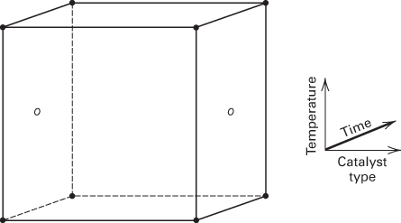

5. Usually, center points are employed when all design factors are quantitative. However, sometimes there will be one or more qualitative or categorical variables and several quantitative ones. Center points can still be employed in these cases. To illustrate, consider an experiment with two quantitative factors, time and temperature, each at two levels, and a single qualitative factor, catalyst type, also with two levels (organic and nonorganic). Figure 6.40 shows the $2^{3}$ design for these factors. Notice that the center points are placed in the opposed faces of the cube that involve the quantitative factors. In other words, the center points can be run at the high- and low-level treatment combinations of the qualitative factors as long as those subspaces involve only quantitative factors.

It is interesting to note that adding center runs to a $2^{k}$ design is never a D-optimal design strategy. To illustrate, recall the 12-run D-optimal design for three factors that we constructed at the end of Section 6.7. The D-efficiency of that design was 94.28%. The D-efficiency of the $2^{3}$ design with four center points is only 70.64%. Furthermore, in the 12-run D-optimal design the relative standard error of the model parameters was 0.306, while in the design with four center points it is 0.354. As one would expect, the D-optimal design results in model parameters that are more precisely estimated. The fraction of design space plot in Figure 6.41 compares the prediction variance performance of the two designs. The lower curve in this figure is the FDS curve for the D-optimal design. Clearly, the D-optimal design outperforms the $2^{3}$ design with four center points in terms of the ability to predict the response over almost all of the design space. However, the D-optimal design does not have the capability to detect potential curvature in the response function. The trade-off between the two designs is a decision that the experimenter needs to consider carefully.

■ FIGURE 6.41 Fraction of design space plot comparing a 12-run D-optimal design (lower curve) to a $2^{3}$ design with four center points (upper curve)  
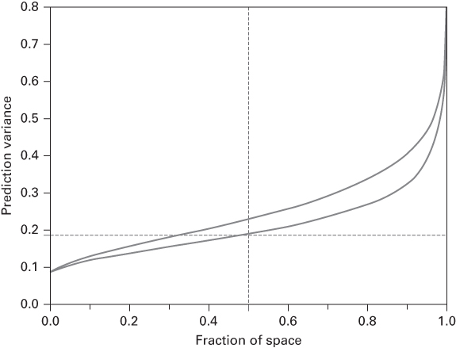

## 6.9 Why We Work with Coded Design Variables

The reader will have noticed that we have performed all of the analysis and model fitting for a $2^{k}$ factorial design in this chapter using coded design variables, $-1 \leq x_{i} \leq +1$ , and not the design factors in their original units (sometimes called actual, natural, or engineering units). When the engineering units are used, we can obtain different numerical results in comparison to the coded unit analysis, and often the results will not be as easy to interpret.

To illustrate some of the differences between the two analyses, consider the following experiment. A simple DC-circuit is constructed in which two different resistors, 1 and $2\Omega$ , can be connected. The circuit also contains an ammeter and a variable-output power supply. With a resistor installed in the circuit, the power supply is adjusted until a current flow of either 4 or 6 amps is obtained. Then the voltage output of the power supply is read from a voltmeter. Two replicates of a $2^{2}$ factorial design are performed, and Table 6.25 presents the results. We know that Ohm's law determines the observed voltage, apart from measurement error. However, the analysis of these data via empirical modeling lends some insight into the value of coded units and the engineering units in designed experiments.

Tables 6.26 and 6.27 present the regression models obtained using the design variables in the usual coded variables ( $x_{1}$ and $x_{2}$ ) and the engineering units, respectively. Minitab was used to perform the calculations. Consider first the coded variable analysis in Table 6.26. The design is orthogonal and the coded variables are also orthogonal. Notice that both main effects ( $x_{1} = current$ ) and ( $x_{2} = resistance$ ) are significant as is the interaction. In the coded variable analysis, the magnitudes of the model coefficients are directly comparable; that is, they all are dimensionless, and they measure the effect of changing each design factor over a one-unit interval. Furthermore, they are all estimated with the same precision (notice that the standard error of all three coefficients is 0.053). The interaction effect is smaller than either main effect, and the effect of current is just slightly more than one-half the resistance effect. This suggests that over the range of the factors studied, resistance is a more important variable. Coded variables are very effective for determining the relative size of factor effects.

TABLE 6.25  
The Circuit Experiment

<table><tr><td>I (Amps)</td><td>R (Ohms)</td><td> $x_{1}$ </td><td> $x_{2}$ </td><td>V (Volts)</td></tr><tr><td>4</td><td>1</td><td>-1</td><td>-1</td><td>3.802</td></tr><tr><td>4</td><td>1</td><td>-1</td><td>-1</td><td>4.013</td></tr><tr><td>6</td><td>1</td><td>1</td><td>-1</td><td>6.065</td></tr><tr><td>6</td><td>1</td><td>1</td><td>-1</td><td>5.992</td></tr><tr><td>4</td><td>2</td><td>-1</td><td>1</td><td>7.934</td></tr><tr><td>4</td><td>2</td><td>-1</td><td>1</td><td>8.159</td></tr><tr><td>6</td><td>2</td><td>1</td><td>1</td><td>11.865</td></tr><tr><td>6</td><td>2</td><td>1</td><td>1</td><td>12.138</td></tr></table>

## TABLE 6.26

Regression Analysis for the Circuit Experiment Using Coded Variables

```txt
The regression equation is
V = 7.50 + 1.52 × 1 + 2.53 × 2 + 0.458 × 1 × 2

Predictor    Coef    StDev    T    P
Constant    7.49600    0.05229    143.35    0.000
x 1    1.51900    0.05229    29.05    0.000
x 2    2.52800    0.05229    48.34    0.000
x 1 x 2    0.45850    0.05229    8.77    0.001

S = 0.1479    R-Sq = 99.9%    R-Sq(adj) = 99.8%

Analysis of Variance

Source    DF    SS    MS    F    P
Regression   3    71.267    23.756    1085.95    0.000
Residual Error   4    0.088    0.022

Total    7    71.354
```

## TABLE 6.27

Regression Analysis for the Circuit Experiment Using Engineering Units

```txt
The regression equation is
V = -0.806 + 0.144 I + 0.471 R + 0.917 IR
Predictor Coef StDev T P
Constant -0.8055 0.8432 -0.96 0.394
I 0.1435 0.1654 0.87 0.434
R 0.4710 0.5333 0.88 0.427
IR 0.9170 0.1046 8.77 0.001
S = 0.1479 R-Sq = 99.9% R-Sq(adj) = 99.8%
```

```txt
Analysis of Variance
```

<table><tr><td>Source</td><td>DF</td><td>SS</td><td>MS</td><td>F</td><td>P</td></tr><tr><td>Regression</td><td>3</td><td>71.267</td><td>23.756</td><td>1085.95</td><td>0.000</td></tr><tr><td>Residual Error</td><td>4</td><td>0.088</td><td>0.022</td><td></td><td></td></tr><tr><td>Total</td><td>7</td><td>71.354</td><td></td><td></td><td></td></tr></table>

Now consider the analysis based on the engineering units, as shown in Table 6.27. In this model, only the interaction is significant. The model coefficient for the interaction term is 0.9170, and the standard error is 0.1046. We can construct a t statistic for testing the hypothesis that the interaction coefficient is unity:

$$
t _ {0} = \frac {\hat {\beta} _ {I R} - 1}{s e (\hat {\beta} _ {I R})} = \frac {0 . 9 1 7 0 - 1}{0 . 1 0 4 6} = - 0. 7 9 3 5
$$

TABLE 6.28  
Regression Analysis for the Circuit Experiment (Interaction Term Only)

<table><tr><td colspan="6">The regression equation is V = 1.00 IR</td></tr><tr><td>Predictor</td><td>Coef</td><td>Std. Dev.</td><td>T</td><td>P</td><td></td></tr><tr><td>Noconstant IR</td><td>1.00073</td><td>0.00550</td><td>181.81</td><td>0.000</td><td></td></tr><tr><td colspan="6">S = 0.1255Analysis of Variance</td></tr><tr><td>Source</td><td>DF</td><td>SS</td><td>MS</td><td>F</td><td>P</td></tr><tr><td>Regression</td><td>3</td><td>71.267</td><td>23.756</td><td>1085.95</td><td>0.000</td></tr><tr><td>Residual Error</td><td>4</td><td>0.088</td><td>0.022</td><td></td><td></td></tr><tr><td>Total</td><td>7</td><td>71.354</td><td></td><td></td><td></td></tr></table>

The $P$ -value for this test statistic is $P = 0.76$ . Therefore, we cannot reject the null hypothesis that the coefficient is unity, which is consistent with Ohm's law. Note that the regression coefficients are not dimensionless and that they are estimated with differing precision. This is because the experimental design, with the factors in the engineering units, is not orthogonal.

Because the intercept and the main effects are not significant, we could consider fitting a model containing only the interaction term IR. The results are shown in Table 6.28. Notice that the estimate of the interaction term regression coefficient is now different from what it was in the previous engineering-units analysis because the design in engineering units is not orthogonal. The coefficient is also virtually unity.

Generally, the engineering units are not directly comparable, but they may have physical meaning as in the present example. This could lead to possible simplification based on the underlying mechanism. In almost all situations, the coded unit analysis is preferable. It is fairly unusual for a simplification based on some underlying mechanism (as in our example) to occur. The fact that coded variables let an experimenter see the relative importance of the design factors is useful in practice.