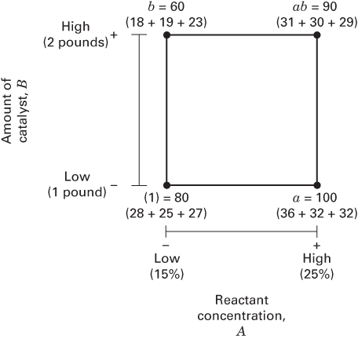

## 6.2 The $2^{2}$ Design

The first design in the $2^{k}$ series is one with only two factors, say A and B, each run at two levels. This design is called a $2^{2}$ factorial design. The levels of the factors may be arbitrarily called “low” and “high.” As an example, consider an investigation into the effect of the concentration of the reactant and the amount of the catalyst on the conversion (yield) in a chemical process. The objective of the experiment was to determine if adjustments to either of these two factors would increase the yield. Let the reactant concentration be factor A and let the two levels of interest be 15 and 25 percent. The catalyst is factor B, with the high level denoting the use of 2 pounds of the catalyst and the low level denoting the use of only 1 pound. The experiment is replicated three times, so there are 12 runs. The order in which the runs are made is random, so this is a completely randomized experiment. The data obtained are as follows:

<table><tr><td colspan="2">Factor</td><td rowspan="2">Treatment Combination</td><td colspan="3">Replicate</td><td rowspan="2">Total</td></tr><tr><td>A</td><td>B</td><td>I</td><td>II</td><td>III</td></tr><tr><td>-</td><td>-</td><td>A low, B low</td><td>28</td><td>25</td><td>27</td><td>80</td></tr><tr><td>+</td><td>-</td><td>A high, B low</td><td>36</td><td>32</td><td>32</td><td>100</td></tr><tr><td>-</td><td>+</td><td>A low, B high</td><td>18</td><td>19</td><td>23</td><td>60</td></tr><tr><td>+</td><td>+</td><td>A high, B high</td><td>31</td><td>30</td><td>29</td><td>90</td></tr></table>

The four treatment combinations in this design are shown graphically in Figure 6.1. By convention, we denote the effect of a factor by a capital Latin letter. Thus, “A” refers to the effect of factor A, “B” refers to the effect of

■ FIGURE 6.1 Treatment combinations in the $2^{2}$ design

factor B, and “AB” refers to the AB interaction. In the $2^{2}$ design, the low and high levels of A and B are denoted by “−” and “+,” respectively, on the A and B axes. Thus, − on the A axis represents the low level of concentration (15%), whereas + represents the high level (25%), and − on the B axis represents the low level of catalyst, and + denotes the high level.

The four treatment combinations in the design are also represented by lowercase letters, as shown in Figure 6.1. We see from the figure that the high level of any factor in the treatment combination is denoted by the corresponding lowercase letter and that the low level of a factor in the treatment combination is denoted by the absence of the corresponding letter. Thus, $a$ represents the treatment combination of $A$ at the high level and $B$ at the low level, $b$ represents $A$ at the low level and $B$ at the high level, and $ab$ represents both factors at the high level. By convention, (1) is used to denote both factors at the low level. This notation is used throughout the $2^{k}$ series.

In a two-level factorial design, we may define the average effect of a factor as the change in response produced by a change in the level of that factor averaged over the levels of the other factor. Also, the symbols (1), $a$ , $b$ , and $ab$ now represent the total of the response observation at all $n$ replicates taken at the treatment combination, as illustrated in Figure 6.1. Now the effect of $A$ at the low level of $B$ is $[a - (1)]/n$ , and the effect of $A$ at the high level of $B$ is $[ab - b]/n$ . Averaging these two quantities yields the main effect of $A$ :

$$
\begin{array}{r l} A & = \frac {1}{2 n} \{[ a b - b ] + [ a - (1) ] \} \\ & = \frac {1}{2 n} [ a b + a - b - (1) ] \end{array}\tag{6.1}
$$

The average main effect of B is found from the effect of B at the low level of A (i.e., $[b-(1)]/n$ ) and at the high level of A (i.e., $[ab-a]/n$ ) as

$$
\begin{array}{r l} & B = \frac {1}{2 n} \{[ a b - a ] + [ b - (1) ] \} \\ & \quad = \frac {1}{2 n} [ a b + b - a - (1) ] \end{array}\tag{6.2}
$$

We define the interaction effect $AB$ as the average difference between the effect of $A$ at the high level of $B$ and the effect of $A$ at the low level of $B$ . Thus,

$$
\begin{array}{r} A B = \frac {1}{2 n} \{[ a b - b ] - [ a - (1) ] \} \\ = \frac {1}{2 n} [ a b + (1) - a - b ] \end{array}\tag{6.3}
$$

Alternatively, we may define $AB$ as the average difference between the effect of $B$ at the high level of $A$ and the effect of $B$ at the low level of $A$ . This will also lead to Equation 6.3.

The formulas for the effects of A, B, and AB may be derived by another method. The effect of A can be found as the difference in the average response of the two treatment combinations on the right-hand side of the square in Figure 6.1 (call this average $\overline{y}_{A^{+}}$ because it is the average response at the treatment combinations where A is at the high level) and the two treatment combinations on the left-hand side (or $\overline{y}_{A^{-}}$ ). That is,

$$
\begin{array}{r l} A & = \overline {{y}} _ {A ^ {+}} - \overline {{y}} _ {A ^ {-}} \\ & = \frac {a b + a}{2 n} - \frac {b + (1)}{2 n} \\ & = \frac {1}{2 n} [ a b + a - b - (1) ] \end{array}
$$

This is exactly the same result as in Equation 6.1. The effect of B, Equation 6.2, is found as the difference between the average of the two treatment combinations on the top of the square $(\overline{y}_{B^{+}})$ and the average of the two treatment combinations on the bottom $(\overline{y}_{B^{-}})$ , or

$$
\begin{array}{r l} & B = \overline {{y}} _ {B ^ {+}} - \overline {{y}} _ {B ^ {-}} \\ & \quad = \frac {a b + b}{2 n} - \frac {a + (1)}{2 n} \\ & \quad = \frac {1}{2 n} [ a b + b - a - (1) ] \end{array}
$$

Finally, the interaction effect AB is the average of the right-to-left diagonal treatment combinations in the square $[ab$ and (1)] minus the average of the left-to-right diagonal treatment combinations $(a$ and b), or

$$
\begin{array}{r l} A B & = \frac {a b + (1)}{2 n} - \frac {a + b}{2 n} \\ & = \frac {1}{2 n} [ a b + (1) - a - b ] \end{array}
$$

which is identical to Equation 6.3.

Using the experiment in Figure 6.1, we may estimate the average effects as

$$
A = \frac {1}{2 (3)} (9 0 + 1 0 0 - 6 0 - 8 0) = 8. 3 3
$$

$$
B = \frac {1}{2 (3)} (9 0 + 6 0 - 1 0 0 - 8 0) = - 5. 0 0
$$

$$
A B = \frac {1}{2 (3)} (9 0 + 8 0 - 1 0 0 - 6 0) = 1. 6 7
$$

The effect of A (reactant concentration) is positive; this suggests that increasing A from the low level (15%) to the high level (25%) will increase the yield. The effect of B (catalyst) is negative; this suggests that increasing the amount of catalyst added to the process will decrease the yield. The interaction effect appears to be small relative to the two main effects.

In experiments involving $2^{k}$ designs, it is always important to examine the magnitude and direction of the factor effects to determine which variables are likely to be important. The analysis of variance can generally be used to confirm this interpretation (t-tests could be used too). Effect magnitude and direction should always be considered along with the ANOVA, because the ANOVA alone does not convey this information. There are several excellent statistics software packages that are useful for setting up and analyzing $2^{k}$ designs. There are also special time-saving methods for performing the calculations manually.

Consider determining the sums of squares for $A, B$ , and $AB$ . Note from Equation 6.1 that a contrast is used in estimating $A$ , namely

$$
\text { Contrast } _ {A} = a b + a - b - (1)\tag{6.4}
$$

We usually call this contrast the total effect of $A$ . From Equations 6.2 and 6.3, we see that contrasts are also used to estimate $B$ and $AB$ . Furthermore, these three contrasts are orthogonal. The sum of squares for any contrast can be computed from Equation 3.29, which states that the sum of squares for any contrast is equal to the contrast squared divided by the number of observations in each total in the contrast times the sum of the squares of the contrast coefficients. Consequently, we have

$$
S S _ {A} = \frac {[ a b + a - b - (1) ] ^ {2}}{4 n}\tag{6.5}
$$

$$
S S _ {B} = \frac {[ a b + b - a - (1) ] ^ {2}}{4 n}\tag{6.6}
$$

and

$$
S S _ {A B} = \frac {[ a b + (1) - a - b ] ^ {2}}{4 n}\tag{6.7}
$$

as the sums of squares for $A$ , $B$ , and $AB$ . Notice how simple these equations are. We can compute sums of squares by only squaring one number.

Using the experiment in Figure 6.1, we may find the sums of squares from Equations 6.5 to 6.7 as

$$
S S _ {A} = \frac {(5 0) ^ {2}}{4 (3)} = 2 0 8. 3 3
$$

$$
S S _ {B} = \frac {(- 3 0) ^ {2}}{4 (3)} = 7 5. 0 0\tag{6.8}
$$

and

$$
S S _ {A B} = \frac {(1 0) ^ {2}}{4 (3)} = 8. 3 3
$$

The total sum of squares is found in the usual way, that is,

$$
S S _ {T} = \sum_ {i = 1} ^ {2} \sum_ {j = 1} ^ {2} \sum_ {k = 1} ^ {n} y _ {i j k} ^ {2} - \frac {y _ {\cdots} ^ {2}}{4 n}\tag{6.9}
$$

In general, $SS_{T}$ has $4n - 1$ degrees of freedom. The error sum of squares, with $4(n - 1)$ degrees of freedom, is usually computed by subtraction as

$$
S S _ {E} = S S _ {T} - S S _ {A} - S S _ {B} - S S _ {A B}\tag{6.10}
$$

For the experiment in Figure 6.1, we obtain

$$
\begin{array}{r l} S S _ {T} & = \sum_ {i = 1} ^ {2} \sum_ {j = 1} ^ {2} \sum_ {k = 1} ^ {3} y _ {i j k} ^ {2} - \frac {y _ {\dots} ^ {2}}{4 (3)} \\ & = 9 3 9 8. 0 0 - 9 0 7 5. 0 0 = 3 2 3. 0 0 \end{array}
$$

and

$$
\begin{array}{r l} S S _ {E} & = S S _ {T} - S S _ {A} - S S _ {B} - S S _ {A B} \\ & = 3 2 3. 0 0 - 2 0 8. 3 3 - 7 5. 0 0 - 8. 3 3 \\ & = 3 1. 3 4 \end{array}
$$

using $SS_{A}$ , $SS_{B}$ , and $SS_{AB}$ from Equations 6.8. The complete ANOVA is summarized in Table 6.1. On the basis of the P-values, we conclude that the main effects are statistically significant and that there is no interaction between these factors. This confirms our initial interpretation of the data based on the magnitudes of the factor effects.

It is often convenient to write down the treatment combinations in the order (1), $a$ , $b$ , $ab$ . This is referred to as standard order (or Yates's order, for Frank Yates who was one of Fisher coworkers and who made many important

## TABLE 6.1

Analysis of Variance for the Experiment in Figure 6.1

<table><tr><td>Source of Variation</td><td>Sum of Squares</td><td>Degrees of Freedom</td><td>Mean Square</td><td> $F_q$ </td><td>P-Value</td></tr><tr><td>A</td><td>208.33</td><td>1</td><td>208.33</td><td>53.15</td><td>0.0001</td></tr><tr><td>B</td><td>75.00</td><td>1</td><td>75.00</td><td>19.13</td><td>0.0024</td></tr><tr><td>AB</td><td>8.33</td><td>1</td><td>8.33</td><td>2.13</td><td>0.1826</td></tr><tr><td>Error</td><td>31.34</td><td>8</td><td>3.92</td><td></td><td></td></tr><tr><td>Total</td><td>323.00</td><td>11</td><td></td><td></td><td></td></tr></table>

contributions to designing and analyzing experiments). Using this standard order, we see that the contrast coefficients used in estimating the effects are

<table><tr><td>Effects</td><td>(1)</td><td>a</td><td>b</td><td>ab</td></tr><tr><td>A</td><td>-1</td><td>+1</td><td>-1</td><td>+1</td></tr><tr><td>B</td><td>-1</td><td>-1</td><td>+1</td><td>+1</td></tr><tr><td>AB</td><td>+1</td><td>-1</td><td>-1</td><td>+1</td></tr></table>

Note that the contrast coefficients for estimating the interaction effect are just the product of the corresponding coefficients for the two main effects. The contrast coefficient is always either +1 or -1, and a table of plus and minus signs such as in Table 6.2 can be used to determine the proper sign for each treatment combination. The column headings in Table 6.2 are the main effects (A and B), the AB interaction, and I, which represents the total or average of the entire experiment. Notice that the column corresponding to I has only plus signs. The row designators are the treatment combinations. To find the contrast for estimating any effect, simply multiply the signs in the appropriate column of the table by the corresponding treatment combination and add. For example, to estimate A, the contrast is $-(1) + a - b + ab$ , which agrees with Equation 6.1. Note that the contrasts for the effects A, B, and AB are orthogonal. Thus, the $2^{2}$ (and all $2^{k}$ designs) is an orthogonal design. The ±1 coding for the low and high levels of the factors is often called the orthogonal coding or the effects coding.

The Regression Model. In a $2^{k}$ factorial design, it is easy to express the results of the experiment in terms of a regression model. Because the $2^{k}$ is just a factorial design, we could also use either an effects or a means model, but the regression model approach is much more natural and intuitive. For the chemical process experiment in Figure 6.1, the regression model is

$$
y = \beta_ {0} + \beta_ {1} x _ {1} + \beta_ {2} x _ {2} + \epsilon
$$

where $x_{1}$ is a coded variable that represents the reactant concentration, $x_{2}$ is a coded variable that represents the amount of catalyst, and the $\beta$ 's are regression coefficients. The relationship between the natural variables, the reactant concentration and the amount of catalyst, and the coded variables is

$$
x _ {1} = \frac {\operatorname{Conc} - \left(\operatorname{Conc} _ {\text { low }} + \operatorname{Conc} _ {\text { high }}\right) / 2}{\left(\operatorname{Conc} _ {\text { high }} - \operatorname{Conc} _ {\text { low }}\right) / 2}
$$

and

$$
x _ {2} = \frac {\text { Catalyst } - (\text { Catalyst } _ {\text { low }} + \text { Catalyst } _ {\text { high }}) / 2}{(\text { Catalyst } _ {\text { high }} - \text { Catalyst } _ {\text { low }}) / 2}
$$

TABLE 6.2  
Algebraic Signs for Calculating Effects in the $2^{2}$ Design

<table><tr><td rowspan="2">Treatment Combination</td><td colspan="4">Factorial Effect</td></tr><tr><td>I</td><td>A</td><td>B</td><td>AB</td></tr><tr><td>(1)</td><td>+</td><td>-</td><td>-</td><td>+</td></tr><tr><td>a</td><td>+</td><td>+</td><td>-</td><td>-</td></tr><tr><td>b</td><td>+</td><td>-</td><td>+</td><td>-</td></tr><tr><td>ab</td><td>+</td><td>+</td><td>+</td><td>+</td></tr></table>

When the natural variables have only two levels, this coding will produce the familiar $\pm1$ notation for the levels of the coded variables. To illustrate this for our example, note that

$$
\begin{array}{r l} x _ {1} & = \frac {\text {Conc} - (1 5 + 2 5) / 2}{(2 5 - 1 5) / 2} \\ & = \frac {\text {Conc} - 2 0}{5} \end{array}
$$

Thus, if the concentration is at the high level (Conc = 25%), then $x_{1} = +1$ ; if the concentration is at the low level (Conc = 15%), then $x_{1} = -1$ . Furthermore,

$$
\begin{array}{r l} x _ {2} & = \frac {\text { Catalyst } - (1 + 2) / 2}{(2 - 1) / 2} \\ & = \frac {\text { Catalyst } - 1 . 5}{0 . 5} \end{array}
$$

Thus, if the catalyst is at the high level (Catalyst = 2 pounds), then $x_{2} = +1$ ; if the catalyst is at the low level (Catalyst = 1 pound), then $x_{2} = -1$ .

The fitted regression model is

$$
\hat {y} = 2 7. 5 + \left(\frac {8 . 3 3}{2}\right) x _ {1} + \left(\frac {- 5 . 0 0}{2}\right) x _ {2}
$$

where the intercept is the grand average of all 12 observations, and the regression coefficients $\hat{\beta}_{1}$ and $\hat{\beta}_{2}$ are one-half the corresponding factor effect estimates. The regression coefficient is one-half the effect estimate because a regression coefficient measures the effect of a one-unit change in x on the mean of y, and the effect estimate is based on a two-unit change (from -1 to +1). This simple method of estimating the regression coefficients results in least squares parameter estimates. We will return to this topic again in Section 6.7. Also see the supplemental material for this chapter.

How Much Replication is Necessary? A standard question that arises in almost every experiment is how much replication is necessary? We have discussed this in previous chapters, but there are some aspects of this topic that are particularly useful in $2^{k}$ designs, which are used extensively for factor screening. That is, studying a group of k factors to determine which ones are active. Recall from our previous discussions that the choice of an appropriate sample size in a designed experiment depends on how large the effect of interest is, the power of the statistical test, and the choice of type I error. While the size of an important effect is obviously problem-dependent, in many practical situations experimenters are interested in detecting effects that are at least as large as twice the error standard deviation ( $2\sigma$ ). Smaller effects are usually of less interest because changing the factor associated with such a small effect often results in a change in response that is very small relative to the background noise in the system. Adequate power is also problem-dependent, but in many practical situations achieving power of at least 0.80 or 80% should be the goal.

We will illustrate how an appropriate choice of sample size can be determined using the $2^{2}$ chemical process experiment. Suppose that we are interested in detecting effects of size $2\sigma$ . If the basic $2^{2}$ design is replicated twice for a total of 8 runs, there will be 4 degrees of freedom for estimating a model-independent estimate of error (pure error). If the experimenter uses a significance level or Type I error rate of $\alpha = 0.05$ , this design results in a power of 0.572 or 57.2%. This is too low, and the experimenter should consider more replication. There is another alternative that could be useful in screening experiments, use a higher type I error rate. In screening experiments Type I errors (thinking a factor is active when it really isn’t) usually does not have the same impact as a Type II error (failing to identify an active factor). If a factor is mistakenly thought to be active, that error will be discovered in further work and so the consequences of this type I error is usually small. However, failing to identify an active factor is usually very problematic because that factor is set aside and typically never considered again. So in screening experiments experimenters are often willing to consider higher Type I error rates, say 0.10 or 0.20.

Suppose that we use $\alpha = 0.10$ in our chemical process experiment. This would result in power of 75%. Using $\alpha = 0.20$ increases the power to 89%, a very reasonable value. The other alternative is to increase the sample size by using additional replicates. If we use three replicates there will be 8 degrees of freedom for pure error and if we want to detect effects of size $2\sigma$ with $\alpha = 0.05$ , this design will result in power of 85.7%. This is a very good value for power, so the experimenters decided to use three replicates of the $2^{2}$ design.

Software packages can be used to produce the power calculations given above. The boxed display below shows the power calculations from JMP. The model has both main effects and the two-factor interaction and the effects of size $2\sigma$ is chosen by setting the square root of mean square error (Anticipated RMSE) to 1 and setting the size of each anticipated model coefficient to 1.

<table><tr><td colspan="3">Evaluate Design</td></tr><tr><td colspan="3">Model</td></tr><tr><td colspan="3">Intercept</td></tr><tr><td colspan="3">X1</td></tr><tr><td colspan="3">X2</td></tr><tr><td colspan="3">X1*X2</td></tr><tr><td colspan="3">Power Analysis</td></tr><tr><td>Significance Level</td><td></td><td>0.05</td></tr><tr><td>Anticipated RMSE</td><td></td><td>1</td></tr><tr><td></td><td>Anticipated</td><td></td></tr><tr><td>Term</td><td>Coefficient</td><td>Power</td></tr><tr><td>Intercept</td><td>1</td><td>0.857</td></tr><tr><td>X1</td><td>1</td><td>0.857</td></tr><tr><td>X2</td><td>1</td><td>0.857</td></tr><tr><td>X1*X2</td><td>1</td><td>0.857</td></tr></table>

Residuals and Model Adequacy. The regression model can be used to obtain the predicted or fitted value of y at the four points in the design. The residuals are the differences between the observed and fitted values of y. For example, when the reactant concentration is at the low level $(x_{1} = -1)$ and the catalyst is at the low level $(x_{2} = -1)$ , the predicted yield is

$$
\hat {y} = 2 7. 5 + \left(\frac {8 . 3 3}{2}\right) (- 1) + \left(\frac {- 5 . 0 0}{2}\right) (- 1) = 2 5. 8 3 5
$$

There are three observations at this treatment combination, and the residuals are

$$
\begin{array}{l} e _ {1} = 2 8 - 2 5. 8 3 5 = 2. 1 6 5 \\ e _ {2} = 2 5 - 2 5. 8 3 5 = - 0. 8 3 5 \\ e _ {3} = 2 7 - 2 5. 8 3 5 = 1. 1 6 5 \end{array}
$$

The remaining predicted values and residuals are calculated similarly. For the high level of the reactant concentration and the low level of the catalyst,

$$
\hat {y} = 2 7. 5 + \left(\frac {8 . 3 3}{2}\right) (+ 1) + \left(\frac {- 5 . 0 0}{2}\right) (- 1) = 3 4. 1 6 5
$$

and

$$
e _ {4} = 3 6 - 3 4. 1 6 5 = 1. 8 3 5
$$

$$
e _ {5} = 3 2 - 3 4. 1 6 5 = - 2. 1 6 5
$$

$$
e _ {6} = 3 2 - 3 4. 1 6 5 = - 2. 1 6 5
$$

For the low level of the reactant concentration and the high level of the catalyst,

$$
\hat {y} = 2 7. 5 + \left(\frac {8 . 3 3}{2}\right) (- 1) + \left(\frac {- 5 . 0 0}{2}\right) (+ 1) = 2 0. 8 3 5
$$

and

$$
\begin{array}{l} e _ {7} = 1 8 - 2 0. 8 3 5 = - 2. 8 3 5 \\ e _ {8} = 1 9 - 2 0. 8 3 5 = - 1. 8 3 5 \\ e _ {9} = 2 3 - 2 0. 8 3 5 = 2. 1 6 5 \end{array}
$$

Finally, for the high level of both factors,

$$
\hat {y} = 2 7. 5 + \left(\frac {8 . 3 3}{2}\right) (+ 1) + \left(\frac {- 5 . 0 0}{2}\right) (+ 1) = 2 9. 1 6 5
$$

and

$$
\begin{array}{l} e _ {1 0} = 3 1 - 2 9. 1 6 5 = 1. 8 3 5 \\ e _ {1 1} = 3 0 - 2 9. 1 6 5 = 0. 8 3 5 \\ e _ {1 2} = 2 9 - 2 9. 1 6 5 = - 0. 1 6 5 \end{array}
$$

Figure 6.2 presents a normal probability plot of these residuals and a plot of the residuals versus the predicted yield. These plots appear satisfactory, so we have no reason to suspect that there are any problems with the validity of our conclusions.

The Response Surface. The regression model

$$
\hat {y} = 2 7. 5 + \left(\frac {8 . 3 3}{2}\right) x _ {1} + \left(\frac {- 5 . 0 0}{2}\right) x _ {2}
$$

can be used to generate response surface plots. If it is desirable to construct these plots in terms of the natural factor levels, then we simply substitute the relationships between the natural and coded variables that we gave earlier into the regression model, yielding

$$
\begin{array}{l} \hat {y} = 2 7. 5 + \left(\frac {8 . 3 3}{2}\right) \left(\frac {\text {Conc} - 2 0}{5}\right) + \left(\frac {- 5 . 0 0}{2}\right) \left(\frac {\text {Catalyst} - 1 . 5}{0 . 5}\right) \\ = 1 8. 3 3 + 0. 8 3 3 3 \text {Conc} - 5. 0 0 \text {Catalyst} \end{array}
$$

  

■ FIGURE 6.2 Residual plots for the chemical process experiment

■ FIGURE 6.3 Response surface plot and contour plot of yield from the chemical process experiment

Figure 6.3a presents the three-dimensional response surface plot of yield from this model, and Figure 6.3b is the contour plot. Because the model is first-order (that is, it contains only the main effects), the fitted response surface is a plane. From examining the contour plot, we see that yield increases as reactant concentration increases and catalyst amount decreases. Often, we use a fitted surface such as this to find a direction of potential improvement for a process. A formal way to do so, called the method of steepest ascent, will be presented in Chapter 11 when we discuss methods for systematically exploring response surfaces.
