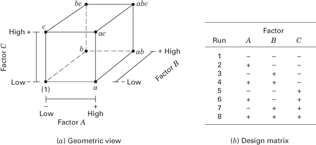
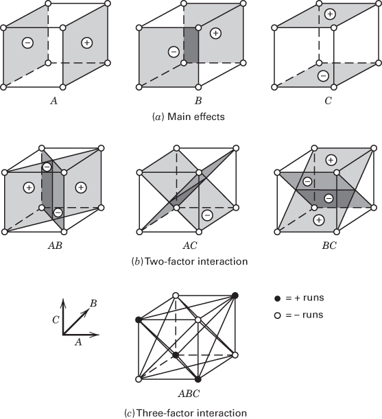
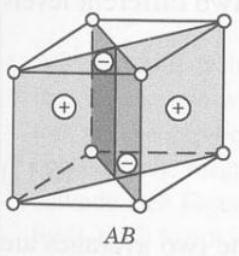
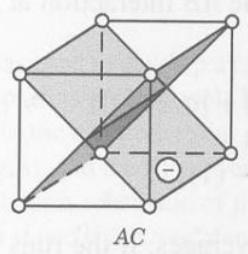
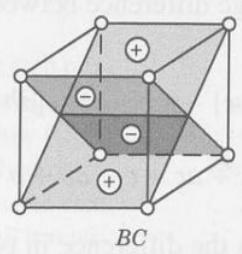
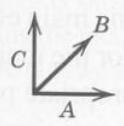
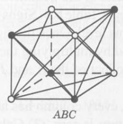
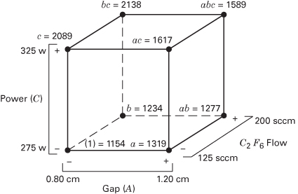
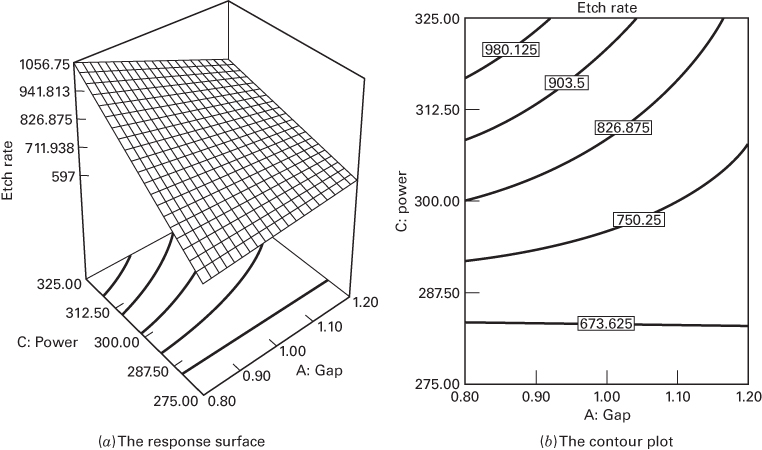
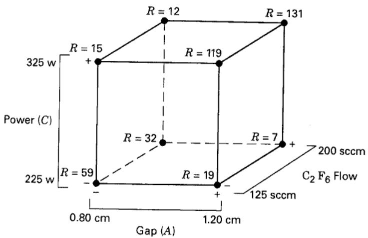

## 6.3 The $2^{3}$ Design

Suppose that three factors, A, B, and C, each at two levels, are of interest. The design is called a $2^{3}$ factorial design, and the eight treatment combinations can now be displayed geometrically as a cube, as shown in Figure 6.4a. Using the “+ and −” orthogonal coding to represent the low and high levels of the factors, we may list the eight runs in the $2^{3}$ design as in Figure 6.4b. This is sometimes called the design matrix. Extending the label notation discussed in

  
(a) Geometric view

■ FIGURE 6.4 The $2^{3}$ factorial design

<table><tr><td rowspan="2">Run</td><td colspan="3">Factor</td></tr><tr><td>A</td><td>B</td><td>C</td></tr><tr><td>1</td><td>-</td><td>-</td><td>-</td></tr><tr><td>2</td><td>+</td><td>-</td><td>-</td></tr><tr><td>3</td><td>-</td><td>+</td><td>-</td></tr><tr><td>4</td><td>+</td><td>+</td><td>-</td></tr><tr><td>5</td><td>-</td><td>-</td><td>+</td></tr><tr><td>6</td><td>+</td><td>-</td><td>+</td></tr><tr><td>7</td><td>-</td><td>+</td><td>+</td></tr><tr><td>8</td><td>+</td><td>+</td><td>+</td></tr></table>

(b) Design matrix

Section 6.2, we write the treatment combinations in standard order as (1), a, b, ab, c, ac, bc, and abc. Remember that these symbols also represent the total of all n observations taken at that particular treatment combination.

Three different notations are widely used for the runs in the $2^{k}$ design. The first is the + and − notation, often called the geometric coding (or the orthogonal coding or the effects coding). The second is the use of lowercase letter labels to identify the treatment combinations. The final notation uses 1 and 0 to denote high and low factor levels, respectively, instead of + and −. These different notations are illustrated below for the $2^{3}$ design:

<table><tr><td>Run</td><td>A</td><td>B</td><td>C</td><td>Labels</td><td>A</td><td>B</td><td>C</td></tr><tr><td>1</td><td>-</td><td>-</td><td>-</td><td>(1)</td><td>0</td><td>0</td><td>0</td></tr><tr><td>2</td><td>+</td><td>-</td><td>-</td><td>a</td><td>1</td><td>0</td><td>0</td></tr><tr><td>3</td><td>-</td><td>+</td><td>-</td><td>b</td><td>0</td><td>1</td><td>0</td></tr><tr><td>4</td><td>+</td><td>+</td><td>-</td><td>ab</td><td>1</td><td>1</td><td>0</td></tr><tr><td>5</td><td>-</td><td>-</td><td>+</td><td>c</td><td>0</td><td>0</td><td>1</td></tr><tr><td>6</td><td>+</td><td>-</td><td>+</td><td>ac</td><td>1</td><td>0</td><td>1</td></tr><tr><td>7</td><td>-</td><td>+</td><td>+</td><td>bc</td><td>0</td><td>1</td><td>1</td></tr><tr><td>8</td><td>+</td><td>+</td><td>+</td><td>abc</td><td>1</td><td>1</td><td>1</td></tr></table>

There are seven degrees of freedom between the eight treatment combinations in the $2^{3}$ design. Three degrees of freedom are associated with the main effects of A, B, and C. Four degrees of freedom are associated with interactions: one each with AB, AC, and BC and one with ABC.

Consider estimating the main effects. First, consider estimating the main effect A. The effect of A when B and C are at the low level is $[a-(1)]/n$ . Similarly, the effect of A when B is at the high level and C is at the low level is $[ab-b]/n$ . The effect of A when C is at the high level and B is at the low level is $[ac-c]/n$ . Finally, the effect of A when both B and C are at the high level is $[abc-bc]/n$ . Thus, the average effect of A is just the average of these four, or

$$
A = \frac {1}{4 n} [ a - (1) + a b - b + a c - c + a b c - b c ]\tag{6.11}
$$

This equation can also be developed as a contrast between the four treatment combinations in the right face of the cube in Figure 6.5a (where A is at the high level) and the four in the left face (where A is at the low level). That is, the A effect is just the average of the four runs where A is at the high level $(\overline{y}_{A^{+}})$ minus the average of the four runs where A is at the low level $(\overline{y}_{A^{-}})$ , or

$$
\begin{array}{r l} A & = \overline {{y}} _ {A ^ {+}} - \overline {{y}} _ {A ^ {-}} \\ & = \frac {a + a b + a c + a b c}{4 n} - \frac {(1) + b + c + b c}{4 n} \end{array}
$$

This equation can be rearranged as

$$
A = \frac {1}{4 n} [ a + a b + a c + a b c - (1) - b - c - b c ]
$$

which is identical to Equation 6.11.

In a similar manner, the effect of B is the difference in averages between the four treatment combinations in the front face of the cube and the four in the back. This yields

$$
\begin{array}{r l} & B = \overline {{{y}}} _ {B ^ {+}} - \overline {{{y}}} _ {B ^ {-}} \\ & \quad = \frac {1}{4 n} [ b + a b + b c + a b c - (1) - a - c - a c ] \end{array}\tag{6.12}
$$

A

C  

■ FIGURE 6.5 Geometric presentation of contrasts corresponding to the main effects and interactions in the $2^{3}$ design

(a) Main effects  

(b) Two-factor interaction

  
(c) Three-factor interaction

$$
O = - \text { runs }
$$

The effect of C is the difference in averages between the four treatment combinations in the top face of the cube and the four in the bottom, that is,

$$
\begin{array}{r l} & C = \overline {{{y}}} _ {C ^ {+}} = \overline {{{y}}} _ {C ^ {-}} \\ & \quad = \frac {1}{4 n} [ c + a c + b c + a b c - (1) - a - b - a b ] \end{array}\tag{6.13}
$$

The two-factor interaction effects may be computed easily. A measure of the AB interaction is the difference between the average A effects at the two levels of B. By convention, one-half of this difference is called the AB interaction. Symbolically,

<table><tr><td>B</td><td>Average A Effect</td></tr><tr><td>High (+)</td><td> $\frac{[(abc - bc) + (ab - b)]}{2n}$ </td></tr><tr><td>Low (-)</td><td> $\frac{\{(ac - c) + [a - (1)]\}}{2n}$ </td></tr><tr><td>Difference</td><td> $\frac{[abc - bc + ab - b - ac + c - a + (1)]}{2n}$ </td></tr></table>

Because the AB interaction is one-half of this difference,

$$
A B = \frac {[ a b c - b c + a b - b - a c + c - a + (1) ]}{4 n}\tag{6.14}
$$

We could write Equation 6.14 as follows:

$$
A B = \frac {a b c + a b + c + (1)}{4 n} - \frac {b c + b + a c + a}{4 n}
$$

In this form, the AB interaction is easily seen to be the difference in averages between runs on two diagonal planes in the cube in Figure 6.5b. Using similar logic and referring to Figure 6.5b, we find that the AC and BC interactions are

$$
A C = \frac {1}{4 n} [ (1) - a + b - a b - c + a c - b c + a b c ]\tag{6.15}
$$

and

$$
B C = \frac {1}{4 n} [ (1) + a - b - a b - c - a c + b c + a b c ]\tag{6.16}
$$

The ABC interaction is defined as the average difference between the AB interaction at the two different levels of C. Thus,

$$
\begin{array}{r l} A B C & = \frac {1}{4 n} \{[ a b c - b c ] - [ a c - c ] - [ a b - b ] + [ a - (1) ] \} \\ & = \frac {1}{4 n} [ a b c - b c - a c + c - a b + b + a - (1) ] \end{array}\tag{6.17}
$$

As before, we can think of the ABC interaction as the difference in two averages. If the runs in the two averages are isolated, they define the vertices of the two tetrahedra that comprise the cube in Figure 6.5c.

In Equations 6.11 through 6.17, the quantities in brackets are contrasts in the treatment combinations. A table of plus and minus signs can be developed from the contrasts, which is shown in Table 6.3. Signs for the main effects are determined by associating a plus with the high level and a minus with the low level. Once the signs for the main effects have been established, the signs for the remaining columns can be obtained by multiplying the appropriate preceding columns row by row. For example, the signs in the AB column are the product of the A and B column signs in each row. The contrast for any effect can be obtained easily from this table.

Table 6.3 has several interesting properties: (1) Except for column I, every column has an equal number of plus and minus signs. (2) The sum of the products of the signs in any two columns is zero. (3) Column I multiplied times any column leaves that column unchanged. That is, I is an identity element. (4) The product of any two columns yields a column in the table. For example, $A \times B = AB$ , and

$$
A B \times B = A B ^ {2} = A
$$

We see that the exponents in the products are formed by using modulus 2 arithmetic. (That is, the exponent can only be 0 or 1; if it is greater than 1, it is reduced by multiples of 2 until it is either 0 or 1.) All of these properties are implied by the orthogonality of the $2^{3}$ design and the contrasts used to estimate the effects.

## TABLE 6.3

Algebraic Signs for Calculating Effects in the $2^{3}$ Design

<table><tr><td rowspan="2">Treatment Combination</td><td colspan="8">Factorial Effect</td></tr><tr><td>I</td><td>A</td><td>B</td><td>AB</td><td>C</td><td>AC</td><td>BC</td><td>ABC</td></tr><tr><td>(1)</td><td>+</td><td>-</td><td>-</td><td>+</td><td>-</td><td>+</td><td>+</td><td>-</td></tr><tr><td>a</td><td>+</td><td>+</td><td>-</td><td>-</td><td>-</td><td>-</td><td>+</td><td>+</td></tr><tr><td>b</td><td>+</td><td>-</td><td>+</td><td>-</td><td>-</td><td>+</td><td>-</td><td>+</td></tr><tr><td>ab</td><td>+</td><td>+</td><td>+</td><td>+</td><td>-</td><td>-</td><td>-</td><td>-</td></tr><tr><td>c</td><td>+</td><td>-</td><td>-</td><td>+</td><td>+</td><td>-</td><td>-</td><td>+</td></tr><tr><td>ac</td><td>+</td><td>+</td><td>-</td><td>-</td><td>+</td><td>+</td><td>-</td><td>-</td></tr><tr><td>bc</td><td>+</td><td>-</td><td>+</td><td>-</td><td>+</td><td>-</td><td>+</td><td>-</td></tr><tr><td>abc</td><td>+</td><td>+</td><td>+</td><td>+</td><td>+</td><td>+</td><td>+</td><td>+</td></tr></table>

Sums of squares for the effects are easily computed because each effect has a corresponding single-degree-of-freedom contrast. In the $2^{3}$ design with n replicates, the sum of squares for any effect is

$$
S S = \frac {(\mathrm{Contrast}) ^ {2}}{8 n}\tag{6.18}
$$

## EXAMPLE 6.1

## Plasma Etching

A $2^{3}$ factorial design was used to develop a nitride etch process on a single-wafer plasma etching tool. The design factors are the gap between the electrodes, the gas flow ( $C_{2}F_{6}$ is used as the reactant gas), and the RF power applied to the cathode (see Figure 3.1 for a schematic of the plasma etch tool). Each factor is run at two levels, and the design is replicated twice. The response variable is the etch rate for silicon nitride ( $\mathring{A}/m$ ). The etch rate data are shown in Table 6.4, and the design is shown geometrically in Figure 6.6.

Using the totals under the treatment combinations shown in Table 6.4, we may estimate the factor effects as follows:

$$
\begin{array}{r l} & {A = \frac {1}{4 n} [ a - (1) + a b - b + a c - c + a b c - b c ]} \\ & {\quad = \frac {1}{8} [ 1 3 1 9 - 1 1 5 4 + 1 2 7 7 - 1 2 3 4} \\ & {\quad \quad + 1 6 1 7 - 2 0 8 9 + 1 5 8 9 - 2 1 3 8 ]} \\ & {\quad = \frac {1}{8} [ - 8 1 3 ] = - 1 0 1. 6 2 5} \\ & {B = \frac {1}{4 n} [ b + a b + b c + a b c - (1) - a - c - a c ]} \\ & {\quad = \frac {1}{8} [ 1 2 3 4 + 1 2 7 7 + 2 1 3 8 + 1 5 8 9 - 1 1 5 4} \\ & {\quad \quad - 1 3 1 9 - 2 0 8 9 - 1 6 1 7 ]} \\ & {\quad = \frac {1}{8} [ 5 9 ] = 7. 3 7 5} \end{array}
$$

  
■ FIGURE 6.6 The $2^{3}$ design for the plasma etch experiment for Example 6.1

$$
\begin{array}{r l} C & = \frac {1}{4 n} [ c + a c + b c + a b c - (1) - a - b - a b ] \\ & = \frac {1}{8} [ 2 0 8 9 + 1 6 1 7 + 2 1 3 8 + 1 5 8 9 - 1 1 5 4 \\ & \quad - 1 3 1 9 - 1 2 3 4 - 1 2 7 7 ] \\ & = \frac {1}{8} [ 2 4 4 9 ] = 3 0 6. 1 2 5 \end{array}
$$

TABLE 6.4  
The Plasma Etch Experiment, Example 6.1

<table><tr><td rowspan="2">Run</td><td colspan="3">Coded Factors</td><td colspan="2">Etch Rate</td><td rowspan="2">Total</td><td colspan="3">Factor Levels</td></tr><tr><td>A</td><td>B</td><td>C</td><td>Replicate 1</td><td>Replicate 2</td><td>Low (-1)</td><td></td><td>High (+1)</td></tr><tr><td>1</td><td>-1</td><td>-1</td><td>-1</td><td>550</td><td>604</td><td>(1) = 1154</td><td>A (Gap, cm)</td><td>0.80</td><td>1.20</td></tr><tr><td>2</td><td>1</td><td>-1</td><td>-1</td><td>669</td><td>650</td><td>a = 1319</td><td>B ( $C_2F_6$  flow, SCCM)</td><td>125</td><td>200</td></tr><tr><td>3</td><td>-1</td><td>1</td><td>-1</td><td>633</td><td>601</td><td>b = 1234</td><td>C (Power, W)</td><td>275</td><td>325</td></tr><tr><td>4</td><td>1</td><td>1</td><td>-1</td><td>642</td><td>635</td><td>ab = 1277</td><td></td><td></td><td></td></tr><tr><td>5</td><td>-1</td><td>-1</td><td>1</td><td>1037</td><td>1052</td><td>c = 2089</td><td></td><td></td><td></td></tr><tr><td>6</td><td>1</td><td>-1</td><td>1</td><td>749</td><td>868</td><td>ac = 1617</td><td></td><td></td><td></td></tr><tr><td>7</td><td>-1</td><td>1</td><td>1</td><td>1075</td><td>1063</td><td>bc = 2138</td><td></td><td></td><td></td></tr><tr><td>8</td><td>1</td><td>1</td><td>1</td><td>729</td><td>860</td><td>abc = 1589</td><td></td><td></td><td></td></tr></table>

$$
\begin{array}{r l} A B & = \frac {1}{4 n} [ a b - a - b + (1) + a b c - b c - a c + c ] \\ & = \frac {1}{8} [ 1 2 7 7 - 1 3 1 9 - 1 2 3 4 + 1 1 5 4 \\ & \quad + 1 5 8 9 - 2 1 3 8 - 1 6 1 7 + 2 0 8 9 ] \\ & = \frac {1}{8} [ - 1 9 9 ] = - 2 4. 8 7 5 \end{array}
$$

$$
\begin{array}{r l} A C & = \frac {1}{4 n} [ (1) - a + b - a b - c + a c - b c + a b c ] \\ & = \frac {1}{8} [ 1 1 5 4 - 1 3 1 9 + 1 2 3 4 - 1 2 7 7 - 2 0 8 9 \\ & \quad + 1 6 1 7 - 2 1 3 8 + 1 5 8 9 ] \\ & = \frac {1}{8} [ - 1 2 2 9 ] = - 1 5 3. 6 2 5 \end{array}
$$

$$
\begin{array}{r l} B C & = \frac {1}{4 n} [ (1) + a - b - a b - c - a c + b c + a b c ] \\ & = \frac {1}{8} [ 1 1 5 4 + 1 3 1 9 - 1 2 3 4 - 1 2 7 7 - 2 0 8 9 \\ & \quad - 1 6 1 7 + 2 1 3 8 + 1 5 8 9 ] \\ & = \frac {1}{8} [ - 1 7 ] = - 2. 1 2 5 \end{array}
$$

and

$$
\begin{array}{r l} A B C & = \frac {1}{4 n} [ a b c - b c - a c + c - a b + b + a - (1) ] \\ & = \frac {1}{8} [ 1 5 8 9 - 2 1 3 8 - 1 6 1 7 + 2 0 8 9 - 1 2 7 7 \\ & \quad + 1 2 3 4 + 1 3 1 9 - 1 1 5 4 ] \\ & = \frac {1}{8} [ 4 5 ] = 5. 6 2 5 \end{array}
$$

The largest effects are for power $(C=306.125)$ , gap $(A=-101.625)$ , and the power-gap interaction $(AC=-153.625)$ .

The sums of squares are calculated from Equation 6.18 as follows:

$$
S S _ {A} = \frac {(- 8 1 3) ^ {2}}{1 6} = 4 1, 3 1 0. 5 6 2 5
$$

$$
S S _ {B} = \frac {(5 9) ^ {2}}{1 6} = 2 1 7. 5 6 2 5
$$

$$
S S _ {c} = \frac {(2 4 4 9) ^ {2}}{1 6} = 3 7 4, 8 5 0. 0 6 2 5
$$

$$
S S _ {A B} = \frac {(- 1 9 9) ^ {2}}{1 6} = 2 4 7 5. 0 6 2 5
$$

$$
S S _ {A C} = \frac {(- 1 2 2 9) ^ {2}}{1 6} = 9 4, 4 0 2. 5 6 2 5
$$

$$
S S _ {B C} = \frac {(- 1 7) ^ {2}}{1 6} = 1 8. 0 6 2 5
$$

and

$$
S S _ {A B C} = \frac {(4 5) ^ {2}}{1 6} = 1 2 6. 5 6 2 5
$$

The total sum of squares is $SS_{T} = 531,420.9375$ and by subtraction $SS_{E} = 18,020.50$ . Table 6.5 summarizes the effect estimates and sums of squares. The column labeled “percent contribution” measures the percentage contribution of each model term relative to the total sum of squares. The percentage contribution is often a rough but effective guide to the relative importance of each model term. Note that the main effect of C (Power) really dominates this process, accounting for over 70 percent of the total variability, whereas the main effect of A (Gap) and the AC interaction account for about 8 and 18 percent, respectively.

The ANOVA in Table 6.6 may be used to confirm the magnitude of these effects. We note from Table 6.6 that the main effects of Gap and Power are highly significant (both have very small P-values). The AC interaction is also highly significant; thus, there is a strong interaction between Gap and Power.

## TABLE 6.5

Effect Estimate Summary for Example 6.1

<table><tr><td>Factor</td><td>Effect Estimate</td><td>Sum of Squares</td><td>Percent Contribution</td></tr><tr><td>A</td><td>-101.625</td><td>41,310.5625</td><td>7.7736</td></tr><tr><td>B</td><td>7.375</td><td>217.5625</td><td>0.0409</td></tr><tr><td>C</td><td>306.125</td><td>374,850.0625</td><td>70.5373</td></tr><tr><td>AB</td><td>-24.875</td><td>2475.0625</td><td>0.4657</td></tr><tr><td>AC</td><td>-153.625</td><td>94,402.5625</td><td>17.7642</td></tr><tr><td>BC</td><td>-2.125</td><td>18.0625</td><td>0.0034</td></tr><tr><td>ABC</td><td>5.625</td><td>126.5625</td><td>0.0238</td></tr></table>

TABLE 6.6  
Analysis of Variance for the Plasma Etching Experiment

<table><tr><td>Source of Variation</td><td>Sum of Squares</td><td>Degrees of Freedom</td><td>Mean Square</td><td> $F_0$ </td><td>P-Value</td></tr><tr><td>Gap (A)</td><td>41,310.5625</td><td>1</td><td>41,310.5625</td><td>18.34</td><td>0.0027</td></tr><tr><td>Gas flow (B)</td><td>217.5625</td><td>1</td><td>217.5625</td><td>0.10</td><td>0.7639</td></tr><tr><td>Power (C)</td><td>374,850.0625</td><td>1</td><td>374,850.0625</td><td>166.41</td><td>0.0001</td></tr><tr><td>AB</td><td>2475.0625</td><td>1</td><td>2475.0625</td><td>1.10</td><td>0.3252</td></tr><tr><td>AC</td><td>94,402.5625</td><td>1</td><td>94,402.5625</td><td>41.91</td><td>0.0002</td></tr><tr><td>BC</td><td>18.0625</td><td>1</td><td>18.0625</td><td>0.01</td><td>0.9308</td></tr><tr><td>ABC</td><td>126.5625</td><td>1</td><td>126.5625</td><td>0.06</td><td>0.8186</td></tr><tr><td>Error</td><td>18,020.5000</td><td>8</td><td>2252.5625</td><td></td><td></td></tr><tr><td>Total</td><td>531,420.9375</td><td>15</td><td></td><td></td><td></td></tr></table>

Replication of the $2^{3}$ Design. The experimenter in the plasma etching experiment of Example 6.1 used two replicates of the $2^{3}$ design. This will provide 8 degrees of freedom for pure error. Suppose that effects of size $2\sigma$ are of interest, the experimenter wants to consider all main effects and interactions (the full factorial model) and use $\alpha = 0.05$ . The JMP power calculations are shown below:

<table><tr><td colspan="3">Evaluate Design</td></tr><tr><td colspan="3">Model</td></tr><tr><td colspan="3">Intercept</td></tr><tr><td colspan="3">X1</td></tr><tr><td colspan="3">X2</td></tr><tr><td colspan="3">X3</td></tr><tr><td colspan="3">X1*X2</td></tr><tr><td colspan="3">X1*X3</td></tr><tr><td colspan="3">X2*X3</td></tr><tr><td colspan="3">X1*X2*X3</td></tr><tr><td colspan="3">Power Analysis</td></tr><tr><td>Significance Level</td><td colspan="2">0.05</td></tr><tr><td>Anticipated RMSE</td><td colspan="2">1</td></tr><tr><td>Term</td><td>Anticipated Coefficient</td><td>Power</td></tr><tr><td>Intercept</td><td>1</td><td>0.937</td></tr><tr><td>X1</td><td>1</td><td>0.937</td></tr><tr><td>X2</td><td>1</td><td>0.937</td></tr><tr><td>X3</td><td>1</td><td>0.937</td></tr><tr><td>X1*X2</td><td>1</td><td>0.937</td></tr><tr><td>X1*X3</td><td>1</td><td>0.937</td></tr><tr><td>X2*X3</td><td>1</td><td>0.937</td></tr><tr><td>X1*X2*X3</td><td>1</td><td>0.937</td></tr></table>

The power of this design is 93.7%. Even if the experimenter decides to use $\alpha = 0.01$ the power is still 72%. Two replicates of the $2^{3}$ design is a good choice for this experiment.

The Regression Model and Response Surface. The regression model for predicting etch rate is

$$
\begin{array}{r l} & {\hat {y} = \hat {\beta} _ {0} + \hat {\beta} _ {1} x _ {1} + \hat {\beta} _ {3} x _ {3} + \hat {\beta} _ {1 3} x _ {1} x _ {3}} \\ & {\quad = 7 7 6. 0 6 2 5 + \left(\frac {- 1 0 1 . 6 2 5}{2}\right) x _ {1} + \left(\frac {3 0 6 . 1 2 5}{2}\right) x _ {3} + \left(\frac {- 1 5 3 . 6 2 5}{2}\right) x _ {1} x _ {3}} \end{array}
$$

where the coded variables $x_{1}$ and $x_{3}$ represent A and C, respectively. The $x_{1}x_{3}$ term is the AC interaction. Residuals can be obtained as the difference between observed and predicted etch rate values. We leave the analysis of these residuals as an exercise for the reader.

Figure 6.7 presents the response surface and contour plot for etch rate obtained from the regression model. Notice that because the model contains interaction, the contour lines of constant etch rate are curved (or the response surface is a “twisted” plane). It is desirable to operate this process so that the etch rate is close to 900 Å/m. The contour plot shows that several combinations of gap and power will satisfy this objective. However, it will be necessary to control both of these variables very precisely.

Computer Solution. Many statistics software packages are available that will set up and analyze two-level factorial designs. The output from one of these computer programs, Design-Expert, is shown in Table 6.7. In the upper part of the table, an ANOVA for the full model is presented. The format of this presentation is somewhat different from the ANOVA results given in Table 6.6. Notice that the first line of the ANOVA is an overall summary for the full model (all main effects and interactions), and the model sum of squares is

$$
S S _ {\mathrm{Model}} = S S _ {A} + S S _ {B} + S S _ {C} + S S _ {A B} + S S _ {A C} + S S _ {B C} + S S _ {A B C} = 5. 1 3 4 \times 1 0 ^ {5}
$$

Thus, the statistic

$$
F _ {0} = \frac {M S _ {\mathrm{Model}}}{M S _ {E}} = \frac {7 3 , 3 4 2 . 9 2}{2 2 5 2 . 5 6} = 3 2. 5 6
$$

  

■ FIGURE 6.7 Response surface and contour plot of etch rate for Example 6.1

TABLE 6.7  
Design-Expert Output for Example 6.1

<table><tr><td colspan="7">Response: Etch rate</td></tr><tr><td colspan="7">ANOVA for Selected Factorial Model</td></tr><tr><td colspan="7">Analysis of variance table [Partial sum of squares]</td></tr><tr><td></td><td colspan="2">Sum of</td><td>Mean</td><td colspan="3">F</td></tr><tr><td>Source</td><td>Squares</td><td>DF</td><td>Square</td><td colspan="2">Value</td><td>Prob &gt; F</td></tr><tr><td>Model</td><td>5.134E + 005</td><td>7</td><td>73342.92</td><td colspan="2">32.56</td><td>&lt; 0.0001</td></tr><tr><td>A</td><td>41310.56</td><td>1</td><td>41310.56</td><td colspan="2">18.34</td><td>0.0027</td></tr><tr><td>B</td><td>217.56</td><td>1</td><td>217.56</td><td colspan="2">0.097</td><td>0.7639</td></tr><tr><td>C</td><td>3.749E + 005</td><td>1</td><td>3.749E + 005</td><td colspan="2">166.41</td><td>&lt; 0.0001</td></tr><tr><td>AB</td><td>2475.06</td><td>1</td><td>2475.06</td><td colspan="2">1.10</td><td>0.3252</td></tr><tr><td>AC</td><td>94402.56</td><td>1</td><td>94402.56</td><td colspan="2">41.91</td><td>0.0002</td></tr><tr><td>BC</td><td>18.06</td><td>1</td><td>18.06</td><td colspan="2">8.019E-003</td><td>0.9308</td></tr><tr><td>ABC</td><td>126.56</td><td>1</td><td>126.56</td><td colspan="2">0.056</td><td>0.8186</td></tr><tr><td>Pure Error</td><td>18020.50</td><td>8</td><td>2252.56</td><td colspan="2"></td><td></td></tr><tr><td>Cor Total</td><td>5.314E + 005</td><td>15</td><td></td><td colspan="2"></td><td></td></tr><tr><td>Std. Dev.</td><td>47.46</td><td></td><td></td><td colspan="2">R-Squared</td><td>0.9661</td></tr><tr><td>Mean</td><td>776.06</td><td></td><td></td><td colspan="2">Adj R-Squared</td><td>0.9364</td></tr><tr><td>C.V.</td><td>6.12</td><td></td><td></td><td colspan="2">Pred R-Squared</td><td>0.8644</td></tr><tr><td>PRESS</td><td>72082.00</td><td></td><td></td><td colspan="2">Adeq Precision</td><td>14.660</td></tr><tr><td></td><td colspan="2">Coefficient</td><td>Standard</td><td>95% CI</td><td>95% CI</td><td></td></tr><tr><td>Factor</td><td>Estimated</td><td>DF</td><td>Error</td><td>Low</td><td>High</td><td>VIF</td></tr><tr><td>Intercept</td><td>776.06</td><td>1</td><td>11.87</td><td>748.70</td><td>803.42</td><td></td></tr><tr><td>A-Gap</td><td>-50.81</td><td>1</td><td>11.87</td><td>-78.17</td><td>-23.45</td><td>1.00</td></tr><tr><td>B-Gas flow</td><td>3.69</td><td>1</td><td>11.87</td><td>-23.67</td><td>31.05</td><td>1.00</td></tr><tr><td>C-Power</td><td>153.06</td><td>1</td><td>11.87</td><td>125.70</td><td>180.42</td><td>1.00</td></tr><tr><td>AB</td><td>-12.44</td><td>1</td><td>11.87</td><td>-39.80</td><td>14.92</td><td>1.00</td></tr><tr><td>AC</td><td>-76.81</td><td>1</td><td>11.87</td><td>-104.17</td><td>-49.45</td><td>1.00</td></tr><tr><td>BC</td><td>-1.06</td><td>1</td><td>11.87</td><td>-28.42</td><td>26.30</td><td>1.00</td></tr><tr><td>ABC</td><td>2.81</td><td>1</td><td>11.87</td><td>-24.55</td><td>30.17</td><td>1.00</td></tr><tr><td colspan="7">Final Equation in Terms of Coded Factors:</td></tr><tr><td>Etch rate</td><td>=</td><td></td><td></td><td></td><td></td><td></td></tr><tr><td>+776.06</td><td></td><td></td><td></td><td></td><td></td><td></td></tr><tr><td>-50.81</td><td>* A</td><td></td><td></td><td></td><td></td><td></td></tr><tr><td>+3.69</td><td>* B</td><td></td><td></td><td></td><td></td><td></td></tr><tr><td>+153.06</td><td>* C</td><td></td><td></td><td></td><td></td><td></td></tr><tr><td>-12.44</td><td>* A * B</td><td></td><td></td><td></td><td></td><td></td></tr><tr><td>-76.81</td><td>* A * C</td><td></td><td></td><td></td><td></td><td></td></tr><tr><td>+1.06</td><td>* B * C</td><td></td><td></td><td></td><td></td><td></td></tr><tr><td>+2.81</td><td>* A * B * C</td><td></td><td></td><td></td><td></td><td></td></tr><tr><td colspan="7">Final Equation in Terms of Actual Factors:</td></tr><tr><td>Etch rate</td><td>=</td><td></td><td></td><td></td><td></td><td></td></tr><tr><td>-6487.33333</td><td></td><td></td><td></td><td></td><td></td><td></td></tr><tr><td>+5355.41667</td><td>* Gap</td><td></td><td></td><td></td><td></td><td></td></tr><tr><td>+6.59667</td><td>* Gas flow</td><td></td><td></td><td></td><td></td><td></td></tr><tr><td>+24.10667</td><td>* Power</td><td></td><td></td><td></td><td></td><td></td></tr><tr><td>-6.15833</td><td>* Gap * Gas flow</td><td></td><td></td><td></td><td></td><td></td></tr><tr><td>-17.80000</td><td>* Gap * Power</td><td></td><td></td><td></td><td></td><td></td></tr><tr><td>-0.016133</td><td>* Gas flow * Power</td><td></td><td></td><td></td><td></td><td></td></tr><tr><td>+0.015000</td><td>* Gap * Gas flow * Power</td><td></td><td></td><td></td><td></td><td></td></tr><tr><td colspan="7">Response: Etch rateANOVA for Selected Factorial ModelAnalysis of variance table [Partial sum of squares]</td></tr><tr><td></td><td colspan="2">Sum of</td><td>Mean</td><td colspan="3">F</td></tr><tr><td>Source</td><td>Squares</td><td>DF</td><td>Square</td><td colspan="2">Value</td><td>Prob &gt; F</td></tr><tr><td>Model</td><td>5.106E + 005</td><td>3</td><td>1.702E + 005</td><td colspan="2">97.91</td><td>&lt; 0.0001</td></tr><tr><td>A</td><td>41310.56</td><td>1</td><td>41310.56</td><td colspan="2">23.77</td><td>0.0004</td></tr><tr><td>C</td><td>3.749E + 005</td><td>1</td><td>3.749E + 005</td><td colspan="2">215.66</td><td>&lt; 0.0001</td></tr><tr><td>AC</td><td>94402.56</td><td>1</td><td>94402.56</td><td colspan="2">54.31</td><td>&lt; 0.0001</td></tr><tr><td>Residual</td><td>20857.75</td><td>12</td><td>1738.15</td><td colspan="2"></td><td></td></tr><tr><td>Lack of Fit</td><td>2837.25</td><td>4</td><td>709.31</td><td colspan="2">0.31</td><td>0.8604</td></tr><tr><td>Pure Error</td><td>18020.50</td><td>8</td><td>2252.56</td><td colspan="2"></td><td></td></tr><tr><td>Cor Total</td><td>5.314E + 005</td><td>15</td><td></td><td colspan="2"></td><td></td></tr><tr><td>Std. Dev.</td><td>41.69</td><td></td><td></td><td colspan="2">R-Squared</td><td>0.9608</td></tr><tr><td>Mean</td><td>776.06</td><td></td><td></td><td colspan="2">Adj R-Squared</td><td>0.9509</td></tr><tr><td>C.V.</td><td>5.37</td><td></td><td></td><td colspan="2">Pred R-Squared</td><td>0.9302</td></tr><tr><td>PRESS</td><td>37080.44</td><td></td><td></td><td colspan="2">Adeq Precision</td><td>22.055</td></tr><tr><td></td><td colspan="2">Coefficient</td><td>Standard</td><td>95% CI</td><td>95% CI</td><td></td></tr><tr><td>Factor</td><td>Estimated</td><td>DF</td><td>Error</td><td>Low</td><td>High</td><td>VIF</td></tr><tr><td>Intercept</td><td>776.06</td><td>1</td><td>10.42</td><td>753.35</td><td>798.77</td><td></td></tr><tr><td>A-Gap</td><td>-50.81</td><td>1</td><td>10.42</td><td>-73.52</td><td>28.10</td><td>1.00</td></tr><tr><td>C-Power</td><td>153.06</td><td>1</td><td>10.42</td><td>130.35</td><td>175.77</td><td>1.00</td></tr><tr><td>AC</td><td>-76.81</td><td>1</td><td>10.42</td><td>-99.52</td><td>-54.10</td><td>1.00</td></tr><tr><td colspan="7">Final Equation in Terms of Coded Factors:</td></tr><tr><td colspan="2">Etch rate</td><td>=</td><td></td><td></td><td></td><td></td></tr><tr><td colspan="2">+776.06</td><td></td><td></td><td></td><td></td><td></td></tr><tr><td colspan="2">-50.81</td><td>* A</td><td></td><td></td><td></td><td></td></tr><tr><td colspan="2">+153.06</td><td>* C</td><td></td><td></td><td></td><td></td></tr><tr><td colspan="2">-76.81</td><td>* A * C</td><td></td><td></td><td></td><td></td></tr><tr><td colspan="7">Final Equation in Terms of Actual Factors:</td></tr><tr><td colspan="2">Etch rate</td><td>=</td><td></td><td></td><td></td><td></td></tr><tr><td colspan="2">-5415.37500</td><td></td><td></td><td></td><td></td><td></td></tr><tr><td colspan="2">+4354.68750</td><td>* Gap</td><td></td><td></td><td></td><td></td></tr><tr><td colspan="2">+21.48500</td><td>* Power</td><td></td><td></td><td></td><td></td></tr><tr><td colspan="2">-15.36250</td><td>* Gap * Power</td><td></td><td></td><td></td><td></td></tr></table>

<table><tr><td>Standard Order</td><td>Actual Value</td><td>Predicted Value</td><td>Residual</td><td>Leverage</td><td>Student Residual</td><td>Cook&#x27;s Distance</td><td>Outlier t</td><td>Run Order</td></tr><tr><td>1</td><td>550.00</td><td>597.00</td><td>-47.00</td><td>0.250</td><td>-1.302</td><td>0.141</td><td>-1.345</td><td>9</td></tr><tr><td>2</td><td>604.00</td><td>597.00</td><td>7.00</td><td>0.250</td><td>0.194</td><td>0.003</td><td>0.186</td><td>6</td></tr><tr><td>3</td><td>669.00</td><td>649.00</td><td>20.00</td><td>0.250</td><td>0.554</td><td>0.026</td><td>0.537</td><td>14</td></tr><tr><td>4</td><td>650.00</td><td>649.00</td><td>1.00</td><td>0.250</td><td>0.028</td><td>0.000</td><td>0.027</td><td>1</td></tr><tr><td>5</td><td>633.00</td><td>597.00</td><td>36.00</td><td>0.250</td><td>0.997</td><td>0.083</td><td>0.997</td><td>3</td></tr><tr><td>6</td><td>601.00</td><td>597.00</td><td>4.00</td><td>0.250</td><td>0.111</td><td>0.001</td><td>0.106</td><td>12</td></tr><tr><td>7</td><td>642.00</td><td>649.00</td><td>-7.00</td><td>0.250</td><td>-0.194</td><td>0.003</td><td>-0.186</td><td>13</td></tr><tr><td>8</td><td>635.00</td><td>649.00</td><td>-14.00</td><td>0.250</td><td>-0.388</td><td>0.013</td><td>-0.374</td><td>8</td></tr><tr><td>9</td><td>1037.00</td><td>1056.75</td><td>-19.75</td><td>0.250</td><td>-0.547</td><td>0.025</td><td>-0.530</td><td>5</td></tr><tr><td>10</td><td>1052.00</td><td>1056.75</td><td>-4.75</td><td>0.250</td><td>-0.132</td><td>0.001</td><td>-0.126</td><td>16</td></tr><tr><td>11</td><td>749.00</td><td>801.50</td><td>-52.50</td><td>0.250</td><td>-1.454</td><td>0.176</td><td>-1.534</td><td>2</td></tr><tr><td>12</td><td>868.00</td><td>801.50</td><td>66.50</td><td>0.250</td><td>1.842</td><td>0.283</td><td>2.082</td><td>15</td></tr><tr><td>13</td><td>1075.00</td><td>1056.75</td><td>18.25</td><td>0.250</td><td>0.505</td><td>0.021</td><td>0.489</td><td>4</td></tr><tr><td>14</td><td>1063.00</td><td>1056.75</td><td>6.25</td><td>0.250</td><td>0.173</td><td>0.002</td><td>0.166</td><td>7</td></tr><tr><td>15</td><td>729.00</td><td>801.50</td><td>-72.50</td><td>0.250</td><td>-2.008</td><td>0.336</td><td>-2.359</td><td>10</td></tr><tr><td>16</td><td>860.00</td><td>801.50</td><td>58.50</td><td>0.250</td><td>1.620</td><td>0.219</td><td>1.755</td><td>11</td></tr></table>

is testing the hypotheses

$$
\begin{array}{l} H _ {0}: \beta_ {1} = \beta_ {2} = \beta_ {3} = \beta_ {1 2} = \beta_ {1 3} = \beta_ {2 3} = \beta_ {1 2 3} = 0 \\ H _ {1}: \text {   at   least   one   } \beta \neq 0 \end{array}
$$

Because $F_{0}$ is large, we would conclude that at least one variable has a nonzero effect. Then each individual factorial effect is tested for significance using the F-statistic. These results agree with Table 6.6.

Below the full model ANOVA in Table 6.7, several $R^{2}$ statistics are presented. The ordinary $R^{2}$ is

$$
R ^ {2} = \frac {S S _ {\text { Model }}}{S S _ {\text { Total }}} = \frac {5 . 1 3 4 \times 1 0 ^ {5}}{5 . 3 1 4 \times 1 0 ^ {5}} = 0. 9 6 6 1
$$

and it measures the proportion of total variability explained by the model. A potential problem with this statistic is that it always increases as factors are added to the model, even if these factors are not significant. The adjusted $R^2$ statistic, defined as

$$
R _ {\mathrm{Adj}} ^ {2} = 1 - \frac {S S _ {E} / d f _ {E}}{S S _ {\mathrm{Total}} / d f _ {\mathrm{Total}}} = 1 - \frac {1 8 , 0 2 0 . 5 0 / 8}{5 . 3 1 4 \times 1 0 ^ {5} / 1 5} = 0. 9 3 6 4
$$

is a statistic that is adjusted for the “size” of the model, that is, the number of factors. The adjusted $R^{2}$ can actually decrease if nonsignificant terms are added to a model. The PRESS statistic is a measure of how well the model will predict new data. (PRESS is actually an acronym for prediction error sum of squares, and it is computed as the sum of the squared prediction errors obtained by predicting the ith data point with a model that includes all observations except the ith one.) A model with a small value of PRESS indicates that the model is likely to be a good predictor. The “Prediction $R^{2}$ ” statistic is computed as

$$
R _ {\mathrm{Pred}} ^ {2} = 1 - \frac {\mathrm{PRESS}}{S S _ {\mathrm{Total}}} = 1 - \frac {7 2 , 0 8 2 . 0 0}{5 . 3 1 4 \times 1 0 ^ {5}} = 0. 8 6 4 4
$$

This indicates that the full model would be expected to explain about 86 percent of the variability in new data.

The next portion of the output presents the regression coefficient for each model term and the standard error of each coefficient, defined as

$$
s e (\hat {\beta}) = \sqrt {V (\hat {\beta})} = \sqrt {\frac {M S _ {E}}{n 2 ^ {k}}} = \sqrt {\frac {M S _ {E}}{N}} = \sqrt {\frac {2 2 5 2 . 5 6}{2 (8)}} = 1 1. 8 7
$$

The standard errors of all model coefficients are equal because the design is orthogonal. The 95 percent confidence intervals on each regression coefficient are computed from

$$
\hat {\beta} - t _ {0. 0 2 5, N - p} s e (\hat {\beta}) \leq \beta \leq \hat {\beta} + t _ {0. 0 2 5, N - p} s e (\hat {\beta})
$$

where the degrees of freedom on t are the number of degrees of freedom for error; that is, N is the total number of runs in the experiment (16), and p is the number of model parameters (8). The full model in terms of both the coded variables and the natural variables is also presented.

The last part of the display in Table 6.7 illustrates the output following the removal of the nonsignificant interaction terms. This reduced model now contains only the main effects A, C, and the AC interaction. The error or residual sum of squares is now composed of a pure error component arising from the replication of the eight corners of the cube and a lack-of-fit component consisting of the sums of squares for the factors that were dropped from the model (B, AB, BC, and ABC). Once again, the regression model representation of the experimental results is given in terms of both coded and natural variables. The proportion of total variability in etch rate that is explained by this model is

$$
R ^ {2} = \frac {S S _ {\mathrm{Model}}}{S S _ {\mathrm{Total}}} = \frac {5 . 1 0 6 \times 1 0 ^ {5}}{5 . 3 1 4 \times 1 0 ^ {5}} = 0. 9 6 0 8
$$

which is smaller than the $R^{2}$ for the full model. Notice, however, that the adjusted $R^{2}$ for the reduced model is actually slightly larger than the adjusted $R^{2}$ for the full model, and PRESS for the reduced model is considerably smaller, leading to a larger value of $R_{Pred}^{2}$ for the reduced model. Clearly, removing the nonsignificant terms from the full model has produced a final model that is likely to function more effectively as a predictor of new data. Notice that the confidence intervals on the regression coefficients for the reduced model are shorter than the corresponding confidence interval for the full model.

The last part of the output presents the residuals from the reduced model. Design-Expert will also construct a of the residual plots that we have previously discussed.

Other Methods for Judging the Significance of Effects. The analysis of variance is a formal way to determine which factor effects are nonzero. Several other methods are useful. Below, we show how to calculate the standard error of the effects, and we use these standard errors to construct confidence intervals on the effect. Another method, which we will illustrate in Section 6.5, uses normal probability plots to assess the importance of the effects.

The standard error of an effect is easy to find. If we assume that there are $n$ replicates at each of the $2^k$ runs in the design, and if $y_{i1}, y_{i2}, \ldots, y_{in}$ are the observations at the $i$ th run, then

$$
S _ {i} ^ {2} = \frac {1}{n - 1} \sum_ {j = 1} ^ {n} (y _ {i j} - \bar {y} _ {i}) ^ {2} \quad i = 1, 2, \dots , 2 ^ {k}
$$

is an estimate of the variance at the $i$ th run. The $2^{k}$ variance estimates can be combined to give an overall variance estimate:

$$
S ^ {2} = \frac {1}{2 ^ {k} (n - 1)} \sum_ {i = 1} ^ {2 ^ {k}} \sum_ {j = 1} ^ {n} (y _ {i j} - \overline {{y}} _ {i}) ^ {2}\tag{6.1}
$$

This is also the variance estimate given by the error mean square in the analysis of variance. The variance of each effect estimate is

$$
\begin{array}{c} V (\text {Effect}) = V \left(\frac {\text {Contrast}}{n 2 ^ {k - 1}}\right) \\ = \frac {1}{(n 2 ^ {k - 1}) ^ {2}} V (\text {Contrast}) \end{array}
$$

Each contrast is a linear combination of $2^{k}$ treatment totals, and each total consists of n observations. Therefore,

$$
V (\text { Contrast }) = n 2 ^ {k} \sigma^ {2}
$$

and the variance of an effect is

$$
V (\text { Effect }) = \frac {1}{(n 2 ^ {k - 1}) ^ {2}} n 2 ^ {k} \sigma^ {2} = \frac {1}{n 2 ^ {k - 2}} \sigma^ {2}
$$

The estimated standard error would be found by replacing $\sigma^2$ by its estimate $S^2$ and taking the square root of this la expression:

$$
s e (\text { Effect }) = \frac {2 S}{\sqrt {n 2 ^ {k}}}\tag{6.21}
$$

Notice that the standard error of an effect is twice the standard error of an estimated regression coefficient in the regression model for the $2^{k}$ design (see the Design-Expert computer output for Example 6.1). It would be possible to test the significance of any effect by comparing the effect estimates to its standard error:

$$
t _ {0} = \frac {\text { Effect }}{s e (\text { Effect })}
$$

This is a t statistic with N - p degrees of freedom.

The $100(1-\alpha)$ percent confidence intervals on the effects are computed from Effect $\pm t_{\alpha/2,N-p}se$ (Effect where the degrees of freedom on t are just the error or residual degrees of freedom (N-p = total number of runs, number of model parameters).

To illustrate this method, consider the plasma etching experiment in Example 6.1. The mean square error for the full model is $MS_{E} = 2252.56$ . Therefore, the standard error of each effect is (using $S^2 = MS_E$ )

$$
s e (\mathrm{Effect}) = \frac {2 S}{\sqrt {n 2 ^ {k}}} = \frac {2 \sqrt {2 2 5 2 . 5 6}}{\sqrt {2 (2 ^ {3})}} = 2 3. 7 3
$$

Now $t_{0.025,8} = 2.31$ and $t_{0.025,8}se(\text{Effect}) = 2.31(23.73) = 54.82$ , so approximate 95 percent confidence intervals on the factor effects are

$$
\begin{array}{r l} A: - 1 0 1. 6 2 5 \pm 5 4. 8 2 \\ B: \quad & 7. 3 7 5 \pm 5 4. 8 2 \\ C: \quad & 3 0 6. 1 2 5 \pm 5 4. 8 2 \\ A B: \quad & - 2 4. 8 7 5 \pm 5 4. 8 2 \\ A C: \quad & - 1 5 3. 6 2 5 \pm 5 4. 8 2 \\ B C: \quad & - 2. 1 2 5 \pm 5 4. 8 2 \\ A B C: \quad & 5. 6 2 5 \pm 5 4. 8 2 \end{array}
$$

This analysis indicates that A, C, and AC are important factors because they are the only factor effect estimates for which the approximate 95 percent confidence intervals do not include zero.

Dispersion Effects. The process engineer working on the plasma etching tool was also interested in dispersion effects; that is, do any of the factors affect variability in etch rate from run to run? One way to answer the question is to look at the range of etch rates for each of the eight runs in the $2^{3}$ design. These ranges are plotted on the cube in Figure 6.8. Notice that the ranges in etch rates are much larger when both Gap and Power are at their high levels, indicating that this combination of factor levels may lead to more variability in etch rate than other recipes. Fortunately, etch rates in the desired range of 900 Å/m can be achieved with settings of Gap and Power that avoid this situation.
