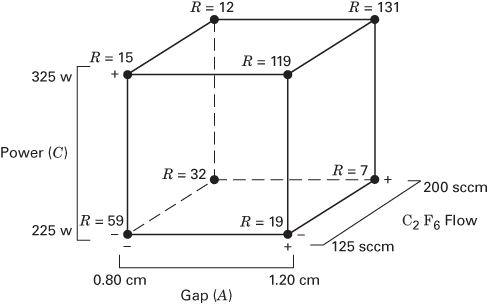

# 6.3 $2^{3}$ 设计

假设我们关心三个因子 A、B 和 C，每个都取两个水平。这种设计称为 **$2^{3}$ 因子设计**，它的八个处理组合现在可以用一个立方体来几何地表示，如图 6.4a 所示。用"+ 与 −"正交编码表示因子的低水平和高水平，我们可以把 $2^{3}$ 设计中的八次试验按图 6.4b 列出。这有时称为**设计矩阵**（design matrix）。将 6.2 节讨论的标记法加以扩充，

**图 6.4 $2^{3}$ 因子设计。(a) 几何视图；(b) 设计矩阵**

| 试验号 | A | B | C |
| --- | --- | --- | --- |
| 1 | − | − | − |
| 2 | + | − | − |
| 3 | − | + | − |
| 4 | + | + | − |
| 5 | − | − | + |
| 6 | + | − | + |
| 7 | − | + | + |
| 8 | + | + | + |

我们把处理组合按标准顺序写成 (1)、$a$、$b$、$ab$、$c$、$ac$、$bc$ 和 $abc$。记住这些符号还表示在相应处理组合处取得的全部 $n$ 个观测值的总和。

$2^{k}$ 设计中的试验次数广泛使用三种不同的记号。第一种是 + 与 − 记号，常称为几何编码（或正交编码、效应编码）。第二种是用小写字母标记来标识处理组合。最后一种记号用 1 和 0 分别表示因子的高水平与低水平，而不用 + 和 −。下面用 $2^{3}$ 设计说明这些不同的记号：

| 试验号 | A | B | C | 标记 | A | B | C |
| --- | --- | --- | --- | --- | --- | --- | --- |
| 1 | − | − | − | (1) | 0 | 0 | 0 |
| 2 | + | − | − | $a$ | 1 | 0 | 0 |
| 3 | − | + | − | $b$ | 0 | 1 | 0 |
| 4 | + | + | − | $ab$ | 1 | 1 | 0 |
| 5 | − | − | + | $c$ | 0 | 0 | 1 |
| 6 | + | − | + | $ac$ | 1 | 0 | 1 |
| 7 | − | + | + | $bc$ | 0 | 1 | 1 |
| 8 | + | + | + | $abc$ | 1 | 1 | 1 |

在 $2^{3}$ 设计的八个处理组合之间有七个自由度。三个自由度与 A、B、C 的主效应相联系。四个自由度与交互作用相联系：$AB$、$AC$、$BC$ 各占一个，$ABC$ 占一个。

下面考虑主效应的估计。首先考虑主效应 A 的估计。当 B 和 C 都在低水平时，A 的效应为 $[a-(1)]/n$。类似地，当 B 在高水平、C 在低水平时，A 的效应为 $[ab-b]/n$。当 C 在高水平、B 在低水平时，A 的效应为 $[ac-c]/n$。最后，当 B 和 C 都在高水平时，A 的效应为 $[abc-bc]/n$。因此，A 的平均效应就是这四个量的平均，即

$$
A = \frac{1}{4 n} [a - (1) + a b - b + a c - c + a b c - b c] \tag{6.11}
$$

这个式子也可以作为图 6.5a 中立方体右面四个处理组合（A 取高水平）与左面四个处理组合（A 取低水平）之间的对照来导出。也就是说，A 的效应就是 A 取高水平的四次试验的平均值 $(\overline{y}_{A^{+}})$ 减去 A 取低水平的四次试验的平均值 $(\overline{y}_{A^{-}})$，即

$$
\begin{array}{r l} A & = \overline{{y}}_{A^{+}} - \overline{{y}}_{A^{-}} \\ & = \frac{a + a b + a c + a b c}{4 n} - \frac{(1) + b + c + b c}{4 n} \end{array}
$$

这个式子可以整理为

$$
A = \frac{1}{4 n} [a + a b + a c + a b c - (1) - b - c - b c]
$$

它与式 6.11 完全相同。

用类似的方式，B 的效应是立方体前面四个处理组合与后面四个处理组合的平均值之差。这给出

$$
\begin{array}{r l} & B = \overline{{{y}}}_{B^{+}} - \overline{{{y}}}_{B^{-}} \\ & \quad = \frac{1}{4 n} [b + a b + b c + a b c - (1) - a - c - a c] \end{array} \tag{6.12}
$$

**图 6.5 $2^{3}$ 设计中与主效应和交互作用相对应的对照的几何表示**

C 的效应是立方体顶面四个处理组合与底面四个处理组合的平均值之差，即

$$
\begin{array}{r l} & C = \overline{{{y}}}_{C^{+}} - \overline{{{y}}}_{C^{-}} \\ & \quad = \frac{1}{4 n} [c + a c + b c + a b c - (1) - a - b - a b] \end{array} \tag{6.13}
$$

两因子交互效应可以很容易地计算。$AB$ 交互作用的一种度量是 B 的两个水平下 A 的平均效应之差。按照约定，这一差值的一半称为 $AB$ 交互作用。用符号表示即

| B | A 的平均效应 |
| --- | --- |
| 高 (+) | $\frac{[(abc - bc) + (ab - b)]}{2n}$ |
| 低 (−) | $\frac{\{(ac - c) + [a - (1)]\}}{2n}$ |
| 差 | $\frac{[abc - bc + ab - b - ac + c - a + (1)]}{2n}$ |

因为 $AB$ 交互作用是这一差值的一半，所以

$$
AB = \frac{[a b c - b c + a b - b - a c + c - a + (1)]}{4 n} \tag{6.14}
$$

我们可以把式 6.14 写成

$$
AB = \frac{a b c + a b + c + (1)}{4 n} - \frac{b c + b + a c + a}{4 n}
$$

从这个形式很容易看出，$AB$ 交互作用就是图 6.5b 中立方体两个对角平面上各次试验平均值之差。用类似的逻辑并参照图 6.5b，我们得到 $AC$ 与 $BC$ 交互作用为

$$
A C = \frac{1}{4 n} [(1) - a + b - a b - c + a c - b c + a b c] \tag{6.15}
$$

以及

$$
B C = \frac{1}{4 n} [(1) + a - b - a b - c - a c + b c + a b c] \tag{6.16}
$$

$ABC$ 交互作用定义为 C 的两个不同水平下 $AB$ 交互作用之差的平均。于是

$$
\begin{array}{r l} AB C & = \frac{1}{4 n} \{[a b c - b c] - [a c - c] - [a b - b] + [a - (1)]\} \\ & = \frac{1}{4 n} [a b c - b c - a c + c - a b + b + a - (1)] \end{array} \tag{6.17}
$$

与前面一样，我们可以把 $ABC$ 交互作用看作两个平均值之差。如果把这两个平均值所含的试验分离出来，它们就定义了构成图 6.5c 中立方体的两个四面体的顶点。

在式 6.11 至 6.17 中，方括号内的量是各处理组合的对照。由这些对照可以编制出正负号表，如表 6.3 所示。主效应的符号由以下方式确定：把高水平与正号相联系、低水平与负号相联系。一旦主效应的符号确定下来，其余各列的符号就可以通过逐行相乘前面相应各列得到。例如，$AB$ 列中的符号就是每一行中 $A$ 列与 $B$ 列符号的乘积。任一效应的对照都可以很容易地由该表得到。

表 6.3 有几个有趣的性质：(1) 除 I 列外，每一列的正号与负号个数相等。(2) 任意两列符号乘积之和为零。(3) I 列乘以任何一列都使该列不变，即 I 是一个单位元素。(4) 任意两列相乘都给出表中的某一列。例如 $A \times B = AB$，且

$$
AB \times B = AB^{2} = A
$$

我们看到，乘积中的指数是按模 2 运算形成的。（也就是说，指数只能是 0 或 1；如果大于 1，就用 2 的倍数把它约简到 0 或 1。）所有这些性质都是 $2^{3}$ 设计的正交性以及用于估计效应的那些对照所蕴含的。

**表 6.3 $2^{3}$ 设计中计算效应的代数符号**

| 处理组合 | I | A | B | AB | C | AC | BC | ABC |
| --- | --- | --- | --- | --- | --- | --- | --- | --- |
| (1) | + | − | − | + | − | + | + | − |
| $a$ | + | + | − | − | − | − | + | + |
| $b$ | + | − | + | − | − | + | − | + |
| $ab$ | + | + | + | + | − | − | − | − |
| $c$ | + | − | − | + | + | − | − | + |
| $ac$ | + | + | − | − | + | + | − | − |
| $bc$ | + | − | + | − | + | − | + | − |
| $abc$ | + | + | + | + | + | + | + | + |

各效应的平方和很容易计算，因为每个效应都对应一个单自由度的对照。在 $n$ 次重复的 $2^{3}$ 设计中，任一效应的平方和都是

$$
SS = \frac{(\mathrm{Contrast})^{2}}{8 n} \tag{6.18}
$$

## 例 6.1 等离子刻蚀

有人用 $2^{3}$ 因子设计在单晶圆等离子刻蚀设备上开发一种氮化物刻蚀工艺。设计因子为电极间距、气体流量（以 $C_{2}F_{6}$ 作反应气体）以及施加在阴极上的射频功率（等离子刻蚀设备的示意图见图 3.1）。每个因子取两个水平，设计重复两次。响应变量是氮化硅的刻蚀速率（$\mathring{A}/m$）。刻蚀速率数据见表 6.4，设计的几何表示见图 6.6。

利用表 6.4 中处理组合下方给出的总和，我们可以如下估计各因子效应：

$$
\begin{array}{r l} & {A = \frac{1}{4 n} [a - (1) + a b - b + a c - c + a b c - b c]} \\ & {\quad = \frac{1}{8} [1319 - 1154 + 1277 - 1234} \\ & {\quad \quad + 1617 - 2089 + 1589 - 2138]} \\ & {\quad = \frac{1}{8} [-813] = -101.625} \\ & {B = \frac{1}{4 n} [b + a b + b c + a b c - (1) - a - c - a c]} \\ & {\quad = \frac{1}{8} [1234 + 1277 + 2138 + 1589 - 1154} \\ & {\quad \quad - 1319 - 2089 - 1617]} \\ & {\quad = \frac{1}{8} [59] = 7.375} \end{array}
$$

**图 6.6 例 6.1 等离子刻蚀试验的 $2^{3}$ 设计**

$$
\begin{array}{r l} C & = \frac{1}{4 n} [c + a c + b c + a b c - (1) - a - b - a b] \\ & = \frac{1}{8} [2089 + 1617 + 2138 + 1589 - 1154 \\ & \quad - 1319 - 1234 - 1277] \\ & = \frac{1}{8} [2449] = 306.125 \end{array}
$$

**表 6.4 等离子刻蚀试验（例 6.1）**

| 试验号 | A | B | C | 刻蚀速率 重复 1 | 刻蚀速率 重复 2 | 总计 | 因子水平 | 低 (−1) | 高 (+1) |
| --- | --- | --- | --- | --- | --- | --- | --- | --- | --- |
| 1 | −1 | −1 | −1 | 550 | 604 | (1) = 1154 | A（间距，cm） | 0.80 | 1.20 |
| 2 | 1 | −1 | −1 | 669 | 650 | $a$ = 1319 | B（$C_2F_6$ 流量，SCCM） | 125 | 200 |
| 3 | −1 | 1 | −1 | 633 | 601 | $b$ = 1234 | C（功率，W） | 275 | 325 |
| 4 | 1 | 1 | −1 | 642 | 635 | $ab$ = 1277 | | | |
| 5 | −1 | −1 | 1 | 1037 | 1052 | $c$ = 2089 | | | |
| 6 | 1 | −1 | 1 | 749 | 868 | $ac$ = 1617 | | | |
| 7 | −1 | 1 | 1 | 1075 | 1063 | $bc$ = 2138 | | | |
| 8 | 1 | 1 | 1 | 729 | 860 | $abc$ = 1589 | | | |

$$
\begin{array}{r l} AB & = \frac{1}{4 n} [a b - a - b + (1) + a b c - b c - a c + c] \\ & = \frac{1}{8} [1277 - 1319 - 1234 + 1154 \\ & \quad + 1589 - 2138 - 1617 + 2089] \\ & = \frac{1}{8} [-199] = -24.875 \end{array}
$$

$$
\begin{array}{r l} A C & = \frac{1}{4 n} [(1) - a + b - a b - c + a c - b c + a b c] \\ & = \frac{1}{8} [1154 - 1319 + 1234 - 1277 - 2089 \\ & \quad + 1617 - 2138 + 1589] \\ & = \frac{1}{8} [-1229] = -153.625 \end{array}
$$

$$
\begin{array}{r l} B C & = \frac{1}{4 n} [(1) + a - b - a b - c - a c + b c + a b c] \\ & = \frac{1}{8} [1154 + 1319 - 1234 - 1277 - 2089 \\ & \quad - 1617 + 2138 + 1589] \\ & = \frac{1}{8} [-17] = -2.125 \end{array}
$$

以及

$$
\begin{array}{r l} AB C & = \frac{1}{4 n} [a b c - b c - a c + c - a b + b + a - (1)] \\ & = \frac{1}{8} [1589 - 2138 - 1617 + 2089 - 1277 \\ & \quad + 1234 + 1319 - 1154] \\ & = \frac{1}{8} [45] = 5.625 \end{array}
$$

最大的效应分别来自功率（$C=306.125$）、间距（$A=-101.625$）以及功率–间距交互作用（$AC=-153.625$）。

各平方和由式 6.18 计算如下：

$$
SS_{A} = \frac{(-813)^{2}}{16} = 41{,}310.5625
$$

$$
SS_{B} = \frac{(59)^{2}}{16} = 217.5625
$$

$$
SS_{c} = \frac{(2449)^{2}}{16} = 374{,}850.0625
$$

$$
SS_{AB} = \frac{(-199)^{2}}{16} = 2475.0625
$$

$$
SS_{A C} = \frac{(-1229)^{2}}{16} = 94{,}402.5625
$$

$$
SS_{B C} = \frac{(-17)^{2}}{16} = 18.0625
$$

以及

$$
SS_{AB C} = \frac{(45)^{2}}{16} = 126.5625
$$

总平方和为 $SS_{T} = 531{,}420.9375$，相减得 $SS_{E} = 18{,}020.50$。表 6.5 汇总了效应估计与平方和。标为"百分比贡献"的列度量每个模型项相对于总平方和的百分比贡献。百分比贡献通常是判断各模型项相对重要性的一种粗略但有效的指引。注意 C（功率）的主效应确实支配了该过程，占总变异的 70% 以上，而 A（间距）的主效应和 $AC$ 交互作用分别约占 8% 和 18%。

表 6.6 中的方差分析可用来确认这些效应的大小。由表 6.6 可见，间距与功率的主效应都高度显著（两者的 $P$ 值都非常小）。$AC$ 交互作用也高度显著；因此，间距与功率之间存在很强的交互作用。

**表 6.5 例 6.1 的效应估计汇总**

| 因子 | 效应估计 | 平方和 | 百分比贡献 |
| --- | --- | --- | --- |
| A | −101.625 | 41,310.5625 | 7.7736 |
| B | 7.375 | 217.5625 | 0.0409 |
| C | 306.125 | 374,850.0625 | 70.5373 |
| AB | −24.875 | 2475.0625 | 0.4657 |
| AC | −153.625 | 94,402.5625 | 17.7642 |
| BC | −2.125 | 18.0625 | 0.0034 |
| ABC | 5.625 | 126.5625 | 0.0238 |

**表 6.6 等离子刻蚀试验的方差分析**

| 变异来源 | 平方和 | 自由度 | 均方 | $F_{0}$ | $P$ 值 |
| --- | --- | --- | --- | --- | --- |
| 间距 (A) | 41,310.5625 | 1 | 41,310.5625 | 18.34 | 0.0027 |
| 气体流量 (B) | 217.5625 | 1 | 217.5625 | 0.10 | 0.7639 |
| 功率 (C) | 374,850.0625 | 1 | 374,850.0625 | 166.41 | 0.0001 |
| AB | 2475.0625 | 1 | 2475.0625 | 1.10 | 0.3252 |
| AC | 94,402.5625 | 1 | 94,402.5625 | 41.91 | 0.0002 |
| BC | 18.0625 | 1 | 18.0625 | 0.01 | 0.9308 |
| ABC | 126.5625 | 1 | 126.5625 | 0.06 | 0.8186 |
| 误差 | 18,020.5000 | 8 | 2252.5625 | | |
| 总计 | 531,420.9375 | 15 | | | |

**$2^{3}$ 设计的重复。**例 6.1 中等离子刻蚀试验的试验者使用了 $2^{3}$ 设计的两次重复。这将提供 8 个自由度用于纯误差。假设感兴趣的是大小为 $2\sigma$ 的效应，试验者想考虑所有主效应和交互作用（全因子模型）并使用 $\alpha = 0.05$。JMP 的功效计算如下所示：

Evaluate Design

Model

Intercept

X1

X2

X3

X1*X2

X1*X3

X2*X3

X1*X2*X3

Power Analysis

| Significance Level | 0.05 |
| --- | --- |
| Anticipated RMSE | 1 |

| Term | Anticipated Coefficient | Power |
| --- | --- | --- |
| Intercept | 1 | 0.937 |
| X1 | 1 | 0.937 |
| X2 | 1 | 0.937 |
| X3 | 1 | 0.937 |
| X1*X2 | 1 | 0.937 |
| X1*X3 | 1 | 0.937 |
| X2*X3 | 1 | 0.937 |
| X1*X2*X3 | 1 | 0.937 |

该设计的功效为 93.7%。即使试验者决定使用 $\alpha = 0.01$，功效仍有 72%。对该试验而言，$2^{3}$ 设计重复两次是一个很好的选择。

**回归模型与响应曲面。**用于预测刻蚀速率的回归模型为

$$
\begin{array}{r l} & {\hat{y} = \hat{\beta}_{0} + \hat{\beta}_{1} x_{1} + \hat{\beta}_{3} x_{3} + \hat{\beta}_{13} x_{1} x_{3}} \\ & {\quad = 776.0625 + \left(\frac{-101.625}{2}\right) x_{1} + \left(\frac{306.125}{2}\right) x_{3} + \left(\frac{-153.625}{2}\right) x_{1} x_{3}} \end{array}
$$

其中编码变量 $x_{1}$ 与 $x_{3}$ 分别表示 A 和 C。$x_{1}x_{3}$ 项就是 $AC$ 交互作用。残差可由观测刻蚀速率值与预测值之差得到。我们把对这些残差的分析留作读者的练习。

图 6.7 给出由该回归模型得到的刻蚀速率响应曲面与等高线图。注意因为模型含有交互作用，等刻蚀速率等高线是弯曲的（或者说响应曲面是"扭曲"的平面）。希望把该过程运行在刻蚀速率接近 900 Å/m 处。等高线图表明，间距与功率的若干组合都能满足这一目标。不过，必须对这两个变量都加以非常精确的控制。

**图 6.7 例 6.1 刻蚀速率的响应曲面与等高线图**

**计算机解。**有许多统计软件包可以建立和分析两水平因子设计。其中一个程序 Design-Expert 的输出见表 6.7。表的上部给出了全模型的方差分析。这种表达格式与表 6.6 给出的方差分析结果有些不同。注意方差分析的第一行是全模型（所有主效应和交互作用）的总体汇总，模型平方和为

$$
SS_{\mathrm{Model}} = SS_{A} + SS_{B} + SS_{C} + SS_{AB} + SS_{A C} + SS_{B C} + SS_{AB C} = 5.134 \times 10^{5}
$$

因此，统计量

$$
F_{0} = \frac{M S_{\mathrm{Model}}}{M S_{E}} = \frac{73{,}342.92}{2252.56} = 32.56
$$

**表 6.7 例 6.1 的 Design-Expert 输出**

Response: Etch rate

ANOVA for Selected Factorial Model

Analysis of variance table [Partial sum of squares]

| Source | Sum of Squares | DF | Mean Square | F Value | Prob > F |
| --- | --- | --- | --- | --- | --- |
| Model | 5.134E+005 | 7 | 73342.92 | 32.56 | < 0.0001 |
| A | 41310.56 | 1 | 41310.56 | 18.34 | 0.0027 |
| B | 217.56 | 1 | 217.56 | 0.097 | 0.7639 |
| C | 3.749E+005 | 1 | 3.749E+005 | 166.41 | < 0.0001 |
| AB | 2475.06 | 1 | 2475.06 | 1.10 | 0.3252 |
| AC | 94402.56 | 1 | 94402.56 | 41.91 | 0.0002 |
| BC | 18.06 | 1 | 18.06 | 8.019E-003 | 0.9308 |
| ABC | 126.56 | 1 | 126.56 | 0.056 | 0.8186 |
| Pure Error | 18020.50 | 8 | 2252.56 | | |
| Cor Total | 5.314E+005 | 15 | | | |

| Std. Dev. | 47.46 | | R-Squared | 0.9661 |
| --- | --- | --- | --- | --- |
| Mean | 776.06 | | Adj R-Squared | 0.9364 |
| C.V. | 6.12 | | Pred R-Squared | 0.8644 |
| PRESS | 72082.00 | | Adeq Precision | 14.660 |

| Factor | Coefficient Estimate | DF | Standard Error | 95% CI Low | 95% CI High | VIF |
| --- | --- | --- | --- | --- | --- | --- |
| Intercept | 776.06 | 1 | 11.87 | 748.70 | 803.42 | |
| A-Gap | −50.81 | 1 | 11.87 | −78.17 | −23.45 | 1.00 |
| B-Gas flow | 3.69 | 1 | 11.87 | −23.67 | 31.05 | 1.00 |
| C-Power | 153.06 | 1 | 11.87 | 125.70 | 180.42 | 1.00 |
| AB | −12.44 | 1 | 11.87 | −39.80 | 14.92 | 1.00 |
| AC | −76.81 | 1 | 11.87 | −104.17 | −49.45 | 1.00 |
| BC | −1.06 | 1 | 11.87 | −28.42 | 26.30 | 1.00 |
| ABC | 2.81 | 1 | 11.87 | −24.55 | 30.17 | 1.00 |

Final Equation in Terms of Coded Factors:

Etch rate =

+776.06

−50.81 * A

+3.69 * B

+153.06 * C

−12.44 * A * B

−76.81 * A * C

+1.06 * B * C

+2.81 * A * B * C

Final Equation in Terms of Actual Factors:

Etch rate =

−6487.33333

+5355.41667 * Gap

+6.59667 * Gas flow

+24.10667 * Power

−6.15833 * Gap * Gas flow

−17.80000 * Gap * Power

−0.016133 * Gas flow * Power

+0.015000 * Gap * Gas flow * Power

Response: Etch rate

ANOVA for Selected Factorial Model

Analysis of variance table [Partial sum of squares]

| Source | Sum of Squares | DF | Mean Square | F Value | Prob > F |
| --- | --- | --- | --- | --- | --- |
| Model | 5.106E+005 | 3 | 1.702E+005 | 97.91 | < 0.0001 |
| A | 41310.56 | 1 | 41310.56 | 23.77 | 0.0004 |
| C | 3.749E+005 | 1 | 3.749E+005 | 215.66 | < 0.0001 |
| AC | 94402.56 | 1 | 94402.56 | 54.31 | < 0.0001 |
| Residual | 20857.75 | 12 | 1738.15 | | |
| Lack of Fit | 2837.25 | 4 | 709.31 | 0.31 | 0.8604 |
| Pure Error | 18020.50 | 8 | 2252.56 | | |
| Cor Total | 5.314E+005 | 15 | | | |

| Std. Dev. | 41.69 | | R-Squared | 0.9608 |
| --- | --- | --- | --- | --- |
| Mean | 776.06 | | Adj R-Squared | 0.9509 |
| C.V. | 5.37 | | Pred R-Squared | 0.9302 |
| PRESS | 37080.44 | | Adeq Precision | 22.055 |

| Factor | Coefficient Estimate | DF | Standard Error | 95% CI Low | 95% CI High | VIF |
| --- | --- | --- | --- | --- | --- | --- |
| Intercept | 776.06 | 1 | 10.42 | 753.35 | 798.77 | |
| A-Gap | −50.81 | 1 | 10.42 | −73.52 | −28.10 | 1.00 |
| C-Power | 153.06 | 1 | 10.42 | 130.35 | 175.77 | 1.00 |
| AC | −76.81 | 1 | 10.42 | −99.52 | −54.10 | 1.00 |

Final Equation in Terms of Coded Factors:

Etch rate =

+776.06

−50.81 * A

+153.06 * C

−76.81 * A * C

Final Equation in Terms of Actual Factors:

Etch rate =

−5415.37500

+4354.68750 * Gap

+21.48500 * Power

−15.36250 * Gap * Power

| Standard Order | Actual Value | Predicted Value | Residual | Leverage | Student Residual | Cook's Distance | Outlier t | Run Order |
| --- | --- | --- | --- | --- | --- | --- | --- | --- |
| 1 | 550.00 | 597.00 | −47.00 | 0.250 | −1.302 | 0.141 | −1.345 | 9 |
| 2 | 604.00 | 597.00 | 7.00 | 0.250 | 0.194 | 0.003 | 0.186 | 6 |
| 3 | 669.00 | 649.00 | 20.00 | 0.250 | 0.554 | 0.026 | 0.537 | 14 |
| 4 | 650.00 | 649.00 | 1.00 | 0.250 | 0.028 | 0.000 | 0.027 | 1 |
| 5 | 633.00 | 597.00 | 36.00 | 0.250 | 0.997 | 0.083 | 0.997 | 3 |
| 6 | 601.00 | 597.00 | 4.00 | 0.250 | 0.111 | 0.001 | 0.106 | 12 |
| 7 | 642.00 | 649.00 | −7.00 | 0.250 | −0.194 | 0.003 | −0.186 | 13 |
| 8 | 635.00 | 649.00 | −14.00 | 0.250 | −0.388 | 0.013 | −0.374 | 8 |
| 9 | 1037.00 | 1056.75 | −19.75 | 0.250 | −0.547 | 0.025 | −0.530 | 5 |
| 10 | 1052.00 | 1056.75 | −4.75 | 0.250 | −0.132 | 0.001 | −0.126 | 16 |
| 11 | 749.00 | 801.50 | −52.50 | 0.250 | −1.454 | 0.176 | −1.534 | 2 |
| 12 | 868.00 | 801.50 | 66.50 | 0.250 | 1.842 | 0.283 | 2.082 | 15 |
| 13 | 1075.00 | 1056.75 | 18.25 | 0.250 | 0.505 | 0.021 | 0.489 | 4 |
| 14 | 1063.00 | 1056.75 | 6.25 | 0.250 | 0.173 | 0.002 | 0.166 | 7 |
| 15 | 729.00 | 801.50 | −72.50 | 0.250 | −2.008 | 0.336 | −2.359 | 10 |
| 16 | 860.00 | 801.50 | 58.50 | 0.250 | 1.620 | 0.219 | 1.755 | 11 |

这里检验的是假设

$$
\begin{array}{l} H_{0}: \beta_{1} = \beta_{2} = \beta_{3} = \beta_{12} = \beta_{13} = \beta_{23} = \beta_{123} = 0 \\ H_{1}: \text{至少有一个} \beta \neq 0 \end{array}
$$

由于 $F_{0}$ 很大，我们会得出至少有一个变量具有非零效应的结论。随后用 $F$ 统计量检验每个单独的因子效应的显著性。这些结果与表 6.6 一致。

在表 6.7 中全模型方差分析的下方，给出了几个 $R^{2}$ 统计量。普通 $R^{2}$ 为

$$
R^{2} = \frac{SS_{\text{Model}}}{SS_{\text{Total}}} = \frac{5.134 \times 10^{5}}{5.314 \times 10^{5}} = 0.9661
$$

它度量模型所解释的总变异比例。这一统计量的一个潜在问题是，随着向模型中不断加入因子，它总会增大，即使这些因子不显著。调整后的 $R^{2}$ 统计量定义为

$$
R_{\mathrm{Adj}}^{2} = 1 - \frac{SS_{E} / d f_{E}}{SS_{\mathrm{Total}} / d f_{\mathrm{Total}}} = 1 - \frac{18{,}020.50 / 8}{5.314 \times 10^{5} / 15} = 0.9364
$$

它是对模型"规模"（即因子个数）作了调整的统计量。如果向模型中加入了不显著的项，调整后的 $R^{2}$ 实际上可能减小。PRESS 统计量度量模型对新数据的预测效果有多好。（PRESS 实际上是预测误差平方和的缩写，它的计算方式是：用包含除第 $i$ 个观测之外所有观测的模型来预测第 $i$ 个数据点，把所得预测误差平方求和。）PRESS 值小的模型说明它很可能是一个好的预测器。"预测 $R^{2}$"统计量按下式计算：

$$
R_{\mathrm{Pred}}^{2} = 1 - \frac{\mathrm{PRESS}}{SS_{\mathrm{Total}}} = 1 - \frac{72{,}082.00}{5.314 \times 10^{5}} = 0.8644
$$

这说明全模型预期可以解释新数据中约 86% 的变异。

输出的下一部分给出每个模型项的回归系数以及每个系数的标准误，其定义为

$$
s e(\hat{\beta}) = \sqrt{V(\hat{\beta})} = \sqrt{\frac{M S_{E}}{n 2^{k}}} = \sqrt{\frac{M S_{E}}{N}} = \sqrt{\frac{2252.56}{2(8)}} = 11.87
$$

所有模型系数的标准误都相等，因为设计是正交的。每个回归系数的 95% 置信区间由下式计算：

$$
\hat{\beta} - t_{0.025, N - p} s e(\hat{\beta}) \leq \beta \leq \hat{\beta} + t_{0.025, N - p} s e(\hat{\beta})
$$

其中 $t$ 的自由度就是误差的自由度；即 $N$ 是试验的总试验次数（16），$p$ 是模型参数个数（8）。输出还同时用编码变量和自然变量两种形式给出了全模型。

表 6.7 中显示的最后一部分，是删去不显著交互作用项之后的输出。这个约简模型现在只含主效应 A、C 以及 $AC$ 交互作用。误差（即残差）平方和现在由两部分组成：一部分是来自立方体八个角点重复的纯误差成分，另一部分是失拟成分，由从模型中删去的因子（B、AB、BC 和 ABC）的平方和构成。试验结果用编码变量和自然变量两种形式给出的回归模型表示也再次给出。该模型所解释的刻蚀速率总变异比例为

$$
R^{2} = \frac{SS_{\mathrm{Model}}}{SS_{\mathrm{Total}}} = \frac{5.106 \times 10^{5}}{5.314 \times 10^{5}} = 0.9608
$$

它小于全模型的 $R^{2}$。不过注意，约简模型的调整 $R^{2}$ 实际上略大于全模型的调整 $R^{2}$，而约简模型的 PRESS 显著更小，从而使约简模型的 $R_{Pred}^{2}$ 更大。显然，从全模型中删去不显著的项，得到一个更可能有效地预测新数据的最终模型。注意约简模型回归系数的置信区间比全模型相应的置信区间更短。

输出的最后一部分给出约简模型的残差。Design-Expert 还会构造我们前面讨论过的那些残差图。

**判断效应显著性的其他方法。**方差分析是确定哪些因子效应非零的一种正规方法。另有几种方法也很有用。下面我们说明如何计算效应的标准误，并用这些标准误构造效应的置信区间。另一种方法将在 6.5 节例示，它用正态概率图来评估效应的重要性。

效应的标准误很容易求出。如果假定设计中的 $2^{k}$ 次试验每次都有 $n$ 次重复，并且 $y_{i1}, y_{i2}, \ldots, y_{in}$ 是第 $i$ 次试验处的观测值，那么

$$
S_{i}^{2} = \frac{1}{n - 1} \sum_{j = 1}^{n} (y_{i j} - \bar{y}_{i})^{2} \quad i = 1, 2, \dots, 2^{k}
$$

是第 $i$ 次试验处方差的一个估计。把这 $2^{k}$ 个方差估计合并起来就给出一个总的方差估计：

$$
S^{2} = \frac{1}{2^{k} (n - 1)} \sum_{i = 1}^{2^{k}} \sum_{j = 1}^{n} (y_{i j} - \overline{{y}}_{i})^{2} \tag{6.19}
$$

这也就是方差分析中由误差均方给出的方差估计。每个效应估计的方差为

$$
\begin{array}{c} V(\text{Effect}) = V \left(\frac{\text{Contrast}}{n 2^{k - 1}}\right) \\ = \frac{1}{(n 2^{k - 1})^{2}} V(\text{Contrast}) \end{array}
$$

每个对照都是 $2^{k}$ 个处理总和的线性组合，而每个总和都由 $n$ 个观测值构成。因此

$$
V(\text{Contrast}) = n 2^{k} \sigma^{2}
$$

而效应的方差为

$$
V(\text{Effect}) = \frac{1}{(n 2^{k - 1})^{2}} n 2^{k} \sigma^{2} = \frac{1}{n 2^{k - 2}} \sigma^{2}
$$

把 $\sigma^{2}$ 换成它的估计 $S^{2}$ 并对最后这个表达式取平方根，就得到估计的标准误：

$$
s e(\text{Effect}) = \frac{2 S}{\sqrt{n 2^{k}}} \tag{6.20}
$$

注意，一个效应的标准误是 $2^{k}$ 设计回归模型中一个回归系数估计的标准误的两倍（参见例 6.1 的 Design-Expert 计算机输出）[^1]。可以通过把效应估计与它的标准误相比较来检验任一效应的显著性：

$$
t_{0} = \frac{\text{Effect}}{s e(\text{Effect})}
$$

这是一个自由度为 $N - p$ 的 $t$ 统计量。

效应的 $100(1-\alpha)$ 百分置信区间由 $\text{Effect} \pm t_{\alpha/2,N-p}se(\text{Effect})$ 计算，其中 $t$ 的自由度就是误差或残差自由度（$N-p$ 中 $N$ 为总试验次数、$p$ 为模型参数个数）。

为说明这一方法，考虑例 6.1 的等离子刻蚀试验。全模型的误差均方为 $MS_{E} = 2252.56$。因此，每个效应的标准误为（取 $S^2 = MS_E$）

$$
s e(\mathrm{Effect}) = \frac{2 S}{\sqrt{n 2^{k}}} = \frac{2 \sqrt{2252.56}}{\sqrt{2(2^{3})}} = 23.73
$$

现在 $t_{0.025,8} = 2.31$，且 $t_{0.025,8}se(\text{Effect}) = 2.31(23.73) = 54.82$，所以各因子效应的近似 95% 置信区间为

$$
\begin{array}{r l} A: - 101.625 \pm 54.82 \\ B: \quad & 7.375 \pm 54.82 \\ C: \quad & 306.125 \pm 54.82 \\ AB: \quad & - 24.875 \pm 54.82 \\ A C: \quad & - 153.625 \pm 54.82 \\ B C: \quad & - 2.125 \pm 54.82 \\ AB C: \quad & 5.625 \pm 54.82 \end{array}
$$

这一分析表明 A、C 和 AC 是重要因子，因为它们正是近似 95% 置信区间不包含零的那些因子效应估计。

**散度效应。**研究等离子刻蚀设备的工艺工程师还关心**散度效应**（dispersion effect），即：是否有某个因子影响刻蚀速率在逐次试验之间的变异性？回答这个问题的一种办法是考察 $2^{3}$ 设计中八次试验各自刻蚀速率的极差。这些极差标在图 6.8 的立方体上。注意当间距和功率都取高水平时，刻蚀速率的极差要大得多，说明这种因子水平组合可能导致比其他配方更大的刻蚀速率变异。幸运的是，通过选择能避开这种情形的间距与功率设置，仍可在期望的 900 Å/m 范围内获得刻蚀速率。

**图 6.8 例 6.1 刻蚀速率的极差**

[^1]: 式（效应的标准误）的编号在扫描件中印作 6.21，但本章自 6.4 节起即为 6.21，故此式应为 6.20；同节 $S^{2}$ 的编号印作 6.1，按序号应为 6.19。译文已按 6.19 与 6.20 写出。——译者注

