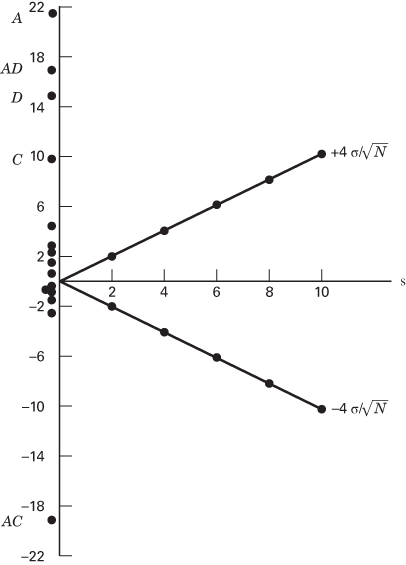
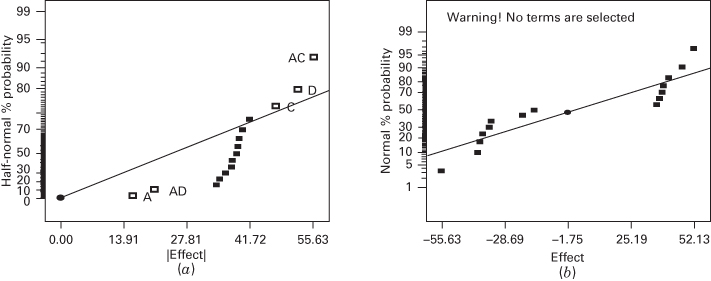

# 6.5 $2^{k}$ 设计的单次重复

即使因子个数只是中等，$2^{k}$ 因子设计中处理组合的总数也会很大。例如，$2^{5}$ 设计有 32 个处理组合，$2^{6}$ 设计有 64 个处理组合，等等。由于资源通常有限，试验者能够使用的重复次数可能受到限制。除非试验者愿意舍弃一些原有因子，否则可用的资源往往只允许对设计做单次重复。

对每个试验组合只做一次试验时，一个明显的风险是我们可能在给噪声拟合模型。也就是说，如果响应 $y$ 变异很大，试验可能得出误导性的结论。这种情形如图 6.9a 所示。图中直线代表真实的因子效应。然而，由于响应变量中存在随机变异（用阴影带表示），试验者实际得到的是两个深色圆点所代表的测得响应。结果估计出的因子效应接近于零，试验者对该因子得出了错误的结论。如果响应中的变异较小，那么得出错误结论的可能性也会更小。另一种保证得到可靠效应估计的办法是加大因子低水平 $(-)$ 与高水平 $(+)$ 之间的距离，如图 6.9b 所示。注意该图中因子低水平与高水平之间距离的增大，使真实因子效应得到了合理的估计。

当需要考虑的因子相对较多时，筛选试验常常采用单次重复的策略。由于在这种情况下我们永远无法完全确定试验误差很小，这类试验的一个好做法是把因子水平之间的距离尽可能拉开。重读第 1 章中关于选择因子水平的指导可能对你有所帮助。

$2^{k}$ 设计的单次重复有时称为**无重复因子试验**（unreplicated factorial）。只有一次重复时，就没有内部的误差估计（或"纯误差"）。分析无重复因子试验的一种思路是假定某些高阶交互作用可以忽略，并把它们的均方合并起来估计误差。这是对**效应稀疏原理**（sparsity of effects principle）的一种运用，也就是说，大多数系统主要由若干主效应和低阶交互作用支配，而大多数高阶交互作用都可以忽略。

尽管试验者观察效应稀疏原理已有几十年，但直到最近才有更客观的研究。Li、Sudarsanam 和 Frey (2006) 的一篇论文研究了来自 43 个已发表试验的 113 个响应变量，这些试验涵盖广泛科学与工程学科。所有试验都是三到七个因子的全因子试验，因此不必对交互作用作任何假定。大多数试验有三或四个因子。作者发现，在他们研究的试验中约有 40% 的主效应显著，而只有约 11% 的两因子交互作用显著。三因子交互作用非常罕见，只在约 5% 的情形中出现。作者还考察了主效应、两因子交互作用和三因子交互作用中因子效应的绝对值。主效应强度的中位数约为两因子交互作用强度中位数的四倍。两因子交互作用强度的中位数则是三因子交互作用强度中位数的两倍多。不过，仍有许多两因子和三因子交互作用大于主效应的中位数。Bergquist、Vanhatalo 和 Nordenvaad (2011) 的另一篇论文也用 22 个不同试验（35 个响应）研究了效应稀疏性问题。他们同时考虑了两水平因子的全因子与部分因子设计，结果与 Li 等 (2006) 大体一致，只是三因子交互作用更少见，只在约 2% 的情形中出现。这一差别可能部分源于 Li 等 (2006) 的研究包含了有弯曲迹象、需要作变换的试验，而 Bergquist 等 (2011) 排除了这类试验。总的来说，这两项研究都证实了效应稀疏原理的有效性。

**图 6.9 无重复设计中因子水平选择的影响**

分析无重复因子设计的数据时，偶尔会出现真实的高阶交互作用。此时用合并高阶交互作用得到的误差均方就不合适了。一种归功于 Daniel (1959) 的分析方法提供了克服这一问题的简单途径。Daniel 建议考察效应估计的正态概率图。可忽略的效应服从均值为零、方差为 $\sigma^{2}$ 的正态分布，在这张图上会倾向于落在一条直线附近；而显著的效应均值非零，不会落在该直线上。这样，就可以根据正态概率图把初步模型确定为含有那些看起来非零的效应，而把看起来可忽略的效应合并起来作为误差的估计。

## 例 6.2 $2^{4}$ 设计的单次重复

某种化工产品在压力容器中生产。在中间试验工厂中进行了一项因子试验，研究据认为会影响该产品过滤速率的因子。四个因子是温度 (A)、压力 (B)、甲醛浓度 (C) 和搅拌速率 (D)。每个因子取两个水平。设计矩阵以及 $2^{4}$ 试验单次重复所得的响应数据见表 6.10 和图 6.10。

**表 6.10 中间试验工厂过滤速率试验**

| 试验号 | A | B | C | D | 试验标记 | 过滤速率 (gal/h) |
| --- | --- | --- | --- | --- | --- | --- |
| 1 | − | − | − | − | (1) | 45 |
| 2 | + | − | − | − | $a$ | 71 |
| 3 | − | + | − | − | $b$ | 48 |
| 4 | + | + | − | − | $ab$ | 65 |
| 5 | − | − | + | − | $c$ | 68 |
| 6 | + | − | + | − | $ac$ | 60 |
| 7 | − | + | + | − | $bc$ | 80 |
| 8 | + | + | + | − | $abc$ | 65 |
| 9 | − | − | − | + | $d$ | 43 |
| 10 | + | − | − | + | $ad$ | 100 |
| 11 | − | + | − | + | $bd$ | 45 |
| 12 | + | + | − | + | $abd$ | 104 |
| 13 | − | − | + | + | $cd$ | 75 |
| 14 | + | − | + | + | $acd$ | 86 |
| 15 | − | + | + | + | $bcd$ | 70 |
| 16 | + | + | + | + | $abcd$ | 96 |

**图 6.10 例 6.2 中间试验工厂过滤速率试验的数据**

16 次试验按随机顺序进行。该工艺工程师想使过滤速率最大化。当前工艺条件给出的过滤速率约为 75 gal/h。该工艺目前还使用甲醛浓度的高水平，即因子 C 的高水平。工程师希望尽可能降低甲醛浓度，但一直做不到，因为降低浓度总是导致过滤速率下降。

我们通过构造效应估计的正态概率图来开始这些数据的分析。$2^{4}$ 设计对照常数的正负号表见表 6.11。由这些对照，

**表 6.11 $2^{4}$ 设计的对照常数**

| | A | B | AB | C | AC | BC | ABC | D | AD | BD | ABD | CD | ACD | BCD | ABCD |
| --- | --- | --- | --- | --- | --- | --- | --- | --- | --- | --- | --- | --- | --- | --- | --- |
| (1) | − | − | + | − | + | + | − | − | + | + | − | + | − | − | + |
| $a$ | + | − | − | − | − | + | + | − | − | + | + | + | + | − | − |
| $b$ | − | + | − | − | + | − | + | − | + | − | + | + | − | + | − |
| $ab$ | + | + | + | − | − | − | − | − | − | − | − | + | + | + | + |
| $c$ | − | − | + | + | − | − | + | − | + | + | − | − | + | + | − |
| $ac$ | + | − | − | + | + | − | − | − | − | + | + | − | − | + | + |
| $bc$ | − | + | − | + | − | + | − | − | + | − | + | − | + | − | + |
| $abc$ | + | + | + | + | + | + | + | − | − | − | − | − | − | − | − |
| $d$ | − | − | + | − | + | + | − | + | − | − | + | − | + | + | − |
| $ad$ | + | − | − | − | − | + | + | + | + | − | − | − | − | + | + |
| $bd$ | − | + | − | − | + | − | + | + | − | + | − | − | + | − | + |
| $abd$ | + | + | + | − | − | − | − | + | + | + | + | − | − | − | − |
| $cd$ | − | − | + | + | − | − | + | + | − | − | + | + | − | − | + |
| $acd$ | + | − | − | + | + | − | − | + | + | − | − | + | + | − | − |
| $bcd$ | − | + | − | + | − | + | − | + | − | + | − | + | − | + | − |
| $abcd$ | + | + | + | + | + | + | + | + | + | + | + | + | + | + | + |

我们可以估计出 15 个因子效应以及表 6.12 所示的平方和。

**表 6.12 例 6.2 中 $2^{4}$ 因子试验的因子效应估计与平方和**

| 模型项 | 效应估计 | 平方和 | 百分比贡献 |
| --- | --- | --- | --- |
| A | 21.625 | 1870.56 | 32.6397 |
| B | 3.125 | 39.0625 | 0.681608 |
| C | 9.875 | 390.062 | 6.80626 |
| D | 14.625 | 855.563 | 14.9288 |
| AB | 0.125 | 0.0625 | 0.00109057 |
| AC | −18.125 | 1314.06 | 22.9293 |
| AD | 16.625 | 1105.56 | 19.2911 |
| BC | 2.375 | 22.5625 | 0.393696 |
| BD | −0.375 | 0.5625 | 0.00981515 |
| CD | −1.125 | 5.0625 | 0.0883363 |
| ABC | 1.875 | 14.0625 | 0.245379 |
| ABD | 4.125 | 68.0625 | 1.18763 |
| ACD | −1.625 | 10.5625 | 0.184307 |
| BCD | −2.625 | 27.5625 | 0.480942 |
| ABCD | 1.375 | 7.5625 | 0.131959 |

这些效应的正态概率图见图 6.11。落在直线上的效应都是可忽略的，而大效应则远离这条直线。由这一分析浮现出来的重要效应是 A、C、D 的主效应以及 $AC$ 和 $AD$ 交互作用。

**图 6.11 例 6.2 中 $2^{4}$ 因子试验效应的正态概率图**

A、C、D 的主效应画在图 6.12a 中。三个效应都是正的，如果只考虑这些主效应，我们会把三个因子都取高水平以使过滤速率最大化。不过，始终有必要考察任何重要的交互作用。记住，当主效应卷入了显著交互作用时，它们本身就没有多少意义了。

$AC$ 与 $AD$ 交互作用画在图 6.12b 中。这些交互作用是解决问题的关键。由 $AC$ 交互作用可见，当浓度取高水平时温度效应非常小，而当浓度取低水平时温度效应非常大；低浓度与高温度能取得最好的结果。$AD$ 交互作用表明，搅拌速率 D 在低温下几乎没有影响，而在高温下有很大的正效应。因此，最好的过滤速率似乎出现在 A 和 D 取高水平、C 取低水平时。这样就能把甲醛浓度降到较低水平，这也是试验者的另一个目标。

**图 6.12 例 6.2 的主效应图与交互作用图**

使用正态概率图并非没有批评意见。如果所有效应都不大（比如都不超过 $2\sigma$），那么该图可能模糊不清、难以解释。如果效应个数很少，比如在八次试验的设计中，该图的帮助可能很有限。

**设计投影。**对图 6.11 中的效应还可以作另一种解读。由于 B（压力）不显著，并且所有涉及 B 的交互作用都可忽略，我们可以把 B 从试验中舍弃，于是设计就变成 A、C、D 的 $2^{3}$ 因子设计，且有两次重复。只需考察表 6.10 设计矩阵中的 A、C、D 三列，并注意这三列构成了 $2^{3}$ 设计的两次重复，这一点就一目了然。利用这一简化假定时数据的方差分析汇总于表 6.13。由这一分析得到的结论与例 6.2 的结论实质上相同。注意通过把 $2^{4}$ 的单次重复**投影**（project）成有重复的 $2^{3}$，我们现在既有了 $ACD$ 交互作用的估计，又有了基于所谓**隐蔽重复**（hidden replication）的误差估计。

把无重复因子试验投影成因子个数更少的有重复因子试验，这一概念非常有用。一般地，如果我们有 $2^{k}$ 设计的单次重复，并且其中 $h$（$h < k$）个因子可以忽略、可以舍弃，那么原始数据就对应于剩余 $k - h$ 个因子的、有 $2^{h}$ 次重复的完整两水平因子试验。

**诊断检验。**对 $2^{k}$ 设计的残差应当进行通常的诊断检验。我们的分析表明，唯一显著的效应是 $A = 21.625$、$C = 9.875$、$D = 14.625$、$AC = -18.125$ 和

**表 6.13 中间试验工厂过滤速率试验在 A、C、D 上的方差分析**

| 变异来源 | 平方和 | 自由度 | 均方 | $F_0$ | $P$ 值 |
| --- | --- | --- | --- | --- | --- |
| A | 1870.56 | 1 | 1870.56 | 83.36 | < 0.0001 |
| C | 390.06 | 1 | 390.06 | 17.38 | < 0.0001 |
| D | 855.56 | 1 | 855.56 | 38.13 | < 0.0001 |
| AC | 1314.06 | 1 | 1314.06 | 58.56 | < 0.0001 |
| AD | 1105.56 | 1 | 1105.56 | 49.27 | < 0.0001 |
| CD | 5.06 | 1 | 5.06 | < 1 | |
| ACD | 10.56 | 1 | 10.56 | < 1 | |
| 误差 | 179.52 | 8 | 22.44 | | |
| 总计 | 5730.94 | 15 | | | |

$AD = 16.625$。如果这一点成立，则估计的过滤速率为

$$
\begin{array}{l} \hat{y} = 70.06 + \left(\frac{21.625}{2}\right) x_{1} + \left(\frac{9.875}{2}\right) x_{3} + \left(\frac{14.625}{2}\right) x_{4} - \left(\frac{18.125}{2}\right) x_{1} x_{3} \\ \qquad + \left(\frac{16.625}{2}\right) x_{1} x_{4} \end{array}
$$

其中 70.06 是平均响应，编码变量 $x_{1}, x_{3}, x_{4}$ 取值在 $-1$ 与 $+1$ 之间。试验 (1) 处的预测过滤速率为

$$
\begin{array}{r l} \hat{y} & = 70.06 + \left(\frac{21.625}{2}\right) (- 1) + \left(\frac{9.875}{2}\right) (- 1) + \left(\frac{14.625}{2}\right) (- 1) \\ & - \left(\frac{18.125}{2}\right) (- 1) (- 1) + \left(\frac{16.625}{2}\right) (- 1) (- 1) \\ & = 46.25 \end{array}
$$

由于观测值为 45，残差为 $e = y - \hat{y} = 45 - 46.25 = -1.25$。全部 16 个观测值的 $y$、$\hat{y}$ 以及 $e = y - \hat{y}$ 如下：

| | $y$ | $\hat{y}$ | $e=y-\hat{y}$ |
| --- | --- | --- | --- |
| (1) | 45 | 46.25 | −1.25 |
| $a$ | 71 | 69.38 | 1.63 |
| $b$ | 48 | 46.25 | 1.75 |
| $ab$ | 65 | 69.38 | −4.38 |
| $c$ | 68 | 74.25 | −6.25 |
| $ac$ | 60 | 61.13 | −1.13 |
| $bc$ | 80 | 74.25 | 5.75 |
| $abc$ | 65 | 61.13 | 3.88 |
| $d$ | 43 | 44.25 | −1.25 |
| $ad$ | 100 | 100.63 | −0.63 |
| $bd$ | 45 | 44.25 | 0.75 |
| $abd$ | 104 | 100.63 | 3.38 |
| $cd$ | 75 | 72.25 | 2.75 |
| $acd$ | 86 | 92.38 | −6.38 |
| $bcd$ | 70 | 72.25 | −2.25 |
| $abcd$ | 96 | 92.38 | 3.63 |

**图 6.13 例 6.2 残差的正态概率图**

残差的正态概率图见图 6.13。该图上的点相当接近一条直线，这支持了我们的结论：A、C、D、AC 和 AD 是仅有的显著效应，并且分析所依据的假定是满足的。

**响应曲面。**我们用图 6.12 的交互作用图对该试验结果作了实际解释。有时我们会发现用响应曲面来作这种解释也很有帮助。响应曲面由回归模型生成：

$$
\begin{array}{r l} \hat{y} & = 70.06 + \left(\frac{21.625}{2}\right) x_{1} + \left(\frac{9.875}{2}\right) x_{3} + \left(\frac{14.625}{2}\right) x_{4} \\ & - \left(\frac{18.125}{2}\right) x_{1} x_{3} + \left(\frac{16.625}{2}\right) x_{1} x_{4} \end{array}
$$

图 6.14a 给出搅拌速率取高水平（即 $x_{4} = 1$）时的响应曲面等高线图。这些等高线由上述模型中令 $x_{4} = 1$ 生成，即

$$
\hat{y} = 77.3725 + \left(\frac{38.25}{2}\right) x_{1} + \left(\frac{9.875}{2}\right) x_{3} - \left(\frac{18.125}{2}\right) x_{1} x_{3}
$$

注意因为模型含有一个交互作用项，等高线是曲线。

图 6.14b 是温度取高水平（即 $x_{1}=1$）时的响应曲面等高线图。把 $x_{1}=1$ 代入回归模型，可得

$$
\hat{y} = 80.8725 - \left(\frac{8.25}{2}\right) x_{3} + \left(\frac{31.25}{2}\right) x_{4}
$$

这些等高线是平行直线，因为模型中只含因子 $C(x_{3})$ 与 $D(x_{4})$ 的主效应。两张等高线图都表明，如果想让过滤速率最大化，变量 $A(x_{1})$ 与 $D(x_{4})$ 应取高水平，并且该过程对浓度 C 相对稳健。我们从交互作用图中得到了类似的结论。

**效应的半正态图。**因子效应的正态概率图有一种替代做法，即**半正态图**（half-normal plot）。它把效应估计的绝对值对它们的累积正态概率作图。图 6.15 给出例 6.2 各效应的半正态图。半正态图上的直线总是过原点，并且还应通过大约第 50 百分位的数据值附近。许多分析者觉得半正态图更容易解释，特别是当效应估计个数很少时，例如试验者使用了八次试验的设计。有些软件包会同时给出这两种图。

**图 6.14 例 6.2 过滤速率的等高线图**

**图 6.15 例 6.2 因子效应的半正态图**

**分析无重复因子试验的其他方法。**无重复两水平因子设计中广泛使用的一种分析方法是估计因子效应的正态（或半正态）图。不过无重复设计在实践中使用得如此普遍，以至于人们提出了许多正规的分析方法，以克服正态概率图的主观性。Hamada 和 Balakrishnan (1998) 比较了其中一些方法。他们发现 Lenth (1989) 提出的方法在检出显著效应方面有很好的功效，而且容易实现，因此出现在若干用于分析无重复因子试验数据的软件包中。下面我们简要介绍 Lenth 的方法。

假设我们有 $m$ 个感兴趣的对照，记为 $c_{1}, c_{2}, \ldots, c_{m}$。如果设计是无重复的 $2^{k}$ 因子设计，这些对照就对应于 $m = 2^{k} - 1$ 个因子效应估计。Lenth 方法的基础是用最小（按绝对值）的那些对照估计来估计对照的方差。令

$$
s_{0} = 1.5 \times \text{median}(|c_{j}|)
$$

以及

$$
PSE = 1.5 \times \text{median}(|c_{j}|: |c_{j}| < 2.5 s_{0})
$$

PSE 称为"**伪标准误**"（pseudostandard error），Lenth 证明当只有少数几个活跃（显著）效应时，它是对照方差的一个合理估计。PSE 用来判断对照的显著性。单个对照可以与**误差限**（margin of error）比较：

$$
M E = t_{0.025, d} \times PSE
$$

其中自由度定义为 $d = m/3$。对于一组对照的推断，Lenth 建议使用**同时误差限**（simultaneous margin of error）

$$
S M E = t_{\gamma, d} \times PSE
$$

其中所用的 $t$ 分布分位数是 $\gamma = 1 - (1 + 0.95^{1/m})/2$。

为说明 Lenth 的方法，考虑例 6.2 的 $2^{4}$ 试验。计算得到 $s_{0} = 1.5 \times |-2.625| = 3.9375$，且 $2.5 \times 3.9375 = 9.84375$，所以

$$
\begin{array}{r l} & PSE = 1.5 \times |1.75| = 2.625 \\ & M E = 2.571 \times 2.625 = 6.75 \\ & S M E = 5.219 \times 2.625 = 13.70 \end{array}
$$

现在考虑表 6.12 中的效应估计。按 SME 准则，最大的四个效应（按绝对值）是显著的，因为它们的效应估计超过 SME。主效应 C 按 ME 准则是显著的，但按 SME 准则不显著。不过，由于 $AC$ 交互作用显然重要，我们大概会把 C 也列入显著效应之中。注意在本例中，Lenth 方法给出的答案与我们前面通过考察效应正态概率图所得到的答案相同。

有若干作者［参见 Loughin 和 Nobel (1997)、Hamada 和 Balakrishnan (1998)、Larntz 和 Whitcomb (1998)、Loughin (1998) 以及 Edwards 和 Mee (2008)］指出，Lenth 方法给出的 ME 和 SME 值过于保守，检出显著效应的功效不大。可以用模拟方法来校准他提出的步骤。Larntz 和 Whitcomb (1998) 建议把原来的 ME 和 SME 乘数换成如下调整后的乘数：

| 对照个数 | 7 | 15 | 31 |
| --- | --- | --- | --- |
| 原 ME | 3.764 | 2.571 | 2.218 |
| 调整后 ME | 2.295 | 2.140 | 2.082 |
| 原 SME | 9.008 | 5.219 | 4.218 |
| 调整后 SME | 4.891 | 4.163 | 4.030 |

这些结果与 Ye 和 Hamada (2000) 的结果非常一致。

JMP 软件包把 Lenth 方法作为两水平设计筛选平台分析流程的一部分来实现。在他们的实现中，每个因子和交互作用的 $P$ 值都是通过"实时"模拟算出的。这种模拟假定试验中所有因子都不显著，并对这一零模型计算 Lenth 统计量的观测值 10000 次。然后通过确定观测到的 Lenth 统计量落在这些基于模拟的参照分布尾部何处来得到 $P$ 值。这些 $P$ 值可用作选择模型中因子的参考。表 6.14 给出例 6.2 树脂过滤速率试验由筛选分析平台得到的 JMP 输出。注意除 Lenth 统计量外，JMP 输出还包括效应的半正态图以及效应（对照）大小的"帕累托"图。当把因子选入模型时，Lenth 方法会推荐与我们前面确定的一样的因子。

拟合模型的最终 JMP 输出见表 6.15。该表底部的预测刻画器（Prediction Profiler）已被设定为使过滤速率最大的因子水平。这些设置与我们前面查看等高线图所确定的设置相同。

一般地说，Lenth 方法是一个巧妙而有用的步骤。不过我们建议把它作为通常的效应正态概率图的补充，而不是替代它。

**表 6.14 例 6.2 的 JMP 筛选平台输出**

Response Y

Summary of Fit

| RSquare | 1 |
| --- | --- |
| RSquare Adj | − |
| Root Mean Square Error | − |
| Mean of Response | 70.0625 |
| Observations (or Sum Wgts) | 16 |

Sorted Parameter Estimates

| Term | Estimate | Relative Std Error | Pseudo t-Ratio | Pseudo p-Value |
| --- | --- | --- | --- | --- |
| Temp | 10.8125 | 0.25 | 8.24 | 0.0004* |
| Temp*Conc | −9.0625 | 0.25 | −6.90 | 0.0010* |
| Temp*StirR | 8.3125 | 0.25 | 6.33 | 0.0014* |
| StirR | 7.3125 | 0.25 | 5.57 | 0.0026* |
| Conc | 4.9375 | 0.25 | 3.76 | 0.0131* |
| Temp*Pressure*StirR | 2.0625 | 0.25 | 1.57 | 0.1769 |
| Pressure | 1.5625 | 0.25 | 1.19 | 0.2873 |
| Pressure*Conc*StirR | −1.3125 | 0.25 | −1.00 | 0.3632 |
| Pressure*Conc | 1.1875 | 0.25 | 0.90 | 0.4071 |
| Temp*Pressure*Conc | 0.9375 | 0.25 | 0.71 | 0.5070 |
| Temp*Conc*StirR | −0.8125 | 0.25 | −0.62 | 0.5630 |
| Temp*Pressure*Conc*StirR | 0.6875 | 0.25 | 0.52 | 0.6228 |
| Conc*StirR | −0.5625 | 0.25 | −0.43 | 0.6861 |
| Pressure*StirR | −0.1875 | 0.25 | −0.14 | 0.8920 |
| Temp*Pressure | 0.0625 | 0.25 | 0.05 | 0.9639 |

No error degrees of freedom, so ordinary tests uncomputable. Relative Std Error corresponds to residual standard error of 1. Pseudo t-Ratio and p-Value calculated using Lenth PSE = 1.3125 and DFE = 5

Effect Screening

The parameter estimates have equal variances.

The parameter estimates are not correlated.

Lenth PSE

1.3125

Orthog t Test used Pseudo Standard Error

Normal Plot

Blue line is Lenth's PSE, from the estimates population

**表 6.15 例 6.2 拟合模型的 JMP 输出**

Response Filtration Rate

Actual by Predicted Plot

Summary of Fit

| RSquare | 0.965952 |
| --- | --- |
| RSquare Adj | 0.948929 |
| Root Mean Square Error | 4.417296 |
| Mean of Response | 70.0625 |
| Observations (or Sum Wgts) | 16 |

Analysis of Variance

| Source | DF | Sum of Squares | Mean Square | F Ratio |
| --- | --- | --- | --- | --- |
| Model | 5 | 5535.8125 | 1107.16 | 56.7412 |
| Error | 10 | 195.1250 | 19.51 | Prob > F |
| C. Total | 15 | 5730.9375 | | <.0001* |

Lack of Fit

| Source | DF | Sum of Squares | Mean Square | F Ratio |
| --- | --- | --- | --- | --- |
| Lack of Fit | 2 | 15.62500 | 7.8125 | 0.3482 |
| Pure Error | 8 | 179.50000 | 22.4375 | Prob > F |
| Total Error | 10 | 195.12500 | | 0.7162 |
| | | | | Max RSq 0.9687 |

Parameter Estimates

| Term | Estimate | Std Error | t Ratio | Prob>\|t\| |
| --- | --- | --- | --- | --- |
| Intercept | 70.0625 | 1.104324 | 63.44 | <.0001* |
| Temperature | 10.8125 | 1.104324 | 9.79 | <.0001* |
| Stirring Rate | 7.3125 | 1.104324 | 6.62 | <.0001* |
| Concentration | 4.9375 | 1.104324 | 4.47 | 0.0012* |
| Temperature*Stirring Rate | 8.3125 | 1.104324 | 7.53 | <.0001* |
| Temperature*Concentration | −9.0625 | 1.104324 | −8.21 | <.0001* |

Sorted Parameter Estimates

| Term | Estimate | Std Error | t Ratio | Prob < \|t\| |
| --- | --- | --- | --- | --- |
| Temperature | 10.8125 | 1.104324 | 9.79 | <.0001* |
| Temperature*Concentration | −9.0625 | 1.104324 | −8.21 | <.0001* |
| Temperature*Stirring Rate | 8.3125 | 1.104324 | 7.53 | <.0001* |
| Stirring Rate | 7.3125 | 1.104324 | 6.62 | <.0001* |
| Concentration | 4.9375 | 1.104324 | 4.47 | 0.0012* |

Prediction Profiler

Bisgaard (1998–1999) 给出了一种很好的图形技巧，称为**条件推断图**（conditional inference chart），用来帮助解释正态概率图。该图的目的是帮助试验者判断显著的效应。如果标准差 $\sigma$ 已知，或者可以从数据估计出来，这会相对容易。在无重复设计中，没有对 $\sigma$ 的内部估计，因此条件推断图的设计目的是帮助试验者针对一系列标准差取值评估效应的大小。Bisgaard 作图的依据是：$N$ 次试验的两水平设计中一个效应的标准误（对无重复因子试验，$N = 2^{k}$）为

$$
\frac{2 \sigma}{\sqrt{N}}
$$

其中 $\sigma$ 是单个观测值的标准差。那么，效应标准误的 $\pm 2$ 倍为

$$
\pm \frac{4 \sigma}{\sqrt{N}}
$$

一旦估计出各效应，就画一张如图 6.16 所示的图，把效应估计标在竖直的 $y$ 轴上。图中我们使用了例 6.2 的效应估计。图 6.16 的水平轴（$x$ 轴）是标准差（$\sigma$）尺度。两条直线位于

$$
y = + \frac{4 \sigma}{\sqrt{N}} \quad \text{和} \quad y = - \frac{4 \sigma}{\sqrt{N}}
$$

在我们的例子中 $N = 16$，所以两条直线位于 $y = +\sigma$ 和 $y = -\sigma$。于是，对标准差 $\sigma$ 的任何给定取值，我们都可以读出这两条直线之间的距离，作为可忽略效应上近似 95% 置信区间。

在图 6.16 中我们看到，如果试验者认为标准差在 4 与 8 之间，那么因子 A、C、D 以及 $AC$、$AD$ 交互作用是显著的。如果试验者认为标准差大到 10，那么因子 C 可能不显著。也就是说，对关于 $\sigma$ 大小的任何给定假定，试验者都可以构造出一把判断效应近似显著性的"标尺"。这张图也可以反过来用。例如，假设我们不确定因子 C 是否显著，试验者可以反问：认为 $\sigma$ 可能大到 10 或更大是否合理？如果 $\sigma$ 大到 10 不太可能，那么我们就可以断定 C 是显著的。

**图 6.16 例 6.2 的条件推断图**

**无重复设计中的离群点效应。**试验者常常担心无重复设计中离群点的影响，害怕离群点会使分析失效、使试验结果毫无用处。这通常不是大问题。原因是效应估计对离群点相当稳健。为看清这一点，考虑一个无重复的 $2^{4}$ 设计，在（比如说）$cd$ 处理组合处有一个离群点。任一因子（例如 A）的效应为

$$
A = \overline{{{y}}}_{A^{+}} - \overline{{{y}}}_{A^{-}}
$$

而 $cd$ 处的响应只出现在其中一个平均值中，在这里是 $\overline{y}_{A^{-}}$。平均值 $\overline{y}_{A^{-}}$ 是八个观测值的平均（$2^{4}$ 中 16 次试验的一半），所以离群点 $cd$ 的影响被与其他

七次试验一起平均而削弱了。对所有其他效应估计也都是如此。作为例示，考虑例 6.2 树脂过滤速率试验中的 $2^{4}$ 设计。假设 $cd$ 这一次试验为 375（正确的响应是 75）。图 6.17a 给出各效应的半正态图。显然图上识别出了正确的重要效应集合。不过半正态图也提示可能存在离群点。注意标识不显著效应的那条直线并不指向原点。事实上，从原点出发的参照线与这组不显著效应相差甚远。完整的正态概率图同样也会提供存在离群点的证据。本例的正态概率图见图 6.17b。注意正态概率图上有两条明显不同的直线，而不是一条穿过不显著效应的单一直线。这通常是存在离群点的强烈迹象。

**图 6.17 离群点的影响。(a) 半正态概率图；(b) 正态概率图**

这里例示的是一个非常严重的离群点（375 而不是 75）。这个离群点如此突出，光看样本数据就很可能轻易发现，或者至少通过考察残差一定能发现。

存在离群点时我们该怎么办？如果它只是简单的数据记录或转置错误，试验者也许能够改正这个离群点，用正确的值替换它。一个建议是用一个估计值来替换它（沿用第 4 章为区组设计引入的做法）。这样可以保持设计的正交性，使解释变得容易。把离群点替换为使最高阶交互作用估计为零的估计值（在本例中，就是把 $cd$ 换成一个使 $ABCD = 0$ 的值）是一种选择。舍弃离群点并分析剩余观测值是另一种选择。如果试验中某个观测值缺失，也可以用同样的做法。练习 6.32 要求读者就例 6.2 完成这一建议。

现代计算机软件可以分析含缺失值的 $2^{k}$ 设计数据，因为它们用最小二乘法估计效应，而最小二乘并不要求设计是正交的。其后果是效应估计不再像正交设计那样不相关。正态概率图技巧要求效应估计不相关且方差相等，但在因子个数 $k$ 至少为四的 $2^{k}$ 设计中，由一个缺失观测所引入的相关程度相对较小。效应估计与模型回归系数之间的相关性通常不会对正态概率图的解释造成显著问题。

图 6.18 给出省略例 6.2 中离群观测 $cd = 375$ 后对效应估计所作出的半正态概率图。这张图很容易解释，识别出的显著效应与使用全部试验数据时完全相同。这种情形下设计因子之间的相关性为 $\pm0.0714$。可以证明，模型回归系数之间的相关性更大，为 $\pm0.5$，但这仍然没有给半正态概率图的解释带来任何困难。

**图 6.18 删去一个离群点之后对例 6.2 的分析**
