# 6.6 无重复 $2^{k}$ 设计的其他例子

无重复 $2^{k}$ 设计在实践中使用广泛，可能是 $2^{k}$ 设计最常见的变体。本节给出这类设计的四个有意思的应用，例示一些可能很有帮助的附加分析。

## 因子设计中的数据变换

## 例 6.3

Daniel (1976) 描述了一个 $2^{4}$ 因子设计，用来研究钻头进给速率与四个因子的关系：钻压 (A)、流量 (B)、转速 (C) 以及所用钻井泥浆类型 (D)。该试验的数据见图 6.19。

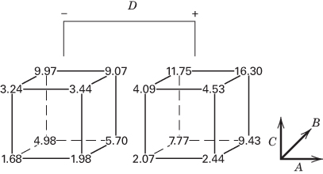

**图 6.19 例 6.3 钻井试验的数据**

该试验效应估计的正态概率图见图 6.20。根据这张图，因子 B、C、D 以及 $BC$、$BD$ 交互作用需要解释。图 6.21 是残差的正态概率图，图 6.22 是用含上述已识别因子的模型所作的残差对预测进给速率的图。正态性和方差齐性显然都有问题。处理这类问题常常使用**数据变换**（data transformation）。由于响应变量是一个速率，对数变换看起来是合理的候选。

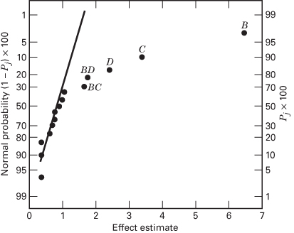

**图 6.20 例 6.3 效应的正态概率图**

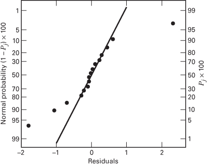

**图 6.21 例 6.3 残差的正态概率图**

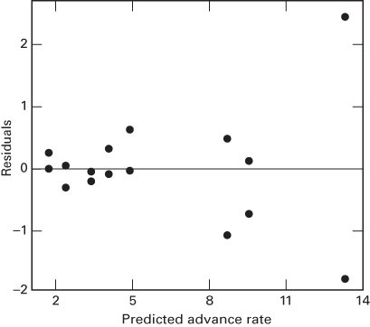

**图 6.22 例 6.3 残差对预测进给速率的图**

图 6.23 给出作变换 $y^{*} = \ln y$ 之后效应估计的正态概率图。注意现在似乎可以有简单得多的解释，因为只有因子 B、C、D 是活跃的。也就是说，把数据用正确的度量尺度表示，使其结构简化到了不再需要那两个交互作用的程度。

图 6.24 和图 6.25 分别给出对数尺度下含 B、C、D 的模型所作的残差正态概率图与残差对预测进给速率的图。这些图现在都是令人满意的。我们得出结论：对 $y^{*} = \ln y$ 的模型，只需要因子 B、C、D 就能得到充分的解释。该模型的方差分析汇总于表 6.16。模型平方和为

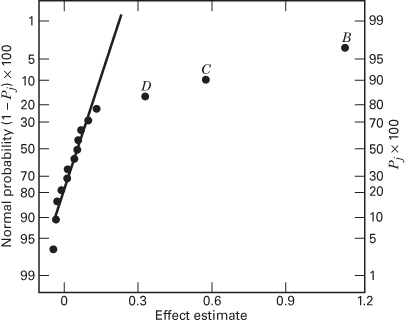

**图 6.23 例 6.3 取对数变换后效应的正态概率图**

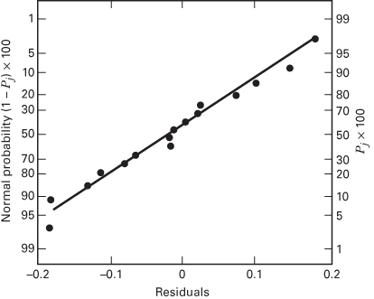

**图 6.24 例 6.3 取对数变换后残差的正态概率图**

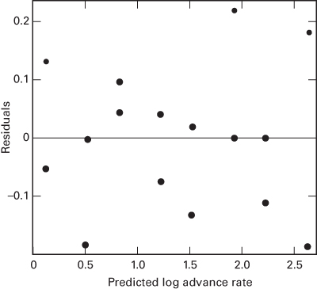

**图 6.25 例 6.3 取对数变换后残差对预测进给速率的图**

$$
\begin{array}{r l} SS_{\text{Model}} & = SS_{B} + SS_{C} + SS_{D} \\ & = 5.345 + 1.339 + 0.431 \\ & = 7.115 \end{array}
$$

且 $R^{2}=SS_{Model}/SS_{T}=7.115/7.288=0.98$，所以该模型解释了钻头进给速率变异中约 98% 的部分。

**表 6.16 例 6.3 取对数变换后的方差分析**

| 变异来源 | 平方和 | 自由度 | 均方 | $F_0$ | $P$ 值 |
| --- | --- | --- | --- | --- | --- |
| B（流量） | 5.345 | 1 | 5.345 | 381.79 | <0.0001 |
| C（转速） | 1.339 | 1 | 1.339 | 95.64 | <0.0001 |
| D（泥浆） | 0.431 | 1 | 0.431 | 30.79 | <0.0001 |
| 误差 | 0.173 | 12 | 0.014 | | |
| 总计 | 7.288 | 15 | | | |

## 例 6.4 无重复因子试验中的位置效应与散度效应

某制造过程中生产商用飞机的内饰侧壁板和窗板，为此运行了一个 $2^{4}$ 设计。板材在压机中成形，而在目前条件下，每压机批次中每块板的平均缺陷数太高（当前工艺平均值为每块板 5.5 个缺陷）。用 $2^{4}$ 设计的单次重复研究了四个因子，每次重复对应一个压机批次。这些因子是温度 (A)、夹持时间 (B)、树脂流量 (C) 和压机闭合时间 (D)。该试验的数据见图 6.26。

| 因子 | 低 (−) | 高 (+) |
| --- | --- | --- |
| A = 温度 (°F) | 295 | 325 |
| B = 夹持时间 (min) | 7 | 9 |
| C = 树脂流量 | 10 | 20 |
| D = 闭合时间 (s) | 15 | 30 |

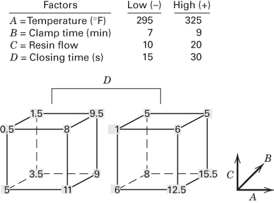

**图 6.26 例 6.4 板材过程试验的数据**

因子效应的正态概率图见图 6.27。显然，最大的两个效应是 $A = 5.75$ 和 $C = -4.25$。其他因子效应看起来都不大，而 A 和 C 解释了总变异中约 77% 的部分。因此我们得出结论：较低的温度 (A) 和较高的树脂流量 (C) 会减少板材缺陷的发生。

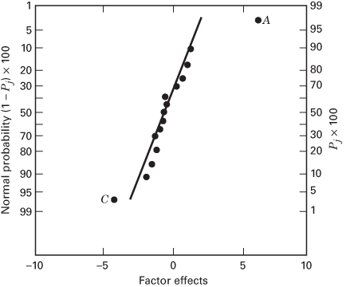

**图 6.27 例 6.4 板材过程试验因子效应的正态概率图**

仔细的残差分析是任何试验的一个重要方面。残差的正态概率图没有显示出异常，但当试验者把残差对因子 A 至 D 逐个作图时，残差对 B（夹持时间）的图呈现出图 6.28 所示的模式。这个因子就每块板的平均缺陷数而言并不重要，但它对过程变异的影响非常重要：较低的夹持时间会使每压机批次中每块板平均缺陷数的变异更小。

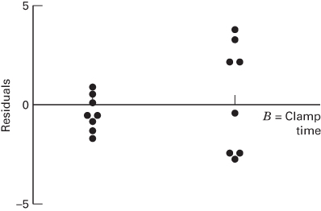

**图 6.28 例 6.4 残差对夹持时间的图**

夹持时间的散度效应从图 6.29 的立方体图上也非常明显，该图给出了由因子 A、B、C 定义的立方体每个点处每块板平均缺陷数以及缺陷数的极差。当 B 取高水平时（图 6.29 中立方体的后面），平均极差为 $\overline{R}_{B^{+}} = 4.75$；当 B 取低水平时，平均极差为 $\overline{R}_{B^{-}} = 1.25$。

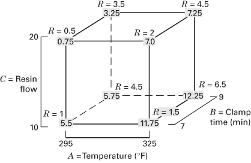

**图 6.29 例 6.4 温度、夹持时间与树脂流量的立方体图**

作为该试验的结果，工程师决定在低温、高树脂流量下运行该过程以减少平均缺陷数，在低夹持时间下运行以减小每块板缺陷数的变异，并采用低压机闭合时间（它对位置和散度都没有影响）。新的操作条件使过程平均值降到每块板不到一个缺陷。

$2^{k}$ 设计的残差对所研究的问题提供了大量信息。由于残差可以看作噪声或误差的观测值，它们常常能提供关于过程变异的洞见。我们可以系统地考察无重复 $2^{k}$ 设计的残差，以获得关于过程变异的信息。

考虑图 6.28 的残差图。B 取低水平时八个残差的标准差为 $S(B^{-}) = 0.83$，B 取高水平时八个残差的标准差为 $S(B^{+}) = 2.72$。统计量

$$
F_{B}^{*} = \ln \frac{S^{2}(B^{+})}{S^{2}(B^{-})} \tag{6.24}
$$

在两个方差 $\sigma^{2}(B^{+})$ 与 $\sigma^{2}(B^{-})$ 相等时近似服从正态分布。为说明计算，$F_{B}^{*}$ 的值为

$$
\begin{array}{r l} F_{B}^{*} & = \ln \frac{S^{2}(B^{+})}{S^{2}(B^{-})} \\ & = \ln \frac{(2.72)^{2}}{(0.83)^{2}} \\ & = 2.37 \end{array}
$$

表 6.17 给出例 6.4 板材过程试验 $2^{4}$ 设计的完整对照集合以及每次试验的残差。表中每一列的正负号个数相等，我们可以对每一列中每组符号分别计算残差的标准差，记为 $S(i^{+})$ 与 $S(i^{-})$，$i = 1,2,\ldots,15$。于是

$$
F_{i}^{*} = \ln \frac{S^{2}(i^{+})}{S^{2}(i^{-})} \quad i = 1, 2, \dots, 15 \tag{6.25}
$$

就是可用来评估试验中散度效应大小的统计量。如果因子 $i$ 取正号的那些试验的残差方差等于因子 $i$ 取负号的那些试验的残差方差，那么 $F_{i}^{*}$ 近似服从正态分布。$F_{i}^{*}$ 的值列在表 6.17 中每一列的下方[^1]。

**表 6.17 例 6.4 散度效应的计算**

| 试验 | A | B | AB | C | AC | BC | ABC | D | AD | BD | ABD | CD | ACD | BCD | ABCD | 残差 |
| --- | --- | --- | --- | --- | --- | --- | --- | --- | --- | --- | --- | --- | --- | --- | --- | --- |
| 1 | − | − | + | − | + | + | − | − | + | + | − | + | − | − | + | −0.94 |
| 2 | + | − | − | − | − | + | + | − | − | + | + | + | + | − | − | −0.69 |
| 3 | − | + | − | − | + | − | + | − | + | − | + | + | − | + | − | −2.44 |
| 4 | + | + | + | − | − | − | − | − | − | − | − | + | + | + | + | −2.69 |
| 5 | − | − | + | + | − | − | + | − | + | + | − | − | + | + | − | −1.19 |
| 6 | + | − | − | + | + | − | − | − | − | + | + | − | − | + | + | 0.56 |
| 7 | − | + | − | + | − | + | − | − | + | − | + | − | + | − | + | −0.19 |
| 8 | + | + | + | + | + | + | + | − | − | − | − | − | − | − | − | 2.06 |
| 9 | − | − | + | − | + | + | − | + | − | − | + | − | + | + | − | 0.06 |
| 10 | + | − | − | − | − | + | + | + | + | − | − | − | − | + | + | 0.81 |
| 11 | − | + | − | − | + | − | + | + | − | + | − | − | + | − | + | 2.06 |
| 12 | + | + | + | − | − | − | − | + | + | + | + | − | − | − | − | 3.81 |
| 13 | − | − | + | + | − | − | + | + | − | − | + | + | − | − | + | −0.69 |
| 14 | + | − | − | + | + | − | − | + | + | − | − | + | + | − | − | −1.44 |
| 15 | − | + | − | + | − | + | − | + | − | + | − | + | − | + | − | 3.31 |
| 16 | + | + | + | + | + | + | + | + | + | + | + | + | + | + | + | −2.44 |
| $S(i^{+})$ | 2.25 | 2.72 | 2.21 | 1.91 | 1.81 | 1.80 | 1.80 | 2.24 | 2.05 | 2.28 | 1.97 | 1.93 | 1.52 | 2.09 | 1.61 | |
| $S(i^{-})$ | 1.85 | 0.83 | 1.86 | 2.20 | 2.24 | 2.26 | 2.24 | 1.55 | 1.93 | 1.61 | 2.11 | 1.58 | 2.16 | 1.89 | 2.33 | |
| $F_{i}^{*}$ | 0.39 | 2.37 | 0.34 | −0.28 | −0.43 | −0.46 | −0.44 | 0.74 | 0.12 | 0.70 | −0.14 | 0.40 | −0.70 | 0.20 | −0.74 | |

图 6.30 是散度效应 $F_{i}^{*}$ 的正态概率图。显然，$B$ 就过程散度而言是一个重要因子。关于这一步骤的更多讨论，参见 Box 和 Meyer (1986) 以及 Myers、Montgomery 和 Anderson-Cook (2016)。此外，为了使模型残差能够正确传递散度效应的信息，位置模型必须设定正确。更详细的内容和一个例子见本章的补充材料。

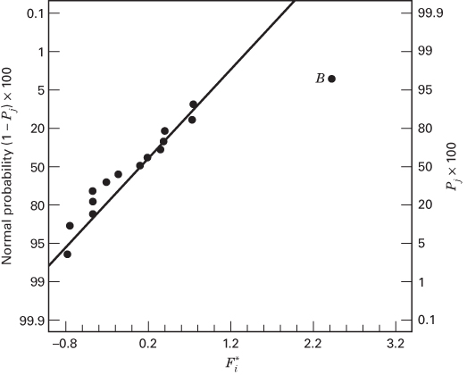

**图 6.30 例 6.4 散度效应 $F_{i}^{*}$ 的正态概率图**

## 例 6.5 响应上的重复测量

某半导体制造厂的一组工程师在一台立式氧化炉中运行了一个 $2^{4}$ 因子设计。炉中"叠放"四片晶圆，所关心的响应变量是晶圆上的氧化层厚度。四个设计因子是温度 (A)、时间 (B)、压力 (C) 和气体流量 (D)。试验的做法是：把四片晶圆装入炉中，把过程变量设定到试验设计所要求的试验条件，对晶圆进行加工，然后测量全部四片晶圆的氧化层厚度。表 6.18 给出设计以及所得的厚度测量值。表中标为"厚度"的四个列给出每片单独晶圆的氧化层厚度测量值，最后两列给出每次试验中四片晶圆厚度测量值的样本平均与样本方差。

对该试验的正确分析应当把各片晶圆的厚度测量值看作**重复测量**（duplicate measurements），而不是重复试验。如果它们真的是重复，那么每片晶圆都应在炉子的一次单独运行中单独加工。然而由于四片晶圆是一起加工的，它们同时承受了处理因子（即设计变量的水平），所以各片晶圆的厚度测量值中的变异比每片晶圆各作一次重复时所观察到的小得多。因此，厚度测量值的平均才是起初应当考虑的响应变量。

表 6.19 给出以平均氧化层厚度 $\bar{y}$ 为响应变量时该试验的效应估计。注意因子 A、B 以及 $AB$ 交互作用的效应很大，它们合计解释了平均氧化层厚度变异中近 90% 的部分。图 6.31 是这些效应的正态概率图。考察该图后，我们会得出因子 A、B、C 以及 $AB$、$AC$ 交互作用重要的结论。该模型的方差分析见表 6.20。

预测平均氧化层厚度的模型为

$$
\begin{array}{l} \hat{y} = 399.19 + 21.56 x_{1} + \\ \quad 9.06 x_{2} - 5.19 x_{3} + 8.44 x_{1} x_{2} - 5.31 x_{1} x_{3} \end{array}
$$

该模型的残差分析是令人满意的。

**表 6.18 氧化层厚度试验**

| 标准顺序 | 试验顺序 | A | B | C | D | 厚度 1 | 厚度 2 | 厚度 3 | 厚度 4 | $\overline{y}$ | $s^2$ |
| --- | --- | --- | --- | --- | --- | --- | --- | --- | --- | --- | --- |
| 1 | 10 | −1 | −1 | −1 | −1 | 378 | 376 | 379 | 379 | 378 | 2 |
| 2 | 7 | 1 | −1 | −1 | −1 | 415 | 416 | 416 | 417 | 416 | 0.67 |
| 3 | 3 | −1 | 1 | −1 | −1 | 380 | 379 | 382 | 383 | 381 | 3.33 |
| 4 | 9 | 1 | 1 | −1 | −1 | 450 | 446 | 449 | 447 | 448 | 3.33 |
| 5 | 6 | −1 | −1 | 1 | −1 | 375 | 371 | 373 | 369 | 372 | 6.67 |
| 6 | 2 | 1 | −1 | 1 | −1 | 391 | 390 | 388 | 391 | 390 | 2 |
| 7 | 5 | −1 | 1 | 1 | −1 | 384 | 385 | 386 | 385 | 385 | 0.67 |
| 8 | 4 | 1 | 1 | 1 | −1 | 426 | 433 | 430 | 431 | 430 | 8.67 |
| 9 | 12 | −1 | −1 | −1 | 1 | 381 | 381 | 375 | 383 | 380 | 12.00 |
| 10 | 16 | 1 | −1 | −1 | 1 | 416 | 420 | 412 | 412 | 415 | 14.67 |
| 11 | 8 | −1 | 1 | −1 | 1 | 371 | 372 | 371 | 370 | 371 | 0.67 |
| 12 | 1 | 1 | 1 | −1 | 1 | 445 | 448 | 443 | 448 | 446 | 6 |
| 13 | 14 | −1 | −1 | 1 | 1 | 377 | 377 | 379 | 379 | 378 | 1.33 |
| 14 | 15 | 1 | −1 | 1 | 1 | 391 | 391 | 386 | 400 | 392 | 34 |
| 15 | 11 | −1 | 1 | 1 | 1 | 375 | 376 | 376 | 377 | 376 | 0.67 |
| 16 | 13 | 1 | 1 | 1 | 1 | 430 | 430 | 428 | 428 | 429 | 1.33 |

**表 6.19 例 6.5 的效应估计，响应变量为平均氧化层厚度**

| 模型项 | 效应估计 | 平方和 | 百分比贡献 |
| --- | --- | --- | --- |
| A | 43.125 | 7439.06 | 67.9339 |
| B | 18.125 | 1314.06 | 12.0001 |
| C | −10.375 | 430.562 | 3.93192 |
| D | −1.625 | 10.5625 | 0.0964573 |
| AB | 16.875 | 1139.06 | 10.402 |
| AC | −10.625 | 451.563 | 4.12369 |
| AD | 1.125 | 5.0625 | 0.046231 |
| BC | 3.875 | 60.0625 | 0.548494 |
| BD | −3.875 | 60.0625 | 0.548494 |
| CD | 1.125 | 5.0625 | 0.046231 |
| ABC | −0.375 | 0.5625 | 0.00513678 |
| ABD | 2.875 | 33.0625 | 0.301929 |
| ACD | −0.125 | 0.0625 | 0.000570753 |
| BCD | −0.625 | 1.5625 | 0.0142688 |
| ABCD | 0.125 | 0.0625 | 0.000570753 |

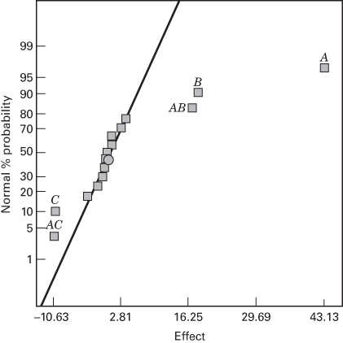

**图 6.31 例 6.5 平均氧化层厚度响应效应的正态概率图**

**表 6.20 例 6.5 平均氧化层厚度响应的方差分析（来自 Design-Expert）**

| Source | Sum of Squares | DF | Mean Square | F Value | Prob > F |
| --- | --- | --- | --- | --- | --- |
| Model | 10774.31 | 5 | 2154.86 | 122.35 | <0.000 |
| A | 7439.06 | 1 | 7439.06 | 422.37 | <0.000 |
| B | 1314.06 | 1 | 1314.06 | 74.61 | <0.000 |
| C | 430.56 | 1 | 430.56 | 24.45 | 0.0006 |
| AB | 1139.06 | 1 | 1139.06 | 64.67 | <0.000 |
| AC | 451.46 | 1 | 451.56 | 25.64 | 0.0005 |
| Residual | 176.12 | 10 | 17.61 | | |
| Cor Total | 10950.44 | 15 | | | |

| Std. Dev. | 4.20 | R-Squared | 0.9839 |
| --- | --- | --- | --- |
| Mean | 399.19 | Adj R-Squared | 0.9759 |
| C.V. | 1.05 | Pred R-Squared | 0.9588 |
| PRESS | 450.88 | Adeq Precision | 27.967 |

| Factor | Coefficient Estimate | DF | Standard Error | 95% CI Low | 95% CI High |
| --- | --- | --- | --- | --- | --- |
| Intercept | 399.19 | 1 | 1.05 | 396.85 | 401.53 |
| A-Time | 21.56 | 1 | 1.05 | 19.22 | 23.90 |
| B-Temp | 9.06 | 1 | 1.05 | 6.72 | 11.40 |
| C-Pressure | −5.19 | 1 | 1.05 | −7.53 | −2.85 |
| AB | 8.44 | 1 | 1.05 | 6.10 | 10.78 |
| AC | −5.31 | 1 | 1.05 | −7.65 | −2.97 |

试验者感兴趣的是得到 400 Å 的平均氧化层厚度，而产品规范要求厚度必须落在 390 Å 与 410 Å 之间。

图 6.32 给出平均厚度的两张等高线图，一张是因子 C（即 $x_{3}$，压力）取低水平（即 $x_{3} = -1$），另一张是 C（即 $x_{3}$）取高水平（即 $x_{3} = +1$）。考察这两张等高线图可以明显看出，时间和温度（因子 A 和 B）的许多组合都能产生可接受的结果。不过，如果压力保持在低水平，操作"窗口"会向时间轴的左端（即较小的一端）移动，说明为达到期望的氧化层厚度需要更短的周期时间。

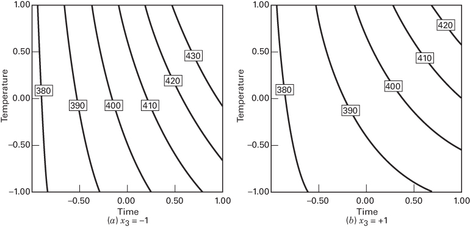

**图 6.32 压力（$x_{3}$）保持恒定时平均氧化层厚度的等高线图**

**表 6.21 单晶圆氧化层厚度响应的方差分析（来自 Design-Expert）**

| Source | Sum of Squares | DF | Mean Square | F Value | Prob > F |
| --- | --- | --- | --- | --- | --- |
| Model | 43801.75 | 15 | 2920.12 | 476.75 | <0.0001 |
| A | 29756.25 | 1 | 29756.25 | 4858.16 | <0.0001 |
| B | 5256.25 | 1 | 5256.25 | 858.16 | <0.0001 |
| C | 1722.25 | 1 | 1722.25 | 281.18 | <0.0001 |
| D | 42.25 | 1 | 42.25 | 6.90 | 0.0115 |
| AB | 4556.25 | 1 | 4556.25 | 743.88 | <0.0001 |
| AC | 1806.25 | 1 | 1806.25 | 294.90 | <0.0001 |
| AD | 20.25 | 1 | 20.25 | 3.31 | 0.0753 |
| BC | 240.25 | 1 | 240.25 | 39.22 | <0.0001 |
| BD | 240.25 | 1 | 240.25 | 39.22 | <0.0001 |
| CD | 20.25 | 1 | 20.25 | 3.31 | 0.0753 |
| ABD | 132.25 | 1 | 132.25 | 21.59 | <0.0001 |
| ABC | 2.25 | 1 | 2.25 | 0.37 | 0.5473 |
| ACD | 0.25 | 1 | 0.25 | 0.041 | 0.8407 |
| BCD | 6.25 | 1 | 6.25 | 1.02 | 0.3175 |
| ABCD | 0.25 | 1 | 0.25 | 0.041 | 0.8407 |
| Residual | 294.00 | 48 | 6.12 | | |
| Lack of Fit | 0.000 | 0 | | | |
| Pure Error | 294.00 | 48 | 6.13 | | |
| Cor Total | 44095.75 | 63 | | | |

观察一下如果我们错误地把单片晶圆的氧化层厚度测量值当作重复试验会得到什么结果，是很有意思的。表 6.21 给出把该试验当作有重复的 $2^{4}$ 因子设计时的全模型方差分析。注意这一分析中有许多显著因子，说明模型比我们用平均氧化层厚度作响应时所找到的模型复杂得多。原因是表 6.21 中误差方差的估计太小（$\hat{\sigma}^{2}=6.12$）。表 6.21 中的残差均方反映的是同一次试验内各晶圆之间的变异与各次试验之间变异的混合。由表 6.20 得到的误差估计要大得多，$\hat{\sigma}^{2}=17.61$，它主要度量的是试验之间的变异。在判断那些逐次试验之间发生变化的过程变量的显著性时，这才是应当使用的最佳误差估计。

一个自然会问的问题是：像表 6.21 中那种错误分析那样把过多的因子判定为重要，会带来什么危害？答案是：试图操纵或优化那些不重要的因子会浪费资源，而且会给其他感兴趣的响应带来不必要的变异。

当响应有重复测量时，这些观测几乎总是包含关于过程变异某一方面的有用信息。例如，如果重复测量是同一量具对同一试验单元的多次测量，那么重复测量就能提供关于量具能力的信息。如果重复测量是在试验单元的不同位置进行的，它们可能提供关于响应变量在该单元上均匀性的信息。在我们的例子中，由于我们对一起加工过的四个试验单元各有一个观测，我们就掌握了关于过程中**试验内变异**（within-run variability）的一些信息。这些信息就包含在每次试验中四片晶圆氧化层厚度测量值的方差里。判断是否有某个过程变量影响试验内变异，会很有意思。

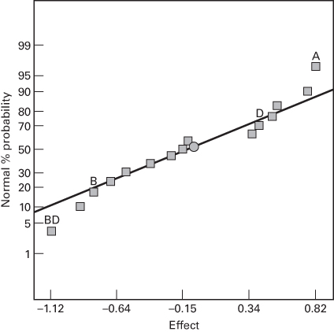

**图 6.33 例 6.5 以 $\ln(s^{2})$ 为响应时效应的正态概率图**

图 6.33 是以 $\ln(s^{2})$ 为响应所得效应估计的正态概率图。回顾第 3 章我们曾指出，对数变换一般适合对变异建模。这里没有任何很强的单个效应，但因子 A 和 $BD$ 交互作用最大。如果我们再把 B 和 D 的主效应也算进来，以得到一个层次模型，那么 $\ln(s^{2})$ 的模型为

$$
\widehat{\ln(s^{2})} = 1.08 + 0.41 x_{1} - 0.40 x_{2} + 0.20 x_{4} - 0.56 x_{2} x_{4}
$$

该模型解释了 $\ln(s^{2})$ 响应中略少于一半的变异。就经验模型而言这当然不算出色，但要想得到特别好的方差模型往往很困难。

图 6.34 是预测方差（不是预测方差的对数）的等高线图，其中压力 $x_{3}$ 取低水平（回顾前面说过这能使周期时间最短），气体流量 $x_{4}$ 取高水平。这一气体流量取值给出等高线图区域内预测方差的最低值。

这里的试验者感兴趣的是选择设计变量的取值，使平均氧化层厚度落在过程规范之内并尽可能接近 400 Å，同时使试验内变异较小，比如 $s^{2} \leq 2$。找出合适条件集合的一种可行办法是把图 6.32 与图 6.34 的等高线图叠合起来。叠合图见图 6.35，其中平均氧化层厚度的规范与约束 $s^{2} \leq 2$ 都画成等高线。图中压力保持在低水平，气体流量保持在高水平。图上左中部附近的空白区域给出了变量时间和温度的一个可行域。

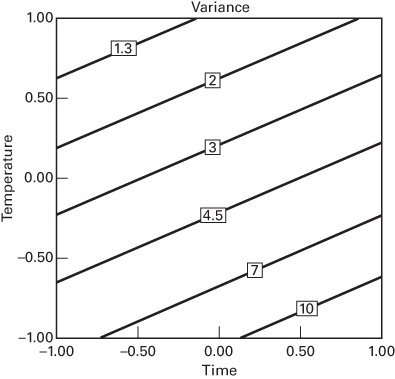

**图 6.34 压力取低水平、气体流量取高水平时 $s^{2}$（试验内变异）的等高线图**

这是用等高线图同时研究两个响应的一个简单例子。我们将在第 11 章更详细地讨论这个问题。

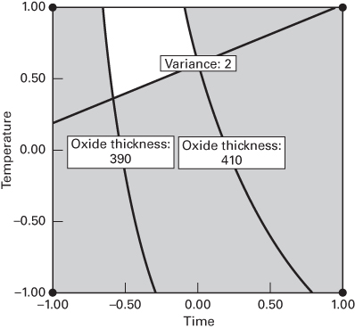

**图 6.35 压力取低水平、气体流量取高水平时平均氧化层厚度与 $s^{2}$ 响应的叠合图**

## 例 6.6 信用卡营销

《国际营销研究杂志》上的一篇文章（"Experimental Design on the Front Lines of Marketing: Testing New Ideas to Increase Direct Mail Sales," 2006, Vol. 23, pp. 309–319）描述了一项试验，用来检验某金融服务公司信用卡部门为增加直邮销售而提出的新构想。他们希望提高其信用卡优惠的响应率。他们凭经验知道利率是吸引潜在客户的一个重要因素，因此决定集中考察涉及利率与费用的因子。他们想检验介绍利率和长期利率的变化，以及增加开户费和降低年费的效果。试验中检验的因子如下：

| 因子 | (−) 对照 | (+) 新构想 |
| --- | --- | --- |
| A：年费 | 现行 | 降低 |
| B：开户费 | 无 | 有 |
| C：介绍利率 | 现行 | 降低 |
| D：长期利率 | 低 | 高 |

营销团队用表 6.22 所示的 $2^{4}$ 因子试验矩阵的 A 至 D 列构造了 16 个邮件方案。11 个交互作用（乘积）列中的 +/− 符号组合仅用来便于对结果作统计分析。16 个试验组合各寄给 7500 名客户，共有 2837 名客户对该优惠作出了正面响应。

表 6.23 是筛选分析的 JMP 输出。用带有模拟 $P$ 值的 Lenth 方法来识别显著因子。四个主效应都显著，另有一个交互作用（$AB$，即年费 × 开户费）显著。预测刻画器给出使响应率最大的四个因子设置。较低的年费、不收开户费、较低的长期利率，以及介绍利率的任一取值，产生最好的响应率 3.39%。最优条件出现在某个实际试验组合处，因为四个设计因子都被当作定性因子处理。对于连续因子，最优条件通常不在某次试验上。

**表 6.22 例 6.6 信用卡营销试验所用的 $2^{4}$ 因子设计**

| 试验单元 | 年费 | 开户费 | 介绍利率 | 长期利率 | AB | AC | AD | BC | BD | CD | ABC | ABD | ACD | BCD | ABCD | 订单 | 响应率 |
| --- | --- | --- | --- | --- | --- | --- | --- | --- | --- | --- | --- | --- | --- | --- | --- | --- | --- |
| 1 | − | − | − | − | + | + | + | + | + | + | − | − | − | − | + | 184 | 2.45% |
| 2 | + | − | − | − | − | − | − | + | + | + | + | + | + | − | − | 252 | 3.36% |
| 3 | − | + | − | − | − | + | + | − | − | + | + | + | − | + | − | 162 | 2.16% |
| 4 | + | + | − | − | + | − | − | − | − | + | − | − | + | + | + | 172 | 2.29% |
| 5 | − | − | + | − | + | − | + | − | + | − | + | − | + | + | − | 187 | 2.49% |
| 6 | + | − | + | − | − | + | − | − | + | − | − | + | − | + | + | 254 | 3.39% |
| 7 | − | + | + | − | − | − | + | + | − | − | − | + | + | − | + | 174 | 2.32% |
| 8 | + | + | + | − | + | + | − | + | − | − | + | − | − | − | − | 183 | 2.44% |
| 9 | − | − | − | + | + | + | − | + | − | − | − | + | + | + | − | 138 | 1.84% |
| 10 | + | − | − | + | − | − | + | + | − | − | + | − | − | + | + | 168 | 2.24% |
| 11 | − | + | − | + | − | + | − | − | + | − | + | − | + | − | + | 127 | 1.69% |
| 12 | + | + | − | + | + | − | + | − | + | − | − | + | − | − | − | 140 | 1.87% |
| 13 | − | − | + | + | + | − | − | − | − | + | + | + | − | − | + | 172 | 2.29% |
| 14 | + | − | + | + | − | + | + | − | − | + | − | − | + | − | − | 219 | 2.92% |
| 15 | − | + | + | + | − | − | − | + | + | + | − | − | − | + | − | 153 | 2.04% |
| 16 | + | + | + | + | + | + | + | + | + | + | + | + | + | + | + | 152 | 2.03% |

**表 6.23 例 6.6 的 JMP 输出**

| RSquare | 1 |
| --- | --- |
| RSquare Adj | . |
| Root Mean Square Error | . |
| Mean of Response | 2.36375 |
| Observations (or Sum Wgts) | 16 |

Sorted Parameter Estimates

| Term | Estimate | Relative Std Error | Pseudo t-Ratio |
| --- | --- | --- | --- |
| Account Opening Fee[No] | 0.25875 | 0.25 | 3.63 |
| Long-term Interest Rate[Low] | 0.24875 | 0.25 | 3.49 |
| Annual Fee[Current] | −0.20375 | 0.25 | −2.86 |
| Annual Fee[Current]*Account Opening Fee[No] | −0.15125 | 0.25 | −2.12 |
| initial Interest Rate[Current] | −0.12625 | 0.25 | −1.77 |
| initial Interest Rate[Current]*Long-term Interest Rate[Low] | 0.07875 | 0.25 | 1.11 |
| Annual Fee[Current]*Long-term Interest Rate[Low] | −0.05375 | 0.25 | −0.75 |
| Account Opening Fee[No]*initial Interest Rate[Current]*Long-term Interest Rate[Low] | 0.05375 | 0.25 | 0.75 |
| Account Opening Fee[No]*Long-term Interest Rate[Low] | 0.05125 | 0.25 | 0.72 |
| Annual Fee[Current]*Account Opening Fee[No]*Long-term Interest Rate[Low] | −0.04375 | 0.25 | −0.61 |
| Annual Fee[Current]*Account Opening Fee[No]*initial Interest Rate[Current] | 0.02625 | 0.25 | 0.37 |
| Annual Fee[Current]*Account Opening Fee[No]*initial Interest Rate[Current]*Long-term Interest Rate[Low] | −0.02625 | 0.25 | −0.37 |
| Account Opening Fee[No]*initial Interest Rate[Current] | −0.02375 | 0.25 | −0.33 |
| Annual Fee[Current]*initial Interest Rate[Current]*Long-term Interest Rate[Low] | −0.00375 | 0.25 | −0.05 |
| Annual Fee[Current]*initial Interest Rate[Current] | 0.00125 | 0.25 | 0.02 |

Prediction Profiler

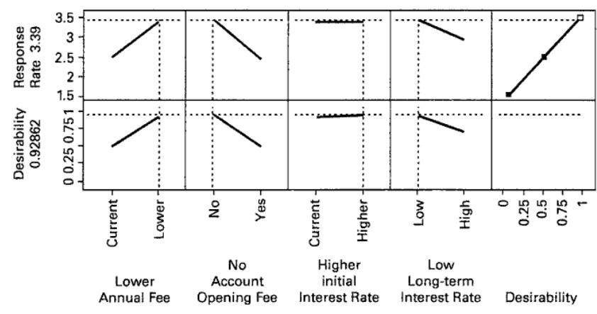

[^1]: 原文此处写作"表 6.15"，但 $F_{i}^{*}$ 的值是列在表 6.17（例 6.4 散度效应的计算）中每一列下方的，故按表 6.17 译出。——译者注
