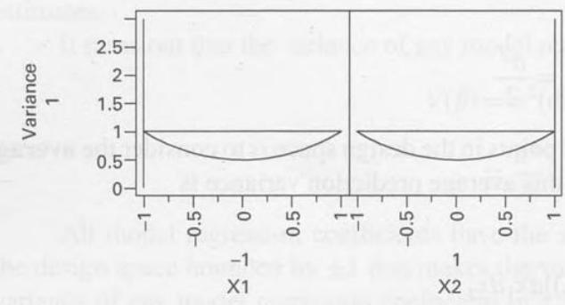
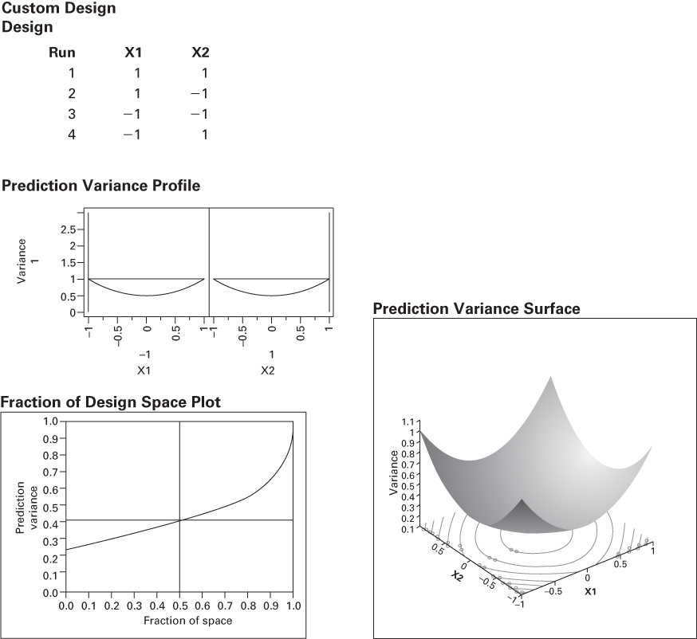

# 6.7 $2^{k}$ 设计是最优设计

两水平因子设计有许多有趣而有用的性质。本节简要介绍其中一些性质。我们在前面几节中已经提到，$2^{k}$ 设计中的模型回归系数和效应估计都是最小二乘估计。这一点在本章的补充材料中有讨论，第 10 章还有更详细的介绍，但在这里给出一个证明是有益的。

考虑一个最简单的例子：一次重复的 $2^{2}$ 设计。这是一个四次试验的设计，处理组合为 (1)、$a$、$b$ 和 $ab$。设计的几何表示见图 6.1。我们对这一设计的数据所拟合的模型是

$$
y = \beta_{0} + \beta_{1} x_{1} + \beta_{2} x_{2} + \beta_{12} x_{1} x_{2} + \epsilon
$$

其中 $x_{1}$ 与 $x_{2}$ 是两个因子在 $\pm1$ 尺度上的主效应，$x_{1}x_{2}$ 是两因子交互作用。设计中的四次试验可按这一模型逐个写出来，如下：

$$
\begin{array}{r l} & {(1) = \beta_{0} + \beta_{1} (- 1) + \beta_{2} (- 1) + \beta_{12} (- 1) (- 1) + \epsilon_{1}} \\ & {\quad a = \beta_{0} + \beta_{1} (1) + \beta_{2} (- 1) + \beta_{12} (1) (- 1) + \epsilon_{2}} \\ & {\quad b = \beta_{0} + \beta_{1} (- 1) + \beta_{2} (1) + \beta_{12} (- 1) (1) + \epsilon_{3}} \\ & {a b = \beta_{0} + \beta_{1} (1) + \beta_{2} (1) + \beta_{12} (1) (1) + \epsilon_{4}} \end{array}
$$

把这四个式子写成矩阵形式要方便得多：

$$
\mathbf{y} = \mathbf{X} \boldsymbol{\beta} + \epsilon, \text{其中} \mathbf{y} = \left[ \begin{array}{c} (1) \\ a \\ b \\ a b \end{array} \right], \mathbf{X} = \left[ \begin{array}{c c c c} 1 & - 1 & - 1 & 1 \\ 1 & 1 & - 1 & - 1 \\ 1 & - 1 & 1 & - 1 \\ 1 & 1 & 1 & 1 \end{array} \right], \boldsymbol{\beta} = \left[ \begin{array}{c} \beta_{0} \\ \beta_{1} \\ \beta_{2} \\ \beta_{12} \end{array} \right], \text{且} \epsilon = \left[ \begin{array}{c} \epsilon_{1} \\ \epsilon_{2} \\ \epsilon_{3} \\ \epsilon_{4} \end{array} \right]
$$

模型参数的最小二乘估计是使模型误差 $\epsilon_{i}, i = 1,2,3,4$ 的平方和达到最小的那些 $\beta$ 值。最小二乘估计为

$$
\hat{\boldsymbol{\beta}} = (\mathbf{X}^{\prime} \mathbf{X})^{- 1} \mathbf{X}^{\prime} \mathbf{y} \tag{6.26}
$$

其中撇号 (') 表示转置，$(\mathbf{X}'\mathbf{X})^{-1}$ 是 $\mathbf{X}'\mathbf{X}$ 的逆。我们将在第 10 章证明这一结果。对 $2^{2}$ 设计，量 $\mathbf{X}'\mathbf{X}$ 与 $\mathbf{X}'\mathbf{y}$ 为

$$
\mathbf{X}^{\prime} \mathbf{X} = \left[ \begin{array}{r r r r} 1 & 1 & 1 & 1 \\ - 1 & 1 & - 1 & 1 \\ - 1 & - 1 & 1 & 1 \\ 1 & - 1 & - 1 & 1 \end{array} \right] \left[ \begin{array}{r r r r} 1 & - 1 & - 1 & 1 \\ 1 & 1 & - 1 & - 1 \\ 1 & - 1 & 1 & - 1 \\ 1 & 1 & 1 & 1 \end{array} \right] = \left[ \begin{array}{r r r r} 4 & 0 & 0 & 0 \\ 0 & 4 & 0 & 0 \\ 0 & 0 & 4 & 0 \\ 0 & 0 & 0 & 4 \end{array} \right]
$$

以及

$$
\mathbf{X}^{\prime} \mathbf{y} = \left[ \begin{array}{r r r r} 1 & 1 & 1 & 1 \\ - 1 & 1 & - 1 & 1 \\ - 1 & - 1 & 1 & 1 \\ 1 & - 1 & - 1 & 1 \end{array} \right] \left[ \begin{array}{c} (1) \\ a \\ b \\ a b \end{array} \right] = \left[ \begin{array}{c} (1) + a + b + a b \\ - (1) + a - b + a b \\ - (1) - a + b + a b \\ (1) - a - b + a b \end{array} \right]
$$

$\mathbf{X}'\mathbf{X}$ 矩阵是对角阵，因为 $2^{2}$ 设计是正交的。最小二乘估计如下：

$$
\begin{array}{r} \hat{\boldsymbol{\beta}} = (\mathbf{X}^{\prime} \mathbf{X})^{- 1} \mathbf{X}^{\prime} \mathbf{y} \\ = \left[ \begin{array}{l l l l} 4 & 0 & 0 & 0 \\ 0 & 4 & 0 & 0 \\ 0 & 0 & 4 & 0 \\ 0 & 0 & 0 & 4 \end{array} \right]^{- 1} \left[ \begin{array}{c} (1) + a + b + a b \\ - (1) + a - b + a b \\ - (1) - a + b + a b \\ (1) - a - b + a b \end{array} \right] \end{array}
$$

$$
= \left[ \begin{array}{l} \frac{(1) + a + b + a b}{4} \\ \frac{- (1) + a - b + a b}{4} \\ \frac{- (1) - a + b + a b}{4} \\ \frac{(1) - a - b + a b}{4} \end{array} \right]
$$

模型回归系数的最小二乘估计恰好等于通常效应估计的一半。

结果表明，任一模型回归系数的方差都容易求出：

$$
\begin{array}{r l} V(\hat{\beta}) & = \sigma^{2} \left((\mathbf{X}^{\prime} \mathbf{X})^{- 1} \text{ 的对角元素}\right) \\ & = \frac{\sigma^{2}}{4} \end{array} \tag{6.27}
$$

所有模型回归系数的方差都相同。此外，在 $\pm1$ 所界定的设计空间上，不存在其他四次试验的设计能使模型回归系数的方差更小。一般地，在每点重复 $n$ 次的 $2^{k}$ 设计中，任一模型回归系数的方差为 $V(\hat{\beta}) = \sigma^{2}/(n2^{k}) = \sigma^{2}/N$，其中 $N$ 是设计中的总试验次数。这是回归系数所能达到的最小方差。

对 $2^{2}$ 设计，$\mathbf{X}'\mathbf{X}$ 矩阵的行列式为

$$
|(\mathbf{X}^{\prime} \mathbf{X})| = 256
$$

这是四次试验的设计在 $\pm1$ 所界定的设计空间上所能达到的行列式最大值。结果表明，包含所有模型回归系数的联合置信域的**体积**与 $\mathbf{X}'\mathbf{X}$ 行列式的平方根成反比。因此，为使该联合置信域尽可能小，我们希望选择使 $\mathbf{X}'\mathbf{X}$ 的行列式尽可能大的设计。选择 $2^{2}$ 设计正好做到了这一点。

一般地，使模型回归系数方差最小的设计称为 **D 最优设计**（D-optimal design）。之所以用 D 这个字眼，是因为这类设计是通过选择设计中的试验来使 $\mathbf{X}'\mathbf{X}$ 的行列式（determinant）最大而得到的。$2^{k}$ 设计是拟合一阶模型或含交互作用的一阶模型的 D 最优设计。许多计算机软件包（如 JMP、Design-Expert 和 Minitab）都有寻找 D 最优设计的算法。这些算法在为许多实际情形构造试验设计时非常有用，我们将在后面几章中用到它们。

现在考虑 $2^{2}$ 设计中预测响应的方差

$$
V[\hat{y}(x_{1} x_{2})] = V(\hat{\beta}_{0} + \hat{\beta}_{1} x_{1} + \hat{\beta}_{2} x_{2} + \hat{\beta}_{12} x_{1} x_{2})
$$

预测响应的方差是被预测点在设计空间中的位置（$x_{1}$ 与 $x_{2}$）以及模型回归系数方差的函数。由于 $2^{2}$ 设计是正交的，各回归系数的估计相互独立，且方差均为 $\sigma^{2}/4$，所以

$$
\begin{array}{r} V[\hat{y}(x_{1}, x_{2})] = V(\hat{\beta_{0}} + \hat{\beta_{1}} x_{1} + \hat{\beta_{2}} x_{2} + \hat{\beta_{12}} x_{1} x_{2}) \\ = \frac{\sigma^{2}}{4} (1 + x_{1}^{2} + x_{2}^{2} + x_{1}^{2} x_{2}^{2}) \end{array}
$$

最大预测方差出现在 $x_{1}=x_{2}=\pm1$ 处，等于 $\sigma^{2}$。要判断这有多好，我们需要知道我们所能达到的最优预测方差值。结果表明，在整个设计空间上最大预测方差的最小可能值为 $p\sigma^{2}/N$，其中 $p$ 是模型参数个数，$N$ 是设计中的试验次数。$2^{2}$ 设计的试验次数 $N = 4$，模型有 $p = 4$ 个参数，所以我们对这一试验数据所拟合的模型使设计区域上的最大预测方差达到最小。具有这一性质的设计称为 **G 最优设计**（G-optimal design）。一般地，$2^{k}$ 设计是拟合一阶模型或含交互作用的一阶模型的 G 最优设计。

我们可以在设计空间中任何感兴趣的点处计算预测方差。例如，在设计中心处 $x_{1} = x_{2} = 0$，预测方差为

$$
V[\hat{y}(x_{1} = 0, x_{2} = 0)] = \frac{\sigma^{2}}{4}
$$

当 $x_{1} = 1$、$x_{2} = 0$ 时，预测方差为

$$
V[\hat{y}(x_{1} = 1, x_{2} = 0)] = \frac{\sigma^{2}}{2}
$$

除了在设计空间的大量点上计算预测方差外，另一种做法是考虑设计空间上的**平均预测方差**。计算这一平均预测方差的一种方式为

$$
I = \frac{1}{A} \int_{- 1}^{1} \int_{- 1}^{1} V[\hat{y}(x_{1}, x_{2})] d x_{1} d x_{2}
$$

其中 $A$ 是设计空间的面积（一般情形下是体积）。为计算这个平均，我们把方差函数在设计空间上积分再除以该区域的面积。

有时把 $I$ 称为**积分方差准则**（integrated variance criterion）。对 $2^{2}$ 设计，设计区域的面积 $A = 4$，且

$$
\begin{array}{l} I = \frac{1}{A} \int_{- 1}^{1} \int_{- 1}^{1} V[\hat{y}(x_{1}, x_{2})] d x_{1} d x_{2} \\ = \frac{1}{4} \int_{- 1}^{1} \int_{- 1}^{1} \sigma^{2} \frac{1}{4} (1 + x_{1}^{2} + x_{2}^{2} + x_{1}^{2} x_{2}^{2}) d x_{1} d x_{2} \\ = \frac{4 \sigma^{2}}{9} \end{array}
$$

结果表明，这是用四次试验的设计在该设计空间上拟合含交互作用的一阶模型所能得到的平均预测方差的最小可能值。具有这一性质的设计称为 **I 最优设计**（I-optimal design）。一般地，$2^{k}$ 设计是拟合一阶模型或含交互作用的一阶模型的 I 最优设计。JMP 软件可以构造 I 最优设计。当试验目标是预测响应时，这对构造设计非常有用。

还可以把设计空间上的预测方差用图形显示出来。图 6.36 是 JMP 的输出，例示 $2^{2}$ 设计预测方差的三种可能展示。第一张图是预测方差刻画器，它把**未标准化的预测方差**（unscaled prediction variance）

$$
U P V = \frac{V[\hat{y}(x_{1}, x_{2})]}{\sigma^{2}}
$$

对每个设计因子的水平作图。图上的"十字准线"可以调节，从而可以在变量 $x_{1}$ 与 $x_{2}$ 的任意期望组合处显示未标准化的预测方差。这里所选的值是 $x_{1} = -1$

Custom Design

| Run | X1 | X2 |
| --- | --- | --- |
| 1 | 1 | 1 |
| 2 | 1 | −1 |
| 3 | −1 | −1 |
| 4 | −1 | 1 |

Prediction Variance Profile

Prediction Variance Surface

Fraction of Design Space Plot

**图 6.36 $2^{2}$ 设计预测方差的 JMP 输出**

和 $x_{2}=+1$，此时未标准化的预测方差为

$$
\begin{array}{r l} U P V & = \frac{V[\hat{y}(x_{1}, x_{2})]}{\sigma^{2}} \\ & = \frac{\frac{\sigma^{2}}{4} (1 + x_{1}^{2} + x_{2}^{2} + x_{1}^{2} x_{2}^{2})}{\sigma^{2}} \\ & = \frac{\frac{\sigma^{2}}{4} (4)}{\sigma^{2}} \\ & = 1 \end{array}
$$

第二张图是**设计空间比例**（fraction of design space，FDS）图，它在纵轴上给出未标准化的预测方差，在横轴上给出设计空间的比例。这张图上同样有可调节的十字准线，图中显示在横轴设计空间比例的 50% 处。十字准线表明，在一段覆盖设计区域 50% 的区域上，未标准化的预测方差至多为 $0.425\sigma^{2}$（记住未标准化的预测方差已除以 $\sigma^{2}$，这就是纵轴上的点为 0.425 的原因）。因此，FDS 图简单地展示了预测方差在设计区域中是如何分布的。理想的 FDS 图应当是一条未标准化预测方差取小值的水平线。FDS 图是比较各设计潜在预测性能的理想方式。

JMP 输出中最后一种展示是未标准化预测方差的曲面图。$2^{2}$ 设计的等预测方差等高线是圆；也就是说，设计空间中与设计中心距离相同的所有点都有相同的预测方差。

软件中的最优设计工具可以帮助试验者在试验的要求使得没有现成标准设计可用时构造设计。例如，考虑这样一种情形：试验者关心三个连续因子，每个取两个水平，并希望确保所有主效应和两因子交互作用都能估计出来。同时还希望有重复，以便进行正规的统计检验。合乎逻辑的设计选择似乎是 $2^{3}$ 因子设计重复两次，需要 16 次试验。然而试验预算只允许 12 次试验。这一样本量下没有现成的标准设计，所以在这种情形下最优设计是一个合理的替代方案。

下面显示的左侧是用 JMP 的最优设计工具构造的 12 次试验的 D 最优设计。右侧是一些估计效率信息。我们首先注意到的是模型回归系数的相对标准误都相等，但并不等于 $1/\sqrt{12}=0.289$（12 次试验的正交设计会是这个值）——相对标准误是模型参数标准误中去掉未知常数 $\sigma$ 后的部分。这是因为 D 最优设计不是正交的。各主效应彼此正交，但与所有两因子交互作用都不正交。每个主效应都与不含该因子的那个两因子交互作用相关，相关系数为 0.33。不过所有模型系数都有相同的相对标准误，所以这个 D 最优设计是**等方差设计**（equi-variance design），即所有参数都以相同精度估计。该设计并非严格 D 最优，其 D 效率为 94.28%。这个设计之所以不是 D 最优，是因为它不是正交设计，而本问题情形下没有 12 次试验的正交设计可用。每个模型参数（截距除外）置信区间的长度，相对于若能使用 12 次试验正交设计时的长度增加了 6.1%。该设计在 $\alpha=0.10$ 下的功效为 84.6%。

| 试验 | X1 | X2 | X3 |
| --- | --- | --- | --- |
| 1 | 1 | 1 | −1 |
| 2 | 1 | 1 | 1 |
| 3 | 1 | 1 | −1 |
| 4 | −1 | 1 | 1 |
| 5 | 1 | −1 | 1 |
| 6 | 1 | −1 | −1 |
| 7 | −1 | 1 | −1 |
| 8 | −1 | −1 | 1 |
| 9 | −1 | −1 | −1 |
| 10 | −1 | 1 | 1 |
| 11 | 1 | −1 | 1 |
| 12 | −1 | −1 | −1 |

Estimation Efficiency

| Term | Fractional Increase in CI Length | Relative Std Error of Estimate |
| --- | --- | --- |
| Intercept | 0.061 | 0.306 |
| X1 | 0.061 | 0.306 |
| X2 | 0.061 | 0.306 |
| X3 | 0.061 | 0.306 |
| X1*X2 | 0.061 | 0.306 |
| X1*X3 | 0.061 | 0.306 |
| X2*X3 | 0.061 | 0.306 |
| X1*X2*X3 | 0.061 | 0.306 |
