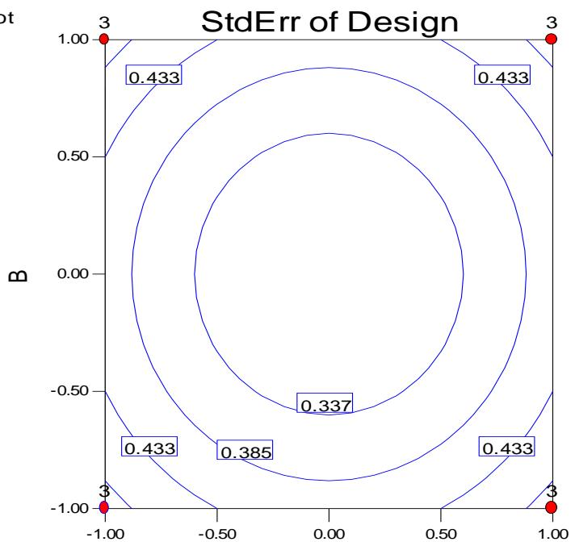
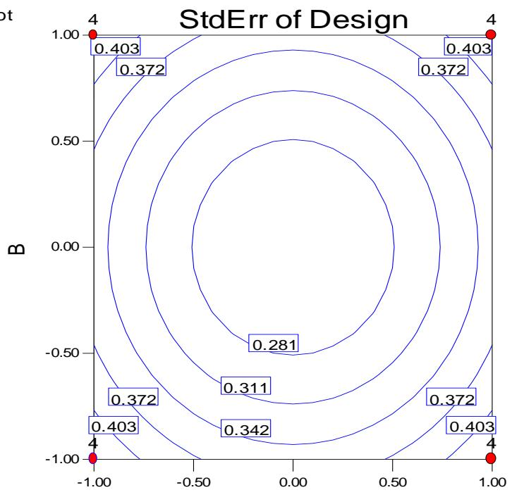
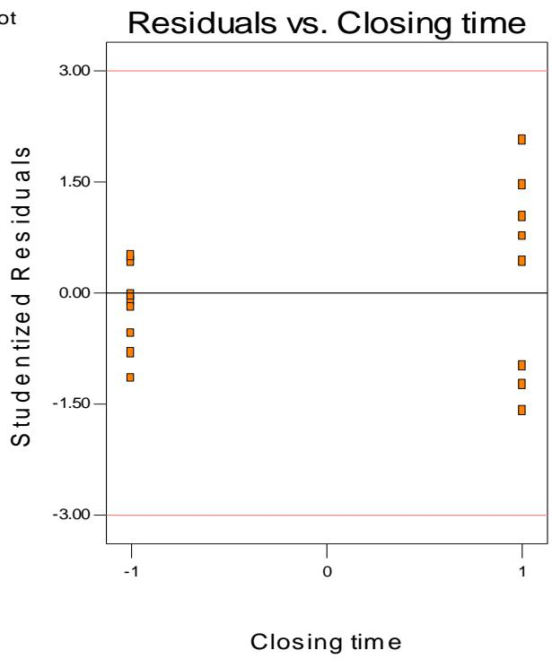

# 第 6 章补充材料

## S6.1 因子效应估计值是最小二乘估计值

我们在教材中已对因子效应的估计值如何得到给出了启发式或直观的解释。此外，已经指出，在 $2^{k}$ 因子设计的回归模型表示中，回归系数恰好是**效应估计值**（effect estimate）的一半。不难证明，模型系数（因而效应估计值）是**最小二乘估计值**（least squares estimate）。

考虑一个 $2^{2}$ 因子设计。其回归模型为

$$
y_{i} = \beta_{0} + \beta_{1}x_{i1} + \beta_{2}x_{i2} + \beta_{12}x_{i1}x_{i2} + \varepsilon_{i}
$$

该 $2^{2}$ 试验的数据如下表所示。

| 运行号 $i$ | $X_{i1}$ | $X_{i2}$ | $X_{i1}X_{i2}$ | 响应合计 |
| --- | --- | --- | --- | --- |
| 1 | −1 | −1 | 1 | (1) |
| 2 | 1 | −1 | −1 | a |
| 3 | −1 | 1 | −1 | b |
| 4 | 1 | 1 | 1 | ab |

模型参数 $\beta$ 的最小二乘估计值是这样选取的：它使模型误差的平方和达到最小：

$$
L = \sum_{i=1}^{4}\left(y_{i} - \beta_{0} - \beta_{1}x_{i1} - \beta_{2}x_{i2} - \beta_{12}x_{i1}x_{i2}\right)^{2}
$$

不难证明，最小二乘**正规方程**（normal equations）为[^1]

$$
4\hat{\beta}_{0} + \hat{\beta}_{1}\sum_{i=1}^{4}x_{i1} + \hat{\beta}_{2}\sum_{i=1}^{4}x_{i2} + \hat{\beta}_{12}\sum_{i=1}^{4}x_{i1}x_{i2} = (1) + a + b + ab
$$

$$
\hat{\beta}_{0}\sum_{i=1}^{4}x_{i1} + \hat{\beta}_{1}\sum_{i=1}^{4}x_{i1}^{2} + \hat{\beta}_{2}\sum_{i=1}^{4}x_{i1}x_{i2} + \hat{\beta}_{12}\sum_{i=1}^{4}x_{i1}^{2}x_{i2} = -(1) + a - b + ab
$$

$$
\hat{\beta}_{0}\sum_{i=1}^{4}x_{i2} + \hat{\beta}_{1}\sum_{i=1}^{4}x_{i1}x_{i2} + \hat{\beta}_{2}\sum_{i=1}^{4}x_{i2}^{2} + \hat{\beta}_{12}\sum_{i=1}^{4}x_{i1}x_{i2}^{2} = -(1) - a + b + ab
$$

$$
\hat{\beta}_{0}\sum_{i=1}^{4}x_{i1}x_{i2} + \hat{\beta}_{1}\sum_{i=1}^{4}x_{i1}^{2}x_{i2} + \hat{\beta}_{2}\sum_{i=1}^{4}x_{i1}x_{i2}^{2} + \hat{\beta}_{12}\sum_{i=1}^{4}x_{i1}^{2}x_{i2}^{2} = (1) - a - b + ab
$$

现在，由于设计是正交的，有 $\sum_{i=1}^{4}x_{i1} = \sum_{i=1}^{4}x_{i2} = \sum_{i=1}^{4}x_{i1}x_{i2} = \sum_{i=1}^{4}x_{i1}^{2}x_{i2} = \sum_{i=1}^{4}x_{i1}x_{i2}^{2} = 0$，于是正规方程简化为非常简单的形式：

$$
4\hat{\beta}_{0} = (1) + a + b + ab
$$

$$
4\hat{\beta}_{1} = -(1) + a - b + ab
$$

$$
4\hat{\beta}_{2} = -(1) - a + b + ab
$$

$$
4\hat{\beta}_{12} = (1) - a - b + ab
$$

其解为

$$
\hat{\beta}_{0} = \frac{[(1) + a + b + ab]}{4}
$$

$$
\hat{\beta}_{1} = \frac{[-(1) + a - b + ab]}{4}
$$

$$
\hat{\beta}_{2} = \frac{[-(1) - a + b + ab]}{4}
$$

$$
\hat{\beta}_{12} = \frac{[(1) - a - b + ab]}{4}
$$

这些回归模型系数恰好是因子效应估计值的一半。因此，效应估计值是最小二乘估计值。我们在本章中以矩阵形式对此做了说明，并将在第 10 章中以更一般的方式讨论这一问题。

## S6.2 计算效应估计值的 Yates 算法

虽然在 $2^{k}$ 设计的统计分析中我们通常使用计算机程序，但 Yates（1937）发明了一种非常简单的技术，用来估计 $2^{k}$ 因子设计中的效应并确定其平方和。这种做法在手工计算时偶尔有用，通过研究一个数值例子来学习它效果最好。

考虑例 6.1 中 $2^{3}$ 设计的数据。这些数据已填入下面的表 1。处理组合总是按标准顺序写出，标有“响应”的这一列给出该处理组合处相应的观测值（或全部观测值之和）。第 (1) 列的前半部分由响应列中相邻的两个数两两相加得到。第 (1) 列的后半部分则由以下办法得到：改变响应列中各对第一个数的符号，然后把相邻的两对相加。例如，在第 (1) 列中，第五个数为 $5 = -(-4) + 1$，第六个数为 $6 = -(-1) + 5$，依此类推。

第 (2) 列由第 (1) 列按“由响应列得到第 (1) 列”的同样方式得到，第 (3) 列又同样由第 (2) 列得到。一般地，对于 $2^{k}$ 设计，我们要构造 $k$ 个这样的列。第 (3) 列［一般地，第 $(k)$ 列］就是该行开头所标明的效应的**对比**（contrast）。要得到效应的估计值，我们把第 (3) 列中的各数除以 $n2^{k-1}$（在我们的例子中，$n2^{k-1} = 8$）。最后，效应的**平方和**（sum of squares）由第 (3) 列中的各数平方后再除以 $n2^{k}$ 得到（在我们的例子中，$n2^{k} = (2)2^{3} = 16$）。[^2]

**表 1 例 6.1 数据的 Yates 算法**

| 处理组合 | 响应 | (1) | (2) | (3) | 效应 | 效应估计值 $(3)\div n2^{k-1}$ | 平方和 $(3)^{2}\div n2^{k}$ |
| --- | --- | --- | --- | --- | --- | --- | --- |
| (1) | −4 | −3 | 1 | 16 | I | --- | --- |
| a | 1 | 4 | 15 | 24 | A | 3.00 | 36.00 |
| b | −1 | 2 | 11 | 18 | B | 2.25 | 20.25 |
| ab | 5 | 13 | 13 | 6 | AB | 0.75 | 2.25 |
| c | −1 | 5 | 7 | 14 | C | 1.75 | 12.25 |
| ac | 3 | 6 | 11 | 2 | AC | 0.25 | 0.25 |
| bc | 2 | 4 | 1 | 4 | BC | 0.50 | 1.00 |
| abc | 11 | 9 | 5 | 4 | ABC | 0.50 | 1.00 |

用 **Yates 算法**（Yates's algorithm）对例 6.1 中的数据求得的效应估计值与平方和，与在那里用通常方法得到的结果一致。注意，对应于 (1) 的那一行在第 (3) 列［一般地，第 $(k)$ 列］中的数总是等于观测值的总和。

尽管 Yates 算法表面上很简单，但在其中犯数值错误却是出了名的容易，因此执行该过程时应当极其小心。作为对计算的部分校验，我们可以利用这样一个事实：第 $j$ 列中各数平方之和是响应列中各数平方之和的 $2^{j}$ 倍。不过要注意，这种校验无法发现第 $j$ 列中的符号错误。关于其他查错技术，参见 Davies（1956）、Good（1955，1958）、Kempthorne（1952）和 Rayner（1967）。

## S6.3 关于对比的方差的一个注记

在分析 $2^{k}$ 因子设计时，我们常常画出因子效应估计值的**正态概率图**（normal probability plot），并通过识别那些看起来很大的效应来目视选定一个暂定模型。这些效应估计值通常相对远离穿过其余已绘出效应的那条直线。

当 (1) 显著效应不多，并且 (2) 所有效应估计值具有相同方差时，这种方法效果很好。结果表明，由 $2^{k}$ 设计计算出的所有对比（因而所有效应估计值）都具有相同的**方差**（variance），即使各个观测值具有不同的方差。这一结论很容易证明。

假设我们实施了一个 $2^{k}$ 设计，得到响应 $y_{1}, y_{2}, \cdots, y_{2^{k}}$，并设各观测值的方差分别为 $\sigma_{1}^{2}, \sigma_{2}^{2}, \cdots, \sigma_{2^{k}}^{2}$。现在每个效应估计值都是观测值的线性组合，比如

$$
Effect = \frac{\sum_{i=1}^{2^{k}}c_{i}y_{i}}{2^{k}}
$$

其中对比的常数 $c_{i}$ 都等于 −1 或 +1。因此，效应估计值的方差为

$$
\begin{array}{r l}
V(Effect) & = \frac{1}{(2^{k})^{2}}\sum_{i=1}^{2^{k}}c_{i}^{2}V(y_{i}) \\
& = \frac{1}{(2^{k})^{2}}\sum_{i=1}^{2^{k}}c_{i}^{2}\sigma_{i}^{2} \\
& = \frac{1}{(2^{k})^{2}}\sum_{i=1}^{2^{k}}\sigma_{i}^{2}
\end{array}
$$

因为 $c_{i}^{2} = 1$。因此，所有对比都具有相同的方差。如果上述各式中的每个观测值 $y_{i}$ 都是各设计点上 $n$ 次重复的总和，结论依然成立。

## S6.4 预测响应的方差

假设我们采用 $2^{k}$ 因子设计实施了一次试验。我们已对所得数据拟合了回归模型，并将用该模型预测设计空间内部（$-1 \leq x_{i} \leq +1$，$i = 1, 2, \cdots, k$）感兴趣位置处的**预测响应**（predicted response）。在感兴趣的点处，比方说 $\mathbf{x}^{\prime} = [x_{1}, x_{2}, \cdots, x_{k}]$，预测响应的方差是多少？

习题 6.32 要求读者回答这一问题；虽然答案已在教师资源光盘（Instructors Resource CD）中给出，我们在这里也给出答案，因为这是有用的信息。假设设计是平衡的，并且每个处理组合都重复 $n$ 次。由于设计是正交的，很容易求出预测响应的方差。

我们考虑试验者拟合了“仅主效应”模型的情形，即

$$
\hat{y}(\mathbf{x}) \equiv \hat{y} = \hat{\beta}_{0} + \sum_{i=1}^{k}\hat{\beta}_{i}x_{i}
$$

现在回忆一下，模型回归系数的方差为 $V(\hat{\boldsymbol{\beta}}) = \frac{\sigma^{2}}{n2^{k}} = \frac{\sigma^{2}}{N}$，其中 $N$ 是设计中试验次数的总数。预测响应的方差为

$$
\begin{array}{l}
V[\hat{y}(\mathbf{x})] = V\left(\hat{\beta}_{0} + \sum_{i=1}^{k}\hat{\beta}_{i}x_{i}\right) \\
= V(\hat{\beta}_{0}) + \sum_{i=1}^{k}V(\hat{\beta}_{i}x_{i}) \\
= V(\hat{\beta}_{0}) + \sum_{i=1}^{k}x_{i}^{2}V(\hat{\beta}_{i}) \\
= \frac{\sigma^{2}}{N} + \frac{\sigma^{2}}{N}\sum_{i=1}^{k}x_{i}^{2} \\
= \frac{\sigma^{2}}{N}\left(1 + \sum_{i=1}^{k}x_{i}^{2}\right)
\end{array}
$$

在上述推导中我们使用了设计是正交的这一事实，因此施加方差算子时不会出现非零的协方差项。

Design-Expert 软件程序绘制预测响应标准差的等值线，即上式的平方根。如果设计已经实施并分析过，程序会用误差均方代替 $\sigma^{2}$，于是所绘制的量成为

$$
\sqrt{\hat{V}[\hat{y}(\mathbf{x})]} = \sqrt{\frac{MS_{E}}{N}\left(1 + \sum_{i=1}^{k}x_{i}^{2}\right)}
$$

如果设计已经构造出来但试验尚未进行，那么软件程序会（在设计评价菜单上）绘制量

$$
\sqrt{\frac{V[\hat{y}(\mathbf{x})]}{\sigma^{2}}} = \sqrt{\frac{1}{N}\left(1 + \sum_{i=1}^{k}x_{i}^{2}\right)}
$$

它可以被看作是预测的标准化标准差。为说明这一点，考虑一个 $n = 3$ 次重复的 $2^{2}$，即 6.2 节中的第一个例子。预测响应标准化标准差的图如下所示。

```txt
DESIGN-EXPERT Plot
StdErr of Design
X = A: A
Y = B: B
• Design Points
```



预测响应标准化标准差相等的等值线应当恰好是圆形的，并且它们应在设计区域内于 $x_{1} = \pm 1$ 和 $x_{2} = \pm 1$ 处达到最大。最大值为

$$
\begin{array}{r l}
\sqrt{\frac{V[\hat{y}(\mathbf{x} = 1)]}{\sigma^{2}}} & = \sqrt{\frac{1}{12}(1 + (1)^{2} + (1)^{2})} \\
& = \sqrt{\frac{3}{12}} \\
& = 0.5
\end{array}
$$

图中方形的四角也标出了这一数值。

预测响应标准化标准差的图可用于比较设计。例如，假设上述情形中的试验者正考虑给设计增加第四次重复。此时该区域内最大的标准化预测标准差变为[^3]

$$
\begin{array}{r l}
\sqrt{\frac{V[\hat{y}(\mathbf{x} = 1)]}{\sigma^{2}}} & = \sqrt{\frac{1}{16}(1 + (1)^{2} + (1)^{2})} \\
& = \sqrt{\frac{3}{16}} \\
& = 0.433
\end{array}
$$

标准化预测标准差的图如下所示。

```txt
DESIGN-EXPERT Plot
StdErr of Design
X = A: A
Y = B: B
• Design Points
```



注意，增加一次重复使最大预测方差从 $(0.5)^{2} = 0.25$ 减小到 $(0.433)^{2} = 0.1875$。比较上面给出的两幅图可以看出，当多运行一次重复时，标准化预测标准差在整个设计区域内都一致地更低。

有时我们愿意用**标度化预测方差**（scaled prediction variance）来比较设计，其定义为

$$
\frac{NV[\hat{y}(\mathbf{x})]}{\sigma^{2}}
$$

这使我们能够评价试验次数不同的设计。由于给设计增加重复（或试验）通常总是会使预测方差变小，标度化预测方差使我们能够按每次观测来考察预测方差。注意，对于 $2^{k}$ 因子设计以及我们一直在考虑的“仅主效应”模型，标度化预测方差为

$$
\begin{array}{c}
\frac{NV[\hat{y}(\mathbf{x})]}{\sigma^{2}} = \left(1 + \sum_{i=1}^{k}x_{i}^{2}\right) \\
= (1 + \rho^{2})
\end{array}
$$

其中 $\rho^{2}$ 是需要预测的设计点到设计空间中心 $(\mathbf{x} = \mathbf{0})$ 的距离。注意，无论重复多少次，$2^{k}$ 设计都达到这一标度化预测方差。标度化预测方差在设计区域上可能取的最大值为

$$
Max \frac{NV[\hat{y}(\mathbf{x})]}{\sigma^{2}} = (1 + k)
$$

可以证明，在该区域上没有任何其他设计能达到更小的最大标度化预测方差，因此 $2^{k}$ 设计在某种意义上是**最优设计**（optimal design）。我们在本章中指出了这一点，并将在第 11 章更完整地讨论最优设计。

## S6.5 用残差识别散度效应

我们在例 6.4 中说明，把回归模型的**残差**（residual）对各个设计因子作图，是检查是否存在**散度效应**（dispersion effect）的一种有用方法。散度效应是指那些影响响应变异程度、但对均值几乎没有什么影响的因子。我们还给出了一种方法，用来计算每个设计因子与交互作用的散度效应度量，该度量可以在正态概率图上加以评价。然而我们指出，这些残差分析对位置模型设定是否正确相当敏感。也就是说，如果我们把重要因子遗漏在描述均值响应的回归模型之外，那么残差图就可能不可靠。

为说明这一点，重新考虑例 6.4，并假设我们遗漏了其中一个重要因子 C = 树脂流量（Resin flow）。如果我们使用这一不正确的模型，那么残差对设计因子的图看起来会与使用原来的正确模型时相当不同。特别地，残差对因子 D = 闭合时间（Closing time）的图如下所示。

```txt
DESIGN-EXPERT Plot
Defects
```



该图表明因子 D 有潜在的散度效应。图 6.28 中散度统计量 $\boldsymbol{F_{i}^{*}}$ 的正态概率图清楚地表明，因子 B 是唯一对散度有影响的因子。因此，如果你打算用模型残差来寻找散度效应，那么为位置效应选择正确的模型确实非常重要。

## S6.6 中心点与因子点重复的比较

在一些设计问题中，试验者可以选择在 $2^{k}$ 因子的角点或“立方体”点上进行重复，也可以把重复的试验安排在设计中心。例如，假设我们要在以下两者之间作出选择：一个在方形的每个角点处有 $n = 2$ 次重复的 $2^{2}$，或者一个带有 $n_{c} = 4$ 个**中心点**（center point）的单次重复 $2^{2}$。

我们可以用**预测方差**（prediction variance）来比较这些设计。假设我们打算拟合一阶或“仅主效应”模型

$$
\hat{y}(\mathbf{x}) \equiv \hat{y} = \hat{\beta}_{0} + \sum_{i=1}^{2}\hat{\beta}_{i}x_{i}
$$

如果我们使用重复设计，标度化预测方差为（见上文 S6.4 节）：

$$
\begin{array}{c}
\frac{NV[\hat{y}(\mathbf{x})]}{\sigma^{2}} = \left(1 + \sum_{i=1}^{2}x_{i}^{2}\right) \\
= (1 + \rho^{2})
\end{array}
$$

现在考虑使用带中心点的设计时的预测方差。我们有

$$
\begin{array}{l}
V[\hat{y}(\mathbf{x})] = V\left(\hat{\beta}_{0} + \sum_{i=1}^{2}\hat{\beta}_{i}x_{i}\right) \\
= V(\hat{\beta}_{0}) + \sum_{i=1}^{2}V(\hat{\beta}_{i}x_{i}) \\
= V(\hat{\beta}_{0}) + \sum_{i=1}^{k}x_{i}^{2}V(\hat{\beta}_{i}) \\
= \frac{\sigma^{2}}{8} + \frac{\sigma^{2}}{4}\sum_{i=1}^{2}x_{i}^{2} \\
= \frac{\sigma^{2}}{8}\left(1 + 2\sum_{i=1}^{k}x_{i}^{2}\right) \\
= \frac{\sigma^{2}}{8}(1 + 2\rho^{2})
\end{array}
$$

因此，带中心点的设计的标度化预测方差为

$$
\frac{NV[\hat{y}(\mathbf{x})]}{\sigma^{2}} = (1 + 2\rho^{2})
$$

显然，至少就标度化预测方差而言，本例中重复角点的做法优于重复中心点的策略。在方形的角点处，重复因子设计的标度化预测方差为

$$
\begin{array}{r l}
\frac{NV[\hat{y}(\mathbf{x})]}{\sigma^{2}} & = (1 + \rho^{2}) \\
& = (1 + 2) \\
& = 3
\end{array}
$$

而带中心点的因子设计则为

$$
\begin{array}{r l}
\frac{NV[\hat{y}(\mathbf{x})]}{\sigma^{2}} & = (1 + 2\rho^{2}) \\
& = (1 + 2(2)) \\
& = 5
\end{array}
$$

然而，预测方差可能并不能说明全部问题。如果我们只重复方形的角点，就无法判断模型的失拟情况。如果设计带有中心点，我们就可以检验是否存在纯二次（二阶）项，因此如果试验者对自己应当使用的模型阶数毫无把握，那么带中心点的设计很可能更受偏爱。

## S6.7 用 t 检验检验“纯二次”弯曲

在教材中我们讨论了给 $2^{k}$ 因子设计添加中心点的问题。这是一个非常有用的想法，因为它使得即使因子设计点没有重复也能得到“纯误差”的估计，并且使试验者能够就某些二阶项对模型充分性作出评价。具体而言，我们给出了用于检验如下假设的 $F$ 检验：[^5]

$$
\begin{array}{l}
H_{0}: \beta_{11} + \beta_{22} + \dots + \beta_{kk} = 0 \\
H_{1}: \beta_{11} + \beta_{22} + \dots + \beta_{kk} \neq 0
\end{array}
$$

也可以使用等价的 t 统计量来检验这些假设。有些计算机软件程序报告 t 检验，而不报告 F 检验（或在报告 F 检验之外还报告 t 检验）。建立 t 检验并证明它与 F 检验等价并不困难。

假设响应的适当模型是一个完全二次多项式，并且试验者实施了一个无重复的完全 $2^{k}$ 因子设计，其中有 $n_{F}$ 个设计点加上 $n_{C}$ 个中心点。设 $\overline{y}_{F}$ 与 $\overline{y}_{C}$ 分别表示因子点处与中心点处响应的平均值。又设 $\hat{\sigma}^{2}$ 是用中心点得到的方差估计。容易证明[^4]

$$
\begin{array}{r l}
E(\overline{y}_{F}) & = \frac{1}{n_{F}}(n_{F}\beta_{0} + n_{F}\beta_{11} + n_{F}\beta_{22} + \dots + n_{F}\beta_{kk}) \\
& = \beta_{0} + \beta_{11} + \beta_{22} + \dots + \beta_{kk}
\end{array}
$$

以及

$$
\begin{array}{c}
E(\overline{y}_{C}) = \frac{1}{n_{C}}(n_{C}\beta_{0}) \\
= \beta_{0}
\end{array}
$$

因此，

$$
E(\overline{y}_{F} - \overline{y}_{C}) = \beta_{11} + \beta_{22} + \dots + \beta_{kk}
$$

于是我们看到，平均值之差 $\overline{y}_{F} - \overline{y}_{C}$ 是纯二次模型参数之和的无偏估计量。现在 $\overline{y}_{F} - \overline{y}_{C}$ 的方差为

$$
V(\overline{y}_{F} - \overline{y}_{C}) = \sigma^{2}\left(\frac{1}{n_{F}} + \frac{1}{n_{C}}\right)
$$

因此，可以用统计量

$$
t_{0} = \frac{\overline{y}_{F} - \overline{y}_{C}}{\sqrt{\hat{\sigma}^{2}\left(\frac{1}{n_{F}} + \frac{1}{n_{C}}\right)}}
$$

来检验上述假设，该统计量在原假设下服从自由度为 $n_{C} - 1$ 的 t 分布。若 $|t_{0}| > t_{\alpha/2, n_{C} - 1}$，我们就拒绝原假设（即不存在纯二次弯曲）。

该 t 检验与书中给出的 F 检验等价。为看出这一点，把上面的 t 统计量平方：

$$
\begin{array}{c}
t_{0}^{2} = \frac{(\overline{y}_{F} - \overline{y}_{C})^{2}}{\hat{\sigma}^{2}\left(\frac{1}{n_{F}} + \frac{1}{n_{C}}\right)} \\
= \frac{n_{F}n_{C}(\overline{y}_{F} - \overline{y}_{C})^{2}}{(n_{F} + n_{C})\hat{\sigma}^{2}}
\end{array}
$$

这一比值在计算上与教材中给出的 F 检验完全相同。

此外，我们知道自由度为（比如说）$v$ 的 t 随机变量的平方，是分子自由度为 1、分母自由度为 $v$ 的 F 随机变量，因此对“纯二次”效应的 t 检验确实与 F 检验等价。

## 补充参考文献

Good, I. J. (1955). “The Interaction Algorithm and Practical Fourier Analysis”. Journal of the Royal Statistical Society, Series B, Vol. 20, pp. 361-372.

Good, I. J. (1958). Addendum to “The Interaction Algorithm and Practical Fourier Analysis”. Journal of the Royal Statistical Society, Series B, Vol. 22, pp. 372-375.

Rayner, A. A. (1967). “The Square Summing Check on the Main Effects and Interactions in a $2^{n}$ Experiment as Calculated by Yates' Algorithm”. Biometrics, Vol. 23, pp. 571-573.

[^1]: 本节第 2 个正规方程的首项在原文中印作 $\sum_{i=1}^{4}x_{i}$，但该方程是对 $\beta_{1}$ 求导所得，按正规方程的一般形式其首项应为 $\sum_{i=1}^{4}x_{i1}$（第 3、4 个方程的首项分别为 $\sum_{i=1}^{4}x_{i2}$ 与 $\sum_{i=1}^{4}x_{i1}x_{i2}$，可作对照；下文化简时也正是令 $\sum_{i=1}^{4}x_{i1}=0$）。译文已按 $\sum_{i=1}^{4}x_{i1}$ 写出。——译者注

[^2]: 表 1 中“平方和”一列的表头在原文中印作 $(3)^{2}\div n2^{k-1}$，但本节正文明确说明平方和是“第 (3) 列中的各数平方后再除以 $n2^{k}$”，且表中数值 $36.00=24^{2}/16$、$20.25=18^{2}/16$ 均与 $n2^{k}=16$ 相符，故表头应为 $(3)^{2}\div n2^{k}$。译文已按 $(3)^{2}\div n2^{k}$ 写出。——译者注

[^3]: 此处原文印作 $\sqrt{\frac{1}{12}(1+(1)^{2}+(1)^{2})}$，与紧随其后的结果 $\sqrt{3/16}$ 及 0.433 不一致。增加第四次重复后 $N=4\times 2^{2}=16$，故系数应为 $1/16$（上一段 $n=3$ 时的 $1/12$ 是正确的）。译文已按 $1/16$ 写出。——译者注

[^4]: 原文此处第二行漏掉了 $\beta_{0}$，印作 $\beta_{11}+\beta_{22}+\dots+\beta_{kk}$。由第一行 $\frac{1}{n_{F}}(n_{F}\beta_{0}+n_{F}\beta_{11}+\dots+n_{F}\beta_{kk})=\beta_{0}+\beta_{11}+\dots+\beta_{kk}$ 可知应有 $\beta_{0}$。译文已补出。——译者注

[^5]: 原文两式中的省略号后均漏了一个加号，印作 $\dots\beta_{kk}$。译文已按 $\dots+\beta_{kk}$ 写出。——译者注
