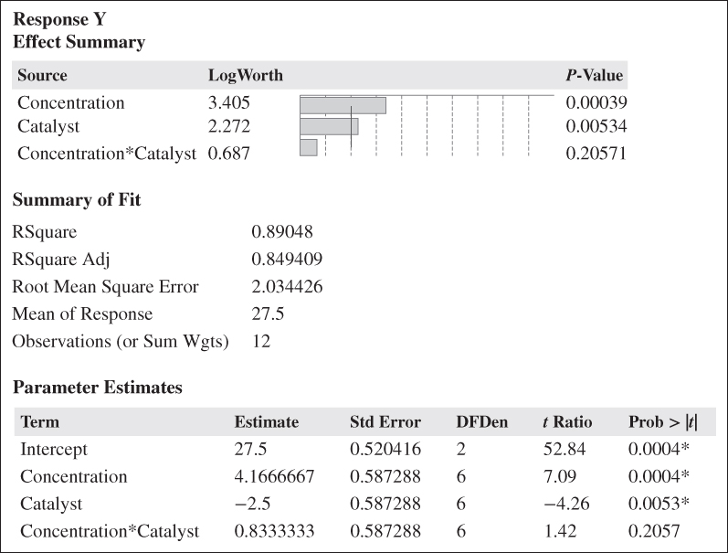
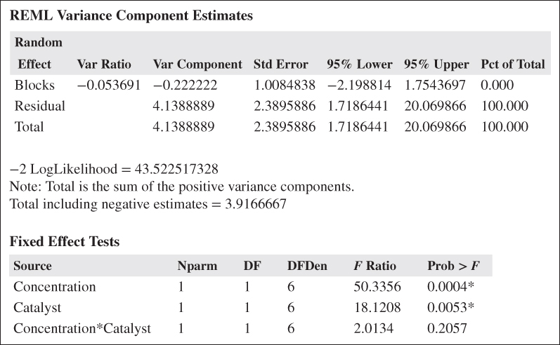
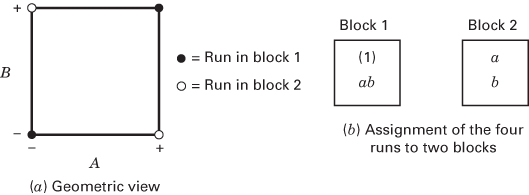
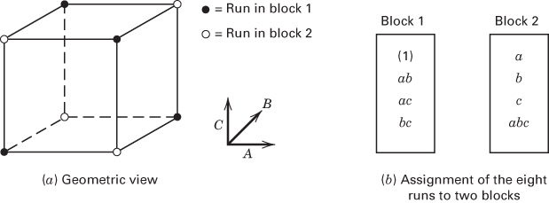
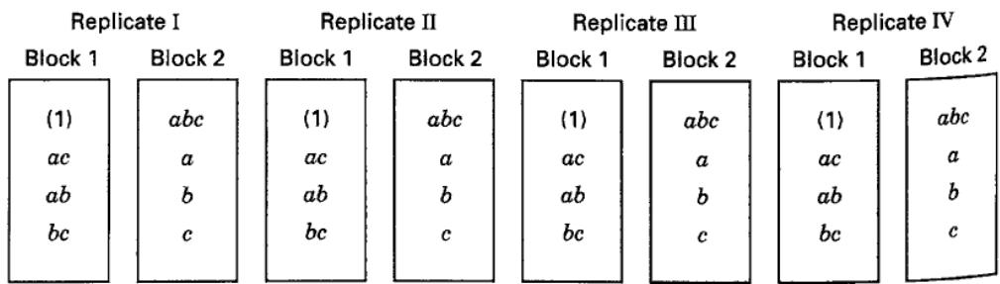
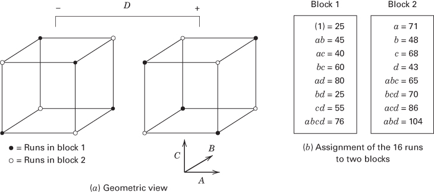
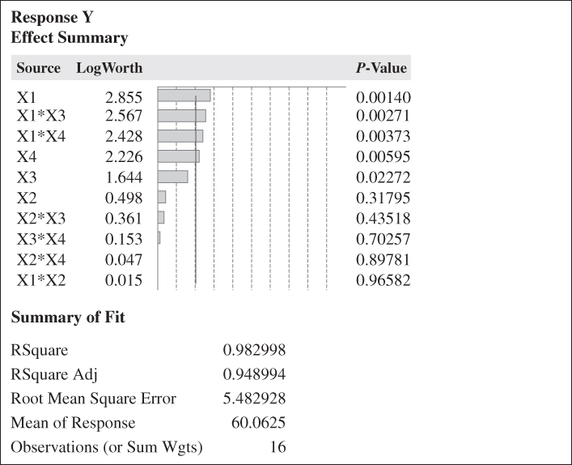
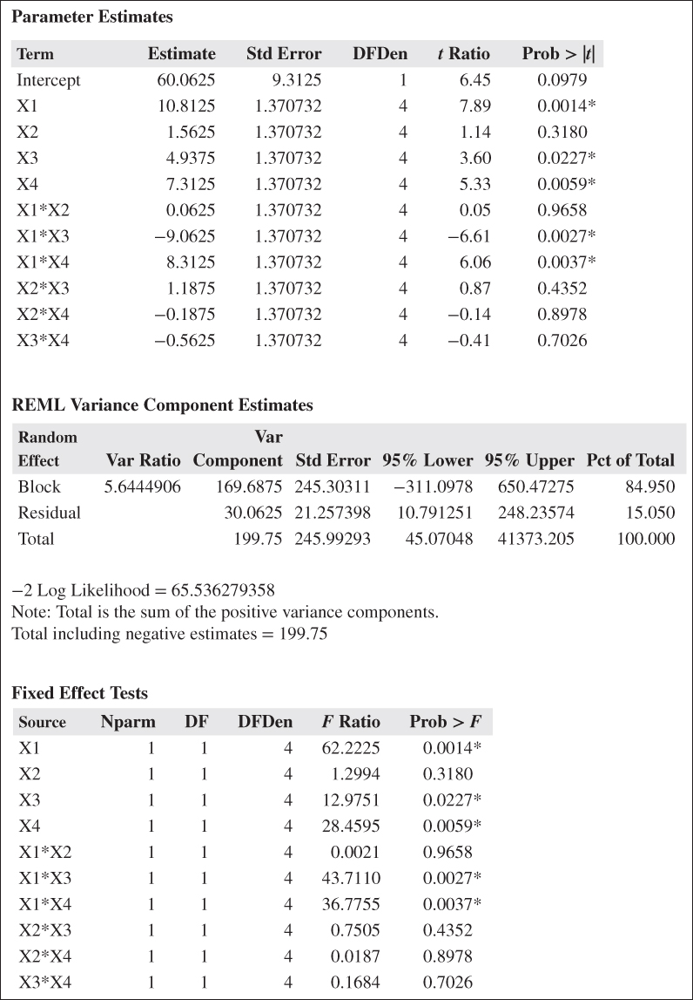

CHAPTER 7

# Blocking and Confounding in the $2^{k}$ Factorial Design

CHAPTER LEARNING OBJECTIVES

1. Learn about how the blocking technique can be used with $2^{k}$ factorial designs.

2. Learn about how blocking can be used with unreplicated $2^{k}$ factorial designs, and how this leads to confounding of effects.

3. Know how to construct the $2^{k}$ factorial designs in $2^{p}$ blocks.

4. Understand how to construct designs that confound different effects in different replicates.

## 7.1 Introduction

In many situations, it is impossible to perform all of the runs in a $2^{k}$ factorial experiment under homogeneous conditions. For example, a single batch of raw material might not be large enough to make all of the required runs. In other cases, it might be desirable to deliberately vary the experimental conditions to ensure that the treatments are equally effective (i.e., robust) across many situations that are likely to be encountered in practice. For example, a chemical engineer may run a pilot plant experiment with several batches of raw material because he knows that different raw material batches of different quality grades are likely to be used in the actual full-scale process.

The design technique used in these situations is blocking. Chapter 4 was an introduction to the blocking principle, and you may find it helpful to read the introductory material in that chapter again. We also discussed blocking general factorial experiments in Chapter 5. In this chapter, we will build on the concepts introduced in Chapter 4, focusing on some special techniques for blocking in the $2^{k}$ factorial design.

## 7.2 Blocking a Replicated $2^{k}$ Factorial Design

Suppose that the $2^{k}$ factorial design has been replicated n times. This is identical to the situation discussed in Chapter 5, where we showed how to run a general factorial design in blocks. If there are n replicates, then each set of nonhomogeneous conditions defines a block, and each replicate is run in one of the blocks. The runs in each block (or replicate) would be made in random order. The analysis of the design is similar to that of any blocked factorial experiment; for example, see the discussion in Section 5.6.

## EXAMPLE 7.1

Consider the chemical process experiment first described in Section 6.2. Suppose that only four experimental trials can be made from a single batch of raw material. Therefore, three batches of raw material will be required to run all three replicates of this design. Table 7.1 shows the design, where each batch of raw material corresponds to a block.

$$
\begin{array}{r l} S S _ {\text {Blocks}} & = \sum_ {i = 1} ^ {3} \frac {B _ {i} ^ {2}}{4} - \frac {y _ {. . .} ^ {2}}{1 2} \\ & = \frac {(1 1 3) ^ {2} + (1 0 6) ^ {2} + (1 1 1) ^ {2}}{4} - \frac {(3 3 0) ^ {2}}{1 2} \\ & = 6. 5 0 \end{array}
$$

The ANOVA for this blocked design is shown in Table 7.2. All of the sums of squares are calculated exactly as in a standard, unblocked $2^{k}$ design. The sum of squares for blocks is calculated from the block totals. Let $B_{1}$ , $B_{2}$ , and $B_{3}$ represent the block totals (see Table 7.1). Then

There are two degrees of freedom among the three blocks. Table 7.2 indicates that the conclusions from this analysis, had the design been run in blocks, are identical to those in Section 6.2 and that the block effect is relatively small. The F-Statistic for blocks is $F_{0} = (6.50/2)/4.14 = 0.79$ , which is not significant.

## TABLE 7.1

Chemical Process Experiment in Three Blocks

<table><tr><td rowspan="5"></td><td>Block 1</td><td>Block 2</td><td>Block 3</td></tr><tr><td>(1) = 28</td><td>(1) = 25</td><td>(1) = 27</td></tr><tr><td>a = 36</td><td>a = 32</td><td>a = 32</td></tr><tr><td>b = 18</td><td>b = 19</td><td>b = 23</td></tr><tr><td>ab = 31</td><td>ab = 30</td><td>ab = 29</td></tr><tr><td>Block totals:</td><td> $B_1$ = 113</td><td> $B_2$ = 106</td><td> $B_3$ = 111</td></tr></table>

## TABLE 7.2

Analysis of Variance for the Chemical Process Experiment in Three Blocks

<table><tr><td>Source of Variation</td><td>Sum of Squares</td><td>Degrees of Freedom</td><td>Mean Square</td><td> $F_0$ </td><td>P-Value</td></tr><tr><td>Blocks</td><td>6.50</td><td>2</td><td>3.25</td><td></td><td></td></tr><tr><td>A (concentration)</td><td>208.33</td><td>1</td><td>208.33</td><td>50.32</td><td>0.0004</td></tr><tr><td>B (catalyst)</td><td>75.00</td><td>1</td><td>75.00</td><td>18.12</td><td>0.0053</td></tr><tr><td>AB</td><td>8.33</td><td>1</td><td>8.33</td><td>2.01</td><td>0.2060</td></tr><tr><td>Error</td><td>24.84</td><td>6</td><td>4.14</td><td></td><td></td></tr><tr><td>Total</td><td>323.00</td><td>11</td><td></td><td></td><td></td></tr></table>

<table><tr><td>Source</td><td>LogWorth</td><td colspan="12"></td><td>P-Value</td></tr><tr><td>Concentration</td><td>3.405</td><td colspan="12"></td><td>0.00039</td></tr><tr><td>Catalyst</td><td>2.272</td><td colspan="12"></td><td>0.00534</td></tr><tr><td>Concentration*Catalyst</td><td>0.687</td><td colspan="12"></td><td>0.20571</td></tr></table>

Summary of Fit

RSquare 0.89048

RSquare Adj 0.849409

Root Mean Square Error 2.034426

Mean of Response 27.5

Parameter Estimates

<table><tr><td>Term</td><td>Estimate</td><td>Std Error</td><td>DFDen</td><td>t Ratio</td><td>Prob &gt; |t|</td></tr><tr><td>Intercept</td><td>27.5</td><td>0.520416</td><td>2</td><td>52.84</td><td>0.0004*</td></tr><tr><td>Concentration</td><td>4.1666667</td><td>0.587288</td><td>6</td><td>7.09</td><td>0.0004*</td></tr><tr><td>Catalyst</td><td>-2.5</td><td>0.587288</td><td>6</td><td>-4.26</td><td>0.0053*</td></tr><tr><td>Concentration*Catalyst</td><td>0.8333333</td><td>0.587288</td><td>6</td><td>1.42</td><td>0.2057</td></tr></table>

<table><tr><td colspan="7">REML Variance Component Estimates</td></tr><tr><td colspan="7">Random</td></tr><tr><td>Effect</td><td>Var Ratio</td><td>Var Component</td><td>Std Error</td><td>95% Lower</td><td>95% Upper</td><td>Pct of Total</td></tr><tr><td>Blocks</td><td>-0.053691</td><td>-0.222222</td><td>1.0084838</td><td>-2.198814</td><td>1.7543697</td><td>0.000</td></tr><tr><td>Residual</td><td></td><td>4.1388889</td><td>2.3895886</td><td>1.7186441</td><td>20.069866</td><td>100.000</td></tr><tr><td>Total</td><td></td><td>4.1388889</td><td>2.3895886</td><td>1.7186441</td><td>20.069866</td><td>100.000</td></tr><tr><td colspan="7">-2 LogLikelihood = 43.522517328Note: Total is the sum of the positive variance components.Total including negative estimates = 3.9166667</td></tr><tr><td colspan="7">Fixed Effect Tests</td></tr><tr><td>Source</td><td>Nparm</td><td>DF</td><td>DFDen</td><td>F Ratio</td><td colspan="2">Prob &gt; F</td></tr><tr><td>Concentration</td><td>1</td><td>1</td><td>6</td><td>50.3356</td><td colspan="2">0.0004*</td></tr><tr><td>Catalyst</td><td>1</td><td>1</td><td>6</td><td>18.1208</td><td colspan="2">0.0053*</td></tr><tr><td>Concentration*Catalyst</td><td>1</td><td>1</td><td>6</td><td>2.0134</td><td colspan="2">0.2057</td></tr></table>

## 7.3 Confounding in the $2^{k}$ Factorial Design

In many problems, it is impossible to perform a complete replicate of a factorial design in one block. Confounding is a design technique for arranging a complete factorial experiment in blocks, where the block size is smaller than the number of treatment combinations in one replicate. The technique causes information about certain treatment effects (usually high-order interactions) to be indistinguishable from, or confounded with, blocks. In this chapter, we concentrate on confounding systems for the $2^{k}$ factorial design. Note that even though the designs presented are incomplete block designs because each block does not contain all the treatments or treatment combinations, the special structure of the $2^{k}$ factorial system allows a simplified method of analysis.

We consider the construction and analysis of the $2^{k}$ factorial design in $2^{p}$ incomplete blocks, where p < k. Consequently, these designs can be run in two blocks (p = 1), four blocks (p = 2), eight blocks (p = 3), and so on.

## 7.4 Confounding the $2^{k}$ Factorial Design in Two Blocks

Suppose that we wish to run a single replicate of the $2^{2}$ design. Each of the $2^{2}=4$ treatment combinations requires a quantity of raw material, for example, and each batch of raw material is only large enough for two treatment combinations to be tested. Thus, two batches of raw material are required. If batches of raw material are considered as blocks, then we must assign two of the four treatment combinations to each block.

Figure 7.1 shows one possible design for this problem. The geometric view, Figure 7.1a, indicates that treatment combinations on opposing diagonals are assigned to different blocks. Notice from Figure 7.1b that block 1 contains the treatment combinations (1) and ab and that block 2 contains a and b. Of course, the order in which the treatment combinations are run within a block is randomly determined. We would also randomly decide which block to run first. Suppose that we estimate the main effects of A and B just as if no blocking had occurred. From Equations 6.1 and 6.2, we obtain

$$
\begin{array}{l} {A = \frac {1}{2} [ a b + a - b - (1) ]} \\ {B = \frac {1}{2} [ a b + b - a - (1) ]} \end{array}
$$

Note that both A and B are unaffected by blocking because in each estimate there is one plus and one minus treatment combination from each block. That is, any difference between block 1 and block 2 will cancel out.

Now consider the AB interaction

$$
A B = \frac {1}{2} [ a b + (1) - a - b ]
$$

Because the two treatment combinations with the plus sign [ab and (1)] are in block 1 and the two with the minus sign (a and b) are in block 2, the block effect and the AB interaction are identical. That is, AB is confounded with blocks.

The reason for this is apparent from the table of plus and minus signs for the $2^{2}$ design. This was originally given as Table 6.2, but for convenience it is reproduced as Table 7.3 here. From this table, we see that all treatment combinations that have a plus sign on AB are assigned to block 1, whereas all treatment combinations that have a minus sign on AB are assigned to block 2. This approach can be used to confound any effect (A, B, or AB) with blocks. For example, if (1) and b had been assigned to block 1 and a and ab to block 2, the main effect A would have been confounded with blocks. The usual practice is to confound the highest order interaction with blocks.

■ FIGURE 7.1 A $2^{2}$ design in two blocks

This scheme can be used to confound any $2^{k}$ design in two blocks. As a second example, consider a $2^{3}$ design run in two blocks. Suppose that we wish to confound the three-factor interaction ABC with blocks. From the table of plus and minus signs shown in Table 7.4, we assign the treatment combinations that are minus on ABC to block 1 and those that are plus on ABC to block 2. The resulting design is shown in Figure 7.2. Once again, we emphasize that the treatment combinations within a block are run in random order.

Other Methods for Constructing the Blocks. There is another method for constructing these designs. The method uses the linear combination

$$
L = \alpha_ {1} x _ {1} + \alpha_ {2} x _ {2} + \dots + a _ {k} x _ {k}\tag{7.1}
$$

where $x_{i}$ is the level of the ith factor appearing in a particular treatment combination and $\alpha_{i}$ is the exponent appearing on the ith factor in the effect to be confounded. For the $2^{k}$ system, we have $\alpha_{i}=0$ or 1 and $x_{i}=0$ (low level) or $x_{i}=1$ (high level). Equation 7.1 is called a defining contrast. Treatment combinations that produce the same value of L (mod 2) will be placed in the same block. Because the only possible values of L (mod 2) are 0 and 1, this will assign the $2^{k}$ treatment combinations to exactly two blocks.

To illustrate the approach, consider a $2^{3}$ design with ABC confounded with blocks. Here $x_{1}$ corresponds to A, $x_{2}$ to B, $x_{3}$ to C, and $\alpha_{1} = \alpha_{2} = \alpha_{3} = 1$ . Thus, the defining contrast corresponding to ABC is

$$
L = x _ {1} + x _ {2} + x _ {3}
$$

The treatment combination (1) is written 000 in the (0, 1) notation; therefore,

$$
L = 1 (0) + 1 (0) + 1 (0) = 0 = 0 (\mathrm{mod} 2)
$$

## TABLE 7.3

Table of Plus and Minus Signs for the $2^{2}$ Design

<table><tr><td rowspan="2">Treatment Combination</td><td colspan="5">Factorial Effect</td></tr><tr><td>I</td><td>A</td><td>B</td><td>AB</td><td>Block</td></tr><tr><td>(1)</td><td>+</td><td>-</td><td>-</td><td>+</td><td>1</td></tr><tr><td>a</td><td>+</td><td>+</td><td>-</td><td>-</td><td>2</td></tr><tr><td>b</td><td>+</td><td>-</td><td>+</td><td>-</td><td>2</td></tr><tr><td>ab</td><td>+</td><td>+</td><td>+</td><td>+</td><td>1</td></tr></table>

TABLE 7.4  
Table of Plus and Minus Signs for the $2^{3}$ Design

<table><tr><td rowspan="2">Treatment Combination</td><td colspan="9">Factorial Effect</td></tr><tr><td>I</td><td>A</td><td>B</td><td>AB</td><td>C</td><td>AC</td><td>BC</td><td>ABC</td><td>Block</td></tr><tr><td>(1)</td><td>+</td><td>-</td><td>-</td><td>+</td><td>-</td><td>+</td><td>+</td><td>-</td><td>1</td></tr><tr><td>a</td><td>+</td><td>+</td><td>-</td><td>-</td><td>-</td><td>-</td><td>+</td><td>+</td><td>2</td></tr><tr><td>b</td><td>+</td><td>-</td><td>+</td><td>-</td><td>-</td><td>+</td><td>-</td><td>+</td><td>2</td></tr><tr><td>ab</td><td>+</td><td>+</td><td>+</td><td>+</td><td>-</td><td>-</td><td>-</td><td>-</td><td>1</td></tr><tr><td>c</td><td>+</td><td>-</td><td>-</td><td>+</td><td>+</td><td>-</td><td>-</td><td>+</td><td>2</td></tr><tr><td>ac</td><td>+</td><td>+</td><td>-</td><td>-</td><td>+</td><td>+</td><td>-</td><td>-</td><td>1</td></tr><tr><td>bc</td><td>+</td><td>-</td><td>+</td><td>-</td><td>+</td><td>-</td><td>+</td><td>-</td><td>1</td></tr><tr><td>abc</td><td>+</td><td>+</td><td>+</td><td>+</td><td>+</td><td>+</td><td>+</td><td>+</td><td>2</td></tr></table>

■ FIGURE 7.2 The $2^{3}$ design in two blocks with ABC confounded  
(b) Assignment of the eight runs to two blocks

Similarly, the treatment combination a is 100, yielding

$$
L = 1 (1) + 1 (0) + 1 (0) = 1 = 1 \pmod {2}
$$

Thus, (1) and $a$ would be run in different blocks. For the remaining treatment combinations, we have

$$
\begin{array}{r l} b \colon L & = 1 (0) + 1 (1) + 1 (0) = 1 = 1 (\text { mod } 2) \\ a b \colon L & = 1 (1) + 1 (1) + 1 (0) = 2 = 0 (\text { mod } 2) \\ c \colon L & = 1 (0) + 1 (0) + 1 (1) = 1 = 1 (\text { mod } 2) \\ a c \colon L & = 1 (1) + 1 (0) + 1 (1) = 2 = 0 (\text { mod } 2) \\ b c \colon L & = 1 (0) + 1 (1) + 1 (1) = 2 = 0 (\text { mod } 2) \\ a b c \colon L & = 1 (1) + 1 (1) + 1 (1) = 3 = 1 (\text { mod } 2) \end{array}
$$

Thus, (1), $ab$ , $ac$ , and $bc$ are run in block 1 and $a$ , $b$ , $c$ , and $abc$ are run in block 2. This is the same design shown in Figure 7.2, which was generated from the table of plus and minus signs.

Figure 7.2, which was generated from the table of plus and $\mathbb{R}$ . Another method may be used to construct these designs. The block containing the treatment combination (1) is called the principal block. The treatment combinations in this block have a useful group-theoretic property; namely, they form a group with respect to multiplication modulus 2. This implies that any element [except (1)] in the principal block may be generated by multiplying two other elements in the principal block modulus 2. For example, consider the principal block of the $2^{3}$ design with $ABC$ confounded, as shown in Figure 7.2.

Note that

$$
\begin{array}{r} a b \cdot a c = a ^ {2} b c = b c \\ a b \cdot b c = a b ^ {2} c = a c \\ a c \cdot b c = a b c ^ {2} = a b \end{array}
$$

Treatment combinations in the other block (or blocks) may be generated by multiplying one element in the new block by each element in the principal block modulus 2. For the $2^{3}$ with ABC confounded, because the principal block is (1), ab, ac, and bc, we know that b is in the other block. Thus, the elements of this second block are

$$
\begin{array}{r c l} {b \cdot (1)} & = & b \\ {b \cdot a b = a b ^ {2}} & = & a \\ {b \cdot a c} & = & a b c \\ {b \cdot b c = b ^ {2} c} & = & c \end{array}
$$

This agrees with the results obtained previously.

Estimation of Error. When the number of variables is small, say k = 2 or 3, it is usually necessary to replicate the experiment to obtain an estimate of error. For example, suppose that a $2^{3}$ factorial must be run in two blocks with ABC confounded, and the experimenter decides to replicate the design four times. The resulting design might appear as in Figure 7.3. Note that ABC is confounded in each replicate.

The analysis of variance for this design is shown in Table 7.5. There are 32 observations and 31 total degrees of freedom. Furthermore, because there are eight blocks, seven degrees of freedom must be associated with these blocks. One breakdown of those seven degrees of freedom is shown in Table 7.5. The error sum of squares actually consists of the interactions between replicates and each of the effects $(A, B, C, AB, AC, BC)$ . It is usually safe to consider these interactions to be zero and to treat the resulting mean square as an estimate of error. Main effects and two-factor interactions are tested against the mean square error. Cochran and Cox (1957) observe that the block or ABC mean square could be compared to the error for the ABC mean square, which is really replicates × blocks. This test is usually very insensitive.

If resources are sufficient to allow the replication of confounded designs, it is generally better to use a slightly different method of designing the blocks in each replicate. This approach consists of confounding a different effect in each replicate so that some information on all effects is obtained. Such a procedure is called partial confounding and is discussed in Section 7.8.

If k is moderately large, say $k \geq 4$ , we can frequently afford only a single replicate. The experimenter usually assumes higher order interactions to be negligible and combines their sums of squares as error. The normal probability plot of factor effects can be very helpful in this regard.

$$
2 ^ {3}
$$

TABLE 7.5  
Analysis of Variance for Four Replicates of a $2^{3}$ Design with ABC Confounded

<table><tr><td>Source of Variation</td><td>Degrees of Freedom</td></tr><tr><td>Replicates</td><td>3</td></tr><tr><td>Blocks (ABC)</td><td>1</td></tr><tr><td>Error for ABC (replicates × blocks)</td><td>3</td></tr><tr><td>A</td><td>1</td></tr><tr><td>B</td><td>1</td></tr><tr><td>C</td><td>1</td></tr><tr><td>AB</td><td>1</td></tr><tr><td>AC</td><td>1</td></tr><tr><td>BC</td><td>1</td></tr><tr><td>Error (or replicates × effects)</td><td>18</td></tr><tr><td>Total</td><td>31</td></tr></table>

## EXAMPLE 7.2

Consider the situation described in Example 6.2. Recall that four factors—temperature (A), pressure (B), concentration of formaldehyde (C), and stirring rate (D)—are studied in a pilot plant to determine their effect on product filtration rate. We will use this experiment to illustrate the ideas of blocking and confounding in an unreplicated design. We will make two modifications to the original experiment. First, suppose that the $2^{4} = 16$ treatment combinations cannot all be run using one batch of raw material. The experimenter can run eight treatment combinations from a single batch of material, so a $2^{4}$ design confounded in two blocks seems appropriate. It is logical to confound the highest order interaction ABCD with blocks. The defining contrast is

$$
L = x _ {1} + x _ {2} + x _ {3} + x _ {4}
$$

and it is easy to verify that the design is as shown in Figure 7.4. Alternatively, one may examine Table 6.11 and observe that the treatment combinations that are + in the ABCD column are assigned to block 1 and those that are - in ABCD column are in block 2.

The second modification that we will make is to introduce a block effect so that the utility of blocking can be demonstrated. Suppose that when we select the two batches of raw material required to run the experiment, one of them is of much poorer quality and, as a result, all responses will be 20 units lower in this material batch than in the other. The poor quality batch becomes block 1 and the good quality batch becomes block 2 (it doesn't matter which batch is called block 1 or which batch is called block 2). Now all the tests in block 1 are performed first (the eight runs in the block are, of course, performed in random order), but the responses are 20 units lower than they would have been if good quality material had been used. Figure 7.4b shows the resulting responses—note that these have been found by subtracting the block effect from the original observations given in Example 6.2. That is, the original response for treatment combination (1) was 45, and in Figure 7.4b it is reported as $(1) = 25 (= 45 - 20)$ . The other responses in this block are obtained similarly. After the tests in block 1 are performed, the eight tests in block 2 follow. There is no problem with the raw material in this batch, so the responses are exactly as they were originally in Example 6.2.

The effect estimates for this “modified” version of Example 6.2 are shown in Table 7.6. Note that the estimates of the four main effects, the six two-factor interactions, and the four three-factor interactions are identical to the effect estimates obtained in Example 6.2 where there

  
■ FIGURE 7.4 The $2^{4}$ design in two blocks for Example 7.2

## TABLE 7.6

Effect Estimates for the Blocked $2^{4}$ Design in Example 7.2

<table><tr><td>Model Term</td><td>Regression Coefficient</td><td>Effect Estimate</td><td>Sum of Squares</td><td>Percent Contribution</td></tr><tr><td>A</td><td>10.81</td><td>21.625</td><td>1870.5625</td><td>26.30</td></tr><tr><td>B</td><td>1.56</td><td>3.125</td><td>39.0625</td><td>0.55</td></tr><tr><td>C</td><td>4.94</td><td>9.875</td><td>390.0625</td><td>5.49</td></tr><tr><td>D</td><td>7.31</td><td>14.625</td><td>855.5625</td><td>12.03</td></tr><tr><td>AB</td><td>0.062</td><td>0.125</td><td>0.0625</td><td>&lt;0.01</td></tr><tr><td>AC</td><td>-9.06</td><td>-18.125</td><td>1314.0625</td><td>18.48</td></tr><tr><td>AD</td><td>8.31</td><td>16.625</td><td>1105.5625</td><td>15.55</td></tr><tr><td>BC</td><td>1.19</td><td>2.375</td><td>22.5625</td><td>0.32</td></tr><tr><td>BD</td><td>-0.19</td><td>-0.375</td><td>0.5625</td><td>&lt;0.01</td></tr><tr><td>CD</td><td>-0.56</td><td>-1.125</td><td>5.0625</td><td>0.07</td></tr><tr><td>ABC</td><td>0.94</td><td>1.875</td><td>14.0625</td><td>0.20</td></tr><tr><td>ABD</td><td>2.06</td><td>4.125</td><td>68.0625</td><td>0.96</td></tr><tr><td>ACD</td><td>-0.81</td><td>-1.625</td><td>10.5625</td><td>0.15</td></tr><tr><td>BCD</td><td>-1.31</td><td>-2.625</td><td>27.5625</td><td>0.39</td></tr><tr><td>Block (ABCD)</td><td></td><td>-18.625</td><td>1387.5625</td><td>19.51</td></tr></table>

was no block effect. When a normal probability of these effect estimates is constructed, factors A, C, D, and the AC and AD interactions emerge as the important effects, just as in the original experiment. (The reader should verify this.)

What about the ABCD interaction effect? The estimate of this effect in the original experiment (Example 6.2) was ABCD = 1.375. In this example, the estimate of the ABCD interaction effect is ABCD = -18.625. Because ABCD is confounded with blocks, the ABCD interaction estimates the original interaction effect (1.375) plus the block effect (-20), so ABCD = 1.375 + (-20) = -18.625. (Do you see why the block effect is -20?) The block effect may also be calculated directly as the difference in average response between the two blocks, or

$$
\begin{array}{r l} \text { Block   effect } & = \overline {{y}} _ {\text { Block   1 }} - \overline {{y}} _ {\text { Block   2 }} \\ & = \frac {4 0 6}{8} - \frac {5 5 5}{8} \\ & = \frac {- 1 4 9}{8} \\ & = - 1 8. 6 2 5 \end{array}
$$

Of course, this effect really estimates Blocks + ABCD.

Table 7.7 summarizes the ANOVA for this experiment. The effects with large estimates are included in the model, and the block sum of squares is

$$
S S _ {\text { Blocks }} = \frac {(4 0 6) ^ {2} + (5 5 5) ^ {2}}{8} - \frac {(9 6 1) ^ {2}}{1 6} = 1 3 8 7. 5 6 2 5
$$

The conclusions from this experiment exactly match those from Example 6.2, where no block effect was present.

Notice that if the experiment had not been run in blocks, and if an effect of magnitude -20 had affected the first 8 trials (which would have been selected in a random fashion, because the 16 trials would be run in random order in an unblocked design), the results could have been very different.

## TABLE 7.7

Analysis of Variance for Example 7.2

<table><tr><td>Source of Variation</td><td>Sum of Squares</td><td>Degrees of Freedom</td><td>Mean Square</td><td> $F_0$ </td><td>P-Value</td></tr><tr><td>Blocks (ABCD)</td><td>1387.5625</td><td>1</td><td></td><td></td><td></td></tr><tr><td>A</td><td>1870.5625</td><td>1</td><td>1870.5625</td><td>89.76</td><td>&lt;0.0001</td></tr><tr><td>C</td><td>390.0625</td><td>1</td><td>390.0625</td><td>18.72</td><td>0.0019</td></tr><tr><td>D</td><td>855.5625</td><td>1</td><td>855.5625</td><td>41.05</td><td>0.0001</td></tr><tr><td>AC</td><td>1314.0625</td><td>1</td><td>1314.0625</td><td>63.05</td><td>&lt;0.0001</td></tr><tr><td>AD</td><td>1105.5625</td><td>1</td><td>1105.5625</td><td>53.05</td><td>&lt;0.0001</td></tr><tr><td>Error</td><td>187.5625</td><td>9</td><td>20.8403</td><td></td><td></td></tr><tr><td>Total</td><td>7110.9375</td><td>15</td><td></td><td></td><td></td></tr></table>

The display below shows the output from JMP assuming that blocks are random and using REML for the analysis. The analysis only considers the main effects and the two-factor interactions, but it essentially agrees with the one presented in Example 7.2, identifying factors X1, X3, X4 and the two interactions X1X3 and X1X4 as significant. The confidence interval on the variance component for blocks is extremely wide and includes zero. This is probably an artifact of having only two blocks and only one degree of freedom to estimate the variance component associated with blocks.

<table><tr><td colspan="9">Response YEffect Summary</td></tr><tr><td>Source</td><td>LogWorth</td><td></td><td></td><td></td><td></td><td></td><td>P-Value</td><td></td></tr><tr><td>X1</td><td>2.855</td><td></td><td></td><td></td><td></td><td></td><td>0.00140</td><td></td></tr><tr><td>X1*X3</td><td>2.567</td><td></td><td></td><td></td><td></td><td></td><td>0.00271</td><td></td></tr><tr><td>X1*X4</td><td>2.428</td><td></td><td></td><td></td><td></td><td></td><td>0.00373</td><td></td></tr><tr><td>X4</td><td>2.226</td><td></td><td></td><td></td><td></td><td></td><td>0.00595</td><td></td></tr><tr><td>X3</td><td>1.644</td><td></td><td></td><td></td><td></td><td></td><td>0.02272</td><td></td></tr><tr><td>X2</td><td>0.498</td><td></td><td></td><td></td><td></td><td></td><td>0.31795</td><td></td></tr><tr><td>X2*X3</td><td>0.361</td><td></td><td></td><td></td><td></td><td></td><td>0.43518</td><td></td></tr><tr><td>X3*X4</td><td>0.153</td><td></td><td></td><td></td><td></td><td></td><td>0.70257</td><td></td></tr><tr><td>X2*X4</td><td>0.047</td><td></td><td></td><td></td><td></td><td></td><td>0.89781</td><td></td></tr><tr><td>X1*X2</td><td>0.015</td><td></td><td></td><td></td><td></td><td></td><td>0.96582</td><td></td></tr><tr><td colspan="9">Summary of Fit</td></tr><tr><td colspan="3">RSquare</td><td colspan="6">0.982998</td></tr><tr><td colspan="3">RSquare Adj</td><td colspan="6">0.948994</td></tr><tr><td colspan="3">Root Mean Square Error</td><td colspan="6">5.482928</td></tr><tr><td colspan="3">Mean of Response</td><td colspan="6">60.0625</td></tr><tr><td colspan="3">Observations (or Sum Wgts)</td><td colspan="6">16</td></tr></table>

Parameter Estimates

<table><tr><td>Source</td><td>Nparm</td><td>DF</td><td>DFDen</td><td>F Ratio</td><td>Prob &gt; F</td></tr><tr><td>X1</td><td>1</td><td>1</td><td>4</td><td>62.2225</td><td>0.0014*</td></tr><tr><td>X2</td><td>1</td><td>1</td><td>4</td><td>1.2994</td><td>0.3180</td></tr><tr><td>X3</td><td>1</td><td>1</td><td>4</td><td>12.9751</td><td>0.0227*</td></tr><tr><td>X4</td><td>1</td><td>1</td><td>4</td><td>28.4595</td><td>0.0059*</td></tr><tr><td>X1*X2</td><td>1</td><td>1</td><td>4</td><td>0.0021</td><td>0.9658</td></tr><tr><td>X1*X3</td><td>1</td><td>1</td><td>4</td><td>43.7110</td><td>0.0027*</td></tr><tr><td>X1*X4</td><td>1</td><td>1</td><td>4</td><td>36.7755</td><td>0.0037*</td></tr><tr><td>X2*X3</td><td>1</td><td>1</td><td>4</td><td>0.7505</td><td>0.4352</td></tr><tr><td>X2*X4</td><td>1</td><td>1</td><td>4</td><td>0.0187</td><td>0.8978</td></tr><tr><td>X3*X4</td><td>1</td><td>1</td><td>4</td><td>0.1684</td><td>0.7026</td></tr></table>

Fixed Effect Tests

<table><tr><td>Term</td><td>Estimate</td><td>Std Error</td><td>DFDen</td><td>t Ratio</td><td>Prob &gt; |t|</td></tr><tr><td>Intercept</td><td>60.0625</td><td>9.3125</td><td>1</td><td>6.45</td><td>0.0979</td></tr><tr><td>X1</td><td>10.8125</td><td>1.370732</td><td>4</td><td>7.89</td><td>0.0014*</td></tr><tr><td>X2</td><td>1.5625</td><td>1.370732</td><td>4</td><td>1.14</td><td>0.3180</td></tr><tr><td>X3</td><td>4.9375</td><td>1.370732</td><td>4</td><td>3.60</td><td>0.0227*</td></tr><tr><td>X4</td><td>7.3125</td><td>1.370732</td><td>4</td><td>5.33</td><td>0.0059*</td></tr><tr><td>X1*X2</td><td>0.0625</td><td>1.370732</td><td>4</td><td>0.05</td><td>0.9658</td></tr><tr><td>X1*X3</td><td>-9.0625</td><td>1.370732</td><td>4</td><td>-6.61</td><td>0.0027*</td></tr><tr><td>X1*X4</td><td>8.3125</td><td>1.370732</td><td>4</td><td>6.06</td><td>0.0037*</td></tr><tr><td>X2*X3</td><td>1.1875</td><td>1.370732</td><td>4</td><td>0.87</td><td>0.4352</td></tr><tr><td>X2*X4</td><td>-0.1875</td><td>1.370732</td><td>4</td><td>-0.14</td><td>0.8978</td></tr><tr><td>X3*X4</td><td>-0.5625</td><td>1.370732</td><td>4</td><td>-0.41</td><td>0.7026</td></tr></table>

REML Variance Component Estimates

<table><tr><td rowspan="2">Random Effect</td><td colspan="6">Var</td></tr><tr><td>Var Ratio</td><td>Var Component</td><td>Std Error</td><td>95% Lower</td><td>95% Upper</td><td>Pct of Total</td></tr><tr><td>Block</td><td>5.6444906</td><td>169.6875</td><td>245.30311</td><td>-311.0978</td><td>650.47275</td><td>84.950</td></tr><tr><td>Residual</td><td></td><td>30.0625</td><td>21.257398</td><td>10.791251</td><td>248.23574</td><td>15.050</td></tr><tr><td>Total</td><td></td><td>199.75</td><td>245.99293</td><td>45.07048</td><td>41373.205</td><td>100.000</td></tr></table>

-2 Log Likelihood = 65.536279358  
Note: Total is the sum of the positive variance components.  
Total including negative estimates = 199.75

## 7.5 Another Illustration of Why Blocking Is Important

Blocking is a very useful and important design technique. In Chapter 4, we pointed out that blocking has such dramatic potential to reduce the noise in an experiment that an experimenter should always consider the potential impact of nuisance factors, and when in doubt, block.

To illustrate what can happen if an experimenter doesn't block when he or she should have, consider a variation of Example 7.2 from the previous section. In this example, we utilized a $2^{4}$ unreplicated factorial experiment originally presented as Example 6.2. We constructed the design in two blocks of eight runs each, and we inserted a "block effect" or nuisance factor effect of magnitude $-20$ that affects all of the observations in block 1 (refer to Figure 7.4). Now suppose that we had not run this design in blocks and that the $-20$ nuisance factor effect impacted the first eight observations that were taken (in random or run order). The modified data are shown in Table 7.8.

Figure 7.5 is a normal probability plot of the factor effects from this modified version of the experiment. Notice that although the appearance of this plot is not too dissimilar from the one given with the original analysis of the experiment in Chapter 6 (refer to Figure 6.11), one of the important interactions, $AD$ , is not identified. Consequently, we will not discover this important effect that turns out to be one of the keys to solving the original problem. We remarked in Chapter 4 that blocking is a noise reduction technique. If we don't block, then the added variability from the nuisance variable effect ends up getting distributed across the other design factors.

Some of the nuisance variability also ends up in the error estimate. The residual mean square for the model based on the data in Table 7.8 is about 109, which is several times larger than the residual mean square based on the original data (see Table 6.13).

## TABLE 7.8

The Modified Data from Example 7.2

<table><tr><td>Run Order</td><td>Std. Order</td><td>Factor A: Temperature</td><td>Factor B: Pressure</td><td>Factor C: Concentration</td><td>Factor D: Stirring Rate</td><td>Response Filtration Rate</td></tr><tr><td>8</td><td>1</td><td>-1</td><td>-1</td><td>-1</td><td>-1</td><td>25</td></tr><tr><td>11</td><td>2</td><td>1</td><td>-1</td><td>-1</td><td>-1</td><td>71</td></tr><tr><td>1</td><td>3</td><td>-1</td><td>1</td><td>-1</td><td>-1</td><td>28</td></tr><tr><td>3</td><td>4</td><td>1</td><td>1</td><td>-1</td><td>-1</td><td>45</td></tr><tr><td>9</td><td>5</td><td>-1</td><td>-1</td><td>1</td><td>-1</td><td>68</td></tr><tr><td>12</td><td>6</td><td>1</td><td>-1</td><td>1</td><td>-1</td><td>60</td></tr><tr><td>2</td><td>7</td><td>-1</td><td>1</td><td>1</td><td>-1</td><td>60</td></tr><tr><td>13</td><td>8</td><td>1</td><td>1</td><td>1</td><td>-1</td><td>65</td></tr><tr><td>7</td><td>9</td><td>-1</td><td>-1</td><td>-1</td><td>1</td><td>23</td></tr><tr><td>6</td><td>10</td><td>1</td><td>-1</td><td>-1</td><td>1</td><td>80</td></tr><tr><td>16</td><td>11</td><td>-1</td><td>1</td><td>-1</td><td>1</td><td>45</td></tr><tr><td>5</td><td>12</td><td>1</td><td>1</td><td>-1</td><td>1</td><td>84</td></tr><tr><td>14</td><td>13</td><td>-1</td><td>-1</td><td>1</td><td>1</td><td>75</td></tr><tr><td>15</td><td>14</td><td>1</td><td>-1</td><td>1</td><td>1</td><td>86</td></tr><tr><td>10</td><td>15</td><td>-1</td><td>1</td><td>1</td><td>1</td><td>70</td></tr><tr><td>4</td><td>16</td><td>1</td><td>1</td><td>1</td><td>1</td><td>76</td></tr></table>

■ FIGURE 7.5 Normal probability plot for the data in Table 7.8  

## 7.6 Confounding the $2^{k}$ Factorial Design in Four Blocks

It is possible to construct $2^{k}$ factorial designs confounded in four blocks of $2^{k-2}$ observations each. These designs are particularly useful in situations where the number of factors is moderately large, say $k \geq 4$ , and block sizes are relatively small.

As an example, consider the $2^{5}$ design. If each block will hold only eight runs, then four blocks must be used. The construction of this design is relatively straightforward. Select two effects to be confounded with blocks, say ADE and BCE. These effects have the two defining contrasts

$$
\begin{array}{l} {L _ {1} = x _ {1} + x _ {4} + x _ {5}} \\ {L _ {2} = x _ {2} + x _ {3} + x _ {5}} \end{array}
$$

associated with them. Now every treatment combination will yield a particular pair of values of $L_{1}$ (mod 2) and $L_{2}$ (mod 2), that is, either $(L_{1}, L_{2}) = (0, 0)$ , $(0, 1)$ , $(1, 0)$ , or $(1, 1)$ . Treatment combinations yielding the same values of $(L_{1}, L_{2})$ are assigned to the same block. In our example, we find

$$
\begin{array}{l l} L _ {1} = 0, L _ {2} = 0 & \text {for} \quad (1), a d, b c, a b c d, a b e, a c e, c d e, b d e \\ L _ {1} = 1, L _ {2} = 0 & \text {for} \quad a, d, a b c, b c d, b e, a b d e, c e, a c d e \\ L _ {1} = 0, L _ {2} = 1 & \text {for} \quad b, a b d, c, a c d, a e, d e   a b c e, b c d e \\ L _ {1} = 1, L _ {2} = 1 & \text {for} \quad e, a d e, b c e, a b c d e, a b, b d, a c, c d \end{array}
$$

These treatment combinations would be assigned to different blocks. The complete design is as shown in Figure 7.6.

With a little reflection we realize that another effect in addition to ADE and BCE must be confounded with blocks. Because there are four blocks with three degrees of freedom between them, and because ADE and BCE have only one degree of freedom each, clearly an additional effect with one degree of freedom must be confounded. This effect is the generalized interaction of ADE and BCE, which is defined as the product of ADE and BCE modulus 2. Thus, in our example the generalized interaction $(ADE)(BCE) = ABCDE^{2} = ABCD$ is also confounded with blocks. It is easy to verify this by referring to a table of plus and minus signs for the $2^{5}$ design, such as

$$
\begin{array}{c c c c} \text {Block 1} & \text {Block 2} & \text {Block 3} & \text {Block 4} \\ L _ {1} = 0 & L _ {1} = 1 & L _ {1} = 0 & L _ {1} = 1 \\ L _ {2} = 0 & L _ {2} = 0 & L _ {2} = 1 & L _ {2} = 1 \\ \hline (1) a b e & a b e & b a b c e & e a b c d e \\ a d a c e & d a b d e & a b d a e & a d e b d \\ b c c d e & a b c c e & c b c d e & b c c e a c \\ a b c d b d e & b c d a c d e & a c d d e & a b c d \\ \hline \end{array}
$$

in Davies (1956). Inspection of such a table reveals that the treatment combinations are assigned to the blocks as follows:

<table><tr><td>Treatment Combinations in</td><td>Sign on ADE</td><td>Sign on BCE</td><td>Sign on ABCD</td></tr><tr><td>Block 1</td><td>-</td><td>-</td><td>+</td></tr><tr><td>Block 2</td><td>+</td><td>-</td><td>-</td></tr><tr><td>Block 3</td><td>-</td><td>+</td><td>-</td></tr><tr><td>Block 4</td><td>+</td><td>+</td><td>+</td></tr></table>

Notice that the product of signs of any two effects for a particular block (e.g., ADE and BCE) yields the sign of the other effect for that block (in this case, ABCD). Thus, ADE, BCE, and ABCD are all confounded with blocks.

The group-theoretic properties of the principal block mentioned in Section 7.4 still hold. For example, we see that the product of two treatment combinations in the principal block yields another element of the principal block. That is,

$$
a d \cdot b c = a b c d \quad \mathrm{and} \quad a b e \cdot b d e = a b ^ {2} d e ^ {2} = a d
$$

and so forth. To construct another block, select a treatment combination that is not in the principal block (e.g., b) and multiply b by all the treatment combinations in the principal block. This yields

$$
b \cdot (1) = b \quad b \cdot a d = a b d \quad b \cdot b c = b ^ {2} c = c \quad b \cdot a b c d = a b ^ {2} c d = a c d
$$

and so forth, which will produce the eight treatment combinations in block 3. In practice, the principal block can be obtained from the defining contrasts and the group-theoretic property, and the remaining blocks can be determined from these treatment combinations by the method shown above.

The general procedure for constructing a $2^{k}$ design confounded in four blocks is to choose two effects to generate the blocks, automatically confounding a third effect that is the generalized interaction of the first two. Then, the design is constructed by using the two defining contrasts $(L_{1}, L_{2})$ and the group-theoretic properties of the principal block. In selecting effects to be confounded with blocks, care must be exercised to obtain a design that does not confound effects that may be of interest. For example, in a $2^{5}$ design, we might choose to confound ABCDE and ABD, which automatically confounds CE, an effect that is probably of interest. A better choice is to confound ADE and BCE, which automatically confounds ABCD. It is preferable to sacrifice information on the three-factor interactions ADE and BCE instead of the two-factor interaction CE.

## 7.7 Confounding the $2^{k}$ Factorial Design in $2^{p}$ Blocks

The methods described above may be extended to the construction of a $2^{k}$ factorial design confounded in $2^{p}$ blocks $(p < k)$ , where each block contains exactly $2^{k-p}$ runs. We select p independent effects to be confounded, where by “independent” we mean that no effect chosen is the generalized interaction of the others. The blocks may be generated by use of the p defining contrasts $L_{1}, L_{2}, \ldots, L_{p}$ associated with these effects. In addition, exactly $2^{p} - p - 1$ other effects will be confounded with blocks, these being the generalized interactions of those p independent effects initially chosen. Care should be exercised in selecting effects to be confounded so that information on effects that may be of potential interest is not sacrificed.

The statistical analysis of these designs is straightforward. Sums of squares for all the effects are computed as if no blocking had occurred. Then, the block sum of squares is found by adding the sums of squares for all the effects confounded with blocks.

Obviously, the choice of the p effects used to generate the block is critical because the confounding structure of the design directly depends on them. Table 7.9 presents a list of useful designs. To illustrate the use of this table, suppose we wish to construct a $2^{6}$ design confounded in $2^{3}=8$ blocks of $2^{3}=8$ runs each. Table 7.9 indicates that we would choose ABEF, ABCD, and ACE as the p=3 independent effects to generate the blocks. The remaining $2^{p}-p-1=2^{3}-3-1=4$ effects that are confounded are the generalized interactions of these three; that is,

TABLE 7.9  
Suggested Blocking Arrangements for the $2^{k}$ Factorial Design

<table><tr><td>Number of Factors, k</td><td>Number of Blocks,  $2^p$ </td><td>Block Size,  $2^{k-p}$ </td><td>Effects Chosen to Generate the Blocks</td><td>Interactions Confounded with Blocks</td></tr><tr><td rowspan="2">3</td><td>2</td><td>4</td><td>ABC</td><td>ABC</td></tr><tr><td>4</td><td>2</td><td>AB, AC</td><td>AB, AC, BC</td></tr><tr><td rowspan="3">4</td><td>2</td><td>8</td><td>ABCD</td><td>ABCD</td></tr><tr><td>4</td><td>4</td><td>ABC, ACD</td><td>ABC, ACD, BD</td></tr><tr><td>8</td><td>2</td><td>AB, BC, CD</td><td>AB, BC, CD, AC, BD, AD, ABCD</td></tr><tr><td rowspan="4">5</td><td>2</td><td>16</td><td>ABCDE</td><td>ABCDE</td></tr><tr><td>4</td><td>8</td><td>ABC, CDE</td><td>ABC, CDE, ABDE</td></tr><tr><td>8</td><td>4</td><td>ABE, BCE, CDE</td><td>ABE, BCE, CDE, AC, ABCD, BD, ADE</td></tr><tr><td>16</td><td>2</td><td>AB, AC, CD, DE</td><td>All two- and four-factor interactions (15 effects)</td></tr><tr><td rowspan="5">6</td><td>2</td><td>32</td><td>ABCDEF</td><td>ABCDEF</td></tr><tr><td>4</td><td>16</td><td>ABCF, CDEF</td><td>ABCF, CDEF, ABDE</td></tr><tr><td>8</td><td>8</td><td>ABEF, ABCD, ACE</td><td>ABEF, ABCD, ACE, BCF, BDE, CDEF, ADF</td></tr><tr><td>16</td><td>4</td><td>ABF, ACF, BDF, DEF</td><td>ABF, ACF, BDF, DEF, BC, ABCD, ABDE, AD, ACDE, CE, CDF, BCDEF, ABCEF, AEF, BE</td></tr><tr><td>32</td><td>2</td><td>AB, BC, CD, DE, EF</td><td>All two-, four-, and six-factor interactions (31 effects)</td></tr><tr><td rowspan="6">7</td><td>2</td><td>64</td><td>ABCDEFG</td><td>ABCDEFG</td></tr><tr><td>4</td><td>32</td><td>ABCFG, CDEFG</td><td>ABCFG, CDEFG, ABDE</td></tr><tr><td>8</td><td>16</td><td>ABCD, CDEF, ADFG</td><td>ABC, DEF, AFG, ABCDEF, BCFG, ADEG, BCDEG</td></tr><tr><td>16</td><td>8</td><td>ABCD, EFG, CDE, ADG</td><td>ABCD, EFG, CDE, ADG, ABCDEFG, ABE, BCG, CDFG, ADEF, ACEG, ABFG, BCEF, BDEG, ACF, BDF</td></tr><tr><td>32</td><td>4</td><td>ABG, BCG, CDG, DEG, EFG</td><td>ABG, BCG, CDG, DEG, EFG, AC, BD, CE, DF, AE, BF, ABCD, ABDE, ABEF, BCDE, BCEF, CDEF, ABCDEFG, ADG, ACDEG, ACEFG, ABDFG, ABCEG, BEG, BDEFG, CFG, ADEF, ACDF, ABCF, AFG, BCDFG</td></tr><tr><td>64</td><td>2</td><td>AB, BC, CD, DE, EF, FG</td><td>All two-, four-, and six-factor interactions (63 effects)</td></tr></table>

$$
(A B E F) (A B C D) = A ^ {2} B ^ {2} C D E F = C D E F
$$

$$
(A B E F) (A C E) = A ^ {2} B C E ^ {2} F = B C F
$$

$$
(A B C D) (A C E) = A ^ {2} B C ^ {2} E D = B D E
$$

$$
(A B E F) (A B C D) (A C E) = A ^ {3} B ^ {2} C ^ {2} D E ^ {2} F = A D F
$$

The reader is asked to generate the eight blocks for this design in Problem 7.10.

## 7.8 Partial Confounding

We remarked in Section 7.4 that, unless experimenters have a prior estimate of error or are willing to assume certain interactions to be negligible, they must replicate the design to obtain an estimate of error. Figure 7.3 shows a $2^{3}$ factorial in two blocks with ABC confounded, replicated four times. From the analysis of variance for this design, shown in Table 7.5, we note that information on the ABC interaction cannot be retrieved because ABC is confounded with blocks in each replicate. This design is said to be completely confounded.

Consider the alternative shown in Figure 7.7. Once again, there are four replicates of the $2^{3}$ design, but a different interaction has been confounded in each replicate. That is, ABC is confounded in replicate I, AB is confounded in replicate II, BC is confounded in replicate III, and AC is confounded in replicate IV. As a result, information on ABC can be obtained from the data in replicates II, III, and IV; information on AB can be obtained from replicates I, III, and IV; information on AC can be obtained from replicates I, II, and III; and information on BC can be obtained from replicates I, II, and IV. We say that three-quarters information can be obtained on the interactions because they are unconfounded in only three replicates. Yates (1937) calls the ratio 3/4 the relative information for the confounded effects. This design is said to be partially confounded.

The analysis of variance for this design is shown in Table 7.10. In calculating the interaction sums of squares, only data from the replicates in which an interaction is unconfounded are used. The error sum of squares consists of replicates $\times$ main effect sums of squares plus replicates $\times$ interaction sums of squares for each replicate in which that interaction is unconfounded (e.g., replicates $\times ABC$ for replicates II, III, and IV). Furthermore, there are seven degrees of freedom among the eight blocks. This is usually partitioned into three degrees of freedom for replicates and four degrees of freedom for blocks within replicates. The composition of the sum of squares for blocks is shown in Table 7.10 and follows directly from the choice of the effect confounded in each replicate.

  
■ FIGURE 7.7 Partial confounding in the $2^{3}$ design

## TABLE 7.10

Analysis of Variance for a Partially Confounded $2^{3}$ Design

<table><tr><td>Source of Variation</td><td>Degrees of Freedom</td></tr><tr><td>Replicates</td><td>3</td></tr><tr><td>Blocks within replicates [or ABC (rep. I) + AB (rep. II) + BC (rep. III) + AC (rep. IV)]</td><td>4</td></tr><tr><td>A</td><td>1</td></tr><tr><td>B</td><td>1</td></tr><tr><td>C</td><td>1</td></tr><tr><td>AB (from replicates I, III, and IV)</td><td>1</td></tr><tr><td>AC (from replicates I, II, and III)</td><td>1</td></tr><tr><td>BC (from replicates I, II, and IV)</td><td>1</td></tr><tr><td>ABC (from replicates II, III, and IV)</td><td>1</td></tr><tr><td>Error</td><td>17</td></tr><tr><td>Total</td><td>31</td></tr></table>

## EXAMPLE 7.3 A $2^{3}$ Design with Partial Confounding

Consider Example 6.1, in which an experiment was conducted to develop a plasma etching process. There were three factors, A = gap, B = gas flow, and C = RF power, and the response variable was the etch rate. Suppose that only four treatment combinations can be tested during a shift, and because there could be shift-to-shift differences in etching tool performance, the experimenters decide to use shifts as a blocking factor. Thus, each replicate of the $2^{3}$ design must be run in two blocks. Two replicates are run, with ABC confounded in replicate I and AB confounded in replicate II. The data are as follows:

<table><tr><td colspan="2">Replicate IABC Confounded</td><td colspan="2">Replicate IIAB Confounded</td></tr><tr><td>(1) = 550</td><td>a = 669</td><td>(1) = 604</td><td>a = 650</td></tr><tr><td>ab = 642</td><td>b = 633</td><td>c = 1052</td><td>b = 601</td></tr><tr><td>ac = 749</td><td>c = 1037</td><td>ab = 635</td><td>ac = 868</td></tr><tr><td>bc = 1075</td><td>abc = 729</td><td>abc = 860</td><td>bc = 1063</td></tr></table>

The sums of squares for A, B, C, AC, and BC may be calculated in the usual manner, using all 16 observations.

However, we must find $SS_{ABC}$ using only the data in replicate II and $SS_{AB}$ using only the data in replicate I as follows:

$$
\begin{array}{r l} S S _ {A B C} & = \frac {[ a + b + c + a b c - a b - a c - b c - (1) ] ^ {2}}{n 2 ^ {k}} \\ & = \frac {[ 6 5 0 + 6 0 1 + 1 0 5 2 + 8 6 0 - 6 3 5 - 8 6 8 - 1 0 6 3 - 6 0 4 ] ^ {2}}{(1) (8)} = 6. 1 2 5 0 \\ S S _ {A B} & = \frac {[ (1) + a b c - a c + c - a - b + a b - b c ] ^ {2}}{n 2 ^ {k}} \\ & = \frac {[ 5 5 0 + 7 2 9 - 7 4 9 + 1 0 3 7 - 6 6 9 - 6 3 3 + 6 4 2 - 1 0 7 5 ] ^ {2}}{(1) (8)} = 3 5 2 8. 0 \end{array}
$$

The sum of squares for the replicates is, in general,

$$
\begin{array}{r l} S S _ {\mathrm{Rep}} & = \sum_ {h = 1} ^ {n} \frac {R _ {h} ^ {2}}{2 ^ {k}} - \frac {y _ {. . .} ^ {2}}{N} \\ & = \frac {(6 0 8 4) ^ {2} + (6 3 3 3) ^ {2}}{8} - \frac {(1 2 , 4 1 7) ^ {2}}{1 6} = 3 8 7 5. 0 6 2 5 \end{array}
$$

where $R_{h}$ is the total of the observations in the hth replicate. The block sum of squares is the sum of $SS_{ABC}$ from replicate I and $SS_{AB}$ from replicate II, or $SS_{Blocks} = 458.1250$ .

The analysis of variance is summarized in Table 7.11. The main effects of A and C and the AC interaction are important.

## TABLE 7.11

Analysis of Variance for Example 7.3

<table><tr><td>Source of Variation</td><td>Sum of Squares</td><td>Degrees of Freedom</td><td>Mean Square</td><td> $F_0$ </td><td>P-Value</td></tr><tr><td>Replicates</td><td>3875.0625</td><td>1</td><td>3875.0625</td><td>—</td><td></td></tr><tr><td>Blocks within replicates</td><td>458.1250</td><td>2</td><td>229.0625</td><td>—</td><td></td></tr><tr><td>A</td><td>41,310.5625</td><td>1</td><td>41,310.5625</td><td>16.20</td><td>0.01</td></tr><tr><td>B</td><td>217.5625</td><td>1</td><td>217.5625</td><td>0.08</td><td>0.78</td></tr><tr><td>C</td><td>374,850.5625</td><td>1</td><td>374,850.5625</td><td>146.97</td><td>&lt;0.001</td></tr><tr><td>AB (rep. I only)</td><td>3528.0000</td><td>1</td><td>3528.0000</td><td>1.38</td><td>0.29</td></tr><tr><td>AC</td><td>94,404.5625</td><td>1</td><td>94,404.5625</td><td>37.01</td><td>&lt;0.001</td></tr><tr><td>BC</td><td>18.0625</td><td>1</td><td>18.0625</td><td>0.007</td><td>0.94</td></tr><tr><td>ABC (rep. II only)</td><td>6.1250</td><td>1</td><td>6.1250</td><td>0.002</td><td>0.96</td></tr><tr><td>Error</td><td>12,752.3125</td><td>5</td><td>2550.4625</td><td></td><td></td></tr><tr><td>Total</td><td>531,420.9375</td><td>15</td><td></td><td></td><td></td></tr></table>