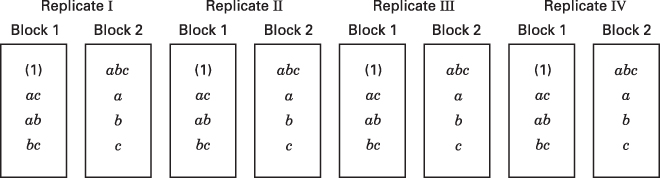

# 7.4 把 $2^{k}$ 因子设计混杂在两个区组中

假设我们希望做 $2^{2}$ 设计的单次重复。例如，$2^{2}=4$ 个处理组合各需要一定量的原材料，而每批原材料只够试验两个处理组合。因此需要两批原材料。如果把原材料批次看作区组，那么我们必须把四个处理组合中的两个分配给每个区组。

图 7.1 给出该问题的一种可能设计。几何视图（图 7.1a）表明，位于相对两条对角线上的处理组合被分配到不同的区组。由图 7.1b 可见，区组 1 包含处理组合 (1) 和 $ab$，区组 2 包含 $a$ 和 $b$。当然，区组内处理组合的进行顺序是随机确定的，先做哪个区组也是随机决定的。假设我们完全像没有区组化那样估计 A 与 B 的主效应。由式 6.1 和 6.2 得到

$$
\begin{array}{l} {A = \frac{1}{2} [a b + a - b - (1)]} \\ {B = \frac{1}{2} [a b + b - a - (1)]} \end{array}
$$

注意 A 与 B 都不受区组化影响，因为在每个估计中，来自每个区组的都有一个取正号和一个取负号的处理组合。也就是说，区组 1 与区组 2 之间的任何差别都会抵消。

现在考虑 $AB$ 交互作用

$$
AB = \frac{1}{2} [a b + (1) - a - b]
$$

由于两个取正号的处理组合 $[ab$ 与 (1)$]$ 在区组 1 中，两个取负号的处理组合（$a$ 与 $b$）在区组 2 中，所以区组效应与 $AB$ 交互作用是相同的。也就是说，$AB$ 与区组混杂。

这一点的原因从 $2^{2}$ 设计的正负号表可以看得很清楚。该表原先是表 6.2，为方便起见在这里重印为表 7.3。由该表可见，在 $AB$ 上取正号的所有处理组合都被分配到区组 1，而在 $AB$ 上取负号的所有处理组合都被分配到区组 2。这一做法可用来把任何效应（A、B 或 AB）与区组混杂。例如，如果把 (1) 和 $b$ 分配到区组 1、把 $a$ 和 $ab$ 分配到区组 2，那么主效应 A 就会与区组混杂。通常的做法是把**最高阶交互作用**与区组混杂。

**表 7.3 $2^{2}$ 设计的正负号表**

| 处理组合 | I | A | B | AB | 区组 |
| --- | --- | --- | --- | --- | --- |
| (1) | + | − | − | + | 1 |
| $a$ | + | + | − | − | 2 |
| $b$ | + | − | + | − | 2 |
| $ab$ | + | + | + | + | 1 |

**图 7.1 分成两个区组的 $2^{2}$ 设计**

这一方案可用来把任何 $2^{k}$ 设计混杂在两个区组中。作为第二个例子，考虑分成两个区组的 $2^{3}$ 设计。假设我们希望把三因子交互作用 $ABC$ 与区组混杂。由表 7.4 所示的正负号表，我们把在 $ABC$ 上取负号的处理组合分配到区组 1，把在 $ABC$ 上取正号的处理组合分配到区组 2。所得设计见图 7.2。我们再次强调，区组内的处理组合按随机顺序进行。

**表 7.4 $2^{3}$ 设计的正负号表**

| 处理组合 | I | A | B | AB | C | AC | BC | ABC | 区组 |
| --- | --- | --- | --- | --- | --- | --- | --- | --- | --- |
| (1) | + | − | − | + | − | + | + | − | 1 |
| $a$ | + | + | − | − | − | − | + | + | 2 |
| $b$ | + | − | + | − | − | + | − | + | 2 |
| $ab$ | + | + | + | + | − | − | − | − | 1 |
| $c$ | + | − | − | + | + | − | − | + | 2 |
| $ac$ | + | + | − | − | + | + | − | − | 1 |
| $bc$ | + | − | + | − | + | − | + | − | 1 |
| $abc$ | + | + | + | + | + | + | + | + | 2 |

**图 7.2 混杂 $ABC$ 的 $2^{3}$ 设计分成两个区组**

（几何视图；八个处理组合在两个区组中的分配）

**构造区组的其他方法。**构造这些设计还有另一种方法。该方法使用线性组合

$$
L = \alpha_{1} x_{1} + \alpha_{2} x_{2} + \dots + a_{k} x_{k} \tag{7.1}
$$

其中 $x_{i}$ 是出现在某个特定处理组合中的第 $i$ 个因子的水平，$\alpha_{i}$ 是待混杂效应中第 $i$ 个因子上的指数。对 $2^{k}$ 体系，我们有 $\alpha_{i}=0$ 或 1，$x_{i}=0$（低水平）或 $x_{i}=1$（高水平）。式 7.1 称为**定义对照**（defining contrast）。产生相同 $L$ 值（模 2）的处理组合将被放入同一个区组。由于 $L$（模 2）的可能取值只有 0 和 1，这就把 $2^{k}$ 个处理组合恰好分配到两个区组中。

为说明该做法，考虑 $ABC$ 与区组混杂的 $2^{3}$ 设计。这里 $x_{1}$ 对应 A，$x_{2}$ 对应 B，$x_{3}$ 对应 C，且 $\alpha_{1} = \alpha_{2} = \alpha_{3} = 1$。于是对应于 $ABC$ 的定义对照为

$$
L = x_{1} + x_{2} + x_{3}
$$

处理组合 (1) 在 (0, 1) 记号下写作 000，因此

$$
L = 1(0) + 1(0) + 1(0) = 0 = 0\ (\mathrm{mod}\ 2)
$$

类似地，处理组合 $a$ 是 100，给出

$$
L = 1(1) + 1(0) + 1(0) = 1 = 1 \pmod{2}
$$

因此 (1) 和 $a$ 将在不同区组中运行。对余下的处理组合，我们有

$$
\begin{array}{r l} b \colon L & = 1(0) + 1(1) + 1(0) = 1 = 1 (\text{mod}\ 2) \\ a b \colon L & = 1(1) + 1(1) + 1(0) = 2 = 0 (\text{mod}\ 2) \\ c \colon L & = 1(0) + 1(0) + 1(1) = 1 = 1 (\text{mod}\ 2) \\ a c \colon L & = 1(1) + 1(0) + 1(1) = 2 = 0 (\text{mod}\ 2) \\ b c \colon L & = 1(0) + 1(1) + 1(1) = 2 = 0 (\text{mod}\ 2) \\ a b c \colon L & = 1(1) + 1(1) + 1(1) = 3 = 1 (\text{mod}\ 2) \end{array}
$$

因此 (1)、$ab$、$ac$ 和 $bc$ 在区组 1 中运行，$a$、$b$、$c$ 和 $abc$ 在区组 2 中运行。这与图 7.2 所示的设计相同，该设计是由正负号表生成的。

还可以用另一种方法来构造这些设计。包含处理组合 (1) 的区组称为**主区组**（principal block）。主区组中的处理组合有一个有用的群论性质，即它们关于模 2 乘法构成一个群。这意味着主区组中任何元素 [除 (1) 外] 都可以由主区组中另外两个元素作模 2 乘法而生成。例如，考虑图 7.2 中 $ABC$ 混杂的 $2^{3}$ 设计的主区组。注意

$$
\begin{array}{r} a b \cdot a c = a^{2} b c = b c \\ a b \cdot b c = a b^{2} c = a c \\ a c \cdot b c = a b c^{2} = a b \end{array}
$$

另一个（或另一些）区组中的处理组合，可以由新区组中的一个元素与主区组中每个元素作模 2 乘法而生成。对 $ABC$ 混杂的 $2^{3}$ 设计，由于主区组是 (1)、$ab$、$ac$ 和 $bc$，而我们知道 $b$ 在另一个区组中，所以第二个区组的元素为

$$
\begin{array}{r c l} {b \cdot (1)} & = & b \\ {b \cdot a b = a b^{2}} & = & a \\ {b \cdot a c} & = & a b c \\ {b \cdot b c = b^{2} c} & = & c \end{array}
$$

这与前面所得结果一致。

**误差的估计。**当变量个数较少时，比如 $k = 2$ 或 3，通常必须重复试验才能得到误差的估计。例如，假设必须把 $ABC$ 混杂的 $2^{3}$ 因子试验安排在两个区组中运行，而试验者决定把该设计重复四次。所得设计可能如图 7.3 所示。注意 $ABC$ 在每次重复中都被混杂。

该设计的方差分析见表 7.5。共有 32 个观测值、31 个总自由度。此外，由于有八个区组，必须有七个自由度与这些区组相联系。表 7.5 给出了这七个自由度的一种分解方式。误差平方和实际上由重复与各效应（$A$、$B$、$C$、$AB$、$AC$、$BC$）之间的交互作用构成。通常可以放心地把这些交互作用视为零，并把所得均方当作误差的估计。主效应和两因子交互作用对误差均方作检验。Cochran 和 Cox (1957) 指出，可以把区组（或 $ABC$）均方与 $ABC$ 的误差均方作比较，后者实际上是重复 × 区组。这种检验通常很不灵敏。

**图 7.3 混杂 $ABC$ 的 $2^{3}$ 设计的四次重复**

如果资源足以允许对有混杂的设计作重复，一般最好在每次重复中对区组采用稍有不同的设计方法。这种做法是在每次重复中混杂一个不同的效应，从而获得关于所有效应的部分信息。这种程序称为**部分混杂**（partial confounding），将在 7.8 节讨论。

如果 $k$ 中等偏大，比如 $k \geq 4$，我们往往只负担得起单次重复。此时试验者通常假定高阶交互作用可以忽略，并把它们的平方和合并作为误差。因子效应的正态概率图对此很有帮助。

**表 7.5 混杂 $ABC$ 的 $2^{3}$ 设计四次重复的方差分析**

| 变异来源 | 自由度 |
| --- | --- |
| 重复 | 3 |
| 区组 (ABC) | 1 |
| ABC 的误差（重复 × 区组） | 3 |
| A | 1 |
| B | 1 |
| C | 1 |
| AB | 1 |
| AC | 1 |
| BC | 1 |
| 误差（或重复 × 效应） | 18 |
| 总计 | 31 |

## 例 7.2

考虑例 6.2 所描述的情形。回顾该例研究了四个因子——温度 (A)、压力 (B)、甲醛浓度 (C) 和搅拌速率 (D)——在中间试验工厂中对产品过滤速率的影响。我们将用这一试验来说明无重复设计中区组化与混杂的想法。我们对原试验作两处改动。第一，假设 $2^{4} = 16$ 个处理组合不能全部用同一批原材料完成。试验者用单批材料可以做八个处理组合，所以把 $2^{4}$ 设计混杂在两个区组中看起来是合适的。合乎逻辑的做法是把最高阶交互作用 $ABCD$ 与区组混杂。定义对照为

$$
L = x_{1} + x_{2} + x_{3} + x_{4}
$$

容易验证设计如图 7.4 所示。另一种做法是查看表 6.11，注意到在 $ABCD$ 列中取 + 的处理组合被分配到区组 1，在 $ABCD$ 列中取 − 的处理组合在区组 2 中。

我们要作的第二处改动是引入一个区组效应，以演示区组化的作用。假设在选取运行该试验所需的两批原材料时，其中一批质量差得多，结果是该批材料的所有响应都比另一批低 20 个单位。质量差的那批成为区组 1，质量好的那批成为区组 2（哪批称为区组 1、哪批称为区组 2 无关紧要）。现在区组 1 中的所有试验先做（当然，区组内的八次试验按随机顺序进行），但响应比使用好质量材料时低 20 个单位。图 7.4b 给出所得的响应——注意这些响应是把区组效应从例 6.2 给出的原始观测值中减去而得到的。也就是说，处理组合 (1) 的原始响应为 45，而在图 7.4b 中记为 $(1) = 25\ (= 45 - 20)$。该区组中其他响应也类似得到。区组 1 的试验做完后，接着做区组 2 的八次试验。这批原材料没有问题，所以响应与例 6.2 中原先的完全一样。

**图 7.4 例 7.2 的 $2^{4}$ 设计分成两个区组**

"修改后"的例 6.2 的效应估计见表 7.6。注意四个主效应、六个两因子交互作用和四个三因子交互作用的估计与例 6.2 中（那里

**表 7.6 例 7.2 中区组化 $2^{4}$ 设计的效应估计**

| 模型项 | 回归系数 | 效应估计 | 平方和 | 百分比贡献 |
| --- | --- | --- | --- | --- |
| A | 10.81 | 21.625 | 1870.5625 | 26.30 |
| B | 1.56 | 3.125 | 39.0625 | 0.55 |
| C | 4.94 | 9.875 | 390.0625 | 5.49 |
| D | 7.31 | 14.625 | 855.5625 | 12.03 |
| AB | 0.062 | 0.125 | 0.0625 | <0.01 |
| AC | −9.06 | −18.125 | 1314.0625 | 18.48 |
| AD | 8.31 | 16.625 | 1105.5625 | 15.55 |
| BC | 1.19 | 2.375 | 22.5625 | 0.32 |
| BD | −0.19 | −0.375 | 0.5625 | <0.01 |
| CD | −0.56 | −1.125 | 5.0625 | 0.07 |
| ABC | 0.94 | 1.875 | 14.0625 | 0.20 |
| ABD | 2.06 | 4.125 | 68.0625 | 0.96 |
| ACD | −0.81 | −1.625 | 10.5625 | 0.15 |
| BCD | −1.31 | −2.625 | 27.5625 | 0.39 |
| 区组 (ABCD) | | −18.625 | 1387.5625 | 19.51 |

没有区组效应时）所得的效应估计完全相同。对这些效应估计作正态概率图时，因子 A、C、D 以及 $AC$、$AD$ 交互作用作为重要效应浮现出来，与原试验一样。（读者应自行验证。）

那么 $ABCD$ 交互作用效应如何呢？在原试验（例 6.2）中该效应的估计为 $ABCD = 1.375$。在本例中，$ABCD$ 交互作用效应的估计为 $ABCD = -18.625$。由于 $ABCD$ 与区组混杂，$ABCD$ 估计的是原交互效应（1.375）加上区组效应（−20），所以 $ABCD = 1.375 + (-20) = -18.625$。（你能看出区组效应为什么是 −20 吗？）区组效应也可以直接由两个区组平均响应之差算出，即

$$
\begin{array}{r l} \text{区组效应} & = \overline{{y}}_{\text{区组 1}} - \overline{{y}}_{\text{区组 2}} \\ & = \frac{406}{8} - \frac{555}{8} \\ & = \frac{- 149}{8} \\ & = - 18.625 \end{array}
$$

当然，这个效应真正估计的是区组 + ABCD。

表 7.7 汇总了该试验的方差分析。估计值大的效应被纳入模型，区组平方和为

$$
SS_{\text{Blocks}} = \frac{(406)^{2} + (555)^{2}}{8} - \frac{(961)^{2}}{16} = 1387.5625
$$

该试验的结论与不存在区组效应的例 6.2 的结论完全一致。

注意，如果该试验没有在区组中运行，而一个大小为 −20 的效应影响了前八次试验（在无区组设计中这 16 次试验按随机顺序进行，所以这八次是随机选出的），那么结果可能大不相同。

**表 7.7 例 7.2 的方差分析**

| 变异来源 | 平方和 | 自由度 | 均方 | $F_0$ | $P$ 值 |
| --- | --- | --- | --- | --- | --- |
| 区组 (ABCD) | 1387.5625 | 1 | | | |
| A | 1870.5625 | 1 | 1870.5625 | 89.76 | <0.0001 |
| C | 390.0625 | 1 | 390.0625 | 18.72 | 0.0019 |
| D | 855.5625 | 1 | 855.5625 | 41.05 | 0.0001 |
| AC | 1314.0625 | 1 | 1314.0625 | 63.05 | <0.0001 |
| AD | 1105.5625 | 1 | 1105.5625 | 53.05 | <0.0001 |
| 误差 | 187.5625 | 9 | 20.8403 | | |
| 总计 | 7110.9375 | 15 | | | |

下面的显示给出假定区组为随机、用 REML 作分析时 JMP 的输出。该分析只考虑主效应和两因子交互作用，但基本上与例 7.2 给出的分析一致，把因子 X1、X3、X4 以及两个交互作用 X1X3 和 X1X4 识别为显著。区组方差分量的置信区间极宽且包含零。这大概是只有两个区组、只有一个自由度用来估计与区组相联系的方差分量所造成的假象。

Response Y

Effect Summary

| Source | LogWorth | P-Value |
| --- | --- | --- |
| X1 | 2.855 | 0.00140 |
| X1*X3 | 2.567 | 0.00271 |
| X1*X4 | 2.428 | 0.00373 |
| X4 | 2.226 | 0.00595 |
| X3 | 1.644 | 0.02272 |
| X2 | 0.498 | 0.31795 |
| X2*X3 | 0.361 | 0.43518 |
| X3*X4 | 0.153 | 0.70257 |
| X2*X4 | 0.047 | 0.89781 |
| X1*X2 | 0.015 | 0.96582 |

Summary of Fit

| RSquare | 0.982998 |
| --- | --- |
| RSquare Adj | 0.948994 |
| Root Mean Square Error | 5.482928 |
| Mean of Response | 60.0625 |
| Observations (or Sum Wgts) | 16 |

Parameter Estimates

| Term | Estimate | Std Error | DFDen | t Ratio | Prob > \|t\| |
| --- | --- | --- | --- | --- | --- |
| Intercept | 60.0625 | 9.3125 | 1 | 6.45 | 0.0979 |
| X1 | 10.8125 | 1.370732 | 4 | 7.89 | 0.0014* |
| X2 | 1.5625 | 1.370732 | 4 | 1.14 | 0.3180 |
| X3 | 4.9375 | 1.370732 | 4 | 3.60 | 0.0227* |
| X4 | 7.3125 | 1.370732 | 4 | 5.33 | 0.0059* |
| X1*X2 | 0.0625 | 1.370732 | 4 | 0.05 | 0.9658 |
| X1*X3 | −9.0625 | 1.370732 | 4 | −6.61 | 0.0027* |
| X1*X4 | 8.3125 | 1.370732 | 4 | 6.06 | 0.0037* |
| X2*X3 | 1.1875 | 1.370732 | 4 | 0.87 | 0.4352 |
| X2*X4 | −0.1875 | 1.370732 | 4 | −0.14 | 0.8978 |
| X3*X4 | −0.5625 | 1.370732 | 4 | −0.41 | 0.7026 |

Fixed Effect Tests

| Source | Nparm | DF | DFDen | F Ratio | Prob > F |
| --- | --- | --- | --- | --- | --- |
| X1 | 1 | 1 | 4 | 62.2225 | 0.0014* |
| X2 | 1 | 1 | 4 | 1.2994 | 0.3180 |
| X3 | 1 | 1 | 4 | 12.9751 | 0.0227* |
| X4 | 1 | 1 | 4 | 28.4595 | 0.0059* |
| X1*X2 | 1 | 1 | 4 | 0.0021 | 0.9658 |
| X1*X3 | 1 | 1 | 4 | 43.7110 | 0.0027* |
| X1*X4 | 1 | 1 | 4 | 36.7755 | 0.0037* |
| X2*X3 | 1 | 1 | 4 | 0.7505 | 0.4352 |
| X2*X4 | 1 | 1 | 4 | 0.0187 | 0.8978 |
| X3*X4 | 1 | 1 | 4 | 0.1684 | 0.7026 |

REML Variance Component Estimates

| Random Effect | Var Ratio | Var Component | Std Error | 95% Lower | 95% Upper | Pct of Total |
| --- | --- | --- | --- | --- | --- | --- |
| Block | 5.6444906 | 169.6875 | 245.30311 | −311.0978 | 650.47275 | 84.950 |
| Residual | | 30.0625 | 21.257398 | 10.791251 | 248.23574 | 15.050 |
| Total | | 199.75 | 245.99293 | 45.07048 | 41373.205 | 100.000 |

−2 Log Likelihood = 65.536279358
Note: Total is the sum of the positive variance components.
Total including negative estimates = 199.75

