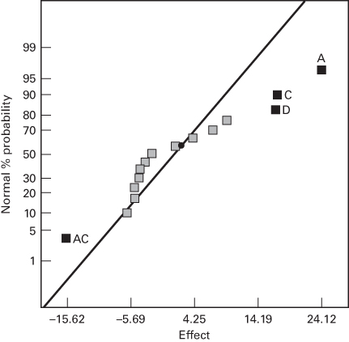

# 7.5 又一个说明区组化为何重要的例示

区组化是一种非常有用且重要的设计技术。在第 4 章我们指出，区组化在降低试验噪声方面有如此巨大的潜力，因此试验者应始终考虑干扰因子的潜在影响，拿不准时就作区组化。

为说明试验者在应当区组化时没有区组化会发生什么，考虑上一节例 7.2 的一个变体。在该例中我们利用了最初作为例 6.2 给出的 $2^{4}$ 无重复因子试验。我们把该设计安排在两个各含八次试验的区组中，并插入了一个大小为 $-20$ 的"区组效应"或干扰因子效应，它影响区组 1 中的所有观测（参见图 7.4）。现在假设我们没有把该设计安排在区组中，而这个 $-20$ 的干扰因子效应影响了所取的前八个观测（按随机顺序或试验顺序）。修改后的数据见表 7.8。

图 7.5 是这个修改版试验的因子效应正态概率图。注意虽然这张图的外观与第 6 章原分析中给出的图（参见图 6.11）差别不太大，但一个重要交互作用 $AD$ 没有被识别出来。因此我们将发现不了这个重要效应，而它恰恰是解决原问题的关键之一。我们在第 4 章说过区组化是一种降噪技术。如果不作区组化，那么来自干扰变量效应的额外变异最终会被分摊到其他设计因子上。

一部分干扰变异还会进入误差估计。基于表 7.8 数据的模型，其残差均方约为 109，比基于原始数据的残差均方（见表 6.13）大好几倍。

**表 7.8 例 7.2 的修改后数据**

| 试验顺序 | 标准顺序 | 因子 A：温度 | 因子 B：压力 | 因子 C：浓度 | 因子 D：搅拌速率 | 响应：过滤速率 |
| --- | --- | --- | --- | --- | --- | --- |
| 8 | 1 | −1 | −1 | −1 | −1 | 25 |
| 11 | 2 | 1 | −1 | −1 | −1 | 71 |
| 1 | 3 | −1 | 1 | −1 | −1 | 28 |
| 3 | 4 | 1 | 1 | −1 | −1 | 45 |
| 9 | 5 | −1 | −1 | 1 | −1 | 68 |
| 12 | 6 | 1 | −1 | 1 | −1 | 60 |
| 2 | 7 | −1 | 1 | 1 | −1 | 60 |
| 13 | 8 | 1 | 1 | 1 | −1 | 65 |
| 7 | 9 | −1 | −1 | −1 | 1 | 23 |
| 6 | 10 | 1 | −1 | −1 | 1 | 80 |
| 16 | 11 | −1 | 1 | −1 | 1 | 45 |
| 5 | 12 | 1 | 1 | −1 | 1 | 84 |
| 14 | 13 | −1 | −1 | 1 | 1 | 75 |
| 15 | 14 | 1 | −1 | 1 | 1 | 86 |
| 10 | 15 | −1 | 1 | 1 | 1 | 70 |
| 4 | 16 | 1 | 1 | 1 | 1 | 76 |

**图 7.5 表 7.8 中数据的正态概率图**
