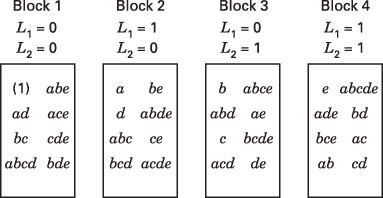

# 7.6 把 $2^{k}$ 因子设计混杂在四个区组中

可以把 $2^{k}$ 因子设计混杂在四个区组中，每个区组含 $2^{k-2}$ 个观测。当因子个数中等偏大（比如 $k \geq 4$）而区组又相对较小时，这些设计特别有用。

作为一个例子，考虑 $2^{5}$ 设计。如果每个区组只能容纳八次试验，那就必须使用四个区组。这种设计的构造相当直接。选择两个要与区组混杂的效应，比如说 $ADE$ 和 $BCE$。它们对应两个定义对照

$$
\begin{array}{l} {L_{1} = x_{1} + x_{4} + x_{5}} \\ {L_{2} = x_{2} + x_{3} + x_{5}} \end{array}
$$

现在每个处理组合都会给出 $L_{1}$（模 2）与 $L_{2}$（模 2）的一对特定值，即 $(L_{1}, L_{2}) = (0, 0)$、$(0, 1)$、$(1, 0)$ 或 $(1, 1)$ 之一。产生相同 $(L_{1}, L_{2})$ 值的处理组合被分配到同一个区组。在我们的例子中可得

$$
\begin{array}{l l} L_{1} = 0, L_{2} = 0 & \text{对应} \quad (1), a d, b c, a b c d, a b e, a c e, c d e, b d e \\ L_{1} = 1, L_{2} = 0 & \text{对应} \quad a, d, a b c, b c d, b e, a b d e, c e, a c d e \\ L_{1} = 0, L_{2} = 1 & \text{对应} \quad b, a b d, c, a c d, a e, d e, a b c e, b c d e \\ L_{1} = 1, L_{2} = 1 & \text{对应} \quad e, a d e, b c e, a b c d e, a b, b d, a c, c d \end{array}
$$

这些处理组合将被分配到不同的区组。完整设计如图 7.6 所示。

**图 7.6 分成四个区组并混杂 $ADE$、$BCE$ 和 $ABCD$ 的 $2^{5}$ 设计**

稍加思考就会发现，除 $ADE$ 和 $BCE$ 之外必然还有另一个效应与区组混杂。由于有四个区组，它们之间有 3 个自由度，而 $ADE$ 和 $BCE$ 各只有 1 个自由度，所以显然还必须混杂一个具有 1 个自由度的额外效应。这个效应就是 $ADE$ 与 $BCE$ 的**广义交互作用**（generalized interaction），它定义为 $ADE$ 与 $BCE$ 的模 2 乘积。因此在本例中，广义交互作用 $(ADE)(BCE) = ABCDE^{2} = ABCD$ 也与区组混杂。借助 $2^{5}$ 设计的正负号表（例如 Davies (1956) 一书中的正负号表）很容易验证这一点。查看这样的表可以发现，处理组合按如下方式分配到各区组：

| 各区组中的处理组合 | $ADE$ 的符号 | $BCE$ 的符号 | $ABCD$ 的符号 |
| --- | --- | --- | --- |
| 区组 1 | − | − | + |
| 区组 2 | + | − | − |
| 区组 3 | − | + | − |
| 区组 4 | + | + | + |

注意某个特定区组处任意两个效应的符号之积给出该区组处第三个效应的符号（本例中即 $ABCD$）。因此 $ADE$、$BCE$ 和 $ABCD$ 都与区组混杂。

7.4 节提到的主区组的群论性质仍然成立。例如，我们看到主区组中两个处理组合之积给出主区组中的另一个元素。即

$$
a d \cdot b c = a b c d \quad \text{和} \quad a b e \cdot b d e = a b^{2} d e^{2} = a d
$$

等等。要构造另一个区组，选取一个不在主区组中的处理组合（例如 $b$），并把 $b$ 与主区组中所有处理组合相乘。这给出

$$
b \cdot (1) = b \quad b \cdot a d = a b d \quad b \cdot b c = b^{2} c = c \quad b \cdot a b c d = a b^{2} c d = a c d
$$

等等，从而产生区组 3 中的八个处理组合。在实际操作中，主区组可以由定义对照和群论性质得到，其余各区组则可由这些处理组合按上述方法确定。

构造混杂在四个区组中的 $2^{k}$ 设计的一般步骤是：选择两个效应来生成区组，这会自动混杂第三个效应，即前两者的广义交互作用。然后，利用两个定义对照 $(L_{1}, L_{2})$ 和主区组的群论性质构造该设计。在选择要与区组混杂的效应时必须小心，以获得一个不混杂可能有兴趣的效应的设计。例如，在 $2^{5}$ 设计中，我们可能选择混杂 $ABCDE$ 和 $ABD$，这会自动混杂 $CE$，而 $CE$ 很可能是感兴趣的效应。更好的选择是混杂 $ADE$ 和 $BCE$，它自动混杂 $ABCD$。牺牲 $ADE$ 和 $BCE$ 这两个三因子交互作用上的信息，比牺牲两因子交互作用 $CE$ 更为可取。
