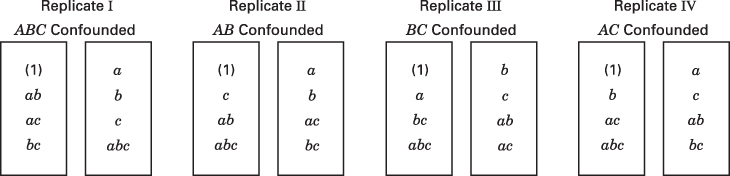

# 7.8 部分混杂

我们在 7.4 节提到，除非试验者事先有误差的估计，或者愿意假定某些交互作用可以忽略，否则必须重复设计才能得到误差的估计。图 7.3 给出 $ABC$ 混杂的 $2^{3}$ 因子设计分成两个区组、重复四次的情形。由该设计的方差分析（表 7.5）可以看到，关于 $ABC$ 交互作用的信息无法找回，因为 $ABC$ 在每次重复中都同区组混杂。这样的设计称为**完全混杂**（completely confounded）的设计。

考虑图 7.7 所示的另一种做法。这里同样是 $2^{3}$ 设计的四次重复，但每次重复中混杂的是不同的交互作用。也就是说，重复 I 中混杂 $ABC$，重复 II 中混杂 $AB$，重复 III 中混杂 $BC$，重复 IV 中混杂 $AC$。结果，关于 $ABC$ 的信息可以从重复 II、III、IV 的数据中得到；关于 $AB$ 的信息可以从重复 I、III、IV 中得到；关于 $AC$ 的信息可以从重复 I、II、III 中得到；关于 $BC$ 的信息可以从重复 I、II、IV 中得到。我们说关于这些交互作用可以得到 3/4 的信息，因为它们只在三次重复中未被混杂。Yates (1937) 把比值 3/4 称为混杂效应的**相对信息量**（relative information）。这样的设计称为**部分混杂**（partially confounded）的设计。

该设计的方差分析见表 7.10。在计算各交互作用的平方和时，只使用该交互作用未被混杂的那些重复的数据。误差平方和由重复 × 主效应的平方和，加上各重复中该交互作用未被混杂时的重复 × 交互作用平方和构成（例如，对重复 II、III、IV 而言是重复 × $ABC$）。此外，八个区组之间有七个自由度，这通常分解为重复的 3 个自由度和重复内区组的 4 个自由度。区组平方和的构成见表 7.10，它直接由各重复中混杂效应的选择决定。

**图 7.7 $2^{3}$ 设计中的部分混杂**

**表 7.10 部分混杂的 $2^{3}$ 设计的方差分析**

| 变异来源 | 自由度 |
| --- | --- |
| 重复 | 3 |
| 重复内区组［或 $ABC$（重复 I）+ $AB$（重复 II）+ $BC$（重复 III）+ $AC$（重复 IV）］ | 4 |
| A | 1 |
| B | 1 |
| C | 1 |
| AB（来自重复 I、III、IV） | 1 |
| AC（来自重复 I、II、III） | 1 |
| BC（来自重复 I、II、IV） | 1 |
| ABC（来自重复 II、III、IV） | 1 |
| 误差 | 17 |
| 总计 | 31 |

## 例 7.3 带部分混杂的 $2^{3}$ 设计

考虑例 6.1，其中进行了一项试验以开发等离子刻蚀工艺。共有三个因子：A = 间距、B = 气体流量、C = 射频功率，响应变量为刻蚀速率。假设一个班次内只能试验四个处理组合，并且由于刻蚀设备性能可能存在班次之间的差异，试验者决定把班次用作区组因子。因此，$2^{3}$ 设计的每次重复必须分成两个区组运行。共运行两次重复，重复 I 混杂 $ABC$，重复 II 混杂 $AB$。数据如下：

| 重复 I：混杂 $ABC$ | | 重复 II：混杂 $AB$ | |
| --- | --- | --- | --- |
| (1) = 550 | $a$ = 669 | (1) = 604 | $a$ = 650 |
| $ab$ = 642 | $b$ = 633 | $c$ = 1052 | $b$ = 601 |
| $ac$ = 749 | $c$ = 1037 | $ab$ = 635 | $ac$ = 868 |
| $bc$ = 1075 | $abc$ = 729 | $abc$ = 860 | $bc$ = 1063 |

$A$、$B$、$C$、$AC$ 和 $BC$ 的平方和可以用全部 16 个观测按通常方式计算。

不过，我们必须只用重复 II 的数据求 $SS_{ABC}$、只用重复 I 的数据求 $SS_{AB}$，如下：

$$
\begin{array}{r l} SS_{AB C} & = \frac{[a + b + c + a b c - a b - a c - b c - (1)]^{2}}{n 2^{k}} \\ & = \frac{[650 + 601 + 1052 + 860 - 635 - 868 - 1063 - 604]^{2}}{(1)(8)} = 6.1250 \\ SS_{AB} & = \frac{[(1) + a b c - a c + c - a - b + a b - b c]^{2}}{n 2^{k}} \\ & = \frac{[550 + 729 - 749 + 1037 - 669 - 633 + 642 - 1075]^{2}}{(1)(8)} = 3528.0 \end{array}
$$

重复的平方和一般地为

$$
\begin{array}{r l} SS_{\mathrm{Rep}} & = \sum_{h = 1}^{n} \frac{R_{h}^{2}}{2^{k}} - \frac{y_{...}^{2}}{N} \\ & = \frac{(6084)^{2} + (6333)^{2}}{8} - \frac{(12{,}417)^{2}}{16} = 3875.0625 \end{array}
$$

其中 $R_{h}$ 是第 $h$ 次重复中观测值的总和。区组平方和是来自重复 I 的 $SS_{ABC}$ 与来自重复 II 的 $SS_{AB}$ 之和，即 $SS_{Blocks} = 458.1250$。

方差分析汇总于表 7.11。主效应 A、C 以及 $AC$ 交互作用是重要的。

**表 7.11 例 7.3 的方差分析**

| 变异来源 | 平方和 | 自由度 | 均方 | $F_0$ | $P$ 值 |
| --- | --- | --- | --- | --- | --- |
| 重复 | 3875.0625 | 1 | 3875.0625 | — | |
| 重复内区组 | 458.1250 | 2 | 229.0625 | — | |
| A | 41,310.5625 | 1 | 41,310.5625 | 16.20 | 0.01 |
| B | 217.5625 | 1 | 217.5625 | 0.08 | 0.78 |
| C | 374,850.5625 | 1 | 374,850.5625 | 146.97 | <0.001 |
| AB（仅重复 I） | 3528.0000 | 1 | 3528.0000 | 1.38 | 0.29 |
| AC | 94,404.5625 | 1 | 94,404.5625 | 37.01 | <0.001 |
| BC | 18.0625 | 1 | 18.0625 | 0.007 | 0.94 |
| ABC（仅重复 II） | 6.1250 | 1 | 6.1250 | 0.002 | 0.96 |
| 误差 | 12,752.3125 | 5 | 2550.4625 | | |
| 总计 | 531,420.9375 | 15 | | | |
