CHAPTER 8

# Two-Level Fractional Factorial Designs

CHAPTER LEARNING OBJECTIVES

1. Know how to construct and analyze $2^{k - p}$ fractional factorial designs.

2. Know how to construct fractional factorials in blocks.

3. Understand how to determine the alias structure of a fractional factorial design.

4. Understand the concepts of design resolution and minimum aberration.

5. Know how to use fold over to augment a fractional factorial to simplify the alias relationships.

6. Know how to use other design augmentation strategies, such as optimal augmentation and partial fold over.

7. Know how to construct and analyze supersaturated designs.

## 8.1 Introduction

As the number of factors in a $2^{k}$ factorial design increases, the number of runs required for a complete replicate of the design rapidly outgrows the resources of most experimenters. For example, a complete replicate of the $2^{6}$ design requires 64 runs. In this design, only 6 of the 63 degrees of freedom correspond to main effects, and only 15 degrees of freedom correspond to two-factor interactions. There are only 21 degrees of freedom associated with effects that are likely to be of major interest. The remaining 42 degrees of freedom are associated with three-factor and higher interactions.

If the experimenter can reasonably assume that certain high-order interactions are negligible, information on the main effects and low-order interactions may be obtained by running only a fraction of the complete factorial experiment. These fractional factorial designs are among the most widely used types of designs for product and process design, process improvement, and industrial/business experimentation.

A major use of fractional factorials is in screening experiments—experiments in which many factors are considered and the objective is to identify those factors (if any) that have large effects. Screening experiments are usually performed in the early stages of a project when many of the factors initially considered likely have little or no effect on the response. The factors identified as important are then investigated more thoroughly in subsequent experiments.

The successful use of fractional factorial designs is based on three key ideas:

1. The sparsity of effects principle. When there are several variables, the system or process is likely to be driven primarily by some of the main effects and low-order interactions. Sparsity of effects usually implies that no more than about half the number of effects will be active. For example, if there are 4 factors, then there are 15 effects, and effect sparsity suggests that no more than 6 or 7 of these will be active.

2. The projection property. Fractional factorial designs can be projected into stronger (larger) designs in the subset of significant factors.

3. Sequential experimentation. It is possible to combine the runs of two (or more) fractional factorials to construct sequentially a larger design to estimate the factor effects and interactions of interest.

We will focus on these principles in this chapter and illustrate them with several examples.

## 8.2 The One-Half Fraction of the $2^{k}$ Design

## 8.2.1 Definitions and Basic Principles

Consider a situation in which three factors, each at two levels, are of interest, but the experimenters cannot afford to run all $2^{3} = 8$ treatment combinations. They can, however, afford four runs. This suggests a one-half fraction of a $2^{3}$ design. Because the design contains $2^{3-1} = 4$ treatment combinations, a one-half fraction of the $2^{3}$ design is often called a $2^{3-1}$ design.

The table of plus and minus signs for the $2^{3}$ design is shown in Table 8.1. Suppose we select the four treatment combinations a, b, c, and abc as our one-half fraction. These runs are shown in the top half of Table 8.1 and in Figure 8.1a.

Notice that the $2^{3-1}$ design is formed by selecting only those treatment combinations that have a plus in the ABC column. Thus, ABC is called the generator of this particular fraction. Usually, we will refer to a generator such as ABC as a word. Furthermore, the identity column I is also always plus, so we call

$$
I = A B C
$$

the defining relation for our design. In general, the defining relation for a fractional factorial will always be the set of all columns that are equal to the identity column $I$ .

The treatment combinations in the $2^{3-1}$ design yield three degrees of freedom that we may use to estimate the main effects. Referring to Table 8.1, we note that the linear combinations of the observations used to estimate the main effects of A, B, and C are

$$
[ A ] = \frac {1}{2} (a - b - c + a b c)
$$

$$
[ B ] = \frac {1}{2} (- a + b - c + a b c)
$$

$$
[ C ] = \frac {1}{2} (- a - b + c + a b c)
$$

where the notation $[A]$ , $[B]$ , and $[C]$ is used to indicate the linear combinations associated with the main effects. It is also easy to verify that the linear combinations of the observations used to estimate the two-factor interactions are

$$
[ B C ] = \frac {1}{2} (a - b - c + a b c)
$$

$$
[ A C ] = \frac {1}{2} (- a + b - c + a b c)
$$

$$
[ A B ] = \frac {1}{2} (- a - b + c + a b c)
$$

TABLE 8.1  
Plus and Minus Signs for the $2^{3}$ Factorial Design

<table><tr><td rowspan="2">Treatment Combination</td><td colspan="8">Factorial Effect</td></tr><tr><td>I</td><td>A</td><td>B</td><td>C</td><td>AB</td><td>AC</td><td>BC</td><td>ABC</td></tr><tr><td>a</td><td>+</td><td>+</td><td>-</td><td>-</td><td>-</td><td>-</td><td>+</td><td>+</td></tr><tr><td>b</td><td>+</td><td>-</td><td>+</td><td>-</td><td>-</td><td>+</td><td>-</td><td>+</td></tr><tr><td>c</td><td>+</td><td>-</td><td>-</td><td>+</td><td>+</td><td>-</td><td>-</td><td>+</td></tr><tr><td>abc</td><td>+</td><td>+</td><td>+</td><td>+</td><td>+</td><td>+</td><td>+</td><td>+</td></tr><tr><td>ab</td><td>+</td><td>+</td><td>+</td><td>-</td><td>+</td><td>-</td><td>-</td><td>-</td></tr><tr><td>ac</td><td>+</td><td>+</td><td>-</td><td>+</td><td>-</td><td>+</td><td>-</td><td>-</td></tr><tr><td>bc</td><td>+</td><td>-</td><td>+</td><td>+</td><td>-</td><td>-</td><td>+</td><td>-</td></tr><tr><td>(1)</td><td>+</td><td>-</td><td>-</td><td>-</td><td>+</td><td>+</td><td>+</td><td>-</td></tr></table>

■ FIGURE 8.1 The two one-half fractions of the $2^{3}$ design

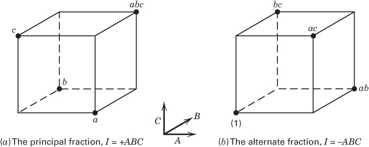

Thus, $[A] = [BC]$ , $[B] = [AC]$ , and $[C] = [AB]$ ; consequently, it is impossible to differentiate between A and BC, B and AC, and C and AB. In fact, when we estimate A, B, and C we are really estimating $A + BC$ , $B + AC$ , and $C + AB$ . Two or more effects that have this property are called aliases. In our example, A and BC are aliases, B and AC are aliases, and C and AB are aliases. We indicate this by the notation $[A] \to A + BC$ , $[B] \to B + AC$ , and $[C] \to C + AB$ .

The alias structure for this design may be easily determined by using the defining relation I = ABC. Multiplying any column (or effect) by the defining relation yields the aliases for that column (or effect). In our example, this yields as the alias of A

$$
A \cdot I = A \cdot A B C = A ^ {2} B C
$$

or, because the square of any column is just the identity I,

$$
A = B C
$$

Similarly, we find the aliases of B and C as

$$
\begin{array}{c} {B \cdot I = B \cdot A B C} \\ {B = A B ^ {2} C = A C} \end{array}
$$

and

$$
\begin{array}{c} C \cdot I = C \cdot A B C \\ C = A B C ^ {2} = A B \end{array}
$$

This one-half fraction, with $I = +ABC$ , is usually called the principal fraction.

Now suppose that we had chosen the other one-half fraction, that is, the treatment combinations in Table 8.1 associated with minus in the ABC column. This alternate, or complementary, one-half fraction (consisting of the runs (1), ab, ac, and bc) is shown in Figure 8.1b. The defining relation for this design is

$$
I = - A B C
$$

The linear combination of the observations, say $[A]'$ , $[B]'$ , and $[C]'$ , from the alternate fraction gives us

$$
\begin{array}{l} {[ A ] ^ {\prime} \to A - B C} \\ {[ B ] ^ {\prime} \to B - A C} \\ {[ C ] ^ {\prime} \to C - A B} \end{array}
$$

Thus, when we estimate $A, B$ , and $C$ with this particular fraction, we are really estimating $A - BC, B - AC$ , and $C - AB$ .

In practice, it does not matter which fraction is actually used. Both fractions belong to the same family; that is, the two one-half fractions form a complete $2^{3}$ design. This is easily seen by reference to parts $a$ and $b$ of Figure 8.1.

Suppose that after running one of the one-half fractions of the $2^{3}$ design, the other fraction was also run. Thus, all eight runs associated with the full $2^{3}$ are now available. We may now obtain de-aliased estimates of all the effects by analyzing the eight runs as a full $2^{3}$ design in two blocks of four runs each. This could also be done by adding and subtracting the linear combination of effects from the two individual fractions. For example, consider $[A] \rightarrow A + BC$ and $[A]' \rightarrow A - BC$ . This implies that

$$
\frac {1}{2} ([ A ] + [ A ] ^ {\prime}) = \frac {1}{2} (A + B C + A - B C) \rightarrow A
$$

and that

$$
\frac {1}{2} ([ A ] - [ A ] ^ {\prime}) = \frac {1}{2} (A + B C - A + B C) \rightarrow B C
$$

Thus, for all three pairs of linear combinations, we would obtain the following:

<table><tr><td>i</td><td>From  $\frac{1}{2}([i] + [i]' )$ </td><td>From  $\frac{1}{2}([i] - [i]' )$ </td></tr><tr><td>A</td><td>A</td><td>BC</td></tr><tr><td>B</td><td>B</td><td>AC</td></tr><tr><td>C</td><td>C</td><td>AB</td></tr></table>

Furthermore, by assembling the full $2^{3}$ in this fashion with I = +ABC in the first group of runs and I = -ABC in the second, the $2^{3}$ confounds ABC with blocks.

More About Effect Sparsity. As noted earlier, effect sparsity is one of the reasons that fractional factorial designs are so successful. This phenomenon has been observed empirically by experimenters in many fields for decades. However, a recent paper by Li, Sudarsanam, and Frey (2006) provides more objective evidence of effect sparsity.

Li, Sudarsanam, and Frey (2006) reexamined 133 response variables from published full factorial experiments with from 3 to 7 factors. They reanalyzed all of the responses. They found that in the experiments that they studied 41% of the main effects were active. Generally, the size of an active main effect was twice the size of an active two-factor interaction. The percent of active two-factor interactions overall was 11%. Interactions beyond order two were extremely rare. They also reported some “conditional” percentages regarding active two-factor interactions:

\- A two-factor interaction was active and both main effects involved in that interaction were active occurred $33\%$ of the time.

\- A two-factor interaction was active but only one of the main effects involved in that interaction was active occurred 4.5% of the time.

\- A two-factor interaction was active and neither of the main effects involved in that interaction was active occurred only 0.5% of the time.

These results strongly support the sparsity of effects assumption. They also support the usual assumptions of model hierarchy and effect heredity. However, the results are strongly dependent on the types of experiments analyzed. If more experiments involving chemical processes and systems and biological systems were included, two-factor interactions would probably be more likely to occur. Three-factor interactions can be encountered in some of these systems. For example, consider a three-factor chemical process experiment involving two continuous factor, time and temperature, and a categorical factor, catalyst type. If the two-factor interaction involving time and temperature is different for each catalyst type, then there is a three-factor interaction.

## 8.2.2 Design Resolution

The preceding $2^{3-1}$ design is called a resolution III design. In such a design, main effects are aliased with two-factor interactions. A design is of resolution R if no p-factor effect is aliased with another effect containing less than R - p factors. We usually employ a Roman numeral subscript to denote design resolution; thus, the one-half fraction of the $2^{3}$ design with the defining relation I = ABC (or I = -ABC) is a $2_{III}^{3-1}$ design.

Designs of resolution III, IV, and V are particularly important. The definitions of these designs and an example of each follow:

1. Resolution III designs. These are designs in which no main effects are aliased with any other main effect, but main effects are aliased with two-factor interactions and some two-factor interactions may be aliased with each other. The $2^{3-1}$ design in Table 8.1 is of resolution III ( $2_{III}^{3-1}$ ).

2. Resolution IV designs. These are designs in which no main effect is aliased with any other main effect or with any two-factor interaction, but two-factor interactions are aliased with each other. A $2^{4-1}$ design with I = ABCD is a resolution IV design ( $2_{IV}^{4-1}$ ).

3. Resolution V designs. These are designs in which no main effect or two-factor interaction is aliased with any other main effect or two-factor interaction, but two-factor interactions are aliased with three-factor interactions. A $2^{5-1}$ design with I = ABCDE is a resolution V design ( $2_{V}^{5-1}$ ).

In general, the resolution of a two-level fractional factorial design is equal to the number of letters in the shortest word in the defining relation. Consequently, we could call the preceding design types three-, four-, and five-letter designs, respectively. We usually like to employ fractional designs that have the highest possible resolution consistent with the degree of fractionation required. The higher the resolution, the less restrictive the assumptions that are required regarding which interactions are negligible to obtain a unique interpretation of the results.

## 8.2.3 Construction and Analysis of the One-Half Fraction

A one-half fraction of the $2^{k}$ design of the highest resolution may be constructed by writing down a basic design consisting of the runs for a full $2^{k-1}$ factorial and then adding the kth factor by identifying its plus and minus levels with the plus and minus signs of the highest order interaction $ABC \cdots (K - 1)$ . Therefore, the $2_{III}^{3-1}$ fractional factorial is obtained by writing down the full $2^{2}$ factorial as the basic design and then equating factor C to the AB interaction. The alternate fraction would be obtained by equating factor C to the -AB interaction. This approach is illustrated in Table 8.2. Notice that the basic design always has the right number of runs (rows), but it is missing one column. The generator $I = ABC \cdots K$ is then solved for the missing column (K) so that $K = ABC \cdots (K - 1)$ defines the product of plus and minus signs to use in each row to produce the levels for the kth factor.

Note that any interaction effect could be used to generate the column for the kth factor. However, using any effect other than $ABC \cdots (K - 1)$ will not produce a design of the highest possible resolution.

Another way to view the construction of a one-half fraction is to partition the runs into two blocks with the highest order interaction $ABC \cdots K$ confounded. Each block is a $2^{k-1}$ fractional factorial design of the highest resolution.

TABLE 8.2  
The Two One-Half Fractions of the $2^{3}$ Design

<table><tr><td rowspan="2">Run</td><td colspan="2">Full  $2^{2}$  Factorial (Basic Design)</td><td colspan="3"> $2_{\text{III}}^{3-1}, I = ABC$ </td><td colspan="3"> $2_{\text{III}}^{3-1}, I = -ABC$ </td></tr><tr><td>A</td><td>B</td><td>A</td><td>B</td><td>C = AB</td><td>A</td><td>B</td><td>C = -AB</td></tr><tr><td>1</td><td>-</td><td>-</td><td>-</td><td>-</td><td>+</td><td>-</td><td>-</td><td>-</td></tr><tr><td>2</td><td>+</td><td>-</td><td>+</td><td>-</td><td>-</td><td>+</td><td>-</td><td>+</td></tr><tr><td>3</td><td>-</td><td>+</td><td>-</td><td>+</td><td>-</td><td>-</td><td>+</td><td>+</td></tr><tr><td>4</td><td>+</td><td>+</td><td>+</td><td>+</td><td>+</td><td>+</td><td>+</td><td>-</td></tr></table>

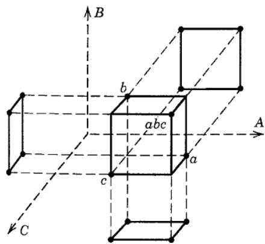  
Projection of Fractions into Factorials. Any fractional factorial design of resolution $R$ contains complete factorial designs (possibly replicated factorials) in any subset of $R - 1$ factors. This is an important and useful concept. For example, if an experimenter has several factors of potential interest but believes that only $R - 1$ of them have important effects, then a fractional factorial design of resolution $R$ is the appropriate choice of design. If the experimenter is correct, the fractional factorial design of resolution $R$ will project into a full factorial in the $R - 1$ significant factors. This property is illustrated in Figure 8.2 for the $2_{\mathrm{III}}^{3-1}$ design, which projects into a $2^2$ design in every subset of two factors.

■ FIGURE 8.2 Projection of a $2_{\mathrm{III}}^{3-1}$ design into three $2^2$ designs

Because the maximum possible resolution of a one-half fraction of the $2^{k}$ design is $R = k$ , every $2^{k-1}$ design will project into a full factorial in any $(k-1)$ of the original $k$ factors. Furthermore, a $2^{k-1}$ design may be projected into two replicates of a full factorial in any subset of $k-2$ factors, four replicates of a full factorial in any subset of $k-3$ factors, and so on.

## EXAMPLE 8.1

Consider the filtration rate experiment in Example 6.2. The original design, shown in Table 6.10, is a single replicate of the $2^{4}$ design. In that example, we found that the main effects A, C, and D and the interactions AC and AD were different from zero. We will now return to this experiment and simulate what would have happened if a half-fraction of the $2^{4}$ design had been run instead of the full factorial.

We will use the $2^{4-1}$ design with I = ABCD, because this choice of generator will result in a design of the highest possible resolution (IV). To construct the design, we first write down the basic design, which is a $2^{3}$ design, as shown in the first three columns of Table 8.3. This basic design has the necessary number of runs (eight) but only three columns (factors). To find the fourth factor levels, solve $I = ABCD$ for $D$ , or $D = ABC$ . Thus, the level of $D$ in each run is the product of the plus and minus signs in columns $A, B$ , and $C$ . The process is illustrated in Table 8.3. Because the generator $ABCD$ is positive, this $2_{\mathrm{IV}}^{4-1}$ design is the principal fraction. The design is shown graphically in Figure 8.3.

■ TABLE 8.3
The $2^{4-1}_{IV}$ Design with the Defining Relation I = ABCD

<table><tr><td rowspan="2">Run</td><td colspan="3">Basic Design</td><td rowspan="2">D=ABC</td><td rowspan="2">Treatment Combination</td><td rowspan="2">Filtration Rate</td></tr><tr><td>A</td><td>B</td><td>C</td></tr><tr><td>1</td><td>-</td><td>-</td><td>-</td><td>-</td><td>(1)</td><td>45</td></tr><tr><td>2</td><td>+</td><td>-</td><td>-</td><td>+</td><td>ad</td><td>100</td></tr><tr><td>3</td><td>-</td><td>+</td><td>-</td><td>+</td><td>bd</td><td>45</td></tr><tr><td>4</td><td>+</td><td>+</td><td>-</td><td>-</td><td>ab</td><td>65</td></tr><tr><td>5</td><td>-</td><td>-</td><td>+</td><td>+</td><td>cd</td><td>75</td></tr><tr><td>6</td><td>+</td><td>-</td><td>+</td><td>-</td><td>ac</td><td>60</td></tr><tr><td>7</td><td>-</td><td>+</td><td>+</td><td>-</td><td>bc</td><td>80</td></tr><tr><td>8</td><td>+</td><td>+</td><td>+</td><td>+</td><td>abcd</td><td>96</td></tr></table>

Using the defining relation, we note that each main effect is aliased with a three-factor interaction; that is, $A = A^{2}BCD = BCD$ , $B = AB^{2}CD = ACD$ , $C = ABC^{2}D = ABD$ , and $D = ABCD^{2} = ABC$ . Furthermore, every two-factor interaction is aliased with another two-factor interaction. These alias relationships are AB = CD, AC = BD, and BC = AD. The four main effects plus the three two-factor interaction alias pairs account for the seven degrees of freedom for the design.

At this point, we would normally randomize the eight runs and perform the experiment. Because we have already run the full $2^{4}$ design, we will simply select the eight observed filtration rates from Example 6.2 that correspond to the runs in the $2_{IV}^{4-1}$ design. These observations are shown in the last column of Table 8.3 as well as in Figure 8.3.

The estimates of the effects obtained from this $2_{IV}^{4-1}$ design are shown in Table 8.4. To illustrate the calculations, the linear combination of observations associated with the A effect is

$$
\begin{array}{r l}[ A ]&= \frac {1}{4} (- 4 5 + 1 0 0 - 4 5 + 6 5 - 7 5\\&\quad + 6 0 - 8 0 + 9 6) = 1 9. 0 0 \rightarrow A + B C D\end{array}
$$

whereas for the AB effect, we would obtain

$$
\begin{array}{r l}[ A B ]&= \frac {1}{4} (4 5 - 1 0 0 - 4 5 + 6 5 + 7 5 - 6 0 - 8 0 + 9 6)\\&= - 1. 0 0 \rightarrow A B + C D\end{array}
$$

From inspection of the information in Table 8.4, it is not unreasonable to conclude that the main effects A, C, and D are large. The $AB + CD$ alias chain has a small estimate, so the simplest interpretation is that both the AB and CD interactions are negligible (otherwise, both AB and CD are large, but they have nearly identical magnitudes and opposite signs—this is fairly unlikely). Furthermore, if A, C, and D are the important main effects, then it is logical to conclude that the two interaction alias chains $AC + BD$ and $AD + BC$ have large effects because the AC and AD interactions are also significant. In other words, if A, C, and D are significant, then the significant interactions are most likely AC and AD. This is an application of Ockham's razor (after William of Ockham), a scientific principle that when one is confronted with several different possible interpretations of a phenomena, the simplest interpretation is usually the correct one. Note that this interpretation agrees with the conclusions from the analysis of the complete $2^{4}$ design in Example 6.2.

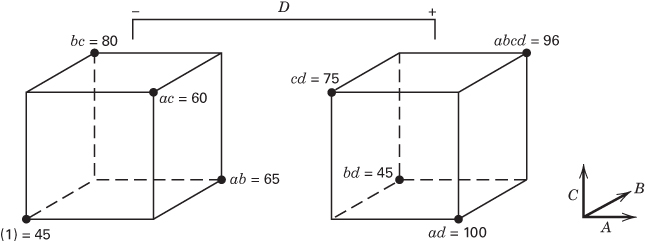  
■ FIGURE 8.3 The $2_{IV}^{4-1}$ design for the filtration rate experiment of Example 8.1

TABLE 8.4  
Estimates of Effects and Aliases from Example 8.1 $^{a}$

<table><tr><td>Estimate</td><td>Alias Structure</td></tr><tr><td>[A] = 19.00</td><td>[A] → A + BCD</td></tr><tr><td>[B] = 1.50</td><td>[B] → B + ACD</td></tr><tr><td>[C] = 14.00</td><td>[C] → C + ABD</td></tr><tr><td>[D] = 16.50</td><td>[D] → D + ABC</td></tr><tr><td>[AB] = -1.00</td><td>[AB] → AB + CD</td></tr><tr><td>[AC] = -18.50</td><td>[AC] → AC + BD</td></tr><tr><td>[AD] = 19.00</td><td>[AD] → AD + BC</td></tr></table>

$^{a}$ Significant effects are shown in boldface type.

Another way to view this interpretation is from the standpoint of effect heredity. Suppose that AB is significant and that both main effects A and B are significant. This is called strong heredity, and it is the usual situation (if an interaction is significant and only one of the main effects is significant this is called weak heredity; and this is relatively less common). So in this example, with A significant and B not significant this support the assumption that AB is not significant.

Because factor B is not significant, we may drop it from consideration. Consequently, we may project this $2_{IV}^{4-1}$ design into a single replicate of the $2^{3}$ design in factors A, C, and D, as shown in Figure 8.4. Visual examination of this cube plot makes us more comfortable with the conclusions reached above. Notice that if the temperature (A) is at the low level, the concentration (C) has a large positive effect, whereas if the temperature is at the high level, the concentration has a very small effect. This is probably due to an AC interaction. Furthermore, if the temperature is at the low level, the effect of the stirring rate (D) is negligible, whereas if the temperature is at the high level, the stirring rate has a large positive effect. This is probably due to the AD interaction tentatively identified previously.

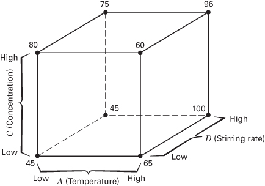  
■ FIGURE 8.4 Projection of the $2_{\mathrm{IV}}^{4-1}$ design into a $2^3$ design in $A, C,$ and $D$ for Example 8.1

Based on the above analysis, we can now obtain a model to predict filtration rate over the experimental region. This model is

$$
\hat {y} = \hat {\beta} _ {0} + \hat {\beta} _ {1} x _ {1} + \hat {\beta} _ {3} x _ {3} + \hat {\beta} _ {4} x _ {4} + \hat {\beta} _ {1 3} x _ {1} x _ {3} + \hat {\beta} _ {1 4} x _ {1} x _ {4}
$$

where $x_{1}, x_{3}$ , and $x_{4}$ are coded variables ( $-1 \leq x_{i} \leq +1$ ) that represent A, C, and D, and the $\hat{\beta}$ 's are regression coefficients that can be obtained from the effect estimates as we did previously. Therefore, the prediction equation is

$$
\begin{array}{r l} \hat {y} & = 7 0. 7 5 + \left(\frac {1 9 . 0 0}{2}\right) x _ {1} + \left(\frac {1 4 . 0 0}{2}\right) x _ {3} + \left(\frac {1 6 . 5 0}{2}\right) x _ {4} \\ & \quad + \left(\frac {- 1 8 . 5 0}{2}\right) x _ {1} x _ {3} + \left(\frac {1 9 . 0 0}{2}\right) x _ {1} x _ {4} \end{array}
$$

Remember that the intercept $\hat{\beta}_{0}$ is the average of all responses at the eight runs in the design. This model is very similar to the one that resulted from the full $2^{k}$ factorial design in Example 6.2.

The JMP screening analysis for Example 8.1 is shown in the boxed display below. Because there are only eight runs and seven degrees of freedom, we only included the intercept, the four main effects, and three of the six two-factor interactions (and their aliases) in the model. All of the P-values from Lenth's procedure are large. Eight runs with five active effects are not adequate to produce a reliable error estimate from Lenth's method. Also, notice that the $R^{2}$ statistic is 1, and no values are reported for the adjusted $R^{2}$ and the square root of the mean square error because the model is saturated. However, the largest effects are the three main effects and the two two-factor interactions identified previously in Example 8.1. The prediction profiler portion of the output has been set to the levels of the active factors that maximize the filtration rate.

Prediction Profiler

<table><tr><td colspan="2">Response Y</td></tr><tr><td colspan="2">Summary of Fit</td></tr><tr><td>RSquare</td><td>1</td></tr><tr><td>RSquare Adj</td><td>.</td></tr><tr><td>Root Mean Square Error</td><td>.</td></tr><tr><td>Mean of Response</td><td>70.75</td></tr><tr><td>Observations (or Sum Wgts)</td><td>8</td></tr></table>

Sorted Parameter Estimates

<table><tr><td>Term</td><td>Estimate</td><td>Relative Std Error</td><td>Pseudo t-Ratio</td><td colspan="9"></td><td>Pseudo p-Value</td></tr><tr><td>X1</td><td>9.5</td><td>0.353553</td><td>0.77</td><td></td><td></td><td></td><td></td><td></td><td></td><td></td><td></td><td></td><td>0.5128</td></tr><tr><td>X1*X4</td><td>9.5</td><td>0.353553</td><td>0.77</td><td></td><td></td><td></td><td></td><td></td><td></td><td></td><td></td><td></td><td>0.5128</td></tr><tr><td>X1*X3</td><td>-9.25</td><td>0.353553</td><td>-0.75</td><td></td><td></td><td></td><td></td><td></td><td></td><td></td><td></td><td></td><td>0.5228</td></tr><tr><td>X4</td><td>8.25</td><td>0.353553</td><td>0.67</td><td></td><td></td><td></td><td></td><td></td><td></td><td></td><td></td><td></td><td>0.5649</td></tr><tr><td>X3</td><td>7</td><td>0.353553</td><td>0.57</td><td></td><td></td><td></td><td></td><td></td><td></td><td></td><td></td><td></td><td>0.6213</td></tr><tr><td>X2</td><td>0.75</td><td>0.353553</td><td>0.06</td><td></td><td></td><td></td><td></td><td></td><td></td><td></td><td></td><td></td><td>0.9565</td></tr><tr><td>X1*X2</td><td>-0.5</td><td>0.353553</td><td>-0.04</td><td></td><td></td><td></td><td></td><td></td><td></td><td></td><td></td><td></td><td>0.9710</td></tr></table>

No error degrees of freedom, so ordinary tests uncomputable. Relative Std Error corresponds to residual standard error of 1. Pseudo t-Ratio and $P$ -Value calculated using Lenth PSE = 12.375 and DFE = 2.3333

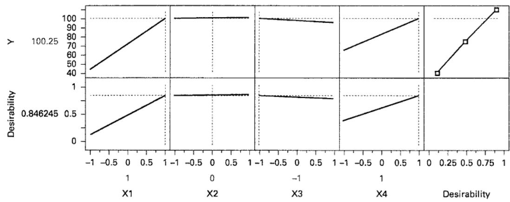

Parameter Estimate Population

<table><tr><td>Term</td><td>Estimate</td><td>Pseudo t-Ratio</td><td>Pseudo P-Value</td></tr><tr><td>Intercept</td><td>70.7500</td><td>5.7172</td><td>0.0203*</td></tr><tr><td>X1</td><td>9.5000</td><td>0.7677</td><td>0.5128</td></tr><tr><td>X2</td><td>0.7500</td><td>0.0606</td><td>0.9565</td></tr><tr><td>X3</td><td>7.0000</td><td>0.5657</td><td>0.6213</td></tr><tr><td>X4</td><td>8.2500</td><td>0.6667</td><td>0.5649</td></tr><tr><td>X1*X2</td><td>-0.5000</td><td>-0.0404</td><td>0.9710</td></tr><tr><td>X1*X3</td><td>-9.2500</td><td>-0.7475</td><td>0.5228</td></tr><tr><td>X1*X4</td><td>9.5000</td><td>0.7677</td><td>0.5128</td></tr></table>

Orthog t-Test used Pseudo Standard Error

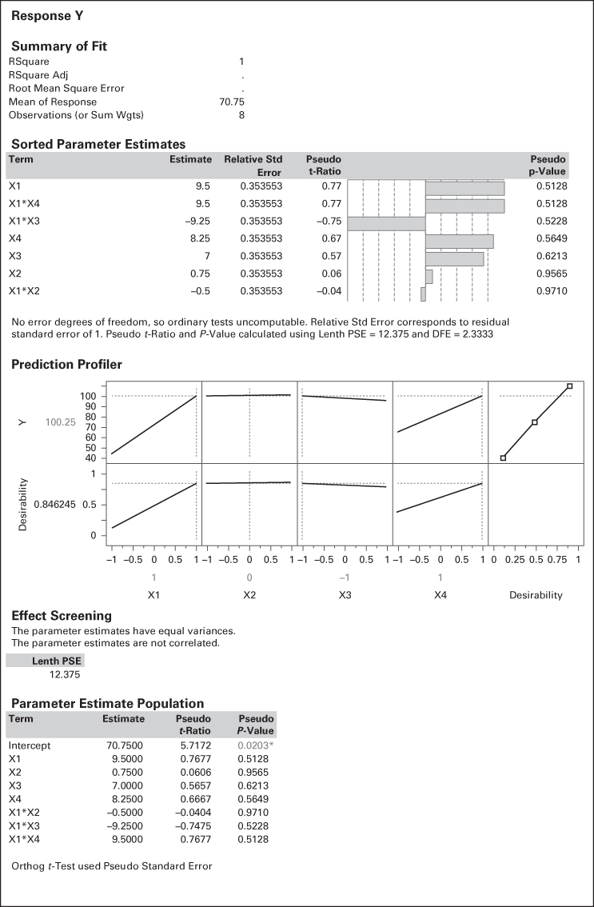
## EXAMPLE 8.2 A $2^{5-1}$ Design Used for Process Improvement

Five factors in a manufacturing process for an integrated circuit were investigated in a $2^{5-1}$ design with the objective of improving the process yield. The five factors were A = aperture setting (small, large), B = exposure time (20 percent below nominal, 20 percent above nominal), C = develop time (30 and 45 sec), D = mask dimension (small, large), and E = etch time (14.5 and 15.5 min). The construction of the $2^{5-1}$ design is shown in Table 8.5. Notice that the design was constructed by writing down the basic design having 16 runs (a $2^{4}$ design in A, B, C, and D), selecting ABCDE as the generator, and then setting the levels of the fifth factor E = ABCD. Figure 8.5 gives a pictorial representation of the design.

The defining relation for the design is $I = ABCDE$ . Consequently, every main effect is aliased with a four-factor interaction (for example, $[A] \to A + BCDE$ ), and every two-factor interaction is aliased with a three-factor interaction (e.g., $[AB] \rightarrow AB + CDE$ ). Thus, the design is of resolution V. We would expect this $2^{5-1}$ design to provide excellent information concerning the main effects and two-factor interactions.

Table 8.6 contains the effect estimates, sums of squares, and model regression coefficients for the 15 effects from this experiment. Figure 8.6 presents a normal probability plot of the effect estimates from this experiment. The main effects of A, B, and C and the AB interaction are large. Remember that, because of aliasing, these effects are really $A + BCDE$ , $B + ACDE$ , $C + ABDE$ , and $AB + CDE$ . However, because it seems plausible that three-factor and higher interactions are negligible, we feel safe in concluding that only A, B, C, and AB are important effects.

TABLE 8.5  
A $2^{5-1}$ Design for Example 8.2

<table><tr><td rowspan="2">Run</td><td colspan="4">Basic Design</td><td rowspan="2">E=ABCD</td><td rowspan="2">Treatment Combination</td><td rowspan="2">Yield</td></tr><tr><td>A</td><td>B</td><td>C</td><td>D</td></tr><tr><td>1</td><td>-</td><td>-</td><td>-</td><td>-</td><td>+</td><td>e</td><td>8</td></tr><tr><td>2</td><td>+</td><td>-</td><td>-</td><td>-</td><td>-</td><td>a</td><td>9</td></tr><tr><td>3</td><td>-</td><td>+</td><td>-</td><td>-</td><td>-</td><td>b</td><td>34</td></tr><tr><td>4</td><td>+</td><td>+</td><td>-</td><td>-</td><td>+</td><td>abe</td><td>52</td></tr><tr><td>5</td><td>-</td><td>-</td><td>+</td><td>-</td><td>-</td><td>c</td><td>16</td></tr><tr><td>6</td><td>+</td><td>-</td><td>+</td><td>-</td><td>+</td><td>ace</td><td>22</td></tr><tr><td>7</td><td>-</td><td>+</td><td>+</td><td>-</td><td>+</td><td>bce</td><td>45</td></tr><tr><td>8</td><td>+</td><td>+</td><td>+</td><td>-</td><td>-</td><td>abc</td><td>60</td></tr><tr><td>9</td><td>-</td><td>-</td><td>-</td><td>+</td><td>-</td><td>d</td><td>6</td></tr><tr><td>10</td><td>+</td><td>-</td><td>-</td><td>+</td><td>+</td><td>ade</td><td>10</td></tr><tr><td>11</td><td>-</td><td>+</td><td>-</td><td>+</td><td>+</td><td>bde</td><td>30</td></tr><tr><td>12</td><td>+</td><td>+</td><td>-</td><td>+</td><td>-</td><td>abd</td><td>50</td></tr><tr><td>13</td><td>-</td><td>-</td><td>+</td><td>+</td><td>+</td><td>cde</td><td>15</td></tr><tr><td>14</td><td>+</td><td>-</td><td>+</td><td>+</td><td>-</td><td>acd</td><td>21</td></tr><tr><td>15</td><td>-</td><td>+</td><td>+</td><td>+</td><td>-</td><td>bcd</td><td>44</td></tr><tr><td>16</td><td>+</td><td>+</td><td>+</td><td>+</td><td>+</td><td>abcde</td><td>63</td></tr></table>

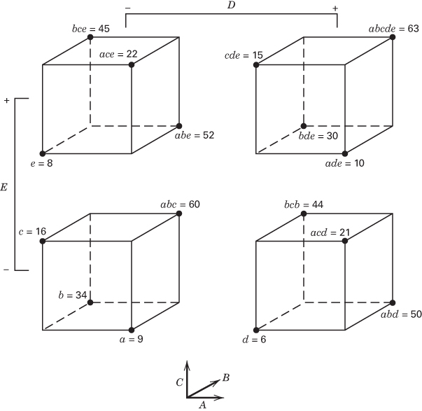  
■ FIGURE 8.5 The $2_{V}^{5-1}$ design for Example 8.2

TABLE 8.6  
Effects, Regression Coefficients, and Sums of Squares for Example 8.2

<table><tr><td>Variable</td><td>Name</td><td>-1 Level</td><td>+1 Level</td></tr><tr><td>A</td><td>Aperture</td><td>Small</td><td>Large</td></tr><tr><td>B</td><td>Exposure time</td><td>-20%</td><td>+20%</td></tr><tr><td>C</td><td>Develop time</td><td>30 sec</td><td>40 sec</td></tr><tr><td>D</td><td>Mask dimension</td><td>Small</td><td>Large</td></tr><tr><td>E</td><td>Etch time</td><td>14.5 min</td><td>15.5 min</td></tr><tr><td>Variable</td><td>Regression Coefficient</td><td>Estimated Effect</td><td>Sum of Squares</td></tr><tr><td>Overall Average</td><td>30.3125</td><td></td><td></td></tr><tr><td>A</td><td>5.5625</td><td>11.1250</td><td>495.062</td></tr><tr><td>B</td><td>16.9375</td><td>33.8750</td><td>4590.062</td></tr><tr><td>C</td><td>5.4375</td><td>10.8750</td><td>473.062</td></tr><tr><td>D</td><td>-0.4375</td><td>-0.8750</td><td>3.063</td></tr><tr><td>E</td><td>0.3125</td><td>0.6250</td><td>1.563</td></tr><tr><td>AB</td><td>3.4375</td><td>6.8750</td><td>189.063</td></tr><tr><td>Variable</td><td>Regression Coefficient</td><td>Estimated Effect</td><td>Sum of Squares</td></tr><tr><td>AC</td><td>0.1875</td><td>0.3750</td><td>0.563</td></tr><tr><td>AD</td><td>0.5625</td><td>1.1250</td><td>5.063</td></tr><tr><td>AE</td><td>0.5625</td><td>1.1250</td><td>5.063</td></tr><tr><td>BC</td><td>0.3125</td><td>0.6250</td><td>1.563</td></tr><tr><td>BD</td><td>-0.0625</td><td>-0.1250</td><td>0.063</td></tr><tr><td>BE</td><td>-0.0625</td><td>-0.1250</td><td>0.063</td></tr><tr><td>CD</td><td>0.4375</td><td>0.8750</td><td>3.063</td></tr><tr><td>CE</td><td>0.1875</td><td>0.3750</td><td>0.563</td></tr><tr><td>DE</td><td>-0.6875</td><td>-1.3750</td><td>7.563</td></tr></table>

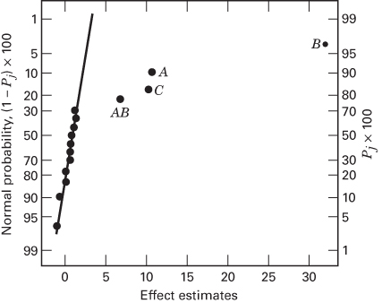  
■ FIGURE 8.6 Normal probability plot of effects for Example 8.2

Table 8.7 summarizes the analysis of variance for this experiment. The model sum of squares is $SS_{Model} = SS_{A} + SS_{B} + SS_{C} + SS_{AB} = 5747.25$ , and this accounts for over 99 percent of the total variability in yield. Figure 8.7 presents a normal probability plot of the residuals, and Figure 8.8 is a plot of the residuals versus the predicted values. Both plots are satisfactory.

The three factors A, B, and C have large positive effects. The AB or aperture-exposure time interaction is plotted in Figure 8.9. This plot confirms that the yields are higher when both A and B are at the high level.

The $2^{5-1}$ design will collapse into two replicates of a $2^{3}$ design in any three of the original five factors. (Looking at Figure 8.5 will help you visualize this.) Figure 8.10 is a cube plot in the factors A, B, and C with the average yields superimposed on the eight corners. It is clear from inspection of the cube plot that highest yields are achieved with A, B, and C all at the high level. Factors D and E have little effect on average process yield and may be set to values that optimize other objectives (such as cost).

TABLE 8.7  
Analysis of Variance for Example 8.2

<table><tr><td>Source of Variation</td><td>Sum of Squares</td><td>Degrees of Freedom</td><td>Mean Square</td><td> $F_0$ </td><td>P-Value</td></tr><tr><td>A (Aperture)</td><td>495.0625</td><td>1</td><td>495.0625</td><td>193.20</td><td>&lt;0.0001</td></tr><tr><td>B (Exposure time)</td><td>4590.0625</td><td>1</td><td>4590.0625</td><td>1791.24</td><td>&lt;0.0001</td></tr><tr><td>C (Develop time)</td><td>473.0625</td><td>1</td><td>473.0625</td><td>184.61</td><td>&lt;0.0001</td></tr><tr><td>AB</td><td>189.0625</td><td>1</td><td>189.0625</td><td>73.78</td><td>&lt;0.0001</td></tr><tr><td>Error</td><td>28.1875</td><td>11</td><td>2.5625</td><td></td><td></td></tr><tr><td>Total</td><td>5775.4375</td><td>15</td><td></td><td></td><td></td></tr></table>

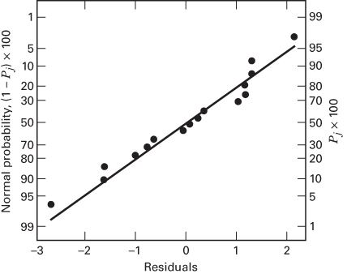  
■ FIGURE 8.7 Normal probability plot of the residuals for Example 8.2

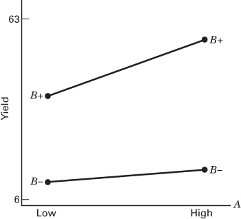  
■ FIGURE 8.9 Aperture-exposure time interaction for Example 8.2

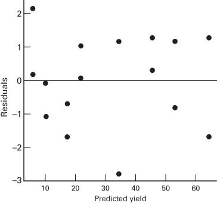  
■ FIGURE 8.8 Plot of residuals versus predicted yield for Example 8.2

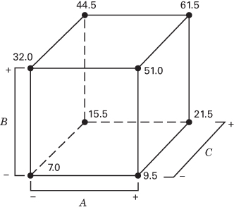  
■ FIGURE 8.10 Projection of the $2_{V}^{5-1}$ design in Example 8.2 into two replicates of a $2^{3}$ design in the factors A, B, and C

The output from the JMP screening analysis is shown in the following display. The JMP screening platform uses Lenth's method to determine the active effects. The results agree with the normal probability plot of effects method used in Example 8.2. Because the design is saturated when all main effects and two-factor interactions are included in the model, there are no degrees of freedom available to estimate error. Consequently, $R^{2} = 1$ , and the adjusted $R^{2}$ and square root of mean square error cannot be computed.

<table><tr><td colspan="5">Response Y</td></tr><tr><td colspan="5">Summary of Fit</td></tr><tr><td>RSquare</td><td colspan="4">1</td></tr><tr><td>RSquare Adj</td><td colspan="4">.</td></tr><tr><td>Root Mean Square Error</td><td colspan="4">.</td></tr><tr><td>Mean of Response</td><td colspan="4">30.3125</td></tr><tr><td>Observations (or Sum Wgts)</td><td colspan="4">16</td></tr><tr><td colspan="5">Sorted Parameter Estimates</td></tr><tr><td>Term</td><td>Estimate</td><td>Relative Std Error</td><td>Pseudo t-Ratio</td><td>Pseudo P-Value</td></tr><tr><td>X2</td><td>16.9375</td><td>0.25</td><td>36.13</td><td>&lt;.0001*</td></tr><tr><td>X1</td><td>5.5625</td><td>0.25</td><td>11.87</td><td>&lt;.0001*</td></tr><tr><td>X3</td><td>5.4375</td><td>0.25</td><td>11.60</td><td>&lt;.0001*</td></tr><tr><td>X1*X2</td><td>3.4375</td><td>0.25</td><td>7.33</td><td>0.0007*</td></tr><tr><td>X4*X5</td><td>-0.6875</td><td>0.25</td><td>-1.47</td><td>0.2024</td></tr><tr><td>X1*X4</td><td>0.5625</td><td>0.25</td><td>1.20</td><td>0.2839</td></tr><tr><td>X1*X5</td><td>0.5625</td><td>0.25</td><td>1.20</td><td>0.2839</td></tr><tr><td>X4</td><td>-0.4375</td><td>0.25</td><td>-0.93</td><td>0.3935</td></tr><tr><td>X3*X4</td><td>0.4375</td><td>0.25</td><td>0.93</td><td>0.3935</td></tr><tr><td>X5</td><td>0.3125</td><td>0.25</td><td>0.67</td><td>0.5345</td></tr><tr><td>X2*X3</td><td>0.3125</td><td>0.25</td><td>0.67</td><td>0.5345</td></tr><tr><td>X1*X3</td><td>0.1875</td><td>0.25</td><td>0.40</td><td>0.7057</td></tr><tr><td>X3*X5</td><td>0.1875</td><td>0.25</td><td>0.40</td><td>0.7057</td></tr><tr><td>X2*X4</td><td>-0.0625</td><td>0.25</td><td>-0.13</td><td>0.8991</td></tr><tr><td>X2*X5</td><td>-0.0625</td><td>0.25</td><td>-0.13</td><td>0.8991</td></tr></table>

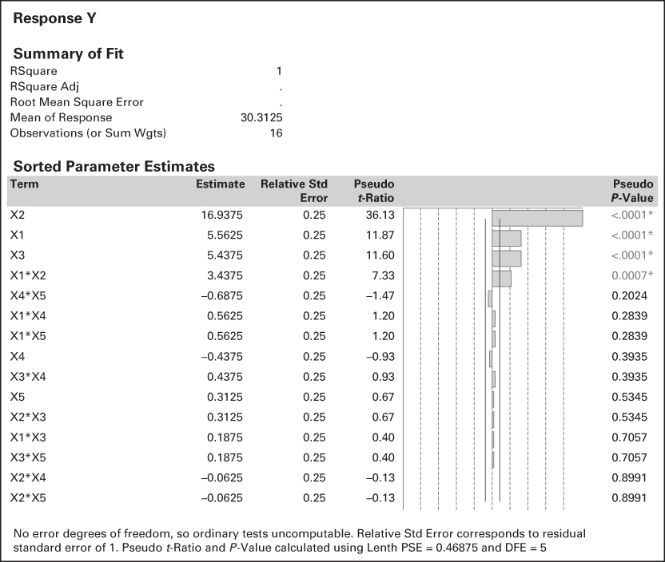
Sequences of Fractional Factorials. Using fractional factorial designs often leads to great economy and efficiency in experimentation, particularly if the runs can be made sequentially. For example, suppose that we are investigating k = 4 factors ( $2^{4} = 16$ runs). It is almost always preferable to run a $2_{IV}^{4-1}$ fractional design (eight runs), analyze the results, and then decide on the best set of runs to perform next. If it is necessary to resolve ambiguities, we can always run the alternate fraction and complete the $2^{4}$ design. When this method is used to complete the design, both one-half fractions represent blocks of the complete design with the highest order interaction confounded with blocks (here ABCD would be confounded). Thus, sequential experimentation has the result of losing information only on the highest order interaction. Its advantage is that in many cases we learn enough from the one-half fraction to proceed to the next stage of experimentation, which might involve adding or removing factors, changing responses, or varying some of the factors over new ranges. Some of these possibilities are illustrated graphically in Figure 8.11.

■ FIGURE 8.11 Possibilities for follow-up experimentation after an initial fractional factorial experiment

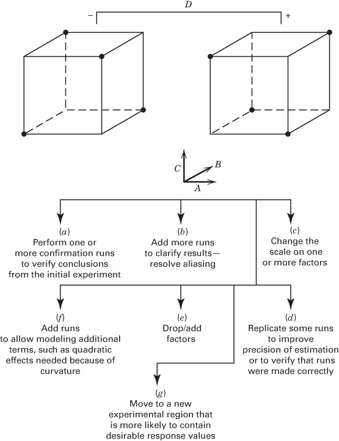

## EXAMPLE 8.3

Reconsider the experiment in Example 8.1. We have used a $2_{IV}^{4-1}$ design and tentatively identified three large main effects—A, C, and D. There are two large effects associated with two-factor interactions, $AC + BD$ and $AD + BC$ . In Example 8.2, we used the fact that the main effect of B was negligible to tentatively conclude that the important interactions were AC and AD. Sometimes the experimenter will have process knowledge that can assist in discriminating between interactions likely to be important. However, we can always isolate the significant interaction by running the alternate fraction, given by I = -ABCD. It is straightforward to show that the design and the responses are as follows:

<table><tr><td rowspan="2">Run</td><td colspan="3">Basic Design</td><td rowspan="2">D = -ABC</td><td rowspan="2">Treatment Combination</td><td rowspan="2">Filtration Rate</td></tr><tr><td>A</td><td>B</td><td>C</td></tr><tr><td>1</td><td>-</td><td>-</td><td>-</td><td>+</td><td>d</td><td>43</td></tr><tr><td>2</td><td>+</td><td>-</td><td>-</td><td>-</td><td>a</td><td>71</td></tr><tr><td>3</td><td>-</td><td>+</td><td>-</td><td>-</td><td>b</td><td>48</td></tr><tr><td>4</td><td>+</td><td>+</td><td>-</td><td>+</td><td>abd</td><td>104</td></tr><tr><td>5</td><td>-</td><td>-</td><td>+</td><td>-</td><td>c</td><td>68</td></tr><tr><td>6</td><td>+</td><td>-</td><td>+</td><td>+</td><td>acd</td><td>86</td></tr><tr><td>7</td><td>-</td><td>+</td><td>+</td><td>+</td><td>bcd</td><td>70</td></tr><tr><td>8</td><td>+</td><td>+</td><td>+</td><td>-</td><td>abc</td><td>65</td></tr></table>

The effect estimates (and their aliases) obtained from this alternate fraction are

$$
[ A ] ^ {\prime} = 2 4. 2 5 \rightarrow A - B C D
$$

$$
[ B ] ^ {\prime} = \quad 4. 7 5 \rightarrow \quad B - A C D
$$

$$
[ C ] ^ {\prime} = \quad 5. 7 5 \rightarrow \quad C - A B D
$$

$$
[ D ] ^ {\prime} = 1 2. 7 5 \rightarrow D - A B C
$$

$$
[ A B ] ^ {\prime} = \quad 1. 2 5 \rightarrow A B - C D
$$

$$
[ A C ] ^ {\prime} = - 1 7. 7 5 \rightarrow A C - B D
$$

$$
[ A D ] ^ {\prime} = 1 4. 2 5 \rightarrow A D - B C
$$

These estimates may be combined with those obtained from the original one-half fraction to yield the following estimates of the effects:

<table><tr><td>i</td><td>From  $\frac{1}{2}([i] + [i]'')$ </td><td>From  $\frac{1}{2}([i] - [i]'')$ </td></tr><tr><td>A</td><td>21.63 → A</td><td>-2.63 → BCD</td></tr><tr><td>B</td><td>3.13 → B</td><td>-1.63 → ACD</td></tr><tr><td>C</td><td>9.88 → C</td><td>4.13 → ABD</td></tr><tr><td>D</td><td>14.63 → D</td><td>1.88 → ABC</td></tr><tr><td>AB</td><td>10.13 → AB</td><td>-1.13 → CD</td></tr><tr><td>AC</td><td>-18.13 → AC</td><td>-0.38 → BD</td></tr><tr><td>AD</td><td>16.63 → AD</td><td>2.38 → BC</td></tr></table>

These estimates agree exactly with those from the original analysis of the data as a single replicate of a $2^{4}$ factorial design, as reported in Example 6.2. Clearly, it is the AC and AD interactions that are large.

Confirmation Experiments. Adding the alternate fraction to the principal fraction may be thought of as a type of confirmation experiment in that it provides information that will allow us to strengthen our initial conclusions about the two-factor interaction effects. We will investigate some other aspects of combining fractional factorials to isolate interactions in Sections 8.5 and 8.6.

A confirmation experiment need not be this elaborate. A very simple confirmation experiment is to use the model equation to predict the response at a point of interest in the design space (this should not be one of the runs in the current design) and then actually run that treatment combination (perhaps several times), comparing the predicted and observed responses. Reasonably close agreement indicates that the interpretation of the fractional factorial was correct, whereas serious discrepancies mean that the interpretation was problematic. This would be an indication that additional experimentation is required to resolve ambiguities.

To illustrate, consider the $2^{4-1}$ fractional factorial in Example 8.1. The experimenters are interested in finding a set of conditions where the response variable filtration rate is high, but low concentrations of formaldehyde (factor $C$ ) are desirable. This would suggest that factors $A$ and $D$ should be at the high level and factor $C$ should be at the low level. Examining Figure 8.3, we note that when $B$ is at the low level, this treatment combination was run in the fractional factorial, producing an observed response of 100. The treatment combination with $B$ at the high level was not in the original fraction, so this would be a reasonable confirmation run. With A, B, and D at the high level and C at the low level, we use the model equation from Example 8.1 to calculate the predicted response as follows:

$$
\begin{array}{r l} & {\hat {y} = 7 0. 7 5 + \left(\frac {1 9 . 0 0}{2}\right) x _ {1} + \left(\frac {1 4 . 0 0}{2}\right) x _ {3} + \left(\frac {1 6 . 5 0}{2}\right) x _ {4} + \left(\frac {- 1 8 . 5 0}{2}\right) x _ {1} x _ {3} + \left(\frac {1 9 . 0 0}{2}\right) x _ {1} x _ {4}} \\ & {\quad = 7 0. 7 5 + \left(\frac {1 9 . 0 0}{2}\right) (1) + \left(\frac {1 4 . 0 0}{2}\right) (- 1) + \left(\frac {1 6 . 5 0}{2}\right) (1) + \left(\frac {- 1 8 . 5 0}{2}\right) (1) (- 1)} \\ & {\quad + \left(\frac {1 9 . 0 0}{2}\right) (1) (1)} \\ & {\quad = 1 0 0. 2 5} \end{array}
$$

The observed response at this treatment combination is 104 (refer to Figure 6.10 where the response data for the complete $2^{4}$ factorial design are presented). Since the observed and predicted values of filtration rate are very similar, we have a successful confirmation run. This is additional evidence that our interpretation of the fractional factorial was correct.

There will be situations where the predicted and observed values in a confirmation experiment will not be this close together, and it will be necessary to answer the question of whether the two values are sufficiently close to reasonably conclude that the interpretation of the fractional design was correct. One way to answer this question is to construct a prediction interval on the future observation for the confirmation run and then see if the actual observation falls inside the prediction interval. We show how to do this using this example in Section 10.6, where prediction intervals for a regression model are introduced.

## 8.3 The One-Quarter Fraction of the $2^{k}$ Design

For a moderately large number of factors, smaller fractions of the $2^{k}$ design are frequently useful. Consider a one-quarter fraction of the $2^{k}$ design. This design contains $2^{k-2}$ runs and is usually called a $2^{k-2}$ fractional factorial.

The $2^{k-2}$ design may be constructed by first writing down a basic design consisting of the runs associated with a full factorial in k-2 factors and then associating the two additional columns with appropriately chosen interactions involving the first k-2 factors. Thus, a one-quarter fraction of the $2^{k}$ design has two generators. If P and Q represent the generators chosen, then I=P and I=Q are called the generating relations for the design. The signs of P and Q (either + or -) determine which one of the one-quarter fractions is produced. All four fractions associated with the choice of generators $\pm P$ and $\pm Q$ are members of the same family. The fraction for which both P and Q are positive is the principal fraction.

The complete defining relation for the design consists of all the columns that are equal to the identity column I. These will consist of P, Q, and their generalized interaction PQ; that is, the defining relation is $I = P = Q = PQ$ . We call the elements P, Q, and PQ in the defining relation words. The aliases of any effect are produced by the multiplication of the column for that effect by each word in the defining relation. Clearly, each effect has three aliases. The experimenter should be careful in choosing the generators so that potentially important effects are not aliased with each other.

As an example, consider the $2^{6-2}$ design. Suppose we choose I = ABCE and I = BCDF as the design generators. Now the generalized interaction of the generators ABCE and BCDF is ADEF; therefore, the complete defining relation for this design is

$$
I = A B C E = B C D F = A D E F
$$

TABLE 8.8

Alias Structure for the $2_{\mathrm{IV}}^{6 - 2}$ Design with $I = ABCE = BCDF = ADEF$

$$
A = B C E = D E F = A B C D F
$$

$$
A B = C E = A C D F = B D E F
$$

$$
B = A C E = C D F = A B D E F
$$

$$
A C = B E = A B D F = C D E F
$$

$$
C = A B E = B D F = A C D E F
$$

$$
A D = E F = B C D E = A B C F
$$

$$
D = B C F = A E F = A B C D E
$$

$$
A E = B C = D F = A B C D E F
$$

$$
E = A B C = A D F = B C D E F
$$

$$
A F = D E = B C E F = A B C D
$$

$$
F = B C D = A D E = A B C E F
$$

$$
B D = C F = A C D E = A B E F
$$

$$
B F = C D = A C E F = A B D E
$$

$$
A B D = C D E = A C F = B E F
$$

$$
A C D = B D E = A B F = C E F
$$

Consequently, this is a resolution IV design. To find the aliases of any effect (e.g., A), multiply that effect by each word in the defining relation. For A, this produces

$$
A = B C E = A B C D F = D E F
$$

It is easy to verify that every main effect is aliased by three- and five-factor interactions, whereas two-factor interactions are aliased with each other and with higher order interactions. Thus, when we estimate A, for example, we are really estimating $A + BCE + DEF + ABCDF$ . The complete alias structure of this design is shown in Table 8.8. If three-factor and higher interactions are negligible, this design gives clear estimates of the main effects.

To construct the design, first write down the basic design, which consists of the 16 runs for a full $2^{6-2} = 2^{4}$ design in A, B, C, and D. Then the two factors E and F are added by associating their plus and minus levels with the plus and minus signs of the interactions ABC and BCD, respectively. This procedure is shown in Table 8.9.

Another way to construct this design is to derive the four blocks of the $2^{6}$ design with ABCE and BCDF confounded and then choose the block with treatment combinations that are positive on ABCE and BCDF. This would be a $2^{6-2}$ fractional factorial with generating relations I = ABCE and I = BCDF, and because both generators ABCE and BCDF are positive, this is the principal fraction.

There are, of course, three alternate fractions of this particular $2_{IV}^{6-2}$ design. They are the fractions with generating relationships I = ABCE and I = -BCDF; I = -ABCE and I = BCDF; and I = -ABCE and I = -BCDF. These fractions may be easily constructed by the method shown in Table 8.9. For example, if we wish to find the fraction for which I = ABCE and I = -BCDF, then in the last column of Table 8.9, we set F = -BCD, and the column of levels for factor F becomes

$$
+ + - - - - + + - - + + + + - -
$$

The complete defining relation for this alternate fraction is $I = ABCE = -BCDF = -ADEF$ . Certain signs in the alias structure in Table 8.9 are now changed; for instance, the aliases of $A$ are $A = BCE = -DEF = -ABCDF$ . Thus, the linear combination of the observations [A] actually estimates $A + BCE - DEF - ABCDF$ .

Finally, note that the $2_{IV}^{6-2}$ fractional factorial will project into a single replicate of a $2^{4}$ design in any subset of four factors that is not a word in the defining relation. It also collapses to a replicated one-half fraction of a $2^{4}$ in any subset of four factors that is a word in the defining relation. Thus, the design in Table 8.9 becomes two replicates of a $2^{4-1}$ in the factors ABCE, BCDF, and ADEF, because these are the words in the defining relation. There are 12 other combinations of the six factors, such as ABCD, ABCF, for which the design projects to a single replicate of the $2^{4}$ . This design also collapses to two replicates of a $2^{3}$ in any subset of three of the six factors or four replicates of a $2^{2}$ in any subset of two factors.

■ TABLE 8.9
Construction of the $2^{6-2}_{IV}$ Design with the Generators I = ABCE and I = BCDF

<table><tr><td rowspan="2">Run</td><td colspan="5">Basic Design</td><td rowspan="2">E=ABC</td><td rowspan="2">F=BCD</td></tr><tr><td>A</td><td>B</td><td>C</td><td>D</td><td></td></tr><tr><td>1</td><td>-</td><td>-</td><td>-</td><td>-</td><td>-</td><td>-</td><td>-</td></tr><tr><td>2</td><td>+</td><td>-</td><td>-</td><td>-</td><td>-</td><td>+</td><td>-</td></tr><tr><td>3</td><td>-</td><td>+</td><td>-</td><td>-</td><td>-</td><td>+</td><td>+</td></tr><tr><td>4</td><td>+</td><td>+</td><td>-</td><td>-</td><td>-</td><td>-</td><td>+</td></tr><tr><td>5</td><td>-</td><td>-</td><td>+</td><td>-</td><td>-</td><td>+</td><td>+</td></tr><tr><td>6</td><td>+</td><td>-</td><td>+</td><td>-</td><td>-</td><td>-</td><td>+</td></tr><tr><td>7</td><td>-</td><td>+</td><td>+</td><td>-</td><td>-</td><td>-</td><td>-</td></tr><tr><td>8</td><td>+</td><td>+</td><td>+</td><td>-</td><td>-</td><td>+</td><td>-</td></tr><tr><td>9</td><td>-</td><td>-</td><td>-</td><td>+</td><td>-</td><td>-</td><td>+</td></tr><tr><td>10</td><td>+</td><td>-</td><td>-</td><td>+</td><td>+</td><td>+</td><td>+</td></tr><tr><td>11</td><td>-</td><td>+</td><td>-</td><td>+</td><td>+</td><td>+</td><td>-</td></tr><tr><td>12</td><td>+</td><td>+</td><td>-</td><td>+</td><td>-</td><td>-</td><td>-</td></tr><tr><td>13</td><td>-</td><td>-</td><td>+</td><td>+</td><td>+</td><td>+</td><td>-</td></tr><tr><td>14</td><td>+</td><td>-</td><td>+</td><td>+</td><td>-</td><td>-</td><td>-</td></tr><tr><td>15</td><td>-</td><td>+</td><td>+</td><td>+</td><td>-</td><td>-</td><td>+</td></tr><tr><td>16</td><td>+</td><td>+</td><td>+</td><td>+</td><td>+</td><td>+</td><td>+</td></tr></table>

In general, any $2^{k-2}$ fractional factorial design can be collapsed into either a full factorial or a fractional factorial in some subset of $r \leq k - 2$ of the original factors. Those subsets of variables that form full factorials are not words in the complete defining relation.

## EXAMPLE 8.4

Parts manufactured in an injection molding process are showing excessive shrinkage. This is causing problems in assembly operations downstream from the injection molding area. A quality improvement team has decided to use a designed experiment to study the injection molding process so that shrinkage can be reduced. The team decides to investigate six factors—mold temperature (A), screw speed (B), holding time (C), cycle time (D), gate size (E), and holding pressure (F)—each at two levels, with the objective of learning how each factor affects shrinkage and also something about how the factors interact.

The team decides to use the 16-run two-level fractional factorial design in Table 8.9. The design is shown again in Table 8.10, along with the observed shrinkage ( $\times$ 10) for the test part produced at each of the 16 runs in the design. Table 8.11 shows the effect estimates, sums of squares, and the regression coefficients for this experiment.

■ TABLE 8.10
A $2^{6-2}_{IV}$ Design for the Injection Molding Experiment in Example 8.4

<table><tr><td rowspan="2">Run</td><td colspan="4">Basic Design</td><td rowspan="2">E=ABC</td><td rowspan="2">F=BCD</td><td rowspan="2">Observed Shrinkage (×10)</td><td rowspan="2"></td></tr><tr><td>A</td><td>B</td><td>C</td><td>D</td></tr><tr><td>1</td><td>-</td><td>-</td><td>-</td><td>-</td><td>-</td><td>-</td><td>6</td><td>(1)</td></tr><tr><td>2</td><td>+</td><td>-</td><td>-</td><td>-</td><td>+</td><td>-</td><td>10</td><td>ae</td></tr><tr><td>3</td><td>-</td><td>+</td><td>-</td><td>-</td><td>+</td><td>+</td><td>32</td><td>bef</td></tr><tr><td>4</td><td>+</td><td>+</td><td>-</td><td>-</td><td>-</td><td>+</td><td>60</td><td>abf</td></tr><tr><td>5</td><td>-</td><td>-</td><td>+</td><td>-</td><td>+</td><td>+</td><td>4</td><td>cef</td></tr><tr><td>6</td><td>+</td><td>-</td><td>+</td><td>-</td><td>-</td><td>+</td><td>15</td><td>acf</td></tr><tr><td>7</td><td>-</td><td>+</td><td>+</td><td>-</td><td>-</td><td>-</td><td>26</td><td>bc</td></tr><tr><td>8</td><td>+</td><td>+</td><td>+</td><td>-</td><td>+</td><td>-</td><td>60</td><td>abce</td></tr><tr><td>9</td><td>-</td><td>-</td><td>-</td><td>+</td><td>-</td><td>+</td><td>8</td><td>df</td></tr><tr><td>10</td><td>+</td><td>-</td><td>-</td><td>+</td><td>+</td><td>+</td><td>12</td><td>adef</td></tr><tr><td>11</td><td>-</td><td>+</td><td>-</td><td>+</td><td>+</td><td>-</td><td>34</td><td>bde</td></tr><tr><td>12</td><td>+</td><td>+</td><td>-</td><td>+</td><td>-</td><td>-</td><td>60</td><td>abd</td></tr><tr><td>13</td><td>-</td><td>-</td><td>+</td><td>+</td><td>+</td><td>-</td><td>16</td><td>cde</td></tr><tr><td>14</td><td>+</td><td>-</td><td>+</td><td>+</td><td>-</td><td>-</td><td>5</td><td>acd</td></tr><tr><td>15</td><td>-</td><td>+</td><td>+</td><td>+</td><td>-</td><td>+</td><td>37</td><td>bcdf</td></tr><tr><td>16</td><td>+</td><td>+</td><td>+</td><td>+</td><td>+</td><td>+</td><td>52</td><td>abcdef</td></tr></table>

TABLE 8.11  
Effects, Sums of Squares, and Regression Coefficients for Example 8.4

<table><tr><td>Variable</td><td>Name</td><td>-1 Level</td><td>+1 Level</td></tr><tr><td>A</td><td>Mold temperature</td><td>-1.000</td><td>1.000</td></tr><tr><td>B</td><td>Screw speed</td><td>-1.000</td><td>1.000</td></tr><tr><td>C</td><td>Holding time</td><td>-1.000</td><td>1.000</td></tr><tr><td>D</td><td>Cycle time</td><td>-1.000</td><td>1.000</td></tr><tr><td>E</td><td>Gate size</td><td>-1.000</td><td>1.000</td></tr><tr><td>F</td><td>Hold pressure</td><td>-1.000</td><td>1.000</td></tr><tr><td>Variablea</td><td>Regression Coefficient</td><td>Estimated Effect</td><td>Sum of Squares</td></tr><tr><td>Overall average</td><td>27.3125</td><td></td><td></td></tr><tr><td>A</td><td>6.9375</td><td>13.8750</td><td>770.062</td></tr><tr><td>B</td><td>17.8125</td><td>35.6250</td><td>5076.562</td></tr><tr><td>C</td><td>-0.4375</td><td>-0.8750</td><td>3.063</td></tr><tr><td>D</td><td>0.6875</td><td>1.3750</td><td>7.563</td></tr><tr><td>E</td><td>0.1875</td><td>0.3750</td><td>0.563</td></tr><tr><td>F</td><td>0.1875</td><td>0.3750</td><td>0.563</td></tr><tr><td>Variablea</td><td>Regression Coefficient</td><td>Estimated Effect</td><td>Sum of Squares</td></tr><tr><td>AB + CE</td><td>5.9375</td><td>11.8750</td><td>564.063</td></tr><tr><td>AC + BE</td><td>-0.8125</td><td>-1.6250</td><td>10.562</td></tr><tr><td>AD + EF</td><td>-2.6875</td><td>-5.3750</td><td>115.562</td></tr><tr><td>AE + BC + DF</td><td>-0.9375</td><td>-1.8750</td><td>14.063</td></tr><tr><td>AF + DE</td><td>0.3125</td><td>0.6250</td><td>1.563</td></tr><tr><td>BD + CF</td><td>-0.0625</td><td>-0.1250</td><td>0.063</td></tr><tr><td>BF + CD</td><td>-0.0625</td><td>-0.1250</td><td>0.063</td></tr><tr><td>ABD</td><td>0.0625</td><td>0.1250</td><td>0.063</td></tr><tr><td>ABF</td><td>-2.4375</td><td>-4.8750</td><td>95.063</td></tr></table>

$^{a}$ Only main effects and two-factor interactions.

A normal probability plot of the effect estimates from this experiment is shown in Figure 8.12. The only large effects are A (mold temperature), B (screw speed), and the AB interaction. In light of the alias relationships in Table 8.8, it seems reasonable to adopt these conclusions tentatively. The plot of the AB interaction in Figure 8.13 shows that the process is very insensitive to temperature if the screw speed is at the low level but very sensitive to temperature if the screw speed is at the high level. With the screw speed at the low level, the process should produce an average shrinkage of around 10 percent regardless of the temperature level chosen.

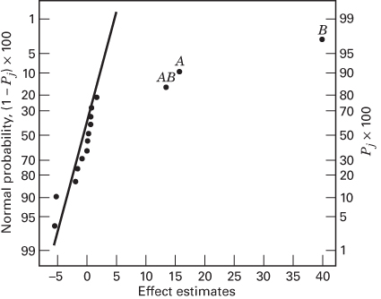  
■ FIGURE 8.12 Normal probability plot of effects for Example 8.4

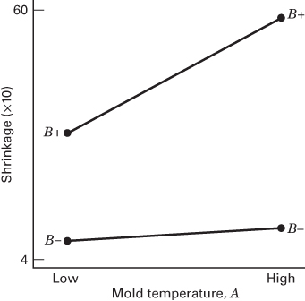  
■ FIGURE 8.13 Plot of AB (mold temperature-screw speed) interaction for Example 8.4

Based on this initial analysis, the team decides to set both the mold temperature and the screw speed at the low level. This set of conditions will reduce the mean shrinkage of parts to around 10 percent. However, the variability in shrinkage from part to part is still a potential problem. In effect, the mean shrinkage can be adequately reduced by the above modifications; however, the part-to-part variability in shrinkage over a production run could still cause problems in assembly. One way to address this issue is to see if any of the process factors affect the variability in parts shrinkage.

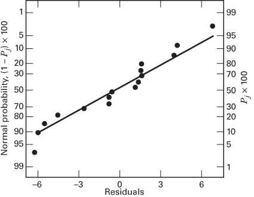  
■ FIGURE 8.14 Normal probability plot of residuals for Example 8.4

Figure 8.14 presents the normal probability plot of the residuals. This plot appears satisfactory. The plots of residuals versus each factor were then constructed. One of these plots, that for residuals versus factor C (holding time), is shown in Figure 8.15. The plot reveals that there is much less scatter in the residuals at the low holding time than at the high holding time. These residuals were obtained in the usual way from a model for predicted shrinkage:

$$
\begin{array}{r l} & {\hat {y} = \hat {\beta} _ {0} + \hat {\beta} _ {1} x _ {1} + \hat {\beta} _ {2} x _ {2} + \hat {\beta} _ {1 2} x _ {1} x _ {2}} \\ & {\quad = 2 7. 3 1 2 5 + 6. 9 3 7 5 x _ {1} + 1 7. 8 1 2 5 x _ {2} + 5. 9 3 7 5 x _ {1} x _ {2}} \end{array}
$$

where $x_{1}, x_{2}$ , and $x_{1}x_{2}$ are coded variables that correspond to the factors A and B and the AB interaction. The residuals are then

$$
e = y - \hat {y}
$$

The regression model used to produce the residuals essentially removes the location effects of A, B, and AB from the data; the residuals therefore contain information about unexplained variability. Figure 8.15 indicates that there is a pattern in the variability and that the variability in the shrinkage of parts may be smaller when the holding time is at the low level. (Please recall that we observed in Chapter 6 that residuals only convey information about dispersion effects when the location or mean model is correct.)

This is further amplified by the analysis of residuals shown in Table 8.12. In this table, the residuals are arranged at the low $(-)$ and high $(+)$ levels of each factor, and the standard deviations of the residuals at the low and high levels of each factor have been calculated. Note that the standard deviation of the residuals with $C$ at the low level $[S(C^{-}) = 1.63]$ is considerably smaller than the standard deviation of the residuals with $C$ at the high level $[S(C^{+}) = 5.70]$ .

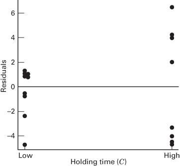  
■ FIGURE 8.15 Residuals versus holding time (C) for Example 8.4

The bottom line of Table 8.12 presents the statistic

$$
F _ {i} ^ {*} = \ln \frac {S ^ {2} (i ^ {+})}{S ^ {2} (i ^ {-})}
$$

Recall that if the variances of the residuals at the high (+) and low (−) levels of factor i are equal, then this ratio is approximately normally distributed with mean zero, and it can be used to judge the difference in the response variability at the two levels of factor i. Because the ratio $F_{C}^{*}$ is relatively large, we would conclude that the apparent dispersion or variability effect observed in Figure 8.15 is real. Thus, setting the holding time at its low level would contribute to reducing the variability in shrinkage from part to part during a production run. Figure 8.16 presents a normal probability plot of the $F_{i}^{*}$ values in Table 8.12; this also indicates that factor C has a large dispersion effect.

Figure 8.17 shows the data from this experiment projected onto a cube in the factors A, B, and C. The average observed shrinkage and the range of observed shrinkage are shown at each corner of the cube. From inspection of this figure, we see that running the process with the screw speed (B) at the low level is the key to reducing average parts shrinkage. If B is low, virtually any combination of temperature (A) and holding time (C) will result in low values of average parts shrinkage. However, from examining the ranges of the shrinkage values at each corner of the cube, it is immediately clear that setting the holding time (C) at the low level is the only reasonable choice if we wish to keep the part-to-part variability in shrinkage low during a production run.

$$
\begin{array} { c c c c c c c c c c c c c c c c c } \text {   S ( i ^ { + } ) } & 3 . 8 0 & 4 . 0 1 & 4 . 3 3 & 5 . 7 0 & 3 . 6 8 & 3 . 8 5 & 4 . 1 7 & 4 . 6 4 & 3 . 3 9 & 4 . 0 1 & 4 . 7 2 & 4 . 7 1 & 3 . 5 0 & 3 . 8 8 & 4 . 8 7 \\ S ( i ^ { - } ) & 4 . 6 0 & 4 . 4 1 & 4 . 1 0 & 1 . 6 3 & 4 . 5 3 & 4 . 3 3 & 4 . 2 5 & 3 . 5 9 & 2 . 7 5 & 4 . 4 1 & 3 . 6 4 & 3 . 6 5 & 3 . 1 2 & 4 . 5 2 & 3 . 4 0 \\ F _ { i } ^ { * } & - 0 . 3 8 & - 0 . 1 9 & 0 . 1 1 & 2 . 5 0 & - 0 . 4 2 & - 0 . 2 3 & - 0 . 0 4 & 0 . 5 1 & 0 . 4 2 & - 0 . 1 9 & 0 . 5 2 & 0 . 5 1 & 0 . 2 3 & - 0 . 3 1 & 0 . 7 2 \\ \hline \end{array}
$$

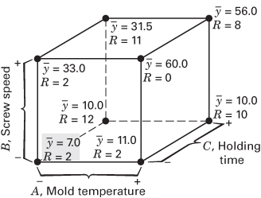

■ FIGURE 8.17 Average shrinkage and range of shrinkage in factors A, B, and C for Example 8.4  
■ FIGURE 8.16 Normal probability plot of the dispersion effects $F_{i}^{*}$ for Example 8.4

## 8.4 The General $2^{k - p}$ Fractional Factorial Design

## 8.4.1 Choosing a Design

A $2^{k}$ fractional factorial design containing $2^{k-p}$ runs is called a $1/2^{p}$ fraction of the $2^{k}$ design or, more simply, a $2^{k-p}$ fractional factorial design. These designs require the selection of p independent generators. The defining relation for the design consists of the p generators initially chosen and their $2^{p}-p-1$ generalized interactions. In this section, we discuss the construction and analysis of these designs.

The alias structure may be found by multiplying each effect column by the defining relation. Care should be exercised in choosing the generators so that effects of potential interest are not aliased with each other. Each effect has $2^{p} - 1$ aliases. For moderately large values of $k$ , we usually assume higher order interactions (say, third- or fourth-order and higher) to be negligible, and this greatly simplifies the alias structure.

It is important to select the p generators for a $2^{k-p}$ fractional factorial design in such a way that we obtain the best possible alias relationships. A reasonable criterion is to select the generators such that the resulting $2^{k-p}$ design has the highest possible resolution. To illustrate, consider the $2_{IV}^{6-2}$ design in Table 8.9, where we used the generators E = ABC and F = BCD, thereby producing a design of resolution IV. This is the maximum resolution design. If we had selected E = ABC and F = ABCD, the complete defining relation would have been I = ABCE = ABCDF = DEF, and the design would be of resolution III. Clearly, this is an inferior choice because it needlessly sacrifices information about interactions.

Sometimes resolution alone is insufficient to distinguish between designs. For example, consider the three $2_{\mathrm{IV}}^{7-2}$ designs in Table 8.13. All of these designs are of resolution IV, but they have rather different alias structures (we have assumed that three-factor and higher interactions are negligible) with respect to the two-factor interactions. Clearly, design A has more extensive aliasing and design C the least, so design C would be the best choice for a $2_{\mathrm{IV}}^{7-2}$ .

The three word lengths in design A are all 4; that is, the word length pattern is $\{4, 4, 4\}$ . For design B, it is $\{4, 4, 6\}$ , and for design C, it is $\{4, 5, 5\}$ . Notice that the defining relation for design C has only one four-letter word, whereas the other designs have two or three. Thus, design C minimizes the number of words in the defining relation that are of minimum length. We call such a design a minimum aberration design. Minimizing aberration in a design of resolution R ensures that the design has the minimum number of main effects aliased with interactions of order

TABLE 8.13  
Three Choices of Generators for the $2_{\mathrm{IV}}^{7 - 2}$ Design

<table><tr><td>Design A Generators: $F = ABC, G = BCD$  $I = ABCF = BCDG = ADFG$ </td><td>Design B Generators: $F = ABC, G = ADE$  $I = ABCF = ADEG = BCDEFG$ </td><td>Design C Generators: $F = ABCD, G = ABDE$  $I = ABCDF = ABDEG = CEFG$ </td></tr><tr><td>Aliases (two-factor interactions)</td><td>Aliases (two-factor interactions)</td><td>Aliases (two-factor interactions)</td></tr><tr><td> $AB = CF$ </td><td> $AB = CF$ </td><td> $CE = FG$ </td></tr><tr><td> $AC = BF$ </td><td> $AC = BF$ </td><td> $CF = EG$ </td></tr><tr><td> $AD = FG$ </td><td> $AD = EG$ </td><td> $CG = EF$ </td></tr><tr><td> $AG = DF$ </td><td> $AE = DG$ </td><td></td></tr><tr><td> $BD = CG$ </td><td> $AF = BC$ </td><td></td></tr><tr><td> $BG = CD$ </td><td> $AG = DE$ </td><td></td></tr><tr><td> $AF = BC = DG$ </td><td></td><td></td></tr></table>

R - 1, the minimum number of two-factor interactions aliased with interactions of order R - 2, and so forth. Refer to Fries and Hunter (1980) for more details.

Table 8.14 presents a selection of $2^{k-p}$ fractional factorial designs for $k \leq 15$ factors and up to $n \leq 128$ runs. The suggested generators in this table will result in a design of the highest possible resolution. These are also the minimum aberration designs.

The alias relationships for all of the designs in Table 8.14 for which $n \leq 64$ are given in Appendix Table VIII(a–w). The alias relationships presented in this table focus on main effects and two- and three-factor interactions. The complete defining relation is given for each design. This appendix table makes it very easy to select a design of sufficient resolution to ensure that any interactions of potential interest can be estimated.

## EXAMPLE 8.5

To illustrate the use of Table 8.14, suppose that we have seven factors and that we are interested in estimating the seven main effects and getting some insight regarding the two-factor interactions. We are willing to assume that three-factor and higher interactions are negligible. This information suggests that a resolution IV design would be appropriate.

Table 8.14 shows that there are two resolution IV fractions available: the $2_{\mathrm{IV}}^{7-2}$ with 32 runs and the $2_{\mathrm{IV}}^{7-3}$ with 16 runs. Appendix Table VIII contains the complete alias relationships for these two designs. The aliases for the $2_{\mathrm{IV}}^{7-3}$ 16-run design are in Appendix Table VIII(i). Notice that all seven main effects are aliased with three-factor interactions. The two-factor interactions are all aliased in groups of three. Therefore, this design will satisfy our objectives; that is, it will allow the estimation of the main effects, and it will give some insight regarding two-factor interactions.

It is not necessary to run the $2_{IV}^{7-2}$ design, which would require 32 runs. Appendix Table VIII(j) shows that this design would allow the estimation of all seven main effects and that 15 of the 21 two-factor interactions could also be uniquely estimated. (Recall that three-factor and higher interactions are negligible.) This is probably more information about interactions than is necessary. The complete $2_{IV}^{7-3}$ design is shown in Table 8.15. Notice that it was constructed by starting with the 16-run $2^{4}$ design in A, B, C, and D as the basic design and then adding the three columns E = ABC, F = BCD, and G = ACD. The generators are I = ABCE, I = BCDF, and I = ACDG (Table 8.14). The complete defining relation is I = ABCE = BCDF = ADEF = ACDG = BDEG = CEFG = ABFG.

(Continued on p. 300)

<table><tr><td colspan="12">Selected  $2^{k-p}$  Fractional Factorial Designs</td></tr><tr><td>Number of Factors, k</td><td>Fraction</td><td>Number of Runs</td><td>Design Generators</td><td>Number of Factors, k</td><td>Fraction</td><td>Number of Runs</td><td>Design Generators</td><td>Number of Factors, k</td><td>Fraction</td><td>Number of Runs</td><td>Design Generators</td></tr><tr><td>3</td><td> $2^{3-1}_{\text{III}}$ </td><td>4</td><td>C = ±AB</td><td></td><td> $2^{9-5}_{\text{III}}$ </td><td>16</td><td>E = ±ABC</td><td></td><td></td><td></td><td>L = ±AC</td></tr><tr><td>4</td><td> $2^{4-1}_{\text{IV}}$ </td><td>8</td><td>D = ±ABC</td><td></td><td></td><td></td><td>F = ±BCD</td><td>12</td><td> $2^{12-8}_{\text{III}}$ </td><td>16</td><td>E = ±ABC</td></tr><tr><td>5</td><td> $2^{5-1}_{\text{V}}$ </td><td>16</td><td>E = ±ABCD</td><td></td><td></td><td></td><td>G = ±ACD</td><td></td><td></td><td></td><td>F = ±ABD</td></tr><tr><td></td><td> $2^{5-2}_{\text{III}}$ </td><td>8</td><td>D = ±AB</td><td></td><td></td><td></td><td>H = ±ABD</td><td></td><td></td><td></td><td>G = ±ACD</td></tr><tr><td></td><td></td><td></td><td>E = ±AC</td><td></td><td></td><td></td><td>J = ±ABCD</td><td></td><td></td><td></td><td>H = ±BCD</td></tr><tr><td>6</td><td> $2^{6-1}_{\text{VI}}$ </td><td>32</td><td>F = ±ABCDE</td><td>10</td><td> $2^{10-3}_{\text{V}}$ </td><td>128</td><td>H = ±ABCG</td><td></td><td></td><td></td><td>J = ±ABCD</td></tr><tr><td></td><td> $2^{6-2}_{\text{IV}}$ </td><td>16</td><td>E = ±ABC</td><td></td><td></td><td></td><td>J = ±BCDE</td><td></td><td></td><td></td><td>K = ±AB</td></tr><tr><td></td><td></td><td></td><td>F = ±BCD</td><td></td><td></td><td></td><td>K = ±ACDF</td><td></td><td></td><td></td><td>L = ±AC</td></tr><tr><td></td><td> $2^{6-3}_{\text{III}}$ </td><td>8</td><td>D = ±AB</td><td></td><td> $2^{10-4}_{\text{IV}}$ </td><td>64</td><td>G = ±BCDF</td><td></td><td></td><td></td><td>M = ±AD</td></tr><tr><td></td><td></td><td></td><td>E = ±AC</td><td></td><td></td><td></td><td>H = ±ACDF</td><td>13</td><td> $2^{13-9}_{\text{III}}$ </td><td>16</td><td>E = ±ABC</td></tr><tr><td></td><td></td><td></td><td>F = ±BC</td><td></td><td></td><td></td><td>J = ±ABDE</td><td></td><td></td><td></td><td>F = ±ABD</td></tr><tr><td>7</td><td> $2^{7-1}_{\text{VII}}$ </td><td>64</td><td>G = ±ABCDEF</td><td></td><td></td><td></td><td>K = ±ABCE</td><td></td><td></td><td></td><td>G = ±ACD</td></tr><tr><td></td><td> $2^{7-2}_{\text{IV}}$ </td><td>32</td><td>F = ±ABCD</td><td></td><td> $2^{10-5}_{\text{IV}}$ </td><td>32</td><td>F = ±ABCD</td><td></td><td></td><td></td><td>H = ±BCD</td></tr><tr><td></td><td></td><td></td><td>G = ±ABDE</td><td></td><td></td><td></td><td>G = ±ABCE</td><td></td><td></td><td></td><td>J = ±ABCD</td></tr><tr><td></td><td> $2^{7-3}_{\text{IV}}$ </td><td>16</td><td>E = ±ABC</td><td></td><td></td><td></td><td>H = ±ABDE</td><td></td><td></td><td></td><td>K = ±AB</td></tr><tr><td></td><td></td><td></td><td>F = ±BCD</td><td></td><td></td><td></td><td>J = ±ACDE</td><td></td><td></td><td></td><td>L = ±AC</td></tr><tr><td></td><td></td><td></td><td>G = ±ACD</td><td></td><td></td><td></td><td>K = ±BCDE</td><td></td><td></td><td></td><td>M = ±AD</td></tr><tr><td></td><td> $2^{7-4}_{\text{III}}$ </td><td>8</td><td>D = ±AB</td><td></td><td> $2^{10-6}_{\text{III}}$ </td><td>16</td><td>E = ±ABC</td><td></td><td></td><td></td><td>N = ±BC</td></tr><tr><td></td><td></td><td></td><td>E = ±AC</td><td></td><td></td><td></td><td>F = ±BCD</td><td>14</td><td> $2^{14-10}_{\text{III}}$ </td><td>16</td><td>E = ±ABC</td></tr><tr><td></td><td></td><td></td><td>F = ±BC</td><td></td><td></td><td></td><td>G = ±ACD</td><td></td><td></td><td></td><td>F = ±ABD</td></tr><tr><td></td><td></td><td></td><td>G = ±ABC</td><td></td><td></td><td></td><td>H = ±ABD</td><td></td><td></td><td></td><td>G = ±ACD</td></tr><tr><td>8</td><td> $2^{8-2}_{\text{V}}$ </td><td>64</td><td>G = ±ABCD</td><td></td><td></td><td></td><td>J = ±ABCD</td><td></td><td></td><td></td><td>H = ±BCD</td></tr><tr><td></td><td></td><td></td><td>H = ±ABEF</td><td></td><td></td><td></td><td>K = ±AB</td><td></td><td></td><td></td><td>J = ±ABCD</td></tr><tr><td></td><td> $2^{8-3}_{\text{IV}}$ </td><td>32</td><td>F = ±ABC</td><td>11</td><td> $2^{11-5}_{\text{IV}}$ </td><td>64</td><td>G = ±CDE</td><td></td><td></td><td></td><td>K = ±AB</td></tr><tr><td></td><td></td><td></td><td>G = ±ABD</td><td></td><td></td><td></td><td>H = ±ABCD</td><td></td><td></td><td></td><td>L = ±AC</td></tr><tr><td></td><td></td><td></td><td>H = ±BCDE</td><td></td><td></td><td></td><td>J = ±ABF</td><td></td><td></td><td></td><td>M = ±AD</td></tr><tr><td></td><td> $2^{8-4}_{\text{IV}}$ </td><td>16</td><td>E = ±BCD</td><td></td><td></td><td></td><td>K = ±BDEF</td><td></td><td></td><td></td><td>N = ±BC</td></tr><tr><td></td><td></td><td></td><td>F = ±ACD</td><td></td><td></td><td></td><td>L = ±ADEF</td><td></td><td></td><td></td><td>O = ±BD</td></tr><tr><td></td><td></td><td></td><td>G = ±ABC</td><td></td><td> $2^{11-6}_{\text{IV}}$ </td><td>32</td><td>F = ±ABC</td><td>15</td><td> $2^{15-11}_{\text{III}}$ </td><td>16</td><td>E = ±ABC</td></tr><tr><td></td><td></td><td></td><td>H = ±ABD</td><td></td><td></td><td></td><td>G = ±BCD</td><td></td><td></td><td></td><td>F = ±ABD</td></tr><tr><td>9</td><td> $2^{9-2}_{\text{VI}}$ </td><td>128</td><td>H = ±ACDFG</td><td></td><td></td><td></td><td>H = ±CDE</td><td></td><td></td><td></td><td>G = ±ACD</td></tr><tr><td></td><td></td><td></td><td>J = ±BCEFG</td><td></td><td></td><td></td><td>J = ±ACD</td><td></td><td></td><td></td><td>H = ±BCD</td></tr><tr><td></td><td> $2^{9-3}_{\text{IV}}$ </td><td>64</td><td>G = ±ABCD</td><td></td><td></td><td></td><td>K = ±ADE</td><td></td><td></td><td></td><td>J = ±ABCD</td></tr><tr><td></td><td></td><td></td><td>H = ±ACEF</td><td></td><td></td><td></td><td>L = ±BDE</td><td></td><td></td><td></td><td>K = ±AB</td></tr><tr><td></td><td></td><td></td><td>J = ±CDEF</td><td></td><td> $2^{11-7}_{\text{III}}$ </td><td>16</td><td>E = ±ABC</td><td></td><td></td><td></td><td>L = ±AC</td></tr><tr><td></td><td> $2^{9-4}_{\text{IV}}$ </td><td>32</td><td>F = ±BCDE</td><td></td><td></td><td></td><td>F = ±BCD</td><td></td><td></td><td></td><td>M = ±AD</td></tr><tr><td></td><td></td><td></td><td>G = ±ACDE</td><td></td><td></td><td></td><td>G = ±ACD</td><td></td><td></td><td></td><td>N = ±BC</td></tr><tr><td></td><td></td><td></td><td>H = ±ABDE</td><td></td><td></td><td></td><td>H = ±ABD</td><td></td><td></td><td></td><td>O = ±BD</td></tr><tr><td></td><td></td><td></td><td>J = ±ABCE</td><td></td><td></td><td></td><td>J = ±ABCD</td><td></td><td></td><td></td><td>P = ±CD</td></tr><tr><td></td><td></td><td></td><td></td><td></td><td></td><td></td><td>K = ±AB</td><td></td><td></td><td></td><td></td></tr></table>

■ TABLE 8.15
A $2^{7-3}_{IV}$ Fractional Factorial Design

<table><tr><td rowspan="2">Run</td><td colspan="4">Basic Design</td><td rowspan="2"> $E = ABC$ </td><td rowspan="2"> $F = BCD$ </td><td rowspan="2"> $G = ACD$ </td></tr><tr><td>A</td><td>B</td><td>C</td><td>D</td></tr><tr><td>1</td><td>-</td><td>-</td><td>-</td><td>-</td><td>-</td><td>-</td><td>-</td></tr><tr><td>2</td><td>+</td><td>-</td><td>-</td><td>-</td><td>+</td><td>-</td><td>+</td></tr><tr><td>3</td><td>-</td><td>+</td><td>--</td><td>-</td><td>+</td><td>+</td><td>-</td></tr><tr><td>4</td><td>+</td><td>+</td><td>--</td><td>-</td><td>-</td><td>+</td><td>+</td></tr><tr><td>5</td><td>-</td><td>-</td><td>+</td><td>-</td><td>+</td><td>+</td><td>+</td></tr><tr><td>6</td><td>+</td><td>-</td><td>+</td><td>-</td><td>-</td><td>+</td><td>-</td></tr><tr><td>7</td><td>-</td><td>+</td><td>+</td><td>-</td><td>-</td><td>-</td><td>+</td></tr><tr><td>8</td><td>+</td><td>+</td><td>+</td><td>-</td><td>+</td><td>-</td><td>-</td></tr><tr><td>9</td><td>-</td><td>-</td><td>-</td><td>+</td><td>-</td><td>+</td><td>+</td></tr><tr><td>10</td><td>+</td><td>-</td><td>-</td><td>+</td><td>+</td><td>+</td><td>-</td></tr><tr><td>11</td><td>-</td><td>+</td><td>-</td><td>+</td><td>+</td><td>--</td><td>+</td></tr><tr><td>12</td><td>+</td><td>+</td><td>-</td><td>+</td><td>-</td><td>-</td><td>-</td></tr><tr><td>13</td><td>-</td><td>-</td><td>+</td><td>+</td><td>+</td><td>-</td><td>-</td></tr><tr><td>14</td><td>+</td><td>-</td><td>+</td><td>+</td><td>-</td><td>-</td><td>+</td></tr><tr><td>15</td><td>-</td><td>+</td><td>+</td><td>+</td><td>-</td><td>+</td><td>-</td></tr><tr><td>16</td><td>+</td><td>+</td><td>+</td><td>+</td><td>+</td><td>+</td><td>+</td></tr></table>

## 8.4.2 Analysis of $2^{k - p}$ Fractional Factorials

There are many computer programs that can be used to analyze the $2^{k-p}$ fractional factorial design. For example, Design-Expert, JMP, and Minitab all have this capability.

The design may also be analyzed by resorting to first principles; the ith effect is estimated by

$$
\mathrm{Effect} _ {i} = \frac {2 (\text { Contrast } _ {i})}{N} = \frac {\text { Contrast } _ {i}}{(N / 2)}
$$

where the Contrast $_{i}$ is found using the plus and minus signs in column i and $N = 2^{k-p}$ is the total number of observations. The $2^{k-p}$ design allows only $2^{k-p} - 1$ effects (and their aliases) to be estimated. Normal probability plots of the effect estimates and Lenth's method are very useful analysis tools.

Projection of the $2^{k-p}$ Fractional Factorial. The $2^{k-p}$ design collapses into either a full factorial or a fractional factorial in any subset of $r \leq k - p$ of the original factors. Those subsets of factors providing fractional factorials are subsets appearing as words in the complete defining relation. This is particularly useful in screening experiments when we suspect at the outset of the experiment that most of the original factors will have small effects. The original $2^{k-p}$ fractional factorial can then be projected into a full factorial, say, in the most interesting factors. Conclusions drawn from designs of this type should be considered tentative and subject to further analysis. It is usually possible to find alternative explanations of the data involving higher order interactions.

As an example, consider the $2_{\mathrm{IV}}^{7-3}$ design from Example 8.5. This is a 16-run design involving seven factors. It will project into a full factorial in any four of the original seven factors that is not a word in the defining relation. There are 35 subsets of four factors, seven of which appear in the complete defining relation (see Table 8.15). Thus, there are 28 subsets of four factors that would form $2^{4}$ designs. One combination that is obvious upon inspecting Table 8.15 is $A, B, C$ , and $D$ .

To illustrate the usefulness of this projection properly, suppose that we are conducting an experiment to improve the efficiency of a ball mill and the seven factors are as follows:

1. Motor speed

2. Gain

3. Feed mode

4. Feed sizing

5. Material type

6. Screen angle

7. Screen vibration level

We are fairly certain that motor speed, feed mode, feed sizing, and material type will affect efficiency and that these factors may interact. The role of the other three factors is less well known, but it is likely that they are negligible. A reasonable strategy would be to assign motor speed, feed mode, feed sizing, and material type to columns A, B, C, and D, respectively, in Table 8.15. Gain, screen angle, and screen vibration level would be assigned to columns E, F, and G, respectively. If we are correct and the “minor variables” E, F, and G are negligible, we will be left with a full $2^{4}$ design in the key process variables.

## 8.4.3 Blocking Fractional Factorials

Occasionally, a fractional factorial design requires so many runs that all of them cannot be made under homogeneous conditions. In these situations, fractional factorials may be confounded in blocks. Appendix Table VIII contains recommended blocking arrangements for many of the fractional factorial designs in Table 8.14. The minimum block size for these designs is eight runs.

To illustrate the general procedure, consider the $2_{IV}^{6-2}$ fractional factorial design with the defining relation $I = ABCE = BCDF = ADEF$ shown in Table 8.10. This fractional design contains 16 treatment combinations. Suppose that we wish to run the design in two blocks of eight treatment combinations each. In selecting an interaction to confound with blocks, we note from examining the alias structure in Appendix Table VIII(f) that there are two alias sets involving only three-factor interactions. The table suggests selecting ABD (and its aliases) to be confounded with blocks. This would give the two blocks shown in Figure 8.18. Notice that the principal block contains those treatment combinations that have an even number of letters in common with ABD. These are also the treatment combinations for which $L = x_{1} + x_{2} + x_{4} = 0 \pmod{2}$ .

Block 1

Block 2

## ■ FIGURE 8.18 The $2_{IV}^{6-2}$ design in two blocks with ABD confounded

## EXAMPLE 8.6

A five-axis CNC machine is used to produce an impeller for a jet turbine engine. The blade profiles are an important quality characteristic. Specifically, the deviation of the blade profile from the profile specified on the engineering drawing is of interest. An experiment is run to determine which machine parameters affect profile deviation. The eight factors selected for the design are as follows:

<table><tr><td>Factor</td><td>Low Level (−)</td><td>High Level (+)</td></tr><tr><td>A = x-Axis shift (0.001 in.)</td><td>0</td><td>15</td></tr><tr><td>B = y-Axis shift (0.001 in.)</td><td>0</td><td>15</td></tr><tr><td>C = z-Axis shift (0.001 in.)</td><td>0</td><td>15</td></tr><tr><td>D = Tool supplier</td><td>1</td><td>2</td></tr><tr><td>E = a-Axis shift (0.001 deg)</td><td>0</td><td>30</td></tr><tr><td>F = Spindle speed (%)</td><td>90</td><td>110</td></tr><tr><td>G = Fixture height (0.001 in.)</td><td>0</td><td>15</td></tr><tr><td>H = Feed rate (%)</td><td>90</td><td>110</td></tr></table>

One test blade on each part is selected for inspection. The profile deviation is measured using a coordinate measuring machine, and the standard deviation of the difference between the actual profile and the specified profile is used as the response variable.

The machine has four spindles. Because there may be differences in the spindles, the process engineers feel that the spindles should be treated as blocks.

The engineers feel confident that three-factor and higher interactions are not too important, but they are reluctant to ignore the two-factor interactions. From Table 8.14, two designs initially appear appropriate: the $2_{\mathrm{IV}}^{8-4}$ design with 16 runs and the $2_{\mathrm{IV}}^{8-3}$ design with 32 runs. Appendix Table VIII(1) indicates that if the 16-run design is used, there will be fairly extensive aliasing of two-factor interactions. Furthermore, this design cannot be run in four blocks without confounding four two-factor interactions with blocks. Therefore, the experimenters decide to use the $2_{\mathrm{IV}}^{8-3}$ design in four blocks. This confounds one three-factor interaction alias chain and one two-factor interaction $(EH)$ and its three-factor interaction aliases with blocks. The $EH$ interaction is the interaction between the $a$ -axis shift and the feed rate, and the engineers consider an interaction between these two variables to be fairly unlikely.

Table 8.16 contains the design and the resulting responses as standard deviation $\times 10^{3}$ in. Because the response variable is a standard deviation, it is often best to perform the analysis following a log transformation. The effect estimates are shown in Table 8.17. Figure 8.19 is a normal probability plot of the effect estimates, using $\ln (\text{standard deviation} \times 10^{3})$ as the response variable. The only large effects are A = x-axis shift, B = y-axis shift, and the alias chain involving $AD + BG$ . Now AD is the x-axis shift-tool supplier interaction, and BG is the y-axis shift-fixture height interaction, and since these two interactions are aliased it is impossible to separate them based on the data from the current experiment. Since both interactions involve one large main effect it is also difficult to apply any “obvious” simplifying logic such as effect heredity to the situation either. If there is some engineering knowledge or process knowledge available that sheds light on the situation, then perhaps a choice could be made between the two interactions; otherwise, more data will be required to separate these two effects. (The problem of adding runs to a fractional factorial to de-alias interactions is discussed in Sections 8.6 and 8.7.)

Suppose that process knowledge suggests that the appropriate interaction is likely to be AD. Table 8.18 is the resulting analysis of variance for the model with factors A, B, D, and AD (factor D was included to preserve the hierarchy principle). Notice that the block effect is small, suggesting that the machine spindles are not very different.

Figure 8.20 is a normal probability plot of the residuals from this experiment. This plot is suggestive of slightly heavier than normal tails, so possibly other transformations should be considered. The AD interaction plot is in Figure 8.21. Notice that tool supplier (D) and the magnitude of the x-axis shift (A) have a profound impact on the variability of the blade profile from design specifications. Running A at the low level (0 offset) and buying tools from supplier 1 gives the best results. Figure 8.22 shows the projection of this $2_{IV}^{8-3}$ design into four replicates of a $2^{3}$ design in factors A, B, and D. The best combination of operating conditions is A at the low level (0 offset), B at the high level (0.015 in offset), and D at the low level (tool supplier 1).

■ TABLE 8.16
The $2^{8-3}$ Design in Four Blocks for Example 8.6

<table><tr><td rowspan="2">Run</td><td colspan="5">Basic Design</td><td rowspan="2">F=ABC</td><td rowspan="2">G=ABD</td><td rowspan="2">H=BCDE</td><td rowspan="2">Block</td><td rowspan="2">Actual Run Order</td><td rowspan="2">Standard Deviation (×103in.)</td></tr><tr><td>A</td><td>B</td><td>C</td><td>D</td><td>E</td></tr><tr><td>1</td><td>-</td><td>-</td><td>-</td><td>-</td><td>-</td><td>-</td><td>-</td><td>+</td><td>3</td><td>18</td><td>2.76</td></tr><tr><td>2</td><td>+</td><td>-</td><td>-</td><td>-</td><td>-</td><td>+</td><td>+</td><td>+</td><td>2</td><td>16</td><td>6.18</td></tr><tr><td>3</td><td>-</td><td>+</td><td>-</td><td>-</td><td>-</td><td>+</td><td>+</td><td>-</td><td>4</td><td>29</td><td>2.43</td></tr><tr><td>4</td><td>+</td><td>+</td><td>-</td><td>-</td><td>-</td><td>-</td><td>-</td><td>-</td><td>1</td><td>4</td><td>4.01</td></tr><tr><td>5</td><td>-</td><td>-</td><td>+</td><td>-</td><td>-</td><td>+</td><td>-</td><td>-</td><td>1</td><td>6</td><td>2.48</td></tr><tr><td>6</td><td>+</td><td>-</td><td>+</td><td>-</td><td>-</td><td>-</td><td>+</td><td>-</td><td>4</td><td>26</td><td>5.91</td></tr><tr><td>7</td><td>-</td><td>+</td><td>+</td><td>-</td><td>-</td><td>-</td><td>+</td><td>+</td><td>2</td><td>14</td><td>2.39</td></tr><tr><td>8</td><td>+</td><td>+</td><td>+</td><td>-</td><td>-</td><td>+</td><td>-</td><td>+</td><td>3</td><td>22</td><td>3.35</td></tr><tr><td>9</td><td>-</td><td>-</td><td>-</td><td>+</td><td>-</td><td>-</td><td>+</td><td>-</td><td>1</td><td>8</td><td>4.40</td></tr><tr><td>10</td><td>+</td><td>-</td><td>-</td><td>+</td><td>-</td><td>+</td><td>-</td><td>-</td><td>4</td><td>32</td><td>4.10</td></tr><tr><td>11</td><td>-</td><td>+</td><td>-</td><td>+</td><td>-</td><td>+</td><td>-</td><td>+</td><td>2</td><td>15</td><td>3.22</td></tr><tr><td>12</td><td>+</td><td>+</td><td>-</td><td>+</td><td>-</td><td>-</td><td>+</td><td>+</td><td>3</td><td>19</td><td>3.78</td></tr><tr><td>13</td><td>-</td><td>-</td><td>+</td><td>+</td><td>-</td><td>+</td><td>+</td><td>+</td><td>3</td><td>24</td><td>5.32</td></tr><tr><td>14</td><td>+</td><td>-</td><td>+</td><td>+</td><td>-</td><td>-</td><td>-</td><td>+</td><td>2</td><td>11</td><td>3.87</td></tr><tr><td>15</td><td>-</td><td>+</td><td>+</td><td>+</td><td>-</td><td>-</td><td>-</td><td>-</td><td>4</td><td>27</td><td>3.03</td></tr><tr><td>16</td><td>+</td><td>+</td><td>+</td><td>+</td><td>-</td><td>+</td><td>+</td><td>-</td><td>1</td><td>3</td><td>2.95</td></tr><tr><td>17</td><td>-</td><td>-</td><td>-</td><td>-</td><td>+</td><td>-</td><td>-</td><td>-</td><td>2</td><td>10</td><td>2.64</td></tr><tr><td>18</td><td>+</td><td>-</td><td>-</td><td>-</td><td>+</td><td>+</td><td>+</td><td>-</td><td>3</td><td>21</td><td>5.50</td></tr><tr><td>19</td><td>-</td><td>+</td><td>-</td><td>-</td><td>+</td><td>+</td><td>+</td><td>+</td><td>1</td><td>7</td><td>2.24</td></tr><tr><td>20</td><td>+</td><td>+</td><td>-</td><td>-</td><td>+</td><td>-</td><td>-</td><td>+</td><td>4</td><td>28</td><td>4.28</td></tr><tr><td>21</td><td>-</td><td>-</td><td>+</td><td>-</td><td>+</td><td>+</td><td>-</td><td>+</td><td>4</td><td>30</td><td>2.57</td></tr><tr><td>22</td><td>+</td><td>-</td><td>+</td><td>-</td><td>+</td><td>-</td><td>+</td><td>+</td><td>1</td><td>2</td><td>5.37</td></tr><tr><td>23</td><td>-</td><td>+</td><td>+</td><td>-</td><td>+</td><td>-</td><td>+</td><td>-</td><td>3</td><td>17</td><td>2.11</td></tr><tr><td>24</td><td>+</td><td>+</td><td>+</td><td>-</td><td>+</td><td>+</td><td>-</td><td>-</td><td>2</td><td>13</td><td>4.18</td></tr><tr><td>25</td><td>-</td><td>-</td><td>-</td><td>+</td><td>+</td><td>-</td><td>+</td><td>+</td><td>4</td><td>25</td><td>3.96</td></tr><tr><td>26</td><td>+</td><td>-</td><td>-</td><td>+</td><td>+</td><td>+</td><td>-</td><td>+</td><td>1</td><td>1</td><td>3.27</td></tr><tr><td>27</td><td>-</td><td>+</td><td>-</td><td>+</td><td>+</td><td>+</td><td>-</td><td>-</td><td>3</td><td>23</td><td>3.41</td></tr><tr><td>28</td><td>+</td><td>+</td><td>-</td><td>+</td><td>+</td><td>-</td><td>+</td><td>-</td><td>2</td><td>12</td><td>4.30</td></tr><tr><td>29</td><td>-</td><td>-</td><td>+</td><td>+</td><td>+</td><td>+</td><td>+</td><td>-</td><td>2</td><td>9</td><td>4.44</td></tr><tr><td>30</td><td>+</td><td>-</td><td>+</td><td>+</td><td>+</td><td>-</td><td>-</td><td>-</td><td>3</td><td>20</td><td>3.65</td></tr><tr><td>31</td><td>-</td><td>+</td><td>+</td><td>+</td><td>+</td><td>-</td><td>-</td><td>+</td><td>1</td><td>5</td><td>4.41</td></tr><tr><td>32</td><td>+</td><td>+</td><td>+</td><td>+</td><td>+</td><td>+</td><td>+</td><td>+</td><td>4</td><td>31</td><td>3.40</td></tr></table>

TABLE 8.17  
Effect Estimates, Regression Coefficients, and Sums of Squares for Example 8.6

<table><tr><td>Variable</td><td>Name</td><td>-1 Level</td><td>+1 Level</td><td></td></tr><tr><td>A</td><td>x-Axis shift</td><td>0</td><td>15</td><td></td></tr><tr><td>B</td><td>y-Axis shift</td><td>0</td><td>15</td><td></td></tr><tr><td>C</td><td>z-Axis shift</td><td>0</td><td>15</td><td></td></tr><tr><td>D</td><td>Tool supplier</td><td>1</td><td>2</td><td></td></tr><tr><td>E</td><td>a-Axis shift</td><td>0</td><td>30</td><td></td></tr><tr><td>F</td><td>Spindle speed</td><td>90</td><td>110</td><td></td></tr><tr><td>G</td><td>Fixture height</td><td>0</td><td>15</td><td></td></tr><tr><td>H</td><td>Feed rate</td><td>90</td><td>110</td><td></td></tr><tr><td>Variable</td><td colspan="2">Regression Coefficient</td><td>Estimated Effect</td><td>Sum of Squares</td></tr><tr><td>Overall average</td><td colspan="2">1.28007</td><td></td><td></td></tr><tr><td>A</td><td colspan="2">0.14513</td><td>0.29026</td><td>0.674020</td></tr><tr><td>B</td><td colspan="2">-0.10027</td><td>-0.20054</td><td>0.321729</td></tr><tr><td>C</td><td colspan="2">-0.01288</td><td>-0.02576</td><td>0.005310</td></tr><tr><td>D</td><td colspan="2">0.05407</td><td>0.10813</td><td>0.093540</td></tr><tr><td>E</td><td colspan="2">-2.531E-04</td><td>-5.063E-04</td><td>2.050E-06</td></tr><tr><td>F</td><td colspan="2">-0.01936</td><td>-0.03871</td><td>0.011988</td></tr><tr><td>G</td><td colspan="2">0.05804</td><td>0.11608</td><td>0.107799</td></tr><tr><td>H</td><td colspan="2">0.00708</td><td>0.01417</td><td>0.001606</td></tr><tr><td>AB + CF + DG</td><td colspan="2">-0.00294</td><td>-0.00588</td><td>2.767E-04</td></tr><tr><td>AC + BF</td><td colspan="2">-0.03103</td><td>-0.06206</td><td>0.030815</td></tr><tr><td>AD + BG</td><td colspan="2">-0.18706</td><td>-0.37412</td><td>1.119705</td></tr><tr><td>AE</td><td colspan="2">0.00402</td><td>0.00804</td><td>5.170E-04</td></tr><tr><td>AF + BC</td><td colspan="2">-0.02251</td><td>-0.04502</td><td>0.016214</td></tr><tr><td>AG + BD</td><td colspan="2">0.02644</td><td>0.05288</td><td>0.022370</td></tr><tr><td>AH</td><td colspan="2">-0.02521</td><td>-0.05042</td><td>0.020339</td></tr><tr><td>BE</td><td colspan="2">0.04925</td><td>0.09851</td><td>0.077627</td></tr><tr><td>BH</td><td colspan="2">0.00654</td><td>0.01309</td><td>0.001371</td></tr><tr><td>CD + FG</td><td colspan="2">0.01726</td><td>0.03452</td><td>0.009535</td></tr><tr><td>CE</td><td colspan="2">0.01991</td><td>0.03982</td><td>0.012685</td></tr><tr><td>CG + DF</td><td colspan="2">-0.00733</td><td>-0.01467</td><td>0.001721</td></tr><tr><td>CH</td><td colspan="2">0.03040</td><td>0.06080</td><td>0.029568</td></tr><tr><td>DE</td><td colspan="2">0.00854</td><td>0.01708</td><td>0.002334</td></tr><tr><td>DH</td><td colspan="2">0.00784</td><td>0.01569</td><td>0.001969</td></tr><tr><td>EF</td><td colspan="2">-0.00904</td><td>-0.01808</td><td>0.002616</td></tr><tr><td>EG</td><td colspan="2">-0.02685</td><td>-0.05371</td><td>0.023078</td></tr><tr><td>EH</td><td colspan="2">-0.01767</td><td>-0.03534</td><td>0.009993</td></tr><tr><td>FH</td><td colspan="2">-0.01404</td><td>-0.02808</td><td>0.006308</td></tr><tr><td>GH</td><td colspan="2">0.00245</td><td>0.00489</td><td>1.914E-04</td></tr><tr><td>ABE</td><td colspan="2">0.01665</td><td>0.03331</td><td>0.008874</td></tr><tr><td>ABH</td><td colspan="2">-0.00631</td><td>-0.01261</td><td>0.001273</td></tr><tr><td>ACD</td><td colspan="2">-0.02717</td><td>-0.05433</td><td>0.023617</td></tr></table>

  
■ FIGURE 8.19 Normal probability plot of the effect estimates for Example 8.6

TABLE 8.18  
Analysis of Variance for Example 8.6

<table><tr><td>Source of Variation</td><td>Sum of Squares</td><td>Degrees of Freedom</td><td>Mean Square</td><td> $F_0$ </td><td>P-Value</td></tr><tr><td>A</td><td>0.6740</td><td>1</td><td>0.6740</td><td>39.42</td><td>&lt;0.0001</td></tr><tr><td>B</td><td>0.3217</td><td>1</td><td>0.3217</td><td>18.81</td><td>0.0002</td></tr><tr><td>D</td><td>0.0935</td><td>1</td><td>0.0935</td><td>5.47</td><td>0.0280</td></tr><tr><td>AD</td><td>1.1197</td><td>1</td><td>1.1197</td><td>65.48</td><td>&lt;0.0001</td></tr><tr><td>Blocks</td><td>0.0201</td><td>3</td><td>0.0067</td><td></td><td></td></tr><tr><td>Error</td><td>0.4099</td><td>24</td><td>0.0171</td><td></td><td></td></tr><tr><td>Total</td><td>2.6389</td><td>31</td><td></td><td></td><td></td></tr></table>

  
■ FIGURE 8.20 Normal probability plot of the residuals for Example 8.6

  
■ FIGURE 8.21 Plot of AD interaction for Example 8.6

■ FIGURE 8.22 The $2_{IV}^{8-3}$ design in Example 8.6 projected into four replicates of a $2^{3}$ design in factors A, B, and D

## 8.5 Alias Structures in Fractional Factorials and Other Designs

In this chapter, we show how to find the alias relationships in a $2^{k-p}$ fractional factorial design by use of the complete defining relation. This method works well in simple designs, such as the regular fractions we use most frequently, but it does not work as well in more complex settings, such as some of the nonregular fractions and partial fold-over designs that we will discuss subsequently. Furthermore, there are some fractional factorials that do not have defining relations, such as the Plackett–Burman designs in Section 8.6.3, so the defining relation method will not work for these types of designs at all.

Fortunately, there is a general method available that works satisfactorily in many situations. The method uses the polynomial or regression model representation of the model, say

$$
\mathbf {y} = \mathbf {X} _ {1} \boldsymbol {\beta} _ {1} + \epsilon
$$

where y is an $n \times 1$ vector of the responses, $X_{1}$ is an $n \times p_{1}$ matrix containing the design matrix expanded to the form of the model that the experimenter is fitting, $\beta_{1}$ is a $p_{1} \times 1$ vector of the model parameters, and $\epsilon$ is an $n \times 1$ vector of errors. The least squares estimate of $\beta_{1}$ is

$$
\hat {\boldsymbol {\beta}} _ {1} = (\mathbf {X} _ {1} ^ {\prime} \mathbf {X} _ {1}) ^ {- 1} \mathbf {X} _ {1} ^ {\prime} \mathbf {y}
$$

Suppose that the true model is

$$
\mathbf {y} = \mathbf {X} _ {1} \boldsymbol {\beta} _ {1} + \mathbf {X} _ {2} \boldsymbol {\beta} _ {2} + \epsilon
$$

where $X_{2}$ is an $n \times p_{2}$ matrix containing additional variables that are not in the fitted model and $\beta_{2}$ is a $p_{2} \times 1$ vector of the parameters associated with these variables. It can be shown that

$$
\begin{array}{r l} E (\hat {\boldsymbol {\beta}} _ {1}) & = \boldsymbol {\beta} _ {1} + (\mathbf {X} _ {1} ^ {\prime} \mathbf {X} _ {1}) ^ {- 1} \mathbf {X} _ {1} ^ {\prime} \mathbf {X} _ {2} \boldsymbol {\beta} _ {2} \\ & = \boldsymbol {\beta} _ {1} + \mathbf {A} \boldsymbol {\beta} _ {2} \end{array}\tag{8.1}
$$

The matrix $\mathbf{A} = (\mathbf{X}_1' \mathbf{X}_1)^{-1} \mathbf{X}_1' \mathbf{X}_2$ is called the alias matrix. The elements of this matrix operating on $\beta_2$ identify the alias relationships for the parameters in the vector $\beta_1$ .

We illustrate the application of this procedure with a familiar example. Suppose that we have conducted a $2^{3-1}$ design with defining relation I = ABC or $I = x_{1}x_{2}x_{3}$ . The model that the experimenter plans to fit is the main-effects-only model

$$
y = \beta_ {0} + \beta_ {1} x _ {1} + \beta_ {2} x _ {2} + \beta_ {3} x _ {3} + \epsilon
$$

In the notation defined above

$$
\boldsymbol {\beta} _ {1} = \left[ \begin{array}{l} \beta_ {0} \\ \beta_ {1} \\ \beta_ {2} \\ \beta_ {3} \end{array} \right] \quad \text { and } \quad \mathbf {X} _ {1} = \left[ \begin{array}{r r r r} 1 & - 1 & - 1 & 1 \\ 1 & 1 & - 1 & - 1 \\ 1 & - 1 & 1 & - 1 \\ 1 & 1 & 1 & 1 \end{array} \right]
$$

Suppose that the true model contains all the two-factor interactions, so that

$$
y = \beta_ {0} + \beta_ {1} x _ {1} + \beta_ {2} x _ {2} + \beta_ {3} x _ {3} + \beta_ {1 2} x _ {1} x _ {2} + \beta_ {1 3} x _ {1} x _ {3} + \beta_ {2 3} x _ {2} x _ {3} + \epsilon
$$

and

$$
\boldsymbol {\beta} _ {2} = \left[ \begin{array}{l} \beta_ {1 2} \\ \beta_ {1 3} \\ \beta_ {2 3} \end{array} \right], \quad \text { and } \quad \mathbf {X} _ {2} = \left[ \begin{array}{r r r} 1 & - 1 & - 1 \\ - 1 & - 1 & 1 \\ - 1 & 1 & - 1 \\ 1 & 1 & 1 \end{array} \right]
$$

Now

$$
\mathbf {X} _ {1} ^ {\prime} \mathbf {X} _ {1} = 4 \mathbf {I} _ {4} \quad \text { and } \quad \mathbf {X} _ {1} ^ {\prime} \mathbf {X} _ {2} = \left[ \begin{array}{l l l} 0 & 0 & 0 \\ 0 & 0 & 4 \\ 0 & 4 & 0 \\ 4 & 0 & 0 \end{array} \right]
$$

Therefore,

$$
(\mathbf {X} _ {1} ^ {\prime} \mathbf {X} _ {1}) ^ {- 1} = \frac {1}{4} \mathbf {I} _ {4}
$$

and

$$
\begin{array}{r l} E (\hat {\boldsymbol {\beta}} _ {1}) & = \boldsymbol {\beta} _ {1} + \mathbf {A} \boldsymbol {\beta} _ {2} \\ E \left[ \begin{array}{c} \hat {\beta} _ {0} \\ \hat {\beta} _ {1} \\ \hat {\beta} _ {2} \\ \hat {\beta} _ {3} \end{array} \right] & = \left[ \begin{array}{c} \beta_ {0} \\ \beta_ {1} \\ \beta_ {2} \\ \beta_ {3} \end{array} \right] + \frac {1}{4} \mathbf {I} _ {4} \left[ \begin{array}{c c c} 0 & 0 & 0 \\ 0 & 0 & 4 \\ 0 & 4 & 0 \\ 4 & 0 & 0 \end{array} \right] \left[ \begin{array}{c} \beta_ {1 2} \\ \beta_ {1 3} \\ \beta_ {2 3} \end{array} \right] \\ & = \left[ \begin{array}{c} \beta_ {0} \\ \beta_ {1} \\ \beta_ {2} \\ \beta_ {3} \end{array} \right] + \left[ \begin{array}{c c c} 0 & 0 & 0 \\ 0 & 0 & 1 \\ 0 & 1 & 0 \\ 1 & 0 & 0 \end{array} \right] \left[ \begin{array}{c} \beta_ {1 2} \\ \beta_ {1 3} \\ \beta_ {2 3} \end{array} \right] \\ & = \left[ \begin{array}{c} \beta_ {0} \\ \beta_ {1} \\ \beta_ {2} \\ \beta_ {3} \quad \end{array} \right] + \left[ \begin{array}{c} 0 \\ \beta_ {2 3} \\ \beta_ {1 3} \\ \beta_ {1 2} \end{array} \right] \\ & = \left[ \begin{array}{c} \beta_ {0} \\ \beta_ {1} + \beta_ {2 3} \\ \beta_ {2} + \beta_ {1 3} \\ \beta_ {3} + \beta_ {1 2} \end{array} \right] \end{array}
$$

The interpretation of this, of course, is that each of the main effects is aliased with one of the two-factor interactions, which we know to be the case for this design. Notice that every row of the alias matrix represents one of the factors in $\beta_{1}$ and every column represents one of the factors in $\beta_{2}$ . While this is a very simple example, the method is very general and can be applied to much more complex designs.

## 8.6 Resolution III Designs

## 8.6.1 Constructing Resolution III Designs

As indicated earlier, the sequential use of fractional factorial designs is very useful, often leading to great economy and efficiency in experimentation. This application of fractional factorials occurs frequently in situations of pure factor screening; that is, there are relatively many factors but only a few of them are expected to be important. Resolution III designs can be very useful in these situations.

It is possible to construct resolution III designs for investigating up to k = N - 1 factors in only N runs, where N is a multiple of 4. These designs are frequently useful in industrial experimentation. Designs in which N is a power of 2 can be constructed by the methods presented earlier in this chapter, and these are presented first. Of particular importance are designs requiring 4 runs for up to 3 factors, 8 runs for up to 7 factors, and 16 runs for up to 15 factors. If k = N - 1, the fractional factorial design is said to be saturated.

A design for analyzing up to three factors in four runs is the $2_{III}^{3-1}$ design, presented in Section 8.2. Another very useful saturated fractional factorial is a design for studying seven factors in eight runs, that is, the $2_{III}^{7-4}$ design. This design is a one-sixteenth fraction of the $2^{7}$ . It may be constructed by first writing down as the basic design the plus and minus levels for a full $2^{3}$ design in A, B, and C and then associating the levels of four additional factors with the interactions of the original three as follows: D = AB, E = AC, F = BC, and G = ABC. Thus, the generators for this design are I = ABD, I = ACE, I = BCF, and I = ABCG. The design is shown in Table 8.19.

The complete defining relation for this design is obtained by multiplying the four generators ABD, ACE, BCF, and ABCG together two at a time, three at a time, and four at a time, yielding

$$
\begin{array}{r l} & I = A B D = A C E = B C F = A B C G = B C D E = A C D F = C D G \\ & \quad = A B E F = B E G = A F G = D E F = A D E G = C E F G = B D F G = A B C D E F G \end{array}
$$

To find the aliases of any effect, simply multiply the effect by each word in the defining relation. For example, the aliases of B are

$$
\begin{array}{r l} & B = A D = A B C E = C F = A C G = C D E = A B C D F = B C D G = A E F = E G \\ & \quad = A B F G = B D E F = A B D E G = B C E F G = D F G = A C D E F G \end{array}
$$

This design is a one-sixteenth fraction, and because the signs chosen for the generators are positive, this is the principal fraction. It is also a resolution III design because the smallest number of letters in any word of the defining

## TABLE 8.19

The $2_{\mathrm{III}}^{7-4}$ Design with the Generators $I = ABD, I = ACE, I = BCF$ , and $I = ABCG$

<table><tr><td rowspan="2">Run</td><td colspan="3">Basic Design</td><td rowspan="2">D=AB</td><td rowspan="2">E=AC</td><td rowspan="2">F=BC</td><td rowspan="2">G=ABC</td><td rowspan="2"></td></tr><tr><td>A</td><td>B</td><td>C</td></tr><tr><td>1</td><td>-</td><td>-</td><td>-</td><td>+</td><td>+</td><td>+</td><td>-</td><td>def</td></tr><tr><td>2</td><td>+</td><td>-</td><td>-</td><td>-</td><td>-</td><td>+</td><td>+</td><td>afg</td></tr><tr><td>3</td><td>-</td><td>+</td><td>-</td><td>-</td><td>+</td><td>-</td><td>+</td><td>beg</td></tr><tr><td>4</td><td>+</td><td>+</td><td>-</td><td>+</td><td>-</td><td>-</td><td>-</td><td>abd</td></tr><tr><td>5</td><td>-</td><td>-</td><td>+</td><td>+</td><td>-</td><td>-</td><td>+</td><td>cdg</td></tr><tr><td>6</td><td>+</td><td>-</td><td>+</td><td>-</td><td>+</td><td>-</td><td>-</td><td>ace</td></tr><tr><td>7</td><td>-</td><td>+</td><td>+</td><td>-</td><td>-</td><td>+</td><td>-</td><td>bcf</td></tr><tr><td>8</td><td>+</td><td>+</td><td>+</td><td>+</td><td>+</td><td>+</td><td>+</td><td>abcdefg</td></tr></table>

contrast is three. Any one of the 16 different $2_{\mathrm{III}}^{7-4}$ designs in this family could be constructed by using the generators with one of the 16 possible arrangements of signs in $I = \pm ABD$ , $I = \pm ACE$ , $I = \pm BCF$ , $I = \pm ABCG$ .

The seven degrees of freedom in this design may be used to estimate the seven main effects. Each of these effects has 15 aliases; however, if we assume that three-factor and higher interactions are negligible, then considerable simplification in the alias structure results. Making this assumption, each of the linear combinations associated with the seven main effects in this design actually estimates the main effect and three two-factor interactions:

$$
[ A ] \rightarrow A + B D + C E + F G
$$

$$
[ B ] \rightarrow B + A D + C F + E G
$$

$$
[ C ] \rightarrow C + A E + B F + D G
$$

$$
[ D ] \rightarrow D + A B + C G + E F
$$

$$
[ E ] \rightarrow E + A C + B G + D F.
$$

$$
[ F ] \rightarrow F + B C + A G + D E
$$

$$
[ G ] \rightarrow G + C D + B E + A F\tag{8.2}
$$

These aliases are found in Appendix Table VIII(h), ignoring three-factor and higher interactions.

The saturated $2_{III}^{7-4}$ design in Table 8.19 can be used to obtain resolution III designs for studying fewer than seven factors in eight runs. For example, to generate a design for six factors in eight runs, simply drop any one column in Table 8.19, for example, column G. This produces the design shown in Table 8.20.

It is easy to verify that this design is also of resolution III; in fact, it is a $2_{III}^{6-3}$ , or a one-eighth fraction, of the $2^{6}$ design. The defining relation for the $2_{III}^{6-3}$ design is equal to the defining relation for the original $2_{III}^{7-4}$ design with any words containing the letter G deleted. Thus, the defining relation for our new design is

$$
I = A B D = A C E = B C F = B C D E = A C D F = A B E F = D E F
$$

In general, when d factors are dropped to produce a new design, the new defining relation is obtained as those words in the original defining relation that do not contain any dropped letters. When constructing designs by this method, care should be exercised to obtain the best arrangement possible. If we drop columns B, D, F, and G from Table 8.19, we obtain a design for three factors in eight runs, yet the treatment combinations correspond to two replicates of a $2^{3-1}$ design. The experimenter would probably prefer to run a full $2^{3}$ design in A, C, and E.

It is also possible to obtain a resolution III design for studying up to 15 factors in 16 runs. This saturated $2_{\mathrm{III}}^{15-11}$ design can be generated by first writing down the 16 treatment combinations associated with a $2^4$ design in $A, B, C$ ,

## TABLE 8.20

A $2^{6 - 3}$ III Design with the Generators $I = ABD, I = ACE$ , and $I = BCF$

<table><tr><td rowspan="2">Run</td><td colspan="3">Basic Design</td><td rowspan="2">D=AB</td><td rowspan="2">E=AC</td><td rowspan="2">F=BC</td><td rowspan="2"></td></tr><tr><td>A</td><td>B</td><td>C</td></tr><tr><td>1</td><td>-</td><td>-</td><td>-</td><td>+</td><td>+</td><td>+</td><td>def</td></tr><tr><td>2</td><td>+</td><td>-</td><td>-</td><td>-</td><td>-</td><td>+</td><td>af</td></tr><tr><td>3</td><td>-</td><td>+</td><td>-</td><td>-</td><td>+</td><td>-</td><td>be</td></tr><tr><td>4</td><td>+</td><td>+</td><td>-</td><td>+</td><td>-</td><td>-</td><td>abd</td></tr><tr><td>5</td><td>-</td><td>-</td><td>+</td><td>+</td><td>-</td><td>-</td><td>cd</td></tr><tr><td>6</td><td>+</td><td>-</td><td>+</td><td>-</td><td>+</td><td>-</td><td>ace</td></tr><tr><td>7</td><td>-</td><td>+</td><td>+</td><td>-</td><td>-</td><td>+</td><td>bcf</td></tr><tr><td>8</td><td>+</td><td>+</td><td>+</td><td>+</td><td>+</td><td>+</td><td>abcdef</td></tr></table>

and D and then equating 11 new factors with the two-, three-, and four-factor interactions of the original four. In this design, each of the 15 main effects is aliased with seven two-factor interactions. A similar procedure can be used for the $2_{III}^{31-26}$ design, which allows up to 31 factors to be studied in 32 runs.

## 8.6.2 Fold Over of Resolution III Fractions to Separate Aliased Effects

By combining fractional factorial designs in which certain signs are switched, we can systematically isolate effects of potential interest. This type of sequential experiment is called a fold over of the original design. The alias structure for any fraction with the signs for one or more factors reversed is obtained by making changes of sign on the appropriate factors in the alias structure of the original fraction.

Consider the $2_{III}^{7-4}$ design in Table 8.19. Suppose that along with this principal fraction a second fractional design with the signs reversed in the column for factor D is also run. That is, the column for D in the second fraction is

$$
- + + - - + + -
$$

The effects that may be estimated from the first fraction are shown in Equation 8.2, and from the second fraction we obtain

$$
\begin{array}{r l} & {[ A ] ^ {\prime} \to A - B D + C E + F G} \\ & {[ B ] ^ {\prime} \to B - A D + C F + E G} \\ & {[ C ] ^ {\prime} \to C + A E + B F - D G} \\ & {[ D ] ^ {\prime} \to D - A B - C G - E F} \\ & {[ - D ] ^ {\prime} \to - D + A B + C G + E F} \\ & {[ E ] ^ {\prime} \to E + A C + B G - D F} \\ & {[ F ] ^ {\prime} \to F + B C + A G - D E} \\ & {[ G ] ^ {\prime} \to G - C D + B E + A F} \end{array}\tag{8.3}
$$

assuming that three-factor and higher interactions are insignificant. Now from the two linear combinations of effects $\frac{1}{2} ([i] + [i]')$ and $\frac{1}{2} ([i] - [i]')$ we obtain

<table><tr><td>i</td><td>From  $\frac{1}{2}([i] + [i]' )$ </td><td>From  $\frac{1}{2}([i] - [i]' )$ </td></tr><tr><td>A</td><td> $A + CE + FG$ </td><td>BD</td></tr><tr><td>B</td><td> $B + CF + EG$ </td><td>AD</td></tr><tr><td>C</td><td> $C + AE + BF$ </td><td>DG</td></tr><tr><td>D</td><td>D</td><td> $AB + CG + EF$ </td></tr><tr><td>E</td><td> $E + AC + BG$ </td><td>DF</td></tr><tr><td>F</td><td> $F + BC + AG$ </td><td>DE</td></tr><tr><td>G</td><td> $G + BE + AF$ </td><td>CD</td></tr></table>

Thus, we have isolated the main effect of D and all of its two-factor interactions. In general, if we add to a fractional design of resolution III or higher a further fraction with the signs of a single factor reversed, then the combined design will provide estimates of the main effect of that factor and its two-factor interactions. This is sometimes called a single-factor fold over.

Now suppose we add to a resolution III fractional a second fraction in which the signs for all the factors are reversed. This type of fold over (sometimes called a full fold over or a reflection) breaks the alias links between all main effects and their two-factor interactions. That is, we may use the combined design to estimate all of the main effects clear of any two-factor interactions. The following example illustrates the full fold-over technique.

## EXAMPLE 8.7

A human performance analyst is conducting an experiment to study eye focus time and has built an apparatus in which several factors can be controlled during the test. The factors he initially regards as important are acuity or sharpness of vision (A), distance from target to eye (B), target shape (C), illumination level (D), target size (E), target density (F), and subject (G). Two levels of each factor are considered. He suspects that only a few of these seven factors are of major importance and that high-order interactions between the factors can be neglected. On the basis of this assumption, the analyst decides to run a screening experiment to identify the most important factors and then to concentrate further study on those. To screen these seven factors, he runs the treatment combinations from the $2_{III}^{7-4}$ design in Table 8.19 in random order, obtaining the focus times in milliseconds, as shown in Table 8.21.

Seven main effects and their aliases may be estimated from these data. From Equation 8.2, we see that the effects and their aliases are

$$
\begin{array}{l}{[ A ] = 2 0. 6 3 \rightarrow A + B D + C E + F G}\\{[ B ] = 3 8. 3 8 \rightarrow B + A D + C F + E G}\\{[ C ] = - 0. 2 8 \rightarrow C + A E + B F + D G}\\{[ D ] = 2 8. 8 8 \rightarrow D + A B + C G + E F}\\{[ E ] = - 0. 2 8 \rightarrow E + A C + B G + D F}\\{[ F ] = - 0. 6 3 \rightarrow F + B C + A G + D E}\\{[ G ] = - 2. 4 3 \rightarrow G + C D + B E + A F}\end{array}
$$

For example, the estimate of the main effect of $A$ and its aliases is

$$
\begin{array}{r l} [ A ] & = \frac {1}{4} (- 8 5. 5 + 7 5. 1 - 9 3. 2 + 1 4 5. 4 - 8 3. 7 \\ & \quad + 7 7. 6 - 9 5. 0 + 1 4 1. 8) = 2 0. 6 3 \end{array}
$$

The three largest effects are [A], [B], and [D]. The simplest interpretation of the results of this experiment is that the main effects of A, B, and D are all significant. However, this interpretation is not unique, because one could also logically conclude that A, B, and the AB interaction, or perhaps B, D, and the BD interaction, or perhaps A, D, and the AD interaction are the true effects.

■ FIGURE 8.23 The $2_{III}^{7-4}$ design projected into two replicates of a $2_{III}^{3-1}$ design in A, B, and D

Notice that ABD is a word in the defining relation for this design. Therefore, this $2_{III}^{7-4}$ design does not project into a full $2^{3}$ factorial in ABD; instead, it projects into two replicates of a $2^{3-1}$ design, as shown in Figure 8.23. Because the $2^{3-1}$ design is a resolution III design, A will be aliased with BD, B will be aliased with AD, and D will be aliased with AB, so the interactions cannot be separated from the main effects. The experimenter here may have been unlucky. If he had assigned the factor illumination level to C instead of D, the design would have projected into a full $2^{3}$ design, and the interpretation could have been simpler.

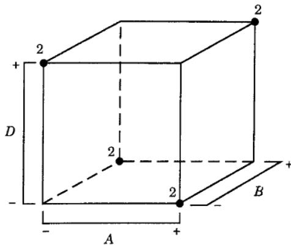

TABLE 8.21  
A $2_{\mathrm{III}}^{7-4}$ Design for the Eye Focus Time Experiment

<table><tr><td rowspan="2">Run</td><td colspan="3">Basic Design</td><td rowspan="2">D=AB</td><td rowspan="2">E=AC</td><td rowspan="2">F=BC</td><td rowspan="2">G=ABC</td><td rowspan="2"></td><td rowspan="2">Time</td></tr><tr><td>A</td><td>B</td><td>C</td></tr><tr><td>1</td><td>-</td><td>-</td><td>-</td><td>+</td><td>+</td><td>+</td><td>-</td><td>def</td><td>85.5</td></tr><tr><td>2</td><td>+</td><td>-</td><td>-</td><td>-</td><td>-</td><td>+</td><td>+</td><td>afg</td><td>75.1</td></tr><tr><td>3</td><td>-</td><td>+</td><td>-</td><td>-</td><td>+</td><td>-</td><td>+</td><td>beg</td><td>93.2</td></tr><tr><td>4</td><td>+</td><td>+</td><td>-</td><td>+</td><td>-</td><td>-</td><td>-</td><td>abd</td><td>145.4</td></tr><tr><td>5</td><td>-</td><td>-</td><td>+</td><td>+</td><td>-</td><td>-</td><td>+</td><td>cdg</td><td>83.7</td></tr><tr><td>6</td><td>+</td><td>-</td><td>+</td><td>-</td><td>+</td><td>-</td><td>-</td><td>ace</td><td>77.6</td></tr><tr><td>7</td><td>-</td><td>+</td><td>+</td><td>-</td><td>-</td><td>+</td><td>-</td><td>bcf</td><td>95.0</td></tr><tr><td>8</td><td>+</td><td>+</td><td>+</td><td>+</td><td>+</td><td>+</td><td>+</td><td>abcdefg</td><td>141.8</td></tr></table>

To separate the main effects and the two-factor interactions, the full fold-over technique is used, and a second fraction is run with all the signs reversed. This fold-over design is shown in Table 8.22 along with the observed responses. Notice that when we construct a full fold over of a resolution III design, we (in effect) change the signs on the generators that have an odd number of letters. The effects estimated by this fraction are

$$
[ A ] ^ {\prime} = - 1 7. 6 8 \rightarrow A - B D - C E - F G
$$

$$
[ B ] ^ {\prime} = 3 7. 7 3 \rightarrow B - A D - C F - E G
$$

$$
[ C ] ^ {\prime} = - 3. 3 3 \rightarrow C - A E - B F - D G
$$

$$
[ D ] ^ {\prime} = 2 9. 8 8 \rightarrow D - A B - C G - E F
$$

$$
[ E ] ^ {\prime} = 0. 5 3 \rightarrow E - A C - B G - D F
$$

$$
[ F ] ^ {\prime} = 1. 6 3 \rightarrow F - B C - A G - D E
$$

$$
[ G ] ^ {\prime} = 2. 6 8 \rightarrow G - C D - B E - A F
$$

By combining this second fraction with the original one, we obtain the following estimates of the effects:

## TABLE 8.22

A Fold-Over $2_{III}^{7-4}$ Design for the Eye Focus Experiment

<table><tr><td>i</td><td>From  $\frac{1}{2}([i] + [i]'')$ </td><td>From  $\frac{1}{2}([i] - [i]'')$ </td></tr><tr><td>A</td><td>A = 1.48</td><td>BD + CE + FG = 19.15</td></tr><tr><td>B</td><td>B = 38.05</td><td>AD + CE + FG = 19.15</td></tr><tr><td>C</td><td>C = -1.80</td><td>BD + CE + FG = 19.15</td></tr><tr><td>D</td><td>D = 29.38</td><td>AB + CG + EF = -0.50</td></tr><tr><td>E</td><td>E = 0.13</td><td>AC + BG + DF = -0.40</td></tr><tr><td>F</td><td>F = 0.50</td><td>BC + AG + DE = -1.13</td></tr><tr><td>G</td><td>G = 0.13</td><td>CD + BE + AF = -2.55</td></tr></table>

The two largest effects are B and D. Furthermore, the third largest effect is $BD + CE + FG$ , so it seems reasonable to attribute this to the BD interaction. The experimenter used the two factors distance (B) and illumination level (D) in subsequent experiments with the other factors A, C, E, and F at standard settings and verified the results obtained here. He decided to use subjects as blocks in these new experiments rather than ignore a potential subject effect because several different subjects had to be used to complete the experiment.

<table><tr><td rowspan="2">Run</td><td colspan="3">Basic Design</td><td rowspan="2">D = -AB</td><td rowspan="2">E = -AC</td><td rowspan="2">F = -BC</td><td rowspan="2">G = ABC</td><td rowspan="2"></td><td rowspan="2">Time</td></tr><tr><td>A</td><td>B</td><td>C</td></tr><tr><td>1</td><td>+</td><td>+</td><td>+</td><td>-</td><td>-</td><td>-</td><td>+</td><td>abcg</td><td>91.3</td></tr><tr><td>2</td><td>-</td><td>+</td><td>+</td><td>+</td><td>+</td><td>-</td><td>-</td><td>bcde</td><td>136.7</td></tr><tr><td>3</td><td>+</td><td>-</td><td>+</td><td>+</td><td>-</td><td>+</td><td>-</td><td>acdf</td><td>82.4</td></tr><tr><td>4</td><td>-</td><td>-</td><td>+</td><td>-</td><td>+</td><td>+</td><td>+</td><td>cefg</td><td>73.4</td></tr><tr><td>5</td><td>+</td><td>+</td><td>-</td><td>-</td><td>+</td><td>+</td><td>-</td><td>abef</td><td>94.1</td></tr><tr><td>6</td><td>-</td><td>+</td><td>-</td><td>+</td><td>-</td><td>+</td><td>+</td><td>bdfg</td><td>143.8</td></tr><tr><td>7</td><td>+</td><td>-</td><td>-</td><td>+</td><td>+</td><td>-</td><td>+</td><td>adeg</td><td>87.3</td></tr><tr><td>8</td><td>-</td><td>-</td><td>-</td><td>-</td><td>-</td><td>-</td><td>-</td><td>(1)</td><td>71.9</td></tr></table>

and for the second fraction, they are

$$
I = - A B D, \quad I = - A C E, \quad I = - B C F, \quad \text { and } \quad I = A B C G
$$

Notice that in the second fraction we have switched the signs on the generators with an odd number of letters. Also, notice that $L + U = 1 + 3 = 4$ . The combined design will have I = ABCG (the like sign word) as a generator and two words that are independent even products of the words of unlike sign. For example, take I = ABD and I = ACE; then $I = (ABD)(ACE) = BCDE$ is a generator of the combined design. Also, take I = ABD and I = BCF; then $I = (ABD)(BCF) = ACDF$ is a generator of the combined design. The complete defining relation for the combined design is

$$
I = A B C G = B C D E = A C D F = A D E G = B D F G = A B E F = C E F G
$$

Blocking in a Fold-Over Design. Usually a fold-over design is conducted in two distinct time periods. Following the initial fraction, some time usually elapses while the data are analyzed and the fold-over runs are planned. Then the second set of runs is made, often on a different day, or different shift, or using different operating personnel, or perhaps material from a different source. This leads to a situation where blocking to eliminate potential nuisance effects between the two time periods is of interest. Fortunately, blocking in the combined experiment is easily accomplished.

To illustrate, consider the fold-over experiment in Example 8.7. In the initial group of eight runs shown in Table 8.21, the generators are D = AB, E = AC, F = BC, and G = ABC. In the fold-over set of runs, Table 8.22, the signs are changed on three of the generators so that D = -AB, E = -AC, and F = -BC. Thus, in the first group of eight runs the signs on the effects ABD, ACE, and BCF are positive, and in the second group of eight runs the signs on ABD, ACE, and BCF are negative; therefore, these effects are confounded with blocks. Actually, there is a single-degree-of-freedom alias chain confounded with blocks (remember that there are two blocks, so there must be one degree of freedom for blocks), and the effects in this alias chain may be found by multiplying any one of the effects ABD, ACE, and BCF through the defining relation for the design. This yields

$$
A B D = C D G = A C E = B C F = B E G = A F G = D E F = A B C D E F G
$$

as the complete set of effects that are confounded with blocks. In general, a completed fold-over experiment will always form two blocks with the effects whose signs are positive in one block and negative in the other (and their aliases) confounded with blocks. These effects can always be determined from the generators whose signs have been switched to form the fold over.

## 8.6.3 Plackett-Burman Designs

These are two-level fractional factorial designs developed by Plackett and Burman (1946) for studying up to k = N - 1 variables in N runs, where N is a multiple of 4. If N is a power of 2, these designs are identical to those presented earlier in this section. However, for N = 12, 20, 24, 28, and 36, the Plackett–Burman designs are sometimes of interest. Because these designs cannot be represented as cubes, they are sometimes called nongeometric designs.

The upper half of Table 8.23 presents rows of plus and minus signs that are used to construct the Plackett–Burman designs for N = 12, 20, 24, and 36, whereas the lower half of the table presents blocks of plus and minus signs for constructing the design for N = 28. The designs for N = 12, 20, 24, and 36 are obtained by writing the appropriate row in Table 8.23 as a column (or row). A second column (or row) is then generated from this first one by moving the elements of the column (or row) down (or to the right) one position and placing the last element in the first position. A third column (or row) is produced from the second similarly, and the process is continued until column (or row) k is generated. A row of minus signs is then added, completing the design. For N = 28, the three blocks X, Y, and Z are written down in the order

$$
\begin{array}{c c c} X & Y & Z \\ Z & X & Y \\ Y & Z & X \end{array}
$$

## TABLE 8.23

Plus and Minus Signs for the Plackett-Burman Designs

$$
k = 1 1, N = 1 2 + + - + + + - - - + -
$$

$$
k = 1 9, N = 2 0 + + - - + + + + - + - + - - - - + + -
$$

$$
\boldsymbol {k} = 2 3, \boldsymbol {N} = 2 4 + + + + + - + - + + - - + + - - + - + - - -
$$

$$
k = 3 5, N = 3 6 - + - + + + - - - + + + + + - + + + - - + - - - - + - + - + + - - +
$$

$$
k = 2 7, N = 2 8
$$

$$
+ - + + + + - - -
$$

$$
- + - - - + - - +
$$

$$
+ + - + - + + - +
$$

$$
+ + - + + + - - -
$$

$$
- - + + - - + - -
$$

$$
- + + + + - + + -
$$

$$
- + + + + + - - -
$$

$$
+ - - - + - - + -
$$

$$
+ - + - + + - + +
$$

$$
- - - + - + + + +
$$

$$
- - + - + - - - +
$$

$$
+ - + + + - + - +
$$

$$
- - - + + - + + +
$$

$$
+ - - - - + + - -
$$

$$
+ + - - + + + + -
$$

$$
- - - - + + + + +
$$

$$
- + - + - - - + -
$$

$$
- + + + - + - + +
$$

$$
- - + - - + - + -
$$

$$
+ - + + - + + + -
$$

$$
+ + + - - - + + -
$$

$$
+ - - + - - - - +
$$

$$
+ + - + + - - + +
$$

$$
+ + + - - - - + +
$$

$$
- + - - + - + - -
$$

$$
- + + - + + + - +
$$

TABLE 8.24

Plackett-Burman Design for $N = 12, k = 11$

<table><tr><td>Run</td><td>A</td><td>B</td><td>C</td><td>D</td><td>E</td><td>F</td><td>G</td><td>H</td><td>I</td><td>J</td><td>K</td></tr><tr><td>1</td><td>+</td><td>-</td><td>+</td><td>-</td><td>-</td><td>-</td><td>+</td><td>+</td><td>+</td><td>-</td><td>+</td></tr><tr><td>2</td><td>+</td><td>+</td><td>-</td><td>+</td><td>-</td><td>-</td><td>-</td><td>+</td><td>+</td><td>+</td><td>-</td></tr><tr><td>3</td><td>-</td><td>+</td><td>+</td><td>-</td><td>+</td><td>-</td><td>-</td><td>-</td><td>+</td><td>+</td><td>+</td></tr><tr><td>4</td><td>+</td><td>-</td><td>+</td><td>+</td><td>-</td><td>+</td><td>-</td><td>-</td><td>-</td><td>+</td><td>+</td></tr><tr><td>5</td><td>+</td><td>+</td><td>-</td><td>+</td><td>+</td><td>-</td><td>+</td><td>-</td><td>-</td><td>-</td><td>+</td></tr><tr><td>6</td><td>+</td><td>+</td><td>+</td><td>-</td><td>+</td><td>+</td><td>-</td><td>+</td><td>-</td><td>-</td><td>-</td></tr><tr><td>7</td><td>-</td><td>+</td><td>+</td><td>+</td><td>-</td><td>+</td><td>+</td><td>-</td><td>+</td><td>-</td><td>-</td></tr><tr><td>8</td><td>-</td><td>-</td><td>+</td><td>+</td><td>+</td><td>-</td><td>+</td><td>+</td><td>-</td><td>+</td><td>-</td></tr><tr><td>9</td><td>-</td><td>-</td><td>-</td><td>+</td><td>+</td><td>+</td><td>-</td><td>+</td><td>+</td><td>-</td><td>+</td></tr><tr><td>10</td><td>+</td><td>-</td><td>-</td><td>-</td><td>+</td><td>+</td><td>+</td><td>-</td><td>+</td><td>+</td><td>-</td></tr><tr><td>11</td><td>-</td><td>+</td><td>-</td><td>-</td><td>-</td><td>+</td><td>+</td><td>+</td><td>-</td><td>+</td><td>+</td></tr><tr><td>12</td><td>-</td><td>-</td><td>-</td><td>-</td><td>-</td><td>-</td><td>-</td><td>-</td><td>-</td><td>-</td><td>-</td></tr></table>

and a row of minus signs is added to these 27 rows. The design for N = 12 runs and k = 11 factors is shown in Table 8.24.

The nongeometric Plackett–Burman designs for N = 12, 20, 24, 28, and 36 have complex alias structures. For example, in the 12-run design every main effect is partially aliased with every two-factor interaction not involving itself. For example, the AB interaction is aliased with the nine main effects $C, D, \ldots, K$ and the AC interaction is aliased with the nine main effects $B, D, \ldots, K$ . Furthermore, each main effect is partially aliased with 45 two-factor interactions. As an example, consider the aliases of the main effect of factor A:

$$
[ A ] = A - \frac {1}{3} B C - \frac {1}{3} B D - \frac {1}{3} B E + \frac {1}{3} B F + \dots - \frac {1}{3} K L
$$

Each one of the 45 two-factor interactions in the alias chain in weighed by the constant $\pm \frac{1}{3}$ . This weighting of the two-factor interactions occurs throughout the Plackett–Burman series of nongeometric designs. In other Plackett–Burman designs, the constant will be different than $\pm \frac{1}{3}$ .

Plackett–Burman designs are examples of nonregular designs. This term appears frequently in the experimental design literature. Basically, a regular design is one in which all effects can be estimated independently of the other effects and in the case of a fractional factorial, the effects that cannot be estimated are completely aliased with the other effects. Obviously, a full factorial such as the $2^{k}$ is a regular design, and so are the $2^{k-p}$ fractional factorials because while all of the effects cannot be estimated the “constants” in the alias chains for these designs are always either zero or plus or minus unity. That is, the effects that are not estimable because of the fractionation are completely aliased (some say completely confounded) with the effects that can be estimated. In nonregular designs, because some of the nonzero constants in the alias chains are not equal to $\pm1$ , there is always at least a chance that some information on the aliased effects may be available.

The projection properties of the nongeometric Plackett–Burman designs are interesting, and in many cases, useful. For example, consider the 12-run design in Table 8.24. This design will project into three replicates of a full $2^{2}$ design in any two of the original 11 factors. In three factors, the projected design is a full $2^{3}$ factorial plus a $2_{III}^{3-1}$ fractional factorial (see Figure 8.24a). All Plackett–Burman designs will project into a full factorial plus some additional runs in any three factors. Thus, the resolution III Plackett–Burman design has projectivity 3, meaning it will collapse into a full factorial in any subset of three factors (actually, some of the larger Plackett–Burman designs, such as those with 68, 72, 80, and 84 runs, have projectivity 4). In contrast, the $2_{III}^{k-p}$ design only has projectivity 2. The four-dimensional projections of the 12-run design are shown in Figure 8.24b. Notice that there are 11 distinct runs. This design can fit all four of the main effects and all 6 two-factor interactions, assuming that all other main effects and interactions are negligible. The design in Figure 8.24b needs 5 additional runs to form a complete $2^{4}$ (with one additional run) and only a single run to form a $2^{4-1}$ (with 5 additional runs). Regression methods can be used to fit models involving main effects and interactions using those projected designs.

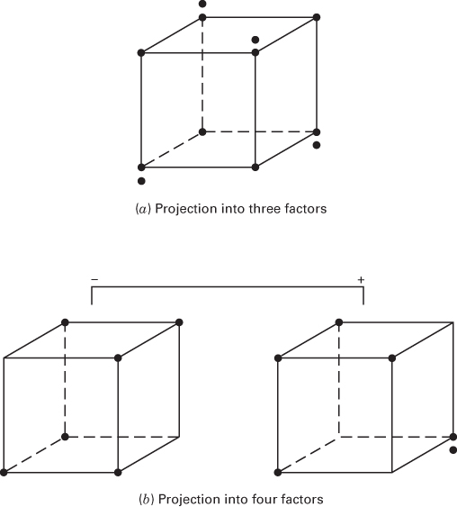  
■ FIGURE 8.24 Projection of the 12-run Plackett-design into three- and four-factor designs  
(a) Projection into three factors

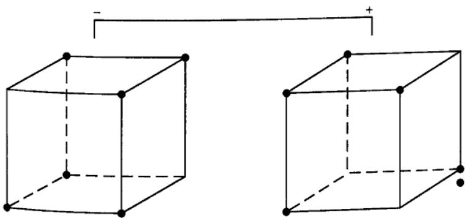  
(b) Projection into four factors

## EXAMPLE 8.8

We will illustrate the analysis of a Plackett–Burman design with an example involving 12 factors. The smallest regular fractional factorial for 12 factors is a 16-run $2^{12-8}$ fractional factorial design. In this design, all 12 main effects are aliased with four two-factor interactions and three chains of two-factor interactions each containing six two-factor interactions (refer to Appendix VIII, design w). If there are significant two-factor interactions along with the main effects, it is very possible that additional runs will be required to de-alias some of these effects.

Suppose that we decide to use a 20-run Plackett–Burman design for this problem. Now this has more runs that the smallest regular fraction, but it contains fewer runs than would be required by either a full fold over or a partial fold-over of the 16-run regular fraction. This design was created in JMP and is shown in Table 8.25, along with the observed response data obtained when the experiment was conducted. The alias matrix for this design, also produced from JMP, is in Table 8.26. Note that the coefficients of the aliased two-factor interactions are not either 0, -1, or +1 because this is a nonregular design). Hopefully this will provide some flexibility with which to estimate interactions if necessary.

Table 8.27 shows the JMP analysis of this design, using a forward-stepwise regression procedure to fit the model. In forward-stepwise regression, variables are entered into the model one at a time, beginning with those that appear most important, until no variables remain that are reasonable candidates for entry. In this analysis, we consider all main effects and two-factor interactions as possible variables of interest for the model.

Considering the P-values for the variables in Table 8.27, the most important factor is $x_{2}$ , so this factor is entered into the model first. JMP then recalculates the P-values and the next variable entered would be $x_{4}$ . Then the $x_{1}x_{4}$ interaction is entered along with the main effect of $x_{1}$ to preserve the hierarchy of the model. This is followed by the $x_{1}x_{4}$ interactions. The JMP output for these steps is not shown but is summarized at the bottom of Table 8.28. Finally, the last variable entered is $x_{5}$ . Table 8.28 summarizes the final model.

## TABLE 8.25

Plackett-Burman Design for Example 8.8

<table><tr><td>Run</td><td>X1</td><td>X2</td><td>X3</td><td>X4</td><td>X5</td><td>X6</td><td>X7</td><td>X8</td><td>X9</td><td>X10</td><td>X11</td><td>X12</td><td>y</td></tr><tr><td>1</td><td>1</td><td>1</td><td>1</td><td>1</td><td>1</td><td>1</td><td>1</td><td>1</td><td>1</td><td>1</td><td>1</td><td>1</td><td>221.5032</td></tr><tr><td>2</td><td>-1</td><td>1</td><td>-1</td><td>-1</td><td>1</td><td>1</td><td>1</td><td>1</td><td>-1</td><td>1</td><td>-1</td><td>1</td><td>213.8037</td></tr><tr><td>3</td><td>-1</td><td>-1</td><td>1</td><td>-1</td><td>-1</td><td>1</td><td>1</td><td>1</td><td>1</td><td>-1</td><td>1</td><td>-1</td><td>167.5424</td></tr><tr><td>4</td><td>1</td><td>-1</td><td>-1</td><td>1</td><td>-1</td><td>-1</td><td>1</td><td>1</td><td>1</td><td>1</td><td>-1</td><td>1</td><td>232.2071</td></tr><tr><td>5</td><td>1</td><td>1</td><td>-1</td><td>-1</td><td>1</td><td>-1</td><td>-1</td><td>1</td><td>1</td><td>1</td><td>1</td><td>-1</td><td>186.3883</td></tr><tr><td>6</td><td>-1</td><td>1</td><td>1</td><td>-1</td><td>-1</td><td>1</td><td>-1</td><td>-1</td><td>1</td><td>1</td><td>1</td><td>1</td><td>210.6819</td></tr><tr><td>7</td><td>-1</td><td>-1</td><td>1</td><td>1</td><td>-1</td><td>-1</td><td>1</td><td>-1</td><td>-1</td><td>1</td><td>1</td><td>1</td><td>168.4163</td></tr><tr><td>8</td><td>-1</td><td>-1</td><td>-1</td><td>1</td><td>1</td><td>-1</td><td>-1</td><td>1</td><td>-1</td><td>-1</td><td>1</td><td>1</td><td>180.9365</td></tr><tr><td>9</td><td>-1</td><td>-1</td><td>-1</td><td>-1</td><td>1</td><td>1</td><td>-1</td><td>-1</td><td>1</td><td>-1</td><td>-1</td><td>1</td><td>172.5698</td></tr><tr><td>10</td><td>1</td><td>-1</td><td>-1</td><td>-1</td><td>-1</td><td>1</td><td>1</td><td>-1</td><td>-1</td><td>1</td><td>-1</td><td>-1</td><td>181.8605</td></tr><tr><td>11</td><td>-1</td><td>1</td><td>-1</td><td>-1</td><td>-1</td><td>-1</td><td>1</td><td>1</td><td>-1</td><td>-1</td><td>1</td><td>-1</td><td>202.4022</td></tr><tr><td>12</td><td>1</td><td>-1</td><td>1</td><td>-1</td><td>-1</td><td>-1</td><td>-1</td><td>1</td><td>1</td><td>-1</td><td>-1</td><td>1</td><td>186.0079</td></tr><tr><td>13</td><td>-1</td><td>1</td><td>-1</td><td>1</td><td>-1</td><td>-1</td><td>-1</td><td>-1</td><td>1</td><td>1</td><td>-1</td><td>-1</td><td>216.4375</td></tr><tr><td>14</td><td>1</td><td>-1</td><td>1</td><td>-1</td><td>1</td><td>-1</td><td>-1</td><td>-1</td><td>-1</td><td>1</td><td>1</td><td>-1</td><td>192.4121</td></tr><tr><td>15</td><td>1</td><td>1</td><td>-1</td><td>1</td><td>-1</td><td>1</td><td>-1</td><td>-1</td><td>-1</td><td>-1</td><td>1</td><td>1</td><td>224.4362</td></tr><tr><td>16</td><td>1</td><td>1</td><td>1</td><td>-1</td><td>1</td><td>-1</td><td>1</td><td>-1</td><td>-1</td><td>-1</td><td>-1</td><td>1</td><td>190.3312</td></tr><tr><td>17</td><td>1</td><td>1</td><td>1</td><td>1</td><td>-1</td><td>1</td><td>-1</td><td>1</td><td>-1</td><td>-1</td><td>-1</td><td>-1</td><td>228.3411</td></tr><tr><td>18</td><td>-1</td><td>1</td><td>1</td><td>1</td><td>1</td><td>-1</td><td>1</td><td>-1</td><td>1</td><td>-1</td><td>-1</td><td>-1</td><td>223.6747</td></tr><tr><td>19</td><td>-1</td><td>-1</td><td>1</td><td>1</td><td>1</td><td>1</td><td>-1</td><td>1</td><td>-1</td><td>1</td><td>-1</td><td>-1</td><td>163.5351</td></tr><tr><td>20</td><td>1</td><td>-1</td><td>-1</td><td>1</td><td>1</td><td>1</td><td>1</td><td>-1</td><td>1</td><td>-1</td><td>1</td><td>-1</td><td>236.5124</td></tr></table>

<table><tr><td>Effect</td><td>12</td><td>13</td><td>14</td><td>15</td><td>16</td><td>17</td><td>18</td><td>19</td><td>110</td><td>111</td><td>112</td><td>23</td><td>24</td><td>25</td><td>26</td><td>27</td><td>28</td><td>29</td><td>210</td><td>211</td><td>212</td><td>34</td><td>35</td><td>36</td><td>37</td><td>38</td><td>39</td><td>310</td><td>311</td><td>312</td><td>45</td><td>46</td><td>47</td><td>48</td></tr><tr><td>Intercept</td><td>0</td><td>0</td><td>0</td><td>0</td><td>0</td><td>0</td><td>0</td><td>0</td><td>0</td><td>0</td><td>0</td><td>0</td><td>0</td><td>0</td><td>0</td><td>0</td><td>0</td><td>0</td><td>0</td><td>0</td><td>0</td><td>0</td><td>0</td><td>0</td><td>0</td><td>0</td><td>0</td><td>0</td><td>0</td><td>0</td><td>0</td><td>0</td><td>0</td><td>0</td></tr><tr><td>X1</td><td>0</td><td>0</td><td>0</td><td>0</td><td>0</td><td>0</td><td>0</td><td>0</td><td>0</td><td>0</td><td>0</td><td>0.2</td><td>0.2</td><td>0.2</td><td>0.2</td><td>-0.2</td><td>0.2</td><td>-0.2</td><td>-0.2</td><td>0.2</td><td>0.2</td><td>-0.2</td><td>0.2</td><td>-0.2</td><td>-0.2</td><td>0.2</td><td>-0.2</td><td>-0.2</td><td>-0.2</td><td>0.2</td><td>-0.2</td><td>0.6</td><td>0.2</td><td>0.2</td></tr><tr><td>X2</td><td>0</td><td>0.2</td><td>0.2</td><td>0.2</td><td>0.2</td><td>-0.2</td><td>0.2</td><td>-0.2</td><td>-0.2</td><td>0.2</td><td>0.2</td><td>0</td><td>0</td><td>0</td><td>0</td><td>0</td><td>0</td><td>0</td><td>0</td><td>0</td><td>0.2</td><td>0.2</td><td>0.2</td><td>0.2</td><td>-0.2</td><td>0.2</td><td>-0.2</td><td>-0.2</td><td>-0.2</td><td>0.2</td><td>-0.2</td><td>0.2</td><td>-0.2</td><td>-0.2</td></tr><tr><td>X3</td><td>0.2</td><td>0</td><td>-0.2</td><td>0.2</td><td>-0.2</td><td>-0.2</td><td>0.2</td><td>-0.2</td><td>-0.2</td><td>-0.2</td><td>0.2</td><td>0</td><td>0.2</td><td>0.2</td><td>0.2</td><td>0.2</td><td>-0.2</td><td>0.2</td><td>-0.2</td><td>-0.2</td><td>0.2</td><td>0</td><td>0</td><td>0</td><td>0</td><td>0</td><td>0</td><td>0</td><td>0</td><td>0</td><td>0.2</td><td>0.2</td><td>0.2</td><td>0.2</td></tr><tr><td>X4</td><td>0.2</td><td>-0.2</td><td>0</td><td>-0.2</td><td>0.6</td><td>0.2</td><td>0.2</td><td>0.2</td><td>-0.2</td><td>0.2</td><td>0.2</td><td>0.2</td><td>0</td><td>-0.2</td><td>0.2</td><td>-0.2</td><td>-0.2</td><td>0.2</td><td>-0.2</td><td>-0.2</td><td>-0.2</td><td>0</td><td>0.2</td><td>0.2</td><td>0.2</td><td>0.2</td><td>-0.2</td><td>0.2</td><td>-0.2</td><td>-0.2</td><td>0</td><td>0</td><td>0</td><td>0</td></tr><tr><td>X5</td><td>0.2</td><td>0.2</td><td>-0.2</td><td>0</td><td>-0.2</td><td>0.2</td><td>-0.2</td><td>0.2</td><td>0.2</td><td>0.6</td><td>-0.2</td><td>0.2</td><td>-0.2</td><td>0</td><td>-0.2</td><td>0.6</td><td>0.2</td><td>0.2</td><td>0.2</td><td>-0.2</td><td>0.2</td><td>0</td><td>0</td><td>-0.2</td><td>0.2</td><td>-0.2</td><td>-0.2</td><td>0.2</td><td>-0.2</td><td>-0.2</td><td>0</td><td>0.2</td><td>0.2</td><td>0.2</td></tr><tr><td>X6</td><td>0.2</td><td>-0.2</td><td>0.6</td><td>-0.2</td><td>0</td><td>0.2</td><td>-0.2</td><td>-0.2</td><td>-0.2</td><td>0.2</td><td>-0.2</td><td>0.2</td><td>0.2</td><td>-0.2</td><td>0</td><td>-0.2</td><td>0.2</td><td>-0.2</td><td>0.2</td><td>0.2</td><td>0.6</td><td>0.2</td><td>-0.2</td><td>0</td><td>-0.2</td><td>0.6</td><td>0.2</td><td>0.2</td><td>0.2</td><td>-0.2</td><td>0.2</td><td>0</td><td>-0.2</td><td>0.2</td></tr><tr><td>X7</td><td>-0.2</td><td>-0.2</td><td>0.2</td><td>0.2</td><td>0.2</td><td>0</td><td>-0.2</td><td>0.2</td><td>0.2</td><td>-0.2</td><td>0.2</td><td>0.2</td><td>-0.2</td><td>0.6</td><td>-0.2</td><td>0</td><td>0.2</td><td>-0.2</td><td>-0.2</td><td>-0.2</td><td>0.2</td><td>0.2</td><td>0.2</td><td>-0.2</td><td>0</td><td>-0.2</td><td>0.2</td><td>-0.2</td><td>0.2</td><td>0.2</td><td>-0.2</td><td>0</td><td>-0.2</td><td>0</td></tr><tr><td>X8</td><td>0.2</td><td>0.2</td><td>0.2</td><td>-0.2</td><td>-0.2</td><td>-0.2</td><td>0</td><td>0.6</td><td>0.2</td><td>-0.2</td><td>0.2</td><td>-0.2</td><td>-0.2</td><td>0.2</td><td>0.2</td><td>0.2</td><td>0</td><td>-0.2</td><td>0.2</td><td>0.2</td><td>-0.2</td><td>0.2</td><td>-0.2</td><td>0.6</td><td>-0.2</td><td>0</td><td>0.2</td><td>-0.2</td><td>-0.2</td><td>-0.2</td><td>0.2</td><td>0.2</td><td>-0.2</td><td>0</td></tr><tr><td>X9</td><td>-0.2</td><td>-0.2</td><td>0.2</td><td>0.2</td><td>-0.2</td><td>0.2</td><td>0.6</td><td>0</td><td>0.2</td><td>0.2</td><td>0.2</td><td>0.2</td><td>0.2</td><td>-0.2</td><td>-0.2</td><td>-0.2</td><td>0</td><td>0.6</td><td>0.2</td><td>-0.2</td><td>-0.2</td><td>-0.2</td><td>0.2</td><td>0.2</td><td>0.2</td><td>0</td><td>-0.2</td><td>0.2</td><td>0.2</td><td>0.2</td><td>-0.2</td><td>0.6</td><td>-0.2</td><td></td></tr><tr><td>X10</td><td>-0.2</td><td>-0.2</td><td>-0.2</td><td>0.2</td><td>-0.2</td><td>0.2</td><td>0.2</td><td>0.2</td><td>0</td><td>0.2</td><td>-0.2</td><td>-0.2</td><td>-0.2</td><td>0.2</td><td>0.2</td><td>-0.2</td><td>0.2</td><td>0.6</td><td>0</td><td>0.2</td><td>0.2</td><td>0.2</td><td>0.2</td><td>-0.2</td><td>-0.2</td><td>-0.2</td><td>0</td><td>0.6</td><td>0.2</td><td>-0.2</td><td>-0.2</td><td>0.2</td><td>0.2</td><td></td></tr><tr><td>X11</td><td>0.2</td><td>-0.2</td><td>0.2</td><td>0.6</td><td>0.2</td><td>-0.2</td><td>-0.2</td><td>0.2</td><td>0.2</td><td>0</td><td>-0.2</td><td>-0.2</td><td>-0.2</td><td>-0.2</td><td>0.2</td><td>-0.2</td><td>0.2</td><td>0.2</td><td>0.2</td><td>0</td><td>0.2</td><td>-0.2</td><td>-0.2</td><td>0.2</td><td>0.2</td><td>-0.2</td><td>0.2</td><td>0.6</td><td>0</td><td>0.2</td><td>0.2</td><td>0.2</td><td>-0.2</td><td></td></tr><tr><td>X12</td><td>0.2</td><td>0.2</td><td>0.2</td><td>-0.2</td><td>-0.2</td><td>0.2</td><td>0.2</td><td>0.2</td><td>-0.2</td><td>-0.2</td><td>0</td><td>0.2</td><td>-0.2</td><td>0.2</td><td>0.6</td><td>0.2</td><td>-0.2</td><td>-0.2</td><td>0.2</td><td>0.2</td><td>0</td><td>-0.2</td><td>-0.2</td><td>-0.2</td><td>0.2</td><td>-0.2</td><td>0.2</td><td>0.2</td><td>0.2</td><td>0</td><td>-0.2</td><td>-0.2</td><td>0.2</td><td></td></tr><tr><td>Effect</td><td>49</td><td>410</td><td>411</td><td>412</td><td>56</td><td>57</td><td>58</td><td>59</td><td>510</td><td>511</td><td>512</td><td>67</td><td>68</td><td>69</td><td>610</td><td>611</td><td>612</td><td>78</td><td>79</td><td>710</td><td>711</td><td>712</td><td>89</td><td>810</td><td>811</td><td>812</td><td>910</td><td>911</td><td>912</td><td>1011</td><td>1012</td><td></td><td>1112</td><td></td></tr><tr><td>Intercept</td><td>0</td><td>0</td><td>0</td><td>0</td><td>0</td><td>0</td><td>0</td><td>0</td><td>0</td><td>0</td><td>0</td><td>0</td><td>0</td><td>0</td><td>0</td><td>0</td><td>0</td><td>0</td><td>0</td><td>0</td><td>0</td><td>0</td><td>0</td><td>0</td><td>0</td><td>0</td><td>0</td><td>0</td><td>0</td><td>0</td><td>0</td><td>0</td><td></td><td></td></tr><tr><td>X1</td><td>0.2</td><td>-0.2</td><td>0.2</td><td>0.2</td><td>-0.2</td><td>0.2</td><td>-0.2</td><td>0.2</td><td>0.2</td><td>0.6</td><td>-0.2</td><td>0.2</td><td>-0.2</td><td>-0.2</td><td>-0.2</td><td>0.2</td><td>-0.2</td><td>-0.2</td><td>0.2</td><td>0.2</td><td>-0.2</td><td>0.2</td><td>0.6</td><td>0.2</td><td>-0.2</td><td>0.2</td><td>0.2</td><td>0.2</td><td>0.2</td><td>0.2</td><td>-0.2</td><td>-0.2</td><td></td><td></td></tr><tr><td>X2</td><td>0.2</td><td>-0.2</td><td>-0.2</td><td>-0.2</td><td>-0.2</td><td>0.6</td><td>0.2</td><td>0.2</td><td>0.2</td><td>-0.2</td><td>0.2</td><td>-0.2</td><td>0.2</td><td>-0.2</td><td>0.2</td><td>0.2</td><td>0.6</td><td>0.2</td><td>-0.2</td><td>-0.2</td><td>-0.2</td><td>0.2</td><td>-0.2</td><td>0.2</td><td>0.2</td><td>-0.2</td><td>0.6</td><td>0.2</td><td>-0.2</td><td>0.2</td><td>0.2</td><td></td><td></td><td></td></tr><tr><td>X3</td><td>-0.2</td><td>0.2</td><td>-0.2</td><td>-0.2</td><td>-0.2</td><td>0.2</td><td>-0.2</td><td>-0.2</td><td>0.2</td><td>-0.2</td><td>-0.2</td><td>-0.2</td><td>0.6</td><td>0.2</td><td>0.2</td><td>0.2</td><td>-0.2</td><td>-0.2</td><td>0.2</td><td>-0.2</td><td>0.2</td><td>0.2</td><td>-0.2</td><td>-0.2</td><td>-0.2</td><td>-0.2</td><td>-0.2</td><td>0.2</td><td>0.2</td><td>0.6</td><td></td><td></td><td></td><td></td></tr><tr><td>X4</td><td>0</td><td>0</td><td>0</td><td>0</td><td>0.2</td><td>0.2</td><td>0.2</td><td>0.2</td><td>-0.2</td><td>0.2</td><td>-0.2</td><td>-0.2</td><td>0.2</td><td>-0.2</td><td>-0.2</td><td>0.2</td><td>-0.2</td><td>-0.2</td><td>0.6</td><td>0.2</td><td>0.2</td><td>0.2</td><td>-0.2</td><td>0.2</td><td>-0.2</td><td>0.2</td><td>-0.2</td><td>-0.2</td><td>-0.2</td><td>-0.2</td><td></td><td></td><td></td><td></td></tr><tr><td>X5</td><td>0.2</td><td>-0.2</td><td>0.2</td><td>-0.2</td><td>0</td><td>0</td><td>0</td><td>0</td><td>0</td><td>0</td><td>0</td><td>0.2</td><td>0.2</td><td>0.2</td><td>0.2</td><td>-0.2</td><td>0.2</td><td>-0.2</td><td>0.2</td><td>-0.2</td><td>-0.2</td><td>0.2</td><td>-0.2</td><td>0.6</td><td>0.2</td><td>0.2</td><td>-0.2</td><td>0.2</td><td>-0.2</td><td></td><td></td><td></td><td></td><td></td></tr><tr><td>X6</td><td>-0.2</td><td>-0.2</td><td>0.2</td><td>-0.2</td><td>0</td><td>0.2</td><td>0.2</td><td>0.2</td><td>0.2</td><td>-0.2</td><td>0.2</td><td>0</td><td>0</td><td>0</td><td>0</td><td>0</td><td>0</td><td>0.2</td><td>0.2</td><td>0.2</td><td>-0.2</td><td>-0.2</td><td>-0.2</td><td>0.2</td><td>-0.2</td><td>-0.2</td><td>-0.2</td><td>0.6</td><td>-0.2</td><td></td><td></td><td></td><td></td><td></td></tr><tr><td>X7</td><td>0.6</td><td>0.2</td><td>0.2</td><td>0.2</td><td>0.2</td><td>0</td><td>-0.2</td><td>0.2</td><td>-0.2</td><td>-0.2</td><td>0.2</td><td>0</td><td>0.2</td><td>0.2</td><td>0.2</td><td>0.2</td><td>-0.2</td><td>0</td><td>0</td><td>0</td><td>0</td><td>0</td><td>0.2</td><td>0.2</td><td>0.2</td><td>-0.2</td><td>-0.2</td><td>-0.2</td><td>-0.2</td><td></td><td></td><td></td><td></td><td></td></tr><tr><td>X8</td><td>-0.2</td><td>0.2</td><td>-0.2</td><td>0.2</td><td>0.2</td><td>-0.2</td><td>0</td><td>-0.2</td><td>0.6</td><td>0.2</td><td>0.2</td><td>0.2</td><td>0</td><td>-0.2</td><td>0.2</td><td>-0.2</td><td>-0.2</td><td>0</td><td>0.2</td><td>0.2</td><td>0.2</td><td>0.2</td><td>0</td><td>0</td><td>0</td><td>0</td><td>0.2</td><td>-0.2</td><td></td><td></td><td></td><td></td><td></td><td></td></tr><tr><td>X9</td><td>0</td><td>0.2</td><td>-0.2</td><td>-0.2</td><td>0.2</td><td>0.2</td><td>-0.2</td><td>0</td><td>-0.2</td><td>0.2</td><td>-0.2</td><td>0.2</td><td>-0.2</td><td>0</td><td>-0.2</td><td>0.6</td><td>0.2</td><td>0.2</td><td>0</td><td>-0.2</td><td>0.2</td><td>-0.2</td><td>0</td><td>0.2</td><td>0.2</td><td>0.2</td><td>0</td><td>0</td><td></td><td></td><td></td><td></td><td></td><td></td></tr><tr><td>X10</td><td>0.2</td><td>0</td><td>-0.2</td><td>0.2</td><td>0.2</td><td>-0.2</td><td>0.6</td><td>-0.2</td><td>0</td><td>0.2</td><td>-0.2</td><td>0.2</td><td>-0.2</td><td>-0.2</td><td>0</td><td>-0.2</td><td>0.2</td><td>-0.2</td><td>0</td><td>-0.2</td><td>0.6</td><td>0.2</td><td>0</td><td>-0.2</td><td>0.2</td><td>0</td><td>-0.2</td><td></td><td></td><td></td><td></td><td></td><td></td><td></td></tr><tr><td>X11</td><td>-0.2</td><td>-0.2</td><td>0</td><td>0.6</td><td>-0.2</td><td>-0.2</td><td>0.2</td><td>0.2</td><td>0.2</td><td>0</td><td>-0.2</td><td>-0.2</td><td>-0.2</td><td>-0.2</td><td>-0.2</td><td>-0.2</td><td>-0.2</td><td>-0.2</td><td>-0.2</td><td>-0.2</td><td>-0.2</td><td>-0.2</td><td>-0.2</td><td>-0.2</td><td>-0.2</td><td></td><td></td><td></td><td></td><td></td><td></td><td></td><td></td><td></td></tr><tr><td>X12</td><td>-0.2</td><td>0.2</td><td>0.6</td><td>0</td><td>0.2</td><td>0.2</td><td>-0.2</td><td>-0.2</td><td>-0.2</td><td>-0.2</td><td>-0.2</td><td>-0.2</td><td>-0.2</td><td>-0.2</td><td>-0.2</td><td>-0.2</td><td>-0.2</td><td>-0.2</td><td>-0.2</td><td>-0.2</td><td>-0.2</td><td></td><td></td><td></td><td></td><td></td><td></td><td></td><td></td><td></td><td></td><td></td><td></td><td></td></tr></table>

■ TABLE 8.26
The Alias Matrix

■ TABLE 8.27
JMP Stepwise Regression Analysis of Example 8.8, Initial Solution

<table><tr><td colspan="7">Stepwise FitResponse:Y</td></tr><tr><td colspan="7">Stepwise Regression ControlProb to Enter 0.250Prob to Leave 0.100</td></tr><tr><td colspan="7">Current Estimates</td></tr><tr><td>SSE</td><td>DFE</td><td>MSE</td><td>RSquare</td><td>RSquare Adj</td><td></td><td>Cp</td></tr><tr><td>10732</td><td>19</td><td>564.84211</td><td>0.0000</td><td>0.0000</td><td></td><td>12</td></tr><tr><td>Parameter</td><td>Estimate</td><td>nDF</td><td>SS</td><td>F Ratio</td><td>Prob &gt; F</td><td></td></tr><tr><td>Intercept</td><td>200</td><td>1</td><td>0</td><td>0.000</td><td>1.0000</td><td></td></tr><tr><td>X1</td><td>0</td><td>1</td><td>1280</td><td>2.438</td><td>0.1359</td><td></td></tr><tr><td>X2</td><td>0</td><td>1</td><td>2784.8</td><td>6.307</td><td>0.0218</td><td></td></tr><tr><td>X3</td><td>0</td><td>1</td><td>452.279</td><td>0.792</td><td>0.3853</td><td></td></tr><tr><td>X4</td><td>0</td><td>1</td><td>1843.2</td><td>3.733</td><td>0.0693</td><td></td></tr><tr><td>X5</td><td>0</td><td>1</td><td>67.21943</td><td>0.113</td><td>0.7401</td><td></td></tr><tr><td>X6</td><td>0</td><td>1</td><td>86.41367</td><td>0.146</td><td>0.7068</td><td></td></tr><tr><td>X7</td><td>0</td><td>1</td><td>292.6697</td><td>0.505</td><td>0.4866</td><td></td></tr><tr><td>X8</td><td>0</td><td>1</td><td>60.08353</td><td>0.101</td><td>0.7539</td><td></td></tr><tr><td>X9</td><td>0</td><td>1</td><td>572.9881</td><td>1.015</td><td>0.3270</td><td></td></tr><tr><td>X10</td><td>0</td><td>1</td><td>32.53443</td><td>0.055</td><td>0.8177</td><td></td></tr><tr><td>X11</td><td>0</td><td>1</td><td>15.37763</td><td>0.026</td><td>0.8741</td><td></td></tr><tr><td>X12</td><td>0</td><td>1</td><td>0.159759</td><td>0.000</td><td>0.9871</td><td></td></tr><tr><td>X1*X2</td><td>0</td><td>3</td><td>5908</td><td>6.532</td><td>0.0043</td><td></td></tr><tr><td>X1*X3</td><td>0</td><td>3</td><td>1736.782</td><td>1.030</td><td>0.4058</td><td></td></tr><tr><td>X1*X4</td><td>0</td><td>3</td><td>5543.2</td><td>5.698</td><td>0.0075</td><td></td></tr><tr><td>X1*X5</td><td>0</td><td>3</td><td>1358.09</td><td>0.773</td><td>0.5261</td><td></td></tr><tr><td>X1*X6</td><td>0</td><td>3</td><td>2795.154</td><td>1.878</td><td>0.1740</td><td></td></tr><tr><td>X1*X7</td><td>0</td><td>3</td><td>1581.316</td><td>0.922</td><td>0.4528</td><td></td></tr><tr><td>X1*X8</td><td>0</td><td>3</td><td>1767.483</td><td>1.052</td><td>0.3970</td><td></td></tr><tr><td>X1*X9</td><td>0</td><td>3</td><td>1866.724</td><td>1.123</td><td>0.3692</td><td></td></tr><tr><td>X1*X10</td><td>0</td><td>3</td><td>1609.033</td><td>0.941</td><td>0.4441</td><td></td></tr><tr><td>X1*X11</td><td>0</td><td>3</td><td>1821.162</td><td>1.090</td><td>0.3818</td><td></td></tr><tr><td>X1*X12</td><td>0</td><td>3</td><td>1437.829</td><td>0.825</td><td>0.4991</td><td></td></tr><tr><td>X2*X3</td><td>0</td><td>3</td><td>4473.249</td><td>3.812</td><td>0.0309</td><td></td></tr><tr><td>X2*X4</td><td>0</td><td>3</td><td>4671.721</td><td>4.111</td><td>0.0243</td><td></td></tr><tr><td>X2*X5</td><td>0</td><td>3</td><td>3011.798</td><td>2.081</td><td>0.1431</td><td></td></tr><tr><td>X2*X6</td><td>0</td><td>3</td><td>3561.431</td><td>2.649</td><td>0.0842</td><td></td></tr><tr><td>X2*X7</td><td>0</td><td>3</td><td>3635.536</td><td>2.732</td><td>0.0781</td><td></td></tr><tr><td>X2*X8</td><td>0</td><td>3</td><td>2848.428</td><td>1.927</td><td>0.1659</td><td></td></tr><tr><td>X2*X9</td><td>0</td><td>3</td><td>3944.319</td><td>3.099</td><td>0.0564</td><td></td></tr><tr><td>X2*X10</td><td>0</td><td>3</td><td>2828.937</td><td>1.909</td><td>0.1688</td><td></td></tr><tr><td>X2*X11</td><td>0</td><td>3</td><td>2867.948</td><td>1.945</td><td>0.1631</td><td></td></tr><tr><td>X2*X12</td><td>0</td><td>3</td><td>2786.331</td><td>1.870</td><td>0.1753</td><td></td></tr></table>

TABLE 8.27 (Continued)

<table><tr><td>Parameter</td><td>Estimate</td><td>nDF</td><td>SS</td><td>F Ratio</td><td>Prob &gt; F</td></tr><tr><td>X3*X4</td><td>0</td><td>3</td><td>2576.807</td><td>1.685</td><td>0.2102</td></tr><tr><td>X3*X5</td><td>0</td><td>3</td><td>995.7837</td><td>0.545</td><td>0.6582</td></tr><tr><td>X3*X6</td><td>0</td><td>3</td><td>558.5936</td><td>0.293</td><td>0.8300</td></tr><tr><td>X3*X7</td><td>0</td><td>3</td><td>1201.228</td><td>0.672</td><td>0.5815</td></tr><tr><td>X3*X8</td><td>0</td><td>3</td><td>512.677</td><td>0.268</td><td>0.8478</td></tr><tr><td>X3*X9</td><td>0</td><td>3</td><td>1058.287</td><td>0.583</td><td>0.6344</td></tr><tr><td>X3*X10</td><td>0</td><td>3</td><td>626.2659</td><td>0.331</td><td>0.8034</td></tr><tr><td>X3*X11</td><td>0</td><td>3</td><td>569.497</td><td>0.299</td><td>0.8257</td></tr><tr><td>X3*X12</td><td>0</td><td>3</td><td>452.4973</td><td>0.235</td><td>0.8708</td></tr><tr><td>X4*X5</td><td>0</td><td>3</td><td>2038.876</td><td>1.251</td><td>0.3244</td></tr><tr><td>X4*X6</td><td>0</td><td>3</td><td>2132.749</td><td>1.323</td><td>0.3017</td></tr><tr><td>X4*X7</td><td>0</td><td>3</td><td>2320.382</td><td>1.471</td><td>0.2599</td></tr><tr><td>X4*X8</td><td>0</td><td>3</td><td>2034.576</td><td>1.248</td><td>0.3255</td></tr><tr><td>X4*X9</td><td>0</td><td>3</td><td>4886.816</td><td>4.459</td><td>0.0185</td></tr><tr><td>X4*X10</td><td>0</td><td>3</td><td>3125.433</td><td>2.191</td><td>0.1288</td></tr><tr><td>X4*X11</td><td>0</td><td>3</td><td>1970.181</td><td>1.199</td><td>0.3418</td></tr><tr><td>X4*X12</td><td>0</td><td>3</td><td>2194.402</td><td>1.371</td><td>0.2875</td></tr><tr><td>X5*X6</td><td>0</td><td>3</td><td>189.5188</td><td>0.096</td><td>0.9612</td></tr><tr><td>X5*X7</td><td>0</td><td>3</td><td>4964.273</td><td>4.590</td><td>0.0168</td></tr><tr><td>X5*X8</td><td>0</td><td>3</td><td>332.1148</td><td>0.170</td><td>0.9149</td></tr><tr><td>X5*X9</td><td>0</td><td>3</td><td>1065.334</td><td>0.588</td><td>0.6318</td></tr><tr><td>X5*X10</td><td>0</td><td>3</td><td>136.8974</td><td>0.069</td><td>0.9757</td></tr><tr><td>X5*X11</td><td>0</td><td>3</td><td>866.5116</td><td>0.468</td><td>0.7084</td></tr><tr><td>X5*X12</td><td>0</td><td>3</td><td>185.205</td><td>0.094</td><td>0.9625</td></tr><tr><td>X6*X7</td><td>0</td><td>3</td><td>434.1661</td><td>0.225</td><td>0.8777</td></tr><tr><td>X6*X8</td><td>0</td><td>3</td><td>185.7122</td><td>0.094</td><td>0.9623</td></tr><tr><td>X6*X9</td><td>0</td><td>3</td><td>1302.2</td><td>0.737</td><td>0.5455</td></tr><tr><td>X6*X10</td><td>0</td><td>3</td><td>246.5934</td><td>0.125</td><td>0.9437</td></tr><tr><td>X6*X11</td><td>0</td><td>3</td><td>2492.598</td><td>1.613</td><td>0.2256</td></tr><tr><td>X6*X12</td><td>0</td><td>3</td><td>913.7187</td><td>0.496</td><td>0.6900</td></tr><tr><td>X7*X8</td><td>0</td><td>3</td><td>935.8699</td><td>0.510</td><td>0.6813</td></tr><tr><td>X7*X9</td><td>0</td><td>3</td><td>1876.723</td><td>1.130</td><td>0.3665</td></tr><tr><td>X7*X10</td><td>0</td><td>3</td><td>345.5343</td><td>0.177</td><td>0.9101</td></tr><tr><td>X7*X11</td><td>0</td><td>3</td><td>577.8999</td><td>0.304</td><td>0.8224</td></tr><tr><td>X7*X12</td><td>0</td><td>3</td><td>328.611</td><td>0.168</td><td>0.9161</td></tr><tr><td>X8*X9</td><td>0</td><td>3</td><td>1111.212</td><td>0.616</td><td>0.6146</td></tr><tr><td>X8*X10</td><td>0</td><td>3</td><td>936.6248</td><td>0.510</td><td>0.6811</td></tr><tr><td>X8*X11</td><td>0</td><td>3</td><td>710.6107</td><td>0.378</td><td>0.7700</td></tr><tr><td>X8*X12</td><td>0</td><td>3</td><td>1517.358</td><td>0.878</td><td>0.4731</td></tr><tr><td>X9*X10</td><td>0</td><td>3</td><td>2360.154</td><td>1.504</td><td>0.2517</td></tr><tr><td>X9*X11</td><td>0</td><td>3</td><td>588.4157</td><td>0.309</td><td>0.8183</td></tr><tr><td>X9*X12</td><td>0</td><td>3</td><td>587.527</td><td>0.309</td><td>0.8186</td></tr><tr><td>X10*X11</td><td>0</td><td>3</td><td>125.3218</td><td>0.063</td><td>0.9786</td></tr><tr><td>X10*X12</td><td>0</td><td>3</td><td>2241.266</td><td>1.408</td><td>0.2770</td></tr><tr><td>X11*X12</td><td>0</td><td>3</td><td>94.12651</td><td>0.047</td><td>0.9859</td></tr></table>

■ TABLE 8.28
JMP Final Stepwise Regression Solution, Example 8.8

<table><tr><td colspan="7">Stepwise Fit</td></tr><tr><td colspan="7">Response:</td></tr><tr><td colspan="7">Y</td></tr><tr><td colspan="7">Stepwise Regression Control</td></tr><tr><td>Prob to Enter</td><td>0.250</td><td></td><td></td><td></td><td></td><td></td></tr><tr><td>Prob to Leave</td><td>0.100</td><td></td><td></td><td></td><td></td><td></td></tr><tr><td colspan="7">Direction:</td></tr><tr><td colspan="7">Rules:</td></tr><tr><td colspan="7">Current Estimates</td></tr><tr><td>SSE</td><td>DFE</td><td>MSE</td><td>RSquare</td><td colspan="2">RSquare Adj</td><td>Cp</td></tr><tr><td>381.79001</td><td>13</td><td>29.368462</td><td>0.9644</td><td colspan="2">0.9480</td><td>72</td></tr><tr><td>Parameter</td><td>Estimate</td><td>nDF</td><td>SS</td><td>F Ratio</td><td>Prob &gt; F</td><td></td></tr><tr><td>Intercept</td><td>200</td><td>1</td><td>0</td><td>0.000</td><td>1.0000</td><td></td></tr><tr><td>X1</td><td>8</td><td>3</td><td>5654.991</td><td>64.184</td><td>0.0000</td><td></td></tr><tr><td>X2</td><td>9.89242251</td><td>2</td><td>4804.208</td><td>81.792</td><td>0.0000</td><td></td></tr><tr><td>X3</td><td>0</td><td>1</td><td>2.547056</td><td>0.081</td><td>0.7813</td><td></td></tr><tr><td>X4</td><td>12.1075775</td><td>2</td><td>4442.053</td><td>75.626</td><td>0.0000</td><td></td></tr><tr><td>X5</td><td>2.581897</td><td>1</td><td>122.21</td><td>4.161</td><td>0.0622</td><td></td></tr><tr><td>X6</td><td>0</td><td>1</td><td>44.86956</td><td>1.598</td><td>0.2302</td><td></td></tr><tr><td>X7</td><td>0</td><td>1</td><td>7.652516</td><td>0.245</td><td>0.6292</td><td></td></tr><tr><td>X8</td><td>0</td><td>1</td><td>28.02042</td><td>0.950</td><td>0.3488</td><td></td></tr><tr><td>X9</td><td>0</td><td>1</td><td>19.33012</td><td>0.640</td><td>0.4393</td><td></td></tr><tr><td>X10</td><td>0</td><td>1</td><td>76.73973</td><td>3.019</td><td>0.1079</td><td></td></tr><tr><td>X11</td><td>0</td><td>1</td><td>1.672382</td><td>0.053</td><td>0.8221</td><td></td></tr><tr><td>X12</td><td>0</td><td>1</td><td>10.36884</td><td>0.335</td><td>0.5734</td><td></td></tr><tr><td>X1*X2</td><td>-12.537887</td><td>1</td><td>2886.987</td><td>98.302</td><td>0.0000</td><td></td></tr><tr><td>X1*X3</td><td>0</td><td>2</td><td>6.20474</td><td>0.091</td><td>0.9138</td><td></td></tr><tr><td>X1*X4</td><td>9.53788744</td><td>1</td><td>1670.708</td><td>56.888</td><td>0.0000</td><td></td></tr><tr><td>X1*X5</td><td>0</td><td>1</td><td>1.889388</td><td>0.060</td><td>0.8111</td><td></td></tr><tr><td>X1*X6</td><td>0</td><td>2</td><td>45.6286</td><td>0.747</td><td>0.4966</td><td></td></tr><tr><td>X1*X7</td><td>0</td><td>2</td><td>10.10477</td><td>0.150</td><td>0.8628</td><td></td></tr><tr><td>X1*X8</td><td>0</td><td>2</td><td>41.24821</td><td>0.666</td><td>0.5332</td><td></td></tr><tr><td>X1*X9</td><td>0</td><td>2</td><td>90.27392</td><td>1.703</td><td>0.2268</td><td></td></tr><tr><td>X1*X10</td><td>0</td><td>2</td><td>76.84386</td><td>1.386</td><td>0.2905</td><td></td></tr><tr><td>X1*X11</td><td>0</td><td>2</td><td>27.15307</td><td>0.421</td><td>0.6665</td><td></td></tr><tr><td>X1*X12</td><td>0</td><td>2</td><td>37.51692</td><td>0.599</td><td>0.5662</td><td></td></tr><tr><td>X2*X3</td><td>0</td><td>2</td><td>54.47309</td><td>0.915</td><td>0.4288</td><td></td></tr><tr><td>X2*X4</td><td>0</td><td>1</td><td>3.403658</td><td>0.108</td><td>0.7482</td><td></td></tr><tr><td>X2*X5</td><td>0</td><td>1</td><td>0.216992</td><td>0.007</td><td>0.9355</td><td></td></tr><tr><td>X2*X6</td><td>0</td><td>2</td><td>46.47256</td><td>0.762</td><td>0.4897</td><td></td></tr><tr><td>X2*X7</td><td>0</td><td>2</td><td>37.44377</td><td>0.598</td><td>0.5668</td><td></td></tr><tr><td>X2*X8</td><td>0</td><td>2</td><td>65.97489</td><td>1.149</td><td>0.3522</td><td></td></tr><tr><td>X2*X9</td><td>0</td><td>2</td><td>69.32501</td><td>1.220</td><td>0.3322</td><td></td></tr><tr><td>X2*X10</td><td>0</td><td>2</td><td>98.35266</td><td>1.908</td><td>0.1943</td><td></td></tr></table>

TABLE 8.28 (Continued)

<table><tr><td>Parameter</td><td>Estimate</td><td>nDF</td><td>SS</td><td>F Ratio</td><td>Prob &gt; F</td></tr><tr><td>X2*X11</td><td>0</td><td>2</td><td>141.1503</td><td>3.226</td><td>0.0790</td></tr><tr><td>X2*X12</td><td>0</td><td>2</td><td>52.05325</td><td>0.868</td><td>0.4466</td></tr><tr><td>X3*X4</td><td>0</td><td>2</td><td>111.3687</td><td>2.265</td><td>0.1500</td></tr><tr><td>X3*X5</td><td>0</td><td>2</td><td>80.40096</td><td>1.467</td><td>0.2724</td></tr><tr><td>X3*X6</td><td>0</td><td>3</td><td>67.40344</td><td>0.715</td><td>0.5653</td></tr><tr><td>X3*X7</td><td>0</td><td>3</td><td>99.64513</td><td>1.177</td><td>0.3667</td></tr><tr><td>X3*X8</td><td>0</td><td>3</td><td>66.19013</td><td>0.699</td><td>0.5737</td></tr><tr><td>X3*X9</td><td>0</td><td>3</td><td>29.41242</td><td>0.278</td><td>0.8399</td></tr><tr><td>X3*X10</td><td>0</td><td>3</td><td>120.8801</td><td>1.544</td><td>0.2632</td></tr><tr><td>X3*X11</td><td>0</td><td>3</td><td>4.678496</td><td>0.041</td><td>0.9881</td></tr><tr><td>X3*X12</td><td>0</td><td>3</td><td>56.41798</td><td>0.578</td><td>0.6426</td></tr><tr><td>X4*X5</td><td>0</td><td>1</td><td>49.01055</td><td>1.767</td><td>0.2084</td></tr><tr><td>X4*X6</td><td>0</td><td>2</td><td>148.7678</td><td>3.511</td><td>0.0662</td></tr><tr><td>X4*X7</td><td>0</td><td>2</td><td>10.61344</td><td>0.157</td><td>0.8564</td></tr><tr><td>X4*X8</td><td>0</td><td>2</td><td>29.55318</td><td>0.461</td><td>0.6420</td></tr><tr><td>X4*X9</td><td>0</td><td>2</td><td>25.40367</td><td>0.392</td><td>0.6847</td></tr><tr><td>X4*X10</td><td>0</td><td>2</td><td>112.0974</td><td>2.286</td><td>0.1478</td></tr><tr><td>X4*X11</td><td>0</td><td>2</td><td>1.673771</td><td>0.024</td><td>0.9761</td></tr><tr><td>X4*X12</td><td>0</td><td>2</td><td>24.16136</td><td>0.372</td><td>0.6980</td></tr><tr><td>X5*X6</td><td>0</td><td>2</td><td>169.9083</td><td>4.410</td><td>0.0392</td></tr><tr><td>X5*X7</td><td>0</td><td>2</td><td>31.18914</td><td>0.489</td><td>0.6258</td></tr><tr><td>X5*X8</td><td>0</td><td>2</td><td>90.33176</td><td>1.705</td><td>0.2265</td></tr><tr><td>X5*X9</td><td>0</td><td>2</td><td>34.4118</td><td>0.545</td><td>0.5948</td></tr><tr><td>X5*X10</td><td>0</td><td>2</td><td>154.654</td><td>3.745</td><td>0.0575</td></tr><tr><td>X5*X11</td><td>0</td><td>2</td><td>10.09686</td><td>0.149</td><td>0.8629</td></tr><tr><td>X5*X12</td><td>0</td><td>2</td><td>12.34385</td><td>0.184</td><td>0.8346</td></tr><tr><td>X6*X7</td><td>0</td><td>3</td><td>59.7591</td><td>0.619</td><td>0.6187</td></tr><tr><td>X6*X8</td><td>0</td><td>3</td><td>94.11651</td><td>1.091</td><td>0.3974</td></tr><tr><td>X6*X9</td><td>0</td><td>3</td><td>57.73503</td><td>0.594</td><td>0.6331</td></tr><tr><td>X6*X10</td><td>0</td><td>3</td><td>165.7402</td><td>2.557</td><td>0.1139</td></tr><tr><td>X6*X11</td><td>0</td><td>3</td><td>77.11154</td><td>0.844</td><td>0.5007</td></tr><tr><td>X6*X12</td><td>0</td><td>3</td><td>58.58914</td><td>0.604</td><td>0.6270</td></tr><tr><td>X7*X8</td><td>0</td><td>3</td><td>44.58254</td><td>0.441</td><td>0.7290</td></tr><tr><td>X7*X9</td><td>0</td><td>3</td><td>29.92824</td><td>0.284</td><td>0.8362</td></tr><tr><td>X7*X10</td><td>0</td><td>3</td><td>86.08846</td><td>0.970</td><td>0.4445</td></tr><tr><td>X7*X11</td><td>0</td><td>3</td><td>63.54514</td><td>0.666</td><td>0.5920</td></tr><tr><td>X7*X12</td><td>0</td><td>3</td><td>31.78299</td><td>0.303</td><td>0.8229</td></tr><tr><td>X8*X9</td><td>0</td><td>3</td><td>60.30138</td><td>0.625</td><td>0.6148</td></tr><tr><td>X8*X10</td><td>0</td><td>3</td><td>104.4506</td><td>1.255</td><td>0.3414</td></tr><tr><td>X8*X11</td><td>0</td><td>3</td><td>33.70238</td><td>0.323</td><td>0.8089</td></tr><tr><td>X8*X12</td><td>0</td><td>3</td><td>51.03759</td><td>0.514</td><td>0.6816</td></tr><tr><td>X9*X10</td><td>0</td><td>3</td><td>110.8786</td><td>1.364</td><td>0.3092</td></tr><tr><td>X9*X11</td><td>0</td><td>3</td><td>50.35583</td><td>0.506</td><td>0.6865</td></tr><tr><td>X9*X12</td><td>0</td><td>3</td><td>119.2043</td><td>1.513</td><td>0.2706</td></tr><tr><td>X10*X11</td><td>0</td><td>3</td><td>93.00237</td><td>1.073</td><td>0.4037</td></tr></table>

<table><tr><td>Parameter</td><td>Estimate</td><td>nDF</td><td>SS</td><td>F Ratio</td><td>Prob &gt; F</td><td></td></tr><tr><td>X10*X12</td><td>0</td><td>3</td><td>94.6634</td><td>1.099</td><td>0.3943</td><td></td></tr><tr><td>X11*X12</td><td>0</td><td>3</td><td>38.30184</td><td>0.372</td><td>0.7753</td><td></td></tr><tr><td colspan="7">Step History</td></tr><tr><td>Step</td><td>Parameter</td><td>Action</td><td>“Sig Prob”</td><td>Seq SS</td><td>RSquare</td><td>Cp</td></tr><tr><td>1</td><td>X2</td><td>Entered</td><td>0.0218</td><td>2784.8</td><td>0.2595</td><td>.</td></tr><tr><td>2</td><td>X4</td><td>Entered</td><td>0.0368</td><td>1843.2</td><td>0.4312</td><td>.</td></tr><tr><td>3</td><td>X1*X2</td><td>Entered</td><td>0.0003</td><td>4044.8</td><td>0.8081</td><td>.</td></tr><tr><td>4</td><td>X1*X4</td><td>Entered</td><td>0.0000</td><td>1555.2</td><td>0.9530</td><td>.</td></tr><tr><td>5</td><td>X5</td><td>Entered</td><td>0.0622</td><td>122.21</td><td>0.9644</td><td>.</td></tr></table>

The final model for this experiment contains the main effects of factors $x_{1}, x_{2}, x_{4}$ , and $x_{5}$ , plus the two-factor interactions $x_{1}x_{2}$ and $x_{1}x_{4}$ . Now, it turns out that the data for this experiment were simulated from a model. The model used was

$$
y = 2 0 0 + 8 x _ {1} + 1 0 x _ {2} + 1 2 x _ {4} - 1 2 x _ {1} x _ {2} + 9 x _ {1} x _ {4} + \epsilon
$$

where the random error term was normal with mean zero and standard deviation 5. The Plackett–Burman design was able to correctly identify all of the significant main effects and the two significant two-factor interactions. From Table 8.28 we observe that the model parameter estimates are actually very close to the values chosen for the model.

The partial aliasing structure of the Plackett–Burman design has been very helpful in identifying the significant interactions. Another approach to the analysis would be to realize that this design could be used to fit the main effects in any four factors and all of their two factor interactions, then use a normal probability plot to identify the four largest main effects, and finally fit the four factorial model in those four factors.

Notice that there is the main effect $x_{5}$ is identified as significant that was not in the simulation model used to generate the data. A type I error has been committed with respect to this factor. In screening experiments type I errors are not as serious as type II errors. A type I error results in a non-significant factor being identified as important and retained for subsequent experimentation and analysis. Eventually, we will likely discover that this factor really isn't important. However, a type II error means that an important factor has not been discovered. This variable will be dropped from subsequent studies and if it really turns out to be a critical factor, product or process performance can be negatively impacted. It is highly likely that the effect of this factor will never be discovered because it was discarded early in the research. In our example, all important factors were discovered, including the interactions, and that is the key point.

## 8.7 Resolution IV and V Designs

## 8.7.1 Resolution IV Designs

A $2^{k-p}$ fractional factorial design is of resolution IV if the main effects are clear of two-factor interactions and some two-factor interactions are aliased with each other. Thus, if three-factor and higher interactions are suppressed, the main effects may be estimated directly in a $2_{IV}^{k-p}$ design. An example is the $2_{IV}^{6-2}$ design in Table 8.10. Furthermore, the two combined fractions of the $2_{III}^{7-4}$ design in Example 8.7 yield a $2_{IV}^{7-3}$ design. Resolution IV designs are used extensively as screening experiments. The $2^{4-1}$ with eight runs and the 16-run fractions with 6, 7, and 8 factors are very popular.

Any $2_{IV}^{k-p}$ design must contain at least 2k runs. Resolution IV designs that contain exactly 2k runs are called minimal designs. Resolution IV designs may be obtained from resolution III designs by the process of fold over. Recall that to fold over a $2_{III}^{k-p}$ design, simply add to the original fraction a second fraction with all the signs reversed. Then the plus signs in the identity column I in the first fraction could be switched in the second fraction, and a $(k+1)$ st factor could be associated with this column. The result is a $2_{IV}^{k+1-p}$ fractional factorial design. The process is demonstrated in Table 8.29 for the $2_{III}^{3-1}$ design. It is easy to verify that the resulting design is a $2_{IV}^{4-1}$ design with defining relation I = ABCD.

■ TABLE 8.29
A $2^{4-1}_{IV}$ Design Obtained by Fold Over

<table><tr><td>DI</td><td>A</td><td>B</td><td>C</td></tr><tr><td colspan="4">Original  $2_{\text{III}}^{3-1}I = ABC$ </td></tr><tr><td>+</td><td>-</td><td>-</td><td>+</td></tr><tr><td>+</td><td>+</td><td>-</td><td>-</td></tr><tr><td>+</td><td>-</td><td>+</td><td>-</td></tr><tr><td>+</td><td>+</td><td>+</td><td>+</td></tr><tr><td colspan="4">Second  $2_{\text{III}}^{3-1}$  with Signs Switched</td></tr><tr><td>-</td><td>+</td><td>+</td><td>-</td></tr><tr><td>-</td><td>-</td><td>+</td><td>+</td></tr><tr><td>-</td><td>+</td><td>-</td><td>+</td></tr><tr><td>-</td><td>-</td><td>-</td><td>-</td></tr></table>

Table 8.30 provides a convenient summary of $2^{k-p}$ fractional factorial designs with N = 4, 8, 16, and 32 runs. Notice that although 16-run resolution IV designs are available for $6 \leq k \leq 8$ factors, if there are nine or more factors the smallest resolution IV design in the $2^{9-p}$ family is the $2^{9-4}$ , which requires 32 runs. Since this is a rather large number of runs, many experimenters are interested in smaller designs. Recall that a resolution IV design must contain at least 2k runs, so for example, a nine-factor resolution IV design must have at least 18 runs. A design with exactly N = 18 runs can be created by using an algorithm for constructing “optimal” designs. This design is a nonregular design, and it will be illustrated in Chapter 9 as part of a broader discussion of nonregular designs.

## 8.7.2 Sequential Experimentation with Resolution IV Designs

Because resolution IV designs are used as screening experiments, it is not unusual to find that upon conducting and analyzing the original experiment, additional experimentation is necessary to completely resolve all of the effects. We discussed this in Section 8.6.2 for the case of resolution III designs and introduced fold over as a sequential experimentation strategy. In the resolution III situation, main effects are aliased with two-factor interaction, so the

## TABLE 8.30

Useful Factorial and Fractional Factorial Designs from the $2^{k-p}$ System. The Numbers in the Cells Are the Numbers of Factors in the Experiment

<table><tr><td rowspan="2">Design Type</td><td colspan="4">Number of Runs</td></tr><tr><td>4</td><td>8</td><td>16</td><td>32</td></tr><tr><td>Full factorial</td><td>2</td><td>3</td><td>4</td><td>5</td></tr><tr><td>Half-fraction</td><td>3</td><td>4</td><td>5</td><td>6</td></tr><tr><td>Resolution IV fraction</td><td>—</td><td>4</td><td>6-8</td><td>7-16</td></tr><tr><td>Resolution III fraction</td><td>3</td><td>5-7</td><td>9-15</td><td>17-31</td></tr></table>

purpose of the fold over is to separate the main effects from the two-factor interactions. It is also possible to fold over resolution IV designs to separate two-factor interactions that are aliased with each other.

Montgomery and Runger (1996) observe that an experimenter may have several objectives in folding over a resolution IV design, such as

1. breaking as many two-factor interaction alias chains as possible;

2. breaking the two-factor interactions on a specific alias chain; or

3. breaking the two-factor interaction aliases involving a specific factor.

However, one has to be careful in folding over a resolution IV design. The full fold-over rule that we used for resolution III designs, simply run another fraction with all of the signs reversed, will not work for the resolution IV case. If this rule is applied to a resolution IV design, the result will be to produce exactly the same design with the runs in a different order. Try it! Use the $2_{IV}^{6-2}$ in Table 8.9 and see what happens when you reverse all of the signs in the test matrix.

The simplest way to fold over a resolution IV design is to switch the signs on a single variable of the original design matrix. This single-factor fold over allows all the two-factor interactions involving the factor whose signs are switched to be separated and accomplishes the third objective listed above.

To illustrate how a single-factor fold over is accomplished for a resolution IV design, consider the $2_{IV}^{6-2}$ design in Table 8.31 (the runs are in standard order, not run order). This experiment was conducted to study the effects of six factors on the thickness of photoresist coating applied to a silicon wafer. The design factors are A = spin speed, B = acceleration, C = volume of resist applied, D = spin time, E = resist viscosity, and F = exhaust rate. The alias relationships for this design are given in Table 8.8. The half-normal probability plot of the effects is shown in Figure 8.25. Notice that the largest main effects are A, B, C, and E, and since these effects are aliased with three-factor or higher interactions, it is logical to assume that these are real effects. However, the effect estimate for the $AB + CE$ alias chain

## TABLE 8.31

The Initial $2_{\mathrm{IV}}^{6 - 2}$ Design for the Spin Coater Experiment

<table><tr><td>A</td><td>B</td><td>C</td><td>D</td><td>E</td><td>F</td><td></td></tr><tr><td>Speed (RPM)</td><td>Acceleration</td><td>Vol (cc)</td><td>Time (sec)</td><td>Resist Viscosity</td><td>Exhaust Rate</td><td>Thickness (mil)</td></tr><tr><td>-</td><td>-</td><td>-</td><td>-</td><td>-</td><td>-</td><td>4524</td></tr><tr><td>+</td><td>-</td><td>-</td><td>-</td><td>+</td><td>-</td><td>4657</td></tr><tr><td>-</td><td>+</td><td>-</td><td>-</td><td>+</td><td>+</td><td>4293</td></tr><tr><td>+</td><td>+</td><td>-</td><td>-</td><td>-</td><td>+</td><td>4516</td></tr><tr><td>-</td><td>-</td><td>+</td><td>-</td><td>+</td><td>+</td><td>4508</td></tr><tr><td>+</td><td>-</td><td>+</td><td>-</td><td>-</td><td>+</td><td>4432</td></tr><tr><td>-</td><td>+</td><td>+</td><td>-</td><td>-</td><td>-</td><td>4197</td></tr><tr><td>+</td><td>+</td><td>+</td><td>-</td><td>+</td><td>-</td><td>4515</td></tr><tr><td>-</td><td>-</td><td>-</td><td>+</td><td>-</td><td>+</td><td>4521</td></tr><tr><td>+</td><td>-</td><td>-</td><td>+</td><td>+</td><td>+</td><td>4610</td></tr><tr><td>-</td><td>+</td><td>-</td><td>+</td><td>+</td><td>-</td><td>4295</td></tr><tr><td>+</td><td>+</td><td>-</td><td>+</td><td>-</td><td>-</td><td>4560</td></tr><tr><td>-</td><td>-</td><td>+</td><td>+</td><td>+</td><td>-</td><td>4487</td></tr><tr><td>+</td><td>-</td><td>+</td><td>+</td><td>-</td><td>-</td><td>4485</td></tr><tr><td>-</td><td>+</td><td>+</td><td>+</td><td>-</td><td>+</td><td>4195</td></tr><tr><td>+</td><td>+</td><td>+</td><td>+</td><td>+</td><td>+</td><td>4510</td></tr></table>

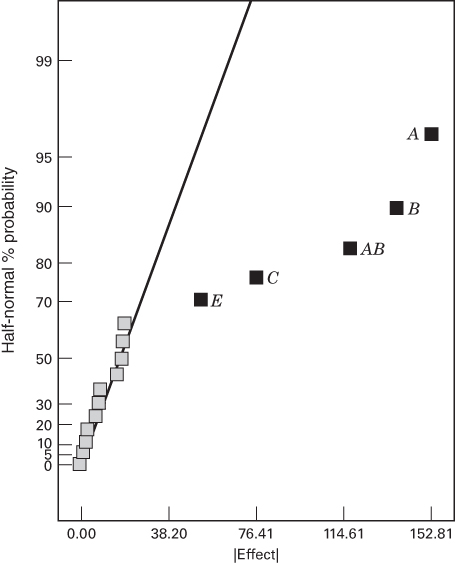

■ FIGURE 8.25 Half-normal plot of effects for the initial spin coater experiment in Table 8.31

is also large. Unless other process knowledge or engineering information is available, we do not know whether this is AB, CE, or both of the interaction effects.

The fold-over design is constructed by setting up a new $2_{IV}^{6-2}$ fractional factorial design and changing the signs on factor A. The complete design following the addition of the fold-over runs is shown (in standard order) in Table 8.32. Notice that the runs have been assigned to two blocks; the runs from the initial $2_{IV}^{6-2}$ design in Table 8.32 are in block 1, and the fold-over runs are in block 2. The effects that are estimated from the combined set of runs are (ignoring interactions involving three or more factors)

$$
\begin{array}{l l} \left[ A \right] = A & \left[ A E \right] = A E \\ \left[ B \right] = B & \left[ A F \right] = A F \\ \left[ C \right] = C & \left[ B C \right] = B C + D F \\ \left[ D \right] = D & \left[ B D \right] = B D + C F \\ \left[ E \right] = E & \left[ B E \right] = B E \\ \left[ F \right] = F & \left[ B F \right] = B F + C D \\ \left[ A B \right] = A B & \left[ C E \right] = C E \\ \left[ A C \right] = A C & \left[ D E \right] = D E \\ \left[ A D \right] = A D & \left[ E F \right] = E F \end{array}
$$

Notice that all of the two-factor interactions involving factor A are now clear of other two-factor interactions. Also, AB is no longer aliased with CE. The half-normal probability plot of the effects from the combined design is shown in Figure 8.26. Clearly it is the CE interaction that is significant.

It is easy to show that the completed fold-over design in Table 8.32 allows estimation of the 6 main effects and 12 two-factor interaction alias chains shown previously, along with estimation of 12 other alias chains involving higher order interactions and the block effect. The generators for the original fractions are E = ABC and F = BCD, and because we changed the signs in column A to create the fold over, the generators for the second group of 16 runs are E = -ABC and F = BCD. Since there is only one word of like sign (L = 1, U = 1) and the combined design has only one generator (it is a one-half fraction), the generator for the combined design is F = BCD. Furthermore, since ABCE is positive in block 1 and ABCE is negative in block 2, ABCE plus its alias ADEF are confounded with blocks.

TABLE 8.32  
The Completed Fold Over for the Spin Coater Experiment

<table><tr><td></td><td></td><td>A</td><td>B</td><td>C</td><td>D</td><td>E</td><td>F</td><td></td></tr><tr><td>Std. Order</td><td>Block</td><td>Speed (RPM)</td><td>Acceleration</td><td>Vol (cc)</td><td>Time (sec)</td><td>Resist Viscosity</td><td>Exhaust Rate</td><td>Thickness (mil)</td></tr><tr><td>1</td><td>1</td><td>-</td><td>-</td><td>-</td><td>-</td><td>-</td><td>-</td><td>4524</td></tr><tr><td>2</td><td>1</td><td>+</td><td>-</td><td>-</td><td>-</td><td>+</td><td>-</td><td>4657</td></tr><tr><td>3</td><td>1</td><td>-</td><td>+</td><td>-</td><td>-</td><td>+</td><td>+</td><td>4293</td></tr><tr><td>4</td><td>1</td><td>+</td><td>+</td><td>-</td><td>-</td><td>-</td><td>+</td><td>4516</td></tr><tr><td>5</td><td>1</td><td>-</td><td>-</td><td>+</td><td>-</td><td>+</td><td>+</td><td>4508</td></tr><tr><td>6</td><td>1</td><td>+</td><td>-</td><td>+</td><td>-</td><td>-</td><td>+</td><td>4432</td></tr><tr><td>7</td><td>1</td><td>-</td><td>+</td><td>+</td><td>-</td><td>-</td><td>-</td><td>4197</td></tr><tr><td>8</td><td>1</td><td>+</td><td>+</td><td>+</td><td>-</td><td>+</td><td>-</td><td>4515</td></tr><tr><td>9</td><td>1</td><td>-</td><td>-</td><td>-</td><td>+</td><td>-</td><td>+</td><td>4521</td></tr><tr><td>10</td><td>1</td><td>+</td><td>-</td><td>-</td><td>+</td><td>+</td><td>+</td><td>4610</td></tr><tr><td>11</td><td>1</td><td>-</td><td>+</td><td>-</td><td>+</td><td>+</td><td>-</td><td>4295</td></tr><tr><td>12</td><td>1</td><td>+</td><td>+</td><td>-</td><td>+</td><td>-</td><td>-</td><td>4560</td></tr><tr><td>13</td><td>1</td><td>-</td><td>-</td><td>+</td><td>+</td><td>+</td><td>-</td><td>4487</td></tr><tr><td>14</td><td>1</td><td>+</td><td>-</td><td>+</td><td>+</td><td>-</td><td>-</td><td>4485</td></tr><tr><td>15</td><td>1</td><td>-</td><td>+</td><td>+</td><td>+</td><td>-</td><td>+</td><td>4195</td></tr><tr><td>16</td><td>1</td><td>+</td><td>+</td><td>+</td><td>+</td><td>+</td><td>+</td><td>4510</td></tr><tr><td>17</td><td>2</td><td>+</td><td>-</td><td>-</td><td>-</td><td>-</td><td>-</td><td>4615</td></tr><tr><td>18</td><td>2</td><td>-</td><td>-</td><td>-</td><td>-</td><td>+</td><td>-</td><td>4445</td></tr><tr><td>19</td><td>2</td><td>+</td><td>+</td><td>-</td><td>-</td><td>+</td><td>+</td><td>4475</td></tr><tr><td>20</td><td>2</td><td>-</td><td>+</td><td>-</td><td>-</td><td>-</td><td>+</td><td>4285</td></tr><tr><td>21</td><td>2</td><td>+</td><td>-</td><td>+</td><td>-</td><td>+</td><td>+</td><td>4610</td></tr><tr><td>22</td><td>2</td><td>-</td><td>-</td><td>+</td><td>-</td><td>-</td><td>+</td><td>4325</td></tr><tr><td>23</td><td>2</td><td>+</td><td>+</td><td>+</td><td>-</td><td>-</td><td>-</td><td>4330</td></tr><tr><td>24</td><td>2</td><td>-</td><td>+</td><td>+</td><td>-</td><td>+</td><td>-</td><td>4425</td></tr><tr><td>25</td><td>2</td><td>+</td><td>-</td><td>-</td><td>+</td><td>-</td><td>+</td><td>4655</td></tr><tr><td>26</td><td>2</td><td>-</td><td>-</td><td>-</td><td>+</td><td>+</td><td>+</td><td>4525</td></tr><tr><td>27</td><td>2</td><td>+</td><td>+</td><td>-</td><td>+</td><td>+</td><td>-</td><td>4485</td></tr><tr><td>28</td><td>2</td><td>-</td><td>+</td><td>-</td><td>+</td><td>-</td><td>-</td><td>4310</td></tr><tr><td>29</td><td>2</td><td>+</td><td>-</td><td>+</td><td>+</td><td>+</td><td>-</td><td>4620</td></tr><tr><td>30</td><td>2</td><td>-</td><td>-</td><td>+</td><td>+</td><td>-</td><td>-</td><td>4335</td></tr><tr><td>31</td><td>2</td><td>+</td><td>+</td><td>+</td><td>+</td><td>-</td><td>+</td><td>4345</td></tr><tr><td>32</td><td>2</td><td>-</td><td>+</td><td>+</td><td>+</td><td>+</td><td>+</td><td>4305</td></tr></table>

Examination of the alias chains involving the two-factor interactions for the original 16-run design and the completed fold over reveals some troubling information. In the original resolution IV fraction, every two-factor interaction was aliased with another two-factor interaction in six alias chains, and in one alias chain there were three two-factor interactions (refer to Table 8.8). Thus, seven degrees of freedom were available to estimate two-factor interactions. In the completed fold over, there are nine two-factor interactions that are estimated free of other two-factor interactions

■ FIGURE 8.26 Half-normal plot of effects for the spin coater experiment in Table 8.32

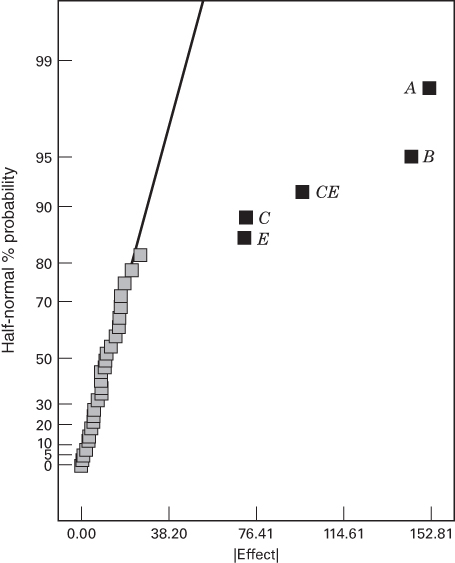

and three alias chains involving two two-factor interactions, resulting in 12 degrees of freedom for estimating two-factor interactions. Put another way, we used 16 additional runs but only gained five additional degrees of freedom for estimating two-factor interactions. This is not a terribly efficient use of experimental resources.

Fortunately, there is another alternative to using a complete fold over. In a partial fold over (or semifold) we make only half of the runs required for a complete fold over, which for the spin coater experiment would be eight runs. The following steps will produce a partial fold-over design:

1. Construct a single-factor fold over from the original design in the usual way by changing the signs on a factor that is involved in a two-factor interaction of interest.

2. Select only half of the fold-over runs by choosing those runs where the chosen factor is either at its high or low level. Selecting the level that you believe will generate the most desirable response is usually a good idea.

Table 8.33 is the partial fold-over design for the spin coater experiment. Notice that we selected the runs where A is at its low level because in the original set of 16 runs (Table 8.31), thinner coatings of photoresist (which are desirable in this case) were obtained with A at the low level. (The estimate of the A effect is positive in the analysis of the original 16 runs, also suggesting that A at the low level produces the desired results.)

The alias relations from the partial fold over (ignoring interactions involving three or more factors) are

$$
\begin{array}{r l r l} {[ A ] = A} & & {[ A E ] = A E} \\ {[ B ] = B} & & {[ A F ] = A F} \\ {[ C ] = C} & & {[ B C ] = B C + D F} \\ {[ D ] = D} & & {[ B D ] = B D + C F} \\ {[ E ] = E} & & {[ B E ] = B E} \\ {[ F ] = F} & & {[ B F ] = B F + C D} \\ {[ A B ] = A B} & & {[ C E ] = C E} \\ {[ A C ] = A C} & & {[ D E ] = D E} \\ {[ A D ] = A D} & & {[ E F ] = E F} \end{array}
$$

TABLE 8.33  
The Partial Fold Over for the Spin Coater Experiment

<table><tr><td colspan="2"></td><td>A</td><td>B</td><td>C</td><td>D</td><td>E</td><td>F</td><td></td></tr><tr><td>Std. Order</td><td>Block</td><td>Speed (RPM)</td><td>Acceleration</td><td>Vol (cc)</td><td>Time (sec)</td><td>Resist Viscosity</td><td>Exhaust Rate</td><td>Thickness (mil)</td></tr><tr><td>1</td><td>1</td><td>-</td><td>-</td><td>-</td><td>-</td><td>-</td><td>-</td><td>4524</td></tr><tr><td>2</td><td>1</td><td>+</td><td>-</td><td>-</td><td>-</td><td>+</td><td>-</td><td>4657</td></tr><tr><td>3</td><td>1</td><td>-</td><td>+</td><td>-</td><td>-</td><td>+</td><td>+</td><td>4293</td></tr><tr><td>4</td><td>1</td><td>+</td><td>+</td><td>-</td><td>-</td><td>-</td><td>+</td><td>4516</td></tr><tr><td>5</td><td>1</td><td>-</td><td>-</td><td>+</td><td>-</td><td>+</td><td>+</td><td>4508</td></tr><tr><td>6</td><td>1</td><td>+</td><td>-</td><td>+</td><td>-</td><td>-</td><td>+</td><td>4432</td></tr><tr><td>7</td><td>1</td><td>-</td><td>+</td><td>+</td><td>-</td><td>-</td><td>-</td><td>4197</td></tr><tr><td>8</td><td>1</td><td>+</td><td>+</td><td>+</td><td>-</td><td>+</td><td>-</td><td>4515</td></tr><tr><td>9</td><td>1</td><td>-</td><td>-</td><td>-</td><td>+</td><td>-</td><td>+</td><td>4521</td></tr><tr><td>10</td><td>1</td><td>+</td><td>-</td><td>-</td><td>+</td><td>+</td><td>+</td><td>4610</td></tr><tr><td>11</td><td>1</td><td>-</td><td>+</td><td>-</td><td>+</td><td>+</td><td>-</td><td>4295</td></tr><tr><td>12</td><td>1</td><td>+</td><td>+</td><td>-</td><td>+</td><td>-</td><td>-</td><td>4560</td></tr><tr><td>13</td><td>1</td><td>-</td><td>-</td><td>+</td><td>+</td><td>+</td><td>-</td><td>4487</td></tr><tr><td>14</td><td>1</td><td>+</td><td>-</td><td>+</td><td>+</td><td>-</td><td>-</td><td>4485</td></tr><tr><td>15</td><td>1</td><td>-</td><td>+</td><td>+</td><td>+</td><td>-</td><td>+</td><td>4195</td></tr><tr><td>16</td><td>1</td><td>+</td><td>+</td><td>+</td><td>+</td><td>+</td><td>+</td><td>4510</td></tr><tr><td>17</td><td>2</td><td>-</td><td>-</td><td>-</td><td>-</td><td>+</td><td>-</td><td>4445</td></tr><tr><td>18</td><td>2</td><td>-</td><td>+</td><td>-</td><td>-</td><td>-</td><td>+</td><td>4285</td></tr><tr><td>19</td><td>2</td><td>-</td><td>-</td><td>+</td><td>-</td><td>-</td><td>+</td><td>4325</td></tr><tr><td>20</td><td>2</td><td>-</td><td>+</td><td>+</td><td>-</td><td>+</td><td>-</td><td>4425</td></tr><tr><td>21</td><td>2</td><td>-</td><td>-</td><td>-</td><td>+</td><td>+</td><td>+</td><td>4525</td></tr><tr><td>22</td><td>2</td><td>-</td><td>+</td><td>-</td><td>+</td><td>-</td><td>-</td><td>4310</td></tr><tr><td>23</td><td>2</td><td>-</td><td>-</td><td>+</td><td>+</td><td>-</td><td>-</td><td>4335</td></tr><tr><td>24</td><td>2</td><td>-</td><td>+</td><td>+</td><td>+</td><td>+</td><td>+</td><td>4305</td></tr></table>

Notice that there are 12 degrees of freedom available to estimate two-factor interactions, exactly as in the complete fold over. Furthermore, AB is no longer aliased with CE. The half-normal plot of the effects from the partial fold over is shown in Figure 8.27. As in the complete fold over, CE is identified as the significant two-factor interaction.

The partial fold-over technique is very useful with resolution IV designs and usually leads to an efficient use of experimental resources. Resolution IV designs always provide good estimates of main effects (assuming that three-factor interactions are negligible), and usually the number of possible two-factor interaction that need to be de-aliased is not large. A partial fold over of a resolution IV design will usually support estimation of as many two-factor interactions as a full fold over. One disadvantage of the partial fold over is that it is not orthogonal. This causes parameter estimates to be correlated and leads to inflation in the standard errors of the effects or regression model coefficients. For example, in the partial fold over of the spin coater experiment, the standard errors of the regression model coefficients range from $0.20\sigma$ to $0.25\sigma$ , while in the complete fold over, which is orthogonal, the standard errors of the model coefficients are $0.18\sigma$ . For more information on partial fold overs, see Mee and Peralta (2000) and the supplemental material for this chapter.

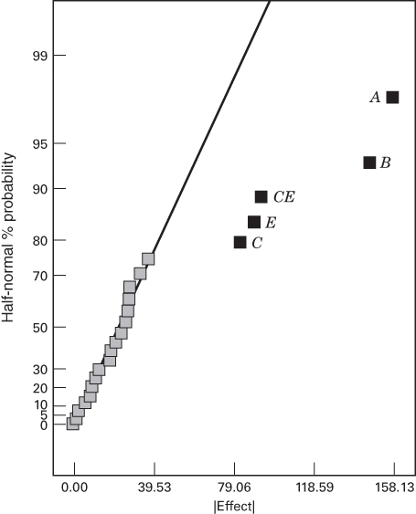

■ FIGURE 8.27 Half-normal plot of effects from the partial fold over of the spin coater experiment in Table 8.33

## 8.7.3 Resolution V Designs

Resolution V designs are fractional factorials in which the main effects and the two-factor interactions do not have other main effects and two-factor interactions as their aliases. Consequently, these are very powerful designs, allowing unique estimation of all main effects and two-factor interactions, provided of course that all interactions involving three or more factors are negligible. The shortest word in the defining relation of a resolution V design must have five letters. The $2^{5-1}$ design with $I = ABCDE$ is perhaps the most widely used resolution V design, permitting study of five factors and estimation of all five main effects and all 10 two-factor interactions in only 16 runs. We illustrated the use of this design in Example 8.2.

The smallest design of resolution at least V for k = 6 factors is the $2_{VI}^{6-1}$ design with 32 runs, which is of resolution VI. For k = 7 factors, it is the 64-run $2_{VII}^{7-1}$ which is of resolution VII, and for k = 8 factors, it is the 64 run $2_{V}^{8-2}$ design. For $k \geq 9$ or more factors, all these designs require at least 128 runs. These are very large designs, so statisticians have long been interested in smaller alternatives that maintain the desired resolution. Mee (2004) gives a survey of this topic. Nonregular fractions can be very useful. This will be discussed further in Chapter 9.

## 8.8 Supersaturated Designs

A saturated design is defined as a fractional factorial in which the number of factors or design variables k = N - 1, where N is the number of runs. In recent years, considerable interest has been shown in developing and using supersaturated designs for factor screening experiments. In a supersaturated design, the number of variables k > N - 1, and usually these designs contain quite a few more variables than runs. The idea of using supersaturated designs was first proposed by Satterthwaite (1959). He proposed generating these designs at random. In an extensive discussion of this paper, some of the leading authorities in experimental design of the day, including Jack Youden, George Box, J. Stuart

Hunter, William Cochran, John Tukey, Oscar Kempthorne, and Frank Anscombe, criticized random balanced designs. As a result, supersaturated designs received little attention for the next 30 years. A notable exception is the systematic supersaturated design developed by Booth and Cox (1962). Their designs were not randomly generated, which was a significant departure from Satterthwaite's proposal. They generated their designs with elementary computer search methods. They also developed the basic criteria by which supersaturated designs are judged.

Lin (1993) revisited the supersaturated design concept and stimulated much additional research on the topic. Many authors have proposed methods to construct supersaturated designs. A good survey is in Lin (2000). Most design construction techniques are limited computer search procedures based on simple heuristics [see Lin (1995), Li and Wu (1997), and Holcomb and Carlyle (2002), for example]. Others have proposed methods based on optimal design construction techniques.

Another construction method for supersaturated designs is based on the structure of existing orthogonal designs. These include using the half-fraction of Hadamard matrices (Lin 1993) and enumerating the two-factor interactions of certain Hadamard matrices. A Hadamard matrix is a square orthogonal matrix whose elements are either -1 or +1. When the number of factors in the experiment exceeds the number of runs, the design matrix cannot be orthogonal. Consequently, the factor effect estimates are not independent. An experiment with one dominant factor may contaminate and obscure the contribution of another factor. Supersaturated designs are created to minimize this amount of nonorthogonality between factors. Supersaturated designs can also be constructed using the optimal design approach. The custom designer in JMP uses this approach to constructing supersaturated designs.

The supersaturated designs that are based on the half fraction of a Hadamard matrix are very easy to construct. Table 8.34 is the Plackett–Burman design for N = 12 runs and k = 11 factors. It is also a Hadamard matrix design. In the table, the design has been sorted by the signs in the last column (Factor 11 or L). This is sometimes called the branching column. Now retain only the runs that are positive (say) in column L from the design and delete column L from this group of runs. The resulting design is a supersaturated design for k = 10 factors in N = 6 runs. We could have used the runs that are negative in column L equally well. This procedure will always produce a supersaturated design for k = N - 2 factors in N/2 runs. If there are fewer than N - 2 factors of interest, additional columns can be removed from the complete design.

Supersaturated designs are typically analyzed by regression model-fitting methods, such as the forward selection method we have illustrated previously. In this procedure, variables are selected one at a time for inclusion in the model until no other variables appear useful in explaining the response. Abraham, Chipman, and Vijayan (1999) and Holcomb,

## TABLE 8.34

A Supersaturated Design Derived from a 12-Run Hadamard Matrix (Plackett-Burman) Design

<table><tr><td>Run</td><td>I</td><td>Factor 1 (A)</td><td>Factor 2 (B)</td><td>Factor 3 (C)</td><td>Factor 4 (D)</td><td>Factor 5 (E)</td><td>Factor 6 (F)</td><td>Factor 7 (G)</td><td>Factor 8 (H)</td><td>Factor 9 (J)</td><td>Factor 10 (K)</td><td>Factor 11 (L)</td></tr><tr><td>1</td><td>+</td><td>-</td><td>+</td><td>+</td><td>+</td><td>-</td><td>+</td><td>+</td><td>-</td><td>+</td><td>-</td><td>-</td></tr><tr><td>2</td><td>+</td><td>-</td><td>-</td><td>-</td><td>-</td><td>-</td><td>-</td><td>-</td><td>-</td><td>-</td><td>-</td><td>-</td></tr><tr><td>3</td><td>+</td><td>+</td><td>-</td><td>-</td><td>-</td><td>+</td><td>+</td><td>+</td><td>-</td><td>+</td><td>+</td><td>-</td></tr><tr><td>4</td><td>+</td><td>-</td><td>-</td><td>+</td><td>+</td><td>+</td><td>-</td><td>+</td><td>+</td><td>-</td><td>+</td><td>-</td></tr><tr><td>5</td><td>+</td><td>+</td><td>+</td><td>+</td><td>-</td><td>+</td><td>+</td><td>-</td><td>+</td><td>-</td><td>-</td><td>-</td></tr><tr><td>6</td><td>+</td><td>+</td><td>+</td><td>-</td><td>+</td><td>-</td><td>-</td><td>-</td><td>+</td><td>+</td><td>+</td><td>-</td></tr><tr><td>7</td><td>+</td><td>-</td><td>+</td><td>+</td><td>-</td><td>+</td><td>-</td><td>-</td><td>-</td><td>+</td><td>+</td><td>+</td></tr><tr><td>8</td><td>+</td><td>+</td><td>+</td><td>-</td><td>+</td><td>+</td><td>-</td><td>+</td><td>-</td><td>-</td><td>-</td><td>+</td></tr><tr><td>9</td><td>+</td><td>+</td><td>-</td><td>+</td><td>-</td><td>-</td><td>-</td><td>+</td><td>+</td><td>+</td><td>-</td><td>+</td></tr><tr><td>10</td><td>+</td><td>+</td><td>-</td><td>+</td><td>+</td><td>-</td><td>+</td><td>-</td><td>-</td><td>-</td><td>+</td><td>+</td></tr><tr><td>11</td><td>+</td><td>-</td><td>-</td><td>-</td><td>+</td><td>+</td><td>+</td><td>-</td><td>+</td><td>+</td><td>-</td><td>+</td></tr><tr><td>12</td><td>+</td><td>-</td><td>+</td><td>-</td><td>-</td><td>-</td><td>+</td><td>+</td><td>+</td><td>-</td><td>+</td><td>+</td></tr></table>

Montgomery, and Carlyle (2003) have studied analysis methods for supersaturated designs. Generally, these designs can experience large type I and type II errors, but some analysis methods can be tuned to emphasize type I errors so that the type II error rate will be moderate. In a factor screening situation, it is usually more important not to exclude an active factor than it is to conclude that inactive factors are important, so type I errors are less critical than type II errors. However, because both error rates can be large, the philosophy in using a supersaturated design should be to eliminate a large portion of the inactive factors, and not to clearly identify the few important or active factors. Holcomb, Montgomery, and Carlyle (2003) found that some types of supersaturated designs perform better than others with respect to type I and type II errors. Generally, the designs produced by search algorithms were outperformed by designs constructed from standard orthogonal designs. Supersaturated designs created using the D-optimality criterion also usually work well.

Supersaturated designs have not had widespread use. However, they are an interesting and potentially useful method for experimentation with systems where there are many variables and only a very few of these are expected to produce large effects.

## 8.9 Summary

This chapter has introduced the $2^{k-p}$ fractional factorial design. We have emphasized the use of these designs in screening experiments to quickly and efficiently identify the subset of factors that are active and to provide some information on interaction. The projective property of these designs makes it possible in many cases to examine the active factors in more detail. Sequential assembly of these designs via fold over is a very effective way to gain additional information about interactions that an initial experiment may identify as possibly important.

In practice, $2^{k-p}$ fractional factorial designs with N = 4, 8, 16, and 32 runs are highly useful. Table 8.28 summarizes these designs, identifying how many factors can be used with each design to obtain various types of screening experiments. For example, the 16-run design is a full factorial for 4 factors, a one-half fraction for 5 factors, a resolution IV fraction for 6 to 8 factors, and a resolution III fraction for 9 to 15 factors. All of these designs may be constructed using the methods discussed in this chapter, and many of their alias structures are shown in Appendix Table VIII.