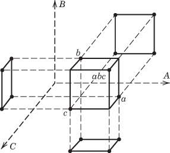

## 8.2 The One-Half Fraction of the $2^{k}$ Design

## 8.2.1 Definitions and Basic Principles

Consider a situation in which three factors, each at two levels, are of interest, but the experimenters cannot afford to run all $2^{3} = 8$ treatment combinations. They can, however, afford four runs. This suggests a one-half fraction of a $2^{3}$ design. Because the design contains $2^{3-1} = 4$ treatment combinations, a one-half fraction of the $2^{3}$ design is often called a $2^{3-1}$ design.

The table of plus and minus signs for the $2^{3}$ design is shown in Table 8.1. Suppose we select the four treatment combinations a, b, c, and abc as our one-half fraction. These runs are shown in the top half of Table 8.1 and in Figure 8.1a.

Notice that the $2^{3-1}$ design is formed by selecting only those treatment combinations that have a plus in the ABC column. Thus, ABC is called the generator of this particular fraction. Usually, we will refer to a generator such as ABC as a word. Furthermore, the identity column I is also always plus, so we call

$$
I = A B C
$$

the defining relation for our design. In general, the defining relation for a fractional factorial will always be the set of all columns that are equal to the identity column $I$ .

The treatment combinations in the $2^{3-1}$ design yield three degrees of freedom that we may use to estimate the main effects. Referring to Table 8.1, we note that the linear combinations of the observations used to estimate the main effects of A, B, and C are

$$
[ A ] = \frac {1}{2} (a - b - c + a b c)
$$

$$
[ B ] = \frac {1}{2} (- a + b - c + a b c)
$$

$$
[ C ] = \frac {1}{2} (- a - b + c + a b c)
$$

where the notation $[A]$ , $[B]$ , and $[C]$ is used to indicate the linear combinations associated with the main effects. It is also easy to verify that the linear combinations of the observations used to estimate the two-factor interactions are

$$
[ B C ] = \frac {1}{2} (a - b - c + a b c)
$$

$$
[ A C ] = \frac {1}{2} (- a + b - c + a b c)
$$

$$
[ A B ] = \frac {1}{2} (- a - b + c + a b c)
$$

TABLE 8.1  
Plus and Minus Signs for the $2^{3}$ Factorial Design

<table><tr><td rowspan="2">Treatment Combination</td><td colspan="8">Factorial Effect</td></tr><tr><td>I</td><td>A</td><td>B</td><td>C</td><td>AB</td><td>AC</td><td>BC</td><td>ABC</td></tr><tr><td>a</td><td>+</td><td>+</td><td>-</td><td>-</td><td>-</td><td>-</td><td>+</td><td>+</td></tr><tr><td>b</td><td>+</td><td>-</td><td>+</td><td>-</td><td>-</td><td>+</td><td>-</td><td>+</td></tr><tr><td>c</td><td>+</td><td>-</td><td>-</td><td>+</td><td>+</td><td>-</td><td>-</td><td>+</td></tr><tr><td>abc</td><td>+</td><td>+</td><td>+</td><td>+</td><td>+</td><td>+</td><td>+</td><td>+</td></tr><tr><td>ab</td><td>+</td><td>+</td><td>+</td><td>-</td><td>+</td><td>-</td><td>-</td><td>-</td></tr><tr><td>ac</td><td>+</td><td>+</td><td>-</td><td>+</td><td>-</td><td>+</td><td>-</td><td>-</td></tr><tr><td>bc</td><td>+</td><td>-</td><td>+</td><td>+</td><td>-</td><td>-</td><td>+</td><td>-</td></tr><tr><td>(1)</td><td>+</td><td>-</td><td>-</td><td>-</td><td>+</td><td>+</td><td>+</td><td>-</td></tr></table>

■ FIGURE 8.1 The two one-half fractions of the $2^{3}$ design

Thus, $[A] = [BC]$ , $[B] = [AC]$ , and $[C] = [AB]$ ; consequently, it is impossible to differentiate between A and BC, B and AC, and C and AB. In fact, when we estimate A, B, and C we are really estimating $A + BC$ , $B + AC$ , and $C + AB$ . Two or more effects that have this property are called aliases. In our example, A and BC are aliases, B and AC are aliases, and C and AB are aliases. We indicate this by the notation $[A] \to A + BC$ , $[B] \to B + AC$ , and $[C] \to C + AB$ .

The alias structure for this design may be easily determined by using the defining relation I = ABC. Multiplying any column (or effect) by the defining relation yields the aliases for that column (or effect). In our example, this yields as the alias of A

$$
A \cdot I = A \cdot A B C = A ^ {2} B C
$$

or, because the square of any column is just the identity I,

$$
A = B C
$$

Similarly, we find the aliases of B and C as

$$
\begin{array}{c} {B \cdot I = B \cdot A B C} \\ {B = A B ^ {2} C = A C} \end{array}
$$

and

$$
\begin{array}{c} C \cdot I = C \cdot A B C \\ C = A B C ^ {2} = A B \end{array}
$$

This one-half fraction, with $I = +ABC$ , is usually called the principal fraction.

Now suppose that we had chosen the other one-half fraction, that is, the treatment combinations in Table 8.1 associated with minus in the ABC column. This alternate, or complementary, one-half fraction (consisting of the runs (1), ab, ac, and bc) is shown in Figure 8.1b. The defining relation for this design is

$$
I = - A B C
$$

The linear combination of the observations, say $[A]'$ , $[B]'$ , and $[C]'$ , from the alternate fraction gives us

$$
\begin{array}{l} {[ A ] ^ {\prime} \to A - B C} \\ {[ B ] ^ {\prime} \to B - A C} \\ {[ C ] ^ {\prime} \to C - A B} \end{array}
$$

Thus, when we estimate $A, B$ , and $C$ with this particular fraction, we are really estimating $A - BC, B - AC$ , and $C - AB$ .

In practice, it does not matter which fraction is actually used. Both fractions belong to the same family; that is, the two one-half fractions form a complete $2^{3}$ design. This is easily seen by reference to parts $a$ and $b$ of Figure 8.1.

Suppose that after running one of the one-half fractions of the $2^{3}$ design, the other fraction was also run. Thus, all eight runs associated with the full $2^{3}$ are now available. We may now obtain de-aliased estimates of all the effects by analyzing the eight runs as a full $2^{3}$ design in two blocks of four runs each. This could also be done by adding and subtracting the linear combination of effects from the two individual fractions. For example, consider $[A] \rightarrow A + BC$ and $[A]' \rightarrow A - BC$ . This implies that

$$
\frac {1}{2} ([ A ] + [ A ] ^ {\prime}) = \frac {1}{2} (A + B C + A - B C) \rightarrow A
$$

and that

$$
\frac {1}{2} ([ A ] - [ A ] ^ {\prime}) = \frac {1}{2} (A + B C - A + B C) \rightarrow B C
$$

Thus, for all three pairs of linear combinations, we would obtain the following:

<table><tr><td>i</td><td>From  $\frac{1}{2}([i] + [i]' )$ </td><td>From  $\frac{1}{2}([i] - [i]' )$ </td></tr><tr><td>A</td><td>A</td><td>BC</td></tr><tr><td>B</td><td>B</td><td>AC</td></tr><tr><td>C</td><td>C</td><td>AB</td></tr></table>

Furthermore, by assembling the full $2^{3}$ in this fashion with I = +ABC in the first group of runs and I = -ABC in the second, the $2^{3}$ confounds ABC with blocks.

More About Effect Sparsity. As noted earlier, effect sparsity is one of the reasons that fractional factorial designs are so successful. This phenomenon has been observed empirically by experimenters in many fields for decades. However, a recent paper by Li, Sudarsanam, and Frey (2006) provides more objective evidence of effect sparsity.

Li, Sudarsanam, and Frey (2006) reexamined 133 response variables from published full factorial experiments with from 3 to 7 factors. They reanalyzed all of the responses. They found that in the experiments that they studied 41% of the main effects were active. Generally, the size of an active main effect was twice the size of an active two-factor interaction. The percent of active two-factor interactions overall was 11%. Interactions beyond order two were extremely rare. They also reported some “conditional” percentages regarding active two-factor interactions:

\- A two-factor interaction was active and both main effects involved in that interaction were active occurred $33\%$ of the time.

\- A two-factor interaction was active but only one of the main effects involved in that interaction was active occurred 4.5% of the time.

\- A two-factor interaction was active and neither of the main effects involved in that interaction was active occurred only 0.5% of the time.

These results strongly support the sparsity of effects assumption. They also support the usual assumptions of model hierarchy and effect heredity. However, the results are strongly dependent on the types of experiments analyzed. If more experiments involving chemical processes and systems and biological systems were included, two-factor interactions would probably be more likely to occur. Three-factor interactions can be encountered in some of these systems. For example, consider a three-factor chemical process experiment involving two continuous factor, time and temperature, and a categorical factor, catalyst type. If the two-factor interaction involving time and temperature is different for each catalyst type, then there is a three-factor interaction.

## 8.2.2 Design Resolution

The preceding $2^{3-1}$ design is called a resolution III design. In such a design, main effects are aliased with two-factor interactions. A design is of resolution R if no p-factor effect is aliased with another effect containing less than R - p factors. We usually employ a Roman numeral subscript to denote design resolution; thus, the one-half fraction of the $2^{3}$ design with the defining relation I = ABC (or I = -ABC) is a $2_{III}^{3-1}$ design.

Designs of resolution III, IV, and V are particularly important. The definitions of these designs and an example of each follow:

1. Resolution III designs. These are designs in which no main effects are aliased with any other main effect, but main effects are aliased with two-factor interactions and some two-factor interactions may be aliased with each other. The $2^{3-1}$ design in Table 8.1 is of resolution III ( $2_{III}^{3-1}$ ).

2. Resolution IV designs. These are designs in which no main effect is aliased with any other main effect or with any two-factor interaction, but two-factor interactions are aliased with each other. A $2^{4-1}$ design with I = ABCD is a resolution IV design ( $2_{IV}^{4-1}$ ).

3. Resolution V designs. These are designs in which no main effect or two-factor interaction is aliased with any other main effect or two-factor interaction, but two-factor interactions are aliased with three-factor interactions. A $2^{5-1}$ design with I = ABCDE is a resolution V design ( $2_{V}^{5-1}$ ).

In general, the resolution of a two-level fractional factorial design is equal to the number of letters in the shortest word in the defining relation. Consequently, we could call the preceding design types three-, four-, and five-letter designs, respectively. We usually like to employ fractional designs that have the highest possible resolution consistent with the degree of fractionation required. The higher the resolution, the less restrictive the assumptions that are required regarding which interactions are negligible to obtain a unique interpretation of the results.

## 8.2.3 Construction and Analysis of the One-Half Fraction

A one-half fraction of the $2^{k}$ design of the highest resolution may be constructed by writing down a basic design consisting of the runs for a full $2^{k-1}$ factorial and then adding the kth factor by identifying its plus and minus levels with the plus and minus signs of the highest order interaction $ABC \cdots (K - 1)$ . Therefore, the $2_{III}^{3-1}$ fractional factorial is obtained by writing down the full $2^{2}$ factorial as the basic design and then equating factor C to the AB interaction. The alternate fraction would be obtained by equating factor C to the -AB interaction. This approach is illustrated in Table 8.2. Notice that the basic design always has the right number of runs (rows), but it is missing one column. The generator $I = ABC \cdots K$ is then solved for the missing column (K) so that $K = ABC \cdots (K - 1)$ defines the product of plus and minus signs to use in each row to produce the levels for the kth factor.

Note that any interaction effect could be used to generate the column for the kth factor. However, using any effect other than $ABC \cdots (K - 1)$ will not produce a design of the highest possible resolution.

Another way to view the construction of a one-half fraction is to partition the runs into two blocks with the highest order interaction $ABC \cdots K$ confounded. Each block is a $2^{k-1}$ fractional factorial design of the highest resolution.

TABLE 8.2  
The Two One-Half Fractions of the $2^{3}$ Design

<table><tr><td rowspan="2">Run</td><td colspan="2">Full  $2^{2}$  Factorial (Basic Design)</td><td colspan="3"> $2_{\text{III}}^{3-1}, I = ABC$ </td><td colspan="3"> $2_{\text{III}}^{3-1}, I = -ABC$ </td></tr><tr><td>A</td><td>B</td><td>A</td><td>B</td><td>C = AB</td><td>A</td><td>B</td><td>C = -AB</td></tr><tr><td>1</td><td>-</td><td>-</td><td>-</td><td>-</td><td>+</td><td>-</td><td>-</td><td>-</td></tr><tr><td>2</td><td>+</td><td>-</td><td>+</td><td>-</td><td>-</td><td>+</td><td>-</td><td>+</td></tr><tr><td>3</td><td>-</td><td>+</td><td>-</td><td>+</td><td>-</td><td>-</td><td>+</td><td>+</td></tr><tr><td>4</td><td>+</td><td>+</td><td>+</td><td>+</td><td>+</td><td>+</td><td>+</td><td>-</td></tr></table>

Projection of Fractions into Factorials. Any fractional factorial design of resolution $R$ contains complete factorial designs (possibly replicated factorials) in any subset of $R - 1$ factors. This is an important and useful concept. For example, if an experimenter has several factors of potential interest but believes that only $R - 1$ of them have important effects, then a fractional factorial design of resolution $R$ is the appropriate choice of design. If the experimenter is correct, the fractional factorial design of resolution $R$ will project into a full factorial in the $R - 1$ significant factors. This property is illustrated in Figure 8.2 for the $2_{\mathrm{III}}^{3-1}$ design, which projects into a $2^2$ design in every subset of two factors.

■ FIGURE 8.2 Projection of a $2_{\mathrm{III}}^{3-1}$ design into three $2^2$ designs

Because the maximum possible resolution of a one-half fraction of the $2^{k}$ design is $R = k$ , every $2^{k-1}$ design will project into a full factorial in any $(k-1)$ of the original $k$ factors. Furthermore, a $2^{k-1}$ design may be projected into two replicates of a full factorial in any subset of $k-2$ factors, four replicates of a full factorial in any subset of $k-3$ factors, and so on.

## EXAMPLE 8.1

Consider the filtration rate experiment in Example 6.2. The original design, shown in Table 6.10, is a single replicate of the $2^{4}$ design. In that example, we found that the main effects A, C, and D and the interactions AC and AD were different from zero. We will now return to this experiment and simulate what would have happened if a half-fraction of the $2^{4}$ design had been run instead of the full factorial.

We will use the $2^{4-1}$ design with I = ABCD, because this choice of generator will result in a design of the highest possible resolution (IV). To construct the design, we first write down the basic design, which is a $2^{3}$ design, as shown in the first three columns of Table 8.3. This basic design has the necessary number of runs (eight) but only three columns (factors). To find the fourth factor levels, solve $I = ABCD$ for $D$ , or $D = ABC$ . Thus, the level of $D$ in each run is the product of the plus and minus signs in columns $A, B$ , and $C$ . The process is illustrated in Table 8.3. Because the generator $ABCD$ is positive, this $2_{\mathrm{IV}}^{4-1}$ design is the principal fraction. The design is shown graphically in Figure 8.3.

■ TABLE 8.3
The $2^{4-1}_{IV}$ Design with the Defining Relation I = ABCD

<table><tr><td rowspan="2">Run</td><td colspan="3">Basic Design</td><td rowspan="2">D=ABC</td><td rowspan="2">Treatment Combination</td><td rowspan="2">Filtration Rate</td></tr><tr><td>A</td><td>B</td><td>C</td></tr><tr><td>1</td><td>-</td><td>-</td><td>-</td><td>-</td><td>(1)</td><td>45</td></tr><tr><td>2</td><td>+</td><td>-</td><td>-</td><td>+</td><td>ad</td><td>100</td></tr><tr><td>3</td><td>-</td><td>+</td><td>-</td><td>+</td><td>bd</td><td>45</td></tr><tr><td>4</td><td>+</td><td>+</td><td>-</td><td>-</td><td>ab</td><td>65</td></tr><tr><td>5</td><td>-</td><td>-</td><td>+</td><td>+</td><td>cd</td><td>75</td></tr><tr><td>6</td><td>+</td><td>-</td><td>+</td><td>-</td><td>ac</td><td>60</td></tr><tr><td>7</td><td>-</td><td>+</td><td>+</td><td>-</td><td>bc</td><td>80</td></tr><tr><td>8</td><td>+</td><td>+</td><td>+</td><td>+</td><td>abcd</td><td>96</td></tr></table>

Using the defining relation, we note that each main effect is aliased with a three-factor interaction; that is, $A = A^{2}BCD = BCD$ , $B = AB^{2}CD = ACD$ , $C = ABC^{2}D = ABD$ , and $D = ABCD^{2} = ABC$ . Furthermore, every two-factor interaction is aliased with another two-factor interaction. These alias relationships are AB = CD, AC = BD, and BC = AD. The four main effects plus the three two-factor interaction alias pairs account for the seven degrees of freedom for the design.

At this point, we would normally randomize the eight runs and perform the experiment. Because we have already run the full $2^{4}$ design, we will simply select the eight observed filtration rates from Example 6.2 that correspond to the runs in the $2_{IV}^{4-1}$ design. These observations are shown in the last column of Table 8.3 as well as in Figure 8.3.

The estimates of the effects obtained from this $2_{IV}^{4-1}$ design are shown in Table 8.4. To illustrate the calculations, the linear combination of observations associated with the A effect is

$$
\begin{array}{r l}[ A ]&= \frac {1}{4} (- 4 5 + 1 0 0 - 4 5 + 6 5 - 7 5\\&\quad + 6 0 - 8 0 + 9 6) = 1 9. 0 0 \rightarrow A + B C D\end{array}
$$

whereas for the AB effect, we would obtain

$$
\begin{array}{r l}[ A B ]&= \frac {1}{4} (4 5 - 1 0 0 - 4 5 + 6 5 + 7 5 - 6 0 - 8 0 + 9 6)\\&= - 1. 0 0 \rightarrow A B + C D\end{array}
$$

From inspection of the information in Table 8.4, it is not unreasonable to conclude that the main effects A, C, and D are large. The $AB + CD$ alias chain has a small estimate, so the simplest interpretation is that both the AB and CD interactions are negligible (otherwise, both AB and CD are large, but they have nearly identical magnitudes and opposite signs—this is fairly unlikely). Furthermore, if A, C, and D are the important main effects, then it is logical to conclude that the two interaction alias chains $AC + BD$ and $AD + BC$ have large effects because the AC and AD interactions are also significant. In other words, if A, C, and D are significant, then the significant interactions are most likely AC and AD. This is an application of Ockham's razor (after William of Ockham), a scientific principle that when one is confronted with several different possible interpretations of a phenomena, the simplest interpretation is usually the correct one. Note that this interpretation agrees with the conclusions from the analysis of the complete $2^{4}$ design in Example 6.2.

  
■ FIGURE 8.3 The $2_{IV}^{4-1}$ design for the filtration rate experiment of Example 8.1

TABLE 8.4  
Estimates of Effects and Aliases from Example 8.1 $^{a}$

<table><tr><td>Estimate</td><td>Alias Structure</td></tr><tr><td>[A] = 19.00</td><td>[A] → A + BCD</td></tr><tr><td>[B] = 1.50</td><td>[B] → B + ACD</td></tr><tr><td>[C] = 14.00</td><td>[C] → C + ABD</td></tr><tr><td>[D] = 16.50</td><td>[D] → D + ABC</td></tr><tr><td>[AB] = -1.00</td><td>[AB] → AB + CD</td></tr><tr><td>[AC] = -18.50</td><td>[AC] → AC + BD</td></tr><tr><td>[AD] = 19.00</td><td>[AD] → AD + BC</td></tr></table>

$^{a}$ Significant effects are shown in boldface type.

Another way to view this interpretation is from the standpoint of effect heredity. Suppose that AB is significant and that both main effects A and B are significant. This is called strong heredity, and it is the usual situation (if an interaction is significant and only one of the main effects is significant this is called weak heredity; and this is relatively less common). So in this example, with A significant and B not significant this support the assumption that AB is not significant.

Because factor B is not significant, we may drop it from consideration. Consequently, we may project this $2_{IV}^{4-1}$ design into a single replicate of the $2^{3}$ design in factors A, C, and D, as shown in Figure 8.4. Visual examination of this cube plot makes us more comfortable with the conclusions reached above. Notice that if the temperature (A) is at the low level, the concentration (C) has a large positive effect, whereas if the temperature is at the high level, the concentration has a very small effect. This is probably due to an AC interaction. Furthermore, if the temperature is at the low level, the effect of the stirring rate (D) is negligible, whereas if the temperature is at the high level, the stirring rate has a large positive effect. This is probably due to the AD interaction tentatively identified previously.

  
■ FIGURE 8.4 Projection of the $2_{\mathrm{IV}}^{4-1}$ design into a $2^3$ design in $A, C,$ and $D$ for Example 8.1

Based on the above analysis, we can now obtain a model to predict filtration rate over the experimental region. This model is

$$
\hat {y} = \hat {\beta} _ {0} + \hat {\beta} _ {1} x _ {1} + \hat {\beta} _ {3} x _ {3} + \hat {\beta} _ {4} x _ {4} + \hat {\beta} _ {1 3} x _ {1} x _ {3} + \hat {\beta} _ {1 4} x _ {1} x _ {4}
$$

where $x_{1}, x_{3}$ , and $x_{4}$ are coded variables ( $-1 \leq x_{i} \leq +1$ ) that represent A, C, and D, and the $\hat{\beta}$ 's are regression coefficients that can be obtained from the effect estimates as we did previously. Therefore, the prediction equation is

$$
\begin{array}{r l} \hat {y} & = 7 0. 7 5 + \left(\frac {1 9 . 0 0}{2}\right) x _ {1} + \left(\frac {1 4 . 0 0}{2}\right) x _ {3} + \left(\frac {1 6 . 5 0}{2}\right) x _ {4} \\ & \quad + \left(\frac {- 1 8 . 5 0}{2}\right) x _ {1} x _ {3} + \left(\frac {1 9 . 0 0}{2}\right) x _ {1} x _ {4} \end{array}
$$

Remember that the intercept $\hat{\beta}_{0}$ is the average of all responses at the eight runs in the design. This model is very similar to the one that resulted from the full $2^{k}$ factorial design in Example 6.2.

The JMP screening analysis for Example 8.1 is shown in the boxed display below. Because there are only eight runs and seven degrees of freedom, we only included the intercept, the four main effects, and three of the six two-factor interactions (and their aliases) in the model. All of the P-values from Lenth's procedure are large. Eight runs with five active effects are not adequate to produce a reliable error estimate from Lenth's method. Also, notice that the $R^{2}$ statistic is 1, and no values are reported for the adjusted $R^{2}$ and the square root of the mean square error because the model is saturated. However, the largest effects are the three main effects and the two two-factor interactions identified previously in Example 8.1. The prediction profiler portion of the output has been set to the levels of the active factors that maximize the filtration rate.

Prediction Profiler

<table><tr><td colspan="2">Response Y</td></tr><tr><td colspan="2">Summary of Fit</td></tr><tr><td>RSquare</td><td>1</td></tr><tr><td>RSquare Adj</td><td>.</td></tr><tr><td>Root Mean Square Error</td><td>.</td></tr><tr><td>Mean of Response</td><td>70.75</td></tr><tr><td>Observations (or Sum Wgts)</td><td>8</td></tr></table>

Sorted Parameter Estimates

<table><tr><td>Term</td><td>Estimate</td><td>Relative Std Error</td><td>Pseudo t-Ratio</td><td colspan="9"></td><td>Pseudo p-Value</td></tr><tr><td>X1</td><td>9.5</td><td>0.353553</td><td>0.77</td><td></td><td></td><td></td><td></td><td></td><td></td><td></td><td></td><td></td><td>0.5128</td></tr><tr><td>X1*X4</td><td>9.5</td><td>0.353553</td><td>0.77</td><td></td><td></td><td></td><td></td><td></td><td></td><td></td><td></td><td></td><td>0.5128</td></tr><tr><td>X1*X3</td><td>-9.25</td><td>0.353553</td><td>-0.75</td><td></td><td></td><td></td><td></td><td></td><td></td><td></td><td></td><td></td><td>0.5228</td></tr><tr><td>X4</td><td>8.25</td><td>0.353553</td><td>0.67</td><td></td><td></td><td></td><td></td><td></td><td></td><td></td><td></td><td></td><td>0.5649</td></tr><tr><td>X3</td><td>7</td><td>0.353553</td><td>0.57</td><td></td><td></td><td></td><td></td><td></td><td></td><td></td><td></td><td></td><td>0.6213</td></tr><tr><td>X2</td><td>0.75</td><td>0.353553</td><td>0.06</td><td></td><td></td><td></td><td></td><td></td><td></td><td></td><td></td><td></td><td>0.9565</td></tr><tr><td>X1*X2</td><td>-0.5</td><td>0.353553</td><td>-0.04</td><td></td><td></td><td></td><td></td><td></td><td></td><td></td><td></td><td></td><td>0.9710</td></tr></table>

No error degrees of freedom, so ordinary tests uncomputable. Relative Std Error corresponds to residual standard error of 1. Pseudo t-Ratio and $P$ -Value calculated using Lenth PSE = 12.375 and DFE = 2.3333

Parameter Estimate Population

<table><tr><td>Term</td><td>Estimate</td><td>Pseudo t-Ratio</td><td>Pseudo P-Value</td></tr><tr><td>Intercept</td><td>70.7500</td><td>5.7172</td><td>0.0203*</td></tr><tr><td>X1</td><td>9.5000</td><td>0.7677</td><td>0.5128</td></tr><tr><td>X2</td><td>0.7500</td><td>0.0606</td><td>0.9565</td></tr><tr><td>X3</td><td>7.0000</td><td>0.5657</td><td>0.6213</td></tr><tr><td>X4</td><td>8.2500</td><td>0.6667</td><td>0.5649</td></tr><tr><td>X1*X2</td><td>-0.5000</td><td>-0.0404</td><td>0.9710</td></tr><tr><td>X1*X3</td><td>-9.2500</td><td>-0.7475</td><td>0.5228</td></tr><tr><td>X1*X4</td><td>9.5000</td><td>0.7677</td><td>0.5128</td></tr></table>

Orthog t-Test used Pseudo Standard Error

## EXAMPLE 8.2 A $2^{5-1}$ Design Used for Process Improvement

Five factors in a manufacturing process for an integrated circuit were investigated in a $2^{5-1}$ design with the objective of improving the process yield. The five factors were A = aperture setting (small, large), B = exposure time (20 percent below nominal, 20 percent above nominal), C = develop time (30 and 45 sec), D = mask dimension (small, large), and E = etch time (14.5 and 15.5 min). The construction of the $2^{5-1}$ design is shown in Table 8.5. Notice that the design was constructed by writing down the basic design having 16 runs (a $2^{4}$ design in A, B, C, and D), selecting ABCDE as the generator, and then setting the levels of the fifth factor E = ABCD. Figure 8.5 gives a pictorial representation of the design.

The defining relation for the design is $I = ABCDE$ . Consequently, every main effect is aliased with a four-factor interaction (for example, $[A] \to A + BCDE$ ), and every two-factor interaction is aliased with a three-factor interaction (e.g., $[AB] \rightarrow AB + CDE$ ). Thus, the design is of resolution V. We would expect this $2^{5-1}$ design to provide excellent information concerning the main effects and two-factor interactions.

Table 8.6 contains the effect estimates, sums of squares, and model regression coefficients for the 15 effects from this experiment. Figure 8.6 presents a normal probability plot of the effect estimates from this experiment. The main effects of A, B, and C and the AB interaction are large. Remember that, because of aliasing, these effects are really $A + BCDE$ , $B + ACDE$ , $C + ABDE$ , and $AB + CDE$ . However, because it seems plausible that three-factor and higher interactions are negligible, we feel safe in concluding that only A, B, C, and AB are important effects.

TABLE 8.5  
A $2^{5-1}$ Design for Example 8.2

<table><tr><td rowspan="2">Run</td><td colspan="4">Basic Design</td><td rowspan="2">E=ABCD</td><td rowspan="2">Treatment Combination</td><td rowspan="2">Yield</td></tr><tr><td>A</td><td>B</td><td>C</td><td>D</td></tr><tr><td>1</td><td>-</td><td>-</td><td>-</td><td>-</td><td>+</td><td>e</td><td>8</td></tr><tr><td>2</td><td>+</td><td>-</td><td>-</td><td>-</td><td>-</td><td>a</td><td>9</td></tr><tr><td>3</td><td>-</td><td>+</td><td>-</td><td>-</td><td>-</td><td>b</td><td>34</td></tr><tr><td>4</td><td>+</td><td>+</td><td>-</td><td>-</td><td>+</td><td>abe</td><td>52</td></tr><tr><td>5</td><td>-</td><td>-</td><td>+</td><td>-</td><td>-</td><td>c</td><td>16</td></tr><tr><td>6</td><td>+</td><td>-</td><td>+</td><td>-</td><td>+</td><td>ace</td><td>22</td></tr><tr><td>7</td><td>-</td><td>+</td><td>+</td><td>-</td><td>+</td><td>bce</td><td>45</td></tr><tr><td>8</td><td>+</td><td>+</td><td>+</td><td>-</td><td>-</td><td>abc</td><td>60</td></tr><tr><td>9</td><td>-</td><td>-</td><td>-</td><td>+</td><td>-</td><td>d</td><td>6</td></tr><tr><td>10</td><td>+</td><td>-</td><td>-</td><td>+</td><td>+</td><td>ade</td><td>10</td></tr><tr><td>11</td><td>-</td><td>+</td><td>-</td><td>+</td><td>+</td><td>bde</td><td>30</td></tr><tr><td>12</td><td>+</td><td>+</td><td>-</td><td>+</td><td>-</td><td>abd</td><td>50</td></tr><tr><td>13</td><td>-</td><td>-</td><td>+</td><td>+</td><td>+</td><td>cde</td><td>15</td></tr><tr><td>14</td><td>+</td><td>-</td><td>+</td><td>+</td><td>-</td><td>acd</td><td>21</td></tr><tr><td>15</td><td>-</td><td>+</td><td>+</td><td>+</td><td>-</td><td>bcd</td><td>44</td></tr><tr><td>16</td><td>+</td><td>+</td><td>+</td><td>+</td><td>+</td><td>abcde</td><td>63</td></tr></table>

  
■ FIGURE 8.5 The $2_{V}^{5-1}$ design for Example 8.2

TABLE 8.6  
Effects, Regression Coefficients, and Sums of Squares for Example 8.2

<table><tr><td>Variable</td><td>Name</td><td>-1 Level</td><td>+1 Level</td></tr><tr><td>A</td><td>Aperture</td><td>Small</td><td>Large</td></tr><tr><td>B</td><td>Exposure time</td><td>-20%</td><td>+20%</td></tr><tr><td>C</td><td>Develop time</td><td>30 sec</td><td>40 sec</td></tr><tr><td>D</td><td>Mask dimension</td><td>Small</td><td>Large</td></tr><tr><td>E</td><td>Etch time</td><td>14.5 min</td><td>15.5 min</td></tr><tr><td>Variable</td><td>Regression Coefficient</td><td>Estimated Effect</td><td>Sum of Squares</td></tr><tr><td>Overall Average</td><td>30.3125</td><td></td><td></td></tr><tr><td>A</td><td>5.5625</td><td>11.1250</td><td>495.062</td></tr><tr><td>B</td><td>16.9375</td><td>33.8750</td><td>4590.062</td></tr><tr><td>C</td><td>5.4375</td><td>10.8750</td><td>473.062</td></tr><tr><td>D</td><td>-0.4375</td><td>-0.8750</td><td>3.063</td></tr><tr><td>E</td><td>0.3125</td><td>0.6250</td><td>1.563</td></tr><tr><td>AB</td><td>3.4375</td><td>6.8750</td><td>189.063</td></tr><tr><td>Variable</td><td>Regression Coefficient</td><td>Estimated Effect</td><td>Sum of Squares</td></tr><tr><td>AC</td><td>0.1875</td><td>0.3750</td><td>0.563</td></tr><tr><td>AD</td><td>0.5625</td><td>1.1250</td><td>5.063</td></tr><tr><td>AE</td><td>0.5625</td><td>1.1250</td><td>5.063</td></tr><tr><td>BC</td><td>0.3125</td><td>0.6250</td><td>1.563</td></tr><tr><td>BD</td><td>-0.0625</td><td>-0.1250</td><td>0.063</td></tr><tr><td>BE</td><td>-0.0625</td><td>-0.1250</td><td>0.063</td></tr><tr><td>CD</td><td>0.4375</td><td>0.8750</td><td>3.063</td></tr><tr><td>CE</td><td>0.1875</td><td>0.3750</td><td>0.563</td></tr><tr><td>DE</td><td>-0.6875</td><td>-1.3750</td><td>7.563</td></tr></table>

  
■ FIGURE 8.6 Normal probability plot of effects for Example 8.2

Table 8.7 summarizes the analysis of variance for this experiment. The model sum of squares is $SS_{Model} = SS_{A} + SS_{B} + SS_{C} + SS_{AB} = 5747.25$ , and this accounts for over 99 percent of the total variability in yield. Figure 8.7 presents a normal probability plot of the residuals, and Figure 8.8 is a plot of the residuals versus the predicted values. Both plots are satisfactory.

The three factors A, B, and C have large positive effects. The AB or aperture-exposure time interaction is plotted in Figure 8.9. This plot confirms that the yields are higher when both A and B are at the high level.

The $2^{5-1}$ design will collapse into two replicates of a $2^{3}$ design in any three of the original five factors. (Looking at Figure 8.5 will help you visualize this.) Figure 8.10 is a cube plot in the factors A, B, and C with the average yields superimposed on the eight corners. It is clear from inspection of the cube plot that highest yields are achieved with A, B, and C all at the high level. Factors D and E have little effect on average process yield and may be set to values that optimize other objectives (such as cost).

TABLE 8.7  
Analysis of Variance for Example 8.2

<table><tr><td>Source of Variation</td><td>Sum of Squares</td><td>Degrees of Freedom</td><td>Mean Square</td><td> $F_0$ </td><td>P-Value</td></tr><tr><td>A (Aperture)</td><td>495.0625</td><td>1</td><td>495.0625</td><td>193.20</td><td>&lt;0.0001</td></tr><tr><td>B (Exposure time)</td><td>4590.0625</td><td>1</td><td>4590.0625</td><td>1791.24</td><td>&lt;0.0001</td></tr><tr><td>C (Develop time)</td><td>473.0625</td><td>1</td><td>473.0625</td><td>184.61</td><td>&lt;0.0001</td></tr><tr><td>AB</td><td>189.0625</td><td>1</td><td>189.0625</td><td>73.78</td><td>&lt;0.0001</td></tr><tr><td>Error</td><td>28.1875</td><td>11</td><td>2.5625</td><td></td><td></td></tr><tr><td>Total</td><td>5775.4375</td><td>15</td><td></td><td></td><td></td></tr></table>

  
■ FIGURE 8.7 Normal probability plot of the residuals for Example 8.2

  
■ FIGURE 8.9 Aperture-exposure time interaction for Example 8.2

  
■ FIGURE 8.8 Plot of residuals versus predicted yield for Example 8.2

  
■ FIGURE 8.10 Projection of the $2_{V}^{5-1}$ design in Example 8.2 into two replicates of a $2^{3}$ design in the factors A, B, and C

The output from the JMP screening analysis is shown in the following display. The JMP screening platform uses Lenth's method to determine the active effects. The results agree with the normal probability plot of effects method used in Example 8.2. Because the design is saturated when all main effects and two-factor interactions are included in the model, there are no degrees of freedom available to estimate error. Consequently, $R^{2} = 1$ , and the adjusted $R^{2}$ and square root of mean square error cannot be computed.

<table><tr><td colspan="5">Response Y</td></tr><tr><td colspan="5">Summary of Fit</td></tr><tr><td>RSquare</td><td colspan="4">1</td></tr><tr><td>RSquare Adj</td><td colspan="4">.</td></tr><tr><td>Root Mean Square Error</td><td colspan="4">.</td></tr><tr><td>Mean of Response</td><td colspan="4">30.3125</td></tr><tr><td>Observations (or Sum Wgts)</td><td colspan="4">16</td></tr><tr><td colspan="5">Sorted Parameter Estimates</td></tr><tr><td>Term</td><td>Estimate</td><td>Relative Std Error</td><td>Pseudo t-Ratio</td><td>Pseudo P-Value</td></tr><tr><td>X2</td><td>16.9375</td><td>0.25</td><td>36.13</td><td>&lt;.0001*</td></tr><tr><td>X1</td><td>5.5625</td><td>0.25</td><td>11.87</td><td>&lt;.0001*</td></tr><tr><td>X3</td><td>5.4375</td><td>0.25</td><td>11.60</td><td>&lt;.0001*</td></tr><tr><td>X1*X2</td><td>3.4375</td><td>0.25</td><td>7.33</td><td>0.0007*</td></tr><tr><td>X4*X5</td><td>-0.6875</td><td>0.25</td><td>-1.47</td><td>0.2024</td></tr><tr><td>X1*X4</td><td>0.5625</td><td>0.25</td><td>1.20</td><td>0.2839</td></tr><tr><td>X1*X5</td><td>0.5625</td><td>0.25</td><td>1.20</td><td>0.2839</td></tr><tr><td>X4</td><td>-0.4375</td><td>0.25</td><td>-0.93</td><td>0.3935</td></tr><tr><td>X3*X4</td><td>0.4375</td><td>0.25</td><td>0.93</td><td>0.3935</td></tr><tr><td>X5</td><td>0.3125</td><td>0.25</td><td>0.67</td><td>0.5345</td></tr><tr><td>X2*X3</td><td>0.3125</td><td>0.25</td><td>0.67</td><td>0.5345</td></tr><tr><td>X1*X3</td><td>0.1875</td><td>0.25</td><td>0.40</td><td>0.7057</td></tr><tr><td>X3*X5</td><td>0.1875</td><td>0.25</td><td>0.40</td><td>0.7057</td></tr><tr><td>X2*X4</td><td>-0.0625</td><td>0.25</td><td>-0.13</td><td>0.8991</td></tr><tr><td>X2*X5</td><td>-0.0625</td><td>0.25</td><td>-0.13</td><td>0.8991</td></tr></table>

Sequences of Fractional Factorials. Using fractional factorial designs often leads to great economy and efficiency in experimentation, particularly if the runs can be made sequentially. For example, suppose that we are investigating k = 4 factors ( $2^{4} = 16$ runs). It is almost always preferable to run a $2_{IV}^{4-1}$ fractional design (eight runs), analyze the results, and then decide on the best set of runs to perform next. If it is necessary to resolve ambiguities, we can always run the alternate fraction and complete the $2^{4}$ design. When this method is used to complete the design, both one-half fractions represent blocks of the complete design with the highest order interaction confounded with blocks (here ABCD would be confounded). Thus, sequential experimentation has the result of losing information only on the highest order interaction. Its advantage is that in many cases we learn enough from the one-half fraction to proceed to the next stage of experimentation, which might involve adding or removing factors, changing responses, or varying some of the factors over new ranges. Some of these possibilities are illustrated graphically in Figure 8.11.

■ FIGURE 8.11 Possibilities for follow-up experimentation after an initial fractional factorial experiment

## EXAMPLE 8.3

Reconsider the experiment in Example 8.1. We have used a $2_{IV}^{4-1}$ design and tentatively identified three large main effects—A, C, and D. There are two large effects associated with two-factor interactions, $AC + BD$ and $AD + BC$ . In Example 8.2, we used the fact that the main effect of B was negligible to tentatively conclude that the important interactions were AC and AD. Sometimes the experimenter will have process knowledge that can assist in discriminating between interactions likely to be important. However, we can always isolate the significant interaction by running the alternate fraction, given by I = -ABCD. It is straightforward to show that the design and the responses are as follows:

<table><tr><td rowspan="2">Run</td><td colspan="3">Basic Design</td><td rowspan="2">D = -ABC</td><td rowspan="2">Treatment Combination</td><td rowspan="2">Filtration Rate</td></tr><tr><td>A</td><td>B</td><td>C</td></tr><tr><td>1</td><td>-</td><td>-</td><td>-</td><td>+</td><td>d</td><td>43</td></tr><tr><td>2</td><td>+</td><td>-</td><td>-</td><td>-</td><td>a</td><td>71</td></tr><tr><td>3</td><td>-</td><td>+</td><td>-</td><td>-</td><td>b</td><td>48</td></tr><tr><td>4</td><td>+</td><td>+</td><td>-</td><td>+</td><td>abd</td><td>104</td></tr><tr><td>5</td><td>-</td><td>-</td><td>+</td><td>-</td><td>c</td><td>68</td></tr><tr><td>6</td><td>+</td><td>-</td><td>+</td><td>+</td><td>acd</td><td>86</td></tr><tr><td>7</td><td>-</td><td>+</td><td>+</td><td>+</td><td>bcd</td><td>70</td></tr><tr><td>8</td><td>+</td><td>+</td><td>+</td><td>-</td><td>abc</td><td>65</td></tr></table>

The effect estimates (and their aliases) obtained from this alternate fraction are

$$
[ A ] ^ {\prime} = 2 4. 2 5 \rightarrow A - B C D
$$

$$
[ B ] ^ {\prime} = \quad 4. 7 5 \rightarrow \quad B - A C D
$$

$$
[ C ] ^ {\prime} = \quad 5. 7 5 \rightarrow \quad C - A B D
$$

$$
[ D ] ^ {\prime} = 1 2. 7 5 \rightarrow D - A B C
$$

$$
[ A B ] ^ {\prime} = \quad 1. 2 5 \rightarrow A B - C D
$$

$$
[ A C ] ^ {\prime} = - 1 7. 7 5 \rightarrow A C - B D
$$

$$
[ A D ] ^ {\prime} = 1 4. 2 5 \rightarrow A D - B C
$$

These estimates may be combined with those obtained from the original one-half fraction to yield the following estimates of the effects:

<table><tr><td>i</td><td>From  $\frac{1}{2}([i] + [i]'')$ </td><td>From  $\frac{1}{2}([i] - [i]'')$ </td></tr><tr><td>A</td><td>21.63 → A</td><td>-2.63 → BCD</td></tr><tr><td>B</td><td>3.13 → B</td><td>-1.63 → ACD</td></tr><tr><td>C</td><td>9.88 → C</td><td>4.13 → ABD</td></tr><tr><td>D</td><td>14.63 → D</td><td>1.88 → ABC</td></tr><tr><td>AB</td><td>10.13 → AB</td><td>-1.13 → CD</td></tr><tr><td>AC</td><td>-18.13 → AC</td><td>-0.38 → BD</td></tr><tr><td>AD</td><td>16.63 → AD</td><td>2.38 → BC</td></tr></table>

These estimates agree exactly with those from the original analysis of the data as a single replicate of a $2^{4}$ factorial design, as reported in Example 6.2. Clearly, it is the AC and AD interactions that are large.

Confirmation Experiments. Adding the alternate fraction to the principal fraction may be thought of as a type of confirmation experiment in that it provides information that will allow us to strengthen our initial conclusions about the two-factor interaction effects. We will investigate some other aspects of combining fractional factorials to isolate interactions in Sections 8.5 and 8.6.

A confirmation experiment need not be this elaborate. A very simple confirmation experiment is to use the model equation to predict the response at a point of interest in the design space (this should not be one of the runs in the current design) and then actually run that treatment combination (perhaps several times), comparing the predicted and observed responses. Reasonably close agreement indicates that the interpretation of the fractional factorial was correct, whereas serious discrepancies mean that the interpretation was problematic. This would be an indication that additional experimentation is required to resolve ambiguities.

To illustrate, consider the $2^{4-1}$ fractional factorial in Example 8.1. The experimenters are interested in finding a set of conditions where the response variable filtration rate is high, but low concentrations of formaldehyde (factor $C$ ) are desirable. This would suggest that factors $A$ and $D$ should be at the high level and factor $C$ should be at the low level. Examining Figure 8.3, we note that when $B$ is at the low level, this treatment combination was run in the fractional factorial, producing an observed response of 100. The treatment combination with $B$ at the high level was not in the original fraction, so this would be a reasonable confirmation run. With A, B, and D at the high level and C at the low level, we use the model equation from Example 8.1 to calculate the predicted response as follows:

$$
\begin{array}{r l} & {\hat {y} = 7 0. 7 5 + \left(\frac {1 9 . 0 0}{2}\right) x _ {1} + \left(\frac {1 4 . 0 0}{2}\right) x _ {3} + \left(\frac {1 6 . 5 0}{2}\right) x _ {4} + \left(\frac {- 1 8 . 5 0}{2}\right) x _ {1} x _ {3} + \left(\frac {1 9 . 0 0}{2}\right) x _ {1} x _ {4}} \\ & {\quad = 7 0. 7 5 + \left(\frac {1 9 . 0 0}{2}\right) (1) + \left(\frac {1 4 . 0 0}{2}\right) (- 1) + \left(\frac {1 6 . 5 0}{2}\right) (1) + \left(\frac {- 1 8 . 5 0}{2}\right) (1) (- 1)} \\ & {\quad + \left(\frac {1 9 . 0 0}{2}\right) (1) (1)} \\ & {\quad = 1 0 0. 2 5} \end{array}
$$

The observed response at this treatment combination is 104 (refer to Figure 6.10 where the response data for the complete $2^{4}$ factorial design are presented). Since the observed and predicted values of filtration rate are very similar, we have a successful confirmation run. This is additional evidence that our interpretation of the fractional factorial was correct.

There will be situations where the predicted and observed values in a confirmation experiment will not be this close together, and it will be necessary to answer the question of whether the two values are sufficiently close to reasonably conclude that the interpretation of the fractional design was correct. One way to answer this question is to construct a prediction interval on the future observation for the confirmation run and then see if the actual observation falls inside the prediction interval. We show how to do this using this example in Section 10.6, where prediction intervals for a regression model are introduced.
