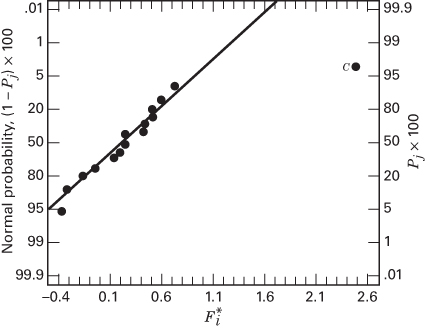

## 8.3 The One-Quarter Fraction of the $2^{k}$ Design

For a moderately large number of factors, smaller fractions of the $2^{k}$ design are frequently useful. Consider a one-quarter fraction of the $2^{k}$ design. This design contains $2^{k-2}$ runs and is usually called a $2^{k-2}$ fractional factorial.

The $2^{k-2}$ design may be constructed by first writing down a basic design consisting of the runs associated with a full factorial in k-2 factors and then associating the two additional columns with appropriately chosen interactions involving the first k-2 factors. Thus, a one-quarter fraction of the $2^{k}$ design has two generators. If P and Q represent the generators chosen, then I=P and I=Q are called the generating relations for the design. The signs of P and Q (either + or -) determine which one of the one-quarter fractions is produced. All four fractions associated with the choice of generators $\pm P$ and $\pm Q$ are members of the same family. The fraction for which both P and Q are positive is the principal fraction.

The complete defining relation for the design consists of all the columns that are equal to the identity column I. These will consist of P, Q, and their generalized interaction PQ; that is, the defining relation is $I = P = Q = PQ$ . We call the elements P, Q, and PQ in the defining relation words. The aliases of any effect are produced by the multiplication of the column for that effect by each word in the defining relation. Clearly, each effect has three aliases. The experimenter should be careful in choosing the generators so that potentially important effects are not aliased with each other.

As an example, consider the $2^{6-2}$ design. Suppose we choose I = ABCE and I = BCDF as the design generators. Now the generalized interaction of the generators ABCE and BCDF is ADEF; therefore, the complete defining relation for this design is

$$
I = A B C E = B C D F = A D E F
$$

TABLE 8.8

Alias Structure for the $2_{\mathrm{IV}}^{6 - 2}$ Design with $I = ABCE = BCDF = ADEF$

$$
A = B C E = D E F = A B C D F
$$

$$
A B = C E = A C D F = B D E F
$$

$$
B = A C E = C D F = A B D E F
$$

$$
A C = B E = A B D F = C D E F
$$

$$
C = A B E = B D F = A C D E F
$$

$$
A D = E F = B C D E = A B C F
$$

$$
D = B C F = A E F = A B C D E
$$

$$
A E = B C = D F = A B C D E F
$$

$$
E = A B C = A D F = B C D E F
$$

$$
A F = D E = B C E F = A B C D
$$

$$
F = B C D = A D E = A B C E F
$$

$$
B D = C F = A C D E = A B E F
$$

$$
B F = C D = A C E F = A B D E
$$

$$
A B D = C D E = A C F = B E F
$$

$$
A C D = B D E = A B F = C E F
$$

Consequently, this is a resolution IV design. To find the aliases of any effect (e.g., A), multiply that effect by each word in the defining relation. For A, this produces

$$
A = B C E = A B C D F = D E F
$$

It is easy to verify that every main effect is aliased by three- and five-factor interactions, whereas two-factor interactions are aliased with each other and with higher order interactions. Thus, when we estimate A, for example, we are really estimating $A + BCE + DEF + ABCDF$ . The complete alias structure of this design is shown in Table 8.8. If three-factor and higher interactions are negligible, this design gives clear estimates of the main effects.

To construct the design, first write down the basic design, which consists of the 16 runs for a full $2^{6-2} = 2^{4}$ design in A, B, C, and D. Then the two factors E and F are added by associating their plus and minus levels with the plus and minus signs of the interactions ABC and BCD, respectively. This procedure is shown in Table 8.9.

Another way to construct this design is to derive the four blocks of the $2^{6}$ design with ABCE and BCDF confounded and then choose the block with treatment combinations that are positive on ABCE and BCDF. This would be a $2^{6-2}$ fractional factorial with generating relations I = ABCE and I = BCDF, and because both generators ABCE and BCDF are positive, this is the principal fraction.

There are, of course, three alternate fractions of this particular $2_{IV}^{6-2}$ design. They are the fractions with generating relationships I = ABCE and I = -BCDF; I = -ABCE and I = BCDF; and I = -ABCE and I = -BCDF. These fractions may be easily constructed by the method shown in Table 8.9. For example, if we wish to find the fraction for which I = ABCE and I = -BCDF, then in the last column of Table 8.9, we set F = -BCD, and the column of levels for factor F becomes

$$
+ + - - - - + + - - + + + + - -
$$

The complete defining relation for this alternate fraction is $I = ABCE = -BCDF = -ADEF$ . Certain signs in the alias structure in Table 8.9 are now changed; for instance, the aliases of $A$ are $A = BCE = -DEF = -ABCDF$ . Thus, the linear combination of the observations [A] actually estimates $A + BCE - DEF - ABCDF$ .

Finally, note that the $2_{IV}^{6-2}$ fractional factorial will project into a single replicate of a $2^{4}$ design in any subset of four factors that is not a word in the defining relation. It also collapses to a replicated one-half fraction of a $2^{4}$ in any subset of four factors that is a word in the defining relation. Thus, the design in Table 8.9 becomes two replicates of a $2^{4-1}$ in the factors ABCE, BCDF, and ADEF, because these are the words in the defining relation. There are 12 other combinations of the six factors, such as ABCD, ABCF, for which the design projects to a single replicate of the $2^{4}$ . This design also collapses to two replicates of a $2^{3}$ in any subset of three of the six factors or four replicates of a $2^{2}$ in any subset of two factors.

■ TABLE 8.9
Construction of the $2^{6-2}_{IV}$ Design with the Generators I = ABCE and I = BCDF

<table><tr><td rowspan="2">Run</td><td colspan="5">Basic Design</td><td rowspan="2">E=ABC</td><td rowspan="2">F=BCD</td></tr><tr><td>A</td><td>B</td><td>C</td><td>D</td><td></td></tr><tr><td>1</td><td>-</td><td>-</td><td>-</td><td>-</td><td>-</td><td>-</td><td>-</td></tr><tr><td>2</td><td>+</td><td>-</td><td>-</td><td>-</td><td>-</td><td>+</td><td>-</td></tr><tr><td>3</td><td>-</td><td>+</td><td>-</td><td>-</td><td>-</td><td>+</td><td>+</td></tr><tr><td>4</td><td>+</td><td>+</td><td>-</td><td>-</td><td>-</td><td>-</td><td>+</td></tr><tr><td>5</td><td>-</td><td>-</td><td>+</td><td>-</td><td>-</td><td>+</td><td>+</td></tr><tr><td>6</td><td>+</td><td>-</td><td>+</td><td>-</td><td>-</td><td>-</td><td>+</td></tr><tr><td>7</td><td>-</td><td>+</td><td>+</td><td>-</td><td>-</td><td>-</td><td>-</td></tr><tr><td>8</td><td>+</td><td>+</td><td>+</td><td>-</td><td>-</td><td>+</td><td>-</td></tr><tr><td>9</td><td>-</td><td>-</td><td>-</td><td>+</td><td>-</td><td>-</td><td>+</td></tr><tr><td>10</td><td>+</td><td>-</td><td>-</td><td>+</td><td>+</td><td>+</td><td>+</td></tr><tr><td>11</td><td>-</td><td>+</td><td>-</td><td>+</td><td>+</td><td>+</td><td>-</td></tr><tr><td>12</td><td>+</td><td>+</td><td>-</td><td>+</td><td>-</td><td>-</td><td>-</td></tr><tr><td>13</td><td>-</td><td>-</td><td>+</td><td>+</td><td>+</td><td>+</td><td>-</td></tr><tr><td>14</td><td>+</td><td>-</td><td>+</td><td>+</td><td>-</td><td>-</td><td>-</td></tr><tr><td>15</td><td>-</td><td>+</td><td>+</td><td>+</td><td>-</td><td>-</td><td>+</td></tr><tr><td>16</td><td>+</td><td>+</td><td>+</td><td>+</td><td>+</td><td>+</td><td>+</td></tr></table>

In general, any $2^{k-2}$ fractional factorial design can be collapsed into either a full factorial or a fractional factorial in some subset of $r \leq k - 2$ of the original factors. Those subsets of variables that form full factorials are not words in the complete defining relation.

## EXAMPLE 8.4

Parts manufactured in an injection molding process are showing excessive shrinkage. This is causing problems in assembly operations downstream from the injection molding area. A quality improvement team has decided to use a designed experiment to study the injection molding process so that shrinkage can be reduced. The team decides to investigate six factors—mold temperature (A), screw speed (B), holding time (C), cycle time (D), gate size (E), and holding pressure (F)—each at two levels, with the objective of learning how each factor affects shrinkage and also something about how the factors interact.

The team decides to use the 16-run two-level fractional factorial design in Table 8.9. The design is shown again in Table 8.10, along with the observed shrinkage ( $\times$ 10) for the test part produced at each of the 16 runs in the design. Table 8.11 shows the effect estimates, sums of squares, and the regression coefficients for this experiment.

■ TABLE 8.10
A $2^{6-2}_{IV}$ Design for the Injection Molding Experiment in Example 8.4

<table><tr><td rowspan="2">Run</td><td colspan="4">Basic Design</td><td rowspan="2">E=ABC</td><td rowspan="2">F=BCD</td><td rowspan="2">Observed Shrinkage (×10)</td><td rowspan="2"></td></tr><tr><td>A</td><td>B</td><td>C</td><td>D</td></tr><tr><td>1</td><td>-</td><td>-</td><td>-</td><td>-</td><td>-</td><td>-</td><td>6</td><td>(1)</td></tr><tr><td>2</td><td>+</td><td>-</td><td>-</td><td>-</td><td>+</td><td>-</td><td>10</td><td>ae</td></tr><tr><td>3</td><td>-</td><td>+</td><td>-</td><td>-</td><td>+</td><td>+</td><td>32</td><td>bef</td></tr><tr><td>4</td><td>+</td><td>+</td><td>-</td><td>-</td><td>-</td><td>+</td><td>60</td><td>abf</td></tr><tr><td>5</td><td>-</td><td>-</td><td>+</td><td>-</td><td>+</td><td>+</td><td>4</td><td>cef</td></tr><tr><td>6</td><td>+</td><td>-</td><td>+</td><td>-</td><td>-</td><td>+</td><td>15</td><td>acf</td></tr><tr><td>7</td><td>-</td><td>+</td><td>+</td><td>-</td><td>-</td><td>-</td><td>26</td><td>bc</td></tr><tr><td>8</td><td>+</td><td>+</td><td>+</td><td>-</td><td>+</td><td>-</td><td>60</td><td>abce</td></tr><tr><td>9</td><td>-</td><td>-</td><td>-</td><td>+</td><td>-</td><td>+</td><td>8</td><td>df</td></tr><tr><td>10</td><td>+</td><td>-</td><td>-</td><td>+</td><td>+</td><td>+</td><td>12</td><td>adef</td></tr><tr><td>11</td><td>-</td><td>+</td><td>-</td><td>+</td><td>+</td><td>-</td><td>34</td><td>bde</td></tr><tr><td>12</td><td>+</td><td>+</td><td>-</td><td>+</td><td>-</td><td>-</td><td>60</td><td>abd</td></tr><tr><td>13</td><td>-</td><td>-</td><td>+</td><td>+</td><td>+</td><td>-</td><td>16</td><td>cde</td></tr><tr><td>14</td><td>+</td><td>-</td><td>+</td><td>+</td><td>-</td><td>-</td><td>5</td><td>acd</td></tr><tr><td>15</td><td>-</td><td>+</td><td>+</td><td>+</td><td>-</td><td>+</td><td>37</td><td>bcdf</td></tr><tr><td>16</td><td>+</td><td>+</td><td>+</td><td>+</td><td>+</td><td>+</td><td>52</td><td>abcdef</td></tr></table>

TABLE 8.11  
Effects, Sums of Squares, and Regression Coefficients for Example 8.4

<table><tr><td>Variable</td><td>Name</td><td>-1 Level</td><td>+1 Level</td></tr><tr><td>A</td><td>Mold temperature</td><td>-1.000</td><td>1.000</td></tr><tr><td>B</td><td>Screw speed</td><td>-1.000</td><td>1.000</td></tr><tr><td>C</td><td>Holding time</td><td>-1.000</td><td>1.000</td></tr><tr><td>D</td><td>Cycle time</td><td>-1.000</td><td>1.000</td></tr><tr><td>E</td><td>Gate size</td><td>-1.000</td><td>1.000</td></tr><tr><td>F</td><td>Hold pressure</td><td>-1.000</td><td>1.000</td></tr><tr><td>Variablea</td><td>Regression Coefficient</td><td>Estimated Effect</td><td>Sum of Squares</td></tr><tr><td>Overall average</td><td>27.3125</td><td></td><td></td></tr><tr><td>A</td><td>6.9375</td><td>13.8750</td><td>770.062</td></tr><tr><td>B</td><td>17.8125</td><td>35.6250</td><td>5076.562</td></tr><tr><td>C</td><td>-0.4375</td><td>-0.8750</td><td>3.063</td></tr><tr><td>D</td><td>0.6875</td><td>1.3750</td><td>7.563</td></tr><tr><td>E</td><td>0.1875</td><td>0.3750</td><td>0.563</td></tr><tr><td>F</td><td>0.1875</td><td>0.3750</td><td>0.563</td></tr><tr><td>Variablea</td><td>Regression Coefficient</td><td>Estimated Effect</td><td>Sum of Squares</td></tr><tr><td>AB + CE</td><td>5.9375</td><td>11.8750</td><td>564.063</td></tr><tr><td>AC + BE</td><td>-0.8125</td><td>-1.6250</td><td>10.562</td></tr><tr><td>AD + EF</td><td>-2.6875</td><td>-5.3750</td><td>115.562</td></tr><tr><td>AE + BC + DF</td><td>-0.9375</td><td>-1.8750</td><td>14.063</td></tr><tr><td>AF + DE</td><td>0.3125</td><td>0.6250</td><td>1.563</td></tr><tr><td>BD + CF</td><td>-0.0625</td><td>-0.1250</td><td>0.063</td></tr><tr><td>BF + CD</td><td>-0.0625</td><td>-0.1250</td><td>0.063</td></tr><tr><td>ABD</td><td>0.0625</td><td>0.1250</td><td>0.063</td></tr><tr><td>ABF</td><td>-2.4375</td><td>-4.8750</td><td>95.063</td></tr></table>

$^{a}$ Only main effects and two-factor interactions.

A normal probability plot of the effect estimates from this experiment is shown in Figure 8.12. The only large effects are A (mold temperature), B (screw speed), and the AB interaction. In light of the alias relationships in Table 8.8, it seems reasonable to adopt these conclusions tentatively. The plot of the AB interaction in Figure 8.13 shows that the process is very insensitive to temperature if the screw speed is at the low level but very sensitive to temperature if the screw speed is at the high level. With the screw speed at the low level, the process should produce an average shrinkage of around 10 percent regardless of the temperature level chosen.

  
■ FIGURE 8.12 Normal probability plot of effects for Example 8.4

  
■ FIGURE 8.13 Plot of AB (mold temperature-screw speed) interaction for Example 8.4

Based on this initial analysis, the team decides to set both the mold temperature and the screw speed at the low level. This set of conditions will reduce the mean shrinkage of parts to around 10 percent. However, the variability in shrinkage from part to part is still a potential problem. In effect, the mean shrinkage can be adequately reduced by the above modifications; however, the part-to-part variability in shrinkage over a production run could still cause problems in assembly. One way to address this issue is to see if any of the process factors affect the variability in parts shrinkage.

  
■ FIGURE 8.14 Normal probability plot of residuals for Example 8.4

Figure 8.14 presents the normal probability plot of the residuals. This plot appears satisfactory. The plots of residuals versus each factor were then constructed. One of these plots, that for residuals versus factor C (holding time), is shown in Figure 8.15. The plot reveals that there is much less scatter in the residuals at the low holding time than at the high holding time. These residuals were obtained in the usual way from a model for predicted shrinkage:

$$
\begin{array}{r l} & {\hat {y} = \hat {\beta} _ {0} + \hat {\beta} _ {1} x _ {1} + \hat {\beta} _ {2} x _ {2} + \hat {\beta} _ {1 2} x _ {1} x _ {2}} \\ & {\quad = 2 7. 3 1 2 5 + 6. 9 3 7 5 x _ {1} + 1 7. 8 1 2 5 x _ {2} + 5. 9 3 7 5 x _ {1} x _ {2}} \end{array}
$$

where $x_{1}, x_{2}$ , and $x_{1}x_{2}$ are coded variables that correspond to the factors A and B and the AB interaction. The residuals are then

$$
e = y - \hat {y}
$$

The regression model used to produce the residuals essentially removes the location effects of A, B, and AB from the data; the residuals therefore contain information about unexplained variability. Figure 8.15 indicates that there is a pattern in the variability and that the variability in the shrinkage of parts may be smaller when the holding time is at the low level. (Please recall that we observed in Chapter 6 that residuals only convey information about dispersion effects when the location or mean model is correct.)

This is further amplified by the analysis of residuals shown in Table 8.12. In this table, the residuals are arranged at the low $(-)$ and high $(+)$ levels of each factor, and the standard deviations of the residuals at the low and high levels of each factor have been calculated. Note that the standard deviation of the residuals with $C$ at the low level $[S(C^{-}) = 1.63]$ is considerably smaller than the standard deviation of the residuals with $C$ at the high level $[S(C^{+}) = 5.70]$ .

  
■ FIGURE 8.15 Residuals versus holding time (C) for Example 8.4

The bottom line of Table 8.12 presents the statistic

$$
F _ {i} ^ {*} = \ln \frac {S ^ {2} (i ^ {+})}{S ^ {2} (i ^ {-})}
$$

Recall that if the variances of the residuals at the high (+) and low (−) levels of factor i are equal, then this ratio is approximately normally distributed with mean zero, and it can be used to judge the difference in the response variability at the two levels of factor i. Because the ratio $F_{C}^{*}$ is relatively large, we would conclude that the apparent dispersion or variability effect observed in Figure 8.15 is real. Thus, setting the holding time at its low level would contribute to reducing the variability in shrinkage from part to part during a production run. Figure 8.16 presents a normal probability plot of the $F_{i}^{*}$ values in Table 8.12; this also indicates that factor C has a large dispersion effect.

Figure 8.17 shows the data from this experiment projected onto a cube in the factors A, B, and C. The average observed shrinkage and the range of observed shrinkage are shown at each corner of the cube. From inspection of this figure, we see that running the process with the screw speed (B) at the low level is the key to reducing average parts shrinkage. If B is low, virtually any combination of temperature (A) and holding time (C) will result in low values of average parts shrinkage. However, from examining the ranges of the shrinkage values at each corner of the cube, it is immediately clear that setting the holding time (C) at the low level is the only reasonable choice if we wish to keep the part-to-part variability in shrinkage low during a production run.

$$
\begin{array} { c c c c c c c c c c c c c c c c c } \text {   S ( i ^ { + } ) } & 3 . 8 0 & 4 . 0 1 & 4 . 3 3 & 5 . 7 0 & 3 . 6 8 & 3 . 8 5 & 4 . 1 7 & 4 . 6 4 & 3 . 3 9 & 4 . 0 1 & 4 . 7 2 & 4 . 7 1 & 3 . 5 0 & 3 . 8 8 & 4 . 8 7 \\ S ( i ^ { - } ) & 4 . 6 0 & 4 . 4 1 & 4 . 1 0 & 1 . 6 3 & 4 . 5 3 & 4 . 3 3 & 4 . 2 5 & 3 . 5 9 & 2 . 7 5 & 4 . 4 1 & 3 . 6 4 & 3 . 6 5 & 3 . 1 2 & 4 . 5 2 & 3 . 4 0 \\ F _ { i } ^ { * } & - 0 . 3 8 & - 0 . 1 9 & 0 . 1 1 & 2 . 5 0 & - 0 . 4 2 & - 0 . 2 3 & - 0 . 0 4 & 0 . 5 1 & 0 . 4 2 & - 0 . 1 9 & 0 . 5 2 & 0 . 5 1 & 0 . 2 3 & - 0 . 3 1 & 0 . 7 2 \\ \hline \end{array}
$$

■ FIGURE 8.16 Normal probability plot of the dispersion effects $F_{i}^{*}$ for Example 8.4

■ FIGURE 8.17 Average shrinkage and range of shrinkage in factors A, B, and C for Example 8.4  
