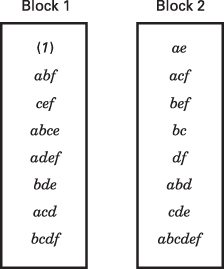
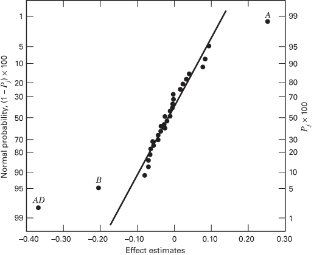
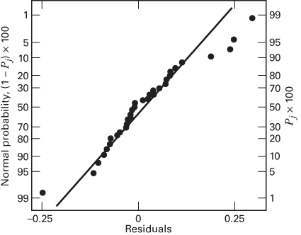
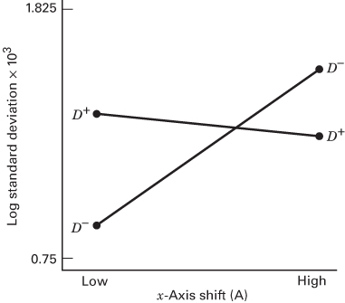
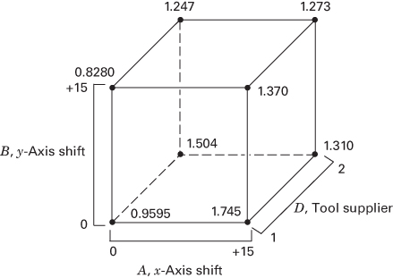

# 8.4 一般的 $2^{k-p}$ 分式因子设计

## 8.4.1 选择设计

含 $2^{k-p}$ 次试验的 $2^{k}$ 分式因子设计称为 $2^{k}$ 设计的 $1/2^{p}$ 分式，或更简单地称为 $2^{k-p}$ 分式因子设计。这类设计要求选择 $p$ 个相互独立的生成元。该设计的定义关系由最初选定的 $p$ 个生成元及其 $2^{p}-p-1$ 个广义交互作用构成。本节讨论这类设计的构造与分析。

别名结构可以通过把每个效应列乘以定义关系而得到。在选择生成元时应加以留心，以免潜在感兴趣的效应之间互为别名。每个效应都有 $2^{p}-1$ 个别名。对于中等偏大的 $k$ 值，我们通常假定高阶交互作用（比如三阶或四阶及更高阶）可以忽略，这会使别名结构大大简化。

为 $2^{k-p}$ 分式因子设计选择 $p$ 个生成元时，重要的是要使我们得到尽可能好的别名关系。一个合理的准则是：选择使所得 $2^{k-p}$ 设计的分辨度尽可能高的生成元。为说明这一点，考虑表 8.9 中的 $2_{IV}^{6-2}$ 设计，其中我们取生成元 $E=ABC$ 和 $F=BCD$，从而得到一个分辨度 IV 的设计。这是分辨度最高的设计。如果我们取 $E=ABC$ 和 $F=ABCD$，则完整定义关系会变成 $I=ABCE=ABCDF=DEF$，该设计的分辨度就只有 III 了。显然这是一个较差的选择，因为它不必要地牺牲了关于交互作用的信息。

有时仅靠分辨度还不足以区分不同设计。例如，考虑表 8.13 中的三个 $2_{\mathrm{IV}}^{7-2}$ 设计。这些设计的分辨度都是 IV，但就两因子交互作用而言，它们的别名结构相当不同（我们已假定三因子及更高阶交互作用可以忽略）。显然，设计 A 的别名最多，设计 C 最少，所以对 $2_{\mathrm{IV}}^{7-2}$ 而言设计 C 是最佳选择。

**表 8.13 $2_{\mathrm{IV}}^{7-2}$ 设计的三种生成元选择**

| 设计 A 生成元：$F = ABC$，$G = BCD$；$I = ABCF = BCDG = ADFG$ | 设计 B 生成元：$F = ABC$，$G = ADE$；$I = ABCF = ADEG = BCDEFG$ | 设计 C 生成元：$F = ABCD$，$G = ABDE$；$I = ABCDF = ABDEG = CEFG$ |
| --- | --- | --- |
| 别名（两因子交互作用） | 别名（两因子交互作用） | 别名（两因子交互作用） |
| $AB = CF$ | $AB = CF$ | $CE = FG$ |
| $AC = BF$ | $AC = BF$ | $CF = EG$ |
| $AD = FG$ | $AD = EG$ | $CG = EF$ |
| $AG = DF$ | $AE = DG$ |  |
| $BD = CG$ | $AF = BC$ |  |
| $BG = CD$ | $AG = DE$ |  |
| $AF = BC = DG$ |  |  |

设计 A 中三个字的长度都是 4，即**字长模式**（word length pattern）为 $\{4,4,4\}$。设计 B 为 $\{4,4,6\}$，设计 C 为 $\{4,5,5\}$。注意设计 C 的定义关系中只有一个四字母字，而其他设计有两个或三个。因此，设计 C 使定义关系中长度最短的字的个数达到最小。我们把这样的设计称为**最小偏差设计**（minimum aberration design）。在分辨度为 $R$ 的设计中使偏差最小，可以保证该设计中与 $R-1$ 阶交互作用互为别名的主效应个数最少、与 $R-2$ 阶交互作用互为别名的两因子交互作用个数最少，依此类推。更多细节参见 Fries 和 Hunter（1980）。

**表 8.14 $2^{k-p}$ 分式因子设计选编**

| 因子数 $k$ | 分式 | 试验次数 | 设计生成元 | 因子数 $k$ | 分式 | 试验次数 | 设计生成元 | 因子数 $k$ | 分式 | 试验次数 | 设计生成元 |
| --- | --- | --- | --- | --- | --- | --- | --- | --- | --- | --- | --- |
| 3 | $2^{3-1}_{\text{III}}$ | 4 | $C = \pm AB$ |  | $2^{9-5}_{\text{III}}$ | 16 | $E = \pm ABC$ |  |  |  | $L = \pm AC$ |
| 4 | $2^{4-1}_{\text{IV}}$ | 8 | $D = \pm ABC$ |  |  |  | $F = \pm BCD$ | 12 | $2^{12-8}_{\text{III}}$ | 16 | $E = \pm ABC$ |
| 5 | $2^{5-1}_{\text{V}}$ | 16 | $E = \pm ABCD$ |  |  |  | $G = \pm ACD$ |  |  |  | $F = \pm ABD$ |
|  | $2^{5-2}_{\text{III}}$ | 8 | $D = \pm AB$ |  |  |  | $H = \pm ABD$ |  |  |  | $G = \pm ACD$ |
|  |  |  | $E = \pm AC$ |  |  |  | $J = \pm ABCD$ |  |  |  | $H = \pm BCD$ |
| 6 | $2^{6-1}_{\text{VI}}$ | 32 | $F = \pm ABCDE$ | 10 | $2^{10-3}_{\text{V}}$ | 128 | $H = \pm ABCG$ |  |  |  | $J = \pm ABCD$ |
|  | $2^{6-2}_{\text{IV}}$ | 16 | $E = \pm ABC$ |  |  |  | $J = \pm BCDE$ |  |  |  | $K = \pm AB$ |
|  |  |  | $F = \pm BCD$ |  |  |  | $K = \pm ACDF$ |  |  |  | $L = \pm AC$ |
|  | $2^{6-3}_{\text{III}}$ | 8 | $D = \pm AB$ |  | $2^{10-4}_{\text{IV}}$ | 64 | $G = \pm BCDF$ |  |  |  | $M = \pm AD$ |
|  |  |  | $E = \pm AC$ |  |  |  | $H = \pm ACDF$ | 13 | $2^{13-9}_{\text{III}}$ | 16 | $E = \pm ABC$ |
|  |  |  | $F = \pm BC$ |  |  |  | $J = \pm ABDE$ |  |  |  | $F = \pm ABD$ |
| 7 | $2^{7-1}_{\text{VII}}$ | 64 | $G = \pm ABCDEF$ |  |  |  | $K = \pm ABCE$ |  |  |  | $G = \pm ACD$ |
|  | $2^{7-2}_{\text{IV}}$ | 32 | $F = \pm ABCD$ |  | $2^{10-5}_{\text{IV}}$ | 32 | $F = \pm ABCD$ |  |  |  | $H = \pm BCD$ |
|  |  |  | $G = \pm ABDE$ |  |  |  | $G = \pm ABCE$ |  |  |  | $J = \pm ABCD$ |
|  | $2^{7-3}_{\text{IV}}$ | 16 | $E = \pm ABC$ |  |  |  | $H = \pm ABDE$ |  |  |  | $K = \pm AB$ |
|  |  |  | $F = \pm BCD$ |  |  |  | $J = \pm ACDE$ |  |  |  | $L = \pm AC$ |
|  |  |  | $G = \pm ACD$ |  |  |  | $K = \pm BCDE$ |  |  |  | $M = \pm AD$ |
|  | $2^{7-4}_{\text{III}}$ | 8 | $D = \pm AB$ |  | $2^{10-6}_{\text{III}}$ | 16 | $E = \pm ABC$ |  |  |  | $N = \pm BC$ |
|  |  |  | $E = \pm AC$ |  |  |  | $F = \pm BCD$ | 14 | $2^{14-10}_{\text{III}}$ | 16 | $E = \pm ABC$ |
|  |  |  | $F = \pm BC$ |  |  |  | $G = \pm ACD$ |  |  |  | $F = \pm ABD$ |
|  |  |  | $G = \pm ABC$ |  |  |  | $H = \pm ABD$ |  |  |  | $G = \pm ACD$ |
| 8 | $2^{8-2}_{\text{V}}$ | 64 | $G = \pm ABCD$ |  |  |  | $J = \pm ABCD$ |  |  |  | $H = \pm BCD$ |
|  |  |  | $H = \pm ABEF$ |  |  |  | $K = \pm AB$ |  |  |  | $J = \pm ABCD$ |
|  | $2^{8-3}_{\text{IV}}$ | 32 | $F = \pm ABC$ | 11 | $2^{11-5}_{\text{IV}}$ | 64 | $G = \pm CDE$ |  |  |  | $K = \pm AB$ |
|  |  |  | $G = \pm ABD$ |  |  |  | $H = \pm ABCD$ |  |  |  | $L = \pm AC$ |
|  |  |  | $H = \pm BCDE$ |  |  |  | $J = \pm ABF$ |  |  |  | $M = \pm AD$ |
|  | $2^{8-4}_{\text{IV}}$ | 16 | $E = \pm BCD$ |  |  |  | $K = \pm BDEF$ |  |  |  | $N = \pm BC$ |
|  |  |  | $F = \pm ACD$ |  |  |  | $L = \pm ADEF$ |  |  |  | $O = \pm BD$ |
|  |  |  | $G = \pm ABC$ |  | $2^{11-6}_{\text{IV}}$ | 32 | $F = \pm ABC$ | 15 | $2^{15-11}_{\text{III}}$ | 16 | $E = \pm ABC$ |
|  |  |  | $H = \pm ABD$ |  |  |  | $G = \pm BCD$ |  |  |  | $F = \pm ABD$ |
| 9 | $2^{9-2}_{\text{VI}}$ | 128 | $H = \pm ACDFG$ |  |  |  | $H = \pm CDE$ |  |  |  | $G = \pm ACD$ |
|  |  |  | $J = \pm BCEFG$ |  |  |  | $J = \pm ACD$ |  |  |  | $H = \pm BCD$ |
|  | $2^{9-3}_{\text{IV}}$ | 64 | $G = \pm ABCD$ |  |  |  | $K = \pm ADE$ |  |  |  | $J = \pm ABCD$ |
|  |  |  | $H = \pm ACEF$ |  |  |  | $L = \pm BDE$ |  |  |  | $K = \pm AB$ |
|  |  |  | $J = \pm CDEF$ |  | $2^{11-7}_{\text{III}}$ | 16 | $E = \pm ABC$ |  |  |  | $L = \pm AC$ |
|  | $2^{9-4}_{\text{IV}}$ | 32 | $F = \pm BCDE$ |  |  |  | $F = \pm BCD$ |  |  |  | $M = \pm AD$ |
|  |  |  | $G = \pm ACDE$ |  |  |  | $G = \pm ACD$ |  |  |  | $N = \pm BC$ |
|  |  |  | $H = \pm ABDE$ |  |  |  | $H = \pm ABD$ |  |  |  | $O = \pm BD$ |
|  |  |  | $J = \pm ABCE$ |  |  |  | $J = \pm ABCD$ |  |  |  | $P = \pm CD$ |
|  |  |  |  |  |  |  | $K = \pm AB$ |  |  |  |  |

表 8.14 给出 $k \leq 15$ 个因子、最多 $n \leq 128$ 次试验的一批 $2^{k-p}$ 分式因子设计。该表中建议的生成元将得到分辨度尽可能高的设计，它们同时也是最小偏差设计。

表 8.14 中所有 $n \leq 64$ 的设计的别名关系见附录表 VIII(a–w)。该附录表中所列的别名关系侧重于主效应以及两因子和三因子交互作用，并给出每个设计的完整定义关系。有了这张附录表，就非常容易选择一个分辨度足够高的设计，以确保任何潜在感兴趣的交互作用都能被估计出来。

## 例 8.5

为说明表 8.14 的用法，假设我们有七个因子，并希望估计这七个主效应，同时希望对两因子交互作用有所了解。我们愿意假定三因子及更高阶交互作用可以忽略。这些信息提示分辨度 IV 的设计是合适的。

表 8.14 表明有两个分辨度 IV 的分式可用：32 次试验的 $2_{\mathrm{IV}}^{7-2}$ 和 16 次试验的 $2_{\mathrm{IV}}^{7-3}$。附录表 VIII 给出这两个设计的完整别名关系。$2_{\mathrm{IV}}^{7-3}$ 的 16 次试验设计的别名关系在附录表 VIII(i) 中。注意，全部七个主效应都与三因子交互作用互为别名，而两因子交互作用都是三个一组地互为别名。因此，该设计能满足我们的目标：它既能估计主效应，又能对两因子交互作用提供一定了解。

没有必要去运行需要 32 次试验的 $2_{IV}^{7-2}$ 设计。附录表 VIII(j) 表明，该设计可以估计全部七个主效应，而且 21 个两因子交互作用中有 15 个也可以唯一地估计出来。（回忆一下，三因子及更高阶交互作用可以忽略。）这大概是关于交互作用高于必要程度的信息。完整的 $2_{IV}^{7-3}$ 设计见表 8.15。注意，它的构造方法是：先以 $A$、$B$、$C$、$D$ 的 16 次试验的 $2^{4}$ 设计作为基本设计，然后加入三列 $E=ABC$、$F=BCD$ 和 $G=ACD$。生成元为 $I=ABCE$、$I=BCDF$ 和 $I=ACDG$（见表 8.14）。完整定义关系为 $I=ABCE=BCDF=ADEF=ACDG=BDEG=CEFG=ABFG$。

**表 8.15 $2^{7-3}_{IV}$ 分式因子设计**

| 试验 | 基本设计 |  |  |  | $E = ABC$ | $F = BCD$ | $G = ACD$ |
| --- | --- | --- | --- | --- | --- | --- | --- |
|  | A | B | C | D |  |  |  |
| 1 | − | − | − | − | − | − | − |
| 2 | + | − | − | − | + | − | + |
| 3 | − | + | − | − | + | + | − |
| 4 | + | + | − | − | − | + | + |
| 5 | − | − | + | − | + | + | + |
| 6 | + | − | + | − | − | + | − |
| 7 | − | + | + | − | − | − | + |
| 8 | + | + | + | − | + | − | − |
| 9 | − | − | − | + | − | + | + |
| 10 | + | − | − | + | + | + | − |
| 11 | − | + | − | + | + | − | + |
| 12 | + | + | − | + | − | − | − |
| 13 | − | − | + | + | + | − | − |
| 14 | + | − | + | + | − | − | + |
| 15 | − | + | + | + | − | + | − |
| 16 | + | + | + | + | + | + | + |

## 8.4.2 $2^{k-p}$ 分式因子设计的分析

有许多计算机程序可以用来分析 $2^{k-p}$ 分式因子设计。例如 Design-Expert、JMP 和 Minitab 都具备这种能力。

该设计也可以从基本原理出发来分析；第 $i$ 个效应由下式估计：

$$
\mathrm{Effect}_{i} = \frac{2 (\text{Contrast}_{i})}{N} = \frac{\text{Contrast}_{i}}{(N/2)}
$$

其中 $\text{Contrast}_{i}$ 由第 $i$ 列中的正负号求得，$N=2^{k-p}$ 是观测值总数。$2^{k-p}$ 设计只允许估计 $2^{k-p}-1$ 个效应（及其别名）。效应估计的正态概率图和 Lenth 方法是非常有用的分析工具。

**$2^{k-p}$ 分式因子设计的投影。** $2^{k-p}$ 设计在原来 $k$ 个因子中任意满足 $r \leq k-p$ 的 $r$ 个因子的子集上都会坍缩为全因子设计或分式因子设计。给出分式因子设计的那些因子子集，就是完整定义关系中作为字出现的子集。在筛选试验中，当我们一开始就怀疑原来大多数因子的效应都会很小时，这一点特别有用。原来的 $2^{k-p}$ 分式因子设计随后可以投影为比方说在最受关注的因子上的全因子设计。由这类设计得出的结论应视为初步的、有待进一步分析。通常总能找到涉及高阶交互作用的、对数据的其他解释。

作为一个例子，考虑例 8.5 中的 $2_{\mathrm{IV}}^{7-3}$ 设计。这是一个涉及七个因子的 16 次试验设计。它在原来七个因子中任意四个因子的子集上（只要该子集不是定义关系中的字）都会投影为全因子设计。四个因子的子集共有 35 个，其中七个出现在完整定义关系中（见表 8.15）。因此，有 28 个四因子子集会构成 $2^{4}$ 设计。检查表 8.15 就能明显看出的一个组合是 $A$、$B$、$C$ 和 $D$。

为恰当地说明这一投影的有用性，假设我们正在进行一项提高球磨机效率的试验，七个因子如下：

1. 电机转速

2. 增益

3. 进料模式

4. 进料粒度

5. 物料类型

6. 筛网角度

7. 筛网振动水平

我们相当肯定电机转速、进料模式、进料粒度和物料类型会影响效率，而且这些因子之间可能有交互作用。另外三个因子的作用不太清楚，但很可能可以忽略。一个合理的策略是把电机转速、进料模式、进料粒度和物料类型分别安排到表 8.15 的 $A$、$B$、$C$ 和 $D$ 列。增益、筛网角度和筛网振动水平则分别安排到 $E$、$F$ 和 $G$ 列。如果我们的判断正确，"次要变量" $E$、$F$ 和 $G$ 可以忽略，我们就得到了关键过程变量的完整 $2^{4}$ 设计。

## 8.4.3 分式因子设计的区组化

有时一个分式因子设计需要的试验次数多到无法全部在齐性条件下完成。在这类情形下，可以把分式因子设计混杂在区组中。附录表 VIII 给出了表 8.14 中许多分式因子设计的推荐区组安排。这些设计的最小区组大小为八次试验。

为说明一般做法，考虑表 8.10 中定义关系为 $I=ABCE=BCDF=ADEF$ 的 $2_{IV}^{6-2}$ 分式因子设计。这个分式设计含有 16 个处理组合。假设我们希望把设计安排在两个区组中，每个区组八个处理组合。在选择要与区组混杂的交互作用时，我们从附录表 VIII(f) 的别名结构中注意到，有两个只涉及三因子交互作用的别名集。该表建议选择 $ABD$（及其别名）与区组混杂。这样就得到图 8.18 所示的两个区组。注意，主区组中那些处理组合与 $ABD$ 有偶数个公共字母，它们也就是满足 $L=x_{1}+x_{2}+x_{4}=0 \pmod{2}$ 的处理组合。

**图 8.18 混杂 $ABD$ 的 $2_{IV}^{6-2}$ 设计分成两个区组**

## 例 8.6

一台五轴 CNC 机床用于加工喷气涡轮发动机的叶轮。叶片型面是一项重要的质量特性。具体来说，我们关心叶片型面相对工程图纸规定型面的偏差。我们做一次试验来确定哪些机床参数影响型面偏差。设计中选用的八个因子如下：

| 因子 | 低水平（−） | 高水平（+） |
| --- | --- | --- |
| $A$ = x 轴偏移（0.001 英寸） | 0 | 15 |
| $B$ = y 轴偏移（0.001 英寸） | 0 | 15 |
| $C$ = z 轴偏移（0.001 英寸） | 0 | 15 |
| $D$ = 刀具供应商 | 1 | 2 |
| $E$ = a 轴偏移（0.001 度） | 0 | 30 |
| $F$ = 主轴转速（%） | 90 | 110 |
| $G$ = 夹具高度（0.001 英寸） | 0 | 15 |
| $H$ = 进给速率（%） | 90 | 110 |

每个零件上选一片试验叶片送检。型面偏差用三坐标测量机测量，并把实际型面与规定型面之差的**标准差**作为响应变量。

该机床有四个主轴。由于各主轴之间可能存在差异，工艺工程师认为应把主轴当作区组来处理。

工程师们确信三因子及更高阶交互作用不太重要，但他们不愿忽略两因子交互作用。由表 8.14 看，最初有两个设计看似合适：16 次试验的 $2_{\mathrm{IV}}^{8-4}$ 设计和 32 次试验的 $2_{\mathrm{IV}}^{8-3}$ 设计。附录表 VIII(l) 表明，如果采用 16 次试验的设计，两因子交互作用会有相当多的别名。此外，这个设计若安排在四个区组中，就不可避免会有四个两因子交互作用与区组混杂。因此，试验者决定采用分成四个区组的 $2_{\mathrm{IV}}^{8-3}$ 设计。这样会有一个三因子交互作用别名链，以及一个两因子交互作用 $(EH)$ 及其三因子交互作用别名与区组混杂。$EH$ 交互作用是 a 轴偏移与进给速率之间的交互作用，工程师们认为这两个变量之间存在交互作用的可能性相当小。

表 8.16 给出该设计以及所得的响应（以标准差 $\times 10^{3}$ 英寸表示）。由于响应变量是标准差，通常最好先作对数变换再分析。效应估计见表 8.17。图 8.19 是以 $\ln(\text{标准差} \times 10^{3})$ 为响应变量的效应估计正态概率图。只有 $A$ = x 轴偏移、$B$ = y 轴偏移以及涉及 $AD+BG$ 的别名链效应较大。这里 $AD$ 是 x 轴偏移-刀具供应商交互作用，$BG$ 是 y 轴偏移-夹具高度交互作用；由于这两个交互作用互为别名，仅凭当前试验的数据无法把它们分开。又因为这两个交互作用都涉及一个较大的主效应，所以也难以对这种情况套用效应遗传性之类"显而易见"的简化逻辑。如果有某些工程知识或过程知识能对此有所启示，那么或许可以在两个交互作用之间作出选择；否则就需要更多数据来分离这两个效应。（通过增加试验来对分式因子设计去别名、从而分离交互作用的问题，将在 8.6 节和 8.7 节讨论。）

假设过程知识提示适当的交互作用很可能是 $AD$。表 8.18 是含因子 $A$、$B$、$D$ 和 $AD$ 的模型所得的方差分析（纳入因子 $D$ 是为了保持层次性原则）。注意区组效应很小，说明各机床主轴之间差别不大。

图 8.20 是该试验残差的正态概率图。该图提示尾部比正态略重，因此可能还应考虑其他变换。$AD$ 交互作用图见图 8.21。注意，刀具供应商（$D$）和 x 轴偏移的大小（$A$）对叶片型面相对设计规范的变异有深远影响。让 $A$ 处于低水平（偏移 0）并从供应商 1 购买刀具可得到最好的结果。图 8.22 给出该 $2_{IV}^{8-3}$ 设计投影为因子 $A$、$B$ 和 $D$ 的 $2^{3}$ 设计的四次重复。最优的操作条件组合是 $A$ 取低水平（偏移 0）、$B$ 取高水平（偏移 0.015 英寸）、$D$ 取低水平（刀具供应商 1）。

**表 8.16 例 8.6 分成四个区组的 $2^{8-3}$ 设计**

| 试验 | 基本设计 |  |  |  |  | $F = ABC$ | $G = ABD$ | $H = BCDE$ | 区组 | 实际试验顺序 | 标准差（$\times 10^{3}$ 英寸） |
| --- | --- | --- | --- | --- | --- | --- | --- | --- | --- | --- | --- |
|  | A | B | C | D | E |  |  |  |  |  |  |
| 1 | − | − | − | − | − | − | − | + | 3 | 18 | 2.76 |
| 2 | + | − | − | − | − | + | + | + | 2 | 16 | 6.18 |
| 3 | − | + | − | − | − | + | + | − | 4 | 29 | 2.43 |
| 4 | + | + | − | − | − | − | − | − | 1 | 4 | 4.01 |
| 5 | − | − | + | − | − | + | − | − | 1 | 6 | 2.48 |
| 6 | + | − | + | − | − | − | + | − | 4 | 26 | 5.91 |
| 7 | − | + | + | − | − | − | + | + | 2 | 14 | 2.39 |
| 8 | + | + | + | − | − | + | − | + | 3 | 22 | 3.35 |
| 9 | − | − | − | + | − | − | + | − | 1 | 8 | 4.40 |
| 10 | + | − | − | + | − | + | − | − | 4 | 32 | 4.10 |
| 11 | − | + | − | + | − | + | − | + | 2 | 15 | 3.22 |
| 12 | + | + | − | + | − | − | + | + | 3 | 19 | 3.78 |
| 13 | − | − | + | + | − | + | + | + | 3 | 24 | 5.32 |
| 14 | + | − | + | + | − | − | − | + | 2 | 11 | 3.87 |
| 15 | − | + | + | + | − | − | − | − | 4 | 27 | 3.03 |
| 16 | + | + | + | + | − | + | + | − | 1 | 3 | 2.95 |
| 17 | − | − | − | − | + | − | − | − | 2 | 10 | 2.64 |
| 18 | + | − | − | − | + | + | + | − | 3 | 21 | 5.50 |
| 19 | − | + | − | − | + | + | + | + | 1 | 7 | 2.24 |
| 20 | + | + | − | − | + | − | − | + | 4 | 28 | 4.28 |
| 21 | − | − | + | − | + | + | − | + | 4 | 30 | 2.57 |
| 22 | + | − | + | − | + | − | + | + | 1 | 2 | 5.37 |
| 23 | − | + | + | − | + | − | + | − | 3 | 17 | 2.11 |
| 24 | + | + | + | − | + | + | − | − | 2 | 13 | 4.18 |
| 25 | − | − | − | + | + | − | + | + | 4 | 25 | 3.96 |
| 26 | + | − | − | + | + | + | − | + | 1 | 1 | 3.27 |
| 27 | − | + | − | + | + | + | − | − | 3 | 23 | 3.41 |
| 28 | + | + | − | + | + | − | + | − | 2 | 12 | 4.30 |
| 29 | − | − | + | + | + | + | + | − | 2 | 9 | 4.44 |
| 30 | + | − | + | + | + | − | − | − | 3 | 20 | 3.65 |
| 31 | − | + | + | + | + | − | − | + | 1 | 5 | 4.41 |
| 32 | + | + | + | + | + | + | + | + | 4 | 31 | 3.40 |

**表 8.17 例 8.6 的效应估计、回归系数与平方和**

| 变量 | 名称 | −1 水平 | +1 水平 |
| --- | --- | --- | --- |
| A | x 轴偏移 | 0 | 15 |
| B | y 轴偏移 | 0 | 15 |
| C | z 轴偏移 | 0 | 15 |
| D | 刀具供应商 | 1 | 2 |
| E | a 轴偏移 | 0 | 30 |
| F | 主轴转速 | 90 | 110 |
| G | 夹具高度 | 0 | 15 |
| H | 进给速率 | 90 | 110 |

| 变量 | 回归系数 | 效应估计 | 平方和 |
| --- | --- | --- | --- |
| 总平均 | 1.28007 |  |  |
| A | 0.14513 | 0.29026 | 0.674020 |
| B | −0.10027 | −0.20054 | 0.321729 |
| C | −0.01288 | −0.02576 | 0.005310 |
| D | 0.05407 | 0.10813 | 0.093540 |
| E | −2.531E−04 | −5.063E−04 | 2.050E−06 |
| F | −0.01936 | −0.03871 | 0.011988 |
| G | 0.05804 | 0.11608 | 0.107799 |
| H | 0.00708 | 0.01417 | 0.001606 |
| AB + CF + DG | −0.00294 | −0.00588 | 2.767E−04 |
| AC + BF | −0.03103 | −0.06206 | 0.030815 |
| AD + BG | −0.18706 | −0.37412 | 1.119705 |
| AE | 0.00402 | 0.00804 | 5.170E−04 |
| AF + BC | −0.02251 | −0.04502 | 0.016214 |
| AG + BD | 0.02644 | 0.05288 | 0.022370 |
| AH | −0.02521 | −0.05042 | 0.020339 |
| BE | 0.04925 | 0.09851 | 0.077627 |
| BH | 0.00654 | 0.01309 | 0.001371 |
| CD + FG | 0.01726 | 0.03452 | 0.009535 |
| CE | 0.01991 | 0.03982 | 0.012685 |
| CG + DF | −0.00733 | −0.01467 | 0.001721 |
| CH | 0.03040 | 0.06080 | 0.029568 |
| DE | 0.00854 | 0.01708 | 0.002334 |
| DH | 0.00784 | 0.01569 | 0.001969 |
| EF | −0.00904 | −0.01808 | 0.002616 |
| EG | −0.02685 | −0.05371 | 0.023078 |
| EH | −0.01767 | −0.03534 | 0.009993 |
| FH | −0.01404 | −0.02808 | 0.006308 |
| GH | 0.00245 | 0.00489 | 1.914E−04 |
| ABE | 0.01665 | 0.03331 | 0.008874 |
| ABH | −0.00631 | −0.01261 | 0.001273 |
| ACD | −0.02717 | −0.05433 | 0.023617 |

**图 8.19 例 8.6 效应估计的正态概率图**

**表 8.18 例 8.6 的方差分析**

| 变异来源 | 平方和 | 自由度 | 均方 | $F_0$ | $P$ 值 |
| --- | --- | --- | --- | --- | --- |
| A | 0.6740 | 1 | 0.6740 | 39.42 | <0.0001 |
| B | 0.3217 | 1 | 0.3217 | 18.81 | 0.0002 |
| D | 0.0935 | 1 | 0.0935 | 5.47 | 0.0280 |
| AD | 1.1197 | 1 | 1.1197 | 65.48 | <0.0001 |
| 区组 | 0.0201 | 3 | 0.0067 |  |  |
| 误差 | 0.4099 | 24 | 0.0171 |  |  |
| 总计 | 2.6389 | 31 |  |  |  |

**图 8.20 例 8.6 残差的正态概率图**

**图 8.21 例 8.6 的 $AD$ 交互作用图**

**图 8.22 例 8.6 中 $2_{IV}^{8-3}$ 设计投影为因子 $A$、$B$、$D$ 的 $2^{3}$ 设计的四次重复**
