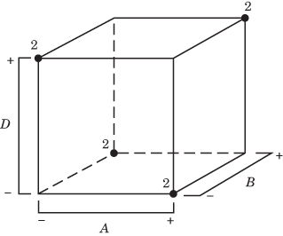

# 8.6 分辨度 III 设计

## 8.6.1 构造分辨度 III 设计

如前所述，分式因子设计的序贯使用非常有用，常常能在试验中带来很大的经济性和效率。这种分式因子设计的应用在纯因子筛选的情形中经常出现，即因子相对较多，但预期只有少数几个重要。分辨度 III 设计在这类情形中非常有用。

可以在仅 $N$ 次试验中构造出考察多达 $k=N-1$ 个因子的分辨度 III 设计，其中 $N$ 是 4 的倍数。这类设计在工业试验中常常有用。$N$ 为 2 的幂的设计可以用本章前面介绍的方法构造，我们先介绍这些。特别重要的是：最多 3 个因子需要 4 次试验、最多 7 个因子需要 8 次试验、最多 15 个因子需要 16 次试验的设计。若 $k=N-1$，则称该分式因子设计是**饱和的**（saturated）。

在四次试验中分析最多三个因子的设计是 8.2 节介绍的 $2_{III}^{3-1}$ 设计。另一个非常有用的饱和分式因子设计是八次试验中研究七个因子的设计，即 $2_{III}^{7-4}$ 设计。它是 $2^{7}$ 的十六分之一分式。它的构造方法是：先写出 $A$、$B$、$C$ 的完整 $2^{3}$ 设计的正负水平作为基本设计，然后按下式把另外四个因子的水平与原来三个因子的交互作用对应起来：$D=AB$、$E=AC$、$F=BC$、$G=ABC$。因此该设计的生成元为 $I=ABD$、$I=ACE$、$I=BCF$ 和 $I=ABCG$。该设计见表 8.19。

该设计的完整定义关系由四个生成元 $ABD$、$ACE$、$BCF$ 和 $ABCG$ 两两相乘、三三相乘、四四相乘得到，即

$$
\begin{array}{r l} & I = AB D = A C E = B C F = AB C G = B C D E = A C D F = C D G \\ & \quad = AB E F = B E G = A F G = D E F = A D E G = C E F G = B D F G = AB C D E F G \end{array}
$$

为求任一效应的别名，只需把该效应与定义关系中的每个字相乘。例如 $B$ 的别名为

$$
\begin{array}{r l} & B = A D = AB C E = C F = A C G = C D E = AB C D F = B C D G = A E F = E G \\ & \quad = AB F G = B D E F = AB D E G = B C E F G = D F G = A C D E F G \end{array}
$$

该设计是十六分之一分式；由于生成元所取符号为正，它是主分式。它也是分辨度 III 设计，因为定义关系中最短的字的字母数为三。这一族中 16 个不同的 $2_{III}^{7-4}$ 设计中的任何一个，都可以用 $I=\pm ABD$、$I=\pm ACE$、$I=\pm BCF$、$I=\pm ABCG$ 的 16 种可能符号组合之一作为生成元来构造。

该设计的七个自由度可用来估计七个主效应。每个效应都有 15 个别名；不过，如果我们假定三因子及更高阶交互作用可以忽略，别名结构就会大大简化。在这一假定下，该设计中与七个主效应相联系的线性组合实际上估计的是主效应与三个两因子交互作用之和：

$$
[ A ] \rightarrow A + B D + C E + F G
$$

$$
[ B ] \rightarrow B + A D + C F + E G
$$

$$
[ C ] \rightarrow C + A E + B F + D G
$$

$$
[ D ] \rightarrow D + AB + C G + E F
$$

$$
[ E ] \rightarrow E + A C + B G + D F
$$

$$
[ F ] \rightarrow F + B C + A G + D E
$$

$$
[ G ] \rightarrow G + C D + B E + A F \tag{8.2}
$$

这些别名可在附录表 VIII(h) 中查到（忽略三因子及更高阶交互作用）。

表 8.19 中饱和的 $2_{III}^{7-4}$ 设计可用来得到在八次试验中研究少于七个因子的分辨度 III 设计。例如，要生成六因子八次试验的设计，只需在表 8.19 中去掉任意一列，比如去掉 $G$ 列。这样就得到表 8.20 所示的设计。

容易验证该设计也是分辨度 III 的；事实上它是 $2^{6}$ 设计的 $2_{III}^{6-3}$，即八分之一分式。$2_{III}^{6-3}$ 设计的定义关系等于原 $2_{III}^{7-4}$ 设计的定义关系中删去所有含字母 $G$ 的字。因此，新设计的定义关系为

$$
I = AB D = A C E = B C F = B C D E = A C D F = AB E F = D E F
$$

一般地，当删去 $d$ 个因子以产生新设计时，新定义关系就是原定义关系中不含任何被删字母的那些字。用这种方法构造设计时，应注意取得尽可能好的安排。如果我们从表 8.19 中删去 $B$、$D$、$F$、$G$ 四列，会得到一个三因子八次试验的设计，但其中的处理组合相当于 $2^{3-1}$ 设计的两次重复。试验者多半更愿意在 $A$、$C$、$E$ 上做完整的 $2^{3}$ 设计。

也可以在 16 次试验中构造考察多达 15 个因子的分辨度 III 设计。这个饱和的 $2_{III}^{15-11}$ 设计可以这样生成：先写出 $A$、$B$、$C$、$D$ 的 $2^{4}$ 设计所对应的 16 个处理组合，然后令 11 个新因子分别等于原来四个因子的两因子、三因子和四因子交互作用。在该设计中，15 个主效应各与七个两因子交互作用互为别名。类似的做法可用于 $2_{III}^{31-26}$ 设计，它允许在 32 次试验中研究多达 31 个因子。

**表 8.19 生成元为 $I = ABD$、$I = ACE$、$I = BCF$ 和 $I = ABCG$ 的 $2_{\mathrm{III}}^{7-4}$ 设计**

| 试验 | 基本设计 |  |  | $D = AB$ | $E = AC$ | $F = BC$ | $G = ABC$ | 处理组合 |
| --- | --- | --- | --- | --- | --- | --- | --- | --- |
|  | A | B | C |  |  |  |  |  |
| 1 | − | − | − | + | + | + | − | $def$ |
| 2 | + | − | − | − | − | + | + | $afg$ |
| 3 | − | + | − | − | + | − | + | $beg$ |
| 4 | + | + | − | + | − | − | − | $abd$ |
| 5 | − | − | + | + | − | − | + | $cdg$ |
| 6 | + | − | + | − | + | − | − | $ace$ |
| 7 | − | + | + | − | − | + | − | $bcf$ |
| 8 | + | + | + | + | + | + | + | $abcdefg$ |

**表 8.20 生成元为 $I = ABD$、$I = ACE$ 和 $I = BCF$ 的 $2_{\mathrm{III}}^{6-3}$ 设计**

| 试验 | 基本设计 |  |  | $D = AB$ | $E = AC$ | $F = BC$ | 处理组合 |
| --- | --- | --- | --- | --- | --- | --- | --- |
|  | A | B | C |  |  |  |  |
| 1 | − | − | − | + | + | + | $def$ |
| 2 | + | − | − | − | − | + | $af$ |
| 3 | − | + | − | − | + | − | $be$ |
| 4 | + | + | − | + | − | − | $abd$ |
| 5 | − | − | + | + | − | − | $cd$ |
| 6 | + | − | + | − | + | − | $ace$ |
| 7 | − | + | + | − | − | + | $bcf$ |
| 8 | + | + | + | + | + | + | $abcdef$ |

## 8.6.2 用折叠分辨度 III 分式分离别名效应

通过把某些符号被反转的分式因子设计组合起来，我们可以系统地分离出潜在感兴趣的效应。这类序贯试验称为原设计的**折叠**（fold over）。任何一个把某个或某些因子的符号反转所得的分式，其别名结构可由原分式的别名结构对相应因子作符号改变而得到。

考虑表 8.19 中的 $2_{III}^{7-4}$ 设计。假设除了这个主分式之外，还做了第二个把因子 $D$ 那一列符号反转的分式设计。也就是说，第二个分式中 $D$ 的一列为

$$
- + + - - + + -
$$

由第一个分式可以估计的效应见式 8.2，而由第二个分式得到

$$
\begin{array}{r l} & {[ A ]^{\prime} \to A - B D + C E + F G} \\ & {[ B ]^{\prime} \to B - A D + C F + E G} \\ & {[ C ]^{\prime} \to C + A E + B F - D G} \\ & {[ D ]^{\prime} \to D - AB - C G - E F} \\ & {[ - D ]^{\prime} \to - D + AB + C G + E F} \\ & {[ E ]^{\prime} \to E + A C + B G - D F} \\ & {[ F ]^{\prime} \to F + B C + A G - D E} \\ & {[ G ]^{\prime} \to G - C D + B E + A F} \end{array} \tag{8.3}
$$

（假定三因子及更高阶交互作用不显著。）现在，由 $\frac{1}{2}([i]+[i]')$ 和 $\frac{1}{2}([i]-[i]')$ 这两个线性组合，我们得到

| $i$ | 由 $\frac{1}{2}([i] + [i]')$ | 由 $\frac{1}{2}([i] - [i]')$ |
| --- | --- | --- |
| A | $A + CE + FG$ | BD |
| B | $B + CF + EG$ | AD |
| C | $C + AE + BF$ | DG |
| D | D | $AB + CG + EF$ |
| E | $E + AC + BG$ | DF |
| F | $F + BC + AG$ | DE |
| G | $G + BE + AF$ | CD |

这样，我们就分离出了 $D$ 的主效应及其全部两因子交互作用。一般地，如果我们给一个分辨度不低于 III 的分式设计再加上一个把单个因子符号反转的分式，那么合并后的设计将给出该因子的主效应及其两因子交互作用的估计。这有时称为**单因子折叠**（single-factor fold over）。

现在假设我们给一个分辨度 III 的分式再加上一个把所有因子符号都反转的第二分式。这类折叠（有时称为**全折叠**或**反射**）会打断所有主效应与其两因子交互作用之间的别名联系。也就是说，我们可以用合并后的设计估计出不受任何两因子交互作用干扰的全部主效应。下面的例子说明全折叠技术。

## 例 8.7

一位人体效能分析师正在做一项研究眼睛聚焦时间的试验，他搭建了一套装置，可以在测试期间控制若干因子。他最初认为重要的因子有：视觉敏锐度或清晰度（$A$）、目标到眼睛的距离（$B$）、目标形状（$C$）、照度水平（$D$）、目标大小（$E$）、目标密度（$F$）以及受试者（$G$）。每个因子考虑两个水平。他怀疑这七个因子中只有少数几个非常重要，而且因子之间的高阶交互作用可以忽略。基于这一假定，该分析师决定做一次筛选试验以识别最重要的因子，然后对它们集中作进一步研究。为筛选这七个因子，他按随机顺序做了表 8.19 中 $2_{III}^{7-4}$ 设计的各个处理组合，得到以毫秒计的聚焦时间，如表 8.21 所示。

由这些数据可以估计七个主效应及其别名。由式 8.2 可见，这些效应及其别名为

$$
\begin{array}{l}{[ A ] = 20.63 \rightarrow A + B D + C E + F G}\\{[ B ] = 38.38 \rightarrow B + A D + C F + E G}\\{[ C ] = - 0.28 \rightarrow C + A E + B F + D G}\\{[ D ] = 28.88 \rightarrow D + AB + C G + E F}\\{[ E ] = - 0.28 \rightarrow E + A C + B G + D F}\\{[ F ] = - 0.63 \rightarrow F + B C + A G + D E}\\{[ G ] = - 2.43 \rightarrow G + C D + B E + A F}\end{array}
$$

例如，$A$ 的主效应及其别名的估计为

$$
\begin{array}{r l} [ A ] & = \frac{1}{4} (- 85.5 + 75.1 - 93.2 + 145.4 - 83.7 \\ & \quad + 77.6 - 95.0 + 141.8) = 20.63 \end{array}
$$

三个最大的效应是 $[A]$、$[B]$ 和 $[D]$。对该试验结果最简单的解释是主效应 $A$、$B$ 和 $D$ 都显著。然而这一解释并不唯一，因为也可以合乎逻辑地断定真实效应是 $A$、$B$ 与 $AB$ 交互作用，或者 $B$、$D$ 与 $BD$ 交互作用，或者 $A$、$D$ 与 $AD$ 交互作用。

**表 8.21 眼动聚焦时间试验的 $2_{\mathrm{III}}^{7-4}$ 设计**

| 试验 | 基本设计 |  |  | $D = AB$ | $E = AC$ | $F = BC$ | $G = ABC$ | 处理组合 | 时间 |
| --- | --- | --- | --- | --- | --- | --- | --- | --- | --- |
|  | A | B | C |  |  |  |  |  |  |
| 1 | − | − | − | + | + | + | − | $def$ | 85.5 |
| 2 | + | − | − | − | − | + | + | $afg$ | 75.1 |
| 3 | − | + | − | − | + | − | + | $beg$ | 93.2 |
| 4 | + | + | − | + | − | − | − | $abd$ | 145.4 |
| 5 | − | − | + | + | − | − | + | $cdg$ | 83.7 |
| 6 | + | − | + | − | + | − | − | $ace$ | 77.6 |
| 7 | − | + | + | − | − | + | − | $bcf$ | 95.0 |
| 8 | + | + | + | + | + | + | + | $abcdefg$ | 141.8 |

注意 $ABD$ 是该设计定义关系中的一个字。因此这个 $2_{III}^{7-4}$ 设计不会在 $A$、$B$、$D$ 上投影为完整的 $2^{3}$ 因子设计；相反，它投影为 $2^{3-1}$ 设计的两次重复，如图 8.23 所示。由于 $2^{3-1}$ 设计是分辨度 III 设计，$A$ 将与 $BD$ 互为别名，$B$ 将与 $AD$ 互为别名，$D$ 将与 $AB$ 互为别名，所以交互作用无法与主效应分开。这里的试验者可能不太走运。如果他把照度水平这个因子安排到 $C$ 列而不是 $D$ 列，该设计就会投影为完整的 $2^{3}$ 设计，解释也可以更简单。



**图 8.23 $2_{\mathrm{III}}^{7-4}$ 设计投影为 $A$、$B$、$D$ 的 $2_{\mathrm{III}}^{3-1}$ 设计的两次重复**

为分离主效应与两因子交互作用，采用全折叠技术，再做一个把所有符号都反转的第二分式。该折叠设计连同观测响应见表 8.22。注意，当我们构造分辨度 III 设计的全折叠时，实际上是改变含奇数个字母的生成元的符号。

**表 8.22 例 8.7 眼动聚焦试验的折叠 $2_{\mathrm{III}}^{7-4}$ 设计**

| 试验 | 基本设计 |  |  | $D = -AB$ | $E = -AC$ | $F = -BC$ | $G = ABC$ | 处理组合 | 时间 |
| --- | --- | --- | --- | --- | --- | --- | --- | --- | --- |
|  | A | B | C |  |  |  |  |  |  |
| 1 | + | + | + | − | − | − | + | $abcg$ | 91.3 |
| 2 | − | + | + | + | + | − | − | $bcde$ | 136.7 |
| 3 | + | − | + | + | − | + | − | $acdf$ | 82.4 |
| 4 | − | − | + | − | + | + | + | $cefg$ | 73.4 |
| 5 | + | + | − | − | + | + | − | $abef$ | 94.1 |
| 6 | − | + | − | + | − | + | + | $bdfg$ | 143.8 |
| 7 | + | − | − | + | + | − | + | $adeg$ | 87.3 |
| 8 | − | − | − | − | − | − | − | $(1)$ | 71.9 |

该分式估计的效应为

$$
[ A ]^{\prime} = - 17.68 \rightarrow A - B D - C E - F G
$$

$$
[ B ]^{\prime} = 37.73 \rightarrow B - A D - C F - E G
$$

$$
[ C ]^{\prime} = - 3.33 \rightarrow C - A E - B F - D G
$$

$$
[ D ]^{\prime} = 29.88 \rightarrow D - AB - C G - E F
$$

$$
[ E ]^{\prime} = 0.53 \rightarrow E - A C - B G - D F
$$

$$
[ F ]^{\prime} = 1.63 \rightarrow F - B C - A G - D E
$$

$$
[ G ]^{\prime} = 2.68 \rightarrow G - C D - B E - A F
$$

把这个第二分式与原分式合并，我们得到如下效应估计：

| $i$ | 由 $\frac{1}{2}([i] + [i]')$ | 由 $\frac{1}{2}([i] - [i]')$ |
| --- | --- | --- |
| A | $A = 1.48$ | $BD + CE + FG = 19.15$ |
| B | $B = 38.05$ | $AD + CF + EG = 0.33$[^1] |
| C | $C = -1.80$ | $AE + BF + DG = 1.53$[^1] |
| D | $D = 29.38$ | $AB + CG + EF = -0.50$ |
| E | $E = 0.13$ | $AC + BG + DF = -0.40$ |
| F | $F = 0.50$ | $BC + AG + DE = -1.13$ |
| G | $G = 0.13$ | $CD + BE + AF = -2.55$ |

两个最大的效应是 $B$ 和 $D$。此外，第三大的效应是 $BD+CE+FG$，所以把它归于 $BD$ 交互作用是合理的。试验者在后续试验中采用了距离（$B$）和照度水平（$D$）这两个因子，把其他因子 $A$、$C$、$E$、$F$ 设在标准值上，并验证了这里得到的结果。由于必须用若干不同的受试者才能完成该项试验，他在这些新试验中决定把受试者当作区组，而不是忽略潜在的受试者效应。

**折叠设计的定义关系。** 如例 8.7 所示，用折叠把分式因子设计组合起来是一种非常有用的技术。我们往往希望知道合并设计的定义关系，而这可以很容易地确定。每个单独的分式都用 $L+U$ 个字作为生成元：其中 $L$ 个是符号相同的字，$U$ 个是符号不同的字。合并设计将有 $L+U-1$ 个字作为生成元，它们就是那 $L$ 个符号相同的字，以及由符号不同的字组成的 $U-1$ 个相互独立的**偶次乘积**。（**偶次乘积**是指把字两两相乘、四四相乘等等所得到的字。）

为说明这一做法，考虑例 8.7 中的设计。第一个分式的生成元为 $I=ABD$、$I=ACE$、$I=BCF$ 和 $I=ABCG$，而第二个分式的生成元为

$$
I = - AB D, \quad I = - A C E, \quad I = - B C F, \quad \text{和} \quad I = AB C G
$$

注意，在第二个分式中我们对含奇数个字母的生成元改变了符号。另外注意 $L+U=1+3=4$。合并设计以 $I=ABCG$（符号相同的那个字）作为生成元，另外还有两个由符号不同的字构成的相互独立的偶次乘积。例如，取 $I=ABD$ 和 $I=ACE$，则 $I=(ABD)(ACE)=BCDE$ 是合并设计的一个生成元。再取 $I=ABD$ 和 $I=BCF$，则 $I=(ABD)(BCF)=ACDF$ 是合并设计的一个生成元。合并设计的完整定义关系为

$$
I = AB C G = B C D E = A C D F = A D E G = B D F G = AB E F = C E F G
$$

**折叠设计中的区组化。** 通常折叠设计是在两个不同的时间段内进行的。在完成第一个分式之后，分析数据和筹划折叠试验通常需要一段时间。然后才做第二组试验，往往是在不同的日子、不同的班次，或由不同的操作人员，或者用来自不同来源的物料。这就产生了通过区组化来消除两个时间段之间潜在干扰效应的问题。幸运的是，合并试验中的区组化很容易实现。

为说明这一点，考虑例 8.7 中的折叠试验。在表 8.21 所示的初始八次试验中，生成元为 $D=AB$、$E=AC$、$F=BC$ 和 $G=ABC$。在表 8.22 的折叠试验组中，其中三个生成元的符号发生了改变，即 $D=-AB$、$E=-AC$ 和 $F=-BC$。因此，在第一组八次试验中效应 $ABD$、$ACE$ 和 $BCF$ 的符号为正，而在第二组八次试验中 $ABD$、$ACE$ 和 $BCF$ 的符号为负；所以这些效应与区组混杂。事实上，与区组混杂的是一个单自由度的别名链（记住有两个区组，所以必须有一个区组的自由度），该别名链中的效应可以通过把 $ABD$、$ACE$ 和 $BCF$ 中任何一个效应乘以设计的定义关系而求得。由此得到

$$
AB D = C D G = A C E = B C F = B E G = A F G = D E F = AB C D E F G
$$

即与区组混杂的效应的完整集合。一般地，一个已完成的折叠试验总会形成两个区组，而其中在一个区组中符号为正、在另一个区组中符号为负的效应（及其别名）与区组混杂。这些效应总可以由符号被反转以形成折叠的那些生成元确定。

## 8.6.3 Plackett–Burman 设计

Plackett–Burman 设计是 Plackett 和 Burman（1946）提出的二水平分式因子设计，用于在 $N$ 次试验中研究多达 $k=N-1$ 个变量，其中 $N$ 是 4 的倍数。若 $N$ 是 2 的幂，这些设计与本节前面介绍的设计完全相同。然而对于 $N=12,20,24,28,36$，Plackett–Burman 设计有时也很有用。由于这些设计不能表示为立方体，它们有时被称为**非几何设计**（nongeometric design）。

表 8.23 的上半部分给出用于构造 $N=12,20,24,36$ 的 Plackett–Burman 设计的正负号行，下半部分则给出用于构造 $N=28$ 设计的正负号块。$N=12,20,24,36$ 的设计是通过把表 8.23 中相应的一行写成一列（或一行）得到的。然后由这第一列（或行）通过把该列（或行）的元素下移（或右移）一个位置、并把最后一个元素放到第一个位置，生成第二列（或行）。用同样的方式由第二列产生第三列，如此继续直到生成第 $k$ 列（或行）。最后再加上一个全为负号的行，设计即完成。对于 $N=28$，三个块 $X$、$Y$、$Z$ 按如下顺序写出：

$$
\begin{array}{c c c} X & Y & Z \\ Z & X & Y \\ Y & Z & X \end{array}
$$

**表 8.23 Plackett–Burman 设计的正负号**

```text
k = 11, N = 12
+ + - + + + - - - + -

k = 19, N = 20
+ + - - + + + + - + - + - - - - + + -

k = 23, N = 24
+ + + + + - + - + + - - + + - - + - + - - -

k = 35, N = 36
- + - + + + - - - + + + + + - + + + - - + - - - - + - + - + + - - + -

k = 27, N = 28
+ - + + + + - - -   - + - - - + - - +   + + - + - + + - +
+ + - + + + - - -   - - + + - - + - -   - + + + + - + + -
- + + + + + - - -   + - - - + - - + -   + - + - + + - + +
- - - + - + + + +   - - + - + - - - +   + - + + + - + - +
- - - + + - + + +   + - - - - + + - -   + + - - + + + + -
- - - - + + + + +   - + - + - - - + -   - + + + - + - + +
+ + + - - - + - +   - - + - - + - + -   + - + + - + + + -
+ + + - - - + + -   + - - + - - - - +   + + - + + - - + +
+ + + - - - - + +   - + - - + - + - -   - + + - + + + - +
```

在这一 27 行之后再补上一个全为负号的行。$N=12$ 次试验、$k=11$ 个因子的设计见表 8.24。

**表 8.24 $N = 12$、$k = 11$ 的 Plackett–Burman 设计**

| 试验 | A | B | C | D | E | F | G | H | I | J | K |
| --- | --- | --- | --- | --- | --- | --- | --- | --- | --- | --- | --- |
| 1 | + | − | + | − | − | − | + | + | + | − | + |
| 2 | + | + | − | + | − | − | − | + | + | + | − |
| 3 | − | + | + | − | + | − | − | − | + | + | + |
| 4 | + | − | + | + | − | + | − | − | − | + | + |
| 5 | + | + | − | + | + | − | + | − | − | − | + |
| 6 | + | + | + | − | + | + | − | + | − | − | − |
| 7 | − | + | + | + | − | + | + | − | + | − | − |
| 8 | − | − | + | + | + | − | + | + | − | + | − |
| 9 | − | − | − | + | + | + | − | + | + | − | + |
| 10 | + | − | − | − | + | + | + | − | + | + | − |
| 11 | − | + | − | − | − | + | + | + | − | + | + |
| 12 | − | − | − | − | − | − | − | − | − | − | − |

$N=12,20,24,28,36$ 的非几何 Plackett–Burman 设计具有复杂的别名结构。例如，在 12 次试验的设计中，每个主效应都与不涉及它自身的每个两因子交互作用**部分别名**（partially aliased）。例如，$AB$ 交互作用与九个主效应 $C,D,\ldots,K$ 部分别名，而 $AC$ 交互作用与九个主效应 $B,D,\ldots,K$ 部分别名。此外，每个主效应还与 45 个两因子交互作用部分别名。作为一个例子，考虑因子 $A$ 主效应的别名：

$$
[ A ] = A - \frac{1}{3} B C - \frac{1}{3} B D - \frac{1}{3} B E + \frac{1}{3} B F + \dots - \frac{1}{3} K L
$$

该别名链中 45 个两因子交互作用中的每一个都以常数 $\pm \frac{1}{3}$ 加权。这种对两因子交互作用的加权在整族非几何 Plackett–Burman 设计中都会出现。在其他 Plackett–Burman 设计中，该常数与 $\pm \frac{1}{3}$ 不同。

Plackett–Burman 设计是**非正则设计**（nonregular design）的例子。这个术语在试验设计文献中经常出现。大体上，**正则设计**是指所有效应都能独立于其他效应来估计，并且在分式因子设计的情形下，那些无法估计的效应与其他效应完全互为别名。显然，像 $2^{k}$ 这样的全因子设计是正则设计，$2^{k-p}$ 分式因子设计也是，因为虽然并非所有效应都能估计，但这些设计的别名链中的"常数"总是零或 $\pm 1$。也就是说，由于分式而无法估计的效应与可以估计的效应完全互为别名（有人说是完全混杂）。在非正则设计中，由于别名链中有些非零常数不等于 $\pm 1$，所以总还有可能获得关于被别名效应的某些信息。

非几何 Plackett–Burman 设计的投影性质很有趣，而且在许多情形下很有用。例如，考虑表 8.24 中 12 次试验的设计。该设计在原来 11 个因子中任意两个因子上都会投影为完整 $2^{2}$ 设计的三次重复。在三个因子上，投影设计是一个完整的 $2^{3}$ 因子设计再加上一个 $2_{III}^{3-1}$ 分式因子设计（见图 8.24a）。所有 Plackett–Burman 设计在任意三个因子上都会投影为一个完整因子设计加上一些额外的试验。因此，分辨度 III 的 Plackett–Burman 设计具有**投影度 3**（projectivity 3），意即它在任意三个因子的子集上都会坍缩为完整因子设计（实际上，一些较大的 Plackett–Burman 设计，如 68、72、80 和 84 次试验的设计，具有投影度 4）。相比之下，$2_{III}^{k-p}$ 设计的投影度只有 2。12 次试验设计的四维投影如图 8.24b 所示。注意其中有 11 个不同的试验。假定所有其他主效应和交互作用可以忽略，该设计能够拟合全部四个主效应以及全部 6 个两因子交互作用。图 8.24b 中的设计再补 5 次试验（此外还需 1 次试验）可构成完整的 $2^{4}$，而只需 1 次试验（再补 5 次试验）即可构成 $2^{4-1}$。用这些投影设计，可以采用回归方法拟合包含主效应和交互作用的模型。


**图 8.24 12 次试验的 Plackett 设计投影为三因子和四因子设计**

## 例 8.8

我们将用一个涉及 12 个因子的例子说明 Plackett–Burman 设计的分析。12 个因子对应的最小正则分式因子设计是 16 次试验的 $2^{12-8}$ 分式因子设计。在该设计中，全部 12 个主效应都与四个两因子交互作用以及三条两因子交互作用别名链（每条含六个两因子交互作用）互为别名（参见附录 VIII，设计 w）。如果除主效应之外还有显著的两因子交互作用，很可能需要追加试验才能对其中一些效应去别名。

假设我们决定对这个问题采用 20 次试验的 Plackett–Burman 设计。此时它的试验次数比最小正则分式多，但少于对 16 次试验正则分式作全折叠或部分折叠所需的次数。该设计由 JMP 生成，连同试验实施后得到的观测响应数据见表 8.25。该设计的别名矩阵（也由 JMP 生成）见表 8.26。注意被别名的两因子交互作用的系数不再是 0、−1 或 +1（因为这是非正则设计）。这样一来，如果需要，我们就有了一些估计交互作用的灵活性。

表 8.27 给出该设计的 JMP 分析，其中用前向逐步回归程序拟合模型。在前向逐步回归中，变量被逐个引入模型，从看起来最重要的变量开始，直到没有适合再引入的变量为止。在该分析中，我们把全部主效应和两因子交互作用都视为模型中可能感兴趣的变量。

考察表 8.27 中各变量的 $P$ 值，最重要的因子是 $x_{2}$，因此该因子最先进入模型。随后 JMP 重新计算 $P$ 值，下一个进入的变量是 $x_{4}$。接着，$x_{1}x_{2}$ 交互作用连同主效应 $x_{1}$ 一起进入，以保持模型的层次性。随后进入的是 $x_{1}x_{4}$ 交互作用。[^2] 这些步骤的 JMP 输出没有列出，但汇总在表 8.28 的底部。最后进入的变量是 $x_{5}$。表 8.28 汇总了最终模型。

**表 8.25 例 8.8 的 Plackett–Burman 设计**

| 试验 | X1 | X2 | X3 | X4 | X5 | X6 | X7 | X8 | X9 | X10 | X11 | X12 | y |
| --- | --- | --- | --- | --- | --- | --- | --- | --- | --- | --- | --- | --- | --- |
| 1 | 1 | 1 | 1 | 1 | 1 | 1 | 1 | 1 | 1 | 1 | 1 | 1 | 221.5032 |
| 2 | −1 | 1 | −1 | −1 | 1 | 1 | 1 | 1 | −1 | 1 | −1 | 1 | 213.8037 |
| 3 | −1 | −1 | 1 | −1 | −1 | 1 | 1 | 1 | 1 | −1 | 1 | −1 | 167.5424 |
| 4 | 1 | −1 | −1 | 1 | −1 | −1 | 1 | 1 | 1 | 1 | −1 | 1 | 232.2071 |
| 5 | 1 | 1 | −1 | −1 | 1 | −1 | −1 | 1 | 1 | 1 | 1 | −1 | 186.3883 |
| 6 | −1 | 1 | 1 | −1 | −1 | 1 | −1 | −1 | 1 | 1 | 1 | 1 | 210.6819 |
| 7 | −1 | −1 | 1 | 1 | −1 | −1 | 1 | −1 | −1 | 1 | 1 | 1 | 168.4163 |
| 8 | −1 | −1 | −1 | 1 | 1 | −1 | −1 | 1 | −1 | −1 | 1 | 1 | 180.9365 |
| 9 | −1 | −1 | −1 | −1 | 1 | 1 | −1 | −1 | 1 | −1 | −1 | 1 | 172.5698 |
| 10 | 1 | −1 | −1 | −1 | −1 | 1 | 1 | −1 | −1 | 1 | −1 | −1 | 181.8605 |
| 11 | −1 | 1 | −1 | −1 | −1 | −1 | 1 | 1 | −1 | −1 | 1 | −1 | 202.4022 |
| 12 | 1 | −1 | 1 | −1 | −1 | −1 | −1 | 1 | 1 | −1 | −1 | 1 | 186.0079 |
| 13 | −1 | 1 | −1 | 1 | −1 | −1 | −1 | −1 | 1 | 1 | −1 | −1 | 216.4375 |
| 14 | 1 | −1 | 1 | −1 | 1 | −1 | −1 | −1 | −1 | 1 | 1 | −1 | 192.4121 |
| 15 | 1 | 1 | −1 | 1 | −1 | 1 | −1 | −1 | −1 | −1 | 1 | 1 | 224.4362 |
| 16 | 1 | 1 | 1 | −1 | 1 | −1 | 1 | −1 | −1 | −1 | −1 | 1 | 190.3312 |
| 17 | 1 | 1 | 1 | 1 | −1 | 1 | −1 | 1 | −1 | −1 | −1 | −1 | 228.3411 |
| 18 | −1 | 1 | 1 | 1 | 1 | −1 | 1 | −1 | 1 | −1 | −1 | −1 | 223.6747 |
| 19 | −1 | −1 | 1 | 1 | 1 | 1 | −1 | 1 | −1 | 1 | −1 | −1 | 163.5351 |
| 20 | 1 | −1 | −1 | 1 | 1 | 1 | 1 | −1 | 1 | −1 | 1 | −1 | 236.5124 |

**表 8.26 别名矩阵**

| 效应 | $x_1x_2$ | $x_1x_3$ | $x_1x_4$ | $x_1x_5$ | $x_1x_6$ | $x_1x_7$ | $x_1x_8$ | $x_1x_9$ | $x_1x_{10}$ | $x_1x_{11}$ | $x_1x_{12}$ | $x_2x_3$ | $x_2x_4$ | $x_2x_5$ | $x_2x_6$ | $x_2x_7$ | $x_2x_8$ | $x_2x_9$ | $x_2x_{10}$ | $x_2x_{11}$ | $x_2x_{12}$ | $x_3x_4$ | $x_3x_5$ | $x_3x_6$ | $x_3x_7$ | $x_3x_8$ | $x_3x_9$ | $x_3x_{10}$ | $x_3x_{11}$ | $x_3x_{12}$ | $x_4x_5$ | $x_4x_6$ | $x_4x_7$ | $x_4x_8$ |
| --- | --- | --- | --- | --- | --- | --- | --- | --- | --- | --- | --- | --- | --- | --- | --- | --- | --- | --- | --- | --- | --- | --- | --- | --- | --- | --- | --- | --- | --- | --- | --- | --- | --- | --- |
| 截距 | 0 | 0 | 0 | 0 | 0 | 0 | 0 | 0 | 0 | 0 | 0 | 0 | 0 | 0 | 0 | 0 | 0 | 0 | 0 | 0 | 0 | 0 | 0 | 0 | 0 | 0 | 0 | 0 | 0 | 0 | 0 | 0 | 0 | 0 |
| X1 | 0 | 0 | 0 | 0 | 0 | 0 | 0 | 0 | 0 | 0 | 0 | 0.2 | 0.2 | 0.2 | 0.2 | −0.2 | 0.2 | −0.2 | −0.2 | 0.2 | 0.2 | −0.2 | 0.2 | −0.2 | −0.2 | 0.2 | −0.2 | −0.2 | −0.2 | 0.2 | −0.2 | 0.6 | 0.2 | 0.2 |
| X2 | 0 | 0.2 | 0.2 | 0.2 | 0.2 | −0.2 | 0.2 | −0.2 | −0.2 | 0.2 | 0.2 | 0 | 0 | 0 | 0 | 0 | 0 | 0 | 0 | 0 | 0 | 0.2 | 0.2 | 0.2 | 0.2 | −0.2 | 0.2 | −0.2 | −0.2 | 0.2 | −0.2 | 0.2 | −0.2 | −0.2 |
| X3 | 0.2 | 0 | −0.2 | 0.2 | −0.2 | −0.2 | 0.2 | −0.2 | −0.2 | −0.2 | 0.2 | 0 | 0.2 | 0.2 | 0.2 | 0.2 | −0.2 | 0.2 | −0.2 | −0.2 | 0.2 | 0 | 0 | 0 | 0 | 0 | 0 | 0 | 0 | 0 | 0.2 | 0.2 | 0.2 | 0.2 |
| X4 | 0.2 | −0.2 | 0 | −0.2 | 0.6 | 0.2 | 0.2 | 0.2 | −0.2 | 0.2 | 0.2 | 0.2 | 0 | −0.2 | 0.2 | −0.2 | −0.2 | 0.2 | −0.2 | −0.2 | −0.2 | 0 | 0.2 | 0.2 | 0.2 | 0.2 | −0.2 | 0.2 | −0.2 | −0.2 | 0 | 0 | 0 | 0 |
| X5 | 0.2 | 0.2 | −0.2 | 0 | −0.2 | 0.2 | −0.2 | 0.2 | 0.2 | 0.6 | −0.2 | 0.2 | −0.2 | 0 | −0.2 | 0.6 | 0.2 | 0.2 | 0.2 | −0.2 | 0.2 | 0.2 | 0 | −0.2 | 0.2 | −0.2 | −0.2 | 0.2 | −0.2 | −0.2 | 0 | 0.2 | 0.2 | 0.2 |
| X6 | 0.2 | −0.2 | 0.6 | −0.2 | 0 | 0.2 | −0.2 | −0.2 | −0.2 | 0.2 | −0.2 | 0.2 | 0.2 | −0.2 | 0 | −0.2 | 0.2 | −0.2 | 0.2 | 0.2 | 0.6 | 0.2 | −0.2 | 0 | −0.2 | 0.6 | 0.2 | 0.2 | 0.2 | −0.2 | 0.2 | 0 | −0.2 | 0.2 |
| X7 | −0.2 | −0.2 | 0.2 | 0.2 | 0.2 | 0 | −0.2 | 0.2 | 0.2 | −0.2 | 0.2 | 0.2 | −0.2 | 0.6 | −0.2 | 0 | 0.2 | −0.2 | −0.2 | −0.2 | 0.2 | 0.2 | 0.2 | −0.2 | 0 | −0.2 | 0.2 | −0.2 | 0.2 | 0.2 | 0.2 | −0.2 | 0 | −0.2 |
| X8 | 0.2 | 0.2 | 0.2 | −0.2 | −0.2 | −0.2 | 0 | 0.6 | 0.2 | −0.2 | 0.2 | −0.2 | −0.2 | 0.2 | 0.2 | 0.2 | 0 | −0.2 | 0.2 | 0.2 | −0.2 | 0.2 | −0.2 | 0.6 | −0.2 | 0 | 0.2 | −0.2 | −0.2 | −0.2 | 0.2 | 0.2 | −0.2 | 0 |
| X9 | −0.2 | −0.2 | 0.2 | 0.2 | −0.2 | 0.2 | 0.6 | 0 | 0.2 | 0.2 | 0.2 | 0.2 | 0.2 | 0.2 | −0.2 | −0.2 | −0.2 | 0 | 0.6 | 0.2 | −0.2 | −0.2 | −0.2 | 0.2 | 0.2 | 0.2 | 0 | −0.2 | 0.2 | 0.2 | 0.2 | −0.2 | 0.6 | −0.2 |
| X10 | −0.2 | −0.2 | −0.2 | 0.2 | −0.2 | 0.2 | 0.2 | 0.2 | 0 | 0.2 | −0.2 | −0.2 | −0.2 | 0.2 | 0.2 | −0.2 | 0.2 | 0.6 | 0 | 0.2 | 0.2 | 0.2 | 0.2 | 0.2 | −0.2 | −0.2 | −0.2 | 0 | 0.6 | 0.2 | −0.2 | −0.2 | 0.2 | 0.2 |
| X11 | 0.2 | −0.2 | 0.2 | 0.6 | 0.2 | −0.2 | −0.2 | 0.2 | 0.2 | 0 | −0.2 | −0.2 | −0.2 | −0.2 | 0.2 | −0.2 | 0.2 | 0.2 | 0.2 | 0 | 0.2 | −0.2 | −0.2 | 0.2 | 0.2 | −0.2 | 0.2 | 0.6 | 0 | 0.2 | 0.2 | 0.2 | 0.2 | −0.2 |
| X12 | 0.2 | 0.2 | 0.2 | −0.2 | −0.2 | 0.2 | 0.2 | 0.2 | −0.2 | −0.2 | 0 | 0.2 | −0.2 | 0.2 | 0.6 | 0.2 | −0.2 | −0.2 | 0.2 | 0.2 | 0 | −0.2 | −0.2 | −0.2 | 0.2 | −0.2 | 0.2 | 0.2 | 0.2 | 0 | −0.2 | −0.2 | 0.2 | 0.2 |

| 效应 | $x_4x_9$ | $x_4x_{10}$ | $x_4x_{11}$ | $x_4x_{12}$ | $x_5x_6$ | $x_5x_7$ | $x_5x_8$ | $x_5x_9$ | $x_5x_{10}$ | $x_5x_{11}$ | $x_5x_{12}$ | $x_6x_7$ | $x_6x_8$ | $x_6x_9$ | $x_6x_{10}$ | $x_6x_{11}$ | $x_6x_{12}$ | $x_7x_8$ | $x_7x_9$ | $x_7x_{10}$ | $x_7x_{11}$ | $x_7x_{12}$ | $x_8x_9$ | $x_8x_{10}$ | $x_8x_{11}$ | $x_8x_{12}$ | $x_9x_{10}$ | $x_9x_{11}$ | $x_9x_{12}$ | $x_{10}x_{11}$ | $x_{10}x_{12}$ | $x_{11}x_{12}$ |
| --- | --- | --- | --- | --- | --- | --- | --- | --- | --- | --- | --- | --- | --- | --- | --- | --- | --- | --- | --- | --- | --- | --- | --- | --- | --- | --- | --- | --- | --- | --- | --- | --- |
| 截距 | 0 | 0 | 0 | 0 | 0 | 0 | 0 | 0 | 0 | 0 | 0 | 0 | 0 | 0 | 0 | 0 | 0 | 0 | 0 | 0 | 0 | 0 | 0 | 0 | 0 | 0 | 0 | 0 | 0 | 0 | 0 | 0 |
| X1 | 0.2 | −0.2 | 0.2 | 0.2 | −0.2 | 0.2 | −0.2 | 0.2 | 0.2 | 0.6 | −0.2 | 0.2 | −0.2 | −0.2 | −0.2 | 0.2 | −0.2 | −0.2 | 0.2 | 0.2 | −0.2 | 0.2 | 0.6 | 0.2 | −0.2 | 0.2 | 0.2 | 0.2 | 0.2 | 0.2 | −0.2 | −0.2 |
| X2 | 0.2 | −0.2 | −0.2 | −0.2 | −0.2 | 0.6 | 0.2 | 0.2 | 0.2 | −0.2 | 0.2 | −0.2 | 0.2 | −0.2 | 0.2 | 0.2 | 0.6 | 0.2 | −0.2 | −0.2 | −0.2 | 0.2 | −0.2 | 0.2 | 0.2 | −0.2 | 0.6 | 0.2 | −0.2 | 0.2 | 0.2 | 0.2 |
| X3 | −0.2 | 0.2 | −0.2 | −0.2 | −0.2 | 0.2 | −0.2 | −0.2 | 0.2 | −0.2 | −0.2 | −0.2 | 0.6 | 0.2 | 0.2 | 0.2 | −0.2 | −0.2 | 0.2 | −0.2 | 0.2 | 0.2 | 0.2 | −0.2 | −0.2 | −0.2 | −0.2 | 0.2 | 0.2 | 0.6 | 0.2 | 0.2 |
| X4 | 0 | 0 | 0 | 0 | 0.2 | 0.2 | 0.2 | 0.2 | −0.2 | 0.2 | −0.2 | −0.2 | 0.2 | −0.2 | −0.2 | 0.2 | −0.2 | −0.2 | 0.6 | 0.2 | 0.2 | 0.2 | −0.2 | 0.2 | −0.2 | 0.2 | 0.2 | −0.2 | −0.2 | −0.2 | 0.2 | 0.6 |
| X5 | 0.2 | −0.2 | 0.2 | −0.2 | 0 | 0 | 0 | 0 | 0 | 0 | 0 | 0.2 | 0.2 | 0.2 | 0.2 | −0.2 | 0.2 | −0.2 | 0.2 | −0.2 | −0.2 | 0.2 | −0.2 | 0.6 | 0.2 | 0.2 | −0.2 | 0.2 | −0.2 | 0.2 | −0.2 | −0.2 |
| X6 | −0.2 | −0.2 | 0.2 | −0.2 | 0 | 0.2 | 0.2 | 0.2 | 0.2 | −0.2 | 0.2 | 0 | 0 | 0 | 0 | 0 | 0 | 0.2 | 0.2 | 0.2 | 0.2 | −0.2 | −0.2 | 0.2 | −0.2 | −0.2 | −0.2 | 0.6 | 0.2 | −0.2 | 0.2 | 0.2 |
| X7 | 0.6 | 0.2 | 0.2 | 0.2 | 0.2 | 0 | −0.2 | 0.2 | −0.2 | −0.2 | 0.2 | 0 | 0.2 | 0.2 | 0.2 | 0.2 | −0.2 | 0 | 0 | 0 | 0 | 0 | 0.2 | 0.2 | 0.2 | 0.2 | −0.2 | 0.2 | −0.2 | −0.2 | 0.6 | −0.2 |
| X8 | −0.2 | 0.2 | −0.2 | 0.2 | 0.2 | −0.2 | 0 | −0.2 | 0.6 | 0.2 | 0.2 | 0.2 | 0 | −0.2 | 0.2 | −0.2 | −0.2 | 0 | 0.2 | 0.2 | 0.2 | 0.2 | 0 | 0 | 0 | 0 | 0.2 | 0.2 | 0.2 | −0.2 | 0.2 | −0.2 |
| X9 | 0 | 0.2 | −0.2 | −0.2 | 0.2 | 0.2 | −0.2 | 0 | −0.2 | 0.2 | −0.2 | 0.2 | −0.2 | 0 | −0.2 | 0.6 | 0.2 | 0.2 | 0 | −0.2 | 0.2 | −0.2 | 0 | 0.2 | 0.2 | 0.2 | 0 | 0 | 0 | 0.2 | 0.2 | −0.2 |
| X10 | 0.2 | 0 | −0.2 | 0.2 | 0.2 | −0.2 | 0.6 | −0.2 | 0 | 0.2 | −0.2 | 0.2 | 0.2 | −0.2 | 0 | −0.2 | 0.2 | 0.2 | −0.2 | 0 | −0.2 | 0.6 | 0.2 | 0 | −0.2 | 0.2 | 0 | 0.2 | 0.2 | 0 | 0 | 0.2 |
| X11 | −0.2 | −0.2 | 0 | 0.6 | −0.2 | −0.2 | 0.2 | 0.2 | 0.2 | 0 | −0.2 | 0.2 | −0.2 | 0.6 | −0.2 | 0 | 0.2 | 0.2 | 0.2 | −0.2 | 0 | −0.2 | 0.2 | −0.2 | 0 | −0.2 | 0.2 | 0 | −0.2 | 0 | 0.2 | 0 |
| X12 | −0.2 | 0.2 | 0.6 | 0 | 0.2 | 0.2 | 0.2 | −0.2 | −0.2 | −0.2 | 0 | −0.2 | −0.2 | 0.2 | 0.2 | 0.2 | 0 | 0.2 | −0.2 | 0.6 | −0.2 | 0 | 0.2 | 0.2 | −0.2 | 0 | 0.2 | −0.2 | 0 | 0.2 | 0 | 0 |

**表 8.27 例 8.8 的 JMP 逐步回归分析（初始解）**

Stepwise Fit

Response: Y

Stepwise Regression Control

Prob to Enter 0.250

Prob to Leave 0.100

Current Estimates

| SSE | DFE | MSE | RSquare | RSquare Adj | Cp |
| --- | --- | --- | --- | --- | --- |
| 10732 | 19 | 564.84211 | 0.0000 | 0.0000 | 12 |

| Parameter | Estimate | nDF | SS | F Ratio | Prob > F |
| --- | --- | --- | --- | --- | --- |
| Intercept | 200 | 1 | 0 | 0.000 | 1.0000 |
| X1 | 0 | 1 | 1280 | 2.438 | 0.1359 |
| X2 | 0 | 1 | 2784.8 | 6.307 | 0.0218 |
| X3 | 0 | 1 | 452.279 | 0.792 | 0.3853 |
| X4 | 0 | 1 | 1843.2 | 3.733 | 0.0693 |
| X5 | 0 | 1 | 67.21943 | 0.113 | 0.7401 |
| X6 | 0 | 1 | 86.41367 | 0.146 | 0.7068 |
| X7 | 0 | 1 | 292.6697 | 0.505 | 0.4866 |
| X8 | 0 | 1 | 60.08353 | 0.101 | 0.7539 |
| X9 | 0 | 1 | 572.9881 | 1.015 | 0.3270 |
| X10 | 0 | 1 | 32.53443 | 0.055 | 0.8177 |
| X11 | 0 | 1 | 15.37763 | 0.026 | 0.8741 |
| X12 | 0 | 1 | 0.159759 | 0.000 | 0.9871 |
| X1*X2 | 0 | 3 | 5908 | 6.532 | 0.0043 |
| X1*X3 | 0 | 3 | 1736.782 | 1.030 | 0.4058 |
| X1*X4 | 0 | 3 | 5543.2 | 5.698 | 0.0075 |
| X1*X5 | 0 | 3 | 1358.09 | 0.773 | 0.5261 |
| X1*X6 | 0 | 3 | 2795.154 | 1.878 | 0.1740 |
| X1*X7 | 0 | 3 | 1581.316 | 0.922 | 0.4528 |
| X1*X8 | 0 | 3 | 1767.483 | 1.052 | 0.3970 |
| X1*X9 | 0 | 3 | 1866.724 | 1.123 | 0.3692 |
| X1*X10 | 0 | 3 | 1609.033 | 0.941 | 0.4441 |
| X1*X11 | 0 | 3 | 1821.162 | 1.090 | 0.3818 |
| X1*X12 | 0 | 3 | 1437.829 | 0.825 | 0.4991 |
| X2*X3 | 0 | 3 | 4473.249 | 3.812 | 0.0309 |
| X2*X4 | 0 | 3 | 4671.721 | 4.111 | 0.0243 |
| X2*X5 | 0 | 3 | 3011.798 | 2.081 | 0.1431 |
| X2*X6 | 0 | 3 | 3561.431 | 2.649 | 0.0842 |
| X2*X7 | 0 | 3 | 3635.536 | 2.732 | 0.0781 |
| X2*X8 | 0 | 3 | 2848.428 | 1.927 | 0.1659 |
| X2*X9 | 0 | 3 | 3944.319 | 3.099 | 0.0564 |
| X2*X10 | 0 | 3 | 2828.937 | 1.909 | 0.1688 |
| X2*X11 | 0 | 3 | 2867.948 | 1.945 | 0.1631 |
| X2*X12 | 0 | 3 | 2786.331 | 1.870 | 0.1753 |
| X3*X4 | 0 | 3 | 2576.807 | 1.685 | 0.2102 |
| X3*X5 | 0 | 3 | 995.7837 | 0.545 | 0.6582 |
| X3*X6 | 0 | 3 | 558.5936 | 0.293 | 0.8300 |
| X3*X7 | 0 | 3 | 1201.228 | 0.672 | 0.5815 |
| X3*X8 | 0 | 3 | 512.677 | 0.268 | 0.8478 |
| X3*X9 | 0 | 3 | 1058.287 | 0.583 | 0.6344 |
| X3*X10 | 0 | 3 | 626.2659 | 0.331 | 0.8034 |
| X3*X11 | 0 | 3 | 569.497 | 0.299 | 0.8257 |
| X3*X12 | 0 | 3 | 452.4973 | 0.235 | 0.8708 |
| X4*X5 | 0 | 3 | 2038.876 | 1.251 | 0.3244 |
| X4*X6 | 0 | 3 | 2132.749 | 1.323 | 0.3017 |
| X4*X7 | 0 | 3 | 2320.382 | 1.471 | 0.2599 |
| X4*X8 | 0 | 3 | 2034.576 | 1.248 | 0.3255 |
| X4*X9 | 0 | 3 | 4886.816 | 4.459 | 0.0185 |
| X4*X10 | 0 | 3 | 3125.433 | 2.191 | 0.1288 |
| X4*X11 | 0 | 3 | 1970.181 | 1.199 | 0.3418 |
| X4*X12 | 0 | 3 | 2194.402 | 1.371 | 0.2875 |
| X5*X6 | 0 | 3 | 189.5188 | 0.096 | 0.9612 |
| X5*X7 | 0 | 3 | 4964.273 | 4.590 | 0.0168 |
| X5*X8 | 0 | 3 | 332.1148 | 0.170 | 0.9149 |
| X5*X9 | 0 | 3 | 1065.334 | 0.588 | 0.6318 |
| X5*X10 | 0 | 3 | 136.8974 | 0.069 | 0.9757 |
| X5*X11 | 0 | 3 | 866.5116 | 0.468 | 0.7084 |
| X5*X12 | 0 | 3 | 185.205 | 0.094 | 0.9625 |
| X6*X7 | 0 | 3 | 434.1661 | 0.225 | 0.8777 |
| X6*X8 | 0 | 3 | 185.7122 | 0.094 | 0.9623 |
| X6*X9 | 0 | 3 | 1302.2 | 0.737 | 0.5455 |
| X6*X10 | 0 | 3 | 246.5934 | 0.125 | 0.9437 |
| X6*X11 | 0 | 3 | 2492.598 | 1.613 | 0.2256 |
| X6*X12 | 0 | 3 | 913.7187 | 0.496 | 0.6900 |
| X7*X8 | 0 | 3 | 935.8699 | 0.510 | 0.6813 |
| X7*X9 | 0 | 3 | 1876.723 | 1.130 | 0.3665 |
| X7*X10 | 0 | 3 | 345.5343 | 0.177 | 0.9101 |
| X7*X11 | 0 | 3 | 577.8999 | 0.304 | 0.8224 |
| X7*X12 | 0 | 3 | 328.611 | 0.168 | 0.9161 |
| X8*X9 | 0 | 3 | 1111.212 | 0.616 | 0.6146 |
| X8*X10 | 0 | 3 | 936.6248 | 0.510 | 0.6811 |
| X8*X11 | 0 | 3 | 710.6107 | 0.378 | 0.7700 |
| X8*X12 | 0 | 3 | 1517.358 | 0.878 | 0.4731 |
| X9*X10 | 0 | 3 | 2360.154 | 1.504 | 0.2517 |
| X9*X11 | 0 | 3 | 588.4157 | 0.309 | 0.8183 |
| X9*X12 | 0 | 3 | 587.527 | 0.309 | 0.8186 |
| X10*X11 | 0 | 3 | 125.3218 | 0.063 | 0.9786 |
| X10*X12 | 0 | 3 | 2241.266 | 1.408 | 0.2770 |
| X11*X12 | 0 | 3 | 94.12651 | 0.047 | 0.9859 |

**表 8.28 例 8.8 的 JMP 最终逐步回归解**

Stepwise Fit

Response: Y

Stepwise Regression Control

Prob to Enter 0.250

Prob to Leave 0.100

Direction:

Rules:

Current Estimates

| SSE | DFE | MSE | RSquare | RSquare Adj | Cp |
| --- | --- | --- | --- | --- | --- |
| 381.79001 | 13 | 29.368462 | 0.9644 | 0.9480 | 72 |

| Parameter | Estimate | nDF | SS | F Ratio | Prob > F |
| --- | --- | --- | --- | --- | --- |
| Intercept | 200 | 1 | 0 | 0.000 | 1.0000 |
| X1 | 8 | 3 | 5654.991 | 64.184 | 0.0000 |
| X2 | 9.89242251 | 2 | 4804.208 | 81.792 | 0.0000 |
| X3 | 0 | 1 | 2.547056 | 0.081 | 0.7813 |
| X4 | 12.1075775 | 2 | 4442.053 | 75.626 | 0.0000 |
| X5 | 2.581897 | 1 | 122.21 | 4.161 | 0.0622 |
| X6 | 0 | 1 | 44.86956 | 1.598 | 0.2302 |
| X7 | 0 | 1 | 7.652516 | 0.245 | 0.6292 |
| X8 | 0 | 1 | 28.02042 | 0.950 | 0.3488 |
| X9 | 0 | 1 | 19.33012 | 0.640 | 0.4393 |
| X10 | 0 | 1 | 76.73973 | 3.019 | 0.1079 |
| X11 | 0 | 1 | 1.672382 | 0.053 | 0.8221 |
| X12 | 0 | 1 | 10.36884 | 0.335 | 0.5734 |
| X1*X2 | −12.537887 | 1 | 2886.987 | 98.302 | 0.0000 |
| X1*X3 | 0 | 2 | 6.20474 | 0.091 | 0.9138 |
| X1*X4 | 9.53788744 | 1 | 1670.708 | 56.888 | 0.0000 |
| X1*X5 | 0 | 1 | 1.889388 | 0.060 | 0.8111 |
| X1*X6 | 0 | 2 | 45.6286 | 0.747 | 0.4966 |
| X1*X7 | 0 | 2 | 10.10477 | 0.150 | 0.8628 |
| X1*X8 | 0 | 2 | 41.24821 | 0.666 | 0.5332 |
| X1*X9 | 0 | 2 | 90.27392 | 1.703 | 0.2268 |
| X1*X10 | 0 | 2 | 76.84386 | 1.386 | 0.2905 |
| X1*X11 | 0 | 2 | 27.15307 | 0.421 | 0.6665 |
| X1*X12 | 0 | 2 | 37.51692 | 0.599 | 0.5662 |
| X2*X3 | 0 | 2 | 54.47309 | 0.915 | 0.4288 |
| X2*X4 | 0 | 1 | 3.403658 | 0.108 | 0.7482 |
| X2*X5 | 0 | 1 | 0.216992 | 0.007 | 0.9355 |
| X2*X6 | 0 | 2 | 46.47256 | 0.762 | 0.4897 |
| X2*X7 | 0 | 2 | 37.44377 | 0.598 | 0.5668 |
| X2*X8 | 0 | 2 | 65.97489 | 1.149 | 0.3522 |
| X2*X9 | 0 | 2 | 69.32501 | 1.220 | 0.3322 |
| X2*X10 | 0 | 2 | 98.35266 | 1.908 | 0.1943 |
| X2*X11 | 0 | 2 | 141.1503 | 3.226 | 0.0790 |
| X2*X12 | 0 | 2 | 52.05325 | 0.868 | 0.4466 |
| X3*X4 | 0 | 2 | 111.3687 | 2.265 | 0.1500 |
| X3*X5 | 0 | 2 | 80.40096 | 1.467 | 0.2724 |
| X3*X6 | 0 | 3 | 67.40344 | 0.715 | 0.5653 |
| X3*X7 | 0 | 3 | 99.64513 | 1.177 | 0.3667 |
| X3*X8 | 0 | 3 | 66.19013 | 0.699 | 0.5737 |
| X3*X9 | 0 | 3 | 29.41242 | 0.278 | 0.8399 |
| X3*X10 | 0 | 3 | 120.8801 | 1.544 | 0.2632 |
| X3*X11 | 0 | 3 | 4.678496 | 0.041 | 0.9881 |
| X3*X12 | 0 | 3 | 56.41798 | 0.578 | 0.6426 |
| X4*X5 | 0 | 1 | 49.01055 | 1.767 | 0.2084 |
| X4*X6 | 0 | 2 | 148.7678 | 3.511 | 0.0662 |
| X4*X7 | 0 | 2 | 10.61344 | 0.157 | 0.8564 |
| X4*X8 | 0 | 2 | 29.55318 | 0.461 | 0.6420 |
| X4*X9 | 0 | 2 | 25.40367 | 0.392 | 0.6847 |
| X4*X10 | 0 | 2 | 112.0974 | 2.286 | 0.1478 |
| X4*X11 | 0 | 2 | 1.673771 | 0.024 | 0.9761 |
| X4*X12 | 0 | 2 | 24.16136 | 0.372 | 0.6980 |
| X5*X6 | 0 | 2 | 169.9083 | 4.410 | 0.0392 |
| X5*X7 | 0 | 2 | 31.18914 | 0.489 | 0.6258 |
| X5*X8 | 0 | 2 | 90.33176 | 1.705 | 0.2265 |
| X5*X9 | 0 | 2 | 34.4118 | 0.545 | 0.5948 |
| X5*X10 | 0 | 2 | 154.654 | 3.745 | 0.0575 |
| X5*X11 | 0 | 2 | 10.09686 | 0.149 | 0.8629 |
| X5*X12 | 0 | 2 | 12.34385 | 0.184 | 0.8346 |
| X6*X7 | 0 | 3 | 59.7591 | 0.619 | 0.6187 |
| X6*X8 | 0 | 3 | 94.11651 | 1.091 | 0.3974 |
| X6*X9 | 0 | 3 | 57.73503 | 0.594 | 0.6331 |
| X6*X10 | 0 | 3 | 165.7402 | 2.557 | 0.1139 |
| X6*X11 | 0 | 3 | 77.11154 | 0.844 | 0.5007 |
| X6*X12 | 0 | 3 | 58.58914 | 0.604 | 0.6270 |
| X7*X8 | 0 | 3 | 44.58254 | 0.441 | 0.7290 |
| X7*X9 | 0 | 3 | 29.92824 | 0.284 | 0.8362 |
| X7*X10 | 0 | 3 | 86.08846 | 0.970 | 0.4445 |
| X7*X11 | 0 | 3 | 63.54514 | 0.666 | 0.5920 |
| X7*X12 | 0 | 3 | 31.78299 | 0.303 | 0.8229 |
| X8*X9 | 0 | 3 | 60.30138 | 0.625 | 0.6148 |
| X8*X10 | 0 | 3 | 104.4506 | 1.255 | 0.3414 |
| X8*X11 | 0 | 3 | 33.70238 | 0.323 | 0.8089 |
| X8*X12 | 0 | 3 | 51.03759 | 0.514 | 0.6816 |
| X9*X10 | 0 | 3 | 110.8786 | 1.364 | 0.3092 |
| X9*X11 | 0 | 3 | 50.35583 | 0.506 | 0.6865 |
| X9*X12 | 0 | 3 | 119.2043 | 1.513 | 0.2706 |
| X10*X11 | 0 | 3 | 93.00237 | 1.073 | 0.4037 |
| X10*X12 | 0 | 3 | 94.6634 | 1.099 | 0.3943 |
| X11*X12 | 0 | 3 | 38.30184 | 0.372 | 0.7753 |

Step History

| Step | Parameter | Action | "Sig Prob" | Seq SS | RSquare | Cp |
| --- | --- | --- | --- | --- | --- | --- |
| 1 | X2 | Entered | 0.0218 | 2784.8 | 0.2595 | . |
| 2 | X4 | Entered | 0.0368 | 1843.2 | 0.4312 | . |
| 3 | X1*X2 | Entered | 0.0003 | 4044.8 | 0.8081 | . |
| 4 | X1*X4 | Entered | 0.0000 | 1555.2 | 0.9530 | . |
| 5 | X5 | Entered | 0.0622 | 122.21 | 0.9644 | . |

该试验的最终模型包含因子 $x_{1}$、$x_{2}$、$x_{4}$ 和 $x_{5}$ 的主效应，以及两因子交互作用 $x_{1}x_{2}$ 和 $x_{1}x_{4}$。事实上，这个试验的数据是由一个模型模拟产生的，所用模型为

$$
y = 200 + 8 x_{1} + 10 x_{2} + 12 x_{4} - 12 x_{1} x_{2} + 9 x_{1} x_{4} + \epsilon
$$

其中随机误差项服从均值为零、标准差为 5 的正态分布。这个 Plackett–Burman 设计正确地识别出了所有显著的主效应和两个显著的两因子交互作用。由表 8.28 可见，模型参数估计与模型所选的值实际上非常接近。

Plackett–Burman 设计的部分别名结构对识别显著交互作用非常有帮助。分析的另一种思路是：注意到该设计可以拟合任意四个因子的主效应及其全部两因子交互作用，然后用正态概率图识别出四个最大的主效应，最后在这四个因子上拟合四因子模型。

注意主效应 $x_{5}$ 被识别为显著，而在生成数据的模拟模型中并没有它。就这个因子而言犯了第一类错误。在筛选试验中，第一类错误不像第二类错误那么严重。第一类错误把不显著的因子识别为重要，并把它保留到后续试验与分析中；最终我们很可能会发现这个因子其实并不重要。而第二类错误意味着一个重要的因子没有被发现。这个变量会从后续研究中被剔除，如果它实际上是关键因子，产品或过程性能就可能受到负面影响。而且很可能由于它在研究早期就被丢弃，其效应永远也不会被发现。在我们的例子中，所有重要因子（包括交互作用）都被发现了，这才是关键所在。

[^1]: 原书把 $A$、$B$、$C$ 三行的第二列都印成了 $BD+CE+FG=19.15$（连别名链也一并重复）。按 $\frac{1}{2}([i]-[i]')$ 复算应为：$B$ 行 $AD+CF+EG=\frac{1}{2}(38.38-37.73)=0.33$，$C$ 行 $AE+BF+DG=\frac{1}{2}(-0.28+3.33)=1.53$。其余各行原书无误。

[^2]: 原书把先进入的交互作用也印成了 $x_{1}x_{4}$（与紧随其后的那一句重复）。按表 8.28 的 Step History，第 3 步进入的是 $x_{1}x_{2}$、第 4 步才是 $x_{1}x_{4}$，故此处第 3 步写作 $x_{1}x_{2}$。


