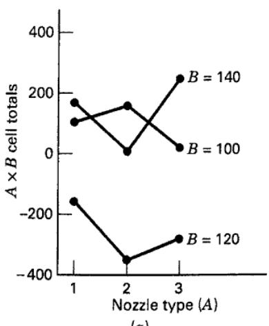
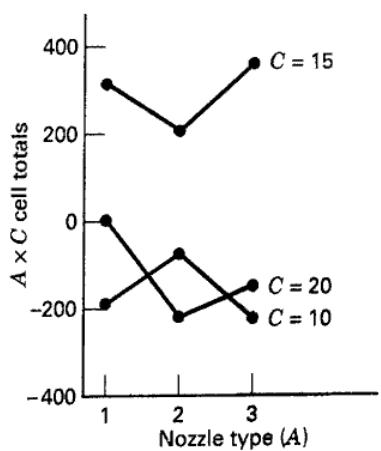
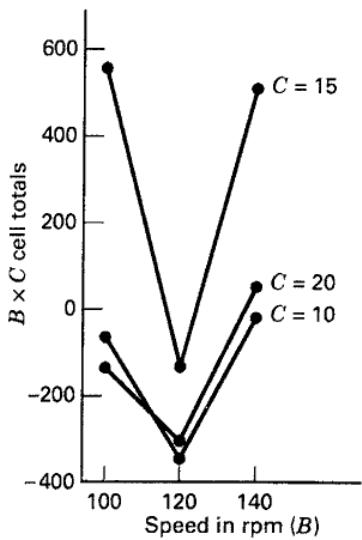
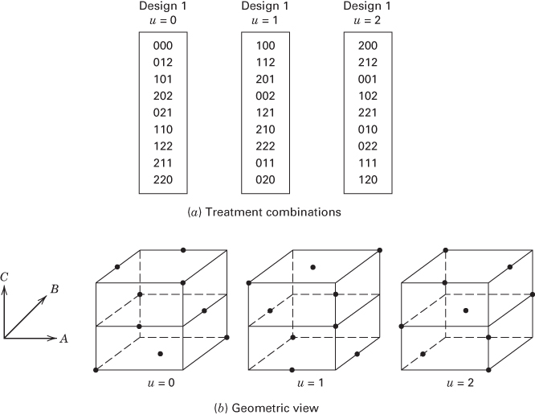

CHAPTER 9

# Additional Design and Analysis Topics for Factorial and Fractional Factorial Designs

## CHAPTER LEARNING OBJECTIVES

1. Know how to construct and analyze $3^{k}$ factorial designs.

2. Understand how to set up the $3^{k}$ factorial design in blocks.

3. Know how to construct and analyze $3^{k - p}$ fractional factorial designs.

4. Know how to construct factorial designs with mixed levels.

5. Know how to use nonregular two-level fractional factorial designs with 6–14 factors in 16 runs.

6. Know how to construct factorial and fractional factorial designs using the optimal design approach.

The two-level series of factorial and fractional factorial designs discussed in Chapters 6, 7, and 8 are widely used in industrial research and development. This chapter discusses some extensions and variations of these designs; one important case is the situation where all the factors are present at three levels. These $3^{k}$ designs and their fractions are discussed in this chapter. We will also consider cases where some factors have two levels and other factors have either three or four levels. In Chapter 8, we introduced Plackett–Burman designs and observed that they are nonregular fractions. The general case of nonregular fractions with all factors at two levels is discussed in more detail here. We also illustrate how optimal design tools can be useful for constructing designs in many important situations.

## 9.1 The $3^{k}$ Factorial Design

## 9.1.1 Notation and Motivation for the $3^{k}$ Design

We now discuss the $3^{k}$ factorial design—that is, a factorial arrangement with k factors, each at three levels. Factors and interactions will be denoted by capital letters. We will refer to the three levels of the factors as low, intermediate, and high. Several different notations may be used to represent these factor levels; one possibility is to represent the factor levels by the digits 0 (low), 1 (intermediate), and 2 (high). Each treatment combination in the $3^{k}$ design will be denoted by k digits, where the first digit indicates the level of factor A, the second digit indicates the level of factor B, $\ldots$ , and the kth digit indicates the level of factor K. For example, in a $3^{2}$ design, 00 denotes the treatment combination corresponding to A and B both at the low level, and 01 denotes the treatment combination corresponding to A at the low level and B at the intermediate level. Figures 9.1 and 9.2 show the geometry of the $3^{2}$ and the $3^{3}$ design, respectively, using this notation.

This system of notation could have been used for the $2^{k}$ designs presented previously, with 0 and 1 in place of the $\pm1s$ , respectively. In the $2^{k}$ design, we prefer the $\pm1$ notation because it facilitates the geometric view of the design and because it is directly applicable to regression modeling, blocking, and the construction of fractional factorials.

In the $3^{k}$ system of designs, when the factors are quantitative, we often denote the low, intermediate, and high levels by -1, 0, and +1, respectively. This facilitates fitting a regression model relating the response to the factor levels. For example, consider the $3^{2}$ design in Figure 9.1, and let $x_{1}$ represent factor A and $x_{2}$ represent factor B. A regression model relating the response y to $x_{1}$ and $x_{2}$ that is supported by this design is

$$
y = \beta_ {0} + \beta_ {1} x _ {1} + \beta_ {2} x _ {2} + \beta_ {1 2} x _ {1} x _ {2} + \beta_ {1 1} x _ {1} ^ {2} + \beta_ {2 2} x _ {2} ^ {2} + \epsilon\tag{9.1}
$$

Notice that the addition of a third factor level allows the relationship between the response and design factors to be modeled as a quadratic.

  
■ FIGURE 9.1 Treatment combinations in a $3^{2}$ design

  
■ FIGURE 9.2 Treatment combinations in a $3^{3}$ design

The $3^{k}$ design is certainly a possible choice by an experimenter who is concerned about curvature in the response function. However, two points need to be considered:

1. The $3^{k}$ design is not the most efficient way to model a quadratic relationship; the response surface designs discussed in Chapter 11 are superior alternatives.

2. The $2^{k}$ design augmented with center points, as discussed in Chapter 6, is an excellent way to obtain an indication of curvature. It allows one to keep the size and complexity of the design low and simultaneously obtain some protection against curvature. Then, if curvature is important, the two-level design can be augmented with axial runs to obtain a central composite design, as shown in Figure 6.37. This sequential strategy of experimentation is far more efficient than running a $3^{k}$ factorial design with quantitative factors.

## 9.1.2 The $3^{2}$ Design

The simplest design in the $3^{k}$ system is the $3^{2}$ design, which has two factors, each at three levels. The treatment combinations for this design are shown in Figure 9.1. Because there are $3^{2}=9$ treatment combinations, there are eight degrees of freedom between these treatment combinations. The main effects of A and B each have two degrees of freedom, and the AB interaction has four degrees of freedom. If there are n replicates, there will be $n3^{2}-1$ total degrees of freedom and $3^{2}(n-1)$ degrees of freedom for error.

The sums of squares for A, B, and AB may be computed by the usual methods for factorial designs discussed in Chapter 5. Each main effect can be represented by a linear and a quadratic component, each with a single degree of freedom, as demonstrated in Equation 9.1. Of course, this is meaningful only if the factor is quantitative.

The two-factor interaction AB may be partitioned in two ways. Suppose that both factors A and B are quantitative. The first method consists of subdividing AB into the four single-degree-of-freedom components corresponding to $AB_{L \times L}$ , $AB_{L \times Q}$ , $AB_{Q \times L}$ , and $AB_{Q \times Q}$ . This can be done by fitting the terms $\beta_{12}x_{1}x_{2}$ , $\beta_{122}x_{1}x_{2}^{2}$ , $\beta_{112}x_{1}^{2}x_{2}$ , and $\beta_{1122}x_{1}^{2}x_{2}^{2}$ , respectively, as demonstrated in Example 5.5. For the tool life data, this yields $SS_{AB_{L \times L}} = 8.00$ , $SS_{AB_{L \times Q}} = 42.67$ , $SS_{AB_{Q \times L}} = 2.67$ , and $SS_{AB_{Q \times Q}} = 8.00$ . Because this is an orthogonal partitioning of AB, note that $SS_{AB} = SS_{AB_{L \times L}} + SS_{AB_{L \times Q}} + SS_{AB_{Q \times L}} + SS_{AB_{Q \times Q}} = 61.34$ .

The second method is based on orthogonal Latin squares. This method does not require that the factors be quantitative, and it is usually associated with the case where all factors are qualitative. Consider the totals of the treatment combinations for the data in Example 5.5. These totals are shown in Figure 9.3 as the circled numbers in the squares. The two factors A and B correspond to the rows and columns, respectively, of a $3 \times 3$ Latin square. In Figure 9.3, two particular $3 \times 3$ Latin squares are shown superimposed on the cell totals.

These two Latin squares are orthogonal; that is, if one square is superimposed on the other, each letter in the first square will appear exactly once with each letter in the second square. The totals for the letters in the $(a)$ square are

■ FIGURE 9.3 Treatment combination totals from Example 5.5 with two orthogonal Latin squares superimposed  
  
(a)

  
(b)

$Q = 18, R = -2$ , and $S = 8$ , and the sum of squares between these totals is $[18^2 + (-2)^2 + 8^2] / (3)(2) - [24^2 / (9)(2)] = 33.34$ , with two degrees of freedom. Similarly, the letter totals in the $(b)$ square are $Q = 0, R = 6$ , and $S = 18$ , and the sum of squares between these totals is $[0^2 + 6^2 + 18^2] / (3)(2) - [24^2 / (9)(2)] = 28.00$ , with two degrees of freedom. Note that the sum of these two components is

$$
3 3. 3 4 + 2 8. 0 0 = 6 1. 3 4 = S S _ {A B}
$$

with $2 + 2 = 4$ degrees of freedom.

In general, the sum of squares computed from square (a) is called the AB component of interaction, and the sum of squares computed from square (b) is called the $AB^{2}$ component of interaction. The components AB and $AB^{2}$ each have two degrees of freedom. This terminology is used because if we denote the levels (0, 1, 2) for A and B by $x_{1}$ and $x_{2}$ , respectively, then we find that the letters occupy cells according to the following pattern:

$$
\begin{array}{l l} \text { Square } (a) & \text { Square } (b) \\ \hline Q: x _ {1} + x _ {2} = 0 (\text { mod } 3) & \overline {{Q : x _ {1} + 2 x _ {2} = 0 (\text { mod } 3)}} \\ R: x _ {1} + x _ {2} = 1 (\text { mod } 3) & S: x _ {1} = 2 x _ {2} = 1 (\text { mod } 3) \\ S: x _ {1} + x _ {2} = 2 (\text { mod } 3) & R: x _ {1} + 2 x _ {2} = 2 (\text { mod } 3) \end{array}
$$

For example, in square (b), note that the middle cell corresponds to $x_{1}=1$ and $x_{2}=1$ ; thus, $x_{1}+2x_{2}=1+(2)(1)=3=0$ (mod 3), and Q would occupy the middle cell. When considering expressions of the form $A^{p}B^{q}$ , we establish the convention that the only exponent allowed on the first letter is 1. If the first letter exponent is not 1, the entire expression is squared and the exponents are reduced modulus 3. For example, $A^{2}B$ is the same as $AB^{2}$ because

$$
A ^ {2} B = (A ^ {2} B) ^ {2} = A ^ {4} B ^ {2} = A B ^ {2}
$$

The AB and $AB^{2}$ components of the AB interaction have no actual meaning and are usually not displayed in the analysis of variance table. However, this rather arbitrary partitioning of the AB interaction into two orthogonal two-degree-of-freedom components is very useful in constructing more complex designs. Also, there is no connection between the AB and $AB^{2}$ components of interaction and the sums of squares for $AB_{L\times L}, AB_{L\times Q}, AB_{Q\times L}$ , and $AB_{Q\times Q}$ .

The AB and $AB^{2}$ components of interaction may be computed another way. Consider the treatment combination totals in either square in Figure 9.3. If we add the data by diagonals downward from left to right, we obtain the totals $-3 + 4 - 1 = 0$ , $-3 + 10 - 1 = 6$ , and $5 + 11 + 2 = 18$ . The sum of squares between these totals is $28.00(AB^{2})$ . Similarly, the diagonal totals downward from right to left are $5 + 4 - 1 = 8$ , $-3 + 2 - 1 = -2$ , and $-3 + 11 + 10 = 18$ . The sum of squares between these totals is $33.34(AB)$ . Yates called these components of interaction as the I and J components of interaction, respectively. We use both notations interchangeably; that is,

$$
\begin{array}{l} I (A B) = A B ^ {2} \\ J (A B) = A B \end{array}
$$

For more information about decomposing the sums of squares in three-level designs, refer to the supplemental material for this chapter.

## 9.1.3 The $3^{3}$ Design

Now suppose there are three factors $(A, B, \text{and } C)$ under study and that each factor is at three levels arranged in a factorial experiment. This is a $3^{3}$ factorial design, and the experimental layout and treatment combination notation are shown in Figure 9.2. The 27 treatment combinations have 26 degrees of freedom. Each main effect has two degrees of freedom, each two-factor interaction has four degrees of freedom, and the three-factor interaction has eight degrees of freedom. If there are n replicates, there are $n3^{3} - 1$ total degrees of freedom and $3^{3}(n - 1)$ degrees of freedom for error.

The sums of squares may be calculated using the standard methods for factorial designs. In addition, if the factors are quantitative, the main effects may be partitioned into linear and quadratic components, each with a single degree of freedom. The two-factor interactions may be decomposed into linear × linear, linear × quadratic, quadratic × linear, and quadratic × quadratic effects. Finally, the three-factor interaction ABC can be partitioned into eight single-degree-of-freedom components corresponding to linear × linear × linear, linear × linear × quadratic, and so on. Such a breakdown for the three-factor interaction is generally not very useful.

It is also possible to partition the two-factor interactions into their I and J components. These would be designated $AB, AB^{2}, AC, AC^{2}, BC$ , and $BC^{2}$ , and each component would have two degrees of freedom. As in the $3^{2}$ design, these components have no physical significance.

The three-factor interaction ABC may be partitioned into four orthogonal two-degrees-of-freedom components, which are usually called the W, X, Y, and Z components of the interaction. They are also referred to as the $AB^{2}C^{2}, AB^{2}C, ABC^{2}$ , and ABC components of the ABC interaction, respectively. The two notations are used interchangeably; that is,

$$
\begin{array}{l} W (A B C) = A B ^ {2} C ^ {2} \\ X (A B C) = A B ^ {2} C \\ Y (A B C) = A B C ^ {2} \\ Z (A B C) = A B C \end{array}
$$

Note that no first letter can have an exponent other than 1. Like the I and J components, the W, X, Y, and Z components have no practical interpretation. They are, however, useful in constructing more complex designs.

## EXAMPLE 9.1

A machine is used to fill 5-gallon metal containers with soft drink syrup. The variable of interest is the amount of syrup loss due to frothing. Three factors are thought to influence frothing: the nozzle design (A), the filling speed (B), and the operating pressure (C). Three nozzles, three filling speeds, and three pressures are chosen, and two replicates of a $3^{3}$ factorial experiment are run. The coded data are shown in Table 9.1.

the usual methods. We see that the filling speed and operating pressure are statistically significant. All three two-factor interactions are also significant. The two-factor interactions are analyzed graphically in Figure 9.4. The middle level of speed gives the best performance, nozzle types 2 and 3, and either the low (10 psi) or high (20 psi) pressure seems most effective in reducing syrup loss.

The analysis of variance for the syrup loss data is shown in Table 9.2. The sums of squares have been computed by

## TABLE 9.1

Syrup Loss Data for Example 9.1 (units are cubic centimeters -70)

<table><tr><td rowspan="4">Pressure (in psi) (C)</td><td colspan="9">Nozzle Type (A)</td></tr><tr><td colspan="3">1</td><td colspan="3">2</td><td colspan="3">3</td></tr><tr><td colspan="9">Speed (in rpm) (B)</td></tr><tr><td>100</td><td>120</td><td>140</td><td>100</td><td>120</td><td>140</td><td>100</td><td>120</td><td>140</td></tr><tr><td>10</td><td>-35</td><td>-45</td><td>-40</td><td>17</td><td>-65</td><td>20</td><td>-39</td><td>-55</td><td>15</td></tr><tr><td></td><td>-25</td><td>-60</td><td>15</td><td>24</td><td>-58</td><td>4</td><td>-35</td><td>-67</td><td>-30</td></tr><tr><td>15</td><td>110</td><td>-10</td><td>80</td><td>55</td><td>-55</td><td>110</td><td>90</td><td>-28</td><td>110</td></tr><tr><td></td><td>75</td><td>30</td><td>54</td><td>120</td><td>-44</td><td>44</td><td>113</td><td>-26</td><td>135</td></tr><tr><td>20</td><td>4</td><td>-40</td><td>31</td><td>-23</td><td>-64</td><td>-20</td><td>-30</td><td>-61</td><td>54</td></tr><tr><td></td><td>5</td><td>-30</td><td>36</td><td>-5</td><td>-62</td><td>-31</td><td>-55</td><td>-52</td><td>4</td></tr></table>

TABLE 9.2  
Analysis of Variance for Syrup Loss Data

<table><tr><td>Source of Variation</td><td>Sum of Squares</td><td>Degrees of Freedom</td><td>Mean Square</td><td> $F_0$ </td><td>P-Value</td></tr><tr><td>A, nozzle</td><td>993.77</td><td>2</td><td>496.89</td><td>1.17</td><td>0.3256</td></tr><tr><td>B, speed</td><td>61,190.33</td><td>2</td><td>30,595.17</td><td>71.74</td><td>&lt; 0.0001</td></tr><tr><td>C, pressure</td><td>69,105.33</td><td>2</td><td>34,552.67</td><td>81.01</td><td>&lt; 0.0001</td></tr><tr><td>AB</td><td>6,300.90</td><td>4</td><td>1,575.22</td><td>3.69</td><td>0.0160</td></tr><tr><td>AC</td><td>7,513.90</td><td>4</td><td>1,878.47</td><td>4.40</td><td>0.0072</td></tr><tr><td>BC</td><td>12,854.34</td><td>4</td><td>3,213.58</td><td>7.53</td><td>0.0003</td></tr><tr><td>ABC</td><td>4,628.76</td><td>8</td><td>578.60</td><td>1.36</td><td>0.2580</td></tr><tr><td>Error</td><td>11,515.50</td><td>27</td><td>426.50</td><td></td><td></td></tr><tr><td>Total</td><td>174,102.83</td><td>53</td><td></td><td></td><td></td></tr></table>

  
(a)

  
(b)

  
(c)  
■ FIGURE 9.4 Two-factor interactions for Example 9.1

Example 9.1 illustrates a situation where the three-level design often finds some application; one or more of the factors are qualitative, naturally taking on three levels, and the remaining factors are quantitative. In this example, suppose only three nozzle designs are of interest. This is clearly, then, a qualitative factor that requires three levels. The filling speed and the operating pressure are quantitative factors. Therefore, we could fit a quadratic model such as Equation 9.1 in the two factors speed and pressure at each level of the nozzle factor.

Table 9.3 shows these quadratic regression models. The $\beta$ 's in these models were estimated using a standard linear regression computer program. (We will discuss least squares regression in more detail in Chapter 10.) In these models, the variables $x_{1}$ and $x_{2}$ are coded to the levels $-1, 0, +1$ as discussed previously, and we assumed the following natural levels for pressure and speed:

<table><tr><td>Coded Level</td><td>Speed (rpm)</td><td>Pressure (psi)</td></tr><tr><td>-1</td><td>100</td><td>10</td></tr><tr><td>0</td><td>120</td><td>15</td></tr><tr><td>+1</td><td>140</td><td>20</td></tr></table>

TABLE 9.3  
Regression Models for Example 9.1

<table><tr><td>Nozzle Type</td><td> $x_1$ =Speed (S),  $x_2$ =Pressure (P) in Coded Units</td></tr><tr><td>1</td><td> $\hat{y} = 22.1 + 3.5x_1 + 16.3x_2 + 51.7x_1^2 - 71.8x_2^2 + 2.9x_1x_2$  $\hat{y} = 1217.3 - 31.256S + 86.017P + 0.12917S^2 - 2.8733P^2 + 0.02875SP$ </td></tr><tr><td>2</td><td> $\hat{y} = 25.6 - 22.8x_1 - 12.3x_2 + 14.1x_1^2 - 56.9x_2^2 - 0.7x_1x_2$  $\hat{y} = 180.1 - 9.475S + 66.75P + 0.035S^2 - 2.2767P^2 - 0.0075SP$ </td></tr><tr><td>3</td><td> $\hat{y} = 15.1 + 20.3x_1 + 5.9x_2 + 75.8x_1^2 - 94.9x_2^2 + 10.5x_1x_2$  $\hat{y} = 1940.1 - 46.058S + 102.48P + 0.18958S^2 - 3.7967P^2 + 0.105SP$ </td></tr></table>

Table 9.3 presents models in terms of both these coded variables and the natural levels of speed and pressure. Figure 9.5 shows the response surface contour plots of constant syrup loss as a function of speed and pressure for each nozzle type. These plots reveal considerable useful information about the performance of this filling system. Because the objective is to minimize syrup loss, nozzle type 3 would be preferred, as the smallest observed contours (-60) appear only on this plot. Filling speed near the middle level of 120 rpm and the either low or high pressure levels should be used.

  

■ FIGURE 9.5 Contours of constant syrup loss (units: cc -70) as a function of speed and pressure for nozzle types 1, 2, and 3, Example 9.1

When constructing contour plots for an experiment that has a mixture of quantitative and qualitative factors, it is not unusual to find that the shapes of the surfaces in the quantitative factors are very different at each level of the qualitative factors. This is noticeable to some degree in Figure 9.5, where the shape of the surface for nozzle type 2 is considerably elongated in comparison to the surfaces for nozzle types 1 and 3. When this occurs, it implies that there are interactions present between the quantitative and qualitative factors, and as a result, the optimum operating conditions (and other important conclusions) in terms of the quantitative factors are very different at each level of the qualitative factors.

We can easily show the numerical partitioning of the ABC interaction into its four orthogonal two-degrees-of-freedom components using the data in Example 9.1. The general procedure has been described by Davies (1956) and Cochran and Cox (1957). First, select any two of the three factors, say AB, and compute the I and J totals of the AB interaction at each level of the third factor C. These calculations are as follows:

<table><tr><td rowspan="2">C</td><td colspan="4">A</td><td colspan="2">Totals</td></tr><tr><td>B</td><td>1</td><td>2</td><td>3</td><td>I</td><td>J</td></tr><tr><td rowspan="3">10</td><td>100</td><td>-60</td><td>41</td><td>-74</td><td>-198</td><td>-222</td></tr><tr><td>120</td><td>-105</td><td>-123</td><td>-122</td><td>-106</td><td>-79</td></tr><tr><td>140</td><td>-25</td><td>24</td><td>-15</td><td>-155</td><td>-158</td></tr><tr><td rowspan="3">15</td><td>100</td><td>185</td><td>175</td><td>203</td><td>331</td><td>238</td></tr><tr><td>120</td><td>20</td><td>-99</td><td>-54</td><td>255</td><td>440</td></tr><tr><td>140</td><td>134</td><td>154</td><td>245</td><td>377</td><td>285</td></tr><tr><td rowspan="3">20</td><td>100</td><td>9</td><td>-28</td><td>-85</td><td>-59</td><td>-144</td></tr><tr><td>120</td><td>-70</td><td>-126</td><td>-113</td><td>-74</td><td>-40</td></tr><tr><td>140</td><td>67</td><td>-51</td><td>58</td><td>-206</td><td>-155</td></tr></table>

The $I(AB)$ and $J(AB)$ totals are now arranged in a two-way table with factor C, and the I and J diagonal totals of this new display are computed as follows:

<table><tr><td rowspan="2">C</td><td rowspan="2"></td><td rowspan="2">I(AB)</td><td rowspan="2"></td><td colspan="2">Totals</td><td rowspan="2">C</td><td rowspan="2"></td><td rowspan="2">J(AB)</td><td rowspan="2"></td><td colspan="2">Totals</td></tr><tr><td>I</td><td>J</td><td>I</td><td>J</td></tr><tr><td>10</td><td>-198</td><td>-106</td><td>-155</td><td>-149</td><td>41</td><td>10</td><td>-222</td><td>-79</td><td>-158</td><td>63</td><td>138</td></tr><tr><td>15</td><td>331</td><td>255</td><td>377</td><td>212</td><td>19</td><td>15</td><td>238</td><td>440</td><td>285</td><td>62</td><td>4</td></tr><tr><td>20</td><td>-59</td><td>-74</td><td>-206</td><td>102</td><td>105</td><td>20</td><td>-144</td><td>-40</td><td>-155</td><td>40</td><td>23</td></tr></table>

The $I$ and $J$ diagonal totals computed above are actually the totals representing the quantities $I[I(AB) \times C] = AB^2C^2$ , $J[I(AB) \times C] = AB^2C$ , $I[J(AB) \times C] = ABC^2$ , and $J[J(AB) \times C] = ABC$ or the $W, X, Y$ , and $Z$ components of $ABC$ . The sums of squares are found in the usual way; that is,

$$
\begin{array}{r l} {I [ I (A B) \times C ]} & {= A B ^ {2} C ^ {2} = W (A B C)} \\ & {= \frac {(- 1 4 9) ^ {2} + (2 1 2) ^ {2} + (1 0 2) ^ {2}}{1 8} - \frac {(1 6 5) ^ {2}}{5 4} = 3 8 0 4. 1 1} \end{array}
$$

$$
\begin{array}{r l} J [ I (A B) \times C ] & = A B ^ {2} C = X (A B C) \\ & = \frac {(4 1) ^ {2} + (1 9) ^ {2} + (1 0 5) ^ {2}}{1 8} - \frac {(1 6 5) ^ {2}}{5 4} = 2 2 1. 7 7 \end{array}
$$

$$
\begin{array}{r l} J [ J (A B) \times C ] & = A B C ^ {2} = Y (A B C) \\ & = \frac {(6 3) ^ {2} + (6 2) ^ {2} + (4 0) ^ {2}}{1 8} - \frac {(1 6 5) ^ {2}}{5 4} = 1 8. 7 7 \\ J [ J (A B) \times C ] & = A B C = Z (A B C) \\ & = \frac {(1 3 8) ^ {2} + (4) ^ {2} + (2 3) ^ {2}}{1 8} - \frac {(1 6 5) ^ {2}}{5 4} = 5 8 4. 1 1 \end{array}
$$

Although this is an orthogonal partitioning of $SS_{ABC}$ , we point out again that it is not customarily displayed in the analysis of variance table. In subsequent sections, we discuss the occasional need for the computation of one or more of these components.

## 9.1.4 The General $3^{k}$ Design

The concepts utilized in the $3^{2}$ and $3^{3}$ designs can be readily extended to the case of k factors, each at three levels, that is, to a $3^{k}$ factorial design. The usual digital notation is employed for the treatment combinations, so 0120 represents a treatment combination in a $3^{4}$ design with A and D at the low levels, B at the intermediate level, and C at the high level. There are $3^{k}$ treatment combinations, with $3^{k}-1$ degrees of freedom between them. These treatment combinations allow sums of squares to be determined for k main effects, each with two degrees of freedom; $\binom{k}{2}$ two-factor interactions, each with four degrees of freedom; ... ; and one k-factor interaction with $2^{k}$ degrees of freedom. In general, an h-factor interaction has $2^{h}$ degrees of freedom. If there are n replicates, there are $n3^{k}-1$ total degrees of freedom and $3^{k}(n-1)$ degrees of freedom for error.

Sums of squares for effects and interactions are computed by the usual methods for factorial designs. Typically, three-factor and higher interactions are not broken down any further. However, any h-factor interaction has $2^{h-1}$ orthogonal two-degrees-of-freedom components. For example, the four-factor interaction ABCD has $2^{4-1} = 8$ orthogonal two-degrees-of-freedom components, denoted by $ABCD^{2}, ABC^{2}D, AB^{2}CD, ABCD, ABC^{2}D^{2}, AB^{2}C^{2}D, AB^{2}CD^{2}$ , and $AB^{2}C^{2}D^{2}$ . In writing these components, note that the only exponent allowed on the first letter is 1. If the exponent on the first letter is not 1, then the entire expression must be squared and the exponents reduced modulus 3. To demonstrate this, consider

$$
A ^ {2} B C D = (A ^ {2} B C D) ^ {2} = A ^ {4} B ^ {2} C ^ {2} D ^ {2} = A B ^ {2} C ^ {2} D ^ {2}
$$

These interaction components have no physical interpretation, but they are useful in constructing more complex designs.

The size of the design increases rapidly with k. For example, a $3^{3}$ design has 27 treatment combinations per replication, a $3^{4}$ design has 81, a $3^{5}$ design has 243, and so on. Therefore, only a single replicate of the $3^{k}$ design is frequently considered, and higher order interactions are combined to provide an estimate of error. As an illustration, if three-factor and higher interactions are negligible, then a single replicate of the $3^{3}$ design provides 8 degrees of freedom for error, and a single replicate of the $3^{4}$ design provides 48 degrees of freedom for error. These are still large designs for $k \geq 3$ factors and, consequently, not too useful.

## 9.2 Confounding in the $3^{k}$ Factorial Design

Even when a single replicate of the $3^{k}$ design is considered, the design requires so many runs that it is unlikely that all $3^{k}$ runs can be made under uniform conditions. Thus, confounding in blocks is often necessary. The $3^{k}$ design may be confounded in $3^{p}$ incomplete blocks, where p < k. Thus, these designs may be confounded in three blocks, nine blocks, and so on.

## 9.2.1 The $3^{k}$ Factorial Design in Three Blocks

Suppose that we wish to confound the $3^{k}$ design in three incomplete blocks. These three blocks have two degrees of freedom among them; thus, there must be two degrees of freedom confounded with blocks. Recall that in the $3^{k}$ factorial series each main effect has two degrees of freedom. Furthermore, every two-factor interaction has four degrees of freedom and can be decomposed into two components of interaction (e.g., AB and $AB^{2}$ ), each with two degrees of freedom; every three-factor interaction has eight degrees of freedom and can be decomposed into four components of interaction (e.g., ABC, $ABC^{2}$ , $AB^{2}C$ , and $AB^{2}C^{2}$ ), each with two degrees of freedom; and so on. Therefore, it is convenient to confound a component of interaction with blocks.

The general procedure is to construct a defining contrast

$$
L = \alpha_ {1} x _ {1} + \alpha_ {2} x _ {2} + \dots + \alpha_ {k} x _ {k}\tag{9.2}
$$

where $\alpha_{i}$ represents the exponent on the ith factor in the effect to be confounded and $x_{i}$ is the level of the ith factor in a particular treatment combination. For the $3^{k}$ series, we have $\alpha_{i}=0,1$ , or 2 with the first nonzero $\alpha_{i}$ being unity, and $x_{i}=0$ (low level), 1 (intermediate level), or 2 (high level). The treatment combinations in the $3^{k}$ design are assigned to blocks based on the value of L (mod 3). Because L (mod 3) can take on only the values 0, 1, or 2, three blocks are uniquely defined. The treatment combinations satisfying L=0 (mod 3) constitute the principal block. This block will always contain the treatment combination 00...0.

For example, suppose we wish to construct a $3^{2}$ factorial design in three blocks. Either component of the AB interaction, AB or $AB^{2}$ , may be confounded with blocks. Arbitrarily choosing $AB^{2}$ , we obtain the defining contrast

$$
L = x _ {1} + 2 x _ {2}
$$

The value of L (mod 3) of each treatment combination may be found as follows:

$$
\begin{array}{r l} 0 0: & L = 1 (0) + 2 (0) = 0 = 0 (\text {mod} 3) \quad 1 1: \quad L = 1 (1) + 2 (1) = 3 = 0 (\text {mod} 3) \\ 0 1: & L = 1 (0) + 2 (1) = 2 = 2 (\text {mod} 3) \quad 2 1: \quad L = 1 (2) + 2 (1) = 4 = 1 (\text {mod} 3) \\ 0 2: & L = 1 (0) + 2 (2) = 4 = 1 (\text {mod} 3) \quad 1 2: \quad L = 1 (1) + 2 (2) = 5 = 2 (\text {mod} 3) \\ 1 0: & L = 1 (1) + 2 (0) = 1 = 1 (\text {mod} 3) \quad 2 2: \quad L = 1 (2) + 2 (2) = 6 = 0 (\text {mod} 3) \\ & 2 0: L = 1 (2) + 2 (0) = 2 = 2 (\text {mod} 3) \end{array}
$$

The blocks are shown in Figure 9.6.

The elements in the principal block form a group with respect to addition modulus 3. Referring to Figure 9.6, we see that $11 + 11 = 22$ and $11 + 22 = 00$ . Treatment combinations in the other two blocks may be generated by adding, modulus 3, any element in the new block to the elements of the principal block. Thus, we use 10 for block 2 and obtain

$$
1 0 + 0 0 = 1 0 \quad 1 0 + 1 1 = 2 1 \quad \text { and } \quad 1 0 + 2 2 = 0 2
$$

(a) Assignment of the treatment combinations to blocks  
  
■ FIGURE 9.6 The $3^{2}$ design in three blocks with $AB^{2}$ confounded

To generate block 3, we find using 01

$$
0 1 + 0 0 = 0 1 \quad 0 1 + 1 1 = 1 2 \quad \text { and } \quad 0 1 + 2 2 = 2 0
$$

## EXAMPLE 9.2

We illustrate the statistical analysis of the $3^{2}$ design confounded in three blocks by using the following data, which

$$
\begin{array}{l} \text {Block 1} \\ \boxed {0 0 = 4} \\ 1 1 = - 4 \\ 2 2 = 0 \\ \text {Block totals} = \quad 0 \end{array}
$$

Using conventional methods for the analysis of factorials, we find that $SS_{A} = 131.56$ and $SS_{B} = 0.22$ .

We also find that

$$
S S _ {\text { Blocks }} = \frac {(0) ^ {2} + (7) ^ {2} + (0) ^ {2}}{3} - \frac {(7) ^ {2}}{9} = 1 0. 8 9
$$

However, $SS_{Blocks}$ is exactly equal to the $AB^{2}$ component of interaction. To see this, write the observations as follows:

<table><tr><td rowspan="2" colspan="2"></td><td colspan="3">Factor B</td></tr><tr><td>0</td><td>1</td><td>2</td></tr><tr><td rowspan="3">Factor A</td><td>0</td><td>4</td><td>5</td><td>8</td></tr><tr><td>1</td><td>-2</td><td>-4</td><td>-5</td></tr><tr><td>2</td><td>0</td><td>1</td><td>0</td></tr></table>

come from the single replicate of the $3^{2}$ design shown in Figure 9.6.

$$
\begin{array}{c c} \text {Block 2} & \text {Block 3} \\ \boxed {1 0 = - 2} & \boxed {0 1 = 5} \\ 2 1 = 1 \\ 0 2 = 8 \\ \hline 7 & 0 \end{array}
$$

Recall from Section 9.1.2 that the I or $AB^{2}$ component of the AB interaction may be found by computing the sum of squares between the left-to-right diagonal totals in the above layout. This yields

$$
S S _ {A B ^ {2}} = \frac {(0) ^ {2} + (0) ^ {2} + (7) ^ {2}}{3} - \frac {(7) ^ {2}}{9} = 1 0. 8 9
$$

which is identical to $SS_{\text{Blocks}}$ .

The analysis of variance is shown in Table 9.4. Because there is only one replicate, no formal tests can be performed. It is not a good idea to use the AB component of interaction as an estimate of error.

## TABLE 9.4

Analysis of Variance for Data in Example 9.2

<table><tr><td>Source of Variation</td><td>Sum of Squares</td><td>Degrees of Freedom</td></tr><tr><td>Blocks ( $AB^{2}$ )</td><td>10.89</td><td>2</td></tr><tr><td>A</td><td>131.56</td><td>2</td></tr><tr><td>B</td><td>0.22</td><td>2</td></tr><tr><td>AB</td><td>2.89</td><td>2</td></tr><tr><td>Total</td><td>145.56</td><td>8</td></tr></table>

We now look at a slightly more complicated design—a $3^{3}$ factorial confounded in three blocks of nine runs each. The $AB^{2}C^{2}$ component of the three-factor interaction will be confounded with blocks. The defining contrast is

$$
L = x _ {1} + 2 x _ {2} + 2 x _ {3}
$$

It is easy to verify that the treatment combinations 000, 012, and 101 belong in the principal block. The remaining runs in the principal block are generated as follows:

$$
1 0 1 + 1 0 1 = 2 0 2
$$

$$
1 0 1 + 0 2 1 = 1 2 2 \tag {7}
$$

$$
0 1 2 + 0 1 2 = 0 2 1
$$

$$
0 1 2 + 2 0 2 = 2 1 1
$$

$$
1 0 1 + 0 1 2 = 1 1 0
$$

$$
(9) 0 2 1 + 2 0 2 = 2 2 0
$$

To find the runs in another block, note that the treatment combination 200 is not in the principal block. Thus, the elements of block 2 are

$$
2 0 0 + 0 0 0 = 2 0 0
$$

$$
(4) 2 0 0 + 2 0 2 = 1 0 2
$$

$$
2 0 0 + 1 2 2 = 0 2 2 \tag {7}
$$

$$
(2) 2 0 0 + 0 1 2 = 2 1 2
$$

$$
(5) 2 0 0 + 0 2 1 = 2 2 1
$$

$$
(8) 2 0 0 + 2 1 1 = 1 1 1
$$

$$
(3) 2 0 0 + 1 0 1 = 0 0 1
$$

$$
(6) 2 0 0 + 1 1 0 = 0 1 0
$$

$$
(9) 2 0 0 + 2 2 0 = 1 2 0
$$

Notice that all these runs satisfy $L = 2 \pmod{3}$ . The final block is found by observing that 100 does not belong in block 1 or 2. Using 100 as above yields

$$
(1) 1 0 0 + 0 0 0 = 1 0 0
$$

$$
(4) 1 0 0 + 2 0 2 = 0 0 2
$$

$$
1 0 0 + 1 2 2 = 2 2 2 \tag {7}
$$

$$
1 0 0 + 0 1 2 = 1 1 2 \tag {2}
$$

$$
1 0 0 + 0 2 1 = 1 2 1
$$

$$
1 0 0 + 2 1 1 = 0 1 1 \tag {8}
$$

$$
(3) 1 0 0 + 1 0 1 = 2 0 1
$$

$$
1 0 0 + 1 1 0 = 2 1 0
$$

$$
1 0 0 + 2 2 0 = 0 2 0
$$

The blocks are shown in Figure 9.7.

The analysis of variance for this design is shown in Table 9.5. Through the use of this confounding scheme, information on all the main effects and two-factor interactions is available. The remaining components of the three-factor interaction (ABC, $AB^{2}C$ , and $ABC^{2}$ ) are combined as an estimate of error. The sum of squares for those three components could be obtained by subtraction. In general, for the $3^{k}$ design in three blocks, we would always select a component of the highest order interaction to confound with blocks. The remaining unconfounded components of this interaction could be obtained by computing the k-factor interaction in the usual way and subtracting from this quantity the sum of squares for blocks.

## 9.2.2 The $3^{k}$ Factorial Design in Nine Blocks

In some experimental situations, it may be necessary to confound the $3^{k}$ design in nine blocks. Thus, eight degrees of freedom will be confounded with blocks. To construct these designs, we choose two components of interaction, and, as a result, two more will be confounded automatically, yielding the required eight degrees of freedom. These two are the generalized interactions of the two effects originally chosen. In the $3^{k}$ system, the generalized interactions of two effects (e.g., P and Q) are defined as PQ and $PQ^{2}$ (or $P^{2}Q$ ).

■ FIGURE 9.7 The $3^{3}$ design in three blocks with $AB^{2}C^{2}$ confounded

TABLE 9.5  
Analysis of Variance for a $3^{3}$ Design with $AB^{2}C^{2}$ Confounded

<table><tr><td>Source of Variation</td><td>Degrees of Freedom</td></tr><tr><td>Blocks (AB2C2)</td><td>2</td></tr><tr><td>A</td><td>2</td></tr><tr><td>B</td><td>2</td></tr><tr><td>C</td><td>2</td></tr><tr><td>AB</td><td>4</td></tr><tr><td>AC</td><td>4</td></tr><tr><td>BC</td><td>4</td></tr><tr><td>Error (ABC + AB2C + ABC2)</td><td>6</td></tr><tr><td>Total</td><td>26</td></tr></table>

The two components of interaction initially chosen yield two defining contrasts

$$
\begin{array}{l l} L _ {1} = \alpha_ {1} x _ {1} + \alpha_ {2} x _ {2} + \dots + \alpha_ {k} x _ {k} = u (\mathrm{mod} 3) & u = 0, 1, 2 \\ L _ {2} = \beta_ {1} x _ {1} + \beta_ {2} x _ {2} + \dots + \beta_ {k} x _ {k} = h (\mathrm{mod} 3) & h = 0, 1, 2 \end{array}\tag{9.3}
$$

where $\{\alpha_{i}\}$ and $\{\beta_{j}\}$ are the exponents in the first and second generalized interactions, respectively, with the convention that the first nonzero $\alpha_{i}$ and $\beta_{j}$ are unity. The defining contrasts in Equation 9.3 imply nine simultaneous equations specified by the pair of values for $L_{1}$ and $L_{2}$ . Treatment combinations having the same pair of values for $(L_{1}, L_{2})$ are assigned to the same block.

The principal block consists of treatment combinations satisfying $L_{1} = L_{2} = 0 \pmod{3}$ . The elements of this block form a group with respect to addition modulus 3; thus, the scheme given in Section 9.2.1 can be used to generate the blocks.

As an example, consider the $3^{4}$ factorial design confounded in nine blocks of nine runs each. Suppose we choose to confound $ABC$ and $AB^{2}D^{2}$ . Their generalized interactions

$$
\begin{array}{l} (A B C) (A B ^ {2} D ^ {2}) = A ^ {2} B ^ {3} C D ^ {2} = (A ^ {2} B ^ {3} C D ^ {2}) ^ {2} = A C ^ {2} D \\ (A B C) (A B ^ {2} D ^ {2}) ^ {2} = A ^ {3} B ^ {5} C D ^ {4} = B ^ {2} C D = (B ^ {2} C D) ^ {2} = B C ^ {2} D ^ {2} \end{array}
$$

are also confounded with blocks. The defining contrasts for $ABC$ and $AB^2D^2$ are

$$
\begin{array}{l} L _ {1} = x _ {1} + x _ {2} + x _ {3} \\ L _ {2} = x _ {1} + 2 x _ {2} + 2 x _ {4} \end{array}\tag{9.4}
$$

The nine blocks may be constructed by using the defining contrasts (Equation 9.4) and the group-theoretic property of the principal block. The design is shown in Figure 9.8.

For the $3^{k}$ design in nine blocks, four components of interaction will be confounded. The remaining unconfounded components of these interactions can be determined by subtracting the sum of squares for the confounded component from the sum of squares for the entire interaction. The method described in Section 9.1.3 may be useful in computing the components of interaction.

## 9.2.3 The $3^{k}$ Factorial Design in $3^{p}$ Blocks

The $3^{k}$ factorial design may be confounded in $3^{p}$ blocks of $3^{k-p}$ observations each, where p < k. The procedure is to select p independent effects to be confounded with blocks. As a result, exactly $(3^{p} - 2p - 1)/2$ other effects are automatically confounded. These effects are the generalized interactions of those effects originally chosen.

  
■ FIGURE 9.8 The $3^{4}$ design in nine blocks with ABC, $AB^{2}D^{2}$ , $AC^{2}D$ , and $BC^{2}D^{2}$ confounded

As an illustration, consider a $3^{7}$ design to be confounded in 27 blocks. Because p = 3, we would select three independent components of interaction and automatically confound $[3^{3} - 2(3) - 1]/2 = 10$ others. Suppose we choose $ABC^{2}DG, BCE^{2}F^{2}G$ , and BDEFG. Three defining contrasts can be constructed from these effects, and the 27 blocks can be generated by the methods previously described. The other 10 effects confounded with blocks are

$$
(A B C ^ {2} D G) (B C E ^ {2} F ^ {2} G) = A B ^ {2} D E ^ {2} F ^ {2} G ^ {2}
$$

$$
(A B C ^ {2} D G) (B C E ^ {2} F ^ {2} G) ^ {2} = A B ^ {3} C ^ {4} D E ^ {4} F ^ {4} G ^ {3} = A C D E F
$$

$$
(A B C ^ {2} D G) (B D E F G) = A B ^ {2} C ^ {2} D ^ {2} E F G ^ {2}
$$

$$
(A B C ^ {2} D G) (B D E F G) ^ {2} = A B ^ {3} C ^ {2} D ^ {3} E ^ {2} F ^ {2} G ^ {3} = A C ^ {2} E ^ {2} F ^ {2}
$$

$$
(B C E ^ {2} F ^ {2} G) (B D E F G) = B ^ {2} C D E ^ {3} F ^ {3} G ^ {2} = B C ^ {2} D ^ {2} G
$$

$$
(B C E ^ {2} F ^ {2} G) (B D E F G) ^ {2} = B ^ {3} C D ^ {2} E ^ {4} F ^ {4} G ^ {3} = C D ^ {2} E F
$$

$$
(A B C ^ {2} D G) (B C E ^ {2} F ^ {2} G) (B D E F G) = A B ^ {3} C ^ {3} D ^ {2} E ^ {3} F ^ {3} G ^ {3} = A D ^ {2}
$$

$$
(A B C ^ {2} D G) ^ {2} (B C E ^ {2} F ^ {3} G) (B D E F G) = A ^ {2} B ^ {4} C ^ {5} D ^ {3} G ^ {4} = A B ^ {2} C G ^ {2}
$$

$$
(A B C ^ {2} D G) (B C E ^ {2} F ^ {2} G) ^ {2} (B D E F G) = A B C D ^ {2} E ^ {2} F ^ {2} G
$$

$$
(A B C ^ {2} D G) (B C E ^ {2} F ^ {2} G) (B D E F G) ^ {2} = A B C ^ {3} D ^ {3} E ^ {4} F ^ {4} G ^ {4} = A B E F G
$$

This is a huge design requiring $3^7 = 2187$ observations arranged in 27 blocks of 81 observations each.

## 9.3 Fractional Replication of the $3^{k}$ Factorial Design

The concept of fractional replication can be extended to the $3^{k}$ factorial designs. Because a complete replicate of the $3^{k}$ design can require a rather large number of runs even for moderate values of k, fractional replication of these designs is of interest. As we shall see, however, some of these designs have complex alias structures.

## 9.3.1 The One-Third Fraction of the $3^{k}$ Factorial Design

The largest fraction of the $3^{k}$ design is a one-third fraction containing $3^{k-1}$ runs. Consequently, we refer to this as a $3^{k-1}$ fractional factorial design. To construct a $3^{k-1}$ fractional factorial design, select a two-degrees-of-freedom component of interaction (generally, the highest order interaction) and partition the full $3^{k}$ design into three blocks. Each of the three resulting blocks is a $3^{k-1}$ fractional design, and any one of the blocks may be selected for use. If $AB^{\alpha_{2}}C^{\alpha_{3}}\cdots K^{\alpha_{k}}$ is the component of interaction used to define the blocks, then $I = AB^{\alpha_{2}} C^{\alpha_{3}} \cdots K^{\alpha_{k}}$ is called the defining relation of the fractional factorial design. Each main effect or component of interaction estimated from the $3^{k-1}$ design has two aliases, which may be found by multiplying the effect by both I and $I^{2}$ modulus 3.

As an example, consider a one-third fraction of the $3^{3}$ design. We may select any component of the ABC interaction to construct the design, that is, ABC, $AB^{2}C$ , $ABC^{2}$ , or $AB^{2}C^{2}$ . Thus, there are actually 12 different one-third fractions of the $3^{3}$ design defined by

$$
x _ {1} + \alpha_ {2} x _ {2} + \alpha_ {3} x _ {3} = u (\mathrm{mod} 3)
$$

where $\alpha = 1$ or 2 and $u = 0,1$ , or 2. Suppose we select the component of $AB^{2}C^{2}$ . Each fraction of the resulting $3^{3-1}$ design will contain exactly $3^{2} = 9$ treatment combinations that must satisfy

$$
x _ {1} + 2 x _ {2} + 2 x _ {3} = u (\mathrm{mod} 3)
$$

where $u = 0,1$ , or 2. It is easy to verify that the three one-third fractions are as shown in Figure 9.9.

If any one of the $3^{3-1}$ designs in Figure 9.9 is run, the resulting alias structure is

$$
\begin{array}{r l} & A = A (A B ^ {2} C ^ {2}) = A ^ {2} B ^ {2} C ^ {2} = A B C \\ & A = A (A B ^ {2} C ^ {2}) ^ {2} = A ^ {3} B ^ {4} C ^ {4} = B C \\ & B = B (A B ^ {2} C ^ {2}) = A B ^ {3} C ^ {2} = A C ^ {2} \\ & B = B (A B ^ {2} C ^ {2}) ^ {2} = A ^ {2} B ^ {5} C ^ {4} = A B C ^ {2} \\ & C = C (A B ^ {2} C ^ {2}) = A B ^ {2} C ^ {3} = A B ^ {2} \\ & C = C (A B ^ {2} C ^ {2}) ^ {2} = A ^ {2} B ^ {4} C ^ {5} = A B ^ {2} C \\ & A B = A B (A B ^ {2} C ^ {2}) = A ^ {2} B ^ {3} C ^ {2} = A C \\ & A B = A B (A B ^ {2} C ^ {2}) ^ {2} = A ^ {3} B ^ {5} C ^ {4} = B C ^ {2} \end{array}
$$

Consequently, the four effects that are actually estimated from the eight degrees of freedom in the design are $A + BC + ABC, B + AC^{2} + ABC^{2}, C + AB^{2} + AB^{2}C$ , and $AB + AC + BC^{2}$ . This design would be of practical value only

■ FIGURE 9.9 The three one-third fractions of the $3^{3}$ design with defining relation $I = AB^{2}C^{2}$

  

if all the interactions were small relative to the main effects. Because the main effects are aliased with two-factor interactions, this is a resolution III design. Notice how complex the alias relationships are in this design. Each main effect is aliased with a component of interaction. If, for example, the two-factor interaction BC is large, this will potentially distort the estimate of the main effect of A and make the $AB + AC + BC^{2}$ effect very difficult to interpret. It is very difficult to see how this design could be useful unless we assume that all interactions are negligible.

Before leaving the $3_{\mathrm{III}}^{3-1}$ design, note that for the design with $u = 0$ (see Figure 9.9) if we let $A$ denote the row and $B$ denote the column, then the design can be written as

<table><tr><td>000</td><td>012</td><td>021</td></tr><tr><td>101</td><td>110</td><td>122</td></tr><tr><td>202</td><td>211</td><td>220</td></tr></table>

which is a $3 \times 3$ Latin square. The assumption of negligible interactions required for unique interpretations of the $3^{3-1}_{III}$ design is paralleled in the Latin square design. However, the two designs arise from different motives, one as a consequence of fractional replication and the other from randomization restrictions. From Table 4.13, we observe that there are only $12 \times 3$ Latin squares and that each one corresponds to one of the 12 different $3^{3-1}$ fractional factorial designs.

The treatment combinations in a $3^{k-1}$ design with the defining relation $I = AB^{\alpha_{2}} C^{\alpha_{3}} \cdots K^{\alpha_{k}}$ can be constructed using a method similar to that employed in the $2^{k-p}$ series. First, write down the $3^{k-1}$ runs for a full three-level factorial design in k - 1 factors, with the usual 0, 1, 2 notation. This is the basic design in the terminology of Chapter 8. Then introduce the kth factor by equating its levels $x_{k}$ to the appropriate component of the highest order interaction, say $AB^{\alpha_{2}} C^{\alpha_{3}} \cdots (K - 1)^{\alpha_{k-1}}$ , through the relationship

$$
x _ {k} = \beta_ {1} x _ {1} + \beta_ {2} x _ {2} + \dots + \beta_ {k - 1} x _ {k - 1}\tag{9.5}
$$

where $\beta_{i} = (3 - \alpha_{k})\alpha_{i}$ (mod 3) for $1\leq i\leq k - 1$ . This yields a design of the highest possible resolution.

As an illustration, we use this method to generate the $3_{\mathrm{IV}}^{4-1}$ design with the defining relation $I = AB^2CD$ shown in Table 9.6. It is easy to verify that the first three digits of each treatment combination in this table are the 27 runs of a full $3^3$ design. This is the basic design. For $AB^2CD$ , we have $\alpha_1 = \alpha_3 = \alpha_4 = 1$ and $\alpha_2 = 2$ . This implies that $\beta_1 = (3 - 1)\alpha_1 (\bmod 3) = (3 - 1)(1) = 2$ , $\beta_2 = (3 - 1)\alpha_2 (\bmod 3) = (3 - 1)(2) = 4 = 1 (\bmod 3)$ , and $\beta_3 = (3 - 1)\alpha_3 (\bmod 3) = (3 - 1)(1) = 2$ . Thus, Equation 9.5 becomes

$$
x _ {4} = 2 x _ {1} + x _ {2} + 2 x _ {3}\tag{9.6}
$$

The levels of the fourth factor satisfy Equation 9.6. For example, we have $2(0) + 1(0) + 2(0) = 0$ , $2(0) + 1(1) + 2(0) = 1$ , $2(1) + 1(1) + 2(0) = 3 = 0$ , and so on.

## TABLE 9.6

## A $3_{\mathrm{IV}}^{4 - 1}$ Design with $I = AB^{2}CD$

<table><tr><td>0000</td><td>0012</td><td>2221</td></tr><tr><td>0101</td><td>0110</td><td>0021</td></tr><tr><td>1100</td><td>0211</td><td>0122</td></tr><tr><td>1002</td><td>1011</td><td>0220</td></tr><tr><td>0202</td><td>1112</td><td>1020</td></tr><tr><td>1201</td><td>1210</td><td>1121</td></tr><tr><td>2001</td><td>2010</td><td>1222</td></tr><tr><td>2102</td><td>2111</td><td>2022</td></tr><tr><td>2200</td><td>2212</td><td>2120</td></tr></table>

The resulting $3_{IV}^{4-1}$ design has 26 degrees of freedom that may be used to compute the sums of squares for the 13 main effects and components of interactions (and their aliases). The aliases of any effect are found in the usual manner; for example, the aliases of A are $A(AB^{2}CD) = ABC^{2}D^{2}$ and $A(AB^{2}CD)^{2} = BC^{2}D^{2}$ . One may verify that the four main effects are clear of any two-factor interaction components, but that some two-factor interaction components are aliased with each other. Once again, we notice the complexity of the alias structure. If any two-factor interactions are large, it will likely be very difficult to isolate them with this design.

The statistical analysis of a $3^{k-1}$ design is accomplished by the usual analysis of variance procedures for factorial experiments. The sums of squares for the components of interaction may be computed as in Section 9.1. Remember when interpreting results that the components of interactions have no practical interpretation.

## 9.3.2 Other $3^{k - p}$ Fractional Factorial Designs

For moderate-to-large values of k, even further fractionation of the $3^{k}$ design is potentially desirable. In general, we may construct a $\left(\frac{1}{3}\right)^{p}$ fraction of the $3^{k}$ design for p < k, where the fraction contains $3^{k-p}$ runs. Such a design is called a $3^{k-p}$ fractional factorial design. Thus, a $3^{k-2}$ design is a one-ninth fraction, a $3^{k-3}$ design is a one-twenty-seventh fraction, and so on.

The procedure for constructing a $3^{k-p}$ fractional factorial design is to select p components of interaction and use these effects to partition the $3^{k}$ treatment combinations into $3^{p}$ blocks. Each block is then a $3^{k-p}$ fractional factorial design. The defining relation I of any fraction consists of the p effects initially chosen and their $(3^{p}-2p-1)/2$ generalized interactions. The alias of any main effect or component of interaction is produced by multiplication modulus 3 of the effect by I and $I^{2}$ .

We may also generate the runs defining a $3^{k-p}$ fractional factorial design by first writing down the treatment combinations of a full $3^{k-p}$ factorial design and then introducing the additional p factors by equating them to components of interaction, as we did in Section 9.3.1.

We illustrate the procedure by constructing a $3^{4-2}$ design, that is, a one-ninth fraction of the $3^{4}$ design. Let $AB^{2}C$ and BCD be the two components of interaction chosen to construct the design. Their generalized interactions are $(AB^{2}C)(BCD)=AC^{2}D$ and $(AB^{2}C)(BCD)^{2}=ABD^{2}$ . Thus, the defining relation for this design is $I=AB^{2}C=BCD=AC^{2}D=ABD^{2}$ , and the design is of resolution III. The nine treatment combinations in the design are found by writing down a $3^{2}$ design in the factors A and B, and then adding two new factors by setting

$$
\begin{array}{l} {x _ {3} = 2 x _ {1} + x _ {2}} \\ {x _ {4} = 2 x _ {2} + 2 x _ {3}} \end{array}
$$

This is equivalent to using $AB^{2}C$ and BCD to partition the full $3^{4}$ design into nine blocks and then selecting one of these blocks as the desired fraction. The complete design is shown in Table 9.7.

This design has eight degrees of freedom that may be used to estimate four main effects and their aliases. The aliases of any effect may be found by multiplying the effect modulus 3 by $AB^{2}C$ , BCD, $AC^{2}D$ , $ABD^{2}$ , and their squares. The complete alias structure for the design is given in Table 9.8.

From the alias structure, we see that this design is useful only in the absence of interaction. Furthermore, if A denotes the rows and B denotes the columns, then from examining Table 9.7 we see that the $3_{III}^{4-2}$ design is also a Graeco–Latin square.

## TABLE 9.7

A $3_{\mathrm{III}}^{4 - 2}$ Design with $I = AB^{2}C$ and $I = BCD$

<table><tr><td>0000</td><td>0111</td><td>0222</td></tr><tr><td>1021</td><td>1102</td><td>1210</td></tr><tr><td>2012</td><td>2120</td><td>2201</td></tr></table>

TABLE 9.8
Alias Structure for the $3^{4-2}_{III}$ Design in Table 9.7

<table><tr><td colspan="5">Effect</td><td colspan="4">Aliases</td></tr><tr><td></td><td></td><td colspan="3"> $I$ </td><td colspan="4"> $I^{2}$ </td></tr><tr><td>A</td><td> $ABC^{2}$ </td><td>ABCD</td><td> $ACD^{2}$ </td><td> $AB^{2}D$ </td><td> $BC^{2}$ </td><td> $AB^{2}C^{2}D^{2}$ </td><td> $CD^{2}$ </td><td> $BD^{2}$ </td></tr><tr><td>B</td><td>AC</td><td> $BC^{2}D^{2}$ </td><td> $ABC^{2}D$ </td><td> $AB^{2}D^{2}$ </td><td>ABC</td><td>CD</td><td> $AB^{2}C^{2}D$ </td><td> $AD^{2}$ </td></tr><tr><td>C</td><td> $AB^{2}C^{2}$ </td><td> $BC^{2}D$ </td><td>AD</td><td> $ABCD^{2}$ </td><td> $AB^{2}$ </td><td>BD</td><td>ACD</td><td> $ABC^{2}D^{2}$ </td></tr><tr><td>D</td><td> $AB^{2}CD$ </td><td> $BCD^{2}$ </td><td> $AC^{2}D^{2}$ </td><td>AB</td><td> $AB^{2}CD^{2}$ </td><td>BC</td><td> $AC^{2}$ </td><td>ABD</td></tr></table>

The publication by Connor and Zelen (1959) contains an extensive selection of designs for $4 \leq k \leq 10$ . This pamphlet was prepared for the National Bureau of Standards and is the most complete table of fractional $3^{k-p}$ plans available.

In this section, we have noted several times the complexity of the alias relationships in $3^{k-p}$ fractional factorial designs. In general, if k is moderately large, say $k \geq 4$ or 5, the size of the $3^{k}$ design will drive most experimenters to consider fairly small fractions. These designs have alias relationships that involve the partial aliasing of two-degrees-of-freedom components of interaction. This, in turn, results in a design that can be difficult and in many cases impossible to interpret if interactions are not negligible. Furthermore, there are no simple augmentation schemes (such as fold over) that can be used to combine two or more fractions to isolate significant interactions. The $3^{k}$ design is often suggested as appropriate when curvature is present. However, more efficient alternatives (see Chapter 11) are possible.

## 9.4 Factorials with Mixed Levels

We have emphasized factorial and fractional factorial designs in which all the factors have the same number of levels. The two-level system discussed in Chapters 6, 7, and 8 is particularly useful. The three-level system presented earlier in this chapter is much less useful because the designs are relatively large even for a modest number of factors, and most of the small fractions have complex alias relationships that would require very restrictive assumptions regarding interactions to be useful.

It is our belief that the two-level factorial and fractional factorial designs should be the cornerstone of industrial experimentation for product and process development, troubleshooting, and improvement. In some situations, however, it is necessary to include a factor (or a few factors) that has more than two levels. This usually occurs when there are both quantitative and qualitative factors in the experiment, and the qualitative factor has (say) three levels. If all factors are quantitative, then two-level designs with center points should be employed. In this section, we show how some three- and four-level factors can be accommodated in a $2^{k}$ design.

## 9.4.1 Factors at Two and Three Levels

Occasionally, there is interest in a design that has some factors at two levels and some factors at three levels. If these are full factorials, then construction and analysis of these designs presents no new challenges. However, interest in these designs can occur when a fractional factorial design is being contemplated. If all of the factors are quantitative, mixed-level fractions are usually poor alternatives to a $2^{k-p}$ fractional factorial with center points. Usually when these designs are considered, the experimenter has a mix of qualitative and quantitative factors, with the qualitative factors taking on three levels. The complex aliasing we observed in the $3^{k-p}$ design with qualitative factors carries over to a great extent in the mixed-level fractional system. Thus, mixed-level fractional designs with all qualitative factors or a mix of qualitative and quantitative factors should be used very carefully. This section gives a brief discussion of some of these designs.

TABLE 9.9  
Use of Two-Level Factors to Form a Three-Level Factor

<table><tr><td colspan="2">Two-Level Factors</td><td>Three-Level Factor</td></tr><tr><td>B</td><td>C</td><td>X</td></tr><tr><td>-</td><td>-</td><td> $x_{1}$ </td></tr><tr><td>-</td><td>-</td><td> $x_{2}$ </td></tr><tr><td>-</td><td>+</td><td> $x_{2}$ </td></tr><tr><td>+</td><td>+</td><td> $x_{3}$ </td></tr></table>

Designs in which some factors have two levels and other factors have three levels can be derived from the table of plus and minus signs for the usual $2^{k}$ design. The general procedure is best illustrated with an example. Suppose we have two variables, with A at two levels and X at three levels. Consider a table of plus and minus signs for the usual eight-run $2^{3}$ design. The signs in columns B and C have the pattern shown on the left side of Table 9.9. Let the levels of X be represented by $x_{1}, x_{2}$ , and $x_{3}$ . The right side of Table 9.9 shows how the sign patterns for B and C are combined to form the levels of the three-level factor.

Now factor X has two degrees of freedom and if the factor is quantitative, it can be partitioned into a linear and a quadratic component, each component having one degree of freedom. Table 9.10 shows a $2^{3}$ design with the columns labeled to show the actual effects that they estimate, with $X_{L}$ and $X_{Q}$ denoting the linear and quadratic effects of X, respectively. Note that the linear effect of X is the sum of the two effect estimates computed from the columns usually associated with B and C and that the effect of A can only be computed from the runs where X is at either the low or high levels, namely, runs 1, 2, 7, and 8. Similarly, the $A \times X_{L}$ effect is the sum of the two effects that would be computed from the columns usually labeled AB and AC. Furthermore, note that runs 3 and 5 are replicates. Therefore, a one-degree-of-freedom estimate of error can be made using these two runs. Similarly, runs 4 and 6 are replicates, and this would lead to a second one-degree-of-freedom estimate of error. The average variance at these two pairs of runs could be used as a mean square for error with two degrees of freedom. The complete analysis of variance is summarized in Table 9.11.

If we are willing to assume that the two-factor and higher interactions are negligible, we can convert the design in Table 9.10 into a resolution III fraction with up to four two-level factors and a single three-level factor. This would

## TABLE 9.10

One Two-Level and One Three-Level Factor in a $2^{3}$ Design

<table><tr><td></td><td>A</td><td>XL</td><td>XL</td><td>A × XL</td><td>A × XL</td><td>XQ</td><td>A × XQ</td><td colspan="2">Actual Treatment Combinations</td></tr><tr><td>Run</td><td>A</td><td>B</td><td>C</td><td>AB</td><td>AC</td><td>BC</td><td>ABC</td><td>A</td><td>X</td></tr><tr><td>1</td><td>-</td><td>-</td><td>-</td><td>+</td><td>+</td><td>+</td><td>-</td><td>Low</td><td>Low</td></tr><tr><td>2</td><td>+</td><td>-</td><td>-</td><td>-</td><td>-</td><td>+</td><td>+</td><td>High</td><td>Low</td></tr><tr><td>3</td><td>-</td><td>+</td><td>-</td><td>-</td><td>+</td><td>-</td><td>+</td><td>Low</td><td>Med</td></tr><tr><td>4</td><td>+</td><td>+</td><td>-</td><td>+</td><td>-</td><td>-</td><td>-</td><td>High</td><td>Med</td></tr><tr><td>5</td><td>-</td><td>-</td><td>+</td><td>+</td><td>-</td><td>-</td><td>+</td><td>Low</td><td>Med</td></tr><tr><td>6</td><td>+</td><td>-</td><td>+</td><td>-</td><td>+</td><td>-</td><td>-</td><td>High</td><td>Med</td></tr><tr><td>7</td><td>-</td><td>+</td><td>+</td><td>-</td><td>-</td><td>+</td><td>-</td><td>Low</td><td>High</td></tr><tr><td>8</td><td>+</td><td>+</td><td>+</td><td>+</td><td>+</td><td>+</td><td>+</td><td>High</td><td>High</td></tr></table>

TABLE 9.11  
Analysis of Variance for the Design in Table 9.10

<table><tr><td>Source of Variation</td><td>Sum of Squares</td><td>Degrees of Freedom</td><td>Mean Square</td></tr><tr><td> $A$ </td><td> $SS_{A}$ </td><td>1</td><td> $MS_{A}$ </td></tr><tr><td> $X(X_{L} + X_{Q})$ </td><td> $SS_{X}$ </td><td>2</td><td> $MS_{X_{1}}$ </td></tr><tr><td> $AX(A \times X_{L} + A \times X_{Q})$ </td><td> $SS_{AX}$ </td><td>2</td><td> $MS_{AX}$ </td></tr><tr><td>Error (from runs 3 and 5 and runs 4 and 6)</td><td> $SS_{E}$ </td><td>2</td><td> $MS_{E}$ </td></tr><tr><td>Total</td><td> $SS_{T}$ </td><td>7</td><td></td></tr></table>

be accomplished by associating the two-level factors with columns A, AB, AC, and ABC. Column BC cannot be used for a two-level factor because it contains the quadratic effect of the three-level factor X.

This same procedure can be applied to the 16-, 32-, and 64-run $2^{k}$ designs. For 16 runs, it is possible to construct resolution V fractional factorials with two two-level factors and either two or three factors at three levels. A 16-run resolution V fraction can also be obtained with three two-level factors and one three-level factor. If we include four two-level factors and a single three-level factor in 16 runs, the design will be of resolution III. The 32- and 64-run designs allow similar arrangements. For additional discussion of some of these designs, see Addelman (1962).

## 9.4.2 Factors at Two and Four Levels

It is very easy to accommodate a four-level factor in a $2^{k}$ design. The procedure for doing this involves using two two-level factors to represent the four-level factor. For example, suppose that A is a four-level factor with levels $a_{1}, a_{2}, a_{3}$ , and $a_{4}$ . Consider two columns of the usual table of plus and minus signs, say columns P and Q. The pattern of signs in these two columns is as shown on the left side of Table 9.12. The right side of this table shows how these four sign patterns would correspond to the four levels of factor A. The effects represented by columns P and Q and the PQ interaction are mutually orthogonal and correspond to the three-degrees-of-freedom A effect. This method of constructing a four-level factor from two two-level factors is called the method of replacement.

To illustrate this idea more completely, suppose that we have one four-level factor and two two-level factors and that we need to estimate all the main effects and interactions involving these factors. This can be done with a 16-run design. Table 9.13 shows the usual table of plus and minus signs for the 16-run $2^{4}$ design, with columns A and B used to form the four-level factor, say X, with levels $x_{1}, x_{2}, x_{3}$ , and $x_{4}$ . Sums of squares would be calculated for each column

## TABLE 9.12

Four-Level Factor A Expressed as Two Two-Level Factors

<table><tr><td rowspan="2">Run</td><td colspan="2">Two-Level Factors</td><td>Four-Level Factor</td></tr><tr><td>P</td><td>Q</td><td>A</td></tr><tr><td>1</td><td>-</td><td>-</td><td> $a_{1}$ </td></tr><tr><td>2</td><td>+</td><td>-</td><td> $a_{2}$ </td></tr><tr><td>3</td><td>-</td><td>+</td><td> $a_{3}$ </td></tr><tr><td>4</td><td>+</td><td>+</td><td> $a_{4}$ </td></tr></table>

TABLE 9.13  
A Single Four-Level Factor and Two Two-Level Factors in 16 Runs

<table><tr><td>Run</td><td>(A</td><td>B)</td><td>=X</td><td>C</td><td>D</td><td>AB</td><td>AC</td><td>BC</td><td>ABC</td><td>AD</td><td>BD</td><td>ABD</td><td>CD</td><td>ACD</td><td>BCD</td><td>ABCD</td></tr><tr><td>1</td><td>-</td><td>-</td><td> $x_{1}$ </td><td>-</td><td>-</td><td>+</td><td>+</td><td>+</td><td>-</td><td>+</td><td>+</td><td>-</td><td>+</td><td>-</td><td>-</td><td>+</td></tr><tr><td>2</td><td>+</td><td>-</td><td> $x_{2}$ </td><td>-</td><td>-</td><td>-</td><td>-</td><td>+</td><td>+</td><td>-</td><td>+</td><td>+</td><td>+</td><td>+</td><td>-</td><td>-</td></tr><tr><td>3</td><td>-</td><td>+</td><td> $x_{3}$ </td><td>-</td><td>-</td><td>-</td><td>+</td><td>-</td><td>+</td><td>+</td><td>-</td><td>+</td><td>+</td><td>-</td><td>+</td><td>-</td></tr><tr><td>4</td><td>+</td><td>+</td><td> $x_{4}$ </td><td>-</td><td>-</td><td>+</td><td>-</td><td>-</td><td>-</td><td>-</td><td>-</td><td>-</td><td>+</td><td>+</td><td>+</td><td>+</td></tr><tr><td>5</td><td>-</td><td>-</td><td> $x_{1}$ </td><td>+</td><td>-</td><td>+</td><td>-</td><td>-</td><td>+</td><td>+</td><td>+</td><td>-</td><td>-</td><td>+</td><td>+</td><td>-</td></tr><tr><td>6</td><td>+</td><td>-</td><td> $x_{2}$ </td><td>+</td><td>-</td><td>-</td><td>+</td><td>-</td><td>-</td><td>-</td><td>+</td><td>+</td><td>-</td><td>-</td><td>+</td><td>+</td></tr><tr><td>7</td><td>-</td><td>+</td><td> $x_{3}$ </td><td>+</td><td>-</td><td>-</td><td>-</td><td>+</td><td>-</td><td>+</td><td>-</td><td>+</td><td>-</td><td>+</td><td>-</td><td>+</td></tr><tr><td>8</td><td>+</td><td>+</td><td> $x_{4}$ </td><td>+</td><td>-</td><td>+</td><td>+</td><td>+</td><td>+</td><td>-</td><td>-</td><td>-</td><td>-</td><td>-</td><td>-</td><td>-</td></tr><tr><td>9</td><td>-</td><td>-</td><td> $x_{1}$ </td><td>-</td><td>+</td><td>+</td><td>+</td><td>+</td><td>-</td><td>-</td><td>-</td><td>+</td><td>-</td><td>+</td><td>+</td><td>-</td></tr><tr><td>10</td><td>+</td><td>-</td><td> $x_{2}$ </td><td>-</td><td>+</td><td>-</td><td>-</td><td>+</td><td>+</td><td>+</td><td>-</td><td>-</td><td>-</td><td>-</td><td>+</td><td>+</td></tr><tr><td>11</td><td>-</td><td>+</td><td> $x_{3}$ </td><td>-</td><td>+</td><td>-</td><td>+</td><td>-</td><td>+</td><td>-</td><td>+</td><td>-</td><td>-</td><td>+</td><td>-</td><td>+</td></tr><tr><td>12</td><td>+</td><td>+</td><td> $x_{4}$ </td><td>-</td><td>+</td><td>+</td><td>-</td><td>-</td><td>-</td><td>+</td><td>+</td><td>+</td><td>-</td><td>-</td><td>-</td><td>-</td></tr><tr><td>13</td><td>-</td><td>-</td><td> $x_{1}$ </td><td>+</td><td>+</td><td>+</td><td>-</td><td>-</td><td>+</td><td>-</td><td>-</td><td>+</td><td>+</td><td>-</td><td>-</td><td>+</td></tr><tr><td>14</td><td>+</td><td>-</td><td> $x_{2}$ </td><td>+</td><td>+</td><td>-</td><td>+</td><td>-</td><td>-</td><td>+</td><td>-</td><td>-</td><td>+</td><td>+</td><td>-</td><td>-</td></tr><tr><td>15</td><td>-</td><td>+</td><td> $x_{3}$ </td><td>+</td><td>+</td><td>-</td><td>-</td><td>+</td><td>-</td><td>-</td><td>+</td><td>-</td><td>+</td><td>-</td><td>+</td><td>-</td></tr><tr><td>16</td><td>+</td><td>+</td><td> $x_{4}$ </td><td>+</td><td>+</td><td>+</td><td>+</td><td>+</td><td>+</td><td>+</td><td>+</td><td>+</td><td>+</td><td>+</td><td>+</td><td>+</td></tr></table>

$A, B, \ldots, ABCD$ just as in the usual $2^{k}$ system. Then the sums of squares for all factors $X, C, D$ , and their interactions are formed as follows:

$$
S S _ {X} = S S _ {A} + S S _ {B} + S S _ {A B}
$$

$$
S S _ {C} = S S _ {C}
$$

$$
S S _ {D} = S S _ {D}
$$

$$
S S _ {C D} = S S _ {C D}
$$

$$
S S _ {X C} = S S _ {A C} + S S _ {B C} + S S _ {A B C}
$$

$$
S S _ {X D} = S S _ {A D} + S S _ {B D} + S S _ {A B D}
$$

$$
S S _ {X C D} = S S _ {A C D} + S S _ {B C D} + S S _ {A B C D}
$$

This could be called a $4 \times 2^{2}$ design. If we are willing to ignore two-factor interactions, up to nine additional two-level factors can be associated with the two-factor interaction (except AB), three-factor interaction, and four-factor interaction columns.

There are a wide range of fractional factorial designs with a mix of two- and four-level factors available. However, we recommend using these designs cautiously. If all factors are quantitative, the $2^{k-p}$ system with center points will usually be a superior alternative. Designs with factors at two and four levels that are of resolution IV or higher, which would usually be necessary if there are both quantitative and qualitative factors present, and typically rather large, requiring $n \geq 32$ runs in many cases.

## 9.5 Nonregular Fractional Factorial Designs

The regular two-level fractional factorial designs in Chapter 8 are a staple for factor screening in modern industrial applications. Resolution IV designs are particularly popular because they avoid the confounding of main effects and two-factor interactions found in resolution III designs while avoiding the larger sample size requirements of resolution V designs. However, when the number of factors is relatively large, say k = 9 or more, resolution III designs are widely used. In Chapter 8, we discussed the regular minimum aberration versions of the $2^{k-p}$ fractional factorials of resolutions III, IV, and V.

The two-factor interaction aliasing in resolution III and IV designs can result in experiments whose outcomes have ambiguous conclusions. For example, in Chapter 8, we illustrated a $2^{6-2}$ design used in a spin coating process applying photoresist where four main effects A, B, C, and E were found to be important along with one two-factor interaction alias chain $AB + CE$ . Without external process knowledge, the experimenter could not decide whether the AB interaction, the CE interaction, or some linear combination of them represents the true state of nature. To resolve this ambiguity requires additional runs. In Chapter 8, we illustrated the use of both a fold-over and a partial fold-over strategy to resolve the aliasing. We also saw an example of a resolution III $2^{7-4}$ fractional factorial in an eye focus time experiment where fold over was required to identify a large two-factor interaction effect.

While strong two-factor interactions are usually less likely than strong main effects, there are likely to be many more interactions than main effects in screening situations (this is a consequence of effect sparsity. As a result, the likelihood of at least one significant interaction effect is quite high. There is often substantial reluctance to commit additional time and material to a study with unclear results. Consequently, experimenters often want to avoid the need for a follow-up study. In this section, we show how specific choices of nonregular two-level fractional factorial designs can be used in experiments with between 6 and 14 factors and potentially avoid subsequent experimentation when two-factor interactions are active. Section 9.5.1 presents designs for 6, 7, and 8 factors in 16 runs. These designs have no complete confounding of pairs of two-factor interactions. These designs are excellent alternatives for the regular minimum aberration resolution IV fractional factorials. In Section 9.5.2, we present nonregular designs for between 9 and 14 factors in 16 runs that have no complete aliasing of main effects and two-factor interactions. These designs are alternative to the regular minimum aberration resolution III fractional factorials. We also present metrics to evaluate these fractional factorial designs, show how the recommended nonregular 16-run designs were obtained, and discuss analysis methods.

Screening designs are primarily concerned with the discovery of active factors. This factor activity generally expresses itself through a main effect or a factor's involvement in a two-factor interaction. Consider the model

$$
\mathbf {y} = \mathbf {X} \beta + \epsilon\tag{9.7}
$$

where X contains columns for the intercept, main effects and all two-factor interactions, $\beta$ is the vector of model parameters, and $\epsilon$ is the usual vector of $\mathrm{NID}(0,\sigma^{2})$ random errors. Consider the case of six factors in 16 runs and a model with all main effects and two-factor interactions. For this situation, the X matrix has more columns than rows. Thus, it is not of full rank and the usual least squares estimate for $\beta$ does not exist because the matrix $X^{\prime}X$ is singular. With respect to this model, every 16-run design is supersaturated. Booth and Cox (1962) introduced the $E(s^{2})$ criterion as a diagnostic measure for comparing supersaturated designs, where

$$
\mathrm{E} (s ^ {2}) = \sum_ {i <   j} (\mathbf {X} _ {i} ^ {\prime} \mathbf {X} _ {j}) ^ {2} / (k (k - 1))\tag{9.8}
$$

and k is the number of columns in X.

Minimizing the $E(s^{2})$ criterion is equivalent to minimizing the sum of squared off-diagonal elements of the correlation matrix of X. Removing the constant column from X, the correlation matrix of the regular resolution IV 16-run six-factor design is $21 \times 21$ with one row and column for each of the six main effects and 15 two-factor interactions. Figure 9.10 shows the cell plot of the correlation matrix for the principal fraction of this design. In Figure 9.10, we note that the correlation is zero between all main effects and two-factor interactions (because the design is resolution IV) and that the correlation is +1 between every two-factor interaction and at least one other two-factor interaction. These two-factor interactions are completely confounded. If another member of the same design family had been used, at least one of the generators would have been used with a negative sign in design construction and some of the entries of the correlation matrix would have been -1. There still would be complete confounding of two-factor interactions in the design.

Jones and Montgomery (2010) introduced the cell plot of the correlation matrix as a useful graphical way to show the aliasing relationships in fractional factorials and to compare nonregular designs to their regular fractional ■ FIGURE 9.10 The correlation matrix for the regular $2^{6-2}$ resolution IV fractional factorial design

factorial counterparts. In Figure 9.10, it is a display of the confounding pattern, much like what can be seen in the alias matrix. We introduced the alias matrix in Chapter 8. Recall that we plan to fit the model

$$
\mathbf {y} = \mathbf {X} _ {1} \boldsymbol {\beta} _ {1} + \epsilon
$$

where $X_{1}$ is the design matrix for the experiment that has been conducted expanded to model form, $\beta_{1}$ is the vector of model parameters, and $\epsilon$ is the usual vector of $\mathrm{NID}(0,\sigma^{2})$ errors but that the true model is

$$
\mathbf {y} = \mathbf {X} _ {1} \boldsymbol {\beta} _ {1} + \mathbf {X} _ {2} \boldsymbol {\beta} _ {2} + \epsilon
$$

where the columns of $X_{2}$ contain additional factors not included in the original model (such as interactions) and $\beta_{2}$ is the corresponding vector of model parameters. In Chapter 8, we observed that the expected value of $\hat{\beta}_{1}$ , the least squares estimate of $\beta_{1}$ , is

$$
E (\hat {\boldsymbol {\beta}} _ {1}) = \boldsymbol {\beta} _ {1} + (\mathbf {X} _ {1} ^ {\prime} \mathbf {X} _ {1}) ^ {- 1} \mathbf {X} _ {1} ^ {\prime} \mathbf {X} _ {2} \boldsymbol {\beta} _ {2} = \boldsymbol {\beta} _ {1} + \mathbf {A} \boldsymbol {\beta} _ {2}
$$

The alias matrix $\mathbf{A} = (\mathbf{X}_{1}^{\prime}\mathbf{X}_{1})^{-1}\mathbf{X}_{1}^{\prime}\mathbf{X}_{2}$ shows how estimates of terms in the fitted model are biased by active terms that are not in the fitted model. Each row of A is associated with a parameter in the fitted model. Nonzero elements in a row of A show the degree of biasing of the fitted model parameter due to terms associated with the columns of $X_{2}$ .

In a regular design, an arbitrary entry in the alias matrix, say $A_{ij}$ , is either 0 or $\pm1$ . If $A_{ij}$ is 0 then the ith column of $X_{1}$ is orthogonal to the jth column of $X_{2}$ . Otherwise, if $A_{ij}$ is $\pm1$ , then the ith column of $X_{1}$ and the jth column of $X_{2}$ are perfectly correlated.

For nonregular designs, the aliasing is more complex. If $X_{1}$ is the design matrix for the main effects model and $X_{2}$ is the design matrix for the two-factor interactions, then the entries of the alias matrix for orthogonal nonregular designs for 16 runs take the values 0, ±1, or ±0.5. A small subset of these designs have no entries of ±1.

Bursztyn and Steinberg (2006) propose using the trace of AA' (or equivalently the trace of A'A) as a scalar measure of the total bias in a design. They use this as a means for comparing designs for computer simulations but this measure works equally well for ranking competitive screening designs.

## 9.5.1 Nonregular Fractional Factorial Designs for 6, 7, and 8 Factors in 16 Runs

These designs were introduced by Jones and Montgomery (2010) as alternatives to the usual regular minimum aberration fraction. Hall (1961) identified five nonisomorphic orthogonal designs for 15 factors in 16 runs. By nonisomorphic, we mean that one cannot obtain one of these designs from another one by permuting the rows or columns or by changing the labels of the factor. The Jones and Montgomery designs are projections of the Hall designs created by selecting the specific sets of columns that minimize the $E(s^{2})$ and trace $AA'$ criteria. They searched all of the nonisomorphic orthogonal projections of the Hall designs. Tables 9.14 through 9.18 show the Hall designs. Table 9.19 shows the number of nonisomorphic orthogonal 16-run designs.

■ TABLE 9.14
The Hall I Design

<table><tr><td>Run</td><td>A</td><td>B</td><td>C</td><td>D</td><td>E</td><td>F</td><td>G</td><td>H</td><td>J</td><td>K</td><td>L</td><td>M</td><td>N</td><td>P</td><td>Q</td></tr><tr><td>1</td><td>-1</td><td>-1</td><td>1</td><td>-1</td><td>1</td><td>1</td><td>-1</td><td>-1</td><td>1</td><td>1</td><td>-1</td><td>1</td><td>-1</td><td>-1</td><td>1</td></tr><tr><td>2</td><td>1</td><td>-1</td><td>-1</td><td>-1</td><td>-1</td><td>1</td><td>1</td><td>-1</td><td>-1</td><td>1</td><td>1</td><td>1</td><td>1</td><td>-1</td><td>-1</td></tr><tr><td>3</td><td>-1</td><td>1</td><td>-1</td><td>-1</td><td>1</td><td>-1</td><td>1</td><td>-1</td><td>1</td><td>-1</td><td>1</td><td>1</td><td>-1</td><td>1</td><td>-1</td></tr><tr><td>4</td><td>1</td><td>1</td><td>1</td><td>-1</td><td>-1</td><td>-1</td><td>-1</td><td>-1</td><td>-1</td><td>-1</td><td>-1</td><td>1</td><td>1</td><td>1</td><td>1</td></tr><tr><td>5</td><td>-1</td><td>-1</td><td>1</td><td>1</td><td>-1</td><td>-1</td><td>1</td><td>-1</td><td>1</td><td>1</td><td>-1</td><td>-1</td><td>1</td><td>1</td><td>-1</td></tr><tr><td>6</td><td>1</td><td>-1</td><td>-1</td><td>1</td><td>1</td><td>-1</td><td>-1</td><td>-1</td><td>-1</td><td>1</td><td>1</td><td>-1</td><td>-1</td><td>1</td><td>1</td></tr><tr><td>7</td><td>-1</td><td>1</td><td>-1</td><td>1</td><td>-1</td><td>1</td><td>-1</td><td>-1</td><td>1</td><td>-1</td><td>1</td><td>-1</td><td>1</td><td>-1</td><td>1</td></tr><tr><td>8</td><td>1</td><td>1</td><td>1</td><td>1</td><td>1</td><td>1</td><td>1</td><td>-1</td><td>-1</td><td>-1</td><td>-1</td><td>-1</td><td>-1</td><td>-1</td><td>-1</td></tr><tr><td>9</td><td>-1</td><td>-1</td><td>1</td><td>-1</td><td>1</td><td>1</td><td>-1</td><td>1</td><td>-1</td><td>-1</td><td>1</td><td>-1</td><td>1</td><td>1</td><td>-1</td></tr><tr><td>10</td><td>1</td><td>-1</td><td>-1</td><td>-1</td><td>-1</td><td>1</td><td>1</td><td>1</td><td>1</td><td>-1</td><td>-1</td><td>-1</td><td>-1</td><td>1</td><td>1</td></tr><tr><td>11</td><td>-1</td><td>1</td><td>-1</td><td>-1</td><td>1</td><td>-1</td><td>1</td><td>1</td><td>-1</td><td>1</td><td>-1</td><td>-1</td><td>1</td><td>-1</td><td>1</td></tr><tr><td>12</td><td>1</td><td>1</td><td>1</td><td>-1</td><td>-1</td><td>-1</td><td>-1</td><td>1</td><td>1</td><td>1</td><td>1</td><td>-1</td><td>-1</td><td>-1</td><td>-1</td></tr><tr><td>13</td><td>-1</td><td>-1</td><td>1</td><td>1</td><td>-1</td><td>-1</td><td>1</td><td>1</td><td>-1</td><td>-1</td><td>1</td><td>1</td><td>-1</td><td>-1</td><td>1</td></tr><tr><td>14</td><td>1</td><td>-1</td><td>-1</td><td>1</td><td>1</td><td>-1</td><td>-1</td><td>1</td><td>1</td><td>-1</td><td>-1</td><td>1</td><td>1</td><td>-1</td><td>-1</td></tr><tr><td>15</td><td>-1</td><td>1</td><td>-1</td><td>1</td><td>-1</td><td>1</td><td>-1</td><td>1</td><td>-1</td><td>1</td><td>-1</td><td>1</td><td>-1</td><td>1</td><td>-1</td></tr><tr><td>16</td><td>1</td><td>1</td><td>1</td><td>1</td><td>1</td><td>1</td><td>1</td><td>1</td><td>1</td><td>1</td><td>1</td><td>1</td><td>1</td><td>1</td><td>1</td></tr></table>

TABLE 9.16 The Hall III Design

<table><tr><td>Run</td><td>A</td><td>B</td><td>C</td><td>D</td><td>E</td><td>F</td><td>G</td><td>H</td><td>J</td><td>K</td><td>L</td><td>M</td><td>N</td><td>P</td><td>Q</td></tr><tr><td>1</td><td>1</td><td>1</td><td>1</td><td>1</td><td>1</td><td>1</td><td>1</td><td>1</td><td>1</td><td>1</td><td>1</td><td>1</td><td>1</td><td>1</td><td>1</td></tr><tr><td>2</td><td>1</td><td>1</td><td>1</td><td>1</td><td>1</td><td>1</td><td>1</td><td>-1</td><td>-1</td><td>-1</td><td>-1</td><td>-1</td><td>-1</td><td>-1</td><td>-1</td></tr><tr><td>3</td><td>1</td><td>1</td><td>1</td><td>-1</td><td>-1</td><td>-1</td><td>-1</td><td>1</td><td>1</td><td>1</td><td>1</td><td>-1</td><td>-1</td><td>-1</td><td>-1</td></tr><tr><td>4</td><td>1</td><td>1</td><td>1</td><td>-1</td><td>-1</td><td>-1</td><td>-1</td><td>-1</td><td>-1</td><td>-1</td><td>-1</td><td>1</td><td>1</td><td>1</td><td>1</td></tr><tr><td>5</td><td>1</td><td>-1</td><td>-1</td><td>1</td><td>1</td><td>-1</td><td>-1</td><td>1</td><td>1</td><td>-1</td><td>-1</td><td>1</td><td>1</td><td>-1</td><td>-1</td></tr><tr><td>6</td><td>1</td><td>-1</td><td>-1</td><td>1</td><td>1</td><td>-1</td><td>-1</td><td>-1</td><td>-1</td><td>1</td><td>1</td><td>-1</td><td>-1</td><td>1</td><td>1</td></tr><tr><td>7</td><td>1</td><td>-1</td><td>-1</td><td>-1</td><td>-1</td><td>1</td><td>1</td><td>1</td><td>1</td><td>-1</td><td>-1</td><td>-1</td><td>-1</td><td>1</td><td>1</td></tr><tr><td>8</td><td>1</td><td>-1</td><td>-1</td><td>-1</td><td>-1</td><td>1</td><td>1</td><td>-1</td><td>-1</td><td>1</td><td>1</td><td>1</td><td>1</td><td>-1</td><td>-1</td></tr><tr><td>9</td><td>-1</td><td>1</td><td>-1</td><td>1</td><td>-1</td><td>1</td><td>-1</td><td>1</td><td>-1</td><td>1</td><td>-1</td><td>1</td><td>-1</td><td>1</td><td>-1</td></tr><tr><td>10</td><td>-1</td><td>1</td><td>-1</td><td>1</td><td>-1</td><td>1</td><td>-1</td><td>-1</td><td>1</td><td>-1</td><td>1</td><td>-1</td><td>1</td><td>-1</td><td>1</td></tr><tr><td>11</td><td>-1</td><td>1</td><td>-1</td><td>-1</td><td>1</td><td>-1</td><td>1</td><td>1</td><td>-1</td><td>-1</td><td>1</td><td>1</td><td>-1</td><td>-1</td><td>1</td></tr><tr><td>12</td><td>-1</td><td>1</td><td>-1</td><td>-1</td><td>1</td><td>-1</td><td>1</td><td>-1</td><td>1</td><td>1</td><td>-1</td><td>-1</td><td>1</td><td>1</td><td>-1</td></tr><tr><td>13</td><td>-1</td><td>-1</td><td>1</td><td>1</td><td>-1</td><td>-1</td><td>1</td><td>1</td><td>-1</td><td>-1</td><td>1</td><td>-1</td><td>1</td><td>1</td><td>-1</td></tr><tr><td>14</td><td>-1</td><td>-1</td><td>1</td><td>1</td><td>-1</td><td>-1</td><td>1</td><td>-1</td><td>1</td><td>1</td><td>-1</td><td>1</td><td>-1</td><td>-1</td><td>1</td></tr><tr><td>15</td><td>-1</td><td>-1</td><td>1</td><td>-1</td><td>1</td><td>1</td><td>-1</td><td>1</td><td>-1</td><td>1</td><td>-1</td><td>-1</td><td>1</td><td>-1</td><td>1</td></tr><tr><td>16</td><td>-1</td><td>-1</td><td>1</td><td>-1</td><td>1</td><td>1</td><td>-1</td><td>-1</td><td>1</td><td>-1</td><td>1</td><td>1</td><td>1</td><td>1</td><td>-1</td></tr></table>

TABLE 9.17 The Hall IV Design

<table><tr><td>Run</td><td>A</td><td>B</td><td>C</td><td>D</td><td>E</td><td>F</td><td>G</td><td>H</td><td>J</td><td>K</td><td>L</td><td>M</td><td>N</td><td>P</td><td>Q</td></tr><tr><td>1</td><td>1</td><td>1</td><td>1</td><td>1</td><td>1</td><td>1</td><td>1</td><td>1</td><td>1</td><td>1</td><td>1</td><td>1</td><td>1</td><td>1</td><td>1</td></tr><tr><td>2</td><td>1</td><td>1</td><td>1</td><td>1</td><td>1</td><td>1</td><td>1</td><td>-1</td><td>-1</td><td>-1</td><td>-1</td><td>-1</td><td>-1</td><td>-1</td><td>-1</td></tr><tr><td>3</td><td>1</td><td>1</td><td>1</td><td>-1</td><td>-1</td><td>-1</td><td>-1</td><td>1</td><td>1</td><td>1</td><td>1</td><td>-1</td><td>-1</td><td>-1</td><td>-1</td></tr><tr><td>4</td><td>1</td><td>1</td><td>1</td><td>-1</td><td>-1</td><td>-1</td><td>-1</td><td>-1</td><td>-1</td><td>-1</td><td>-1</td><td>1</td><td>1</td><td>1</td><td>1</td></tr><tr><td>5</td><td>1</td><td>-1</td><td>-1</td><td>1</td><td>1</td><td>-1</td><td>-1</td><td>1</td><td>1</td><td>-1</td><td>-1</td><td>1</td><td>1</td><td>-1</td><td>-1</td></tr><tr><td>6</td><td>1</td><td>-1</td><td>-1</td><td>1</td><td>1</td><td>-1</td><td>-1</td><td>-1</td><td>-1</td><td>1</td><td>1</td><td>-1</td><td>-1</td><td>1</td><td>1</td></tr><tr><td>7</td><td>1</td><td>-1</td><td>-1</td><td>-1</td><td>-1</td><td>1</td><td>1</td><td>1</td><td>1</td><td>-1</td><td>-1</td><td>-1</td><td>-1</td><td>1</td><td>1</td></tr><tr><td>8</td><td>1</td><td>-1</td><td>-1</td><td>-1</td><td>-1</td><td>1</td><td>1</td><td>-1</td><td>-1</td><td>1</td><td>1</td><td>1</td><td>1</td><td>-1</td><td>-1</td></tr><tr><td>9</td><td>-1</td><td>1</td><td>-1</td><td>1</td><td>-1</td><td>1</td><td>-1</td><td>1</td><td>-1</td><td>1</td><td>-1</td><td>1</td><td>-1</td><td>1</td><td>-1</td></tr><tr><td>10</td><td>-1</td><td>1</td><td>-1</td><td>1</td><td>-1</td><td>-1</td><td>1</td><td>1</td><td>-1</td><td>-1</td><td>1</td><td>-1</td><td>1</td><td>-1</td><td>1</td></tr><tr><td>11</td><td>-1</td><td>1</td><td>-1</td><td>-1</td><td>1</td><td>1</td><td>-1</td><td>1</td><td>1</td><td>-1</td><td>1</td><td>1</td><td>-1</td><td>-1</td><td>1</td></tr><tr><td>12</td><td>-1</td><td>1</td><td>-1</td><td>-1</td><td>1</td><td>-1</td><td>1</td><td>-1</td><td>1</td><td>1</td><td>-1</td><td>-1</td><td>1</td><td>1</td><td>-1</td></tr><tr><td>13</td><td>-1</td><td>-1</td><td>1</td><td>1</td><td>-1</td><td>1</td><td>-1</td><td>-1</td><td>1</td><td>-1</td><td>1</td><td>-1</td><td>1</td><td>1</td><td>-1</td></tr><tr><td>14</td><td>-1</td><td>-1</td><td>1</td><td>1</td><td>-1</td><td>-1</td><td>1</td><td>-1</td><td>1</td><td>1</td><td>-1</td><td>1</td><td>-1</td><td>-1</td><td>1</td></tr><tr><td>15</td><td>-1</td><td>-1</td><td>1</td><td>-1</td><td>1</td><td>1</td><td>-1</td><td>1</td><td>-1</td><td>1</td><td>-1</td><td>-1</td><td>1</td><td>-1</td><td>1</td></tr><tr><td>16</td><td>-1</td><td>-1</td><td>1</td><td>-1</td><td>1</td><td>-1</td><td>1</td><td>1</td><td>-1</td><td>-1</td><td>1</td><td>1</td><td>-1</td><td>1</td><td>-1</td></tr></table>

TABLE 9.18
The Hall V Design

<table><tr><td>Run</td><td>A</td><td>B</td><td>C</td><td>D</td><td>E</td><td>F</td><td>G</td><td>H</td><td>J</td><td>K</td><td>L</td><td>M</td><td>N</td><td>P</td><td>Q</td></tr><tr><td>1</td><td>1</td><td>1</td><td>1</td><td>1</td><td>1</td><td>1</td><td>1</td><td>1</td><td>1</td><td>1</td><td>1</td><td>1</td><td>1</td><td>1</td><td>1</td></tr><tr><td>2</td><td>1</td><td>1</td><td>1</td><td>1</td><td>1</td><td>1</td><td>1</td><td>-1</td><td>-1</td><td>-1</td><td>-1</td><td>-1</td><td>-1</td><td>-1</td><td>-1</td></tr><tr><td>3</td><td>1</td><td>1</td><td>1</td><td>-1</td><td>-1</td><td>-1</td><td>-1</td><td>1</td><td>1</td><td>1</td><td>1</td><td>-1</td><td>-1</td><td>-1</td><td>-1</td></tr><tr><td>4</td><td>1</td><td>1</td><td>1</td><td>-1</td><td>-1</td><td>-1</td><td>-1</td><td>-1</td><td>-1</td><td>-1</td><td>-1</td><td>1</td><td>1</td><td>1</td><td>1</td></tr><tr><td>5</td><td>1</td><td>-1</td><td>-1</td><td>1</td><td>1</td><td>-1</td><td>-1</td><td>1</td><td>1</td><td>-1</td><td>-1</td><td>1</td><td>1</td><td>-1</td><td>-1</td></tr><tr><td>6</td><td>1</td><td>-1</td><td>-1</td><td>1</td><td>1</td><td>-1</td><td>-1</td><td>-1</td><td>-1</td><td>1</td><td>1</td><td>-1</td><td>-1</td><td>1</td><td>-1</td></tr><tr><td>7</td><td>1</td><td>-1</td><td>-1</td><td>-1</td><td>-1</td><td>1</td><td>1</td><td>1</td><td>-1</td><td>1</td><td>-1</td><td>1</td><td>-1</td><td>1</td><td>-1</td></tr><tr><td>8</td><td>1</td><td>-1</td><td>-1</td><td>-1</td><td>-1</td><td>1</td><td>1</td><td>-1</td><td>1</td><td>-1</td><td>1</td><td>-1</td><td>1</td><td>-1</td><td>1</td></tr><tr><td>9</td><td>-1</td><td>1</td><td>-1</td><td>1</td><td>-1</td><td>1</td><td>-1</td><td>1</td><td>1</td><td>-1</td><td>-1</td><td>-1</td><td>-1</td><td>1</td><td>1</td></tr><tr><td>10</td><td>-1</td><td>1</td><td>-1</td><td>1</td><td>-1</td><td>1</td><td>-1</td><td>-1</td><td>1</td><td>1</td><td>1</td><td>1</td><td>-1</td><td>-1</td><td>-1</td></tr><tr><td>11</td><td>-1</td><td>1</td><td>-1</td><td>-1</td><td>1</td><td>-1</td><td>1</td><td>1</td><td>-1</td><td>-1</td><td>1</td><td>-1</td><td>1</td><td>1</td><td>-1</td></tr><tr><td>12</td><td>-1</td><td>1</td><td>-1</td><td>-1</td><td>1</td><td>-1</td><td>1</td><td>-1</td><td>1</td><td>1</td><td>-1</td><td>1</td><td>-1</td><td>-1</td><td>1</td></tr><tr><td>13</td><td>-1</td><td>-1</td><td>1</td><td>1</td><td>-1</td><td>-1</td><td>1</td><td>1</td><td>-1</td><td>1</td><td>-1</td><td>-1</td><td>1</td><td>-1</td><td>1</td></tr><tr><td>14</td><td>-1</td><td>-1</td><td>1</td><td>1</td><td>-1</td><td>-1</td><td>1</td><td>-1</td><td>1</td><td>-1</td><td>1</td><td>1</td><td>-1</td><td>1</td><td>-1</td></tr><tr><td>15</td><td>-1</td><td>-1</td><td>1</td><td>-1</td><td>1</td><td>1</td><td>-1</td><td>1</td><td>-1</td><td>-1</td><td>1</td><td>1</td><td>-1</td><td>-1</td><td>1</td></tr><tr><td>16</td><td>-1</td><td>-1</td><td>1</td><td>-1</td><td>1</td><td>1</td><td>-1</td><td>-1</td><td>1</td><td>1</td><td>-1</td><td>-1</td><td>1</td><td>1</td><td>-1</td></tr></table>

TABLE 9.19  
Number of 16-Run Orthogonal Nonisomorphic Designs

<table><tr><td>Number of Factors</td><td>Number of Designs</td></tr><tr><td>6</td><td>27</td></tr><tr><td>7</td><td>55</td></tr><tr><td>8</td><td>80</td></tr></table>

The nonregular designs that Jones and Montgomery recommended are shown in Tables 9.20–9.22. The six-factor design in Table 9.20 is found from columns D, E, H, K, M, and Q of Hall II. The correlation matrix for this design along with the correlation matrix for the corresponding regular fraction is in Figure 9.11. Notice that like the regular $2^{6-2}$ design the design in Table 9.20 is first-order orthogonal but unlike the regular design, there are no two-factor interactions that are aliased with each other. All of the off-diagonal entries in the correlation matrix are zero, -0.5, or +0.5. Because there is no complete confounding of two-factor interactions, Jones and Montgomery called this nonregular fraction a no-confounding design.

Table 9.21 presents the recommended seven-factor 16-run design. This design was constructed by selecting columns A, B, D, H, J, M, and Q from Hall III. The correlation matrix for this design and the regular $2^{7-3}$ fraction is shown in Figure 9.12. The no-confounding design is first-order orthogonal and there is no complete confounding of two-factor interactions. All off-diagonal elements of the correlation matrix are zero, -0.5, or +0.5.

TABLE 9.20  
A Nonregular Orthogonal Design for $k = 6$ Factors in 16 Runs

<table><tr><td>Run</td><td>A</td><td>B</td><td>C</td><td>D</td><td>E</td><td>F</td></tr><tr><td>1</td><td>1</td><td>1</td><td>1</td><td>1</td><td>1</td><td>1</td></tr><tr><td>2</td><td>1</td><td>1</td><td>-1</td><td>-1</td><td>-1</td><td>-1</td></tr><tr><td>3</td><td>-1</td><td>-1</td><td>1</td><td>1</td><td>-1</td><td>-1</td></tr><tr><td>4</td><td>-1</td><td>-1</td><td>-1</td><td>-1</td><td>1</td><td>1</td></tr><tr><td>5</td><td>1</td><td>1</td><td>1</td><td>-1</td><td>1</td><td>-1</td></tr><tr><td>6</td><td>1</td><td>1</td><td>-1</td><td>1</td><td>-1</td><td>1</td></tr><tr><td>7</td><td>-1</td><td>-1</td><td>1</td><td>-1</td><td>-1</td><td>1</td></tr><tr><td>8</td><td>-1</td><td>-1</td><td>-1</td><td>1</td><td>1</td><td>-1</td></tr><tr><td>9</td><td>1</td><td>-1</td><td>1</td><td>1</td><td>1</td><td>-1</td></tr><tr><td>10</td><td>1</td><td>-1</td><td>-1</td><td>-1</td><td>-1</td><td>1</td></tr><tr><td>11</td><td>-1</td><td>1</td><td>1</td><td>1</td><td>-1</td><td>1</td></tr><tr><td>12</td><td>-1</td><td>1</td><td>-1</td><td>-1</td><td>1</td><td>-1</td></tr><tr><td>13</td><td>1</td><td>-1</td><td>1</td><td>-1</td><td>-1</td><td>-1</td></tr><tr><td>14</td><td>1</td><td>-1</td><td>-1</td><td>1</td><td>1</td><td>1</td></tr><tr><td>15</td><td>-1</td><td>1</td><td>1</td><td>-1</td><td>1</td><td>1</td></tr><tr><td>16</td><td>-1</td><td>1</td><td>-1</td><td>1</td><td>-1</td><td>-1</td></tr></table>

TABLE 9.21  
A Nonregular Orthogonal Design for $k = 7$ Factors in 16 Runs

<table><tr><td>Run</td><td>A</td><td>B</td><td>C</td><td>D</td><td>E</td><td>F</td><td>G</td></tr><tr><td>1</td><td>1</td><td>1</td><td>1</td><td>1</td><td>1</td><td>1</td><td>1</td></tr><tr><td>2</td><td>1</td><td>1</td><td>1</td><td>-1</td><td>-1</td><td>-1</td><td>-1</td></tr><tr><td>3</td><td>1</td><td>1</td><td>-1</td><td>1</td><td>1</td><td>-1</td><td>-1</td></tr><tr><td>4</td><td>1</td><td>1</td><td>-1</td><td>-1</td><td>-1</td><td>1</td><td>1</td></tr><tr><td>5</td><td>1</td><td>-1</td><td>1</td><td>1</td><td>-1</td><td>1</td><td>-1</td></tr><tr><td>6</td><td>1</td><td>-1</td><td>1</td><td>-1</td><td>1</td><td>-1</td><td>1</td></tr><tr><td>7</td><td>1</td><td>-1</td><td>-1</td><td>1</td><td>-1</td><td>-1</td><td>1</td></tr><tr><td>8</td><td>1</td><td>-1</td><td>-1</td><td>-1</td><td>1</td><td>1</td><td>-1</td></tr><tr><td>9</td><td>-1</td><td>1</td><td>1</td><td>1</td><td>1</td><td>1</td><td>-1</td></tr><tr><td>10</td><td>-1</td><td>1</td><td>1</td><td>-1</td><td>-1</td><td>-1</td><td>1</td></tr><tr><td>11</td><td>-1</td><td>1</td><td>-1</td><td>1</td><td>-1</td><td>1</td><td>1</td></tr><tr><td>12</td><td>-1</td><td>1</td><td>-1</td><td>-1</td><td>1</td><td>-1</td><td>-1</td></tr><tr><td>13</td><td>-1</td><td>-1</td><td>1</td><td>1</td><td>-1</td><td>-1</td><td>-1</td></tr><tr><td>14</td><td>-1</td><td>-1</td><td>1</td><td>-1</td><td>1</td><td>1</td><td>1</td></tr><tr><td>15</td><td>-1</td><td>-1</td><td>-1</td><td>1</td><td>1</td><td>-1</td><td>1</td></tr><tr><td>16</td><td>-1</td><td>-1</td><td>-1</td><td>-1</td><td>-1</td><td>1</td><td>-1</td></tr></table>

Table 9.22 presents the recommended eight-factor 16-run design. This design was constructed by choosing columns A, B, D, F, H, J, M, and O from Hall IV. The correlation matrix for this design and the regular $2^{8-4}$ fraction is shown in Figure 9.13. The no-confounding design is orthogonal for the first-order model and there is no complete confounding of two-factor interactions. All off-diagonal elements of the correlation matrix are zero, -0.5, or +0.5.

A B C D E F AB AC AD AE AF BC BD BE BF CD CE CF DE DF EF A B C D E F AB AC AD AE AF BC BD BE BF CD CE CF DE DF EF

TABLE 9.22  
A Nonregular Orthogonal Design for k = 8 Factors in 16 Runs

<table><tr><td>Run</td><td>A</td><td>B</td><td>C</td><td>D</td><td>E</td><td>F</td><td>G</td><td>H</td></tr><tr><td>1</td><td>1</td><td>1</td><td>1</td><td>1</td><td>1</td><td>1</td><td>1</td><td>1</td></tr><tr><td>2</td><td>1</td><td>1</td><td>1</td><td>1</td><td>-1</td><td>-1</td><td>-1</td><td>-1</td></tr><tr><td>3</td><td>1</td><td>1</td><td>-1</td><td>-1</td><td>1</td><td>1</td><td>-1</td><td>-1</td></tr><tr><td>4</td><td>1</td><td>1</td><td>-1</td><td>-1</td><td>-1</td><td>-1</td><td>1</td><td>1</td></tr><tr><td>5</td><td>1</td><td>-1</td><td>1</td><td>-1</td><td>1</td><td>-1</td><td>1</td><td>-1</td></tr><tr><td>6</td><td>1</td><td>-1</td><td>1</td><td>-1</td><td>-1</td><td>1</td><td>-1</td><td>1</td></tr><tr><td>7</td><td>1</td><td>-1</td><td>-1</td><td>1</td><td>1</td><td>-1</td><td>-1</td><td>1</td></tr><tr><td>8</td><td>1</td><td>-1</td><td>-1</td><td>1</td><td>-1</td><td>1</td><td>1</td><td>-1</td></tr><tr><td>9</td><td>-1</td><td>1</td><td>1</td><td>1</td><td>1</td><td>1</td><td>1</td><td>1</td></tr><tr><td>10</td><td>-1</td><td>1</td><td>1</td><td>-1</td><td>1</td><td>-1</td><td>-1</td><td>-1</td></tr><tr><td>11</td><td>-1</td><td>1</td><td>-1</td><td>1</td><td>-1</td><td>-1</td><td>1</td><td>-1</td></tr><tr><td>12</td><td>-1</td><td>1</td><td>-1</td><td>-1</td><td>-1</td><td>1</td><td>-1</td><td>1</td></tr><tr><td>13</td><td>-1</td><td>-1</td><td>1</td><td>1</td><td>-1</td><td>-1</td><td>-1</td><td>1</td></tr><tr><td>14</td><td>-1</td><td>-1</td><td>1</td><td>-1</td><td>-1</td><td>1</td><td>1</td><td>-1</td></tr><tr><td>15</td><td>-1</td><td>-1</td><td>-1</td><td>1</td><td>1</td><td>1</td><td>-1</td><td>-1</td></tr><tr><td>16</td><td>-1</td><td>-1</td><td>-1</td><td>-1</td><td>1</td><td>-1</td><td>1</td><td>1</td></tr></table>

  
FIGURE 9.11 Correlation matrix (a) regular $2^{6-2}$ fractional factorial, (b) the nonregular no-confounding design

Table 9.23 compares the popular minimum aberration resolution IV designs to the nonregular alternatives designs on the metrics described previously. As shown in the cell plots of the correlation matrices, the recommended designs outperform the minimum aberration designs for the number of confounded pairs of effects. They also are substantially better with respect to the $E(s^{2})$ criterion. The recommended designs all achieve the minimum value of the trace criterion for all of the possible nonregular designs. The price that the Jones and Montgomery recommended designs pay for avoiding any pure confounding is that there is some correlation between main effects and two-factor interactions.

  
■ FIGURE 9.12 Correlation matrix (a) Regular $2^{7-3}$ fractional factorial, (b) the nonregular no-confounding design  
ABCDWEGTBC ADEAG AGA BDCBEEBFGTCCCGCTGGDDEEFGTGTH ABCDELGTCADAEAGAATACBBEEBGBDDCECGCTDFDGHLFEGHTG

■ FIGURE 9.13 Correlation matrix (a) regular $2^{8-4}$ fractional factorial, (b) the nonregular no-confounding design

## TABLE 9.23

Design Comparison on Metrics

<table><tr><td>N Factors</td><td>Design</td><td>Confounded Effect Pairs</td><td> $\mathrm{E}\left( {s}^{2}\right)$ </td><td>Trace(AA&#x27;)</td></tr><tr><td rowspan="2">6</td><td>Recommended</td><td>0</td><td>7.31</td><td>6</td></tr><tr><td>Resolution IV</td><td>9</td><td>10.97</td><td>0</td></tr><tr><td rowspan="2">7</td><td>Recommended</td><td>0</td><td>10.16</td><td>6</td></tr><tr><td>Resolution IV</td><td>21</td><td>14.20</td><td>0</td></tr><tr><td rowspan="2">8</td><td>Recommended</td><td>0</td><td>12.80</td><td>10.5</td></tr><tr><td>Resolution IV</td><td>42</td><td>17.07</td><td>0</td></tr></table>

## The Spin Coating Experiment

Recall from Chapter 8 (Section 8.7.2) the $2^{6-2}$ spin coating experiment that involved application of a photoresist material to silicon wafers. The response variable is thickness and the design factors are A = Speed rpm, B = Acceleration, C = Volume, D = Time, E = Resist Viscosity, and F = Exhaust Rate. The design is the regular minimum aberration fraction. From the original analysis in Chapter 8, we concluded that the main effects of factors A, B, C, and E are important and that the two-factor interaction alias chain $AB + CE$ is important. Because AB and CE are completely confounded, either additional information or assumptions are necessary to analytical ambiguity. A complete fold over was performed to resolve this ambiguity and this additional experimentation indicated that the CE interaction was active.

Jones and Montgomery (2010) considered an alternative experimental design for this problem, the no-confounding six-variable design from Table 9.20. Table 9.24 presents this design with a set of simulated response data. In constructing the simulation, they assumed that the main effects that were important were A, B, C, and E, and that the CE interaction was the true source of the $AB + CE$ effect observed in the actual study. They added normal random noise in the simulated data to match the RMSE of the fitted model in the original data. They also matched the model parameter estimates to those from the original experiment. The intent is to create a fair realization of the data that might have been observed if the no-confounding design had been used.

Jones and Montgomery analyzed this experiment using forward stepwise regression with all main effect and two-factor interactions as candidate effects. The reason that all two-factor interactions can be considered as candidate effects is that none of these interactions are completely confounded. The JMP stepwise regression output is shown in Figure 9.14. Stepwise regression selects the main effects of A, B, C, E, along with the CE interaction.

The no-confounding design correctly identifies the model unambiguously and without requiring additional runs.

<table><tr><td>Lock</td><td>Entered</td><td>Parameter</td><td>Estimate</td><td>nDF</td><td>SS</td><td>“F Ratio”</td><td>“Prob&gt;F”</td></tr><tr><td rowspan="22">×</td><td>×</td><td>Intercept</td><td>4462.8125</td><td>1</td><td>0</td><td>0.000</td><td>1</td></tr><tr><td>×</td><td>A</td><td>85.3125</td><td>1</td><td>77634.37</td><td>53.976</td><td>2.46e-5</td></tr><tr><td>×</td><td>B</td><td>-77.6825</td><td>1</td><td>64368.76</td><td>44.753</td><td>5.43e-5</td></tr><tr><td rowspan="2">×</td><td>C</td><td>-34.1875</td><td>2</td><td>42735.84</td><td>14.856</td><td>0.00101</td></tr><tr><td>D</td><td>0</td><td>1</td><td>31.19857</td><td>0.020</td><td>0.89184</td></tr><tr><td rowspan="12">×</td><td>E</td><td>21.5625</td><td>2</td><td>31474.34</td><td>10.941</td><td>0.00304</td></tr><tr><td>F</td><td>0</td><td>1</td><td>2024.045</td><td>1.474</td><td>0.25562</td></tr><tr><td>A*B</td><td>0</td><td>1</td><td>395.8518</td><td>0.255</td><td>0.6259</td></tr><tr><td>A*C</td><td>0</td><td>1</td><td>476.1781</td><td>0.308</td><td>0.59234</td></tr><tr><td>A*D</td><td>0</td><td>2</td><td>3601.749</td><td>1.336</td><td>0.31571</td></tr><tr><td>A*E</td><td>0</td><td>1</td><td>119.4661</td><td>0.075</td><td>0.78986</td></tr><tr><td>A*F</td><td>0</td><td>2</td><td>4961.283</td><td>2.106</td><td>0.18413</td></tr><tr><td>B*C</td><td>0</td><td>1</td><td>60.91511</td><td>0.038</td><td>0.84923</td></tr><tr><td>B*D</td><td>0</td><td>2</td><td>938.8809</td><td>0.279</td><td>0.76337</td></tr><tr><td>B*E</td><td>0</td><td>1</td><td>3677.931</td><td>3.092</td><td>0.11254</td></tr><tr><td>B*F</td><td>0</td><td>2</td><td>2044.119</td><td>0.663</td><td>0.54164</td></tr><tr><td>C*D</td><td>0</td><td>2</td><td>1655.264</td><td>0.520</td><td>0.61321</td></tr><tr><td rowspan="5">×</td><td>C*E</td><td>54.8125</td><td>1</td><td>24035.28</td><td>16.711</td><td>0.00219</td></tr><tr><td>C*F</td><td>0</td><td>2</td><td>2072.497</td><td>0.673</td><td>0.53667</td></tr><tr><td>D*E</td><td>0</td><td>2</td><td>79.65054</td><td>0.022</td><td>0.97803</td></tr><tr><td>D*F</td><td>0</td><td>0</td><td>0</td><td>.</td><td>.</td></tr><tr><td>E*F</td><td>0</td><td>2</td><td>5511.275</td><td>2.485</td><td>0.14476</td></tr></table>

■ FIGURE 9.14 JMP stepwise regression output for the no-confounding design in Table 9.24

TABLE 9.24  
The No-Confounding Design for the Photoresist Application Experiment

<table><tr><td>Run</td><td>A</td><td>B</td><td>C</td><td>D</td><td>E</td><td>F</td><td>Thickness</td></tr><tr><td>1</td><td>1</td><td>1</td><td>1</td><td>1</td><td>1</td><td>1</td><td>4494</td></tr><tr><td>2</td><td>1</td><td>1</td><td>-1</td><td>-1</td><td>-1</td><td>-1</td><td>4592</td></tr><tr><td>3</td><td>-1</td><td>-1</td><td>1</td><td>1</td><td>-1</td><td>-1</td><td>4357</td></tr><tr><td>4</td><td>-1</td><td>-1</td><td>-1</td><td>-1</td><td>1</td><td>1</td><td>4489</td></tr><tr><td>5</td><td>1</td><td>1</td><td>1</td><td>-1</td><td>1</td><td>-1</td><td>4513</td></tr><tr><td>6</td><td>1</td><td>1</td><td>-1</td><td>1</td><td>-1</td><td>1</td><td>4483</td></tr><tr><td>7</td><td>-1</td><td>-1</td><td>1</td><td>-1</td><td>-1</td><td>1</td><td>4288</td></tr><tr><td>8</td><td>-1</td><td>-1</td><td>-1</td><td>1</td><td>1</td><td>-1</td><td>4448</td></tr><tr><td>9</td><td>1</td><td>-1</td><td>1</td><td>1</td><td>1</td><td>-1</td><td>4691</td></tr><tr><td>10</td><td>1</td><td>-1</td><td>-1</td><td>-1</td><td>-1</td><td>1</td><td>4671</td></tr><tr><td>11</td><td>-1</td><td>1</td><td>1</td><td>1</td><td>-1</td><td>1</td><td>4219</td></tr><tr><td>12</td><td>-1</td><td>1</td><td>-1</td><td>-1</td><td>1</td><td>-1</td><td>4271</td></tr><tr><td>13</td><td>1</td><td>-1</td><td>1</td><td>-1</td><td>-1</td><td>-1</td><td>4530</td></tr><tr><td>14</td><td>1</td><td>-1</td><td>-1</td><td>1</td><td>1</td><td>1</td><td>4632</td></tr><tr><td>15</td><td>-1</td><td>1</td><td>1</td><td>-1</td><td>1</td><td>1</td><td>4337</td></tr><tr><td>16</td><td>-1</td><td>1</td><td>-1</td><td>1</td><td>-1</td><td>-1</td><td>4391</td></tr></table>

effective in identifying the unimportant factors and elevating potentially important factors for further experimentation. Designs in 16 runs are extremely popular because the number of runs is usually within the resources available to most experimenters.

Because the regular resolution III designs alias main effects and two-factor interactions, and the aliased effects are completely confounded, experimenters often end up with ambiguous conclusions about which main effects and two-factor interactions are important. Resolving these ambiguities requires either additional experimentation (such as use of a fold-over design to augment the original fraction) or assumptions about which effects are important or external process knowledge. This is very similar to the situation encountered in the previous section, except now main effects are completely confounded with two-factor interactions. Just as in that section, it is possible to develop no-confounding designs for 9–14 factors in 16 runs that are good alternatives to the usual minimum aberration resolution III designs when there are only a few main effects and two-factor interactions that are important. Table 9.25 is an extension of Table 9.19, showing all possible nonisomorphic nonregular 16-run designs with from 6 to 15 factors. The recommended designs in Tables 9.26 through 9.31 consist of specific column chosen from the design in this table and are projections of the Hall designs. The correlation matrices of the designs are shown in Figures 9.15 through 9.20. All recommended designs are first-order orthogonal (100 percent D-efficient) and the correlations between main effects and two-factor interactions are ±0.5.

Jones, Shinde, and Montgomery (2015) point out that these no-confounding 16-run designs can be constructed using the minimum aliasing algorithm in Jones and Nachtsheim (2011a). Minimum aliasing designs are the solution to

$$
\operatorname{Mintrace} \left(\mathbf {A A} ^ {\prime}\right)
$$

subject to:

$$
D _ {E f f} \geq l _ {D}
$$

All of the designs have 100 percent D-efficiency. Jones, Shinde, and Montgomery (2015) also investigated the projection properties of these designs. There are full factorial projections of all designs for both three and four factors. There are also three- and four-factor projections with main effects partially aliased with two-factor interactions. No three-factor projections result in two-factor interactions completely aliased with other two-factor interactions. There are some four-factor projections with complete aliasing of two-factor interactions. Because there are no designs that have complete aliasing of main effects with two-factor interactions, these designs deserve consideration as alternatives to the regular resolution III fractions.

## TABLE 9.25

Number of Nonisomorphic Nonregular 16-Run Designs

<table><tr><td>Number of Factors</td><td>Number of Nonisomorphic Designs</td></tr><tr><td>6</td><td>27</td></tr><tr><td>7</td><td>55</td></tr><tr><td>8</td><td>80</td></tr><tr><td>9</td><td>87</td></tr><tr><td>10</td><td>78</td></tr><tr><td>11</td><td>58</td></tr><tr><td>12</td><td>36</td></tr><tr><td>13</td><td>18</td></tr><tr><td>14</td><td>10</td></tr><tr><td>15</td><td>5</td></tr></table>

TABLE 9.26  
Recommended 16-Run Nine-Factor No-Confounding Design

<table><tr><td>Run</td><td>A</td><td>B</td><td>C</td><td>D</td><td>E</td><td>F</td><td>G</td><td>H</td><td>J</td></tr><tr><td>1</td><td>-1</td><td>-1</td><td>-1</td><td>-1</td><td>-1</td><td>-1</td><td>1</td><td>-1</td><td>1</td></tr><tr><td>2</td><td>-1</td><td>-1</td><td>-1</td><td>1</td><td>-1</td><td>1</td><td>-1</td><td>1</td><td>-1</td></tr><tr><td>3</td><td>-1</td><td>-1</td><td>1</td><td>-1</td><td>1</td><td>1</td><td>1</td><td>1</td><td>-1</td></tr><tr><td>4</td><td>-1</td><td>-1</td><td>1</td><td>1</td><td>1</td><td>-1</td><td>-1</td><td>-1</td><td>1</td></tr><tr><td>5</td><td>-1</td><td>1</td><td>-1</td><td>-1</td><td>1</td><td>1</td><td>-1</td><td>1</td><td>1</td></tr><tr><td>6</td><td>-1</td><td>1</td><td>-1</td><td>1</td><td>1</td><td>-1</td><td>1</td><td>-1</td><td>-1</td></tr><tr><td>7</td><td>-1</td><td>1</td><td>1</td><td>-1</td><td>-1</td><td>-1</td><td>-1</td><td>1</td><td>-1</td></tr><tr><td>8</td><td>-1</td><td>1</td><td>1</td><td>1</td><td>-1</td><td>1</td><td>1</td><td>-1</td><td>1</td></tr><tr><td>9</td><td>1</td><td>-1</td><td>-1</td><td>-1</td><td>1</td><td>-1</td><td>-1</td><td>-1</td><td>-1</td></tr><tr><td>10</td><td>1</td><td>-1</td><td>-1</td><td>1</td><td>1</td><td>1</td><td>1</td><td>1</td><td>1</td></tr><tr><td>11</td><td>1</td><td>-1</td><td>1</td><td>-1</td><td>-1</td><td>1</td><td>-1</td><td>-1</td><td>1</td></tr><tr><td>12</td><td>1</td><td>-1</td><td>1</td><td>1</td><td>-1</td><td>-1</td><td>1</td><td>1</td><td>-1</td></tr><tr><td>13</td><td>1</td><td>1</td><td>-1</td><td>-1</td><td>-1</td><td>1</td><td>1</td><td>-1</td><td>-1</td></tr><tr><td>14</td><td>1</td><td>1</td><td>-1</td><td>1</td><td>-1</td><td>-1</td><td>-1</td><td>1</td><td>1</td></tr><tr><td>15</td><td>1</td><td>1</td><td>1</td><td>-1</td><td>1</td><td>-1</td><td>1</td><td>1</td><td>1</td></tr><tr><td>16</td><td>1</td><td>1</td><td>1</td><td>1</td><td>1</td><td>1</td><td>-1</td><td>-1</td><td>-1</td></tr></table>

TABLE 9.27  
Recommended 16-Run 10-Factor No-Confounding Design

<table><tr><td>Run</td><td>A</td><td>B</td><td>C</td><td>D</td><td>E</td><td>F</td><td>G</td><td>H</td><td>J</td><td>K</td></tr><tr><td>1</td><td>-1</td><td>-1</td><td>-1</td><td>-1</td><td>1</td><td>-1</td><td>-1</td><td>1</td><td>-1</td><td>1</td></tr><tr><td>2</td><td>-1</td><td>-1</td><td>-1</td><td>1</td><td>1</td><td>1</td><td>-1</td><td>-1</td><td>1</td><td>1</td></tr><tr><td>3</td><td>-1</td><td>-1</td><td>1</td><td>-1</td><td>-1</td><td>1</td><td>1</td><td>1</td><td>1</td><td>1</td></tr><tr><td>4</td><td>-1</td><td>-1</td><td>1</td><td>-1</td><td>1</td><td>-1</td><td>1</td><td>-1</td><td>1</td><td>-1</td></tr><tr><td>5</td><td>-1</td><td>1</td><td>-1</td><td>1</td><td>-1</td><td>1</td><td>1</td><td>1</td><td>-1</td><td>1</td></tr><tr><td>6</td><td>-1</td><td>1</td><td>-1</td><td>1</td><td>1</td><td>-1</td><td>1</td><td>-1</td><td>-1</td><td>-1</td></tr><tr><td>7</td><td>-1</td><td>1</td><td>1</td><td>-1</td><td>-1</td><td>-1</td><td>-1</td><td>1</td><td>-1</td><td>-1</td></tr><tr><td>8</td><td>-1</td><td>1</td><td>1</td><td>1</td><td>-1</td><td>1</td><td>-1</td><td>-1</td><td>1</td><td>-1</td></tr><tr><td>9</td><td>1</td><td>-1</td><td>-1</td><td>-1</td><td>-1</td><td>1</td><td>1</td><td>-1</td><td>-1</td><td>-1</td></tr><tr><td>10</td><td>1</td><td>-1</td><td>-1</td><td>1</td><td>-1</td><td>-1</td><td>-1</td><td>1</td><td>1</td><td>-1</td></tr><tr><td>11</td><td>1</td><td>-1</td><td>1</td><td>1</td><td>-1</td><td>-1</td><td>1</td><td>-1</td><td>-1</td><td>1</td></tr><tr><td>12</td><td>1</td><td>-1</td><td>1</td><td>1</td><td>1</td><td>1</td><td>-1</td><td>1</td><td>-1</td><td>-1</td></tr><tr><td>13</td><td>1</td><td>1</td><td>-1</td><td>-1</td><td>-1</td><td>-1</td><td>-1</td><td>-1</td><td>1</td><td>1</td></tr><tr><td>14</td><td>1</td><td>1</td><td>-1</td><td>-1</td><td>1</td><td>1</td><td>1</td><td>1</td><td>1</td><td>-1</td></tr><tr><td>15</td><td>1</td><td>1</td><td>1</td><td>-1</td><td>1</td><td>1</td><td>-1</td><td>-1</td><td>-1</td><td>1</td></tr><tr><td>16</td><td>1</td><td>1</td><td>1</td><td>1</td><td>1</td><td>-1</td><td>1</td><td>1</td><td>1</td><td>1</td></tr></table>

TABLE 9.28  
Recommended 16-Run 11-Factor No-Confounding Design

<table><tr><td>Run</td><td>A</td><td>B</td><td>C</td><td>D</td><td>E</td><td>F</td><td>G</td><td>H</td><td>J</td><td>K</td><td>L</td></tr><tr><td>1</td><td>-1</td><td>-1</td><td>-1</td><td>1</td><td>1</td><td>-1</td><td>-1</td><td>-1</td><td>1</td><td>-1</td><td>1</td></tr><tr><td>2</td><td>-1</td><td>-1</td><td>1</td><td>-1</td><td>-1</td><td>-1</td><td>1</td><td>-1</td><td>1</td><td>-1</td><td>-1</td></tr><tr><td>3</td><td>-1</td><td>-1</td><td>1</td><td>-1</td><td>1</td><td>1</td><td>-1</td><td>1</td><td>-1</td><td>-1</td><td>-1</td></tr><tr><td>4</td><td>-1</td><td>-1</td><td>1</td><td>1</td><td>-1</td><td>1</td><td>1</td><td>1</td><td>-1</td><td>1</td><td>1</td></tr><tr><td>5</td><td>-1</td><td>1</td><td>-1</td><td>-1</td><td>-1</td><td>-1</td><td>-1</td><td>-1</td><td>-1</td><td>1</td><td>1</td></tr><tr><td>6</td><td>-1</td><td>1</td><td>-1</td><td>1</td><td>-1</td><td>1</td><td>1</td><td>-1</td><td>-1</td><td>-1</td><td>-1</td></tr><tr><td>7</td><td>-1</td><td>1</td><td>-1</td><td>1</td><td>1</td><td>1</td><td>-1</td><td>1</td><td>1</td><td>1</td><td>-1</td></tr><tr><td>8</td><td>-1</td><td>1</td><td>1</td><td>-1</td><td>1</td><td>-1</td><td>1</td><td>1</td><td>1</td><td>1</td><td>1</td></tr><tr><td>9</td><td>1</td><td>-1</td><td>-1</td><td>-1</td><td>-1</td><td>1</td><td>-1</td><td>1</td><td>1</td><td>-1</td><td>1</td></tr><tr><td>10</td><td>1</td><td>-1</td><td>-1</td><td>-1</td><td>1</td><td>1</td><td>1</td><td>-1</td><td>-1</td><td>1</td><td>1</td></tr><tr><td>11</td><td>1</td><td>-1</td><td>-1</td><td>1</td><td>-1</td><td>-1</td><td>1</td><td>1</td><td>1</td><td>1</td><td>-1</td></tr><tr><td>12</td><td>1</td><td>-1</td><td>1</td><td>1</td><td>1</td><td>-1</td><td>-1</td><td>-1</td><td>-1</td><td>1</td><td>-1</td></tr><tr><td>13</td><td>1</td><td>1</td><td>-1</td><td>-1</td><td>1</td><td>-1</td><td>1</td><td>1</td><td>-1</td><td>-1</td><td>-1</td></tr><tr><td>14</td><td>1</td><td>1</td><td>1</td><td>-1</td><td>-1</td><td>1</td><td>-1</td><td>-1</td><td>1</td><td>1</td><td>-1</td></tr><tr><td>15</td><td>1</td><td>1</td><td>1</td><td>1</td><td>-1</td><td>-1</td><td>-1</td><td>1</td><td>-1</td><td>-1</td><td>1</td></tr><tr><td>16</td><td>1</td><td>1</td><td>1</td><td>1</td><td>1</td><td>1</td><td>1</td><td>-1</td><td>1</td><td>-1</td><td>1</td></tr></table>

TABLE 9.29  
Recommended 16-Run 12-Factor No-Confounding Design

<table><tr><td>Run</td><td>A</td><td>B</td><td>C</td><td>D</td><td>E</td><td>F</td><td>G</td><td>H</td><td>J</td><td>K</td><td>L</td><td>M</td></tr><tr><td>1</td><td>-1</td><td>-1</td><td>-1</td><td>-1</td><td>1</td><td>-1</td><td>-1</td><td>1</td><td>1</td><td>-1</td><td>1</td><td>1</td></tr><tr><td>2</td><td>-1</td><td>-1</td><td>-1</td><td>1</td><td>-1</td><td>1</td><td>1</td><td>1</td><td>-1</td><td>-1</td><td>1</td><td>-1</td></tr><tr><td>3</td><td>-1</td><td>-1</td><td>1</td><td>-1</td><td>-1</td><td>-1</td><td>1</td><td>-1</td><td>1</td><td>1</td><td>-1</td><td>1</td></tr><tr><td>4</td><td>-1</td><td>-1</td><td>1</td><td>1</td><td>1</td><td>1</td><td>-1</td><td>-1</td><td>-1</td><td>1</td><td>-1</td><td>-1</td></tr><tr><td>5</td><td>-1</td><td>1</td><td>-1</td><td>1</td><td>-1</td><td>-1</td><td>-1</td><td>-1</td><td>-1</td><td>-1</td><td>-1</td><td>1</td></tr><tr><td>6</td><td>-1</td><td>1</td><td>-1</td><td>1</td><td>1</td><td>1</td><td>1</td><td>-1</td><td>1</td><td>1</td><td>1</td><td>1</td></tr><tr><td>7</td><td>-1</td><td>1</td><td>1</td><td>-1</td><td>-1</td><td>1</td><td>-1</td><td>1</td><td>1</td><td>-1</td><td>-1</td><td>-1</td></tr><tr><td>8</td><td>-1</td><td>1</td><td>1</td><td>-1</td><td>1</td><td>-1</td><td>1</td><td>1</td><td>-1</td><td>1</td><td>1</td><td>-1</td></tr><tr><td>9</td><td>1</td><td>-1</td><td>-1</td><td>-1</td><td>-1</td><td>1</td><td>-1</td><td>-1</td><td>1</td><td>1</td><td>1</td><td>-1</td></tr><tr><td>10</td><td>1</td><td>-1</td><td>-1</td><td>-1</td><td>1</td><td>-1</td><td>1</td><td>-1</td><td>-1</td><td>-1</td><td>-1</td><td>-1</td></tr><tr><td>11</td><td>1</td><td>-1</td><td>1</td><td>1</td><td>-1</td><td>-1</td><td>-1</td><td>1</td><td>-1</td><td>1</td><td>1</td><td>1</td></tr><tr><td>12</td><td>1</td><td>-1</td><td>1</td><td>1</td><td>1</td><td>1</td><td>1</td><td>1</td><td>1</td><td>-1</td><td>-1</td><td>1</td></tr><tr><td>13</td><td>1</td><td>1</td><td>-1</td><td>-1</td><td>-1</td><td>1</td><td>1</td><td>1</td><td>-1</td><td>1</td><td>-1</td><td>1</td></tr><tr><td>14</td><td>1</td><td>1</td><td>-1</td><td>1</td><td>1</td><td>-1</td><td>-1</td><td>1</td><td>1</td><td>1</td><td>-1</td><td>-1</td></tr><tr><td>15</td><td>1</td><td>1</td><td>1</td><td>-1</td><td>1</td><td>1</td><td>-1</td><td>-1</td><td>-1</td><td>-1</td><td>1</td><td>1</td></tr><tr><td>16</td><td>1</td><td>1</td><td>1</td><td>1</td><td>-1</td><td>-1</td><td>1</td><td>-1</td><td>1</td><td>-1</td><td>1</td><td>-1</td></tr></table>

TABLE 9.30  
Recommended 16-Run 13-Factor No-Confounding Design

<table><tr><td>Run</td><td>A</td><td>B</td><td>C</td><td>D</td><td>E</td><td>F</td><td>G</td><td>H</td><td>J</td><td>K</td><td>L</td><td>M</td><td>N</td></tr><tr><td>1</td><td>-1</td><td>-1</td><td>-1</td><td>1</td><td>1</td><td>-1</td><td>-1</td><td>1</td><td>-1</td><td>1</td><td>1</td><td>-1</td><td>1</td></tr><tr><td>2</td><td>-1</td><td>-1</td><td>1</td><td>-1</td><td>-1</td><td>-1</td><td>-1</td><td>-1</td><td>1</td><td>1</td><td>-1</td><td>-1</td><td>1</td></tr><tr><td>3</td><td>-1</td><td>-1</td><td>1</td><td>-1</td><td>1</td><td>1</td><td>1</td><td>1</td><td>1</td><td>-1</td><td>1</td><td>-1</td><td>-1</td></tr><tr><td>4</td><td>-1</td><td>-1</td><td>1</td><td>1</td><td>-1</td><td>1</td><td>1</td><td>1</td><td>-1</td><td>1</td><td>-1</td><td>1</td><td>-1</td></tr><tr><td>5</td><td>-1</td><td>1</td><td>-1</td><td>-1</td><td>-1</td><td>1</td><td>-1</td><td>-1</td><td>-1</td><td>-1</td><td>1</td><td>-1</td><td>-1</td></tr><tr><td>6</td><td>-1</td><td>1</td><td>-1</td><td>-1</td><td>1</td><td>1</td><td>1</td><td>-1</td><td>-1</td><td>1</td><td>-1</td><td>1</td><td>1</td></tr><tr><td>7</td><td>-1</td><td>1</td><td>-1</td><td>1</td><td>-1</td><td>-1</td><td>1</td><td>1</td><td>1</td><td>-1</td><td>1</td><td>1</td><td>1</td></tr><tr><td>8</td><td>-1</td><td>1</td><td>1</td><td>1</td><td>1</td><td>-1</td><td>-1</td><td>-1</td><td>1</td><td>-1</td><td>-1</td><td>1</td><td>-1</td></tr><tr><td>9</td><td>1</td><td>-1</td><td>-1</td><td>-1</td><td>-1</td><td>-1</td><td>1</td><td>-1</td><td>1</td><td>1</td><td>1</td><td>1</td><td>-1</td></tr><tr><td>10</td><td>1</td><td>-1</td><td>-1</td><td>-1</td><td>1</td><td>-1</td><td>-1</td><td>1</td><td>-1</td><td>-1</td><td>-1</td><td>1</td><td>-1</td></tr><tr><td>11</td><td>1</td><td>-1</td><td>-1</td><td>1</td><td>1</td><td>1</td><td>1</td><td>-1</td><td>1</td><td>-1</td><td>-1</td><td>-1</td><td>1</td></tr><tr><td>12</td><td>1</td><td>-1</td><td>1</td><td>1</td><td>-1</td><td>1</td><td>-1</td><td>-1</td><td>-1</td><td>-1</td><td>1</td><td>1</td><td>1</td></tr><tr><td>13</td><td>1</td><td>1</td><td>-1</td><td>1</td><td>-1</td><td>1</td><td>-1</td><td>1</td><td>1</td><td>1</td><td>-1</td><td>-1</td><td>-1</td></tr><tr><td>14</td><td>1</td><td>1</td><td>1</td><td>-1</td><td>-1</td><td>-1</td><td>1</td><td>1</td><td>-1</td><td>-1</td><td>-1</td><td>-1</td><td>1</td></tr><tr><td>15</td><td>1</td><td>1</td><td>1</td><td>-1</td><td>1</td><td>1</td><td>-1</td><td>1</td><td>1</td><td>1</td><td>1</td><td>1</td><td>1</td></tr><tr><td>16</td><td>1</td><td>1</td><td>1</td><td>1</td><td>1</td><td>-1</td><td>1</td><td>-1</td><td>-1</td><td>1</td><td>1</td><td>-1</td><td>-1</td></tr></table>

TABLE 9.31  
Recommended 16-Run 14-Factor No-Confounding Design

<table><tr><td>Run</td><td>A</td><td>B</td><td>C</td><td>D</td><td>E</td><td>F</td><td>G</td><td>H</td><td>J</td><td>K</td><td>L</td><td>M</td><td>N</td><td>P</td></tr><tr><td>1</td><td>-1</td><td>-1</td><td>-1</td><td>-1</td><td>1</td><td>-1</td><td>1</td><td>1</td><td>-1</td><td>1</td><td>1</td><td>-1</td><td>-1</td><td>1</td></tr><tr><td>2</td><td>-1</td><td>-1</td><td>-1</td><td>1</td><td>-1</td><td>-1</td><td>1</td><td>-1</td><td>1</td><td>1</td><td>-1</td><td>1</td><td>1</td><td>-1</td></tr><tr><td>3</td><td>-1</td><td>-1</td><td>1</td><td>-1</td><td>-1</td><td>1</td><td>-1</td><td>1</td><td>1</td><td>1</td><td>-1</td><td>-1</td><td>1</td><td>1</td></tr><tr><td>4</td><td>-1</td><td>-1</td><td>1</td><td>1</td><td>1</td><td>1</td><td>1</td><td>-1</td><td>-1</td><td>-1</td><td>1</td><td>-1</td><td>1</td><td>-1</td></tr><tr><td>5</td><td>-1</td><td>1</td><td>-1</td><td>-1</td><td>-1</td><td>1</td><td>1</td><td>-1</td><td>1</td><td>-1</td><td>1</td><td>1</td><td>-1</td><td>1</td></tr><tr><td>6</td><td>-1</td><td>1</td><td>-1</td><td>1</td><td>1</td><td>1</td><td>-1</td><td>1</td><td>-1</td><td>1</td><td>-1</td><td>1</td><td>-1</td><td>-1</td></tr><tr><td>7</td><td>-1</td><td>1</td><td>1</td><td>-1</td><td>-1</td><td>-1</td><td>-1</td><td>1</td><td>-1</td><td>-1</td><td>1</td><td>1</td><td>1</td><td>-1</td></tr><tr><td>8</td><td>-1</td><td>1</td><td>1</td><td>1</td><td>1</td><td>-1</td><td>-1</td><td>-1</td><td>1</td><td>-1</td><td>-1</td><td>-1</td><td>-1</td><td>1</td></tr><tr><td>9</td><td>1</td><td>-1</td><td>-1</td><td>-1</td><td>1</td><td>1</td><td>-1</td><td>-1</td><td>-1</td><td>-1</td><td>-1</td><td>1</td><td>1</td><td>1</td></tr><tr><td>10</td><td>1</td><td>-1</td><td>-1</td><td>1</td><td>-1</td><td>1</td><td>-1</td><td>1</td><td>1</td><td>-1</td><td>1</td><td>-1</td><td>-1</td><td>-1</td></tr><tr><td>11</td><td>1</td><td>-1</td><td>1</td><td>-1</td><td>1</td><td>-1</td><td>-1</td><td>-1</td><td>1</td><td>1</td><td>1</td><td>1</td><td>-1</td><td>-1</td></tr><tr><td>12</td><td>1</td><td>-1</td><td>1</td><td>1</td><td>-1</td><td>-1</td><td>1</td><td>1</td><td>-1</td><td>-1</td><td>-1</td><td>1</td><td>-1</td><td>1</td></tr><tr><td>13</td><td>1</td><td>1</td><td>-1</td><td>-1</td><td>1</td><td>-1</td><td>1</td><td>1</td><td>1</td><td>-1</td><td>-1</td><td>-1</td><td>1</td><td>-1</td></tr><tr><td>14</td><td>1</td><td>1</td><td>-1</td><td>1</td><td>-1</td><td>-1</td><td>-1</td><td>-1</td><td>-1</td><td>1</td><td>1</td><td>-1</td><td>1</td><td>1</td></tr><tr><td>15</td><td>1</td><td>1</td><td>1</td><td>-1</td><td>-1</td><td>1</td><td>1</td><td>-1</td><td>-1</td><td>1</td><td>-1</td><td>-1</td><td>-1</td><td>-1</td></tr><tr><td>16</td><td>1</td><td>1</td><td>1</td><td>1</td><td>1</td><td>1</td><td>1</td><td>1</td><td>1</td><td>1</td><td>1</td><td>1</td><td>1</td><td>1</td></tr></table>

  
■ FIGURE 9.15 Correlations of main effects and two-factor interactions, no-confounding design for nine factors in 16 runs

  
■ FIGURE 9.16 Correlations of main effects and two-factor interactions, no-confounding design for 10 factors in 16 runs

  
■ FIGURE 9.17 Correlations of main effects and two-factor interactions, no-confounding design for 11 factors in 16 runs

  
■ FIGURE 9.18 Correlations of main effects and two-factor interactions, no-confounding design for 12 factors in 16 runs

  
■ FIGURE 9.19 Correlations of main effects and two-factor Interactions, no-confounding design for 13 factors in 16 runs

  
■ FIGURE 9.20 Correlations of main effects and two-factor interactions, no-confounding design for 14 factors in 16 runs

## 9.5.3 Analysis of Nonregular Fractional Factorial Designs

In Section 9.5.1, we illustrated the use of forward selection regression to analyze a nonregular design, the 16-run no-confounding design with k = 6 factors. This approach was very successful as the correct model was identified. Generally, forward selection regression is a very useful approach for analyzing nonregular designs. There are variations of the procedure that are useful in some situations.

Let's begin the discussion by identifying the types of models that may be of interest. We assume that main effects and two-factor interactions may be important and that higher order interactions are negligible. Interactions may be hierarchical; that is, an interaction $AB$ (say) may be in the model only if both of the main effects (here both $A$ and $B$ ) are also in the model. This situation is also called strong heredity and it occurs frequently in practice so assuming hierarchy (strong heredity) in analyzing data from a nonregular design is usually not a bad assumption. Interactions may also obey only the weak heredity principle; this means that $AB$ can be in the model if either $A$ or $B$ is in the model. This situation also occurs fairly often, although not as often as hierarchy, but ignoring this possibility could result in the experimenter failing to identify all of the large interactions effects. Finally, there can be situations where an interaction such as $AB$ is active but neither main effect $A$ or $B$ is active. This case is relatively uncommon.

There are several variations of forward selection regression that are useful. They are briefly described as follows:

1. Use forward selection without concern about model hierarchy. This can result in including too many interaction terms.

2. Use forward selection restricted to hierarchy. This means that if AB is selected for entry, then the entire group of terms A, B, and AB are entered in the model if A and B are not already included.

3. Consider using larger than "usual" $P$ -values for entering factors. Many stepwise regression computer programs have "default" values for entering factors such as $P = 0.05$ . This may be too restrictive. Values of 0.10 or even 0.15 may work better. The big danger in screening designs is not identifying important effects (type II errors), so type I errors are usually not of too much concern.

4. Use forward selection in two steps. First, select terms from all the main effects. Then run forward selection a second time using all two-factor interactions that satisfy the weak heredity assumption based on the main effects identified in step 1.

5. You could also include any two-factor interactions that experience or process knowledge suggests should be considered.

Another approach is to consider some variation of all-possible-models regression. This is a procedure where we fit all possible regression models of particular sizes (such as all-possible one-factor models, all-possible two-factor models) and use some criterion such as minimum mean square error, or restrict attention to models with either strong or weak heredity, or models associated with a large increase in adjusted $R^{2}$ , to narrow down the set of possible models for further consideration. Generalized regression methods may also prove useful. Krishnamoorthy, Montgomery, Jones, and Borror (2015) demonstrate using the Dantzig selector to analyze the 6–8 factor no-confounding designs.

We have observed that in many cases nonregular designs have useful projection properties, and this could suggest an appropriate analysis. For example, the 12-run Plackett–Burman design will support a model with all main effects and all two-factor interactions in any k = 4 factors. So if up to four main effects appear large, we could analyze this design simply by fitting the main effects plus two-factor interaction model to the four apparently active effects. In such situations, it still may be useful to consider other possible interaction terms for inclusion in the final model.

## 9.6 Constructing Factorial and Fractional Factorial Designs Using an Optimal Design Tool

Most of this book has focused on standard factorial and fractional factorial design. These standard designs work well when the experimental research problem and the design are a good match. But there are many situations where the requirements of a standard design and the research problem are not a good fit. Some of these include the following:

1. The experimenter has unusual resource restrictions, so either the number of runs that can be made in the experiment or the size of the blocks required are different from the sample size and/or block sizes required by a standard design. We will see an example of this situation in Chapter 11.

2. There are restrictions or constraints on the design region. That is, the standard cuboidal regions for factorial and fractional factorial designs and spherical or cuboidal regions for response surface designs are not appropriate either because it is impossible to experiment in some portions of the factor space (such as temperatures and pressures that are simultaneously beyond certain boundaries leading to unsafe operating conditions) or there are infeasible combinations of some factors. An example of an optimal design for a problem with a constrained region will be given in Chapter 11.

3. The experimenter needs to fit a nonstandard model. Models containing a mix of factors of different types. For example, suppose that the experimenter is interested in fitting a full quadratic model in two variables $x_{1}$ and $x_{2}$ , but there is a third two-level categorical factor z that is also of interest. The model that the experimenter wants to entertain is

$$
\begin{array}{r} y = \beta_ {0} + \beta_ {1} x _ {1} + \beta_ {2} x _ {2} + \beta_ {1 2} x _ {1} x _ {2} + \beta_ {1 1} x _ {1} ^ {2} + \beta_ {2 2} x _ {2} ^ {2} + y z + \delta_ {1} z x _ {1} + \delta_ {2} z x _ {2} \\ + \delta_ {1 2} z x _ {1} x _ {2} + \delta_ {1 1} z x _ {1} ^ {2} + \delta_ {2 2} z x _ {2} ^ {2} + \epsilon \end{array}
$$

This is a full quadratic model in the two continuous factors and it also contains the main effect of the categorical factor plus all interactions between the categorical factor and the linear, interaction, and pure quadratic effects of the continuous factors. If this full 12-parameter model is the final model for the experiment, then the model describes two completely different response functions at the two different levels of the categorical factor. Assuming that the experimenter can only conduct 15 runs, there is not a standard response surface design for this problem. The closest standard design that would work for this problem would be the $3 \times 3 \times 2$ factorial, which requires 18 runs.

Designing experiments for these types of problems requires a different approach. We can't look in the textbook or course notes and try to match the designs we find there to the problem. Instead we need to create a custom design that fits our specific problem. Creating this custom design requires the following:

1. Information about the problem—specifically the model that the experimenter wants to entertain, the region of interest, the number of runs that can be performed, and any requirements about blocking, covariates, etc.

2. Choosing an optimality criterion—that is, a criterion for selecting the design points to be run. In the next section, we will give a brief review of optimality criterion for design experiments.

3. A software package to construct the design. Sometimes optimal designs are called computer-generated designs. Several standard software packages do a good job of finding optimal designs.

It is always better to create a custom design for the actual problem that you want to solve than to force your problem to fit a standard design. Fortunately, it has been relatively easy to construct optimal design for about the last 15 years. The early research work on the theory of design optimality began with Kiefer (1961) and Kiefer and Wolfowitz (1959). The first practical algorithm for construction of optimal designs was developed by Mitchell (1974). This was a point exchange method, in which runs from a candidate set of all possible runs that the experimenter would consider running were systematically exchanged with the runs in a current design until no further improvement in the optimality criterion could be achieved. Several variations of the point exchange approach were developed and implemented over the next 20 years. Meyer and Nachtsheim (1995) developed a coordinate exchange algorithm in which individual design coordinates were systematically searched to find the optimal settings. No candidate set of runs was required. This approach quickly became the standard one and today almost all efficient optimal design software makes use of the coordinate exchange approach.

## 9.6.1 Design Optimality Criterion

In Chapter 6 (Section 6.7), we introduced three design optimality criteria—D-optimality, G-optimality, and I-optimality. The D-optimal design employs a criterion on the selection of design points that results in the minimization of the volume of the joint confidence region of the regression coefficients. This is achieved by maximizing the determinant (hence, the “D” in D-optimal) of the X'X matrix. That is, the quantity $|X'X|$ is maximized over all possible designs with N runs. The covariance or dispersion matrix, $(\mathbf{X}'\mathbf{X})^{-1}$ , contains the variances and covariance of the regression coefficients, and the square of the volume of the confidence region is inversely proportional to $|X'X|$ . Controlling the volume of the confidence region is related to the precision of the regression coefficients; a smaller confidence region, for the same level of confidence, means more precise estimates. The G-optimal design minimizes the maximum value of prediction variance in the design region R. The I-optimal design minimizes the integrated or average prediction variance of the regression model over the design region R.

The D-optimal and I-optimal are the two most widely used. Experimental designs that are created with respect to both D-optimal and I-optimal criteria are available in many commercially available software packages. Creating these designs requires an optimization algorithm. Techniques such as the coordinate exchange method of Meyer and Nachtsheim (1995) have been developed that minimize the computational burden and reduce the time required to find the optimal design. These techniques do not always guarantee a global optimal, but the efficiency, a metric that quantifies the quality of an optimal design, in terms of the best possible design is reported by the software programs.

## 9.6.2 Examples of Optimal Designs

Many of the standard designs in this book are optimal designs. To illustrate, recall the $2^{k}$ factorial design. The $2^{k}$ factorial and its many variants are probably the most widely used family of designs in industrial research and development. In Section 6.7 of Chapter 6 we showed that these designs are optimal designs with respect to the D, G, and I criteria.

The fact that many widely used standard designs are optimal designs suggests that the optimal design approach is applicable in any design situation. If the problem turns out to be a standard one, an optimal design algorithm will generate the required standard design. But if not, then the optimal design approach will be necessary to construct the appropriate design for this specific research problem.

As an example, consider a situation in which there are two categorical factors with three levels each. A scenario where this situation might occur is in missile testing. For example, assume that the White Sands missile range testing center wants to compare distance from target for three different types of missiles ( $x_{1} = L1, L2, L3$ ), each containing a slightly different metal alloy encasing and three different launching mechanisms ( $x_{2} = L1, L2, L3$ ). Using this example, both D-optimal and I-optimal designs can be created for the main effect only model and main effects plus two-factor interaction model. Let us assume that the experimenter is interested in a 9-run design. The D-optimal and I-optimal designs for the main effects only model were found using JMP and are presented in Tables 9.32 and 9.33, respectively. Notice that both designs are identical; in fact, they are both $3^{2}$ factorial designs. If we augment the model to include the two-factor interaction term and construct 9-run D-optimal and I-optimal designs, we get the same results.

Both of the designs in Tables 9.32 and 9.33 are unreplicated factorials. Usually the experimenter would like to replicate the design in order to obtain an estimate of experimental error that would support statistical testing. If the design is replicated twice, this would require a total of 18 runs. We would still have a standard design. However, since each run requires firing a missile, and these runs are likely very expensive, the experimenter would probably be interested in a design with fewer runs. Suppose that the experimenter wants to fit the main effects plus interaction model and can afford a total of 12 runs. Where should these replicate runs made? An optimal design approach can be used to determine the best place to allocate replicate runs to an existing design.

Tables 9.34 and 9.35 present the D-optimal and I-optimal designs obtained from JMP, respectively. From inspection of the tables, we see that both designs are full $3^{2}$ full factorials with three replicated runs.

TABLE 9.32  
The 9-Run $D$ -Optimal Design for Two Three-Level Categorical Factors

<table><tr><td>Run</td><td>X1</td><td>X2</td></tr><tr><td>1</td><td>L1</td><td>L1</td></tr><tr><td>2</td><td>L2</td><td>L1</td></tr><tr><td>3</td><td>L3</td><td>L1</td></tr><tr><td>4</td><td>L1</td><td>L2</td></tr><tr><td>5</td><td>L2</td><td>L2</td></tr><tr><td>6</td><td>L3</td><td>L2</td></tr><tr><td>7</td><td>L1</td><td>L3</td></tr><tr><td>8</td><td>L2</td><td>L3</td></tr><tr><td>9</td><td>L3</td><td>L3</td></tr></table>

TABLE 9.34

TABLE 9.33  
The 9-Run I-Optimal Design for Two Three-Level Categorical Factors

<table><tr><td>Run</td><td>X1</td><td>X2</td></tr><tr><td>1</td><td>L1</td><td>L1</td></tr><tr><td>2</td><td>L2</td><td>L1</td></tr><tr><td>3</td><td>L3</td><td>L1</td></tr><tr><td>4</td><td>L1</td><td>L2</td></tr><tr><td>5</td><td>L2</td><td>L2</td></tr><tr><td>6</td><td>L3</td><td>L2</td></tr><tr><td>7</td><td>L1</td><td>L3</td></tr><tr><td>8</td><td>L2</td><td>L3</td></tr><tr><td>9</td><td>L3</td><td>L3</td></tr></table>

TABLE 9.35

The 12-Run D-Optimal Design for Two Three-Level Categorical Factors

<table><tr><td>Run</td><td>X1</td><td>X2</td></tr><tr><td>1</td><td>L1</td><td>L1</td></tr><tr><td>2</td><td>L2</td><td>L1</td></tr><tr><td>3</td><td>L3</td><td>L1</td></tr><tr><td>4</td><td>L1</td><td>L2</td></tr><tr><td>5</td><td>L1</td><td>L2</td></tr><tr><td>6</td><td>L2</td><td>L2</td></tr><tr><td>7</td><td>L2</td><td>L2</td></tr><tr><td>8</td><td>L3</td><td>L2</td></tr><tr><td>9</td><td>L3</td><td>L2</td></tr><tr><td>10</td><td>L1</td><td>L3</td></tr><tr><td>11</td><td>L2</td><td>L3</td></tr><tr><td>12</td><td>L3</td><td>L3</td></tr></table>

The 12-Run I-Optimal Design for Two Three-Level Categorical Factors

<table><tr><td>Run</td><td>X1</td><td>X2</td></tr><tr><td>1</td><td>L3</td><td>L3</td></tr><tr><td>2</td><td>L2</td><td>L2</td></tr><tr><td>3</td><td>L2</td><td>L1</td></tr><tr><td>4</td><td>L1</td><td>L1</td></tr><tr><td>5</td><td>L3</td><td>L1</td></tr><tr><td>6</td><td>L3</td><td>L2</td></tr><tr><td>7</td><td>L2</td><td>L3</td></tr><tr><td>8</td><td>L3</td><td>L2</td></tr><tr><td>9</td><td>L1</td><td>L3</td></tr><tr><td>10</td><td>L2</td><td>L2</td></tr><tr><td>11</td><td>L1</td><td>L1</td></tr><tr><td>12</td><td>L1</td><td>L2</td></tr></table>

The D-optimal design replicates the treatment combinations (L1, L2), (L2, L2), and (L3, L2). Thus, L2 appears six times in column X2, while L1 and L3 appear only three times. By contrast, the I-optimal design replicates combinations (L1, L1), (L2, L2), and (L3, L2). In column X2 of this design, L1 appears three times, L2 appears five times, and L3 appears four times. The only difference between the two designs is that one of the replicated runs is different in each design. The average scaled prediction variance is 0.833 for both designs.

## EXAMPLE 9.4 An Experiment with Unusual Blocking Requirements

Suppose an investigator wishes to run a screening experiment with six continuous factors and can perform three runs in one day. The budget for the experiment allows for 12 runs. So, the experiment will involve four days of experimentation with three runs per day. There could be significant day-to-day variation, so days should be treated as block.

The 12-run Plackett–Burman design is a natural choice for a main effects model but there is no blocking scheme for these designs that accommodates blocks of three runs. So, no textbook design quite matches this problem description.

Table 9.36 shows the factor settings and block assignments for the 12-run I-optimal design for a main effects model tailored to fit the problem. This design has a D-efficiency of 95.4 percent. The most notable feature of this design is that each factor has one setting at the middle of its range. This means that if any factor has a strong quadratic effect, there is a good chance of both detecting the curvature and identifying the active factor. By contrast, a two-level design has no way to detect strong curvature if it exists without adding center points.

## TABLE 9.36

An I-Optimal Design for 6 Factors in 4 Blocks of Size 3

<table><tr><td>A</td><td>B</td><td>C</td><td>D</td><td>E</td><td>F</td><td>Day</td></tr><tr><td>-1</td><td>-1</td><td>-1</td><td>-1</td><td>1</td><td>1</td><td>1</td></tr><tr><td>1</td><td>1</td><td>1</td><td>-1</td><td>1</td><td>-1</td><td>1</td></tr><tr><td>1</td><td>-1</td><td>1</td><td>1</td><td>-1</td><td>1</td><td>1</td></tr><tr><td>0</td><td>-1</td><td>1</td><td>-1</td><td>1</td><td>1</td><td>2</td></tr><tr><td>-1</td><td>1</td><td>-1</td><td>1</td><td>-1</td><td>-1</td><td>2</td></tr><tr><td>1</td><td>-1</td><td>1</td><td>0</td><td>1</td><td>0</td><td>2</td></tr><tr><td>1</td><td>-1</td><td>-1</td><td>1</td><td>1</td><td>-1</td><td>3</td></tr><tr><td>-1</td><td>-1</td><td>1</td><td>-1</td><td>-1</td><td>-1</td><td>3</td></tr><tr><td>-1</td><td>1</td><td>1</td><td>1</td><td>1</td><td>1</td><td>3</td></tr><tr><td>1</td><td>1</td><td>0</td><td>-1</td><td>-1</td><td>1</td><td>4</td></tr><tr><td>-1</td><td>-1</td><td>1</td><td>1</td><td>1</td><td>-1</td><td>4</td></tr><tr><td>1</td><td>0</td><td>-1</td><td>-1</td><td>0</td><td>1</td><td>4</td></tr></table>

TABLE 9.37  
An 18-Run Minimum Run Resolution IV Design in $k = 9$ Factors

<table><tr><td>A</td><td>B</td><td>C</td><td>D</td><td>E</td><td>F</td><td>G</td><td>H</td><td>J</td></tr><tr><td>-</td><td>-</td><td>-</td><td>+</td><td>-</td><td>+</td><td>-</td><td>+</td><td>+</td></tr><tr><td>+</td><td>+</td><td>+</td><td>+</td><td>-</td><td>+</td><td>+</td><td>-</td><td>+</td></tr><tr><td>-</td><td>+</td><td>+</td><td>+</td><td>+</td><td>-</td><td>-</td><td>-</td><td>+</td></tr><tr><td>+</td><td>-</td><td>+</td><td>-</td><td>-</td><td>-</td><td>-</td><td>+</td><td>-</td></tr><tr><td>+</td><td>-</td><td>+</td><td>+</td><td>+</td><td>+</td><td>-</td><td>+</td><td>-</td></tr><tr><td>-</td><td>-</td><td>+</td><td>-</td><td>-</td><td>+</td><td>-</td><td>-</td><td>+</td></tr><tr><td>+</td><td>-</td><td>+</td><td>-</td><td>-</td><td>+</td><td>-</td><td>+</td><td>-</td></tr><tr><td>+</td><td>+</td><td>-</td><td>-</td><td>-</td><td>+</td><td>-</td><td>+</td><td>-</td></tr><tr><td>-</td><td>+</td><td>+</td><td>-</td><td>-</td><td>+</td><td>+</td><td>+</td><td>-</td></tr><tr><td>-</td><td>-</td><td>-</td><td>-</td><td>-</td><td>+</td><td>-</td><td>+</td><td>-</td></tr><tr><td>-</td><td>+</td><td>-</td><td>-</td><td>-</td><td>+</td><td>+</td><td>+</td><td>-</td></tr><tr><td>-</td><td>+</td><td>-</td><td>-</td><td>-</td><td>+</td><td>-</td><td>+</td><td>-</td></tr><tr><td>-</td><td>+</td><td>-</td><td>-</td><td>-</td><td>+</td><td>+</td><td>+</td><td>-</td></tr><tr><td>-</td><td>+</td><td>-</td><td>-</td><td>-</td><td>+</td><td>-</td><td>+</td><td>-</td></tr><tr><td>-</td><td>+</td><td>-</td><td>-</td><td>-</td><td>+</td><td>-</td><td>+</td><td>-</td></tr><tr><td>-</td><td>+</td><td>-</td><td>-</td><td>-</td><td>+</td><td>-</td><td>+</td><td>-</td></tr><tr><td>-</td><td>+</td><td>-</td><td>-</td><td>-</td><td>+</td><td>-</td><td>+</td><td>-</td></tr></table>

The alias relationships (for only the main effects and two-factor interactions) for the design in Table 9.37 are

$$
[ A ] = A, [ B ] = B, [ C ] = C, [ D ] = D, [ E ] = E, [ F ] = F, [ G ] = G, [ H ] = H, [ J ] = J
$$

$$
\begin{array}{r l} {[ A B ] =} & {A B - 0. 4 2 9 B C - 0. 4 2 9 B D - 0. 4 2 9 B E + 0. 4 2 9 B F - 0. 1 4 3 B G + 0. 4 2 9 B H} \\ & {- 0. 4 2 9 B J + 0. 5 7 1 C G - 0. 5 7 1 C H + 0. 5 7 1 D G + 0. 5 7 1 D J - 0. 5 7 1 E F} \\ & {+ 0. 5 7 1 E G - 0. 5 7 1 F G - 0. 5 7 1 G H + 0. 5 7 1 G J} \end{array}
$$

$$
\begin{array}{r l} {[ A C ] =} & {A C - 0. 1 4 3 B C - 0. 1 4 3 B D - 0. 1 4 3 B E + 0. 1 4 3 B F + 0. 2 8 6 B G - 0. 8 5 7 B H} \\ & {- 0. 1 4 3 B J - 0. 1 4 3 C G + 0. 1 4 3 C H + D F - 0. 1 4 3 D G - 0. 1 4 3 D J + 0. 1 4 3 E F} \\ & {- 0. 1 4 3 E G - E J + 1 0. 1 4 3 F G - 0. 8 5 7 G H - 0. 1 4 3 G J} \end{array}
$$

$$
\begin{array}{r l} & {[ A D ] = A D - 0. 1 4 3 B C - 0. 1 4 3 B D - 0. 1 4 3 B E + 0. 1 4 3 B F + 0. 2 8 6 B G + 0. 1 4 3 B H} \\ & {\qquad + 0. 8 5 7 B J + C F - 0. 1 4 3 C G + 0. 1 4 3 C H - 0. 1 4 3 D G - 0. 1 4 3 D J + 0. 1 4 3 E F} \\ & {\qquad - 0. 1 4 3 E G + E H + 0. 1 4 3 F G + 0. 1 4 3 G H + 0. 8 5 7 G J} \end{array}
$$

$$
\begin{array}{r l} [ A E ] & = A E - 0. 1 4 3 B C - 0. 1 4 3 B D - 0. 1 4 3 B E - 0. 8 5 7 B F + 0. 2 8 6 B G + 0. 1 4 3 B H \\ & \quad - 0. 1 4 3 B J - 0. 1 4 3 C G + 0. 1 4 3 C H - C J - 0. 1 4 3 D G + D H - 0. 1 4 3 D J \\ & \quad + 0. 1 4 3 E F - 0. 1 4 3 E G - 0. 8 5 7 F G + 0. 1 4 3 G H - 0. 1 4 3 G J \end{array}
$$

$$
\begin{array}{r l} {[ A F ] =} & {A F + 0. 1 4 3 B C + 0. 1 4 3 B D - 0. 8 5 7 B E - 0. 1 4 3 B F - 0. 2 8 6 B G - 0. 1 4 3 B H} \\ & {+ 0. 1 4 3 B J + C D + 0. 1 4 3 C G - 0. 1 4 3 C H + 0. 1 4 3 D G + 0. 1 4 3 D J - 0. 1 4 3 E F} \\ & {- 0. 8 5 7 E G - 0. 1 4 3 F G - 0. 1 4 3 G H + 0. 1 4 3 G J - H J} \end{array}
$$

$$
\begin{array}{r l} {[ A G ] =} & {A G + 0. 5 7 1 B C + 0. 5 7 1 B D + 0. 5 7 1 B E - 0. 5 7 1 B F - 0. 1 4 3 B G - 0. 5 7 1 B H} \\ & {+ 0. 5 7 1 B J - 0. 4 2 9 C G - 0. 5 7 1 C H - 0. 4 2 9 D G + 0. 5 7 1 D J - 0. 5 7 1 E F} \\ & {- 0. 4 2 9 E G + 0. 4 2 9 F G + 0. 4 2 9 G H - 0. 4 2 9 G J} \end{array}
$$

$$
\begin{array}{r l} [ A H ] & = A H - 0. 8 5 7 B C + 0. 1 4 3 B D + 0. 1 4 3 B E - 0. 1 4 3 B F - 0. 2 8 6 B G - 0. 1 4 3 B H \\ & \quad + 0. 1 4 3 B J - 0. 8 5 7 C G - 0. 1 4 3 C H + D E + 0. 1 4 3 D G + 0. 1 4 3 D J - 0. 1 4 3 E F \\ & \quad + 0. 1 4 3 E G - 0. 1 4 3 F G - F J - 0. 1 4 3 G H + 0. 1 4 3 G J \end{array}
$$

$$
\begin{array}{r l} [ A J ] & = A J - 0. 1 4 3 B C + 0. 8 5 7 B D - 0. 1 4 3 B E + 0. 1 4 3 B F + 0. 2 8 6 B G + 0. 1 4 3 B H \\ & \quad - 0. 1 4 3 B J - C E - 0. 1 4 3 C G + 0. 1 4 3 C H + 0. 8 5 7 D G - 0. 1 4 3 D J + 0. 1 4 3 E F \\ & \quad - 0. 1 4 3 E G + 0. 1 4 3 F G - F H + 0. 1 4 3 G H - 0. 1 4 3 G J \end{array}
$$

We see that, as in any resolution IV design, the main effects are estimated free of any two-factor interactions, and the two-factor interactions are aliased with each other. However, note that there is partial aliasing of the two-factor interaction effects (for example, BC appears in more than one alias chain, and the constants in the alias chains are not all either zero or $\pm1$ ). Therefore, this is a nonregular design. The two-factor interaction alias relationships in the 18-run design are much more complicated than they are in the standard 32-run $2^{9-4}$ design. Because of partial aliasing of the two-factor interactions, it may be possible to estimate some of these effects. Furthermore, the standard errors of the main effects and interaction regression model coefficients are $0.24\sigma$ , while in the standard 32-run $2^{9-4}$ design they are $0.18\sigma$ , so the 18-run design does not provide as much precision in parameter estimation as the standard 32-run design. Finally, the standard $2^{9-4}$ design is an orthogonal design, whereas the 18-run design is not. This results in correlation between the model coefficients and contributes to the inflation of the standard errors of the model coefficients for the 18-run design.

It is also of interest to construct minimum-run resolution IV designs as alternatives to the standard resolution IV designs for k = 6 or 7 factors. The 12-run resolution IV design for six factors is shown in Table 9.38. The alias relationships for this design (ignoring three-factor and higher order interactions) are

$$
[ A ] = A, [ B ] = B, [ C ] = C, [ D ] = D, [ E ] = E, [ F ] = F
$$

$$
[ A B ] = A B - 0. 2 B C + 0. 6 B D - 0. 2 B E - 0. 6 B F + 0. 4 C D - 0. 8 C E - 0. 4 C F + 0. 4
$$

$$
D E - 0. 4 D F - 0. 4 E F
$$

$$
[ A C ] = A C + 0. 2 B C + 0. 4 B D - 0. 8 B E - 0. 4 B F + 0. 6 C D - 0. 2 C E - 0. 6 C F - 0. 4
$$

$$
D E + 0. 4 D F + 0. 4 E F
$$

$$
\begin{array}{r l} [ A D ] & = A D + 0. 4 B C - 0. 2 B D + 0. 4 B E - 0. 8 B F + 0. 2 C D - 0. 4 C E + 0. 8 C F + 0. 2 \\ & \quad D E - 0. 2 D F + 0. 8 E F \end{array}
$$

$$
[ A E ] = A E - 0. 8 B C + 0. 4 B D + 0. 2 B E - 0. 4 B F - 0. 4 C D - 0. 2 C E + 0. 4 C F + 0. 6
$$

$$
D E + 0. 4 D F - 0. 6 E F
$$

$$
\begin{array}{r l} [ A F ] & = A F - 0. 4 B C - 0. 8 B D - 0. 4 B E - 0. 2 B F + 0. 8 C D + 0. 4 C E + 0. 2 C F + 0. 8 \\ & \quad D E + 0. 2 D F + 0. 2 E F \end{array}
$$

Once again, notice that the price an experimenter is paying to reduce the number of runs from 16 to 12 is to introduce more complication into the alias relationships for the two-factor interactions. There is also a loss in the precision of estimation for model coefficients in comparison to the standard design. However, because we do not have complete confounding between two-factor interactions, it may be possible to estimate some of these effects.

These minimum-run resolution IV designs are additional examples of nonregular fractional factorial designs. Design-Expert contains a selection of these designs for $5 \leq k \leq 50$ factors. Similar designs can be created using the “custom designer” feature in JMP. Generally, these will be nonregular designs and there is no guarantee that they will be orthogonal. Like the no-confounding designs, these designs can be very useful alternatives to the standard $2_{IV}^{k-p}$ fractional factorial designs in screening problems where main effects are of primary interest but two-factor interactions cannot be completely ignored. If two-factor interactions prove to be important, in many cases, these interactions can be estimated by using stepwise regression methods. In other cases, follow-on experimentation will be necessary to determine which interaction effects are important.

Small resolution V designs can be constructed similarly. Table 9.39 contains a nonregular two-level fraction for k = 6 factors and N = 22 runs. Since the two-factor interaction model has 22 parameters, this is a minimum-run design.

TABLE 9.38  
A 12-Run Resolution IV Design in $k = 6$ Factors

<table><tr><td>A</td><td>B</td><td>C</td><td>D</td><td>E</td><td>F</td></tr><tr><td>-</td><td>+</td><td>-</td><td>-</td><td>-</td><td>-</td></tr><tr><td>-</td><td>-</td><td>+</td><td>-</td><td>-</td><td>+</td></tr><tr><td>+</td><td>+</td><td>-</td><td>+</td><td>+</td><td>-</td></tr><tr><td>+</td><td>+</td><td>-</td><td>-</td><td>-</td><td>+</td></tr><tr><td>-</td><td>-</td><td>-</td><td>-</td><td>+</td><td>+</td></tr><tr><td>+</td><td>-</td><td>-</td><td>+</td><td>-</td><td>-</td></tr><tr><td>-</td><td>+</td><td>+</td><td>-</td><td>+</td><td>+</td></tr><tr><td>-</td><td>-</td><td>+</td><td>+</td><td>+</td><td>-</td></tr><tr><td>+</td><td>-</td><td>+</td><td>-</td><td>+</td><td>-</td></tr><tr><td>+</td><td>-</td><td>+</td><td>+</td><td>+</td><td>+</td></tr><tr><td>-</td><td>+</td><td>-</td><td>+</td><td>-</td><td>+</td></tr></table>

## TABLE 9.39

A Resolution V Two-Level Fraction in $k = 6$ Factors

<table><tr><td>Run</td><td>A</td><td>B</td><td>C</td><td>D</td><td>E</td><td>F</td></tr><tr><td>1</td><td>+</td><td>-</td><td>-</td><td>-</td><td>+</td><td>-</td></tr><tr><td>2</td><td>+</td><td>-</td><td>+</td><td>-</td><td>+</td><td>+</td></tr><tr><td>3</td><td>-</td><td>+</td><td>+</td><td>-</td><td>-</td><td>-</td></tr><tr><td>4</td><td>-</td><td>-</td><td>-</td><td>-</td><td>+</td><td>+</td></tr><tr><td>5</td><td>+</td><td>+</td><td>-</td><td>+</td><td>+</td><td>+</td></tr><tr><td>6</td><td>+</td><td>+</td><td>-</td><td>+</td><td>-</td><td>+</td></tr><tr><td>7</td><td>+</td><td>-</td><td>-</td><td>+</td><td>-</td><td>+</td></tr><tr><td>8</td><td>+</td><td>+</td><td>-</td><td>-</td><td>-</td><td>+</td></tr><tr><td>9</td><td>-</td><td>-</td><td>-</td><td>+</td><td>+</td><td>-</td></tr><tr><td>10</td><td>-</td><td>-</td><td>-</td><td>-</td><td>-</td><td>-</td></tr><tr><td>11</td><td>+</td><td>-</td><td>+</td><td>+</td><td>+</td><td>-</td></tr><tr><td>12</td><td>-</td><td>+</td><td>-</td><td>-</td><td>+</td><td>-</td></tr><tr><td>13</td><td>+</td><td>+</td><td>+</td><td>+</td><td>-</td><td>+</td></tr><tr><td>14</td><td>+</td><td>-</td><td>+</td><td>-</td><td>-</td><td>-</td></tr><tr><td>15</td><td>-</td><td>-</td><td>+</td><td>-</td><td>-</td><td>+</td></tr><tr><td>16</td><td>+</td><td>+</td><td>-</td><td>+</td><td>-</td><td>-</td></tr><tr><td>17</td><td>-</td><td>-</td><td>+</td><td>+</td><td>+</td><td>+</td></tr><tr><td>18</td><td>-</td><td>-</td><td>+</td><td>+</td><td>-</td><td>-</td></tr><tr><td>19</td><td>-</td><td>+</td><td>-</td><td>+</td><td>-</td><td>+</td></tr><tr><td>20</td><td>+</td><td>+</td><td>+</td><td>-</td><td>+</td><td>-</td></tr><tr><td>21</td><td>-</td><td>+</td><td>+</td><td>+</td><td>+</td><td>-</td></tr><tr><td>22</td><td>-</td><td>+</td><td>+</td><td>-</td><td>+</td><td>+</td></tr></table>

This design supports estimation of all main effect and two-factor interactions, just as the $2_{VI}^{6-1}$ will, but with 10 fewer runs. However, the design in Table 9.39 is not orthogonal, and this impacts the precision of estimation for effects and regression coefficients. The standard error of the regression model coefficients ranges from $0.26\sigma$ to $0.29\sigma$ , while in the $2_{VI}^{6-1}$ , the corresponding standard errors are $0.18\sigma$ .

As a final example, Table 9.40 presents a nonregular two-level fraction for k = 8 factors in N = 38 runs. This design supports estimation of all main effect and two-factor interactions, just as the $2_{V}^{8-2}$ will, but with 26 fewer runs.

TABLE 9.40  
A Resolution V Two-Level Fraction in k = 8 Factors

<table><tr><td>Run</td><td>A</td><td>B</td><td>C</td><td>D</td><td>E</td><td>F</td><td>G</td><td>H</td></tr><tr><td>1</td><td>-</td><td>-</td><td>+</td><td>-</td><td>+</td><td>-</td><td>+</td><td>-</td></tr><tr><td>2</td><td>-</td><td>+</td><td>+</td><td>-</td><td>+</td><td>+</td><td>-</td><td>+</td></tr><tr><td>3</td><td>-</td><td>+</td><td>+</td><td>+</td><td>-</td><td>-</td><td>-</td><td>-</td></tr><tr><td>4</td><td>-</td><td>-</td><td>-</td><td>-</td><td>-</td><td>-</td><td>+</td><td>-</td></tr><tr><td>5</td><td>+</td><td>+</td><td>-</td><td>-</td><td>+</td><td>-</td><td>+</td><td>-</td></tr><tr><td>6</td><td>+</td><td>-</td><td>+</td><td>+</td><td>+</td><td>+</td><td>+</td><td>-</td></tr><tr><td>7</td><td>-</td><td>-</td><td>-</td><td>+</td><td>+</td><td>+</td><td>-</td><td>-</td></tr><tr><td>8</td><td>+</td><td>-</td><td>-</td><td>+</td><td>+</td><td>-</td><td>-</td><td>-</td></tr><tr><td>9</td><td>-</td><td>-</td><td>+</td><td>-</td><td>-</td><td>+</td><td>+</td><td>+</td></tr><tr><td>10</td><td>+</td><td>+</td><td>+</td><td>-</td><td>+</td><td>-</td><td>-</td><td>+</td></tr><tr><td>11</td><td>+</td><td>+</td><td>+</td><td>-</td><td>-</td><td>+</td><td>-</td><td>+</td></tr><tr><td>12</td><td>+</td><td>+</td><td>-</td><td>+</td><td>-</td><td>-</td><td>+</td><td>+</td></tr><tr><td>13</td><td>-</td><td>+</td><td>-</td><td>+</td><td>+</td><td>-</td><td>+</td><td>-</td></tr><tr><td>14</td><td>+</td><td>-</td><td>-</td><td>-</td><td>-</td><td>-</td><td>+</td><td>+</td></tr><tr><td>15</td><td>+</td><td>+</td><td>-</td><td>+</td><td>+</td><td>+</td><td>+</td><td>-</td></tr><tr><td>16</td><td>-</td><td>+</td><td>-</td><td>-</td><td>-</td><td>+</td><td>+</td><td>+</td></tr><tr><td>17</td><td>+</td><td>-</td><td>+</td><td>+</td><td>-</td><td>+</td><td>-</td><td>-</td></tr><tr><td>18</td><td>+</td><td>-</td><td>+</td><td>-</td><td>+</td><td>+</td><td>-</td><td>-</td></tr><tr><td>19</td><td>-</td><td>-</td><td>-</td><td>-</td><td>-</td><td>+</td><td>-</td><td>-</td></tr><tr><td>20</td><td>-</td><td>+</td><td>+</td><td>+</td><td>-</td><td>+</td><td>+</td><td>+</td></tr><tr><td>21</td><td>-</td><td>+</td><td>+</td><td>-</td><td>-</td><td>-</td><td>+</td><td>+</td></tr><tr><td>22</td><td>-</td><td>+</td><td>-</td><td>+</td><td>+</td><td>-</td><td>-</td><td>+</td></tr><tr><td>23</td><td>+</td><td>+</td><td>+</td><td>+</td><td>-</td><td>-</td><td>+</td><td>-</td></tr><tr><td>24</td><td>-</td><td>-</td><td>-</td><td>+</td><td>+</td><td>-</td><td>+</td><td>+</td></tr><tr><td>25</td><td>+</td><td>-</td><td>+</td><td>+</td><td>-</td><td>-</td><td>+</td><td>+</td></tr><tr><td>26</td><td>+</td><td>-</td><td>+</td><td>-</td><td>-</td><td>--</td><td>-</td><td>-</td></tr><tr><td>27</td><td>+</td><td>-</td><td>-</td><td>+</td><td>-</td><td>+</td><td>+</td><td>+</td></tr><tr><td>28</td><td>+</td><td>+</td><td>-</td><td>-</td><td>+</td><td>+</td><td>-</td><td>+</td></tr><tr><td>29</td><td>+</td><td>+</td><td>+</td><td>-</td><td>+</td><td>+</td><td>+</td><td>+</td></tr><tr><td>30</td><td>+</td><td>+</td><td>-</td><td>-</td><td>-</td><td>-</td><td>-</td><td>-</td></tr><tr><td>31</td><td>-</td><td>+</td><td>+</td><td>-</td><td>-</td><td>+</td><td>+</td><td>-</td></tr><tr><td>32</td><td>-</td><td>-</td><td>-</td><td>-</td><td>+</td><td>+</td><td>+</td><td>-</td></tr><tr><td>33</td><td>-</td><td>-</td><td>-</td><td>+</td><td>-</td><td>-</td><td>-</td><td>+</td></tr><tr><td>34</td><td>+</td><td>-</td><td>+</td><td>+</td><td>+</td><td>+</td><td>-</td><td>+</td></tr><tr><td>35</td><td>+</td><td>+</td><td>+</td><td>+</td><td>+</td><td>+</td><td>-</td><td>-</td></tr><tr><td>36</td><td>-</td><td>-</td><td>+</td><td>+</td><td>+</td><td>-</td><td>-</td><td>+</td></tr><tr><td>37</td><td>-</td><td>-</td><td>-</td><td>-</td><td>+</td><td>-</td><td>-</td><td>+</td></tr><tr><td>38</td><td>-</td><td>+</td><td>-</td><td>+</td><td>-</td><td>+</td><td>-</td><td>-</td></tr></table>

However, the nonorthogonality of the design has some modest impact on the precision of estimation for effects and regression coefficients. For the design in Table 9.40, the standard error of the regression model coefficients ranges from $0.18\sigma$ to $0.26\sigma$ , while in the $2_{V}^{8-2}$ , the corresponding standard error is $0.13\sigma$ .

Despite the loss in precision of estimation, these nonregular fractions can be of value when experimental resources are scarce. Design-Expert contains a selection of these designs for $6 \leq k \leq 50$ factors. These designs were constructed using a D-optimal design construction tool. The custom designer capability in JMP can also be very useful in constructing small resolution V fractions.

The optimal design approach is also an excellent way to create mixed-level designs. The D-optimality criterion discussed earlier usually produces good designs. The custom design tool in JMP is an excellent way to construct D-optimal mixed-level designs. For example, suppose that we have two three-level factors (categorical) and a single quantitative two-level factor. We want to estimate all main effects and all two-factor interactions. The JMP custom designer recommends a 24-run design. The design is shown in Table 9.41. This design is nearly orthogonal; notice that each level of the three-level factors A and B appears eight times, but the design is not balanced with respect to these two factors. Also, while there are exactly 12 runs with factor C at the low and high levels, the levels of C are not exactly balanced against the levels of factors A and B. Table 9.42 shows the relative variances (i.e., variances divided

A 24-Run D-Optimal Design for Two Three-level Factors and One Two-Level Factor  
TABLE 9.41

<table><tr><td>Run</td><td>Factor A</td><td>Factor B</td><td>Factor C</td></tr><tr><td>1</td><td>L1</td><td>L1</td><td>-1</td></tr><tr><td>2</td><td>L1</td><td>L1</td><td>-1</td></tr><tr><td>3</td><td>L1</td><td>L1</td><td>1</td></tr><tr><td>4</td><td>L1</td><td>L2</td><td>-1</td></tr><tr><td>5</td><td>L1</td><td>L2</td><td>1</td></tr><tr><td>6</td><td>L1</td><td>L3</td><td>-1</td></tr><tr><td>7</td><td>L1</td><td>L3</td><td>1</td></tr><tr><td>8</td><td>L1</td><td>L3</td><td>1</td></tr><tr><td>9</td><td>L2</td><td>L1</td><td>-1</td></tr><tr><td>10</td><td>L2</td><td>L1</td><td>-1</td></tr><tr><td>11</td><td>L2</td><td>L1</td><td>1</td></tr><tr><td>12</td><td>L2</td><td>L2</td><td>-1</td></tr><tr><td>13</td><td>L2</td><td>L2</td><td>-1</td></tr><tr><td>14</td><td>L2</td><td>L2</td><td>1</td></tr><tr><td>15</td><td>L2</td><td>L3</td><td>-1</td></tr><tr><td>16</td><td>L2</td><td>L3</td><td>1</td></tr><tr><td>17</td><td>L3</td><td>L1</td><td>-1</td></tr><tr><td>18</td><td>L3</td><td>L1</td><td>1</td></tr><tr><td>19</td><td>L3</td><td>L2</td><td>-1</td></tr><tr><td>20</td><td>L3</td><td>L2</td><td>1</td></tr><tr><td>21</td><td>L3</td><td>L2</td><td>1</td></tr><tr><td>22</td><td>L3</td><td>L3</td><td>-1</td></tr><tr><td>23</td><td>L3</td><td>L3</td><td>1</td></tr><tr><td>24</td><td>L3</td><td>L3</td><td>1</td></tr></table>

TABLE 9.42  
Relative Variances for the Individual Model Effects for the 24-Run D-Optimal Design in Table 9.41

<table><tr><td>Effect</td><td>Relative Variance</td></tr><tr><td>Intercept</td><td>0.046</td></tr><tr><td>A1</td><td>0.045</td></tr><tr><td>A2</td><td>0.045</td></tr><tr><td>B1</td><td>0.046</td></tr><tr><td>B2</td><td>0.044</td></tr><tr><td>C</td><td>0.045</td></tr><tr><td>A*B1</td><td>0.044</td></tr><tr><td>A*B2</td><td>0.047</td></tr><tr><td>A*B3</td><td>0.046</td></tr><tr><td>A*B4</td><td>0.044</td></tr><tr><td>A*C1</td><td>0.046</td></tr><tr><td>A*C2</td><td>0.046</td></tr><tr><td>B*C1</td><td>0.046</td></tr><tr><td>B*C2</td><td>0.046</td></tr></table>

by $\sigma^{2}$ ) of the individual single-degree-of-freedom model components from this design. Notice that all of the relative variances are almost identical, illustrating the near-orthogonality of the design. In an orthogonal design, all of the relative variances would be equal.

It is possible to construct a smaller design for this problem. The minimum number of runs for this situation is N = 14, and the D-optimal design, constructed using the JMP custom design tool, is shown in Table 9.43. This design is not orthogonal, but it does permit unique estimates of all main effects and two-factor interactions. The relative variances of the model parameters, shown in Table 9.44, are both larger than they were in the 24-run design (this should not be a surprise—a larger sample size gives smaller variances of the estimates) and more uneven, indicating that this design is much further from orthogonal than was the 24-run design.

As a final illustration of the power and flexibility of optimal designs for mixed-level fractional factorials, suppose that an experimenter has five factors: $A$ is categorical with five levels, $B$ is categorical with four levels, $C$ is categorical with three levels, and $B$ and $C$ are continuous with two levels. The experimenter is interested in estimating all of the main effects of these factors. The full factorial has $N = 5 \times 4 \times 3 \times 2 \times 2 = 240$ runs and is an orthogonal design. However, it is not necessary to use 240 runs to estimate the main effects, as only 11 degrees of freedom are required. A design with 120 runs would be a one-half fraction. This design is almost orthogonal, but probably too large for practical use. Both the one-quarter and one-eighth fractions with 60 and 30 runs, respectively, are nearly orthogonal but still too large. Let's see what can be done with a 15-run design.

Table 9.45 shows the 15-run D-optimal design constructed using the optimal design tool in JMP. This design is not perfectly balanced; this isn't possible with 15 runs and a four-level factor. However, it is nearly orthogonal. To see this, consider the relative variances of the model coefficients shown in Table 9.46, and notice that all of the relative variances are very similar.

## 9.6.3 Extensions of the Optimal Design Approach

We have discussed the use of design optimality for relatively simple situations. There are several extensions of these ideas that practitioners should be aware of.

TABLE 9.43  
A 14-Run D-Optimal Design for Two Three-Level Factors and One Two-Level Factor

<table><tr><td>Run</td><td>Factor A</td><td>Factor B</td><td>Factor C</td></tr><tr><td>1</td><td>L1</td><td>L3</td><td>-1</td></tr><tr><td>2</td><td>L3</td><td>L2</td><td>1</td></tr><tr><td>3</td><td>L1</td><td>L1</td><td>1</td></tr><tr><td>4</td><td>L1</td><td>L2</td><td>1</td></tr><tr><td>5</td><td>L3</td><td>L3</td><td>1</td></tr><tr><td>6</td><td>L2</td><td>L3</td><td>1</td></tr><tr><td>7</td><td>L1</td><td>L1</td><td>-1</td></tr><tr><td>8</td><td>L3</td><td>L1</td><td>1</td></tr><tr><td>9</td><td>L2</td><td>L3</td><td>-1</td></tr><tr><td>10</td><td>L3</td><td>L3</td><td>-1</td></tr><tr><td>11</td><td>L2</td><td>L2</td><td>1</td></tr><tr><td>12</td><td>L2</td><td>L1</td><td>1</td></tr><tr><td>13</td><td>L1</td><td>L2</td><td>-1</td></tr><tr><td>14</td><td>L3</td><td>L1</td><td>-1</td></tr></table>

TABLE 9.44  
Relative Variances for the Individual Model Effects for the 14-Run D-Optimal Design in Table 9.43

<table><tr><td>Effect</td><td>Relative Variance</td></tr><tr><td>Intercept</td><td>0.340</td></tr><tr><td>A1</td><td>0.093</td></tr><tr><td>A2</td><td>0.179</td></tr><tr><td>B1</td><td>0.093</td></tr><tr><td>B2</td><td>0.179</td></tr><tr><td>C</td><td>0.167</td></tr><tr><td>A*B1</td><td>0.111</td></tr><tr><td>A*B2</td><td>0.185</td></tr><tr><td>A*B3</td><td>0.185</td></tr><tr><td>A*B4</td><td>0.136</td></tr><tr><td>A*C1</td><td>0.167</td></tr><tr><td>A*C2</td><td>0.278</td></tr><tr><td>B*C1</td><td>0.167</td></tr><tr><td>B*C2</td><td>0.278</td></tr></table>

TABLE 9.45  
A 15-Run $D$ -Optimal Mixed-Level Design for Five Factors

<table><tr><td>Run</td><td>Factor A</td><td>Factor B</td><td>Factor C</td><td>Factor D</td><td>Factor E</td></tr><tr><td>1</td><td>L4</td><td>L2</td><td>L1</td><td>1</td><td>1</td></tr><tr><td>2</td><td>L1</td><td>L1</td><td>L3</td><td>1</td><td>1</td></tr><tr><td>3</td><td>L5</td><td>L4</td><td>L2</td><td>1</td><td>1</td></tr><tr><td>4</td><td>L3</td><td>L3</td><td>L2</td><td>1</td><td>-1</td></tr><tr><td>5</td><td>L4</td><td>L1</td><td>L2</td><td>-1</td><td>-1</td></tr><tr><td>6</td><td>L2</td><td>L4</td><td>L3</td><td>1</td><td>-1</td></tr><tr><td>7</td><td>L1</td><td>L4</td><td>L1</td><td>-1</td><td>-1</td></tr><tr><td>8</td><td>L5</td><td>L2</td><td>L3</td><td>-1</td><td>-1</td></tr><tr><td>9</td><td>L3</td><td>L2</td><td>L3</td><td>1</td><td>-1</td></tr><tr><td>10</td><td>L3</td><td>L1</td><td>L1</td><td>-1</td><td>1</td></tr><tr><td>11</td><td>L2</td><td>L2</td><td>L2</td><td>-1</td><td>1</td></tr><tr><td>12</td><td>L4</td><td>L3</td><td>L3</td><td>-1</td><td>1</td></tr><tr><td>13</td><td>L5</td><td>L3</td><td>L1</td><td>1</td><td>-1</td></tr><tr><td>14</td><td>L1</td><td>L2</td><td>L2</td><td>1</td><td>-1</td></tr><tr><td>15</td><td>L2</td><td>L1</td><td>L1</td><td>1</td><td>-1</td></tr></table>

TABLE 9.46  
Relative Variances for the Individual Model Effects for the 15-Run D-Optimal Design in Table 9.16

<table><tr><td>Effect</td><td>Relative Variance</td></tr><tr><td>Intercept</td><td>0.077</td></tr><tr><td>A1</td><td>0.075</td></tr><tr><td>A2</td><td>0.069</td></tr><tr><td>A3</td><td>0.078</td></tr><tr><td>A4</td><td>0.084</td></tr><tr><td>B1</td><td>0.087</td></tr><tr><td>B2</td><td>0.063</td></tr><tr><td>B3</td><td>0.100</td></tr><tr><td>C1</td><td>0.070</td></tr><tr><td>C2</td><td>0.068</td></tr><tr><td>D</td><td>0.077</td></tr><tr><td>E</td><td>0.077</td></tr></table>

A criticism often leveled at the optimal design approach is that the final design depends on the model chosen by the experimenter. DuMouchel and Jones (1994) introduce a Bayesian modification of the D-optimal design that affords protection to experimenters against terms that are not in the assumed model. They assume that the model contains p primary terms but they want to obtain protection against q potential model terms. These potential terms are typically of higher order than those in the primary model. Their Bayesian D-optimal designs have N runs, where $p < N < p + q$ . These designs allow some of the potential model terms to be fit if necessary. Jones, Lin, and Nachtsheim (2008) use the Bayesian D-optimality approach to construct supersaturated fractional factorial designs. Andere-Rendon, Montgomery, and Rollier (1997) use this approach to design mixture experiments in the presence of model uncertainty. Mixture problems are introduced in Chapter 11.

We noted earlier that the G-optimal design criterion makes use of an objective function that involves minimizes the maximum value of the prediction variance in the design region. Constructing G-optimal designs has historically proved difficult because two optimization problems must be solved—finding the best coordinate value to change in the current design and determining the maximum value of the scaled prediction variance for each new design that is evaluated. Rodriguez et al. (2010) describe a commercially viable algorithm for constructing G-optimal designs and compare the performance of several G-optimal designs to their I-optimal and D-optimal counterparts.

It is also possible to construct optimal designs for nonlinear models. In linear models, the optimal design problem is relatively simple because the model covariance matrix $X^{\prime}X$ does not contain any of the unknown parameters $\beta$ . However, if the model is nonlinear, this is not the case. To find a D-optimal design for a nonlinear model, we must find design points that maximize the determinant of $D^{\prime}D$ , where D is a matrix of partial derivatives of the nonlinear model expectation function with respect to each model parameter evaluated at each design point. This matrix is a function of the unknown parameters, so finding a D-optimal design would require knowledge of the model parameters. One possible approach to this problem is to assume values for the unknown $\beta$ 's. This would produce a conditional D-optimal design.

An alternative is to use a Bayesian approach employing a prior distribution $f(\boldsymbol{\beta})$ to specify the uncertainty in the p parameter values. This leads to a design criterion

$$
\phi (\mathbf {D}) = \int \log | \mathbf {D} ^ {\prime} \mathbf {D} | f (\boldsymbol {\beta}) d \boldsymbol {\beta}\tag{9.9}
$$

This is the expectation of the logarithm of the information matrix. This criterion was proposed by Chaloner and Larntz (1989) for the single-factor logistic regression model. The difficulty in using Equation 9.9 as a design criterion is that the p-dimensional integral must be evaluated a very large number of times. Gotwalt, Jones, and Steinberg (2009) have recently developed a clever quadrature scheme that greatly reduces the computing time to evaluate the integral in Equation 9.9 with excellent accuracy. This procedure is implemented in the nonlinear design routine of JMP, and allows computationally efficient construction of D-optimal designs for nonlinear models. Gotwalt, Jones, and Steinberg (2009) present examples of the use of this technique. Also see Johnson and Montgomery (2010).

A very important type of nonlinear model that occurs frequently in industrial experimentation is the generalized linear model. This is a family of models that unify linear and nonlinear regression models with response distributions that are a member of the exponential family (which includes the binomial, Poisson, normal, exponential, and gamma distributions). Important special cases include logistic regression, Poisson regression, and regression with exponential responses. Often an experimenter will know in advance that the response distribution is binomial (for example). Then a design for a logistic regression model would be appropriate. The method described in Gotwalt, Jones, and Steinberg (2009) can be used to construct D-optimal designs for this experiment. For examples of designed experiments for generalized linear models, also see Johnson and Montgomery (2009) and Myers et al. (2010).