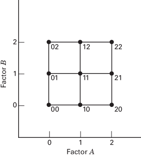
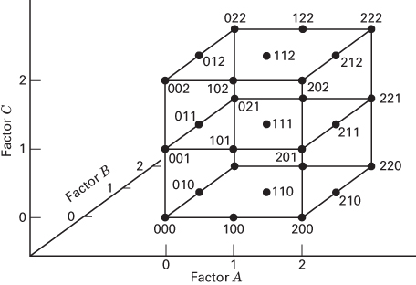
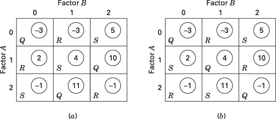
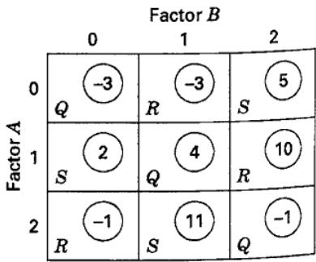
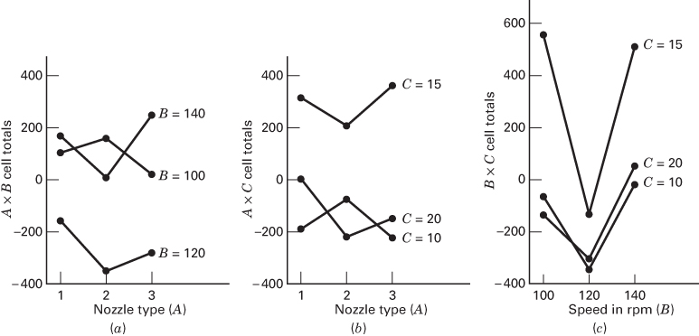
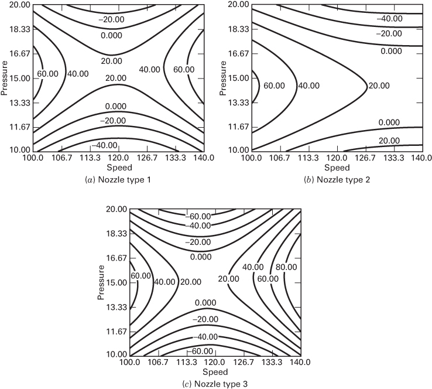

## 9.1 The $3^{k}$ Factorial Design

## 9.1.1 Notation and Motivation for the $3^{k}$ Design

We now discuss the $3^{k}$ factorial design—that is, a factorial arrangement with k factors, each at three levels. Factors and interactions will be denoted by capital letters. We will refer to the three levels of the factors as low, intermediate, and high. Several different notations may be used to represent these factor levels; one possibility is to represent the factor levels by the digits 0 (low), 1 (intermediate), and 2 (high). Each treatment combination in the $3^{k}$ design will be denoted by k digits, where the first digit indicates the level of factor A, the second digit indicates the level of factor B, $\ldots$ , and the kth digit indicates the level of factor K. For example, in a $3^{2}$ design, 00 denotes the treatment combination corresponding to A and B both at the low level, and 01 denotes the treatment combination corresponding to A at the low level and B at the intermediate level. Figures 9.1 and 9.2 show the geometry of the $3^{2}$ and the $3^{3}$ design, respectively, using this notation.

This system of notation could have been used for the $2^{k}$ designs presented previously, with 0 and 1 in place of the $\pm1s$ , respectively. In the $2^{k}$ design, we prefer the $\pm1$ notation because it facilitates the geometric view of the design and because it is directly applicable to regression modeling, blocking, and the construction of fractional factorials.

In the $3^{k}$ system of designs, when the factors are quantitative, we often denote the low, intermediate, and high levels by -1, 0, and +1, respectively. This facilitates fitting a regression model relating the response to the factor levels. For example, consider the $3^{2}$ design in Figure 9.1, and let $x_{1}$ represent factor A and $x_{2}$ represent factor B. A regression model relating the response y to $x_{1}$ and $x_{2}$ that is supported by this design is

$$
y = \beta_ {0} + \beta_ {1} x _ {1} + \beta_ {2} x _ {2} + \beta_ {1 2} x _ {1} x _ {2} + \beta_ {1 1} x _ {1} ^ {2} + \beta_ {2 2} x _ {2} ^ {2} + \epsilon\tag{9.1}
$$

Notice that the addition of a third factor level allows the relationship between the response and design factors to be modeled as a quadratic.

  
■ FIGURE 9.1 Treatment combinations in a $3^{2}$ design

  
■ FIGURE 9.2 Treatment combinations in a $3^{3}$ design

The $3^{k}$ design is certainly a possible choice by an experimenter who is concerned about curvature in the response function. However, two points need to be considered:

1. The $3^{k}$ design is not the most efficient way to model a quadratic relationship; the response surface designs discussed in Chapter 11 are superior alternatives.

2. The $2^{k}$ design augmented with center points, as discussed in Chapter 6, is an excellent way to obtain an indication of curvature. It allows one to keep the size and complexity of the design low and simultaneously obtain some protection against curvature. Then, if curvature is important, the two-level design can be augmented with axial runs to obtain a central composite design, as shown in Figure 6.37. This sequential strategy of experimentation is far more efficient than running a $3^{k}$ factorial design with quantitative factors.

## 9.1.2 The $3^{2}$ Design

The simplest design in the $3^{k}$ system is the $3^{2}$ design, which has two factors, each at three levels. The treatment combinations for this design are shown in Figure 9.1. Because there are $3^{2}=9$ treatment combinations, there are eight degrees of freedom between these treatment combinations. The main effects of A and B each have two degrees of freedom, and the AB interaction has four degrees of freedom. If there are n replicates, there will be $n3^{2}-1$ total degrees of freedom and $3^{2}(n-1)$ degrees of freedom for error.

The sums of squares for A, B, and AB may be computed by the usual methods for factorial designs discussed in Chapter 5. Each main effect can be represented by a linear and a quadratic component, each with a single degree of freedom, as demonstrated in Equation 9.1. Of course, this is meaningful only if the factor is quantitative.

The two-factor interaction AB may be partitioned in two ways. Suppose that both factors A and B are quantitative. The first method consists of subdividing AB into the four single-degree-of-freedom components corresponding to $AB_{L \times L}$ , $AB_{L \times Q}$ , $AB_{Q \times L}$ , and $AB_{Q \times Q}$ . This can be done by fitting the terms $\beta_{12}x_{1}x_{2}$ , $\beta_{122}x_{1}x_{2}^{2}$ , $\beta_{112}x_{1}^{2}x_{2}$ , and $\beta_{1122}x_{1}^{2}x_{2}^{2}$ , respectively, as demonstrated in Example 5.5. For the tool life data, this yields $SS_{AB_{L \times L}} = 8.00$ , $SS_{AB_{L \times Q}} = 42.67$ , $SS_{AB_{Q \times L}} = 2.67$ , and $SS_{AB_{Q \times Q}} = 8.00$ . Because this is an orthogonal partitioning of AB, note that $SS_{AB} = SS_{AB_{L \times L}} + SS_{AB_{L \times Q}} + SS_{AB_{Q \times L}} + SS_{AB_{Q \times Q}} = 61.34$ .

The second method is based on orthogonal Latin squares. This method does not require that the factors be quantitative, and it is usually associated with the case where all factors are qualitative. Consider the totals of the treatment combinations for the data in Example 5.5. These totals are shown in Figure 9.3 as the circled numbers in the squares. The two factors A and B correspond to the rows and columns, respectively, of a $3 \times 3$ Latin square. In Figure 9.3, two particular $3 \times 3$ Latin squares are shown superimposed on the cell totals.

These two Latin squares are orthogonal; that is, if one square is superimposed on the other, each letter in the first square will appear exactly once with each letter in the second square. The totals for the letters in the $(a)$ square are

■ FIGURE 9.3 Treatment combination totals from Example 5.5 with two orthogonal Latin squares superimposed  
  
(a)

  
(b)

$Q = 18, R = -2$ , and $S = 8$ , and the sum of squares between these totals is $[18^2 + (-2)^2 + 8^2] / (3)(2) - [24^2 / (9)(2)] = 33.34$ , with two degrees of freedom. Similarly, the letter totals in the $(b)$ square are $Q = 0, R = 6$ , and $S = 18$ , and the sum of squares between these totals is $[0^2 + 6^2 + 18^2] / (3)(2) - [24^2 / (9)(2)] = 28.00$ , with two degrees of freedom. Note that the sum of these two components is

$$
3 3. 3 4 + 2 8. 0 0 = 6 1. 3 4 = S S _ {A B}
$$

with $2 + 2 = 4$ degrees of freedom.

In general, the sum of squares computed from square (a) is called the AB component of interaction, and the sum of squares computed from square (b) is called the $AB^{2}$ component of interaction. The components AB and $AB^{2}$ each have two degrees of freedom. This terminology is used because if we denote the levels (0, 1, 2) for A and B by $x_{1}$ and $x_{2}$ , respectively, then we find that the letters occupy cells according to the following pattern:

$$
\begin{array}{l l} \text { Square } (a) & \text { Square } (b) \\ \hline Q: x _ {1} + x _ {2} = 0 (\text { mod } 3) & \overline {{Q : x _ {1} + 2 x _ {2} = 0 (\text { mod } 3)}} \\ R: x _ {1} + x _ {2} = 1 (\text { mod } 3) & S: x _ {1} = 2 x _ {2} = 1 (\text { mod } 3) \\ S: x _ {1} + x _ {2} = 2 (\text { mod } 3) & R: x _ {1} + 2 x _ {2} = 2 (\text { mod } 3) \end{array}
$$

For example, in square (b), note that the middle cell corresponds to $x_{1}=1$ and $x_{2}=1$ ; thus, $x_{1}+2x_{2}=1+(2)(1)=3=0$ (mod 3), and Q would occupy the middle cell. When considering expressions of the form $A^{p}B^{q}$ , we establish the convention that the only exponent allowed on the first letter is 1. If the first letter exponent is not 1, the entire expression is squared and the exponents are reduced modulus 3. For example, $A^{2}B$ is the same as $AB^{2}$ because

$$
A ^ {2} B = (A ^ {2} B) ^ {2} = A ^ {4} B ^ {2} = A B ^ {2}
$$

The AB and $AB^{2}$ components of the AB interaction have no actual meaning and are usually not displayed in the analysis of variance table. However, this rather arbitrary partitioning of the AB interaction into two orthogonal two-degree-of-freedom components is very useful in constructing more complex designs. Also, there is no connection between the AB and $AB^{2}$ components of interaction and the sums of squares for $AB_{L\times L}, AB_{L\times Q}, AB_{Q\times L}$ , and $AB_{Q\times Q}$ .

The AB and $AB^{2}$ components of interaction may be computed another way. Consider the treatment combination totals in either square in Figure 9.3. If we add the data by diagonals downward from left to right, we obtain the totals $-3 + 4 - 1 = 0$ , $-3 + 10 - 1 = 6$ , and $5 + 11 + 2 = 18$ . The sum of squares between these totals is $28.00(AB^{2})$ . Similarly, the diagonal totals downward from right to left are $5 + 4 - 1 = 8$ , $-3 + 2 - 1 = -2$ , and $-3 + 11 + 10 = 18$ . The sum of squares between these totals is $33.34(AB)$ . Yates called these components of interaction as the I and J components of interaction, respectively. We use both notations interchangeably; that is,

$$
\begin{array}{l} I (A B) = A B ^ {2} \\ J (A B) = A B \end{array}
$$

For more information about decomposing the sums of squares in three-level designs, refer to the supplemental material for this chapter.

## 9.1.3 The $3^{3}$ Design

Now suppose there are three factors $(A, B, \text{and } C)$ under study and that each factor is at three levels arranged in a factorial experiment. This is a $3^{3}$ factorial design, and the experimental layout and treatment combination notation are shown in Figure 9.2. The 27 treatment combinations have 26 degrees of freedom. Each main effect has two degrees of freedom, each two-factor interaction has four degrees of freedom, and the three-factor interaction has eight degrees of freedom. If there are n replicates, there are $n3^{3} - 1$ total degrees of freedom and $3^{3}(n - 1)$ degrees of freedom for error.

The sums of squares may be calculated using the standard methods for factorial designs. In addition, if the factors are quantitative, the main effects may be partitioned into linear and quadratic components, each with a single degree of freedom. The two-factor interactions may be decomposed into linear × linear, linear × quadratic, quadratic × linear, and quadratic × quadratic effects. Finally, the three-factor interaction ABC can be partitioned into eight single-degree-of-freedom components corresponding to linear × linear × linear, linear × linear × quadratic, and so on. Such a breakdown for the three-factor interaction is generally not very useful.

It is also possible to partition the two-factor interactions into their I and J components. These would be designated $AB, AB^{2}, AC, AC^{2}, BC$ , and $BC^{2}$ , and each component would have two degrees of freedom. As in the $3^{2}$ design, these components have no physical significance.

The three-factor interaction ABC may be partitioned into four orthogonal two-degrees-of-freedom components, which are usually called the W, X, Y, and Z components of the interaction. They are also referred to as the $AB^{2}C^{2}, AB^{2}C, ABC^{2}$ , and ABC components of the ABC interaction, respectively. The two notations are used interchangeably; that is,

$$
\begin{array}{l} W (A B C) = A B ^ {2} C ^ {2} \\ X (A B C) = A B ^ {2} C \\ Y (A B C) = A B C ^ {2} \\ Z (A B C) = A B C \end{array}
$$

Note that no first letter can have an exponent other than 1. Like the I and J components, the W, X, Y, and Z components have no practical interpretation. They are, however, useful in constructing more complex designs.

## EXAMPLE 9.1

A machine is used to fill 5-gallon metal containers with soft drink syrup. The variable of interest is the amount of syrup loss due to frothing. Three factors are thought to influence frothing: the nozzle design (A), the filling speed (B), and the operating pressure (C). Three nozzles, three filling speeds, and three pressures are chosen, and two replicates of a $3^{3}$ factorial experiment are run. The coded data are shown in Table 9.1.

the usual methods. We see that the filling speed and operating pressure are statistically significant. All three two-factor interactions are also significant. The two-factor interactions are analyzed graphically in Figure 9.4. The middle level of speed gives the best performance, nozzle types 2 and 3, and either the low (10 psi) or high (20 psi) pressure seems most effective in reducing syrup loss.

The analysis of variance for the syrup loss data is shown in Table 9.2. The sums of squares have been computed by

## TABLE 9.1

Syrup Loss Data for Example 9.1 (units are cubic centimeters -70)

<table><tr><td rowspan="4">Pressure (in psi) (C)</td><td colspan="9">Nozzle Type (A)</td></tr><tr><td colspan="3">1</td><td colspan="3">2</td><td colspan="3">3</td></tr><tr><td colspan="9">Speed (in rpm) (B)</td></tr><tr><td>100</td><td>120</td><td>140</td><td>100</td><td>120</td><td>140</td><td>100</td><td>120</td><td>140</td></tr><tr><td>10</td><td>-35</td><td>-45</td><td>-40</td><td>17</td><td>-65</td><td>20</td><td>-39</td><td>-55</td><td>15</td></tr><tr><td></td><td>-25</td><td>-60</td><td>15</td><td>24</td><td>-58</td><td>4</td><td>-35</td><td>-67</td><td>-30</td></tr><tr><td>15</td><td>110</td><td>-10</td><td>80</td><td>55</td><td>-55</td><td>110</td><td>90</td><td>-28</td><td>110</td></tr><tr><td></td><td>75</td><td>30</td><td>54</td><td>120</td><td>-44</td><td>44</td><td>113</td><td>-26</td><td>135</td></tr><tr><td>20</td><td>4</td><td>-40</td><td>31</td><td>-23</td><td>-64</td><td>-20</td><td>-30</td><td>-61</td><td>54</td></tr><tr><td></td><td>5</td><td>-30</td><td>36</td><td>-5</td><td>-62</td><td>-31</td><td>-55</td><td>-52</td><td>4</td></tr></table>

TABLE 9.2  
Analysis of Variance for Syrup Loss Data

<table><tr><td>Source of Variation</td><td>Sum of Squares</td><td>Degrees of Freedom</td><td>Mean Square</td><td> $F_0$ </td><td>P-Value</td></tr><tr><td>A, nozzle</td><td>993.77</td><td>2</td><td>496.89</td><td>1.17</td><td>0.3256</td></tr><tr><td>B, speed</td><td>61,190.33</td><td>2</td><td>30,595.17</td><td>71.74</td><td>&lt; 0.0001</td></tr><tr><td>C, pressure</td><td>69,105.33</td><td>2</td><td>34,552.67</td><td>81.01</td><td>&lt; 0.0001</td></tr><tr><td>AB</td><td>6,300.90</td><td>4</td><td>1,575.22</td><td>3.69</td><td>0.0160</td></tr><tr><td>AC</td><td>7,513.90</td><td>4</td><td>1,878.47</td><td>4.40</td><td>0.0072</td></tr><tr><td>BC</td><td>12,854.34</td><td>4</td><td>3,213.58</td><td>7.53</td><td>0.0003</td></tr><tr><td>ABC</td><td>4,628.76</td><td>8</td><td>578.60</td><td>1.36</td><td>0.2580</td></tr><tr><td>Error</td><td>11,515.50</td><td>27</td><td>426.50</td><td></td><td></td></tr><tr><td>Total</td><td>174,102.83</td><td>53</td><td></td><td></td><td></td></tr></table>

■ FIGURE 9.4 Two-factor interactions for Example 9.1

Example 9.1 illustrates a situation where the three-level design often finds some application; one or more of the factors are qualitative, naturally taking on three levels, and the remaining factors are quantitative. In this example, suppose only three nozzle designs are of interest. This is clearly, then, a qualitative factor that requires three levels. The filling speed and the operating pressure are quantitative factors. Therefore, we could fit a quadratic model such as Equation 9.1 in the two factors speed and pressure at each level of the nozzle factor.

Table 9.3 shows these quadratic regression models. The $\beta$ 's in these models were estimated using a standard linear regression computer program. (We will discuss least squares regression in more detail in Chapter 10.) In these models, the variables $x_{1}$ and $x_{2}$ are coded to the levels $-1, 0, +1$ as discussed previously, and we assumed the following natural levels for pressure and speed:

<table><tr><td>Coded Level</td><td>Speed (rpm)</td><td>Pressure (psi)</td></tr><tr><td>-1</td><td>100</td><td>10</td></tr><tr><td>0</td><td>120</td><td>15</td></tr><tr><td>+1</td><td>140</td><td>20</td></tr></table>

TABLE 9.3  
Regression Models for Example 9.1

<table><tr><td>Nozzle Type</td><td> $x_1$ =Speed (S),  $x_2$ =Pressure (P) in Coded Units</td></tr><tr><td>1</td><td> $\hat{y} = 22.1 + 3.5x_1 + 16.3x_2 + 51.7x_1^2 - 71.8x_2^2 + 2.9x_1x_2$  $\hat{y} = 1217.3 - 31.256S + 86.017P + 0.12917S^2 - 2.8733P^2 + 0.02875SP$ </td></tr><tr><td>2</td><td> $\hat{y} = 25.6 - 22.8x_1 - 12.3x_2 + 14.1x_1^2 - 56.9x_2^2 - 0.7x_1x_2$  $\hat{y} = 180.1 - 9.475S + 66.75P + 0.035S^2 - 2.2767P^2 - 0.0075SP$ </td></tr><tr><td>3</td><td> $\hat{y} = 15.1 + 20.3x_1 + 5.9x_2 + 75.8x_1^2 - 94.9x_2^2 + 10.5x_1x_2$  $\hat{y} = 1940.1 - 46.058S + 102.48P + 0.18958S^2 - 3.7967P^2 + 0.105SP$ </td></tr></table>

Table 9.3 presents models in terms of both these coded variables and the natural levels of speed and pressure. Figure 9.5 shows the response surface contour plots of constant syrup loss as a function of speed and pressure for each nozzle type. These plots reveal considerable useful information about the performance of this filling system. Because the objective is to minimize syrup loss, nozzle type 3 would be preferred, as the smallest observed contours (-60) appear only on this plot. Filling speed near the middle level of 120 rpm and the either low or high pressure levels should be used.

  

■ FIGURE 9.5 Contours of constant syrup loss (units: cc -70) as a function of speed and pressure for nozzle types 1, 2, and 3, Example 9.1

When constructing contour plots for an experiment that has a mixture of quantitative and qualitative factors, it is not unusual to find that the shapes of the surfaces in the quantitative factors are very different at each level of the qualitative factors. This is noticeable to some degree in Figure 9.5, where the shape of the surface for nozzle type 2 is considerably elongated in comparison to the surfaces for nozzle types 1 and 3. When this occurs, it implies that there are interactions present between the quantitative and qualitative factors, and as a result, the optimum operating conditions (and other important conclusions) in terms of the quantitative factors are very different at each level of the qualitative factors.

We can easily show the numerical partitioning of the ABC interaction into its four orthogonal two-degrees-of-freedom components using the data in Example 9.1. The general procedure has been described by Davies (1956) and Cochran and Cox (1957). First, select any two of the three factors, say AB, and compute the I and J totals of the AB interaction at each level of the third factor C. These calculations are as follows:

<table><tr><td rowspan="2">C</td><td colspan="4">A</td><td colspan="2">Totals</td></tr><tr><td>B</td><td>1</td><td>2</td><td>3</td><td>I</td><td>J</td></tr><tr><td rowspan="3">10</td><td>100</td><td>-60</td><td>41</td><td>-74</td><td>-198</td><td>-222</td></tr><tr><td>120</td><td>-105</td><td>-123</td><td>-122</td><td>-106</td><td>-79</td></tr><tr><td>140</td><td>-25</td><td>24</td><td>-15</td><td>-155</td><td>-158</td></tr><tr><td rowspan="3">15</td><td>100</td><td>185</td><td>175</td><td>203</td><td>331</td><td>238</td></tr><tr><td>120</td><td>20</td><td>-99</td><td>-54</td><td>255</td><td>440</td></tr><tr><td>140</td><td>134</td><td>154</td><td>245</td><td>377</td><td>285</td></tr><tr><td rowspan="3">20</td><td>100</td><td>9</td><td>-28</td><td>-85</td><td>-59</td><td>-144</td></tr><tr><td>120</td><td>-70</td><td>-126</td><td>-113</td><td>-74</td><td>-40</td></tr><tr><td>140</td><td>67</td><td>-51</td><td>58</td><td>-206</td><td>-155</td></tr></table>

The $I(AB)$ and $J(AB)$ totals are now arranged in a two-way table with factor C, and the I and J diagonal totals of this new display are computed as follows:

<table><tr><td rowspan="2">C</td><td rowspan="2"></td><td rowspan="2">I(AB)</td><td rowspan="2"></td><td colspan="2">Totals</td><td rowspan="2">C</td><td rowspan="2"></td><td rowspan="2">J(AB)</td><td rowspan="2"></td><td colspan="2">Totals</td></tr><tr><td>I</td><td>J</td><td>I</td><td>J</td></tr><tr><td>10</td><td>-198</td><td>-106</td><td>-155</td><td>-149</td><td>41</td><td>10</td><td>-222</td><td>-79</td><td>-158</td><td>63</td><td>138</td></tr><tr><td>15</td><td>331</td><td>255</td><td>377</td><td>212</td><td>19</td><td>15</td><td>238</td><td>440</td><td>285</td><td>62</td><td>4</td></tr><tr><td>20</td><td>-59</td><td>-74</td><td>-206</td><td>102</td><td>105</td><td>20</td><td>-144</td><td>-40</td><td>-155</td><td>40</td><td>23</td></tr></table>

The $I$ and $J$ diagonal totals computed above are actually the totals representing the quantities $I[I(AB) \times C] = AB^2C^2$ , $J[I(AB) \times C] = AB^2C$ , $I[J(AB) \times C] = ABC^2$ , and $J[J(AB) \times C] = ABC$ or the $W, X, Y$ , and $Z$ components of $ABC$ . The sums of squares are found in the usual way; that is,

$$
\begin{array}{r l} {I [ I (A B) \times C ]} & {= A B ^ {2} C ^ {2} = W (A B C)} \\ & {= \frac {(- 1 4 9) ^ {2} + (2 1 2) ^ {2} + (1 0 2) ^ {2}}{1 8} - \frac {(1 6 5) ^ {2}}{5 4} = 3 8 0 4. 1 1} \end{array}
$$

$$
\begin{array}{r l} J [ I (A B) \times C ] & = A B ^ {2} C = X (A B C) \\ & = \frac {(4 1) ^ {2} + (1 9) ^ {2} + (1 0 5) ^ {2}}{1 8} - \frac {(1 6 5) ^ {2}}{5 4} = 2 2 1. 7 7 \end{array}
$$

$$
\begin{array}{r l} J [ J (A B) \times C ] & = A B C ^ {2} = Y (A B C) \\ & = \frac {(6 3) ^ {2} + (6 2) ^ {2} + (4 0) ^ {2}}{1 8} - \frac {(1 6 5) ^ {2}}{5 4} = 1 8. 7 7 \\ J [ J (A B) \times C ] & = A B C = Z (A B C) \\ & = \frac {(1 3 8) ^ {2} + (4) ^ {2} + (2 3) ^ {2}}{1 8} - \frac {(1 6 5) ^ {2}}{5 4} = 5 8 4. 1 1 \end{array}
$$

Although this is an orthogonal partitioning of $SS_{ABC}$ , we point out again that it is not customarily displayed in the analysis of variance table. In subsequent sections, we discuss the occasional need for the computation of one or more of these components.

## 9.1.4 The General $3^{k}$ Design

The concepts utilized in the $3^{2}$ and $3^{3}$ designs can be readily extended to the case of k factors, each at three levels, that is, to a $3^{k}$ factorial design. The usual digital notation is employed for the treatment combinations, so 0120 represents a treatment combination in a $3^{4}$ design with A and D at the low levels, B at the intermediate level, and C at the high level. There are $3^{k}$ treatment combinations, with $3^{k}-1$ degrees of freedom between them. These treatment combinations allow sums of squares to be determined for k main effects, each with two degrees of freedom; $\binom{k}{2}$ two-factor interactions, each with four degrees of freedom; ... ; and one k-factor interaction with $2^{k}$ degrees of freedom. In general, an h-factor interaction has $2^{h}$ degrees of freedom. If there are n replicates, there are $n3^{k}-1$ total degrees of freedom and $3^{k}(n-1)$ degrees of freedom for error.

Sums of squares for effects and interactions are computed by the usual methods for factorial designs. Typically, three-factor and higher interactions are not broken down any further. However, any h-factor interaction has $2^{h-1}$ orthogonal two-degrees-of-freedom components. For example, the four-factor interaction ABCD has $2^{4-1} = 8$ orthogonal two-degrees-of-freedom components, denoted by $ABCD^{2}, ABC^{2}D, AB^{2}CD, ABCD, ABC^{2}D^{2}, AB^{2}C^{2}D, AB^{2}CD^{2}$ , and $AB^{2}C^{2}D^{2}$ . In writing these components, note that the only exponent allowed on the first letter is 1. If the exponent on the first letter is not 1, then the entire expression must be squared and the exponents reduced modulus 3. To demonstrate this, consider

$$
A ^ {2} B C D = (A ^ {2} B C D) ^ {2} = A ^ {4} B ^ {2} C ^ {2} D ^ {2} = A B ^ {2} C ^ {2} D ^ {2}
$$

These interaction components have no physical interpretation, but they are useful in constructing more complex designs.

The size of the design increases rapidly with k. For example, a $3^{3}$ design has 27 treatment combinations per replication, a $3^{4}$ design has 81, a $3^{5}$ design has 243, and so on. Therefore, only a single replicate of the $3^{k}$ design is frequently considered, and higher order interactions are combined to provide an estimate of error. As an illustration, if three-factor and higher interactions are negligible, then a single replicate of the $3^{3}$ design provides 8 degrees of freedom for error, and a single replicate of the $3^{4}$ design provides 48 degrees of freedom for error. These are still large designs for $k \geq 3$ factors and, consequently, not too useful.
