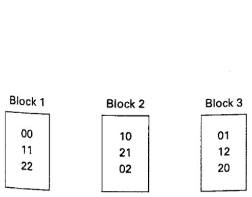
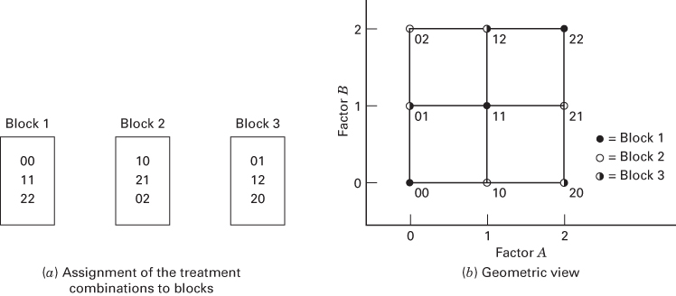
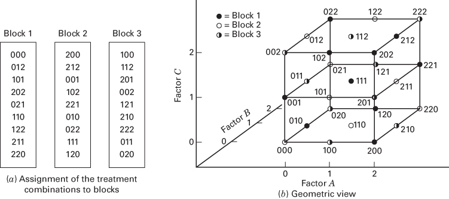
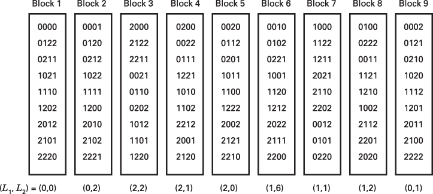

## 9.2 Confounding in the $3^{k}$ Factorial Design

Even when a single replicate of the $3^{k}$ design is considered, the design requires so many runs that it is unlikely that all $3^{k}$ runs can be made under uniform conditions. Thus, confounding in blocks is often necessary. The $3^{k}$ design may be confounded in $3^{p}$ incomplete blocks, where p < k. Thus, these designs may be confounded in three blocks, nine blocks, and so on.

## 9.2.1 The $3^{k}$ Factorial Design in Three Blocks

Suppose that we wish to confound the $3^{k}$ design in three incomplete blocks. These three blocks have two degrees of freedom among them; thus, there must be two degrees of freedom confounded with blocks. Recall that in the $3^{k}$ factorial series each main effect has two degrees of freedom. Furthermore, every two-factor interaction has four degrees of freedom and can be decomposed into two components of interaction (e.g., AB and $AB^{2}$ ), each with two degrees of freedom; every three-factor interaction has eight degrees of freedom and can be decomposed into four components of interaction (e.g., ABC, $ABC^{2}$ , $AB^{2}C$ , and $AB^{2}C^{2}$ ), each with two degrees of freedom; and so on. Therefore, it is convenient to confound a component of interaction with blocks.

The general procedure is to construct a defining contrast

$$
L = \alpha_ {1} x _ {1} + \alpha_ {2} x _ {2} + \dots + \alpha_ {k} x _ {k}\tag{9.2}
$$

where $\alpha_{i}$ represents the exponent on the ith factor in the effect to be confounded and $x_{i}$ is the level of the ith factor in a particular treatment combination. For the $3^{k}$ series, we have $\alpha_{i}=0,1$ , or 2 with the first nonzero $\alpha_{i}$ being unity, and $x_{i}=0$ (low level), 1 (intermediate level), or 2 (high level). The treatment combinations in the $3^{k}$ design are assigned to blocks based on the value of L (mod 3). Because L (mod 3) can take on only the values 0, 1, or 2, three blocks are uniquely defined. The treatment combinations satisfying L=0 (mod 3) constitute the principal block. This block will always contain the treatment combination 00...0.

For example, suppose we wish to construct a $3^{2}$ factorial design in three blocks. Either component of the AB interaction, AB or $AB^{2}$ , may be confounded with blocks. Arbitrarily choosing $AB^{2}$ , we obtain the defining contrast

$$
L = x _ {1} + 2 x _ {2}
$$

The value of L (mod 3) of each treatment combination may be found as follows:

$$
\begin{array}{r l} 0 0: & L = 1 (0) + 2 (0) = 0 = 0 (\text {mod} 3) \quad 1 1: \quad L = 1 (1) + 2 (1) = 3 = 0 (\text {mod} 3) \\ 0 1: & L = 1 (0) + 2 (1) = 2 = 2 (\text {mod} 3) \quad 2 1: \quad L = 1 (2) + 2 (1) = 4 = 1 (\text {mod} 3) \\ 0 2: & L = 1 (0) + 2 (2) = 4 = 1 (\text {mod} 3) \quad 1 2: \quad L = 1 (1) + 2 (2) = 5 = 2 (\text {mod} 3) \\ 1 0: & L = 1 (1) + 2 (0) = 1 = 1 (\text {mod} 3) \quad 2 2: \quad L = 1 (2) + 2 (2) = 6 = 0 (\text {mod} 3) \\ & 2 0: L = 1 (2) + 2 (0) = 2 = 2 (\text {mod} 3) \end{array}
$$

The blocks are shown in Figure 9.6.

The elements in the principal block form a group with respect to addition modulus 3. Referring to Figure 9.6, we see that $11 + 11 = 22$ and $11 + 22 = 00$ . Treatment combinations in the other two blocks may be generated by adding, modulus 3, any element in the new block to the elements of the principal block. Thus, we use 10 for block 2 and obtain

$$
1 0 + 0 0 = 1 0 \quad 1 0 + 1 1 = 2 1 \quad \text { and } \quad 1 0 + 2 2 = 0 2
$$

(a) Assignment of the treatment combinations to blocks  
  
■ FIGURE 9.6 The $3^{2}$ design in three blocks with $AB^{2}$ confounded

To generate block 3, we find using 01

$$
0 1 + 0 0 = 0 1 \quad 0 1 + 1 1 = 1 2 \quad \text { and } \quad 0 1 + 2 2 = 2 0
$$

## EXAMPLE 9.2

We illustrate the statistical analysis of the $3^{2}$ design confounded in three blocks by using the following data, which

$$
\begin{array}{l} \text {Block 1} \\ \boxed {0 0 = 4} \\ 1 1 = - 4 \\ 2 2 = 0 \\ \text {Block totals} = \quad 0 \end{array}
$$

Using conventional methods for the analysis of factorials, we find that $SS_{A} = 131.56$ and $SS_{B} = 0.22$ .

We also find that

$$
S S _ {\text { Blocks }} = \frac {(0) ^ {2} + (7) ^ {2} + (0) ^ {2}}{3} - \frac {(7) ^ {2}}{9} = 1 0. 8 9
$$

However, $SS_{Blocks}$ is exactly equal to the $AB^{2}$ component of interaction. To see this, write the observations as follows:

<table><tr><td rowspan="2" colspan="2"></td><td colspan="3">Factor B</td></tr><tr><td>0</td><td>1</td><td>2</td></tr><tr><td rowspan="3">Factor A</td><td>0</td><td>4</td><td>5</td><td>8</td></tr><tr><td>1</td><td>-2</td><td>-4</td><td>-5</td></tr><tr><td>2</td><td>0</td><td>1</td><td>0</td></tr></table>

come from the single replicate of the $3^{2}$ design shown in Figure 9.6.

$$
\begin{array}{c c} \text {Block 2} & \text {Block 3} \\ \boxed {1 0 = - 2} & \boxed {0 1 = 5} \\ 2 1 = 1 \\ 0 2 = 8 \\ \hline 7 & 0 \end{array}
$$

Recall from Section 9.1.2 that the I or $AB^{2}$ component of the AB interaction may be found by computing the sum of squares between the left-to-right diagonal totals in the above layout. This yields

$$
S S _ {A B ^ {2}} = \frac {(0) ^ {2} + (0) ^ {2} + (7) ^ {2}}{3} - \frac {(7) ^ {2}}{9} = 1 0. 8 9
$$

which is identical to $SS_{\text{Blocks}}$ .

The analysis of variance is shown in Table 9.4. Because there is only one replicate, no formal tests can be performed. It is not a good idea to use the AB component of interaction as an estimate of error.

## TABLE 9.4

Analysis of Variance for Data in Example 9.2

<table><tr><td>Source of Variation</td><td>Sum of Squares</td><td>Degrees of Freedom</td></tr><tr><td>Blocks ( $AB^{2}$ )</td><td>10.89</td><td>2</td></tr><tr><td>A</td><td>131.56</td><td>2</td></tr><tr><td>B</td><td>0.22</td><td>2</td></tr><tr><td>AB</td><td>2.89</td><td>2</td></tr><tr><td>Total</td><td>145.56</td><td>8</td></tr></table>

We now look at a slightly more complicated design—a $3^{3}$ factorial confounded in three blocks of nine runs each. The $AB^{2}C^{2}$ component of the three-factor interaction will be confounded with blocks. The defining contrast is

$$
L = x _ {1} + 2 x _ {2} + 2 x _ {3}
$$

It is easy to verify that the treatment combinations 000, 012, and 101 belong in the principal block. The remaining runs in the principal block are generated as follows:

$$
1 0 1 + 1 0 1 = 2 0 2
$$

$$
1 0 1 + 0 2 1 = 1 2 2 \tag {7}
$$

$$
0 1 2 + 0 1 2 = 0 2 1
$$

$$
0 1 2 + 2 0 2 = 2 1 1
$$

$$
1 0 1 + 0 1 2 = 1 1 0
$$

$$
(9) 0 2 1 + 2 0 2 = 2 2 0
$$

To find the runs in another block, note that the treatment combination 200 is not in the principal block. Thus, the elements of block 2 are

$$
2 0 0 + 0 0 0 = 2 0 0
$$

$$
(4) 2 0 0 + 2 0 2 = 1 0 2
$$

$$
2 0 0 + 1 2 2 = 0 2 2 \tag {7}
$$

$$
(2) 2 0 0 + 0 1 2 = 2 1 2
$$

$$
(5) 2 0 0 + 0 2 1 = 2 2 1
$$

$$
(8) 2 0 0 + 2 1 1 = 1 1 1
$$

$$
(3) 2 0 0 + 1 0 1 = 0 0 1
$$

$$
(6) 2 0 0 + 1 1 0 = 0 1 0
$$

$$
(9) 2 0 0 + 2 2 0 = 1 2 0
$$

Notice that all these runs satisfy $L = 2 \pmod{3}$ . The final block is found by observing that 100 does not belong in block 1 or 2. Using 100 as above yields

$$
(1) 1 0 0 + 0 0 0 = 1 0 0
$$

$$
(4) 1 0 0 + 2 0 2 = 0 0 2
$$

$$
1 0 0 + 1 2 2 = 2 2 2 \tag {7}
$$

$$
1 0 0 + 0 1 2 = 1 1 2 \tag {2}
$$

$$
1 0 0 + 0 2 1 = 1 2 1
$$

$$
1 0 0 + 2 1 1 = 0 1 1 \tag {8}
$$

$$
(3) 1 0 0 + 1 0 1 = 2 0 1
$$

$$
1 0 0 + 1 1 0 = 2 1 0
$$

$$
1 0 0 + 2 2 0 = 0 2 0
$$

The blocks are shown in Figure 9.7.

The analysis of variance for this design is shown in Table 9.5. Through the use of this confounding scheme, information on all the main effects and two-factor interactions is available. The remaining components of the three-factor interaction (ABC, $AB^{2}C$ , and $ABC^{2}$ ) are combined as an estimate of error. The sum of squares for those three components could be obtained by subtraction. In general, for the $3^{k}$ design in three blocks, we would always select a component of the highest order interaction to confound with blocks. The remaining unconfounded components of this interaction could be obtained by computing the k-factor interaction in the usual way and subtracting from this quantity the sum of squares for blocks.

## 9.2.2 The $3^{k}$ Factorial Design in Nine Blocks

In some experimental situations, it may be necessary to confound the $3^{k}$ design in nine blocks. Thus, eight degrees of freedom will be confounded with blocks. To construct these designs, we choose two components of interaction, and, as a result, two more will be confounded automatically, yielding the required eight degrees of freedom. These two are the generalized interactions of the two effects originally chosen. In the $3^{k}$ system, the generalized interactions of two effects (e.g., P and Q) are defined as PQ and $PQ^{2}$ (or $P^{2}Q$ ).

■ FIGURE 9.7 The $3^{3}$ design in three blocks with $AB^{2}C^{2}$ confounded

TABLE 9.5  
Analysis of Variance for a $3^{3}$ Design with $AB^{2}C^{2}$ Confounded

<table><tr><td>Source of Variation</td><td>Degrees of Freedom</td></tr><tr><td>Blocks (AB2C2)</td><td>2</td></tr><tr><td>A</td><td>2</td></tr><tr><td>B</td><td>2</td></tr><tr><td>C</td><td>2</td></tr><tr><td>AB</td><td>4</td></tr><tr><td>AC</td><td>4</td></tr><tr><td>BC</td><td>4</td></tr><tr><td>Error (ABC + AB2C + ABC2)</td><td>6</td></tr><tr><td>Total</td><td>26</td></tr></table>

The two components of interaction initially chosen yield two defining contrasts

$$
\begin{array}{l l} L _ {1} = \alpha_ {1} x _ {1} + \alpha_ {2} x _ {2} + \dots + \alpha_ {k} x _ {k} = u (\mathrm{mod} 3) & u = 0, 1, 2 \\ L _ {2} = \beta_ {1} x _ {1} + \beta_ {2} x _ {2} + \dots + \beta_ {k} x _ {k} = h (\mathrm{mod} 3) & h = 0, 1, 2 \end{array}\tag{9.3}
$$

where $\{\alpha_{i}\}$ and $\{\beta_{j}\}$ are the exponents in the first and second generalized interactions, respectively, with the convention that the first nonzero $\alpha_{i}$ and $\beta_{j}$ are unity. The defining contrasts in Equation 9.3 imply nine simultaneous equations specified by the pair of values for $L_{1}$ and $L_{2}$ . Treatment combinations having the same pair of values for $(L_{1}, L_{2})$ are assigned to the same block.

The principal block consists of treatment combinations satisfying $L_{1} = L_{2} = 0 \pmod{3}$ . The elements of this block form a group with respect to addition modulus 3; thus, the scheme given in Section 9.2.1 can be used to generate the blocks.

As an example, consider the $3^{4}$ factorial design confounded in nine blocks of nine runs each. Suppose we choose to confound $ABC$ and $AB^{2}D^{2}$ . Their generalized interactions

$$
\begin{array}{l} (A B C) (A B ^ {2} D ^ {2}) = A ^ {2} B ^ {3} C D ^ {2} = (A ^ {2} B ^ {3} C D ^ {2}) ^ {2} = A C ^ {2} D \\ (A B C) (A B ^ {2} D ^ {2}) ^ {2} = A ^ {3} B ^ {5} C D ^ {4} = B ^ {2} C D = (B ^ {2} C D) ^ {2} = B C ^ {2} D ^ {2} \end{array}
$$

are also confounded with blocks. The defining contrasts for $ABC$ and $AB^2D^2$ are

$$
\begin{array}{l} L _ {1} = x _ {1} + x _ {2} + x _ {3} \\ L _ {2} = x _ {1} + 2 x _ {2} + 2 x _ {4} \end{array}\tag{9.4}
$$

The nine blocks may be constructed by using the defining contrasts (Equation 9.4) and the group-theoretic property of the principal block. The design is shown in Figure 9.8.

For the $3^{k}$ design in nine blocks, four components of interaction will be confounded. The remaining unconfounded components of these interactions can be determined by subtracting the sum of squares for the confounded component from the sum of squares for the entire interaction. The method described in Section 9.1.3 may be useful in computing the components of interaction.

## 9.2.3 The $3^{k}$ Factorial Design in $3^{p}$ Blocks

The $3^{k}$ factorial design may be confounded in $3^{p}$ blocks of $3^{k-p}$ observations each, where p < k. The procedure is to select p independent effects to be confounded with blocks. As a result, exactly $(3^{p} - 2p - 1)/2$ other effects are automatically confounded. These effects are the generalized interactions of those effects originally chosen.

  
■ FIGURE 9.8 The $3^{4}$ design in nine blocks with ABC, $AB^{2}D^{2}$ , $AC^{2}D$ , and $BC^{2}D^{2}$ confounded

As an illustration, consider a $3^{7}$ design to be confounded in 27 blocks. Because p = 3, we would select three independent components of interaction and automatically confound $[3^{3} - 2(3) - 1]/2 = 10$ others. Suppose we choose $ABC^{2}DG, BCE^{2}F^{2}G$ , and BDEFG. Three defining contrasts can be constructed from these effects, and the 27 blocks can be generated by the methods previously described. The other 10 effects confounded with blocks are

$$
(A B C ^ {2} D G) (B C E ^ {2} F ^ {2} G) = A B ^ {2} D E ^ {2} F ^ {2} G ^ {2}
$$

$$
(A B C ^ {2} D G) (B C E ^ {2} F ^ {2} G) ^ {2} = A B ^ {3} C ^ {4} D E ^ {4} F ^ {4} G ^ {3} = A C D E F
$$

$$
(A B C ^ {2} D G) (B D E F G) = A B ^ {2} C ^ {2} D ^ {2} E F G ^ {2}
$$

$$
(A B C ^ {2} D G) (B D E F G) ^ {2} = A B ^ {3} C ^ {2} D ^ {3} E ^ {2} F ^ {2} G ^ {3} = A C ^ {2} E ^ {2} F ^ {2}
$$

$$
(B C E ^ {2} F ^ {2} G) (B D E F G) = B ^ {2} C D E ^ {3} F ^ {3} G ^ {2} = B C ^ {2} D ^ {2} G
$$

$$
(B C E ^ {2} F ^ {2} G) (B D E F G) ^ {2} = B ^ {3} C D ^ {2} E ^ {4} F ^ {4} G ^ {3} = C D ^ {2} E F
$$

$$
(A B C ^ {2} D G) (B C E ^ {2} F ^ {2} G) (B D E F G) = A B ^ {3} C ^ {3} D ^ {2} E ^ {3} F ^ {3} G ^ {3} = A D ^ {2}
$$

$$
(A B C ^ {2} D G) ^ {2} (B C E ^ {2} F ^ {3} G) (B D E F G) = A ^ {2} B ^ {4} C ^ {5} D ^ {3} G ^ {4} = A B ^ {2} C G ^ {2}
$$

$$
(A B C ^ {2} D G) (B C E ^ {2} F ^ {2} G) ^ {2} (B D E F G) = A B C D ^ {2} E ^ {2} F ^ {2} G
$$

$$
(A B C ^ {2} D G) (B C E ^ {2} F ^ {2} G) (B D E F G) ^ {2} = A B C ^ {3} D ^ {3} E ^ {4} F ^ {4} G ^ {4} = A B E F G
$$

This is a huge design requiring $3^7 = 2187$ observations arranged in 27 blocks of 81 observations each.
