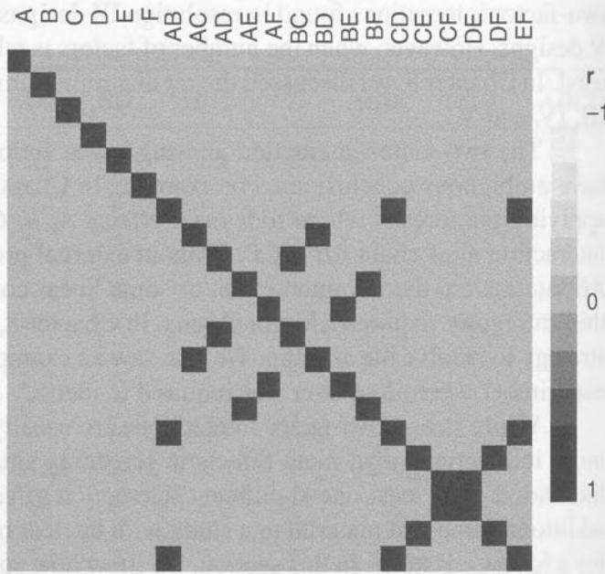
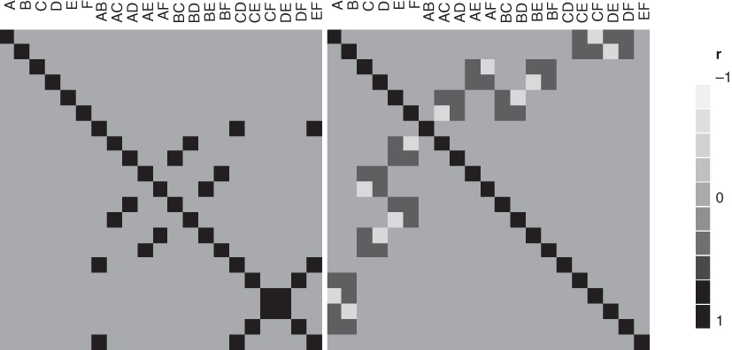
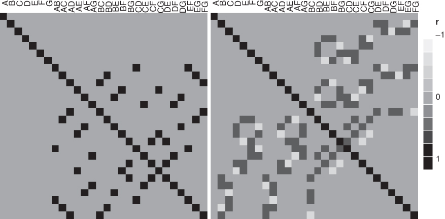
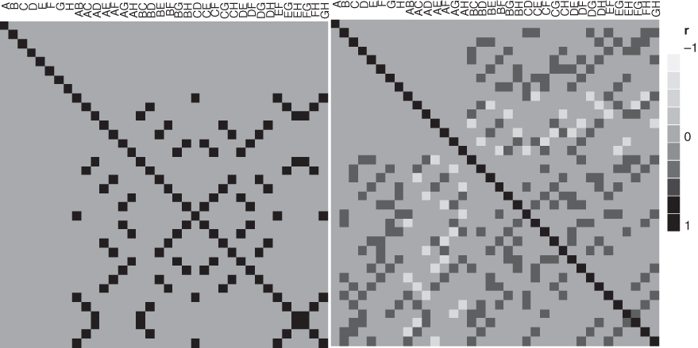
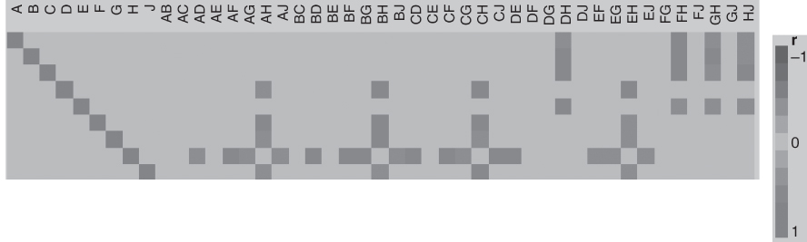
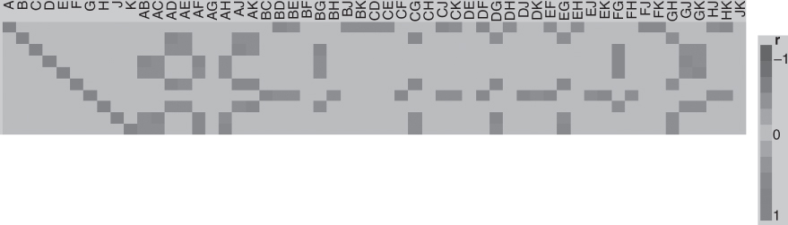
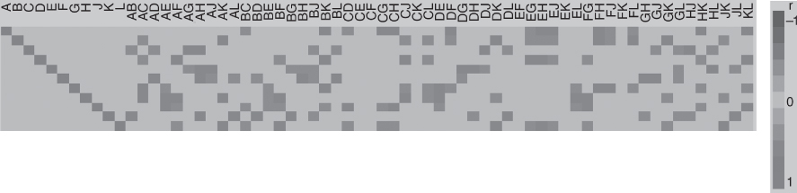
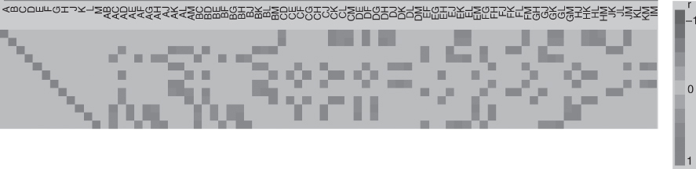
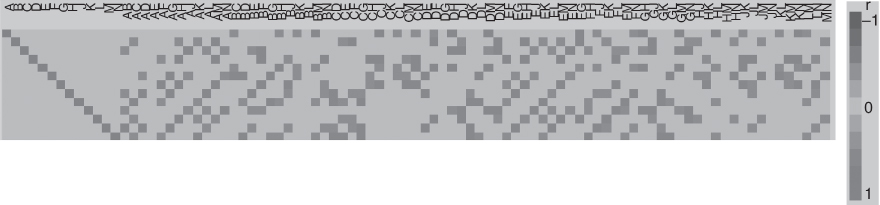
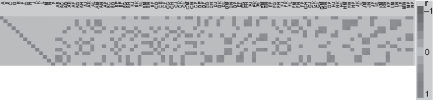

## 9.5 Nonregular Fractional Factorial Designs

The regular two-level fractional factorial designs in Chapter 8 are a staple for factor screening in modern industrial applications. Resolution IV designs are particularly popular because they avoid the confounding of main effects and two-factor interactions found in resolution III designs while avoiding the larger sample size requirements of resolution V designs. However, when the number of factors is relatively large, say k = 9 or more, resolution III designs are widely used. In Chapter 8, we discussed the regular minimum aberration versions of the $2^{k-p}$ fractional factorials of resolutions III, IV, and V.

The two-factor interaction aliasing in resolution III and IV designs can result in experiments whose outcomes have ambiguous conclusions. For example, in Chapter 8, we illustrated a $2^{6-2}$ design used in a spin coating process applying photoresist where four main effects A, B, C, and E were found to be important along with one two-factor interaction alias chain $AB + CE$ . Without external process knowledge, the experimenter could not decide whether the AB interaction, the CE interaction, or some linear combination of them represents the true state of nature. To resolve this ambiguity requires additional runs. In Chapter 8, we illustrated the use of both a fold-over and a partial fold-over strategy to resolve the aliasing. We also saw an example of a resolution III $2^{7-4}$ fractional factorial in an eye focus time experiment where fold over was required to identify a large two-factor interaction effect.

While strong two-factor interactions are usually less likely than strong main effects, there are likely to be many more interactions than main effects in screening situations (this is a consequence of effect sparsity. As a result, the likelihood of at least one significant interaction effect is quite high. There is often substantial reluctance to commit additional time and material to a study with unclear results. Consequently, experimenters often want to avoid the need for a follow-up study. In this section, we show how specific choices of nonregular two-level fractional factorial designs can be used in experiments with between 6 and 14 factors and potentially avoid subsequent experimentation when two-factor interactions are active. Section 9.5.1 presents designs for 6, 7, and 8 factors in 16 runs. These designs have no complete confounding of pairs of two-factor interactions. These designs are excellent alternatives for the regular minimum aberration resolution IV fractional factorials. In Section 9.5.2, we present nonregular designs for between 9 and 14 factors in 16 runs that have no complete aliasing of main effects and two-factor interactions. These designs are alternative to the regular minimum aberration resolution III fractional factorials. We also present metrics to evaluate these fractional factorial designs, show how the recommended nonregular 16-run designs were obtained, and discuss analysis methods.

Screening designs are primarily concerned with the discovery of active factors. This factor activity generally expresses itself through a main effect or a factor's involvement in a two-factor interaction. Consider the model

$$
\mathbf {y} = \mathbf {X} \beta + \epsilon\tag{9.7}
$$

where X contains columns for the intercept, main effects and all two-factor interactions, $\beta$ is the vector of model parameters, and $\epsilon$ is the usual vector of $\mathrm{NID}(0,\sigma^{2})$ random errors. Consider the case of six factors in 16 runs and a model with all main effects and two-factor interactions. For this situation, the X matrix has more columns than rows. Thus, it is not of full rank and the usual least squares estimate for $\beta$ does not exist because the matrix $X^{\prime}X$ is singular. With respect to this model, every 16-run design is supersaturated. Booth and Cox (1962) introduced the $E(s^{2})$ criterion as a diagnostic measure for comparing supersaturated designs, where

$$
\mathrm{E} (s ^ {2}) = \sum_ {i <   j} (\mathbf {X} _ {i} ^ {\prime} \mathbf {X} _ {j}) ^ {2} / (k (k - 1))\tag{9.8}
$$

and k is the number of columns in X.

Minimizing the $E(s^{2})$ criterion is equivalent to minimizing the sum of squared off-diagonal elements of the correlation matrix of X. Removing the constant column from X, the correlation matrix of the regular resolution IV 16-run six-factor design is $21 \times 21$ with one row and column for each of the six main effects and 15 two-factor interactions. Figure 9.10 shows the cell plot of the correlation matrix for the principal fraction of this design. In Figure 9.10, we note that the correlation is zero between all main effects and two-factor interactions (because the design is resolution IV) and that the correlation is +1 between every two-factor interaction and at least one other two-factor interaction. These two-factor interactions are completely confounded. If another member of the same design family had been used, at least one of the generators would have been used with a negative sign in design construction and some of the entries of the correlation matrix would have been -1. There still would be complete confounding of two-factor interactions in the design.

Jones and Montgomery (2010) introduced the cell plot of the correlation matrix as a useful graphical way to show the aliasing relationships in fractional factorials and to compare nonregular designs to their regular fractional ■ FIGURE 9.10 The correlation matrix for the regular $2^{6-2}$ resolution IV fractional factorial design

factorial counterparts. In Figure 9.10, it is a display of the confounding pattern, much like what can be seen in the alias matrix. We introduced the alias matrix in Chapter 8. Recall that we plan to fit the model

$$
\mathbf {y} = \mathbf {X} _ {1} \boldsymbol {\beta} _ {1} + \epsilon
$$

where $X_{1}$ is the design matrix for the experiment that has been conducted expanded to model form, $\beta_{1}$ is the vector of model parameters, and $\epsilon$ is the usual vector of $\mathrm{NID}(0,\sigma^{2})$ errors but that the true model is

$$
\mathbf {y} = \mathbf {X} _ {1} \boldsymbol {\beta} _ {1} + \mathbf {X} _ {2} \boldsymbol {\beta} _ {2} + \epsilon
$$

where the columns of $X_{2}$ contain additional factors not included in the original model (such as interactions) and $\beta_{2}$ is the corresponding vector of model parameters. In Chapter 8, we observed that the expected value of $\hat{\beta}_{1}$ , the least squares estimate of $\beta_{1}$ , is

$$
E (\hat {\boldsymbol {\beta}} _ {1}) = \boldsymbol {\beta} _ {1} + (\mathbf {X} _ {1} ^ {\prime} \mathbf {X} _ {1}) ^ {- 1} \mathbf {X} _ {1} ^ {\prime} \mathbf {X} _ {2} \boldsymbol {\beta} _ {2} = \boldsymbol {\beta} _ {1} + \mathbf {A} \boldsymbol {\beta} _ {2}
$$

The alias matrix $\mathbf{A} = (\mathbf{X}_{1}^{\prime}\mathbf{X}_{1})^{-1}\mathbf{X}_{1}^{\prime}\mathbf{X}_{2}$ shows how estimates of terms in the fitted model are biased by active terms that are not in the fitted model. Each row of A is associated with a parameter in the fitted model. Nonzero elements in a row of A show the degree of biasing of the fitted model parameter due to terms associated with the columns of $X_{2}$ .

In a regular design, an arbitrary entry in the alias matrix, say $A_{ij}$ , is either 0 or $\pm1$ . If $A_{ij}$ is 0 then the ith column of $X_{1}$ is orthogonal to the jth column of $X_{2}$ . Otherwise, if $A_{ij}$ is $\pm1$ , then the ith column of $X_{1}$ and the jth column of $X_{2}$ are perfectly correlated.

For nonregular designs, the aliasing is more complex. If $X_{1}$ is the design matrix for the main effects model and $X_{2}$ is the design matrix for the two-factor interactions, then the entries of the alias matrix for orthogonal nonregular designs for 16 runs take the values 0, ±1, or ±0.5. A small subset of these designs have no entries of ±1.

Bursztyn and Steinberg (2006) propose using the trace of AA' (or equivalently the trace of A'A) as a scalar measure of the total bias in a design. They use this as a means for comparing designs for computer simulations but this measure works equally well for ranking competitive screening designs.

## 9.5.1 Nonregular Fractional Factorial Designs for 6, 7, and 8 Factors in 16 Runs

These designs were introduced by Jones and Montgomery (2010) as alternatives to the usual regular minimum aberration fraction. Hall (1961) identified five nonisomorphic orthogonal designs for 15 factors in 16 runs. By nonisomorphic, we mean that one cannot obtain one of these designs from another one by permuting the rows or columns or by changing the labels of the factor. The Jones and Montgomery designs are projections of the Hall designs created by selecting the specific sets of columns that minimize the $E(s^{2})$ and trace $AA'$ criteria. They searched all of the nonisomorphic orthogonal projections of the Hall designs. Tables 9.14 through 9.18 show the Hall designs. Table 9.19 shows the number of nonisomorphic orthogonal 16-run designs.

■ TABLE 9.14
The Hall I Design

<table><tr><td>Run</td><td>A</td><td>B</td><td>C</td><td>D</td><td>E</td><td>F</td><td>G</td><td>H</td><td>J</td><td>K</td><td>L</td><td>M</td><td>N</td><td>P</td><td>Q</td></tr><tr><td>1</td><td>-1</td><td>-1</td><td>1</td><td>-1</td><td>1</td><td>1</td><td>-1</td><td>-1</td><td>1</td><td>1</td><td>-1</td><td>1</td><td>-1</td><td>-1</td><td>1</td></tr><tr><td>2</td><td>1</td><td>-1</td><td>-1</td><td>-1</td><td>-1</td><td>1</td><td>1</td><td>-1</td><td>-1</td><td>1</td><td>1</td><td>1</td><td>1</td><td>-1</td><td>-1</td></tr><tr><td>3</td><td>-1</td><td>1</td><td>-1</td><td>-1</td><td>1</td><td>-1</td><td>1</td><td>-1</td><td>1</td><td>-1</td><td>1</td><td>1</td><td>-1</td><td>1</td><td>-1</td></tr><tr><td>4</td><td>1</td><td>1</td><td>1</td><td>-1</td><td>-1</td><td>-1</td><td>-1</td><td>-1</td><td>-1</td><td>-1</td><td>-1</td><td>1</td><td>1</td><td>1</td><td>1</td></tr><tr><td>5</td><td>-1</td><td>-1</td><td>1</td><td>1</td><td>-1</td><td>-1</td><td>1</td><td>-1</td><td>1</td><td>1</td><td>-1</td><td>-1</td><td>1</td><td>1</td><td>-1</td></tr><tr><td>6</td><td>1</td><td>-1</td><td>-1</td><td>1</td><td>1</td><td>-1</td><td>-1</td><td>-1</td><td>-1</td><td>1</td><td>1</td><td>-1</td><td>-1</td><td>1</td><td>1</td></tr><tr><td>7</td><td>-1</td><td>1</td><td>-1</td><td>1</td><td>-1</td><td>1</td><td>-1</td><td>-1</td><td>1</td><td>-1</td><td>1</td><td>-1</td><td>1</td><td>-1</td><td>1</td></tr><tr><td>8</td><td>1</td><td>1</td><td>1</td><td>1</td><td>1</td><td>1</td><td>1</td><td>-1</td><td>-1</td><td>-1</td><td>-1</td><td>-1</td><td>-1</td><td>-1</td><td>-1</td></tr><tr><td>9</td><td>-1</td><td>-1</td><td>1</td><td>-1</td><td>1</td><td>1</td><td>-1</td><td>1</td><td>-1</td><td>-1</td><td>1</td><td>-1</td><td>1</td><td>1</td><td>-1</td></tr><tr><td>10</td><td>1</td><td>-1</td><td>-1</td><td>-1</td><td>-1</td><td>1</td><td>1</td><td>1</td><td>1</td><td>-1</td><td>-1</td><td>-1</td><td>-1</td><td>1</td><td>1</td></tr><tr><td>11</td><td>-1</td><td>1</td><td>-1</td><td>-1</td><td>1</td><td>-1</td><td>1</td><td>1</td><td>-1</td><td>1</td><td>-1</td><td>-1</td><td>1</td><td>-1</td><td>1</td></tr><tr><td>12</td><td>1</td><td>1</td><td>1</td><td>-1</td><td>-1</td><td>-1</td><td>-1</td><td>1</td><td>1</td><td>1</td><td>1</td><td>-1</td><td>-1</td><td>-1</td><td>-1</td></tr><tr><td>13</td><td>-1</td><td>-1</td><td>1</td><td>1</td><td>-1</td><td>-1</td><td>1</td><td>1</td><td>-1</td><td>-1</td><td>1</td><td>1</td><td>-1</td><td>-1</td><td>1</td></tr><tr><td>14</td><td>1</td><td>-1</td><td>-1</td><td>1</td><td>1</td><td>-1</td><td>-1</td><td>1</td><td>1</td><td>-1</td><td>-1</td><td>1</td><td>1</td><td>-1</td><td>-1</td></tr><tr><td>15</td><td>-1</td><td>1</td><td>-1</td><td>1</td><td>-1</td><td>1</td><td>-1</td><td>1</td><td>-1</td><td>1</td><td>-1</td><td>1</td><td>-1</td><td>1</td><td>-1</td></tr><tr><td>16</td><td>1</td><td>1</td><td>1</td><td>1</td><td>1</td><td>1</td><td>1</td><td>1</td><td>1</td><td>1</td><td>1</td><td>1</td><td>1</td><td>1</td><td>1</td></tr></table>

TABLE 9.16 The Hall III Design

<table><tr><td>Run</td><td>A</td><td>B</td><td>C</td><td>D</td><td>E</td><td>F</td><td>G</td><td>H</td><td>J</td><td>K</td><td>L</td><td>M</td><td>N</td><td>P</td><td>Q</td></tr><tr><td>1</td><td>1</td><td>1</td><td>1</td><td>1</td><td>1</td><td>1</td><td>1</td><td>1</td><td>1</td><td>1</td><td>1</td><td>1</td><td>1</td><td>1</td><td>1</td></tr><tr><td>2</td><td>1</td><td>1</td><td>1</td><td>1</td><td>1</td><td>1</td><td>1</td><td>-1</td><td>-1</td><td>-1</td><td>-1</td><td>-1</td><td>-1</td><td>-1</td><td>-1</td></tr><tr><td>3</td><td>1</td><td>1</td><td>1</td><td>-1</td><td>-1</td><td>-1</td><td>-1</td><td>1</td><td>1</td><td>1</td><td>1</td><td>-1</td><td>-1</td><td>-1</td><td>-1</td></tr><tr><td>4</td><td>1</td><td>1</td><td>1</td><td>-1</td><td>-1</td><td>-1</td><td>-1</td><td>-1</td><td>-1</td><td>-1</td><td>-1</td><td>1</td><td>1</td><td>1</td><td>1</td></tr><tr><td>5</td><td>1</td><td>-1</td><td>-1</td><td>1</td><td>1</td><td>-1</td><td>-1</td><td>1</td><td>1</td><td>-1</td><td>-1</td><td>1</td><td>1</td><td>-1</td><td>-1</td></tr><tr><td>6</td><td>1</td><td>-1</td><td>-1</td><td>1</td><td>1</td><td>-1</td><td>-1</td><td>-1</td><td>-1</td><td>1</td><td>1</td><td>-1</td><td>-1</td><td>1</td><td>1</td></tr><tr><td>7</td><td>1</td><td>-1</td><td>-1</td><td>-1</td><td>-1</td><td>1</td><td>1</td><td>1</td><td>1</td><td>-1</td><td>-1</td><td>-1</td><td>-1</td><td>1</td><td>1</td></tr><tr><td>8</td><td>1</td><td>-1</td><td>-1</td><td>-1</td><td>-1</td><td>1</td><td>1</td><td>-1</td><td>-1</td><td>1</td><td>1</td><td>1</td><td>1</td><td>-1</td><td>-1</td></tr><tr><td>9</td><td>-1</td><td>1</td><td>-1</td><td>1</td><td>-1</td><td>1</td><td>-1</td><td>1</td><td>-1</td><td>1</td><td>-1</td><td>1</td><td>-1</td><td>1</td><td>-1</td></tr><tr><td>10</td><td>-1</td><td>1</td><td>-1</td><td>1</td><td>-1</td><td>1</td><td>-1</td><td>-1</td><td>1</td><td>-1</td><td>1</td><td>-1</td><td>1</td><td>-1</td><td>1</td></tr><tr><td>11</td><td>-1</td><td>1</td><td>-1</td><td>-1</td><td>1</td><td>-1</td><td>1</td><td>1</td><td>-1</td><td>-1</td><td>1</td><td>1</td><td>-1</td><td>-1</td><td>1</td></tr><tr><td>12</td><td>-1</td><td>1</td><td>-1</td><td>-1</td><td>1</td><td>-1</td><td>1</td><td>-1</td><td>1</td><td>1</td><td>-1</td><td>-1</td><td>1</td><td>1</td><td>-1</td></tr><tr><td>13</td><td>-1</td><td>-1</td><td>1</td><td>1</td><td>-1</td><td>-1</td><td>1</td><td>1</td><td>-1</td><td>-1</td><td>1</td><td>-1</td><td>1</td><td>1</td><td>-1</td></tr><tr><td>14</td><td>-1</td><td>-1</td><td>1</td><td>1</td><td>-1</td><td>-1</td><td>1</td><td>-1</td><td>1</td><td>1</td><td>-1</td><td>1</td><td>-1</td><td>-1</td><td>1</td></tr><tr><td>15</td><td>-1</td><td>-1</td><td>1</td><td>-1</td><td>1</td><td>1</td><td>-1</td><td>1</td><td>-1</td><td>1</td><td>-1</td><td>-1</td><td>1</td><td>-1</td><td>1</td></tr><tr><td>16</td><td>-1</td><td>-1</td><td>1</td><td>-1</td><td>1</td><td>1</td><td>-1</td><td>-1</td><td>1</td><td>-1</td><td>1</td><td>1</td><td>1</td><td>1</td><td>-1</td></tr></table>

TABLE 9.17 The Hall IV Design

<table><tr><td>Run</td><td>A</td><td>B</td><td>C</td><td>D</td><td>E</td><td>F</td><td>G</td><td>H</td><td>J</td><td>K</td><td>L</td><td>M</td><td>N</td><td>P</td><td>Q</td></tr><tr><td>1</td><td>1</td><td>1</td><td>1</td><td>1</td><td>1</td><td>1</td><td>1</td><td>1</td><td>1</td><td>1</td><td>1</td><td>1</td><td>1</td><td>1</td><td>1</td></tr><tr><td>2</td><td>1</td><td>1</td><td>1</td><td>1</td><td>1</td><td>1</td><td>1</td><td>-1</td><td>-1</td><td>-1</td><td>-1</td><td>-1</td><td>-1</td><td>-1</td><td>-1</td></tr><tr><td>3</td><td>1</td><td>1</td><td>1</td><td>-1</td><td>-1</td><td>-1</td><td>-1</td><td>1</td><td>1</td><td>1</td><td>1</td><td>-1</td><td>-1</td><td>-1</td><td>-1</td></tr><tr><td>4</td><td>1</td><td>1</td><td>1</td><td>-1</td><td>-1</td><td>-1</td><td>-1</td><td>-1</td><td>-1</td><td>-1</td><td>-1</td><td>1</td><td>1</td><td>1</td><td>1</td></tr><tr><td>5</td><td>1</td><td>-1</td><td>-1</td><td>1</td><td>1</td><td>-1</td><td>-1</td><td>1</td><td>1</td><td>-1</td><td>-1</td><td>1</td><td>1</td><td>-1</td><td>-1</td></tr><tr><td>6</td><td>1</td><td>-1</td><td>-1</td><td>1</td><td>1</td><td>-1</td><td>-1</td><td>-1</td><td>-1</td><td>1</td><td>1</td><td>-1</td><td>-1</td><td>1</td><td>1</td></tr><tr><td>7</td><td>1</td><td>-1</td><td>-1</td><td>-1</td><td>-1</td><td>1</td><td>1</td><td>1</td><td>1</td><td>-1</td><td>-1</td><td>-1</td><td>-1</td><td>1</td><td>1</td></tr><tr><td>8</td><td>1</td><td>-1</td><td>-1</td><td>-1</td><td>-1</td><td>1</td><td>1</td><td>-1</td><td>-1</td><td>1</td><td>1</td><td>1</td><td>1</td><td>-1</td><td>-1</td></tr><tr><td>9</td><td>-1</td><td>1</td><td>-1</td><td>1</td><td>-1</td><td>1</td><td>-1</td><td>1</td><td>-1</td><td>1</td><td>-1</td><td>1</td><td>-1</td><td>1</td><td>-1</td></tr><tr><td>10</td><td>-1</td><td>1</td><td>-1</td><td>1</td><td>-1</td><td>-1</td><td>1</td><td>1</td><td>-1</td><td>-1</td><td>1</td><td>-1</td><td>1</td><td>-1</td><td>1</td></tr><tr><td>11</td><td>-1</td><td>1</td><td>-1</td><td>-1</td><td>1</td><td>1</td><td>-1</td><td>1</td><td>1</td><td>-1</td><td>1</td><td>1</td><td>-1</td><td>-1</td><td>1</td></tr><tr><td>12</td><td>-1</td><td>1</td><td>-1</td><td>-1</td><td>1</td><td>-1</td><td>1</td><td>-1</td><td>1</td><td>1</td><td>-1</td><td>-1</td><td>1</td><td>1</td><td>-1</td></tr><tr><td>13</td><td>-1</td><td>-1</td><td>1</td><td>1</td><td>-1</td><td>1</td><td>-1</td><td>-1</td><td>1</td><td>-1</td><td>1</td><td>-1</td><td>1</td><td>1</td><td>-1</td></tr><tr><td>14</td><td>-1</td><td>-1</td><td>1</td><td>1</td><td>-1</td><td>-1</td><td>1</td><td>-1</td><td>1</td><td>1</td><td>-1</td><td>1</td><td>-1</td><td>-1</td><td>1</td></tr><tr><td>15</td><td>-1</td><td>-1</td><td>1</td><td>-1</td><td>1</td><td>1</td><td>-1</td><td>1</td><td>-1</td><td>1</td><td>-1</td><td>-1</td><td>1</td><td>-1</td><td>1</td></tr><tr><td>16</td><td>-1</td><td>-1</td><td>1</td><td>-1</td><td>1</td><td>-1</td><td>1</td><td>1</td><td>-1</td><td>-1</td><td>1</td><td>1</td><td>-1</td><td>1</td><td>-1</td></tr></table>

TABLE 9.18
The Hall V Design

<table><tr><td>Run</td><td>A</td><td>B</td><td>C</td><td>D</td><td>E</td><td>F</td><td>G</td><td>H</td><td>J</td><td>K</td><td>L</td><td>M</td><td>N</td><td>P</td><td>Q</td></tr><tr><td>1</td><td>1</td><td>1</td><td>1</td><td>1</td><td>1</td><td>1</td><td>1</td><td>1</td><td>1</td><td>1</td><td>1</td><td>1</td><td>1</td><td>1</td><td>1</td></tr><tr><td>2</td><td>1</td><td>1</td><td>1</td><td>1</td><td>1</td><td>1</td><td>1</td><td>-1</td><td>-1</td><td>-1</td><td>-1</td><td>-1</td><td>-1</td><td>-1</td><td>-1</td></tr><tr><td>3</td><td>1</td><td>1</td><td>1</td><td>-1</td><td>-1</td><td>-1</td><td>-1</td><td>1</td><td>1</td><td>1</td><td>1</td><td>-1</td><td>-1</td><td>-1</td><td>-1</td></tr><tr><td>4</td><td>1</td><td>1</td><td>1</td><td>-1</td><td>-1</td><td>-1</td><td>-1</td><td>-1</td><td>-1</td><td>-1</td><td>-1</td><td>1</td><td>1</td><td>1</td><td>1</td></tr><tr><td>5</td><td>1</td><td>-1</td><td>-1</td><td>1</td><td>1</td><td>-1</td><td>-1</td><td>1</td><td>1</td><td>-1</td><td>-1</td><td>1</td><td>1</td><td>-1</td><td>-1</td></tr><tr><td>6</td><td>1</td><td>-1</td><td>-1</td><td>1</td><td>1</td><td>-1</td><td>-1</td><td>-1</td><td>-1</td><td>1</td><td>1</td><td>-1</td><td>-1</td><td>1</td><td>-1</td></tr><tr><td>7</td><td>1</td><td>-1</td><td>-1</td><td>-1</td><td>-1</td><td>1</td><td>1</td><td>1</td><td>-1</td><td>1</td><td>-1</td><td>1</td><td>-1</td><td>1</td><td>-1</td></tr><tr><td>8</td><td>1</td><td>-1</td><td>-1</td><td>-1</td><td>-1</td><td>1</td><td>1</td><td>-1</td><td>1</td><td>-1</td><td>1</td><td>-1</td><td>1</td><td>-1</td><td>1</td></tr><tr><td>9</td><td>-1</td><td>1</td><td>-1</td><td>1</td><td>-1</td><td>1</td><td>-1</td><td>1</td><td>1</td><td>-1</td><td>-1</td><td>-1</td><td>-1</td><td>1</td><td>1</td></tr><tr><td>10</td><td>-1</td><td>1</td><td>-1</td><td>1</td><td>-1</td><td>1</td><td>-1</td><td>-1</td><td>1</td><td>1</td><td>1</td><td>1</td><td>-1</td><td>-1</td><td>-1</td></tr><tr><td>11</td><td>-1</td><td>1</td><td>-1</td><td>-1</td><td>1</td><td>-1</td><td>1</td><td>1</td><td>-1</td><td>-1</td><td>1</td><td>-1</td><td>1</td><td>1</td><td>-1</td></tr><tr><td>12</td><td>-1</td><td>1</td><td>-1</td><td>-1</td><td>1</td><td>-1</td><td>1</td><td>-1</td><td>1</td><td>1</td><td>-1</td><td>1</td><td>-1</td><td>-1</td><td>1</td></tr><tr><td>13</td><td>-1</td><td>-1</td><td>1</td><td>1</td><td>-1</td><td>-1</td><td>1</td><td>1</td><td>-1</td><td>1</td><td>-1</td><td>-1</td><td>1</td><td>-1</td><td>1</td></tr><tr><td>14</td><td>-1</td><td>-1</td><td>1</td><td>1</td><td>-1</td><td>-1</td><td>1</td><td>-1</td><td>1</td><td>-1</td><td>1</td><td>1</td><td>-1</td><td>1</td><td>-1</td></tr><tr><td>15</td><td>-1</td><td>-1</td><td>1</td><td>-1</td><td>1</td><td>1</td><td>-1</td><td>1</td><td>-1</td><td>-1</td><td>1</td><td>1</td><td>-1</td><td>-1</td><td>1</td></tr><tr><td>16</td><td>-1</td><td>-1</td><td>1</td><td>-1</td><td>1</td><td>1</td><td>-1</td><td>-1</td><td>1</td><td>1</td><td>-1</td><td>-1</td><td>1</td><td>1</td><td>-1</td></tr></table>

TABLE 9.19  
Number of 16-Run Orthogonal Nonisomorphic Designs

<table><tr><td>Number of Factors</td><td>Number of Designs</td></tr><tr><td>6</td><td>27</td></tr><tr><td>7</td><td>55</td></tr><tr><td>8</td><td>80</td></tr></table>

The nonregular designs that Jones and Montgomery recommended are shown in Tables 9.20–9.22. The six-factor design in Table 9.20 is found from columns D, E, H, K, M, and Q of Hall II. The correlation matrix for this design along with the correlation matrix for the corresponding regular fraction is in Figure 9.11. Notice that like the regular $2^{6-2}$ design the design in Table 9.20 is first-order orthogonal but unlike the regular design, there are no two-factor interactions that are aliased with each other. All of the off-diagonal entries in the correlation matrix are zero, -0.5, or +0.5. Because there is no complete confounding of two-factor interactions, Jones and Montgomery called this nonregular fraction a no-confounding design.

Table 9.21 presents the recommended seven-factor 16-run design. This design was constructed by selecting columns A, B, D, H, J, M, and Q from Hall III. The correlation matrix for this design and the regular $2^{7-3}$ fraction is shown in Figure 9.12. The no-confounding design is first-order orthogonal and there is no complete confounding of two-factor interactions. All off-diagonal elements of the correlation matrix are zero, -0.5, or +0.5.

TABLE 9.20  
A Nonregular Orthogonal Design for $k = 6$ Factors in 16 Runs

<table><tr><td>Run</td><td>A</td><td>B</td><td>C</td><td>D</td><td>E</td><td>F</td></tr><tr><td>1</td><td>1</td><td>1</td><td>1</td><td>1</td><td>1</td><td>1</td></tr><tr><td>2</td><td>1</td><td>1</td><td>-1</td><td>-1</td><td>-1</td><td>-1</td></tr><tr><td>3</td><td>-1</td><td>-1</td><td>1</td><td>1</td><td>-1</td><td>-1</td></tr><tr><td>4</td><td>-1</td><td>-1</td><td>-1</td><td>-1</td><td>1</td><td>1</td></tr><tr><td>5</td><td>1</td><td>1</td><td>1</td><td>-1</td><td>1</td><td>-1</td></tr><tr><td>6</td><td>1</td><td>1</td><td>-1</td><td>1</td><td>-1</td><td>1</td></tr><tr><td>7</td><td>-1</td><td>-1</td><td>1</td><td>-1</td><td>-1</td><td>1</td></tr><tr><td>8</td><td>-1</td><td>-1</td><td>-1</td><td>1</td><td>1</td><td>-1</td></tr><tr><td>9</td><td>1</td><td>-1</td><td>1</td><td>1</td><td>1</td><td>-1</td></tr><tr><td>10</td><td>1</td><td>-1</td><td>-1</td><td>-1</td><td>-1</td><td>1</td></tr><tr><td>11</td><td>-1</td><td>1</td><td>1</td><td>1</td><td>-1</td><td>1</td></tr><tr><td>12</td><td>-1</td><td>1</td><td>-1</td><td>-1</td><td>1</td><td>-1</td></tr><tr><td>13</td><td>1</td><td>-1</td><td>1</td><td>-1</td><td>-1</td><td>-1</td></tr><tr><td>14</td><td>1</td><td>-1</td><td>-1</td><td>1</td><td>1</td><td>1</td></tr><tr><td>15</td><td>-1</td><td>1</td><td>1</td><td>-1</td><td>1</td><td>1</td></tr><tr><td>16</td><td>-1</td><td>1</td><td>-1</td><td>1</td><td>-1</td><td>-1</td></tr></table>

TABLE 9.21  
A Nonregular Orthogonal Design for $k = 7$ Factors in 16 Runs

<table><tr><td>Run</td><td>A</td><td>B</td><td>C</td><td>D</td><td>E</td><td>F</td><td>G</td></tr><tr><td>1</td><td>1</td><td>1</td><td>1</td><td>1</td><td>1</td><td>1</td><td>1</td></tr><tr><td>2</td><td>1</td><td>1</td><td>1</td><td>-1</td><td>-1</td><td>-1</td><td>-1</td></tr><tr><td>3</td><td>1</td><td>1</td><td>-1</td><td>1</td><td>1</td><td>-1</td><td>-1</td></tr><tr><td>4</td><td>1</td><td>1</td><td>-1</td><td>-1</td><td>-1</td><td>1</td><td>1</td></tr><tr><td>5</td><td>1</td><td>-1</td><td>1</td><td>1</td><td>-1</td><td>1</td><td>-1</td></tr><tr><td>6</td><td>1</td><td>-1</td><td>1</td><td>-1</td><td>1</td><td>-1</td><td>1</td></tr><tr><td>7</td><td>1</td><td>-1</td><td>-1</td><td>1</td><td>-1</td><td>-1</td><td>1</td></tr><tr><td>8</td><td>1</td><td>-1</td><td>-1</td><td>-1</td><td>1</td><td>1</td><td>-1</td></tr><tr><td>9</td><td>-1</td><td>1</td><td>1</td><td>1</td><td>1</td><td>1</td><td>-1</td></tr><tr><td>10</td><td>-1</td><td>1</td><td>1</td><td>-1</td><td>-1</td><td>-1</td><td>1</td></tr><tr><td>11</td><td>-1</td><td>1</td><td>-1</td><td>1</td><td>-1</td><td>1</td><td>1</td></tr><tr><td>12</td><td>-1</td><td>1</td><td>-1</td><td>-1</td><td>1</td><td>-1</td><td>-1</td></tr><tr><td>13</td><td>-1</td><td>-1</td><td>1</td><td>1</td><td>-1</td><td>-1</td><td>-1</td></tr><tr><td>14</td><td>-1</td><td>-1</td><td>1</td><td>-1</td><td>1</td><td>1</td><td>1</td></tr><tr><td>15</td><td>-1</td><td>-1</td><td>-1</td><td>1</td><td>1</td><td>-1</td><td>1</td></tr><tr><td>16</td><td>-1</td><td>-1</td><td>-1</td><td>-1</td><td>-1</td><td>1</td><td>-1</td></tr></table>

Table 9.22 presents the recommended eight-factor 16-run design. This design was constructed by choosing columns A, B, D, F, H, J, M, and O from Hall IV. The correlation matrix for this design and the regular $2^{8-4}$ fraction is shown in Figure 9.13. The no-confounding design is orthogonal for the first-order model and there is no complete confounding of two-factor interactions. All off-diagonal elements of the correlation matrix are zero, -0.5, or +0.5.

A B C D E F AB AC AD AE AF BC BD BE BF CD CE CF DE DF EF A B C D E F AB AC AD AE AF BC BD BE BF CD CE CF DE DF EF

TABLE 9.22  
A Nonregular Orthogonal Design for k = 8 Factors in 16 Runs

<table><tr><td>Run</td><td>A</td><td>B</td><td>C</td><td>D</td><td>E</td><td>F</td><td>G</td><td>H</td></tr><tr><td>1</td><td>1</td><td>1</td><td>1</td><td>1</td><td>1</td><td>1</td><td>1</td><td>1</td></tr><tr><td>2</td><td>1</td><td>1</td><td>1</td><td>1</td><td>-1</td><td>-1</td><td>-1</td><td>-1</td></tr><tr><td>3</td><td>1</td><td>1</td><td>-1</td><td>-1</td><td>1</td><td>1</td><td>-1</td><td>-1</td></tr><tr><td>4</td><td>1</td><td>1</td><td>-1</td><td>-1</td><td>-1</td><td>-1</td><td>1</td><td>1</td></tr><tr><td>5</td><td>1</td><td>-1</td><td>1</td><td>-1</td><td>1</td><td>-1</td><td>1</td><td>-1</td></tr><tr><td>6</td><td>1</td><td>-1</td><td>1</td><td>-1</td><td>-1</td><td>1</td><td>-1</td><td>1</td></tr><tr><td>7</td><td>1</td><td>-1</td><td>-1</td><td>1</td><td>1</td><td>-1</td><td>-1</td><td>1</td></tr><tr><td>8</td><td>1</td><td>-1</td><td>-1</td><td>1</td><td>-1</td><td>1</td><td>1</td><td>-1</td></tr><tr><td>9</td><td>-1</td><td>1</td><td>1</td><td>1</td><td>1</td><td>1</td><td>1</td><td>1</td></tr><tr><td>10</td><td>-1</td><td>1</td><td>1</td><td>-1</td><td>1</td><td>-1</td><td>-1</td><td>-1</td></tr><tr><td>11</td><td>-1</td><td>1</td><td>-1</td><td>1</td><td>-1</td><td>-1</td><td>1</td><td>-1</td></tr><tr><td>12</td><td>-1</td><td>1</td><td>-1</td><td>-1</td><td>-1</td><td>1</td><td>-1</td><td>1</td></tr><tr><td>13</td><td>-1</td><td>-1</td><td>1</td><td>1</td><td>-1</td><td>-1</td><td>-1</td><td>1</td></tr><tr><td>14</td><td>-1</td><td>-1</td><td>1</td><td>-1</td><td>-1</td><td>1</td><td>1</td><td>-1</td></tr><tr><td>15</td><td>-1</td><td>-1</td><td>-1</td><td>1</td><td>1</td><td>1</td><td>-1</td><td>-1</td></tr><tr><td>16</td><td>-1</td><td>-1</td><td>-1</td><td>-1</td><td>1</td><td>-1</td><td>1</td><td>1</td></tr></table>

  
FIGURE 9.11 Correlation matrix (a) regular $2^{6-2}$ fractional factorial, (b) the nonregular no-confounding design

Table 9.23 compares the popular minimum aberration resolution IV designs to the nonregular alternatives designs on the metrics described previously. As shown in the cell plots of the correlation matrices, the recommended designs outperform the minimum aberration designs for the number of confounded pairs of effects. They also are substantially better with respect to the $E(s^{2})$ criterion. The recommended designs all achieve the minimum value of the trace criterion for all of the possible nonregular designs. The price that the Jones and Montgomery recommended designs pay for avoiding any pure confounding is that there is some correlation between main effects and two-factor interactions.

  
■ FIGURE 9.12 Correlation matrix (a) Regular $2^{7-3}$ fractional factorial, (b) the nonregular no-confounding design  
ABCDWEGTBC ADEAG AGA BDCBEEBFGTCCCGCTGGDDEEFGTGTH ABCDELGTCADAEAGAATACBBEEBGBDDCECGCTDFDGHLFEGHTG

■ FIGURE 9.13 Correlation matrix (a) regular $2^{8-4}$ fractional factorial, (b) the nonregular no-confounding design

## TABLE 9.23

Design Comparison on Metrics

<table><tr><td>N Factors</td><td>Design</td><td>Confounded Effect Pairs</td><td> $\mathrm{E}\left( {s}^{2}\right)$ </td><td>Trace(AA&#x27;)</td></tr><tr><td rowspan="2">6</td><td>Recommended</td><td>0</td><td>7.31</td><td>6</td></tr><tr><td>Resolution IV</td><td>9</td><td>10.97</td><td>0</td></tr><tr><td rowspan="2">7</td><td>Recommended</td><td>0</td><td>10.16</td><td>6</td></tr><tr><td>Resolution IV</td><td>21</td><td>14.20</td><td>0</td></tr><tr><td rowspan="2">8</td><td>Recommended</td><td>0</td><td>12.80</td><td>10.5</td></tr><tr><td>Resolution IV</td><td>42</td><td>17.07</td><td>0</td></tr></table>

## The Spin Coating Experiment

Recall from Chapter 8 (Section 8.7.2) the $2^{6-2}$ spin coating experiment that involved application of a photoresist material to silicon wafers. The response variable is thickness and the design factors are A = Speed rpm, B = Acceleration, C = Volume, D = Time, E = Resist Viscosity, and F = Exhaust Rate. The design is the regular minimum aberration fraction. From the original analysis in Chapter 8, we concluded that the main effects of factors A, B, C, and E are important and that the two-factor interaction alias chain $AB + CE$ is important. Because AB and CE are completely confounded, either additional information or assumptions are necessary to analytical ambiguity. A complete fold over was performed to resolve this ambiguity and this additional experimentation indicated that the CE interaction was active.

Jones and Montgomery (2010) considered an alternative experimental design for this problem, the no-confounding six-variable design from Table 9.20. Table 9.24 presents this design with a set of simulated response data. In constructing the simulation, they assumed that the main effects that were important were A, B, C, and E, and that the CE interaction was the true source of the $AB + CE$ effect observed in the actual study. They added normal random noise in the simulated data to match the RMSE of the fitted model in the original data. They also matched the model parameter estimates to those from the original experiment. The intent is to create a fair realization of the data that might have been observed if the no-confounding design had been used.

Jones and Montgomery analyzed this experiment using forward stepwise regression with all main effect and two-factor interactions as candidate effects. The reason that all two-factor interactions can be considered as candidate effects is that none of these interactions are completely confounded. The JMP stepwise regression output is shown in Figure 9.14. Stepwise regression selects the main effects of A, B, C, E, along with the CE interaction.

The no-confounding design correctly identifies the model unambiguously and without requiring additional runs.

<table><tr><td>Lock</td><td>Entered</td><td>Parameter</td><td>Estimate</td><td>nDF</td><td>SS</td><td>“F Ratio”</td><td>“Prob&gt;F”</td></tr><tr><td rowspan="22">×</td><td>×</td><td>Intercept</td><td>4462.8125</td><td>1</td><td>0</td><td>0.000</td><td>1</td></tr><tr><td>×</td><td>A</td><td>85.3125</td><td>1</td><td>77634.37</td><td>53.976</td><td>2.46e-5</td></tr><tr><td>×</td><td>B</td><td>-77.6825</td><td>1</td><td>64368.76</td><td>44.753</td><td>5.43e-5</td></tr><tr><td rowspan="2">×</td><td>C</td><td>-34.1875</td><td>2</td><td>42735.84</td><td>14.856</td><td>0.00101</td></tr><tr><td>D</td><td>0</td><td>1</td><td>31.19857</td><td>0.020</td><td>0.89184</td></tr><tr><td rowspan="12">×</td><td>E</td><td>21.5625</td><td>2</td><td>31474.34</td><td>10.941</td><td>0.00304</td></tr><tr><td>F</td><td>0</td><td>1</td><td>2024.045</td><td>1.474</td><td>0.25562</td></tr><tr><td>A*B</td><td>0</td><td>1</td><td>395.8518</td><td>0.255</td><td>0.6259</td></tr><tr><td>A*C</td><td>0</td><td>1</td><td>476.1781</td><td>0.308</td><td>0.59234</td></tr><tr><td>A*D</td><td>0</td><td>2</td><td>3601.749</td><td>1.336</td><td>0.31571</td></tr><tr><td>A*E</td><td>0</td><td>1</td><td>119.4661</td><td>0.075</td><td>0.78986</td></tr><tr><td>A*F</td><td>0</td><td>2</td><td>4961.283</td><td>2.106</td><td>0.18413</td></tr><tr><td>B*C</td><td>0</td><td>1</td><td>60.91511</td><td>0.038</td><td>0.84923</td></tr><tr><td>B*D</td><td>0</td><td>2</td><td>938.8809</td><td>0.279</td><td>0.76337</td></tr><tr><td>B*E</td><td>0</td><td>1</td><td>3677.931</td><td>3.092</td><td>0.11254</td></tr><tr><td>B*F</td><td>0</td><td>2</td><td>2044.119</td><td>0.663</td><td>0.54164</td></tr><tr><td>C*D</td><td>0</td><td>2</td><td>1655.264</td><td>0.520</td><td>0.61321</td></tr><tr><td rowspan="5">×</td><td>C*E</td><td>54.8125</td><td>1</td><td>24035.28</td><td>16.711</td><td>0.00219</td></tr><tr><td>C*F</td><td>0</td><td>2</td><td>2072.497</td><td>0.673</td><td>0.53667</td></tr><tr><td>D*E</td><td>0</td><td>2</td><td>79.65054</td><td>0.022</td><td>0.97803</td></tr><tr><td>D*F</td><td>0</td><td>0</td><td>0</td><td>.</td><td>.</td></tr><tr><td>E*F</td><td>0</td><td>2</td><td>5511.275</td><td>2.485</td><td>0.14476</td></tr></table>

■ FIGURE 9.14 JMP stepwise regression output for the no-confounding design in Table 9.24

TABLE 9.24  
The No-Confounding Design for the Photoresist Application Experiment

<table><tr><td>Run</td><td>A</td><td>B</td><td>C</td><td>D</td><td>E</td><td>F</td><td>Thickness</td></tr><tr><td>1</td><td>1</td><td>1</td><td>1</td><td>1</td><td>1</td><td>1</td><td>4494</td></tr><tr><td>2</td><td>1</td><td>1</td><td>-1</td><td>-1</td><td>-1</td><td>-1</td><td>4592</td></tr><tr><td>3</td><td>-1</td><td>-1</td><td>1</td><td>1</td><td>-1</td><td>-1</td><td>4357</td></tr><tr><td>4</td><td>-1</td><td>-1</td><td>-1</td><td>-1</td><td>1</td><td>1</td><td>4489</td></tr><tr><td>5</td><td>1</td><td>1</td><td>1</td><td>-1</td><td>1</td><td>-1</td><td>4513</td></tr><tr><td>6</td><td>1</td><td>1</td><td>-1</td><td>1</td><td>-1</td><td>1</td><td>4483</td></tr><tr><td>7</td><td>-1</td><td>-1</td><td>1</td><td>-1</td><td>-1</td><td>1</td><td>4288</td></tr><tr><td>8</td><td>-1</td><td>-1</td><td>-1</td><td>1</td><td>1</td><td>-1</td><td>4448</td></tr><tr><td>9</td><td>1</td><td>-1</td><td>1</td><td>1</td><td>1</td><td>-1</td><td>4691</td></tr><tr><td>10</td><td>1</td><td>-1</td><td>-1</td><td>-1</td><td>-1</td><td>1</td><td>4671</td></tr><tr><td>11</td><td>-1</td><td>1</td><td>1</td><td>1</td><td>-1</td><td>1</td><td>4219</td></tr><tr><td>12</td><td>-1</td><td>1</td><td>-1</td><td>-1</td><td>1</td><td>-1</td><td>4271</td></tr><tr><td>13</td><td>1</td><td>-1</td><td>1</td><td>-1</td><td>-1</td><td>-1</td><td>4530</td></tr><tr><td>14</td><td>1</td><td>-1</td><td>-1</td><td>1</td><td>1</td><td>1</td><td>4632</td></tr><tr><td>15</td><td>-1</td><td>1</td><td>1</td><td>-1</td><td>1</td><td>1</td><td>4337</td></tr><tr><td>16</td><td>-1</td><td>1</td><td>-1</td><td>1</td><td>-1</td><td>-1</td><td>4391</td></tr></table>

effective in identifying the unimportant factors and elevating potentially important factors for further experimentation. Designs in 16 runs are extremely popular because the number of runs is usually within the resources available to most experimenters.

Because the regular resolution III designs alias main effects and two-factor interactions, and the aliased effects are completely confounded, experimenters often end up with ambiguous conclusions about which main effects and two-factor interactions are important. Resolving these ambiguities requires either additional experimentation (such as use of a fold-over design to augment the original fraction) or assumptions about which effects are important or external process knowledge. This is very similar to the situation encountered in the previous section, except now main effects are completely confounded with two-factor interactions. Just as in that section, it is possible to develop no-confounding designs for 9–14 factors in 16 runs that are good alternatives to the usual minimum aberration resolution III designs when there are only a few main effects and two-factor interactions that are important. Table 9.25 is an extension of Table 9.19, showing all possible nonisomorphic nonregular 16-run designs with from 6 to 15 factors. The recommended designs in Tables 9.26 through 9.31 consist of specific column chosen from the design in this table and are projections of the Hall designs. The correlation matrices of the designs are shown in Figures 9.15 through 9.20. All recommended designs are first-order orthogonal (100 percent D-efficient) and the correlations between main effects and two-factor interactions are ±0.5.

Jones, Shinde, and Montgomery (2015) point out that these no-confounding 16-run designs can be constructed using the minimum aliasing algorithm in Jones and Nachtsheim (2011a). Minimum aliasing designs are the solution to

$$
\operatorname{Mintrace} \left(\mathbf {A A} ^ {\prime}\right)
$$

subject to:

$$
D _ {E f f} \geq l _ {D}
$$

All of the designs have 100 percent D-efficiency. Jones, Shinde, and Montgomery (2015) also investigated the projection properties of these designs. There are full factorial projections of all designs for both three and four factors. There are also three- and four-factor projections with main effects partially aliased with two-factor interactions. No three-factor projections result in two-factor interactions completely aliased with other two-factor interactions. There are some four-factor projections with complete aliasing of two-factor interactions. Because there are no designs that have complete aliasing of main effects with two-factor interactions, these designs deserve consideration as alternatives to the regular resolution III fractions.

## TABLE 9.25

Number of Nonisomorphic Nonregular 16-Run Designs

<table><tr><td>Number of Factors</td><td>Number of Nonisomorphic Designs</td></tr><tr><td>6</td><td>27</td></tr><tr><td>7</td><td>55</td></tr><tr><td>8</td><td>80</td></tr><tr><td>9</td><td>87</td></tr><tr><td>10</td><td>78</td></tr><tr><td>11</td><td>58</td></tr><tr><td>12</td><td>36</td></tr><tr><td>13</td><td>18</td></tr><tr><td>14</td><td>10</td></tr><tr><td>15</td><td>5</td></tr></table>

TABLE 9.26  
Recommended 16-Run Nine-Factor No-Confounding Design

<table><tr><td>Run</td><td>A</td><td>B</td><td>C</td><td>D</td><td>E</td><td>F</td><td>G</td><td>H</td><td>J</td></tr><tr><td>1</td><td>-1</td><td>-1</td><td>-1</td><td>-1</td><td>-1</td><td>-1</td><td>1</td><td>-1</td><td>1</td></tr><tr><td>2</td><td>-1</td><td>-1</td><td>-1</td><td>1</td><td>-1</td><td>1</td><td>-1</td><td>1</td><td>-1</td></tr><tr><td>3</td><td>-1</td><td>-1</td><td>1</td><td>-1</td><td>1</td><td>1</td><td>1</td><td>1</td><td>-1</td></tr><tr><td>4</td><td>-1</td><td>-1</td><td>1</td><td>1</td><td>1</td><td>-1</td><td>-1</td><td>-1</td><td>1</td></tr><tr><td>5</td><td>-1</td><td>1</td><td>-1</td><td>-1</td><td>1</td><td>1</td><td>-1</td><td>1</td><td>1</td></tr><tr><td>6</td><td>-1</td><td>1</td><td>-1</td><td>1</td><td>1</td><td>-1</td><td>1</td><td>-1</td><td>-1</td></tr><tr><td>7</td><td>-1</td><td>1</td><td>1</td><td>-1</td><td>-1</td><td>-1</td><td>-1</td><td>1</td><td>-1</td></tr><tr><td>8</td><td>-1</td><td>1</td><td>1</td><td>1</td><td>-1</td><td>1</td><td>1</td><td>-1</td><td>1</td></tr><tr><td>9</td><td>1</td><td>-1</td><td>-1</td><td>-1</td><td>1</td><td>-1</td><td>-1</td><td>-1</td><td>-1</td></tr><tr><td>10</td><td>1</td><td>-1</td><td>-1</td><td>1</td><td>1</td><td>1</td><td>1</td><td>1</td><td>1</td></tr><tr><td>11</td><td>1</td><td>-1</td><td>1</td><td>-1</td><td>-1</td><td>1</td><td>-1</td><td>-1</td><td>1</td></tr><tr><td>12</td><td>1</td><td>-1</td><td>1</td><td>1</td><td>-1</td><td>-1</td><td>1</td><td>1</td><td>-1</td></tr><tr><td>13</td><td>1</td><td>1</td><td>-1</td><td>-1</td><td>-1</td><td>1</td><td>1</td><td>-1</td><td>-1</td></tr><tr><td>14</td><td>1</td><td>1</td><td>-1</td><td>1</td><td>-1</td><td>-1</td><td>-1</td><td>1</td><td>1</td></tr><tr><td>15</td><td>1</td><td>1</td><td>1</td><td>-1</td><td>1</td><td>-1</td><td>1</td><td>1</td><td>1</td></tr><tr><td>16</td><td>1</td><td>1</td><td>1</td><td>1</td><td>1</td><td>1</td><td>-1</td><td>-1</td><td>-1</td></tr></table>

TABLE 9.27  
Recommended 16-Run 10-Factor No-Confounding Design

<table><tr><td>Run</td><td>A</td><td>B</td><td>C</td><td>D</td><td>E</td><td>F</td><td>G</td><td>H</td><td>J</td><td>K</td></tr><tr><td>1</td><td>-1</td><td>-1</td><td>-1</td><td>-1</td><td>1</td><td>-1</td><td>-1</td><td>1</td><td>-1</td><td>1</td></tr><tr><td>2</td><td>-1</td><td>-1</td><td>-1</td><td>1</td><td>1</td><td>1</td><td>-1</td><td>-1</td><td>1</td><td>1</td></tr><tr><td>3</td><td>-1</td><td>-1</td><td>1</td><td>-1</td><td>-1</td><td>1</td><td>1</td><td>1</td><td>1</td><td>1</td></tr><tr><td>4</td><td>-1</td><td>-1</td><td>1</td><td>-1</td><td>1</td><td>-1</td><td>1</td><td>-1</td><td>1</td><td>-1</td></tr><tr><td>5</td><td>-1</td><td>1</td><td>-1</td><td>1</td><td>-1</td><td>1</td><td>1</td><td>1</td><td>-1</td><td>1</td></tr><tr><td>6</td><td>-1</td><td>1</td><td>-1</td><td>1</td><td>1</td><td>-1</td><td>1</td><td>-1</td><td>-1</td><td>-1</td></tr><tr><td>7</td><td>-1</td><td>1</td><td>1</td><td>-1</td><td>-1</td><td>-1</td><td>-1</td><td>1</td><td>-1</td><td>-1</td></tr><tr><td>8</td><td>-1</td><td>1</td><td>1</td><td>1</td><td>-1</td><td>1</td><td>-1</td><td>-1</td><td>1</td><td>-1</td></tr><tr><td>9</td><td>1</td><td>-1</td><td>-1</td><td>-1</td><td>-1</td><td>1</td><td>1</td><td>-1</td><td>-1</td><td>-1</td></tr><tr><td>10</td><td>1</td><td>-1</td><td>-1</td><td>1</td><td>-1</td><td>-1</td><td>-1</td><td>1</td><td>1</td><td>-1</td></tr><tr><td>11</td><td>1</td><td>-1</td><td>1</td><td>1</td><td>-1</td><td>-1</td><td>1</td><td>-1</td><td>-1</td><td>1</td></tr><tr><td>12</td><td>1</td><td>-1</td><td>1</td><td>1</td><td>1</td><td>1</td><td>-1</td><td>1</td><td>-1</td><td>-1</td></tr><tr><td>13</td><td>1</td><td>1</td><td>-1</td><td>-1</td><td>-1</td><td>-1</td><td>-1</td><td>-1</td><td>1</td><td>1</td></tr><tr><td>14</td><td>1</td><td>1</td><td>-1</td><td>-1</td><td>1</td><td>1</td><td>1</td><td>1</td><td>1</td><td>-1</td></tr><tr><td>15</td><td>1</td><td>1</td><td>1</td><td>-1</td><td>1</td><td>1</td><td>-1</td><td>-1</td><td>-1</td><td>1</td></tr><tr><td>16</td><td>1</td><td>1</td><td>1</td><td>1</td><td>1</td><td>-1</td><td>1</td><td>1</td><td>1</td><td>1</td></tr></table>

TABLE 9.28  
Recommended 16-Run 11-Factor No-Confounding Design

<table><tr><td>Run</td><td>A</td><td>B</td><td>C</td><td>D</td><td>E</td><td>F</td><td>G</td><td>H</td><td>J</td><td>K</td><td>L</td></tr><tr><td>1</td><td>-1</td><td>-1</td><td>-1</td><td>1</td><td>1</td><td>-1</td><td>-1</td><td>-1</td><td>1</td><td>-1</td><td>1</td></tr><tr><td>2</td><td>-1</td><td>-1</td><td>1</td><td>-1</td><td>-1</td><td>-1</td><td>1</td><td>-1</td><td>1</td><td>-1</td><td>-1</td></tr><tr><td>3</td><td>-1</td><td>-1</td><td>1</td><td>-1</td><td>1</td><td>1</td><td>-1</td><td>1</td><td>-1</td><td>-1</td><td>-1</td></tr><tr><td>4</td><td>-1</td><td>-1</td><td>1</td><td>1</td><td>-1</td><td>1</td><td>1</td><td>1</td><td>-1</td><td>1</td><td>1</td></tr><tr><td>5</td><td>-1</td><td>1</td><td>-1</td><td>-1</td><td>-1</td><td>-1</td><td>-1</td><td>-1</td><td>-1</td><td>1</td><td>1</td></tr><tr><td>6</td><td>-1</td><td>1</td><td>-1</td><td>1</td><td>-1</td><td>1</td><td>1</td><td>-1</td><td>-1</td><td>-1</td><td>-1</td></tr><tr><td>7</td><td>-1</td><td>1</td><td>-1</td><td>1</td><td>1</td><td>1</td><td>-1</td><td>1</td><td>1</td><td>1</td><td>-1</td></tr><tr><td>8</td><td>-1</td><td>1</td><td>1</td><td>-1</td><td>1</td><td>-1</td><td>1</td><td>1</td><td>1</td><td>1</td><td>1</td></tr><tr><td>9</td><td>1</td><td>-1</td><td>-1</td><td>-1</td><td>-1</td><td>1</td><td>-1</td><td>1</td><td>1</td><td>-1</td><td>1</td></tr><tr><td>10</td><td>1</td><td>-1</td><td>-1</td><td>-1</td><td>1</td><td>1</td><td>1</td><td>-1</td><td>-1</td><td>1</td><td>1</td></tr><tr><td>11</td><td>1</td><td>-1</td><td>-1</td><td>1</td><td>-1</td><td>-1</td><td>1</td><td>1</td><td>1</td><td>1</td><td>-1</td></tr><tr><td>12</td><td>1</td><td>-1</td><td>1</td><td>1</td><td>1</td><td>-1</td><td>-1</td><td>-1</td><td>-1</td><td>1</td><td>-1</td></tr><tr><td>13</td><td>1</td><td>1</td><td>-1</td><td>-1</td><td>1</td><td>-1</td><td>1</td><td>1</td><td>-1</td><td>-1</td><td>-1</td></tr><tr><td>14</td><td>1</td><td>1</td><td>1</td><td>-1</td><td>-1</td><td>1</td><td>-1</td><td>-1</td><td>1</td><td>1</td><td>-1</td></tr><tr><td>15</td><td>1</td><td>1</td><td>1</td><td>1</td><td>-1</td><td>-1</td><td>-1</td><td>1</td><td>-1</td><td>-1</td><td>1</td></tr><tr><td>16</td><td>1</td><td>1</td><td>1</td><td>1</td><td>1</td><td>1</td><td>1</td><td>-1</td><td>1</td><td>-1</td><td>1</td></tr></table>

TABLE 9.29  
Recommended 16-Run 12-Factor No-Confounding Design

<table><tr><td>Run</td><td>A</td><td>B</td><td>C</td><td>D</td><td>E</td><td>F</td><td>G</td><td>H</td><td>J</td><td>K</td><td>L</td><td>M</td></tr><tr><td>1</td><td>-1</td><td>-1</td><td>-1</td><td>-1</td><td>1</td><td>-1</td><td>-1</td><td>1</td><td>1</td><td>-1</td><td>1</td><td>1</td></tr><tr><td>2</td><td>-1</td><td>-1</td><td>-1</td><td>1</td><td>-1</td><td>1</td><td>1</td><td>1</td><td>-1</td><td>-1</td><td>1</td><td>-1</td></tr><tr><td>3</td><td>-1</td><td>-1</td><td>1</td><td>-1</td><td>-1</td><td>-1</td><td>1</td><td>-1</td><td>1</td><td>1</td><td>-1</td><td>1</td></tr><tr><td>4</td><td>-1</td><td>-1</td><td>1</td><td>1</td><td>1</td><td>1</td><td>-1</td><td>-1</td><td>-1</td><td>1</td><td>-1</td><td>-1</td></tr><tr><td>5</td><td>-1</td><td>1</td><td>-1</td><td>1</td><td>-1</td><td>-1</td><td>-1</td><td>-1</td><td>-1</td><td>-1</td><td>-1</td><td>1</td></tr><tr><td>6</td><td>-1</td><td>1</td><td>-1</td><td>1</td><td>1</td><td>1</td><td>1</td><td>-1</td><td>1</td><td>1</td><td>1</td><td>1</td></tr><tr><td>7</td><td>-1</td><td>1</td><td>1</td><td>-1</td><td>-1</td><td>1</td><td>-1</td><td>1</td><td>1</td><td>-1</td><td>-1</td><td>-1</td></tr><tr><td>8</td><td>-1</td><td>1</td><td>1</td><td>-1</td><td>1</td><td>-1</td><td>1</td><td>1</td><td>-1</td><td>1</td><td>1</td><td>-1</td></tr><tr><td>9</td><td>1</td><td>-1</td><td>-1</td><td>-1</td><td>-1</td><td>1</td><td>-1</td><td>-1</td><td>1</td><td>1</td><td>1</td><td>-1</td></tr><tr><td>10</td><td>1</td><td>-1</td><td>-1</td><td>-1</td><td>1</td><td>-1</td><td>1</td><td>-1</td><td>-1</td><td>-1</td><td>-1</td><td>-1</td></tr><tr><td>11</td><td>1</td><td>-1</td><td>1</td><td>1</td><td>-1</td><td>-1</td><td>-1</td><td>1</td><td>-1</td><td>1</td><td>1</td><td>1</td></tr><tr><td>12</td><td>1</td><td>-1</td><td>1</td><td>1</td><td>1</td><td>1</td><td>1</td><td>1</td><td>1</td><td>-1</td><td>-1</td><td>1</td></tr><tr><td>13</td><td>1</td><td>1</td><td>-1</td><td>-1</td><td>-1</td><td>1</td><td>1</td><td>1</td><td>-1</td><td>1</td><td>-1</td><td>1</td></tr><tr><td>14</td><td>1</td><td>1</td><td>-1</td><td>1</td><td>1</td><td>-1</td><td>-1</td><td>1</td><td>1</td><td>1</td><td>-1</td><td>-1</td></tr><tr><td>15</td><td>1</td><td>1</td><td>1</td><td>-1</td><td>1</td><td>1</td><td>-1</td><td>-1</td><td>-1</td><td>-1</td><td>1</td><td>1</td></tr><tr><td>16</td><td>1</td><td>1</td><td>1</td><td>1</td><td>-1</td><td>-1</td><td>1</td><td>-1</td><td>1</td><td>-1</td><td>1</td><td>-1</td></tr></table>

TABLE 9.30  
Recommended 16-Run 13-Factor No-Confounding Design

<table><tr><td>Run</td><td>A</td><td>B</td><td>C</td><td>D</td><td>E</td><td>F</td><td>G</td><td>H</td><td>J</td><td>K</td><td>L</td><td>M</td><td>N</td></tr><tr><td>1</td><td>-1</td><td>-1</td><td>-1</td><td>1</td><td>1</td><td>-1</td><td>-1</td><td>1</td><td>-1</td><td>1</td><td>1</td><td>-1</td><td>1</td></tr><tr><td>2</td><td>-1</td><td>-1</td><td>1</td><td>-1</td><td>-1</td><td>-1</td><td>-1</td><td>-1</td><td>1</td><td>1</td><td>-1</td><td>-1</td><td>1</td></tr><tr><td>3</td><td>-1</td><td>-1</td><td>1</td><td>-1</td><td>1</td><td>1</td><td>1</td><td>1</td><td>1</td><td>-1</td><td>1</td><td>-1</td><td>-1</td></tr><tr><td>4</td><td>-1</td><td>-1</td><td>1</td><td>1</td><td>-1</td><td>1</td><td>1</td><td>1</td><td>-1</td><td>1</td><td>-1</td><td>1</td><td>-1</td></tr><tr><td>5</td><td>-1</td><td>1</td><td>-1</td><td>-1</td><td>-1</td><td>1</td><td>-1</td><td>-1</td><td>-1</td><td>-1</td><td>1</td><td>-1</td><td>-1</td></tr><tr><td>6</td><td>-1</td><td>1</td><td>-1</td><td>-1</td><td>1</td><td>1</td><td>1</td><td>-1</td><td>-1</td><td>1</td><td>-1</td><td>1</td><td>1</td></tr><tr><td>7</td><td>-1</td><td>1</td><td>-1</td><td>1</td><td>-1</td><td>-1</td><td>1</td><td>1</td><td>1</td><td>-1</td><td>1</td><td>1</td><td>1</td></tr><tr><td>8</td><td>-1</td><td>1</td><td>1</td><td>1</td><td>1</td><td>-1</td><td>-1</td><td>-1</td><td>1</td><td>-1</td><td>-1</td><td>1</td><td>-1</td></tr><tr><td>9</td><td>1</td><td>-1</td><td>-1</td><td>-1</td><td>-1</td><td>-1</td><td>1</td><td>-1</td><td>1</td><td>1</td><td>1</td><td>1</td><td>-1</td></tr><tr><td>10</td><td>1</td><td>-1</td><td>-1</td><td>-1</td><td>1</td><td>-1</td><td>-1</td><td>1</td><td>-1</td><td>-1</td><td>-1</td><td>1</td><td>-1</td></tr><tr><td>11</td><td>1</td><td>-1</td><td>-1</td><td>1</td><td>1</td><td>1</td><td>1</td><td>-1</td><td>1</td><td>-1</td><td>-1</td><td>-1</td><td>1</td></tr><tr><td>12</td><td>1</td><td>-1</td><td>1</td><td>1</td><td>-1</td><td>1</td><td>-1</td><td>-1</td><td>-1</td><td>-1</td><td>1</td><td>1</td><td>1</td></tr><tr><td>13</td><td>1</td><td>1</td><td>-1</td><td>1</td><td>-1</td><td>1</td><td>-1</td><td>1</td><td>1</td><td>1</td><td>-1</td><td>-1</td><td>-1</td></tr><tr><td>14</td><td>1</td><td>1</td><td>1</td><td>-1</td><td>-1</td><td>-1</td><td>1</td><td>1</td><td>-1</td><td>-1</td><td>-1</td><td>-1</td><td>1</td></tr><tr><td>15</td><td>1</td><td>1</td><td>1</td><td>-1</td><td>1</td><td>1</td><td>-1</td><td>1</td><td>1</td><td>1</td><td>1</td><td>1</td><td>1</td></tr><tr><td>16</td><td>1</td><td>1</td><td>1</td><td>1</td><td>1</td><td>-1</td><td>1</td><td>-1</td><td>-1</td><td>1</td><td>1</td><td>-1</td><td>-1</td></tr></table>

TABLE 9.31  
Recommended 16-Run 14-Factor No-Confounding Design

<table><tr><td>Run</td><td>A</td><td>B</td><td>C</td><td>D</td><td>E</td><td>F</td><td>G</td><td>H</td><td>J</td><td>K</td><td>L</td><td>M</td><td>N</td><td>P</td></tr><tr><td>1</td><td>-1</td><td>-1</td><td>-1</td><td>-1</td><td>1</td><td>-1</td><td>1</td><td>1</td><td>-1</td><td>1</td><td>1</td><td>-1</td><td>-1</td><td>1</td></tr><tr><td>2</td><td>-1</td><td>-1</td><td>-1</td><td>1</td><td>-1</td><td>-1</td><td>1</td><td>-1</td><td>1</td><td>1</td><td>-1</td><td>1</td><td>1</td><td>-1</td></tr><tr><td>3</td><td>-1</td><td>-1</td><td>1</td><td>-1</td><td>-1</td><td>1</td><td>-1</td><td>1</td><td>1</td><td>1</td><td>-1</td><td>-1</td><td>1</td><td>1</td></tr><tr><td>4</td><td>-1</td><td>-1</td><td>1</td><td>1</td><td>1</td><td>1</td><td>1</td><td>-1</td><td>-1</td><td>-1</td><td>1</td><td>-1</td><td>1</td><td>-1</td></tr><tr><td>5</td><td>-1</td><td>1</td><td>-1</td><td>-1</td><td>-1</td><td>1</td><td>1</td><td>-1</td><td>1</td><td>-1</td><td>1</td><td>1</td><td>-1</td><td>1</td></tr><tr><td>6</td><td>-1</td><td>1</td><td>-1</td><td>1</td><td>1</td><td>1</td><td>-1</td><td>1</td><td>-1</td><td>1</td><td>-1</td><td>1</td><td>-1</td><td>-1</td></tr><tr><td>7</td><td>-1</td><td>1</td><td>1</td><td>-1</td><td>-1</td><td>-1</td><td>-1</td><td>1</td><td>-1</td><td>-1</td><td>1</td><td>1</td><td>1</td><td>-1</td></tr><tr><td>8</td><td>-1</td><td>1</td><td>1</td><td>1</td><td>1</td><td>-1</td><td>-1</td><td>-1</td><td>1</td><td>-1</td><td>-1</td><td>-1</td><td>-1</td><td>1</td></tr><tr><td>9</td><td>1</td><td>-1</td><td>-1</td><td>-1</td><td>1</td><td>1</td><td>-1</td><td>-1</td><td>-1</td><td>-1</td><td>-1</td><td>1</td><td>1</td><td>1</td></tr><tr><td>10</td><td>1</td><td>-1</td><td>-1</td><td>1</td><td>-1</td><td>1</td><td>-1</td><td>1</td><td>1</td><td>-1</td><td>1</td><td>-1</td><td>-1</td><td>-1</td></tr><tr><td>11</td><td>1</td><td>-1</td><td>1</td><td>-1</td><td>1</td><td>-1</td><td>-1</td><td>-1</td><td>1</td><td>1</td><td>1</td><td>1</td><td>-1</td><td>-1</td></tr><tr><td>12</td><td>1</td><td>-1</td><td>1</td><td>1</td><td>-1</td><td>-1</td><td>1</td><td>1</td><td>-1</td><td>-1</td><td>-1</td><td>1</td><td>-1</td><td>1</td></tr><tr><td>13</td><td>1</td><td>1</td><td>-1</td><td>-1</td><td>1</td><td>-1</td><td>1</td><td>1</td><td>1</td><td>-1</td><td>-1</td><td>-1</td><td>1</td><td>-1</td></tr><tr><td>14</td><td>1</td><td>1</td><td>-1</td><td>1</td><td>-1</td><td>-1</td><td>-1</td><td>-1</td><td>-1</td><td>1</td><td>1</td><td>-1</td><td>1</td><td>1</td></tr><tr><td>15</td><td>1</td><td>1</td><td>1</td><td>-1</td><td>-1</td><td>1</td><td>1</td><td>-1</td><td>-1</td><td>1</td><td>-1</td><td>-1</td><td>-1</td><td>-1</td></tr><tr><td>16</td><td>1</td><td>1</td><td>1</td><td>1</td><td>1</td><td>1</td><td>1</td><td>1</td><td>1</td><td>1</td><td>1</td><td>1</td><td>1</td><td>1</td></tr></table>

  
■ FIGURE 9.15 Correlations of main effects and two-factor interactions, no-confounding design for nine factors in 16 runs

  
■ FIGURE 9.16 Correlations of main effects and two-factor interactions, no-confounding design for 10 factors in 16 runs

  
■ FIGURE 9.17 Correlations of main effects and two-factor interactions, no-confounding design for 11 factors in 16 runs

  
■ FIGURE 9.18 Correlations of main effects and two-factor interactions, no-confounding design for 12 factors in 16 runs

  
■ FIGURE 9.19 Correlations of main effects and two-factor Interactions, no-confounding design for 13 factors in 16 runs

  
■ FIGURE 9.20 Correlations of main effects and two-factor interactions, no-confounding design for 14 factors in 16 runs

## 9.5.3 Analysis of Nonregular Fractional Factorial Designs

In Section 9.5.1, we illustrated the use of forward selection regression to analyze a nonregular design, the 16-run no-confounding design with k = 6 factors. This approach was very successful as the correct model was identified. Generally, forward selection regression is a very useful approach for analyzing nonregular designs. There are variations of the procedure that are useful in some situations.

Let's begin the discussion by identifying the types of models that may be of interest. We assume that main effects and two-factor interactions may be important and that higher order interactions are negligible. Interactions may be hierarchical; that is, an interaction $AB$ (say) may be in the model only if both of the main effects (here both $A$ and $B$ ) are also in the model. This situation is also called strong heredity and it occurs frequently in practice so assuming hierarchy (strong heredity) in analyzing data from a nonregular design is usually not a bad assumption. Interactions may also obey only the weak heredity principle; this means that $AB$ can be in the model if either $A$ or $B$ is in the model. This situation also occurs fairly often, although not as often as hierarchy, but ignoring this possibility could result in the experimenter failing to identify all of the large interactions effects. Finally, there can be situations where an interaction such as $AB$ is active but neither main effect $A$ or $B$ is active. This case is relatively uncommon.

There are several variations of forward selection regression that are useful. They are briefly described as follows:

1. Use forward selection without concern about model hierarchy. This can result in including too many interaction terms.

2. Use forward selection restricted to hierarchy. This means that if AB is selected for entry, then the entire group of terms A, B, and AB are entered in the model if A and B are not already included.

3. Consider using larger than "usual" $P$ -values for entering factors. Many stepwise regression computer programs have "default" values for entering factors such as $P = 0.05$ . This may be too restrictive. Values of 0.10 or even 0.15 may work better. The big danger in screening designs is not identifying important effects (type II errors), so type I errors are usually not of too much concern.

4. Use forward selection in two steps. First, select terms from all the main effects. Then run forward selection a second time using all two-factor interactions that satisfy the weak heredity assumption based on the main effects identified in step 1.

5. You could also include any two-factor interactions that experience or process knowledge suggests should be considered.

Another approach is to consider some variation of all-possible-models regression. This is a procedure where we fit all possible regression models of particular sizes (such as all-possible one-factor models, all-possible two-factor models) and use some criterion such as minimum mean square error, or restrict attention to models with either strong or weak heredity, or models associated with a large increase in adjusted $R^{2}$ , to narrow down the set of possible models for further consideration. Generalized regression methods may also prove useful. Krishnamoorthy, Montgomery, Jones, and Borror (2015) demonstrate using the Dantzig selector to analyze the 6–8 factor no-confounding designs.

We have observed that in many cases nonregular designs have useful projection properties, and this could suggest an appropriate analysis. For example, the 12-run Plackett–Burman design will support a model with all main effects and all two-factor interactions in any k = 4 factors. So if up to four main effects appear large, we could analyze this design simply by fitting the main effects plus two-factor interaction model to the four apparently active effects. In such situations, it still may be useful to consider other possible interaction terms for inclusion in the final model.
