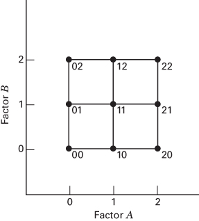
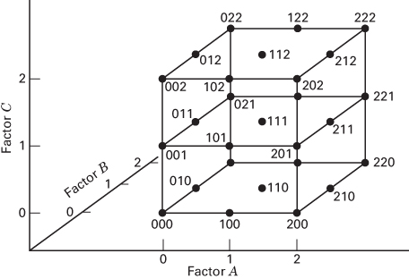
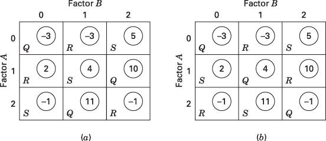
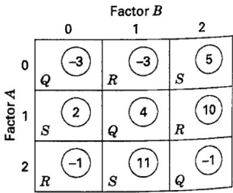
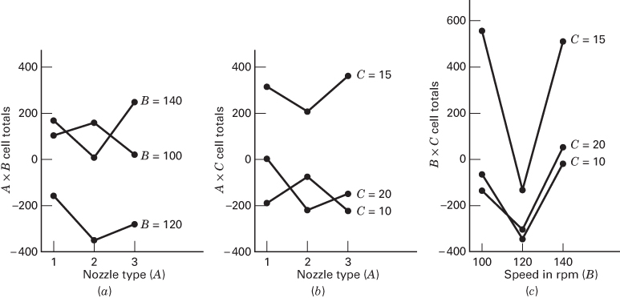
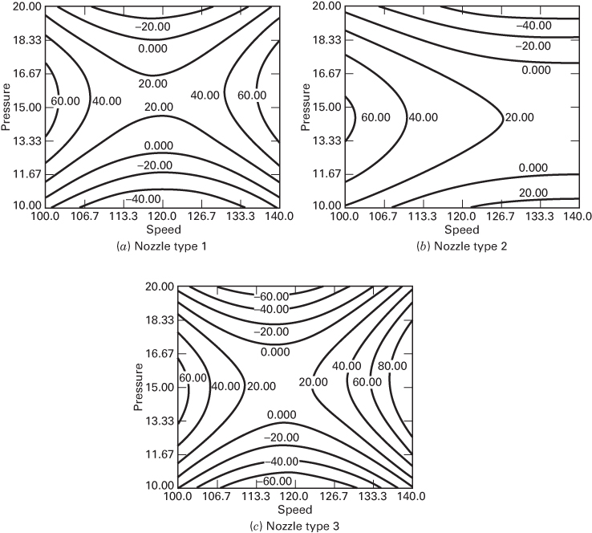

# 9.1 $3^{k}$ 因子设计

## 9.1.1 $3^{k}$ 设计的记号与动机

现在讨论 $3^{k}$ 因子设计，即 $k$ 个因子各取三个水平的因子安排。因子及交互作用用大写字母表示。我们将因子的三个水平称为低、中、高水平。水平可以用不同方式记号，其中一种是用数字 0（低）、1（中）、2（高）表示。$3^{k}$ 设计中的每个处理组合用 $k$ 位数字表示：第一位是因子 A 的水平，第二位是因子 B 的水平，依此类推。例如，在 $3^{2}$ 设计中，00 表示 A、B 均取低水平，01 表示 A 取低水平、B 取中水平。图 9.1、9.2 分别用这种记号表示 $3^{2}$ 和 $3^{3}$ 设计的几何结构。

先前的 $2^{k}$ 设计也可以采用类似记号，用 0、1 代替 $-1$、$+1$。但在 $2^{k}$ 设计中，我们更偏好 $\pm1$ 记号，因为它便于从几何角度理解设计，也能直接用于回归建模、区组安排和分式因子设计的构造。

在 $3^{k}$ 设计中，如果因子是定量的，我们常用 $-1,0,+1$ 分别表示低、中、高水平。这有利于拟合响应与因子水平之间的回归模型。例如，对图 9.1 的 $3^{2}$ 设计，令 $x_1$ 表示因子 A，$x_2$ 表示因子 B，该设计支持如下回归模型：

$$
y=\beta_0+\beta_1x_1+\beta_2x_2+\beta_{12}x_1x_2+\beta_{11}x_1^2+\beta_{22}x_2^2+\epsilon.\tag{9.1}
$$

增加第三个因子水平后，便可以用二次模型描述响应与设计因子之间的关系。

**图 9.1** $3^{2}$ 设计中的处理组合

**图 9.2** $3^{3}$ 设计中的处理组合

关注响应函数曲率的试验者当然可以选择 $3^{k}$ 设计，但还应考虑两点：

1. 对二次关系建模，$3^{k}$ 设计并不是效率最高的方法；第 11 章讨论的响应面设计通常更合适。
2. 如第 6 章所述，在 $2^{k}$ 设计中加入中心点，是判断是否存在曲率的有效方法。这样既能保持设计规模和复杂度较低，又能在一定程度上防范曲率影响。如果曲率确实重要，再增加轴点试验，便可得到图 6.37 所示的中心复合设计。对定量因子而言，这种序贯试验策略比直接实施 $3^{k}$ 因子设计高效得多。

## 9.1.2 $3^{2}$ 设计

$3^{k}$ 系列中最简单的是 $3^{2}$ 设计，即两个因子各取三个水平；其处理组合见图 9.1。$3^{2}=9$ 个处理组合之间共有 8 个自由度。A、B 的主效应各有 2 个自由度，AB 交互作用有 4 个自由度。若重复 $n$ 次，则总自由度为 $n3^{2}-1$，误差自由度为 $3^{2}(n-1)$。

A、B 和 AB 的平方和可以用第 5 章介绍的常规因子设计方法计算。若因子是定量的，则如式（9.1）所示，每个主效应可分为线性与二次两个分量，各占 1 个自由度；对定性因子，这种分解没有实际意义。

两因子交互作用 AB 可以用两种方式分解。第一种适用于 A、B 都是定量因子的情形：将 AB 分为 $AB_{L\times L}$、$AB_{L\times Q}$、$AB_{Q\times L}$、$AB_{Q\times Q}$ 四个各占 1 个自由度的分量。按例 5.5 的方法，分别拟合 $\beta_{12}x_1x_2$、$\beta_{122}x_1x_2^2$、$\beta_{112}x_1^2x_2$、$\beta_{1122}x_1^2x_2^2$ 即可。对于刀具寿命数据，相应的平方和分别为 8.00、42.67、2.67 和 8.00。由于这是正交分解，$SS_{AB}=8.00+42.67+2.67+8.00=61.34$。

第二种方法基于正交拉丁方，不要求因子是定量的，通常用于因子均为定性变量的情况。考虑例 5.5 中各处理组合的总和，它们是图 9.3 方格中的圈内数字。因子 A、B 分别对应一个 $3\times3$ 拉丁方的行和列。图 9.3 将两个特定的 $3\times3$ 拉丁方叠加在单元格总和上。

（a）

（b）

**图 9.3** 例 5.5 各处理组合的总和及叠加的两个正交拉丁方

这两个拉丁方是正交的：将它们叠加后，第一个方中的每个字母与第二个方中的每个字母都恰好配对一次。在方（a）中，字母的总和为 $Q=18,R=-2,S=8$，其组间平方和为

$$
\frac{18^2+(-2)^2+8^2}{3(2)}-\frac{24^2}{9(2)}=33.34,
$$

占 2 个自由度。在方（b）中，$Q=0,R=6,S=18$，相应平方和为

$$
\frac{0^2+6^2+18^2}{3(2)}-\frac{24^2}{9(2)}=28.00,
$$

也占 2 个自由度。两部分相加得到 $33.34+28.00=61.34=SS_{AB}$，自由度合计为 $2+2=4$。

通常把方（a）计算的平方和称为 AB 交互作用分量，把方（b）计算的称为 $AB^2$ 交互作用分量，两者各占 2 个自由度。这些名称来自如下模 3 关系。用 $x_1,x_2\in\{0,1,2\}$ 分别表示 A、B 的水平时，两方中字母所在单元格满足：[^1]

| 字母 | 方（a）：$x_1+x_2$（模 3） | 方（b）：$x_1+2x_2$（模 3） |
| --- | ---: | ---: |
| Q | 0 | 0 |
| R | 1 | 2 |
| S | 2 | 1 |

例如，方（b）的中央格有 $x_1=x_2=1$，故 $x_1+2x_2=1+2=3\equiv0\pmod 3$，该格放置 Q。对 $A^pB^q$ 一类表达式，约定首字母的指数只能是 1；如果不是 1，就将整个表达式平方，再将指数按模 3 化简。例如

$$
A^2B=(A^2B)^2=A^4B^2=AB^2.
$$

AB 与 $AB^2$ 两个分量本身没有实际物理意义，通常也不列在方差分析表中。然而，将 AB 任意分成两个正交的、各占 2 个自由度的分量，有助于构造更复杂的设计。它们与 $AB_{L\times L}$、$AB_{L\times Q}$、$AB_{Q\times L}$、$AB_{Q\times Q}$ 的平方和分解之间没有对应关系。

还可以通过对角线求和计算 AB 和 $AB^2$。在图 9.3 任一方中，沿左上至右下方向分别求和，可得 $-3+4-1=0$、$-3+10-1=6$、$5+11+2=18$，其组间平方和为 $28.00$，即 $AB^2$ 分量。沿右上至左下方向求和，可得 $5+4-1=8$、$-3+2-1=-2$、$-3+11+10=18$，其平方和为 $33.34$，即 AB 分量。Yates 分别称其为交互作用的 I 分量和 J 分量。以下两套记号可以互换：

$$
I(AB)=AB^2,\qquad J(AB)=AB.
$$

有关三水平设计平方和分解的更多内容，可参见本章补充材料。

## 9.1.3 $3^{3}$ 设计

现在考虑三个因子 A、B、C 各取三个水平的因子试验，即 $3^{3}$ 设计。其试验安排与处理组合记号见图 9.2。27 个处理组合共有 26 个自由度。每个主效应占 2 个自由度，每个两因子交互作用占 4 个自由度，三因子交互作用占 8 个自由度。若重复 $n$ 次，总自由度为 $n3^{3}-1$，误差自由度为 $3^{3}(n-1)$。

平方和可用常规因子设计方法计算。若因子是定量的，每个主效应可分为线性和二次分量，各占 1 个自由度；两因子交互作用可分为“线性×线性”“线性×二次”“二次×线性”“二次×二次”四个分量。三因子交互作用 ABC 则可分为“线性×线性×线性”“线性×线性×二次”等八个各占 1 个自由度的分量，不过这种进一步分解通常用途不大。

两因子交互作用也可分成 I、J 分量，分别记为 $AB,AB^2,AC,AC^2,BC,BC^2$，各占 2 个自由度。与 $3^{2}$ 设计中一样，这些分量没有直接的物理意义。

三因子交互作用 ABC 可以分成四个彼此正交、各占 2 个自由度的分量，通常称为 W、X、Y、Z 分量；它们依次也记作 $AB^2C^2,AB^2C,ABC^2,ABC$：

$$
W(ABC)=AB^2C^2,\quad X(ABC)=AB^2C,\quad Y(ABC)=ABC^2,\quad Z(ABC)=ABC.
$$

与前述约定一致，首字母的指数只能是 1。W、X、Y、Z 与 I、J 分量一样，没有直接的实际解释，但有助于构造更复杂的设计。

## 例 9.1

一台机器用于向容量为 5 加仑的金属容器灌装软饮料糖浆。感兴趣的响应是起泡导致的糖浆损失量。可能影响起泡的因子有三个：喷嘴类型（A）、灌装速度（B）和操作压力（C）。分别选取三种喷嘴、三个速度和三个压力水平，进行两次 $3^{3}$ 因子试验的重复。编码后的数据见表 9.1。

**表 9.1** 例 9.1 的糖浆损失数据（单位：立方厘米，数值减去 70）

<table><tr><td rowspan="4">压力（psi）（C）</td><td colspan="9">喷嘴类型（A）</td></tr><tr><td colspan="3">1</td><td colspan="3">2</td><td colspan="3">3</td></tr><tr><td colspan="9">速度（rpm）（B）</td></tr><tr><td>100</td><td>120</td><td>140</td><td>100</td><td>120</td><td>140</td><td>100</td><td>120</td><td>140</td></tr><tr><td>10</td><td>-35</td><td>-45</td><td>-40</td><td>17</td><td>-65</td><td>20</td><td>-39</td><td>-55</td><td>15</td></tr><tr><td></td><td>-25</td><td>-60</td><td>15</td><td>24</td><td>-58</td><td>4</td><td>-35</td><td>-67</td><td>-30</td></tr><tr><td>15</td><td>110</td><td>-10</td><td>80</td><td>55</td><td>-55</td><td>110</td><td>90</td><td>-28</td><td>110</td></tr><tr><td></td><td>75</td><td>30</td><td>54</td><td>120</td><td>-44</td><td>44</td><td>113</td><td>-26</td><td>135</td></tr><tr><td>20</td><td>4</td><td>-40</td><td>31</td><td>-23</td><td>-64</td><td>-20</td><td>-30</td><td>-61</td><td>54</td></tr><tr><td></td><td>5</td><td>-30</td><td>36</td><td>-5</td><td>-62</td><td>-31</td><td>-55</td><td>-52</td><td>4</td></tr></table>

用常规方法计算各平方和，所得方差分析见表 9.2。灌装速度和操作压力在统计上显著，三个两因子交互作用也都显著。图 9.4 给出了这些两因子交互作用的图形分析。中等灌装速度表现最好；喷嘴类型 2、3，以及较低（10 psi）或较高（20 psi）的操作压力，似乎最有利于减少糖浆损失。

**表 9.2** 糖浆损失数据的方差分析

<table><tr><td>变异来源</td><td>平方和</td><td>自由度</td><td>均方</td><td> $F_0$ </td><td>P 值</td></tr><tr><td>A，喷嘴</td><td>993.77</td><td>2</td><td>496.89</td><td>1.17</td><td>0.3256</td></tr><tr><td>B，速度</td><td>61,190.33</td><td>2</td><td>30,595.17</td><td>71.74</td><td>&lt; 0.0001</td></tr><tr><td>C，压力</td><td>69,105.33</td><td>2</td><td>34,552.67</td><td>81.01</td><td>&lt; 0.0001</td></tr><tr><td>AB</td><td>6,300.90</td><td>4</td><td>1,575.22</td><td>3.69</td><td>0.0160</td></tr><tr><td>AC</td><td>7,513.90</td><td>4</td><td>1,878.47</td><td>4.40</td><td>0.0072</td></tr><tr><td>BC</td><td>12,854.34</td><td>4</td><td>3,213.58</td><td>7.53</td><td>0.0003</td></tr><tr><td>ABC</td><td>4,628.76</td><td>8</td><td>578.60</td><td>1.36</td><td>0.2580</td></tr><tr><td>误差</td><td>11,515.50</td><td>27</td><td>426.50</td><td></td><td></td></tr><tr><td>总计</td><td>174,102.83</td><td>53</td><td></td><td></td><td></td></tr></table>

**图 9.4** 例 9.1 中的两因子交互作用

例 9.1 展示了三水平设计的一种常见用途：至少一个因子是自然具有三个水平的定性因子，其余因子是定量的。假设这里只关注三种喷嘴类型，那么喷嘴就是必须设置三个水平的定性因子；灌装速度和操作压力则是定量因子。因此，可在每种喷嘴类型下，分别针对速度和压力拟合式（9.1）那样的二次模型。

表 9.3 给出了这些二次回归模型。模型中的 $\beta$ 系数由标准线性回归程序估计（第 10 章将进一步讨论最小二乘回归）。变量 $x_1,x_2$ 采用前述 $-1,0,+1$ 编码；速度和压力的自然水平如下：

<table><tr><td>编码水平</td><td>速度（rpm）</td><td>压力（psi）</td></tr><tr><td>-1</td><td>100</td><td>10</td></tr><tr><td>0</td><td>120</td><td>15</td></tr><tr><td>+1</td><td>140</td><td>20</td></tr></table>

**表 9.3** 例 9.1 的回归模型

<table><tr><td>喷嘴类型</td><td> $x_1$ =Speed (S),  $x_2$ =Pressure (P)（编码单位）</td></tr><tr><td>1</td><td> $\hat{y} = 22.1 + 3.5x_1 + 16.3x_2 + 51.7x_1^2 - 71.8x_2^2 + 2.9x_1x_2$  $\hat{y} = 1217.3 - 31.256S + 86.017P + 0.12917S^2 - 2.8733P^2 + 0.02875SP$ </td></tr><tr><td>2</td><td> $\hat{y} = 25.6 - 22.8x_1 - 12.3x_2 + 14.1x_1^2 - 56.9x_2^2 - 0.7x_1x_2$  $\hat{y} = 180.1 - 9.475S + 66.75P + 0.035S^2 - 2.2767P^2 - 0.0075SP$ </td></tr><tr><td>3</td><td> $\hat{y} = 15.1 + 20.3x_1 + 5.9x_2 + 75.8x_1^2 - 94.9x_2^2 + 10.5x_1x_2$  $\hat{y} = 1940.1 - 46.058S + 102.48P + 0.18958S^2 - 3.7967P^2 + 0.105SP$ </td></tr></table>

表 9.3 同时用编码变量与速度、压力的自然单位给出模型。图 9.5 是不同喷嘴类型下，糖浆损失量随速度和压力变化的等值线图。这些图提供了有关灌装系统表现的许多信息。由于目标是使损失最小，喷嘴类型 3 是较好的选择：最低的观测等值线（$-60$）只出现在它的图上。灌装速度宜接近中等水平 120 rpm，操作压力宜取低水平或高水平。

**图 9.5** 例 9.1 中三种喷嘴类型下，糖浆损失量（立方厘米，数值减去 70）随速度和压力变化的等值线

当试验同时包含定量与定性因子时，定量因子的响应面形状往往随定性因子的水平而变化。图 9.5 中就能看到这种迹象：与喷嘴类型 1、3 相比，喷嘴类型 2 的响应面明显更狭长。这意味着定量因子与定性因子之间存在交互作用，因此在定性因子的不同水平下，定量因子的最优操作条件及其他重要结论可能明显不同。

用例 9.1 的数据还能演示 ABC 交互作用在数值上如何分解为四个正交的、各占 2 个自由度的分量。一般方法见 Davies（1956）及 Cochran 和 Cox（1957）。先从三个因子中选两个，例如 AB；然后在第三个因子 C 的每个水平下，计算 AB 交互作用的 I、J 对角线总和：

<table><tr><td rowspan="2">C</td><td colspan="4">A</td><td colspan="2">总和</td></tr><tr><td>B</td><td>1</td><td>2</td><td>3</td><td>I</td><td>J</td></tr><tr><td rowspan="3">10</td><td>100</td><td>-60</td><td>41</td><td>-74</td><td>-198</td><td>-222</td></tr><tr><td>120</td><td>-105</td><td>-123</td><td>-122</td><td>-106</td><td>-79</td></tr><tr><td>140</td><td>-25</td><td>24</td><td>-15</td><td>-155</td><td>-158</td></tr><tr><td rowspan="3">15</td><td>100</td><td>185</td><td>175</td><td>203</td><td>331</td><td>238</td></tr><tr><td>120</td><td>20</td><td>-99</td><td>-54</td><td>255</td><td>440</td></tr><tr><td>140</td><td>134</td><td>154</td><td>245</td><td>377</td><td>285</td></tr><tr><td rowspan="3">20</td><td>100</td><td>9</td><td>-28</td><td>-85</td><td>-59</td><td>-144</td></tr><tr><td>120</td><td>-70</td><td>-126</td><td>-113</td><td>-74</td><td>-40</td></tr><tr><td>140</td><td>67</td><td>-51</td><td>58</td><td>-206</td><td>-155</td></tr></table>

再把各个 $I(AB)$、$J(AB)$ 总和分别与因子 C 排成双向表，并计算新表中的 I、J 对角线总和：

<table><tr><td rowspan="2">C</td><td rowspan="2"></td><td rowspan="2">I(AB)</td><td rowspan="2"></td><td colspan="2">总和</td><td rowspan="2">C</td><td rowspan="2"></td><td rowspan="2">J(AB)</td><td rowspan="2"></td><td colspan="2">总和</td></tr><tr><td>I</td><td>J</td><td>I</td><td>J</td></tr><tr><td>10</td><td>-198</td><td>-106</td><td>-155</td><td>-149</td><td>41</td><td>10</td><td>-222</td><td>-79</td><td>-158</td><td>63</td><td>138</td></tr><tr><td>15</td><td>331</td><td>255</td><td>377</td><td>212</td><td>19</td><td>15</td><td>238</td><td>440</td><td>285</td><td>62</td><td>4</td></tr><tr><td>20</td><td>-59</td><td>-74</td><td>-206</td><td>102</td><td>105</td><td>20</td><td>-144</td><td>-40</td><td>-155</td><td>40</td><td>23</td></tr></table>

所得四组对角线总和，分别对应 $I[I(AB)\times C]=AB^2C^2$、$J[I(AB)\times C]=AB^2C$、$I[J(AB)\times C]=ABC^2$、$J[J(AB)\times C]=ABC$，即 ABC 的 W、X、Y、Z 分量。按常规方法计算平方和：

$$
\begin{aligned}
SS_{W(ABC)}&=\frac{(-149)^2+212^2+102^2}{18}-\frac{165^2}{54}=3804.11,\\
SS_{X(ABC)}&=\frac{41^2+19^2+105^2}{18}-\frac{165^2}{54}=221.77,\\
SS_{Y(ABC)}&=\frac{63^2+62^2+40^2}{18}-\frac{165^2}{54}=18.77,\\
SS_{Z(ABC)}&=\frac{138^2+4^2+23^2}{18}-\frac{165^2}{54}=584.11.
\end{aligned}
$$

这确实是正交分解，四项相加为 $SS_{ABC}=4628.76$；但如前所述，通常不在方差分析表中展示这一分解。后续章节将讨论偶尔需要计算其中一个或多个分量的情形。

## 9.1.4 一般 $3^{k}$ 设计

$3^{2}$ 与 $3^{3}$ 设计中的概念可以直接推广到 $k$ 个因子各取三个水平的 $3^{k}$ 因子设计。处理组合仍用数字记号表示。例如，在 $3^{4}$ 设计中，0120 表示 A、D 取低水平，B 取中水平，C 取高水平。共有 $3^{k}$ 个处理组合，它们之间有 $3^{k}-1$ 个自由度。由此可计算 $k$ 个各占 2 个自由度的主效应、$\binom{k}{2}$ 个各占 4 个自由度的两因子交互作用，直至一个占 $2^{k}$ 个自由度的 $k$ 因子交互作用。一般而言，$h$ 因子交互作用有 $2^{h}$ 个自由度。若重复 $n$ 次，总自由度为 $n3^{k}-1$，误差自由度为 $3^{k}(n-1)$。

各效应与交互作用的平方和仍按常规因子设计方法计算。通常不再进一步分解三因子及更高阶交互作用；不过，任意 $h$ 因子交互作用都包含 $2^{h-1}$ 个相互正交、各占 2 个自由度的分量。例如，四因子交互作用 ABCD 有 8 个这样的分量，记为 $ABCD^2,ABC^2D,AB^2CD,ABCD,ABC^2D^2,AB^2C^2D,AB^2CD^2,AB^2C^2D^2$。记号中的首字母指数只能是 1；否则，应将整个表达式平方并对指数按模 3 化简。例如，

$$
A^2BCD=(A^2BCD)^2=A^4B^2C^2D^2=AB^2C^2D^2.
$$

这些交互作用分量没有物理解释，但有助于构造更复杂的设计。

随着 $k$ 增大，设计规模迅速膨胀。一次重复的 $3^3$ 设计有 27 个处理组合，$3^4$ 有 81 个，$3^5$ 有 243 个。因此，实际中常只考虑一次重复，并合并高阶交互作用来估计误差。例如，若三因子及更高阶交互作用可以忽略，则一次重复的 $3^3$ 设计提供 8 个误差自由度，$3^4$ 设计提供 48 个。即便如此，对 $k\geq3$ 来说，这些设计仍相当庞大，因而用途有限。

[^1]: 译者注：原文模 3 对照式中，方（b）的 S 行印作 $x_1=2x_2=1$，与其余两行的形式及图示不符；此处按 $x_1+2x_2\equiv1\pmod3$ 整理。
