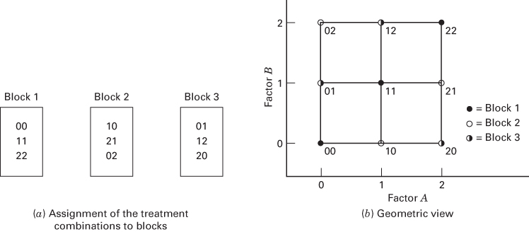
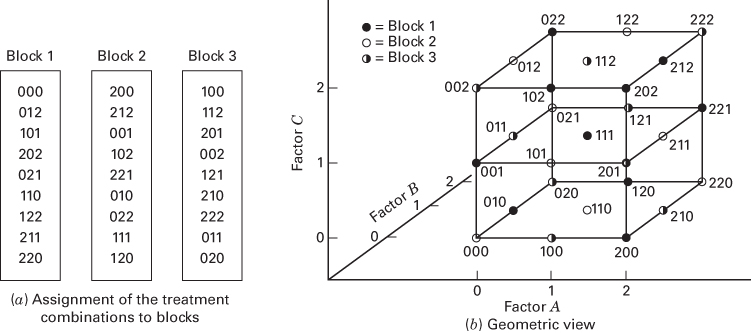
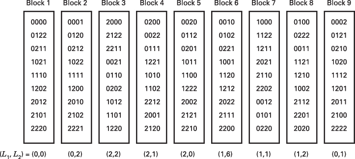

# 9.2 $3^{k}$ 因子设计中的混杂

即使只做一次 $3^k$ 设计，试验次数也可能多到无法在完全一致的条件下完成，因此通常需要安排区组并使某些效应与区组混杂。$3^k$ 设计可安排在 $3^p$ 个不完全区组中（$p<k$），例如三个区组或九个区组。

## 9.2.1 将 $3^{k}$ 设计安排在三个区组中

三个区组之间有 2 个自由度，因此必须有 2 个效应自由度与区组混杂。在 $3^k$ 系列中，每个主效应有 2 个自由度；每个两因子交互作用有 4 个自由度，可拆成两个各占 2 个自由度的分量（如 AB、$AB^2$）；每个三因子交互作用有 8 个自由度，可拆成四个各占 2 个自由度的分量（如 ABC、$ABC^2$、$AB^2C$、$AB^2C^2$）。因此，用一个交互作用分量与区组混杂很方便。

一般做法是构造**定义对比**：

$$
L=\alpha_1x_1+\alpha_2x_2+\cdots+\alpha_kx_k.\tag{9.2}
$$

其中，$\alpha_i$ 是待混杂效应中第 $i$ 个因子的指数，$x_i$ 是某个处理组合中该因子的水平。对 $3^k$ 系列，$\alpha_i\in\{0,1,2\}$，且首个非零 $\alpha_i$ 取 1；$x_i=0,1,2$ 分别表示低、中、高水平。按 $L$ 模 3 的值将处理组合分配到区组。因为余数只有 0、1、2，所以恰好定义三个区组。满足 $L\equiv0\pmod3$ 的处理组合构成**主区组**，其中必含 $00\cdots0$。

例如，将 $3^2$ 设计安排在三个区组中，可任选 AB 或 $AB^2$ 与区组混杂。若选 $AB^2$，定义对比为

$$
L=x_1+2x_2.
$$

逐个计算处理组合的 $L$（模 3），得到

| $L\bmod3$ | 处理组合 | 对应区组 |
| ---: | --- | --- |
| 0 | 00、11、22 | 1（主区组） |
| 1 | 10、21、02 | 2 |
| 2 | 01、12、20 | 3 |

例如 $L(11)=1+2=3\equiv0$，$L(21)=2+2=4\equiv1$，$L(20)=2\equiv2$。区组安排见图 9.6。

主区组的元素对模 3 加法构成一个群。例如 $11+11=22$，$11+22=00$（均逐位按模 3 计算）。其他区组可以从主区组生成：选取新区组的任一元素，并将它逐位模 3 加到主区组的所有元素上。对区组 2 选 10，得到 $10+00=10$、$10+11=21$、$10+22=02$；对区组 3 选 01，得到 $01+00=01$、$01+11=12$、$01+22=20$。

**图 9.6** $AB^2$ 与区组混杂时，分为三个区组的 $3^2$ 设计：（a）处理组合的区组分配；（b）几何表示

## 例 9.2

用图 9.6 所示 $3^2$ 设计的一次重复数据，说明分为三个区组后的统计分析：

| 区组 1 | 观测值 | 区组 2 | 观测值 | 区组 3 | 观测值 |
| --- | ---: | --- | ---: | --- | ---: |
| 00 | 4 | 10 | $-2$ | 01 | 5 |
| 11 | $-4$ | 21 | 1 | 12 | $-5$ |
| 22 | 0 | 02 | 8 | 20 | 0 |
| **区组总和** | **0** | **区组总和** | **7** | **区组总和** | **0** |

常规因子设计分析给出 $SS_A=131.56$、$SS_B=0.22$。区组平方和为

$$
SS_{\mathrm{Blocks}}=\frac{0^2+7^2+0^2}{3}-\frac{7^2}{9}=10.89.
$$

它恰好等于交互作用的 $AB^2$ 分量平方和。将观测值按 A、B 水平排列为

<table><tr><td rowspan="2" colspan="2"></td><td colspan="3">因子 B</td></tr><tr><td>0</td><td>1</td><td>2</td></tr><tr><td rowspan="3">因子 A</td><td>0</td><td>4</td><td>5</td><td>8</td></tr><tr><td>1</td><td>-2</td><td>-4</td><td>-5</td></tr><tr><td>2</td><td>0</td><td>1</td><td>0</td></tr></table>

按 9.1.2 节的方法，沿左上至右下的对角线求和，再计算组间平方和，得到

$$
SS_{AB^2}=\frac{0^2+0^2+7^2}{3}-\frac{7^2}{9}=10.89
=SS_{\mathrm{Blocks}}.
$$

方差分析见表 9.4。由于只有一次重复，无法进行正式显著性检验；也不宜把 AB 分量直接当作误差估计。

**表 9.4** 例 9.2 数据的方差分析

<table><tr><td>变异来源</td><td>平方和</td><td>自由度</td></tr><tr><td>区组（ $AB^{2}$ )</td><td>10.89</td><td>2</td></tr><tr><td>A</td><td>131.56</td><td>2</td></tr><tr><td>B</td><td>0.22</td><td>2</td></tr><tr><td>AB</td><td>2.89</td><td>2</td></tr><tr><td>总计</td><td>145.56</td><td>8</td></tr></table>

再看一个稍复杂的设计：将 $3^3$ 因子设计分为三个区组，每个区组 9 次试验，并使三因子交互作用的 $AB^2C^2$ 分量与区组混杂。定义对比为

$$
L=x_1+2x_2+2x_3.
$$

容易验证，处理组合 000、012 和 101 都满足 $L\equiv0\pmod3$，属于主区组。以它们为起点，对各位数字分别作模 3 加法，可依次生成主区组其余的处理组合：

| 第 1～3 项 | 第 4～6 项 | 第 7～9 项 |
| --- | --- | --- |
| （1）$000$ | （4）$101+101=202$ | （7）$101+021=122$ |
| （2）$012$ | （5）$012+012=021$ | （8）$012+202=211$ |
| （3）$101$ | （6）$101+012=110$ | （9）$021+202=220$ |

为确定另一个区组，注意处理组合 200 不属于主区组。将 200 与主区组的九个处理组合逐位相加，并将每一位的结果按模 3 化简，得到区组 2：

| 第 1～3 项 | 第 4～6 项 | 第 7～9 项 |
| --- | --- | --- |
| （1）$200+000=200$ | （4）$200+202=102$ | （7）$200+122=022$ |
| （2）$200+012=212$ | （5）$200+021=221$ | （8）$200+211=111$ |
| （3）$200+101=001$ | （6）$200+110=010$ | （9）$200+220=120$ |

区组 2 的九个处理组合均满足 $L\equiv2\pmod3$。最后，100 既不属于主区组，也不属于区组 2。用同样的方法将它与主区组的九个处理组合逐位相加，得到区组 3：

| 第 1～3 项 | 第 4～6 项 | 第 7～9 项 |
| --- | --- | --- |
| （1）$100+000=100$ | （4）$100+202=002$ | （7）$100+122=222$ |
| （2）$100+012=112$ | （5）$100+021=121$ | （8）$100+211=011$ |
| （3）$100+101=201$ | （6）$100+110=210$ | （9）$100+220=020$ |

区组 3 的九个处理组合均满足 $L\equiv1\pmod3$。

区组安排见图 9.7。利用这种混杂方式，所有主效应与两因子交互作用的信息都得以保留。三因子交互作用中剩余的 ABC、$AB^2C$、$ABC^2$ 分量可以合并作为误差估计，其平方和也可通过相减得到。一般而言，将 $3^k$ 设计分为三个区组时，通常选择最高阶交互作用的一个分量与区组混杂；先按常规方法计算整个 $k$ 因子交互作用的平方和，再减去区组平方和，即得其余未混杂分量的总平方和。

**图 9.7** $AB^2C^2$ 与区组混杂时，分为三个区组的 $3^3$ 设计

**表 9.5** $AB^2C^2$ 与区组混杂的 $3^3$ 设计的方差分析自由度

<table><tr><td>变异来源</td><td>自由度</td></tr><tr><td>区组（AB2C2)</td><td>2</td></tr><tr><td>A</td><td>2</td></tr><tr><td>B</td><td>2</td></tr><tr><td>C</td><td>2</td></tr><tr><td>AB</td><td>4</td></tr><tr><td>AC</td><td>4</td></tr><tr><td>BC</td><td>4</td></tr><tr><td>误差（ABC + AB²C + ABC²）</td><td>6</td></tr><tr><td>总计</td><td>26</td></tr></table>

## 9.2.2 将 $3^{k}$ 设计安排在九个区组中

有些试验需要把 $3^k$ 设计分为九个区组。这会使 8 个自由度与区组混杂。构造时先选择两个交互作用分量，它们的两个**广义交互作用**也会自动与区组混杂，于是共有四个各占 2 个自由度的分量。对 $3^k$ 系列，效应 P、Q 的两个广义交互作用定义为 $PQ$ 与 $PQ^2$（或等价的 $P^2Q$）。

最初选择的两个分量给出两个定义对比：

$$
\begin{aligned}
L_1&=\alpha_1x_1+\alpha_2x_2+\cdots+\alpha_kx_k\equiv u\pmod3,\\
L_2&=\beta_1x_1+\beta_2x_2+\cdots+\beta_kx_k\equiv h\pmod3,
\end{aligned}\qquad u,h\in\{0,1,2\}.\tag{9.3}
$$

$\alpha_i$、$\beta_i$ 分别是两个效应中的指数，均约定首个非零指数为 1。$(L_1,L_2)$ 的九种取值组合定义九个区组；两处理组合若具有相同的取值对，就分到同一区组。主区组满足 $L_1\equiv L_2\equiv0\pmod3$。其元素对模 3 加法构成群，所以可沿用 9.2.1 节的方法生成所有区组。

例如，将 $3^4$ 设计分为九个区组，每组 9 次试验。若选 ABC 与 $AB^2D^2$ 混杂，其广义交互作用为

$$
(ABC)(AB^2D^2)=AC^2D,\qquad
(ABC)(AB^2D^2)^2=BC^2D^2.
$$

前两个效应的定义对比分别是

$$
L_1=x_1+x_2+x_3,\qquad L_2=x_1+2x_2+2x_4.\tag{9.4}
$$

由式（9.4）和主区组的群结构构造九个区组，见图 9.8。一般地，$3^k$ 设计分为九个区组时，会有四个交互作用分量与区组混杂。对于含这些分量的交互作用，可从完整交互作用平方和中减去混杂分量的平方和，得到其余未混杂分量的总平方和；必要时可用 9.1.3 节的方法分别计算。

**图 9.8** $ABC$、$AB^2D^2$、$AC^2D$、$BC^2D^2$ 与区组混杂时，分为九个区组的 $3^4$ 设计

## 9.2.3 将 $3^{k}$ 设计安排在 $3^{p}$ 个区组中

$3^k$ 因子设计可分为 $3^p$ 个区组，每组有 $3^{k-p}$ 次观测（$p<k$）。先选取 $p$ 个彼此独立的效应与区组混杂，由此还会自动混杂 $(3^p-2p-1)/2$ 个广义交互作用。

例如，把 $3^7$ 设计分为 27 个区组时，$p=3$。选择三个独立的交互作用分量后，还会自动混杂 $[3^3-2(3)-1]/2=10$ 个分量。若先选 $ABC^2DG$、$BCE^2F^2G$ 与 BDEFG，则可据此建立三个定义对比，再按前述方法生成 27 个区组。自动混杂的另外十个分量为

$$
\begin{gathered}
AB^2DE^2F^2G^2,\quad ACDEF,\quad AB^2C^2D^2EFG^2,\quad AC^2E^2F^2,\\
BC^2D^2G,\quad CD^2EF,\quad AD^2,\quad AB^2CG^2,\quad ABCD^2E^2F^2G,\quad ABEFG.
\end{gathered}
$$

这是一个规模庞大的设计：共需 $3^7=2187$ 次观测，安排在 27 个区组中，每组 81 次。

